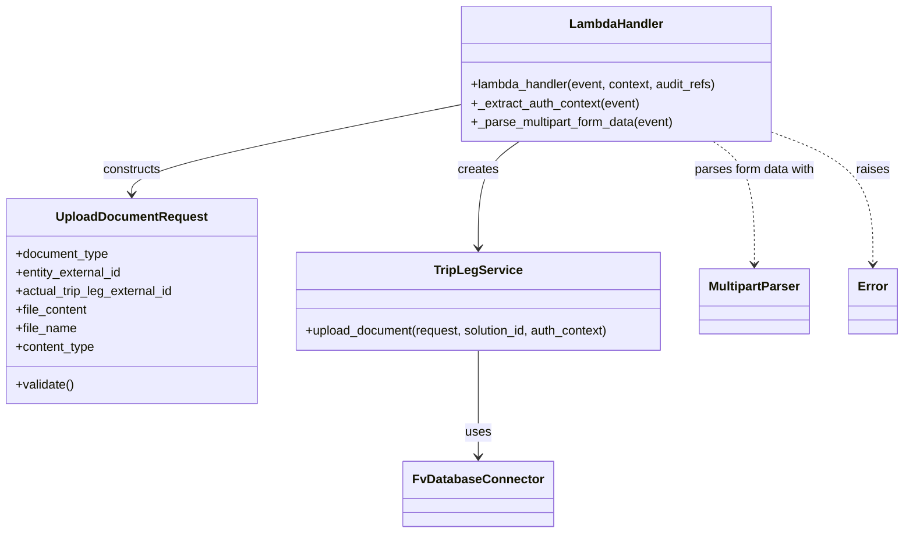

# Diagram: entity_core/entity_service/entity_service/trip_leg/associate_documents/handler.py


> Auto-generated by Obscura crawlers

## Diagram 1



### SVG

<svg id="container" width="1164.7265625" xmlns="http://www.w3.org/2000/svg" class="classDiagram" height="686" viewBox="0 0 1164.7265625 686" role="graphics-document document" aria-roledescription="class"><style>#container{font-family:"trebuchet ms",verdana,arial,sans-serif;font-size:16px;fill:#333;}@keyframes edge-animation-frame{from{stroke-dashoffset:0;}}@keyframes dash{to{stroke-dashoffset:0;}}#container .edge-animation-slow{stroke-dasharray:9,5!important;stroke-dashoffset:900;animation:dash 50s linear infinite;stroke-linecap:round;}#container .edge-animation-fast{stroke-dasharray:9,5!important;stroke-dashoffset:900;animation:dash 20s linear infinite;stroke-linecap:round;}#container .error-icon{fill:#552222;}#container .error-text{fill:#552222;stroke:#552222;}#container .edge-thickness-normal{stroke-width:1px;}#container .edge-thickness-thick{stroke-width:3.5px;}#container .edge-pattern-solid{stroke-dasharray:0;}#container .edge-thickness-invisible{stroke-width:0;fill:none;}#container .edge-pattern-dashed{stroke-dasharray:3;}#container .edge-pattern-dotted{stroke-dasharray:2;}#container .marker{fill:#333333;stroke:#333333;}#container .marker.cross{stroke:#333333;}#container svg{font-family:"trebuchet ms",verdana,arial,sans-serif;font-size:16px;}#container p{margin:0;}#container g.classGroup text{fill:#9370DB;stroke:none;font-family:"trebuchet ms",verdana,arial,sans-serif;font-size:10px;}#container g.classGroup text .title{font-weight:bolder;}#container .nodeLabel,#container .edgeLabel{color:#131300;}#container .edgeLabel .label rect{fill:#ECECFF;}#container .label text{fill:#131300;}#container .labelBkg{background:#ECECFF;}#container .edgeLabel .label span{background:#ECECFF;}#container .classTitle{font-weight:bolder;}#container .node rect,#container .node circle,#container .node ellipse,#container .node polygon,#container .node path{fill:#ECECFF;stroke:#9370DB;stroke-width:1px;}#container .divider{stroke:#9370DB;stroke-width:1;}#container g.clickable{cursor:pointer;}#container g.classGroup rect{fill:#ECECFF;stroke:#9370DB;}#container g.classGroup line{stroke:#9370DB;stroke-width:1;}#container .classLabel .box{stroke:none;stroke-width:0;fill:#ECECFF;opacity:0.5;}#container .classLabel .label{fill:#9370DB;font-size:10px;}#container .relation{stroke:#333333;stroke-width:1;fill:none;}#container .dashed-line{stroke-dasharray:3;}#container .dotted-line{stroke-dasharray:1 2;}#container #compositionStart,#container .composition{fill:#333333!important;stroke:#333333!important;stroke-width:1;}#container #compositionEnd,#container .composition{fill:#333333!important;stroke:#333333!important;stroke-width:1;}#container #dependencyStart,#container .dependency{fill:#333333!important;stroke:#333333!important;stroke-width:1;}#container #dependencyStart,#container .dependency{fill:#333333!important;stroke:#333333!important;stroke-width:1;}#container #extensionStart,#container .extension{fill:transparent!important;stroke:#333333!important;stroke-width:1;}#container #extensionEnd,#container .extension{fill:transparent!important;stroke:#333333!important;stroke-width:1;}#container #aggregationStart,#container .aggregation{fill:transparent!important;stroke:#333333!important;stroke-width:1;}#container #aggregationEnd,#container .aggregation{fill:transparent!important;stroke:#333333!important;stroke-width:1;}#container #lollipopStart,#container .lollipop{fill:#ECECFF!important;stroke:#333333!important;stroke-width:1;}#container #lollipopEnd,#container .lollipop{fill:#ECECFF!important;stroke:#333333!important;stroke-width:1;}#container .edgeTerminals{font-size:11px;line-height:initial;}#container .classTitleText{text-anchor:middle;font-size:18px;fill:#333;}#container .label-icon{display:inline-block;height:1em;overflow:visible;vertical-align:-0.125em;}#container .node .label-icon path{fill:currentColor;stroke:revert;stroke-width:revert;}#container :root{--mermaid-font-family:"trebuchet ms",verdana,arial,sans-serif;}</style><g><defs><marker id="container_class-aggregationStart" class="marker aggregation class" refX="18" refY="7" markerWidth="190" markerHeight="240" orient="auto"><path d="M 18,7 L9,13 L1,7 L9,1 Z"></path></marker></defs><defs><marker id="container_class-aggregationEnd" class="marker aggregation class" refX="1" refY="7" markerWidth="20" markerHeight="28" orient="auto"><path d="M 18,7 L9,13 L1,7 L9,1 Z"></path></marker></defs><defs><marker id="container_class-extensionStart" class="marker extension class" refX="18" refY="7" markerWidth="190" markerHeight="240" orient="auto"><path d="M 1,7 L18,13 V 1 Z"></path></marker></defs><defs><marker id="container_class-extensionEnd" class="marker extension class" refX="1" refY="7" markerWidth="20" markerHeight="28" orient="auto"><path d="M 1,1 V 13 L18,7 Z"></path></marker></defs><defs><marker id="container_class-compositionStart" class="marker composition class" refX="18" refY="7" markerWidth="190" markerHeight="240" orient="auto"><path d="M 18,7 L9,13 L1,7 L9,1 Z"></path></marker></defs><defs><marker id="container_class-compositionEnd" class="marker composition class" refX="1" refY="7" markerWidth="20" markerHeight="28" orient="auto"><path d="M 18,7 L9,13 L1,7 L9,1 Z"></path></marker></defs><defs><marker id="container_class-dependencyStart" class="marker dependency class" refX="6" refY="7" markerWidth="190" markerHeight="240" orient="auto"><path d="M 5,7 L9,13 L1,7 L9,1 Z"></path></marker></defs><defs><marker id="container_class-dependencyEnd" class="marker dependency class" refX="13" refY="7" markerWidth="20" markerHeight="28" orient="auto"><path d="M 18,7 L9,13 L14,7 L9,1 Z"></path></marker></defs><defs><marker id="container_class-lollipopStart" class="marker lollipop class" refX="13" refY="7" markerWidth="190" markerHeight="240" orient="auto"><circle stroke="black" fill="transparent" cx="7" cy="7" r="6"></circle></marker></defs><defs><marker id="container_class-lollipopEnd" class="marker lollipop class" refX="1" refY="7" markerWidth="190" markerHeight="240" orient="auto"><circle stroke="black" fill="transparent" cx="7" cy="7" r="6"></circle></marker></defs><g class="root"><g class="clusters"></g><g class="edgePaths"><path d="M596.203,134.831L525.076,148.859C453.949,162.887,311.695,190.944,240.568,210.138C169.441,229.333,169.441,239.667,169.441,244.833L169.441,250" id="id_LambdaHandler_UploadDocumentRequest_1" class="edge-thickness-normal edge-pattern-solid relation" style=";;;" data-edge="true" data-et="edge" data-id="id_LambdaHandler_UploadDocumentRequest_1" data-points="W3sieCI6NTk2LjIwMzEyNSwieSI6MTM0LjgzMDc1NTk0NDM1NTczfSx7IngiOjE2OS40NDE0MDYyNSwieSI6MjE5fSx7IngiOjE2OS40NDE0MDYyNSwieSI6MjU2fV0=" marker-end="url(#container_class-dependencyEnd)"></path><path d="M672.661,182L663.765,188.167C654.87,194.333,637.08,206.667,628.184,229.5C619.289,252.333,619.289,285.667,619.289,302.333L619.289,319" id="id_LambdaHandler_TripLegService_2" class="edge-thickness-normal edge-pattern-solid relation" style=";;;" data-edge="true" data-et="edge" data-id="id_LambdaHandler_TripLegService_2" data-points="W3sieCI6NjcyLjY2MDcyMzI4NjI5MDQsInkiOjE4Mn0seyJ4Ijo2MTkuMjg5MDYyNSwieSI6MjE5fSx7IngiOjYxOS4yODkwNjI1LCJ5IjozMjV9XQ==" marker-end="url(#container_class-dependencyEnd)"></path><path d="M619.289,451L619.289,468.667C619.289,486.333,619.289,521.667,619.289,544.5C619.289,567.333,619.289,577.667,619.289,582.833L619.289,588" id="id_TripLegService_FvDatabaseConnector_3" class="edge-thickness-normal edge-pattern-solid relation" style=";;;" data-edge="true" data-et="edge" data-id="id_TripLegService_FvDatabaseConnector_3" data-points="W3sieCI6NjE5LjI4OTA2MjUsInkiOjQ1MX0seyJ4Ijo2MTkuMjg5MDYyNSwieSI6NTU3fSx7IngiOjYxOS4yODkwNjI1LCJ5Ijo1OTR9XQ==" marker-end="url(#container_class-dependencyEnd)"></path><path d="M923.652,182L932.547,188.167C941.442,194.333,959.233,206.667,968.128,233C977.023,259.333,977.023,299.667,977.023,319.833L977.023,340" id="id_LambdaHandler_MultipartParser_4" class="edge-thickness-normal edge-pattern-dashed relation" style=";;;" data-edge="true" data-et="edge" data-id="id_LambdaHandler_MultipartParser_4" data-points="W3sieCI6OTIzLjY1MTc3NjcxMzcwOTYsInkiOjE4Mn0seyJ4Ijo5NzcuMDIzNDM3NSwieSI6MjE5fSx7IngiOjk3Ny4wMjM0Mzc1LCJ5IjozNDZ9XQ==" marker-end="url(#container_class-dependencyEnd)"></path><path d="M1000.109,171.259L1021.181,179.216C1042.253,187.173,1084.396,203.086,1105.467,231.21C1126.539,259.333,1126.539,299.667,1126.539,319.833L1126.539,340" id="id_LambdaHandler_Error_5" class="edge-thickness-normal edge-pattern-dashed relation" style=";;;" data-edge="true" data-et="edge" data-id="id_LambdaHandler_Error_5" data-points="W3sieCI6MTAwMC4xMDkzNzUsInkiOjE3MS4yNTkxMjk3MzE0MDE1Mn0seyJ4IjoxMTI2LjUzOTA2MjUsInkiOjIxOX0seyJ4IjoxMTI2LjUzOTA2MjUsInkiOjM0Nn1d" marker-end="url(#container_class-dependencyEnd)"></path></g><g class="edgeLabels"><g class="edgeLabel" transform="translate(169.44140625, 219)"><g class="label" data-id="id_LambdaHandler_UploadDocumentRequest_1" transform="translate(-37.84375, -12)"><foreignObject width="75.6875" height="24"><div xmlns="http://www.w3.org/1999/xhtml" class="labelBkg" style="display: table-cell; white-space: nowrap; line-height: 1.5; max-width: 200px; text-align: center;"><span class="edgeLabel"><p>constructs</p></span></div></foreignObject></g></g><g class="edgeLabel" transform="translate(619.2890625, 219)"><g class="label" data-id="id_LambdaHandler_TripLegService_2" transform="translate(-26.171875, -12)"><foreignObject width="52.34375" height="24"><div xmlns="http://www.w3.org/1999/xhtml" class="labelBkg" style="display: table-cell; white-space: nowrap; line-height: 1.5; max-width: 200px; text-align: center;"><span class="edgeLabel"><p>creates</p></span></div></foreignObject></g></g><g class="edgeLabel" transform="translate(619.2890625, 557)"><g class="label" data-id="id_TripLegService_FvDatabaseConnector_3" transform="translate(-16.4921875, -12)"><foreignObject width="32.984375" height="24"><div xmlns="http://www.w3.org/1999/xhtml" class="labelBkg" style="display: table-cell; white-space: nowrap; line-height: 1.5; max-width: 200px; text-align: center;"><span class="edgeLabel"><p>uses</p></span></div></foreignObject></g></g><g class="edgeLabel" transform="translate(977.0234375, 219)"><g class="label" data-id="id_LambdaHandler_MultipartParser_4" transform="translate(-79.2890625, -12)"><foreignObject width="158.578125" height="24"><div xmlns="http://www.w3.org/1999/xhtml" class="labelBkg" style="display: table-cell; white-space: nowrap; line-height: 1.5; max-width: 200px; text-align: center;"><span class="edgeLabel"><p>parses form data with</p></span></div></foreignObject></g></g><g class="edgeLabel" transform="translate(1126.5390625, 219)"><g class="label" data-id="id_LambdaHandler_Error_5" transform="translate(-21.25, -12)"><foreignObject width="42.5" height="24"><div xmlns="http://www.w3.org/1999/xhtml" class="labelBkg" style="display: table-cell; white-space: nowrap; line-height: 1.5; max-width: 200px; text-align: center;"><span class="edgeLabel"><p>raises</p></span></div></foreignObject></g></g></g><g class="nodes"><g class="node default" id="classId-LambdaHandler-0" transform="translate(798.15625, 95)"><g class="basic label-container"><path d="M-201.953125 -87 L201.953125 -87 L201.953125 87 L-201.953125 87" stroke="none" stroke-width="0" fill="#ECECFF" style=""></path><path d="M-201.953125 -87 C-100.4966639294466 -87, 0.9597971411068045 -87, 201.953125 -87 M-201.953125 -87 C-94.49673866976728 -87, 12.959647660465436 -87, 201.953125 -87 M201.953125 -87 C201.953125 -48.556149824858274, 201.953125 -10.112299649716547, 201.953125 87 M201.953125 -87 C201.953125 -41.04493850882623, 201.953125 4.910122982347545, 201.953125 87 M201.953125 87 C77.75947333252648 87, -46.434178334947035 87, -201.953125 87 M201.953125 87 C105.92866918587202 87, 9.90421337174405 87, -201.953125 87 M-201.953125 87 C-201.953125 38.61095951634009, -201.953125 -9.778080967319823, -201.953125 -87 M-201.953125 87 C-201.953125 50.847362237177826, -201.953125 14.694724474355652, -201.953125 -87" stroke="#9370DB" stroke-width="1.3" fill="none" stroke-dasharray="0 0" style=""></path></g><g class="annotation-group text" transform="translate(0, -63)"></g><g class="label-group text" transform="translate(-58.21875, -63)"><g class="label" style="font-weight: bolder" transform="translate(0,-12)"><foreignObject width="116.4375" height="24"><div xmlns="http://www.w3.org/1999/xhtml" style="display: table-cell; white-space: nowrap; line-height: 1.5; max-width: 167px; text-align: center;"><span class="nodeLabel markdown-node-label" style=""><p>LambdaHandler</p></span></div></foreignObject></g></g><g class="members-group text" transform="translate(-189.953125, -15)"></g><g class="methods-group text" transform="translate(-189.953125, 15)"><g class="label" style="" transform="translate(0,-12)"><foreignObject width="321.6875" height="24"><div xmlns="http://www.w3.org/1999/xhtml" style="display: table-cell; white-space: nowrap; line-height: 1.5; max-width: 379px; text-align: center;"><span class="nodeLabel markdown-node-label" style=""><p>+lambda_handler(event, context, audit_refs)</p></span></div></foreignObject></g><g class="label" style="" transform="translate(0,12)"><foreignObject width="218.140625" height="24"><div xmlns="http://www.w3.org/1999/xhtml" style="display: table-cell; white-space: nowrap; line-height: 1.5; max-width: 276px; text-align: center;"><span class="nodeLabel markdown-node-label" style=""><p>+_extract_auth_context(event)</p></span></div></foreignObject></g><g class="label" style="" transform="translate(0,36)"><foreignObject width="264.984375" height="24"><div xmlns="http://www.w3.org/1999/xhtml" style="display: table-cell; white-space: nowrap; line-height: 1.5; max-width: 322px; text-align: center;"><span class="nodeLabel markdown-node-label" style=""><p>+_parse_multipart_form_data(event)</p></span></div></foreignObject></g></g><g class="divider" style=""><path d="M-201.953125 -39 C-43.23434340372367 -39, 115.48443819255266 -39, 201.953125 -39 M-201.953125 -39 C-68.00455733215497 -39, 65.94401033569005 -39, 201.953125 -39" stroke="#9370DB" stroke-width="1.3" fill="none" stroke-dasharray="0 0" style=""></path></g><g class="divider" style=""><path d="M-201.953125 -15 C-79.84158305589777 -15, 42.26995888820446 -15, 201.953125 -15 M-201.953125 -15 C-53.67775871870154 -15, 94.59760756259692 -15, 201.953125 -15" stroke="#9370DB" stroke-width="1.3" fill="none" stroke-dasharray="0 0" style=""></path></g></g><g class="node default" id="classId-UploadDocumentRequest-1" transform="translate(169.44140625, 388)"><g class="basic label-container"><path d="M-161.44140625 -132 L161.44140625 -132 L161.44140625 132 L-161.44140625 132" stroke="none" stroke-width="0" fill="#ECECFF" style=""></path><path d="M-161.44140625 -132 C-76.84202194760127 -132, 7.757362354797465 -132, 161.44140625 -132 M-161.44140625 -132 C-68.95608177196414 -132, 23.529242706071727 -132, 161.44140625 -132 M161.44140625 -132 C161.44140625 -72.09882851931587, 161.44140625 -12.19765703863176, 161.44140625 132 M161.44140625 -132 C161.44140625 -37.264191450338004, 161.44140625 57.47161709932399, 161.44140625 132 M161.44140625 132 C61.492704275982206 132, -38.45599769803559 132, -161.44140625 132 M161.44140625 132 C95.32843949226586 132, 29.215472734531716 132, -161.44140625 132 M-161.44140625 132 C-161.44140625 60.07845437423988, -161.44140625 -11.843091251520235, -161.44140625 -132 M-161.44140625 132 C-161.44140625 73.29138778655326, -161.44140625 14.582775573106503, -161.44140625 -132" stroke="#9370DB" stroke-width="1.3" fill="none" stroke-dasharray="0 0" style=""></path></g><g class="annotation-group text" transform="translate(0, -108)"></g><g class="label-group text" transform="translate(-93.1640625, -108)"><g class="label" style="font-weight: bolder" transform="translate(0,-12)"><foreignObject width="186.328125" height="24"><div xmlns="http://www.w3.org/1999/xhtml" style="display: table-cell; white-space: nowrap; line-height: 1.5; max-width: 235px; text-align: center;"><span class="nodeLabel markdown-node-label" style=""><p>UploadDocumentRequest</p></span></div></foreignObject></g></g><g class="members-group text" transform="translate(-149.44140625, -60)"><g class="label" style="" transform="translate(0,-12)"><foreignObject width="121.078125" height="24"><div xmlns="http://www.w3.org/1999/xhtml" style="display: table-cell; white-space: nowrap; line-height: 1.5; max-width: 178px; text-align: center;"><span class="nodeLabel markdown-node-label" style=""><p>+document_type</p></span></div></foreignObject></g><g class="label" style="" transform="translate(0,12)"><foreignObject width="139.234375" height="24"><div xmlns="http://www.w3.org/1999/xhtml" style="display: table-cell; white-space: nowrap; line-height: 1.5; max-width: 197px; text-align: center;"><span class="nodeLabel markdown-node-label" style=""><p>+entity_external_id</p></span></div></foreignObject></g><g class="label" style="" transform="translate(0,36)"><foreignObject width="205.71875" height="24"><div xmlns="http://www.w3.org/1999/xhtml" style="display: table-cell; white-space: nowrap; line-height: 1.5; max-width: 263px; text-align: center;"><span class="nodeLabel markdown-node-label" style=""><p>+actual_trip_leg_external_id</p></span></div></foreignObject></g><g class="label" style="" transform="translate(0,60)"><foreignObject width="93.421875" height="24"><div xmlns="http://www.w3.org/1999/xhtml" style="display: table-cell; white-space: nowrap; line-height: 1.5; max-width: 151px; text-align: center;"><span class="nodeLabel markdown-node-label" style=""><p>+file_content</p></span></div></foreignObject></g><g class="label" style="" transform="translate(0,84)"><foreignObject width="78.796875" height="24"><div xmlns="http://www.w3.org/1999/xhtml" style="display: table-cell; white-space: nowrap; line-height: 1.5; max-width: 136px; text-align: center;"><span class="nodeLabel markdown-node-label" style=""><p>+file_name</p></span></div></foreignObject></g><g class="label" style="" transform="translate(0,108)"><foreignObject width="103.234375" height="24"><div xmlns="http://www.w3.org/1999/xhtml" style="display: table-cell; white-space: nowrap; line-height: 1.5; max-width: 161px; text-align: center;"><span class="nodeLabel markdown-node-label" style=""><p>+content_type</p></span></div></foreignObject></g></g><g class="methods-group text" transform="translate(-149.44140625, 108)"><g class="label" style="" transform="translate(0,-12)"><foreignObject width="76.09375" height="24"><div xmlns="http://www.w3.org/1999/xhtml" style="display: table-cell; white-space: nowrap; line-height: 1.5; max-width: 133px; text-align: center;"><span class="nodeLabel markdown-node-label" style=""><p>+validate()</p></span></div></foreignObject></g></g><g class="divider" style=""><path d="M-161.44140625 -84 C-70.2205112021262 -84, 21.000383845747592 -84, 161.44140625 -84 M-161.44140625 -84 C-80.89052780546767 -84, -0.33964936093533993 -84, 161.44140625 -84" stroke="#9370DB" stroke-width="1.3" fill="none" stroke-dasharray="0 0" style=""></path></g><g class="divider" style=""><path d="M-161.44140625 84 C-38.189393310713044 84, 85.06261962857391 84, 161.44140625 84 M-161.44140625 84 C-93.49575263831014 84, -25.550099026620273 84, 161.44140625 84" stroke="#9370DB" stroke-width="1.3" fill="none" stroke-dasharray="0 0" style=""></path></g></g><g class="node default" id="classId-TripLegService-2" transform="translate(619.2890625, 388)"><g class="basic label-container"><path d="M-238.40625 -63 L238.40625 -63 L238.40625 63 L-238.40625 63" stroke="none" stroke-width="0" fill="#ECECFF" style=""></path><path d="M-238.40625 -63 C-63.71227122590349 -63, 110.98170754819301 -63, 238.40625 -63 M-238.40625 -63 C-79.87162894688882 -63, 78.66299210622236 -63, 238.40625 -63 M238.40625 -63 C238.40625 -21.3403361456728, 238.40625 20.3193277086544, 238.40625 63 M238.40625 -63 C238.40625 -33.12592915643065, 238.40625 -3.2518583128613017, 238.40625 63 M238.40625 63 C130.41316622995794 63, 22.420082459915903 63, -238.40625 63 M238.40625 63 C129.66676542157165 63, 20.927280843143336 63, -238.40625 63 M-238.40625 63 C-238.40625 34.69088073909485, -238.40625 6.381761478189709, -238.40625 -63 M-238.40625 63 C-238.40625 21.207257434944992, -238.40625 -20.585485130110015, -238.40625 -63" stroke="#9370DB" stroke-width="1.3" fill="none" stroke-dasharray="0 0" style=""></path></g><g class="annotation-group text" transform="translate(0, -39)"></g><g class="label-group text" transform="translate(-53.703125, -39)"><g class="label" style="font-weight: bolder" transform="translate(0,-12)"><foreignObject width="107.40625" height="24"><div xmlns="http://www.w3.org/1999/xhtml" style="display: table-cell; white-space: nowrap; line-height: 1.5; max-width: 155px; text-align: center;"><span class="nodeLabel markdown-node-label" style=""><p>TripLegService</p></span></div></foreignObject></g></g><g class="members-group text" transform="translate(-226.40625, 9)"></g><g class="methods-group text" transform="translate(-226.40625, 39)"><g class="label" style="" transform="translate(0,-12)"><foreignObject width="399.109375" height="24"><div xmlns="http://www.w3.org/1999/xhtml" style="display: table-cell; white-space: nowrap; line-height: 1.5; max-width: 456px; text-align: center;"><span class="nodeLabel markdown-node-label" style=""><p>+upload_document(request, solution_id, auth_context)</p></span></div></foreignObject></g></g><g class="divider" style=""><path d="M-238.40625 -15 C-133.19940490035958 -15, -27.992559800719135 -15, 238.40625 -15 M-238.40625 -15 C-74.00783796245659 -15, 90.39057407508682 -15, 238.40625 -15" stroke="#9370DB" stroke-width="1.3" fill="none" stroke-dasharray="0 0" style=""></path></g><g class="divider" style=""><path d="M-238.40625 9 C-80.53347067563848 9, 77.33930864872303 9, 238.40625 9 M-238.40625 9 C-83.62545495449024 9, 71.15534009101953 9, 238.40625 9" stroke="#9370DB" stroke-width="1.3" fill="none" stroke-dasharray="0 0" style=""></path></g></g><g class="node default" id="classId-FvDatabaseConnector-3" transform="translate(619.2890625, 636)"><g class="basic label-container"><path d="M-91.3046875 -42 L91.3046875 -42 L91.3046875 42 L-91.3046875 42" stroke="none" stroke-width="0" fill="#ECECFF" style=""></path><path d="M-91.3046875 -42 C-33.64664836860265 -42, 24.011390762794704 -42, 91.3046875 -42 M-91.3046875 -42 C-22.64298063589851 -42, 46.01872622820298 -42, 91.3046875 -42 M91.3046875 -42 C91.3046875 -14.067060104729798, 91.3046875 13.865879790540404, 91.3046875 42 M91.3046875 -42 C91.3046875 -12.84034912724789, 91.3046875 16.31930174550422, 91.3046875 42 M91.3046875 42 C29.324186146531744 42, -32.65631520693651 42, -91.3046875 42 M91.3046875 42 C49.992305727355586 42, 8.679923954711171 42, -91.3046875 42 M-91.3046875 42 C-91.3046875 14.634530539330907, -91.3046875 -12.730938921338186, -91.3046875 -42 M-91.3046875 42 C-91.3046875 19.268199473045346, -91.3046875 -3.463601053909308, -91.3046875 -42" stroke="#9370DB" stroke-width="1.3" fill="none" stroke-dasharray="0 0" style=""></path></g><g class="annotation-group text" transform="translate(0, -18)"></g><g class="label-group text" transform="translate(-79.3046875, -18)"><g class="label" style="font-weight: bolder" transform="translate(0,-12)"><foreignObject width="158.609375" height="24"><div xmlns="http://www.w3.org/1999/xhtml" style="display: table-cell; white-space: nowrap; line-height: 1.5; max-width: 207px; text-align: center;"><span class="nodeLabel markdown-node-label" style=""><p>FvDatabaseConnector</p></span></div></foreignObject></g></g><g class="members-group text" transform="translate(-79.3046875, 30)"></g><g class="methods-group text" transform="translate(-79.3046875, 60)"></g><g class="divider" style=""><path d="M-91.3046875 6 C-28.988293145548 6, 33.328101208904 6, 91.3046875 6 M-91.3046875 6 C-40.5467450344007 6, 10.211197431198599 6, 91.3046875 6" stroke="#9370DB" stroke-width="1.3" fill="none" stroke-dasharray="0 0" style=""></path></g><g class="divider" style=""><path d="M-91.3046875 24 C-30.190156270443325 24, 30.92437495911335 24, 91.3046875 24 M-91.3046875 24 C-38.947814317015826 24, 13.409058865968348 24, 91.3046875 24" stroke="#9370DB" stroke-width="1.3" fill="none" stroke-dasharray="0 0" style=""></path></g></g><g class="node default" id="classId-MultipartParser-4" transform="translate(977.0234375, 388)"><g class="basic label-container"><path d="M-69.328125 -42 L69.328125 -42 L69.328125 42 L-69.328125 42" stroke="none" stroke-width="0" fill="#ECECFF" style=""></path><path d="M-69.328125 -42 C-39.061395771717955 -42, -8.794666543435909 -42, 69.328125 -42 M-69.328125 -42 C-38.5794106864266 -42, -7.83069637285319 -42, 69.328125 -42 M69.328125 -42 C69.328125 -12.511730237905589, 69.328125 16.976539524188823, 69.328125 42 M69.328125 -42 C69.328125 -17.097518824097772, 69.328125 7.8049623518044555, 69.328125 42 M69.328125 42 C19.970464489562183 42, -29.387196020875635 42, -69.328125 42 M69.328125 42 C13.931470400541542 42, -41.465184198916916 42, -69.328125 42 M-69.328125 42 C-69.328125 18.482847332815915, -69.328125 -5.03430533436817, -69.328125 -42 M-69.328125 42 C-69.328125 21.31271501061482, -69.328125 0.62543002122964, -69.328125 -42" stroke="#9370DB" stroke-width="1.3" fill="none" stroke-dasharray="0 0" style=""></path></g><g class="annotation-group text" transform="translate(0, -18)"></g><g class="label-group text" transform="translate(-57.328125, -18)"><g class="label" style="font-weight: bolder" transform="translate(0,-12)"><foreignObject width="114.65625" height="24"><div xmlns="http://www.w3.org/1999/xhtml" style="display: table-cell; white-space: nowrap; line-height: 1.5; max-width: 163px; text-align: center;"><span class="nodeLabel markdown-node-label" style=""><p>MultipartParser</p></span></div></foreignObject></g></g><g class="members-group text" transform="translate(-57.328125, 30)"></g><g class="methods-group text" transform="translate(-57.328125, 60)"></g><g class="divider" style=""><path d="M-69.328125 6 C-34.133147556670515 6, 1.0618298866589697 6, 69.328125 6 M-69.328125 6 C-40.05241491128571 6, -10.776704822571425 6, 69.328125 6" stroke="#9370DB" stroke-width="1.3" fill="none" stroke-dasharray="0 0" style=""></path></g><g class="divider" style=""><path d="M-69.328125 24 C-34.11658902243492 24, 1.0949469551301547 24, 69.328125 24 M-69.328125 24 C-29.279382260287456 24, 10.769360479425089 24, 69.328125 24" stroke="#9370DB" stroke-width="1.3" fill="none" stroke-dasharray="0 0" style=""></path></g></g><g class="node default" id="classId-Error-5" transform="translate(1126.5390625, 388)"><g class="basic label-container"><path d="M-30.1875 -42 L30.1875 -42 L30.1875 42 L-30.1875 42" stroke="none" stroke-width="0" fill="#ECECFF" style=""></path><path d="M-30.1875 -42 C-14.27875144818176 -42, 1.6299971036364802 -42, 30.1875 -42 M-30.1875 -42 C-15.67618033277589 -42, -1.1648606655517817 -42, 30.1875 -42 M30.1875 -42 C30.1875 -18.605635089479012, 30.1875 4.788729821041976, 30.1875 42 M30.1875 -42 C30.1875 -24.993569495770945, 30.1875 -7.98713899154189, 30.1875 42 M30.1875 42 C6.278292408288348 42, -17.630915183423305 42, -30.1875 42 M30.1875 42 C7.953485765750813 42, -14.280528468498375 42, -30.1875 42 M-30.1875 42 C-30.1875 11.125673553775524, -30.1875 -19.748652892448952, -30.1875 -42 M-30.1875 42 C-30.1875 18.77534501761628, -30.1875 -4.449309964767437, -30.1875 -42" stroke="#9370DB" stroke-width="1.3" fill="none" stroke-dasharray="0 0" style=""></path></g><g class="annotation-group text" transform="translate(0, -18)"></g><g class="label-group text" transform="translate(-18.1875, -18)"><g class="label" style="font-weight: bolder" transform="translate(0,-12)"><foreignObject width="36.375" height="24"><div xmlns="http://www.w3.org/1999/xhtml" style="display: table-cell; white-space: nowrap; line-height: 1.5; max-width: 87px; text-align: center;"><span class="nodeLabel markdown-node-label" style=""><p>Error</p></span></div></foreignObject></g></g><g class="members-group text" transform="translate(-18.1875, 30)"></g><g class="methods-group text" transform="translate(-18.1875, 60)"></g><g class="divider" style=""><path d="M-30.1875 6 C-13.690274759152189 6, 2.8069504816956226 6, 30.1875 6 M-30.1875 6 C-14.20341075027096 6, 1.7806784994580802 6, 30.1875 6" stroke="#9370DB" stroke-width="1.3" fill="none" stroke-dasharray="0 0" style=""></path></g><g class="divider" style=""><path d="M-30.1875 24 C-7.124366145438142 24, 15.938767709123717 24, 30.1875 24 M-30.1875 24 C-11.890331712546168 24, 6.406836574907665 24, 30.1875 24" stroke="#9370DB" stroke-width="1.3" fill="none" stroke-dasharray="0 0" style=""></path></g></g></g></g></g></svg>

## Diagram 2

```mermaid
flowchart TD
    A[API Gateway: POST /solution/{solution_id}/document] --> B[Lambda handler]
    B --> C{Get path parameter}
    C --> D[Extract auth headers]
    D --> E[Parse multipart/form-data]
    E -->|success| F[Build UploadDocumentRequest]
    E -->|fail| G[BadRequestError / parse failure]
    F --> H[Validate request]
    H -->|valid| I[TripLegService.upload_document]
    H -->|invalid| G
    I --> J[FvDatabaseConnector: store/associate document]
    J --> I
    I --> K[make_response(asdict(response), 200)]
    K --> L[HTTP 200 Response]
```

> SVG rendering failed for this diagram.

## Diagram 3

```mermaid
sequenceDiagram
    participant Client
    participant APIGateway
    participant Lambda
    participant MultipartParser
    participant TripLegService
    participant DB as FvDatabaseConnector
    Client->>APIGateway: POST /solution/{solution_id}/document
    APIGateway->>Lambda: invoke(event, context, audit_refs)
    Lambda->>Lambda: get_path_parameter(solution_id)
    Lambda->>Lambda: _extract_auth_context(event)
    Lambda->>MultipartParser: _parse_multipart_form_data(event)
    alt parsing success
        MultipartParser-->>Lambda: parsed fields + file
        Lambda->>Lambda: construct UploadDocumentRequest
        Lambda->>Lambda: request.validate()
        Lambda->>TripLegService: upload_document(request, solution_id, auth_context)
        TripLegService->>DB: persist/associate document
        DB-->>TripLegService: result
        TripLegService-->>Lambda: response object
        Lambda-->>APIGateway: make_response(..., 200)
        APIGateway-->>Client: HTTP 200
    else parsing or validation failure
        MultipartParser-->>Lambda: error
        Lambda-->>APIGateway: error response
        APIGateway-->>Client: HTTP error
```

> SVG rendering failed for this diagram.
