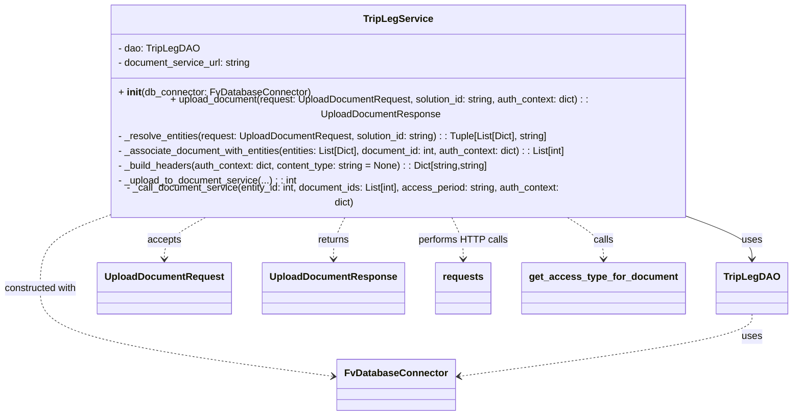
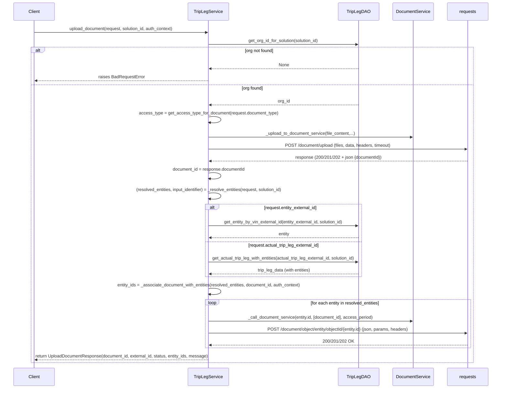

# Diagram: entity_core/entity_service/entity_service/trip_leg/associate_documents/service.py

> Auto-generated by Obscura crawlers

## Diagram 1

### SVG

<svg id="container" width="1253.515625" xmlns="http://www.w3.org/2000/svg" class="classDiagram" height="644" viewBox="0 0 1253.515625 644" role="graphics-document document" aria-roledescription="class"><g><defs><marker id="container_class-aggregationStart" class="marker aggregation class" refX="18" refY="7" markerWidth="190" markerHeight="240" orient="auto"><path d="M 18,7 L9,13 L1,7 L9,1 Z"></path></marker></defs><defs><marker id="container_class-aggregationEnd" class="marker aggregation class" refX="1" refY="7" markerWidth="20" markerHeight="28" orient="auto"><path d="M 18,7 L9,13 L1,7 L9,1 Z"></path></marker></defs><defs><marker id="container_class-extensionStart" class="marker extension class" refX="18" refY="7" markerWidth="190" markerHeight="240" orient="auto"><path d="M 1,7 L18,13 V 1 Z"></path></marker></defs><defs><marker id="container_class-extensionEnd" class="marker extension class" refX="1" refY="7" markerWidth="20" markerHeight="28" orient="auto"><path d="M 1,1 V 13 L18,7 Z"></path></marker></defs><defs><marker id="container_class-compositionStart" class="marker composition class" refX="18" refY="7" markerWidth="190" markerHeight="240" orient="auto"><path d="M 18,7 L9,13 L1,7 L9,1 Z"></path></marker></defs><defs><marker id="container_class-compositionEnd" class="marker composition class" refX="1" refY="7" markerWidth="20" markerHeight="28" orient="auto"><path d="M 18,7 L9,13 L1,7 L9,1 Z"></path></marker></defs><defs><marker id="container_class-dependencyStart" class="marker dependency class" refX="6" refY="7" markerWidth="190" markerHeight="240" orient="auto"><path d="M 5,7 L9,13 L1,7 L9,1 Z"></path></marker></defs><defs><marker id="container_class-dependencyEnd" class="marker dependency class" refX="13" refY="7" markerWidth="20" markerHeight="28" orient="auto"><path d="M 18,7 L9,13 L14,7 L9,1 Z"></path></marker></defs><defs><marker id="container_class-lollipopStart" class="marker lollipop class" refX="13" refY="7" markerWidth="190" markerHeight="240" orient="auto"><circle stroke="black" fill="transparent" cx="7" cy="7" r="6"></circle></marker></defs><defs><marker id="container_class-lollipopEnd" class="marker lollipop class" refX="1" refY="7" markerWidth="190" markerHeight="240" orient="auto"><circle stroke="black" fill="transparent" cx="7" cy="7" r="6"></circle></marker></defs><g class="root"><g class="clusters"></g><g class="edgePaths"><path d="M1085.098,320L1102.776,326.167C1120.454,332.333,1155.809,344.667,1173.486,356C1191.164,367.333,1191.164,377.667,1191.164,382.833L1191.164,388" id="id_TripLegService_TripLegDAO_1" class="edge-thickness-normal edge-pattern-solid relation" style=";;;" data-edge="true" data-et="edge" data-id="id_TripLegService_TripLegDAO_1" data-points="W3sieCI6MTA4NS4wOTgzNDQzOTc2Njg0LCJ5IjozMjB9LHsieCI6MTE5MS4xNjQwNjI1LCJ5IjozNTd9LHsieCI6MTE5MS4xNjQwNjI1LCJ5IjozOTR9XQ==" marker-end="url(#container_class-dependencyEnd)"></path><path d="M177.919,320L159.736,326.167C141.553,332.333,105.187,344.667,87.003,364C68.82,383.333,68.82,409.667,68.82,436C68.82,462.333,68.82,488.667,146.141,512.718C223.462,536.77,378.104,558.54,455.425,569.425L532.746,580.31" id="id_TripLegService_FvDatabaseConnector_2" class="edge-thickness-normal edge-pattern-dashed relation" style=";;;" data-edge="true" data-et="edge" data-id="id_TripLegService_FvDatabaseConnector_2" data-points="W3sieCI6MTc3LjkxODk0MDI1MjU5MDcsInkiOjMyMH0seyJ4Ijo2OC44MjAzMTI1LCJ5IjozNTd9LHsieCI6NjguODIwMzEyNSwieSI6NDM2fSx7IngiOjY4LjgyMDMxMjUsInkiOjUxNX0seyJ4Ijo1MzguNjg3NSwieSI6NTgxLjE0NjQxNTE0Njg3NDZ9XQ==" marker-end="url(#container_class-dependencyEnd)"></path><path d="M340.373,320L328.611,326.167C316.85,332.333,293.327,344.667,281.566,356C269.805,367.333,269.805,377.667,269.805,382.833L269.805,388" id="id_TripLegService_UploadDocumentRequest_3" class="edge-thickness-normal edge-pattern-dashed relation" style=";;;" data-edge="true" data-et="edge" data-id="id_TripLegService_UploadDocumentRequest_3" data-points="W3sieCI6MzQwLjM3MjYzMTk2MjQzNTIsInkiOjMyMH0seyJ4IjoyNjkuODA0Njg3NSwieSI6MzU3fSx7IngiOjI2OS44MDQ2ODc1LCJ5IjozOTR9XQ==" marker-end="url(#container_class-dependencyEnd)"></path><path d="M555.207,320L551.938,326.167C548.669,332.333,542.132,344.667,538.863,356C535.594,367.333,535.594,377.667,535.594,382.833L535.594,388" id="id_TripLegService_UploadDocumentResponse_4" class="edge-thickness-normal edge-pattern-dashed relation" style=";;;" data-edge="true" data-et="edge" data-id="id_TripLegService_UploadDocumentResponse_4" data-points="W3sieCI6NTU1LjIwNzMxNDYwNDkyMjMsInkiOjMyMH0seyJ4Ijo1MzUuNTkzNzUsInkiOjM1N30seyJ4Ijo1MzUuNTkzNzUsInkiOjM5NH1d" marker-end="url(#container_class-dependencyEnd)"></path><path d="M720.597,320L723.866,326.167C727.135,332.333,733.673,344.667,736.942,356C740.211,367.333,740.211,377.667,740.211,382.833L740.211,388" id="id_TripLegService_requests_5" class="edge-thickness-normal edge-pattern-dashed relation" style=";;;" data-edge="true" data-et="edge" data-id="id_TripLegService_requests_5" data-points="W3sieCI6NzIwLjU5NzM3Mjg5NTA3NzcsInkiOjMyMH0seyJ4Ijo3NDAuMjEwOTM3NSwieSI6MzU3fSx7IngiOjc0MC4yMTA5Mzc1LCJ5IjozOTR9XQ==" marker-end="url(#container_class-dependencyEnd)"></path><path d="M898.661,320L908.969,326.167C919.277,332.333,939.892,344.667,950.2,356C960.508,367.333,960.508,377.667,960.508,382.833L960.508,388" id="id_TripLegService_get_access_type_for_document_6" class="edge-thickness-normal edge-pattern-dashed relation" style=";;;" data-edge="true" data-et="edge" data-id="id_TripLegService_get_access_type_for_document_6" data-points="W3sieCI6ODk4LjY2MTE2ODIzMTg2NTMsInkiOjMyMH0seyJ4Ijo5NjAuNTA3ODEyNSwieSI6MzU3fSx7IngiOjk2MC41MDc4MTI1LCJ5IjozOTR9XQ==" marker-end="url(#container_class-dependencyEnd)"></path><path d="M1191.164,478L1191.164,484.167C1191.164,490.333,1191.164,502.667,1113.843,519.718C1036.522,536.77,881.88,558.54,804.559,569.425L727.238,580.31" id="id_TripLegDAO_FvDatabaseConnector_7" class="edge-thickness-normal edge-pattern-dashed relation" style=";;;" data-edge="true" data-et="edge" data-id="id_TripLegDAO_FvDatabaseConnector_7" data-points="W3sieCI6MTE5MS4xNjQwNjI1LCJ5Ijo0Nzh9LHsieCI6MTE5MS4xNjQwNjI1LCJ5Ijo1MTV9LHsieCI6NzIxLjI5Njg3NSwieSI6NTgxLjE0NjQxNTE0Njg3NDZ9XQ==" marker-end="url(#container_class-dependencyEnd)"></path></g><g class="edgeLabels"><g class="edgeLabel" transform="translate(1191.1640625, 357)"><g class="label" data-id="id_TripLegService_TripLegDAO_1" transform="translate(-16.4921875, -12)"><foreignObject width="32.984375" height="24">

uses

</foreignObject></g></g><g class="edgeLabel" transform="translate(68.8203125, 436)"><g class="label" data-id="id_TripLegService_FvDatabaseConnector_2" transform="translate(-60.8203125, -12)"><foreignObject width="121.640625" height="24">

constructed with

</foreignObject></g></g><g class="edgeLabel" transform="translate(269.8046875, 357)"><g class="label" data-id="id_TripLegService_UploadDocumentRequest_3" transform="translate(-27.421875, -12)"><foreignObject width="54.84375" height="24">

accepts

</foreignObject></g></g><g class="edgeLabel" transform="translate(535.59375, 357)"><g class="label" data-id="id_TripLegService_UploadDocumentResponse_4" transform="translate(-26.265625, -12)"><foreignObject width="52.53125" height="24">

returns

</foreignObject></g></g><g class="edgeLabel" transform="translate(740.2109375, 357)"><g class="label" data-id="id_TripLegService_requests_5" transform="translate(-72.1953125, -12)"><foreignObject width="144.390625" height="24">

performs HTTP calls

</foreignObject></g></g><g class="edgeLabel" transform="translate(960.5078125, 357)"><g class="label" data-id="id_TripLegService_get_access_type_for_document_6" transform="translate(-16.4453125, -12)"><foreignObject width="32.890625" height="24">

calls

</foreignObject></g></g><g class="edgeLabel" transform="translate(1191.1640625, 515)"><g class="label" data-id="id_TripLegDAO_FvDatabaseConnector_7" transform="translate(-16.4921875, -12)"><foreignObject width="32.984375" height="24">

uses

</foreignObject></g></g></g><g class="nodes"><g class="node default" id="classId-TripLegService-0" transform="translate(637.90234375, 164)"><g class="basic label-container"><path d="M-488.203125 -156 L488.203125 -156 L488.203125 156 L-488.203125 156" stroke="none" stroke-width="0" fill="#ECECFF" style=""></path><path d="M-488.203125 -156 C-128.1986618343263 -156, 231.80580133134742 -156, 488.203125 -156 M-488.203125 -156 C-277.6696788277028 -156, -67.13623265540565 -156, 488.203125 -156 M488.203125 -156 C488.203125 -53.77382300948106, 488.203125 48.452353981037874, 488.203125 156 M488.203125 -156 C488.203125 -64.61915503089, 488.203125 26.76168993822, 488.203125 156 M488.203125 156 C256.4274168738817 156, 24.65170874776345 156, -488.203125 156 M488.203125 156 C115.39459472002369 156, -257.4139355599526 156, -488.203125 156 M-488.203125 156 C-488.203125 85.20128786123028, -488.203125 14.402575722460568, -488.203125 -156 M-488.203125 156 C-488.203125 90.73642765477656, -488.203125 25.472855309553125, -488.203125 -156" stroke="#9370DB" stroke-width="1.3" fill="none" stroke-dasharray="0 0" style=""></path></g><g class="annotation-group text" transform="translate(0, -132)"></g><g class="label-group text" transform="translate(-53.703125, -132)"><g class="label" style="font-weight: bolder" transform="translate(0,-12)"><foreignObject width="107.40625" height="24">

TripLegService

</foreignObject></g></g><g class="members-group text" transform="translate(-476.203125, -84)"><g class="label" style="" transform="translate(0,-12)"><foreignObject width="129.203125" height="24">

- dao: TripLegDAO

</foreignObject></g><g class="label" style="" transform="translate(0,12)"><foreignObject width="220.84375" height="24">

- document_service_url: string

</foreignObject></g></g><g class="methods-group text" transform="translate(-476.203125, -12)"><g class="label" style="" transform="translate(0,-12)"><foreignObject width="311.515625" height="24">

+ <strong>init</strong>(db_connector: FvDatabaseConnector)

</foreignObject></g><g class="label" style="" transform="translate(0,12)"><foreignObject width="898.703125" height="24">

+ upload_document(request: UploadDocumentRequest, solution_id: string, auth_context: dict) : : UploadDocumentResponse

</foreignObject></g><g class="label" style="" transform="translate(0,36)"><foreignObject width="717.53125" height="24">

- _resolve_entities(request: UploadDocumentRequest, solution_id: string) : : Tuple[List[Dict], string]

</foreignObject></g><g class="label" style="" transform="translate(0,60)"><foreignObject width="753.640625" height="24">

- _associate_document_with_entities(entities: List[Dict], document_id: int, auth_context: dict) : : List[int]

</foreignObject></g><g class="label" style="" transform="translate(0,84)"><foreignObject width="618.125" height="24">

- _build_headers(auth_context: dict, content_type: string = None) : : Dict[string,string]

</foreignObject></g><g class="label" style="" transform="translate(0,108)"><foreignObject width="294.5" height="24">

- _upload_to_document_service(...) : : int

</foreignObject></g><g class="label" style="" transform="translate(0,132)"><foreignObject width="760.828125" height="24">

- _call_document_service(entity_id: int, document_ids: List[int], access_period: string, auth_context: dict)

</foreignObject></g></g><g class="divider" style=""><path d="M-488.203125 -108 C-187.81998957330285 -108, 112.5631458533943 -108, 488.203125 -108 M-488.203125 -108 C-259.45427270938757 -108, -30.705420418775134 -108, 488.203125 -108" stroke="#9370DB" stroke-width="1.3" fill="none" stroke-dasharray="0 0" style=""></path></g><g class="divider" style=""><path d="M-488.203125 -36 C-109.88688676236586 -36, 268.4293514752683 -36, 488.203125 -36 M-488.203125 -36 C-269.4591320328433 -36, -50.71513906568657 -36, 488.203125 -36" stroke="#9370DB" stroke-width="1.3" fill="none" stroke-dasharray="0 0" style=""></path></g></g><g class="node default" id="classId-TripLegDAO-1" transform="translate(1191.1640625, 436)"><g class="basic label-container"><path d="M-54.3515625 -42 L54.3515625 -42 L54.3515625 42 L-54.3515625 42" stroke="none" stroke-width="0" fill="#ECECFF" style=""></path><path d="M-54.3515625 -42 C-30.271212944147987 -42, -6.190863388295973 -42, 54.3515625 -42 M-54.3515625 -42 C-14.51738221981092 -42, 25.31679806037816 -42, 54.3515625 -42 M54.3515625 -42 C54.3515625 -12.894976393902944, 54.3515625 16.210047212194112, 54.3515625 42 M54.3515625 -42 C54.3515625 -24.557954108806978, 54.3515625 -7.115908217613956, 54.3515625 42 M54.3515625 42 C16.692393412767068 42, -20.966775674465865 42, -54.3515625 42 M54.3515625 42 C19.62562443284307 42, -15.100313634313864 42, -54.3515625 42 M-54.3515625 42 C-54.3515625 17.557294340894938, -54.3515625 -6.885411318210124, -54.3515625 -42 M-54.3515625 42 C-54.3515625 13.455221198758167, -54.3515625 -15.089557602483666, -54.3515625 -42" stroke="#9370DB" stroke-width="1.3" fill="none" stroke-dasharray="0 0" style=""></path></g><g class="annotation-group text" transform="translate(0, -18)"></g><g class="label-group text" transform="translate(-42.3515625, -18)"><g class="label" style="font-weight: bolder" transform="translate(0,-12)"><foreignObject width="84.703125" height="24">

TripLegDAO

</foreignObject></g></g><g class="members-group text" transform="translate(-42.3515625, 30)"></g><g class="methods-group text" transform="translate(-42.3515625, 60)"></g><g class="divider" style=""><path d="M-54.3515625 6 C-32.31973468391851 6, -10.287906867837023 6, 54.3515625 6 M-54.3515625 6 C-23.932975642160656 6, 6.485611215678688 6, 54.3515625 6" stroke="#9370DB" stroke-width="1.3" fill="none" stroke-dasharray="0 0" style=""></path></g><g class="divider" style=""><path d="M-54.3515625 24 C-25.32845435694407 24, 3.694653786111857 24, 54.3515625 24 M-54.3515625 24 C-15.995439336239905 24, 22.36068382752019 24, 54.3515625 24" stroke="#9370DB" stroke-width="1.3" fill="none" stroke-dasharray="0 0" style=""></path></g></g><g class="node default" id="classId-FvDatabaseConnector-2" transform="translate(629.9921875, 594)"><g class="basic label-container"><path d="M-91.3046875 -42 L91.3046875 -42 L91.3046875 42 L-91.3046875 42" stroke="none" stroke-width="0" fill="#ECECFF" style=""></path><path d="M-91.3046875 -42 C-22.4109001399938 -42, 46.4828872200124 -42, 91.3046875 -42 M-91.3046875 -42 C-40.88647993776563 -42, 9.531727624468743 -42, 91.3046875 -42 M91.3046875 -42 C91.3046875 -20.57661789814501, 91.3046875 0.8467642037099807, 91.3046875 42 M91.3046875 -42 C91.3046875 -17.68597415387065, 91.3046875 6.628051692258701, 91.3046875 42 M91.3046875 42 C43.67588221748038 42, -3.9529230650392435 42, -91.3046875 42 M91.3046875 42 C37.01913021590295 42, -17.266427068194105 42, -91.3046875 42 M-91.3046875 42 C-91.3046875 22.026072473319662, -91.3046875 2.0521449466393236, -91.3046875 -42 M-91.3046875 42 C-91.3046875 21.814959388692092, -91.3046875 1.6299187773841837, -91.3046875 -42" stroke="#9370DB" stroke-width="1.3" fill="none" stroke-dasharray="0 0" style=""></path></g><g class="annotation-group text" transform="translate(0, -18)"></g><g class="label-group text" transform="translate(-79.3046875, -18)"><g class="label" style="font-weight: bolder" transform="translate(0,-12)"><foreignObject width="158.609375" height="24">

FvDatabaseConnector

</foreignObject></g></g><g class="members-group text" transform="translate(-79.3046875, 30)"></g><g class="methods-group text" transform="translate(-79.3046875, 60)"></g><g class="divider" style=""><path d="M-91.3046875 6 C-23.981055624568498 6, 43.342576250863004 6, 91.3046875 6 M-91.3046875 6 C-43.48041832398309 6, 4.343850852033825 6, 91.3046875 6" stroke="#9370DB" stroke-width="1.3" fill="none" stroke-dasharray="0 0" style=""></path></g><g class="divider" style=""><path d="M-91.3046875 24 C-19.438185667266694 24, 52.42831616546661 24, 91.3046875 24 M-91.3046875 24 C-20.806967416820015 24, 49.69075266635997 24, 91.3046875 24" stroke="#9370DB" stroke-width="1.3" fill="none" stroke-dasharray="0 0" style=""></path></g></g><g class="node default" id="classId-UploadDocumentRequest-3" transform="translate(269.8046875, 436)"><g class="basic label-container"><path d="M-105.1640625 -42 L105.1640625 -42 L105.1640625 42 L-105.1640625 42" stroke="none" stroke-width="0" fill="#ECECFF" style=""></path><path d="M-105.1640625 -42 C-24.622218830777413 -42, 55.91962483844517 -42, 105.1640625 -42 M-105.1640625 -42 C-24.289194951026204 -42, 56.58567259794759 -42, 105.1640625 -42 M105.1640625 -42 C105.1640625 -12.164201481763303, 105.1640625 17.671597036473393, 105.1640625 42 M105.1640625 -42 C105.1640625 -23.36022317599095, 105.1640625 -4.720446351981899, 105.1640625 42 M105.1640625 42 C29.381688722371166 42, -46.40068505525767 42, -105.1640625 42 M105.1640625 42 C60.80818724480806 42, 16.45231198961612 42, -105.1640625 42 M-105.1640625 42 C-105.1640625 19.147013819637504, -105.1640625 -3.705972360724992, -105.1640625 -42 M-105.1640625 42 C-105.1640625 9.418680586626124, -105.1640625 -23.162638826747752, -105.1640625 -42" stroke="#9370DB" stroke-width="1.3" fill="none" stroke-dasharray="0 0" style=""></path></g><g class="annotation-group text" transform="translate(0, -18)"></g><g class="label-group text" transform="translate(-93.1640625, -18)"><g class="label" style="font-weight: bolder" transform="translate(0,-12)"><foreignObject width="186.328125" height="24">

UploadDocumentRequest

</foreignObject></g></g><g class="members-group text" transform="translate(-93.1640625, 30)"></g><g class="methods-group text" transform="translate(-93.1640625, 60)"></g><g class="divider" style=""><path d="M-105.1640625 6 C-40.419333345446546 6, 24.325395809106908 6, 105.1640625 6 M-105.1640625 6 C-48.73345609405091 6, 7.697150311898184 6, 105.1640625 6" stroke="#9370DB" stroke-width="1.3" fill="none" stroke-dasharray="0 0" style=""></path></g><g class="divider" style=""><path d="M-105.1640625 24 C-61.77086336854674 24, -18.377664237093484 24, 105.1640625 24 M-105.1640625 24 C-44.859192556066496 24, 15.445677387867008 24, 105.1640625 24" stroke="#9370DB" stroke-width="1.3" fill="none" stroke-dasharray="0 0" style=""></path></g></g><g class="node default" id="classId-UploadDocumentResponse-4" transform="translate(535.59375, 436)"><g class="basic label-container"><path d="M-110.625 -42 L110.625 -42 L110.625 42 L-110.625 42" stroke="none" stroke-width="0" fill="#ECECFF" style=""></path><path d="M-110.625 -42 C-44.44932830882817 -42, 21.726343382343657 -42, 110.625 -42 M-110.625 -42 C-36.200054727049874 -42, 38.22489054590025 -42, 110.625 -42 M110.625 -42 C110.625 -13.577456966050832, 110.625 14.845086067898336, 110.625 42 M110.625 -42 C110.625 -15.30400700895137, 110.625 11.39198598209726, 110.625 42 M110.625 42 C40.7952981730958 42, -29.034403653808397 42, -110.625 42 M110.625 42 C27.608257066681574 42, -55.40848586663685 42, -110.625 42 M-110.625 42 C-110.625 15.17749146061658, -110.625 -11.645017078766841, -110.625 -42 M-110.625 42 C-110.625 19.766930055248302, -110.625 -2.4661398895033955, -110.625 -42" stroke="#9370DB" stroke-width="1.3" fill="none" stroke-dasharray="0 0" style=""></path></g><g class="annotation-group text" transform="translate(0, -18)"></g><g class="label-group text" transform="translate(-98.625, -18)"><g class="label" style="font-weight: bolder" transform="translate(0,-12)"><foreignObject width="197.25" height="24">

UploadDocumentResponse

</foreignObject></g></g><g class="members-group text" transform="translate(-98.625, 30)"></g><g class="methods-group text" transform="translate(-98.625, 60)"></g><g class="divider" style=""><path d="M-110.625 6 C-46.67339257438992 6, 17.278214851220156 6, 110.625 6 M-110.625 6 C-61.173070402687614 6, -11.721140805375228 6, 110.625 6" stroke="#9370DB" stroke-width="1.3" fill="none" stroke-dasharray="0 0" style=""></path></g><g class="divider" style=""><path d="M-110.625 24 C-61.30006747992683 24, -11.975134959853662 24, 110.625 24 M-110.625 24 C-62.86643953645864 24, -15.107879072917285 24, 110.625 24" stroke="#9370DB" stroke-width="1.3" fill="none" stroke-dasharray="0 0" style=""></path></g></g><g class="node default" id="classId-requests-5" transform="translate(740.2109375, 436)"><g class="basic label-container"><path d="M-43.9921875 -42 L43.9921875 -42 L43.9921875 42 L-43.9921875 42" stroke="none" stroke-width="0" fill="#ECECFF" style=""></path><path d="M-43.9921875 -42 C-9.91320041176374 -42, 24.16578667647252 -42, 43.9921875 -42 M-43.9921875 -42 C-15.358102972139704 -42, 13.275981555720591 -42, 43.9921875 -42 M43.9921875 -42 C43.9921875 -19.10357622546128, 43.9921875 3.792847549077443, 43.9921875 42 M43.9921875 -42 C43.9921875 -21.65588581162472, 43.9921875 -1.3117716232494416, 43.9921875 42 M43.9921875 42 C21.48171933881353 42, -1.0287488223729397 42, -43.9921875 42 M43.9921875 42 C20.99220294889735 42, -2.0077816022052986 42, -43.9921875 42 M-43.9921875 42 C-43.9921875 25.066211227656837, -43.9921875 8.132422455313673, -43.9921875 -42 M-43.9921875 42 C-43.9921875 17.3553683674512, -43.9921875 -7.289263265097603, -43.9921875 -42" stroke="#9370DB" stroke-width="1.3" fill="none" stroke-dasharray="0 0" style=""></path></g><g class="annotation-group text" transform="translate(0, -18)"></g><g class="label-group text" transform="translate(-31.9921875, -18)"><g class="label" style="font-weight: bolder" transform="translate(0,-12)"><foreignObject width="63.984375" height="24">

requests

</foreignObject></g></g><g class="members-group text" transform="translate(-31.9921875, 30)"></g><g class="methods-group text" transform="translate(-31.9921875, 60)"></g><g class="divider" style=""><path d="M-43.9921875 6 C-23.735407191136627 6, -3.478626882273254 6, 43.9921875 6 M-43.9921875 6 C-15.91519536054864 6, 12.161796778902719 6, 43.9921875 6" stroke="#9370DB" stroke-width="1.3" fill="none" stroke-dasharray="0 0" style=""></path></g><g class="divider" style=""><path d="M-43.9921875 24 C-17.94880345039994 24, 8.094580599200121 24, 43.9921875 24 M-43.9921875 24 C-10.031418999948599 24, 23.929349500102802 24, 43.9921875 24" stroke="#9370DB" stroke-width="1.3" fill="none" stroke-dasharray="0 0" style=""></path></g></g><g class="node default" id="classId-get_access_type_for_document-6" transform="translate(960.5078125, 436)"><g class="basic label-container"><path d="M-126.3046875 -42 L126.3046875 -42 L126.3046875 42 L-126.3046875 42" stroke="none" stroke-width="0" fill="#ECECFF" style=""></path><path d="M-126.3046875 -42 C-34.20903731915716 -42, 57.88661286168568 -42, 126.3046875 -42 M-126.3046875 -42 C-27.815310208625334 -42, 70.67406708274933 -42, 126.3046875 -42 M126.3046875 -42 C126.3046875 -11.432565035793253, 126.3046875 19.134869928413494, 126.3046875 42 M126.3046875 -42 C126.3046875 -22.458989251349085, 126.3046875 -2.917978502698169, 126.3046875 42 M126.3046875 42 C57.333344021435906 42, -11.637999457128188 42, -126.3046875 42 M126.3046875 42 C71.19705333669015 42, 16.089419173380307 42, -126.3046875 42 M-126.3046875 42 C-126.3046875 14.08698385240658, -126.3046875 -13.826032295186842, -126.3046875 -42 M-126.3046875 42 C-126.3046875 18.029681348717, -126.3046875 -5.940637302566003, -126.3046875 -42" stroke="#9370DB" stroke-width="1.3" fill="none" stroke-dasharray="0 0" style=""></path></g><g class="annotation-group text" transform="translate(0, -18)"></g><g class="label-group text" transform="translate(-114.3046875, -18)"><g class="label" style="font-weight: bolder" transform="translate(0,-12)"><foreignObject width="228.609375" height="24">

get_access_type_for_document

</foreignObject></g></g><g class="members-group text" transform="translate(-114.3046875, 30)"></g><g class="methods-group text" transform="translate(-114.3046875, 60)"></g><g class="divider" style=""><path d="M-126.3046875 6 C-68.80038121083291 6, -11.29607492166582 6, 126.3046875 6 M-126.3046875 6 C-50.58643696510018 6, 25.131813569799647 6, 126.3046875 6" stroke="#9370DB" stroke-width="1.3" fill="none" stroke-dasharray="0 0" style=""></path></g><g class="divider" style=""><path d="M-126.3046875 24 C-58.00844814863764 24, 10.28779120272472 24, 126.3046875 24 M-126.3046875 24 C-61.36422244824233 24, 3.5762426035153396 24, 126.3046875 24" stroke="#9370DB" stroke-width="1.3" fill="none" stroke-dasharray="0 0" style=""></path></g></g></g></g></g></svg>

## Diagram 2

### SVG

<svg id="container" width="1973" xmlns="http://www.w3.org/2000/svg" height="1506" viewBox="-50 -10 1973 1506" role="graphics-document document" aria-roledescription="sequence"><g><rect x="1723" y="1420" fill="#eaeaea" stroke="#666" width="150" height="65" name="HTTP" rx="3" ry="3" class="actor actor-bottom"></rect><text x="1798" y="1452.5" dominant-baseline="central" alignment-baseline="central" class="actor actor-box" style="text-anchor: middle; font-size: 16px; font-weight: 400;"><tspan x="1798" dy="0">requests</tspan></text></g><g><rect x="1523" y="1420" fill="#eaeaea" stroke="#666" width="150" height="65" name="DocSvc" rx="3" ry="3" class="actor actor-bottom"></rect><text x="1598" y="1452.5" dominant-baseline="central" alignment-baseline="central" class="actor actor-box" style="text-anchor: middle; font-size: 16px; font-weight: 400;"><tspan x="1598" dy="0">DocumentService</tspan></text></g><g><rect x="1323" y="1420" fill="#eaeaea" stroke="#666" width="150" height="65" name="DAO" rx="3" ry="3" class="actor actor-bottom"></rect><text x="1398" y="1452.5" dominant-baseline="central" alignment-baseline="central" class="actor actor-box" style="text-anchor: middle; font-size: 16px; font-weight: 400;"><tspan x="1398" dy="0">TripLegDAO</tspan></text></g><g><rect x="714" y="1420" fill="#eaeaea" stroke="#666" width="150" height="65" name="Service" rx="3" ry="3" class="actor actor-bottom"></rect><text x="789" y="1452.5" dominant-baseline="central" alignment-baseline="central" class="actor actor-box" style="text-anchor: middle; font-size: 16px; font-weight: 400;"><tspan x="789" dy="0">TripLegService</tspan></text></g><g><rect x="0" y="1420" fill="#eaeaea" stroke="#666" width="150" height="65" name="Client" rx="3" ry="3" class="actor actor-bottom"></rect><text x="75" y="1452.5" dominant-baseline="central" alignment-baseline="central" class="actor actor-box" style="text-anchor: middle; font-size: 16px; font-weight: 400;"><tspan x="75" dy="0">Client</tspan></text></g><g><line id="actor4" x1="1798" y1="65" x2="1798" y2="1420" class="actor-line 200" stroke-width="0.5px" stroke="#999" name="HTTP"></line><g id="root-4"><rect x="1723" y="0" fill="#eaeaea" stroke="#666" width="150" height="65" name="HTTP" rx="3" ry="3" class="actor actor-top"></rect><text x="1798" y="32.5" dominant-baseline="central" alignment-baseline="central" class="actor actor-box" style="text-anchor: middle; font-size: 16px; font-weight: 400;"><tspan x="1798" dy="0">requests</tspan></text></g></g><g><line id="actor3" x1="1598" y1="65" x2="1598" y2="1420" class="actor-line 200" stroke-width="0.5px" stroke="#999" name="DocSvc"></line><g id="root-3"><rect x="1523" y="0" fill="#eaeaea" stroke="#666" width="150" height="65" name="DocSvc" rx="3" ry="3" class="actor actor-top"></rect><text x="1598" y="32.5" dominant-baseline="central" alignment-baseline="central" class="actor actor-box" style="text-anchor: middle; font-size: 16px; font-weight: 400;"><tspan x="1598" dy="0">DocumentService</tspan></text></g></g><g><line id="actor2" x1="1398" y1="65" x2="1398" y2="1420" class="actor-line 200" stroke-width="0.5px" stroke="#999" name="DAO"></line><g id="root-2"><rect x="1323" y="0" fill="#eaeaea" stroke="#666" width="150" height="65" name="DAO" rx="3" ry="3" class="actor actor-top"></rect><text x="1398" y="32.5" dominant-baseline="central" alignment-baseline="central" class="actor actor-box" style="text-anchor: middle; font-size: 16px; font-weight: 400;"><tspan x="1398" dy="0">TripLegDAO</tspan></text></g></g><g><line id="actor1" x1="789" y1="65" x2="789" y2="1420" class="actor-line 200" stroke-width="0.5px" stroke="#999" name="Service"></line><g id="root-1"><rect x="714" y="0" fill="#eaeaea" stroke="#666" width="150" height="65" name="Service" rx="3" ry="3" class="actor actor-top"></rect><text x="789" y="32.5" dominant-baseline="central" alignment-baseline="central" class="actor actor-box" style="text-anchor: middle; font-size: 16px; font-weight: 400;"><tspan x="789" dy="0">TripLegService</tspan></text></g></g><g><line id="actor0" x1="75" y1="65" x2="75" y2="1420" class="actor-line 200" stroke-width="0.5px" stroke="#999" name="Client"></line><g id="root-0"><rect x="0" y="0" fill="#eaeaea" stroke="#666" width="150" height="65" name="Client" rx="3" ry="3" class="actor actor-top"></rect><text x="75" y="32.5" dominant-baseline="central" alignment-baseline="central" class="actor actor-box" style="text-anchor: middle; font-size: 16px; font-weight: 400;"><tspan x="75" dy="0">Client</tspan></text></g></g><g></g><defs><symbol id="computer" width="24" height="24"><path transform="scale(.5)" d="M2 2v13h20v-13h-20zm18 11h-16v-9h16v9zm-10.228 6l.466-1h3.524l.467 1h-4.457zm14.228 3h-24l2-6h2.104l-1.33 4h18.45l-1.297-4h2.073l2 6zm-5-10h-14v-7h14v7z"></path></symbol></defs><defs><symbol id="database" fill-rule="evenodd" clip-rule="evenodd"><path transform="scale(.5)" d="M12.258.001l.256.004.255.005.253.008.251.01.249.012.247.015.246.016.242.019.241.02.239.023.236.024.233.027.231.028.229.031.225.032.223.034.22.036.217.038.214.04.211.041.208.043.205.045.201.046.198.048.194.05.191.051.187.053.183.054.18.056.175.057.172.059.168.06.163.061.16.063.155.064.15.066.074.033.073.033.071.034.07.034.069.035.068.035.067.035.066.035.064.036.064.036.062.036.06.036.06.037.058.037.058.037.055.038.055.038.053.038.052.038.051.039.05.039.048.039.047.039.045.04.044.04.043.04.041.04.04.041.039.041.037.041.036.041.034.041.033.042.032.042.03.042.029.042.027.042.026.043.024.043.023.043.021.043.02.043.018.044.017.043.015.044.013.044.012.044.011.045.009.044.007.045.006.045.004.045.002.045.001.045v17l-.001.045-.002.045-.004.045-.006.045-.007.045-.009.044-.011.045-.012.044-.013.044-.015.044-.017.043-.018.044-.02.043-.021.043-.023.043-.024.043-.026.043-.027.042-.029.042-.03.042-.032.042-.033.042-.034.041-.036.041-.037.041-.039.041-.04.041-.041.04-.043.04-.044.04-.045.04-.047.039-.048.039-.05.039-.051.039-.052.038-.053.038-.055.038-.055.038-.058.037-.058.037-.06.037-.06.036-.062.036-.064.036-.064.036-.066.035-.067.035-.068.035-.069.035-.07.034-.071.034-.073.033-.074.033-.15.066-.155.064-.16.063-.163.061-.168.06-.172.059-.175.057-.18.056-.183.054-.187.053-.191.051-.194.05-.198.048-.201.046-.205.045-.208.043-.211.041-.214.04-.217.038-.22.036-.223.034-.225.032-.229.031-.231.028-.233.027-.236.024-.239.023-.241.02-.242.019-.246.016-.247.015-.249.012-.251.01-.253.008-.255.005-.256.004-.258.001-.258-.001-.256-.004-.255-.005-.253-.008-.251-.01-.249-.012-.247-.015-.245-.016-.243-.019-.241-.02-.238-.023-.236-.024-.234-.027-.231-.028-.228-.031-.226-.032-.223-.034-.22-.036-.217-.038-.214-.04-.211-.041-.208-.043-.204-.045-.201-.046-.198-.048-.195-.05-.19-.051-.187-.053-.184-.054-.179-.056-.176-.057-.172-.059-.167-.06-.164-.061-.159-.063-.155-.064-.151-.066-.074-.033-.072-.033-.072-.034-.07-.034-.069-.035-.068-.035-.067-.035-.066-.035-.064-.036-.063-.036-.062-.036-.061-.036-.06-.037-.058-.037-.057-.037-.056-.038-.055-.038-.053-.038-.052-.038-.051-.039-.049-.039-.049-.039-.046-.039-.046-.04-.044-.04-.043-.04-.041-.04-.04-.041-.039-.041-.037-.041-.036-.041-.034-.041-.033-.042-.032-.042-.03-.042-.029-.042-.027-.042-.026-.043-.024-.043-.023-.043-.021-.043-.02-.043-.018-.044-.017-.043-.015-.044-.013-.044-.012-.044-.011-.045-.009-.044-.007-.045-.006-.045-.004-.045-.002-.045-.001-.045v-17l.001-.045.002-.045.004-.045.006-.045.007-.045.009-.044.011-.045.012-.044.013-.044.015-.044.017-.043.018-.044.02-.043.021-.043.023-.043.024-.043.026-.043.027-.042.029-.042.03-.042.032-.042.033-.042.034-.041.036-.041.037-.041.039-.041.04-.041.041-.04.043-.04.044-.04.046-.04.046-.039.049-.039.049-.039.051-.039.052-.038.053-.038.055-.038.056-.038.057-.037.058-.037.06-.037.061-.036.062-.036.063-.036.064-.036.066-.035.067-.035.068-.035.069-.035.07-.034.072-.034.072-.033.074-.033.151-.066.155-.064.159-.063.164-.061.167-.06.172-.059.176-.057.179-.056.184-.054.187-.053.19-.051.195-.05.198-.048.201-.046.204-.045.208-.043.211-.041.214-.04.217-.038.22-.036.223-.034.226-.032.228-.031.231-.028.234-.027.236-.024.238-.023.241-.02.243-.019.245-.016.247-.015.249-.012.251-.01.253-.008.255-.005.256-.004.258-.001.258.001zm-9.258 20.499v.01l.001.021.003.021.004.022.005.021.006.022.007.022.009.023.01.022.011.023.012.023.013.023.015.023.016.024.017.023.018.024.019.024.021.024.022.025.023.024.024.025.052.049.056.05.061.051.066.051.07.051.075.051.079.052.084.052.088.052.092.052.097.052.102.051.105.052.11.052.114.051.119.051.123.051.127.05.131.05.135.05.139.048.144.049.147.047.152.047.155.047.16.045.163.045.167.043.171.043.176.041.178.041.183.039.187.039.19.037.194.035.197.035.202.033.204.031.209.03.212.029.216.027.219.025.222.024.226.021.23.02.233.018.236.016.24.015.243.012.246.01.249.008.253.005.256.004.259.001.26-.001.257-.004.254-.005.25-.008.247-.011.244-.012.241-.014.237-.016.233-.018.231-.021.226-.021.224-.024.22-.026.216-.027.212-.028.21-.031.205-.031.202-.034.198-.034.194-.036.191-.037.187-.039.183-.04.179-.04.175-.042.172-.043.168-.044.163-.045.16-.046.155-.046.152-.047.148-.048.143-.049.139-.049.136-.05.131-.05.126-.05.123-.051.118-.052.114-.051.11-.052.106-.052.101-.052.096-.052.092-.052.088-.053.083-.051.079-.052.074-.052.07-.051.065-.051.06-.051.056-.05.051-.05.023-.024.023-.025.021-.024.02-.024.019-.024.018-.024.017-.024.015-.023.014-.024.013-.023.012-.023.01-.023.01-.022.008-.022.006-.022.006-.022.004-.022.004-.021.001-.021.001-.021v-4.127l-.077.055-.08.053-.083.054-.085.053-.087.052-.09.052-.093.051-.095.05-.097.05-.1.049-.102.049-.105.048-.106.047-.109.047-.111.046-.114.045-.115.045-.118.044-.12.043-.122.042-.124.042-.126.041-.128.04-.13.04-.132.038-.134.038-.135.037-.138.037-.139.035-.142.035-.143.034-.144.033-.147.032-.148.031-.15.03-.151.03-.153.029-.154.027-.156.027-.158.026-.159.025-.161.024-.162.023-.163.022-.165.021-.166.02-.167.019-.169.018-.169.017-.171.016-.173.015-.173.014-.175.013-.175.012-.177.011-.178.01-.179.008-.179.008-.181.006-.182.005-.182.004-.184.003-.184.002h-.37l-.184-.002-.184-.003-.182-.004-.182-.005-.181-.006-.179-.008-.179-.008-.178-.01-.176-.011-.176-.012-.175-.013-.173-.014-.172-.015-.171-.016-.17-.017-.169-.018-.167-.019-.166-.02-.165-.021-.163-.022-.162-.023-.161-.024-.159-.025-.157-.026-.156-.027-.155-.027-.153-.029-.151-.03-.15-.03-.148-.031-.146-.032-.145-.033-.143-.034-.141-.035-.14-.035-.137-.037-.136-.037-.134-.038-.132-.038-.13-.04-.128-.04-.126-.041-.124-.042-.122-.042-.12-.044-.117-.043-.116-.045-.113-.045-.112-.046-.109-.047-.106-.047-.105-.048-.102-.049-.1-.049-.097-.05-.095-.05-.093-.052-.09-.051-.087-.052-.085-.053-.083-.054-.08-.054-.077-.054v4.127zm0-5.654v.011l.001.021.003.021.004.021.005.022.006.022.007.022.009.022.01.022.011.023.012.023.013.023.015.024.016.023.017.024.018.024.019.024.021.024.022.024.023.025.024.024.052.05.056.05.061.05.066.051.07.051.075.052.079.051.084.052.088.052.092.052.097.052.102.052.105.052.11.051.114.051.119.052.123.05.127.051.131.05.135.049.139.049.144.048.147.048.152.047.155.046.16.045.163.045.167.044.171.042.176.042.178.04.183.04.187.038.19.037.194.036.197.034.202.033.204.032.209.03.212.028.216.027.219.025.222.024.226.022.23.02.233.018.236.016.24.014.243.012.246.01.249.008.253.006.256.003.259.001.26-.001.257-.003.254-.006.25-.008.247-.01.244-.012.241-.015.237-.016.233-.018.231-.02.226-.022.224-.024.22-.025.216-.027.212-.029.21-.03.205-.032.202-.033.198-.035.194-.036.191-.037.187-.039.183-.039.179-.041.175-.042.172-.043.168-.044.163-.045.16-.045.155-.047.152-.047.148-.048.143-.048.139-.05.136-.049.131-.05.126-.051.123-.051.118-.051.114-.052.11-.052.106-.052.101-.052.096-.052.092-.052.088-.052.083-.052.079-.052.074-.051.07-.052.065-.051.06-.05.056-.051.051-.049.023-.025.023-.024.021-.025.02-.024.019-.024.018-.024.017-.024.015-.023.014-.023.013-.024.012-.022.01-.023.01-.023.008-.022.006-.022.006-.022.004-.021.004-.022.001-.021.001-.021v-4.139l-.077.054-.08.054-.083.054-.085.052-.087.053-.09.051-.093.051-.095.051-.097.05-.1.049-.102.049-.105.048-.106.047-.109.047-.111.046-.114.045-.115.044-.118.044-.12.044-.122.042-.124.042-.126.041-.128.04-.13.039-.132.039-.134.038-.135.037-.138.036-.139.036-.142.035-.143.033-.144.033-.147.033-.148.031-.15.03-.151.03-.153.028-.154.028-.156.027-.158.026-.159.025-.161.024-.162.023-.163.022-.165.021-.166.02-.167.019-.169.018-.169.017-.171.016-.173.015-.173.014-.175.013-.175.012-.177.011-.178.009-.179.009-.179.007-.181.007-.182.005-.182.004-.184.003-.184.002h-.37l-.184-.002-.184-.003-.182-.004-.182-.005-.181-.007-.179-.007-.179-.009-.178-.009-.176-.011-.176-.012-.175-.013-.173-.014-.172-.015-.171-.016-.17-.017-.169-.018-.167-.019-.166-.02-.165-.021-.163-.022-.162-.023-.161-.024-.159-.025-.157-.026-.156-.027-.155-.028-.153-.028-.151-.03-.15-.03-.148-.031-.146-.033-.145-.033-.143-.033-.141-.035-.14-.036-.137-.036-.136-.037-.134-.038-.132-.039-.13-.039-.128-.04-.126-.041-.124-.042-.122-.043-.12-.043-.117-.044-.116-.044-.113-.046-.112-.046-.109-.046-.106-.047-.105-.048-.102-.049-.1-.049-.097-.05-.095-.051-.093-.051-.09-.051-.087-.053-.085-.052-.083-.054-.08-.054-.077-.054v4.139zm0-5.666v.011l.001.02.003.022.004.021.005.022.006.021.007.022.009.023.01.022.011.023.012.023.013.023.015.023.016.024.017.024.018.023.019.024.021.025.022.024.023.024.024.025.052.05.056.05.061.05.066.051.07.051.075.052.079.051.084.052.088.052.092.052.097.052.102.052.105.051.11.052.114.051.119.051.123.051.127.05.131.05.135.05.139.049.144.048.147.048.152.047.155.046.16.045.163.045.167.043.171.043.176.042.178.04.183.04.187.038.19.037.194.036.197.034.202.033.204.032.209.03.212.028.216.027.219.025.222.024.226.021.23.02.233.018.236.017.24.014.243.012.246.01.249.008.253.006.256.003.259.001.26-.001.257-.003.254-.006.25-.008.247-.01.244-.013.241-.014.237-.016.233-.018.231-.02.226-.022.224-.024.22-.025.216-.027.212-.029.21-.03.205-.032.202-.033.198-.035.194-.036.191-.037.187-.039.183-.039.179-.041.175-.042.172-.043.168-.044.163-.045.16-.045.155-.047.152-.047.148-.048.143-.049.139-.049.136-.049.131-.051.126-.05.123-.051.118-.052.114-.051.11-.052.106-.052.101-.052.096-.052.092-.052.088-.052.083-.052.079-.052.074-.052.07-.051.065-.051.06-.051.056-.05.051-.049.023-.025.023-.025.021-.024.02-.024.019-.024.018-.024.017-.024.015-.023.014-.024.013-.023.012-.023.01-.022.01-.023.008-.022.006-.022.006-.022.004-.022.004-.021.001-.021.001-.021v-4.153l-.077.054-.08.054-.083.053-.085.053-.087.053-.09.051-.093.051-.095.051-.097.05-.1.049-.102.048-.105.048-.106.048-.109.046-.111.046-.114.046-.115.044-.118.044-.12.043-.122.043-.124.042-.126.041-.128.04-.13.039-.132.039-.134.038-.135.037-.138.036-.139.036-.142.034-.143.034-.144.033-.147.032-.148.032-.15.03-.151.03-.153.028-.154.028-.156.027-.158.026-.159.024-.161.024-.162.023-.163.023-.165.021-.166.02-.167.019-.169.018-.169.017-.171.016-.173.015-.173.014-.175.013-.175.012-.177.01-.178.01-.179.009-.179.007-.181.006-.182.006-.182.004-.184.003-.184.001-.185.001-.185-.001-.184-.001-.184-.003-.182-.004-.182-.006-.181-.006-.179-.007-.179-.009-.178-.01-.176-.01-.176-.012-.175-.013-.173-.014-.172-.015-.171-.016-.17-.017-.169-.018-.167-.019-.166-.02-.165-.021-.163-.023-.162-.023-.161-.024-.159-.024-.157-.026-.156-.027-.155-.028-.153-.028-.151-.03-.15-.03-.148-.032-.146-.032-.145-.033-.143-.034-.141-.034-.14-.036-.137-.036-.136-.037-.134-.038-.132-.039-.13-.039-.128-.041-.126-.041-.124-.041-.122-.043-.12-.043-.117-.044-.116-.044-.113-.046-.112-.046-.109-.046-.106-.048-.105-.048-.102-.048-.1-.05-.097-.049-.095-.051-.093-.051-.09-.052-.087-.052-.085-.053-.083-.053-.08-.054-.077-.054v4.153zm8.74-8.179l-.257.004-.254.005-.25.008-.247.011-.244.012-.241.014-.237.016-.233.018-.231.021-.226.022-.224.023-.22.026-.216.027-.212.028-.21.031-.205.032-.202.033-.198.034-.194.036-.191.038-.187.038-.183.04-.179.041-.175.042-.172.043-.168.043-.163.045-.16.046-.155.046-.152.048-.148.048-.143.048-.139.049-.136.05-.131.05-.126.051-.123.051-.118.051-.114.052-.11.052-.106.052-.101.052-.096.052-.092.052-.088.052-.083.052-.079.052-.074.051-.07.052-.065.051-.06.05-.056.05-.051.05-.023.025-.023.024-.021.024-.02.025-.019.024-.018.024-.017.023-.015.024-.014.023-.013.023-.012.023-.01.023-.01.022-.008.022-.006.023-.006.021-.004.022-.004.021-.001.021-.001.021.001.021.001.021.004.021.004.022.006.021.006.023.008.022.01.022.01.023.012.023.013.023.014.023.015.024.017.023.018.024.019.024.02.025.021.024.023.024.023.025.051.05.056.05.06.05.065.051.07.052.074.051.079.052.083.052.088.052.092.052.096.052.101.052.106.052.11.052.114.052.118.051.123.051.126.051.131.05.136.05.139.049.143.048.148.048.152.048.155.046.16.046.163.045.168.043.172.043.175.042.179.041.183.04.187.038.191.038.194.036.198.034.202.033.205.032.21.031.212.028.216.027.22.026.224.023.226.022.231.021.233.018.237.016.241.014.244.012.247.011.25.008.254.005.257.004.26.001.26-.001.257-.004.254-.005.25-.008.247-.011.244-.012.241-.014.237-.016.233-.018.231-.021.226-.022.224-.023.22-.026.216-.027.212-.028.21-.031.205-.032.202-.033.198-.034.194-.036.191-.038.187-.038.183-.04.179-.041.175-.042.172-.043.168-.043.163-.045.16-.046.155-.046.152-.048.148-.048.143-.048.139-.049.136-.05.131-.05.126-.051.123-.051.118-.051.114-.052.11-.052.106-.052.101-.052.096-.052.092-.052.088-.052.083-.052.079-.052.074-.051.07-.052.065-.051.06-.05.056-.05.051-.05.023-.025.023-.024.021-.024.02-.025.019-.024.018-.024.017-.023.015-.024.014-.023.013-.023.012-.023.01-.023.01-.022.008-.022.006-.023.006-.021.004-.022.004-.021.001-.021.001-.021-.001-.021-.001-.021-.004-.021-.004-.022-.006-.021-.006-.023-.008-.022-.01-.022-.01-.023-.012-.023-.013-.023-.014-.023-.015-.024-.017-.023-.018-.024-.019-.024-.02-.025-.021-.024-.023-.024-.023-.025-.051-.05-.056-.05-.06-.05-.065-.051-.07-.052-.074-.051-.079-.052-.083-.052-.088-.052-.092-.052-.096-.052-.101-.052-.106-.052-.11-.052-.114-.052-.118-.051-.123-.051-.126-.051-.131-.05-.136-.05-.139-.049-.143-.048-.148-.048-.152-.048-.155-.046-.16-.046-.163-.045-.168-.043-.172-.043-.175-.042-.179-.041-.183-.04-.187-.038-.191-.038-.194-.036-.198-.034-.202-.033-.205-.032-.21-.031-.212-.028-.216-.027-.22-.026-.224-.023-.226-.022-.231-.021-.233-.018-.237-.016-.241-.014-.244-.012-.247-.011-.25-.008-.254-.005-.257-.004-.26-.001-.26.001z"></path></symbol></defs><defs><symbol id="clock" width="24" height="24"><path transform="scale(.5)" d="M12 2c5.514 0 10 4.486 10 10s-4.486 10-10 10-10-4.486-10-10 4.486-10 10-10zm0-2c-6.627 0-12 5.373-12 12s5.373 12 12 12 12-5.373 12-12-5.373-12-12-12zm5.848 12.459c.202.038.202.333.001.372-1.907.361-6.045 1.111-6.547 1.111-.719 0-1.301-.582-1.301-1.301 0-.512.77-5.447 1.125-7.445.034-.192.312-.181.343.014l.985 6.238 5.394 1.011z"></path></symbol></defs><defs><marker id="arrowhead" refX="7.9" refY="5" markerUnits="userSpaceOnUse" markerWidth="12" markerHeight="12" orient="auto-start-reverse"><path d="M -1 0 L 10 5 L 0 10 z"></path></marker></defs><defs><marker id="crosshead" markerWidth="15" markerHeight="8" orient="auto" refX="4" refY="4.5"><path fill="none" stroke="#000000" stroke-width="1pt" d="M 1,2 L 6,7 M 6,2 L 1,7" style="stroke-dasharray: 0, 0;"></path></marker></defs><defs><marker id="filled-head" refX="15.5" refY="7" markerWidth="20" markerHeight="28" orient="auto"><path d="M 18,7 L9,13 L14,7 L9,1 Z"></path></marker></defs><defs><marker id="sequencenumber" refX="15" refY="15" markerWidth="60" markerHeight="40" orient="auto"><circle cx="15" cy="15" r="6"></circle></marker></defs><g><line x1="778" y1="783" x2="1409" y2="783" class="loopLine"></line><line x1="1409" y1="783" x2="1409" y2="1065" class="loopLine"></line><line x1="778" y1="1065" x2="1409" y2="1065" class="loopLine"></line><line x1="778" y1="783" x2="778" y2="1065" class="loopLine"></line><line x1="778" y1="929" x2="1409" y2="929" class="loopLine" style="stroke-dasharray: 3, 3;"></line><polygon points="778,783 828,783 828,796 819.6,803 778,803" class="labelBox"></polygon><text x="803" y="796" text-anchor="middle" dominant-baseline="middle" alignment-baseline="middle" class="labelText" style="font-size: 16px; font-weight: 400;">alt</text><text x="1118.5" y="801" text-anchor="middle" class="loopText" style="font-size: 16px; font-weight: 400;"><tspan x="1118.5">[request.entity_external_id]</tspan></text><text x="1093.5" y="947" text-anchor="middle" class="loopText" style="font-size: 16px; font-weight: 400;">[request.actual_trip_leg_external_id]</text></g><g><line x1="778" y1="1153" x2="1809" y2="1153" class="loopLine"></line><line x1="1809" y1="1153" x2="1809" y2="1342" class="loopLine"></line><line x1="778" y1="1342" x2="1809" y2="1342" class="loopLine"></line><line x1="778" y1="1153" x2="778" y2="1342" class="loopLine"></line><polygon points="778,1153 828,1153 828,1166 819.6,1173 778,1173" class="labelBox"></polygon><text x="803" y="1166" text-anchor="middle" dominant-baseline="middle" alignment-baseline="middle" class="labelText" style="font-size: 16px; font-weight: 400;">loop</text><text x="1318.5" y="1171" text-anchor="middle" class="loopText" style="font-size: 16px; font-weight: 400;"><tspan x="1318.5">[for each entity in resolved_entities]</tspan></text></g><g><line x1="64" y1="171" x2="1819" y2="171" class="loopLine"></line><line x1="1819" y1="171" x2="1819" y2="1400" class="loopLine"></line><line x1="64" y1="1400" x2="1819" y2="1400" class="loopLine"></line><line x1="64" y1="171" x2="64" y2="1400" class="loopLine"></line><line x1="64" y1="317" x2="1819" y2="317" class="loopLine" style="stroke-dasharray: 3, 3;"></line><polygon points="64,171 114,171 114,184 105.6,191 64,191" class="labelBox"></polygon><text x="89" y="184" text-anchor="middle" dominant-baseline="middle" alignment-baseline="middle" class="labelText" style="font-size: 16px; font-weight: 400;">alt</text><text x="966.5" y="189" text-anchor="middle" class="loopText" style="font-size: 16px; font-weight: 400;"><tspan x="966.5">[org not found]</tspan></text><text x="941.5" y="335" text-anchor="middle" class="loopText" style="font-size: 16px; font-weight: 400;">[org found]</text></g><text x="431" y="80" text-anchor="middle" dominant-baseline="middle" alignment-baseline="middle" class="messageText" dy="1em" style="font-size: 16px; font-weight: 400;">upload_document(request, solution_id, auth_context)</text><line x1="76" y1="113" x2="785" y2="113" class="messageLine0" stroke-width="2" stroke="none" marker-end="url(#arrowhead)" style="fill: none;"></line><text x="1092" y="128" text-anchor="middle" dominant-baseline="middle" alignment-baseline="middle" class="messageText" dy="1em" style="font-size: 16px; font-weight: 400;">get_org_id_for_solution(solution_id)</text><line x1="790" y1="161" x2="1394" y2="161" class="messageLine0" stroke-width="2" stroke="none" marker-end="url(#arrowhead)" style="fill: none;"></line><text x="1095" y="221" text-anchor="middle" dominant-baseline="middle" alignment-baseline="middle" class="messageText" dy="1em" style="font-size: 16px; font-weight: 400;">None</text><line x1="1397" y1="254" x2="793" y2="254" class="messageLine1" stroke-width="2" stroke="none" marker-end="url(#arrowhead)" style="stroke-dasharray: 3, 3; fill: none;"></line><text x="434" y="269" text-anchor="middle" dominant-baseline="middle" alignment-baseline="middle" class="messageText" dy="1em" style="font-size: 16px; font-weight: 400;">raises BadRequestError</text><line x1="788" y1="302" x2="79" y2="302" class="messageLine1" stroke-width="2" stroke="none" marker-end="url(#arrowhead)" style="stroke-dasharray: 3, 3; fill: none;"></line><text x="1095" y="362" text-anchor="middle" dominant-baseline="middle" alignment-baseline="middle" class="messageText" dy="1em" style="font-size: 16px; font-weight: 400;">org_id</text><line x1="1397" y1="395" x2="793" y2="395" class="messageLine1" stroke-width="2" stroke="none" marker-end="url(#arrowhead)" style="stroke-dasharray: 3, 3; fill: none;"></line><text x="790" y="410" text-anchor="middle" dominant-baseline="middle" alignment-baseline="middle" class="messageText" dy="1em" style="font-size: 16px; font-weight: 400;">access_type = get_access_type_for_document(request.document_type)</text><path d="M 790,443 C 850,433 850,473 790,463" class="messageLine0" stroke-width="2" stroke="none" marker-end="url(#arrowhead)" style="fill: none;"></path><text x="1192" y="488" text-anchor="middle" dominant-baseline="middle" alignment-baseline="middle" class="messageText" dy="1em" style="font-size: 16px; font-weight: 400;">_upload_to_document_service(file_content,...)</text><line x1="790" y1="521" x2="1594" y2="521" class="messageLine0" stroke-width="2" stroke="none" marker-end="url(#arrowhead)" style="fill: none;"></line><text x="1292" y="536" text-anchor="middle" dominant-baseline="middle" alignment-baseline="middle" class="messageText" dy="1em" style="font-size: 16px; font-weight: 400;">POST /document/upload (files, data, headers, timeout)</text><line x1="790" y1="569" x2="1794" y2="569" class="messageLine0" stroke-width="2" stroke="none" marker-end="url(#arrowhead)" style="fill: none;"></line><text x="1295" y="584" text-anchor="middle" dominant-baseline="middle" alignment-baseline="middle" class="messageText" dy="1em" style="font-size: 16px; font-weight: 400;">response (200/201/202 + json {documentId})</text><line x1="1797" y1="617" x2="793" y2="617" class="messageLine1" stroke-width="2" stroke="none" marker-end="url(#arrowhead)" style="stroke-dasharray: 3, 3; fill: none;"></line><text x="790" y="632" text-anchor="middle" dominant-baseline="middle" alignment-baseline="middle" class="messageText" dy="1em" style="font-size: 16px; font-weight: 400;">document_id = response.documentId</text><path d="M 790,665 C 850,655 850,695 790,685" class="messageLine0" stroke-width="2" stroke="none" marker-end="url(#arrowhead)" style="fill: none;"></path><text x="790" y="710" text-anchor="middle" dominant-baseline="middle" alignment-baseline="middle" class="messageText" dy="1em" style="font-size: 16px; font-weight: 400;">(resolved_entities, input_identifier) = _resolve_entities(request, solution_id)</text><path d="M 790,743 C 850,733 850,773 790,763" class="messageLine0" stroke-width="2" stroke="none" marker-end="url(#arrowhead)" style="fill: none;"></path><text x="1092" y="833" text-anchor="middle" dominant-baseline="middle" alignment-baseline="middle" class="messageText" dy="1em" style="font-size: 16px; font-weight: 400;">get_entity_by_vin_external_id(entity_external_id, solution_id)</text><line x1="790" y1="866" x2="1394" y2="866" class="messageLine0" stroke-width="2" stroke="none" marker-end="url(#arrowhead)" style="fill: none;"></line><text x="1095" y="881" text-anchor="middle" dominant-baseline="middle" alignment-baseline="middle" class="messageText" dy="1em" style="font-size: 16px; font-weight: 400;">entity</text><line x1="1397" y1="914" x2="793" y2="914" class="messageLine1" stroke-width="2" stroke="none" marker-end="url(#arrowhead)" style="stroke-dasharray: 3, 3; fill: none;"></line><text x="1092" y="974" text-anchor="middle" dominant-baseline="middle" alignment-baseline="middle" class="messageText" dy="1em" style="font-size: 16px; font-weight: 400;">get_actual_trip_leg_with_entities(actual_trip_leg_external_id, solution_id)</text><line x1="790" y1="1007" x2="1394" y2="1007" class="messageLine0" stroke-width="2" stroke="none" marker-end="url(#arrowhead)" style="fill: none;"></line><text x="1095" y="1022" text-anchor="middle" dominant-baseline="middle" alignment-baseline="middle" class="messageText" dy="1em" style="font-size: 16px; font-weight: 400;">trip_leg_data (with entities)</text><line x1="1397" y1="1055" x2="793" y2="1055" class="messageLine1" stroke-width="2" stroke="none" marker-end="url(#arrowhead)" style="stroke-dasharray: 3, 3; fill: none;"></line><text x="790" y="1080" text-anchor="middle" dominant-baseline="middle" alignment-baseline="middle" class="messageText" dy="1em" style="font-size: 16px; font-weight: 400;">entity_ids = _associate_document_with_entities(resolved_entities, document_id, auth_context)</text><path d="M 790,1113 C 850,1103 850,1143 790,1133" class="messageLine0" stroke-width="2" stroke="none" marker-end="url(#arrowhead)" style="fill: none;"></path><text x="1192" y="1203" text-anchor="middle" dominant-baseline="middle" alignment-baseline="middle" class="messageText" dy="1em" style="font-size: 16px; font-weight: 400;">_call_document_service(entity.id, [document_id], access_period)</text><line x1="790" y1="1236" x2="1594" y2="1236" class="messageLine0" stroke-width="2" stroke="none" marker-end="url(#arrowhead)" style="fill: none;"></line><text x="1292" y="1251" text-anchor="middle" dominant-baseline="middle" alignment-baseline="middle" class="messageText" dy="1em" style="font-size: 16px; font-weight: 400;">POST /document/object/entity/objectId/{entity.id} (json, params, headers)</text><line x1="790" y1="1284" x2="1794" y2="1284" class="messageLine0" stroke-width="2" stroke="none" marker-end="url(#arrowhead)" style="fill: none;"></line><text x="1295" y="1299" text-anchor="middle" dominant-baseline="middle" alignment-baseline="middle" class="messageText" dy="1em" style="font-size: 16px; font-weight: 400;">200/201/202 OK</text><line x1="1797" y1="1332" x2="793" y2="1332" class="messageLine1" stroke-width="2" stroke="none" marker-end="url(#arrowhead)" style="stroke-dasharray: 3, 3; fill: none;"></line><text x="434" y="1357" text-anchor="middle" dominant-baseline="middle" alignment-baseline="middle" class="messageText" dy="1em" style="font-size: 16px; font-weight: 400;">return UploadDocumentResponse(document_id, external_id, status, entity_ids, message)</text><line x1="788" y1="1390" x2="79" y2="1390" class="messageLine1" stroke-width="2" stroke="none" marker-end="url(#arrowhead)" style="stroke-dasharray: 3, 3; fill: none;"></line></svg>
