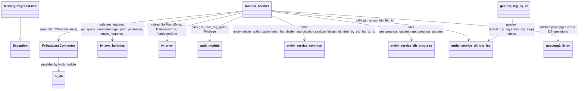

# Diagram: entity_core/entity_service/entity_service/trip_leg/progress_update/get_progress_update.py


> Auto-generated by Obscura crawlers

## Diagram 1

```mermaid
flowchart TD
  Start([Start]) --> Establish[DB_CONN.establish_connection()]
  Establish --> Cursor[cursor = DB_CONN.cursor]
  Cursor --> OrgType[organization_type = auth.get_user_org_types(event)]
  OrgType --> Features[features = fv.aws.lambdas.get_features(event)]
  Features --> DealerCheck{OrgTypes.DEALER in organization_type\nor dealer_org_id?}
  DealerCheck -->|Yes| DealerBranch
  DealerBranch --> HasInternal{fv.aws.lambdas.get_query_parameter(event,"internal_entity_ids",[])?}
  HasInternal -->|Yes| DealerAuth[entity_service.common.entity_dealer_authorization(event,cursor,...)]
  DealerAuth --> SanitizeIn[in_actual_trip_leg_id = entity_service.common.sanitize_ids(...)]
  SanitizeIn --> GetUlt1[entity_service.common.get_ult_dest_by_trip_leg_db_id(cursor,in_actual_trip_leg_id,trip_type="actual")]
  HasInternal -->|No| TripLegDealer[entity_service.common.trip_leg_dealer_authorization(event,cursor,trip_type="actual",required=True,dealer_org_id=dealer_org_id)]
  TripLegDealer --> GetUlt1
  DealerCheck -->|No| CarrierCheck{OrgTypes.CARRIER or OrgTypes.PARTNER?}
  CarrierCheck -->|Yes| CarrierBranch
  CarrierBranch --> ParseInternal[internal_entity_ids = json.loads(fv.aws.lambdas.get_query_parameter(...))]
  ParseInternal -->|non-empty| CarrierAuth[entity_service.common.entity_carrier_authorization(event,cursor,internal_entity_ids)]
  CarrierAuth --> GetUlt2[entity_service.common.get_ult_dest_by_trip_leg_db_id(cursor,in_actual_trip_leg_id,trip_type="actual")]
  CarrierCheck -->|No| DefaultBranch[solution_id & ext_actual_trip_leg_id from path params]
  GetUlt1 --> Continue
  GetUlt2 --> Continue
  DefaultBranch --> Continue
  Continue --> ProgressId[progress_update_id = fv.aws.lambdas.get_path_parameter(event,"progress_update_id")]
  ProgressId --> Audit[audit_refs.update({SOLUTION_ID:solution_id,ACTUAL_TRIP_LEG_ID:ext_actual_trip_leg_id,PROGRESS_UPDATE_ID:progress_update_id})]
  Audit --> ActualTripLegId[actual_trip_leg_id = get_actual_trip_leg_id(cursor,solution_id,ext_actual_trip_leg_id)]
  ActualTripLegId --> TryBlock{progress_update_id present?}
  TryBlock -->|Yes| GetSingle[get_progress_update(actual_trip_leg_id,progress_update_id,cursor)]
  GetSingle --> CheckNull{retval is None?}
  CheckNull -->|Yes| RaiseMissing[raise MissingProgressError()]
  CheckNull -->|No| SetTripId[retval["tripLegId"] = ext_actual_trip_leg_id]
  TryBlock -->|No| GetMany[get_progress_updates(actual_trip_leg_id,cursor)]
  SetTripId --> BuildReturn
  GetMany --> BuildReturn
  RaiseMissing --> NotFound[raise fv.error.NotFoundError(...)]
  TryBlock -.->|psycopg2.Error| DBError[raise fv.error.DatabaseError(...)]
  DBError --> End([End with DatabaseError])
  NotFound --> EndNotFound([End with NotFoundError])
  BuildReturn --> FinalRet[retval = {"tripLegId": ext_actual_trip_leg_id, "progressUpdates": retval}]
  FinalRet --> Response[return make_response(json_dumps(retval))]
  Response --> EndOK([End - 200 response])
```

> SVG rendering failed for this diagram.

## Diagram 2



### SVG

<svg id="container" width="3001" xmlns="http://www.w3.org/2000/svg" class="classDiagram" height="464" viewBox="0 0 3001 464" role="graphics-document document" aria-roledescription="class"><style>#container{font-family:"trebuchet ms",verdana,arial,sans-serif;font-size:16px;fill:#333;}@keyframes edge-animation-frame{from{stroke-dashoffset:0;}}@keyframes dash{to{stroke-dashoffset:0;}}#container .edge-animation-slow{stroke-dasharray:9,5!important;stroke-dashoffset:900;animation:dash 50s linear infinite;stroke-linecap:round;}#container .edge-animation-fast{stroke-dasharray:9,5!important;stroke-dashoffset:900;animation:dash 20s linear infinite;stroke-linecap:round;}#container .error-icon{fill:#552222;}#container .error-text{fill:#552222;stroke:#552222;}#container .edge-thickness-normal{stroke-width:1px;}#container .edge-thickness-thick{stroke-width:3.5px;}#container .edge-pattern-solid{stroke-dasharray:0;}#container .edge-thickness-invisible{stroke-width:0;fill:none;}#container .edge-pattern-dashed{stroke-dasharray:3;}#container .edge-pattern-dotted{stroke-dasharray:2;}#container .marker{fill:#333333;stroke:#333333;}#container .marker.cross{stroke:#333333;}#container svg{font-family:"trebuchet ms",verdana,arial,sans-serif;font-size:16px;}#container p{margin:0;}#container g.classGroup text{fill:#9370DB;stroke:none;font-family:"trebuchet ms",verdana,arial,sans-serif;font-size:10px;}#container g.classGroup text .title{font-weight:bolder;}#container .nodeLabel,#container .edgeLabel{color:#131300;}#container .edgeLabel .label rect{fill:#ECECFF;}#container .label text{fill:#131300;}#container .labelBkg{background:#ECECFF;}#container .edgeLabel .label span{background:#ECECFF;}#container .classTitle{font-weight:bolder;}#container .node rect,#container .node circle,#container .node ellipse,#container .node polygon,#container .node path{fill:#ECECFF;stroke:#9370DB;stroke-width:1px;}#container .divider{stroke:#9370DB;stroke-width:1;}#container g.clickable{cursor:pointer;}#container g.classGroup rect{fill:#ECECFF;stroke:#9370DB;}#container g.classGroup line{stroke:#9370DB;stroke-width:1;}#container .classLabel .box{stroke:none;stroke-width:0;fill:#ECECFF;opacity:0.5;}#container .classLabel .label{fill:#9370DB;font-size:10px;}#container .relation{stroke:#333333;stroke-width:1;fill:none;}#container .dashed-line{stroke-dasharray:3;}#container .dotted-line{stroke-dasharray:1 2;}#container #compositionStart,#container .composition{fill:#333333!important;stroke:#333333!important;stroke-width:1;}#container #compositionEnd,#container .composition{fill:#333333!important;stroke:#333333!important;stroke-width:1;}#container #dependencyStart,#container .dependency{fill:#333333!important;stroke:#333333!important;stroke-width:1;}#container #dependencyStart,#container .dependency{fill:#333333!important;stroke:#333333!important;stroke-width:1;}#container #extensionStart,#container .extension{fill:transparent!important;stroke:#333333!important;stroke-width:1;}#container #extensionEnd,#container .extension{fill:transparent!important;stroke:#333333!important;stroke-width:1;}#container #aggregationStart,#container .aggregation{fill:transparent!important;stroke:#333333!important;stroke-width:1;}#container #aggregationEnd,#container .aggregation{fill:transparent!important;stroke:#333333!important;stroke-width:1;}#container #lollipopStart,#container .lollipop{fill:#ECECFF!important;stroke:#333333!important;stroke-width:1;}#container #lollipopEnd,#container .lollipop{fill:#ECECFF!important;stroke:#333333!important;stroke-width:1;}#container .edgeTerminals{font-size:11px;line-height:initial;}#container .classTitleText{text-anchor:middle;font-size:18px;fill:#333;}#container .label-icon{display:inline-block;height:1em;overflow:visible;vertical-align:-0.125em;}#container .node .label-icon path{fill:currentColor;stroke:revert;stroke-width:revert;}#container :root{--mermaid-font-family:"trebuchet ms",verdana,arial,sans-serif;}</style><g><defs><marker id="container_class-aggregationStart" class="marker aggregation class" refX="18" refY="7" markerWidth="190" markerHeight="240" orient="auto"><path d="M 18,7 L9,13 L1,7 L9,1 Z"></path></marker></defs><defs><marker id="container_class-aggregationEnd" class="marker aggregation class" refX="1" refY="7" markerWidth="20" markerHeight="28" orient="auto"><path d="M 18,7 L9,13 L1,7 L9,1 Z"></path></marker></defs><defs><marker id="container_class-extensionStart" class="marker extension class" refX="18" refY="7" markerWidth="190" markerHeight="240" orient="auto"><path d="M 1,7 L18,13 V 1 Z"></path></marker></defs><defs><marker id="container_class-extensionEnd" class="marker extension class" refX="1" refY="7" markerWidth="20" markerHeight="28" orient="auto"><path d="M 1,1 V 13 L18,7 Z"></path></marker></defs><defs><marker id="container_class-compositionStart" class="marker composition class" refX="18" refY="7" markerWidth="190" markerHeight="240" orient="auto"><path d="M 18,7 L9,13 L1,7 L9,1 Z"></path></marker></defs><defs><marker id="container_class-compositionEnd" class="marker composition class" refX="1" refY="7" markerWidth="20" markerHeight="28" orient="auto"><path d="M 18,7 L9,13 L1,7 L9,1 Z"></path></marker></defs><defs><marker id="container_class-dependencyStart" class="marker dependency class" refX="6" refY="7" markerWidth="190" markerHeight="240" orient="auto"><path d="M 5,7 L9,13 L1,7 L9,1 Z"></path></marker></defs><defs><marker id="container_class-dependencyEnd" class="marker dependency class" refX="13" refY="7" markerWidth="20" markerHeight="28" orient="auto"><path d="M 18,7 L9,13 L14,7 L9,1 Z"></path></marker></defs><defs><marker id="container_class-lollipopStart" class="marker lollipop class" refX="13" refY="7" markerWidth="190" markerHeight="240" orient="auto"><circle stroke="black" fill="transparent" cx="7" cy="7" r="6"></circle></marker></defs><defs><marker id="container_class-lollipopEnd" class="marker lollipop class" refX="1" refY="7" markerWidth="190" markerHeight="240" orient="auto"><circle stroke="black" fill="transparent" cx="7" cy="7" r="6"></circle></marker></defs><g class="root"><g class="clusters"></g><g class="edgePaths"><path d="M97.43,92L97.43,102.167C97.43,112.333,97.43,132.667,97.43,150.125C97.43,167.583,97.43,182.167,97.43,189.458L97.43,196.75" id="id_MissingProgressError_Exception_1" class="edge-thickness-normal edge-pattern-solid relation" style=";;;" data-edge="true" data-et="edge" data-id="id_MissingProgressError_Exception_1" data-points="W3sieCI6OTcuNDI5Njg3NSwieSI6OTJ9LHsieCI6OTcuNDI5Njg3NSwieSI6MTUzfSx7IngiOjk3LjQyOTY4NzUsInkiOjIxNH1d" marker-end="url(#container_class-extensionEnd)"></path><path d="M1241.672,57.217L1082.466,73.181C923.26,89.145,604.849,121.072,445.643,146.203C286.438,171.333,286.438,189.667,286.438,198.833L286.438,208" id="id_lambda_handler_FvDatabaseConnector_2" class="edge-thickness-normal edge-pattern-solid relation" style=";;;" data-edge="true" data-et="edge" data-id="id_lambda_handler_FvDatabaseConnector_2" data-points="W3sieCI6MTI0MS42NzE4NzUsInkiOjU3LjIxNzE5OTE4MTY0MzI1fSx7IngiOjI4Ni40Mzc1LCJ5IjoxNTN9LHsieCI6Mjg2LjQzNzUsInkiOjIxNH1d" marker-end="url(#container_class-dependencyEnd)"></path><path d="M1241.672,59.854L1128.272,75.378C1014.872,90.902,788.073,121.951,674.673,146.642C561.273,171.333,561.273,189.667,561.273,198.833L561.273,208" id="id_lambda_handler_fv_aws_lambdas_3" class="edge-thickness-normal edge-pattern-solid relation" style=";;;" data-edge="true" data-et="edge" data-id="id_lambda_handler_fv_aws_lambdas_3" data-points="W3sieCI6MTI0MS42NzE4NzUsInkiOjU5Ljg1MzU3ODI1MjIwMTM2fSx7IngiOjU2MS4yNzM0Mzc1LCJ5IjoxNTN9LHsieCI6NTYxLjI3MzQzNzUsInkiOjIxNH1d" marker-end="url(#container_class-dependencyEnd)"></path><path d="M1241.672,79.832L1212.25,92.027C1182.828,104.222,1123.984,128.611,1094.563,149.972C1065.141,171.333,1065.141,189.667,1065.141,198.833L1065.141,208" id="id_lambda_handler_auth_module_4" class="edge-thickness-normal edge-pattern-solid relation" style=";;;" data-edge="true" data-et="edge" data-id="id_lambda_handler_auth_module_4" data-points="W3sieCI6MTI0MS42NzE4NzUsInkiOjc5LjgzMjQwNTkyMjg1MjAyfSx7IngiOjEwNjUuMTQwNjI1LCJ5IjoxNTN9LHsieCI6MTA2NS4xNDA2MjUsInkiOjIxNH1d" marker-end="url(#container_class-dependencyEnd)"></path><path d="M1385.625,79.832L1415.047,92.027C1444.469,104.222,1503.313,128.611,1532.734,149.972C1562.156,171.333,1562.156,189.667,1562.156,198.833L1562.156,208" id="id_lambda_handler_entity_service_common_5" class="edge-thickness-normal edge-pattern-solid relation" style=";;;" data-edge="true" data-et="edge" data-id="id_lambda_handler_entity_service_common_5" data-points="W3sieCI6MTM4NS42MjUsInkiOjc5LjgzMjQwNTkyMjg1MjAyfSx7IngiOjE1NjIuMTU2MjUsInkiOjE1M30seyJ4IjoxNTYyLjE1NjI1LCJ5IjoyMTR9XQ==" marker-end="url(#container_class-dependencyEnd)"></path><path d="M1385.625,59.144L1508.762,74.786C1631.898,90.429,1878.172,121.715,2001.309,146.524C2124.445,171.333,2124.445,189.667,2124.445,198.833L2124.445,208" id="id_lambda_handler_entity_service_db_progress_6" class="edge-thickness-normal edge-pattern-solid relation" style=";;;" data-edge="true" data-et="edge" data-id="id_lambda_handler_entity_service_db_progress_6" data-points="W3sieCI6MTM4NS42MjUsInkiOjU5LjE0MzU3OTgxMTUyODAxNH0seyJ4IjoyMTI0LjQ0NTMxMjUsInkiOjE1M30seyJ4IjoyMTI0LjQ0NTMxMjUsInkiOjIxNH1d" marker-end="url(#container_class-dependencyEnd)"></path><path d="M1385.625,56.769L1556.164,72.808C1726.703,88.846,2067.781,120.923,2241.086,146.17C2414.39,171.418,2419.921,189.836,2422.686,199.045L2425.451,208.253" id="id_lambda_handler_entity_service_db_trip_leg_7" class="edge-thickness-normal edge-pattern-solid relation" style=";;;" data-edge="true" data-et="edge" data-id="id_lambda_handler_entity_service_db_trip_leg_7" data-points="W3sieCI6MTM4NS42MjUsInkiOjU2Ljc2OTA5NDEzODU0MzUxNX0seyJ4IjoyNDA4Ljg1OTM3NSwieSI6MTUzfSx7IngiOjI0MjcuMTc2OTU2OTE3NDc1OCwieSI6MjE0fV0=" marker-end="url(#container_class-dependencyEnd)"></path><path d="M1241.672,65.824L1175.583,80.353C1109.495,94.883,977.318,123.941,911.229,147.637C845.141,171.333,845.141,189.667,845.141,198.833L845.141,208" id="id_lambda_handler_fv_error_8" class="edge-thickness-normal edge-pattern-solid relation" style=";;;" data-edge="true" data-et="edge" data-id="id_lambda_handler_fv_error_8" data-points="W3sieCI6MTI0MS42NzE4NzUsInkiOjY1LjgyMzgyNTY0MzI0OTAxfSx7IngiOjg0NS4xNDA2MjUsInkiOjE1M30seyJ4Ijo4NDUuMTQwNjI1LCJ5IjoyMTR9XQ==" marker-end="url(#container_class-dependencyEnd)"></path><path d="M2657.133,92L2656.027,102.167C2654.922,112.333,2652.711,132.667,2631.706,152.561C2610.7,172.455,2570.9,191.91,2551,201.638L2531.1,211.365" id="id_get_trip_leg_by_id_entity_service_db_trip_leg_9" class="edge-thickness-normal edge-pattern-solid relation" style=";;;" data-edge="true" data-et="edge" data-id="id_get_trip_leg_by_id_entity_service_db_trip_leg_9" data-points="W3sieCI6MjY1Ny4xMzI1NDcwMjY2OTksInkiOjkyfSx7IngiOjI2NTAuNSwieSI6MTUzfSx7IngiOjI1MjUuNzEwMDI3MzA1ODI1NCwieSI6MjE0fV0=" marker-end="url(#container_class-dependencyEnd)"></path><path d="M286.438,298L286.438,304.167C286.438,310.333,286.438,322.667,286.438,334C286.438,345.333,286.438,355.667,286.438,360.833L286.438,366" id="id_FvDatabaseConnector_fv_db_10" class="edge-thickness-normal edge-pattern-solid relation" style=";;;" data-edge="true" data-et="edge" data-id="id_FvDatabaseConnector_fv_db_10" data-points="W3sieCI6Mjg2LjQzNzUsInkiOjI5OH0seyJ4IjoyODYuNDM3NSwieSI6MzM1fSx7IngiOjI4Ni40Mzc1LCJ5IjozNzJ9XQ==" marker-end="url(#container_class-dependencyEnd)"></path><path d="M1385.625,54.694L1636.854,71.078C1888.083,87.463,2390.542,120.231,2641.771,145.782C2893,171.333,2893,189.667,2893,198.833L2893,208" id="id_lambda_handler_psycopg2_Error_11" class="edge-thickness-normal edge-pattern-solid relation" style=";;;" data-edge="true" data-et="edge" data-id="id_lambda_handler_psycopg2_Error_11" data-points="W3sieCI6MTM4NS42MjUsInkiOjU0LjY5NDA2OTQ2MDg2NDU3Nn0seyJ4IjoyODkzLCJ5IjoxNTN9LHsieCI6Mjg5MywieSI6MjE0fV0=" marker-end="url(#container_class-dependencyEnd)"></path></g><g class="edgeLabels"><g class="edgeLabel"><g class="label" data-id="id_MissingProgressError_Exception_1" transform="translate(0, 0)"><foreignObject width="0" height="0"><div xmlns="http://www.w3.org/1999/xhtml" class="labelBkg" style="display: table-cell; white-space: nowrap; line-height: 1.5; max-width: 200px; text-align: center;"><span class="edgeLabel"></span></div></foreignObject></g></g><g class="edgeLabel" transform="translate(286.4375, 153)"><g class="label" data-id="id_lambda_handler_FvDatabaseConnector_2" transform="translate(-90.96875, -12)"><foreignObject width="181.9375" height="24"><div xmlns="http://www.w3.org/1999/xhtml" class="labelBkg" style="display: table-cell; white-space: nowrap; line-height: 1.5; max-width: 200px; text-align: center;"><span class="edgeLabel"><p>uses DB_CONN (instance)</p></span></div></foreignObject></g></g><g class="edgeLabel" transform="translate(561.2734375, 153)"><g class="label" data-id="id_lambda_handler_fv_aws_lambdas_3" transform="translate(-163.8671875, -36)"><foreignObject width="327.734375" height="72"><div xmlns="http://www.w3.org/1999/xhtml" class="labelBkg" style="display: table; white-space: break-spaces; line-height: 1.5; max-width: 200px; text-align: center; width: 200px;"><span class="edgeLabel"><p>calls get_features, get_query_parameter,\nget_path_parameter, make_response</p></span></div></foreignObject></g></g><g class="edgeLabel" transform="translate(1065.140625, 153)"><g class="label" data-id="id_lambda_handler_auth_module_4" transform="translate(-100, -24)"><foreignObject width="200" height="48"><div xmlns="http://www.w3.org/1999/xhtml" class="labelBkg" style="display: table; white-space: break-spaces; line-height: 1.5; max-width: 200px; text-align: center; width: 200px;"><span class="edgeLabel"><p>calls get_user_org_types, Privilege</p></span></div></foreignObject></g></g><g class="edgeLabel" transform="translate(1562.15625, 153)"><g class="label" data-id="id_lambda_handler_entity_service_common_5" transform="translate(-377.015625, -24)"><foreignObject width="754.03125" height="48"><div xmlns="http://www.w3.org/1999/xhtml" class="labelBkg" style="display: table; white-space: break-spaces; line-height: 1.5; max-width: 200px; text-align: center; width: 200px;"><span class="edgeLabel"><p>calls entity_dealer_authorization,\ntrip_leg_dealer_authorization,sanitize_ids,get_ult_dest_by_trip_leg_db_id</p></span></div></foreignObject></g></g><g class="edgeLabel" transform="translate(2124.4453125, 153)"><g class="label" data-id="id_lambda_handler_entity_service_db_progress_6" transform="translate(-165.2734375, -24)"><foreignObject width="330.546875" height="48"><div xmlns="http://www.w3.org/1999/xhtml" class="labelBkg" style="display: table; white-space: break-spaces; line-height: 1.5; max-width: 200px; text-align: center; width: 200px;"><span class="edgeLabel"><p>calls get_progress_update,\nget_progress_updates</p></span></div></foreignObject></g></g><g class="edgeLabel" transform="translate(1928.94775, 107.86632)"><g class="label" data-id="id_lambda_handler_entity_service_db_trip_leg_7" transform="translate(-99.140625, -12)"><foreignObject width="198.28125" height="24"><div xmlns="http://www.w3.org/1999/xhtml" class="labelBkg" style="display: table-cell; white-space: nowrap; line-height: 1.5; max-width: 200px; text-align: center;"><span class="edgeLabel"><p>calls get_actual_trip_leg_id</p></span></div></foreignObject></g></g><g class="edgeLabel" transform="translate(845.140625, 153)"><g class="label" data-id="id_lambda_handler_fv_error_8" transform="translate(-100, -36)"><foreignObject width="200" height="72"><div xmlns="http://www.w3.org/1999/xhtml" class="labelBkg" style="display: table; white-space: break-spaces; line-height: 1.5; max-width: 200px; text-align: center; width: 200px;"><span class="edgeLabel"><p>raises NotFoundError, DatabaseError, ForbiddenError</p></span></div></foreignObject></g></g><g class="edgeLabel" transform="translate(2650.5, 153)"><g class="label" data-id="id_get_trip_leg_by_id_entity_service_db_trip_leg_9" transform="translate(-122.5, -36)"><foreignObject width="245" height="72"><div xmlns="http://www.w3.org/1999/xhtml" class="labelBkg" style="display: table; white-space: break-spaces; line-height: 1.5; max-width: 200px; text-align: center; width: 200px;"><span class="edgeLabel"><p>queries {actual_trip_leg,actual_trip_stop} tables</p></span></div></foreignObject></g></g><g class="edgeLabel" transform="translate(286.4375, 335)"><g class="label" data-id="id_FvDatabaseConnector_fv_db_10" transform="translate(-92.6875, -12)"><foreignObject width="185.375" height="24"><div xmlns="http://www.w3.org/1999/xhtml" class="labelBkg" style="display: table-cell; white-space: nowrap; line-height: 1.5; max-width: 200px; text-align: center;"><span class="edgeLabel"><p>provided by fv.db module</p></span></div></foreignObject></g></g><g class="edgeLabel" transform="translate(2893, 153)"><g class="label" data-id="id_lambda_handler_psycopg2_Error_11" transform="translate(-100, -24)"><foreignObject width="200" height="48"><div xmlns="http://www.w3.org/1999/xhtml" class="labelBkg" style="display: table; white-space: break-spaces; line-height: 1.5; max-width: 200px; text-align: center; width: 200px;"><span class="edgeLabel"><p>catches psycopg2.Error in DB operations</p></span></div></foreignObject></g></g></g><g class="nodes"><g class="node default" id="classId-MissingProgressError-0" transform="translate(97.4296875, 50)"><g class="basic label-container"><path d="M-89.4296875 -42 L89.4296875 -42 L89.4296875 42 L-89.4296875 42" stroke="none" stroke-width="0" fill="#ECECFF" style=""></path><path d="M-89.4296875 -42 C-20.6534000371679 -42, 48.1228874256642 -42, 89.4296875 -42 M-89.4296875 -42 C-20.935756790887908 -42, 47.558173918224185 -42, 89.4296875 -42 M89.4296875 -42 C89.4296875 -18.145841813635506, 89.4296875 5.708316372728987, 89.4296875 42 M89.4296875 -42 C89.4296875 -24.523147872127748, 89.4296875 -7.046295744255495, 89.4296875 42 M89.4296875 42 C26.59382602512421 42, -36.24203544975158 42, -89.4296875 42 M89.4296875 42 C49.36229142370128 42, 9.294895347402559 42, -89.4296875 42 M-89.4296875 42 C-89.4296875 14.707784702761739, -89.4296875 -12.584430594476522, -89.4296875 -42 M-89.4296875 42 C-89.4296875 12.311231570892247, -89.4296875 -17.377536858215507, -89.4296875 -42" stroke="#9370DB" stroke-width="1.3" fill="none" stroke-dasharray="0 0" style=""></path></g><g class="annotation-group text" transform="translate(0, -18)"></g><g class="label-group text" transform="translate(-77.4296875, -18)"><g class="label" style="font-weight: bolder" transform="translate(0,-12)"><foreignObject width="154.859375" height="24"><div xmlns="http://www.w3.org/1999/xhtml" style="display: table-cell; white-space: nowrap; line-height: 1.5; max-width: 202px; text-align: center;"><span class="nodeLabel markdown-node-label" style=""><p>MissingProgressError</p></span></div></foreignObject></g></g><g class="members-group text" transform="translate(-77.4296875, 30)"></g><g class="methods-group text" transform="translate(-77.4296875, 60)"></g><g class="divider" style=""><path d="M-89.4296875 6 C-45.887417011069005 6, -2.345146522138009 6, 89.4296875 6 M-89.4296875 6 C-21.553688107779294 6, 46.32231128444141 6, 89.4296875 6" stroke="#9370DB" stroke-width="1.3" fill="none" stroke-dasharray="0 0" style=""></path></g><g class="divider" style=""><path d="M-89.4296875 24 C-51.092878197472906 24, -12.756068894945813 24, 89.4296875 24 M-89.4296875 24 C-35.47887034609692 24, 18.471946807806162 24, 89.4296875 24" stroke="#9370DB" stroke-width="1.3" fill="none" stroke-dasharray="0 0" style=""></path></g></g><g class="node default" id="classId-Exception-1" transform="translate(97.4296875, 256)"><g class="basic label-container"><path d="M-47.703125 -42 L47.703125 -42 L47.703125 42 L-47.703125 42" stroke="none" stroke-width="0" fill="#ECECFF" style=""></path><path d="M-47.703125 -42 C-25.89172079939694 -42, -4.080316598793878 -42, 47.703125 -42 M-47.703125 -42 C-10.113714558950186 -42, 27.47569588209963 -42, 47.703125 -42 M47.703125 -42 C47.703125 -11.493363820913387, 47.703125 19.013272358173225, 47.703125 42 M47.703125 -42 C47.703125 -20.985101615382522, 47.703125 0.02979676923495589, 47.703125 42 M47.703125 42 C25.479777704981924 42, 3.2564304099638477 42, -47.703125 42 M47.703125 42 C25.17109162323893 42, 2.639058246477859 42, -47.703125 42 M-47.703125 42 C-47.703125 20.41528633826991, -47.703125 -1.1694273234601766, -47.703125 -42 M-47.703125 42 C-47.703125 19.586886804225962, -47.703125 -2.826226391548076, -47.703125 -42" stroke="#9370DB" stroke-width="1.3" fill="none" stroke-dasharray="0 0" style=""></path></g><g class="annotation-group text" transform="translate(0, -18)"></g><g class="label-group text" transform="translate(-35.703125, -18)"><g class="label" style="font-weight: bolder" transform="translate(0,-12)"><foreignObject width="71.40625" height="24"><div xmlns="http://www.w3.org/1999/xhtml" style="display: table-cell; white-space: nowrap; line-height: 1.5; max-width: 121px; text-align: center;"><span class="nodeLabel markdown-node-label" style=""><p>Exception</p></span></div></foreignObject></g></g><g class="members-group text" transform="translate(-35.703125, 30)"></g><g class="methods-group text" transform="translate(-35.703125, 60)"></g><g class="divider" style=""><path d="M-47.703125 6 C-24.1012342859099 6, -0.49934357181980005 6, 47.703125 6 M-47.703125 6 C-25.924024487628042 6, -4.144923975256084 6, 47.703125 6" stroke="#9370DB" stroke-width="1.3" fill="none" stroke-dasharray="0 0" style=""></path></g><g class="divider" style=""><path d="M-47.703125 24 C-18.36455255602686 24, 10.974019887946277 24, 47.703125 24 M-47.703125 24 C-10.94663488871447 24, 25.80985522257106 24, 47.703125 24" stroke="#9370DB" stroke-width="1.3" fill="none" stroke-dasharray="0 0" style=""></path></g></g><g class="node default" id="classId-lambda_handler-2" transform="translate(1313.6484375, 50)"><g class="basic label-container"><path d="M-71.9765625 -42 L71.9765625 -42 L71.9765625 42 L-71.9765625 42" stroke="none" stroke-width="0" fill="#ECECFF" style=""></path><path d="M-71.9765625 -42 C-25.92257456935876 -42, 20.131413361282483 -42, 71.9765625 -42 M-71.9765625 -42 C-41.202479938846494 -42, -10.428397377692981 -42, 71.9765625 -42 M71.9765625 -42 C71.9765625 -9.233672229524608, 71.9765625 23.532655540950785, 71.9765625 42 M71.9765625 -42 C71.9765625 -13.847532988121706, 71.9765625 14.304934023756587, 71.9765625 42 M71.9765625 42 C27.84495575810147 42, -16.28665098379706 42, -71.9765625 42 M71.9765625 42 C26.315943064046238 42, -19.344676371907525 42, -71.9765625 42 M-71.9765625 42 C-71.9765625 11.48373142360403, -71.9765625 -19.03253715279194, -71.9765625 -42 M-71.9765625 42 C-71.9765625 12.27458952870435, -71.9765625 -17.4508209425913, -71.9765625 -42" stroke="#9370DB" stroke-width="1.3" fill="none" stroke-dasharray="0 0" style=""></path></g><g class="annotation-group text" transform="translate(0, -18)"></g><g class="label-group text" transform="translate(-59.9765625, -18)"><g class="label" style="font-weight: bolder" transform="translate(0,-12)"><foreignObject width="119.953125" height="24"><div xmlns="http://www.w3.org/1999/xhtml" style="display: table-cell; white-space: nowrap; line-height: 1.5; max-width: 170px; text-align: center;"><span class="nodeLabel markdown-node-label" style=""><p>lambda_handler</p></span></div></foreignObject></g></g><g class="members-group text" transform="translate(-59.9765625, 30)"></g><g class="methods-group text" transform="translate(-59.9765625, 60)"></g><g class="divider" style=""><path d="M-71.9765625 6 C-33.44903378396355 6, 5.0784949320729 6, 71.9765625 6 M-71.9765625 6 C-21.325264611971626 6, 29.326033276056748 6, 71.9765625 6" stroke="#9370DB" stroke-width="1.3" fill="none" stroke-dasharray="0 0" style=""></path></g><g class="divider" style=""><path d="M-71.9765625 24 C-32.25882435466292 24, 7.45891379067416 24, 71.9765625 24 M-71.9765625 24 C-38.91460829949779 24, -5.852654098995586 24, 71.9765625 24" stroke="#9370DB" stroke-width="1.3" fill="none" stroke-dasharray="0 0" style=""></path></g></g><g class="node default" id="classId-get_trip_leg_by_id-3" transform="translate(2661.69921875, 50)"><g class="basic label-container"><path d="M-80.203125 -42 L80.203125 -42 L80.203125 42 L-80.203125 42" stroke="none" stroke-width="0" fill="#ECECFF" style=""></path><path d="M-80.203125 -42 C-42.90773130978103 -42, -5.612337619562055 -42, 80.203125 -42 M-80.203125 -42 C-44.38275899113109 -42, -8.562392982262182 -42, 80.203125 -42 M80.203125 -42 C80.203125 -24.62084655771274, 80.203125 -7.241693115425477, 80.203125 42 M80.203125 -42 C80.203125 -19.12057992845105, 80.203125 3.758840143097899, 80.203125 42 M80.203125 42 C46.036167901530085 42, 11.86921080306017 42, -80.203125 42 M80.203125 42 C38.107117071985236 42, -3.9888908560295278 42, -80.203125 42 M-80.203125 42 C-80.203125 19.863589405007716, -80.203125 -2.272821189984569, -80.203125 -42 M-80.203125 42 C-80.203125 16.21644111419216, -80.203125 -9.567117771615678, -80.203125 -42" stroke="#9370DB" stroke-width="1.3" fill="none" stroke-dasharray="0 0" style=""></path></g><g class="annotation-group text" transform="translate(0, -18)"></g><g class="label-group text" transform="translate(-68.203125, -18)"><g class="label" style="font-weight: bolder" transform="translate(0,-12)"><foreignObject width="136.40625" height="24"><div xmlns="http://www.w3.org/1999/xhtml" style="display: table-cell; white-space: nowrap; line-height: 1.5; max-width: 184px; text-align: center;"><span class="nodeLabel markdown-node-label" style=""><p>get_trip_leg_by_id</p></span></div></foreignObject></g></g><g class="members-group text" transform="translate(-68.203125, 30)"></g><g class="methods-group text" transform="translate(-68.203125, 60)"></g><g class="divider" style=""><path d="M-80.203125 6 C-28.47337137175674 6, 23.256382256486518 6, 80.203125 6 M-80.203125 6 C-33.32374655076188 6, 13.555631898476236 6, 80.203125 6" stroke="#9370DB" stroke-width="1.3" fill="none" stroke-dasharray="0 0" style=""></path></g><g class="divider" style=""><path d="M-80.203125 24 C-28.088557359620964 24, 24.026010280758072 24, 80.203125 24 M-80.203125 24 C-18.97359137598054 24, 42.25594224803892 24, 80.203125 24" stroke="#9370DB" stroke-width="1.3" fill="none" stroke-dasharray="0 0" style=""></path></g></g><g class="node default" id="classId-FvDatabaseConnector-4" transform="translate(286.4375, 256)"><g class="basic label-container"><path d="M-91.3046875 -42 L91.3046875 -42 L91.3046875 42 L-91.3046875 42" stroke="none" stroke-width="0" fill="#ECECFF" style=""></path><path d="M-91.3046875 -42 C-44.76259175350636 -42, 1.779503992987273 -42, 91.3046875 -42 M-91.3046875 -42 C-27.309923286370115 -42, 36.68484092725977 -42, 91.3046875 -42 M91.3046875 -42 C91.3046875 -25.103572887644976, 91.3046875 -8.207145775289952, 91.3046875 42 M91.3046875 -42 C91.3046875 -19.96133816989092, 91.3046875 2.0773236602181626, 91.3046875 42 M91.3046875 42 C29.12629218872675 42, -33.0521031225465 42, -91.3046875 42 M91.3046875 42 C50.150075933169646 42, 8.995464366339291 42, -91.3046875 42 M-91.3046875 42 C-91.3046875 23.78309700443224, -91.3046875 5.566194008864478, -91.3046875 -42 M-91.3046875 42 C-91.3046875 17.887318212896336, -91.3046875 -6.2253635742073286, -91.3046875 -42" stroke="#9370DB" stroke-width="1.3" fill="none" stroke-dasharray="0 0" style=""></path></g><g class="annotation-group text" transform="translate(0, -18)"></g><g class="label-group text" transform="translate(-79.3046875, -18)"><g class="label" style="font-weight: bolder" transform="translate(0,-12)"><foreignObject width="158.609375" height="24"><div xmlns="http://www.w3.org/1999/xhtml" style="display: table-cell; white-space: nowrap; line-height: 1.5; max-width: 207px; text-align: center;"><span class="nodeLabel markdown-node-label" style=""><p>FvDatabaseConnector</p></span></div></foreignObject></g></g><g class="members-group text" transform="translate(-79.3046875, 30)"></g><g class="methods-group text" transform="translate(-79.3046875, 60)"></g><g class="divider" style=""><path d="M-91.3046875 6 C-29.937459841909643 6, 31.429767816180714 6, 91.3046875 6 M-91.3046875 6 C-49.41031355066064 6, -7.5159396013212785 6, 91.3046875 6" stroke="#9370DB" stroke-width="1.3" fill="none" stroke-dasharray="0 0" style=""></path></g><g class="divider" style=""><path d="M-91.3046875 24 C-27.935260971988704 24, 35.43416555602259 24, 91.3046875 24 M-91.3046875 24 C-48.20353284144511 24, -5.10237818289022 24, 91.3046875 24" stroke="#9370DB" stroke-width="1.3" fill="none" stroke-dasharray="0 0" style=""></path></g></g><g class="node default" id="classId-fv_aws_lambdas-5" transform="translate(561.2734375, 256)"><g class="basic label-container"><path d="M-72.0625 -42 L72.0625 -42 L72.0625 42 L-72.0625 42" stroke="none" stroke-width="0" fill="#ECECFF" style=""></path><path d="M-72.0625 -42 C-19.27854943773214 -42, 33.50540112453572 -42, 72.0625 -42 M-72.0625 -42 C-28.597340889686613 -42, 14.867818220626773 -42, 72.0625 -42 M72.0625 -42 C72.0625 -9.614552245342935, 72.0625 22.77089550931413, 72.0625 42 M72.0625 -42 C72.0625 -21.765527708550728, 72.0625 -1.5310554171014559, 72.0625 42 M72.0625 42 C42.31478978566362 42, 12.567079571327234 42, -72.0625 42 M72.0625 42 C38.645977946847026 42, 5.229455893694052 42, -72.0625 42 M-72.0625 42 C-72.0625 11.344643067489997, -72.0625 -19.310713865020006, -72.0625 -42 M-72.0625 42 C-72.0625 16.99139682162033, -72.0625 -8.017206356759338, -72.0625 -42" stroke="#9370DB" stroke-width="1.3" fill="none" stroke-dasharray="0 0" style=""></path></g><g class="annotation-group text" transform="translate(0, -18)"></g><g class="label-group text" transform="translate(-60.0625, -18)"><g class="label" style="font-weight: bolder" transform="translate(0,-12)"><foreignObject width="120.125" height="24"><div xmlns="http://www.w3.org/1999/xhtml" style="display: table-cell; white-space: nowrap; line-height: 1.5; max-width: 168px; text-align: center;"><span class="nodeLabel markdown-node-label" style=""><p>fv_aws_lambdas</p></span></div></foreignObject></g></g><g class="members-group text" transform="translate(-60.0625, 30)"></g><g class="methods-group text" transform="translate(-60.0625, 60)"></g><g class="divider" style=""><path d="M-72.0625 6 C-32.2521281217677 6, 7.558243756464606 6, 72.0625 6 M-72.0625 6 C-36.89176550820415 6, -1.721031016408304 6, 72.0625 6" stroke="#9370DB" stroke-width="1.3" fill="none" stroke-dasharray="0 0" style=""></path></g><g class="divider" style=""><path d="M-72.0625 24 C-36.4986041971414 24, -0.9347083942827936 24, 72.0625 24 M-72.0625 24 C-29.054301064791943 24, 13.953897870416114 24, 72.0625 24" stroke="#9370DB" stroke-width="1.3" fill="none" stroke-dasharray="0 0" style=""></path></g></g><g class="node default" id="classId-fv_db-6" transform="translate(286.4375, 414)"><g class="basic label-container"><path d="M-32.2890625 -42 L32.2890625 -42 L32.2890625 42 L-32.2890625 42" stroke="none" stroke-width="0" fill="#ECECFF" style=""></path><path d="M-32.2890625 -42 C-9.254492849395866 -42, 13.780076801208267 -42, 32.2890625 -42 M-32.2890625 -42 C-18.653876080922043 -42, -5.0186896618440855 -42, 32.2890625 -42 M32.2890625 -42 C32.2890625 -20.73965779517484, 32.2890625 0.5206844096503218, 32.2890625 42 M32.2890625 -42 C32.2890625 -11.84141995188945, 32.2890625 18.3171600962211, 32.2890625 42 M32.2890625 42 C7.899393175510085 42, -16.49027614897983 42, -32.2890625 42 M32.2890625 42 C9.4751920324744 42, -13.3386784350512 42, -32.2890625 42 M-32.2890625 42 C-32.2890625 18.739404033158944, -32.2890625 -4.521191933682111, -32.2890625 -42 M-32.2890625 42 C-32.2890625 15.819491514824438, -32.2890625 -10.361016970351123, -32.2890625 -42" stroke="#9370DB" stroke-width="1.3" fill="none" stroke-dasharray="0 0" style=""></path></g><g class="annotation-group text" transform="translate(0, -18)"></g><g class="label-group text" transform="translate(-20.2890625, -18)"><g class="label" style="font-weight: bolder" transform="translate(0,-12)"><foreignObject width="40.578125" height="24"><div xmlns="http://www.w3.org/1999/xhtml" style="display: table-cell; white-space: nowrap; line-height: 1.5; max-width: 90px; text-align: center;"><span class="nodeLabel markdown-node-label" style=""><p>fv_db</p></span></div></foreignObject></g></g><g class="members-group text" transform="translate(-20.2890625, 30)"></g><g class="methods-group text" transform="translate(-20.2890625, 60)"></g><g class="divider" style=""><path d="M-32.2890625 6 C-9.824018446214438 6, 12.641025607571123 6, 32.2890625 6 M-32.2890625 6 C-18.7201230782196 6, -5.151183656439205 6, 32.2890625 6" stroke="#9370DB" stroke-width="1.3" fill="none" stroke-dasharray="0 0" style=""></path></g><g class="divider" style=""><path d="M-32.2890625 24 C-17.944559360215102 24, -3.600056220430208 24, 32.2890625 24 M-32.2890625 24 C-8.244796995185222 24, 15.799468509629556 24, 32.2890625 24" stroke="#9370DB" stroke-width="1.3" fill="none" stroke-dasharray="0 0" style=""></path></g></g><g class="node default" id="classId-fv_error-7" transform="translate(845.140625, 256)"><g class="basic label-container"><path d="M-41.1875 -42 L41.1875 -42 L41.1875 42 L-41.1875 42" stroke="none" stroke-width="0" fill="#ECECFF" style=""></path><path d="M-41.1875 -42 C-15.205469973509949 -42, 10.776560052980102 -42, 41.1875 -42 M-41.1875 -42 C-20.83655309368527 -42, -0.48560618737054284 -42, 41.1875 -42 M41.1875 -42 C41.1875 -12.225512446235218, 41.1875 17.548975107529564, 41.1875 42 M41.1875 -42 C41.1875 -16.99847442358872, 41.1875 8.003051152822557, 41.1875 42 M41.1875 42 C12.011774952313495 42, -17.16395009537301 42, -41.1875 42 M41.1875 42 C17.579632107551415 42, -6.02823578489717 42, -41.1875 42 M-41.1875 42 C-41.1875 17.727630104809105, -41.1875 -6.54473979038179, -41.1875 -42 M-41.1875 42 C-41.1875 14.901807449797765, -41.1875 -12.19638510040447, -41.1875 -42" stroke="#9370DB" stroke-width="1.3" fill="none" stroke-dasharray="0 0" style=""></path></g><g class="annotation-group text" transform="translate(0, -18)"></g><g class="label-group text" transform="translate(-29.1875, -18)"><g class="label" style="font-weight: bolder" transform="translate(0,-12)"><foreignObject width="58.375" height="24"><div xmlns="http://www.w3.org/1999/xhtml" style="display: table-cell; white-space: nowrap; line-height: 1.5; max-width: 108px; text-align: center;"><span class="nodeLabel markdown-node-label" style=""><p>fv_error</p></span></div></foreignObject></g></g><g class="members-group text" transform="translate(-29.1875, 30)"></g><g class="methods-group text" transform="translate(-29.1875, 60)"></g><g class="divider" style=""><path d="M-41.1875 6 C-16.721358886676576 6, 7.744782226646848 6, 41.1875 6 M-41.1875 6 C-22.643436074828966 6, -4.099372149657931 6, 41.1875 6" stroke="#9370DB" stroke-width="1.3" fill="none" stroke-dasharray="0 0" style=""></path></g><g class="divider" style=""><path d="M-41.1875 24 C-9.723704479405686 24, 21.740091041188627 24, 41.1875 24 M-41.1875 24 C-22.928147011679464 24, -4.668794023358927 24, 41.1875 24" stroke="#9370DB" stroke-width="1.3" fill="none" stroke-dasharray="0 0" style=""></path></g></g><g class="node default" id="classId-auth_module-8" transform="translate(1065.140625, 256)"><g class="basic label-container"><path d="M-60.390625 -42 L60.390625 -42 L60.390625 42 L-60.390625 42" stroke="none" stroke-width="0" fill="#ECECFF" style=""></path><path d="M-60.390625 -42 C-13.859278781735647 -42, 32.67206743652871 -42, 60.390625 -42 M-60.390625 -42 C-12.258387680060324 -42, 35.87384963987935 -42, 60.390625 -42 M60.390625 -42 C60.390625 -23.473399246042874, 60.390625 -4.9467984920857475, 60.390625 42 M60.390625 -42 C60.390625 -25.00012524970416, 60.390625 -8.000250499408317, 60.390625 42 M60.390625 42 C21.229977809445344 42, -17.93066938110931 42, -60.390625 42 M60.390625 42 C21.898201196832197 42, -16.594222606335606 42, -60.390625 42 M-60.390625 42 C-60.390625 12.401107664294983, -60.390625 -17.197784671410034, -60.390625 -42 M-60.390625 42 C-60.390625 12.87731892580021, -60.390625 -16.24536214839958, -60.390625 -42" stroke="#9370DB" stroke-width="1.3" fill="none" stroke-dasharray="0 0" style=""></path></g><g class="annotation-group text" transform="translate(0, -18)"></g><g class="label-group text" transform="translate(-48.390625, -18)"><g class="label" style="font-weight: bolder" transform="translate(0,-12)"><foreignObject width="96.78125" height="24"><div xmlns="http://www.w3.org/1999/xhtml" style="display: table-cell; white-space: nowrap; line-height: 1.5; max-width: 147px; text-align: center;"><span class="nodeLabel markdown-node-label" style=""><p>auth_module</p></span></div></foreignObject></g></g><g class="members-group text" transform="translate(-48.390625, 30)"></g><g class="methods-group text" transform="translate(-48.390625, 60)"></g><g class="divider" style=""><path d="M-60.390625 6 C-18.97044984046518 6, 22.449725319069643 6, 60.390625 6 M-60.390625 6 C-17.184322426397678 6, 26.021980147204644 6, 60.390625 6" stroke="#9370DB" stroke-width="1.3" fill="none" stroke-dasharray="0 0" style=""></path></g><g class="divider" style=""><path d="M-60.390625 24 C-14.075298234250738 24, 32.240028531498524 24, 60.390625 24 M-60.390625 24 C-22.754516190919993 24, 14.881592618160013 24, 60.390625 24" stroke="#9370DB" stroke-width="1.3" fill="none" stroke-dasharray="0 0" style=""></path></g></g><g class="node default" id="classId-entity_service_common-9" transform="translate(1562.15625, 256)"><g class="basic label-container"><path d="M-98.421875 -42 L98.421875 -42 L98.421875 42 L-98.421875 42" stroke="none" stroke-width="0" fill="#ECECFF" style=""></path><path d="M-98.421875 -42 C-47.28688383494382 -42, 3.848107330112356 -42, 98.421875 -42 M-98.421875 -42 C-31.00508776223981 -42, 36.41169947552038 -42, 98.421875 -42 M98.421875 -42 C98.421875 -18.641950368080987, 98.421875 4.716099263838025, 98.421875 42 M98.421875 -42 C98.421875 -14.75356527102975, 98.421875 12.4928694579405, 98.421875 42 M98.421875 42 C48.23291403304243 42, -1.9560469339151467 42, -98.421875 42 M98.421875 42 C49.985198339018226 42, 1.548521678036451 42, -98.421875 42 M-98.421875 42 C-98.421875 9.357508406058756, -98.421875 -23.28498318788249, -98.421875 -42 M-98.421875 42 C-98.421875 11.862122273139047, -98.421875 -18.275755453721906, -98.421875 -42" stroke="#9370DB" stroke-width="1.3" fill="none" stroke-dasharray="0 0" style=""></path></g><g class="annotation-group text" transform="translate(0, -18)"></g><g class="label-group text" transform="translate(-86.421875, -18)"><g class="label" style="font-weight: bolder" transform="translate(0,-12)"><foreignObject width="172.84375" height="24"><div xmlns="http://www.w3.org/1999/xhtml" style="display: table-cell; white-space: nowrap; line-height: 1.5; max-width: 221px; text-align: center;"><span class="nodeLabel markdown-node-label" style=""><p>entity_service_common</p></span></div></foreignObject></g></g><g class="members-group text" transform="translate(-86.421875, 30)"></g><g class="methods-group text" transform="translate(-86.421875, 60)"></g><g class="divider" style=""><path d="M-98.421875 6 C-28.111959270059955 6, 42.19795645988009 6, 98.421875 6 M-98.421875 6 C-29.450345628208794 6, 39.52118374358241 6, 98.421875 6" stroke="#9370DB" stroke-width="1.3" fill="none" stroke-dasharray="0 0" style=""></path></g><g class="divider" style=""><path d="M-98.421875 24 C-39.504153480511675 24, 19.41356803897665 24, 98.421875 24 M-98.421875 24 C-56.600751199408876 24, -14.779627398817752 24, 98.421875 24" stroke="#9370DB" stroke-width="1.3" fill="none" stroke-dasharray="0 0" style=""></path></g></g><g class="node default" id="classId-entity_service_db_progress-10" transform="translate(2124.4453125, 256)"><g class="basic label-container"><path d="M-112.7265625 -42 L112.7265625 -42 L112.7265625 42 L-112.7265625 42" stroke="none" stroke-width="0" fill="#ECECFF" style=""></path><path d="M-112.7265625 -42 C-22.755625815972905 -42, 67.21531086805419 -42, 112.7265625 -42 M-112.7265625 -42 C-42.452514359653904 -42, 27.821533780692192 -42, 112.7265625 -42 M112.7265625 -42 C112.7265625 -10.912361514121763, 112.7265625 20.175276971756475, 112.7265625 42 M112.7265625 -42 C112.7265625 -18.68115647456976, 112.7265625 4.637687050860478, 112.7265625 42 M112.7265625 42 C34.12559557061235 42, -44.475371358775305 42, -112.7265625 42 M112.7265625 42 C48.08875789526226 42, -16.549046709475476 42, -112.7265625 42 M-112.7265625 42 C-112.7265625 24.071935643278323, -112.7265625 6.143871286556646, -112.7265625 -42 M-112.7265625 42 C-112.7265625 19.68604007945668, -112.7265625 -2.627919841086637, -112.7265625 -42" stroke="#9370DB" stroke-width="1.3" fill="none" stroke-dasharray="0 0" style=""></path></g><g class="annotation-group text" transform="translate(0, -18)"></g><g class="label-group text" transform="translate(-100.7265625, -18)"><g class="label" style="font-weight: bolder" transform="translate(0,-12)"><foreignObject width="201.453125" height="24"><div xmlns="http://www.w3.org/1999/xhtml" style="display: table-cell; white-space: nowrap; line-height: 1.5; max-width: 247px; text-align: center;"><span class="nodeLabel markdown-node-label" style=""><p>entity_service_db_progress</p></span></div></foreignObject></g></g><g class="members-group text" transform="translate(-100.7265625, 30)"></g><g class="methods-group text" transform="translate(-100.7265625, 60)"></g><g class="divider" style=""><path d="M-112.7265625 6 C-66.15951998167506 6, -19.592477463350136 6, 112.7265625 6 M-112.7265625 6 C-35.27957655786831 6, 42.16740938426338 6, 112.7265625 6" stroke="#9370DB" stroke-width="1.3" fill="none" stroke-dasharray="0 0" style=""></path></g><g class="divider" style=""><path d="M-112.7265625 24 C-51.726027174023145 24, 9.274508151953711 24, 112.7265625 24 M-112.7265625 24 C-65.31877878171375 24, -17.910995063427492 24, 112.7265625 24" stroke="#9370DB" stroke-width="1.3" fill="none" stroke-dasharray="0 0" style=""></path></g></g><g class="node default" id="classId-entity_service_db_trip_leg-11" transform="translate(2439.7890625, 256)"><g class="basic label-container"><path d="M-109.09375 -42 L109.09375 -42 L109.09375 42 L-109.09375 42" stroke="none" stroke-width="0" fill="#ECECFF" style=""></path><path d="M-109.09375 -42 C-34.84379387940997 -42, 39.406162241180056 -42, 109.09375 -42 M-109.09375 -42 C-58.06333218556325 -42, -7.032914371126495 -42, 109.09375 -42 M109.09375 -42 C109.09375 -19.172630560955177, 109.09375 3.6547388780896455, 109.09375 42 M109.09375 -42 C109.09375 -11.567502883201584, 109.09375 18.864994233596832, 109.09375 42 M109.09375 42 C65.24708285335777 42, 21.400415706715535 42, -109.09375 42 M109.09375 42 C30.14241334325949 42, -48.80892331348102 42, -109.09375 42 M-109.09375 42 C-109.09375 21.91252969286301, -109.09375 1.8250593857260213, -109.09375 -42 M-109.09375 42 C-109.09375 16.120418917637252, -109.09375 -9.759162164725495, -109.09375 -42" stroke="#9370DB" stroke-width="1.3" fill="none" stroke-dasharray="0 0" style=""></path></g><g class="annotation-group text" transform="translate(0, -18)"></g><g class="label-group text" transform="translate(-97.09375, -18)"><g class="label" style="font-weight: bolder" transform="translate(0,-12)"><foreignObject width="194.1875" height="24"><div xmlns="http://www.w3.org/1999/xhtml" style="display: table-cell; white-space: nowrap; line-height: 1.5; max-width: 241px; text-align: center;"><span class="nodeLabel markdown-node-label" style=""><p>entity_service_db_trip_leg</p></span></div></foreignObject></g></g><g class="members-group text" transform="translate(-97.09375, 30)"></g><g class="methods-group text" transform="translate(-97.09375, 60)"></g><g class="divider" style=""><path d="M-109.09375 6 C-55.08791117239776 6, -1.0820723447955203 6, 109.09375 6 M-109.09375 6 C-57.64766003743309 6, -6.201570074866183 6, 109.09375 6" stroke="#9370DB" stroke-width="1.3" fill="none" stroke-dasharray="0 0" style=""></path></g><g class="divider" style=""><path d="M-109.09375 24 C-54.12614079565207 24, 0.8414684086958601 24, 109.09375 24 M-109.09375 24 C-36.89401005267901 24, 35.305729894641985 24, 109.09375 24" stroke="#9370DB" stroke-width="1.3" fill="none" stroke-dasharray="0 0" style=""></path></g></g><g class="node default" id="classId-psycopg2_Error-12" transform="translate(2893, 256)"><g class="basic label-container"><path d="M-68.578125 -42 L68.578125 -42 L68.578125 42 L-68.578125 42" stroke="none" stroke-width="0" fill="#ECECFF" style=""></path><path d="M-68.578125 -42 C-27.471050577705938 -42, 13.636023844588124 -42, 68.578125 -42 M-68.578125 -42 C-34.534965134377295 -42, -0.4918052687545895 -42, 68.578125 -42 M68.578125 -42 C68.578125 -15.931716287468852, 68.578125 10.136567425062296, 68.578125 42 M68.578125 -42 C68.578125 -11.879477328333845, 68.578125 18.24104534333231, 68.578125 42 M68.578125 42 C18.39060532569119 42, -31.79691434861762 42, -68.578125 42 M68.578125 42 C38.23458639968045 42, 7.891047799360912 42, -68.578125 42 M-68.578125 42 C-68.578125 23.90724057828749, -68.578125 5.814481156574978, -68.578125 -42 M-68.578125 42 C-68.578125 8.684521221607149, -68.578125 -24.630957556785702, -68.578125 -42" stroke="#9370DB" stroke-width="1.3" fill="none" stroke-dasharray="0 0" style=""></path></g><g class="annotation-group text" transform="translate(0, -18)"></g><g class="label-group text" transform="translate(-56.578125, -18)"><g class="label" style="font-weight: bolder" transform="translate(0,-12)"><foreignObject width="113.15625" height="24"><div xmlns="http://www.w3.org/1999/xhtml" style="display: table-cell; white-space: nowrap; line-height: 1.5; max-width: 162px; text-align: center;"><span class="nodeLabel markdown-node-label" style=""><p>psycopg2_Error</p></span></div></foreignObject></g></g><g class="members-group text" transform="translate(-56.578125, 30)"></g><g class="methods-group text" transform="translate(-56.578125, 60)"></g><g class="divider" style=""><path d="M-68.578125 6 C-33.35858545647069 6, 1.8609540870586159 6, 68.578125 6 M-68.578125 6 C-33.901541075281656 6, 0.7750428494366872 6, 68.578125 6" stroke="#9370DB" stroke-width="1.3" fill="none" stroke-dasharray="0 0" style=""></path></g><g class="divider" style=""><path d="M-68.578125 24 C-22.97073546050995 24, 22.6366540789801 24, 68.578125 24 M-68.578125 24 C-36.505641188791216 24, -4.4331573775824324 24, 68.578125 24" stroke="#9370DB" stroke-width="1.3" fill="none" stroke-dasharray="0 0" style=""></path></g></g></g></g></g></svg>
