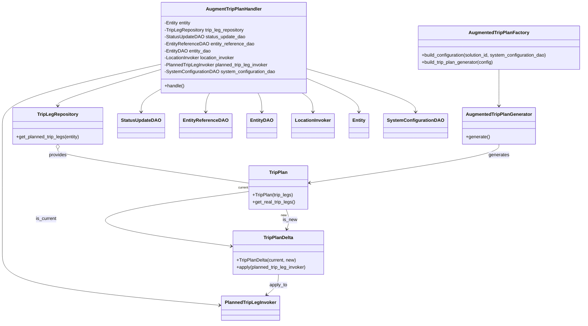
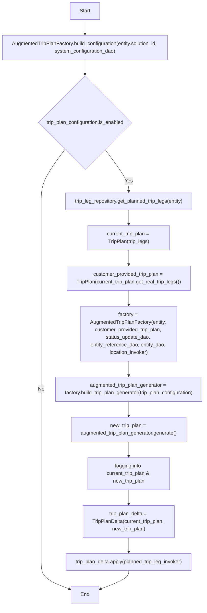

# Diagram: entity_core/entity_service/entity_service/trip_leg/trip_leg/augment_fv_trip_leg/augment_trip_plan_handler.py

> Auto-generated by Obscura crawlers

## Diagram 1

### SVG

<svg id="container" width="1953.886962890625" xmlns="http://www.w3.org/2000/svg" class="classDiagram" height="1110" viewBox="-36.2189998626709 0 1953.886962890625 1110" role="graphics-document document" aria-roledescription="class"><g><defs><marker id="container_class-aggregationStart" class="marker aggregation class" refX="18" refY="7" markerWidth="190" markerHeight="240" orient="auto"><path d="M 18,7 L9,13 L1,7 L9,1 Z"></path></marker></defs><defs><marker id="container_class-aggregationEnd" class="marker aggregation class" refX="1" refY="7" markerWidth="20" markerHeight="28" orient="auto"><path d="M 18,7 L9,13 L1,7 L9,1 Z"></path></marker></defs><defs><marker id="container_class-extensionStart" class="marker extension class" refX="18" refY="7" markerWidth="190" markerHeight="240" orient="auto"><path d="M 1,7 L18,13 V 1 Z"></path></marker></defs><defs><marker id="container_class-extensionEnd" class="marker extension class" refX="1" refY="7" markerWidth="20" markerHeight="28" orient="auto"><path d="M 1,1 V 13 L18,7 Z"></path></marker></defs><defs><marker id="container_class-compositionStart" class="marker composition class" refX="18" refY="7" markerWidth="190" markerHeight="240" orient="auto"><path d="M 18,7 L9,13 L1,7 L9,1 Z"></path></marker></defs><defs><marker id="container_class-compositionEnd" class="marker composition class" refX="1" refY="7" markerWidth="20" markerHeight="28" orient="auto"><path d="M 18,7 L9,13 L1,7 L9,1 Z"></path></marker></defs><defs><marker id="container_class-dependencyStart" class="marker dependency class" refX="6" refY="7" markerWidth="190" markerHeight="240" orient="auto"><path d="M 5,7 L9,13 L1,7 L9,1 Z"></path></marker></defs><defs><marker id="container_class-dependencyEnd" class="marker dependency class" refX="13" refY="7" markerWidth="20" markerHeight="28" orient="auto"><path d="M 18,7 L9,13 L14,7 L9,1 Z"></path></marker></defs><defs><marker id="container_class-lollipopStart" class="marker lollipop class" refX="13" refY="7" markerWidth="190" markerHeight="240" orient="auto"><circle stroke="black" fill="transparent" cx="7" cy="7" r="6"></circle></marker></defs><defs><marker id="container_class-lollipopEnd" class="marker lollipop class" refX="1" refY="7" markerWidth="190" markerHeight="240" orient="auto"><circle stroke="black" fill="transparent" cx="7" cy="7" r="6"></circle></marker></defs><g class="root"><g class="clusters"></g><g class="edgePaths"><path d="M999.969,271.929L1027.926,284.107C1055.883,296.286,1111.797,320.643,1139.754,339.488C1167.711,358.333,1167.711,371.667,1167.711,378.333L1167.711,385" id="id_AugmentTripPlanHandler_Entity_1" class="edge-thickness-normal edge-pattern-solid relation" style=";;;" data-edge="true" data-et="edge" data-id="id_AugmentTripPlanHandler_Entity_1" data-points="W3sieCI6OTk5Ljk2ODc1LCJ5IjoyNzEuOTI4ODc5NjU0Nzg2Njd9LHsieCI6MTE2Ny43MTA5Mzc1LCJ5IjozNDV9LHsieCI6MTE2Ny43MTA5Mzc1LCJ5IjozOTF9XQ==" marker-end="url(#container_class-dependencyEnd)"></path><path d="M504.445,240.284L447.761,257.737C391.077,275.189,277.708,310.095,221.024,330.714C164.34,351.333,164.34,357.667,164.34,360.833L164.34,364" id="id_AugmentTripPlanHandler_TripLegRepository_2" class="edge-thickness-normal edge-pattern-solid relation" style=";;;" data-edge="true" data-et="edge" data-id="id_AugmentTripPlanHandler_TripLegRepository_2" data-points="W3sieCI6NTA0LjQ0NTMxMjUsInkiOjI0MC4yODQwMTc5Njc0OTM3Mn0seyJ4IjoxNjQuMzM5ODQzNzUsInkiOjM0NX0seyJ4IjoxNjQuMzM5ODQzNzUsInkiOjM3MH1d" marker-end="url(#container_class-dependencyEnd)"></path><path d="M504.445,311.408L495.035,317.007C485.625,322.605,466.805,333.803,457.395,346.068C447.984,358.333,447.984,371.667,447.984,378.333L447.984,385" id="id_AugmentTripPlanHandler_StatusUpdateDAO_3" class="edge-thickness-normal edge-pattern-solid relation" style=";;;" data-edge="true" data-et="edge" data-id="id_AugmentTripPlanHandler_StatusUpdateDAO_3" data-points="W3sieCI6NTA0LjQ0NTMxMjUsInkiOjMxMS40MDgwNTg0NDgxNDUyNX0seyJ4Ijo0NDcuOTg0Mzc1LCJ5IjozNDV9LHsieCI6NDQ3Ljk4NDM3NSwieSI6MzkxfV0=" marker-end="url(#container_class-dependencyEnd)"></path><path d="M673.059,320L670.945,324.167C668.831,328.333,664.603,336.667,662.489,347.5C660.375,358.333,660.375,371.667,660.375,378.333L660.375,385" id="id_AugmentTripPlanHandler_EntityReferenceDAO_4" class="edge-thickness-normal edge-pattern-solid relation" style=";;;" data-edge="true" data-et="edge" data-id="id_AugmentTripPlanHandler_EntityReferenceDAO_4" data-points="W3sieCI6NjczLjA1ODk4MjIxNjg1MDgsInkiOjMyMH0seyJ4Ijo2NjAuMzc1LCJ5IjozNDV9LHsieCI6NjYwLjM3NSwieSI6MzkxfV0=" marker-end="url(#container_class-dependencyEnd)"></path><path d="M831.355,320L833.469,324.167C835.583,328.333,839.811,336.667,841.925,347.5C844.039,358.333,844.039,371.667,844.039,378.333L844.039,385" id="id_AugmentTripPlanHandler_EntityDAO_5" class="edge-thickness-normal edge-pattern-solid relation" style=";;;" data-edge="true" data-et="edge" data-id="id_AugmentTripPlanHandler_EntityDAO_5" data-points="W3sieCI6ODMxLjM1NTA4MDI4MzE0OTIsInkiOjMyMH0seyJ4Ijo4NDQuMDM5MDYyNSwieSI6MzQ1fSx7IngiOjg0NC4wMzkwNjI1LCJ5IjozOTF9XQ==" marker-end="url(#container_class-dependencyEnd)"></path><path d="M977.43,320L983.446,324.167C989.461,328.333,1001.492,336.667,1007.508,347.5C1013.523,358.333,1013.523,371.667,1013.523,378.333L1013.523,385" id="id_AugmentTripPlanHandler_LocationInvoker_6" class="edge-thickness-normal edge-pattern-solid relation" style=";;;" data-edge="true" data-et="edge" data-id="id_AugmentTripPlanHandler_LocationInvoker_6" data-points="W3sieCI6OTc3LjQzMDAxMTIyMjM3NTcsInkiOjMyMH0seyJ4IjoxMDEzLjUyMzQzNzUsInkiOjM0NX0seyJ4IjoxMDEzLjUyMzQzNzUsInkiOjM5MX1d" marker-end="url(#container_class-dependencyEnd)"></path><path d="M504.445,221.462L415.668,242.052C326.891,262.641,149.336,303.821,60.559,339.077C-28.219,374.333,-28.219,403.667,-28.219,435C-28.219,466.333,-28.219,499.667,-28.219,535C-28.219,570.333,-28.219,607.667,-28.219,645C-28.219,682.333,-28.219,719.667,-28.219,757C-28.219,794.333,-28.219,831.667,-28.219,869C-28.219,906.333,-28.219,943.667,92.637,973.87C213.492,1004.073,455.203,1027.146,576.058,1038.682L696.914,1050.218" id="id_AugmentTripPlanHandler_PlannedTripLegInvoker_7" class="edge-thickness-normal edge-pattern-solid relation" style=";;;" data-edge="true" data-et="edge" data-id="id_AugmentTripPlanHandler_PlannedTripLegInvoker_7" data-points="W3sieCI6NTA0LjQ0NTMxMjUsInkiOjIyMS40NjIwNTc0NzA2MzE1Mn0seyJ4IjotMjguMjE4NzUsInkiOjM0NX0seyJ4IjotMjguMjE4NzUsInkiOjQzM30seyJ4IjotMjguMjE4NzUsInkiOjUzM30seyJ4IjotMjguMjE4NzUsInkiOjY0NX0seyJ4IjotMjguMjE4NzUsInkiOjc1N30seyJ4IjotMjguMjE4NzUsInkiOjg2OX0seyJ4IjotMjguMjE4NzUsInkiOjk4MX0seyJ4Ijo3MDIuODg2NzE4NzUsInkiOjEwNTAuNzg4NDg1MjI4OTQwOH1d" marker-end="url(#container_class-dependencyEnd)"></path><path d="M999.969,238.493L1059.009,256.244C1118.049,273.995,1236.13,309.498,1295.171,333.915C1354.211,358.333,1354.211,371.667,1354.211,378.333L1354.211,385" id="id_AugmentTripPlanHandler_SystemConfigurationDAO_8" class="edge-thickness-normal edge-pattern-solid relation" style=";;;" data-edge="true" data-et="edge" data-id="id_AugmentTripPlanHandler_SystemConfigurationDAO_8" data-points="W3sieCI6OTk5Ljk2ODc1LCJ5IjoyMzguNDkyNjU3OTg0NzI1NX0seyJ4IjoxMzU0LjIxMDkzNzUsInkiOjM0NX0seyJ4IjoxMzU0LjIxMDkzNzUsInkiOjM5MX1d" marker-end="url(#container_class-dependencyEnd)"></path><path d="M164.34,513.25L164.34,516.542C164.34,519.833,164.34,526.417,269.502,545.8C374.663,565.183,584.987,597.367,690.149,613.459L795.311,629.55" id="id_TripLegRepository_TripPlan_9" class="edge-thickness-normal edge-pattern-solid relation" style=";;;" data-edge="true" data-et="edge" data-id="id_TripLegRepository_TripPlan_9" data-points="W3sieCI6MTY0LjMzOTg0Mzc1LCJ5Ijo0OTZ9LHsieCI6MTY0LjMzOTg0Mzc1LCJ5Ijo1MzN9LHsieCI6Nzk1LjMxMDU0Njg3NSwieSI6NjI5LjU1MDQ2Njg0MzMxNzN9XQ==" marker-start="url(#container_class-aggregationStart)"></path><path d="M1628.211,239L1628.211,256.667C1628.211,274.333,1628.211,309.667,1628.211,330.5C1628.211,351.333,1628.211,357.667,1628.211,360.833L1628.211,364" id="id_AugmentedTripPlanFactory_AugmentedTripPlanGenerator_10" class="edge-thickness-normal edge-pattern-solid relation" style=";;;" data-edge="true" data-et="edge" data-id="id_AugmentedTripPlanFactory_AugmentedTripPlanGenerator_10" data-points="W3sieCI6MTYyOC4yMTA5Mzc1LCJ5IjoyMzl9LHsieCI6MTYyOC4yMTA5Mzc1LCJ5IjozNDV9LHsieCI6MTYyOC4yMTA5Mzc1LCJ5IjozNzB9XQ==" marker-end="url(#container_class-dependencyEnd)"></path><path d="M1628.211,496L1628.211,502.167C1628.211,508.333,1628.211,520.667,1524.038,542.774C1419.864,564.881,1211.518,596.762,1107.344,612.702L1003.171,628.643" id="id_AugmentedTripPlanGenerator_TripPlan_11" class="edge-thickness-normal edge-pattern-solid relation" style=";;;" data-edge="true" data-et="edge" data-id="id_AugmentedTripPlanGenerator_TripPlan_11" data-points="W3sieCI6MTYyOC4yMTA5Mzc1LCJ5Ijo0OTZ9LHsieCI6MTYyOC4yMTA5Mzc1LCJ5Ijo1MzN9LHsieCI6OTk3LjI0MDIzNDM3NSwieSI6NjI5LjU1MDQ2Njg0MzMxNzN9XQ==" marker-end="url(#container_class-dependencyEnd)"></path><path d="M795.311,659.143L678.88,675.453C562.449,691.762,329.587,724.381,318.961,755.512C308.335,786.642,519.946,816.284,625.751,831.105L731.556,845.926" id="id_TripPlan_TripPlanDelta_12" class="edge-thickness-normal edge-pattern-solid relation" style=";;;" data-edge="true" data-et="edge" data-id="id_TripPlan_TripPlanDelta_12" data-points="W3sieCI6Nzk1LjMxMDU0Njg3NSwieSI6NjU5LjE0MzAxOTc2MjA3MzR9LHsieCI6OTYuNzI0NjA5Mzc1LCJ5Ijo3NTd9LHsieCI6NzM3LjQ5ODA0Njg3NSwieSI6ODQ2Ljc1ODY4Mjg1NDE0MTd9XQ==" marker-end="url(#container_class-dependencyEnd)"></path><path d="M923.359,720L925.586,726.167C927.813,732.333,932.267,744.667,932.607,756.059C932.946,767.452,929.172,777.904,927.284,783.131L925.397,788.357" id="id_TripPlan_TripPlanDelta_13" class="edge-thickness-normal edge-pattern-solid relation" style=";;;" data-edge="true" data-et="edge" data-id="id_TripPlan_TripPlanDelta_13" data-points="W3sieCI6OTIzLjM1OTMwNTI0NTUzNTcsInkiOjcyMH0seyJ4Ijo5MzYuNzIwNzAzMTI1LCJ5Ijo3NTd9LHsieCI6OTIzLjM1OTMwNTI0NTUzNTcsInkiOjc5NH1d" marker-end="url(#container_class-dependencyEnd)"></path><path d="M896.275,944L896.275,950.167C896.275,956.333,896.275,968.667,889.487,980.368C882.699,992.069,869.123,1003.139,862.335,1008.674L855.547,1014.208" id="id_TripPlanDelta_PlannedTripLegInvoker_14" class="edge-thickness-normal edge-pattern-solid relation" style=";;;" data-edge="true" data-et="edge" data-id="id_TripPlanDelta_PlannedTripLegInvoker_14" data-points="W3sieCI6ODk2LjI3NTM5MDYyNSwieSI6OTQ0fSx7IngiOjg5Ni4yNzUzOTA2MjUsInkiOjk4MX0seyJ4Ijo4NTAuODk3MTUxODk4NzM0MSwieSI6MTAxOH1d" marker-end="url(#container_class-dependencyEnd)"></path></g><g class="edgeLabels"><g class="edgeLabel"><g class="label" data-id="id_AugmentTripPlanHandler_Entity_1" transform="translate(0, 0)"><foreignObject width="0" height="0">

</foreignObject></g></g><g class="edgeLabel"><g class="label" data-id="id_AugmentTripPlanHandler_TripLegRepository_2" transform="translate(0, 0)"><foreignObject width="0" height="0">

</foreignObject></g></g><g class="edgeLabel"><g class="label" data-id="id_AugmentTripPlanHandler_StatusUpdateDAO_3" transform="translate(0, 0)"><foreignObject width="0" height="0">

</foreignObject></g></g><g class="edgeLabel"><g class="label" data-id="id_AugmentTripPlanHandler_EntityReferenceDAO_4" transform="translate(0, 0)"><foreignObject width="0" height="0">

</foreignObject></g></g><g class="edgeLabel"><g class="label" data-id="id_AugmentTripPlanHandler_EntityDAO_5" transform="translate(0, 0)"><foreignObject width="0" height="0">

</foreignObject></g></g><g class="edgeLabel"><g class="label" data-id="id_AugmentTripPlanHandler_LocationInvoker_6" transform="translate(0, 0)"><foreignObject width="0" height="0">

</foreignObject></g></g><g class="edgeLabel"><g class="label" data-id="id_AugmentTripPlanHandler_PlannedTripLegInvoker_7" transform="translate(0, 0)"><foreignObject width="0" height="0">

</foreignObject></g></g><g class="edgeLabel"><g class="label" data-id="id_AugmentTripPlanHandler_SystemConfigurationDAO_8" transform="translate(0, 0)"><foreignObject width="0" height="0">

</foreignObject></g></g><g class="edgeLabel" transform="translate(164.33984375, 533)"><g class="label" data-id="id_TripLegRepository_TripPlan_9" transform="translate(-31.3125, -12)"><foreignObject width="62.625" height="24">

provides

</foreignObject></g></g><g class="edgeLabel"><g class="label" data-id="id_AugmentedTripPlanFactory_AugmentedTripPlanGenerator_10" transform="translate(0, 0)"><foreignObject width="0" height="0">

</foreignObject></g></g><g class="edgeLabel" transform="translate(1628.2109375, 533)"><g class="label" data-id="id_AugmentedTripPlanGenerator_TripPlan_11" transform="translate(-35.46875, -12)"><foreignObject width="70.9375" height="24">

generates

</foreignObject></g></g><g class="edgeLabel" transform="translate(125.63086, 752.95085)"><g class="label" data-id="id_TripPlan_TripPlanDelta_12" transform="translate(-36.109375, -12)"><foreignObject width="72.21875" height="24">

is_current

</foreignObject></g></g><g class="edgeLabel" transform="translate(936.720703125, 757)"><g class="label" data-id="id_TripPlan_TripPlanDelta_13" transform="translate(-24.78125, -12)"><foreignObject width="49.5625" height="24">

is_new

</foreignObject></g></g><g class="edgeLabel" transform="translate(896.275390625, 981)"><g class="label" data-id="id_TripPlanDelta_PlannedTripLegInvoker_14" transform="translate(-31.2578125, -12)"><foreignObject width="62.515625" height="24">

apply_to

</foreignObject></g></g><g class="edgeTerminals" transform="translate(775.898889075829, 646.7157292631591)"><g class="inner" transform="translate(0, 0)"><foreignObject style="width: 63px; height: 12px;">
current
</foreignObject></g></g><g class="edgeTerminals" transform="translate(915.1949246904184, 741.5544154378132)"><g class="inner" transform="translate(0, 0)"><foreignObject style="width: 27px; height: 12px;">
new
</foreignObject></g></g></g><g class="nodes"><g class="node default" id="classId-AugmentTripPlanHandler-0" transform="translate(752.20703125, 164)"><g class="basic label-container"><path d="M-247.76171875 -156 L247.76171875 -156 L247.76171875 156 L-247.76171875 156" stroke="none" stroke-width="0" fill="#ECECFF" style=""></path><path d="M-247.76171875 -156 C-124.8248223222641 -156, -1.8879258945281947 -156, 247.76171875 -156 M-247.76171875 -156 C-70.51829489252819 -156, 106.72512896494362 -156, 247.76171875 -156 M247.76171875 -156 C247.76171875 -74.41295537866748, 247.76171875 7.1740892426650475, 247.76171875 156 M247.76171875 -156 C247.76171875 -65.11797806419463, 247.76171875 25.76404387161074, 247.76171875 156 M247.76171875 156 C51.52600570585054 156, -144.70970733829893 156, -247.76171875 156 M247.76171875 156 C129.7737513517743 156, 11.785783953548645 156, -247.76171875 156 M-247.76171875 156 C-247.76171875 60.36359546097397, -247.76171875 -35.27280907805206, -247.76171875 -156 M-247.76171875 156 C-247.76171875 31.94017228068168, -247.76171875 -92.11965543863664, -247.76171875 -156" stroke="#9370DB" stroke-width="1.3" fill="none" stroke-dasharray="0 0" style=""></path></g><g class="annotation-group text" transform="translate(0, -132)"></g><g class="label-group text" transform="translate(-92.0546875, -132)"><g class="label" style="font-weight: bolder" transform="translate(0,-12)"><foreignObject width="184.109375" height="24">

AugmentTripPlanHandler

</foreignObject></g></g><g class="members-group text" transform="translate(-235.76171875, -84)"><g class="label" style="" transform="translate(0,-12)"><foreignObject width="94.28125" height="24">

-Entity entity

</foreignObject></g><g class="label" style="" transform="translate(0,12)"><foreignObject width="278.421875" height="24">

-TripLegRepository trip_leg_repository

</foreignObject></g><g class="label" style="" transform="translate(0,36)"><foreignObject width="277.265625" height="24">

-StatusUpdateDAO status_update_dao

</foreignObject></g><g class="label" style="" transform="translate(0,60)"><foreignObject width="307.734375" height="24">

-EntityReferenceDAO entity_reference_dao

</foreignObject></g><g class="label" style="" transform="translate(0,84)"><foreignObject width="159.640625" height="24">

-EntityDAO entity_dao

</foreignObject></g><g class="label" style="" transform="translate(0,108)"><foreignObject width="248.234375" height="24">

-LocationInvoker location_invoker

</foreignObject></g><g class="label" style="" transform="translate(0,132)"><foreignObject width="362.421875" height="24">

-PlannedTripLegInvoker planned_trip_leg_invoker

</foreignObject></g><g class="label" style="" transform="translate(0,156)"><foreignObject width="379.46875" height="24">

-SystemConfigurationDAO system_configuration_dao

</foreignObject></g></g><g class="methods-group text" transform="translate(-235.76171875, 132)"><g class="label" style="" transform="translate(0,-12)"><foreignObject width="68.71875" height="24">

+handle()

</foreignObject></g></g><g class="divider" style=""><path d="M-247.76171875 -108 C-136.3402031742064 -108, -24.918687598412816 -108, 247.76171875 -108 M-247.76171875 -108 C-58.74156187597049 -108, 130.27859499805902 -108, 247.76171875 -108" stroke="#9370DB" stroke-width="1.3" fill="none" stroke-dasharray="0 0" style=""></path></g><g class="divider" style=""><path d="M-247.76171875 108 C-55.5979205281015 108, 136.565877693797 108, 247.76171875 108 M-247.76171875 108 C-54.38843538833359 108, 138.98484797333282 108, 247.76171875 108" stroke="#9370DB" stroke-width="1.3" fill="none" stroke-dasharray="0 0" style=""></path></g></g><g class="node default" id="classId-AugmentedTripPlanFactory-1" transform="translate(1628.2109375, 164)"><g class="basic label-container"><path d="M-281.45703125 -75 L281.45703125 -75 L281.45703125 75 L-281.45703125 75" stroke="none" stroke-width="0" fill="#ECECFF" style=""></path><path d="M-281.45703125 -75 C-64.33526891268144 -75, 152.78649342463711 -75, 281.45703125 -75 M-281.45703125 -75 C-118.40138811315708 -75, 44.654255023685835 -75, 281.45703125 -75 M281.45703125 -75 C281.45703125 -21.523042716049538, 281.45703125 31.953914567900924, 281.45703125 75 M281.45703125 -75 C281.45703125 -19.070579572933802, 281.45703125 36.858840854132396, 281.45703125 75 M281.45703125 75 C167.8208653158096 75, 54.184699381619254 75, -281.45703125 75 M281.45703125 75 C118.56172895251785 75, -44.33357334496429 75, -281.45703125 75 M-281.45703125 75 C-281.45703125 24.96163898840227, -281.45703125 -25.076722023195458, -281.45703125 -75 M-281.45703125 75 C-281.45703125 41.517221936284116, -281.45703125 8.034443872568232, -281.45703125 -75" stroke="#9370DB" stroke-width="1.3" fill="none" stroke-dasharray="0 0" style=""></path></g><g class="annotation-group text" transform="translate(0, -51)"></g><g class="label-group text" transform="translate(-98.6328125, -51)"><g class="label" style="font-weight: bolder" transform="translate(0,-12)"><foreignObject width="197.265625" height="24">

AugmentedTripPlanFactory

</foreignObject></g></g><g class="members-group text" transform="translate(-269.45703125, -3)"></g><g class="methods-group text" transform="translate(-269.45703125, 27)"><g class="label" style="" transform="translate(0,-12)"><foreignObject width="440.28125" height="24">

+build_configuration(solution_id, system_configuration_dao)

</foreignObject></g><g class="label" style="" transform="translate(0,12)"><foreignObject width="252.3125" height="24">

+build_trip_plan_generator(config)

</foreignObject></g></g><g class="divider" style=""><path d="M-281.45703125 -27 C-166.66593483982814 -27, -51.87483842965628 -27, 281.45703125 -27 M-281.45703125 -27 C-146.0058223579864 -27, -10.554613465972807 -27, 281.45703125 -27" stroke="#9370DB" stroke-width="1.3" fill="none" stroke-dasharray="0 0" style=""></path></g><g class="divider" style=""><path d="M-281.45703125 -3 C-135.32498212393293 -3, 10.807067002134147 -3, 281.45703125 -3 M-281.45703125 -3 C-120.703013843891 -3, 40.051003562218 -3, 281.45703125 -3" stroke="#9370DB" stroke-width="1.3" fill="none" stroke-dasharray="0 0" style=""></path></g></g><g class="node default" id="classId-AugmentedTripPlanGenerator-2" transform="translate(1628.2109375, 433)"><g class="basic label-container"><path d="M-120.78125 -63 L120.78125 -63 L120.78125 63 L-120.78125 63" stroke="none" stroke-width="0" fill="#ECECFF" style=""></path><path d="M-120.78125 -63 C-31.486126923945847 -63, 57.80899615210831 -63, 120.78125 -63 M-120.78125 -63 C-38.883516348731575 -63, 43.01421730253685 -63, 120.78125 -63 M120.78125 -63 C120.78125 -35.49674441247402, 120.78125 -7.993488824948045, 120.78125 63 M120.78125 -63 C120.78125 -28.02465702988055, 120.78125 6.950685940238898, 120.78125 63 M120.78125 63 C26.81599595957414 63, -67.14925808085172 63, -120.78125 63 M120.78125 63 C53.20803478089958 63, -14.365180438200838 63, -120.78125 63 M-120.78125 63 C-120.78125 25.951915601784705, -120.78125 -11.09616879643059, -120.78125 -63 M-120.78125 63 C-120.78125 33.44586713586596, -120.78125 3.89173427173192, -120.78125 -63" stroke="#9370DB" stroke-width="1.3" fill="none" stroke-dasharray="0 0" style=""></path></g><g class="annotation-group text" transform="translate(0, -39)"></g><g class="label-group text" transform="translate(-108.78125, -39)"><g class="label" style="font-weight: bolder" transform="translate(0,-12)"><foreignObject width="217.5625" height="24">

AugmentedTripPlanGenerator

</foreignObject></g></g><g class="members-group text" transform="translate(-108.78125, 9)"></g><g class="methods-group text" transform="translate(-108.78125, 39)"><g class="label" style="" transform="translate(0,-12)"><foreignObject width="81.8125" height="24">

+generate()

</foreignObject></g></g><g class="divider" style=""><path d="M-120.78125 -15 C-31.94662945219261 -15, 56.88799109561478 -15, 120.78125 -15 M-120.78125 -15 C-52.20168261600715 -15, 16.377884767985705 -15, 120.78125 -15" stroke="#9370DB" stroke-width="1.3" fill="none" stroke-dasharray="0 0" style=""></path></g><g class="divider" style=""><path d="M-120.78125 9 C-42.32235419247752 9, 36.13654161504496 9, 120.78125 9 M-120.78125 9 C-67.48736684818019 9, -14.19348369636036 9, 120.78125 9" stroke="#9370DB" stroke-width="1.3" fill="none" stroke-dasharray="0 0" style=""></path></g></g><g class="node default" id="classId-TripLegRepository-3" transform="translate(164.33984375, 433)"><g class="basic label-container"><path d="M-156.33984375 -63 L156.33984375 -63 L156.33984375 63 L-156.33984375 63" stroke="none" stroke-width="0" fill="#ECECFF" style=""></path><path d="M-156.33984375 -63 C-44.98508591314052 -63, 66.36967192371895 -63, 156.33984375 -63 M-156.33984375 -63 C-63.55499810851329 -63, 29.229847532973423 -63, 156.33984375 -63 M156.33984375 -63 C156.33984375 -35.002834466451446, 156.33984375 -7.005668932902886, 156.33984375 63 M156.33984375 -63 C156.33984375 -21.23598382304693, 156.33984375 20.52803235390614, 156.33984375 63 M156.33984375 63 C33.14214473557584 63, -90.05555427884832 63, -156.33984375 63 M156.33984375 63 C36.16951736023539 63, -84.00080902952922 63, -156.33984375 63 M-156.33984375 63 C-156.33984375 22.613100640343205, -156.33984375 -17.77379871931359, -156.33984375 -63 M-156.33984375 63 C-156.33984375 13.50583059590845, -156.33984375 -35.9883388081831, -156.33984375 -63" stroke="#9370DB" stroke-width="1.3" fill="none" stroke-dasharray="0 0" style=""></path></g><g class="annotation-group text" transform="translate(0, -39)"></g><g class="label-group text" transform="translate(-66.8203125, -39)"><g class="label" style="font-weight: bolder" transform="translate(0,-12)"><foreignObject width="133.640625" height="24">

TripLegRepository

</foreignObject></g></g><g class="members-group text" transform="translate(-144.33984375, 9)"></g><g class="methods-group text" transform="translate(-144.33984375, 39)"><g class="label" style="" transform="translate(0,-12)"><foreignObject width="221.859375" height="24">

+get_planned_trip_legs(entity)

</foreignObject></g></g><g class="divider" style=""><path d="M-156.33984375 -15 C-71.58758431396902 -15, 13.164675122061965 -15, 156.33984375 -15 M-156.33984375 -15 C-66.5694902593288 -15, 23.200863231342396 -15, 156.33984375 -15" stroke="#9370DB" stroke-width="1.3" fill="none" stroke-dasharray="0 0" style=""></path></g><g class="divider" style=""><path d="M-156.33984375 9 C-39.92272683995587 9, 76.49439007008826 9, 156.33984375 9 M-156.33984375 9 C-66.64540986952767 9, 23.049024010944663 9, 156.33984375 9" stroke="#9370DB" stroke-width="1.3" fill="none" stroke-dasharray="0 0" style=""></path></g></g><g class="node default" id="classId-StatusUpdateDAO-4" transform="translate(447.984375, 433)"><g class="basic label-container"><path d="M-77.3046875 -42 L77.3046875 -42 L77.3046875 42 L-77.3046875 42" stroke="none" stroke-width="0" fill="#ECECFF" style=""></path><path d="M-77.3046875 -42 C-28.626501539060868 -42, 20.051684421878264 -42, 77.3046875 -42 M-77.3046875 -42 C-27.05459283434331 -42, 23.19550183131338 -42, 77.3046875 -42 M77.3046875 -42 C77.3046875 -18.124583418851284, 77.3046875 5.7508331622974325, 77.3046875 42 M77.3046875 -42 C77.3046875 -9.004790425172416, 77.3046875 23.990419149655168, 77.3046875 42 M77.3046875 42 C21.71175726924364 42, -33.88117296151272 42, -77.3046875 42 M77.3046875 42 C27.81949931592012 42, -21.665688868159762 42, -77.3046875 42 M-77.3046875 42 C-77.3046875 20.48881882264913, -77.3046875 -1.022362354701741, -77.3046875 -42 M-77.3046875 42 C-77.3046875 11.2865772968035, -77.3046875 -19.426845406393, -77.3046875 -42" stroke="#9370DB" stroke-width="1.3" fill="none" stroke-dasharray="0 0" style=""></path></g><g class="annotation-group text" transform="translate(0, -18)"></g><g class="label-group text" transform="translate(-65.3046875, -18)"><g class="label" style="font-weight: bolder" transform="translate(0,-12)"><foreignObject width="130.609375" height="24">

StatusUpdateDAO

</foreignObject></g></g><g class="members-group text" transform="translate(-65.3046875, 30)"></g><g class="methods-group text" transform="translate(-65.3046875, 60)"></g><g class="divider" style=""><path d="M-77.3046875 6 C-38.26245922337195 6, 0.7797690532561035 6, 77.3046875 6 M-77.3046875 6 C-42.61015298878826 6, -7.9156184775765155 6, 77.3046875 6" stroke="#9370DB" stroke-width="1.3" fill="none" stroke-dasharray="0 0" style=""></path></g><g class="divider" style=""><path d="M-77.3046875 24 C-19.26313668769145 24, 38.7784141246171 24, 77.3046875 24 M-77.3046875 24 C-36.8239840163316 24, 3.6567194673367993 24, 77.3046875 24" stroke="#9370DB" stroke-width="1.3" fill="none" stroke-dasharray="0 0" style=""></path></g></g><g class="node default" id="classId-EntityReferenceDAO-5" transform="translate(660.375, 433)"><g class="basic label-container"><path d="M-85.0859375 -42 L85.0859375 -42 L85.0859375 42 L-85.0859375 42" stroke="none" stroke-width="0" fill="#ECECFF" style=""></path><path d="M-85.0859375 -42 C-20.605722661723846 -42, 43.87449217655231 -42, 85.0859375 -42 M-85.0859375 -42 C-42.45835873914421 -42, 0.16922002171158113 -42, 85.0859375 -42 M85.0859375 -42 C85.0859375 -15.049752640981783, 85.0859375 11.900494718036434, 85.0859375 42 M85.0859375 -42 C85.0859375 -10.89983848071763, 85.0859375 20.20032303856474, 85.0859375 42 M85.0859375 42 C39.74062328014266 42, -5.604690939714686 42, -85.0859375 42 M85.0859375 42 C48.16069635270261 42, 11.235455205405216 42, -85.0859375 42 M-85.0859375 42 C-85.0859375 13.662655701705134, -85.0859375 -14.674688596589732, -85.0859375 -42 M-85.0859375 42 C-85.0859375 17.75363141683882, -85.0859375 -6.492737166322357, -85.0859375 -42" stroke="#9370DB" stroke-width="1.3" fill="none" stroke-dasharray="0 0" style=""></path></g><g class="annotation-group text" transform="translate(0, -18)"></g><g class="label-group text" transform="translate(-73.0859375, -18)"><g class="label" style="font-weight: bolder" transform="translate(0,-12)"><foreignObject width="146.171875" height="24">

EntityReferenceDAO

</foreignObject></g></g><g class="members-group text" transform="translate(-73.0859375, 30)"></g><g class="methods-group text" transform="translate(-73.0859375, 60)"></g><g class="divider" style=""><path d="M-85.0859375 6 C-24.701441495619704 6, 35.68305450876059 6, 85.0859375 6 M-85.0859375 6 C-30.88277262108759 6, 23.32039225782482 6, 85.0859375 6" stroke="#9370DB" stroke-width="1.3" fill="none" stroke-dasharray="0 0" style=""></path></g><g class="divider" style=""><path d="M-85.0859375 24 C-35.76186576650769 24, 13.56220596698462 24, 85.0859375 24 M-85.0859375 24 C-48.67211237228169 24, -12.258287244563377 24, 85.0859375 24" stroke="#9370DB" stroke-width="1.3" fill="none" stroke-dasharray="0 0" style=""></path></g></g><g class="node default" id="classId-EntityDAO-6" transform="translate(844.0390625, 433)"><g class="basic label-container"><path d="M-48.578125 -42 L48.578125 -42 L48.578125 42 L-48.578125 42" stroke="none" stroke-width="0" fill="#ECECFF" style=""></path><path d="M-48.578125 -42 C-13.699681282964299 -42, 21.178762434071402 -42, 48.578125 -42 M-48.578125 -42 C-16.402734680169807 -42, 15.772655639660385 -42, 48.578125 -42 M48.578125 -42 C48.578125 -17.678650559815992, 48.578125 6.642698880368016, 48.578125 42 M48.578125 -42 C48.578125 -20.780231945408648, 48.578125 0.43953610918270414, 48.578125 42 M48.578125 42 C14.881396246966503 42, -18.815332506066994 42, -48.578125 42 M48.578125 42 C26.894973563513517 42, 5.211822127027034 42, -48.578125 42 M-48.578125 42 C-48.578125 13.485964727882376, -48.578125 -15.028070544235248, -48.578125 -42 M-48.578125 42 C-48.578125 15.567010471356689, -48.578125 -10.865979057286623, -48.578125 -42" stroke="#9370DB" stroke-width="1.3" fill="none" stroke-dasharray="0 0" style=""></path></g><g class="annotation-group text" transform="translate(0, -18)"></g><g class="label-group text" transform="translate(-36.578125, -18)"><g class="label" style="font-weight: bolder" transform="translate(0,-12)"><foreignObject width="73.15625" height="24">

EntityDAO

</foreignObject></g></g><g class="members-group text" transform="translate(-36.578125, 30)"></g><g class="methods-group text" transform="translate(-36.578125, 60)"></g><g class="divider" style=""><path d="M-48.578125 6 C-23.33898736968544 6, 1.9001502606291183 6, 48.578125 6 M-48.578125 6 C-23.699013763607113 6, 1.180097472785775 6, 48.578125 6" stroke="#9370DB" stroke-width="1.3" fill="none" stroke-dasharray="0 0" style=""></path></g><g class="divider" style=""><path d="M-48.578125 24 C-24.110672504703913 24, 0.35677999059217314 24, 48.578125 24 M-48.578125 24 C-24.855680773927403 24, -1.133236547854807 24, 48.578125 24" stroke="#9370DB" stroke-width="1.3" fill="none" stroke-dasharray="0 0" style=""></path></g></g><g class="node default" id="classId-LocationInvoker-7" transform="translate(1013.5234375, 433)"><g class="basic label-container"><path d="M-70.90625 -42 L70.90625 -42 L70.90625 42 L-70.90625 42" stroke="none" stroke-width="0" fill="#ECECFF" style=""></path><path d="M-70.90625 -42 C-25.44066316470665 -42, 20.024923670586702 -42, 70.90625 -42 M-70.90625 -42 C-25.2596675193048 -42, 20.386914961390403 -42, 70.90625 -42 M70.90625 -42 C70.90625 -20.721023432585437, 70.90625 0.5579531348291269, 70.90625 42 M70.90625 -42 C70.90625 -21.303208325944063, 70.90625 -0.6064166518881251, 70.90625 42 M70.90625 42 C38.52060993506116 42, 6.134969870122319 42, -70.90625 42 M70.90625 42 C34.11336322798177 42, -2.6795235440364564 42, -70.90625 42 M-70.90625 42 C-70.90625 19.96789243398205, -70.90625 -2.0642151320358977, -70.90625 -42 M-70.90625 42 C-70.90625 18.37541031897593, -70.90625 -5.249179362048139, -70.90625 -42" stroke="#9370DB" stroke-width="1.3" fill="none" stroke-dasharray="0 0" style=""></path></g><g class="annotation-group text" transform="translate(0, -18)"></g><g class="label-group text" transform="translate(-58.90625, -18)"><g class="label" style="font-weight: bolder" transform="translate(0,-12)"><foreignObject width="117.8125" height="24">

LocationInvoker

</foreignObject></g></g><g class="members-group text" transform="translate(-58.90625, 30)"></g><g class="methods-group text" transform="translate(-58.90625, 60)"></g><g class="divider" style=""><path d="M-70.90625 6 C-40.77042545268776 6, -10.634600905375514 6, 70.90625 6 M-70.90625 6 C-34.67243929380725 6, 1.5613714123854976 6, 70.90625 6" stroke="#9370DB" stroke-width="1.3" fill="none" stroke-dasharray="0 0" style=""></path></g><g class="divider" style=""><path d="M-70.90625 24 C-30.4398497112335 24, 10.026550577533001 24, 70.90625 24 M-70.90625 24 C-36.36225626907982 24, -1.8182625381596438 24, 70.90625 24" stroke="#9370DB" stroke-width="1.3" fill="none" stroke-dasharray="0 0" style=""></path></g></g><g class="node default" id="classId-PlannedTripLegInvoker-8" transform="translate(799.38671875, 1060)"><g class="basic label-container"><path d="M-96.5 -42 L96.5 -42 L96.5 42 L-96.5 42" stroke="none" stroke-width="0" fill="#ECECFF" style=""></path><path d="M-96.5 -42 C-41.871192469261935 -42, 12.75761506147613 -42, 96.5 -42 M-96.5 -42 C-19.771578890075062 -42, 56.956842219849875 -42, 96.5 -42 M96.5 -42 C96.5 -9.985312748166734, 96.5 22.02937450366653, 96.5 42 M96.5 -42 C96.5 -16.510138455872376, 96.5 8.979723088255248, 96.5 42 M96.5 42 C46.65651615772098 42, -3.1869676845580415 42, -96.5 42 M96.5 42 C34.81265764560291 42, -26.874684708794177 42, -96.5 42 M-96.5 42 C-96.5 9.052870889935718, -96.5 -23.894258220128563, -96.5 -42 M-96.5 42 C-96.5 16.402799417657388, -96.5 -9.194401164685225, -96.5 -42" stroke="#9370DB" stroke-width="1.3" fill="none" stroke-dasharray="0 0" style=""></path></g><g class="annotation-group text" transform="translate(0, -18)"></g><g class="label-group text" transform="translate(-84.5, -18)"><g class="label" style="font-weight: bolder" transform="translate(0,-12)"><foreignObject width="169" height="24">

PlannedTripLegInvoker

</foreignObject></g></g><g class="members-group text" transform="translate(-84.5, 30)"></g><g class="methods-group text" transform="translate(-84.5, 60)"></g><g class="divider" style=""><path d="M-96.5 6 C-54.4794407515401 6, -12.458881503080207 6, 96.5 6 M-96.5 6 C-54.76207955269788 6, -13.024159105395753 6, 96.5 6" stroke="#9370DB" stroke-width="1.3" fill="none" stroke-dasharray="0 0" style=""></path></g><g class="divider" style=""><path d="M-96.5 24 C-54.46837176126337 24, -12.43674352252674 24, 96.5 24 M-96.5 24 C-53.63827678457547 24, -10.776553569150934 24, 96.5 24" stroke="#9370DB" stroke-width="1.3" fill="none" stroke-dasharray="0 0" style=""></path></g></g><g class="node default" id="classId-TripPlan-9" transform="translate(896.275390625, 645)"><g class="basic label-container"><path d="M-100.96484375 -75 L100.96484375 -75 L100.96484375 75 L-100.96484375 75" stroke="none" stroke-width="0" fill="#ECECFF" style=""></path><path d="M-100.96484375 -75 C-47.705672034841044 -75, 5.553499680317913 -75, 100.96484375 -75 M-100.96484375 -75 C-23.312564243031005 -75, 54.33971526393799 -75, 100.96484375 -75 M100.96484375 -75 C100.96484375 -41.584171741802585, 100.96484375 -8.16834348360517, 100.96484375 75 M100.96484375 -75 C100.96484375 -24.028444278323633, 100.96484375 26.943111443352734, 100.96484375 75 M100.96484375 75 C46.17498377241136 75, -8.614876205177282 75, -100.96484375 75 M100.96484375 75 C41.70739754882992 75, -17.550048652340166 75, -100.96484375 75 M-100.96484375 75 C-100.96484375 44.97230842595176, -100.96484375 14.944616851903518, -100.96484375 -75 M-100.96484375 75 C-100.96484375 20.660635862425586, -100.96484375 -33.67872827514883, -100.96484375 -75" stroke="#9370DB" stroke-width="1.3" fill="none" stroke-dasharray="0 0" style=""></path></g><g class="annotation-group text" transform="translate(0, -51)"></g><g class="label-group text" transform="translate(-30.3828125, -51)"><g class="label" style="font-weight: bolder" transform="translate(0,-12)"><foreignObject width="60.765625" height="24">

TripPlan

</foreignObject></g></g><g class="members-group text" transform="translate(-88.96484375, -3)"></g><g class="methods-group text" transform="translate(-88.96484375, 27)"><g class="label" style="" transform="translate(0,-12)"><foreignObject width="140.1875" height="24">

+TripPlan(trip_legs)

</foreignObject></g><g class="label" style="" transform="translate(0,12)"><foreignObject width="147.546875" height="24">

+get_real_trip_legs()

</foreignObject></g></g><g class="divider" style=""><path d="M-100.96484375 -27 C-26.804221919088505 -27, 47.35639991182299 -27, 100.96484375 -27 M-100.96484375 -27 C-28.907523636801727 -27, 43.149796476396546 -27, 100.96484375 -27" stroke="#9370DB" stroke-width="1.3" fill="none" stroke-dasharray="0 0" style=""></path></g><g class="divider" style=""><path d="M-100.96484375 -3 C-58.28640638261518 -3, -15.607969015230367 -3, 100.96484375 -3 M-100.96484375 -3 C-20.516435290357563 -3, 59.93197316928487 -3, 100.96484375 -3" stroke="#9370DB" stroke-width="1.3" fill="none" stroke-dasharray="0 0" style=""></path></g></g><g class="node default" id="classId-TripPlanDelta-10" transform="translate(896.275390625, 869)"><g class="basic label-container"><path d="M-158.77734375 -75 L158.77734375 -75 L158.77734375 75 L-158.77734375 75" stroke="none" stroke-width="0" fill="#ECECFF" style=""></path><path d="M-158.77734375 -75 C-37.4701849242734 -75, 83.8369739014532 -75, 158.77734375 -75 M-158.77734375 -75 C-87.4782974667805 -75, -16.179251183561007 -75, 158.77734375 -75 M158.77734375 -75 C158.77734375 -24.64844912910096, 158.77734375 25.70310174179808, 158.77734375 75 M158.77734375 -75 C158.77734375 -17.121522315462848, 158.77734375 40.756955369074305, 158.77734375 75 M158.77734375 75 C72.1249179809936 75, -14.527507788012798 75, -158.77734375 75 M158.77734375 75 C91.93671802704583 75, 25.096092304091655 75, -158.77734375 75 M-158.77734375 75 C-158.77734375 40.591536231850974, -158.77734375 6.183072463701947, -158.77734375 -75 M-158.77734375 75 C-158.77734375 28.807062851396054, -158.77734375 -17.38587429720789, -158.77734375 -75" stroke="#9370DB" stroke-width="1.3" fill="none" stroke-dasharray="0 0" style=""></path></g><g class="annotation-group text" transform="translate(0, -51)"></g><g class="label-group text" transform="translate(-49.7578125, -51)"><g class="label" style="font-weight: bolder" transform="translate(0,-12)"><foreignObject width="99.515625" height="24">

TripPlanDelta

</foreignObject></g></g><g class="members-group text" transform="translate(-146.77734375, -3)"></g><g class="methods-group text" transform="translate(-146.77734375, 27)"><g class="label" style="" transform="translate(0,-12)"><foreignObject width="205.703125" height="24">

+TripPlanDelta(current, new)

</foreignObject></g><g class="label" style="" transform="translate(0,12)"><foreignObject width="243.796875" height="24">

+apply(planned_trip_leg_invoker)

</foreignObject></g></g><g class="divider" style=""><path d="M-158.77734375 -27 C-70.13190316809816 -27, 18.513537413803675 -27, 158.77734375 -27 M-158.77734375 -27 C-66.9688000290107 -27, 24.83974369197861 -27, 158.77734375 -27" stroke="#9370DB" stroke-width="1.3" fill="none" stroke-dasharray="0 0" style=""></path></g><g class="divider" style=""><path d="M-158.77734375 -3 C-36.25482226754029 -3, 86.26769921491942 -3, 158.77734375 -3 M-158.77734375 -3 C-42.37137201357393 -3, 74.03459972285214 -3, 158.77734375 -3" stroke="#9370DB" stroke-width="1.3" fill="none" stroke-dasharray="0 0" style=""></path></g></g><g class="node default" id="classId-Entity-11" transform="translate(1167.7109375, 433)"><g class="basic label-container"><path d="M-33.28125 -42 L33.28125 -42 L33.28125 42 L-33.28125 42" stroke="none" stroke-width="0" fill="#ECECFF" style=""></path><path d="M-33.28125 -42 C-7.777905970955132 -42, 17.725438058089736 -42, 33.28125 -42 M-33.28125 -42 C-8.68673407320518 -42, 15.90778185358964 -42, 33.28125 -42 M33.28125 -42 C33.28125 -16.12590773015403, 33.28125 9.748184539691941, 33.28125 42 M33.28125 -42 C33.28125 -11.894589275032843, 33.28125 18.210821449934315, 33.28125 42 M33.28125 42 C7.688046407264409 42, -17.905157185471182 42, -33.28125 42 M33.28125 42 C17.4535905095929 42, 1.6259310191857992 42, -33.28125 42 M-33.28125 42 C-33.28125 16.303221743334557, -33.28125 -9.393556513330886, -33.28125 -42 M-33.28125 42 C-33.28125 15.227201394777865, -33.28125 -11.54559721044427, -33.28125 -42" stroke="#9370DB" stroke-width="1.3" fill="none" stroke-dasharray="0 0" style=""></path></g><g class="annotation-group text" transform="translate(0, -18)"></g><g class="label-group text" transform="translate(-21.28125, -18)"><g class="label" style="font-weight: bolder" transform="translate(0,-12)"><foreignObject width="42.5625" height="24">

Entity

</foreignObject></g></g><g class="members-group text" transform="translate(-21.28125, 30)"></g><g class="methods-group text" transform="translate(-21.28125, 60)"></g><g class="divider" style=""><path d="M-33.28125 6 C-15.942941080335942 6, 1.3953678393281166 6, 33.28125 6 M-33.28125 6 C-19.078007189190615 6, -4.874764378381226 6, 33.28125 6" stroke="#9370DB" stroke-width="1.3" fill="none" stroke-dasharray="0 0" style=""></path></g><g class="divider" style=""><path d="M-33.28125 24 C-18.432458955330247 24, -3.5836679106604983 24, 33.28125 24 M-33.28125 24 C-9.51228254591106 24, 14.256684908177881 24, 33.28125 24" stroke="#9370DB" stroke-width="1.3" fill="none" stroke-dasharray="0 0" style=""></path></g></g><g class="node default" id="classId-SystemConfigurationDAO-12" transform="translate(1354.2109375, 433)"><g class="basic label-container"><path d="M-103.21875 -42 L103.21875 -42 L103.21875 42 L-103.21875 42" stroke="none" stroke-width="0" fill="#ECECFF" style=""></path><path d="M-103.21875 -42 C-21.215486078056117 -42, 60.78777784388777 -42, 103.21875 -42 M-103.21875 -42 C-24.265490730046608 -42, 54.687768539906784 -42, 103.21875 -42 M103.21875 -42 C103.21875 -14.812500407386413, 103.21875 12.374999185227175, 103.21875 42 M103.21875 -42 C103.21875 -20.775436310335177, 103.21875 0.44912737932964575, 103.21875 42 M103.21875 42 C27.929957486386144 42, -47.35883502722771 42, -103.21875 42 M103.21875 42 C31.866398773608182 42, -39.485952452783636 42, -103.21875 42 M-103.21875 42 C-103.21875 8.856025638261492, -103.21875 -24.287948723477015, -103.21875 -42 M-103.21875 42 C-103.21875 9.998921212926078, -103.21875 -22.002157574147844, -103.21875 -42" stroke="#9370DB" stroke-width="1.3" fill="none" stroke-dasharray="0 0" style=""></path></g><g class="annotation-group text" transform="translate(0, -18)"></g><g class="label-group text" transform="translate(-91.21875, -18)"><g class="label" style="font-weight: bolder" transform="translate(0,-12)"><foreignObject width="182.4375" height="24">

SystemConfigurationDAO

</foreignObject></g></g><g class="members-group text" transform="translate(-91.21875, 30)"></g><g class="methods-group text" transform="translate(-91.21875, 60)"></g><g class="divider" style=""><path d="M-103.21875 6 C-23.32436238756391 6, 56.57002522487218 6, 103.21875 6 M-103.21875 6 C-56.95835992610974 6, -10.697969852219487 6, 103.21875 6" stroke="#9370DB" stroke-width="1.3" fill="none" stroke-dasharray="0 0" style=""></path></g><g class="divider" style=""><path d="M-103.21875 24 C-31.049888669103908 24, 41.118972661792185 24, 103.21875 24 M-103.21875 24 C-48.234182225338266 24, 6.750385549323468 24, 103.21875 24" stroke="#9370DB" stroke-width="1.3" fill="none" stroke-dasharray="0 0" style=""></path></g></g></g></g></g></svg>

## Diagram 2

### SVG

<svg id="container" width="671.8359375" xmlns="http://www.w3.org/2000/svg" class="flowchart" height="1930.921875" viewBox="0 0 671.8359375 1930.921875" role="graphics-document document" aria-roledescription="flowchart-v2"><g><marker id="container_flowchart-v2-pointEnd" class="marker flowchart-v2" viewBox="0 0 10 10" refX="5" refY="5" markerUnits="userSpaceOnUse" markerWidth="8" markerHeight="8" orient="auto"><path d="M 0 0 L 10 5 L 0 10 z" class="arrowMarkerPath" style="stroke-width: 1; stroke-dasharray: 1, 0;"></path></marker><marker id="container_flowchart-v2-pointStart" class="marker flowchart-v2" viewBox="0 0 10 10" refX="4.5" refY="5" markerUnits="userSpaceOnUse" markerWidth="8" markerHeight="8" orient="auto"><path d="M 0 5 L 10 10 L 10 0 z" class="arrowMarkerPath" style="stroke-width: 1; stroke-dasharray: 1, 0;"></path></marker><marker id="container_flowchart-v2-circleEnd" class="marker flowchart-v2" viewBox="0 0 10 10" refX="11" refY="5" markerUnits="userSpaceOnUse" markerWidth="11" markerHeight="11" orient="auto"><circle cx="5" cy="5" r="5" class="arrowMarkerPath" style="stroke-width: 1; stroke-dasharray: 1, 0;"></circle></marker><marker id="container_flowchart-v2-circleStart" class="marker flowchart-v2" viewBox="0 0 10 10" refX="-1" refY="5" markerUnits="userSpaceOnUse" markerWidth="11" markerHeight="11" orient="auto"><circle cx="5" cy="5" r="5" class="arrowMarkerPath" style="stroke-width: 1; stroke-dasharray: 1, 0;"></circle></marker><marker id="container_flowchart-v2-crossEnd" class="marker cross flowchart-v2" viewBox="0 0 11 11" refX="12" refY="5.2" markerUnits="userSpaceOnUse" markerWidth="11" markerHeight="11" orient="auto"><path d="M 1,1 l 9,9 M 10,1 l -9,9" class="arrowMarkerPath" style="stroke-width: 2; stroke-dasharray: 1, 0;"></path></marker><marker id="container_flowchart-v2-crossStart" class="marker cross flowchart-v2" viewBox="0 0 11 11" refX="-1" refY="5.2" markerUnits="userSpaceOnUse" markerWidth="11" markerHeight="11" orient="auto"><path d="M 1,1 l 9,9 M 10,1 l -9,9" class="arrowMarkerPath" style="stroke-width: 2; stroke-dasharray: 1, 0;"></path></marker><g class="root"><g class="clusters"></g><g class="edgePaths"><path d="M277.938,62L277.938,66.167C277.938,70.333,277.938,78.667,277.938,86.333C277.938,94,277.938,101,277.938,104.5L277.938,108" id="L_Start_BuildConfig_0" class="edge-thickness-normal edge-pattern-solid edge-thickness-normal edge-pattern-solid flowchart-link" style=";" data-edge="true" data-et="edge" data-id="L_Start_BuildConfig_0" data-points="W3sieCI6Mjc3LjkzNzUsInkiOjYyfSx7IngiOjI3Ny45Mzc1LCJ5Ijo4N30seyJ4IjoyNzcuOTM3NSwieSI6MTEyfV0=" marker-end="url(#container_flowchart-v2-pointEnd)"></path><path d="M277.938,190L277.938,194.167C277.938,198.333,277.938,206.667,277.938,214.333C277.938,222,277.938,229,277.938,232.5L277.938,236" id="L_BuildConfig_CheckEnabled_0" class="edge-thickness-normal edge-pattern-solid edge-thickness-normal edge-pattern-solid flowchart-link" style=";" data-edge="true" data-et="edge" data-id="L_BuildConfig_CheckEnabled_0" data-points="W3sieCI6Mjc3LjkzNzUsInkiOjE5MH0seyJ4IjoyNzcuOTM3NSwieSI6MjE1fSx7IngiOjI3Ny45Mzc1LCJ5IjoyNDB9XQ==" marker-end="url(#container_flowchart-v2-pointEnd)"></path><path d="M211.95,480.934L199.001,498.099C186.052,515.263,160.155,549.593,147.206,577.424C134.258,605.255,134.258,626.589,134.258,645.922C134.258,665.255,134.258,682.589,134.258,701.922C134.258,721.255,134.258,742.589,134.258,763.922C134.258,785.255,134.258,806.589,134.258,827.922C134.258,849.255,134.258,870.589,134.258,891.922C134.258,913.255,134.258,934.589,134.258,963.922C134.258,993.255,134.258,1030.589,134.258,1067.922C134.258,1105.255,134.258,1142.589,134.258,1171.922C134.258,1201.255,134.258,1222.589,134.258,1243.922C134.258,1265.255,134.258,1286.589,134.258,1307.922C134.258,1329.255,134.258,1350.589,134.258,1371.922C134.258,1393.255,134.258,1414.589,134.258,1437.922C134.258,1461.255,134.258,1486.589,134.258,1511.922C134.258,1537.255,134.258,1562.589,134.258,1587.922C134.258,1613.255,134.258,1638.589,134.258,1663.922C134.258,1689.255,134.258,1714.589,134.258,1735.922C134.258,1757.255,134.258,1774.589,134.258,1791.922C134.258,1809.255,134.258,1826.589,150.298,1841.06C166.337,1855.532,198.417,1867.142,214.457,1872.947L230.497,1878.752" id="L_CheckEnabled_End_0" class="edge-thickness-normal edge-pattern-solid edge-thickness-normal edge-pattern-solid flowchart-link" style=";" data-edge="true" data-et="edge" data-id="L_CheckEnabled_End_0" data-points="W3sieCI6MjExLjk0OTY1NTY4MDA5MTE4LCJ5Ijo0ODAuOTM0MDMwNjgwMDkxMn0seyJ4IjoxMzQuMjU3ODEyNSwieSI6NTgzLjkyMTg3NX0seyJ4IjoxMzQuMjU3ODEyNSwieSI6NjQ3LjkyMTg3NX0seyJ4IjoxMzQuMjU3ODEyNSwieSI6Njk5LjkyMTg3NX0seyJ4IjoxMzQuMjU3ODEyNSwieSI6NzYzLjkyMTg3NX0seyJ4IjoxMzQuMjU3ODEyNSwieSI6ODI3LjkyMTg3NX0seyJ4IjoxMzQuMjU3ODEyNSwieSI6ODkxLjkyMTg3NX0seyJ4IjoxMzQuMjU3ODEyNSwieSI6OTU1LjkyMTg3NX0seyJ4IjoxMzQuMjU3ODEyNSwieSI6MTA2Ny45MjE4NzV9LHsieCI6MTM0LjI1NzgxMjUsInkiOjExNzkuOTIxODc1fSx7IngiOjEzNC4yNTc4MTI1LCJ5IjoxMjQzLjkyMTg3NX0seyJ4IjoxMzQuMjU3ODEyNSwieSI6MTMwNy45MjE4NzV9LHsieCI6MTM0LjI1NzgxMjUsInkiOjEzNzEuOTIxODc1fSx7IngiOjEzNC4yNTc4MTI1LCJ5IjoxNDM1LjkyMTg3NX0seyJ4IjoxMzQuMjU3ODEyNSwieSI6MTUxMS45MjE4NzV9LHsieCI6MTM0LjI1NzgxMjUsInkiOjE1ODcuOTIxODc1fSx7IngiOjEzNC4yNTc4MTI1LCJ5IjoxNjYzLjkyMTg3NX0seyJ4IjoxMzQuMjU3ODEyNSwieSI6MTczOS45MjE4NzV9LHsieCI6MTM0LjI1NzgxMjUsInkiOjE3OTEuOTIxODc1fSx7IngiOjEzNC4yNTc4MTI1LCJ5IjoxODQzLjkyMTg3NX0seyJ4IjoyMzQuMjU3ODEyNSwieSI6MTg4MC4xMTM0OTA0NjQwODU4fV0=" marker-end="url(#container_flowchart-v2-pointEnd)"></path><path d="M343.925,480.934L356.874,498.099C369.823,515.263,395.72,549.593,408.669,572.257C421.617,594.922,421.617,605.922,421.617,611.422L421.617,616.922" id="L_CheckEnabled_GetPlanned_0" class="edge-thickness-normal edge-pattern-solid edge-thickness-normal edge-pattern-solid flowchart-link" style=";" data-edge="true" data-et="edge" data-id="L_CheckEnabled_GetPlanned_0" data-points="W3sieCI6MzQzLjkyNTM0NDMxOTkwODgsInkiOjQ4MC45MzQwMzA2ODAwOTEyfSx7IngiOjQyMS42MTcxODc1LCJ5Ijo1ODMuOTIxODc1fSx7IngiOjQyMS42MTcxODc1LCJ5Ijo2MjAuOTIxODc1fV0=" marker-end="url(#container_flowchart-v2-pointEnd)"></path><path d="M421.617,674.922L421.617,679.089C421.617,683.255,421.617,691.589,421.617,699.255C421.617,706.922,421.617,713.922,421.617,717.422L421.617,720.922" id="L_GetPlanned_CurrentPlan_0" class="edge-thickness-normal edge-pattern-solid edge-thickness-normal edge-pattern-solid flowchart-link" style=";" data-edge="true" data-et="edge" data-id="L_GetPlanned_CurrentPlan_0" data-points="W3sieCI6NDIxLjYxNzE4NzUsInkiOjY3NC45MjE4NzV9LHsieCI6NDIxLjYxNzE4NzUsInkiOjY5OS45MjE4NzV9LHsieCI6NDIxLjYxNzE4NzUsInkiOjcyNC45MjE4NzV9XQ==" marker-end="url(#container_flowchart-v2-pointEnd)"></path><path d="M421.617,802.922L421.617,807.089C421.617,811.255,421.617,819.589,421.617,827.255C421.617,834.922,421.617,841.922,421.617,845.422L421.617,848.922" id="L_CurrentPlan_CustomerPlan_0" class="edge-thickness-normal edge-pattern-solid edge-thickness-normal edge-pattern-solid flowchart-link" style=";" data-edge="true" data-et="edge" data-id="L_CurrentPlan_CustomerPlan_0" data-points="W3sieCI6NDIxLjYxNzE4NzUsInkiOjgwMi45MjE4NzV9LHsieCI6NDIxLjYxNzE4NzUsInkiOjgyNy45MjE4NzV9LHsieCI6NDIxLjYxNzE4NzUsInkiOjg1Mi45MjE4NzV9XQ==" marker-end="url(#container_flowchart-v2-pointEnd)"></path><path d="M421.617,930.922L421.617,935.089C421.617,939.255,421.617,947.589,421.617,955.255C421.617,962.922,421.617,969.922,421.617,973.422L421.617,976.922" id="L_CustomerPlan_Factory_0" class="edge-thickness-normal edge-pattern-solid edge-thickness-normal edge-pattern-solid flowchart-link" style=";" data-edge="true" data-et="edge" data-id="L_CustomerPlan_Factory_0" data-points="W3sieCI6NDIxLjYxNzE4NzUsInkiOjkzMC45MjE4NzV9LHsieCI6NDIxLjYxNzE4NzUsInkiOjk1NS45MjE4NzV9LHsieCI6NDIxLjYxNzE4NzUsInkiOjk4MC45MjE4NzV9XQ==" marker-end="url(#container_flowchart-v2-pointEnd)"></path><path d="M421.617,1154.922L421.617,1159.089C421.617,1163.255,421.617,1171.589,421.617,1179.255C421.617,1186.922,421.617,1193.922,421.617,1197.422L421.617,1200.922" id="L_Factory_BuildGenerator_0" class="edge-thickness-normal edge-pattern-solid edge-thickness-normal edge-pattern-solid flowchart-link" style=";" data-edge="true" data-et="edge" data-id="L_Factory_BuildGenerator_0" data-points="W3sieCI6NDIxLjYxNzE4NzUsInkiOjExNTQuOTIxODc1fSx7IngiOjQyMS42MTcxODc1LCJ5IjoxMTc5LjkyMTg3NX0seyJ4Ijo0MjEuNjE3MTg3NSwieSI6MTIwNC45MjE4NzV9XQ==" marker-end="url(#container_flowchart-v2-pointEnd)"></path><path d="M421.617,1282.922L421.617,1287.089C421.617,1291.255,421.617,1299.589,421.617,1307.255C421.617,1314.922,421.617,1321.922,421.617,1325.422L421.617,1328.922" id="L_BuildGenerator_NewPlan_0" class="edge-thickness-normal edge-pattern-solid edge-thickness-normal edge-pattern-solid flowchart-link" style=";" data-edge="true" data-et="edge" data-id="L_BuildGenerator_NewPlan_0" data-points="W3sieCI6NDIxLjYxNzE4NzUsInkiOjEyODIuOTIxODc1fSx7IngiOjQyMS42MTcxODc1LCJ5IjoxMzA3LjkyMTg3NX0seyJ4Ijo0MjEuNjE3MTg3NSwieSI6MTMzMi45MjE4NzV9XQ==" marker-end="url(#container_flowchart-v2-pointEnd)"></path><path d="M421.617,1410.922L421.617,1415.089C421.617,1419.255,421.617,1427.589,421.617,1435.255C421.617,1442.922,421.617,1449.922,421.617,1453.422L421.617,1456.922" id="L_NewPlan_Log_0" class="edge-thickness-normal edge-pattern-solid edge-thickness-normal edge-pattern-solid flowchart-link" style=";" data-edge="true" data-et="edge" data-id="L_NewPlan_Log_0" data-points="W3sieCI6NDIxLjYxNzE4NzUsInkiOjE0MTAuOTIxODc1fSx7IngiOjQyMS42MTcxODc1LCJ5IjoxNDM1LjkyMTg3NX0seyJ4Ijo0MjEuNjE3MTg3NSwieSI6MTQ2MC45MjE4NzV9XQ==" marker-end="url(#container_flowchart-v2-pointEnd)"></path><path d="M421.617,1562.922L421.617,1567.089C421.617,1571.255,421.617,1579.589,421.617,1587.255C421.617,1594.922,421.617,1601.922,421.617,1605.422L421.617,1608.922" id="L_Log_Delta_0" class="edge-thickness-normal edge-pattern-solid edge-thickness-normal edge-pattern-solid flowchart-link" style=";" data-edge="true" data-et="edge" data-id="L_Log_Delta_0" data-points="W3sieCI6NDIxLjYxNzE4NzUsInkiOjE1NjIuOTIxODc1fSx7IngiOjQyMS42MTcxODc1LCJ5IjoxNTg3LjkyMTg3NX0seyJ4Ijo0MjEuNjE3MTg3NSwieSI6MTYxMi45MjE4NzV9XQ==" marker-end="url(#container_flowchart-v2-pointEnd)"></path><path d="M421.617,1714.922L421.617,1719.089C421.617,1723.255,421.617,1731.589,421.617,1739.255C421.617,1746.922,421.617,1753.922,421.617,1757.422L421.617,1760.922" id="L_Delta_Apply_0" class="edge-thickness-normal edge-pattern-solid edge-thickness-normal edge-pattern-solid flowchart-link" style=";" data-edge="true" data-et="edge" data-id="L_Delta_Apply_0" data-points="W3sieCI6NDIxLjYxNzE4NzUsInkiOjE3MTQuOTIxODc1fSx7IngiOjQyMS42MTcxODc1LCJ5IjoxNzM5LjkyMTg3NX0seyJ4Ijo0MjEuNjE3MTg3NSwieSI6MTc2NC45MjE4NzV9XQ==" marker-end="url(#container_flowchart-v2-pointEnd)"></path><path d="M421.617,1818.922L421.617,1823.089C421.617,1827.255,421.617,1835.589,405.577,1845.56C389.538,1855.532,357.458,1867.142,341.418,1872.947L325.378,1878.752" id="L_Apply_End_0" class="edge-thickness-normal edge-pattern-solid edge-thickness-normal edge-pattern-solid flowchart-link" style=";" data-edge="true" data-et="edge" data-id="L_Apply_End_0" data-points="W3sieCI6NDIxLjYxNzE4NzUsInkiOjE4MTguOTIxODc1fSx7IngiOjQyMS42MTcxODc1LCJ5IjoxODQzLjkyMTg3NX0seyJ4IjozMjEuNjE3MTg3NSwieSI6MTg4MC4xMTM0OTA0NjQwODU4fV0=" marker-end="url(#container_flowchart-v2-pointEnd)"></path></g><g class="edgeLabels"><g class="edgeLabel"><g class="label" data-id="L_Start_BuildConfig_0" transform="translate(0, 0)"><foreignObject width="0" height="0">

</foreignObject></g></g><g class="edgeLabel"><g class="label" data-id="L_BuildConfig_CheckEnabled_0" transform="translate(0, 0)"><foreignObject width="0" height="0">

</foreignObject></g></g><g class="edgeLabel" transform="translate(134.2578125, 1243.921875)"><g class="label" data-id="L_CheckEnabled_End_0" transform="translate(-10.140625, -12)"><foreignObject width="20.28125" height="24">

No

</foreignObject></g></g><g class="edgeLabel" transform="translate(421.6171875, 583.921875)"><g class="label" data-id="L_CheckEnabled_GetPlanned_0" transform="translate(-12.03125, -12)"><foreignObject width="24.0625" height="24">

Yes

</foreignObject></g></g><g class="edgeLabel"><g class="label" data-id="L_GetPlanned_CurrentPlan_0" transform="translate(0, 0)"><foreignObject width="0" height="0">

</foreignObject></g></g><g class="edgeLabel"><g class="label" data-id="L_CurrentPlan_CustomerPlan_0" transform="translate(0, 0)"><foreignObject width="0" height="0">

</foreignObject></g></g><g class="edgeLabel"><g class="label" data-id="L_CustomerPlan_Factory_0" transform="translate(0, 0)"><foreignObject width="0" height="0">

</foreignObject></g></g><g class="edgeLabel"><g class="label" data-id="L_Factory_BuildGenerator_0" transform="translate(0, 0)"><foreignObject width="0" height="0">

</foreignObject></g></g><g class="edgeLabel"><g class="label" data-id="L_BuildGenerator_NewPlan_0" transform="translate(0, 0)"><foreignObject width="0" height="0">

</foreignObject></g></g><g class="edgeLabel"><g class="label" data-id="L_NewPlan_Log_0" transform="translate(0, 0)"><foreignObject width="0" height="0">

</foreignObject></g></g><g class="edgeLabel"><g class="label" data-id="L_Log_Delta_0" transform="translate(0, 0)"><foreignObject width="0" height="0">

</foreignObject></g></g><g class="edgeLabel"><g class="label" data-id="L_Delta_Apply_0" transform="translate(0, 0)"><foreignObject width="0" height="0">

</foreignObject></g></g><g class="edgeLabel"><g class="label" data-id="L_Apply_End_0" transform="translate(0, 0)"><foreignObject width="0" height="0">

</foreignObject></g></g></g><g class="nodes"><g class="node default" id="flowchart-Start-0" transform="translate(277.9375, 35)"><rect class="basic label-container" style="" x="-47.5234375" y="-27" width="95.046875" height="54"></rect><g class="label" style="" transform="translate(-17.5234375, -12)"><rect></rect><foreignObject width="35.046875" height="24">

Start

</foreignObject></g></g><g class="node default" id="flowchart-BuildConfig-1" transform="translate(277.9375, 151)"><rect class="basic label-container" style="" x="-269.9375" y="-39" width="539.875" height="78"></rect><g class="label" style="" transform="translate(-239.9375, -24)"><rect></rect><foreignObject width="479.875" height="48">

AugmentedTripPlanFactory.build_configuration(entity.solution_id, system_configuration_dao)

</foreignObject></g></g><g class="node default" id="flowchart-CheckEnabled-3" transform="translate(277.9375, 393.4609375)"><polygon points="153.4609375,0 306.921875,-153.4609375 153.4609375,-306.921875 0,-153.4609375" class="label-container" transform="translate(-152.9609375, 153.4609375)"></polygon><g class="label" style="" transform="translate(-126.4609375, -12)"><rect></rect><foreignObject width="252.921875" height="24">

trip_plan_configuration.is_enabled

</foreignObject></g></g><g class="node default" id="flowchart-End-5" transform="translate(277.9375, 1895.921875)"><rect class="basic label-container" style="" x="-43.6796875" y="-27" width="87.359375" height="54"></rect><g class="label" style="" transform="translate(-13.6796875, -12)"><rect></rect><foreignObject width="27.359375" height="24">

End

</foreignObject></g></g><g class="node default" id="flowchart-GetPlanned-7" transform="translate(421.6171875, 647.921875)"><rect class="basic label-container" style="" x="-207.46875" y="-27" width="414.9375" height="54"></rect><g class="label" style="" transform="translate(-177.46875, -12)"><rect></rect><foreignObject width="354.9375" height="24">

trip_leg_repository.get_planned_trip_legs(entity)

</foreignObject></g></g><g class="node default" id="flowchart-CurrentPlan-9" transform="translate(421.6171875, 763.921875)"><rect class="basic label-container" style="" x="-130" y="-39" width="260" height="78"></rect><g class="label" style="" transform="translate(-100, -24)"><rect></rect><foreignObject width="200" height="48">

current_trip_plan = TripPlan(trip_legs)

</foreignObject></g></g><g class="node default" id="flowchart-CustomerPlan-11" transform="translate(421.6171875, 891.921875)"><rect class="basic label-container" style="" x="-200.0546875" y="-39" width="400.109375" height="78"></rect><g class="label" style="" transform="translate(-170.0546875, -24)"><rect></rect><foreignObject width="340.109375" height="48">

customer_provided_trip_plan = TripPlan(current_trip_plan.get_real_trip_legs())

</foreignObject></g></g><g class="node default" id="flowchart-Factory-13" transform="translate(421.6171875, 1067.921875)"><rect class="basic label-container" style="" x="-154.4921875" y="-87" width="308.984375" height="174"></rect><g class="label" style="" transform="translate(-124.4921875, -72)"><rect></rect><foreignObject width="248.984375" height="144">

factory = AugmentedTripPlanFactory(entity, customer_provided_trip_plan, status_update_dao, entity_reference_dao, entity_dao, location_invoker)

</foreignObject></g></g><g class="node default" id="flowchart-BuildGenerator-15" transform="translate(421.6171875, 1243.921875)"><rect class="basic label-container" style="" x="-242.21875" y="-39" width="484.4375" height="78"></rect><g class="label" style="" transform="translate(-212.21875, -24)"><rect></rect><foreignObject width="424.4375" height="48">

augmented_trip_plan_generator = factory.build_trip_plan_generator(trip_plan_configuration)

</foreignObject></g></g><g class="node default" id="flowchart-NewPlan-17" transform="translate(421.6171875, 1371.921875)"><rect class="basic label-container" style="" x="-185.5390625" y="-39" width="371.078125" height="78"></rect><g class="label" style="" transform="translate(-155.5390625, -24)"><rect></rect><foreignObject width="311.078125" height="48">

new_trip_plan = augmented_trip_plan_generator.generate()

</foreignObject></g></g><g class="node default" id="flowchart-Log-19" transform="translate(421.6171875, 1511.921875)"><rect class="basic label-container" style="" x="-130" y="-51" width="260" height="102"></rect><g class="label" style="" transform="translate(-100, -36)"><rect></rect><foreignObject width="200" height="72">

logging.info current_trip_plan &amp; new_trip_plan

</foreignObject></g></g><g class="node default" id="flowchart-Delta-21" transform="translate(421.6171875, 1663.921875)"><rect class="basic label-container" style="" x="-148.9296875" y="-51" width="297.859375" height="102"></rect><g class="label" style="" transform="translate(-118.9296875, -36)"><rect></rect><foreignObject width="237.859375" height="72">

trip_plan_delta = TripPlanDelta(current_trip_plan, new_trip_plan)

</foreignObject></g></g><g class="node default" id="flowchart-Apply-23" transform="translate(421.6171875, 1791.921875)"><rect class="basic label-container" style="" x="-205.703125" y="-27" width="411.40625" height="54"></rect><g class="label" style="" transform="translate(-175.703125, -12)"><rect></rect><foreignObject width="351.40625" height="24">

trip_plan_delta.apply(planned_trip_leg_invoker)

</foreignObject></g></g></g></g></g></svg>
