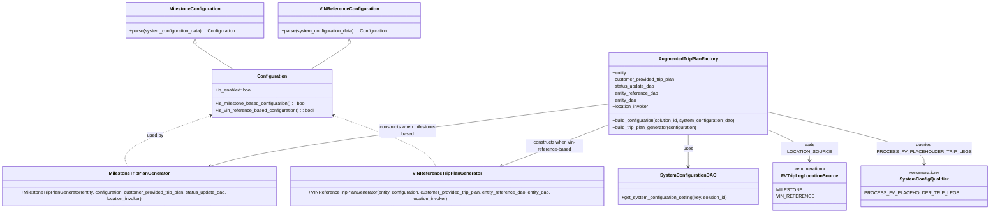

# Diagram: entity_core/entity_service/entity_service/trip_leg/trip_leg/augment_fv_trip_leg/augmented_trip_plan_factory.py

> Auto-generated by Obscura crawlers

## Mermaid

### SVG

<svg id="container" width="3443.1171875" xmlns="http://www.w3.org/2000/svg" class="classDiagram" height="746" viewBox="0 0 3443.1171875 746" role="graphics-document document" aria-roledescription="class"><g><defs><marker id="container_class-aggregationStart" class="marker aggregation class" refX="18" refY="7" markerWidth="190" markerHeight="240" orient="auto"><path d="M 18,7 L9,13 L1,7 L9,1 Z"></path></marker></defs><defs><marker id="container_class-aggregationEnd" class="marker aggregation class" refX="1" refY="7" markerWidth="20" markerHeight="28" orient="auto"><path d="M 18,7 L9,13 L1,7 L9,1 Z"></path></marker></defs><defs><marker id="container_class-extensionStart" class="marker extension class" refX="18" refY="7" markerWidth="190" markerHeight="240" orient="auto"><path d="M 1,7 L18,13 V 1 Z"></path></marker></defs><defs><marker id="container_class-extensionEnd" class="marker extension class" refX="1" refY="7" markerWidth="20" markerHeight="28" orient="auto"><path d="M 1,1 V 13 L18,7 Z"></path></marker></defs><defs><marker id="container_class-compositionStart" class="marker composition class" refX="18" refY="7" markerWidth="190" markerHeight="240" orient="auto"><path d="M 18,7 L9,13 L1,7 L9,1 Z"></path></marker></defs><defs><marker id="container_class-compositionEnd" class="marker composition class" refX="1" refY="7" markerWidth="20" markerHeight="28" orient="auto"><path d="M 18,7 L9,13 L1,7 L9,1 Z"></path></marker></defs><defs><marker id="container_class-dependencyStart" class="marker dependency class" refX="6" refY="7" markerWidth="190" markerHeight="240" orient="auto"><path d="M 5,7 L9,13 L1,7 L9,1 Z"></path></marker></defs><defs><marker id="container_class-dependencyEnd" class="marker dependency class" refX="13" refY="7" markerWidth="20" markerHeight="28" orient="auto"><path d="M 18,7 L9,13 L14,7 L9,1 Z"></path></marker></defs><defs><marker id="container_class-lollipopStart" class="marker lollipop class" refX="13" refY="7" markerWidth="190" markerHeight="240" orient="auto"><circle stroke="black" fill="transparent" cx="7" cy="7" r="6"></circle></marker></defs><defs><marker id="container_class-lollipopEnd" class="marker lollipop class" refX="1" refY="7" markerWidth="190" markerHeight="240" orient="auto"><circle stroke="black" fill="transparent" cx="7" cy="7" r="6"></circle></marker></defs><g class="root"><g class="clusters"></g><g class="edgePaths"><path d="M716.164,151.25L716.164,152.542C716.164,153.833,716.164,156.417,738.672,171.875C761.181,187.333,806.198,215.667,828.706,229.833L851.214,244" id="id_MilestoneConfiguration_Configuration_1" class="edge-thickness-normal edge-pattern-solid relation" style=";;;" data-edge="true" data-et="edge" data-id="id_MilestoneConfiguration_Configuration_1" data-points="W3sieCI6NzE2LjE2NDA2MjUsInkiOjEzNH0seyJ4Ijo3MTYuMTY0MDYyNSwieSI6MTU5fSx7IngiOjg1MS4yMTQzMzUyNDQwODI4LCJ5IjoyNDR9XQ==" marker-start="url(#container_class-extensionStart)"></path><path d="M1253.188,151.25L1253.188,152.542C1253.188,153.833,1253.188,156.417,1230.679,171.875C1208.171,187.333,1163.154,215.667,1140.646,229.833L1118.137,244" id="id_VINReferenceConfiguration_Configuration_2" class="edge-thickness-normal edge-pattern-solid relation" style=";;;" data-edge="true" data-et="edge" data-id="id_VINReferenceConfiguration_Configuration_2" data-points="W3sieCI6MTI1My4xODc1LCJ5IjoxMzR9LHsieCI6MTI1My4xODc1LCJ5IjoxNTl9LHsieCI6MTExOC4xMzcyMjcyNTU5MTcyLCJ5IjoyNDR9XQ==" marker-start="url(#container_class-extensionStart)"></path><path d="M769.774,402.713L713.068,422.427C656.361,442.142,542.948,481.571,492.747,512.952C442.545,544.333,455.555,567.667,462.06,579.333L468.565,591" id="id_Configuration_MilestoneTripPlanGenerator_3" class="edge-thickness-normal edge-pattern-dashed relation" style=";;;" data-edge="true" data-et="edge" data-id="id_Configuration_MilestoneTripPlanGenerator_3" data-points="W3sieCI6Nzc1LjQ0MTQwNjI1LCJ5Ijo0MDAuNzQyMzUxMzE4NjQxMX0seyJ4Ijo0MjkuNTM1MTU2MjUsInkiOjUyMX0seyJ4Ijo0NjguNTY0NzYxNTEzMTU3OSwieSI6NTkxfV0=" marker-start="url(#container_class-dependencyStart)"></path><path d="M1199.577,402.713L1256.284,422.427C1312.99,442.142,1426.403,481.571,1489.615,512.952C1552.826,544.333,1565.836,567.667,1572.341,579.333L1578.846,591" id="id_Configuration_VINReferenceTripPlanGenerator_4" class="edge-thickness-normal edge-pattern-dashed relation" style=";;;" data-edge="true" data-et="edge" data-id="id_Configuration_VINReferenceTripPlanGenerator_4" data-points="W3sieCI6MTE5My45MTAxNTYyNSwieSI6NDAwLjc0MjM1MTMxODY0MTF9LHsieCI6MTUzOS44MTY0MDYyNSwieSI6NTIxfSx7IngiOjE1NzguODQ2MDExNTEzMTU4LCJ5Ijo1OTF9XQ==" marker-start="url(#container_class-dependencyStart)"></path><path d="M2474.273,472L2474.273,480.167C2474.273,488.333,2474.273,504.667,2474.273,523.5C2474.273,542.333,2474.273,563.667,2474.273,574.333L2474.273,585" id="id_AugmentedTripPlanFactory_SystemConfigurationDAO_5" class="edge-thickness-normal edge-pattern-solid relation" style=";;;" data-edge="true" data-et="edge" data-id="id_AugmentedTripPlanFactory_SystemConfigurationDAO_5" data-points="W3sieCI6MjQ3NC4yNzM0Mzc1LCJ5Ijo0NzJ9LHsieCI6MjQ3NC4yNzM0Mzc1LCJ5Ijo1MjF9LHsieCI6MjQ3NC4yNzM0Mzc1LCJ5Ijo1OTF9XQ==" marker-end="url(#container_class-dependencyEnd)"></path><path d="M2755.73,460.269L2777.269,470.391C2798.807,480.513,2841.884,500.756,2863.423,518.045C2884.961,535.333,2884.961,549.667,2884.961,556.833L2884.961,564" id="id_AugmentedTripPlanFactory_FVTripLegLocationSource_6" class="edge-thickness-normal edge-pattern-solid relation" style=";;;" data-edge="true" data-et="edge" data-id="id_AugmentedTripPlanFactory_FVTripLegLocationSource_6" data-points="W3sieCI6Mjc1NS43MzA0Njg3NSwieSI6NDYwLjI2ODk1NjM5OTMzMDM2fSx7IngiOjI4ODQuOTYwOTM3NSwieSI6NTIxfSx7IngiOjI4ODQuOTYwOTM3NSwieSI6NTcwfV0=" marker-end="url(#container_class-dependencyEnd)"></path><path d="M2755.73,398.707L2836.863,419.089C2917.996,439.472,3080.262,480.236,3161.395,509.785C3242.527,539.333,3242.527,557.667,3242.527,566.833L3242.527,576" id="id_AugmentedTripPlanFactory_SystemConfigQualifier_7" class="edge-thickness-normal edge-pattern-solid relation" style=";;;" data-edge="true" data-et="edge" data-id="id_AugmentedTripPlanFactory_SystemConfigQualifier_7" data-points="W3sieCI6Mjc1NS43MzA0Njg3NSwieSI6Mzk4LjcwNzM2MTk2NjMwOTZ9LHsieCI6MzI0Mi41MjczNDM3NSwieSI6NTIxfSx7IngiOjMyNDIuNTI3MzQzNzUsInkiOjU4Mn1d" marker-end="url(#container_class-dependencyEnd)"></path><path d="M2192.816,364.467L1991.46,390.556C1790.103,416.645,1387.389,468.822,1144.805,506.311C902.22,543.8,819.765,566.601,778.537,578.001L737.309,589.401" id="id_AugmentedTripPlanFactory_MilestoneTripPlanGenerator_8" class="edge-thickness-normal edge-pattern-solid relation" style=";;;" data-edge="true" data-et="edge" data-id="id_AugmentedTripPlanFactory_MilestoneTripPlanGenerator_8" data-points="W3sieCI6MjE5Mi44MTY0MDYyNSwieSI6MzY0LjQ2NzAzMzA5NjcwOTd9LHsieCI6OTg0LjY3NTc4MTI1LCJ5Ijo1MjF9LHsieCI6NzMxLjUyNjExMDE5NzM2ODQsInkiOjU5MX1d" marker-end="url(#container_class-dependencyEnd)"></path><path d="M2192.816,436.992L2156.66,450.993C2120.503,464.995,2048.19,492.997,1981.226,518.32C1914.262,543.643,1852.647,566.287,1821.84,577.609L1791.033,588.93" id="id_AugmentedTripPlanFactory_VINReferenceTripPlanGenerator_9" class="edge-thickness-normal edge-pattern-solid relation" style=";;;" data-edge="true" data-et="edge" data-id="id_AugmentedTripPlanFactory_VINReferenceTripPlanGenerator_9" data-points="W3sieCI6MjE5Mi44MTY0MDYyNSwieSI6NDM2Ljk5MTk1NDY2NzExNjAzfSx7IngiOjE5NzUuODc2OTUzMTI1LCJ5Ijo1MjF9LHsieCI6MTc4NS40MDEwMDc0MDEzMTU4LCJ5Ijo1OTF9XQ==" marker-end="url(#container_class-dependencyEnd)"></path></g><g class="edgeLabels"><g class="edgeLabel"><g class="label" data-id="id_MilestoneConfiguration_Configuration_1" transform="translate(0, 0)"><foreignObject width="0" height="0">

</foreignObject></g></g><g class="edgeLabel"><g class="label" data-id="id_VINReferenceConfiguration_Configuration_2" transform="translate(0, 0)"><foreignObject width="0" height="0">

</foreignObject></g></g><g class="edgeLabel" transform="translate(564.63772, 474.03029)"><g class="label" data-id="id_Configuration_MilestoneTripPlanGenerator_3" transform="translate(-28.3125, -12)"><foreignObject width="56.625" height="24">

used by

</foreignObject></g></g><g class="edgeLabel" transform="translate(1404.71385, 474.03029)"><g class="label" data-id="id_Configuration_VINReferenceTripPlanGenerator_4" transform="translate(-28.3125, -12)"><foreignObject width="56.625" height="24">

used by

</foreignObject></g></g><g class="edgeLabel" transform="translate(2474.2734375, 521)"><g class="label" data-id="id_AugmentedTripPlanFactory_SystemConfigurationDAO_5" transform="translate(-16.4921875, -12)"><foreignObject width="32.984375" height="24">

uses

</foreignObject></g></g><g class="edgeLabel" transform="translate(2884.9609375, 521)"><g class="label" data-id="id_AugmentedTripPlanFactory_FVTripLegLocationSource_6" transform="translate(-90.1640625, -12)"><foreignObject width="180.328125" height="24">

reads LOCATION_SOURCE

</foreignObject></g></g><g class="edgeLabel" transform="translate(3242.52734375, 521)"><g class="label" data-id="id_AugmentedTripPlanFactory_SystemConfigQualifier_7" transform="translate(-140.1171875, -24)"><foreignObject width="280.234375" height="48">

queries PROCESS_FV_PLACEHOLDER_TRIP_LEGS

</foreignObject></g></g><g class="edgeLabel" transform="translate(1458.50994, 459.60759)"><g class="label" data-id="id_AugmentedTripPlanFactory_MilestoneTripPlanGenerator_8" transform="translate(-100, -24)"><foreignObject width="200" height="48">

constructs when milestone-based

</foreignObject></g></g><g class="edgeLabel" transform="translate(1989.72771, 515.63641)"><g class="label" data-id="id_AugmentedTripPlanFactory_VINReferenceTripPlanGenerator_9" transform="translate(-100, -24)"><foreignObject width="200" height="48">

constructs when vin-reference-based

</foreignObject></g></g></g><g class="nodes"><g class="node default" id="classId-AugmentedTripPlanFactory-0" transform="translate(2474.2734375, 328)"><g class="basic label-container"><path d="M-281.45703125 -144 L281.45703125 -144 L281.45703125 144 L-281.45703125 144" stroke="none" stroke-width="0" fill="#ECECFF" style=""></path><path d="M-281.45703125 -144 C-73.545675331132 -144, 134.365680587736 -144, 281.45703125 -144 M-281.45703125 -144 C-120.24037444022238 -144, 40.976282369555236 -144, 281.45703125 -144 M281.45703125 -144 C281.45703125 -71.33137196501418, 281.45703125 1.3372560699716303, 281.45703125 144 M281.45703125 -144 C281.45703125 -40.31179252919078, 281.45703125 63.376414941618435, 281.45703125 144 M281.45703125 144 C134.93821529658618 144, -11.580600656827642 144, -281.45703125 144 M281.45703125 144 C143.28024349285016 144, 5.103455735700322 144, -281.45703125 144 M-281.45703125 144 C-281.45703125 76.24206116887105, -281.45703125 8.484122337742093, -281.45703125 -144 M-281.45703125 144 C-281.45703125 74.83487932335555, -281.45703125 5.669758646711102, -281.45703125 -144" stroke="#9370DB" stroke-width="1.3" fill="none" stroke-dasharray="0 0" style=""></path></g><g class="annotation-group text" transform="translate(0, -120)"></g><g class="label-group text" transform="translate(-98.6328125, -120)"><g class="label" style="font-weight: bolder" transform="translate(0,-12)"><foreignObject width="197.265625" height="24">

AugmentedTripPlanFactory

</foreignObject></g></g><g class="members-group text" transform="translate(-269.45703125, -72)"><g class="label" style="" transform="translate(0,-12)"><foreignObject width="49.9375" height="24">

+entity

</foreignObject></g><g class="label" style="" transform="translate(0,12)"><foreignObject width="221.671875" height="24">

+customer_provided_trip_plan

</foreignObject></g><g class="label" style="" transform="translate(0,36)"><foreignObject width="146.71875" height="24">

+status_update_dao

</foreignObject></g><g class="label" style="" transform="translate(0,60)"><foreignObject width="161.25" height="24">

+entity_reference_dao

</foreignObject></g><g class="label" style="" transform="translate(0,84)"><foreignObject width="85.078125" height="24">

+entity_dao

</foreignObject></g><g class="label" style="" transform="translate(0,108)"><foreignObject width="129.34375" height="24">

+location_invoker

</foreignObject></g></g><g class="methods-group text" transform="translate(-269.45703125, 96)"><g class="label" style="" transform="translate(0,-12)"><foreignObject width="440.28125" height="24">

+build_configuration(solution_id, system_configuration_dao)

</foreignObject></g><g class="label" style="" transform="translate(0,12)"><foreignObject width="304.796875" height="24">

+build_trip_plan_generator(configuration)

</foreignObject></g></g><g class="divider" style=""><path d="M-281.45703125 -96 C-150.55957520333328 -96, -19.662119156666563 -96, 281.45703125 -96 M-281.45703125 -96 C-161.03063529745202 -96, -40.604239344904016 -96, 281.45703125 -96" stroke="#9370DB" stroke-width="1.3" fill="none" stroke-dasharray="0 0" style=""></path></g><g class="divider" style=""><path d="M-281.45703125 72 C-104.7217274108346 72, 72.0135764283308 72, 281.45703125 72 M-281.45703125 72 C-127.87124428688375 72, 25.714542676232497 72, 281.45703125 72" stroke="#9370DB" stroke-width="1.3" fill="none" stroke-dasharray="0 0" style=""></path></g></g><g class="node default" id="classId-Configuration-1" transform="translate(984.67578125, 328)"><g class="basic label-container"><path d="M-209.234375 -84 L209.234375 -84 L209.234375 84 L-209.234375 84" stroke="none" stroke-width="0" fill="#ECECFF" style=""></path><path d="M-209.234375 -84 C-86.92024004630133 -84, 35.39389490739734 -84, 209.234375 -84 M-209.234375 -84 C-41.86455762580309 -84, 125.50525974839383 -84, 209.234375 -84 M209.234375 -84 C209.234375 -39.247458238602384, 209.234375 5.505083522795232, 209.234375 84 M209.234375 -84 C209.234375 -42.76513497344079, 209.234375 -1.5302699468815746, 209.234375 84 M209.234375 84 C88.20033158232803 84, -32.833711835343934 84, -209.234375 84 M209.234375 84 C103.72812444882285 84, -1.7781261023542925 84, -209.234375 84 M-209.234375 84 C-209.234375 16.915346887582757, -209.234375 -50.169306224834486, -209.234375 -84 M-209.234375 84 C-209.234375 23.22140257191736, -209.234375 -37.55719485616528, -209.234375 -84" stroke="#9370DB" stroke-width="1.3" fill="none" stroke-dasharray="0 0" style=""></path></g><g class="annotation-group text" transform="translate(0, -60)"></g><g class="label-group text" transform="translate(-49.375, -60)"><g class="label" style="font-weight: bolder" transform="translate(0,-12)"><foreignObject width="98.75" height="24">

Configuration

</foreignObject></g></g><g class="members-group text" transform="translate(-197.234375, -12)"><g class="label" style="" transform="translate(0,-12)"><foreignObject width="127.8125" height="24">

+is_enabled: bool

</foreignObject></g></g><g class="methods-group text" transform="translate(-197.234375, 36)"><g class="label" style="" transform="translate(0,-12)"><foreignObject width="319.328125" height="24">

+is_milestone_based_configuration() : : bool

</foreignObject></g><g class="label" style="" transform="translate(0,12)"><foreignObject width="345.09375" height="24">

+is_vin_reference_based_configuration() : : bool

</foreignObject></g></g><g class="divider" style=""><path d="M-209.234375 -36 C-82.33271798074156 -36, 44.56893903851687 -36, 209.234375 -36 M-209.234375 -36 C-106.45012101441124 -36, -3.6658670288224755 -36, 209.234375 -36" stroke="#9370DB" stroke-width="1.3" fill="none" stroke-dasharray="0 0" style=""></path></g><g class="divider" style=""><path d="M-209.234375 12 C-111.78345312819938 12, -14.332531256398767 12, 209.234375 12 M-209.234375 12 C-77.53316280559511 12, 54.16804938880978 12, 209.234375 12" stroke="#9370DB" stroke-width="1.3" fill="none" stroke-dasharray="0 0" style=""></path></g></g><g class="node default" id="classId-MilestoneConfiguration-2" transform="translate(716.1640625, 71)"><g class="basic label-container"><path d="M-240.28515625 -63 L240.28515625 -63 L240.28515625 63 L-240.28515625 63" stroke="none" stroke-width="0" fill="#ECECFF" style=""></path><path d="M-240.28515625 -63 C-67.96490411879572 -63, 104.35534801240857 -63, 240.28515625 -63 M-240.28515625 -63 C-54.39637616301982 -63, 131.49240392396035 -63, 240.28515625 -63 M240.28515625 -63 C240.28515625 -16.887356064375844, 240.28515625 29.225287871248312, 240.28515625 63 M240.28515625 -63 C240.28515625 -15.253465502467215, 240.28515625 32.49306899506557, 240.28515625 63 M240.28515625 63 C73.90312670162115 63, -92.4789028467577 63, -240.28515625 63 M240.28515625 63 C74.61826056399394 63, -91.04863512201212 63, -240.28515625 63 M-240.28515625 63 C-240.28515625 36.2292756117115, -240.28515625 9.458551223422994, -240.28515625 -63 M-240.28515625 63 C-240.28515625 15.769732023942595, -240.28515625 -31.46053595211481, -240.28515625 -63" stroke="#9370DB" stroke-width="1.3" fill="none" stroke-dasharray="0 0" style=""></path></g><g class="annotation-group text" transform="translate(0, -39)"></g><g class="label-group text" transform="translate(-85.1796875, -39)"><g class="label" style="font-weight: bolder" transform="translate(0,-12)"><foreignObject width="170.359375" height="24">

MilestoneConfiguration

</foreignObject></g></g><g class="members-group text" transform="translate(-228.28515625, 9)"></g><g class="methods-group text" transform="translate(-228.28515625, 39)"><g class="label" style="" transform="translate(0,-12)"><foreignObject width="371.390625" height="24">

+parse(system_configuration_data) : : Configuration

</foreignObject></g></g><g class="divider" style=""><path d="M-240.28515625 -15 C-68.87778631222605 -15, 102.5295836255479 -15, 240.28515625 -15 M-240.28515625 -15 C-129.13276966446261 -15, -17.980383078925257 -15, 240.28515625 -15" stroke="#9370DB" stroke-width="1.3" fill="none" stroke-dasharray="0 0" style=""></path></g><g class="divider" style=""><path d="M-240.28515625 9 C-50.389838397309006 9, 139.505479455382 9, 240.28515625 9 M-240.28515625 9 C-134.0195344121249 9, -27.753912574249796 9, 240.28515625 9" stroke="#9370DB" stroke-width="1.3" fill="none" stroke-dasharray="0 0" style=""></path></g></g><g class="node default" id="classId-VINReferenceConfiguration-3" transform="translate(1253.1875, 71)"><g class="basic label-container"><path d="M-246.73828125 -63 L246.73828125 -63 L246.73828125 63 L-246.73828125 63" stroke="none" stroke-width="0" fill="#ECECFF" style=""></path><path d="M-246.73828125 -63 C-123.03516427181611 -63, 0.667952706367771 -63, 246.73828125 -63 M-246.73828125 -63 C-137.40749089944376 -63, -28.076700548887544 -63, 246.73828125 -63 M246.73828125 -63 C246.73828125 -25.267373184912337, 246.73828125 12.465253630175326, 246.73828125 63 M246.73828125 -63 C246.73828125 -24.20202874770252, 246.73828125 14.595942504594959, 246.73828125 63 M246.73828125 63 C72.38303192001379 63, -101.97221740997242 63, -246.73828125 63 M246.73828125 63 C134.26248457649848 63, 21.786687902996988 63, -246.73828125 63 M-246.73828125 63 C-246.73828125 30.09304385575181, -246.73828125 -2.8139122884963825, -246.73828125 -63 M-246.73828125 63 C-246.73828125 36.17702369426412, -246.73828125 9.354047388528251, -246.73828125 -63" stroke="#9370DB" stroke-width="1.3" fill="none" stroke-dasharray="0 0" style=""></path></g><g class="annotation-group text" transform="translate(0, -39)"></g><g class="label-group text" transform="translate(-98.0859375, -39)"><g class="label" style="font-weight: bolder" transform="translate(0,-12)"><foreignObject width="196.171875" height="24">

VINReferenceConfiguration

</foreignObject></g></g><g class="members-group text" transform="translate(-234.73828125, 9)"></g><g class="methods-group text" transform="translate(-234.73828125, 39)"><g class="label" style="" transform="translate(0,-12)"><foreignObject width="371.390625" height="24">

+parse(system_configuration_data) : : Configuration

</foreignObject></g></g><g class="divider" style=""><path d="M-246.73828125 -15 C-92.72222825179367 -15, 61.29382474641267 -15, 246.73828125 -15 M-246.73828125 -15 C-58.14571553255081 -15, 130.44685018489838 -15, 246.73828125 -15" stroke="#9370DB" stroke-width="1.3" fill="none" stroke-dasharray="0 0" style=""></path></g><g class="divider" style=""><path d="M-246.73828125 9 C-70.95609623818899 9, 104.82608877362202 9, 246.73828125 9 M-246.73828125 9 C-132.90242170058463 9, -19.06656215116928 9, 246.73828125 9" stroke="#9370DB" stroke-width="1.3" fill="none" stroke-dasharray="0 0" style=""></path></g></g><g class="node default" id="classId-MilestoneTripPlanGenerator-4" transform="translate(503.69140625, 654)"><g class="basic label-container"><path d="M-495.69140625 -63 L495.69140625 -63 L495.69140625 63 L-495.69140625 63" stroke="none" stroke-width="0" fill="#ECECFF" style=""></path><path d="M-495.69140625 -63 C-233.22231808827866 -63, 29.24677007344269 -63, 495.69140625 -63 M-495.69140625 -63 C-270.59044603460023 -63, -45.48948581920047 -63, 495.69140625 -63 M495.69140625 -63 C495.69140625 -19.573834554766407, 495.69140625 23.852330890467186, 495.69140625 63 M495.69140625 -63 C495.69140625 -34.518910442758425, 495.69140625 -6.037820885516851, 495.69140625 63 M495.69140625 63 C249.30234569455087 63, 2.913285139101731 63, -495.69140625 63 M495.69140625 63 C232.32391670153453 63, -31.043572846930942 63, -495.69140625 63 M-495.69140625 63 C-495.69140625 34.8582172981196, -495.69140625 6.716434596239196, -495.69140625 -63 M-495.69140625 63 C-495.69140625 35.002702131955665, -495.69140625 7.0054042639113305, -495.69140625 -63" stroke="#9370DB" stroke-width="1.3" fill="none" stroke-dasharray="0 0" style=""></path></g><g class="annotation-group text" transform="translate(0, -39)"></g><g class="label-group text" transform="translate(-102.9296875, -39)"><g class="label" style="font-weight: bolder" transform="translate(0,-12)"><foreignObject width="205.859375" height="24">

MilestoneTripPlanGenerator

</foreignObject></g></g><g class="members-group text" transform="translate(-483.69140625, 9)"></g><g class="methods-group text" transform="translate(-483.69140625, 39)"><g class="label" style="" transform="translate(0,-12)"><foreignObject width="864.453125" height="24">

+MilestoneTripPlanGenerator(entity, configuration, customer_provided_trip_plan, status_update_dao, location_invoker)

</foreignObject></g></g><g class="divider" style=""><path d="M-495.69140625 -15 C-129.5381481519628 -15, 236.61510994607443 -15, 495.69140625 -15 M-495.69140625 -15 C-118.7653356256584 -15, 258.1607349986832 -15, 495.69140625 -15" stroke="#9370DB" stroke-width="1.3" fill="none" stroke-dasharray="0 0" style=""></path></g><g class="divider" style=""><path d="M-495.69140625 9 C-214.07553982246827 9, 67.54032660506346 9, 495.69140625 9 M-495.69140625 9 C-107.15882025499184 9, 281.3737657400163 9, 495.69140625 9" stroke="#9370DB" stroke-width="1.3" fill="none" stroke-dasharray="0 0" style=""></path></g></g><g class="node default" id="classId-VINReferenceTripPlanGenerator-5" transform="translate(1613.97265625, 654)"><g class="basic label-container"><path d="M-564.58984375 -63 L564.58984375 -63 L564.58984375 63 L-564.58984375 63" stroke="none" stroke-width="0" fill="#ECECFF" style=""></path><path d="M-564.58984375 -63 C-156.8188853570174 -63, 250.9520730359652 -63, 564.58984375 -63 M-564.58984375 -63 C-337.32334956287013 -63, -110.05685537574027 -63, 564.58984375 -63 M564.58984375 -63 C564.58984375 -19.45435632821082, 564.58984375 24.091287343578358, 564.58984375 63 M564.58984375 -63 C564.58984375 -23.98257731454136, 564.58984375 15.034845370917282, 564.58984375 63 M564.58984375 63 C192.97284581856957 63, -178.64415211286087 63, -564.58984375 63 M564.58984375 63 C154.4801442703207 63, -255.6295552093586 63, -564.58984375 63 M-564.58984375 63 C-564.58984375 30.792288895828932, -564.58984375 -1.415422208342136, -564.58984375 -63 M-564.58984375 63 C-564.58984375 14.43645949042702, -564.58984375 -34.12708101914596, -564.58984375 -63" stroke="#9370DB" stroke-width="1.3" fill="none" stroke-dasharray="0 0" style=""></path></g><g class="annotation-group text" transform="translate(0, -39)"></g><g class="label-group text" transform="translate(-115.8359375, -39)"><g class="label" style="font-weight: bolder" transform="translate(0,-12)"><foreignObject width="231.671875" height="24">

VINReferenceTripPlanGenerator

</foreignObject></g></g><g class="members-group text" transform="translate(-552.58984375, 9)"></g><g class="methods-group text" transform="translate(-552.58984375, 39)"><g class="label" style="" transform="translate(0,-12)"><foreignObject width="989.34375" height="24">

+VINReferenceTripPlanGenerator(entity, configuration, customer_provided_trip_plan, entity_reference_dao, entity_dao, location_invoker)

</foreignObject></g></g><g class="divider" style=""><path d="M-564.58984375 -15 C-312.7505055656125 -15, -60.91116738122503 -15, 564.58984375 -15 M-564.58984375 -15 C-220.3886062214953 -15, 123.81263130700938 -15, 564.58984375 -15" stroke="#9370DB" stroke-width="1.3" fill="none" stroke-dasharray="0 0" style=""></path></g><g class="divider" style=""><path d="M-564.58984375 9 C-306.9260162911584 9, -49.26218883231684 9, 564.58984375 9 M-564.58984375 9 C-237.7585403582143 9, 89.07276303357139 9, 564.58984375 9" stroke="#9370DB" stroke-width="1.3" fill="none" stroke-dasharray="0 0" style=""></path></g></g><g class="node default" id="classId-SystemConfigurationDAO-6" transform="translate(2474.2734375, 654)"><g class="basic label-container"><path d="M-245.7109375 -63 L245.7109375 -63 L245.7109375 63 L-245.7109375 63" stroke="none" stroke-width="0" fill="#ECECFF" style=""></path><path d="M-245.7109375 -63 C-146.01727457901313 -63, -46.32361165802624 -63, 245.7109375 -63 M-245.7109375 -63 C-59.660454037641756 -63, 126.39002942471649 -63, 245.7109375 -63 M245.7109375 -63 C245.7109375 -25.51469676512226, 245.7109375 11.97060646975548, 245.7109375 63 M245.7109375 -63 C245.7109375 -27.281974861488642, 245.7109375 8.436050277022716, 245.7109375 63 M245.7109375 63 C140.82508500242386 63, 35.93923250484775 63, -245.7109375 63 M245.7109375 63 C66.69214617326159 63, -112.32664515347682 63, -245.7109375 63 M-245.7109375 63 C-245.7109375 21.626442437419925, -245.7109375 -19.74711512516015, -245.7109375 -63 M-245.7109375 63 C-245.7109375 32.93219203424654, -245.7109375 2.864384068493088, -245.7109375 -63" stroke="#9370DB" stroke-width="1.3" fill="none" stroke-dasharray="0 0" style=""></path></g><g class="annotation-group text" transform="translate(0, -39)"></g><g class="label-group text" transform="translate(-91.21875, -39)"><g class="label" style="font-weight: bolder" transform="translate(0,-12)"><foreignObject width="182.4375" height="24">

SystemConfigurationDAO

</foreignObject></g></g><g class="members-group text" transform="translate(-233.7109375, 9)"></g><g class="methods-group text" transform="translate(-233.7109375, 39)"><g class="label" style="" transform="translate(0,-12)"><foreignObject width="376.203125" height="24">

+get_system_configuration_setting(key, solution_id)

</foreignObject></g></g><g class="divider" style=""><path d="M-245.7109375 -15 C-114.47467345479888 -15, 16.76159059040225 -15, 245.7109375 -15 M-245.7109375 -15 C-127.06895350082787 -15, -8.426969501655748 -15, 245.7109375 -15" stroke="#9370DB" stroke-width="1.3" fill="none" stroke-dasharray="0 0" style=""></path></g><g class="divider" style=""><path d="M-245.7109375 9 C-116.13182048141576 9, 13.447296537168484 9, 245.7109375 9 M-245.7109375 9 C-104.09620931973163 9, 37.518518860536744 9, 245.7109375 9" stroke="#9370DB" stroke-width="1.3" fill="none" stroke-dasharray="0 0" style=""></path></g></g><g class="node default" id="classId-FVTripLegLocationSource-7" transform="translate(2884.9609375, 654)"><g class="basic label-container"><path d="M-114.9765625 -84 L114.9765625 -84 L114.9765625 84 L-114.9765625 84" stroke="none" stroke-width="0" fill="#ECECFF" style=""></path><path d="M-114.9765625 -84 C-62.777133138940215 -84, -10.57770377788043 -84, 114.9765625 -84 M-114.9765625 -84 C-54.91555396415514 -84, 5.145454571689726 -84, 114.9765625 -84 M114.9765625 -84 C114.9765625 -35.19249145694693, 114.9765625 13.615017086106135, 114.9765625 84 M114.9765625 -84 C114.9765625 -25.45988938697868, 114.9765625 33.08022122604264, 114.9765625 84 M114.9765625 84 C41.41281781308059 84, -32.15092687383881 84, -114.9765625 84 M114.9765625 84 C66.40100206282148 84, 17.825441625642966 84, -114.9765625 84 M-114.9765625 84 C-114.9765625 40.58638369162474, -114.9765625 -2.8272326167505213, -114.9765625 -84 M-114.9765625 84 C-114.9765625 24.189965450768753, -114.9765625 -35.620069098462494, -114.9765625 -84" stroke="#9370DB" stroke-width="1.3" fill="none" stroke-dasharray="0 0" style=""></path></g><g class="annotation-group text" transform="translate(-55.5546875, -60)"><g class="label" style="" transform="translate(0,-12)"><foreignObject width="111.109375" height="24">

«enumeration»

</foreignObject></g></g><g class="label-group text" transform="translate(-91.734375, -36)"><g class="label" style="font-weight: bolder" transform="translate(0,-12)"><foreignObject width="183.46875" height="24">

FVTripLegLocationSource

</foreignObject></g></g><g class="members-group text" transform="translate(-102.9765625, 12)"><g class="label" style="" transform="translate(0,-12)"><foreignObject width="80.1875" height="24">

MILESTONE

</foreignObject></g><g class="label" style="" transform="translate(0,12)"><foreignObject width="114.21875" height="24">

VIN_REFERENCE

</foreignObject></g></g><g class="methods-group text" transform="translate(-102.9765625, 84)"></g><g class="divider" style=""><path d="M-114.9765625 -12 C-55.06867092690435 -12, 4.839220646191293 -12, 114.9765625 -12 M-114.9765625 -12 C-56.307922369351445 -12, 2.36071776129711 -12, 114.9765625 -12" stroke="#9370DB" stroke-width="1.3" fill="none" stroke-dasharray="0 0" style=""></path></g><g class="divider" style=""><path d="M-114.9765625 60 C-39.909436554362586 60, 35.15768939127483 60, 114.9765625 60 M-114.9765625 60 C-25.925288507865815 60, 63.12598548426837 60, 114.9765625 60" stroke="#9370DB" stroke-width="1.3" fill="none" stroke-dasharray="0 0" style=""></path></g></g><g class="node default" id="classId-SystemConfigQualifier-8" transform="translate(3242.52734375, 654)"><g class="basic label-container"><path d="M-192.58984375 -72 L192.58984375 -72 L192.58984375 72 L-192.58984375 72" stroke="none" stroke-width="0" fill="#ECECFF" style=""></path><path d="M-192.58984375 -72 C-111.1261061371941 -72, -29.6623685243882 -72, 192.58984375 -72 M-192.58984375 -72 C-51.48909182927264 -72, 89.61166009145472 -72, 192.58984375 -72 M192.58984375 -72 C192.58984375 -23.17754338792618, 192.58984375 25.644913224147643, 192.58984375 72 M192.58984375 -72 C192.58984375 -42.37331310893312, 192.58984375 -12.746626217866229, 192.58984375 72 M192.58984375 72 C95.01293733985548 72, -2.5639690702890334 72, -192.58984375 72 M192.58984375 72 C87.15024301991242 72, -18.289357710175153 72, -192.58984375 72 M-192.58984375 72 C-192.58984375 18.22700796268576, -192.58984375 -35.54598407462848, -192.58984375 -72 M-192.58984375 72 C-192.58984375 22.146542152297485, -192.58984375 -27.70691569540503, -192.58984375 -72" stroke="#9370DB" stroke-width="1.3" fill="none" stroke-dasharray="0 0" style=""></path></g><g class="annotation-group text" transform="translate(-55.5546875, -48)"><g class="label" style="" transform="translate(0,-12)"><foreignObject width="111.109375" height="24">

«enumeration»

</foreignObject></g></g><g class="label-group text" transform="translate(-80.9296875, -24)"><g class="label" style="font-weight: bolder" transform="translate(0,-12)"><foreignObject width="161.859375" height="24">

SystemConfigQualifier

</foreignObject></g></g><g class="members-group text" transform="translate(-180.58984375, 24)"><g class="label" style="" transform="translate(0,-12)"><foreignObject width="280.25" height="24">

PROCESS_FV_PLACEHOLDER_TRIP_LEGS

</foreignObject></g></g><g class="methods-group text" transform="translate(-180.58984375, 72)"></g><g class="divider" style=""><path d="M-192.58984375 0 C-108.86615731552226 0, -25.142470881044517 0, 192.58984375 0 M-192.58984375 0 C-64.86666207370645 0, 62.8565196025871 0, 192.58984375 0" stroke="#9370DB" stroke-width="1.3" fill="none" stroke-dasharray="0 0" style=""></path></g><g class="divider" style=""><path d="M-192.58984375 48 C-70.44552352309981 48, 51.69879670380038 48, 192.58984375 48 M-192.58984375 48 C-74.7285409272561 48, 43.13276189548779 48, 192.58984375 48" stroke="#9370DB" stroke-width="1.3" fill="none" stroke-dasharray="0 0" style=""></path></g></g></g></g></g></svg>
