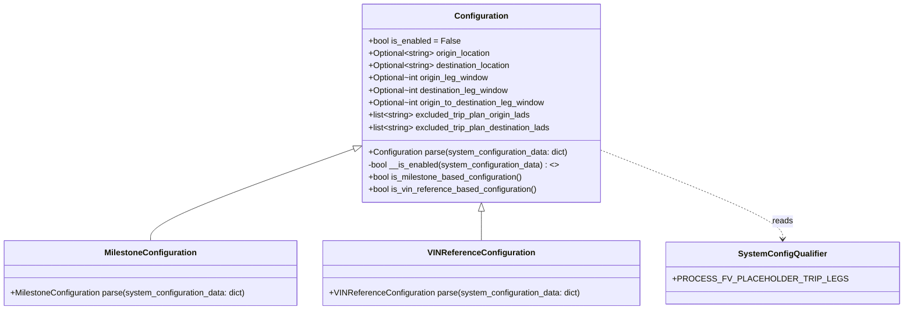

# Diagram: entity_core/entity_service/entity_service/trip_leg/trip_leg/augment_fv_trip_leg/configuration.py

> Auto-generated by Obscura crawlers

## Mermaid

### SVG

<svg id="container" width="1688.8515625" xmlns="http://www.w3.org/2000/svg" class="classDiagram" height="600" viewBox="0 0 1688.8515625 600" role="graphics-document document" aria-roledescription="class"><g><defs><marker id="container_class-aggregationStart" class="marker aggregation class" refX="18" refY="7" markerWidth="190" markerHeight="240" orient="auto"><path d="M 18,7 L9,13 L1,7 L9,1 Z"></path></marker></defs><defs><marker id="container_class-aggregationEnd" class="marker aggregation class" refX="1" refY="7" markerWidth="20" markerHeight="28" orient="auto"><path d="M 18,7 L9,13 L1,7 L9,1 Z"></path></marker></defs><defs><marker id="container_class-extensionStart" class="marker extension class" refX="18" refY="7" markerWidth="190" markerHeight="240" orient="auto"><path d="M 1,7 L18,13 V 1 Z"></path></marker></defs><defs><marker id="container_class-extensionEnd" class="marker extension class" refX="1" refY="7" markerWidth="20" markerHeight="28" orient="auto"><path d="M 1,1 V 13 L18,7 Z"></path></marker></defs><defs><marker id="container_class-compositionStart" class="marker composition class" refX="18" refY="7" markerWidth="190" markerHeight="240" orient="auto"><path d="M 18,7 L9,13 L1,7 L9,1 Z"></path></marker></defs><defs><marker id="container_class-compositionEnd" class="marker composition class" refX="1" refY="7" markerWidth="20" markerHeight="28" orient="auto"><path d="M 18,7 L9,13 L1,7 L9,1 Z"></path></marker></defs><defs><marker id="container_class-dependencyStart" class="marker dependency class" refX="6" refY="7" markerWidth="190" markerHeight="240" orient="auto"><path d="M 5,7 L9,13 L1,7 L9,1 Z"></path></marker></defs><defs><marker id="container_class-dependencyEnd" class="marker dependency class" refX="13" refY="7" markerWidth="20" markerHeight="28" orient="auto"><path d="M 18,7 L9,13 L14,7 L9,1 Z"></path></marker></defs><defs><marker id="container_class-lollipopStart" class="marker lollipop class" refX="13" refY="7" markerWidth="190" markerHeight="240" orient="auto"><circle stroke="black" fill="transparent" cx="7" cy="7" r="6"></circle></marker></defs><defs><marker id="container_class-lollipopEnd" class="marker lollipop class" refX="1" refY="7" markerWidth="190" markerHeight="240" orient="auto"><circle stroke="black" fill="transparent" cx="7" cy="7" r="6"></circle></marker></defs><g class="root"><g class="clusters"></g><g class="edgePaths"><path d="M684.872,288.879L619.621,312.233C554.369,335.586,423.866,382.293,358.615,411.813C293.363,441.333,293.363,453.667,293.363,459.833L293.363,466" id="id_Configuration_MilestoneConfiguration_1" class="edge-thickness-normal edge-pattern-solid relation" style=";;;" data-edge="true" data-et="edge" data-id="id_Configuration_MilestoneConfiguration_1" data-points="W3sieCI6NzAxLjExMzI4MTI1LCJ5IjoyODMuMDY2MzI0Nzg2MzI0OH0seyJ4IjoyOTMuMzYzMjgxMjUsInkiOjQyOX0seyJ4IjoyOTMuMzYzMjgxMjUsInkiOjQ2Nn1d" marker-start="url(#container_class-extensionStart)"></path><path d="M933.207,409.25L933.207,412.542C933.207,415.833,933.207,422.417,933.207,431.875C933.207,441.333,933.207,453.667,933.207,459.833L933.207,466" id="id_Configuration_VINReferenceConfiguration_2" class="edge-thickness-normal edge-pattern-solid relation" style=";;;" data-edge="true" data-et="edge" data-id="id_Configuration_VINReferenceConfiguration_2" data-points="W3sieCI6OTMzLjIwNzAzMTI1LCJ5IjozOTJ9LHsieCI6OTMzLjIwNzAzMTI1LCJ5Ijo0Mjl9LHsieCI6OTMzLjIwNzAzMTI1LCJ5Ijo0NjZ9XQ==" marker-start="url(#container_class-extensionStart)"></path><path d="M1165.301,296.449L1218.462,318.541C1271.624,340.633,1377.947,384.816,1431.108,412.575C1484.27,440.333,1484.27,451.667,1484.27,457.333L1484.27,463" id="id_Configuration_SystemConfigQualifier_3" class="edge-thickness-normal edge-pattern-dashed relation" style=";;;" data-edge="true" data-et="edge" data-id="id_Configuration_SystemConfigQualifier_3" data-points="W3sieCI6MTE2NS4zMDA3ODEyNSwieSI6Mjk2LjQ0OTA3NTY0OTMxMzg0fSx7IngiOjE0ODQuMjY5NTMxMjUsInkiOjQyOX0seyJ4IjoxNDg0LjI2OTUzMTI1LCJ5Ijo0Njl9XQ==" marker-end="url(#container_class-dependencyEnd)"></path></g><g class="edgeLabels"><g class="edgeLabel"><g class="label" data-id="id_Configuration_MilestoneConfiguration_1" transform="translate(0, 0)"><foreignObject width="0" height="0">

</foreignObject></g></g><g class="edgeLabel"><g class="label" data-id="id_Configuration_VINReferenceConfiguration_2" transform="translate(0, 0)"><foreignObject width="0" height="0">

</foreignObject></g></g><g class="edgeLabel" transform="translate(1484.26953125, 429)"><g class="label" data-id="id_Configuration_SystemConfigQualifier_3" transform="translate(-20.0078125, -12)"><foreignObject width="40.015625" height="24">

reads

</foreignObject></g></g></g><g class="nodes"><g class="node default" id="classId-Configuration-0" transform="translate(933.20703125, 200)"><g class="basic label-container"><path d="M-232.09375 -192 L232.09375 -192 L232.09375 192 L-232.09375 192" stroke="none" stroke-width="0" fill="#ECECFF" style=""></path><path d="M-232.09375 -192 C-92.9399410635956 -192, 46.213867872808805 -192, 232.09375 -192 M-232.09375 -192 C-109.83502883827134 -192, 12.423692323457317 -192, 232.09375 -192 M232.09375 -192 C232.09375 -107.48682005293031, 232.09375 -22.973640105860625, 232.09375 192 M232.09375 -192 C232.09375 -50.16467856231324, 232.09375 91.67064287537352, 232.09375 192 M232.09375 192 C100.23283326777113 192, -31.628083464457745 192, -232.09375 192 M232.09375 192 C129.48456368759415 192, 26.875377375188293 192, -232.09375 192 M-232.09375 192 C-232.09375 56.73888615124133, -232.09375 -78.52222769751734, -232.09375 -192 M-232.09375 192 C-232.09375 82.44757707427559, -232.09375 -27.10484585144883, -232.09375 -192" stroke="#9370DB" stroke-width="1.3" fill="none" stroke-dasharray="0 0" style=""></path></g><g class="annotation-group text" transform="translate(0, -168)"></g><g class="label-group text" transform="translate(-49.375, -168)"><g class="label" style="font-weight: bolder" transform="translate(0,-12)"><foreignObject width="98.75" height="24">

Configuration

</foreignObject></g></g><g class="members-group text" transform="translate(-220.09375, -120)"><g class="label" style="" transform="translate(0,-12)"><foreignObject width="176.78125" height="24">

+bool is_enabled = False

</foreignObject></g><g class="label" style="" transform="translate(0,12)"><foreignObject width="242.234375" height="24">

+Optional&lt;string&gt; origin_location

</foreignObject></g><g class="label" style="" transform="translate(0,36)"><foreignObject width="283.125" height="24">

+Optional&lt;string&gt; destination_location

</foreignObject></g><g class="label" style="" transform="translate(0,60)"><foreignObject width="238.21875" height="24">

+Optional~int origin_leg_window

</foreignObject></g><g class="label" style="" transform="translate(0,84)"><foreignObject width="279.109375" height="24">

+Optional~int destination_leg_window

</foreignObject></g><g class="label" style="" transform="translate(0,108)"><foreignObject width="351.90625" height="24">

+Optional~int origin_to_destination_leg_window

</foreignObject></g><g class="label" style="" transform="translate(0,132)"><foreignObject width="320.921875" height="24">

+list&lt;string&gt; excluded_trip_plan_origin_lads

</foreignObject></g><g class="label" style="" transform="translate(0,156)"><foreignObject width="361.8125" height="24">

+list&lt;string&gt; excluded_trip_plan_destination_lads

</foreignObject></g></g><g class="methods-group text" transform="translate(-220.09375, 96)"><g class="label" style="" transform="translate(0,-12)"><foreignObject width="390.8125" height="24">

+Configuration parse(system_configuration_data: dict)

</foreignObject></g><g class="label" style="" transform="translate(0,12)"><foreignObject width="372.703125" height="24">

-bool __is_enabled(system_configuration_data) : &lt;&gt;

</foreignObject></g><g class="label" style="" transform="translate(0,36)"><foreignObject width="303.15625" height="24">

+bool is_milestone_based_configuration()

</foreignObject></g><g class="label" style="" transform="translate(0,60)"><foreignObject width="328.9375" height="24">

+bool is_vin_reference_based_configuration()

</foreignObject></g></g><g class="divider" style=""><path d="M-232.09375 -144 C-69.00025641006789 -144, 94.09323717986422 -144, 232.09375 -144 M-232.09375 -144 C-135.23866606674397 -144, -38.38358213348795 -144, 232.09375 -144" stroke="#9370DB" stroke-width="1.3" fill="none" stroke-dasharray="0 0" style=""></path></g><g class="divider" style=""><path d="M-232.09375 72 C-113.73387119464276 72, 4.626007610714481 72, 232.09375 72 M-232.09375 72 C-86.65353233566643 72, 58.78668532866715 72, 232.09375 72" stroke="#9370DB" stroke-width="1.3" fill="none" stroke-dasharray="0 0" style=""></path></g></g><g class="node default" id="classId-MilestoneConfiguration-1" transform="translate(293.36328125, 529)"><g class="basic label-container"><path d="M-285.36328125 -63 L285.36328125 -63 L285.36328125 63 L-285.36328125 63" stroke="none" stroke-width="0" fill="#ECECFF" style=""></path><path d="M-285.36328125 -63 C-136.1862229865369 -63, 12.990835276926191 -63, 285.36328125 -63 M-285.36328125 -63 C-89.04617930355144 -63, 107.27092264289712 -63, 285.36328125 -63 M285.36328125 -63 C285.36328125 -14.630229572806613, 285.36328125 33.739540854386775, 285.36328125 63 M285.36328125 -63 C285.36328125 -13.376688838910361, 285.36328125 36.24662232217928, 285.36328125 63 M285.36328125 63 C82.21633465170731 63, -120.93061194658537 63, -285.36328125 63 M285.36328125 63 C89.62587834010347 63, -106.11152456979306 63, -285.36328125 63 M-285.36328125 63 C-285.36328125 28.330519610156763, -285.36328125 -6.338960779686474, -285.36328125 -63 M-285.36328125 63 C-285.36328125 34.95985978880828, -285.36328125 6.919719577616561, -285.36328125 -63" stroke="#9370DB" stroke-width="1.3" fill="none" stroke-dasharray="0 0" style=""></path></g><g class="annotation-group text" transform="translate(0, -39)"></g><g class="label-group text" transform="translate(-85.1796875, -39)"><g class="label" style="font-weight: bolder" transform="translate(0,-12)"><foreignObject width="170.359375" height="24">

MilestoneConfiguration

</foreignObject></g></g><g class="members-group text" transform="translate(-273.36328125, 9)"></g><g class="methods-group text" transform="translate(-273.36328125, 39)"><g class="label" style="" transform="translate(0,-12)"><foreignObject width="461.546875" height="24">

+MilestoneConfiguration parse(system_configuration_data: dict)

</foreignObject></g></g><g class="divider" style=""><path d="M-285.36328125 -15 C-128.40417796463964 -15, 28.554925320720713 -15, 285.36328125 -15 M-285.36328125 -15 C-115.35514036318645 -15, 54.6530005236271 -15, 285.36328125 -15" stroke="#9370DB" stroke-width="1.3" fill="none" stroke-dasharray="0 0" style=""></path></g><g class="divider" style=""><path d="M-285.36328125 9 C-148.33854100832383 9, -11.31380076664766 9, 285.36328125 9 M-285.36328125 9 C-161.1030225510138 9, -36.84276385202756 9, 285.36328125 9" stroke="#9370DB" stroke-width="1.3" fill="none" stroke-dasharray="0 0" style=""></path></g></g><g class="node default" id="classId-VINReferenceConfiguration-2" transform="translate(933.20703125, 529)"><g class="basic label-container"><path d="M-304.48046875 -63 L304.48046875 -63 L304.48046875 63 L-304.48046875 63" stroke="none" stroke-width="0" fill="#ECECFF" style=""></path><path d="M-304.48046875 -63 C-129.73522626533233 -63, 45.01001621933534 -63, 304.48046875 -63 M-304.48046875 -63 C-88.7527316929039 -63, 126.97500536419221 -63, 304.48046875 -63 M304.48046875 -63 C304.48046875 -21.94647721939905, 304.48046875 19.1070455612019, 304.48046875 63 M304.48046875 -63 C304.48046875 -30.966954524417197, 304.48046875 1.0660909511656058, 304.48046875 63 M304.48046875 63 C106.42106890543079 63, -91.63833093913843 63, -304.48046875 63 M304.48046875 63 C153.22208604576326 63, 1.963703341526525 63, -304.48046875 63 M-304.48046875 63 C-304.48046875 29.53967181959058, -304.48046875 -3.920656360818839, -304.48046875 -63 M-304.48046875 63 C-304.48046875 35.85429490088864, -304.48046875 8.70858980177728, -304.48046875 -63" stroke="#9370DB" stroke-width="1.3" fill="none" stroke-dasharray="0 0" style=""></path></g><g class="annotation-group text" transform="translate(0, -39)"></g><g class="label-group text" transform="translate(-98.0859375, -39)"><g class="label" style="font-weight: bolder" transform="translate(0,-12)"><foreignObject width="196.171875" height="24">

VINReferenceConfiguration

</foreignObject></g></g><g class="members-group text" transform="translate(-292.48046875, 9)"></g><g class="methods-group text" transform="translate(-292.48046875, 39)"><g class="label" style="" transform="translate(0,-12)"><foreignObject width="486.875" height="24">

+VINReferenceConfiguration parse(system_configuration_data: dict)

</foreignObject></g></g><g class="divider" style=""><path d="M-304.48046875 -15 C-163.19094898335902 -15, -21.901429216718043 -15, 304.48046875 -15 M-304.48046875 -15 C-176.11634879656336 -15, -47.752228843126716 -15, 304.48046875 -15" stroke="#9370DB" stroke-width="1.3" fill="none" stroke-dasharray="0 0" style=""></path></g><g class="divider" style=""><path d="M-304.48046875 9 C-134.47771837172883 9, 35.52503200654235 9, 304.48046875 9 M-304.48046875 9 C-124.6223770306529 9, 55.2357146886942 9, 304.48046875 9" stroke="#9370DB" stroke-width="1.3" fill="none" stroke-dasharray="0 0" style=""></path></g></g><g class="node default" id="classId-SystemConfigQualifier-3" transform="translate(1484.26953125, 529)"><g class="basic label-container"><path d="M-196.58203125 -60 L196.58203125 -60 L196.58203125 60 L-196.58203125 60" stroke="none" stroke-width="0" fill="#ECECFF" style=""></path><path d="M-196.58203125 -60 C-46.84122230783282 -60, 102.89958663433436 -60, 196.58203125 -60 M-196.58203125 -60 C-48.504863549781646 -60, 99.57230415043671 -60, 196.58203125 -60 M196.58203125 -60 C196.58203125 -15.052309759312344, 196.58203125 29.895380481375312, 196.58203125 60 M196.58203125 -60 C196.58203125 -12.561473710770215, 196.58203125 34.87705257845957, 196.58203125 60 M196.58203125 60 C103.41283128426507 60, 10.243631318530134 60, -196.58203125 60 M196.58203125 60 C58.52429042412177 60, -79.53345040175645 60, -196.58203125 60 M-196.58203125 60 C-196.58203125 18.246295573332866, -196.58203125 -23.50740885333427, -196.58203125 -60 M-196.58203125 60 C-196.58203125 15.689744609528248, -196.58203125 -28.620510780943505, -196.58203125 -60" stroke="#9370DB" stroke-width="1.3" fill="none" stroke-dasharray="0 0" style=""></path></g><g class="annotation-group text" transform="translate(0, -36)"></g><g class="label-group text" transform="translate(-80.9296875, -36)"><g class="label" style="font-weight: bolder" transform="translate(0,-12)"><foreignObject width="161.859375" height="24">

SystemConfigQualifier

</foreignObject></g></g><g class="members-group text" transform="translate(-184.58203125, 12)"><g class="label" style="" transform="translate(0,-12)"><foreignObject width="288.234375" height="24">

+PROCESS_FV_PLACEHOLDER_TRIP_LEGS

</foreignObject></g></g><g class="methods-group text" transform="translate(-184.58203125, 60)"></g><g class="divider" style=""><path d="M-196.58203125 -12 C-63.26029224896283 -12, 70.06144675207435 -12, 196.58203125 -12 M-196.58203125 -12 C-114.23701820754867 -12, -31.892005165097345 -12, 196.58203125 -12" stroke="#9370DB" stroke-width="1.3" fill="none" stroke-dasharray="0 0" style=""></path></g><g class="divider" style=""><path d="M-196.58203125 36 C-86.59218860824281 36, 23.397654033514385 36, 196.58203125 36 M-196.58203125 36 C-58.00689316848198 36, 80.56824491303604 36, 196.58203125 36" stroke="#9370DB" stroke-width="1.3" fill="none" stroke-dasharray="0 0" style=""></path></g></g></g></g></g></svg>
