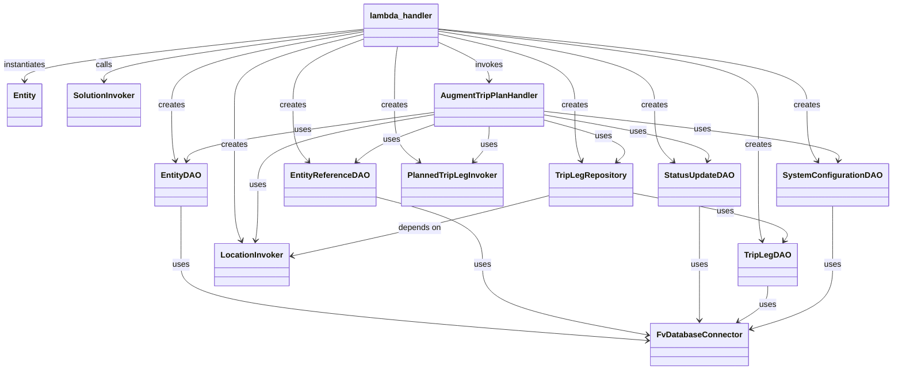

# Diagram: entity_core/entity_service/entity_service/trip_leg/trip_leg/augment_fv_trip_leg/handler.py


> Auto-generated by Obscura crawlers

## Diagram 1

```mermaid
flowchart TD
    Start([Start])
    LogEvent[/logging.info(event)/]
    InitDB[[DB_CONN = FvDatabaseConnector(...)]]
    InitDAOs[[Create SystemConfigurationDAO, TripLegDAO, StatusUpdateDAO, EntityReferenceDAO, EntityDAO]]
    Records{event contains Records?}
    ForRecord[/Extract record, message, json.loads(message)/]
    GetSolution["solution_id = data.get('solution_id')"]
    GetCustomer["customer_id = SolutionInvoker.get_customer_id(solution_id)"]
    LocationInvok["location_invoker = LocationInvoker(customer_id)"]
    Repo["trip_leg_repository = TripLegRepository(trip_leg_dao, location_invoker)"]
    Entities{data.get('entity_external_ids') loop}
    CreateEntity["entity = Entity(entity_external_id, solution_id, customer_id)"]
    PlannedInvok["planned_trip_leg_invoker = PlannedTripLegInvoker(entity)"]
    Handler["AugmentTripPlanHandler(...).handle()"]
    Success([Record processed])
    CatchError(["Exception -> log error; failed_records.append(create_item_failure_object(...))"])
    End(["return create_sqs_consumer_response(failed_records)"])
    Start --> LogEvent --> InitDB --> InitDAOs --> Records
    Records -->|yes| ForRecord
    ForRecord --> GetSolution --> GetCustomer --> LocationInvok --> Repo --> Entities
    Entities -->|for each| CreateEntity --> PlannedInvok --> Handler --> Success --> Entities
    ForRecord -->|exception| CatchError --> Records
    Entities -->|none| Records
    Records -->|no| End
```

> SVG rendering failed for this diagram.

## Diagram 2



### SVG

<svg id="container" width="1707.92578125" xmlns="http://www.w3.org/2000/svg" class="classDiagram" height="732" viewBox="0 0 1707.92578125 732" role="graphics-document document" aria-roledescription="class"><style>#container{font-family:"trebuchet ms",verdana,arial,sans-serif;font-size:16px;fill:#333;}@keyframes edge-animation-frame{from{stroke-dashoffset:0;}}@keyframes dash{to{stroke-dashoffset:0;}}#container .edge-animation-slow{stroke-dasharray:9,5!important;stroke-dashoffset:900;animation:dash 50s linear infinite;stroke-linecap:round;}#container .edge-animation-fast{stroke-dasharray:9,5!important;stroke-dashoffset:900;animation:dash 20s linear infinite;stroke-linecap:round;}#container .error-icon{fill:#552222;}#container .error-text{fill:#552222;stroke:#552222;}#container .edge-thickness-normal{stroke-width:1px;}#container .edge-thickness-thick{stroke-width:3.5px;}#container .edge-pattern-solid{stroke-dasharray:0;}#container .edge-thickness-invisible{stroke-width:0;fill:none;}#container .edge-pattern-dashed{stroke-dasharray:3;}#container .edge-pattern-dotted{stroke-dasharray:2;}#container .marker{fill:#333333;stroke:#333333;}#container .marker.cross{stroke:#333333;}#container svg{font-family:"trebuchet ms",verdana,arial,sans-serif;font-size:16px;}#container p{margin:0;}#container g.classGroup text{fill:#9370DB;stroke:none;font-family:"trebuchet ms",verdana,arial,sans-serif;font-size:10px;}#container g.classGroup text .title{font-weight:bolder;}#container .nodeLabel,#container .edgeLabel{color:#131300;}#container .edgeLabel .label rect{fill:#ECECFF;}#container .label text{fill:#131300;}#container .labelBkg{background:#ECECFF;}#container .edgeLabel .label span{background:#ECECFF;}#container .classTitle{font-weight:bolder;}#container .node rect,#container .node circle,#container .node ellipse,#container .node polygon,#container .node path{fill:#ECECFF;stroke:#9370DB;stroke-width:1px;}#container .divider{stroke:#9370DB;stroke-width:1;}#container g.clickable{cursor:pointer;}#container g.classGroup rect{fill:#ECECFF;stroke:#9370DB;}#container g.classGroup line{stroke:#9370DB;stroke-width:1;}#container .classLabel .box{stroke:none;stroke-width:0;fill:#ECECFF;opacity:0.5;}#container .classLabel .label{fill:#9370DB;font-size:10px;}#container .relation{stroke:#333333;stroke-width:1;fill:none;}#container .dashed-line{stroke-dasharray:3;}#container .dotted-line{stroke-dasharray:1 2;}#container #compositionStart,#container .composition{fill:#333333!important;stroke:#333333!important;stroke-width:1;}#container #compositionEnd,#container .composition{fill:#333333!important;stroke:#333333!important;stroke-width:1;}#container #dependencyStart,#container .dependency{fill:#333333!important;stroke:#333333!important;stroke-width:1;}#container #dependencyStart,#container .dependency{fill:#333333!important;stroke:#333333!important;stroke-width:1;}#container #extensionStart,#container .extension{fill:transparent!important;stroke:#333333!important;stroke-width:1;}#container #extensionEnd,#container .extension{fill:transparent!important;stroke:#333333!important;stroke-width:1;}#container #aggregationStart,#container .aggregation{fill:transparent!important;stroke:#333333!important;stroke-width:1;}#container #aggregationEnd,#container .aggregation{fill:transparent!important;stroke:#333333!important;stroke-width:1;}#container #lollipopStart,#container .lollipop{fill:#ECECFF!important;stroke:#333333!important;stroke-width:1;}#container #lollipopEnd,#container .lollipop{fill:#ECECFF!important;stroke:#333333!important;stroke-width:1;}#container .edgeTerminals{font-size:11px;line-height:initial;}#container .classTitleText{text-anchor:middle;font-size:18px;fill:#333;}#container .label-icon{display:inline-block;height:1em;overflow:visible;vertical-align:-0.125em;}#container .node .label-icon path{fill:currentColor;stroke:revert;stroke-width:revert;}#container :root{--mermaid-font-family:"trebuchet ms",verdana,arial,sans-serif;}</style><g><defs><marker id="container_class-aggregationStart" class="marker aggregation class" refX="18" refY="7" markerWidth="190" markerHeight="240" orient="auto"><path d="M 18,7 L9,13 L1,7 L9,1 Z"></path></marker></defs><defs><marker id="container_class-aggregationEnd" class="marker aggregation class" refX="1" refY="7" markerWidth="20" markerHeight="28" orient="auto"><path d="M 18,7 L9,13 L1,7 L9,1 Z"></path></marker></defs><defs><marker id="container_class-extensionStart" class="marker extension class" refX="18" refY="7" markerWidth="190" markerHeight="240" orient="auto"><path d="M 1,7 L18,13 V 1 Z"></path></marker></defs><defs><marker id="container_class-extensionEnd" class="marker extension class" refX="1" refY="7" markerWidth="20" markerHeight="28" orient="auto"><path d="M 1,1 V 13 L18,7 Z"></path></marker></defs><defs><marker id="container_class-compositionStart" class="marker composition class" refX="18" refY="7" markerWidth="190" markerHeight="240" orient="auto"><path d="M 18,7 L9,13 L1,7 L9,1 Z"></path></marker></defs><defs><marker id="container_class-compositionEnd" class="marker composition class" refX="1" refY="7" markerWidth="20" markerHeight="28" orient="auto"><path d="M 18,7 L9,13 L1,7 L9,1 Z"></path></marker></defs><defs><marker id="container_class-dependencyStart" class="marker dependency class" refX="6" refY="7" markerWidth="190" markerHeight="240" orient="auto"><path d="M 5,7 L9,13 L1,7 L9,1 Z"></path></marker></defs><defs><marker id="container_class-dependencyEnd" class="marker dependency class" refX="13" refY="7" markerWidth="20" markerHeight="28" orient="auto"><path d="M 18,7 L9,13 L14,7 L9,1 Z"></path></marker></defs><defs><marker id="container_class-lollipopStart" class="marker lollipop class" refX="13" refY="7" markerWidth="190" markerHeight="240" orient="auto"><circle stroke="black" fill="transparent" cx="7" cy="7" r="6"></circle></marker></defs><defs><marker id="container_class-lollipopEnd" class="marker lollipop class" refX="1" refY="7" markerWidth="190" markerHeight="240" orient="auto"><circle stroke="black" fill="transparent" cx="7" cy="7" r="6"></circle></marker></defs><g class="root"><g class="clusters"></g><g class="edgePaths"><path d="M1596.707,408L1596.707,414.167C1596.707,420.333,1596.707,432.667,1596.707,452C1596.707,471.333,1596.707,497.667,1596.707,524C1596.707,550.333,1596.707,576.667,1570.782,597.942C1544.857,619.217,1493.006,635.434,1467.081,643.543L1441.156,651.652" id="id_SystemConfigurationDAO_FvDatabaseConnector_1" class="edge-thickness-normal edge-pattern-solid relation" style=";;;" data-edge="true" data-et="edge" data-id="id_SystemConfigurationDAO_FvDatabaseConnector_1" data-points="W3sieCI6MTU5Ni43MDcwMzEyNSwieSI6NDA4fSx7IngiOjE1OTYuNzA3MDMxMjUsInkiOjQ0NX0seyJ4IjoxNTk2LjcwNzAzMTI1LCJ5Ijo1MjR9LHsieCI6MTU5Ni43MDcwMzEyNSwieSI6NjAzfSx7IngiOjE0MzUuNDI5Njg3NSwieSI6NjUzLjQ0MjY2MjUwMTM1MzJ9XQ==" marker-end="url(#container_class-dependencyEnd)"></path><path d="M1474.676,566L1474.676,572.167C1474.676,578.333,1474.676,590.667,1465.341,602.482C1456.006,614.298,1437.335,625.596,1428,631.245L1418.665,636.894" id="id_TripLegDAO_FvDatabaseConnector_2" class="edge-thickness-normal edge-pattern-solid relation" style=";;;" data-edge="true" data-et="edge" data-id="id_TripLegDAO_FvDatabaseConnector_2" data-points="W3sieCI6MTQ3NC42NzU3ODEyNSwieSI6NTY2fSx7IngiOjE0NzQuNjc1NzgxMjUsInkiOjYwM30seyJ4IjoxNDEzLjUzMTc0NDQ2MjAyNTIsInkiOjY0MH1d" marker-end="url(#container_class-dependencyEnd)"></path><path d="M1344.125,408L1344.125,414.167C1344.125,420.333,1344.125,432.667,1344.125,452C1344.125,471.333,1344.125,497.667,1344.125,524C1344.125,550.333,1344.125,576.667,1344.125,595C1344.125,613.333,1344.125,623.667,1344.125,628.833L1344.125,634" id="id_StatusUpdateDAO_FvDatabaseConnector_3" class="edge-thickness-normal edge-pattern-solid relation" style=";;;" data-edge="true" data-et="edge" data-id="id_StatusUpdateDAO_FvDatabaseConnector_3" data-points="W3sieCI6MTM0NC4xMjUsInkiOjQwOH0seyJ4IjoxMzQ0LjEyNSwieSI6NDQ1fSx7IngiOjEzNDQuMTI1LCJ5Ijo1MjR9LHsieCI6MTM0NC4xMjUsInkiOjYwM30seyJ4IjoxMzQ0LjEyNSwieSI6NjQwfV0=" marker-end="url(#container_class-dependencyEnd)"></path><path d="M724.07,389.114L758.359,398.428C792.647,407.742,861.224,426.371,895.512,448.852C929.801,471.333,929.801,497.667,929.801,524C929.801,550.333,929.801,576.667,982.655,599.911C1035.509,623.156,1141.218,643.311,1194.072,653.389L1246.926,663.467" id="id_EntityReferenceDAO_FvDatabaseConnector_4" class="edge-thickness-normal edge-pattern-solid relation" style=";;;" data-edge="true" data-et="edge" data-id="id_EntityReferenceDAO_FvDatabaseConnector_4" data-points="W3sieCI6NzI0LjA3MDMxMjUsInkiOjM4OS4xMTM1MTM5NDkxNDY0fSx7IngiOjkyOS44MDA3ODEyNSwieSI6NDQ1fSx7IngiOjkyOS44MDA3ODEyNSwieSI6NTI0fSx7IngiOjkyOS44MDA3ODEyNSwieSI6NjAzfSx7IngiOjEyNTIuODIwMzEyNSwieSI6NjY0LjU5MDc1ODY3MTQwNTl9XQ==" marker-end="url(#container_class-dependencyEnd)"></path><path d="M354.41,408L354.41,414.167C354.41,420.333,354.41,432.667,354.41,452C354.41,471.333,354.41,497.667,354.41,524C354.41,550.333,354.41,576.667,503.148,601.706C651.887,626.745,949.363,650.49,1098.101,662.362L1246.839,674.235" id="id_EntityDAO_FvDatabaseConnector_5" class="edge-thickness-normal edge-pattern-solid relation" style=";;;" data-edge="true" data-et="edge" data-id="id_EntityDAO_FvDatabaseConnector_5" data-points="W3sieCI6MzU0LjQxMDE1NjI1LCJ5Ijo0MDh9LHsieCI6MzU0LjQxMDE1NjI1LCJ5Ijo0NDV9LHsieCI6MzU0LjQxMDE1NjI1LCJ5Ijo1MjR9LHsieCI6MzU0LjQxMDE1NjI1LCJ5Ijo2MDN9LHsieCI6MTI1Mi44MjAzMTI1LCJ5Ijo2NzQuNzExOTcxMTcyMjUyMX1d" marker-end="url(#container_class-dependencyEnd)"></path><path d="M1216.82,382.068L1268.273,392.556C1319.727,403.045,1422.633,424.023,1470.657,439.837C1518.681,455.652,1511.823,466.303,1508.394,471.629L1504.965,476.955" id="id_TripLegRepository_TripLegDAO_6" class="edge-thickness-normal edge-pattern-solid relation" style=";;;" data-edge="true" data-et="edge" data-id="id_TripLegRepository_TripLegDAO_6" data-points="W3sieCI6MTIxNi44MjAzMTI1LCJ5IjozODIuMDY3NTUzNjc0MDI0OH0seyJ4IjoxNTI1LjUzOTA2MjUsInkiOjQ0NX0seyJ4IjoxNTAxLjcxNzAxOTM4MjkxMTMsInkiOjQ4Mn1d" marker-end="url(#container_class-dependencyEnd)"></path><path d="M1059.18,386.696L1022.171,396.413C985.163,406.131,911.146,425.565,829.4,445.522C747.654,465.478,658.179,485.956,613.442,496.194L568.704,506.433" id="id_TripLegRepository_LocationInvoker_7" class="edge-thickness-normal edge-pattern-solid relation" style=";;;" data-edge="true" data-et="edge" data-id="id_TripLegRepository_LocationInvoker_7" data-points="W3sieCI6MTA1OS4xNzk2ODc1LCJ5IjozODYuNjk1OTIxOTk3MzI1NDZ9LHsieCI6ODM3LjEyODkwNjI1LCJ5Ijo0NDV9LHsieCI6NTYyLjg1NTQ2ODc1LCJ5Ijo1MDcuNzcxOTQ4NDg2OTc0Nn1d" marker-end="url(#container_class-dependencyEnd)"></path><path d="M1046.781,220.228L1141.477,231.357C1236.172,242.486,1425.563,264.743,1519.059,281.064C1612.555,297.385,1610.156,307.769,1608.957,312.962L1607.758,318.154" id="id_AugmentTripPlanHandler_SystemConfigurationDAO_8" class="edge-thickness-normal edge-pattern-solid relation" style=";;;" data-edge="true" data-et="edge" data-id="id_AugmentTripPlanHandler_SystemConfigurationDAO_8" data-points="W3sieCI6MTA0Ni43ODEyNSwieSI6MjIwLjIyODQ5NjcxNjgzNDIzfSx7IngiOjE2MTQuOTUzMTI1LCJ5IjoyODd9LHsieCI6MTYwNi40MDc0ODYxNTUwNjMyLCJ5IjozMjR9XQ==" marker-end="url(#container_class-dependencyEnd)"></path><path d="M1046.781,237.349L1076.12,245.624C1105.46,253.899,1164.138,270.45,1187.588,284.21C1211.039,297.97,1199.261,308.94,1193.372,314.425L1187.483,319.911" id="id_AugmentTripPlanHandler_TripLegRepository_9" class="edge-thickness-normal edge-pattern-solid relation" style=";;;" data-edge="true" data-et="edge" data-id="id_AugmentTripPlanHandler_TripLegRepository_9" data-points="W3sieCI6MTA0Ni43ODEyNSwieSI6MjM3LjM0ODg2OTY0MjgzMjIzfSx7IngiOjEyMjIuODE2NDA2MjUsInkiOjI4N30seyJ4IjoxMTgzLjA5MjI2NjYxMzkyNCwieSI6MzI0fV0=" marker-end="url(#container_class-dependencyEnd)"></path><path d="M1046.781,227.287L1100.475,237.239C1154.169,247.191,1261.557,267.096,1313.614,282.26C1365.67,297.425,1362.394,307.851,1360.757,313.063L1359.119,318.276" id="id_AugmentTripPlanHandler_StatusUpdateDAO_10" class="edge-thickness-normal edge-pattern-solid relation" style=";;;" data-edge="true" data-et="edge" data-id="id_AugmentTripPlanHandler_StatusUpdateDAO_10" data-points="W3sieCI6MTA0Ni43ODEyNSwieSI6MjI3LjI4NjYyMjkxOTU2ODg4fSx7IngiOjEzNjguOTQ1MzEyNSwieSI6Mjg3fSx7IngiOjEzNTcuMzIwNjA5MTc3MjE1MSwieSI6MzI0fV0=" marker-end="url(#container_class-dependencyEnd)"></path><path d="M838.672,245.942L819.906,252.785C801.139,259.628,763.607,273.314,738.783,285.652C713.959,297.99,701.844,308.979,695.787,314.474L689.729,319.969" id="id_AugmentTripPlanHandler_EntityReferenceDAO_11" class="edge-thickness-normal edge-pattern-solid relation" style=";;;" data-edge="true" data-et="edge" data-id="id_AugmentTripPlanHandler_EntityReferenceDAO_11" data-points="W3sieCI6ODM4LjY3MTg3NSwieSI6MjQ1Ljk0MjQ0ODExODU2NTUyfSx7IngiOjcyNi4wNzQyMTg3NSwieSI6Mjg3fSx7IngiOjY4NS4yODUzMDQ1ODg2MDc2LCJ5IjozMjR9XQ==" marker-end="url(#container_class-dependencyEnd)"></path><path d="M838.672,222.42L761.003,233.183C683.333,243.947,527.995,265.473,449.126,281.429C370.258,297.385,367.859,307.769,366.66,312.962L365.461,318.154" id="id_AugmentTripPlanHandler_EntityDAO_12" class="edge-thickness-normal edge-pattern-solid relation" style=";;;" data-edge="true" data-et="edge" data-id="id_AugmentTripPlanHandler_EntityDAO_12" data-points="W3sieCI6ODM4LjY3MTg3NSwieSI6MjIyLjQxOTgzNTgyMDY5MX0seyJ4IjozNzIuNjU2MjUsInkiOjI4N30seyJ4IjozNjQuMTEwNjExMTU1MDYzMywieSI6MzI0fV0=" marker-end="url(#container_class-dependencyEnd)"></path><path d="M838.672,226.669L782.628,236.724C726.583,246.779,614.495,266.89,558.451,290.111C502.406,313.333,502.406,339.667,502.406,366C502.406,392.333,502.406,418.667,501.721,437.009C501.036,455.351,499.666,465.701,498.981,470.877L498.296,476.052" id="id_AugmentTripPlanHandler_LocationInvoker_13" class="edge-thickness-normal edge-pattern-solid relation" style=";;;" data-edge="true" data-et="edge" data-id="id_AugmentTripPlanHandler_LocationInvoker_13" data-points="W3sieCI6ODM4LjY3MTg3NSwieSI6MjI2LjY2ODk1NTQ4MzQwMTY1fSx7IngiOjUwMi40MDYyNSwieSI6Mjg3fSx7IngiOjUwMi40MDYyNSwieSI6MzY2fSx7IngiOjUwMi40MDYyNSwieSI6NDQ1fSx7IngiOjQ5Ny41MDg2NTMwODU0NDMwMywieSI6NDgyfV0=" marker-end="url(#container_class-dependencyEnd)"></path><path d="M942.727,250L942.727,256.167C942.727,262.333,942.727,274.667,937.769,286.262C932.81,297.857,922.894,308.713,917.936,314.142L912.978,319.57" id="id_AugmentTripPlanHandler_PlannedTripLegInvoker_14" class="edge-thickness-normal edge-pattern-solid relation" style=";;;" data-edge="true" data-et="edge" data-id="id_AugmentTripPlanHandler_PlannedTripLegInvoker_14" data-points="W3sieCI6OTQyLjcyNjU2MjUsInkiOjI1MH0seyJ4Ijo5NDIuNzI2NTYyNSwieSI6Mjg3fSx7IngiOjkwOC45MzE4NjMxMzI5MTE0LCJ5IjozMjR9XQ==" marker-end="url(#container_class-dependencyEnd)"></path><path d="M846.164,57.342L963.241,69.285C1080.318,81.228,1314.471,105.114,1431.548,130.224C1548.625,155.333,1548.625,181.667,1548.625,208C1548.625,234.333,1548.625,260.667,1551.858,279.146C1555.092,297.625,1561.558,308.25,1564.792,313.562L1568.025,318.875" id="id_lambda_handler_SystemConfigurationDAO_15" class="edge-thickness-normal edge-pattern-solid relation" style=";;;" data-edge="true" data-et="edge" data-id="id_lambda_handler_SystemConfigurationDAO_15" data-points="W3sieCI6ODQ2LjE2NDA2MjUsInkiOjU3LjM0MjI5NDgxMDc0OTczNX0seyJ4IjoxNTQ4LjYyNSwieSI6MTI5fSx7IngiOjE1NDguNjI1LCJ5IjoyMDh9LHsieCI6MTU0OC42MjUsInkiOjI4N30seyJ4IjoxNTcxLjE0NDQzMjM1NzU5NSwieSI6MzI0fV0=" marker-end="url(#container_class-dependencyEnd)"></path><path d="M846.164,58.335L947.875,70.112C1049.586,81.89,1253.008,105.445,1354.719,130.389C1456.43,155.333,1456.43,181.667,1456.43,208C1456.43,234.333,1456.43,260.667,1456.43,287C1456.43,313.333,1456.43,339.667,1456.43,366C1456.43,392.333,1456.43,418.667,1457.629,437.026C1458.828,455.385,1461.227,465.769,1462.426,470.962L1463.625,476.154" id="id_lambda_handler_TripLegDAO_16" class="edge-thickness-normal edge-pattern-solid relation" style=";;;" data-edge="true" data-et="edge" data-id="id_lambda_handler_TripLegDAO_16" data-points="W3sieCI6ODQ2LjE2NDA2MjUsInkiOjU4LjMzNDUwMTM1Njk2ODY0fSx7IngiOjE0NTYuNDI5Njg3NSwieSI6MTI5fSx7IngiOjE0NTYuNDI5Njg3NSwieSI6MjA4fSx7IngiOjE0NTYuNDI5Njg3NSwieSI6Mjg3fSx7IngiOjE0NTYuNDI5Njg3NSwieSI6MzY2fSx7IngiOjE0NTYuNDI5Njg3NSwieSI6NDQ1fSx7IngiOjE0NjQuOTc1MzI2MzQ0OTM2OCwieSI6NDgyfV0=" marker-end="url(#container_class-dependencyEnd)"></path><path d="M846.164,61.721L915.021,72.934C983.879,84.147,1121.594,106.574,1190.451,130.954C1259.309,155.333,1259.309,181.667,1259.309,208C1259.309,234.333,1259.309,260.667,1265.198,279.318C1271.086,297.97,1282.864,308.94,1288.753,314.425L1294.642,319.911" id="id_lambda_handler_StatusUpdateDAO_17" class="edge-thickness-normal edge-pattern-solid relation" style=";;;" data-edge="true" data-et="edge" data-id="id_lambda_handler_StatusUpdateDAO_17" data-points="W3sieCI6ODQ2LjE2NDA2MjUsInkiOjYxLjcyMTA5MDkwMDMwNjc4NH0seyJ4IjoxMjU5LjMwODU5Mzc1LCJ5IjoxMjl9LHsieCI6MTI1OS4zMDg1OTM3NSwieSI6MjA4fSx7IngiOjEyNTkuMzA4NTkzNzUsInkiOjI4N30seyJ4IjoxMjk5LjAzMjczMzM4NjA3NiwieSI6MzI0fV0=" marker-end="url(#container_class-dependencyEnd)"></path><path d="M702.211,77.88L680.215,86.4C658.22,94.92,614.229,111.96,592.234,133.647C570.238,155.333,570.238,181.667,570.238,208C570.238,234.333,570.238,260.667,574.948,279.246C579.658,297.825,589.077,308.649,593.787,314.061L598.497,319.474" id="id_lambda_handler_EntityReferenceDAO_18" class="edge-thickness-normal edge-pattern-solid relation" style=";;;" data-edge="true" data-et="edge" data-id="id_lambda_handler_EntityReferenceDAO_18" data-points="W3sieCI6NzAyLjIxMDkzNzUsInkiOjc3Ljg4MDIxNjgxMjU0OTA4fSx7IngiOjU3MC4yMzgyODEyNSwieSI6MTI5fSx7IngiOjU3MC4yMzgyODEyNSwieSI6MjA4fSx7IngiOjU3MC4yMzgyODEyNSwieSI6Mjg3fSx7IngiOjYwMi40MzU4MTg4MjkxMTM5LCJ5IjozMjR9XQ==" marker-end="url(#container_class-dependencyEnd)"></path><path d="M702.211,62.981L641.203,73.984C580.195,84.988,458.18,106.994,397.172,131.164C336.164,155.333,336.164,181.667,336.164,208C336.164,234.333,336.164,260.667,337.363,279.026C338.563,297.385,340.961,307.769,342.16,312.962L343.359,318.154" id="id_lambda_handler_EntityDAO_19" class="edge-thickness-normal edge-pattern-solid relation" style=";;;" data-edge="true" data-et="edge" data-id="id_lambda_handler_EntityDAO_19" data-points="W3sieCI6NzAyLjIxMDkzNzUsInkiOjYyLjk4MTM3OTQyMTA0OTgxNn0seyJ4IjozMzYuMTY0MDYyNSwieSI6MTI5fSx7IngiOjMzNi4xNjQwNjI1LCJ5IjoyMDh9LHsieCI6MzM2LjE2NDA2MjUsInkiOjI4N30seyJ4IjozNDQuNzA5NzAxMzQ0OTM2NywieSI6MzI0fV0=" marker-end="url(#container_class-dependencyEnd)"></path><path d="M702.211,59.983L619.275,71.486C536.339,82.989,370.466,105.994,287.53,122.664C204.594,139.333,204.594,149.667,204.594,154.833L204.594,160" id="id_lambda_handler_SolutionInvoker_20" class="edge-thickness-normal edge-pattern-solid relation" style=";;;" data-edge="true" data-et="edge" data-id="id_lambda_handler_SolutionInvoker_20" data-points="W3sieCI6NzAyLjIxMDkzNzUsInkiOjU5Ljk4MjgxMzk1NzMxNjA3fSx7IngiOjIwNC41OTM3NSwieSI6MTI5fSx7IngiOjIwNC41OTM3NSwieSI6MTY2fV0=" marker-end="url(#container_class-dependencyEnd)"></path><path d="M702.211,67.884L661.215,78.07C620.219,88.256,538.227,108.628,497.23,131.981C456.234,155.333,456.234,181.667,456.234,208C456.234,234.333,456.234,260.667,456.234,287C456.234,313.333,456.234,339.667,456.234,366C456.234,392.333,456.234,418.667,458.61,437.089C460.986,455.511,465.738,466.022,468.114,471.277L470.49,476.533" id="id_lambda_handler_LocationInvoker_21" class="edge-thickness-normal edge-pattern-solid relation" style=";;;" data-edge="true" data-et="edge" data-id="id_lambda_handler_LocationInvoker_21" data-points="W3sieCI6NzAyLjIxMDkzNzUsInkiOjY3Ljg4MzYwNjA3NDAwODU1fSx7IngiOjQ1Ni4yMzQzNzUsInkiOjEyOX0seyJ4Ijo0NTYuMjM0Mzc1LCJ5IjoyMDh9LHsieCI6NDU2LjIzNDM3NSwieSI6Mjg3fSx7IngiOjQ1Ni4yMzQzNzUsInkiOjM2Nn0seyJ4Ijo0NTYuMjM0Mzc1LCJ5Ijo0NDV9LHsieCI6NDcyLjk2MTU4MDMwMDYzMjkzLCJ5Ijo0ODJ9XQ==" marker-end="url(#container_class-dependencyEnd)"></path><path d="M846.164,67.036L889.796,77.364C933.427,87.691,1020.69,108.345,1064.322,131.839C1107.953,155.333,1107.953,181.667,1107.953,208C1107.953,234.333,1107.953,260.667,1109.943,279.065C1111.933,297.464,1115.913,307.928,1117.903,313.16L1119.893,318.392" id="id_lambda_handler_TripLegRepository_22" class="edge-thickness-normal edge-pattern-solid relation" style=";;;" data-edge="true" data-et="edge" data-id="id_lambda_handler_TripLegRepository_22" data-points="W3sieCI6ODQ2LjE2NDA2MjUsInkiOjY3LjAzNjM1MTI5NDQxNTA2fSx7IngiOjExMDcuOTUzMTI1LCJ5IjoxMjl9LHsieCI6MTEwNy45NTMxMjUsInkiOjIwOH0seyJ4IjoxMTA3Ljk1MzEyNSwieSI6Mjg3fSx7IngiOjExMjIuMDI1NzEyMDI1MzE2NCwieSI6MzI0fV0=" marker-end="url(#container_class-dependencyEnd)"></path><path d="M702.211,57.862L593.661,69.718C485.112,81.574,268.013,105.287,159.464,122.31C50.914,139.333,50.914,149.667,50.914,154.833L50.914,160" id="id_lambda_handler_Entity_23" class="edge-thickness-normal edge-pattern-solid relation" style=";;;" data-edge="true" data-et="edge" data-id="id_lambda_handler_Entity_23" data-points="W3sieCI6NzAyLjIxMDkzNzUsInkiOjU3Ljg2MTY4NTY5NTQ2MDA5Nn0seyJ4Ijo1MC45MTQwNjI1LCJ5IjoxMjl9LHsieCI6NTAuOTE0MDYyNSwieSI6MTY2fV0=" marker-end="url(#container_class-dependencyEnd)"></path><path d="M768.009,92L767.102,98.167C766.195,104.333,764.381,116.667,763.474,136C762.566,155.333,762.566,181.667,762.566,208C762.566,234.333,762.566,260.667,770.19,279.41C777.814,298.153,793.061,309.305,800.684,314.881L808.308,320.458" id="id_lambda_handler_PlannedTripLegInvoker_24" class="edge-thickness-normal edge-pattern-solid relation" style=";;;" data-edge="true" data-et="edge" data-id="id_lambda_handler_PlannedTripLegInvoker_24" data-points="W3sieCI6NzY4LjAwOTE5Njk5MzY3MDksInkiOjkyfSx7IngiOjc2Mi41NjY0MDYyNSwieSI6MTI5fSx7IngiOjc2Mi41NjY0MDYyNSwieSI6MjA4fSx7IngiOjc2Mi41NjY0MDYyNSwieSI6Mjg3fSx7IngiOjgxMy4xNTA1MTQyNDA1MDY0LCJ5IjozMjR9XQ==" marker-end="url(#container_class-dependencyEnd)"></path><path d="M846.164,83.738L862.258,91.282C878.352,98.825,910.539,113.913,926.633,126.623C942.727,139.333,942.727,149.667,942.727,154.833L942.727,160" id="id_lambda_handler_AugmentTripPlanHandler_25" class="edge-thickness-normal edge-pattern-solid relation" style=";;;" data-edge="true" data-et="edge" data-id="id_lambda_handler_AugmentTripPlanHandler_25" data-points="W3sieCI6ODQ2LjE2NDA2MjUsInkiOjgzLjczNzg2Njc3NzkxNjg1fSx7IngiOjk0Mi43MjY1NjI1LCJ5IjoxMjl9LHsieCI6OTQyLjcyNjU2MjUsInkiOjE2Nn1d" marker-end="url(#container_class-dependencyEnd)"></path></g><g class="edgeLabels"><g class="edgeLabel" transform="translate(1596.70703125, 524)"><g class="label" data-id="id_SystemConfigurationDAO_FvDatabaseConnector_1" transform="translate(-16.4921875, -12)"><foreignObject width="32.984375" height="24"><div xmlns="http://www.w3.org/1999/xhtml" class="labelBkg" style="display: table-cell; white-space: nowrap; line-height: 1.5; max-width: 200px; text-align: center;"><span class="edgeLabel"><p>uses</p></span></div></foreignObject></g></g><g class="edgeLabel" transform="translate(1474.67578125, 603)"><g class="label" data-id="id_TripLegDAO_FvDatabaseConnector_2" transform="translate(-16.4921875, -12)"><foreignObject width="32.984375" height="24"><div xmlns="http://www.w3.org/1999/xhtml" class="labelBkg" style="display: table-cell; white-space: nowrap; line-height: 1.5; max-width: 200px; text-align: center;"><span class="edgeLabel"><p>uses</p></span></div></foreignObject></g></g><g class="edgeLabel" transform="translate(1344.125, 524)"><g class="label" data-id="id_StatusUpdateDAO_FvDatabaseConnector_3" transform="translate(-16.4921875, -12)"><foreignObject width="32.984375" height="24"><div xmlns="http://www.w3.org/1999/xhtml" class="labelBkg" style="display: table-cell; white-space: nowrap; line-height: 1.5; max-width: 200px; text-align: center;"><span class="edgeLabel"><p>uses</p></span></div></foreignObject></g></g><g class="edgeLabel" transform="translate(929.80078125, 524)"><g class="label" data-id="id_EntityReferenceDAO_FvDatabaseConnector_4" transform="translate(-16.4921875, -12)"><foreignObject width="32.984375" height="24"><div xmlns="http://www.w3.org/1999/xhtml" class="labelBkg" style="display: table-cell; white-space: nowrap; line-height: 1.5; max-width: 200px; text-align: center;"><span class="edgeLabel"><p>uses</p></span></div></foreignObject></g></g><g class="edgeLabel" transform="translate(354.41015625, 524)"><g class="label" data-id="id_EntityDAO_FvDatabaseConnector_5" transform="translate(-16.4921875, -12)"><foreignObject width="32.984375" height="24"><div xmlns="http://www.w3.org/1999/xhtml" class="labelBkg" style="display: table-cell; white-space: nowrap; line-height: 1.5; max-width: 200px; text-align: center;"><span class="edgeLabel"><p>uses</p></span></div></foreignObject></g></g><g class="edgeLabel" transform="translate(1392.73908, 417.92867)"><g class="label" data-id="id_TripLegRepository_TripLegDAO_6" transform="translate(-16.4921875, -12)"><foreignObject width="32.984375" height="24"><div xmlns="http://www.w3.org/1999/xhtml" class="labelBkg" style="display: table-cell; white-space: nowrap; line-height: 1.5; max-width: 200px; text-align: center;"><span class="edgeLabel"><p>uses</p></span></div></foreignObject></g></g><g class="edgeLabel" transform="translate(811.8879, 450.77682)"><g class="label" data-id="id_TripLegRepository_LocationInvoker_7" transform="translate(-42.9453125, -12)"><foreignObject width="85.890625" height="24"><div xmlns="http://www.w3.org/1999/xhtml" class="labelBkg" style="display: table-cell; white-space: nowrap; line-height: 1.5; max-width: 200px; text-align: center;"><span class="edgeLabel"><p>depends on</p></span></div></foreignObject></g></g><g class="edgeLabel" transform="translate(1349.72444, 255.83035)"><g class="label" data-id="id_AugmentTripPlanHandler_SystemConfigurationDAO_8" transform="translate(-16.4921875, -12)"><foreignObject width="32.984375" height="24"><div xmlns="http://www.w3.org/1999/xhtml" class="labelBkg" style="display: table-cell; white-space: nowrap; line-height: 1.5; max-width: 200px; text-align: center;"><span class="edgeLabel"><p>uses</p></span></div></foreignObject></g></g><g class="edgeLabel" transform="translate(1160.92276, 269.54275)"><g class="label" data-id="id_AugmentTripPlanHandler_TripLegRepository_9" transform="translate(-16.4921875, -12)"><foreignObject width="32.984375" height="24"><div xmlns="http://www.w3.org/1999/xhtml" class="labelBkg" style="display: table-cell; white-space: nowrap; line-height: 1.5; max-width: 200px; text-align: center;"><span class="edgeLabel"><p>uses</p></span></div></foreignObject></g></g><g class="edgeLabel" transform="translate(1226.93011, 260.67736)"><g class="label" data-id="id_AugmentTripPlanHandler_StatusUpdateDAO_10" transform="translate(-16.4921875, -12)"><foreignObject width="32.984375" height="24"><div xmlns="http://www.w3.org/1999/xhtml" class="labelBkg" style="display: table-cell; white-space: nowrap; line-height: 1.5; max-width: 200px; text-align: center;"><span class="edgeLabel"><p>uses</p></span></div></foreignObject></g></g><g class="edgeLabel" transform="translate(756.50405, 275.90408)"><g class="label" data-id="id_AugmentTripPlanHandler_EntityReferenceDAO_11" transform="translate(-16.4921875, -12)"><foreignObject width="32.984375" height="24"><div xmlns="http://www.w3.org/1999/xhtml" class="labelBkg" style="display: table-cell; white-space: nowrap; line-height: 1.5; max-width: 200px; text-align: center;"><span class="edgeLabel"><p>uses</p></span></div></foreignObject></g></g><g class="edgeLabel" transform="translate(586.85677, 257.31622)"><g class="label" data-id="id_AugmentTripPlanHandler_EntityDAO_12" transform="translate(-16.4921875, -12)"><foreignObject width="32.984375" height="24"><div xmlns="http://www.w3.org/1999/xhtml" class="labelBkg" style="display: table-cell; white-space: nowrap; line-height: 1.5; max-width: 200px; text-align: center;"><span class="edgeLabel"><p>uses</p></span></div></foreignObject></g></g><g class="edgeLabel" transform="translate(502.40625, 366)"><g class="label" data-id="id_AugmentTripPlanHandler_LocationInvoker_13" transform="translate(-16.4921875, -12)"><foreignObject width="32.984375" height="24"><div xmlns="http://www.w3.org/1999/xhtml" class="labelBkg" style="display: table-cell; white-space: nowrap; line-height: 1.5; max-width: 200px; text-align: center;"><span class="edgeLabel"><p>uses</p></span></div></foreignObject></g></g><g class="edgeLabel" transform="translate(942.7265625, 287)"><g class="label" data-id="id_AugmentTripPlanHandler_PlannedTripLegInvoker_14" transform="translate(-16.4921875, -12)"><foreignObject width="32.984375" height="24"><div xmlns="http://www.w3.org/1999/xhtml" class="labelBkg" style="display: table-cell; white-space: nowrap; line-height: 1.5; max-width: 200px; text-align: center;"><span class="edgeLabel"><p>uses</p></span></div></foreignObject></g></g><g class="edgeLabel" transform="translate(1548.625, 208)"><g class="label" data-id="id_lambda_handler_SystemConfigurationDAO_15" transform="translate(-26.171875, -12)"><foreignObject width="52.34375" height="24"><div xmlns="http://www.w3.org/1999/xhtml" class="labelBkg" style="display: table-cell; white-space: nowrap; line-height: 1.5; max-width: 200px; text-align: center;"><span class="edgeLabel"><p>creates</p></span></div></foreignObject></g></g><g class="edgeLabel" transform="translate(1456.4296875, 287)"><g class="label" data-id="id_lambda_handler_TripLegDAO_16" transform="translate(-26.171875, -12)"><foreignObject width="52.34375" height="24"><div xmlns="http://www.w3.org/1999/xhtml" class="labelBkg" style="display: table-cell; white-space: nowrap; line-height: 1.5; max-width: 200px; text-align: center;"><span class="edgeLabel"><p>creates</p></span></div></foreignObject></g></g><g class="edgeLabel" transform="translate(1259.30859375, 208)"><g class="label" data-id="id_lambda_handler_StatusUpdateDAO_17" transform="translate(-26.171875, -12)"><foreignObject width="52.34375" height="24"><div xmlns="http://www.w3.org/1999/xhtml" class="labelBkg" style="display: table-cell; white-space: nowrap; line-height: 1.5; max-width: 200px; text-align: center;"><span class="edgeLabel"><p>creates</p></span></div></foreignObject></g></g><g class="edgeLabel" transform="translate(570.23828125, 208)"><g class="label" data-id="id_lambda_handler_EntityReferenceDAO_18" transform="translate(-26.171875, -12)"><foreignObject width="52.34375" height="24"><div xmlns="http://www.w3.org/1999/xhtml" class="labelBkg" style="display: table-cell; white-space: nowrap; line-height: 1.5; max-width: 200px; text-align: center;"><span class="edgeLabel"><p>creates</p></span></div></foreignObject></g></g><g class="edgeLabel" transform="translate(336.1640625, 208)"><g class="label" data-id="id_lambda_handler_EntityDAO_19" transform="translate(-26.171875, -12)"><foreignObject width="52.34375" height="24"><div xmlns="http://www.w3.org/1999/xhtml" class="labelBkg" style="display: table-cell; white-space: nowrap; line-height: 1.5; max-width: 200px; text-align: center;"><span class="edgeLabel"><p>creates</p></span></div></foreignObject></g></g><g class="edgeLabel" transform="translate(204.59375, 129)"><g class="label" data-id="id_lambda_handler_SolutionInvoker_20" transform="translate(-16.4453125, -12)"><foreignObject width="32.890625" height="24"><div xmlns="http://www.w3.org/1999/xhtml" class="labelBkg" style="display: table-cell; white-space: nowrap; line-height: 1.5; max-width: 200px; text-align: center;"><span class="edgeLabel"><p>calls</p></span></div></foreignObject></g></g><g class="edgeLabel" transform="translate(456.234375, 287)"><g class="label" data-id="id_lambda_handler_LocationInvoker_21" transform="translate(-26.171875, -12)"><foreignObject width="52.34375" height="24"><div xmlns="http://www.w3.org/1999/xhtml" class="labelBkg" style="display: table-cell; white-space: nowrap; line-height: 1.5; max-width: 200px; text-align: center;"><span class="edgeLabel"><p>creates</p></span></div></foreignObject></g></g><g class="edgeLabel" transform="translate(1107.953125, 208)"><g class="label" data-id="id_lambda_handler_TripLegRepository_22" transform="translate(-26.171875, -12)"><foreignObject width="52.34375" height="24"><div xmlns="http://www.w3.org/1999/xhtml" class="labelBkg" style="display: table-cell; white-space: nowrap; line-height: 1.5; max-width: 200px; text-align: center;"><span class="edgeLabel"><p>creates</p></span></div></foreignObject></g></g><g class="edgeLabel" transform="translate(50.9140625, 129)"><g class="label" data-id="id_lambda_handler_Entity_23" transform="translate(-42.9140625, -12)"><foreignObject width="85.828125" height="24"><div xmlns="http://www.w3.org/1999/xhtml" class="labelBkg" style="display: table-cell; white-space: nowrap; line-height: 1.5; max-width: 200px; text-align: center;"><span class="edgeLabel"><p>instantiates</p></span></div></foreignObject></g></g><g class="edgeLabel" transform="translate(762.56640625, 208)"><g class="label" data-id="id_lambda_handler_PlannedTripLegInvoker_24" transform="translate(-26.171875, -12)"><foreignObject width="52.34375" height="24"><div xmlns="http://www.w3.org/1999/xhtml" class="labelBkg" style="display: table-cell; white-space: nowrap; line-height: 1.5; max-width: 200px; text-align: center;"><span class="edgeLabel"><p>creates</p></span></div></foreignObject></g></g><g class="edgeLabel" transform="translate(942.7265625, 129)"><g class="label" data-id="id_lambda_handler_AugmentTripPlanHandler_25" transform="translate(-27.5859375, -12)"><foreignObject width="55.171875" height="24"><div xmlns="http://www.w3.org/1999/xhtml" class="labelBkg" style="display: table-cell; white-space: nowrap; line-height: 1.5; max-width: 200px; text-align: center;"><span class="edgeLabel"><p>invokes</p></span></div></foreignObject></g></g></g><g class="nodes"><g class="node default" id="classId-FvDatabaseConnector-0" transform="translate(1344.125, 682)"><g class="basic label-container"><path d="M-91.3046875 -42 L91.3046875 -42 L91.3046875 42 L-91.3046875 42" stroke="none" stroke-width="0" fill="#ECECFF" style=""></path><path d="M-91.3046875 -42 C-27.866903301473712 -42, 35.570880897052575 -42, 91.3046875 -42 M-91.3046875 -42 C-42.669856263019255 -42, 5.964974973961489 -42, 91.3046875 -42 M91.3046875 -42 C91.3046875 -18.52751689966529, 91.3046875 4.94496620066942, 91.3046875 42 M91.3046875 -42 C91.3046875 -16.09989383201294, 91.3046875 9.800212335974123, 91.3046875 42 M91.3046875 42 C46.43942597949884 42, 1.5741644589976858 42, -91.3046875 42 M91.3046875 42 C21.426740643946076 42, -48.45120621210785 42, -91.3046875 42 M-91.3046875 42 C-91.3046875 15.913682081889686, -91.3046875 -10.172635836220628, -91.3046875 -42 M-91.3046875 42 C-91.3046875 10.0996843401621, -91.3046875 -21.8006313196758, -91.3046875 -42" stroke="#9370DB" stroke-width="1.3" fill="none" stroke-dasharray="0 0" style=""></path></g><g class="annotation-group text" transform="translate(0, -18)"></g><g class="label-group text" transform="translate(-79.3046875, -18)"><g class="label" style="font-weight: bolder" transform="translate(0,-12)"><foreignObject width="158.609375" height="24"><div xmlns="http://www.w3.org/1999/xhtml" style="display: table-cell; white-space: nowrap; line-height: 1.5; max-width: 207px; text-align: center;"><span class="nodeLabel markdown-node-label" style=""><p>FvDatabaseConnector</p></span></div></foreignObject></g></g><g class="members-group text" transform="translate(-79.3046875, 30)"></g><g class="methods-group text" transform="translate(-79.3046875, 60)"></g><g class="divider" style=""><path d="M-91.3046875 6 C-21.1340871446222 6, 49.0365132107556 6, 91.3046875 6 M-91.3046875 6 C-35.41351871683849 6, 20.477650066323022 6, 91.3046875 6" stroke="#9370DB" stroke-width="1.3" fill="none" stroke-dasharray="0 0" style=""></path></g><g class="divider" style=""><path d="M-91.3046875 24 C-41.3714203927392 24, 8.561846714521593 24, 91.3046875 24 M-91.3046875 24 C-50.75894182683387 24, -10.213196153667738 24, 91.3046875 24" stroke="#9370DB" stroke-width="1.3" fill="none" stroke-dasharray="0 0" style=""></path></g></g><g class="node default" id="classId-SystemConfigurationDAO-1" transform="translate(1596.70703125, 366)"><g class="basic label-container"><path d="M-103.21875 -42 L103.21875 -42 L103.21875 42 L-103.21875 42" stroke="none" stroke-width="0" fill="#ECECFF" style=""></path><path d="M-103.21875 -42 C-22.829036408747513 -42, 57.560677182504975 -42, 103.21875 -42 M-103.21875 -42 C-46.837862906546576 -42, 9.543024186906848 -42, 103.21875 -42 M103.21875 -42 C103.21875 -11.518468303954833, 103.21875 18.963063392090334, 103.21875 42 M103.21875 -42 C103.21875 -25.15479175476908, 103.21875 -8.309583509538157, 103.21875 42 M103.21875 42 C40.62085437296141 42, -21.97704125407718 42, -103.21875 42 M103.21875 42 C40.61383581663724 42, -21.991078366725517 42, -103.21875 42 M-103.21875 42 C-103.21875 12.235543963018763, -103.21875 -17.528912073962474, -103.21875 -42 M-103.21875 42 C-103.21875 14.783314529012202, -103.21875 -12.433370941975596, -103.21875 -42" stroke="#9370DB" stroke-width="1.3" fill="none" stroke-dasharray="0 0" style=""></path></g><g class="annotation-group text" transform="translate(0, -18)"></g><g class="label-group text" transform="translate(-91.21875, -18)"><g class="label" style="font-weight: bolder" transform="translate(0,-12)"><foreignObject width="182.4375" height="24"><div xmlns="http://www.w3.org/1999/xhtml" style="display: table-cell; white-space: nowrap; line-height: 1.5; max-width: 229px; text-align: center;"><span class="nodeLabel markdown-node-label" style=""><p>SystemConfigurationDAO</p></span></div></foreignObject></g></g><g class="members-group text" transform="translate(-91.21875, 30)"></g><g class="methods-group text" transform="translate(-91.21875, 60)"></g><g class="divider" style=""><path d="M-103.21875 6 C-25.12922319823194 6, 52.96030360353612 6, 103.21875 6 M-103.21875 6 C-24.64929549078441 6, 53.92015901843118 6, 103.21875 6" stroke="#9370DB" stroke-width="1.3" fill="none" stroke-dasharray="0 0" style=""></path></g><g class="divider" style=""><path d="M-103.21875 24 C-27.354491884851114 24, 48.50976623029777 24, 103.21875 24 M-103.21875 24 C-60.713818164968224 24, -18.208886329936448 24, 103.21875 24" stroke="#9370DB" stroke-width="1.3" fill="none" stroke-dasharray="0 0" style=""></path></g></g><g class="node default" id="classId-TripLegDAO-2" transform="translate(1474.67578125, 524)"><g class="basic label-container"><path d="M-54.3515625 -42 L54.3515625 -42 L54.3515625 42 L-54.3515625 42" stroke="none" stroke-width="0" fill="#ECECFF" style=""></path><path d="M-54.3515625 -42 C-20.40106392118313 -42, 13.54943465763374 -42, 54.3515625 -42 M-54.3515625 -42 C-22.792587786105866 -42, 8.766386927788268 -42, 54.3515625 -42 M54.3515625 -42 C54.3515625 -19.19855318937133, 54.3515625 3.602893621257337, 54.3515625 42 M54.3515625 -42 C54.3515625 -18.538336103303667, 54.3515625 4.923327793392666, 54.3515625 42 M54.3515625 42 C31.277896316867345 42, 8.20423013373469 42, -54.3515625 42 M54.3515625 42 C20.80364998467197 42, -12.744262530656059 42, -54.3515625 42 M-54.3515625 42 C-54.3515625 12.587989735968968, -54.3515625 -16.824020528062064, -54.3515625 -42 M-54.3515625 42 C-54.3515625 15.841025141527815, -54.3515625 -10.31794971694437, -54.3515625 -42" stroke="#9370DB" stroke-width="1.3" fill="none" stroke-dasharray="0 0" style=""></path></g><g class="annotation-group text" transform="translate(0, -18)"></g><g class="label-group text" transform="translate(-42.3515625, -18)"><g class="label" style="font-weight: bolder" transform="translate(0,-12)"><foreignObject width="84.703125" height="24"><div xmlns="http://www.w3.org/1999/xhtml" style="display: table-cell; white-space: nowrap; line-height: 1.5; max-width: 133px; text-align: center;"><span class="nodeLabel markdown-node-label" style=""><p>TripLegDAO</p></span></div></foreignObject></g></g><g class="members-group text" transform="translate(-42.3515625, 30)"></g><g class="methods-group text" transform="translate(-42.3515625, 60)"></g><g class="divider" style=""><path d="M-54.3515625 6 C-17.76327876936182 6, 18.825004961276363 6, 54.3515625 6 M-54.3515625 6 C-20.404294965410003 6, 13.542972569179994 6, 54.3515625 6" stroke="#9370DB" stroke-width="1.3" fill="none" stroke-dasharray="0 0" style=""></path></g><g class="divider" style=""><path d="M-54.3515625 24 C-22.90316562044109 24, 8.54523125911782 24, 54.3515625 24 M-54.3515625 24 C-25.031726741325787 24, 4.288109017348425 24, 54.3515625 24" stroke="#9370DB" stroke-width="1.3" fill="none" stroke-dasharray="0 0" style=""></path></g></g><g class="node default" id="classId-StatusUpdateDAO-3" transform="translate(1344.125, 366)"><g class="basic label-container"><path d="M-77.3046875 -42 L77.3046875 -42 L77.3046875 42 L-77.3046875 42" stroke="none" stroke-width="0" fill="#ECECFF" style=""></path><path d="M-77.3046875 -42 C-42.16852300572258 -42, -7.032358511445153 -42, 77.3046875 -42 M-77.3046875 -42 C-32.03060651705229 -42, 13.243474465895417 -42, 77.3046875 -42 M77.3046875 -42 C77.3046875 -17.15786502589604, 77.3046875 7.68426994820792, 77.3046875 42 M77.3046875 -42 C77.3046875 -12.666542143051409, 77.3046875 16.666915713897183, 77.3046875 42 M77.3046875 42 C19.049077158272745 42, -39.20653318345451 42, -77.3046875 42 M77.3046875 42 C40.61117691504265 42, 3.9176663300852965 42, -77.3046875 42 M-77.3046875 42 C-77.3046875 19.79186789952527, -77.3046875 -2.4162642009494633, -77.3046875 -42 M-77.3046875 42 C-77.3046875 23.89663539904934, -77.3046875 5.793270798098682, -77.3046875 -42" stroke="#9370DB" stroke-width="1.3" fill="none" stroke-dasharray="0 0" style=""></path></g><g class="annotation-group text" transform="translate(0, -18)"></g><g class="label-group text" transform="translate(-65.3046875, -18)"><g class="label" style="font-weight: bolder" transform="translate(0,-12)"><foreignObject width="130.609375" height="24"><div xmlns="http://www.w3.org/1999/xhtml" style="display: table-cell; white-space: nowrap; line-height: 1.5; max-width: 179px; text-align: center;"><span class="nodeLabel markdown-node-label" style=""><p>StatusUpdateDAO</p></span></div></foreignObject></g></g><g class="members-group text" transform="translate(-65.3046875, 30)"></g><g class="methods-group text" transform="translate(-65.3046875, 60)"></g><g class="divider" style=""><path d="M-77.3046875 6 C-34.53036160249037 6, 8.243964295019254 6, 77.3046875 6 M-77.3046875 6 C-16.521375086537724 6, 44.26193732692455 6, 77.3046875 6" stroke="#9370DB" stroke-width="1.3" fill="none" stroke-dasharray="0 0" style=""></path></g><g class="divider" style=""><path d="M-77.3046875 24 C-16.866052051909058 24, 43.572583396181884 24, 77.3046875 24 M-77.3046875 24 C-30.251906937777285 24, 16.80087362444543 24, 77.3046875 24" stroke="#9370DB" stroke-width="1.3" fill="none" stroke-dasharray="0 0" style=""></path></g></g><g class="node default" id="classId-EntityReferenceDAO-4" transform="translate(638.984375, 366)"><g class="basic label-container"><path d="M-85.0859375 -42 L85.0859375 -42 L85.0859375 42 L-85.0859375 42" stroke="none" stroke-width="0" fill="#ECECFF" style=""></path><path d="M-85.0859375 -42 C-38.116654309613544 -42, 8.852628880772912 -42, 85.0859375 -42 M-85.0859375 -42 C-24.538312723189044 -42, 36.00931205362191 -42, 85.0859375 -42 M85.0859375 -42 C85.0859375 -24.097460671311513, 85.0859375 -6.194921342623026, 85.0859375 42 M85.0859375 -42 C85.0859375 -20.647555023788378, 85.0859375 0.7048899524232439, 85.0859375 42 M85.0859375 42 C36.75830578617271 42, -11.569325927654575 42, -85.0859375 42 M85.0859375 42 C32.49985747275642 42, -20.086222554487165 42, -85.0859375 42 M-85.0859375 42 C-85.0859375 19.286083834641047, -85.0859375 -3.427832330717905, -85.0859375 -42 M-85.0859375 42 C-85.0859375 18.164542397679284, -85.0859375 -5.670915204641432, -85.0859375 -42" stroke="#9370DB" stroke-width="1.3" fill="none" stroke-dasharray="0 0" style=""></path></g><g class="annotation-group text" transform="translate(0, -18)"></g><g class="label-group text" transform="translate(-73.0859375, -18)"><g class="label" style="font-weight: bolder" transform="translate(0,-12)"><foreignObject width="146.171875" height="24"><div xmlns="http://www.w3.org/1999/xhtml" style="display: table-cell; white-space: nowrap; line-height: 1.5; max-width: 194px; text-align: center;"><span class="nodeLabel markdown-node-label" style=""><p>EntityReferenceDAO</p></span></div></foreignObject></g></g><g class="members-group text" transform="translate(-73.0859375, 30)"></g><g class="methods-group text" transform="translate(-73.0859375, 60)"></g><g class="divider" style=""><path d="M-85.0859375 6 C-32.683090945630674 6, 19.71975560873865 6, 85.0859375 6 M-85.0859375 6 C-34.83417599892229 6, 15.417585502155418 6, 85.0859375 6" stroke="#9370DB" stroke-width="1.3" fill="none" stroke-dasharray="0 0" style=""></path></g><g class="divider" style=""><path d="M-85.0859375 24 C-40.46756054165202 24, 4.15081641669596 24, 85.0859375 24 M-85.0859375 24 C-19.564474244702353 24, 45.956989010595294 24, 85.0859375 24" stroke="#9370DB" stroke-width="1.3" fill="none" stroke-dasharray="0 0" style=""></path></g></g><g class="node default" id="classId-EntityDAO-5" transform="translate(354.41015625, 366)"><g class="basic label-container"><path d="M-48.578125 -42 L48.578125 -42 L48.578125 42 L-48.578125 42" stroke="none" stroke-width="0" fill="#ECECFF" style=""></path><path d="M-48.578125 -42 C-26.24293591563436 -42, -3.9077468312687174 -42, 48.578125 -42 M-48.578125 -42 C-15.121940476150975 -42, 18.33424404769805 -42, 48.578125 -42 M48.578125 -42 C48.578125 -20.95822048643339, 48.578125 0.08355902713321939, 48.578125 42 M48.578125 -42 C48.578125 -11.372563551712332, 48.578125 19.254872896575336, 48.578125 42 M48.578125 42 C11.272251107833341 42, -26.033622784333318 42, -48.578125 42 M48.578125 42 C28.39790007625391 42, 8.217675152507823 42, -48.578125 42 M-48.578125 42 C-48.578125 8.79620176923725, -48.578125 -24.4075964615255, -48.578125 -42 M-48.578125 42 C-48.578125 19.774766085909594, -48.578125 -2.4504678281808125, -48.578125 -42" stroke="#9370DB" stroke-width="1.3" fill="none" stroke-dasharray="0 0" style=""></path></g><g class="annotation-group text" transform="translate(0, -18)"></g><g class="label-group text" transform="translate(-36.578125, -18)"><g class="label" style="font-weight: bolder" transform="translate(0,-12)"><foreignObject width="73.15625" height="24"><div xmlns="http://www.w3.org/1999/xhtml" style="display: table-cell; white-space: nowrap; line-height: 1.5; max-width: 122px; text-align: center;"><span class="nodeLabel markdown-node-label" style=""><p>EntityDAO</p></span></div></foreignObject></g></g><g class="members-group text" transform="translate(-36.578125, 30)"></g><g class="methods-group text" transform="translate(-36.578125, 60)"></g><g class="divider" style=""><path d="M-48.578125 6 C-10.78417955547647 6, 27.00976588904706 6, 48.578125 6 M-48.578125 6 C-15.749175388354594 6, 17.079774223290812 6, 48.578125 6" stroke="#9370DB" stroke-width="1.3" fill="none" stroke-dasharray="0 0" style=""></path></g><g class="divider" style=""><path d="M-48.578125 24 C-15.526329630186225 24, 17.52546573962755 24, 48.578125 24 M-48.578125 24 C-17.597181084670673 24, 13.383762830658654 24, 48.578125 24" stroke="#9370DB" stroke-width="1.3" fill="none" stroke-dasharray="0 0" style=""></path></g></g><g class="node default" id="classId-Entity-6" transform="translate(50.9140625, 208)"><g class="basic label-container"><path d="M-33.28125 -42 L33.28125 -42 L33.28125 42 L-33.28125 42" stroke="none" stroke-width="0" fill="#ECECFF" style=""></path><path d="M-33.28125 -42 C-18.38260182511049 -42, -3.483953650220986 -42, 33.28125 -42 M-33.28125 -42 C-16.292816093730135 -42, 0.6956178125397301 -42, 33.28125 -42 M33.28125 -42 C33.28125 -12.502112322562255, 33.28125 16.99577535487549, 33.28125 42 M33.28125 -42 C33.28125 -19.533605068093287, 33.28125 2.9327898638134258, 33.28125 42 M33.28125 42 C6.779742057170445 42, -19.72176588565911 42, -33.28125 42 M33.28125 42 C11.317639728675971 42, -10.645970542648058 42, -33.28125 42 M-33.28125 42 C-33.28125 19.789428443453602, -33.28125 -2.4211431130927963, -33.28125 -42 M-33.28125 42 C-33.28125 24.325945294876544, -33.28125 6.651890589753087, -33.28125 -42" stroke="#9370DB" stroke-width="1.3" fill="none" stroke-dasharray="0 0" style=""></path></g><g class="annotation-group text" transform="translate(0, -18)"></g><g class="label-group text" transform="translate(-21.28125, -18)"><g class="label" style="font-weight: bolder" transform="translate(0,-12)"><foreignObject width="42.5625" height="24"><div xmlns="http://www.w3.org/1999/xhtml" style="display: table-cell; white-space: nowrap; line-height: 1.5; max-width: 92px; text-align: center;"><span class="nodeLabel markdown-node-label" style=""><p>Entity</p></span></div></foreignObject></g></g><g class="members-group text" transform="translate(-21.28125, 30)"></g><g class="methods-group text" transform="translate(-21.28125, 60)"></g><g class="divider" style=""><path d="M-33.28125 6 C-12.019008750441305 6, 9.24323249911739 6, 33.28125 6 M-33.28125 6 C-13.293431941273415 6, 6.6943861174531705 6, 33.28125 6" stroke="#9370DB" stroke-width="1.3" fill="none" stroke-dasharray="0 0" style=""></path></g><g class="divider" style=""><path d="M-33.28125 24 C-19.363482267808187 24, -5.4457145356163785 24, 33.28125 24 M-33.28125 24 C-13.939574768773472 24, 5.402100462453056 24, 33.28125 24" stroke="#9370DB" stroke-width="1.3" fill="none" stroke-dasharray="0 0" style=""></path></g></g><g class="node default" id="classId-SolutionInvoker-7" transform="translate(204.59375, 208)"><g class="basic label-container"><path d="M-70.3984375 -42 L70.3984375 -42 L70.3984375 42 L-70.3984375 42" stroke="none" stroke-width="0" fill="#ECECFF" style=""></path><path d="M-70.3984375 -42 C-34.970858586919086 -42, 0.4567203261618289 -42, 70.3984375 -42 M-70.3984375 -42 C-16.928770998051128 -42, 36.540895503897744 -42, 70.3984375 -42 M70.3984375 -42 C70.3984375 -11.65989548819985, 70.3984375 18.6802090236003, 70.3984375 42 M70.3984375 -42 C70.3984375 -19.989287619737883, 70.3984375 2.0214247605242335, 70.3984375 42 M70.3984375 42 C16.62296095771041 42, -37.15251558457918 42, -70.3984375 42 M70.3984375 42 C38.985405526318615 42, 7.572373552637224 42, -70.3984375 42 M-70.3984375 42 C-70.3984375 10.049718999359953, -70.3984375 -21.900562001280093, -70.3984375 -42 M-70.3984375 42 C-70.3984375 12.976700059032005, -70.3984375 -16.04659988193599, -70.3984375 -42" stroke="#9370DB" stroke-width="1.3" fill="none" stroke-dasharray="0 0" style=""></path></g><g class="annotation-group text" transform="translate(0, -18)"></g><g class="label-group text" transform="translate(-58.3984375, -18)"><g class="label" style="font-weight: bolder" transform="translate(0,-12)"><foreignObject width="116.796875" height="24"><div xmlns="http://www.w3.org/1999/xhtml" style="display: table-cell; white-space: nowrap; line-height: 1.5; max-width: 166px; text-align: center;"><span class="nodeLabel markdown-node-label" style=""><p>SolutionInvoker</p></span></div></foreignObject></g></g><g class="members-group text" transform="translate(-58.3984375, 30)"></g><g class="methods-group text" transform="translate(-58.3984375, 60)"></g><g class="divider" style=""><path d="M-70.3984375 6 C-19.854936038210845 6, 30.68856542357831 6, 70.3984375 6 M-70.3984375 6 C-31.65814068375481 6, 7.082156132490383 6, 70.3984375 6" stroke="#9370DB" stroke-width="1.3" fill="none" stroke-dasharray="0 0" style=""></path></g><g class="divider" style=""><path d="M-70.3984375 24 C-34.4759782817641 24, 1.4464809364718008 24, 70.3984375 24 M-70.3984375 24 C-38.321237364047164 24, -6.244037228094328 24, 70.3984375 24" stroke="#9370DB" stroke-width="1.3" fill="none" stroke-dasharray="0 0" style=""></path></g></g><g class="node default" id="classId-LocationInvoker-8" transform="translate(491.94921875, 524)"><g class="basic label-container"><path d="M-70.90625 -42 L70.90625 -42 L70.90625 42 L-70.90625 42" stroke="none" stroke-width="0" fill="#ECECFF" style=""></path><path d="M-70.90625 -42 C-26.39300999403362 -42, 18.12023001193276 -42, 70.90625 -42 M-70.90625 -42 C-25.09919819963644 -42, 20.70785360072712 -42, 70.90625 -42 M70.90625 -42 C70.90625 -21.390191202554213, 70.90625 -0.7803824051084263, 70.90625 42 M70.90625 -42 C70.90625 -15.46583991103309, 70.90625 11.06832017793382, 70.90625 42 M70.90625 42 C32.37135732263749 42, -6.163535354725013 42, -70.90625 42 M70.90625 42 C28.213650374738158 42, -14.478949250523684 42, -70.90625 42 M-70.90625 42 C-70.90625 20.29355173561083, -70.90625 -1.4128965287783402, -70.90625 -42 M-70.90625 42 C-70.90625 9.04936764732556, -70.90625 -23.90126470534888, -70.90625 -42" stroke="#9370DB" stroke-width="1.3" fill="none" stroke-dasharray="0 0" style=""></path></g><g class="annotation-group text" transform="translate(0, -18)"></g><g class="label-group text" transform="translate(-58.90625, -18)"><g class="label" style="font-weight: bolder" transform="translate(0,-12)"><foreignObject width="117.8125" height="24"><div xmlns="http://www.w3.org/1999/xhtml" style="display: table-cell; white-space: nowrap; line-height: 1.5; max-width: 167px; text-align: center;"><span class="nodeLabel markdown-node-label" style=""><p>LocationInvoker</p></span></div></foreignObject></g></g><g class="members-group text" transform="translate(-58.90625, 30)"></g><g class="methods-group text" transform="translate(-58.90625, 60)"></g><g class="divider" style=""><path d="M-70.90625 6 C-34.40243663562715 6, 2.1013767287457057 6, 70.90625 6 M-70.90625 6 C-25.641281919742035 6, 19.62368616051593 6, 70.90625 6" stroke="#9370DB" stroke-width="1.3" fill="none" stroke-dasharray="0 0" style=""></path></g><g class="divider" style=""><path d="M-70.90625 24 C-16.20043566018692 24, 38.50537867962616 24, 70.90625 24 M-70.90625 24 C-15.98886728006918 24, 38.92851543986164 24, 70.90625 24" stroke="#9370DB" stroke-width="1.3" fill="none" stroke-dasharray="0 0" style=""></path></g></g><g class="node default" id="classId-PlannedTripLegInvoker-9" transform="translate(870.5703125, 366)"><g class="basic label-container"><path d="M-96.5 -42 L96.5 -42 L96.5 42 L-96.5 42" stroke="none" stroke-width="0" fill="#ECECFF" style=""></path><path d="M-96.5 -42 C-47.60768463885944 -42, 1.284630722281122 -42, 96.5 -42 M-96.5 -42 C-25.609843382481003 -42, 45.280313235037994 -42, 96.5 -42 M96.5 -42 C96.5 -13.977873554680095, 96.5 14.044252890639811, 96.5 42 M96.5 -42 C96.5 -17.995212553890532, 96.5 6.009574892218936, 96.5 42 M96.5 42 C27.43573216174704 42, -41.62853567650592 42, -96.5 42 M96.5 42 C41.138669658612386 42, -14.222660682775228 42, -96.5 42 M-96.5 42 C-96.5 18.225836771851903, -96.5 -5.548326456296195, -96.5 -42 M-96.5 42 C-96.5 16.703580568052033, -96.5 -8.592838863895935, -96.5 -42" stroke="#9370DB" stroke-width="1.3" fill="none" stroke-dasharray="0 0" style=""></path></g><g class="annotation-group text" transform="translate(0, -18)"></g><g class="label-group text" transform="translate(-84.5, -18)"><g class="label" style="font-weight: bolder" transform="translate(0,-12)"><foreignObject width="169" height="24"><div xmlns="http://www.w3.org/1999/xhtml" style="display: table-cell; white-space: nowrap; line-height: 1.5; max-width: 217px; text-align: center;"><span class="nodeLabel markdown-node-label" style=""><p>PlannedTripLegInvoker</p></span></div></foreignObject></g></g><g class="members-group text" transform="translate(-84.5, 30)"></g><g class="methods-group text" transform="translate(-84.5, 60)"></g><g class="divider" style=""><path d="M-96.5 6 C-19.745282993141473 6, 57.009434013717055 6, 96.5 6 M-96.5 6 C-36.108995746960495 6, 24.28200850607901 6, 96.5 6" stroke="#9370DB" stroke-width="1.3" fill="none" stroke-dasharray="0 0" style=""></path></g><g class="divider" style=""><path d="M-96.5 24 C-42.86295579587452 24, 10.774088408250961 24, 96.5 24 M-96.5 24 C-41.396275248448184 24, 13.707449503103632 24, 96.5 24" stroke="#9370DB" stroke-width="1.3" fill="none" stroke-dasharray="0 0" style=""></path></g></g><g class="node default" id="classId-TripLegRepository-10" transform="translate(1138, 366)"><g class="basic label-container"><path d="M-78.8203125 -42 L78.8203125 -42 L78.8203125 42 L-78.8203125 42" stroke="none" stroke-width="0" fill="#ECECFF" style=""></path><path d="M-78.8203125 -42 C-16.886811915635533 -42, 45.04668866872893 -42, 78.8203125 -42 M-78.8203125 -42 C-44.39838694361005 -42, -9.976461387220098 -42, 78.8203125 -42 M78.8203125 -42 C78.8203125 -16.08084420875454, 78.8203125 9.838311582490917, 78.8203125 42 M78.8203125 -42 C78.8203125 -16.788455988703397, 78.8203125 8.423088022593205, 78.8203125 42 M78.8203125 42 C23.26397240979358 42, -32.29236768041284 42, -78.8203125 42 M78.8203125 42 C40.82007881098854 42, 2.8198451219770817 42, -78.8203125 42 M-78.8203125 42 C-78.8203125 17.886696556202565, -78.8203125 -6.226606887594869, -78.8203125 -42 M-78.8203125 42 C-78.8203125 10.341852838311802, -78.8203125 -21.316294323376397, -78.8203125 -42" stroke="#9370DB" stroke-width="1.3" fill="none" stroke-dasharray="0 0" style=""></path></g><g class="annotation-group text" transform="translate(0, -18)"></g><g class="label-group text" transform="translate(-66.8203125, -18)"><g class="label" style="font-weight: bolder" transform="translate(0,-12)"><foreignObject width="133.640625" height="24"><div xmlns="http://www.w3.org/1999/xhtml" style="display: table-cell; white-space: nowrap; line-height: 1.5; max-width: 181px; text-align: center;"><span class="nodeLabel markdown-node-label" style=""><p>TripLegRepository</p></span></div></foreignObject></g></g><g class="members-group text" transform="translate(-66.8203125, 30)"></g><g class="methods-group text" transform="translate(-66.8203125, 60)"></g><g class="divider" style=""><path d="M-78.8203125 6 C-44.54417301625345 6, -10.268033532506905 6, 78.8203125 6 M-78.8203125 6 C-32.847334805847055 6, 13.12564288830589 6, 78.8203125 6" stroke="#9370DB" stroke-width="1.3" fill="none" stroke-dasharray="0 0" style=""></path></g><g class="divider" style=""><path d="M-78.8203125 24 C-34.122464661615936 24, 10.575383176768128 24, 78.8203125 24 M-78.8203125 24 C-28.705315802302927 24, 21.409680895394146 24, 78.8203125 24" stroke="#9370DB" stroke-width="1.3" fill="none" stroke-dasharray="0 0" style=""></path></g></g><g class="node default" id="classId-AugmentTripPlanHandler-11" transform="translate(942.7265625, 208)"><g class="basic label-container"><path d="M-104.0546875 -42 L104.0546875 -42 L104.0546875 42 L-104.0546875 42" stroke="none" stroke-width="0" fill="#ECECFF" style=""></path><path d="M-104.0546875 -42 C-44.8920741173614 -42, 14.270539265277193 -42, 104.0546875 -42 M-104.0546875 -42 C-30.49353462691647 -42, 43.06761824616706 -42, 104.0546875 -42 M104.0546875 -42 C104.0546875 -23.57358926729143, 104.0546875 -5.1471785345828565, 104.0546875 42 M104.0546875 -42 C104.0546875 -22.825884825201754, 104.0546875 -3.6517696504035086, 104.0546875 42 M104.0546875 42 C30.72331383341111 42, -42.60805983317778 42, -104.0546875 42 M104.0546875 42 C23.49289486948571 42, -57.06889776102858 42, -104.0546875 42 M-104.0546875 42 C-104.0546875 12.404763835154018, -104.0546875 -17.190472329691964, -104.0546875 -42 M-104.0546875 42 C-104.0546875 21.563521820319366, -104.0546875 1.1270436406387319, -104.0546875 -42" stroke="#9370DB" stroke-width="1.3" fill="none" stroke-dasharray="0 0" style=""></path></g><g class="annotation-group text" transform="translate(0, -18)"></g><g class="label-group text" transform="translate(-92.0546875, -18)"><g class="label" style="font-weight: bolder" transform="translate(0,-12)"><foreignObject width="184.109375" height="24"><div xmlns="http://www.w3.org/1999/xhtml" style="display: table-cell; white-space: nowrap; line-height: 1.5; max-width: 233px; text-align: center;"><span class="nodeLabel markdown-node-label" style=""><p>AugmentTripPlanHandler</p></span></div></foreignObject></g></g><g class="members-group text" transform="translate(-92.0546875, 30)"></g><g class="methods-group text" transform="translate(-92.0546875, 60)"></g><g class="divider" style=""><path d="M-104.0546875 6 C-36.116997687264515 6, 31.82069212547097 6, 104.0546875 6 M-104.0546875 6 C-25.67296067737773 6, 52.70876614524454 6, 104.0546875 6" stroke="#9370DB" stroke-width="1.3" fill="none" stroke-dasharray="0 0" style=""></path></g><g class="divider" style=""><path d="M-104.0546875 24 C-42.77871055959308 24, 18.49726638081384 24, 104.0546875 24 M-104.0546875 24 C-36.792353060070894 24, 30.46998137985821 24, 104.0546875 24" stroke="#9370DB" stroke-width="1.3" fill="none" stroke-dasharray="0 0" style=""></path></g></g><g class="node default" id="classId-lambda_handler-12" transform="translate(774.1875, 50)"><g class="basic label-container"><path d="M-71.9765625 -42 L71.9765625 -42 L71.9765625 42 L-71.9765625 42" stroke="none" stroke-width="0" fill="#ECECFF" style=""></path><path d="M-71.9765625 -42 C-19.41138522735531 -42, 33.15379204528938 -42, 71.9765625 -42 M-71.9765625 -42 C-19.56625055656354 -42, 32.84406138687292 -42, 71.9765625 -42 M71.9765625 -42 C71.9765625 -10.882440607832258, 71.9765625 20.235118784335484, 71.9765625 42 M71.9765625 -42 C71.9765625 -9.951465815522312, 71.9765625 22.097068368955377, 71.9765625 42 M71.9765625 42 C39.38695447905734 42, 6.797346458114674 42, -71.9765625 42 M71.9765625 42 C22.790936682025013 42, -26.394689135949974 42, -71.9765625 42 M-71.9765625 42 C-71.9765625 19.66443118652433, -71.9765625 -2.6711376269513423, -71.9765625 -42 M-71.9765625 42 C-71.9765625 15.065760040009977, -71.9765625 -11.868479919980047, -71.9765625 -42" stroke="#9370DB" stroke-width="1.3" fill="none" stroke-dasharray="0 0" style=""></path></g><g class="annotation-group text" transform="translate(0, -18)"></g><g class="label-group text" transform="translate(-59.9765625, -18)"><g class="label" style="font-weight: bolder" transform="translate(0,-12)"><foreignObject width="119.953125" height="24"><div xmlns="http://www.w3.org/1999/xhtml" style="display: table-cell; white-space: nowrap; line-height: 1.5; max-width: 170px; text-align: center;"><span class="nodeLabel markdown-node-label" style=""><p>lambda_handler</p></span></div></foreignObject></g></g><g class="members-group text" transform="translate(-59.9765625, 30)"></g><g class="methods-group text" transform="translate(-59.9765625, 60)"></g><g class="divider" style=""><path d="M-71.9765625 6 C-16.907568644748757 6, 38.161425210502486 6, 71.9765625 6 M-71.9765625 6 C-24.85870498528424 6, 22.259152529431518 6, 71.9765625 6" stroke="#9370DB" stroke-width="1.3" fill="none" stroke-dasharray="0 0" style=""></path></g><g class="divider" style=""><path d="M-71.9765625 24 C-21.595663952862743 24, 28.785234594274513 24, 71.9765625 24 M-71.9765625 24 C-41.31755369895336 24, -10.65854489790673 24, 71.9765625 24" stroke="#9370DB" stroke-width="1.3" fill="none" stroke-dasharray="0 0" style=""></path></g></g></g></g></g></svg>
