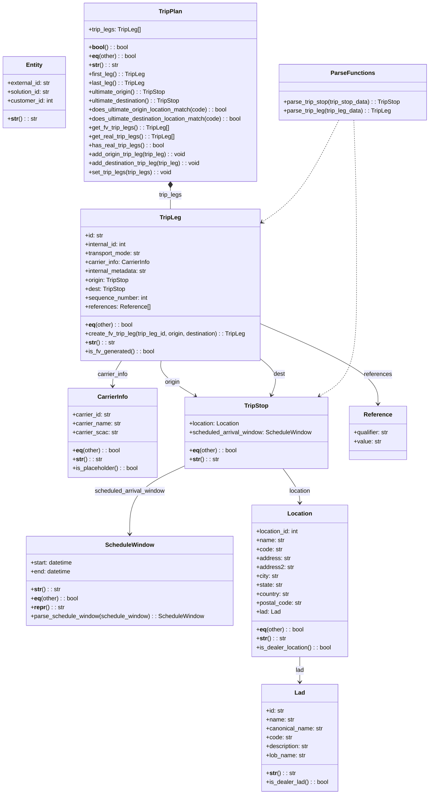

# Diagram: entity_core/entity_service/entity_service/trip_leg/trip_leg/augment_fv_trip_leg/models.py

> Auto-generated by Obscura crawlers

## Mermaid

### SVG

<svg id="container" width="1171" xmlns="http://www.w3.org/2000/svg" class="classDiagram" height="2136" viewBox="0 0 1171 2136" role="graphics-document document" aria-roledescription="class"><g><defs><marker id="container_class-aggregationStart" class="marker aggregation class" refX="18" refY="7" markerWidth="190" markerHeight="240" orient="auto"><path d="M 18,7 L9,13 L1,7 L9,1 Z"></path></marker></defs><defs><marker id="container_class-aggregationEnd" class="marker aggregation class" refX="1" refY="7" markerWidth="20" markerHeight="28" orient="auto"><path d="M 18,7 L9,13 L1,7 L9,1 Z"></path></marker></defs><defs><marker id="container_class-extensionStart" class="marker extension class" refX="18" refY="7" markerWidth="190" markerHeight="240" orient="auto"><path d="M 1,7 L18,13 V 1 Z"></path></marker></defs><defs><marker id="container_class-extensionEnd" class="marker extension class" refX="1" refY="7" markerWidth="20" markerHeight="28" orient="auto"><path d="M 1,1 V 13 L18,7 Z"></path></marker></defs><defs><marker id="container_class-compositionStart" class="marker composition class" refX="18" refY="7" markerWidth="190" markerHeight="240" orient="auto"><path d="M 18,7 L9,13 L1,7 L9,1 Z"></path></marker></defs><defs><marker id="container_class-compositionEnd" class="marker composition class" refX="1" refY="7" markerWidth="20" markerHeight="28" orient="auto"><path d="M 18,7 L9,13 L1,7 L9,1 Z"></path></marker></defs><defs><marker id="container_class-dependencyStart" class="marker dependency class" refX="6" refY="7" markerWidth="190" markerHeight="240" orient="auto"><path d="M 5,7 L9,13 L1,7 L9,1 Z"></path></marker></defs><defs><marker id="container_class-dependencyEnd" class="marker dependency class" refX="13" refY="7" markerWidth="20" markerHeight="28" orient="auto"><path d="M 18,7 L9,13 L14,7 L9,1 Z"></path></marker></defs><defs><marker id="container_class-lollipopStart" class="marker lollipop class" refX="13" refY="7" markerWidth="190" markerHeight="240" orient="auto"><circle stroke="black" fill="transparent" cx="7" cy="7" r="6"></circle></marker></defs><defs><marker id="container_class-lollipopEnd" class="marker lollipop class" refX="1" refY="7" markerWidth="190" markerHeight="240" orient="auto"><circle stroke="black" fill="transparent" cx="7" cy="7" r="6"></circle></marker></defs><g class="root"><g class="clusters"></g><g class="edgePaths"><path d="M332.414,970L328.377,976.167C324.34,982.333,316.266,994.667,312.228,1006C308.191,1017.333,308.191,1027.667,308.191,1032.833L308.191,1038" id="id_TripLeg_CarrierInfo_1" class="edge-thickness-normal edge-pattern-solid relation" style=";;;" data-edge="true" data-et="edge" data-id="id_TripLeg_CarrierInfo_1" data-points="W3sieCI6MzMyLjQxMzg4NDIwNjQzMTUzLCJ5Ijo5NzB9LHsieCI6MzA4LjE5MTQwNjI1LCJ5IjoxMDA3fSx7IngiOjMwOC4xOTE0MDYyNSwieSI6MTA0NH1d" marker-end="url(#container_class-dependencyEnd)"></path><path d="M442.593,970L441.886,976.167C441.18,982.333,439.767,994.667,455.201,1010.487C470.636,1026.307,502.919,1045.614,519.061,1055.267L535.202,1064.92" id="id_TripLeg_TripStop_2" class="edge-thickness-normal edge-pattern-solid relation" style=";;;" data-edge="true" data-et="edge" data-id="id_TripLeg_TripStop_2" data-points="W3sieCI6NDQyLjU5MjU5OTE5NjA1ODEsInkiOjk3MH0seyJ4Ijo0MzguMzUzNTE1NjI1LCJ5IjoxMDA3fSx7IngiOjU0MC4zNTE1NTAwNTk3MTM0LCJ5IjoxMDY4fV0=" marker-end="url(#container_class-dependencyEnd)"></path><path d="M711.273,965.539L719.769,972.449C728.264,979.36,745.254,993.18,750.139,1009.325C755.024,1025.471,747.804,1043.941,744.194,1053.176L740.584,1062.412" id="id_TripLeg_TripStop_3" class="edge-thickness-normal edge-pattern-solid relation" style=";;;" data-edge="true" data-et="edge" data-id="id_TripLeg_TripStop_3" data-points="W3sieCI6NzExLjI3MzQzNzUsInkiOjk2NS41MzkzMjU2MjA0ODg1fSx7IngiOjc2Mi4yNDQxNDA2MjUsInkiOjEwMDd9LHsieCI6NzM4LjM5OTMyMDc2MDM1MDMsInkiOjEwNjh9XQ==" marker-end="url(#container_class-dependencyEnd)"></path><path d="M771.17,1260L778.615,1270.167C786.059,1280.333,800.949,1300.667,808.393,1316C815.838,1331.333,815.838,1341.667,815.838,1346.833L815.838,1352" id="id_TripStop_Location_4" class="edge-thickness-normal edge-pattern-solid relation" style=";;;" data-edge="true" data-et="edge" data-id="id_TripStop_Location_4" data-points="W3sieCI6NzcxLjE3MDAyMTM5NzI5MywieSI6MTI2MH0seyJ4Ijo4MTUuODM3ODkwNjI1LCJ5IjoxMzIxfSx7IngiOjgxNS44Mzc4OTA2MjUsInkiOjEzNTh9XQ==" marker-end="url(#container_class-dependencyEnd)"></path><path d="M506.502,1253.174L481.862,1264.478C457.222,1275.783,407.942,1298.391,383.302,1328.862C358.662,1359.333,358.662,1397.667,358.662,1416.833L358.662,1436" id="id_TripStop_ScheduleWindow_5" class="edge-thickness-normal edge-pattern-solid relation" style=";;;" data-edge="true" data-et="edge" data-id="id_TripStop_ScheduleWindow_5" data-points="W3sieCI6NTA2LjUwMTk1MzEyNSwieSI6MTI1My4xNzM4MzUxMjU0NDh9LHsieCI6MzU4LjY2MjEwOTM3NSwieSI6MTMyMX0seyJ4IjozNTguNjYyMTA5Mzc1LCJ5IjoxNDQyfV0=" marker-end="url(#container_class-dependencyEnd)"></path><path d="M815.838,1766L815.838,1772.167C815.838,1778.333,815.838,1790.667,815.838,1802C815.838,1813.333,815.838,1823.667,815.838,1828.833L815.838,1834" id="id_Location_Lad_6" class="edge-thickness-normal edge-pattern-solid relation" style=";;;" data-edge="true" data-et="edge" data-id="id_Location_Lad_6" data-points="W3sieCI6ODE1LjgzNzg5MDYyNSwieSI6MTc2Nn0seyJ4Ijo4MTUuODM3ODkwNjI1LCJ5IjoxODAzfSx7IngiOjgxNS44Mzc4OTA2MjUsInkiOjE4NDB9XQ==" marker-end="url(#container_class-dependencyEnd)"></path><path d="M465.965,505.25L465.965,508.542C465.965,511.833,465.965,518.417,465.965,527.875C465.965,537.333,465.965,549.667,465.965,555.833L465.965,562" id="id_TripPlan_TripLeg_7" class="edge-thickness-normal edge-pattern-solid relation" style=";;;" data-edge="true" data-et="edge" data-id="id_TripPlan_TripLeg_7" data-points="W3sieCI6NDY1Ljk2NDg0Mzc1LCJ5Ijo0ODh9LHsieCI6NDY1Ljk2NDg0Mzc1LCJ5Ijo1MjV9LHsieCI6NDY1Ljk2NDg0Mzc1LCJ5Ijo1NjJ9XQ==" marker-start="url(#container_class-compositionStart)"></path><path d="M711.273,870.565L764.619,893.304C817.965,916.043,924.656,961.522,978.002,997.428C1031.348,1033.333,1031.348,1059.667,1031.348,1072.833L1031.348,1086" id="id_TripLeg_Reference_8" class="edge-thickness-normal edge-pattern-solid relation" style=";;;" data-edge="true" data-et="edge" data-id="id_TripLeg_Reference_8" data-points="W3sieCI6NzExLjI3MzQzNzUsInkiOjg3MC41NjUyMDc0NzgzNDAyfSx7IngiOjEwMzEuMzQ3NjU2MjUsInkiOjEwMDd9LHsieCI6MTAzMS4zNDc2NTYyNSwieSI6MTA5Mn1d" marker-end="url(#container_class-dependencyEnd)"></path><path d="M966.227,323L967.443,356.667C968.658,390.333,971.089,457.667,972.304,531.5C973.52,605.333,973.52,685.667,973.52,766C973.52,846.333,973.52,926.667,956.731,976.501C939.942,1026.335,906.364,1045.671,889.575,1055.338L872.786,1065.006" id="id_ParseFunctions_TripStop_9" class="edge-thickness-normal edge-pattern-dashed relation" style=";;;" data-edge="true" data-et="edge" data-id="id_ParseFunctions_TripStop_9" data-points="W3sieCI6OTY2LjIyNzExMjQ3NzQzNjgsInkiOjMyM30seyJ4Ijo5NzMuNTE5NTMxMjUsInkiOjUyNX0seyJ4Ijo5NzMuNTE5NTMxMjUsInkiOjc2Nn0seyJ4Ijo5NzMuNTE5NTMxMjUsInkiOjEwMDd9LHsieCI6ODY3LjU4NjgyMDc2MDM1MDMsInkiOjEwNjh9XQ==" marker-end="url(#container_class-dependencyEnd)"></path><path d="M925.572,323L908.537,356.667C891.503,390.333,857.434,457.667,822.547,503.372C787.66,549.077,751.954,573.154,734.101,585.192L716.248,597.231" id="id_ParseFunctions_TripLeg_10" class="edge-thickness-normal edge-pattern-dashed relation" style=";;;" data-edge="true" data-et="edge" data-id="id_ParseFunctions_TripLeg_10" data-points="W3sieCI6OTI1LjU3MTYxNjkzMzY2NDIsInkiOjMyM30seyJ4Ijo4MjMuMzY1MjM0Mzc1LCJ5Ijo1MjV9LHsieCI6NzExLjI3MzQzNzUsInkiOjYwMC41ODUwNDA2MzA4NTc2fV0=" marker-end="url(#container_class-dependencyEnd)"></path></g><g class="edgeLabels"><g class="edgeLabel" transform="translate(308.19140625, 1007)"><g class="label" data-id="id_TripLeg_CarrierInfo_1" transform="translate(-41.71875, -12)"><foreignObject width="83.4375" height="24">

carrier_info

</foreignObject></g></g><g class="edgeLabel" transform="translate(473.37141, 1027.94248)"><g class="label" data-id="id_TripLeg_TripStop_2" transform="translate(-21.125, -12)"><foreignObject width="42.25" height="24">

origin

</foreignObject></g></g><g class="edgeLabel" transform="translate(762.16306, 1006.93405)"><g class="label" data-id="id_TripLeg_TripStop_3" transform="translate(-15.7734375, -12)"><foreignObject width="31.546875" height="24">

dest

</foreignObject></g></g><g class="edgeLabel" transform="translate(815.837890625, 1321)"><g class="label" data-id="id_TripStop_Location_4" transform="translate(-29.578125, -12)"><foreignObject width="59.15625" height="24">

location

</foreignObject></g></g><g class="edgeLabel" transform="translate(358.662109375, 1321)"><g class="label" data-id="id_TripStop_ScheduleWindow_5" transform="translate(-96.578125, -12)"><foreignObject width="193.15625" height="24">

scheduled_arrival_window

</foreignObject></g></g><g class="edgeLabel" transform="translate(815.837890625, 1803)"><g class="label" data-id="id_Location_Lad_6" transform="translate(-11.4453125, -12)"><foreignObject width="22.890625" height="24">

lad

</foreignObject></g></g><g class="edgeLabel" transform="translate(465.96484375, 525)"><g class="label" data-id="id_TripPlan_TripLeg_7" transform="translate(-31.4140625, -12)"><foreignObject width="62.828125" height="24">

trip_legs

</foreignObject></g></g><g class="edgeLabel" transform="translate(1031.34765625, 1007)"><g class="label" data-id="id_TripLeg_Reference_8" transform="translate(-37.828125, -12)"><foreignObject width="75.65625" height="24">

references

</foreignObject></g></g><g class="edgeLabel"><g class="label" data-id="id_ParseFunctions_TripStop_9" transform="translate(0, 0)"><foreignObject width="0" height="0">

</foreignObject></g></g><g class="edgeLabel"><g class="label" data-id="id_ParseFunctions_TripLeg_10" transform="translate(0, 0)"><foreignObject width="0" height="0">

</foreignObject></g></g></g><g class="nodes"><g class="node default" id="classId-Entity-0" transform="translate(92.9453125, 248)"><g class="basic label-container"><path d="M-84.9453125 -96 L84.9453125 -96 L84.9453125 96 L-84.9453125 96" stroke="none" stroke-width="0" fill="#ECECFF" style=""></path><path d="M-84.9453125 -96 C-26.09047018393946 -96, 32.76437213212108 -96, 84.9453125 -96 M-84.9453125 -96 C-33.4243816958787 -96, 18.0965491082426 -96, 84.9453125 -96 M84.9453125 -96 C84.9453125 -32.99937098248926, 84.9453125 30.00125803502148, 84.9453125 96 M84.9453125 -96 C84.9453125 -24.11111163994181, 84.9453125 47.77777672011638, 84.9453125 96 M84.9453125 96 C21.46404630916959 96, -42.01721988166082 96, -84.9453125 96 M84.9453125 96 C39.773270522692954 96, -5.398771454614092 96, -84.9453125 96 M-84.9453125 96 C-84.9453125 47.24697237294427, -84.9453125 -1.506055254111459, -84.9453125 -96 M-84.9453125 96 C-84.9453125 29.340824185822328, -84.9453125 -37.318351628355344, -84.9453125 -96" stroke="#9370DB" stroke-width="1.3" fill="none" stroke-dasharray="0 0" style=""></path></g><g class="annotation-group text" transform="translate(0, -72)"></g><g class="label-group text" transform="translate(-21.28125, -72)"><g class="label" style="font-weight: bolder" transform="translate(0,-12)"><foreignObject width="42.5625" height="24">

Entity

</foreignObject></g></g><g class="members-group text" transform="translate(-72.9453125, -24)"><g class="label" style="" transform="translate(0,-12)"><foreignObject width="117.265625" height="24">

+external_id: str

</foreignObject></g><g class="label" style="" transform="translate(0,12)"><foreignObject width="117.71875" height="24">

+solution_id: str

</foreignObject></g><g class="label" style="" transform="translate(0,36)"><foreignObject width="124.609375" height="24">

+customer_id: int

</foreignObject></g></g><g class="methods-group text" transform="translate(-72.9453125, 72)"><g class="label" style="" transform="translate(0,-12)"><foreignObject width="78.515625" height="24">

+<strong>str</strong>() : : str

</foreignObject></g></g><g class="divider" style=""><path d="M-84.9453125 -48 C-32.84505687148185 -48, 19.255198757036297 -48, 84.9453125 -48 M-84.9453125 -48 C-47.30392060584552 -48, -9.662528711691039 -48, 84.9453125 -48" stroke="#9370DB" stroke-width="1.3" fill="none" stroke-dasharray="0 0" style=""></path></g><g class="divider" style=""><path d="M-84.9453125 48 C-32.757087798649245 48, 19.43113690270151 48, 84.9453125 48 M-84.9453125 48 C-39.07644257724714 48, 6.792427345505715 48, 84.9453125 48" stroke="#9370DB" stroke-width="1.3" fill="none" stroke-dasharray="0 0" style=""></path></g></g><g class="node default" id="classId-ScheduleWindow-1" transform="translate(358.662109375, 1562)"><g class="basic label-container"><path d="M-277.7421875 -120 L277.7421875 -120 L277.7421875 120 L-277.7421875 120" stroke="none" stroke-width="0" fill="#ECECFF" style=""></path><path d="M-277.7421875 -120 C-132.52458665450945 -120, 12.693014190981103 -120, 277.7421875 -120 M-277.7421875 -120 C-137.10994518523165 -120, 3.522297129536696 -120, 277.7421875 -120 M277.7421875 -120 C277.7421875 -30.912542753919396, 277.7421875 58.17491449216121, 277.7421875 120 M277.7421875 -120 C277.7421875 -64.71820088469798, 277.7421875 -9.436401769395971, 277.7421875 120 M277.7421875 120 C92.56101506303813 120, -92.62015737392375 120, -277.7421875 120 M277.7421875 120 C107.52538267385918 120, -62.69142215228163 120, -277.7421875 120 M-277.7421875 120 C-277.7421875 33.376641309247034, -277.7421875 -53.24671738150593, -277.7421875 -120 M-277.7421875 120 C-277.7421875 66.50283886523042, -277.7421875 13.005677730460846, -277.7421875 -120" stroke="#9370DB" stroke-width="1.3" fill="none" stroke-dasharray="0 0" style=""></path></g><g class="annotation-group text" transform="translate(0, -96)"></g><g class="label-group text" transform="translate(-62.6875, -96)"><g class="label" style="font-weight: bolder" transform="translate(0,-12)"><foreignObject width="125.375" height="24">

ScheduleWindow

</foreignObject></g></g><g class="members-group text" transform="translate(-265.7421875, -48)"><g class="label" style="" transform="translate(0,-12)"><foreignObject width="115.171875" height="24">

+start: datetime

</foreignObject></g><g class="label" style="" transform="translate(0,12)"><foreignObject width="108.984375" height="24">

+end: datetime

</foreignObject></g></g><g class="methods-group text" transform="translate(-265.7421875, 24)"><g class="label" style="" transform="translate(0,-12)"><foreignObject width="78.515625" height="24">

+<strong>str</strong>() : : str

</foreignObject></g><g class="label" style="" transform="translate(0,12)"><foreignObject width="129.46875" height="24">

+<strong>eq</strong>(other) : : bool

</foreignObject></g><g class="label" style="" transform="translate(0,36)"><foreignObject width="88.9375" height="24">

+<strong>repr</strong>() : : str

</foreignObject></g><g class="label" style="" transform="translate(0,60)"><foreignObject width="468.796875" height="24">

+parse_schedule_window(schedule_window) : : ScheduleWindow

</foreignObject></g></g><g class="divider" style=""><path d="M-277.7421875 -72 C-134.74622402569773 -72, 8.249739448604544 -72, 277.7421875 -72 M-277.7421875 -72 C-148.01518627099685 -72, -18.2881850419937 -72, 277.7421875 -72" stroke="#9370DB" stroke-width="1.3" fill="none" stroke-dasharray="0 0" style=""></path></g><g class="divider" style=""><path d="M-277.7421875 0 C-132.70865733050792 0, 12.324872838984163 0, 277.7421875 0 M-277.7421875 0 C-121.23951563254994 0, 35.26315623490012 0, 277.7421875 0" stroke="#9370DB" stroke-width="1.3" fill="none" stroke-dasharray="0 0" style=""></path></g></g><g class="node default" id="classId-CarrierInfo-2" transform="translate(308.19140625, 1164)"><g class="basic label-container"><path d="M-120.94140625 -120 L120.94140625 -120 L120.94140625 120 L-120.94140625 120" stroke="none" stroke-width="0" fill="#ECECFF" style=""></path><path d="M-120.94140625 -120 C-50.236260543795865 -120, 20.46888516240827 -120, 120.94140625 -120 M-120.94140625 -120 C-36.2962985073259 -120, 48.3488092353482 -120, 120.94140625 -120 M120.94140625 -120 C120.94140625 -62.29847845870151, 120.94140625 -4.59695691740302, 120.94140625 120 M120.94140625 -120 C120.94140625 -69.24378781435833, 120.94140625 -18.487575628716655, 120.94140625 120 M120.94140625 120 C52.97420489634817 120, -14.992996457303661 120, -120.94140625 120 M120.94140625 120 C47.6565413361115 120, -25.628323577776996 120, -120.94140625 120 M-120.94140625 120 C-120.94140625 61.01652365761113, -120.94140625 2.0330473152222623, -120.94140625 -120 M-120.94140625 120 C-120.94140625 43.044971139448506, -120.94140625 -33.91005772110299, -120.94140625 -120" stroke="#9370DB" stroke-width="1.3" fill="none" stroke-dasharray="0 0" style=""></path></g><g class="annotation-group text" transform="translate(0, -96)"></g><g class="label-group text" transform="translate(-39.6015625, -96)"><g class="label" style="font-weight: bolder" transform="translate(0,-12)"><foreignObject width="79.203125" height="24">

CarrierInfo

</foreignObject></g></g><g class="members-group text" transform="translate(-108.94140625, -48)"><g class="label" style="" transform="translate(0,-12)"><foreignObject width="104.5625" height="24">

+carrier_id: str

</foreignObject></g><g class="label" style="" transform="translate(0,12)"><foreignObject width="131" height="24">

+carrier_name: str

</foreignObject></g><g class="label" style="" transform="translate(0,36)"><foreignObject width="121.859375" height="24">

+carrier_scac: str

</foreignObject></g></g><g class="methods-group text" transform="translate(-108.94140625, 48)"><g class="label" style="" transform="translate(0,-12)"><foreignObject width="129.46875" height="24">

+<strong>eq</strong>(other) : : bool

</foreignObject></g><g class="label" style="" transform="translate(0,12)"><foreignObject width="78.515625" height="24">

+<strong>str</strong>() : : str

</foreignObject></g><g class="label" style="" transform="translate(0,36)"><foreignObject width="178.28125" height="24">

+is_placeholder() : : bool

</foreignObject></g></g><g class="divider" style=""><path d="M-120.94140625 -72 C-67.50830666397337 -72, -14.075207077946743 -72, 120.94140625 -72 M-120.94140625 -72 C-35.84365285795302 -72, 49.254100534093965 -72, 120.94140625 -72" stroke="#9370DB" stroke-width="1.3" fill="none" stroke-dasharray="0 0" style=""></path></g><g class="divider" style=""><path d="M-120.94140625 24 C-49.75951872296277 24, 21.422368804074466 24, 120.94140625 24 M-120.94140625 24 C-34.65098715113915 24, 51.639431947721704 24, 120.94140625 24" stroke="#9370DB" stroke-width="1.3" fill="none" stroke-dasharray="0 0" style=""></path></g></g><g class="node default" id="classId-Lad-3" transform="translate(815.837890625, 1984)"><g class="basic label-container"><path d="M-102.22265625 -144 L102.22265625 -144 L102.22265625 144 L-102.22265625 144" stroke="none" stroke-width="0" fill="#ECECFF" style=""></path><path d="M-102.22265625 -144 C-28.96657624425366 -144, 44.28950376149268 -144, 102.22265625 -144 M-102.22265625 -144 C-53.037894093210895 -144, -3.8531319364217893 -144, 102.22265625 -144 M102.22265625 -144 C102.22265625 -65.65338957738021, 102.22265625 12.69322084523958, 102.22265625 144 M102.22265625 -144 C102.22265625 -63.95179545084494, 102.22265625 16.09640909831012, 102.22265625 144 M102.22265625 144 C54.89595623040137 144, 7.569256210802735 144, -102.22265625 144 M102.22265625 144 C44.790537703730244 144, -12.641580842539511 144, -102.22265625 144 M-102.22265625 144 C-102.22265625 39.10852338929365, -102.22265625 -65.7829532214127, -102.22265625 -144 M-102.22265625 144 C-102.22265625 82.69359323101928, -102.22265625 21.387186462038557, -102.22265625 -144" stroke="#9370DB" stroke-width="1.3" fill="none" stroke-dasharray="0 0" style=""></path></g><g class="annotation-group text" transform="translate(0, -120)"></g><g class="label-group text" transform="translate(-13.2109375, -120)"><g class="label" style="font-weight: bolder" transform="translate(0,-12)"><foreignObject width="26.421875" height="24">

Lad

</foreignObject></g></g><g class="members-group text" transform="translate(-90.22265625, -72)"><g class="label" style="" transform="translate(0,-12)"><foreignObject width="49.578125" height="24">

+id: str

</foreignObject></g><g class="label" style="" transform="translate(0,12)"><foreignObject width="76.015625" height="24">

+name: str

</foreignObject></g><g class="label" style="" transform="translate(0,36)"><foreignObject width="153.84375" height="24">

+canonical_name: str

</foreignObject></g><g class="label" style="" transform="translate(0,60)"><foreignObject width="70.453125" height="24">

+code: str

</foreignObject></g><g class="label" style="" transform="translate(0,84)"><foreignObject width="118.109375" height="24">

+description: str

</foreignObject></g><g class="label" style="" transform="translate(0,108)"><foreignObject width="107.46875" height="24">

+lob_name: str

</foreignObject></g></g><g class="methods-group text" transform="translate(-90.22265625, 96)"><g class="label" style="" transform="translate(0,-12)"><foreignObject width="78.515625" height="24">

+<strong>str</strong>() : : str

</foreignObject></g><g class="label" style="" transform="translate(0,12)"><foreignObject width="167.234375" height="24">

+is_dealer_lad() : : bool

</foreignObject></g></g><g class="divider" style=""><path d="M-102.22265625 -96 C-43.27234056622009 -96, 15.677975117559825 -96, 102.22265625 -96 M-102.22265625 -96 C-44.76932032479653 -96, 12.684015600406937 -96, 102.22265625 -96" stroke="#9370DB" stroke-width="1.3" fill="none" stroke-dasharray="0 0" style=""></path></g><g class="divider" style=""><path d="M-102.22265625 72 C-49.08565992667966 72, 4.051336396640679 72, 102.22265625 72 M-102.22265625 72 C-42.54379836135029 72, 17.13505952729942 72, 102.22265625 72" stroke="#9370DB" stroke-width="1.3" fill="none" stroke-dasharray="0 0" style=""></path></g></g><g class="node default" id="classId-Location-4" transform="translate(815.837890625, 1562)"><g class="basic label-container"><path d="M-129.43359375 -204 L129.43359375 -204 L129.43359375 204 L-129.43359375 204" stroke="none" stroke-width="0" fill="#ECECFF" style=""></path><path d="M-129.43359375 -204 C-61.31964714400405 -204, 6.794299461991898 -204, 129.43359375 -204 M-129.43359375 -204 C-62.16489529772353 -204, 5.103803154552935 -204, 129.43359375 -204 M129.43359375 -204 C129.43359375 -99.18987896182509, 129.43359375 5.620242076349825, 129.43359375 204 M129.43359375 -204 C129.43359375 -67.59951572247036, 129.43359375 68.80096855505928, 129.43359375 204 M129.43359375 204 C58.43595435630044 204, -12.561685037399116 204, -129.43359375 204 M129.43359375 204 C56.31786893137935 204, -16.797855887241298 204, -129.43359375 204 M-129.43359375 204 C-129.43359375 80.33772111823907, -129.43359375 -43.32455776352185, -129.43359375 -204 M-129.43359375 204 C-129.43359375 97.38925595918786, -129.43359375 -9.221488081624273, -129.43359375 -204" stroke="#9370DB" stroke-width="1.3" fill="none" stroke-dasharray="0 0" style=""></path></g><g class="annotation-group text" transform="translate(0, -180)"></g><g class="label-group text" transform="translate(-31.3515625, -180)"><g class="label" style="font-weight: bolder" transform="translate(0,-12)"><foreignObject width="62.703125" height="24">

Location

</foreignObject></g></g><g class="members-group text" transform="translate(-117.43359375, -132)"><g class="label" style="" transform="translate(0,-12)"><foreignObject width="117.28125" height="24">

+location_id: int

</foreignObject></g><g class="label" style="" transform="translate(0,12)"><foreignObject width="76.015625" height="24">

+name: str

</foreignObject></g><g class="label" style="" transform="translate(0,36)"><foreignObject width="70.453125" height="24">

+code: str

</foreignObject></g><g class="label" style="" transform="translate(0,60)"><foreignObject width="92.296875" height="24">

+address: str

</foreignObject></g><g class="label" style="" transform="translate(0,84)"><foreignObject width="100.0625" height="24">

+address2: str

</foreignObject></g><g class="label" style="" transform="translate(0,108)"><foreignObject width="61.28125" height="24">

+city: str

</foreignObject></g><g class="label" style="" transform="translate(0,132)"><foreignObject width="71.59375" height="24">

+state: str

</foreignObject></g><g class="label" style="" transform="translate(0,156)"><foreignObject width="90.75" height="24">

+country: str

</foreignObject></g><g class="label" style="" transform="translate(0,180)"><foreignObject width="123.671875" height="24">

+postal_code: str

</foreignObject></g><g class="label" style="" transform="translate(0,204)"><foreignObject width="65.03125" height="24">

+lad: Lad

</foreignObject></g></g><g class="methods-group text" transform="translate(-117.43359375, 132)"><g class="label" style="" transform="translate(0,-12)"><foreignObject width="129.46875" height="24">

+<strong>eq</strong>(other) : : bool

</foreignObject></g><g class="label" style="" transform="translate(0,12)"><foreignObject width="78.515625" height="24">

+<strong>str</strong>() : : str

</foreignObject></g><g class="label" style="" transform="translate(0,36)"><foreignObject width="203.515625" height="24">

+is_dealer_location() : : bool

</foreignObject></g></g><g class="divider" style=""><path d="M-129.43359375 -156 C-62.24140433366142 -156, 4.950785082677157 -156, 129.43359375 -156 M-129.43359375 -156 C-42.05826333363737 -156, 45.31706708272526 -156, 129.43359375 -156" stroke="#9370DB" stroke-width="1.3" fill="none" stroke-dasharray="0 0" style=""></path></g><g class="divider" style=""><path d="M-129.43359375 108 C-27.972805686121987 108, 73.48798237775603 108, 129.43359375 108 M-129.43359375 108 C-40.43304673312565 108, 48.5675002837487 108, 129.43359375 108" stroke="#9370DB" stroke-width="1.3" fill="none" stroke-dasharray="0 0" style=""></path></g></g><g class="node default" id="classId-TripStop-5" transform="translate(700.873046875, 1164)"><g class="basic label-container"><path d="M-194.37109375 -96 L194.37109375 -96 L194.37109375 96 L-194.37109375 96" stroke="none" stroke-width="0" fill="#ECECFF" style=""></path><path d="M-194.37109375 -96 C-62.241208257622304 -96, 69.88867723475539 -96, 194.37109375 -96 M-194.37109375 -96 C-98.33734460905055 -96, -2.3035954681010935 -96, 194.37109375 -96 M194.37109375 -96 C194.37109375 -36.34078514847474, 194.37109375 23.318429703050526, 194.37109375 96 M194.37109375 -96 C194.37109375 -44.65509024623868, 194.37109375 6.6898195075226425, 194.37109375 96 M194.37109375 96 C58.53348260815443 96, -77.30412853369114 96, -194.37109375 96 M194.37109375 96 C93.46077022004019 96, -7.449553309919622 96, -194.37109375 96 M-194.37109375 96 C-194.37109375 56.02235322089645, -194.37109375 16.044706441792897, -194.37109375 -96 M-194.37109375 96 C-194.37109375 35.050620097384076, -194.37109375 -25.898759805231848, -194.37109375 -96" stroke="#9370DB" stroke-width="1.3" fill="none" stroke-dasharray="0 0" style=""></path></g><g class="annotation-group text" transform="translate(0, -72)"></g><g class="label-group text" transform="translate(-31.2890625, -72)"><g class="label" style="font-weight: bolder" transform="translate(0,-12)"><foreignObject width="62.578125" height="24">

TripStop

</foreignObject></g></g><g class="members-group text" transform="translate(-182.37109375, -24)"><g class="label" style="" transform="translate(0,-12)"><foreignObject width="137.34375" height="24">

+location: Location

</foreignObject></g><g class="label" style="" transform="translate(0,12)"><foreignObject width="333.453125" height="24">

+scheduled_arrival_window: ScheduleWindow

</foreignObject></g></g><g class="methods-group text" transform="translate(-182.37109375, 48)"><g class="label" style="" transform="translate(0,-12)"><foreignObject width="129.46875" height="24">

+<strong>eq</strong>(other) : : bool

</foreignObject></g><g class="label" style="" transform="translate(0,12)"><foreignObject width="78.515625" height="24">

+<strong>str</strong>() : : str

</foreignObject></g></g><g class="divider" style=""><path d="M-194.37109375 -48 C-99.19081317095325 -48, -4.010532591906497 -48, 194.37109375 -48 M-194.37109375 -48 C-43.201077315292935 -48, 107.96893911941413 -48, 194.37109375 -48" stroke="#9370DB" stroke-width="1.3" fill="none" stroke-dasharray="0 0" style=""></path></g><g class="divider" style=""><path d="M-194.37109375 24 C-86.44793189859539 24, 21.47522995280923 24, 194.37109375 24 M-194.37109375 24 C-58.32596307101423 24, 77.71916760797154 24, 194.37109375 24" stroke="#9370DB" stroke-width="1.3" fill="none" stroke-dasharray="0 0" style=""></path></g></g><g class="node default" id="classId-Reference-6" transform="translate(1031.34765625, 1164)"><g class="basic label-container"><path d="M-78.44140625 -72 L78.44140625 -72 L78.44140625 72 L-78.44140625 72" stroke="none" stroke-width="0" fill="#ECECFF" style=""></path><path d="M-78.44140625 -72 C-41.61799920748902 -72, -4.794592164978042 -72, 78.44140625 -72 M-78.44140625 -72 C-36.30125774717022 -72, 5.838890755659563 -72, 78.44140625 -72 M78.44140625 -72 C78.44140625 -18.351859893307157, 78.44140625 35.296280213385685, 78.44140625 72 M78.44140625 -72 C78.44140625 -39.27381786040817, 78.44140625 -6.547635720816345, 78.44140625 72 M78.44140625 72 C35.36746787893114 72, -7.706470492137726 72, -78.44140625 72 M78.44140625 72 C34.770757164593014 72, -8.899891920813971 72, -78.44140625 72 M-78.44140625 72 C-78.44140625 22.55700491634724, -78.44140625 -26.885990167305522, -78.44140625 -72 M-78.44140625 72 C-78.44140625 35.07941990142799, -78.44140625 -1.8411601971440206, -78.44140625 -72" stroke="#9370DB" stroke-width="1.3" fill="none" stroke-dasharray="0 0" style=""></path></g><g class="annotation-group text" transform="translate(0, -48)"></g><g class="label-group text" transform="translate(-36.5078125, -48)"><g class="label" style="font-weight: bolder" transform="translate(0,-12)"><foreignObject width="73.015625" height="24">

Reference

</foreignObject></g></g><g class="members-group text" transform="translate(-66.44140625, 0)"><g class="label" style="" transform="translate(0,-12)"><foreignObject width="96.375" height="24">

+qualifier: str

</foreignObject></g><g class="label" style="" transform="translate(0,12)"><foreignObject width="74.21875" height="24">

+value: str

</foreignObject></g></g><g class="methods-group text" transform="translate(-66.44140625, 72)"></g><g class="divider" style=""><path d="M-78.44140625 -24 C-43.6442246479777 -24, -8.847043045955402 -24, 78.44140625 -24 M-78.44140625 -24 C-37.475738149997454 -24, 3.4899299500050915 -24, 78.44140625 -24" stroke="#9370DB" stroke-width="1.3" fill="none" stroke-dasharray="0 0" style=""></path></g><g class="divider" style=""><path d="M-78.44140625 48 C-45.14801112143377 48, -11.854615992867537 48, 78.44140625 48 M-78.44140625 48 C-36.9202904841007 48, 4.600825281798606 48, 78.44140625 48" stroke="#9370DB" stroke-width="1.3" fill="none" stroke-dasharray="0 0" style=""></path></g></g><g class="node default" id="classId-TripLeg-7" transform="translate(465.96484375, 766)"><g class="basic label-container"><path d="M-245.30859375 -204 L245.30859375 -204 L245.30859375 204 L-245.30859375 204" stroke="none" stroke-width="0" fill="#ECECFF" style=""></path><path d="M-245.30859375 -204 C-142.64518180535964 -204, -39.98176986071928 -204, 245.30859375 -204 M-245.30859375 -204 C-110.65831381257254 -204, 23.991966124854912 -204, 245.30859375 -204 M245.30859375 -204 C245.30859375 -84.89746662370582, 245.30859375 34.20506675258835, 245.30859375 204 M245.30859375 -204 C245.30859375 -42.053957586885105, 245.30859375 119.89208482622979, 245.30859375 204 M245.30859375 204 C61.434018521187 204, -122.440556707626 204, -245.30859375 204 M245.30859375 204 C123.02439665907347 204, 0.7401995681469486 204, -245.30859375 204 M-245.30859375 204 C-245.30859375 74.06955860495435, -245.30859375 -55.860882790091296, -245.30859375 -204 M-245.30859375 204 C-245.30859375 105.54071479490979, -245.30859375 7.081429589819578, -245.30859375 -204" stroke="#9370DB" stroke-width="1.3" fill="none" stroke-dasharray="0 0" style=""></path></g><g class="annotation-group text" transform="translate(0, -180)"></g><g class="label-group text" transform="translate(-27.0546875, -180)"><g class="label" style="font-weight: bolder" transform="translate(0,-12)"><foreignObject width="54.109375" height="24">

TripLeg

</foreignObject></g></g><g class="members-group text" transform="translate(-233.30859375, -132)"><g class="label" style="" transform="translate(0,-12)"><foreignObject width="49.578125" height="24">

+id: str

</foreignObject></g><g class="label" style="" transform="translate(0,12)"><foreignObject width="115.0625" height="24">

+internal_id: int

</foreignObject></g><g class="label" style="" transform="translate(0,36)"><foreignObject width="152.828125" height="24">

+transport_mode: str

</foreignObject></g><g class="label" style="" transform="translate(0,60)"><foreignObject width="177.40625" height="24">

+carrier_info: CarrierInfo

</foreignObject></g><g class="label" style="" transform="translate(0,84)"><foreignObject width="170.1875" height="24">

+internal_metadata: str

</foreignObject></g><g class="label" style="" transform="translate(0,108)"><foreignObject width="119.40625" height="24">

+origin: TripStop

</foreignObject></g><g class="label" style="" transform="translate(0,132)"><foreignObject width="108.765625" height="24">

+dest: TripStop

</foreignObject></g><g class="label" style="" transform="translate(0,156)"><foreignObject width="169.90625" height="24">

+sequence_number: int

</foreignObject></g><g class="label" style="" transform="translate(0,180)"><foreignObject width="173.9375" height="24">

+references: Reference[]

</foreignObject></g></g><g class="methods-group text" transform="translate(-233.30859375, 108)"><g class="label" style="" transform="translate(0,-12)"><foreignObject width="129.46875" height="24">

+<strong>eq</strong>(other) : : bool

</foreignObject></g><g class="label" style="" transform="translate(0,12)"><foreignObject width="439.5625" height="24">

+create_fv_trip_leg(trip_leg_id, origin, destination) : : TripLeg

</foreignObject></g><g class="label" style="" transform="translate(0,36)"><foreignObject width="78.515625" height="24">

+<strong>str</strong>() : : str

</foreignObject></g><g class="label" style="" transform="translate(0,60)"><foreignObject width="185.546875" height="24">

+is_fv_generated() : : bool

</foreignObject></g></g><g class="divider" style=""><path d="M-245.30859375 -156 C-54.489112967352185 -156, 136.33036781529563 -156, 245.30859375 -156 M-245.30859375 -156 C-144.6980957348791 -156, -44.08759771975821 -156, 245.30859375 -156" stroke="#9370DB" stroke-width="1.3" fill="none" stroke-dasharray="0 0" style=""></path></g><g class="divider" style=""><path d="M-245.30859375 84 C-74.9583869747855 84, 95.391819800429 84, 245.30859375 84 M-245.30859375 84 C-65.23063625673277 84, 114.84732123653447 84, 245.30859375 84" stroke="#9370DB" stroke-width="1.3" fill="none" stroke-dasharray="0 0" style=""></path></g></g><g class="node default" id="classId-TripPlan-8" transform="translate(465.96484375, 248)"><g class="basic label-container"><path d="M-238.07421875 -240 L238.07421875 -240 L238.07421875 240 L-238.07421875 240" stroke="none" stroke-width="0" fill="#ECECFF" style=""></path><path d="M-238.07421875 -240 C-116.83958368786756 -240, 4.395051374264881 -240, 238.07421875 -240 M-238.07421875 -240 C-137.13964401472407 -240, -36.20506927944811 -240, 238.07421875 -240 M238.07421875 -240 C238.07421875 -137.79323683366158, 238.07421875 -35.58647366732313, 238.07421875 240 M238.07421875 -240 C238.07421875 -75.9498674688358, 238.07421875 88.10026506232839, 238.07421875 240 M238.07421875 240 C70.83757582068816 240, -96.39906710862368 240, -238.07421875 240 M238.07421875 240 C69.18345057571096 240, -99.70731759857807 240, -238.07421875 240 M-238.07421875 240 C-238.07421875 124.82222395147876, -238.07421875 9.644447902957523, -238.07421875 -240 M-238.07421875 240 C-238.07421875 127.12167942968381, -238.07421875 14.243358859367618, -238.07421875 -240" stroke="#9370DB" stroke-width="1.3" fill="none" stroke-dasharray="0 0" style=""></path></g><g class="annotation-group text" transform="translate(0, -216)"></g><g class="label-group text" transform="translate(-30.3828125, -216)"><g class="label" style="font-weight: bolder" transform="translate(0,-12)"><foreignObject width="60.765625" height="24">

TripPlan

</foreignObject></g></g><g class="members-group text" transform="translate(-226.07421875, -168)"><g class="label" style="" transform="translate(0,-12)"><foreignObject width="141.703125" height="24">

+trip_legs: TripLeg[]

</foreignObject></g></g><g class="methods-group text" transform="translate(-226.07421875, -120)"><g class="label" style="" transform="translate(0,-12)"><foreignObject width="104.640625" height="24">

+<strong>bool</strong>() : : bool

</foreignObject></g><g class="label" style="" transform="translate(0,12)"><foreignObject width="129.46875" height="24">

+<strong>eq</strong>(other) : : bool

</foreignObject></g><g class="label" style="" transform="translate(0,36)"><foreignObject width="78.515625" height="24">

+<strong>str</strong>() : : str

</foreignObject></g><g class="label" style="" transform="translate(0,60)"><foreignObject width="149.296875" height="24">

+first_leg() : : TripLeg

</foreignObject></g><g class="label" style="" transform="translate(0,84)"><foreignObject width="147.5625" height="24">

+last_leg() : : TripLeg

</foreignObject></g><g class="label" style="" transform="translate(0,108)"><foreignObject width="210.734375" height="24">

+ultimate_origin() : : TripStop

</foreignObject></g><g class="label" style="" transform="translate(0,132)"><foreignObject width="251.625" height="24">

+ultimate_destination() : : TripStop

</foreignObject></g><g class="label" style="" transform="translate(0,156)"><foreignObject width="380.875" height="24">

+does_ultimate_origin_location_match(code) : : bool

</foreignObject></g><g class="label" style="" transform="translate(0,180)"><foreignObject width="421.765625" height="24">

+does_ultimate_destination_location_match(code) : : bool

</foreignObject></g><g class="label" style="" transform="translate(0,204)"><foreignObject width="215.78125" height="24">

+get_fv_trip_legs() : : TripLeg[]

</foreignObject></g><g class="label" style="" transform="translate(0,228)"><foreignObject width="230.84375" height="24">

+get_real_trip_legs() : : TripLeg[]

</foreignObject></g><g class="label" style="" transform="translate(0,252)"><foreignObject width="203.34375" height="24">

+has_real_trip_legs() : : bool

</foreignObject></g><g class="label" style="" transform="translate(0,276)"><foreignObject width="266.75" height="24">

+add_origin_trip_leg(trip_leg) : : void

</foreignObject></g><g class="label" style="" transform="translate(0,300)"><foreignObject width="307.640625" height="24">

+add_destination_trip_leg(trip_leg) : : void

</foreignObject></g><g class="label" style="" transform="translate(0,324)"><foreignObject width="225.59375" height="24">

+set_trip_legs(trip_legs) : : void

</foreignObject></g></g><g class="divider" style=""><path d="M-238.07421875 -192 C-118.23804858843732 -192, 1.5981215731253542 -192, 238.07421875 -192 M-238.07421875 -192 C-115.78892769020312 -192, 6.496363369593752 -192, 238.07421875 -192" stroke="#9370DB" stroke-width="1.3" fill="none" stroke-dasharray="0 0" style=""></path></g><g class="divider" style=""><path d="M-238.07421875 -144 C-136.3062308930925 -144, -34.53824303618504 -144, 238.07421875 -144 M-238.07421875 -144 C-90.45301382593942 -144, 57.168191098121156 -144, 238.07421875 -144" stroke="#9370DB" stroke-width="1.3" fill="none" stroke-dasharray="0 0" style=""></path></g></g><g class="node default" id="classId-ParseFunctions-9" transform="translate(963.51953125, 248)"><g class="basic label-container"><path d="M-199.48046875 -75 L199.48046875 -75 L199.48046875 75 L-199.48046875 75" stroke="none" stroke-width="0" fill="#ECECFF" style=""></path><path d="M-199.48046875 -75 C-114.31472394254918 -75, -29.148979135098358 -75, 199.48046875 -75 M-199.48046875 -75 C-43.84764557993893 -75, 111.78517759012215 -75, 199.48046875 -75 M199.48046875 -75 C199.48046875 -27.260410903550977, 199.48046875 20.479178192898047, 199.48046875 75 M199.48046875 -75 C199.48046875 -39.01994220853905, 199.48046875 -3.039884417078099, 199.48046875 75 M199.48046875 75 C46.31414441629542 75, -106.85217991740916 75, -199.48046875 75 M199.48046875 75 C104.39465752384973 75, 9.30884629769946 75, -199.48046875 75 M-199.48046875 75 C-199.48046875 40.07351790596028, -199.48046875 5.14703581192056, -199.48046875 -75 M-199.48046875 75 C-199.48046875 33.92209152828979, -199.48046875 -7.155816943420419, -199.48046875 -75" stroke="#9370DB" stroke-width="1.3" fill="none" stroke-dasharray="0 0" style=""></path></g><g class="annotation-group text" transform="translate(0, -51)"></g><g class="label-group text" transform="translate(-55.2890625, -51)"><g class="label" style="font-weight: bolder" transform="translate(0,-12)"><foreignObject width="110.578125" height="24">

ParseFunctions

</foreignObject></g></g><g class="members-group text" transform="translate(-187.48046875, -3)"></g><g class="methods-group text" transform="translate(-187.48046875, 27)"><g class="label" style="" transform="translate(0,-12)"><foreignObject width="319.671875" height="24">

+parse_trip_stop(trip_stop_data) : : TripStop

</foreignObject></g><g class="label" style="" transform="translate(0,12)"><foreignObject width="290.828125" height="24">

+parse_trip_leg(trip_leg_data) : : TripLeg

</foreignObject></g></g><g class="divider" style=""><path d="M-199.48046875 -27 C-71.88963656691865 -27, 55.70119561616269 -27, 199.48046875 -27 M-199.48046875 -27 C-70.1654199603708 -27, 59.149628829258404 -27, 199.48046875 -27" stroke="#9370DB" stroke-width="1.3" fill="none" stroke-dasharray="0 0" style=""></path></g><g class="divider" style=""><path d="M-199.48046875 -3 C-103.30821848806126 -3, -7.135968226122515 -3, 199.48046875 -3 M-199.48046875 -3 C-52.98774532793368 -3, 93.50497809413264 -3, 199.48046875 -3" stroke="#9370DB" stroke-width="1.3" fill="none" stroke-dasharray="0 0" style=""></path></g></g></g></g></g></svg>
