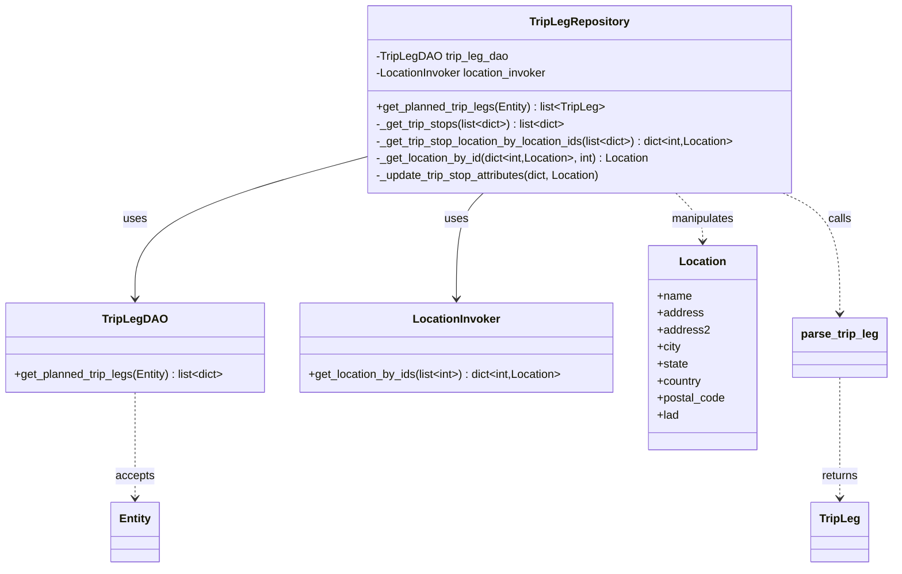

# Diagram: entity_core/entity_service/entity_service/trip_leg/trip_leg/augment_fv_trip_leg/repository.py


> Auto-generated by Obscura crawlers

## Diagram 1



### SVG

<svg id="container" width="1258.921875" xmlns="http://www.w3.org/2000/svg" class="classDiagram" height="800" viewBox="0 0 1258.921875 800" role="graphics-document document" aria-roledescription="class"><style>#container{font-family:"trebuchet ms",verdana,arial,sans-serif;font-size:16px;fill:#333;}@keyframes edge-animation-frame{from{stroke-dashoffset:0;}}@keyframes dash{to{stroke-dashoffset:0;}}#container .edge-animation-slow{stroke-dasharray:9,5!important;stroke-dashoffset:900;animation:dash 50s linear infinite;stroke-linecap:round;}#container .edge-animation-fast{stroke-dasharray:9,5!important;stroke-dashoffset:900;animation:dash 20s linear infinite;stroke-linecap:round;}#container .error-icon{fill:#552222;}#container .error-text{fill:#552222;stroke:#552222;}#container .edge-thickness-normal{stroke-width:1px;}#container .edge-thickness-thick{stroke-width:3.5px;}#container .edge-pattern-solid{stroke-dasharray:0;}#container .edge-thickness-invisible{stroke-width:0;fill:none;}#container .edge-pattern-dashed{stroke-dasharray:3;}#container .edge-pattern-dotted{stroke-dasharray:2;}#container .marker{fill:#333333;stroke:#333333;}#container .marker.cross{stroke:#333333;}#container svg{font-family:"trebuchet ms",verdana,arial,sans-serif;font-size:16px;}#container p{margin:0;}#container g.classGroup text{fill:#9370DB;stroke:none;font-family:"trebuchet ms",verdana,arial,sans-serif;font-size:10px;}#container g.classGroup text .title{font-weight:bolder;}#container .nodeLabel,#container .edgeLabel{color:#131300;}#container .edgeLabel .label rect{fill:#ECECFF;}#container .label text{fill:#131300;}#container .labelBkg{background:#ECECFF;}#container .edgeLabel .label span{background:#ECECFF;}#container .classTitle{font-weight:bolder;}#container .node rect,#container .node circle,#container .node ellipse,#container .node polygon,#container .node path{fill:#ECECFF;stroke:#9370DB;stroke-width:1px;}#container .divider{stroke:#9370DB;stroke-width:1;}#container g.clickable{cursor:pointer;}#container g.classGroup rect{fill:#ECECFF;stroke:#9370DB;}#container g.classGroup line{stroke:#9370DB;stroke-width:1;}#container .classLabel .box{stroke:none;stroke-width:0;fill:#ECECFF;opacity:0.5;}#container .classLabel .label{fill:#9370DB;font-size:10px;}#container .relation{stroke:#333333;stroke-width:1;fill:none;}#container .dashed-line{stroke-dasharray:3;}#container .dotted-line{stroke-dasharray:1 2;}#container #compositionStart,#container .composition{fill:#333333!important;stroke:#333333!important;stroke-width:1;}#container #compositionEnd,#container .composition{fill:#333333!important;stroke:#333333!important;stroke-width:1;}#container #dependencyStart,#container .dependency{fill:#333333!important;stroke:#333333!important;stroke-width:1;}#container #dependencyStart,#container .dependency{fill:#333333!important;stroke:#333333!important;stroke-width:1;}#container #extensionStart,#container .extension{fill:transparent!important;stroke:#333333!important;stroke-width:1;}#container #extensionEnd,#container .extension{fill:transparent!important;stroke:#333333!important;stroke-width:1;}#container #aggregationStart,#container .aggregation{fill:transparent!important;stroke:#333333!important;stroke-width:1;}#container #aggregationEnd,#container .aggregation{fill:transparent!important;stroke:#333333!important;stroke-width:1;}#container #lollipopStart,#container .lollipop{fill:#ECECFF!important;stroke:#333333!important;stroke-width:1;}#container #lollipopEnd,#container .lollipop{fill:#ECECFF!important;stroke:#333333!important;stroke-width:1;}#container .edgeTerminals{font-size:11px;line-height:initial;}#container .classTitleText{text-anchor:middle;font-size:18px;fill:#333;}#container .label-icon{display:inline-block;height:1em;overflow:visible;vertical-align:-0.125em;}#container .node .label-icon path{fill:currentColor;stroke:revert;stroke-width:revert;}#container :root{--mermaid-font-family:"trebuchet ms",verdana,arial,sans-serif;}</style><g><defs><marker id="container_class-aggregationStart" class="marker aggregation class" refX="18" refY="7" markerWidth="190" markerHeight="240" orient="auto"><path d="M 18,7 L9,13 L1,7 L9,1 Z"></path></marker></defs><defs><marker id="container_class-aggregationEnd" class="marker aggregation class" refX="1" refY="7" markerWidth="20" markerHeight="28" orient="auto"><path d="M 18,7 L9,13 L1,7 L9,1 Z"></path></marker></defs><defs><marker id="container_class-extensionStart" class="marker extension class" refX="18" refY="7" markerWidth="190" markerHeight="240" orient="auto"><path d="M 1,7 L18,13 V 1 Z"></path></marker></defs><defs><marker id="container_class-extensionEnd" class="marker extension class" refX="1" refY="7" markerWidth="20" markerHeight="28" orient="auto"><path d="M 1,1 V 13 L18,7 Z"></path></marker></defs><defs><marker id="container_class-compositionStart" class="marker composition class" refX="18" refY="7" markerWidth="190" markerHeight="240" orient="auto"><path d="M 18,7 L9,13 L1,7 L9,1 Z"></path></marker></defs><defs><marker id="container_class-compositionEnd" class="marker composition class" refX="1" refY="7" markerWidth="20" markerHeight="28" orient="auto"><path d="M 18,7 L9,13 L1,7 L9,1 Z"></path></marker></defs><defs><marker id="container_class-dependencyStart" class="marker dependency class" refX="6" refY="7" markerWidth="190" markerHeight="240" orient="auto"><path d="M 5,7 L9,13 L1,7 L9,1 Z"></path></marker></defs><defs><marker id="container_class-dependencyEnd" class="marker dependency class" refX="13" refY="7" markerWidth="20" markerHeight="28" orient="auto"><path d="M 18,7 L9,13 L14,7 L9,1 Z"></path></marker></defs><defs><marker id="container_class-lollipopStart" class="marker lollipop class" refX="13" refY="7" markerWidth="190" markerHeight="240" orient="auto"><circle stroke="black" fill="transparent" cx="7" cy="7" r="6"></circle></marker></defs><defs><marker id="container_class-lollipopEnd" class="marker lollipop class" refX="1" refY="7" markerWidth="190" markerHeight="240" orient="auto"><circle stroke="black" fill="transparent" cx="7" cy="7" r="6"></circle></marker></defs><g class="root"><g class="clusters"></g><g class="edgePaths"><path d="M517.385,221.509L463.001,236.091C408.617,250.673,299.85,279.836,245.466,313.085C191.082,346.333,191.082,383.667,191.082,402.333L191.082,421" id="id_TripLegRepository_TripLegDAO_1" class="edge-thickness-normal edge-pattern-solid relation" style=";;;" data-edge="true" data-et="edge" data-id="id_TripLegRepository_TripLegDAO_1" data-points="W3sieCI6NTE3LjM4NDc2NTYyNSwieSI6MjIxLjUwOTQ5NjA1Mzc2OTE0fSx7IngiOjE5MS4wODIwMzEyNSwieSI6MzA5fSx7IngiOjE5MS4wODIwMzEyNSwieSI6NDI3fV0=" marker-end="url(#container_class-dependencyEnd)"></path><path d="M685.221,272L678.86,278.167C672.499,284.333,659.777,296.667,653.416,321.5C647.055,346.333,647.055,383.667,647.055,402.333L647.055,421" id="id_TripLegRepository_LocationInvoker_2" class="edge-thickness-normal edge-pattern-solid relation" style=";;;" data-edge="true" data-et="edge" data-id="id_TripLegRepository_LocationInvoker_2" data-points="W3sieCI6Njg1LjIyMDc3MjQ2NjcxNiwieSI6MjcyfSx7IngiOjY0Ny4wNTQ2ODc1LCJ5IjozMDl9LHsieCI6NjQ3LjA1NDY4NzUsInkiOjQyN31d" marker-end="url(#container_class-dependencyEnd)"></path><path d="M957.541,272L963.902,278.167C970.263,284.333,982.985,296.667,989.346,308C995.707,319.333,995.707,329.667,995.707,334.833L995.707,340" id="id_TripLegRepository_Location_3" class="edge-thickness-normal edge-pattern-dashed relation" style=";;;" data-edge="true" data-et="edge" data-id="id_TripLegRepository_Location_3" data-points="W3sieCI6OTU3LjU0MDk0NjI4MzI4NCwieSI6MjcyfSx7IngiOjk5NS43MDcwMzEyNSwieSI6MzA5fSx7IngiOjk5NS43MDcwMzEyNSwieSI6MzQ2fV0=" marker-end="url(#container_class-dependencyEnd)"></path><path d="M1106.325,272L1119.636,278.167C1132.948,284.333,1159.572,296.667,1172.884,325C1186.195,353.333,1186.195,397.667,1186.195,419.833L1186.195,442" id="id_TripLegRepository_parse_trip_leg_4" class="edge-thickness-normal edge-pattern-dashed relation" style=";;;" data-edge="true" data-et="edge" data-id="id_TripLegRepository_parse_trip_leg_4" data-points="W3sieCI6MTEwNi4zMjQ2OTI1ODUwNTkyLCJ5IjoyNzJ9LHsieCI6MTE4Ni4xOTUzMTI1LCJ5IjozMDl9LHsieCI6MTE4Ni4xOTUzMTI1LCJ5Ijo0NDh9XQ==" marker-end="url(#container_class-dependencyEnd)"></path><path d="M191.082,553L191.082,572.667C191.082,592.333,191.082,631.667,191.082,656.5C191.082,681.333,191.082,691.667,191.082,696.833L191.082,702" id="id_TripLegDAO_Entity_5" class="edge-thickness-normal edge-pattern-dashed relation" style=";;;" data-edge="true" data-et="edge" data-id="id_TripLegDAO_Entity_5" data-points="W3sieCI6MTkxLjA4MjAzMTI1LCJ5Ijo1NTN9LHsieCI6MTkxLjA4MjAzMTI1LCJ5Ijo2NzF9LHsieCI6MTkxLjA4MjAzMTI1LCJ5Ijo3MDh9XQ==" marker-end="url(#container_class-dependencyEnd)"></path><path d="M1186.195,532L1186.195,555.167C1186.195,578.333,1186.195,624.667,1186.195,653C1186.195,681.333,1186.195,691.667,1186.195,696.833L1186.195,702" id="id_parse_trip_leg_TripLeg_6" class="edge-thickness-normal edge-pattern-dashed relation" style=";;;" data-edge="true" data-et="edge" data-id="id_parse_trip_leg_TripLeg_6" data-points="W3sieCI6MTE4Ni4xOTUzMTI1LCJ5Ijo1MzJ9LHsieCI6MTE4Ni4xOTUzMTI1LCJ5Ijo2NzF9LHsieCI6MTE4Ni4xOTUzMTI1LCJ5Ijo3MDh9XQ==" marker-end="url(#container_class-dependencyEnd)"></path></g><g class="edgeLabels"><g class="edgeLabel" transform="translate(191.08203125, 309)"><g class="label" data-id="id_TripLegRepository_TripLegDAO_1" transform="translate(-16.4921875, -12)"><foreignObject width="32.984375" height="24"><div xmlns="http://www.w3.org/1999/xhtml" class="labelBkg" style="display: table-cell; white-space: nowrap; line-height: 1.5; max-width: 200px; text-align: center;"><span class="edgeLabel"><p>uses</p></span></div></foreignObject></g></g><g class="edgeLabel" transform="translate(647.0546875, 309)"><g class="label" data-id="id_TripLegRepository_LocationInvoker_2" transform="translate(-16.4921875, -12)"><foreignObject width="32.984375" height="24"><div xmlns="http://www.w3.org/1999/xhtml" class="labelBkg" style="display: table-cell; white-space: nowrap; line-height: 1.5; max-width: 200px; text-align: center;"><span class="edgeLabel"><p>uses</p></span></div></foreignObject></g></g><g class="edgeLabel" transform="translate(995.70703125, 309)"><g class="label" data-id="id_TripLegRepository_Location_3" transform="translate(-45.0859375, -12)"><foreignObject width="90.171875" height="24"><div xmlns="http://www.w3.org/1999/xhtml" class="labelBkg" style="display: table-cell; white-space: nowrap; line-height: 1.5; max-width: 200px; text-align: center;"><span class="edgeLabel"><p>manipulates</p></span></div></foreignObject></g></g><g class="edgeLabel" transform="translate(1186.1953125, 309)"><g class="label" data-id="id_TripLegRepository_parse_trip_leg_4" transform="translate(-16.4453125, -12)"><foreignObject width="32.890625" height="24"><div xmlns="http://www.w3.org/1999/xhtml" class="labelBkg" style="display: table-cell; white-space: nowrap; line-height: 1.5; max-width: 200px; text-align: center;"><span class="edgeLabel"><p>calls</p></span></div></foreignObject></g></g><g class="edgeLabel" transform="translate(191.08203125, 671)"><g class="label" data-id="id_TripLegDAO_Entity_5" transform="translate(-27.421875, -12)"><foreignObject width="54.84375" height="24"><div xmlns="http://www.w3.org/1999/xhtml" class="labelBkg" style="display: table-cell; white-space: nowrap; line-height: 1.5; max-width: 200px; text-align: center;"><span class="edgeLabel"><p>accepts</p></span></div></foreignObject></g></g><g class="edgeLabel" transform="translate(1186.1953125, 671)"><g class="label" data-id="id_parse_trip_leg_TripLeg_6" transform="translate(-26.265625, -12)"><foreignObject width="52.53125" height="24"><div xmlns="http://www.w3.org/1999/xhtml" class="labelBkg" style="display: table-cell; white-space: nowrap; line-height: 1.5; max-width: 200px; text-align: center;"><span class="edgeLabel"><p>returns</p></span></div></foreignObject></g></g></g><g class="nodes"><g class="node default" id="classId-TripLegRepository-0" transform="translate(821.380859375, 140)"><g class="basic label-container"><path d="M-303.99609375 -132 L303.99609375 -132 L303.99609375 132 L-303.99609375 132" stroke="none" stroke-width="0" fill="#ECECFF" style=""></path><path d="M-303.99609375 -132 C-163.332544375713 -132, -22.668995001426026 -132, 303.99609375 -132 M-303.99609375 -132 C-157.31594108278375 -132, -10.635788415567504 -132, 303.99609375 -132 M303.99609375 -132 C303.99609375 -64.6023764565587, 303.99609375 2.795247086882597, 303.99609375 132 M303.99609375 -132 C303.99609375 -38.01381284323324, 303.99609375 55.97237431353352, 303.99609375 132 M303.99609375 132 C162.48375794942675 132, 20.97142214885349 132, -303.99609375 132 M303.99609375 132 C106.3685222955007 132, -91.25904915899861 132, -303.99609375 132 M-303.99609375 132 C-303.99609375 58.48937332664738, -303.99609375 -15.021253346705237, -303.99609375 -132 M-303.99609375 132 C-303.99609375 30.983413644128404, -303.99609375 -70.03317271174319, -303.99609375 -132" stroke="#9370DB" stroke-width="1.3" fill="none" stroke-dasharray="0 0" style=""></path></g><g class="annotation-group text" transform="translate(0, -108)"></g><g class="label-group text" transform="translate(-66.8203125, -108)"><g class="label" style="font-weight: bolder" transform="translate(0,-12)"><foreignObject width="133.640625" height="24"><div xmlns="http://www.w3.org/1999/xhtml" style="display: table-cell; white-space: nowrap; line-height: 1.5; max-width: 181px; text-align: center;"><span class="nodeLabel markdown-node-label" style=""><p>TripLegRepository</p></span></div></foreignObject></g></g><g class="members-group text" transform="translate(-291.99609375, -60)"><g class="label" style="" transform="translate(0,-12)"><foreignObject width="183.84375" height="24"><div xmlns="http://www.w3.org/1999/xhtml" style="display: table-cell; white-space: nowrap; line-height: 1.5; max-width: 241px; text-align: center;"><span class="nodeLabel markdown-node-label" style=""><p>-TripLegDAO trip_leg_dao</p></span></div></foreignObject></g><g class="label" style="" transform="translate(0,12)"><foreignObject width="248.234375" height="24"><div xmlns="http://www.w3.org/1999/xhtml" style="display: table-cell; white-space: nowrap; line-height: 1.5; max-width: 306px; text-align: center;"><span class="nodeLabel markdown-node-label" style=""><p>-LocationInvoker location_invoker</p></span></div></foreignObject></g></g><g class="methods-group text" transform="translate(-291.99609375, 12)"><g class="label" style="" transform="translate(0,-12)"><foreignObject width="324.90625" height="24"><div xmlns="http://www.w3.org/1999/xhtml" style="display: table-cell; white-space: nowrap; line-height: 1.5; max-width: 421px; text-align: center;"><span class="nodeLabel markdown-node-label" style=""><p>+get_planned_trip_legs(Entity) : list&lt;TripLeg&gt;</p></span></div></foreignObject></g><g class="label" style="" transform="translate(0,12)"><foreignObject width="272.09375" height="24"><div xmlns="http://www.w3.org/1999/xhtml" style="display: table-cell; white-space: nowrap; line-height: 1.5; max-width: 409px; text-align: center;"><span class="nodeLabel markdown-node-label" style=""><p>-_get_trip_stops(list&lt;dict&gt;) : list&lt;dict&gt;</p></span></div></foreignObject></g><g class="label" style="" transform="translate(0,36)"><foreignObject width="517.171875" height="24"><div xmlns="http://www.w3.org/1999/xhtml" style="display: table-cell; white-space: nowrap; line-height: 1.5; max-width: 654px; text-align: center;"><span class="nodeLabel markdown-node-label" style=""><p>-_get_trip_stop_location_by_location_ids(list&lt;dict&gt;) : dict&lt;int,Location&gt;</p></span></div></foreignObject></g><g class="label" style="" transform="translate(0,60)"><foreignObject width="392.796875" height="24"><div xmlns="http://www.w3.org/1999/xhtml" style="display: table-cell; white-space: nowrap; line-height: 1.5; max-width: 490px; text-align: center;"><span class="nodeLabel markdown-node-label" style=""><p>-_get_location_by_id(dict&lt;int,Location&gt;, int) : Location</p></span></div></foreignObject></g><g class="label" style="" transform="translate(0,84)"><foreignObject width="325.328125" height="24"><div xmlns="http://www.w3.org/1999/xhtml" style="display: table-cell; white-space: nowrap; line-height: 1.5; max-width: 383px; text-align: center;"><span class="nodeLabel markdown-node-label" style=""><p>-_update_trip_stop_attributes(dict, Location)</p></span></div></foreignObject></g></g><g class="divider" style=""><path d="M-303.99609375 -84 C-132.53354345334256 -84, 38.92900684331488 -84, 303.99609375 -84 M-303.99609375 -84 C-143.79275695417664 -84, 16.410579841646722 -84, 303.99609375 -84" stroke="#9370DB" stroke-width="1.3" fill="none" stroke-dasharray="0 0" style=""></path></g><g class="divider" style=""><path d="M-303.99609375 -12 C-122.70361417557683 -12, 58.58886539884634 -12, 303.99609375 -12 M-303.99609375 -12 C-97.07007431983499 -12, 109.85594511033003 -12, 303.99609375 -12" stroke="#9370DB" stroke-width="1.3" fill="none" stroke-dasharray="0 0" style=""></path></g></g><g class="node default" id="classId-TripLegDAO-1" transform="translate(191.08203125, 490)"><g class="basic label-container"><path d="M-183.08203125 -63 L183.08203125 -63 L183.08203125 63 L-183.08203125 63" stroke="none" stroke-width="0" fill="#ECECFF" style=""></path><path d="M-183.08203125 -63 C-46.15644695072575 -63, 90.7691373485485 -63, 183.08203125 -63 M-183.08203125 -63 C-102.18718253324423 -63, -21.29233381648845 -63, 183.08203125 -63 M183.08203125 -63 C183.08203125 -36.83813362582734, 183.08203125 -10.676267251654686, 183.08203125 63 M183.08203125 -63 C183.08203125 -33.41705129698889, 183.08203125 -3.834102593977768, 183.08203125 63 M183.08203125 63 C94.6264002744975 63, 6.170769298994998 63, -183.08203125 63 M183.08203125 63 C105.43133983680184 63, 27.78064842360368 63, -183.08203125 63 M-183.08203125 63 C-183.08203125 35.58836000786812, -183.08203125 8.176720015736244, -183.08203125 -63 M-183.08203125 63 C-183.08203125 29.551870580888178, -183.08203125 -3.8962588382236447, -183.08203125 -63" stroke="#9370DB" stroke-width="1.3" fill="none" stroke-dasharray="0 0" style=""></path></g><g class="annotation-group text" transform="translate(0, -39)"></g><g class="label-group text" transform="translate(-42.3515625, -39)"><g class="label" style="font-weight: bolder" transform="translate(0,-12)"><foreignObject width="84.703125" height="24"><div xmlns="http://www.w3.org/1999/xhtml" style="display: table-cell; white-space: nowrap; line-height: 1.5; max-width: 133px; text-align: center;"><span class="nodeLabel markdown-node-label" style=""><p>TripLegDAO</p></span></div></foreignObject></g></g><g class="members-group text" transform="translate(-171.08203125, 9)"></g><g class="methods-group text" transform="translate(-171.08203125, 39)"><g class="label" style="" transform="translate(0,-12)"><foreignObject width="299.8125" height="24"><div xmlns="http://www.w3.org/1999/xhtml" style="display: table-cell; white-space: nowrap; line-height: 1.5; max-width: 397px; text-align: center;"><span class="nodeLabel markdown-node-label" style=""><p>+get_planned_trip_legs(Entity) : list&lt;dict&gt;</p></span></div></foreignObject></g></g><g class="divider" style=""><path d="M-183.08203125 -15 C-70.81547788301037 -15, 41.45107548397925 -15, 183.08203125 -15 M-183.08203125 -15 C-50.875868751046056 -15, 81.33029374790789 -15, 183.08203125 -15" stroke="#9370DB" stroke-width="1.3" fill="none" stroke-dasharray="0 0" style=""></path></g><g class="divider" style=""><path d="M-183.08203125 9 C-89.91630508451996 9, 3.249421080960076 9, 183.08203125 9 M-183.08203125 9 C-64.37071434090545 9, 54.3406025681891 9, 183.08203125 9" stroke="#9370DB" stroke-width="1.3" fill="none" stroke-dasharray="0 0" style=""></path></g></g><g class="node default" id="classId-LocationInvoker-2" transform="translate(647.0546875, 490)"><g class="basic label-container"><path d="M-222.890625 -63 L222.890625 -63 L222.890625 63 L-222.890625 63" stroke="none" stroke-width="0" fill="#ECECFF" style=""></path><path d="M-222.890625 -63 C-102.4990852468301 -63, 17.89245450633979 -63, 222.890625 -63 M-222.890625 -63 C-45.36474838433526 -63, 132.16112823132949 -63, 222.890625 -63 M222.890625 -63 C222.890625 -23.291728082231103, 222.890625 16.416543835537794, 222.890625 63 M222.890625 -63 C222.890625 -26.560466858235777, 222.890625 9.879066283528445, 222.890625 63 M222.890625 63 C48.831942995618334 63, -125.22673900876333 63, -222.890625 63 M222.890625 63 C128.2004555976206 63, 33.51028619524115 63, -222.890625 63 M-222.890625 63 C-222.890625 18.266403808812143, -222.890625 -26.467192382375714, -222.890625 -63 M-222.890625 63 C-222.890625 19.237067877981403, -222.890625 -24.525864244037194, -222.890625 -63" stroke="#9370DB" stroke-width="1.3" fill="none" stroke-dasharray="0 0" style=""></path></g><g class="annotation-group text" transform="translate(0, -39)"></g><g class="label-group text" transform="translate(-58.90625, -39)"><g class="label" style="font-weight: bolder" transform="translate(0,-12)"><foreignObject width="117.8125" height="24"><div xmlns="http://www.w3.org/1999/xhtml" style="display: table-cell; white-space: nowrap; line-height: 1.5; max-width: 167px; text-align: center;"><span class="nodeLabel markdown-node-label" style=""><p>LocationInvoker</p></span></div></foreignObject></g></g><g class="members-group text" transform="translate(-210.890625, 9)"></g><g class="methods-group text" transform="translate(-210.890625, 39)"><g class="label" style="" transform="translate(0,-12)"><foreignObject width="362.875" height="24"><div xmlns="http://www.w3.org/1999/xhtml" style="display: table-cell; white-space: nowrap; line-height: 1.5; max-width: 500px; text-align: center;"><span class="nodeLabel markdown-node-label" style=""><p>+get_location_by_ids(list&lt;int&gt;) : dict&lt;int,Location&gt;</p></span></div></foreignObject></g></g><g class="divider" style=""><path d="M-222.890625 -15 C-86.65815245177123 -15, 49.57432009645754 -15, 222.890625 -15 M-222.890625 -15 C-123.20469233265679 -15, -23.51875966531358 -15, 222.890625 -15" stroke="#9370DB" stroke-width="1.3" fill="none" stroke-dasharray="0 0" style=""></path></g><g class="divider" style=""><path d="M-222.890625 9 C-115.46803438818985 9, -8.045443776379699 9, 222.890625 9 M-222.890625 9 C-76.4741313920772 9, 69.9423622158456 9, 222.890625 9" stroke="#9370DB" stroke-width="1.3" fill="none" stroke-dasharray="0 0" style=""></path></g></g><g class="node default" id="classId-Location-3" transform="translate(995.70703125, 490)"><g class="basic label-container"><path d="M-75.76171875 -144 L75.76171875 -144 L75.76171875 144 L-75.76171875 144" stroke="none" stroke-width="0" fill="#ECECFF" style=""></path><path d="M-75.76171875 -144 C-33.03509976720701 -144, 9.691519215585984 -144, 75.76171875 -144 M-75.76171875 -144 C-18.953873757480324 -144, 37.85397123503935 -144, 75.76171875 -144 M75.76171875 -144 C75.76171875 -44.190848745328324, 75.76171875 55.61830250934335, 75.76171875 144 M75.76171875 -144 C75.76171875 -42.59289225866499, 75.76171875 58.81421548267002, 75.76171875 144 M75.76171875 144 C38.718778260830334 144, 1.6758377716606674 144, -75.76171875 144 M75.76171875 144 C23.127817405947454 144, -29.506083938105093 144, -75.76171875 144 M-75.76171875 144 C-75.76171875 85.83662865051093, -75.76171875 27.67325730102185, -75.76171875 -144 M-75.76171875 144 C-75.76171875 36.57818158752275, -75.76171875 -70.8436368249545, -75.76171875 -144" stroke="#9370DB" stroke-width="1.3" fill="none" stroke-dasharray="0 0" style=""></path></g><g class="annotation-group text" transform="translate(0, -120)"></g><g class="label-group text" transform="translate(-31.3515625, -120)"><g class="label" style="font-weight: bolder" transform="translate(0,-12)"><foreignObject width="62.703125" height="24"><div xmlns="http://www.w3.org/1999/xhtml" style="display: table-cell; white-space: nowrap; line-height: 1.5; max-width: 112px; text-align: center;"><span class="nodeLabel markdown-node-label" style=""><p>Location</p></span></div></foreignObject></g></g><g class="members-group text" transform="translate(-63.76171875, -72)"><g class="label" style="" transform="translate(0,-12)"><foreignObject width="48.5" height="24"><div xmlns="http://www.w3.org/1999/xhtml" style="display: table-cell; white-space: nowrap; line-height: 1.5; max-width: 106px; text-align: center;"><span class="nodeLabel markdown-node-label" style=""><p>+name</p></span></div></foreignObject></g><g class="label" style="" transform="translate(0,12)"><foreignObject width="64.796875" height="24"><div xmlns="http://www.w3.org/1999/xhtml" style="display: table-cell; white-space: nowrap; line-height: 1.5; max-width: 122px; text-align: center;"><span class="nodeLabel markdown-node-label" style=""><p>+address</p></span></div></foreignObject></g><g class="label" style="" transform="translate(0,36)"><foreignObject width="72.546875" height="24"><div xmlns="http://www.w3.org/1999/xhtml" style="display: table-cell; white-space: nowrap; line-height: 1.5; max-width: 130px; text-align: center;"><span class="nodeLabel markdown-node-label" style=""><p>+address2</p></span></div></foreignObject></g><g class="label" style="" transform="translate(0,60)"><foreignObject width="33.71875" height="24"><div xmlns="http://www.w3.org/1999/xhtml" style="display: table-cell; white-space: nowrap; line-height: 1.5; max-width: 91px; text-align: center;"><span class="nodeLabel markdown-node-label" style=""><p>+city</p></span></div></foreignObject></g><g class="label" style="" transform="translate(0,84)"><foreignObject width="44.09375" height="24"><div xmlns="http://www.w3.org/1999/xhtml" style="display: table-cell; white-space: nowrap; line-height: 1.5; max-width: 101px; text-align: center;"><span class="nodeLabel markdown-node-label" style=""><p>+state</p></span></div></foreignObject></g><g class="label" style="" transform="translate(0,108)"><foreignObject width="63.171875" height="24"><div xmlns="http://www.w3.org/1999/xhtml" style="display: table-cell; white-space: nowrap; line-height: 1.5; max-width: 121px; text-align: center;"><span class="nodeLabel markdown-node-label" style=""><p>+country</p></span></div></foreignObject></g><g class="label" style="" transform="translate(0,132)"><foreignObject width="96.171875" height="24"><div xmlns="http://www.w3.org/1999/xhtml" style="display: table-cell; white-space: nowrap; line-height: 1.5; max-width: 154px; text-align: center;"><span class="nodeLabel markdown-node-label" style=""><p>+postal_code</p></span></div></foreignObject></g><g class="label" style="" transform="translate(0,156)"><foreignObject width="30.875" height="24"><div xmlns="http://www.w3.org/1999/xhtml" style="display: table-cell; white-space: nowrap; line-height: 1.5; max-width: 88px; text-align: center;"><span class="nodeLabel markdown-node-label" style=""><p>+lad</p></span></div></foreignObject></g></g><g class="methods-group text" transform="translate(-63.76171875, 144)"></g><g class="divider" style=""><path d="M-75.76171875 -96 C-42.583591643807246 -96, -9.405464537614492 -96, 75.76171875 -96 M-75.76171875 -96 C-33.14809027818585 -96, 9.465538193628305 -96, 75.76171875 -96" stroke="#9370DB" stroke-width="1.3" fill="none" stroke-dasharray="0 0" style=""></path></g><g class="divider" style=""><path d="M-75.76171875 120 C-24.337374069912798 120, 27.086970610174404 120, 75.76171875 120 M-75.76171875 120 C-44.78715254887571 120, -13.812586347751413 120, 75.76171875 120" stroke="#9370DB" stroke-width="1.3" fill="none" stroke-dasharray="0 0" style=""></path></g></g><g class="node default" id="classId-Entity-4" transform="translate(191.08203125, 750)"><g class="basic label-container"><path d="M-33.28125 -42 L33.28125 -42 L33.28125 42 L-33.28125 42" stroke="none" stroke-width="0" fill="#ECECFF" style=""></path><path d="M-33.28125 -42 C-9.809470670820566 -42, 13.662308658358867 -42, 33.28125 -42 M-33.28125 -42 C-18.225534739303786 -42, -3.1698194786075717 -42, 33.28125 -42 M33.28125 -42 C33.28125 -13.814446412686596, 33.28125 14.371107174626808, 33.28125 42 M33.28125 -42 C33.28125 -24.223606051804932, 33.28125 -6.447212103609864, 33.28125 42 M33.28125 42 C12.994196947759193 42, -7.292856104481615 42, -33.28125 42 M33.28125 42 C10.977928336872417 42, -11.325393326255167 42, -33.28125 42 M-33.28125 42 C-33.28125 10.649710685079437, -33.28125 -20.700578629841125, -33.28125 -42 M-33.28125 42 C-33.28125 13.668496016972462, -33.28125 -14.663007966055076, -33.28125 -42" stroke="#9370DB" stroke-width="1.3" fill="none" stroke-dasharray="0 0" style=""></path></g><g class="annotation-group text" transform="translate(0, -18)"></g><g class="label-group text" transform="translate(-21.28125, -18)"><g class="label" style="font-weight: bolder" transform="translate(0,-12)"><foreignObject width="42.5625" height="24"><div xmlns="http://www.w3.org/1999/xhtml" style="display: table-cell; white-space: nowrap; line-height: 1.5; max-width: 92px; text-align: center;"><span class="nodeLabel markdown-node-label" style=""><p>Entity</p></span></div></foreignObject></g></g><g class="members-group text" transform="translate(-21.28125, 30)"></g><g class="methods-group text" transform="translate(-21.28125, 60)"></g><g class="divider" style=""><path d="M-33.28125 6 C-6.983564599580674 6, 19.31412080083865 6, 33.28125 6 M-33.28125 6 C-11.761225680370448 6, 9.758798639259105 6, 33.28125 6" stroke="#9370DB" stroke-width="1.3" fill="none" stroke-dasharray="0 0" style=""></path></g><g class="divider" style=""><path d="M-33.28125 24 C-11.421007103297502 24, 10.439235793404997 24, 33.28125 24 M-33.28125 24 C-18.140251510858135 24, -2.9992530217162674 24, 33.28125 24" stroke="#9370DB" stroke-width="1.3" fill="none" stroke-dasharray="0 0" style=""></path></g></g><g class="node default" id="classId-TripLeg-5" transform="translate(1186.1953125, 750)"><g class="basic label-container"><path d="M-39.0546875 -42 L39.0546875 -42 L39.0546875 42 L-39.0546875 42" stroke="none" stroke-width="0" fill="#ECECFF" style=""></path><path d="M-39.0546875 -42 C-21.98743237835397 -42, -4.920177256707937 -42, 39.0546875 -42 M-39.0546875 -42 C-22.518065588362283 -42, -5.981443676724567 -42, 39.0546875 -42 M39.0546875 -42 C39.0546875 -20.222139292256323, 39.0546875 1.5557214154873549, 39.0546875 42 M39.0546875 -42 C39.0546875 -18.02474944167246, 39.0546875 5.950501116655083, 39.0546875 42 M39.0546875 42 C18.887351904628908 42, -1.2799836907421849 42, -39.0546875 42 M39.0546875 42 C19.365413771149978 42, -0.3238599577000443 42, -39.0546875 42 M-39.0546875 42 C-39.0546875 23.865231847005944, -39.0546875 5.730463694011888, -39.0546875 -42 M-39.0546875 42 C-39.0546875 9.797353110748574, -39.0546875 -22.405293778502852, -39.0546875 -42" stroke="#9370DB" stroke-width="1.3" fill="none" stroke-dasharray="0 0" style=""></path></g><g class="annotation-group text" transform="translate(0, -18)"></g><g class="label-group text" transform="translate(-27.0546875, -18)"><g class="label" style="font-weight: bolder" transform="translate(0,-12)"><foreignObject width="54.109375" height="24"><div xmlns="http://www.w3.org/1999/xhtml" style="display: table-cell; white-space: nowrap; line-height: 1.5; max-width: 103px; text-align: center;"><span class="nodeLabel markdown-node-label" style=""><p>TripLeg</p></span></div></foreignObject></g></g><g class="members-group text" transform="translate(-27.0546875, 30)"></g><g class="methods-group text" transform="translate(-27.0546875, 60)"></g><g class="divider" style=""><path d="M-39.0546875 6 C-23.38920304966114 6, -7.723718599322286 6, 39.0546875 6 M-39.0546875 6 C-14.229093254883328 6, 10.596500990233345 6, 39.0546875 6" stroke="#9370DB" stroke-width="1.3" fill="none" stroke-dasharray="0 0" style=""></path></g><g class="divider" style=""><path d="M-39.0546875 24 C-13.107976880907831 24, 12.838733738184338 24, 39.0546875 24 M-39.0546875 24 C-18.327959174396526 24, 2.398769151206949 24, 39.0546875 24" stroke="#9370DB" stroke-width="1.3" fill="none" stroke-dasharray="0 0" style=""></path></g></g><g class="node default" id="classId-parse_trip_leg-6" transform="translate(1186.1953125, 490)"><g class="basic label-container"><path d="M-64.7265625 -42 L64.7265625 -42 L64.7265625 42 L-64.7265625 42" stroke="none" stroke-width="0" fill="#ECECFF" style=""></path><path d="M-64.7265625 -42 C-25.1106003132384 -42, 14.5053618735232 -42, 64.7265625 -42 M-64.7265625 -42 C-22.051757834667484 -42, 20.623046830665032 -42, 64.7265625 -42 M64.7265625 -42 C64.7265625 -16.967334209462372, 64.7265625 8.065331581075256, 64.7265625 42 M64.7265625 -42 C64.7265625 -16.604319340436284, 64.7265625 8.791361319127432, 64.7265625 42 M64.7265625 42 C24.996686996196466 42, -14.733188507607068 42, -64.7265625 42 M64.7265625 42 C36.62367343772985 42, 8.520784375459698 42, -64.7265625 42 M-64.7265625 42 C-64.7265625 14.046747786278615, -64.7265625 -13.90650442744277, -64.7265625 -42 M-64.7265625 42 C-64.7265625 16.08898569159666, -64.7265625 -9.822028616806683, -64.7265625 -42" stroke="#9370DB" stroke-width="1.3" fill="none" stroke-dasharray="0 0" style=""></path></g><g class="annotation-group text" transform="translate(0, -18)"></g><g class="label-group text" transform="translate(-52.7265625, -18)"><g class="label" style="font-weight: bolder" transform="translate(0,-12)"><foreignObject width="105.453125" height="24"><div xmlns="http://www.w3.org/1999/xhtml" style="display: table-cell; white-space: nowrap; line-height: 1.5; max-width: 154px; text-align: center;"><span class="nodeLabel markdown-node-label" style=""><p>parse_trip_leg</p></span></div></foreignObject></g></g><g class="members-group text" transform="translate(-52.7265625, 30)"></g><g class="methods-group text" transform="translate(-52.7265625, 60)"></g><g class="divider" style=""><path d="M-64.7265625 6 C-34.49318072534433 6, -4.259798950688655 6, 64.7265625 6 M-64.7265625 6 C-13.576160373653586 6, 37.57424175269283 6, 64.7265625 6" stroke="#9370DB" stroke-width="1.3" fill="none" stroke-dasharray="0 0" style=""></path></g><g class="divider" style=""><path d="M-64.7265625 24 C-25.51719991488435 24, 13.692162670231298 24, 64.7265625 24 M-64.7265625 24 C-22.466479876414553 24, 19.793602747170894 24, 64.7265625 24" stroke="#9370DB" stroke-width="1.3" fill="none" stroke-dasharray="0 0" style=""></path></g></g></g></g></g></svg>

## Diagram 2

```mermaid
sequenceDiagram
participant Caller as Caller
participant Repo as TripLegRepository
participant DAO as TripLegDAO
participant Invoker as LocationInvoker
participant FVError as UnhandledException
participant Parser as parse_trip_leg

Caller->>Repo: get_planned_trip_legs(entity)
Repo->>DAO: get_planned_trip_legs(entity)
DAO-->>Repo: trip_legs (list~dict~)
alt trip_legs present
Repo->>Repo: _get_trip_stops(trip_legs)
Repo->>Invoker: get_location_by_ids(location_ids)
alt no location_data
Invoker-->>Repo: null
Repo-->>FVError: raise UnhandledException("Location data not found for planned trip stops")
else location_data returned
Invoker-->>Repo: location_data (dict)
loop for each trip_stop in trip_stops
Repo->>Repo: _get_location_by_id(location_data, location_id)
alt location missing
Repo-->>FVError: raise UnhandledException("Location data not found for location id")
else location found
Repo->>Repo: _update_trip_stop_attributes(trip_stop, location)
end
end
alt build response
Repo->>Parser: parse_trip_leg(trip_leg) for each trip_leg
Parser-->>Repo: TripLeg objects
Repo-->>Caller: list~TripLeg~
end
else no trip_legs
Repo-->>Caller: []
```

> SVG rendering failed for this diagram.
