# Diagram: entity_core/entity_service/entity_service/trip_leg/trip_leg/augment_fv_trip_leg/trip_plan_generator.py


> Auto-generated by Obscura crawlers

## Diagram 1

```mermaid
classDiagram
    class Entity
    class Configuration
    class TripPlan
    class TripLeg
    class TripStop
    class ScheduleWindow
    class Location

    class FVTripLegGenerator {
        +entity: Entity
        +trip_plan: TripPlan
        +configuration: Configuration
        +__init__(entity, trip_plan, configuration)
    }
    class OriginFVTripLegGenerator {
        +generate(expected_origin_location: Location)
    }
    class DestinationFVTripLegGenerator {
        +generate(expected_destination_location: Location)
    }
    class OriginToDestinationFVTripLegGenerator {
        +generate(origin_scheduled_window_start: datetime, expected_origin_location: Location, expected_destination_location: Location)
    }

    FVTripLegGenerator <|-- OriginFVTripLegGenerator
    FVTripLegGenerator <|-- DestinationFVTripLegGenerator
    FVTripLegGenerator <|-- OriginToDestinationFVTripLegGenerator

    OriginFVTripLegGenerator ..> TripPlan : adds origin trip leg
    OriginFVTripLegGenerator ..> TripLeg : create_fv_trip_leg()
    OriginFVTripLegGenerator ..> TripStop
    OriginFVTripLegGenerator ..> ScheduleWindow
    OriginFVTripLegGenerator ..> Location

    DestinationFVTripLegGenerator ..> TripPlan : adds destination trip leg
    DestinationFVTripLegGenerator ..> TripLeg : create_fv_trip_leg()
    DestinationFVTripLegGenerator ..> TripStop
    DestinationFVTripLegGenerator ..> ScheduleWindow
    DestinationFVTripLegGenerator ..> Location

    OriginToDestinationFVTripLegGenerator ..> TripPlan : set_trip_legs()
    OriginToDestinationFVTripLegGenerator ..> TripLeg : create_fv_trip_leg()
    OriginToDestinationFVTripLegGenerator ..> TripStop
    OriginToDestinationFVTripLegGenerator ..> ScheduleWindow
    OriginToDestinationFVTripLegGenerator ..> Location

    class TripPlanGenerator {
        +entity: Entity
        +configuration: Configuration
        +customer_provided_trip_plan: TripPlan
        +generate(): TripPlan
        +add_origin_fv_trip_leg()
        +add_destination_fv_trip_leg()
        +add_single_fv_trip_leg()
        +should_create_fv_leg_at_origin_and_destination(): bool
        +should_create_fv_leg_at_origin(): bool
        +should_create_fv_leg_at_destination(): bool
        +get_expected_origin_location(): Location
        +get_expected_destination_location(): Location
        +get_origin_scheduled_window_start(): datetime
    }

    class MilestoneTripPlanGenerator {
        +status_update_dao
        +location_invoker
        +get_expected_origin_location(): Location
        +get_expected_destination_location(): Location
        +get_origin_scheduled_window_start(): datetime
        -_fetch_origin_data()
        -_fetch_destination_data()
    }

    class VINReferenceTripPlanGenerator {
        +entity_reference_dao
        +entity_dao
        +location_invoker
        +get_expected_origin_location(): Location
        +get_expected_destination_location(): Location
        +get_origin_scheduled_window_start(): datetime
        -_fetch_origin_data()
        -_fetch_destination_data()
        -__get_location_by_qualifier(qualifier): Location
        -_is_trip_plan_location_at_excluded_lads(location, excluded_lads): bool
    }

    TripPlanGenerator <|-- MilestoneTripPlanGenerator
    TripPlanGenerator <|-- VINReferenceTripPlanGenerator
    MilestoneTripPlanGenerator ..> status_update_dao : queries status updates
    MilestoneTripPlanGenerator ..> location_invoker : resolves location codes
    VINReferenceTripPlanGenerator ..> entity_reference_dao : looks up references
    VINReferenceTripPlanGenerator ..> entity_dao : gets entity created ts
    VINReferenceTripPlanGenerator ..> location_invoker : resolves location codes
```



### SVG

<svg id="container" width="4041.3154296875" xmlns="http://www.w3.org/2000/svg" class="classDiagram" height="968" viewBox="163.28224182128906 0 4041.3154296875 968" role="graphics-document document" aria-roledescription="class"><style>#container{font-family:"trebuchet ms",verdana,arial,sans-serif;font-size:16px;fill:#333;}@keyframes edge-animation-frame{from{stroke-dashoffset:0;}}@keyframes dash{to{stroke-dashoffset:0;}}#container .edge-animation-slow{stroke-dasharray:9,5!important;stroke-dashoffset:900;animation:dash 50s linear infinite;stroke-linecap:round;}#container .edge-animation-fast{stroke-dasharray:9,5!important;stroke-dashoffset:900;animation:dash 20s linear infinite;stroke-linecap:round;}#container .error-icon{fill:#552222;}#container .error-text{fill:#552222;stroke:#552222;}#container .edge-thickness-normal{stroke-width:1px;}#container .edge-thickness-thick{stroke-width:3.5px;}#container .edge-pattern-solid{stroke-dasharray:0;}#container .edge-thickness-invisible{stroke-width:0;fill:none;}#container .edge-pattern-dashed{stroke-dasharray:3;}#container .edge-pattern-dotted{stroke-dasharray:2;}#container .marker{fill:#333333;stroke:#333333;}#container .marker.cross{stroke:#333333;}#container svg{font-family:"trebuchet ms",verdana,arial,sans-serif;font-size:16px;}#container p{margin:0;}#container g.classGroup text{fill:#9370DB;stroke:none;font-family:"trebuchet ms",verdana,arial,sans-serif;font-size:10px;}#container g.classGroup text .title{font-weight:bolder;}#container .nodeLabel,#container .edgeLabel{color:#131300;}#container .edgeLabel .label rect{fill:#ECECFF;}#container .label text{fill:#131300;}#container .labelBkg{background:#ECECFF;}#container .edgeLabel .label span{background:#ECECFF;}#container .classTitle{font-weight:bolder;}#container .node rect,#container .node circle,#container .node ellipse,#container .node polygon,#container .node path{fill:#ECECFF;stroke:#9370DB;stroke-width:1px;}#container .divider{stroke:#9370DB;stroke-width:1;}#container g.clickable{cursor:pointer;}#container g.classGroup rect{fill:#ECECFF;stroke:#9370DB;}#container g.classGroup line{stroke:#9370DB;stroke-width:1;}#container .classLabel .box{stroke:none;stroke-width:0;fill:#ECECFF;opacity:0.5;}#container .classLabel .label{fill:#9370DB;font-size:10px;}#container .relation{stroke:#333333;stroke-width:1;fill:none;}#container .dashed-line{stroke-dasharray:3;}#container .dotted-line{stroke-dasharray:1 2;}#container #compositionStart,#container .composition{fill:#333333!important;stroke:#333333!important;stroke-width:1;}#container #compositionEnd,#container .composition{fill:#333333!important;stroke:#333333!important;stroke-width:1;}#container #dependencyStart,#container .dependency{fill:#333333!important;stroke:#333333!important;stroke-width:1;}#container #dependencyStart,#container .dependency{fill:#333333!important;stroke:#333333!important;stroke-width:1;}#container #extensionStart,#container .extension{fill:transparent!important;stroke:#333333!important;stroke-width:1;}#container #extensionEnd,#container .extension{fill:transparent!important;stroke:#333333!important;stroke-width:1;}#container #aggregationStart,#container .aggregation{fill:transparent!important;stroke:#333333!important;stroke-width:1;}#container #aggregationEnd,#container .aggregation{fill:transparent!important;stroke:#333333!important;stroke-width:1;}#container #lollipopStart,#container .lollipop{fill:#ECECFF!important;stroke:#333333!important;stroke-width:1;}#container #lollipopEnd,#container .lollipop{fill:#ECECFF!important;stroke:#333333!important;stroke-width:1;}#container .edgeTerminals{font-size:11px;line-height:initial;}#container .classTitleText{text-anchor:middle;font-size:18px;fill:#333;}#container .label-icon{display:inline-block;height:1em;overflow:visible;vertical-align:-0.125em;}#container .node .label-icon path{fill:currentColor;stroke:revert;stroke-width:revert;}#container :root{--mermaid-font-family:"trebuchet ms",verdana,arial,sans-serif;}</style><g><defs><marker id="container_class-aggregationStart" class="marker aggregation class" refX="18" refY="7" markerWidth="190" markerHeight="240" orient="auto"><path d="M 18,7 L9,13 L1,7 L9,1 Z"></path></marker></defs><defs><marker id="container_class-aggregationEnd" class="marker aggregation class" refX="1" refY="7" markerWidth="20" markerHeight="28" orient="auto"><path d="M 18,7 L9,13 L1,7 L9,1 Z"></path></marker></defs><defs><marker id="container_class-extensionStart" class="marker extension class" refX="18" refY="7" markerWidth="190" markerHeight="240" orient="auto"><path d="M 1,7 L18,13 V 1 Z"></path></marker></defs><defs><marker id="container_class-extensionEnd" class="marker extension class" refX="1" refY="7" markerWidth="20" markerHeight="28" orient="auto"><path d="M 1,1 V 13 L18,7 Z"></path></marker></defs><defs><marker id="container_class-compositionStart" class="marker composition class" refX="18" refY="7" markerWidth="190" markerHeight="240" orient="auto"><path d="M 18,7 L9,13 L1,7 L9,1 Z"></path></marker></defs><defs><marker id="container_class-compositionEnd" class="marker composition class" refX="1" refY="7" markerWidth="20" markerHeight="28" orient="auto"><path d="M 18,7 L9,13 L1,7 L9,1 Z"></path></marker></defs><defs><marker id="container_class-dependencyStart" class="marker dependency class" refX="6" refY="7" markerWidth="190" markerHeight="240" orient="auto"><path d="M 5,7 L9,13 L1,7 L9,1 Z"></path></marker></defs><defs><marker id="container_class-dependencyEnd" class="marker dependency class" refX="13" refY="7" markerWidth="20" markerHeight="28" orient="auto"><path d="M 18,7 L9,13 L14,7 L9,1 Z"></path></marker></defs><defs><marker id="container_class-lollipopStart" class="marker lollipop class" refX="13" refY="7" markerWidth="190" markerHeight="240" orient="auto"><circle stroke="black" fill="transparent" cx="7" cy="7" r="6"></circle></marker></defs><defs><marker id="container_class-lollipopEnd" class="marker lollipop class" refX="1" refY="7" markerWidth="190" markerHeight="240" orient="auto"><circle stroke="black" fill="transparent" cx="7" cy="7" r="6"></circle></marker></defs><g class="root"><g class="clusters"></g><g class="edgePaths"><path d="M1304.655,295.616L1248.082,319.847C1191.51,344.078,1078.364,392.539,1021.791,438.436C965.219,484.333,965.219,527.667,965.219,549.333L965.219,571" id="id_FVTripLegGenerator_OriginFVTripLegGenerator_1" class="edge-thickness-normal edge-pattern-solid relation" style=";;;" data-edge="true" data-et="edge" data-id="id_FVTripLegGenerator_OriginFVTripLegGenerator_1" data-points="W3sieCI6MTMyMC41MTE3MTg3NSwieSI6Mjg4LjgyNDY2MjI3ODE3MDN9LHsieCI6OTY1LjIxODc1LCJ5Ijo0NDF9LHsieCI6OTY1LjIxODc1LCJ5Ijo1NzF9XQ==" marker-start="url(#container_class-extensionStart)"></path><path d="M1499.879,325.25L1499.879,344.542C1499.879,363.833,1499.879,402.417,1499.879,443.375C1499.879,484.333,1499.879,527.667,1499.879,549.333L1499.879,571" id="id_FVTripLegGenerator_DestinationFVTripLegGenerator_2" class="edge-thickness-normal edge-pattern-solid relation" style=";;;" data-edge="true" data-et="edge" data-id="id_FVTripLegGenerator_DestinationFVTripLegGenerator_2" data-points="W3sieCI6MTQ5OS44Nzg5MDYyNSwieSI6MzA4fSx7IngiOjE0OTkuODc4OTA2MjUsInkiOjQ0MX0seyJ4IjoxNDk5Ljg3ODkwNjI1LCJ5Ijo1NzF9XQ==" marker-start="url(#container_class-extensionStart)"></path><path d="M1695.925,263.737L1807.875,293.281C1919.825,322.825,2143.725,381.912,2255.675,433.123C2367.625,484.333,2367.625,527.667,2367.625,549.333L2367.625,571" id="id_FVTripLegGenerator_OriginToDestinationFVTripLegGenerator_3" class="edge-thickness-normal edge-pattern-solid relation" style=";;;" data-edge="true" data-et="edge" data-id="id_FVTripLegGenerator_OriginToDestinationFVTripLegGenerator_3" data-points="W3sieCI6MTY3OS4yNDYwOTM3NSwieSI6MjU5LjMzNTM3NDA2MDg1Mjd9LHsieCI6MjM2Ny42MjUsInkiOjQ0MX0seyJ4IjoyMzY3LjYyNSwieSI6NTcxfV0=" marker-start="url(#container_class-extensionStart)"></path><path d="M738.16,686.402L627.958,711.835C517.755,737.268,297.35,788.134,214.792,823.778C132.235,859.422,187.524,879.844,215.168,890.055L242.813,900.266" id="id_OriginFVTripLegGenerator_TripPlan_4" class="edge-thickness-normal edge-pattern-dashed relation" style=";;;" data-edge="true" data-et="edge" data-id="id_OriginFVTripLegGenerator_TripPlan_4" data-points="W3sieCI6NzM4LjE2MDE1NjI1LCJ5Ijo2ODYuNDAxNjcwMTk5Mzg2MX0seyJ4Ijo3Ni45NDUzMTI1LCJ5Ijo4Mzl9LHsieCI6MjQ4LjQ0MTQwNjI1LCJ5Ijo5MDIuMzQ1MTUwMDM3NDQwOH1d" marker-end="url(#container_class-dependencyEnd)"></path><path d="M839.891,697L792.81,720.667C745.729,744.333,651.568,791.667,629.341,825.468C607.114,859.27,656.822,879.539,681.676,889.674L706.53,899.809" id="id_OriginFVTripLegGenerator_TripLeg_5" class="edge-thickness-normal edge-pattern-dashed relation" style=";;;" data-edge="true" data-et="edge" data-id="id_OriginFVTripLegGenerator_TripLeg_5" data-points="W3sieCI6ODM5Ljg5MTAwNjA5NzU2MSwieSI6Njk3fSx7IngiOjU1Ny40MDYyNSwieSI6ODM5fSx7IngiOjcxMi4wODU5Mzc1LCJ5Ijo5MDIuMDc0NDgxODEzMDQ5NX1d" marker-end="url(#container_class-dependencyEnd)"></path><path d="M965.219,697L965.219,720.667C965.219,744.333,965.219,791.667,1073.877,827.575C1182.536,863.484,1399.853,887.967,1508.512,900.209L1617.171,912.451" id="id_OriginFVTripLegGenerator_TripStop_6" class="edge-thickness-normal edge-pattern-dashed relation" style=";;;" data-edge="true" data-et="edge" data-id="id_OriginFVTripLegGenerator_TripStop_6" data-points="W3sieCI6OTY1LjIxODc1LCJ5Ijo2OTd9LHsieCI6OTY1LjIxODc1LCJ5Ijo4Mzl9LHsieCI6MTYyMy4xMzI4MTI1LCJ5Ijo5MTMuMTIyOTAyNjAwNDQxMn1d" marker-end="url(#container_class-dependencyEnd)"></path><path d="M1192.277,664.139L1411.84,693.282C1631.402,722.426,2070.527,780.713,2295.917,815.338C2521.308,849.963,2532.963,860.926,2538.791,866.408L2544.618,871.889" id="id_OriginFVTripLegGenerator_ScheduleWindow_7" class="edge-thickness-normal edge-pattern-dashed relation" style=";;;" data-edge="true" data-et="edge" data-id="id_OriginFVTripLegGenerator_ScheduleWindow_7" data-points="W3sieCI6MTE5Mi4yNzczNDM3NSwieSI6NjY0LjEzODU2NDY1MzgwOTd9LHsieCI6MjUwOS42NTIzNDM3NSwieSI6ODM5fSx7IngiOjI1NDguOTg4NjI3MzczNDE4LCJ5Ijo4NzZ9XQ==" marker-end="url(#container_class-dependencyEnd)"></path><path d="M1192.277,661.182L1439.841,690.818C1687.405,720.454,2182.533,779.727,2436.146,815.052C2689.759,850.376,2701.858,861.752,2707.907,867.44L2713.957,873.128" id="id_OriginFVTripLegGenerator_Location_8" class="edge-thickness-normal edge-pattern-dashed relation" style=";;;" data-edge="true" data-et="edge" data-id="id_OriginFVTripLegGenerator_Location_8" data-points="W3sieCI6MTE5Mi4yNzczNDM3NSwieSI6NjYxLjE4MTY2Njc5OTczMDh9LHsieCI6MjY3Ny42NjAxNTYyNSwieSI6ODM5fSx7IngiOjI3MTguMzI4MTI1LCJ5Ijo4NzcuMjM4MzY1MzM1NDQxfV0=" marker-end="url(#container_class-dependencyEnd)"></path><path d="M1242.277,676.43L1077.779,703.525C913.281,730.62,584.285,784.81,422.151,817.16C260.016,849.509,264.744,860.019,267.107,865.273L269.471,870.528" id="id_DestinationFVTripLegGenerator_TripPlan_9" class="edge-thickness-normal edge-pattern-dashed relation" style=";;;" data-edge="true" data-et="edge" data-id="id_DestinationFVTripLegGenerator_TripPlan_9" data-points="W3sieCI6MTI0Mi4yNzczNDM3NSwieSI6Njc2LjQzMDI5OTg5MTcxODh9LHsieCI6MjU1LjI4OTA2MjUsInkiOjgzOX0seyJ4IjoyNzEuOTMyMTEwMzYzOTI0MDQsInkiOjg3Nn1d" marker-end="url(#container_class-dependencyEnd)"></path><path d="M1259.143,697L1168.708,720.667C1078.272,744.333,897.402,791.667,809.267,820.584C721.132,849.501,725.732,860.003,728.033,865.254L730.333,870.504" id="id_DestinationFVTripLegGenerator_TripLeg_10" class="edge-thickness-normal edge-pattern-dashed relation" style=";;;" data-edge="true" data-et="edge" data-id="id_DestinationFVTripLegGenerator_TripLeg_10" data-points="W3sieCI6MTI1OS4xNDI3OTcyNTYwOTc1LCJ5Ijo2OTd9LHsieCI6NzE2LjUzMTI1LCJ5Ijo4Mzl9LHsieCI6NzMyLjc0MDcwNDExMzkyNCwieSI6ODc2fV0=" marker-end="url(#container_class-dependencyEnd)"></path><path d="M1499.879,697L1499.879,720.667C1499.879,744.333,1499.879,791.667,1519.518,824.649C1539.157,857.631,1578.434,876.263,1598.073,885.579L1617.712,894.894" id="id_DestinationFVTripLegGenerator_TripStop_11" class="edge-thickness-normal edge-pattern-dashed relation" style=";;;" data-edge="true" data-et="edge" data-id="id_DestinationFVTripLegGenerator_TripStop_11" data-points="W3sieCI6MTQ5OS44Nzg5MDYyNSwieSI6Njk3fSx7IngiOjE0OTkuODc4OTA2MjUsInkiOjgzOX0seyJ4IjoxNjIzLjEzMjgxMjUsInkiOjg5Ny40NjU3NDQxMDY5NTQ0fV0=" marker-end="url(#container_class-dependencyEnd)"></path><path d="M1757.48,685.281L1886.176,710.901C2014.871,736.521,2272.262,787.76,2405.322,818.77C2538.383,849.779,2547.114,860.558,2551.48,865.948L2555.845,871.338" id="id_DestinationFVTripLegGenerator_ScheduleWindow_12" class="edge-thickness-normal edge-pattern-dashed relation" style=";;;" data-edge="true" data-et="edge" data-id="id_DestinationFVTripLegGenerator_ScheduleWindow_12" data-points="W3sieCI6MTc1Ny40ODA0Njg3NSwieSI6Njg1LjI4MTQ5Mzk1NzI1N30seyJ4IjoyNTI5LjY1MjM0Mzc1LCJ5Ijo4Mzl9LHsieCI6MjU1OS42MjE1Mzg3NjU4MjI2LCJ5Ijo4NzZ9XQ==" marker-end="url(#container_class-dependencyEnd)"></path><path d="M1757.48,678.088L1914.177,704.907C2070.874,731.726,2384.267,785.363,2545.331,817.571C2706.396,849.779,2715.131,860.559,2719.499,865.949L2723.866,871.338" id="id_DestinationFVTripLegGenerator_Location_13" class="edge-thickness-normal edge-pattern-dashed relation" style=";;;" data-edge="true" data-et="edge" data-id="id_DestinationFVTripLegGenerator_Location_13" data-points="W3sieCI6MTc1Ny40ODA0Njg3NSwieSI6Njc4LjA4ODQ1MTMwMzE5MDh9LHsieCI6MjY5Ny42NjAxNTYyNSwieSI6ODM5fSx7IngiOjI3MjcuNjQzOTg3MzQxNzcyLCJ5Ijo4NzZ9XQ==" marker-end="url(#container_class-dependencyEnd)"></path><path d="M1807.48,692.846L1575.611,717.205C1343.742,741.564,880.004,790.282,635.138,822.826C390.272,855.37,364.278,871.741,351.281,879.926L338.284,888.111" id="id_OriginToDestinationFVTripLegGenerator_TripPlan_14" class="edge-thickness-normal edge-pattern-dashed relation" style=";;;" data-edge="true" data-et="edge" data-id="id_OriginToDestinationFVTripLegGenerator_TripPlan_14" data-points="W3sieCI6MTgwNy40ODA0Njg3NSwieSI6NjkyLjg0NTk2Njc1Mzk0NTZ9LHsieCI6NDE2LjI2NTYyNSwieSI6ODM5fSx7IngiOjMzMy4yMDcwMzEyNSwieSI6ODkxLjMwODMxNzUwMzgxNDd9XQ==" marker-end="url(#container_class-dependencyEnd)"></path><path d="M1909.118,697L1736.874,720.667C1564.63,744.333,1220.143,791.667,1034.501,823.835C848.858,856.002,822.06,873.005,808.661,881.506L795.262,890.007" id="id_OriginToDestinationFVTripLegGenerator_TripLeg_15" class="edge-thickness-normal edge-pattern-dashed relation" style=";;;" data-edge="true" data-et="edge" data-id="id_OriginToDestinationFVTripLegGenerator_TripLeg_15" data-points="W3sieCI6MTkwOS4xMTc1MzA0ODc4MDQ3LCJ5Ijo2OTd9LHsieCI6ODc1LjY1NjI1LCJ5Ijo4Mzl9LHsieCI6NzkwLjE5NTMxMjUsInkiOjg5My4yMjE0MjA1MDQ0NTQ3fV0=" marker-end="url(#container_class-dependencyEnd)"></path><path d="M2367.625,697L2367.625,720.667C2367.625,744.333,2367.625,791.667,2258.966,827.575C2150.308,863.484,1932.99,887.967,1824.332,900.209L1715.673,912.451" id="id_OriginToDestinationFVTripLegGenerator_TripStop_16" class="edge-thickness-normal edge-pattern-dashed relation" style=";;;" data-edge="true" data-et="edge" data-id="id_OriginToDestinationFVTripLegGenerator_TripStop_16" data-points="W3sieCI6MjM2Ny42MjUsInkiOjY5N30seyJ4IjoyMzY3LjYyNSwieSI6ODM5fSx7IngiOjE3MDkuNzEwOTM3NSwieSI6OTEzLjEyMjkwMjYwMDQ0MTJ9XQ==" marker-end="url(#container_class-dependencyEnd)"></path><path d="M2456.758,697L2490.241,720.667C2523.725,744.333,2590.693,791.667,2619.809,820.723C2648.925,849.779,2640.189,860.559,2635.822,865.949L2631.454,871.338" id="id_OriginToDestinationFVTripLegGenerator_ScheduleWindow_17" class="edge-thickness-normal edge-pattern-dashed relation" style=";;;" data-edge="true" data-et="edge" data-id="id_OriginToDestinationFVTripLegGenerator_ScheduleWindow_17" data-points="W3sieCI6MjQ1Ni43NTc3NTUzMzUzNjYsInkiOjY5N30seyJ4IjoyNjU3LjY2MDE1NjI1LCJ5Ijo4Mzl9LHsieCI6MjYyNy42NzYzMjUxNTgyMjgsInkiOjg3Nn1d" marker-end="url(#container_class-dependencyEnd)"></path><path d="M2499.859,697L2549.534,720.667C2599.209,744.333,2698.56,791.667,2745.824,820.591C2793.088,849.515,2788.265,860.031,2785.854,865.288L2783.443,870.546" id="id_OriginToDestinationFVTripLegGenerator_Location_18" class="edge-thickness-normal edge-pattern-dashed relation" style=";;;" data-edge="true" data-et="edge" data-id="id_OriginToDestinationFVTripLegGenerator_Location_18" data-points="W3sieCI6MjQ5OS44NTg5NzQ4NDc1NjEsInkiOjY5N30seyJ4IjoyNzk3LjkxMDE1NjI1LCJ5Ijo4Mzl9LHsieCI6Mjc4MC45NDE0NTU2OTYyMDI0LCJ5Ijo4NzZ9XQ==" marker-end="url(#container_class-dependencyEnd)"></path><path d="M3269.721,408.038L3262.111,413.532C3254.501,419.025,3239.282,430.013,3231.672,445.673C3224.063,461.333,3224.063,481.667,3224.063,491.833L3224.063,502" id="id_TripPlanGenerator_MilestoneTripPlanGenerator_19" class="edge-thickness-normal edge-pattern-solid relation" style=";;;" data-edge="true" data-et="edge" data-id="id_TripPlanGenerator_MilestoneTripPlanGenerator_19" data-points="W3sieCI6MzI4My43MDcwMzEyNSwieSI6Mzk3Ljk0MTA2Mjc0MjQ0Mn0seyJ4IjozMjI0LjA2MjUsInkiOjQ0MX0seyJ4IjozMjI0LjA2MjUsInkiOjUwMn1d" marker-start="url(#container_class-extensionStart)"></path><path d="M3812.818,408.038L3820.428,413.532C3828.038,419.025,3843.257,430.013,3850.867,439.673C3858.477,449.333,3858.477,457.667,3858.477,461.833L3858.477,466" id="id_TripPlanGenerator_VINReferenceTripPlanGenerator_20" class="edge-thickness-normal edge-pattern-solid relation" style=";;;" data-edge="true" data-et="edge" data-id="id_TripPlanGenerator_VINReferenceTripPlanGenerator_20" data-points="W3sieCI6Mzc5OC44MzIwMzEyNSwieSI6Mzk3Ljk0MTA2Mjc0MjQ0Mn0seyJ4IjozODU4LjQ3NjU2MjUsInkiOjQ0MX0seyJ4IjozODU4LjQ3NjU2MjUsInkiOjQ2Nn1d" marker-start="url(#container_class-extensionStart)"></path><path d="M3039.373,766L3022.35,778.167C3005.327,790.333,2971.281,814.667,2954.258,832C2937.234,849.333,2937.234,859.667,2937.234,864.833L2937.234,870" id="id_MilestoneTripPlanGenerator_status_update_dao_21" class="edge-thickness-normal edge-pattern-dashed relation" style=";;;" data-edge="true" data-et="edge" data-id="id_MilestoneTripPlanGenerator_status_update_dao_21" data-points="W3sieCI6MzAzOS4zNzMxNzA3MzE3MDc0LCJ5Ijo3NjZ9LHsieCI6MjkzNy4yMzQzNzUsInkiOjgzOX0seyJ4IjoyOTM3LjIzNDM3NSwieSI6ODc2fV0=" marker-end="url(#container_class-dependencyEnd)"></path><path d="M3355.041,766L3367.114,778.167C3379.186,790.333,3403.331,814.667,3419.867,832.229C3436.403,849.792,3445.33,860.584,3449.793,865.981L3454.256,871.377" id="id_MilestoneTripPlanGenerator_location_invoker_22" class="edge-thickness-normal edge-pattern-dashed relation" style=";;;" data-edge="true" data-et="edge" data-id="id_MilestoneTripPlanGenerator_location_invoker_22" data-points="W3sieCI6MzM1NS4wNDEzMTA5NzU2MDk2LCJ5Ijo3NjZ9LHsieCI6MzQyNy40NzY1NjI1LCJ5Ijo4Mzl9LHsieCI6MzQ1OC4wODA1OTczMTAxMjY0LCJ5Ijo4NzZ9XQ==" marker-end="url(#container_class-dependencyEnd)"></path><path d="M3836.775,802L3835.979,808.167C3835.182,814.333,3833.589,826.667,3832.793,838C3831.996,849.333,3831.996,859.667,3831.996,864.833L3831.996,870" id="id_VINReferenceTripPlanGenerator_entity_reference_dao_23" class="edge-thickness-normal edge-pattern-dashed relation" style=";;;" data-edge="true" data-et="edge" data-id="id_VINReferenceTripPlanGenerator_entity_reference_dao_23" data-points="W3sieCI6MzgzNi43NzU0OTU0MjY4Mjk0LCJ5Ijo4MDJ9LHsieCI6MzgzMS45OTYwOTM3NSwieSI6ODM5fSx7IngiOjM4MzEuOTk2MDkzNzUsInkiOjg3Nn1d" marker-end="url(#container_class-dependencyEnd)"></path><path d="M3993.328,802L3998.278,808.167C4003.228,814.333,4013.128,826.667,4018.077,838C4023.027,849.333,4023.027,859.667,4023.027,864.833L4023.027,870" id="id_VINReferenceTripPlanGenerator_entity_dao_24" class="edge-thickness-normal edge-pattern-dashed relation" style=";;;" data-edge="true" data-et="edge" data-id="id_VINReferenceTripPlanGenerator_entity_dao_24" data-points="W3sieCI6Mzk5My4zMjc5MzQ0NTEyMTkzLCJ5Ijo4MDJ9LHsieCI6NDAyMy4wMjczNDM3NSwieSI6ODM5fSx7IngiOjQwMjMuMDI3MzQzNzUsInkiOjg3Nn1d" marker-end="url(#container_class-dependencyEnd)"></path><path d="M3660.833,802L3653.579,808.167C3646.324,814.333,3631.814,826.667,3615.687,838.464C3599.559,850.262,3581.813,861.523,3572.941,867.154L3564.068,872.785" id="id_VINReferenceTripPlanGenerator_location_invoker_25" class="edge-thickness-normal edge-pattern-dashed relation" style=";;;" data-edge="true" data-et="edge" data-id="id_VINReferenceTripPlanGenerator_location_invoker_25" data-points="W3sieCI6MzY2MC44MzMyNjk4MTcwNzMsInkiOjgwMn0seyJ4IjozNjE3LjMwNDY4NzUsInkiOjgzOX0seyJ4IjozNTU5LjAwMTg3ODk1NTY5NiwieSI6ODc2fV0=" marker-end="url(#container_class-dependencyEnd)"></path></g><g class="edgeLabels"><g class="edgeLabel"><g class="label" data-id="id_FVTripLegGenerator_OriginFVTripLegGenerator_1" transform="translate(0, 0)"><foreignObject width="0" height="0"><div xmlns="http://www.w3.org/1999/xhtml" class="labelBkg" style="display: table-cell; white-space: nowrap; line-height: 1.5; max-width: 200px; text-align: center;"><span class="edgeLabel"></span></div></foreignObject></g></g><g class="edgeLabel"><g class="label" data-id="id_FVTripLegGenerator_DestinationFVTripLegGenerator_2" transform="translate(0, 0)"><foreignObject width="0" height="0"><div xmlns="http://www.w3.org/1999/xhtml" class="labelBkg" style="display: table-cell; white-space: nowrap; line-height: 1.5; max-width: 200px; text-align: center;"><span class="edgeLabel"></span></div></foreignObject></g></g><g class="edgeLabel"><g class="label" data-id="id_FVTripLegGenerator_OriginToDestinationFVTripLegGenerator_3" transform="translate(0, 0)"><foreignObject width="0" height="0"><div xmlns="http://www.w3.org/1999/xhtml" class="labelBkg" style="display: table-cell; white-space: nowrap; line-height: 1.5; max-width: 200px; text-align: center;"><span class="edgeLabel"></span></div></foreignObject></g></g><g class="edgeLabel" transform="translate(318.48345, 783.25667)"><g class="label" data-id="id_OriginFVTripLegGenerator_TripPlan_4" transform="translate(-68.9453125, -12)"><foreignObject width="137.890625" height="24"><div xmlns="http://www.w3.org/1999/xhtml" class="labelBkg" style="display: table-cell; white-space: nowrap; line-height: 1.5; max-width: 200px; text-align: center;"><span class="edgeLabel"><p>adds origin trip leg</p></span></div></foreignObject></g></g><g class="edgeLabel" transform="translate(624.02384, 805.51254)"><g class="label" data-id="id_OriginFVTripLegGenerator_TripLeg_5" transform="translate(-69.5625, -12)"><foreignObject width="139.125" height="24"><div xmlns="http://www.w3.org/1999/xhtml" class="labelBkg" style="display: table-cell; white-space: nowrap; line-height: 1.5; max-width: 200px; text-align: center;"><span class="edgeLabel"><p>create_fv_trip_leg()</p></span></div></foreignObject></g></g><g class="edgeLabel"><g class="label" data-id="id_OriginFVTripLegGenerator_TripStop_6" transform="translate(0, 0)"><foreignObject width="0" height="0"><div xmlns="http://www.w3.org/1999/xhtml" class="labelBkg" style="display: table-cell; white-space: nowrap; line-height: 1.5; max-width: 200px; text-align: center;"><span class="edgeLabel"></span></div></foreignObject></g></g><g class="edgeLabel"><g class="label" data-id="id_OriginFVTripLegGenerator_ScheduleWindow_7" transform="translate(0, 0)"><foreignObject width="0" height="0"><div xmlns="http://www.w3.org/1999/xhtml" class="labelBkg" style="display: table-cell; white-space: nowrap; line-height: 1.5; max-width: 200px; text-align: center;"><span class="edgeLabel"></span></div></foreignObject></g></g><g class="edgeLabel"><g class="label" data-id="id_OriginFVTripLegGenerator_Location_8" transform="translate(0, 0)"><foreignObject width="0" height="0"><div xmlns="http://www.w3.org/1999/xhtml" class="labelBkg" style="display: table-cell; white-space: nowrap; line-height: 1.5; max-width: 200px; text-align: center;"><span class="edgeLabel"></span></div></foreignObject></g></g><g class="edgeLabel" transform="translate(728.7675, 761.012)"><g class="label" data-id="id_DestinationFVTripLegGenerator_TripPlan_9" transform="translate(-89.3984375, -12)"><foreignObject width="178.796875" height="24"><div xmlns="http://www.w3.org/1999/xhtml" class="labelBkg" style="display: table-cell; white-space: nowrap; line-height: 1.5; max-width: 200px; text-align: center;"><span class="edgeLabel"><p>adds destination trip leg</p></span></div></foreignObject></g></g><g class="edgeLabel" transform="translate(968.29759, 773.11342)"><g class="label" data-id="id_DestinationFVTripLegGenerator_TripLeg_10" transform="translate(-69.5625, -12)"><foreignObject width="139.125" height="24"><div xmlns="http://www.w3.org/1999/xhtml" class="labelBkg" style="display: table-cell; white-space: nowrap; line-height: 1.5; max-width: 200px; text-align: center;"><span class="edgeLabel"><p>create_fv_trip_leg()</p></span></div></foreignObject></g></g><g class="edgeLabel"><g class="label" data-id="id_DestinationFVTripLegGenerator_TripStop_11" transform="translate(0, 0)"><foreignObject width="0" height="0"><div xmlns="http://www.w3.org/1999/xhtml" class="labelBkg" style="display: table-cell; white-space: nowrap; line-height: 1.5; max-width: 200px; text-align: center;"><span class="edgeLabel"></span></div></foreignObject></g></g><g class="edgeLabel"><g class="label" data-id="id_DestinationFVTripLegGenerator_ScheduleWindow_12" transform="translate(0, 0)"><foreignObject width="0" height="0"><div xmlns="http://www.w3.org/1999/xhtml" class="labelBkg" style="display: table-cell; white-space: nowrap; line-height: 1.5; max-width: 200px; text-align: center;"><span class="edgeLabel"></span></div></foreignObject></g></g><g class="edgeLabel"><g class="label" data-id="id_DestinationFVTripLegGenerator_Location_13" transform="translate(0, 0)"><foreignObject width="0" height="0"><div xmlns="http://www.w3.org/1999/xhtml" class="labelBkg" style="display: table-cell; white-space: nowrap; line-height: 1.5; max-width: 200px; text-align: center;"><span class="edgeLabel"></span></div></foreignObject></g></g><g class="edgeLabel" transform="translate(1063.06292, 771.05073)"><g class="label" data-id="id_OriginToDestinationFVTripLegGenerator_TripPlan_14" transform="translate(-51.578125, -12)"><foreignObject width="103.15625" height="24"><div xmlns="http://www.w3.org/1999/xhtml" class="labelBkg" style="display: table-cell; white-space: nowrap; line-height: 1.5; max-width: 200px; text-align: center;"><span class="edgeLabel"><p>set_trip_legs()</p></span></div></foreignObject></g></g><g class="edgeLabel" transform="translate(1342.25276, 774.88855)"><g class="label" data-id="id_OriginToDestinationFVTripLegGenerator_TripLeg_15" transform="translate(-69.5625, -12)"><foreignObject width="139.125" height="24"><div xmlns="http://www.w3.org/1999/xhtml" class="labelBkg" style="display: table-cell; white-space: nowrap; line-height: 1.5; max-width: 200px; text-align: center;"><span class="edgeLabel"><p>create_fv_trip_leg()</p></span></div></foreignObject></g></g><g class="edgeLabel"><g class="label" data-id="id_OriginToDestinationFVTripLegGenerator_TripStop_16" transform="translate(0, 0)"><foreignObject width="0" height="0"><div xmlns="http://www.w3.org/1999/xhtml" class="labelBkg" style="display: table-cell; white-space: nowrap; line-height: 1.5; max-width: 200px; text-align: center;"><span class="edgeLabel"></span></div></foreignObject></g></g><g class="edgeLabel"><g class="label" data-id="id_OriginToDestinationFVTripLegGenerator_ScheduleWindow_17" transform="translate(0, 0)"><foreignObject width="0" height="0"><div xmlns="http://www.w3.org/1999/xhtml" class="labelBkg" style="display: table-cell; white-space: nowrap; line-height: 1.5; max-width: 200px; text-align: center;"><span class="edgeLabel"></span></div></foreignObject></g></g><g class="edgeLabel"><g class="label" data-id="id_OriginToDestinationFVTripLegGenerator_Location_18" transform="translate(0, 0)"><foreignObject width="0" height="0"><div xmlns="http://www.w3.org/1999/xhtml" class="labelBkg" style="display: table-cell; white-space: nowrap; line-height: 1.5; max-width: 200px; text-align: center;"><span class="edgeLabel"></span></div></foreignObject></g></g><g class="edgeLabel"><g class="label" data-id="id_TripPlanGenerator_MilestoneTripPlanGenerator_19" transform="translate(0, 0)"><foreignObject width="0" height="0"><div xmlns="http://www.w3.org/1999/xhtml" class="labelBkg" style="display: table-cell; white-space: nowrap; line-height: 1.5; max-width: 200px; text-align: center;"><span class="edgeLabel"></span></div></foreignObject></g></g><g class="edgeLabel"><g class="label" data-id="id_TripPlanGenerator_VINReferenceTripPlanGenerator_20" transform="translate(0, 0)"><foreignObject width="0" height="0"><div xmlns="http://www.w3.org/1999/xhtml" class="labelBkg" style="display: table-cell; white-space: nowrap; line-height: 1.5; max-width: 200px; text-align: center;"><span class="edgeLabel"></span></div></foreignObject></g></g><g class="edgeLabel" transform="translate(2937.234375, 839)"><g class="label" data-id="id_MilestoneTripPlanGenerator_status_update_dao_21" transform="translate(-83.09375, -12)"><foreignObject width="166.1875" height="24"><div xmlns="http://www.w3.org/1999/xhtml" class="labelBkg" style="display: table-cell; white-space: nowrap; line-height: 1.5; max-width: 200px; text-align: center;"><span class="edgeLabel"><p>queries status updates</p></span></div></foreignObject></g></g><g class="edgeLabel" transform="translate(3408.16937, 819.54227)"><g class="label" data-id="id_MilestoneTripPlanGenerator_location_invoker_22" transform="translate(-84.9140625, -12)"><foreignObject width="169.828125" height="24"><div xmlns="http://www.w3.org/1999/xhtml" class="labelBkg" style="display: table-cell; white-space: nowrap; line-height: 1.5; max-width: 200px; text-align: center;"><span class="edgeLabel"><p>resolves location codes</p></span></div></foreignObject></g></g><g class="edgeLabel" transform="translate(3831.99609375, 839)"><g class="label" data-id="id_VINReferenceTripPlanGenerator_entity_reference_dao_23" transform="translate(-70.9140625, -12)"><foreignObject width="141.828125" height="24"><div xmlns="http://www.w3.org/1999/xhtml" class="labelBkg" style="display: table-cell; white-space: nowrap; line-height: 1.5; max-width: 200px; text-align: center;"><span class="edgeLabel"><p>looks up references</p></span></div></foreignObject></g></g><g class="edgeLabel" transform="translate(4023.02734375, 839)"><g class="label" data-id="id_VINReferenceTripPlanGenerator_entity_dao_24" transform="translate(-76.1953125, -12)"><foreignObject width="152.390625" height="24"><div xmlns="http://www.w3.org/1999/xhtml" class="labelBkg" style="display: table-cell; white-space: nowrap; line-height: 1.5; max-width: 200px; text-align: center;"><span class="edgeLabel"><p>gets entity created ts</p></span></div></foreignObject></g></g><g class="edgeLabel" transform="translate(3612.27116, 842.19437)"><g class="label" data-id="id_VINReferenceTripPlanGenerator_location_invoker_25" transform="translate(-84.9140625, -12)"><foreignObject width="169.828125" height="24"><div xmlns="http://www.w3.org/1999/xhtml" class="labelBkg" style="display: table-cell; white-space: nowrap; line-height: 1.5; max-width: 200px; text-align: center;"><span class="edgeLabel"><p>resolves location codes</p></span></div></foreignObject></g></g></g><g class="nodes"><g class="node default" id="classId-Entity-0" transform="translate(1064.48046875, 212)"><g class="basic label-container"><path d="M-33.28125 -42 L33.28125 -42 L33.28125 42 L-33.28125 42" stroke="none" stroke-width="0" fill="#ECECFF" style=""></path><path d="M-33.28125 -42 C-12.95354880935048 -42, 7.374152381299041 -42, 33.28125 -42 M-33.28125 -42 C-15.579854437243547 -42, 2.1215411255129055 -42, 33.28125 -42 M33.28125 -42 C33.28125 -19.106152170508967, 33.28125 3.7876956589820665, 33.28125 42 M33.28125 -42 C33.28125 -11.596368314004057, 33.28125 18.807263371991887, 33.28125 42 M33.28125 42 C17.4379536016735 42, 1.5946572033470012 42, -33.28125 42 M33.28125 42 C12.00675946065569 42, -9.26773107868862 42, -33.28125 42 M-33.28125 42 C-33.28125 18.29374251624477, -33.28125 -5.412514967510461, -33.28125 -42 M-33.28125 42 C-33.28125 18.04366404027356, -33.28125 -5.912671919452883, -33.28125 -42" stroke="#9370DB" stroke-width="1.3" fill="none" stroke-dasharray="0 0" style=""></path></g><g class="annotation-group text" transform="translate(0, -18)"></g><g class="label-group text" transform="translate(-21.28125, -18)"><g class="label" style="font-weight: bolder" transform="translate(0,-12)"><foreignObject width="42.5625" height="24"><div xmlns="http://www.w3.org/1999/xhtml" style="display: table-cell; white-space: nowrap; line-height: 1.5; max-width: 92px; text-align: center;"><span class="nodeLabel markdown-node-label" style=""><p>Entity</p></span></div></foreignObject></g></g><g class="members-group text" transform="translate(-21.28125, 30)"></g><g class="methods-group text" transform="translate(-21.28125, 60)"></g><g class="divider" style=""><path d="M-33.28125 6 C-8.38507898353014 6, 16.51109203293972 6, 33.28125 6 M-33.28125 6 C-9.165036106763282 6, 14.951177786473437 6, 33.28125 6" stroke="#9370DB" stroke-width="1.3" fill="none" stroke-dasharray="0 0" style=""></path></g><g class="divider" style=""><path d="M-33.28125 24 C-11.507285044119367 24, 10.266679911761265 24, 33.28125 24 M-33.28125 24 C-7.304358280479402 24, 18.672533439041196 24, 33.28125 24" stroke="#9370DB" stroke-width="1.3" fill="none" stroke-dasharray="0 0" style=""></path></g></g><g class="node default" id="classId-Configuration-1" transform="translate(1209.13671875, 212)"><g class="basic label-container"><path d="M-61.375 -42 L61.375 -42 L61.375 42 L-61.375 42" stroke="none" stroke-width="0" fill="#ECECFF" style=""></path><path d="M-61.375 -42 C-29.7187696370131 -42, 1.9374607259738 -42, 61.375 -42 M-61.375 -42 C-30.583141394835604 -42, 0.20871721032879265 -42, 61.375 -42 M61.375 -42 C61.375 -15.74279294069986, 61.375 10.514414118600278, 61.375 42 M61.375 -42 C61.375 -12.850573461421014, 61.375 16.298853077157972, 61.375 42 M61.375 42 C25.247954376182484 42, -10.879091247635031 42, -61.375 42 M61.375 42 C14.450095769596196 42, -32.47480846080761 42, -61.375 42 M-61.375 42 C-61.375 9.93630570706928, -61.375 -22.12738858586144, -61.375 -42 M-61.375 42 C-61.375 22.350370001817986, -61.375 2.700740003635971, -61.375 -42" stroke="#9370DB" stroke-width="1.3" fill="none" stroke-dasharray="0 0" style=""></path></g><g class="annotation-group text" transform="translate(0, -18)"></g><g class="label-group text" transform="translate(-49.375, -18)"><g class="label" style="font-weight: bolder" transform="translate(0,-12)"><foreignObject width="98.75" height="24"><div xmlns="http://www.w3.org/1999/xhtml" style="display: table-cell; white-space: nowrap; line-height: 1.5; max-width: 147px; text-align: center;"><span class="nodeLabel markdown-node-label" style=""><p>Configuration</p></span></div></foreignObject></g></g><g class="members-group text" transform="translate(-49.375, 30)"></g><g class="methods-group text" transform="translate(-49.375, 60)"></g><g class="divider" style=""><path d="M-61.375 6 C-24.59902859077448 6, 12.176942818451039 6, 61.375 6 M-61.375 6 C-17.91236199199672 6, 25.550276016006563 6, 61.375 6" stroke="#9370DB" stroke-width="1.3" fill="none" stroke-dasharray="0 0" style=""></path></g><g class="divider" style=""><path d="M-61.375 24 C-14.649673042595062 24, 32.07565391480988 24, 61.375 24 M-61.375 24 C-16.61904997468094 24, 28.13690005063812 24, 61.375 24" stroke="#9370DB" stroke-width="1.3" fill="none" stroke-dasharray="0 0" style=""></path></g></g><g class="node default" id="classId-TripPlan-2" transform="translate(290.82421875, 918)"><g class="basic label-container"><path d="M-42.3828125 -42 L42.3828125 -42 L42.3828125 42 L-42.3828125 42" stroke="none" stroke-width="0" fill="#ECECFF" style=""></path><path d="M-42.3828125 -42 C-23.7797248852033 -42, -5.1766372704066015 -42, 42.3828125 -42 M-42.3828125 -42 C-18.089866773711048 -42, 6.203078952577904 -42, 42.3828125 -42 M42.3828125 -42 C42.3828125 -22.160970087853332, 42.3828125 -2.321940175706665, 42.3828125 42 M42.3828125 -42 C42.3828125 -22.833234188749177, 42.3828125 -3.6664683774983544, 42.3828125 42 M42.3828125 42 C17.578845799988258 42, -7.225120900023484 42, -42.3828125 42 M42.3828125 42 C21.22935236235402 42, 0.07589222470804202 42, -42.3828125 42 M-42.3828125 42 C-42.3828125 16.809705340508867, -42.3828125 -8.380589318982267, -42.3828125 -42 M-42.3828125 42 C-42.3828125 18.576481611365658, -42.3828125 -4.847036777268684, -42.3828125 -42" stroke="#9370DB" stroke-width="1.3" fill="none" stroke-dasharray="0 0" style=""></path></g><g class="annotation-group text" transform="translate(0, -18)"></g><g class="label-group text" transform="translate(-30.3828125, -18)"><g class="label" style="font-weight: bolder" transform="translate(0,-12)"><foreignObject width="60.765625" height="24"><div xmlns="http://www.w3.org/1999/xhtml" style="display: table-cell; white-space: nowrap; line-height: 1.5; max-width: 110px; text-align: center;"><span class="nodeLabel markdown-node-label" style=""><p>TripPlan</p></span></div></foreignObject></g></g><g class="members-group text" transform="translate(-30.3828125, 30)"></g><g class="methods-group text" transform="translate(-30.3828125, 60)"></g><g class="divider" style=""><path d="M-42.3828125 6 C-12.72989836086981 6, 16.92301577826038 6, 42.3828125 6 M-42.3828125 6 C-13.528825063006746 6, 15.325162373986508 6, 42.3828125 6" stroke="#9370DB" stroke-width="1.3" fill="none" stroke-dasharray="0 0" style=""></path></g><g class="divider" style=""><path d="M-42.3828125 24 C-9.19900893056279 24, 23.98479463887442 24, 42.3828125 24 M-42.3828125 24 C-9.180723359432605 24, 24.02136578113479 24, 42.3828125 24" stroke="#9370DB" stroke-width="1.3" fill="none" stroke-dasharray="0 0" style=""></path></g></g><g class="node default" id="classId-TripLeg-3" transform="translate(751.140625, 918)"><g class="basic label-container"><path d="M-39.0546875 -42 L39.0546875 -42 L39.0546875 42 L-39.0546875 42" stroke="none" stroke-width="0" fill="#ECECFF" style=""></path><path d="M-39.0546875 -42 C-20.805854803962887 -42, -2.557022107925775 -42, 39.0546875 -42 M-39.0546875 -42 C-23.28134453240467 -42, -7.508001564809341 -42, 39.0546875 -42 M39.0546875 -42 C39.0546875 -8.570178397324497, 39.0546875 24.859643205351006, 39.0546875 42 M39.0546875 -42 C39.0546875 -9.781277417520123, 39.0546875 22.437445164959755, 39.0546875 42 M39.0546875 42 C15.888503675036421 42, -7.277680149927157 42, -39.0546875 42 M39.0546875 42 C16.345611214420046 42, -6.363465071159908 42, -39.0546875 42 M-39.0546875 42 C-39.0546875 11.506063633416645, -39.0546875 -18.98787273316671, -39.0546875 -42 M-39.0546875 42 C-39.0546875 17.625562721232956, -39.0546875 -6.748874557534087, -39.0546875 -42" stroke="#9370DB" stroke-width="1.3" fill="none" stroke-dasharray="0 0" style=""></path></g><g class="annotation-group text" transform="translate(0, -18)"></g><g class="label-group text" transform="translate(-27.0546875, -18)"><g class="label" style="font-weight: bolder" transform="translate(0,-12)"><foreignObject width="54.109375" height="24"><div xmlns="http://www.w3.org/1999/xhtml" style="display: table-cell; white-space: nowrap; line-height: 1.5; max-width: 103px; text-align: center;"><span class="nodeLabel markdown-node-label" style=""><p>TripLeg</p></span></div></foreignObject></g></g><g class="members-group text" transform="translate(-27.0546875, 30)"></g><g class="methods-group text" transform="translate(-27.0546875, 60)"></g><g class="divider" style=""><path d="M-39.0546875 6 C-13.910946711697509 6, 11.232794076604982 6, 39.0546875 6 M-39.0546875 6 C-22.91268544780711 6, -6.7706833956142205 6, 39.0546875 6" stroke="#9370DB" stroke-width="1.3" fill="none" stroke-dasharray="0 0" style=""></path></g><g class="divider" style=""><path d="M-39.0546875 24 C-12.38169943455291 24, 14.29128863089418 24, 39.0546875 24 M-39.0546875 24 C-18.6654426458914 24, 1.7238022082172009 24, 39.0546875 24" stroke="#9370DB" stroke-width="1.3" fill="none" stroke-dasharray="0 0" style=""></path></g></g><g class="node default" id="classId-TripStop-4" transform="translate(1666.421875, 918)"><g class="basic label-container"><path d="M-43.2890625 -42 L43.2890625 -42 L43.2890625 42 L-43.2890625 42" stroke="none" stroke-width="0" fill="#ECECFF" style=""></path><path d="M-43.2890625 -42 C-19.716738311631453 -42, 3.855585876737095 -42, 43.2890625 -42 M-43.2890625 -42 C-17.825209703226065 -42, 7.63864309354787 -42, 43.2890625 -42 M43.2890625 -42 C43.2890625 -11.593406060497209, 43.2890625 18.813187879005582, 43.2890625 42 M43.2890625 -42 C43.2890625 -16.03114145782513, 43.2890625 9.937717084349742, 43.2890625 42 M43.2890625 42 C21.35035333951216 42, -0.5883558209756785 42, -43.2890625 42 M43.2890625 42 C18.754146239103438 42, -5.780770021793124 42, -43.2890625 42 M-43.2890625 42 C-43.2890625 15.878824694915764, -43.2890625 -10.242350610168472, -43.2890625 -42 M-43.2890625 42 C-43.2890625 14.798183740102804, -43.2890625 -12.403632519794392, -43.2890625 -42" stroke="#9370DB" stroke-width="1.3" fill="none" stroke-dasharray="0 0" style=""></path></g><g class="annotation-group text" transform="translate(0, -18)"></g><g class="label-group text" transform="translate(-31.2890625, -18)"><g class="label" style="font-weight: bolder" transform="translate(0,-12)"><foreignObject width="62.578125" height="24"><div xmlns="http://www.w3.org/1999/xhtml" style="display: table-cell; white-space: nowrap; line-height: 1.5; max-width: 111px; text-align: center;"><span class="nodeLabel markdown-node-label" style=""><p>TripStop</p></span></div></foreignObject></g></g><g class="members-group text" transform="translate(-31.2890625, 30)"></g><g class="methods-group text" transform="translate(-31.2890625, 60)"></g><g class="divider" style=""><path d="M-43.2890625 6 C-20.72374794641766 6, 1.8415666071646797 6, 43.2890625 6 M-43.2890625 6 C-18.468704472558567 6, 6.351653554882866 6, 43.2890625 6" stroke="#9370DB" stroke-width="1.3" fill="none" stroke-dasharray="0 0" style=""></path></g><g class="divider" style=""><path d="M-43.2890625 24 C-10.131488699545244 24, 23.026085100909512 24, 43.2890625 24 M-43.2890625 24 C-18.7012782499243 24, 5.8865060001514 24, 43.2890625 24" stroke="#9370DB" stroke-width="1.3" fill="none" stroke-dasharray="0 0" style=""></path></g></g><g class="node default" id="classId-ScheduleWindow-5" transform="translate(2593.640625, 918)"><g class="basic label-container"><path d="M-74.6875 -42 L74.6875 -42 L74.6875 42 L-74.6875 42" stroke="none" stroke-width="0" fill="#ECECFF" style=""></path><path d="M-74.6875 -42 C-30.506962365215195 -42, 13.67357526956961 -42, 74.6875 -42 M-74.6875 -42 C-16.72425887465691 -42, 41.23898225068618 -42, 74.6875 -42 M74.6875 -42 C74.6875 -14.45322111768554, 74.6875 13.093557764628919, 74.6875 42 M74.6875 -42 C74.6875 -23.721680006156426, 74.6875 -5.443360012312851, 74.6875 42 M74.6875 42 C27.272909548014205 42, -20.14168090397159 42, -74.6875 42 M74.6875 42 C25.39654650474902 42, -23.894406990501963 42, -74.6875 42 M-74.6875 42 C-74.6875 24.021489836331778, -74.6875 6.042979672663556, -74.6875 -42 M-74.6875 42 C-74.6875 23.88619153798848, -74.6875 5.772383075976961, -74.6875 -42" stroke="#9370DB" stroke-width="1.3" fill="none" stroke-dasharray="0 0" style=""></path></g><g class="annotation-group text" transform="translate(0, -18)"></g><g class="label-group text" transform="translate(-62.6875, -18)"><g class="label" style="font-weight: bolder" transform="translate(0,-12)"><foreignObject width="125.375" height="24"><div xmlns="http://www.w3.org/1999/xhtml" style="display: table-cell; white-space: nowrap; line-height: 1.5; max-width: 175px; text-align: center;"><span class="nodeLabel markdown-node-label" style=""><p>ScheduleWindow</p></span></div></foreignObject></g></g><g class="members-group text" transform="translate(-62.6875, 30)"></g><g class="methods-group text" transform="translate(-62.6875, 60)"></g><g class="divider" style=""><path d="M-74.6875 6 C-22.981409352546358 6, 28.724681294907285 6, 74.6875 6 M-74.6875 6 C-22.346656687255994 6, 29.994186625488013 6, 74.6875 6" stroke="#9370DB" stroke-width="1.3" fill="none" stroke-dasharray="0 0" style=""></path></g><g class="divider" style=""><path d="M-74.6875 24 C-18.143805340142492 24, 38.399889319715015 24, 74.6875 24 M-74.6875 24 C-34.32282885536802 24, 6.041842289263954 24, 74.6875 24" stroke="#9370DB" stroke-width="1.3" fill="none" stroke-dasharray="0 0" style=""></path></g></g><g class="node default" id="classId-Location-6" transform="translate(2761.6796875, 918)"><g class="basic label-container"><path d="M-43.3515625 -42 L43.3515625 -42 L43.3515625 42 L-43.3515625 42" stroke="none" stroke-width="0" fill="#ECECFF" style=""></path><path d="M-43.3515625 -42 C-20.000057754548365 -42, 3.35144699090327 -42, 43.3515625 -42 M-43.3515625 -42 C-15.587441922879886 -42, 12.176678654240227 -42, 43.3515625 -42 M43.3515625 -42 C43.3515625 -12.717428531382723, 43.3515625 16.565142937234555, 43.3515625 42 M43.3515625 -42 C43.3515625 -17.128982644657547, 43.3515625 7.742034710684905, 43.3515625 42 M43.3515625 42 C22.49316868263999 42, 1.6347748652799794 42, -43.3515625 42 M43.3515625 42 C15.123524458647893 42, -13.104513582704215 42, -43.3515625 42 M-43.3515625 42 C-43.3515625 12.446341932964408, -43.3515625 -17.107316134071183, -43.3515625 -42 M-43.3515625 42 C-43.3515625 15.904395494967172, -43.3515625 -10.191209010065656, -43.3515625 -42" stroke="#9370DB" stroke-width="1.3" fill="none" stroke-dasharray="0 0" style=""></path></g><g class="annotation-group text" transform="translate(0, -18)"></g><g class="label-group text" transform="translate(-31.3515625, -18)"><g class="label" style="font-weight: bolder" transform="translate(0,-12)"><foreignObject width="62.703125" height="24"><div xmlns="http://www.w3.org/1999/xhtml" style="display: table-cell; white-space: nowrap; line-height: 1.5; max-width: 112px; text-align: center;"><span class="nodeLabel markdown-node-label" style=""><p>Location</p></span></div></foreignObject></g></g><g class="members-group text" transform="translate(-31.3515625, 30)"></g><g class="methods-group text" transform="translate(-31.3515625, 60)"></g><g class="divider" style=""><path d="M-43.3515625 6 C-22.54707735183957 6, -1.7425922036791377 6, 43.3515625 6 M-43.3515625 6 C-20.819341781920905 6, 1.7128789361581909 6, 43.3515625 6" stroke="#9370DB" stroke-width="1.3" fill="none" stroke-dasharray="0 0" style=""></path></g><g class="divider" style=""><path d="M-43.3515625 24 C-10.225562174910579 24, 22.900438150178843 24, 43.3515625 24 M-43.3515625 24 C-24.49623726242773 24, -5.64091202485546 24, 43.3515625 24" stroke="#9370DB" stroke-width="1.3" fill="none" stroke-dasharray="0 0" style=""></path></g></g><g class="node default" id="classId-FVTripLegGenerator-7" transform="translate(1499.87890625, 212)"><g class="basic label-container"><path d="M-179.3671875 -96 L179.3671875 -96 L179.3671875 96 L-179.3671875 96" stroke="none" stroke-width="0" fill="#ECECFF" style=""></path><path d="M-179.3671875 -96 C-55.99849167294283 -96, 67.37020415411433 -96, 179.3671875 -96 M-179.3671875 -96 C-63.089408234907125 -96, 53.18837103018575 -96, 179.3671875 -96 M179.3671875 -96 C179.3671875 -49.57784553491534, 179.3671875 -3.155691069830681, 179.3671875 96 M179.3671875 -96 C179.3671875 -48.608252506861156, 179.3671875 -1.216505013722312, 179.3671875 96 M179.3671875 96 C93.08147828549906 96, 6.795769070998119 96, -179.3671875 96 M179.3671875 96 C93.79851450356858 96, 8.229841507137166 96, -179.3671875 96 M-179.3671875 96 C-179.3671875 26.1088075712114, -179.3671875 -43.7823848575772, -179.3671875 -96 M-179.3671875 96 C-179.3671875 42.259952992250945, -179.3671875 -11.48009401549811, -179.3671875 -96" stroke="#9370DB" stroke-width="1.3" fill="none" stroke-dasharray="0 0" style=""></path></g><g class="annotation-group text" transform="translate(0, -72)"></g><g class="label-group text" transform="translate(-72.25, -72)"><g class="label" style="font-weight: bolder" transform="translate(0,-12)"><foreignObject width="144.5" height="24"><div xmlns="http://www.w3.org/1999/xhtml" style="display: table-cell; white-space: nowrap; line-height: 1.5; max-width: 192px; text-align: center;"><span class="nodeLabel markdown-node-label" style=""><p>FVTripLegGenerator</p></span></div></foreignObject></g></g><g class="members-group text" transform="translate(-167.3671875, -24)"><g class="label" style="" transform="translate(0,-12)"><foreignObject width="99.71875" height="24"><div xmlns="http://www.w3.org/1999/xhtml" style="display: table-cell; white-space: nowrap; line-height: 1.5; max-width: 157px; text-align: center;"><span class="nodeLabel markdown-node-label" style=""><p>+entity: Entity</p></span></div></foreignObject></g><g class="label" style="" transform="translate(0,12)"><foreignObject width="141.953125" height="24"><div xmlns="http://www.w3.org/1999/xhtml" style="display: table-cell; white-space: nowrap; line-height: 1.5; max-width: 199px; text-align: center;"><span class="nodeLabel markdown-node-label" style=""><p>+trip_plan: TripPlan</p></span></div></foreignObject></g><g class="label" style="" transform="translate(0,36)"><foreignObject width="209.484375" height="24"><div xmlns="http://www.w3.org/1999/xhtml" style="display: table-cell; white-space: nowrap; line-height: 1.5; max-width: 267px; text-align: center;"><span class="nodeLabel markdown-node-label" style=""><p>+configuration: Configuration</p></span></div></foreignObject></g></g><g class="methods-group text" transform="translate(-167.3671875, 72)"><g class="label" style="" transform="translate(0,-12)"><foreignObject width="262.484375" height="24"><div xmlns="http://www.w3.org/1999/xhtml" style="display: table-cell; white-space: nowrap; line-height: 1.5; max-width: 351px; text-align: center;"><span class="nodeLabel markdown-node-label" style=""><p>+<strong>init</strong>(entity, trip_plan, configuration)</p></span></div></foreignObject></g></g><g class="divider" style=""><path d="M-179.3671875 -48 C-43.9800616766683 -48, 91.4070641466634 -48, 179.3671875 -48 M-179.3671875 -48 C-39.186180210603084 -48, 100.99482707879383 -48, 179.3671875 -48" stroke="#9370DB" stroke-width="1.3" fill="none" stroke-dasharray="0 0" style=""></path></g><g class="divider" style=""><path d="M-179.3671875 48 C-51.75828505744914 48, 75.85061738510171 48, 179.3671875 48 M-179.3671875 48 C-98.34406159612331 48, -17.32093569224662 48, 179.3671875 48" stroke="#9370DB" stroke-width="1.3" fill="none" stroke-dasharray="0 0" style=""></path></g></g><g class="node default" id="classId-OriginFVTripLegGenerator-8" transform="translate(965.21875, 634)"><g class="basic label-container"><path d="M-227.05859375 -63 L227.05859375 -63 L227.05859375 63 L-227.05859375 63" stroke="none" stroke-width="0" fill="#ECECFF" style=""></path><path d="M-227.05859375 -63 C-68.65148639060351 -63, 89.75562096879298 -63, 227.05859375 -63 M-227.05859375 -63 C-135.95327547770336 -63, -44.84795720540674 -63, 227.05859375 -63 M227.05859375 -63 C227.05859375 -25.248060025715404, 227.05859375 12.503879948569192, 227.05859375 63 M227.05859375 -63 C227.05859375 -35.342017843625825, 227.05859375 -7.684035687251644, 227.05859375 63 M227.05859375 63 C64.43706355773489 63, -98.18446663453022 63, -227.05859375 63 M227.05859375 63 C47.2129990937311 63, -132.6325955625378 63, -227.05859375 63 M-227.05859375 63 C-227.05859375 32.70838178751611, -227.05859375 2.4167635750322205, -227.05859375 -63 M-227.05859375 63 C-227.05859375 13.842847747562494, -227.05859375 -35.31430450487501, -227.05859375 -63" stroke="#9370DB" stroke-width="1.3" fill="none" stroke-dasharray="0 0" style=""></path></g><g class="annotation-group text" transform="translate(0, -39)"></g><g class="label-group text" transform="translate(-94.5234375, -39)"><g class="label" style="font-weight: bolder" transform="translate(0,-12)"><foreignObject width="189.046875" height="24"><div xmlns="http://www.w3.org/1999/xhtml" style="display: table-cell; white-space: nowrap; line-height: 1.5; max-width: 236px; text-align: center;"><span class="nodeLabel markdown-node-label" style=""><p>OriginFVTripLegGenerator</p></span></div></foreignObject></g></g><g class="members-group text" transform="translate(-215.05859375, 9)"></g><g class="methods-group text" transform="translate(-215.05859375, 39)"><g class="label" style="" transform="translate(0,-12)"><foreignObject width="335.59375" height="24"><div xmlns="http://www.w3.org/1999/xhtml" style="display: table-cell; white-space: nowrap; line-height: 1.5; max-width: 393px; text-align: center;"><span class="nodeLabel markdown-node-label" style=""><p>+generate(expected_origin_location: Location)</p></span></div></foreignObject></g></g><g class="divider" style=""><path d="M-227.05859375 -15 C-115.83397105956827 -15, -4.609348369136541 -15, 227.05859375 -15 M-227.05859375 -15 C-134.14183988717343 -15, -41.22508602434684 -15, 227.05859375 -15" stroke="#9370DB" stroke-width="1.3" fill="none" stroke-dasharray="0 0" style=""></path></g><g class="divider" style=""><path d="M-227.05859375 9 C-88.46054247223657 9, 50.13750880552686 9, 227.05859375 9 M-227.05859375 9 C-130.16446265877983 9, -33.27033156755962 9, 227.05859375 9" stroke="#9370DB" stroke-width="1.3" fill="none" stroke-dasharray="0 0" style=""></path></g></g><g class="node default" id="classId-DestinationFVTripLegGenerator-9" transform="translate(1499.87890625, 634)"><g class="basic label-container"><path d="M-257.6015625 -63 L257.6015625 -63 L257.6015625 63 L-257.6015625 63" stroke="none" stroke-width="0" fill="#ECECFF" style=""></path><path d="M-257.6015625 -63 C-71.21312434944204 -63, 115.17531380111592 -63, 257.6015625 -63 M-257.6015625 -63 C-75.33348867345254 -63, 106.93458515309493 -63, 257.6015625 -63 M257.6015625 -63 C257.6015625 -24.25134484309264, 257.6015625 14.497310313814722, 257.6015625 63 M257.6015625 -63 C257.6015625 -19.476649921479577, 257.6015625 24.046700157040846, 257.6015625 63 M257.6015625 63 C72.42927587042058 63, -112.74301075915884 63, -257.6015625 63 M257.6015625 63 C124.18834238075732 63, -9.224877738485361 63, -257.6015625 63 M-257.6015625 63 C-257.6015625 21.183345376354985, -257.6015625 -20.63330924729003, -257.6015625 -63 M-257.6015625 63 C-257.6015625 13.004621051236235, -257.6015625 -36.99075789752753, -257.6015625 -63" stroke="#9370DB" stroke-width="1.3" fill="none" stroke-dasharray="0 0" style=""></path></g><g class="annotation-group text" transform="translate(0, -39)"></g><g class="label-group text" transform="translate(-114.71875, -39)"><g class="label" style="font-weight: bolder" transform="translate(0,-12)"><foreignObject width="229.4375" height="24"><div xmlns="http://www.w3.org/1999/xhtml" style="display: table-cell; white-space: nowrap; line-height: 1.5; max-width: 276px; text-align: center;"><span class="nodeLabel markdown-node-label" style=""><p>DestinationFVTripLegGenerator</p></span></div></foreignObject></g></g><g class="members-group text" transform="translate(-245.6015625, 9)"></g><g class="methods-group text" transform="translate(-245.6015625, 39)"><g class="label" style="" transform="translate(0,-12)"><foreignObject width="376.484375" height="24"><div xmlns="http://www.w3.org/1999/xhtml" style="display: table-cell; white-space: nowrap; line-height: 1.5; max-width: 434px; text-align: center;"><span class="nodeLabel markdown-node-label" style=""><p>+generate(expected_destination_location: Location)</p></span></div></foreignObject></g></g><g class="divider" style=""><path d="M-257.6015625 -15 C-86.977921152026 -15, 83.645720195948 -15, 257.6015625 -15 M-257.6015625 -15 C-65.1956253336904 -15, 127.2103118326192 -15, 257.6015625 -15" stroke="#9370DB" stroke-width="1.3" fill="none" stroke-dasharray="0 0" style=""></path></g><g class="divider" style=""><path d="M-257.6015625 9 C-119.9493572910834 9, 17.702847917833196 9, 257.6015625 9 M-257.6015625 9 C-131.3605391814728 9, -5.119515862945633 9, 257.6015625 9" stroke="#9370DB" stroke-width="1.3" fill="none" stroke-dasharray="0 0" style=""></path></g></g><g class="node default" id="classId-OriginToDestinationFVTripLegGenerator-10" transform="translate(2367.625, 634)"><g class="basic label-container"><path d="M-560.14453125 -63 L560.14453125 -63 L560.14453125 63 L-560.14453125 63" stroke="none" stroke-width="0" fill="#ECECFF" style=""></path><path d="M-560.14453125 -63 C-313.01044124748694 -63, -65.87635124497388 -63, 560.14453125 -63 M-560.14453125 -63 C-238.75466956261795 -63, 82.6351921247641 -63, 560.14453125 -63 M560.14453125 -63 C560.14453125 -29.096507378709738, 560.14453125 4.806985242580524, 560.14453125 63 M560.14453125 -63 C560.14453125 -31.327070381042823, 560.14453125 0.3458592379143539, 560.14453125 63 M560.14453125 63 C186.98606338486428 63, -186.17240448027144 63, -560.14453125 63 M560.14453125 63 C176.8604265864809 63, -206.42367807703818 63, -560.14453125 63 M-560.14453125 63 C-560.14453125 35.37373432505054, -560.14453125 7.747468650101084, -560.14453125 -63 M-560.14453125 63 C-560.14453125 33.421395360163714, -560.14453125 3.8427907203274216, -560.14453125 -63" stroke="#9370DB" stroke-width="1.3" fill="none" stroke-dasharray="0 0" style=""></path></g><g class="annotation-group text" transform="translate(0, -39)"></g><g class="label-group text" transform="translate(-145.5390625, -39)"><g class="label" style="font-weight: bolder" transform="translate(0,-12)"><foreignObject width="291.078125" height="24"><div xmlns="http://www.w3.org/1999/xhtml" style="display: table-cell; white-space: nowrap; line-height: 1.5; max-width: 337px; text-align: center;"><span class="nodeLabel markdown-node-label" style=""><p>OriginToDestinationFVTripLegGenerator</p></span></div></foreignObject></g></g><g class="members-group text" transform="translate(-548.14453125, 9)"></g><g class="methods-group text" transform="translate(-548.14453125, 39)"><g class="label" style="" transform="translate(0,-12)"><foreignObject width="950.75" height="24"><div xmlns="http://www.w3.org/1999/xhtml" style="display: table-cell; white-space: nowrap; line-height: 1.5; max-width: 1008px; text-align: center;"><span class="nodeLabel markdown-node-label" style=""><p>+generate(origin_scheduled_window_start: datetime, expected_origin_location: Location, expected_destination_location: Location)</p></span></div></foreignObject></g></g><g class="divider" style=""><path d="M-560.14453125 -15 C-191.71831264779098 -15, 176.70790595441804 -15, 560.14453125 -15 M-560.14453125 -15 C-247.65313320948803 -15, 64.83826483102393 -15, 560.14453125 -15" stroke="#9370DB" stroke-width="1.3" fill="none" stroke-dasharray="0 0" style=""></path></g><g class="divider" style=""><path d="M-560.14453125 9 C-260.7435828669335 9, 38.65736551613304 9, 560.14453125 9 M-560.14453125 9 C-131.25708670917902 9, 297.63035783164196 9, 560.14453125 9" stroke="#9370DB" stroke-width="1.3" fill="none" stroke-dasharray="0 0" style=""></path></g></g><g class="node default" id="classId-TripPlanGenerator-11" transform="translate(3541.26953125, 212)"><g class="basic label-container"><path d="M-257.5625 -204 L257.5625 -204 L257.5625 204 L-257.5625 204" stroke="none" stroke-width="0" fill="#ECECFF" style=""></path><path d="M-257.5625 -204 C-139.0934005149876 -204, -20.624301029975214 -204, 257.5625 -204 M-257.5625 -204 C-145.30453136465133 -204, -33.04656272930262 -204, 257.5625 -204 M257.5625 -204 C257.5625 -98.05441500482925, 257.5625 7.891169990341496, 257.5625 204 M257.5625 -204 C257.5625 -71.60674268604185, 257.5625 60.78651462791629, 257.5625 204 M257.5625 204 C68.8040283528648 204, -119.95444329427039 204, -257.5625 204 M257.5625 204 C106.09924793860463 204, -45.36400412279073 204, -257.5625 204 M-257.5625 204 C-257.5625 111.33160287152779, -257.5625 18.663205743055585, -257.5625 -204 M-257.5625 204 C-257.5625 96.60573922930415, -257.5625 -10.788521541391702, -257.5625 -204" stroke="#9370DB" stroke-width="1.3" fill="none" stroke-dasharray="0 0" style=""></path></g><g class="annotation-group text" transform="translate(0, -180)"></g><g class="label-group text" transform="translate(-67.125, -180)"><g class="label" style="font-weight: bolder" transform="translate(0,-12)"><foreignObject width="134.25" height="24"><div xmlns="http://www.w3.org/1999/xhtml" style="display: table-cell; white-space: nowrap; line-height: 1.5; max-width: 183px; text-align: center;"><span class="nodeLabel markdown-node-label" style=""><p>TripPlanGenerator</p></span></div></foreignObject></g></g><g class="members-group text" transform="translate(-245.5625, -132)"><g class="label" style="" transform="translate(0,-12)"><foreignObject width="99.71875" height="24"><div xmlns="http://www.w3.org/1999/xhtml" style="display: table-cell; white-space: nowrap; line-height: 1.5; max-width: 157px; text-align: center;"><span class="nodeLabel markdown-node-label" style=""><p>+entity: Entity</p></span></div></foreignObject></g><g class="label" style="" transform="translate(0,12)"><foreignObject width="209.484375" height="24"><div xmlns="http://www.w3.org/1999/xhtml" style="display: table-cell; white-space: nowrap; line-height: 1.5; max-width: 267px; text-align: center;"><span class="nodeLabel markdown-node-label" style=""><p>+configuration: Configuration</p></span></div></foreignObject></g><g class="label" style="" transform="translate(0,36)"><foreignObject width="289.5625" height="24"><div xmlns="http://www.w3.org/1999/xhtml" style="display: table-cell; white-space: nowrap; line-height: 1.5; max-width: 347px; text-align: center;"><span class="nodeLabel markdown-node-label" style=""><p>+customer_provided_trip_plan: TripPlan</p></span></div></foreignObject></g></g><g class="methods-group text" transform="translate(-245.5625, -36)"><g class="label" style="" transform="translate(0,-12)"><foreignObject width="162.03125" height="24"><div xmlns="http://www.w3.org/1999/xhtml" style="display: table-cell; white-space: nowrap; line-height: 1.5; max-width: 219px; text-align: center;"><span class="nodeLabel markdown-node-label" style=""><p>+generate() : : TripPlan</p></span></div></foreignObject></g><g class="label" style="" transform="translate(0,12)"><foreignObject width="180.40625" height="24"><div xmlns="http://www.w3.org/1999/xhtml" style="display: table-cell; white-space: nowrap; line-height: 1.5; max-width: 238px; text-align: center;"><span class="nodeLabel markdown-node-label" style=""><p>+add_origin_fv_trip_leg()</p></span></div></foreignObject></g><g class="label" style="" transform="translate(0,36)"><foreignObject width="221.296875" height="24"><div xmlns="http://www.w3.org/1999/xhtml" style="display: table-cell; white-space: nowrap; line-height: 1.5; max-width: 279px; text-align: center;"><span class="nodeLabel markdown-node-label" style=""><p>+add_destination_fv_trip_leg()</p></span></div></foreignObject></g><g class="label" style="" transform="translate(0,60)"><foreignObject width="181.171875" height="24"><div xmlns="http://www.w3.org/1999/xhtml" style="display: table-cell; white-space: nowrap; line-height: 1.5; max-width: 239px; text-align: center;"><span class="nodeLabel markdown-node-label" style=""><p>+add_single_fv_trip_leg()</p></span></div></foreignObject></g><g class="label" style="" transform="translate(0,84)"><foreignObject width="424" height="24"><div xmlns="http://www.w3.org/1999/xhtml" style="display: table-cell; white-space: nowrap; line-height: 1.5; max-width: 482px; text-align: center;"><span class="nodeLabel markdown-node-label" style=""><p>+should_create_fv_leg_at_origin_and_destination() : : bool</p></span></div></foreignObject></g><g class="label" style="" transform="translate(0,108)"><foreignObject width="297.203125" height="24"><div xmlns="http://www.w3.org/1999/xhtml" style="display: table-cell; white-space: nowrap; line-height: 1.5; max-width: 355px; text-align: center;"><span class="nodeLabel markdown-node-label" style=""><p>+should_create_fv_leg_at_origin() : : bool</p></span></div></foreignObject></g><g class="label" style="" transform="translate(0,132)"><foreignObject width="338.109375" height="24"><div xmlns="http://www.w3.org/1999/xhtml" style="display: table-cell; white-space: nowrap; line-height: 1.5; max-width: 396px; text-align: center;"><span class="nodeLabel markdown-node-label" style=""><p>+should_create_fv_leg_at_destination() : : bool</p></span></div></foreignObject></g><g class="label" style="" transform="translate(0,156)"><foreignObject width="315.015625" height="24"><div xmlns="http://www.w3.org/1999/xhtml" style="display: table-cell; white-space: nowrap; line-height: 1.5; max-width: 372px; text-align: center;"><span class="nodeLabel markdown-node-label" style=""><p>+get_expected_origin_location() : : Location</p></span></div></foreignObject></g><g class="label" style="" transform="translate(0,180)"><foreignObject width="355.90625" height="24"><div xmlns="http://www.w3.org/1999/xhtml" style="display: table-cell; white-space: nowrap; line-height: 1.5; max-width: 413px; text-align: center;"><span class="nodeLabel markdown-node-label" style=""><p>+get_expected_destination_location() : : Location</p></span></div></foreignObject></g><g class="label" style="" transform="translate(0,204)"><foreignObject width="365.65625" height="24"><div xmlns="http://www.w3.org/1999/xhtml" style="display: table-cell; white-space: nowrap; line-height: 1.5; max-width: 423px; text-align: center;"><span class="nodeLabel markdown-node-label" style=""><p>+get_origin_scheduled_window_start() : : datetime</p></span></div></foreignObject></g></g><g class="divider" style=""><path d="M-257.5625 -156 C-151.95599707578248 -156, -46.34949415156498 -156, 257.5625 -156 M-257.5625 -156 C-55.03787888207259 -156, 147.48674223585482 -156, 257.5625 -156" stroke="#9370DB" stroke-width="1.3" fill="none" stroke-dasharray="0 0" style=""></path></g><g class="divider" style=""><path d="M-257.5625 -60 C-127.67990104402327 -60, 2.2026979119534644 -60, 257.5625 -60 M-257.5625 -60 C-96.86960590919116 -60, 63.82328818161767 -60, 257.5625 -60" stroke="#9370DB" stroke-width="1.3" fill="none" stroke-dasharray="0 0" style=""></path></g></g><g class="node default" id="classId-MilestoneTripPlanGenerator-12" transform="translate(3224.0625, 634)"><g class="basic label-container"><path d="M-246.29296875 -132 L246.29296875 -132 L246.29296875 132 L-246.29296875 132" stroke="none" stroke-width="0" fill="#ECECFF" style=""></path><path d="M-246.29296875 -132 C-122.44651447668889 -132, 1.3999397966222205 -132, 246.29296875 -132 M-246.29296875 -132 C-128.3815631520182 -132, -10.470157554036376 -132, 246.29296875 -132 M246.29296875 -132 C246.29296875 -75.58278286667343, 246.29296875 -19.165565733346853, 246.29296875 132 M246.29296875 -132 C246.29296875 -43.11971185604776, 246.29296875 45.760576287904485, 246.29296875 132 M246.29296875 132 C74.04392685593746 132, -98.20511503812509 132, -246.29296875 132 M246.29296875 132 C55.24696546280458 132, -135.79903782439084 132, -246.29296875 132 M-246.29296875 132 C-246.29296875 51.323054032578526, -246.29296875 -29.35389193484295, -246.29296875 -132 M-246.29296875 132 C-246.29296875 42.34555810355694, -246.29296875 -47.30888379288612, -246.29296875 -132" stroke="#9370DB" stroke-width="1.3" fill="none" stroke-dasharray="0 0" style=""></path></g><g class="annotation-group text" transform="translate(0, -108)"></g><g class="label-group text" transform="translate(-102.9296875, -108)"><g class="label" style="font-weight: bolder" transform="translate(0,-12)"><foreignObject width="205.859375" height="24"><div xmlns="http://www.w3.org/1999/xhtml" style="display: table-cell; white-space: nowrap; line-height: 1.5; max-width: 254px; text-align: center;"><span class="nodeLabel markdown-node-label" style=""><p>MilestoneTripPlanGenerator</p></span></div></foreignObject></g></g><g class="members-group text" transform="translate(-234.29296875, -60)"><g class="label" style="" transform="translate(0,-12)"><foreignObject width="146.71875" height="24"><div xmlns="http://www.w3.org/1999/xhtml" style="display: table-cell; white-space: nowrap; line-height: 1.5; max-width: 204px; text-align: center;"><span class="nodeLabel markdown-node-label" style=""><p>+status_update_dao</p></span></div></foreignObject></g><g class="label" style="" transform="translate(0,12)"><foreignObject width="129.34375" height="24"><div xmlns="http://www.w3.org/1999/xhtml" style="display: table-cell; white-space: nowrap; line-height: 1.5; max-width: 188px; text-align: center;"><span class="nodeLabel markdown-node-label" style=""><p>+location_invoker</p></span></div></foreignObject></g></g><g class="methods-group text" transform="translate(-234.29296875, 12)"><g class="label" style="" transform="translate(0,-12)"><foreignObject width="315.015625" height="24"><div xmlns="http://www.w3.org/1999/xhtml" style="display: table-cell; white-space: nowrap; line-height: 1.5; max-width: 372px; text-align: center;"><span class="nodeLabel markdown-node-label" style=""><p>+get_expected_origin_location() : : Location</p></span></div></foreignObject></g><g class="label" style="" transform="translate(0,12)"><foreignObject width="355.90625" height="24"><div xmlns="http://www.w3.org/1999/xhtml" style="display: table-cell; white-space: nowrap; line-height: 1.5; max-width: 413px; text-align: center;"><span class="nodeLabel markdown-node-label" style=""><p>+get_expected_destination_location() : : Location</p></span></div></foreignObject></g><g class="label" style="" transform="translate(0,36)"><foreignObject width="365.65625" height="24"><div xmlns="http://www.w3.org/1999/xhtml" style="display: table-cell; white-space: nowrap; line-height: 1.5; max-width: 423px; text-align: center;"><span class="nodeLabel markdown-node-label" style=""><p>+get_origin_scheduled_window_start() : : datetime</p></span></div></foreignObject></g><g class="label" style="" transform="translate(0,60)"><foreignObject width="150.90625" height="24"><div xmlns="http://www.w3.org/1999/xhtml" style="display: table-cell; white-space: nowrap; line-height: 1.5; max-width: 208px; text-align: center;"><span class="nodeLabel markdown-node-label" style=""><p>-_fetch_origin_data()</p></span></div></foreignObject></g><g class="label" style="" transform="translate(0,84)"><foreignObject width="191.796875" height="24"><div xmlns="http://www.w3.org/1999/xhtml" style="display: table-cell; white-space: nowrap; line-height: 1.5; max-width: 249px; text-align: center;"><span class="nodeLabel markdown-node-label" style=""><p>-_fetch_destination_data()</p></span></div></foreignObject></g></g><g class="divider" style=""><path d="M-246.29296875 -84 C-68.99651363893534 -84, 108.29994147212932 -84, 246.29296875 -84 M-246.29296875 -84 C-59.649723027277446 -84, 126.99352269544511 -84, 246.29296875 -84" stroke="#9370DB" stroke-width="1.3" fill="none" stroke-dasharray="0 0" style=""></path></g><g class="divider" style=""><path d="M-246.29296875 -12 C-111.54173918048375 -12, 23.20949038903251 -12, 246.29296875 -12 M-246.29296875 -12 C-136.9449428367733 -12, -27.59691692354656 -12, 246.29296875 -12" stroke="#9370DB" stroke-width="1.3" fill="none" stroke-dasharray="0 0" style=""></path></g></g><g class="node default" id="classId-VINReferenceTripPlanGenerator-13" transform="translate(3858.4765625, 634)"><g class="basic label-container"><path d="M-338.12109375 -168 L338.12109375 -168 L338.12109375 168 L-338.12109375 168" stroke="none" stroke-width="0" fill="#ECECFF" style=""></path><path d="M-338.12109375 -168 C-99.95836391018625 -168, 138.2043659296275 -168, 338.12109375 -168 M-338.12109375 -168 C-162.30091736120534 -168, 13.519259027589328 -168, 338.12109375 -168 M338.12109375 -168 C338.12109375 -77.88921253361727, 338.12109375 12.221574932765463, 338.12109375 168 M338.12109375 -168 C338.12109375 -65.30821986702131, 338.12109375 37.383560265957385, 338.12109375 168 M338.12109375 168 C158.82141091525878 168, -20.478271919482438 168, -338.12109375 168 M338.12109375 168 C124.07441285139382 168, -89.97226804721237 168, -338.12109375 168 M-338.12109375 168 C-338.12109375 99.81361415292933, -338.12109375 31.627228305858665, -338.12109375 -168 M-338.12109375 168 C-338.12109375 79.66755773861426, -338.12109375 -8.664884522771473, -338.12109375 -168" stroke="#9370DB" stroke-width="1.3" fill="none" stroke-dasharray="0 0" style=""></path></g><g class="annotation-group text" transform="translate(0, -144)"></g><g class="label-group text" transform="translate(-115.8359375, -144)"><g class="label" style="font-weight: bolder" transform="translate(0,-12)"><foreignObject width="231.671875" height="24"><div xmlns="http://www.w3.org/1999/xhtml" style="display: table-cell; white-space: nowrap; line-height: 1.5; max-width: 279px; text-align: center;"><span class="nodeLabel markdown-node-label" style=""><p>VINReferenceTripPlanGenerator</p></span></div></foreignObject></g></g><g class="members-group text" transform="translate(-326.12109375, -96)"><g class="label" style="" transform="translate(0,-12)"><foreignObject width="161.25" height="24"><div xmlns="http://www.w3.org/1999/xhtml" style="display: table-cell; white-space: nowrap; line-height: 1.5; max-width: 219px; text-align: center;"><span class="nodeLabel markdown-node-label" style=""><p>+entity_reference_dao</p></span></div></foreignObject></g><g class="label" style="" transform="translate(0,12)"><foreignObject width="85.078125" height="24"><div xmlns="http://www.w3.org/1999/xhtml" style="display: table-cell; white-space: nowrap; line-height: 1.5; max-width: 142px; text-align: center;"><span class="nodeLabel markdown-node-label" style=""><p>+entity_dao</p></span></div></foreignObject></g><g class="label" style="" transform="translate(0,36)"><foreignObject width="129.34375" height="24"><div xmlns="http://www.w3.org/1999/xhtml" style="display: table-cell; white-space: nowrap; line-height: 1.5; max-width: 188px; text-align: center;"><span class="nodeLabel markdown-node-label" style=""><p>+location_invoker</p></span></div></foreignObject></g></g><g class="methods-group text" transform="translate(-326.12109375, 0)"><g class="label" style="" transform="translate(0,-12)"><foreignObject width="315.015625" height="24"><div xmlns="http://www.w3.org/1999/xhtml" style="display: table-cell; white-space: nowrap; line-height: 1.5; max-width: 372px; text-align: center;"><span class="nodeLabel markdown-node-label" style=""><p>+get_expected_origin_location() : : Location</p></span></div></foreignObject></g><g class="label" style="" transform="translate(0,12)"><foreignObject width="355.90625" height="24"><div xmlns="http://www.w3.org/1999/xhtml" style="display: table-cell; white-space: nowrap; line-height: 1.5; max-width: 413px; text-align: center;"><span class="nodeLabel markdown-node-label" style=""><p>+get_expected_destination_location() : : Location</p></span></div></foreignObject></g><g class="label" style="" transform="translate(0,36)"><foreignObject width="365.65625" height="24"><div xmlns="http://www.w3.org/1999/xhtml" style="display: table-cell; white-space: nowrap; line-height: 1.5; max-width: 423px; text-align: center;"><span class="nodeLabel markdown-node-label" style=""><p>+get_origin_scheduled_window_start() : : datetime</p></span></div></foreignObject></g><g class="label" style="" transform="translate(0,60)"><foreignObject width="150.90625" height="24"><div xmlns="http://www.w3.org/1999/xhtml" style="display: table-cell; white-space: nowrap; line-height: 1.5; max-width: 208px; text-align: center;"><span class="nodeLabel markdown-node-label" style=""><p>-_fetch_origin_data()</p></span></div></foreignObject></g><g class="label" style="" transform="translate(0,84)"><foreignObject width="191.796875" height="24"><div xmlns="http://www.w3.org/1999/xhtml" style="display: table-cell; white-space: nowrap; line-height: 1.5; max-width: 249px; text-align: center;"><span class="nodeLabel markdown-node-label" style=""><p>-_fetch_destination_data()</p></span></div></foreignObject></g><g class="label" style="" transform="translate(0,108)"><foreignObject width="359.140625" height="24"><div xmlns="http://www.w3.org/1999/xhtml" style="display: table-cell; white-space: nowrap; line-height: 1.5; max-width: 417px; text-align: center;"><span class="nodeLabel markdown-node-label" style=""><p>-__get_location_by_qualifier(qualifier) : : Location</p></span></div></foreignObject></g><g class="label" style="" transform="translate(0,132)"><foreignObject width="536.40625" height="24"><div xmlns="http://www.w3.org/1999/xhtml" style="display: table-cell; white-space: nowrap; line-height: 1.5; max-width: 594px; text-align: center;"><span class="nodeLabel markdown-node-label" style=""><p>-_is_trip_plan_location_at_excluded_lads(location, excluded_lads) : : bool</p></span></div></foreignObject></g></g><g class="divider" style=""><path d="M-338.12109375 -120 C-127.99090446696943 -120, 82.13928481606115 -120, 338.12109375 -120 M-338.12109375 -120 C-118.04450187614347 -120, 102.03208999771306 -120, 338.12109375 -120" stroke="#9370DB" stroke-width="1.3" fill="none" stroke-dasharray="0 0" style=""></path></g><g class="divider" style=""><path d="M-338.12109375 -24 C-153.80550947853362 -24, 30.510074792932755 -24, 338.12109375 -24 M-338.12109375 -24 C-199.79231307769055 -24, -61.4635324053811 -24, 338.12109375 -24" stroke="#9370DB" stroke-width="1.3" fill="none" stroke-dasharray="0 0" style=""></path></g></g><g class="node default" id="classId-status_update_dao-14" transform="translate(2937.234375, 918)"><g class="basic label-container"><path d="M-82.203125 -42 L82.203125 -42 L82.203125 42 L-82.203125 42" stroke="none" stroke-width="0" fill="#ECECFF" style=""></path><path d="M-82.203125 -42 C-38.50099258896101 -42, 5.201139822077977 -42, 82.203125 -42 M-82.203125 -42 C-39.52539666550187 -42, 3.152331668996254 -42, 82.203125 -42 M82.203125 -42 C82.203125 -23.250006181251823, 82.203125 -4.500012362503647, 82.203125 42 M82.203125 -42 C82.203125 -17.805356621188295, 82.203125 6.38928675762341, 82.203125 42 M82.203125 42 C27.043812960629417 42, -28.115499078741166 42, -82.203125 42 M82.203125 42 C39.54712410385251 42, -3.1088767922949785 42, -82.203125 42 M-82.203125 42 C-82.203125 14.389210301450191, -82.203125 -13.221579397099617, -82.203125 -42 M-82.203125 42 C-82.203125 24.3687987809934, -82.203125 6.737597561986803, -82.203125 -42" stroke="#9370DB" stroke-width="1.3" fill="none" stroke-dasharray="0 0" style=""></path></g><g class="annotation-group text" transform="translate(0, -18)"></g><g class="label-group text" transform="translate(-70.203125, -18)"><g class="label" style="font-weight: bolder" transform="translate(0,-12)"><foreignObject width="140.40625" height="24"><div xmlns="http://www.w3.org/1999/xhtml" style="display: table-cell; white-space: nowrap; line-height: 1.5; max-width: 189px; text-align: center;"><span class="nodeLabel markdown-node-label" style=""><p>status_update_dao</p></span></div></foreignObject></g></g><g class="members-group text" transform="translate(-70.203125, 30)"></g><g class="methods-group text" transform="translate(-70.203125, 60)"></g><g class="divider" style=""><path d="M-82.203125 6 C-19.76927833935897 6, 42.66456832128206 6, 82.203125 6 M-82.203125 6 C-17.32201557462632 6, 47.55909385074736 6, 82.203125 6" stroke="#9370DB" stroke-width="1.3" fill="none" stroke-dasharray="0 0" style=""></path></g><g class="divider" style=""><path d="M-82.203125 24 C-37.35616995799428 24, 7.490785084011435 24, 82.203125 24 M-82.203125 24 C-27.11804685189587 24, 27.967031296208262 24, 82.203125 24" stroke="#9370DB" stroke-width="1.3" fill="none" stroke-dasharray="0 0" style=""></path></g></g><g class="node default" id="classId-location_invoker-15" transform="translate(3492.8203125, 918)"><g class="basic label-container"><path d="M-73.4140625 -42 L73.4140625 -42 L73.4140625 42 L-73.4140625 42" stroke="none" stroke-width="0" fill="#ECECFF" style=""></path><path d="M-73.4140625 -42 C-17.09527283338049 -42, 39.22351683323902 -42, 73.4140625 -42 M-73.4140625 -42 C-20.060867593662998 -42, 33.292327312674004 -42, 73.4140625 -42 M73.4140625 -42 C73.4140625 -18.98026467457363, 73.4140625 4.039470650852742, 73.4140625 42 M73.4140625 -42 C73.4140625 -23.474181462853668, 73.4140625 -4.948362925707336, 73.4140625 42 M73.4140625 42 C30.30554657283072 42, -12.802969354338558 42, -73.4140625 42 M73.4140625 42 C33.1327636994593 42, -7.148535101081393 42, -73.4140625 42 M-73.4140625 42 C-73.4140625 22.100606102656002, -73.4140625 2.201212205312004, -73.4140625 -42 M-73.4140625 42 C-73.4140625 18.17616792718495, -73.4140625 -5.647664145630102, -73.4140625 -42" stroke="#9370DB" stroke-width="1.3" fill="none" stroke-dasharray="0 0" style=""></path></g><g class="annotation-group text" transform="translate(0, -18)"></g><g class="label-group text" transform="translate(-61.4140625, -18)"><g class="label" style="font-weight: bolder" transform="translate(0,-12)"><foreignObject width="122.828125" height="24"><div xmlns="http://www.w3.org/1999/xhtml" style="display: table-cell; white-space: nowrap; line-height: 1.5; max-width: 172px; text-align: center;"><span class="nodeLabel markdown-node-label" style=""><p>location_invoker</p></span></div></foreignObject></g></g><g class="members-group text" transform="translate(-61.4140625, 30)"></g><g class="methods-group text" transform="translate(-61.4140625, 60)"></g><g class="divider" style=""><path d="M-73.4140625 6 C-41.91851545034708 6, -10.42296840069416 6, 73.4140625 6 M-73.4140625 6 C-35.55740796580505 6, 2.299246568389904 6, 73.4140625 6" stroke="#9370DB" stroke-width="1.3" fill="none" stroke-dasharray="0 0" style=""></path></g><g class="divider" style=""><path d="M-73.4140625 24 C-37.56599397943846 24, -1.7179254588769197 24, 73.4140625 24 M-73.4140625 24 C-22.348423677680564 24, 28.71721514463887 24, 73.4140625 24" stroke="#9370DB" stroke-width="1.3" fill="none" stroke-dasharray="0 0" style=""></path></g></g><g class="node default" id="classId-entity_reference_dao-16" transform="translate(3831.99609375, 918)"><g class="basic label-container"><path d="M-89.84375 -42 L89.84375 -42 L89.84375 42 L-89.84375 42" stroke="none" stroke-width="0" fill="#ECECFF" style=""></path><path d="M-89.84375 -42 C-20.743486994377804 -42, 48.35677601124439 -42, 89.84375 -42 M-89.84375 -42 C-28.44887322157421 -42, 32.94600355685158 -42, 89.84375 -42 M89.84375 -42 C89.84375 -24.014260084330115, 89.84375 -6.028520168660229, 89.84375 42 M89.84375 -42 C89.84375 -10.01646068595472, 89.84375 21.96707862809056, 89.84375 42 M89.84375 42 C50.105837592764644 42, 10.367925185529288 42, -89.84375 42 M89.84375 42 C37.41198721143223 42, -15.019775577135533 42, -89.84375 42 M-89.84375 42 C-89.84375 11.356142219611868, -89.84375 -19.287715560776263, -89.84375 -42 M-89.84375 42 C-89.84375 24.30102004439657, -89.84375 6.602040088793139, -89.84375 -42" stroke="#9370DB" stroke-width="1.3" fill="none" stroke-dasharray="0 0" style=""></path></g><g class="annotation-group text" transform="translate(0, -18)"></g><g class="label-group text" transform="translate(-77.84375, -18)"><g class="label" style="font-weight: bolder" transform="translate(0,-12)"><foreignObject width="155.6875" height="24"><div xmlns="http://www.w3.org/1999/xhtml" style="display: table-cell; white-space: nowrap; line-height: 1.5; max-width: 203px; text-align: center;"><span class="nodeLabel markdown-node-label" style=""><p>entity_reference_dao</p></span></div></foreignObject></g></g><g class="members-group text" transform="translate(-77.84375, 30)"></g><g class="methods-group text" transform="translate(-77.84375, 60)"></g><g class="divider" style=""><path d="M-89.84375 6 C-38.64528554240835 6, 12.553178915183295 6, 89.84375 6 M-89.84375 6 C-52.646756468321946 6, -15.449762936643893 6, 89.84375 6" stroke="#9370DB" stroke-width="1.3" fill="none" stroke-dasharray="0 0" style=""></path></g><g class="divider" style=""><path d="M-89.84375 24 C-49.35622176061083 24, -8.868693521221658 24, 89.84375 24 M-89.84375 24 C-33.80310247093706 24, 22.237545058125875 24, 89.84375 24" stroke="#9370DB" stroke-width="1.3" fill="none" stroke-dasharray="0 0" style=""></path></g></g><g class="node default" id="classId-entity_dao-17" transform="translate(4023.02734375, 918)"><g class="basic label-container"><path d="M-51.1875 -42 L51.1875 -42 L51.1875 42 L-51.1875 42" stroke="none" stroke-width="0" fill="#ECECFF" style=""></path><path d="M-51.1875 -42 C-12.256990324909005 -42, 26.67351935018199 -42, 51.1875 -42 M-51.1875 -42 C-13.95846157008566 -42, 23.27057685982868 -42, 51.1875 -42 M51.1875 -42 C51.1875 -23.43370574551417, 51.1875 -4.867411491028342, 51.1875 42 M51.1875 -42 C51.1875 -17.48258277091326, 51.1875 7.034834458173478, 51.1875 42 M51.1875 42 C15.268577110111636 42, -20.65034577977673 42, -51.1875 42 M51.1875 42 C20.717104913185818 42, -9.753290173628365 42, -51.1875 42 M-51.1875 42 C-51.1875 15.874768405633958, -51.1875 -10.250463188732084, -51.1875 -42 M-51.1875 42 C-51.1875 18.402135877905426, -51.1875 -5.195728244189148, -51.1875 -42" stroke="#9370DB" stroke-width="1.3" fill="none" stroke-dasharray="0 0" style=""></path></g><g class="annotation-group text" transform="translate(0, -18)"></g><g class="label-group text" transform="translate(-39.1875, -18)"><g class="label" style="font-weight: bolder" transform="translate(0,-12)"><foreignObject width="78.375" height="24"><div xmlns="http://www.w3.org/1999/xhtml" style="display: table-cell; white-space: nowrap; line-height: 1.5; max-width: 127px; text-align: center;"><span class="nodeLabel markdown-node-label" style=""><p>entity_dao</p></span></div></foreignObject></g></g><g class="members-group text" transform="translate(-39.1875, 30)"></g><g class="methods-group text" transform="translate(-39.1875, 60)"></g><g class="divider" style=""><path d="M-51.1875 6 C-16.42011379018691 6, 18.34727241962618 6, 51.1875 6 M-51.1875 6 C-24.72812356836012 6, 1.7312528632797566 6, 51.1875 6" stroke="#9370DB" stroke-width="1.3" fill="none" stroke-dasharray="0 0" style=""></path></g><g class="divider" style=""><path d="M-51.1875 24 C-15.227494387983384 24, 20.73251122403323 24, 51.1875 24 M-51.1875 24 C-13.616863725301265 24, 23.95377254939747 24, 51.1875 24" stroke="#9370DB" stroke-width="1.3" fill="none" stroke-dasharray="0 0" style=""></path></g></g></g></g></g></svg>

## Diagram 2

```mermaid
flowchart TD
    A[Start: TripPlanGenerator.generate()] --> B{customer_provided_trip_plan.has_real_trip_legs()}
    B -- Yes --> C[add_origin_fv_trip_leg()]
    C --> C1{should_create_fv_leg_at_origin()?}
    C1 -- Yes --> C2[OriginFVTripLegGenerator.generate(expected_origin_location)]
    C2 --> C3[TripPlan.add_origin_trip_leg(fv_trip_leg)]
    C3 --> D[add_destination_fv_trip_leg()]
    C1 -- No --> D
    D --> D1{should_create_fv_leg_at_destination()?}
    D1 -- Yes --> D2[DestinationFVTripLegGenerator.generate(expected_destination_location)]
    D2 --> D3[TripPlan.add_destination_trip_leg(fv_trip_leg)]
    D1 -- No --> E[Return augmented trip plan]
    B -- No --> F{should_create_fv_leg_at_origin_and_destination()}
    F -- Yes --> G[add_single_fv_trip_leg()]
    G --> G1{should_create_fv_leg_at_origin() and should_create_fv_leg_at_destination()?}
    G1 -- Yes --> G2[OriginToDestinationFVTripLegGenerator.generate(...)]
    G2 --> H[TripPlan.set_trip_legs([fv_trip_leg])]
    G1 -- No --> H
    F -- No --> E
    H --> E
    E --> I[End]
```

> SVG rendering failed for this diagram.
