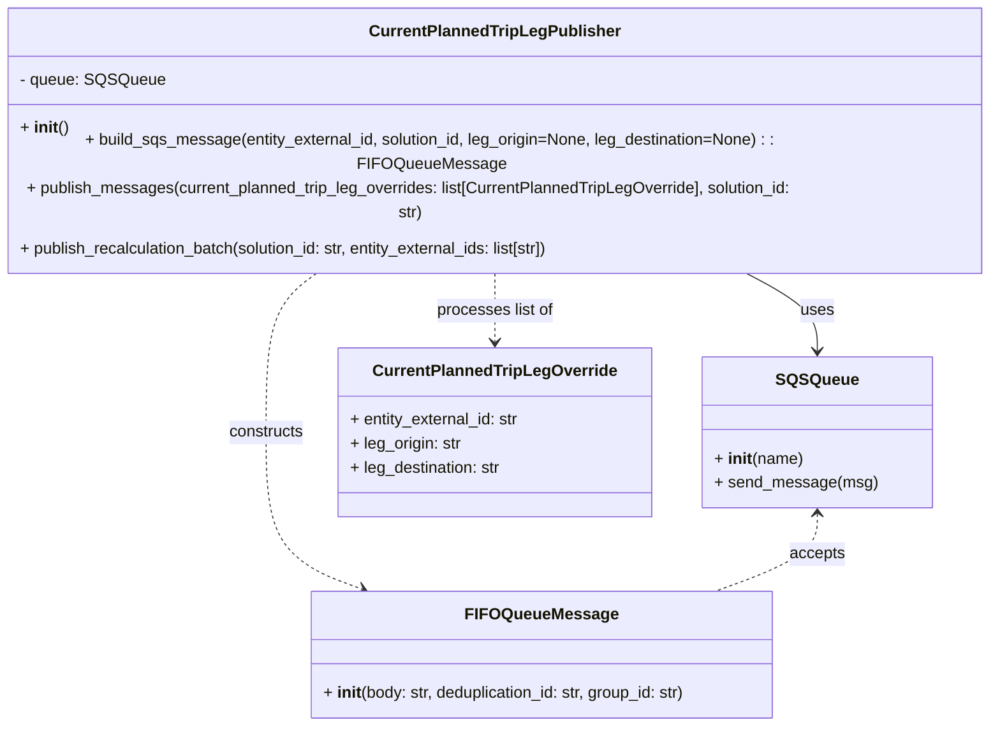

# Diagram: entity_core/entity_service/entity_service/trip_leg/trip_leg/current_planned_trip_leg_publisher.py


> Auto-generated by Obscura crawlers

## Diagram 1



### SVG

<svg id="container" width="997.2421875" xmlns="http://www.w3.org/2000/svg" class="classDiagram" height="674" viewBox="0 0 997.2421875 674" role="graphics-document document" aria-roledescription="class"><style>#container{font-family:"trebuchet ms",verdana,arial,sans-serif;font-size:16px;fill:#333;}@keyframes edge-animation-frame{from{stroke-dashoffset:0;}}@keyframes dash{to{stroke-dashoffset:0;}}#container .edge-animation-slow{stroke-dasharray:9,5!important;stroke-dashoffset:900;animation:dash 50s linear infinite;stroke-linecap:round;}#container .edge-animation-fast{stroke-dasharray:9,5!important;stroke-dashoffset:900;animation:dash 20s linear infinite;stroke-linecap:round;}#container .error-icon{fill:#552222;}#container .error-text{fill:#552222;stroke:#552222;}#container .edge-thickness-normal{stroke-width:1px;}#container .edge-thickness-thick{stroke-width:3.5px;}#container .edge-pattern-solid{stroke-dasharray:0;}#container .edge-thickness-invisible{stroke-width:0;fill:none;}#container .edge-pattern-dashed{stroke-dasharray:3;}#container .edge-pattern-dotted{stroke-dasharray:2;}#container .marker{fill:#333333;stroke:#333333;}#container .marker.cross{stroke:#333333;}#container svg{font-family:"trebuchet ms",verdana,arial,sans-serif;font-size:16px;}#container p{margin:0;}#container g.classGroup text{fill:#9370DB;stroke:none;font-family:"trebuchet ms",verdana,arial,sans-serif;font-size:10px;}#container g.classGroup text .title{font-weight:bolder;}#container .nodeLabel,#container .edgeLabel{color:#131300;}#container .edgeLabel .label rect{fill:#ECECFF;}#container .label text{fill:#131300;}#container .labelBkg{background:#ECECFF;}#container .edgeLabel .label span{background:#ECECFF;}#container .classTitle{font-weight:bolder;}#container .node rect,#container .node circle,#container .node ellipse,#container .node polygon,#container .node path{fill:#ECECFF;stroke:#9370DB;stroke-width:1px;}#container .divider{stroke:#9370DB;stroke-width:1;}#container g.clickable{cursor:pointer;}#container g.classGroup rect{fill:#ECECFF;stroke:#9370DB;}#container g.classGroup line{stroke:#9370DB;stroke-width:1;}#container .classLabel .box{stroke:none;stroke-width:0;fill:#ECECFF;opacity:0.5;}#container .classLabel .label{fill:#9370DB;font-size:10px;}#container .relation{stroke:#333333;stroke-width:1;fill:none;}#container .dashed-line{stroke-dasharray:3;}#container .dotted-line{stroke-dasharray:1 2;}#container #compositionStart,#container .composition{fill:#333333!important;stroke:#333333!important;stroke-width:1;}#container #compositionEnd,#container .composition{fill:#333333!important;stroke:#333333!important;stroke-width:1;}#container #dependencyStart,#container .dependency{fill:#333333!important;stroke:#333333!important;stroke-width:1;}#container #dependencyStart,#container .dependency{fill:#333333!important;stroke:#333333!important;stroke-width:1;}#container #extensionStart,#container .extension{fill:transparent!important;stroke:#333333!important;stroke-width:1;}#container #extensionEnd,#container .extension{fill:transparent!important;stroke:#333333!important;stroke-width:1;}#container #aggregationStart,#container .aggregation{fill:transparent!important;stroke:#333333!important;stroke-width:1;}#container #aggregationEnd,#container .aggregation{fill:transparent!important;stroke:#333333!important;stroke-width:1;}#container #lollipopStart,#container .lollipop{fill:#ECECFF!important;stroke:#333333!important;stroke-width:1;}#container #lollipopEnd,#container .lollipop{fill:#ECECFF!important;stroke:#333333!important;stroke-width:1;}#container .edgeTerminals{font-size:11px;line-height:initial;}#container .classTitleText{text-anchor:middle;font-size:18px;fill:#333;}#container .label-icon{display:inline-block;height:1em;overflow:visible;vertical-align:-0.125em;}#container .node .label-icon path{fill:currentColor;stroke:revert;stroke-width:revert;}#container :root{--mermaid-font-family:"trebuchet ms",verdana,arial,sans-serif;}</style><g><defs><marker id="container_class-aggregationStart" class="marker aggregation class" refX="18" refY="7" markerWidth="190" markerHeight="240" orient="auto"><path d="M 18,7 L9,13 L1,7 L9,1 Z"></path></marker></defs><defs><marker id="container_class-aggregationEnd" class="marker aggregation class" refX="1" refY="7" markerWidth="20" markerHeight="28" orient="auto"><path d="M 18,7 L9,13 L1,7 L9,1 Z"></path></marker></defs><defs><marker id="container_class-extensionStart" class="marker extension class" refX="18" refY="7" markerWidth="190" markerHeight="240" orient="auto"><path d="M 1,7 L18,13 V 1 Z"></path></marker></defs><defs><marker id="container_class-extensionEnd" class="marker extension class" refX="1" refY="7" markerWidth="20" markerHeight="28" orient="auto"><path d="M 1,1 V 13 L18,7 Z"></path></marker></defs><defs><marker id="container_class-compositionStart" class="marker composition class" refX="18" refY="7" markerWidth="190" markerHeight="240" orient="auto"><path d="M 18,7 L9,13 L1,7 L9,1 Z"></path></marker></defs><defs><marker id="container_class-compositionEnd" class="marker composition class" refX="1" refY="7" markerWidth="20" markerHeight="28" orient="auto"><path d="M 18,7 L9,13 L1,7 L9,1 Z"></path></marker></defs><defs><marker id="container_class-dependencyStart" class="marker dependency class" refX="6" refY="7" markerWidth="190" markerHeight="240" orient="auto"><path d="M 5,7 L9,13 L1,7 L9,1 Z"></path></marker></defs><defs><marker id="container_class-dependencyEnd" class="marker dependency class" refX="13" refY="7" markerWidth="20" markerHeight="28" orient="auto"><path d="M 18,7 L9,13 L14,7 L9,1 Z"></path></marker></defs><defs><marker id="container_class-lollipopStart" class="marker lollipop class" refX="13" refY="7" markerWidth="190" markerHeight="240" orient="auto"><circle stroke="black" fill="transparent" cx="7" cy="7" r="6"></circle></marker></defs><defs><marker id="container_class-lollipopEnd" class="marker lollipop class" refX="1" refY="7" markerWidth="190" markerHeight="240" orient="auto"><circle stroke="black" fill="transparent" cx="7" cy="7" r="6"></circle></marker></defs><g class="root"><g class="clusters"></g><g class="edgePaths"><path d="M733.71,224L747.134,230.167C760.557,236.333,787.403,248.667,800.827,261.5C814.25,274.333,814.25,287.667,814.25,294.333L814.25,301" id="id_CurrentPlannedTripLegPublisher_SQSQueue_1" class="edge-thickness-normal edge-pattern-solid relation" style=";;;" data-edge="true" data-et="edge" data-id="id_CurrentPlannedTripLegPublisher_SQSQueue_1" data-points="W3sieCI6NzMzLjcxMDIxMDEyOTMxMDMsInkiOjIyNH0seyJ4Ijo4MTQuMjUsInkiOjI2MX0seyJ4Ijo4MTQuMjUsInkiOjMwN31d" marker-end="url(#container_class-dependencyEnd)"></path><path d="M328.492,224L318.778,230.167C309.064,236.333,289.635,248.667,279.921,275C270.207,301.333,270.207,341.667,270.207,382C270.207,422.333,270.207,462.667,286.043,488.655C301.879,514.643,333.551,526.287,349.387,532.108L365.223,537.93" id="id_CurrentPlannedTripLegPublisher_FIFOQueueMessage_2" class="edge-thickness-normal edge-pattern-dashed relation" style=";;;" data-edge="true" data-et="edge" data-id="id_CurrentPlannedTripLegPublisher_FIFOQueueMessage_2" data-points="W3sieCI6MzI4LjQ5MTk5ODkyMjQxMzgsInkiOjIyNH0seyJ4IjoyNzAuMjA3MDMxMjUsInkiOjI2MX0seyJ4IjoyNzAuMjA3MDMxMjUsInkiOjM4Mn0seyJ4IjoyNzAuMjA3MDMxMjUsInkiOjUwM30seyJ4IjozNzAuODU0OTgwNDY4NzUsInkiOjU0MH1d" marker-end="url(#container_class-dependencyEnd)"></path><path d="M498.621,224L498.621,230.167C498.621,236.333,498.621,248.667,498.621,260C498.621,271.333,498.621,281.667,498.621,286.833L498.621,292" id="id_CurrentPlannedTripLegPublisher_CurrentPlannedTripLegOverride_3" class="edge-thickness-normal edge-pattern-dashed relation" style=";;;" data-edge="true" data-et="edge" data-id="id_CurrentPlannedTripLegPublisher_CurrentPlannedTripLegOverride_3" data-points="W3sieCI6NDk4LjYyMTA5Mzc1LCJ5IjoyMjR9LHsieCI6NDk4LjYyMTA5Mzc1LCJ5IjoyNjF9LHsieCI6NDk4LjYyMTA5Mzc1LCJ5IjoyOTh9XQ==" marker-end="url(#container_class-dependencyEnd)"></path><path d="M814.25,463L814.25,469.667C814.25,476.333,814.25,489.667,797.475,502.5C780.701,515.333,747.151,527.667,730.377,533.833L713.602,540" id="id_SQSQueue_FIFOQueueMessage_4" class="edge-thickness-normal edge-pattern-dashed relation" style=";;;" data-edge="true" data-et="edge" data-id="id_SQSQueue_FIFOQueueMessage_4" data-points="W3sieCI6ODE0LjI1LCJ5Ijo0NTd9LHsieCI6ODE0LjI1LCJ5Ijo1MDN9LHsieCI6NzEzLjYwMjA1MDc4MTI1LCJ5Ijo1NDB9XQ==" marker-start="url(#container_class-dependencyStart)"></path></g><g class="edgeLabels"><g class="edgeLabel" transform="translate(814.25, 261)"><g class="label" data-id="id_CurrentPlannedTripLegPublisher_SQSQueue_1" transform="translate(-16.4921875, -12)"><foreignObject width="32.984375" height="24"><div xmlns="http://www.w3.org/1999/xhtml" class="labelBkg" style="display: table-cell; white-space: nowrap; line-height: 1.5; max-width: 200px; text-align: center;"><span class="edgeLabel"><p>uses</p></span></div></foreignObject></g></g><g class="edgeLabel" transform="translate(270.20703125, 382)"><g class="label" data-id="id_CurrentPlannedTripLegPublisher_FIFOQueueMessage_2" transform="translate(-37.84375, -12)"><foreignObject width="75.6875" height="24"><div xmlns="http://www.w3.org/1999/xhtml" class="labelBkg" style="display: table-cell; white-space: nowrap; line-height: 1.5; max-width: 200px; text-align: center;"><span class="edgeLabel"><p>constructs</p></span></div></foreignObject></g></g><g class="edgeLabel" transform="translate(498.62109375, 261)"><g class="label" data-id="id_CurrentPlannedTripLegPublisher_CurrentPlannedTripLegOverride_3" transform="translate(-58.6015625, -12)"><foreignObject width="117.203125" height="24"><div xmlns="http://www.w3.org/1999/xhtml" class="labelBkg" style="display: table-cell; white-space: nowrap; line-height: 1.5; max-width: 200px; text-align: center;"><span class="edgeLabel"><p>processes list of</p></span></div></foreignObject></g></g><g class="edgeLabel" transform="translate(814.25, 503)"><g class="label" data-id="id_SQSQueue_FIFOQueueMessage_4" transform="translate(-27.421875, -12)"><foreignObject width="54.84375" height="24"><div xmlns="http://www.w3.org/1999/xhtml" class="labelBkg" style="display: table-cell; white-space: nowrap; line-height: 1.5; max-width: 200px; text-align: center;"><span class="edgeLabel"><p>accepts</p></span></div></foreignObject></g></g></g><g class="nodes"><g class="node default" id="classId-CurrentPlannedTripLegPublisher-0" transform="translate(498.62109375, 116)"><g class="basic label-container"><path d="M-490.62109375 -108 L490.62109375 -108 L490.62109375 108 L-490.62109375 108" stroke="none" stroke-width="0" fill="#ECECFF" style=""></path><path d="M-490.62109375 -108 C-280.1389922649489 -108, -69.65689077989776 -108, 490.62109375 -108 M-490.62109375 -108 C-125.95083956399804 -108, 238.7194146220039 -108, 490.62109375 -108 M490.62109375 -108 C490.62109375 -44.74754523342394, 490.62109375 18.504909533152116, 490.62109375 108 M490.62109375 -108 C490.62109375 -43.64563219613996, 490.62109375 20.708735607720087, 490.62109375 108 M490.62109375 108 C216.1057360747851 108, -58.40962160042977 108, -490.62109375 108 M490.62109375 108 C217.95807885405577 108, -54.70493604188846 108, -490.62109375 108 M-490.62109375 108 C-490.62109375 48.74379630322341, -490.62109375 -10.512407393553175, -490.62109375 -108 M-490.62109375 108 C-490.62109375 30.993108708402303, -490.62109375 -46.01378258319539, -490.62109375 -108" stroke="#9370DB" stroke-width="1.3" fill="none" stroke-dasharray="0 0" style=""></path></g><g class="annotation-group text" transform="translate(0, -84)"></g><g class="label-group text" transform="translate(-118.9609375, -84)"><g class="label" style="font-weight: bolder" transform="translate(0,-12)"><foreignObject width="237.921875" height="24"><div xmlns="http://www.w3.org/1999/xhtml" style="display: table-cell; white-space: nowrap; line-height: 1.5; max-width: 285px; text-align: center;"><span class="nodeLabel markdown-node-label" style=""><p>CurrentPlannedTripLegPublisher</p></span></div></foreignObject></g></g><g class="members-group text" transform="translate(-478.62109375, -36)"><g class="label" style="" transform="translate(0,-12)"><foreignObject width="140.03125" height="24"><div xmlns="http://www.w3.org/1999/xhtml" style="display: table-cell; white-space: nowrap; line-height: 1.5; max-width: 197px; text-align: center;"><span class="nodeLabel markdown-node-label" style=""><p>- queue: SQSQueue</p></span></div></foreignObject></g></g><g class="methods-group text" transform="translate(-478.62109375, 12)"><g class="label" style="" transform="translate(0,-12)"><foreignObject width="47.046875" height="24"><div xmlns="http://www.w3.org/1999/xhtml" style="display: table-cell; white-space: nowrap; line-height: 1.5; max-width: 137px; text-align: center;"><span class="nodeLabel markdown-node-label" style=""><p>+ <strong>init</strong>()</p></span></div></foreignObject></g><g class="label" style="" transform="translate(0,12)"><foreignObject width="838.28125" height="24"><div xmlns="http://www.w3.org/1999/xhtml" style="display: table-cell; white-space: nowrap; line-height: 1.5; max-width: 896px; text-align: center;"><span class="nodeLabel markdown-node-label" style=""><p>+ build_sqs_message(entity_external_id, solution_id, leg_origin=None, leg_destination=None) : : FIFOQueueMessage</p></span></div></foreignObject></g><g class="label" style="" transform="translate(0,36)"><foreignObject width="803.03125" height="24"><div xmlns="http://www.w3.org/1999/xhtml" style="display: table-cell; white-space: nowrap; line-height: 1.5; max-width: 860px; text-align: center;"><span class="nodeLabel markdown-node-label" style=""><p>+ publish_messages(current_planned_trip_leg_overrides: list[CurrentPlannedTripLegOverride], solution_id: str)</p></span></div></foreignObject></g><g class="label" style="" transform="translate(0,60)"><foreignObject width="543.890625" height="24"><div xmlns="http://www.w3.org/1999/xhtml" style="display: table-cell; white-space: nowrap; line-height: 1.5; max-width: 601px; text-align: center;"><span class="nodeLabel markdown-node-label" style=""><p>+ publish_recalculation_batch(solution_id: str, entity_external_ids: list[str])</p></span></div></foreignObject></g></g><g class="divider" style=""><path d="M-490.62109375 -60 C-283.657412169732 -60, -76.69373058946405 -60, 490.62109375 -60 M-490.62109375 -60 C-114.52691235229128 -60, 261.56726904541745 -60, 490.62109375 -60" stroke="#9370DB" stroke-width="1.3" fill="none" stroke-dasharray="0 0" style=""></path></g><g class="divider" style=""><path d="M-490.62109375 -12 C-131.06233346009572 -12, 228.49642682980857 -12, 490.62109375 -12 M-490.62109375 -12 C-246.7851100915064 -12, -2.9491264330127933 -12, 490.62109375 -12" stroke="#9370DB" stroke-width="1.3" fill="none" stroke-dasharray="0 0" style=""></path></g></g><g class="node default" id="classId-SQSQueue-1" transform="translate(814.25, 382)"><g class="basic label-container"><path d="M-110.05859375 -75 L110.05859375 -75 L110.05859375 75 L-110.05859375 75" stroke="none" stroke-width="0" fill="#ECECFF" style=""></path><path d="M-110.05859375 -75 C-52.67376831712715 -75, 4.711057115745703 -75, 110.05859375 -75 M-110.05859375 -75 C-59.10831559930743 -75, -8.158037448614863 -75, 110.05859375 -75 M110.05859375 -75 C110.05859375 -20.814867383981486, 110.05859375 33.37026523203703, 110.05859375 75 M110.05859375 -75 C110.05859375 -28.908527816047204, 110.05859375 17.18294436790559, 110.05859375 75 M110.05859375 75 C59.59132032112138 75, 9.12404689224276 75, -110.05859375 75 M110.05859375 75 C42.146073156928324 75, -25.766447436143352 75, -110.05859375 75 M-110.05859375 75 C-110.05859375 28.29000523816623, -110.05859375 -18.41998952366754, -110.05859375 -75 M-110.05859375 75 C-110.05859375 15.620088763011701, -110.05859375 -43.7598224739766, -110.05859375 -75" stroke="#9370DB" stroke-width="1.3" fill="none" stroke-dasharray="0 0" style=""></path></g><g class="annotation-group text" transform="translate(0, -51)"></g><g class="label-group text" transform="translate(-38.1796875, -51)"><g class="label" style="font-weight: bolder" transform="translate(0,-12)"><foreignObject width="76.359375" height="24"><div xmlns="http://www.w3.org/1999/xhtml" style="display: table-cell; white-space: nowrap; line-height: 1.5; max-width: 126px; text-align: center;"><span class="nodeLabel markdown-node-label" style=""><p>SQSQueue</p></span></div></foreignObject></g></g><g class="members-group text" transform="translate(-98.05859375, -3)"></g><g class="methods-group text" transform="translate(-98.05859375, 27)"><g class="label" style="" transform="translate(0,-12)"><foreignObject width="87.5625" height="24"><div xmlns="http://www.w3.org/1999/xhtml" style="display: table-cell; white-space: nowrap; line-height: 1.5; max-width: 178px; text-align: center;"><span class="nodeLabel markdown-node-label" style=""><p>+ <strong>init</strong>(name)</p></span></div></foreignObject></g><g class="label" style="" transform="translate(0,12)"><foreignObject width="157.9375" height="24"><div xmlns="http://www.w3.org/1999/xhtml" style="display: table-cell; white-space: nowrap; line-height: 1.5; max-width: 215px; text-align: center;"><span class="nodeLabel markdown-node-label" style=""><p>+ send_message(msg)</p></span></div></foreignObject></g></g><g class="divider" style=""><path d="M-110.05859375 -27 C-57.771934046629326 -27, -5.485274343258652 -27, 110.05859375 -27 M-110.05859375 -27 C-26.921135901464794 -27, 56.21632194707041 -27, 110.05859375 -27" stroke="#9370DB" stroke-width="1.3" fill="none" stroke-dasharray="0 0" style=""></path></g><g class="divider" style=""><path d="M-110.05859375 -3 C-47.6894850471334 -3, 14.679623655733195 -3, 110.05859375 -3 M-110.05859375 -3 C-51.780841306086245 -3, 6.49691113782751 -3, 110.05859375 -3" stroke="#9370DB" stroke-width="1.3" fill="none" stroke-dasharray="0 0" style=""></path></g></g><g class="node default" id="classId-FIFOQueueMessage-2" transform="translate(542.228515625, 603)"><g class="basic label-container"><path d="M-230.75 -63 L230.75 -63 L230.75 63 L-230.75 63" stroke="none" stroke-width="0" fill="#ECECFF" style=""></path><path d="M-230.75 -63 C-123.75770409406063 -63, -16.765408188121256 -63, 230.75 -63 M-230.75 -63 C-124.48042519770242 -63, -18.210850395404833 -63, 230.75 -63 M230.75 -63 C230.75 -16.167880287824495, 230.75 30.66423942435101, 230.75 63 M230.75 -63 C230.75 -36.690508393805494, 230.75 -10.381016787610989, 230.75 63 M230.75 63 C134.13292407115517 63, 37.515848142310375 63, -230.75 63 M230.75 63 C85.90030284962398 63, -58.94939430075203 63, -230.75 63 M-230.75 63 C-230.75 16.74634909990987, -230.75 -29.507301800180258, -230.75 -63 M-230.75 63 C-230.75 35.3260776951818, -230.75 7.652155390363603, -230.75 -63" stroke="#9370DB" stroke-width="1.3" fill="none" stroke-dasharray="0 0" style=""></path></g><g class="annotation-group text" transform="translate(0, -39)"></g><g class="label-group text" transform="translate(-70.265625, -39)"><g class="label" style="font-weight: bolder" transform="translate(0,-12)"><foreignObject width="140.53125" height="24"><div xmlns="http://www.w3.org/1999/xhtml" style="display: table-cell; white-space: nowrap; line-height: 1.5; max-width: 189px; text-align: center;"><span class="nodeLabel markdown-node-label" style=""><p>FIFOQueueMessage</p></span></div></foreignObject></g></g><g class="members-group text" transform="translate(-218.75, 9)"></g><g class="methods-group text" transform="translate(-218.75, 39)"><g class="label" style="" transform="translate(0,-12)"><foreignObject width="367.234375" height="24"><div xmlns="http://www.w3.org/1999/xhtml" style="display: table-cell; white-space: nowrap; line-height: 1.5; max-width: 457px; text-align: center;"><span class="nodeLabel markdown-node-label" style=""><p>+ <strong>init</strong>(body: str, deduplication_id: str, group_id: str)</p></span></div></foreignObject></g></g><g class="divider" style=""><path d="M-230.75 -15 C-75.08427877062084 -15, 80.58144245875832 -15, 230.75 -15 M-230.75 -15 C-113.09139444364098 -15, 4.5672111127180415 -15, 230.75 -15" stroke="#9370DB" stroke-width="1.3" fill="none" stroke-dasharray="0 0" style=""></path></g><g class="divider" style=""><path d="M-230.75 9 C-73.33952707302947 9, 84.07094585394105 9, 230.75 9 M-230.75 9 C-110.4916187245079 9, 9.766762550984197 9, 230.75 9" stroke="#9370DB" stroke-width="1.3" fill="none" stroke-dasharray="0 0" style=""></path></g></g><g class="node default" id="classId-CurrentPlannedTripLegOverride-3" transform="translate(498.62109375, 382)"><g class="basic label-container"><path d="M-155.5703125 -84 L155.5703125 -84 L155.5703125 84 L-155.5703125 84" stroke="none" stroke-width="0" fill="#ECECFF" style=""></path><path d="M-155.5703125 -84 C-58.02200004923016 -84, 39.526312401539684 -84, 155.5703125 -84 M-155.5703125 -84 C-43.572597634924946 -84, 68.42511723015011 -84, 155.5703125 -84 M155.5703125 -84 C155.5703125 -45.26167672819764, 155.5703125 -6.523353456395284, 155.5703125 84 M155.5703125 -84 C155.5703125 -32.60605065851691, 155.5703125 18.787898682966187, 155.5703125 84 M155.5703125 84 C56.73854676256569 84, -42.09321897486862 84, -155.5703125 84 M155.5703125 84 C45.047505282020396 84, -65.47530193595921 84, -155.5703125 84 M-155.5703125 84 C-155.5703125 42.978799744530065, -155.5703125 1.9575994890601294, -155.5703125 -84 M-155.5703125 84 C-155.5703125 41.98441838391598, -155.5703125 -0.031163232168040622, -155.5703125 -84" stroke="#9370DB" stroke-width="1.3" fill="none" stroke-dasharray="0 0" style=""></path></g><g class="annotation-group text" transform="translate(0, -60)"></g><g class="label-group text" transform="translate(-116.15625, -60)"><g class="label" style="font-weight: bolder" transform="translate(0,-12)"><foreignObject width="232.3125" height="24"><div xmlns="http://www.w3.org/1999/xhtml" style="display: table-cell; white-space: nowrap; line-height: 1.5; max-width: 279px; text-align: center;"><span class="nodeLabel markdown-node-label" style=""><p>CurrentPlannedTripLegOverride</p></span></div></foreignObject></g></g><g class="members-group text" transform="translate(-143.5703125, -12)"><g class="label" style="" transform="translate(0,-12)"><foreignObject width="170.984375" height="24"><div xmlns="http://www.w3.org/1999/xhtml" style="display: table-cell; white-space: nowrap; line-height: 1.5; max-width: 229px; text-align: center;"><span class="nodeLabel markdown-node-label" style=""><p>+ entity_external_id: str</p></span></div></foreignObject></g><g class="label" style="" transform="translate(0,12)"><foreignObject width="111.6875" height="24"><div xmlns="http://www.w3.org/1999/xhtml" style="display: table-cell; white-space: nowrap; line-height: 1.5; max-width: 170px; text-align: center;"><span class="nodeLabel markdown-node-label" style=""><p>+ leg_origin: str</p></span></div></foreignObject></g><g class="label" style="" transform="translate(0,36)"><foreignObject width="152.578125" height="24"><div xmlns="http://www.w3.org/1999/xhtml" style="display: table-cell; white-space: nowrap; line-height: 1.5; max-width: 211px; text-align: center;"><span class="nodeLabel markdown-node-label" style=""><p>+ leg_destination: str</p></span></div></foreignObject></g></g><g class="methods-group text" transform="translate(-143.5703125, 84)"></g><g class="divider" style=""><path d="M-155.5703125 -36 C-35.56394653855375 -36, 84.4424194228925 -36, 155.5703125 -36 M-155.5703125 -36 C-88.16087604277347 -36, -20.751439585546933 -36, 155.5703125 -36" stroke="#9370DB" stroke-width="1.3" fill="none" stroke-dasharray="0 0" style=""></path></g><g class="divider" style=""><path d="M-155.5703125 60 C-53.32696556658004 60, 48.916381366839914 60, 155.5703125 60 M-155.5703125 60 C-74.49793365675775 60, 6.574445186484496 60, 155.5703125 60" stroke="#9370DB" stroke-width="1.3" fill="none" stroke-dasharray="0 0" style=""></path></g></g></g></g></g></svg>

## Diagram 2

```mermaid
flowchart LR
  subgraph BuildMessage["build_sqs_message(entity_external_id, solution_id, leg_origin, leg_destination)"]
    A1[Start] --> A2[Create body with solutionId and entityExternalId]
    A2 --> A3{leg_origin and leg_destination?}
    A3 -- yes --> A4[Add override: originCode, destinationCode]
    A3 -- no --> A5[No override]
    A4 --> A6[Generate UUID deduplication_id]
    A5 --> A6
    A6 --> A7[Compute group_id = solutionId:entityExternalId]
    A7 --> A8[Create FIFOQueueMessage(json(body), deduplication_id, group_id)]
    A8 --> A9[Return FIFOQueueMessage]
  end
  subgraph PublishMessages["publish_messages(overrides, solution_id)"]
    P1[For each CurrentPlannedTripLegOverride in overrides] --> P2[Call build_sqs_message(...)]
    P2 --> P3[SQSQueue.send_message(parsed_message)]
    P3 --> P1
  end
  subgraph PublishRecalc["publish_recalculation_batch(solution_id, entity_external_ids)"]
    R1{entity_external_ids not empty?} -->|yes| R2[For each entity_external_id]
    R2 --> R3[Call build_sqs_message(entity_external_id, solution_id)]
    R3 --> R4[SQSQueue.send_message(parsed_message)]
    R4 --> R2
    R1 -->|no| R5[No action]
  end
  A9 --> P3
  A9 --> R4
```

> SVG rendering failed for this diagram.
