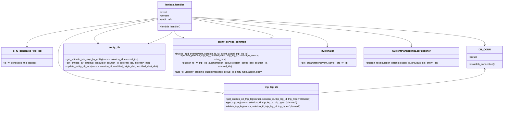

# Diagram: entity_core/entity_service/entity_service/trip_leg/trip_leg/delete_planned_trip_leg.py


> Auto-generated by Obscura crawlers

## Diagram 1



### SVG

<svg id="container" width="3315.7890625" xmlns="http://www.w3.org/2000/svg" class="classDiagram" height="680" viewBox="0 0 3315.7890625 680" role="graphics-document document" aria-roledescription="class"><style>#container{font-family:"trebuchet ms",verdana,arial,sans-serif;font-size:16px;fill:#333;}@keyframes edge-animation-frame{from{stroke-dashoffset:0;}}@keyframes dash{to{stroke-dashoffset:0;}}#container .edge-animation-slow{stroke-dasharray:9,5!important;stroke-dashoffset:900;animation:dash 50s linear infinite;stroke-linecap:round;}#container .edge-animation-fast{stroke-dasharray:9,5!important;stroke-dashoffset:900;animation:dash 20s linear infinite;stroke-linecap:round;}#container .error-icon{fill:#552222;}#container .error-text{fill:#552222;stroke:#552222;}#container .edge-thickness-normal{stroke-width:1px;}#container .edge-thickness-thick{stroke-width:3.5px;}#container .edge-pattern-solid{stroke-dasharray:0;}#container .edge-thickness-invisible{stroke-width:0;fill:none;}#container .edge-pattern-dashed{stroke-dasharray:3;}#container .edge-pattern-dotted{stroke-dasharray:2;}#container .marker{fill:#333333;stroke:#333333;}#container .marker.cross{stroke:#333333;}#container svg{font-family:"trebuchet ms",verdana,arial,sans-serif;font-size:16px;}#container p{margin:0;}#container g.classGroup text{fill:#9370DB;stroke:none;font-family:"trebuchet ms",verdana,arial,sans-serif;font-size:10px;}#container g.classGroup text .title{font-weight:bolder;}#container .nodeLabel,#container .edgeLabel{color:#131300;}#container .edgeLabel .label rect{fill:#ECECFF;}#container .label text{fill:#131300;}#container .labelBkg{background:#ECECFF;}#container .edgeLabel .label span{background:#ECECFF;}#container .classTitle{font-weight:bolder;}#container .node rect,#container .node circle,#container .node ellipse,#container .node polygon,#container .node path{fill:#ECECFF;stroke:#9370DB;stroke-width:1px;}#container .divider{stroke:#9370DB;stroke-width:1;}#container g.clickable{cursor:pointer;}#container g.classGroup rect{fill:#ECECFF;stroke:#9370DB;}#container g.classGroup line{stroke:#9370DB;stroke-width:1;}#container .classLabel .box{stroke:none;stroke-width:0;fill:#ECECFF;opacity:0.5;}#container .classLabel .label{fill:#9370DB;font-size:10px;}#container .relation{stroke:#333333;stroke-width:1;fill:none;}#container .dashed-line{stroke-dasharray:3;}#container .dotted-line{stroke-dasharray:1 2;}#container #compositionStart,#container .composition{fill:#333333!important;stroke:#333333!important;stroke-width:1;}#container #compositionEnd,#container .composition{fill:#333333!important;stroke:#333333!important;stroke-width:1;}#container #dependencyStart,#container .dependency{fill:#333333!important;stroke:#333333!important;stroke-width:1;}#container #dependencyStart,#container .dependency{fill:#333333!important;stroke:#333333!important;stroke-width:1;}#container #extensionStart,#container .extension{fill:transparent!important;stroke:#333333!important;stroke-width:1;}#container #extensionEnd,#container .extension{fill:transparent!important;stroke:#333333!important;stroke-width:1;}#container #aggregationStart,#container .aggregation{fill:transparent!important;stroke:#333333!important;stroke-width:1;}#container #aggregationEnd,#container .aggregation{fill:transparent!important;stroke:#333333!important;stroke-width:1;}#container #lollipopStart,#container .lollipop{fill:#ECECFF!important;stroke:#333333!important;stroke-width:1;}#container #lollipopEnd,#container .lollipop{fill:#ECECFF!important;stroke:#333333!important;stroke-width:1;}#container .edgeTerminals{font-size:11px;line-height:initial;}#container .classTitleText{text-anchor:middle;font-size:18px;fill:#333;}#container .label-icon{display:inline-block;height:1em;overflow:visible;vertical-align:-0.125em;}#container .node .label-icon path{fill:currentColor;stroke:revert;stroke-width:revert;}#container :root{--mermaid-font-family:"trebuchet ms",verdana,arial,sans-serif;}</style><g><defs><marker id="container_class-aggregationStart" class="marker aggregation class" refX="18" refY="7" markerWidth="190" markerHeight="240" orient="auto"><path d="M 18,7 L9,13 L1,7 L9,1 Z"></path></marker></defs><defs><marker id="container_class-aggregationEnd" class="marker aggregation class" refX="1" refY="7" markerWidth="20" markerHeight="28" orient="auto"><path d="M 18,7 L9,13 L1,7 L9,1 Z"></path></marker></defs><defs><marker id="container_class-extensionStart" class="marker extension class" refX="18" refY="7" markerWidth="190" markerHeight="240" orient="auto"><path d="M 1,7 L18,13 V 1 Z"></path></marker></defs><defs><marker id="container_class-extensionEnd" class="marker extension class" refX="1" refY="7" markerWidth="20" markerHeight="28" orient="auto"><path d="M 1,1 V 13 L18,7 Z"></path></marker></defs><defs><marker id="container_class-compositionStart" class="marker composition class" refX="18" refY="7" markerWidth="190" markerHeight="240" orient="auto"><path d="M 18,7 L9,13 L1,7 L9,1 Z"></path></marker></defs><defs><marker id="container_class-compositionEnd" class="marker composition class" refX="1" refY="7" markerWidth="20" markerHeight="28" orient="auto"><path d="M 18,7 L9,13 L1,7 L9,1 Z"></path></marker></defs><defs><marker id="container_class-dependencyStart" class="marker dependency class" refX="6" refY="7" markerWidth="190" markerHeight="240" orient="auto"><path d="M 5,7 L9,13 L1,7 L9,1 Z"></path></marker></defs><defs><marker id="container_class-dependencyEnd" class="marker dependency class" refX="13" refY="7" markerWidth="20" markerHeight="28" orient="auto"><path d="M 18,7 L9,13 L14,7 L9,1 Z"></path></marker></defs><defs><marker id="container_class-lollipopStart" class="marker lollipop class" refX="13" refY="7" markerWidth="190" markerHeight="240" orient="auto"><circle stroke="black" fill="transparent" cx="7" cy="7" r="6"></circle></marker></defs><defs><marker id="container_class-lollipopEnd" class="marker lollipop class" refX="1" refY="7" markerWidth="190" markerHeight="240" orient="auto"><circle stroke="black" fill="transparent" cx="7" cy="7" r="6"></circle></marker></defs><g class="root"><g class="clusters"></g><g class="edgePaths"><path d="M1263.293,110.585L1584.736,129.654C1906.18,148.723,2549.066,186.862,2870.51,213.597C3191.953,240.333,3191.953,255.667,3191.953,263.333L3191.953,271" id="id_lambda_handler_DB_CONN_1" class="edge-thickness-normal edge-pattern-solid relation" style=";;;" data-edge="true" data-et="edge" data-id="id_lambda_handler_DB_CONN_1" data-points="W3sieCI6MTI2My4yOTI5Njg3NSwieSI6MTEwLjU4NDcwMTM4OTYzMzY2fSx7IngiOjMxOTEuOTUzMTI1LCJ5IjoyMjV9LHsieCI6MzE5MS45NTMxMjUsInkiOjI3N31d" marker-end="url(#container_class-dependencyEnd)"></path><path d="M1041.301,121.276L930.234,138.564C819.167,155.851,597.033,190.425,485.965,228.379C374.898,266.333,374.898,307.667,374.898,349C374.898,390.333,374.898,431.667,555.774,466.716C736.65,501.765,1098.401,530.53,1279.276,544.912L1460.152,559.295" id="id_lambda_handler_trip_leg_db_2" class="edge-thickness-normal edge-pattern-solid relation" style=";;;" data-edge="true" data-et="edge" data-id="id_lambda_handler_trip_leg_db_2" data-points="W3sieCI6MTA0MS4zMDA3ODEyNSwieSI6MTIxLjI3NjI0Njg5NzIwMzIxfSx7IngiOjM3NC44OTg0Mzc1LCJ5IjoyMjV9LHsieCI6Mzc0Ljg5ODQzNzUsInkiOjM0OX0seyJ4IjozNzQuODk4NDM3NSwieSI6NDczfSx7IngiOjE0NjYuMTMyODEyNSwieSI6NTU5Ljc3MDIzNTk3ODk1NjN9XQ==" marker-end="url(#container_class-dependencyEnd)"></path><path d="M1041.301,127.198L963.308,143.498C885.315,159.799,729.329,192.399,659.39,214.296C589.45,236.192,605.556,247.384,613.609,252.98L621.662,258.576" id="id_lambda_handler_entity_db_3" class="edge-thickness-normal edge-pattern-solid relation" style=";;;" data-edge="true" data-et="edge" data-id="id_lambda_handler_entity_db_3" data-points="W3sieCI6MTA0MS4zMDA3ODEyNSwieSI6MTI3LjE5Nzk1MjkzMjI4NjE5fSx7IngiOjU3My4zNDM3NSwieSI6MjI1fSx7IngiOjYyNi41ODk1Mjg3Mjk4Mzg3LCJ5IjoyNjJ9XQ==" marker-end="url(#container_class-dependencyEnd)"></path><path d="M1152.297,200L1152.297,204.167C1152.297,208.333,1152.297,216.667,1164.132,224.69C1175.967,232.714,1199.637,240.427,1211.472,244.284L1223.307,248.141" id="id_lambda_handler_entity_service_common_4" class="edge-thickness-normal edge-pattern-solid relation" style=";;;" data-edge="true" data-et="edge" data-id="id_lambda_handler_entity_service_common_4" data-points="W3sieCI6MTE1Mi4yOTY4NzUsInkiOjIwMH0seyJ4IjoxMTUyLjI5Njg3NSwieSI6MjI1fSx7IngiOjEyMjkuMDEyMTU5Nzc4MjI1OSwieSI6MjUwfV0=" marker-end="url(#container_class-dependencyEnd)"></path><path d="M1263.293,117.334L1412.672,135.278C1562.051,153.222,1860.809,189.111,2010.188,216.222C2159.566,243.333,2159.566,261.667,2159.566,270.833L2159.566,280" id="id_lambda_handler_invokinator_5" class="edge-thickness-normal edge-pattern-solid relation" style=";;;" data-edge="true" data-et="edge" data-id="id_lambda_handler_invokinator_5" data-points="W3sieCI6MTI2My4yOTI5Njg3NSwieSI6MTE3LjMzMzU5ODMzMzk4NjE1fSx7IngiOjIxNTkuNTY2NDA2MjUsInkiOjIyNX0seyJ4IjoyMTU5LjU2NjQwNjI1LCJ5IjoyODZ9XQ==" marker-end="url(#container_class-dependencyEnd)"></path><path d="M1263.293,112.613L1504.688,131.344C1746.082,150.075,2228.871,187.538,2470.266,215.435C2711.66,243.333,2711.66,261.667,2711.66,270.833L2711.66,280" id="id_lambda_handler_CurrentPlannedTripLegPublisher_6" class="edge-thickness-normal edge-pattern-solid relation" style=";;;" data-edge="true" data-et="edge" data-id="id_lambda_handler_CurrentPlannedTripLegPublisher_6" data-points="W3sieCI6MTI2My4yOTI5Njg3NSwieSI6MTEyLjYxMjgyNzc1MTcxMTU2fSx7IngiOjI3MTEuNjYwMTU2MjUsInkiOjIyNX0seyJ4IjoyNzExLjY2MDE1NjI1LCJ5IjoyODZ9XQ==" marker-end="url(#container_class-dependencyEnd)"></path><path d="M1041.301,117.728L896.742,135.606C752.184,153.485,463.066,189.243,318.508,216.288C173.949,243.333,173.949,261.667,173.949,270.833L173.949,280" id="id_lambda_handler_is_fv_generated_trip_leg_7" class="edge-thickness-normal edge-pattern-solid relation" style=";;;" data-edge="true" data-et="edge" data-id="id_lambda_handler_is_fv_generated_trip_leg_7" data-points="W3sieCI6MTA0MS4zMDA3ODEyNSwieSI6MTE3LjcyNzc2NTY0NDQwMjA0fSx7IngiOjE3My45NDkyMTg3NSwieSI6MjI1fSx7IngiOjE3My45NDkyMTg3NSwieSI6Mjg2fV0=" marker-end="url(#container_class-dependencyEnd)"></path><path d="M3191.953,427L3191.953,434.667C3191.953,442.333,3191.953,457.667,3010.081,479.795C2828.208,501.923,2464.464,530.847,2282.591,545.309L2100.719,559.77" id="id_DB_CONN_trip_leg_db_8" class="edge-thickness-normal edge-pattern-solid relation" style=";;;" data-edge="true" data-et="edge" data-id="id_DB_CONN_trip_leg_db_8" data-points="W3sieCI6MzE5MS45NTMxMjUsInkiOjQyMX0seyJ4IjozMTkxLjk1MzEyNSwieSI6NDczfSx7IngiOjIxMDAuNzE4NzUsInkiOjU1OS43NzAyMzU5Nzg5NTYzfV0=" marker-start="url(#container_class-dependencyStart)"></path><path d="M1024.463,260.141L1042.435,254.284C1060.408,248.427,1096.352,236.714,1115.013,226.69C1133.674,216.667,1135.052,208.333,1135.74,204.167L1136.429,200" id="id_entity_db_lambda_handler_9" class="edge-thickness-normal edge-pattern-solid relation" style=";;;" data-edge="true" data-et="edge" data-id="id_entity_db_lambda_handler_9" data-points="W3sieCI6MTAxOC43NTgyNTM1MjgyMjU5LCJ5IjoyNjJ9LHsieCI6MTEzMi4yOTY4NzUsInkiOjIyNX0seyJ4IjoxMTM2LjQyOTEwNjQwNDk1ODcsInkiOjIwMH1d" marker-start="url(#container_class-dependencyStart)"></path><path d="M1780.574,247.73L1789.843,243.942C1799.111,240.153,1817.648,232.577,1731.435,211.895C1645.221,191.213,1454.257,157.426,1358.775,140.532L1263.293,123.638" id="id_entity_service_common_lambda_handler_10" class="edge-thickness-normal edge-pattern-solid relation" style=";;;" data-edge="true" data-et="edge" data-id="id_entity_service_common_lambda_handler_10" data-points="W3sieCI6MTc3NS4wMjAwNTEwMzMyNjYsInkiOjI1MH0seyJ4IjoxODM2LjE4NTU0Njg3NSwieSI6MjI1fSx7IngiOjEyNjMuMjkyOTY4NzUsInkiOjEyMy42Mzg0NzAyNTk5NzM1Nn1d" marker-start="url(#container_class-dependencyStart)"></path></g><g class="edgeLabels"><g class="edgeLabel"><g class="label" data-id="id_lambda_handler_DB_CONN_1" transform="translate(0, 0)"><foreignObject width="0" height="0"><div xmlns="http://www.w3.org/1999/xhtml" class="labelBkg" style="display: table-cell; white-space: nowrap; line-height: 1.5; max-width: 200px; text-align: center;"><span class="edgeLabel"></span></div></foreignObject></g></g><g class="edgeLabel"><g class="label" data-id="id_lambda_handler_trip_leg_db_2" transform="translate(0, 0)"><foreignObject width="0" height="0"><div xmlns="http://www.w3.org/1999/xhtml" class="labelBkg" style="display: table-cell; white-space: nowrap; line-height: 1.5; max-width: 200px; text-align: center;"><span class="edgeLabel"></span></div></foreignObject></g></g><g class="edgeLabel"><g class="label" data-id="id_lambda_handler_entity_db_3" transform="translate(0, 0)"><foreignObject width="0" height="0"><div xmlns="http://www.w3.org/1999/xhtml" class="labelBkg" style="display: table-cell; white-space: nowrap; line-height: 1.5; max-width: 200px; text-align: center;"><span class="edgeLabel"></span></div></foreignObject></g></g><g class="edgeLabel"><g class="label" data-id="id_lambda_handler_entity_service_common_4" transform="translate(0, 0)"><foreignObject width="0" height="0"><div xmlns="http://www.w3.org/1999/xhtml" class="labelBkg" style="display: table-cell; white-space: nowrap; line-height: 1.5; max-width: 200px; text-align: center;"><span class="edgeLabel"></span></div></foreignObject></g></g><g class="edgeLabel"><g class="label" data-id="id_lambda_handler_invokinator_5" transform="translate(0, 0)"><foreignObject width="0" height="0"><div xmlns="http://www.w3.org/1999/xhtml" class="labelBkg" style="display: table-cell; white-space: nowrap; line-height: 1.5; max-width: 200px; text-align: center;"><span class="edgeLabel"></span></div></foreignObject></g></g><g class="edgeLabel"><g class="label" data-id="id_lambda_handler_CurrentPlannedTripLegPublisher_6" transform="translate(0, 0)"><foreignObject width="0" height="0"><div xmlns="http://www.w3.org/1999/xhtml" class="labelBkg" style="display: table-cell; white-space: nowrap; line-height: 1.5; max-width: 200px; text-align: center;"><span class="edgeLabel"></span></div></foreignObject></g></g><g class="edgeLabel"><g class="label" data-id="id_lambda_handler_is_fv_generated_trip_leg_7" transform="translate(0, 0)"><foreignObject width="0" height="0"><div xmlns="http://www.w3.org/1999/xhtml" class="labelBkg" style="display: table-cell; white-space: nowrap; line-height: 1.5; max-width: 200px; text-align: center;"><span class="edgeLabel"></span></div></foreignObject></g></g><g class="edgeLabel"><g class="label" data-id="id_DB_CONN_trip_leg_db_8" transform="translate(0, 0)"><foreignObject width="0" height="0"><div xmlns="http://www.w3.org/1999/xhtml" class="labelBkg" style="display: table-cell; white-space: nowrap; line-height: 1.5; max-width: 200px; text-align: center;"><span class="edgeLabel"></span></div></foreignObject></g></g><g class="edgeLabel"><g class="label" data-id="id_entity_db_lambda_handler_9" transform="translate(0, 0)"><foreignObject width="0" height="0"><div xmlns="http://www.w3.org/1999/xhtml" class="labelBkg" style="display: table-cell; white-space: nowrap; line-height: 1.5; max-width: 200px; text-align: center;"><span class="edgeLabel"></span></div></foreignObject></g></g><g class="edgeLabel"><g class="label" data-id="id_entity_service_common_lambda_handler_10" transform="translate(0, 0)"><foreignObject width="0" height="0"><div xmlns="http://www.w3.org/1999/xhtml" class="labelBkg" style="display: table-cell; white-space: nowrap; line-height: 1.5; max-width: 200px; text-align: center;"><span class="edgeLabel"></span></div></foreignObject></g></g></g><g class="nodes"><g class="node default" id="classId-lambda_handler-0" transform="translate(1152.296875, 104)"><g class="basic label-container"><path d="M-110.99609375 -96 L110.99609375 -96 L110.99609375 96 L-110.99609375 96" stroke="none" stroke-width="0" fill="#ECECFF" style=""></path><path d="M-110.99609375 -96 C-43.82881379150322 -96, 23.338466166993555 -96, 110.99609375 -96 M-110.99609375 -96 C-46.40947031009951 -96, 18.177153129800985 -96, 110.99609375 -96 M110.99609375 -96 C110.99609375 -47.0298700201114, 110.99609375 1.940259959777194, 110.99609375 96 M110.99609375 -96 C110.99609375 -19.8708842554111, 110.99609375 56.2582314891778, 110.99609375 96 M110.99609375 96 C54.81002100112039 96, -1.3760517477592202 96, -110.99609375 96 M110.99609375 96 C53.85267579606002 96, -3.2907421578799614 96, -110.99609375 96 M-110.99609375 96 C-110.99609375 20.835644101794315, -110.99609375 -54.32871179641137, -110.99609375 -96 M-110.99609375 96 C-110.99609375 57.11949055724757, -110.99609375 18.238981114495147, -110.99609375 -96" stroke="#9370DB" stroke-width="1.3" fill="none" stroke-dasharray="0 0" style=""></path></g><g class="annotation-group text" transform="translate(0, -72)"></g><g class="label-group text" transform="translate(-59.9765625, -72)"><g class="label" style="font-weight: bolder" transform="translate(0,-12)"><foreignObject width="119.953125" height="24"><div xmlns="http://www.w3.org/1999/xhtml" style="display: table-cell; white-space: nowrap; line-height: 1.5; max-width: 170px; text-align: center;"><span class="nodeLabel markdown-node-label" style=""><p>lambda_handler</p></span></div></foreignObject></g></g><g class="members-group text" transform="translate(-98.99609375, -24)"><g class="label" style="" transform="translate(0,-12)"><foreignObject width="48.328125" height="24"><div xmlns="http://www.w3.org/1999/xhtml" style="display: table-cell; white-space: nowrap; line-height: 1.5; max-width: 106px; text-align: center;"><span class="nodeLabel markdown-node-label" style=""><p>+event</p></span></div></foreignObject></g><g class="label" style="" transform="translate(0,12)"><foreignObject width="61.6875" height="24"><div xmlns="http://www.w3.org/1999/xhtml" style="display: table-cell; white-space: nowrap; line-height: 1.5; max-width: 119px; text-align: center;"><span class="nodeLabel markdown-node-label" style=""><p>+context</p></span></div></foreignObject></g><g class="label" style="" transform="translate(0,36)"><foreignObject width="81.109375" height="24"><div xmlns="http://www.w3.org/1999/xhtml" style="display: table-cell; white-space: nowrap; line-height: 1.5; max-width: 138px; text-align: center;"><span class="nodeLabel markdown-node-label" style=""><p>+audit_refs</p></span></div></foreignObject></g></g><g class="methods-group text" transform="translate(-98.99609375, 72)"><g class="label" style="" transform="translate(0,-12)"><foreignObject width="138.015625" height="24"><div xmlns="http://www.w3.org/1999/xhtml" style="display: table-cell; white-space: nowrap; line-height: 1.5; max-width: 195px; text-align: center;"><span class="nodeLabel markdown-node-label" style=""><p>+lambda_handler()</p></span></div></foreignObject></g></g><g class="divider" style=""><path d="M-110.99609375 -48 C-46.7423394191204 -48, 17.511414911759204 -48, 110.99609375 -48 M-110.99609375 -48 C-37.311789989183765 -48, 36.37251377163247 -48, 110.99609375 -48" stroke="#9370DB" stroke-width="1.3" fill="none" stroke-dasharray="0 0" style=""></path></g><g class="divider" style=""><path d="M-110.99609375 48 C-46.12207971589726 48, 18.751934318205485 48, 110.99609375 48 M-110.99609375 48 C-43.612009789663404 48, 23.772074170673193 48, 110.99609375 48" stroke="#9370DB" stroke-width="1.3" fill="none" stroke-dasharray="0 0" style=""></path></g></g><g class="node default" id="classId-is_fv_generated_trip_leg-1" transform="translate(173.94921875, 349)"><g class="basic label-container"><path d="M-165.94921875 -63 L165.94921875 -63 L165.94921875 63 L-165.94921875 63" stroke="none" stroke-width="0" fill="#ECECFF" style=""></path><path d="M-165.94921875 -63 C-58.33936017195518 -63, 49.270498406089644 -63, 165.94921875 -63 M-165.94921875 -63 C-93.61336682410469 -63, -21.277514898209375 -63, 165.94921875 -63 M165.94921875 -63 C165.94921875 -32.51005288949081, 165.94921875 -2.020105778981609, 165.94921875 63 M165.94921875 -63 C165.94921875 -17.046598233474015, 165.94921875 28.90680353305197, 165.94921875 63 M165.94921875 63 C91.05487672733062 63, 16.160534704661245 63, -165.94921875 63 M165.94921875 63 C92.22686320918376 63, 18.504507668367523 63, -165.94921875 63 M-165.94921875 63 C-165.94921875 35.62052694970393, -165.94921875 8.24105389940786, -165.94921875 -63 M-165.94921875 63 C-165.94921875 24.158312029522634, -165.94921875 -14.683375940954733, -165.94921875 -63" stroke="#9370DB" stroke-width="1.3" fill="none" stroke-dasharray="0 0" style=""></path></g><g class="annotation-group text" transform="translate(0, -39)"></g><g class="label-group text" transform="translate(-90.5234375, -39)"><g class="label" style="font-weight: bolder" transform="translate(0,-12)"><foreignObject width="181.046875" height="24"><div xmlns="http://www.w3.org/1999/xhtml" style="display: table-cell; white-space: nowrap; line-height: 1.5; max-width: 228px; text-align: center;"><span class="nodeLabel markdown-node-label" style=""><p>is_fv_generated_trip_leg</p></span></div></foreignObject></g></g><g class="members-group text" transform="translate(-153.94921875, 9)"></g><g class="methods-group text" transform="translate(-153.94921875, 39)"><g class="label" style="" transform="translate(0,-12)"><foreignObject width="217.375" height="24"><div xmlns="http://www.w3.org/1999/xhtml" style="display: table-cell; white-space: nowrap; line-height: 1.5; max-width: 275px; text-align: center;"><span class="nodeLabel markdown-node-label" style=""><p>+is_fv_generated_trip_leg(leg)</p></span></div></foreignObject></g></g><g class="divider" style=""><path d="M-165.94921875 -15 C-98.51688901099834 -15, -31.08455927199668 -15, 165.94921875 -15 M-165.94921875 -15 C-96.13822114566985 -15, -26.32722354133969 -15, 165.94921875 -15" stroke="#9370DB" stroke-width="1.3" fill="none" stroke-dasharray="0 0" style=""></path></g><g class="divider" style=""><path d="M-165.94921875 9 C-37.75583917175135 9, 90.4375404064973 9, 165.94921875 9 M-165.94921875 9 C-84.30008683675968 9, -2.6509549235193504 9, 165.94921875 9" stroke="#9370DB" stroke-width="1.3" fill="none" stroke-dasharray="0 0" style=""></path></g></g><g class="node default" id="classId-DB_CONN-2" transform="translate(3191.953125, 349)"><g class="basic label-container"><path d="M-115.8359375 -72 L115.8359375 -72 L115.8359375 72 L-115.8359375 72" stroke="none" stroke-width="0" fill="#ECECFF" style=""></path><path d="M-115.8359375 -72 C-23.899296852003502 -72, 68.037343795993 -72, 115.8359375 -72 M-115.8359375 -72 C-47.46646531650913 -72, 20.90300686698174 -72, 115.8359375 -72 M115.8359375 -72 C115.8359375 -14.460481587194415, 115.8359375 43.07903682561117, 115.8359375 72 M115.8359375 -72 C115.8359375 -19.29262470971708, 115.8359375 33.41475058056584, 115.8359375 72 M115.8359375 72 C53.77027460700458 72, -8.295388285990839 72, -115.8359375 72 M115.8359375 72 C42.32516346101181 72, -31.185610577976377 72, -115.8359375 72 M-115.8359375 72 C-115.8359375 22.337736051070777, -115.8359375 -27.324527897858445, -115.8359375 -72 M-115.8359375 72 C-115.8359375 28.117742021708054, -115.8359375 -15.764515956583892, -115.8359375 -72" stroke="#9370DB" stroke-width="1.3" fill="none" stroke-dasharray="0 0" style=""></path></g><g class="annotation-group text" transform="translate(0, -48)"></g><g class="label-group text" transform="translate(-34.40625, -48)"><g class="label" style="font-weight: bolder" transform="translate(0,-12)"><foreignObject width="68.8125" height="24"><div xmlns="http://www.w3.org/1999/xhtml" style="display: table-cell; white-space: nowrap; line-height: 1.5; max-width: 119px; text-align: center;"><span class="nodeLabel markdown-node-label" style=""><p>DB_CONN</p></span></div></foreignObject></g></g><g class="members-group text" transform="translate(-103.8359375, 0)"><g class="label" style="" transform="translate(0,-12)"><foreignObject width="53.71875" height="24"><div xmlns="http://www.w3.org/1999/xhtml" style="display: table-cell; white-space: nowrap; line-height: 1.5; max-width: 112px; text-align: center;"><span class="nodeLabel markdown-node-label" style=""><p>+cursor</p></span></div></foreignObject></g></g><g class="methods-group text" transform="translate(-103.8359375, 48)"><g class="label" style="" transform="translate(0,-12)"><foreignObject width="173.265625" height="24"><div xmlns="http://www.w3.org/1999/xhtml" style="display: table-cell; white-space: nowrap; line-height: 1.5; max-width: 231px; text-align: center;"><span class="nodeLabel markdown-node-label" style=""><p>+establish_connection()</p></span></div></foreignObject></g></g><g class="divider" style=""><path d="M-115.8359375 -24 C-53.39923826462685 -24, 9.037460970746295 -24, 115.8359375 -24 M-115.8359375 -24 C-30.85272424194143 -24, 54.13048901611714 -24, 115.8359375 -24" stroke="#9370DB" stroke-width="1.3" fill="none" stroke-dasharray="0 0" style=""></path></g><g class="divider" style=""><path d="M-115.8359375 24 C-24.021035383271112 24, 67.79386673345778 24, 115.8359375 24 M-115.8359375 24 C-23.617288778620164 24, 68.60135994275967 24, 115.8359375 24" stroke="#9370DB" stroke-width="1.3" fill="none" stroke-dasharray="0 0" style=""></path></g></g><g class="node default" id="classId-trip_leg_db-3" transform="translate(1783.42578125, 585)"><g class="basic label-container"><path d="M-317.29296875 -87 L317.29296875 -87 L317.29296875 87 L-317.29296875 87" stroke="none" stroke-width="0" fill="#ECECFF" style=""></path><path d="M-317.29296875 -87 C-156.61677310602627 -87, 4.059422537947455 -87, 317.29296875 -87 M-317.29296875 -87 C-106.69865098858816 -87, 103.89566677282369 -87, 317.29296875 -87 M317.29296875 -87 C317.29296875 -38.26676137953935, 317.29296875 10.466477240921293, 317.29296875 87 M317.29296875 -87 C317.29296875 -45.46873110144842, 317.29296875 -3.937462202896839, 317.29296875 87 M317.29296875 87 C185.19297253497194 87, 53.09297631994389 87, -317.29296875 87 M317.29296875 87 C165.27609235714195 87, 13.259215964283896 87, -317.29296875 87 M-317.29296875 87 C-317.29296875 26.856805546290403, -317.29296875 -33.286388907419195, -317.29296875 -87 M-317.29296875 87 C-317.29296875 28.13322911897103, -317.29296875 -30.73354176205794, -317.29296875 -87" stroke="#9370DB" stroke-width="1.3" fill="none" stroke-dasharray="0 0" style=""></path></g><g class="annotation-group text" transform="translate(0, -63)"></g><g class="label-group text" transform="translate(-42.0546875, -63)"><g class="label" style="font-weight: bolder" transform="translate(0,-12)"><foreignObject width="84.109375" height="24"><div xmlns="http://www.w3.org/1999/xhtml" style="display: table-cell; white-space: nowrap; line-height: 1.5; max-width: 133px; text-align: center;"><span class="nodeLabel markdown-node-label" style=""><p>trip_leg_db</p></span></div></foreignObject></g></g><g class="members-group text" transform="translate(-305.29296875, -15)"></g><g class="methods-group text" transform="translate(-305.29296875, 15)"><g class="label" style="" transform="translate(0,-12)"><foreignObject width="568.53125" height="24"><div xmlns="http://www.w3.org/1999/xhtml" style="display: table-cell; white-space: nowrap; line-height: 1.5; max-width: 626px; text-align: center;"><span class="nodeLabel markdown-node-label" style=""><p>+get_entities_on_trip_leg(cursor, solution_id, trip_leg_id, trip_type="planned")</p></span></div></foreignObject></g><g class="label" style="" transform="translate(0,12)"><foreignObject width="479.265625" height="24"><div xmlns="http://www.w3.org/1999/xhtml" style="display: table-cell; white-space: nowrap; line-height: 1.5; max-width: 537px; text-align: center;"><span class="nodeLabel markdown-node-label" style=""><p>+get_trip_leg(cursor, solution_id, trip_leg_id, trip_type="planned")</p></span></div></foreignObject></g><g class="label" style="" transform="translate(0,36)"><foreignObject width="502.265625" height="24"><div xmlns="http://www.w3.org/1999/xhtml" style="display: table-cell; white-space: nowrap; line-height: 1.5; max-width: 560px; text-align: center;"><span class="nodeLabel markdown-node-label" style=""><p>+delete_trip_leg(cursor, solution_id, trip_leg_id, trip_type="planned")</p></span></div></foreignObject></g></g><g class="divider" style=""><path d="M-317.29296875 -39 C-140.55585431363835 -39, 36.1812601227233 -39, 317.29296875 -39 M-317.29296875 -39 C-80.74533714800424 -39, 155.80229445399152 -39, 317.29296875 -39" stroke="#9370DB" stroke-width="1.3" fill="none" stroke-dasharray="0 0" style=""></path></g><g class="divider" style=""><path d="M-317.29296875 -15 C-180.32094601347939 -15, -43.34892327695877 -15, 317.29296875 -15 M-317.29296875 -15 C-112.05748678471929 -15, 93.17799518056142 -15, 317.29296875 -15" stroke="#9370DB" stroke-width="1.3" fill="none" stroke-dasharray="0 0" style=""></path></g></g><g class="node default" id="classId-entity_db-4" transform="translate(751.7890625, 349)"><g class="basic label-container"><path d="M-341.890625 -87 L341.890625 -87 L341.890625 87 L-341.890625 87" stroke="none" stroke-width="0" fill="#ECECFF" style=""></path><path d="M-341.890625 -87 C-86.77439700964968 -87, 168.34183098070065 -87, 341.890625 -87 M-341.890625 -87 C-118.92743877239315 -87, 104.03574745521371 -87, 341.890625 -87 M341.890625 -87 C341.890625 -19.665177256107768, 341.890625 47.669645487784464, 341.890625 87 M341.890625 -87 C341.890625 -32.15070719341189, 341.890625 22.69858561317622, 341.890625 87 M341.890625 87 C115.16912819104988 87, -111.55236861790024 87, -341.890625 87 M341.890625 87 C107.88066013851454 87, -126.12930472297091 87, -341.890625 87 M-341.890625 87 C-341.890625 34.64770548518994, -341.890625 -17.704589029620124, -341.890625 -87 M-341.890625 87 C-341.890625 26.439760767840312, -341.890625 -34.120478464319376, -341.890625 -87" stroke="#9370DB" stroke-width="1.3" fill="none" stroke-dasharray="0 0" style=""></path></g><g class="annotation-group text" transform="translate(0, -63)"></g><g class="label-group text" transform="translate(-34.90625, -63)"><g class="label" style="font-weight: bolder" transform="translate(0,-12)"><foreignObject width="69.8125" height="24"><div xmlns="http://www.w3.org/1999/xhtml" style="display: table-cell; white-space: nowrap; line-height: 1.5; max-width: 119px; text-align: center;"><span class="nodeLabel markdown-node-label" style=""><p>entity_db</p></span></div></foreignObject></g></g><g class="members-group text" transform="translate(-329.890625, -15)"></g><g class="methods-group text" transform="translate(-329.890625, 15)"><g class="label" style="" transform="translate(0,-12)"><foreignObject width="490.25" height="24"><div xmlns="http://www.w3.org/1999/xhtml" style="display: table-cell; white-space: nowrap; line-height: 1.5; max-width: 548px; text-align: center;"><span class="nodeLabel markdown-node-label" style=""><p>+get_ultimate_trip_stop_by_entity(cursor, solution_id, external_ids)</p></span></div></foreignObject></g><g class="label" style="" transform="translate(0,12)"><foreignObject width="562.953125" height="24"><div xmlns="http://www.w3.org/1999/xhtml" style="display: table-cell; white-space: nowrap; line-height: 1.5; max-width: 620px; text-align: center;"><span class="nodeLabel markdown-node-label" style=""><p>+get_entities_by_external_ids(cursor, solution_id, external_ids, internal=True)</p></span></div></foreignObject></g><g class="label" style="" transform="translate(0,36)"><foreignObject width="624.875" height="24"><div xmlns="http://www.w3.org/1999/xhtml" style="display: table-cell; white-space: nowrap; line-height: 1.5; max-width: 682px; text-align: center;"><span class="nodeLabel markdown-node-label" style=""><p>+update_entity_ult_locs(cursor, solution_id, modified_origin_dict, modified_dest_dict)</p></span></div></foreignObject></g></g><g class="divider" style=""><path d="M-341.890625 -39 C-166.48555837137616 -39, 8.919508257247685 -39, 341.890625 -39 M-341.890625 -39 C-83.91779199768058 -39, 174.05504100463884 -39, 341.890625 -39" stroke="#9370DB" stroke-width="1.3" fill="none" stroke-dasharray="0 0" style=""></path></g><g class="divider" style=""><path d="M-341.890625 -15 C-128.0564726159038 -15, 85.7776797681924 -15, 341.890625 -15 M-341.890625 -15 C-163.72601574902333 -15, 14.438593501953335 -15, 341.890625 -15" stroke="#9370DB" stroke-width="1.3" fill="none" stroke-dasharray="0 0" style=""></path></g></g><g class="node default" id="classId-entity_service_common-5" transform="translate(1532.8046875, 349)"><g class="basic label-container"><path d="M-389.125 -99 L389.125 -99 L389.125 99 L-389.125 99" stroke="none" stroke-width="0" fill="#ECECFF" style=""></path><path d="M-389.125 -99 C-146.18763878181417 -99, 96.74972243637166 -99, 389.125 -99 M-389.125 -99 C-231.587093853696 -99, -74.04918770739198 -99, 389.125 -99 M389.125 -99 C389.125 -41.878155473353196, 389.125 15.243689053293608, 389.125 99 M389.125 -99 C389.125 -50.82192943111241, 389.125 -2.6438588622248176, 389.125 99 M389.125 99 C194.73319513686033 99, 0.34139027372066266 99, -389.125 99 M389.125 99 C116.62402156044169 99, -155.87695687911662 99, -389.125 99 M-389.125 99 C-389.125 56.32897230457725, -389.125 13.657944609154498, -389.125 -99 M-389.125 99 C-389.125 50.8458342334945, -389.125 2.6916684669890003, -389.125 -99" stroke="#9370DB" stroke-width="1.3" fill="none" stroke-dasharray="0 0" style=""></path></g><g class="annotation-group text" transform="translate(0, -75)"></g><g class="label-group text" transform="translate(-86.421875, -75)"><g class="label" style="font-weight: bolder" transform="translate(0,-12)"><foreignObject width="172.84375" height="24"><div xmlns="http://www.w3.org/1999/xhtml" style="display: table-cell; white-space: nowrap; line-height: 1.5; max-width: 221px; text-align: center;"><span class="nodeLabel markdown-node-label" style=""><p>entity_service_common</p></span></div></foreignObject></g></g><g class="members-group text" transform="translate(-377.125, -27)"></g><g class="methods-group text" transform="translate(-377.125, 3)"><g class="label" style="" transform="translate(0,-12)"><foreignObject width="488.515625" height="24"><div xmlns="http://www.w3.org/1999/xhtml" style="display: table-cell; white-space: nowrap; line-height: 1.5; max-width: 546px; text-align: center;"><span class="nodeLabel markdown-node-label" style=""><p>+invoke_add_event(event, solution_id, fv_event, actual_trip_leg_id)</p></span></div></foreignObject></g><g class="label" style="" transform="translate(0,12)"><foreignObject width="605.59375" height="24"><div xmlns="http://www.w3.org/1999/xhtml" style="display: table-cell; white-space: nowrap; line-height: 1.5; max-width: 663px; text-align: center;"><span class="nodeLabel markdown-node-label" style=""><p>+publish_planned_trip_leg_deleted(event, trip_leg_id, message_source, extra_data)</p></span></div></foreignObject></g><g class="label" style="" transform="translate(0,36)"><foreignObject width="667.828125" height="24"><div xmlns="http://www.w3.org/1999/xhtml" style="display: table-cell; white-space: nowrap; line-height: 1.5; max-width: 725px; text-align: center;"><span class="nodeLabel markdown-node-label" style=""><p>+publish_to_fv_trip_leg_augmentation_queue(system_config_dao, solution_id, external_ids)</p></span></div></foreignObject></g><g class="label" style="" transform="translate(0,60)"><foreignObject width="580.96875" height="24"><div xmlns="http://www.w3.org/1999/xhtml" style="display: table-cell; white-space: nowrap; line-height: 1.5; max-width: 638px; text-align: center;"><span class="nodeLabel markdown-node-label" style=""><p>+add_to_visibility_granting_queue(message_group_id, entity_type, action, body)</p></span></div></foreignObject></g></g><g class="divider" style=""><path d="M-389.125 -51 C-136.40592388728993 -51, 116.31315222542014 -51, 389.125 -51 M-389.125 -51 C-146.50269648221268 -51, 96.11960703557463 -51, 389.125 -51" stroke="#9370DB" stroke-width="1.3" fill="none" stroke-dasharray="0 0" style=""></path></g><g class="divider" style=""><path d="M-389.125 -27 C-219.5338769841314 -27, -49.94275396826282 -27, 389.125 -27 M-389.125 -27 C-210.8158614772071 -27, -32.506722954414215 -27, 389.125 -27" stroke="#9370DB" stroke-width="1.3" fill="none" stroke-dasharray="0 0" style=""></path></g></g><g class="node default" id="classId-invokinator-6" transform="translate(2159.56640625, 349)"><g class="basic label-container"><path d="M-187.63671875 -63 L187.63671875 -63 L187.63671875 63 L-187.63671875 63" stroke="none" stroke-width="0" fill="#ECECFF" style=""></path><path d="M-187.63671875 -63 C-84.18185112120206 -63, 19.273016507595884 -63, 187.63671875 -63 M-187.63671875 -63 C-104.99715393471907 -63, -22.35758911943813 -63, 187.63671875 -63 M187.63671875 -63 C187.63671875 -33.13234789285387, 187.63671875 -3.2646957857077368, 187.63671875 63 M187.63671875 -63 C187.63671875 -27.132461285984533, 187.63671875 8.735077428030934, 187.63671875 63 M187.63671875 63 C100.95001720481389 63, 14.263315659627779 63, -187.63671875 63 M187.63671875 63 C68.08062828760501 63, -51.47546217478998 63, -187.63671875 63 M-187.63671875 63 C-187.63671875 23.64497714753348, -187.63671875 -15.710045704933037, -187.63671875 -63 M-187.63671875 63 C-187.63671875 13.916461230144726, -187.63671875 -35.16707753971055, -187.63671875 -63" stroke="#9370DB" stroke-width="1.3" fill="none" stroke-dasharray="0 0" style=""></path></g><g class="annotation-group text" transform="translate(0, -39)"></g><g class="label-group text" transform="translate(-42.0390625, -39)"><g class="label" style="font-weight: bolder" transform="translate(0,-12)"><foreignObject width="84.078125" height="24"><div xmlns="http://www.w3.org/1999/xhtml" style="display: table-cell; white-space: nowrap; line-height: 1.5; max-width: 134px; text-align: center;"><span class="nodeLabel markdown-node-label" style=""><p>invokinator</p></span></div></foreignObject></g></g><g class="members-group text" transform="translate(-175.63671875, 9)"></g><g class="methods-group text" transform="translate(-175.63671875, 39)"><g class="label" style="" transform="translate(0,-12)"><foreignObject width="309.234375" height="24"><div xmlns="http://www.w3.org/1999/xhtml" style="display: table-cell; white-space: nowrap; line-height: 1.5; max-width: 367px; text-align: center;"><span class="nodeLabel markdown-node-label" style=""><p>+get_organization(event, carrier_org_fv_id)</p></span></div></foreignObject></g></g><g class="divider" style=""><path d="M-187.63671875 -15 C-87.91319365030031 -15, 11.81033144939937 -15, 187.63671875 -15 M-187.63671875 -15 C-45.25587209133653 -15, 97.12497456732694 -15, 187.63671875 -15" stroke="#9370DB" stroke-width="1.3" fill="none" stroke-dasharray="0 0" style=""></path></g><g class="divider" style=""><path d="M-187.63671875 9 C-42.96863637851126 9, 101.69944599297747 9, 187.63671875 9 M-187.63671875 9 C-105.51958573046701 9, -23.40245271093403 9, 187.63671875 9" stroke="#9370DB" stroke-width="1.3" fill="none" stroke-dasharray="0 0" style=""></path></g></g><g class="node default" id="classId-CurrentPlannedTripLegPublisher-7" transform="translate(2711.66015625, 349)"><g class="basic label-container"><path d="M-314.45703125 -63 L314.45703125 -63 L314.45703125 63 L-314.45703125 63" stroke="none" stroke-width="0" fill="#ECECFF" style=""></path><path d="M-314.45703125 -63 C-75.89909188295923 -63, 162.65884748408155 -63, 314.45703125 -63 M-314.45703125 -63 C-188.10006766717964 -63, -61.74310408435926 -63, 314.45703125 -63 M314.45703125 -63 C314.45703125 -22.643898224805632, 314.45703125 17.712203550388736, 314.45703125 63 M314.45703125 -63 C314.45703125 -12.664634723206177, 314.45703125 37.670730553587646, 314.45703125 63 M314.45703125 63 C131.89724576683616 63, -50.66253971632767 63, -314.45703125 63 M314.45703125 63 C111.72810512517339 63, -91.00082099965323 63, -314.45703125 63 M-314.45703125 63 C-314.45703125 24.94620148363684, -314.45703125 -13.107597032726318, -314.45703125 -63 M-314.45703125 63 C-314.45703125 21.293511119782202, -314.45703125 -20.412977760435595, -314.45703125 -63" stroke="#9370DB" stroke-width="1.3" fill="none" stroke-dasharray="0 0" style=""></path></g><g class="annotation-group text" transform="translate(0, -39)"></g><g class="label-group text" transform="translate(-118.9609375, -39)"><g class="label" style="font-weight: bolder" transform="translate(0,-12)"><foreignObject width="237.921875" height="24"><div xmlns="http://www.w3.org/1999/xhtml" style="display: table-cell; white-space: nowrap; line-height: 1.5; max-width: 285px; text-align: center;"><span class="nodeLabel markdown-node-label" style=""><p>CurrentPlannedTripLegPublisher</p></span></div></foreignObject></g></g><g class="members-group text" transform="translate(-302.45703125, 9)"></g><g class="methods-group text" transform="translate(-302.45703125, 39)"><g class="label" style="" transform="translate(0,-12)"><foreignObject width="485.953125" height="24"><div xmlns="http://www.w3.org/1999/xhtml" style="display: table-cell; white-space: nowrap; line-height: 1.5; max-width: 543px; text-align: center;"><span class="nodeLabel markdown-node-label" style=""><p>+publish_recalculation_batch(solution_id, previous_ext_entity_ids)</p></span></div></foreignObject></g></g><g class="divider" style=""><path d="M-314.45703125 -15 C-129.20348530898966 -15, 56.05006063202069 -15, 314.45703125 -15 M-314.45703125 -15 C-170.9984071987777 -15, -27.539783147555397 -15, 314.45703125 -15" stroke="#9370DB" stroke-width="1.3" fill="none" stroke-dasharray="0 0" style=""></path></g><g class="divider" style=""><path d="M-314.45703125 9 C-84.28273242005938 9, 145.89156640988125 9, 314.45703125 9 M-314.45703125 9 C-156.43893049426123 9, 1.5791702614775431 9, 314.45703125 9" stroke="#9370DB" stroke-width="1.3" fill="none" stroke-dasharray="0 0" style=""></path></g></g></g></g></g></svg>

## Diagram 2

```mermaid
flowchart TD
Start([Start]) --> GetParams[Get path parameters: solution_id, planned_trip_leg_id]
GetParams --> Unquote[Unquote trip_leg_id (urllib.parse.unquote)]
Unquote --> EstablishConn[DB_CONN.establish_connection()]
EstablishConn --> PrevEntities[previous_ext_entity_ids = trip_leg_db.get_entities_on_trip_leg(...)]
PrevEntities --> CondPrevEntities{previous_ext_entity_ids?}
CondPrevEntities -- Yes --> BeforeSnapshot[before_entity_to_ult_pts = entity_db.get_ultimate_trip_stop_by_entity(...)]
CondPrevEntities -- No --> ToGetLeg
BeforeSnapshot --> ToGetLeg[leg = trip_leg_db.get_trip_leg(...)]
CondPrevEntities -- No --> ToGetLeg
ToGetLeg --> LegExists{leg exists?}
LegExists -- No --> Error[Raise BadRequestError("Planned Trip Leg Doesn't Exist")]
Error --> EndError([End: error])
LegExists -- Yes --> ExtractOldIds[Extract old_origin_id, old_dest_id, entity_internal_ids]
ExtractOldIds --> DeleteLeg[trip_leg_db.delete_trip_leg(...)]
DeleteLeg --> AfterDeleteDecision{previous_ext_entity_ids?}
AfterDeleteDecision -- Yes --> RemoveStops[remove_stops_from_entity(...)]
RemoveStops --> AfterSnapshot[after_entity_to_ult_pts = entity_db.get_ultimate_trip_stop_by_entity(...)]
AfterSnapshot --> Compare[get_modified_ult_loc(event, before, after)]
Compare --> UpdateEntities[entity_db.update_entity_ult_locs(...)]
UpdateEntities --> UpdateDealer[entity_service.db.entity.update_dealer_origins(...)]
AfterDeleteDecision -- No --> SkipEntityUpdates[Skip entity stop/remap steps]
SkipEntityUpdates --> PublishDeleted
UpdateDealer --> PublishDeleted[publish_planned_trip_leg_deleted(...)]
PublishDeleted --> BuildEvent[Build fv_event JSON (build_fv_event_json)]
BuildEvent --> GetCarrierOrgId[carrier_org_id = invokinator.get_organization(...).organization_id]
GetCarrierOrgId --> InvokeAddEvent[entity_service.common.invoke_add_event(...)]
InvokeAddEvent --> AddToVisibility[add_to_visibility_granting_queue(...)]
AddToVisibility --> CheckFVGenerated{is_fv_generated_trip_leg(leg)?}
CheckFVGenerated -- No --> PublishAugment[publish_to_fv_trip_leg_augmentation_queue(SystemConfigurationDAO(DB_CONN), solution_id, previous_ext_entity_ids)]
CheckFVGenerated -- Yes --> SkipAugment[Skip augmentation publish]
PublishAugment --> Recalc[CurrentPlannedTripLegPublisher().publish_recalculation_batch(solution_id, previous_ext_entity_ids)]
SkipAugment --> Recalc
Recalc --> ReturnResponse[return make_response('', status_code=204)]
ReturnResponse --> End([End])
```

> SVG rendering failed for this diagram.
