# Diagram: entity_core/entity_service/entity_service/trip_leg/trip_leg/get_planned_trip_leg.py


> Auto-generated by Obscura crawlers

## Diagram 1

```mermaid
flowchart LR
Start((Start)) --> DB[/DB_CONN.establish_connection()/]
DB --> Cursor[/cursor = DB_CONN.cursor/]
Cursor --> OrgCheck{"OrgTypes.DEALER in organization_type\nor dealerOrgId?"}
OrgCheck -- Yes --> DealerFlow
OrgCheck -- No --> OrgCheck2{"OrgTypes.CARRIER or\nOrgTypes.PARTNER in organization_type?"}
OrgCheck2 -- Yes --> CarrierFlow
OrgCheck2 -- No --> PublicFlow

subgraph DealerFlow
  D1[features = get_features(event)] --> D2[dealer_org_id = get_query_parameter(event,"dealerOrgId")]
  D2 --> D3{"dealer_org_id present?\nand Feature.VIN_VIEW allowed?"}
  D3 -- fail --> Forbidden[/raise ForbiddenError/]
  D3 -- ok --> D4{"internal_planned_trip_leg_id present?"}
  D4 -- Yes --> DealerAuth[entity_service.common.trip_leg_dealer_authorization(event,cursor,dealer_org_id)]
  D4 -- No --> DealerEntities[internal_entity_ids = json.loads(get_query_parameter(...))\nexternal_entity_ids,solution_id,... = entity_dealer_authorization(...)\nexternal_entity_ids = json.dumps([external_entity_ids])]
  DealerAuth --> AfterAuth
  DealerEntities --> AfterAuth
end

subgraph CarrierFlow
  C1[internal_entity_ids = json.loads(get_query_parameter(...) or "[]")] --> C2{"internal_entity_ids present?"}
  C2 -- Yes --> CarrierAuth[external_entity_ids,solution_id = entity_carrier_authorization(event,cursor,internal_entity_ids)\nexternal_entity_ids = json.dumps([external_entity_ids])]
  C2 -- No --> CarrierParams[/external_entity_ids = get_query_parameter(event,"entity_ids",[])\nsolution_id = get_path_parameter(event,"solution_id")/]
  CarrierAuth --> AfterAuth
  CarrierParams --> AfterAuth
end

subgraph PublicFlow
  P1[/trip_leg_id = get_path_parameter(event,"planned_trip_leg_id")/] --> P2[/external_entity_ids = get_query_parameter(event,"entity_ids",[])/]
  P2 --> P3[/solution_id = get_path_parameter(event,"solution_id")/]
  P3 --> AfterAuth
end

AfterAuth --> Audit[/audit_refs.update({Searchable_Ids.SOLUTION_ID: solution_id})\n(if trip_leg_id add PLANNED_TRIP_LEG_ID)/]
Audit --> ParseCheck{"external_entity_ids present?"}
ParseCheck -- Yes --> TryEval[Try: external_entity_ids = ast.literal_eval(external_entity_ids)\nset audit_refs ENTITY_ID]
TryEval -- error --> Malformed[/raise BadRequestError("The list of entity ids is malformed")/]
TryEval --> DecideTrip{"trip_leg_id present?"}
ParseCheck -- No --> DecideTrip

DecideTrip -- Yes --> GetTripLeg[get_trip_leg(cursor,trip_leg_id,solution_id)]
DecideTrip -- No --> GetTripLegs[entity_service.common.trip_leg.get_trip_legs(event,cursor,external_entity_ids,trip_type="planned",solution_id)]
GetTripLeg --> DealerFilter
GetTripLegs --> DealerFilter

DealerFilter{"OrgTypes.DEALER in organization_type?"} -- Yes --> RemoveBlacklisted[entity_service.common.trip_leg.remove_blacklisted_legs(cursor,res,solution_id,trip_type="planned")]
DealerFilter -- No --> SkipRemove
RemoveBlacklisted --> Convert
SkipRemove --> Convert
Convert[res = fv.utilities.snake_to_camel_recur(res)] --> Response[/return fv.aws.lambdas.make_response(res)/]
Response --> End((End))
```

> SVG rendering failed for this diagram.

## Diagram 2

```mermaid
classDiagram
class LambdaHandler {
  +lambda_handler(event, context, audit_refs)
}
class FvDatabaseConnector {
  +establish_connection()
  +cursor
}
class AWS_Lambdas {
  +mandatory_lambda_handling(auth_check)
  +get_features(event)
  +get_query_parameter(event, name, default)
  +get_path_parameter(event, name)
  +make_response(res)
}
class Auth {
  +AuthType
  +Privilege
  +Feature
  +get_user_org_types(event)
}
class TripLegDB {
  +get_entities_on_trip_leg(cursor, solution_id, trip_leg_id, trip_type)
  +get_trip_leg(cursor, solution_id, trip_leg_id, trip_type)
}
class EntityTripLeg {
  +trip_leg_dealer_authorization(event,cursor,dealer_org_id)
  +get_trip_legs(event,cursor,external_entity_ids,trip_type,solution_id)
  +remove_blacklisted_legs(cursor,res,solution_id,trip_type)
}
class EntityCommon {
  +entity_dealer_authorization(event,cursor,internal_entity_ids,dealer_org_id)
  +entity_carrier_authorization(event,cursor,internal_entity_ids)
}
class Utilities {
  +snake_to_camel_recur(data)
}
class Errors {
  +NotFoundError
  +BadRequestError
  +ForbiddenError
}

LambdaHandler --> FvDatabaseConnector : uses DB_CONN
LambdaHandler --> AWS_Lambdas : invokes
LambdaHandler --> Auth : checks auth/org/features
LambdaHandler --> TripLegDB : queries trip leg data
LambdaHandler --> EntityTripLeg : retrieves and filters trip legs
LambdaHandler --> EntityCommon : authorizations for entities
LambdaHandler --> Utilities : converts response keys
LambdaHandler ..> Errors : raises on failure
```



### SVG

<svg id="container" width="3469.1953125" xmlns="http://www.w3.org/2000/svg" class="classDiagram" height="462" viewBox="0 0 3469.1953125 462" role="graphics-document document" aria-roledescription="class"><style>#container{font-family:"trebuchet ms",verdana,arial,sans-serif;font-size:16px;fill:#333;}@keyframes edge-animation-frame{from{stroke-dashoffset:0;}}@keyframes dash{to{stroke-dashoffset:0;}}#container .edge-animation-slow{stroke-dasharray:9,5!important;stroke-dashoffset:900;animation:dash 50s linear infinite;stroke-linecap:round;}#container .edge-animation-fast{stroke-dasharray:9,5!important;stroke-dashoffset:900;animation:dash 20s linear infinite;stroke-linecap:round;}#container .error-icon{fill:#552222;}#container .error-text{fill:#552222;stroke:#552222;}#container .edge-thickness-normal{stroke-width:1px;}#container .edge-thickness-thick{stroke-width:3.5px;}#container .edge-pattern-solid{stroke-dasharray:0;}#container .edge-thickness-invisible{stroke-width:0;fill:none;}#container .edge-pattern-dashed{stroke-dasharray:3;}#container .edge-pattern-dotted{stroke-dasharray:2;}#container .marker{fill:#333333;stroke:#333333;}#container .marker.cross{stroke:#333333;}#container svg{font-family:"trebuchet ms",verdana,arial,sans-serif;font-size:16px;}#container p{margin:0;}#container g.classGroup text{fill:#9370DB;stroke:none;font-family:"trebuchet ms",verdana,arial,sans-serif;font-size:10px;}#container g.classGroup text .title{font-weight:bolder;}#container .nodeLabel,#container .edgeLabel{color:#131300;}#container .edgeLabel .label rect{fill:#ECECFF;}#container .label text{fill:#131300;}#container .labelBkg{background:#ECECFF;}#container .edgeLabel .label span{background:#ECECFF;}#container .classTitle{font-weight:bolder;}#container .node rect,#container .node circle,#container .node ellipse,#container .node polygon,#container .node path{fill:#ECECFF;stroke:#9370DB;stroke-width:1px;}#container .divider{stroke:#9370DB;stroke-width:1;}#container g.clickable{cursor:pointer;}#container g.classGroup rect{fill:#ECECFF;stroke:#9370DB;}#container g.classGroup line{stroke:#9370DB;stroke-width:1;}#container .classLabel .box{stroke:none;stroke-width:0;fill:#ECECFF;opacity:0.5;}#container .classLabel .label{fill:#9370DB;font-size:10px;}#container .relation{stroke:#333333;stroke-width:1;fill:none;}#container .dashed-line{stroke-dasharray:3;}#container .dotted-line{stroke-dasharray:1 2;}#container #compositionStart,#container .composition{fill:#333333!important;stroke:#333333!important;stroke-width:1;}#container #compositionEnd,#container .composition{fill:#333333!important;stroke:#333333!important;stroke-width:1;}#container #dependencyStart,#container .dependency{fill:#333333!important;stroke:#333333!important;stroke-width:1;}#container #dependencyStart,#container .dependency{fill:#333333!important;stroke:#333333!important;stroke-width:1;}#container #extensionStart,#container .extension{fill:transparent!important;stroke:#333333!important;stroke-width:1;}#container #extensionEnd,#container .extension{fill:transparent!important;stroke:#333333!important;stroke-width:1;}#container #aggregationStart,#container .aggregation{fill:transparent!important;stroke:#333333!important;stroke-width:1;}#container #aggregationEnd,#container .aggregation{fill:transparent!important;stroke:#333333!important;stroke-width:1;}#container #lollipopStart,#container .lollipop{fill:#ECECFF!important;stroke:#333333!important;stroke-width:1;}#container #lollipopEnd,#container .lollipop{fill:#ECECFF!important;stroke:#333333!important;stroke-width:1;}#container .edgeTerminals{font-size:11px;line-height:initial;}#container .classTitleText{text-anchor:middle;font-size:18px;fill:#333;}#container .label-icon{display:inline-block;height:1em;overflow:visible;vertical-align:-0.125em;}#container .node .label-icon path{fill:currentColor;stroke:revert;stroke-width:revert;}#container :root{--mermaid-font-family:"trebuchet ms",verdana,arial,sans-serif;}</style><g><defs><marker id="container_class-aggregationStart" class="marker aggregation class" refX="18" refY="7" markerWidth="190" markerHeight="240" orient="auto"><path d="M 18,7 L9,13 L1,7 L9,1 Z"></path></marker></defs><defs><marker id="container_class-aggregationEnd" class="marker aggregation class" refX="1" refY="7" markerWidth="20" markerHeight="28" orient="auto"><path d="M 18,7 L9,13 L1,7 L9,1 Z"></path></marker></defs><defs><marker id="container_class-extensionStart" class="marker extension class" refX="18" refY="7" markerWidth="190" markerHeight="240" orient="auto"><path d="M 1,7 L18,13 V 1 Z"></path></marker></defs><defs><marker id="container_class-extensionEnd" class="marker extension class" refX="1" refY="7" markerWidth="20" markerHeight="28" orient="auto"><path d="M 1,1 V 13 L18,7 Z"></path></marker></defs><defs><marker id="container_class-compositionStart" class="marker composition class" refX="18" refY="7" markerWidth="190" markerHeight="240" orient="auto"><path d="M 18,7 L9,13 L1,7 L9,1 Z"></path></marker></defs><defs><marker id="container_class-compositionEnd" class="marker composition class" refX="1" refY="7" markerWidth="20" markerHeight="28" orient="auto"><path d="M 18,7 L9,13 L1,7 L9,1 Z"></path></marker></defs><defs><marker id="container_class-dependencyStart" class="marker dependency class" refX="6" refY="7" markerWidth="190" markerHeight="240" orient="auto"><path d="M 5,7 L9,13 L1,7 L9,1 Z"></path></marker></defs><defs><marker id="container_class-dependencyEnd" class="marker dependency class" refX="13" refY="7" markerWidth="20" markerHeight="28" orient="auto"><path d="M 18,7 L9,13 L14,7 L9,1 Z"></path></marker></defs><defs><marker id="container_class-lollipopStart" class="marker lollipop class" refX="13" refY="7" markerWidth="190" markerHeight="240" orient="auto"><circle stroke="black" fill="transparent" cx="7" cy="7" r="6"></circle></marker></defs><defs><marker id="container_class-lollipopEnd" class="marker lollipop class" refX="1" refY="7" markerWidth="190" markerHeight="240" orient="auto"><circle stroke="black" fill="transparent" cx="7" cy="7" r="6"></circle></marker></defs><g class="root"><g class="clusters"></g><g class="edgePaths"><path d="M1450.627,86.016L1233.237,102.18C1015.846,118.344,581.066,150.672,363.675,180.503C146.285,210.333,146.285,237.667,146.285,251.333L146.285,265" id="id_LambdaHandler_FvDatabaseConnector_1" class="edge-thickness-normal edge-pattern-solid relation" style=";;;" data-edge="true" data-et="edge" data-id="id_LambdaHandler_FvDatabaseConnector_1" data-points="W3sieCI6MTQ1MC42MjY5NTMxMjUsInkiOjg2LjAxNjE0OTY3Mzk1OTQyfSx7IngiOjE0Ni4yODUxNTYyNSwieSI6MTgzfSx7IngiOjE0Ni4yODUxNTYyNSwieSI6MjcxfV0=" marker-end="url(#container_class-dependencyEnd)"></path><path d="M1450.627,91.224L1297.881,106.52C1145.134,121.816,839.641,152.408,686.895,174.871C534.148,197.333,534.148,211.667,534.148,218.833L534.148,226" id="id_LambdaHandler_AWS_Lambdas_2" class="edge-thickness-normal edge-pattern-solid relation" style=";;;" data-edge="true" data-et="edge" data-id="id_LambdaHandler_AWS_Lambdas_2" data-points="W3sieCI6MTQ1MC42MjY5NTMxMjUsInkiOjkxLjIyMzYzMjA3NDA3MTM2fSx7IngiOjUzNC4xNDg0Mzc1LCJ5IjoxODN9LHsieCI6NTM0LjE0ODQzNzUsInkiOjIzMn1d" marker-end="url(#container_class-dependencyEnd)"></path><path d="M1450.627,101.196L1359.442,114.83C1268.258,128.464,1085.889,155.732,994.704,179.033C903.52,202.333,903.52,221.667,903.52,231.333L903.52,241" id="id_LambdaHandler_Auth_3" class="edge-thickness-normal edge-pattern-solid relation" style=";;;" data-edge="true" data-et="edge" data-id="id_LambdaHandler_Auth_3" data-points="W3sieCI6MTQ1MC42MjY5NTMxMjUsInkiOjEwMS4xOTYxNTcxNjU2MTYzMX0seyJ4Ijo5MDMuNTE5NTMxMjUsInkiOjE4M30seyJ4Ijo5MDMuNTE5NTMxMjUsInkiOjI0N31d" marker-end="url(#container_class-dependencyEnd)"></path><path d="M1481.177,134L1458.958,142.167C1436.739,150.333,1392.301,166.667,1370.082,188C1347.863,209.333,1347.863,235.667,1347.863,248.833L1347.863,262" id="id_LambdaHandler_TripLegDB_4" class="edge-thickness-normal edge-pattern-solid relation" style=";;;" data-edge="true" data-et="edge" data-id="id_LambdaHandler_TripLegDB_4" data-points="W3sieCI6MTQ4MS4xNzY4Nzk4ODI4MTI1LCJ5IjoxMzR9LHsieCI6MTM0Ny44NjMyODEyNSwieSI6MTgzfSx7IngiOjEzNDcuODYzMjgxMjUsInkiOjI2OH1d" marker-end="url(#container_class-dependencyEnd)"></path><path d="M1823.983,134L1846.202,142.167C1868.421,150.333,1912.859,166.667,1935.078,186C1957.297,205.333,1957.297,227.667,1957.297,238.833L1957.297,250" id="id_LambdaHandler_EntityTripLeg_5" class="edge-thickness-normal edge-pattern-solid relation" style=";;;" data-edge="true" data-et="edge" data-id="id_LambdaHandler_EntityTripLeg_5" data-points="W3sieCI6MTgyMy45ODMyNzYzNjcxODc1LCJ5IjoxMzR9LHsieCI6MTk1Ny4yOTY4NzUsInkiOjE4M30seyJ4IjoxOTU3LjI5Njg3NSwieSI6MjU2fV0=" marker-end="url(#container_class-dependencyEnd)"></path><path d="M1854.533,94.733L1979.714,109.444C2104.895,124.156,2355.256,153.578,2480.437,181.456C2605.617,209.333,2605.617,235.667,2605.617,248.833L2605.617,262" id="id_LambdaHandler_EntityCommon_6" class="edge-thickness-normal edge-pattern-solid relation" style=";;;" data-edge="true" data-et="edge" data-id="id_LambdaHandler_EntityCommon_6" data-points="W3sieCI6MTg1NC41MzMyMDMxMjUsInkiOjk0LjczMzMzNjA2NTgyNTc0fSx7IngiOjI2MDUuNjE3MTg3NSwieSI6MTgzfSx7IngiOjI2MDUuNjE3MTg3NSwieSI6MjY4fV0=" marker-end="url(#container_class-dependencyEnd)"></path><path d="M1854.533,86.608L2062.403,102.673C2270.272,118.739,2686.011,150.869,2893.881,182.101C3101.75,213.333,3101.75,243.667,3101.75,258.833L3101.75,274" id="id_LambdaHandler_Utilities_7" class="edge-thickness-normal edge-pattern-solid relation" style=";;;" data-edge="true" data-et="edge" data-id="id_LambdaHandler_Utilities_7" data-points="W3sieCI6MTg1NC41MzMyMDMxMjUsInkiOjg2LjYwODA3MzA0ODI4MzN9LHsieCI6MzEwMS43NSwieSI6MTgzfSx7IngiOjMxMDEuNzUsInkiOjI4MH1d" marker-end="url(#container_class-dependencyEnd)"></path><path d="M1854.533,84.149L2107.581,100.624C2360.629,117.099,2866.725,150.05,3119.772,178.191C3372.82,206.333,3372.82,229.667,3372.82,241.333L3372.82,253" id="id_LambdaHandler_Errors_8" class="edge-thickness-normal edge-pattern-dashed relation" style=";;;" data-edge="true" data-et="edge" data-id="id_LambdaHandler_Errors_8" data-points="W3sieCI6MTg1NC41MzMyMDMxMjUsInkiOjg0LjE0ODU5OTU2NjUxMjIyfSx7IngiOjMzNzIuODIwMzEyNSwieSI6MTgzfSx7IngiOjMzNzIuODIwMzEyNSwieSI6MjU5fV0=" marker-end="url(#container_class-dependencyEnd)"></path></g><g class="edgeLabels"><g class="edgeLabel" transform="translate(146.28515625, 183)"><g class="label" data-id="id_LambdaHandler_FvDatabaseConnector_1" transform="translate(-53.09375, -12)"><foreignObject width="106.1875" height="24"><div xmlns="http://www.w3.org/1999/xhtml" class="labelBkg" style="display: table-cell; white-space: nowrap; line-height: 1.5; max-width: 200px; text-align: center;"><span class="edgeLabel"><p>uses DB_CONN</p></span></div></foreignObject></g></g><g class="edgeLabel" transform="translate(534.1484375, 183)"><g class="label" data-id="id_LambdaHandler_AWS_Lambdas_2" transform="translate(-27.5859375, -12)"><foreignObject width="55.171875" height="24"><div xmlns="http://www.w3.org/1999/xhtml" class="labelBkg" style="display: table-cell; white-space: nowrap; line-height: 1.5; max-width: 200px; text-align: center;"><span class="edgeLabel"><p>invokes</p></span></div></foreignObject></g></g><g class="edgeLabel" transform="translate(903.51953125, 183)"><g class="label" data-id="id_LambdaHandler_Auth_3" transform="translate(-92.3984375, -12)"><foreignObject width="184.796875" height="24"><div xmlns="http://www.w3.org/1999/xhtml" class="labelBkg" style="display: table-cell; white-space: nowrap; line-height: 1.5; max-width: 200px; text-align: center;"><span class="edgeLabel"><p>checks auth/org/features</p></span></div></foreignObject></g></g><g class="edgeLabel" transform="translate(1347.86328125, 183)"><g class="label" data-id="id_LambdaHandler_TripLegDB_4" transform="translate(-73.734375, -12)"><foreignObject width="147.46875" height="24"><div xmlns="http://www.w3.org/1999/xhtml" class="labelBkg" style="display: table-cell; white-space: nowrap; line-height: 1.5; max-width: 200px; text-align: center;"><span class="edgeLabel"><p>queries trip leg data</p></span></div></foreignObject></g></g><g class="edgeLabel" transform="translate(1957.296875, 183)"><g class="label" data-id="id_LambdaHandler_EntityTripLeg_5" transform="translate(-100, -24)"><foreignObject width="200" height="48"><div xmlns="http://www.w3.org/1999/xhtml" class="labelBkg" style="display: table; white-space: break-spaces; line-height: 1.5; max-width: 200px; text-align: center; width: 200px;"><span class="edgeLabel"><p>retrieves and filters trip legs</p></span></div></foreignObject></g></g><g class="edgeLabel" transform="translate(2605.6171875, 183)"><g class="label" data-id="id_LambdaHandler_EntityCommon_6" transform="translate(-94.6015625, -12)"><foreignObject width="189.203125" height="24"><div xmlns="http://www.w3.org/1999/xhtml" class="labelBkg" style="display: table-cell; white-space: nowrap; line-height: 1.5; max-width: 200px; text-align: center;"><span class="edgeLabel"><p>authorizations for entities</p></span></div></foreignObject></g></g><g class="edgeLabel" transform="translate(3101.75, 183)"><g class="label" data-id="id_LambdaHandler_Utilities_7" transform="translate(-84.3046875, -12)"><foreignObject width="168.609375" height="24"><div xmlns="http://www.w3.org/1999/xhtml" class="labelBkg" style="display: table-cell; white-space: nowrap; line-height: 1.5; max-width: 200px; text-align: center;"><span class="edgeLabel"><p>converts response keys</p></span></div></foreignObject></g></g><g class="edgeLabel" transform="translate(3372.8203125, 183)"><g class="label" data-id="id_LambdaHandler_Errors_8" transform="translate(-58.171875, -12)"><foreignObject width="116.34375" height="24"><div xmlns="http://www.w3.org/1999/xhtml" class="labelBkg" style="display: table-cell; white-space: nowrap; line-height: 1.5; max-width: 200px; text-align: center;"><span class="edgeLabel"><p>raises on failure</p></span></div></foreignObject></g></g></g><g class="nodes"><g class="node default" id="classId-LambdaHandler-0" transform="translate(1652.580078125, 71)"><g class="basic label-container"><path d="M-201.953125 -63 L201.953125 -63 L201.953125 63 L-201.953125 63" stroke="none" stroke-width="0" fill="#ECECFF" style=""></path><path d="M-201.953125 -63 C-62.17059598593343 -63, 77.61193302813314 -63, 201.953125 -63 M-201.953125 -63 C-85.6197707547184 -63, 30.713583490563195 -63, 201.953125 -63 M201.953125 -63 C201.953125 -24.801358567748558, 201.953125 13.397282864502884, 201.953125 63 M201.953125 -63 C201.953125 -14.283607640584677, 201.953125 34.432784718830646, 201.953125 63 M201.953125 63 C57.96767065714468 63, -86.01778368571064 63, -201.953125 63 M201.953125 63 C112.24620670176724 63, 22.53928840353447 63, -201.953125 63 M-201.953125 63 C-201.953125 21.866406881616555, -201.953125 -19.26718623676689, -201.953125 -63 M-201.953125 63 C-201.953125 28.600600389649863, -201.953125 -5.798799220700275, -201.953125 -63" stroke="#9370DB" stroke-width="1.3" fill="none" stroke-dasharray="0 0" style=""></path></g><g class="annotation-group text" transform="translate(0, -39)"></g><g class="label-group text" transform="translate(-58.21875, -39)"><g class="label" style="font-weight: bolder" transform="translate(0,-12)"><foreignObject width="116.4375" height="24"><div xmlns="http://www.w3.org/1999/xhtml" style="display: table-cell; white-space: nowrap; line-height: 1.5; max-width: 167px; text-align: center;"><span class="nodeLabel markdown-node-label" style=""><p>LambdaHandler</p></span></div></foreignObject></g></g><g class="members-group text" transform="translate(-189.953125, 9)"></g><g class="methods-group text" transform="translate(-189.953125, 39)"><g class="label" style="" transform="translate(0,-12)"><foreignObject width="321.6875" height="24"><div xmlns="http://www.w3.org/1999/xhtml" style="display: table-cell; white-space: nowrap; line-height: 1.5; max-width: 379px; text-align: center;"><span class="nodeLabel markdown-node-label" style=""><p>+lambda_handler(event, context, audit_refs)</p></span></div></foreignObject></g></g><g class="divider" style=""><path d="M-201.953125 -15 C-115.71312692166414 -15, -29.473128843328283 -15, 201.953125 -15 M-201.953125 -15 C-48.060259190615085 -15, 105.83260661876983 -15, 201.953125 -15" stroke="#9370DB" stroke-width="1.3" fill="none" stroke-dasharray="0 0" style=""></path></g><g class="divider" style=""><path d="M-201.953125 9 C-58.293115720847624 9, 85.36689355830475 9, 201.953125 9 M-201.953125 9 C-107.89343805352266 9, -13.833751107045316 9, 201.953125 9" stroke="#9370DB" stroke-width="1.3" fill="none" stroke-dasharray="0 0" style=""></path></g></g><g class="node default" id="classId-FvDatabaseConnector-1" transform="translate(146.28515625, 343)"><g class="basic label-container"><path d="M-138.28515625 -72 L138.28515625 -72 L138.28515625 72 L-138.28515625 72" stroke="none" stroke-width="0" fill="#ECECFF" style=""></path><path d="M-138.28515625 -72 C-80.18033130130361 -72, -22.07550635260722 -72, 138.28515625 -72 M-138.28515625 -72 C-78.33966836802131 -72, -18.3941804860426 -72, 138.28515625 -72 M138.28515625 -72 C138.28515625 -15.128529713512677, 138.28515625 41.742940572974646, 138.28515625 72 M138.28515625 -72 C138.28515625 -31.798003690951617, 138.28515625 8.403992618096765, 138.28515625 72 M138.28515625 72 C57.356618029226695 72, -23.57192019154661 72, -138.28515625 72 M138.28515625 72 C70.16360931184606 72, 2.0420623736921186 72, -138.28515625 72 M-138.28515625 72 C-138.28515625 40.249632922751324, -138.28515625 8.499265845502649, -138.28515625 -72 M-138.28515625 72 C-138.28515625 37.39594106002178, -138.28515625 2.791882120043553, -138.28515625 -72" stroke="#9370DB" stroke-width="1.3" fill="none" stroke-dasharray="0 0" style=""></path></g><g class="annotation-group text" transform="translate(0, -48)"></g><g class="label-group text" transform="translate(-79.3046875, -48)"><g class="label" style="font-weight: bolder" transform="translate(0,-12)"><foreignObject width="158.609375" height="24"><div xmlns="http://www.w3.org/1999/xhtml" style="display: table-cell; white-space: nowrap; line-height: 1.5; max-width: 207px; text-align: center;"><span class="nodeLabel markdown-node-label" style=""><p>FvDatabaseConnector</p></span></div></foreignObject></g></g><g class="members-group text" transform="translate(-126.28515625, 0)"><g class="label" style="" transform="translate(0,-12)"><foreignObject width="53.71875" height="24"><div xmlns="http://www.w3.org/1999/xhtml" style="display: table-cell; white-space: nowrap; line-height: 1.5; max-width: 112px; text-align: center;"><span class="nodeLabel markdown-node-label" style=""><p>+cursor</p></span></div></foreignObject></g></g><g class="methods-group text" transform="translate(-126.28515625, 48)"><g class="label" style="" transform="translate(0,-12)"><foreignObject width="173.265625" height="24"><div xmlns="http://www.w3.org/1999/xhtml" style="display: table-cell; white-space: nowrap; line-height: 1.5; max-width: 231px; text-align: center;"><span class="nodeLabel markdown-node-label" style=""><p>+establish_connection()</p></span></div></foreignObject></g></g><g class="divider" style=""><path d="M-138.28515625 -24 C-65.15619336873431 -24, 7.972769512531386 -24, 138.28515625 -24 M-138.28515625 -24 C-52.934917322200405 -24, 32.41532160559919 -24, 138.28515625 -24" stroke="#9370DB" stroke-width="1.3" fill="none" stroke-dasharray="0 0" style=""></path></g><g class="divider" style=""><path d="M-138.28515625 24 C-36.2510370892428 24, 65.7830820715144 24, 138.28515625 24 M-138.28515625 24 C-64.73469191111772 24, 8.815772427764557 24, 138.28515625 24" stroke="#9370DB" stroke-width="1.3" fill="none" stroke-dasharray="0 0" style=""></path></g></g><g class="node default" id="classId-AWS_Lambdas-2" transform="translate(534.1484375, 343)"><g class="basic label-container"><path d="M-199.578125 -111 L199.578125 -111 L199.578125 111 L-199.578125 111" stroke="none" stroke-width="0" fill="#ECECFF" style=""></path><path d="M-199.578125 -111 C-58.65318530177879 -111, 82.27175439644242 -111, 199.578125 -111 M-199.578125 -111 C-94.96930837715584 -111, 9.639508245688319 -111, 199.578125 -111 M199.578125 -111 C199.578125 -32.66949354112279, 199.578125 45.66101291775442, 199.578125 111 M199.578125 -111 C199.578125 -52.513456065386414, 199.578125 5.973087869227172, 199.578125 111 M199.578125 111 C66.45854283758891 111, -66.66103932482218 111, -199.578125 111 M199.578125 111 C66.36956783008941 111, -66.83898933982118 111, -199.578125 111 M-199.578125 111 C-199.578125 41.34883623889641, -199.578125 -28.30232752220718, -199.578125 -111 M-199.578125 111 C-199.578125 36.34651762719862, -199.578125 -38.306964745602755, -199.578125 -111" stroke="#9370DB" stroke-width="1.3" fill="none" stroke-dasharray="0 0" style=""></path></g><g class="annotation-group text" transform="translate(0, -87)"></g><g class="label-group text" transform="translate(-52.828125, -87)"><g class="label" style="font-weight: bolder" transform="translate(0,-12)"><foreignObject width="105.65625" height="24"><div xmlns="http://www.w3.org/1999/xhtml" style="display: table-cell; white-space: nowrap; line-height: 1.5; max-width: 154px; text-align: center;"><span class="nodeLabel markdown-node-label" style=""><p>AWS_Lambdas</p></span></div></foreignObject></g></g><g class="members-group text" transform="translate(-187.578125, -39)"></g><g class="methods-group text" transform="translate(-187.578125, -9)"><g class="label" style="" transform="translate(0,-12)"><foreignObject width="314.828125" height="24"><div xmlns="http://www.w3.org/1999/xhtml" style="display: table-cell; white-space: nowrap; line-height: 1.5; max-width: 372px; text-align: center;"><span class="nodeLabel markdown-node-label" style=""><p>+mandatory_lambda_handling(auth_check)</p></span></div></foreignObject></g><g class="label" style="" transform="translate(0,12)"><foreignObject width="148.703125" height="24"><div xmlns="http://www.w3.org/1999/xhtml" style="display: table-cell; white-space: nowrap; line-height: 1.5; max-width: 206px; text-align: center;"><span class="nodeLabel markdown-node-label" style=""><p>+get_features(event)</p></span></div></foreignObject></g><g class="label" style="" transform="translate(0,36)"><foreignObject width="322.328125" height="24"><div xmlns="http://www.w3.org/1999/xhtml" style="display: table-cell; white-space: nowrap; line-height: 1.5; max-width: 380px; text-align: center;"><span class="nodeLabel markdown-node-label" style=""><p>+get_query_parameter(event, name, default)</p></span></div></foreignObject></g><g class="label" style="" transform="translate(0,60)"><foreignObject width="254.984375" height="24"><div xmlns="http://www.w3.org/1999/xhtml" style="display: table-cell; white-space: nowrap; line-height: 1.5; max-width: 312px; text-align: center;"><span class="nodeLabel markdown-node-label" style=""><p>+get_path_parameter(event, name)</p></span></div></foreignObject></g><g class="label" style="" transform="translate(0,84)"><foreignObject width="153.734375" height="24"><div xmlns="http://www.w3.org/1999/xhtml" style="display: table-cell; white-space: nowrap; line-height: 1.5; max-width: 211px; text-align: center;"><span class="nodeLabel markdown-node-label" style=""><p>+make_response(res)</p></span></div></foreignObject></g></g><g class="divider" style=""><path d="M-199.578125 -63 C-84.58716395870867 -63, 30.403797082582656 -63, 199.578125 -63 M-199.578125 -63 C-46.633432436798586 -63, 106.31126012640283 -63, 199.578125 -63" stroke="#9370DB" stroke-width="1.3" fill="none" stroke-dasharray="0 0" style=""></path></g><g class="divider" style=""><path d="M-199.578125 -39 C-96.80622811360821 -39, 5.965668772783573 -39, 199.578125 -39 M-199.578125 -39 C-83.3539859681792 -39, 32.870153063641595 -39, 199.578125 -39" stroke="#9370DB" stroke-width="1.3" fill="none" stroke-dasharray="0 0" style=""></path></g></g><g class="node default" id="classId-Auth-3" transform="translate(903.51953125, 343)"><g class="basic label-container"><path d="M-119.79296875 -96 L119.79296875 -96 L119.79296875 96 L-119.79296875 96" stroke="none" stroke-width="0" fill="#ECECFF" style=""></path><path d="M-119.79296875 -96 C-35.89485206261419 -96, 48.00326462477162 -96, 119.79296875 -96 M-119.79296875 -96 C-63.86165311111036 -96, -7.930337472220714 -96, 119.79296875 -96 M119.79296875 -96 C119.79296875 -37.9019599468884, 119.79296875 20.196080106223206, 119.79296875 96 M119.79296875 -96 C119.79296875 -49.94256613067655, 119.79296875 -3.8851322613531067, 119.79296875 96 M119.79296875 96 C28.48285764061312 96, -62.82725346877376 96, -119.79296875 96 M119.79296875 96 C54.75500817180074 96, -10.282952406398522 96, -119.79296875 96 M-119.79296875 96 C-119.79296875 51.757068915473255, -119.79296875 7.51413783094651, -119.79296875 -96 M-119.79296875 96 C-119.79296875 22.599335990258396, -119.79296875 -50.80132801948321, -119.79296875 -96" stroke="#9370DB" stroke-width="1.3" fill="none" stroke-dasharray="0 0" style=""></path></g><g class="annotation-group text" transform="translate(0, -72)"></g><g class="label-group text" transform="translate(-17.0078125, -72)"><g class="label" style="font-weight: bolder" transform="translate(0,-12)"><foreignObject width="34.015625" height="24"><div xmlns="http://www.w3.org/1999/xhtml" style="display: table-cell; white-space: nowrap; line-height: 1.5; max-width: 84px; text-align: center;"><span class="nodeLabel markdown-node-label" style=""><p>Auth</p></span></div></foreignObject></g></g><g class="members-group text" transform="translate(-107.79296875, -24)"><g class="label" style="" transform="translate(0,-12)"><foreignObject width="75.1875" height="24"><div xmlns="http://www.w3.org/1999/xhtml" style="display: table-cell; white-space: nowrap; line-height: 1.5; max-width: 133px; text-align: center;"><span class="nodeLabel markdown-node-label" style=""><p>+AuthType</p></span></div></foreignObject></g><g class="label" style="" transform="translate(0,12)"><foreignObject width="70.15625" height="24"><div xmlns="http://www.w3.org/1999/xhtml" style="display: table-cell; white-space: nowrap; line-height: 1.5; max-width: 128px; text-align: center;"><span class="nodeLabel markdown-node-label" style=""><p>+Privilege</p></span></div></foreignObject></g><g class="label" style="" transform="translate(0,36)"><foreignObject width="62.0625" height="24"><div xmlns="http://www.w3.org/1999/xhtml" style="display: table-cell; white-space: nowrap; line-height: 1.5; max-width: 119px; text-align: center;"><span class="nodeLabel markdown-node-label" style=""><p>+Feature</p></span></div></foreignObject></g></g><g class="methods-group text" transform="translate(-107.79296875, 72)"><g class="label" style="" transform="translate(0,-12)"><foreignObject width="198.578125" height="24"><div xmlns="http://www.w3.org/1999/xhtml" style="display: table-cell; white-space: nowrap; line-height: 1.5; max-width: 256px; text-align: center;"><span class="nodeLabel markdown-node-label" style=""><p>+get_user_org_types(event)</p></span></div></foreignObject></g></g><g class="divider" style=""><path d="M-119.79296875 -48 C-64.5101193325461 -48, -9.227269915092194 -48, 119.79296875 -48 M-119.79296875 -48 C-24.303714112022647 -48, 71.1855405259547 -48, 119.79296875 -48" stroke="#9370DB" stroke-width="1.3" fill="none" stroke-dasharray="0 0" style=""></path></g><g class="divider" style=""><path d="M-119.79296875 48 C-36.852985749108555 48, 46.08699725178289 48, 119.79296875 48 M-119.79296875 48 C-45.44141770123636 48, 28.910133347527278 48, 119.79296875 48" stroke="#9370DB" stroke-width="1.3" fill="none" stroke-dasharray="0 0" style=""></path></g></g><g class="node default" id="classId-TripLegDB-4" transform="translate(1347.86328125, 343)"><g class="basic label-container"><path d="M-274.55078125 -75 L274.55078125 -75 L274.55078125 75 L-274.55078125 75" stroke="none" stroke-width="0" fill="#ECECFF" style=""></path><path d="M-274.55078125 -75 C-154.13289820652108 -75, -33.71501516304218 -75, 274.55078125 -75 M-274.55078125 -75 C-127.23224105820469 -75, 20.086299133590614 -75, 274.55078125 -75 M274.55078125 -75 C274.55078125 -40.41849648691989, 274.55078125 -5.836992973839784, 274.55078125 75 M274.55078125 -75 C274.55078125 -34.882692982157344, 274.55078125 5.234614035685311, 274.55078125 75 M274.55078125 75 C118.41935615208908 75, -37.71206894582184 75, -274.55078125 75 M274.55078125 75 C121.83019890171244 75, -30.89038344657513 75, -274.55078125 75 M-274.55078125 75 C-274.55078125 18.730714784126064, -274.55078125 -37.53857043174787, -274.55078125 -75 M-274.55078125 75 C-274.55078125 30.80566353461463, -274.55078125 -13.388672930770738, -274.55078125 -75" stroke="#9370DB" stroke-width="1.3" fill="none" stroke-dasharray="0 0" style=""></path></g><g class="annotation-group text" transform="translate(0, -51)"></g><g class="label-group text" transform="translate(-37.1953125, -51)"><g class="label" style="font-weight: bolder" transform="translate(0,-12)"><foreignObject width="74.390625" height="24"><div xmlns="http://www.w3.org/1999/xhtml" style="display: table-cell; white-space: nowrap; line-height: 1.5; max-width: 123px; text-align: center;"><span class="nodeLabel markdown-node-label" style=""><p>TripLegDB</p></span></div></foreignObject></g></g><g class="members-group text" transform="translate(-262.55078125, -3)"></g><g class="methods-group text" transform="translate(-262.55078125, 27)"><g class="label" style="" transform="translate(0,-12)"><foreignObject width="487.90625" height="24"><div xmlns="http://www.w3.org/1999/xhtml" style="display: table-cell; white-space: nowrap; line-height: 1.5; max-width: 545px; text-align: center;"><span class="nodeLabel markdown-node-label" style=""><p>+get_entities_on_trip_leg(cursor, solution_id, trip_leg_id, trip_type)</p></span></div></foreignObject></g><g class="label" style="" transform="translate(0,12)"><foreignObject width="398.65625" height="24"><div xmlns="http://www.w3.org/1999/xhtml" style="display: table-cell; white-space: nowrap; line-height: 1.5; max-width: 456px; text-align: center;"><span class="nodeLabel markdown-node-label" style=""><p>+get_trip_leg(cursor, solution_id, trip_leg_id, trip_type)</p></span></div></foreignObject></g></g><g class="divider" style=""><path d="M-274.55078125 -27 C-145.4450440714288 -27, -16.33930689285762 -27, 274.55078125 -27 M-274.55078125 -27 C-134.45860011972644 -27, 5.633581010547118 -27, 274.55078125 -27" stroke="#9370DB" stroke-width="1.3" fill="none" stroke-dasharray="0 0" style=""></path></g><g class="divider" style=""><path d="M-274.55078125 -3 C-138.95498586649686 -3, -3.3591904829937107 -3, 274.55078125 -3 M-274.55078125 -3 C-110.44470925428007 -3, 53.66136274143986 -3, 274.55078125 -3" stroke="#9370DB" stroke-width="1.3" fill="none" stroke-dasharray="0 0" style=""></path></g></g><g class="node default" id="classId-EntityTripLeg-5" transform="translate(1957.296875, 343)"><g class="basic label-container"><path d="M-284.8828125 -87 L284.8828125 -87 L284.8828125 87 L-284.8828125 87" stroke="none" stroke-width="0" fill="#ECECFF" style=""></path><path d="M-284.8828125 -87 C-141.61891779581993 -87, 1.6449769083601495 -87, 284.8828125 -87 M-284.8828125 -87 C-96.34518924474139 -87, 92.19243401051722 -87, 284.8828125 -87 M284.8828125 -87 C284.8828125 -20.093544735891868, 284.8828125 46.812910528216264, 284.8828125 87 M284.8828125 -87 C284.8828125 -47.51995977715272, 284.8828125 -8.039919554305442, 284.8828125 87 M284.8828125 87 C139.08407823922926 87, -6.7146560215414866 87, -284.8828125 87 M284.8828125 87 C64.14311059831476 87, -156.59659130337047 87, -284.8828125 87 M-284.8828125 87 C-284.8828125 22.228265232805086, -284.8828125 -42.54346953438983, -284.8828125 -87 M-284.8828125 87 C-284.8828125 28.79227561638981, -284.8828125 -29.415448767220383, -284.8828125 -87" stroke="#9370DB" stroke-width="1.3" fill="none" stroke-dasharray="0 0" style=""></path></g><g class="annotation-group text" transform="translate(0, -63)"></g><g class="label-group text" transform="translate(-48.328125, -63)"><g class="label" style="font-weight: bolder" transform="translate(0,-12)"><foreignObject width="96.65625" height="24"><div xmlns="http://www.w3.org/1999/xhtml" style="display: table-cell; white-space: nowrap; line-height: 1.5; max-width: 145px; text-align: center;"><span class="nodeLabel markdown-node-label" style=""><p>EntityTripLeg</p></span></div></foreignObject></g></g><g class="members-group text" transform="translate(-272.8828125, -15)"></g><g class="methods-group text" transform="translate(-272.8828125, 15)"><g class="label" style="" transform="translate(0,-12)"><foreignObject width="423.53125" height="24"><div xmlns="http://www.w3.org/1999/xhtml" style="display: table-cell; white-space: nowrap; line-height: 1.5; max-width: 481px; text-align: center;"><span class="nodeLabel markdown-node-label" style=""><p>+trip_leg_dealer_authorization(event,cursor,dealer_org_id)</p></span></div></foreignObject></g><g class="label" style="" transform="translate(0,12)"><foreignObject width="497.4375" height="24"><div xmlns="http://www.w3.org/1999/xhtml" style="display: table-cell; white-space: nowrap; line-height: 1.5; max-width: 555px; text-align: center;"><span class="nodeLabel markdown-node-label" style=""><p>+get_trip_legs(event,cursor,external_entity_ids,trip_type,solution_id)</p></span></div></foreignObject></g><g class="label" style="" transform="translate(0,36)"><foreignObject width="421.71875" height="24"><div xmlns="http://www.w3.org/1999/xhtml" style="display: table-cell; white-space: nowrap; line-height: 1.5; max-width: 479px; text-align: center;"><span class="nodeLabel markdown-node-label" style=""><p>+remove_blacklisted_legs(cursor,res,solution_id,trip_type)</p></span></div></foreignObject></g></g><g class="divider" style=""><path d="M-284.8828125 -39 C-87.14487772321459 -39, 110.59305705357082 -39, 284.8828125 -39 M-284.8828125 -39 C-130.87635327553852 -39, 23.13010594892296 -39, 284.8828125 -39" stroke="#9370DB" stroke-width="1.3" fill="none" stroke-dasharray="0 0" style=""></path></g><g class="divider" style=""><path d="M-284.8828125 -15 C-135.1980660401024 -15, 14.48668041979522 -15, 284.8828125 -15 M-284.8828125 -15 C-169.37576861492067 -15, -53.86872472984135 -15, 284.8828125 -15" stroke="#9370DB" stroke-width="1.3" fill="none" stroke-dasharray="0 0" style=""></path></g></g><g class="node default" id="classId-EntityCommon-6" transform="translate(2605.6171875, 343)"><g class="basic label-container"><path d="M-313.4375 -75 L313.4375 -75 L313.4375 75 L-313.4375 75" stroke="none" stroke-width="0" fill="#ECECFF" style=""></path><path d="M-313.4375 -75 C-120.42368822170525 -75, 72.5901235565895 -75, 313.4375 -75 M-313.4375 -75 C-88.03397832835554 -75, 137.3695433432889 -75, 313.4375 -75 M313.4375 -75 C313.4375 -43.56849487961241, 313.4375 -12.136989759224818, 313.4375 75 M313.4375 -75 C313.4375 -40.23598976194256, 313.4375 -5.471979523885125, 313.4375 75 M313.4375 75 C93.55115432994546 75, -126.33519134010908 75, -313.4375 75 M313.4375 75 C118.64814664705528 75, -76.14120670588943 75, -313.4375 75 M-313.4375 75 C-313.4375 37.771129025282086, -313.4375 0.5422580505641719, -313.4375 -75 M-313.4375 75 C-313.4375 40.50516747262953, -313.4375 6.010334945259061, -313.4375 -75" stroke="#9370DB" stroke-width="1.3" fill="none" stroke-dasharray="0 0" style=""></path></g><g class="annotation-group text" transform="translate(0, -51)"></g><g class="label-group text" transform="translate(-53.203125, -51)"><g class="label" style="font-weight: bolder" transform="translate(0,-12)"><foreignObject width="106.40625" height="24"><div xmlns="http://www.w3.org/1999/xhtml" style="display: table-cell; white-space: nowrap; line-height: 1.5; max-width: 156px; text-align: center;"><span class="nodeLabel markdown-node-label" style=""><p>EntityCommon</p></span></div></foreignObject></g></g><g class="members-group text" transform="translate(-301.4375, -3)"></g><g class="methods-group text" transform="translate(-301.4375, 27)"><g class="label" style="" transform="translate(0,-12)"><foreignObject width="549.671875" height="24"><div xmlns="http://www.w3.org/1999/xhtml" style="display: table-cell; white-space: nowrap; line-height: 1.5; max-width: 607px; text-align: center;"><span class="nodeLabel markdown-node-label" style=""><p>+entity_dealer_authorization(event,cursor,internal_entity_ids,dealer_org_id)</p></span></div></foreignObject></g><g class="label" style="" transform="translate(0,12)"><foreignObject width="448.8125" height="24"><div xmlns="http://www.w3.org/1999/xhtml" style="display: table-cell; white-space: nowrap; line-height: 1.5; max-width: 506px; text-align: center;"><span class="nodeLabel markdown-node-label" style=""><p>+entity_carrier_authorization(event,cursor,internal_entity_ids)</p></span></div></foreignObject></g></g><g class="divider" style=""><path d="M-313.4375 -27 C-107.60247565227073 -27, 98.23254869545855 -27, 313.4375 -27 M-313.4375 -27 C-175.66627538502897 -27, -37.895050770057935 -27, 313.4375 -27" stroke="#9370DB" stroke-width="1.3" fill="none" stroke-dasharray="0 0" style=""></path></g><g class="divider" style=""><path d="M-313.4375 -3 C-96.26468373412129 -3, 120.90813253175742 -3, 313.4375 -3 M-313.4375 -3 C-122.47101883495318 -3, 68.49546233009363 -3, 313.4375 -3" stroke="#9370DB" stroke-width="1.3" fill="none" stroke-dasharray="0 0" style=""></path></g></g><g class="node default" id="classId-Utilities-7" transform="translate(3101.75, 343)"><g class="basic label-container"><path d="M-132.6953125 -63 L132.6953125 -63 L132.6953125 63 L-132.6953125 63" stroke="none" stroke-width="0" fill="#ECECFF" style=""></path><path d="M-132.6953125 -63 C-33.25185096059464 -63, 66.19161057881072 -63, 132.6953125 -63 M-132.6953125 -63 C-36.90753874374053 -63, 58.88023501251894 -63, 132.6953125 -63 M132.6953125 -63 C132.6953125 -33.09632962335461, 132.6953125 -3.1926592467092263, 132.6953125 63 M132.6953125 -63 C132.6953125 -19.44286218829776, 132.6953125 24.11427562340448, 132.6953125 63 M132.6953125 63 C32.27237209623088 63, -68.15056830753824 63, -132.6953125 63 M132.6953125 63 C66.54213565180281 63, 0.3889588036056182 63, -132.6953125 63 M-132.6953125 63 C-132.6953125 21.255493310118936, -132.6953125 -20.489013379762127, -132.6953125 -63 M-132.6953125 63 C-132.6953125 26.781444355278644, -132.6953125 -9.437111289442711, -132.6953125 -63" stroke="#9370DB" stroke-width="1.3" fill="none" stroke-dasharray="0 0" style=""></path></g><g class="annotation-group text" transform="translate(0, -39)"></g><g class="label-group text" transform="translate(-28.8125, -39)"><g class="label" style="font-weight: bolder" transform="translate(0,-12)"><foreignObject width="57.625" height="24"><div xmlns="http://www.w3.org/1999/xhtml" style="display: table-cell; white-space: nowrap; line-height: 1.5; max-width: 107px; text-align: center;"><span class="nodeLabel markdown-node-label" style=""><p>Utilities</p></span></div></foreignObject></g></g><g class="members-group text" transform="translate(-120.6953125, 9)"></g><g class="methods-group text" transform="translate(-120.6953125, 39)"><g class="label" style="" transform="translate(0,-12)"><foreignObject width="212.578125" height="24"><div xmlns="http://www.w3.org/1999/xhtml" style="display: table-cell; white-space: nowrap; line-height: 1.5; max-width: 270px; text-align: center;"><span class="nodeLabel markdown-node-label" style=""><p>+snake_to_camel_recur(data)</p></span></div></foreignObject></g></g><g class="divider" style=""><path d="M-132.6953125 -15 C-66.51347366190801 -15, -0.3316348238160174 -15, 132.6953125 -15 M-132.6953125 -15 C-70.29140589265432 -15, -7.887499285308635 -15, 132.6953125 -15" stroke="#9370DB" stroke-width="1.3" fill="none" stroke-dasharray="0 0" style=""></path></g><g class="divider" style=""><path d="M-132.6953125 9 C-51.68047813559485 9, 29.334356228810293 9, 132.6953125 9 M-132.6953125 9 C-40.57647328616781 9, 51.54236592766438 9, 132.6953125 9" stroke="#9370DB" stroke-width="1.3" fill="none" stroke-dasharray="0 0" style=""></path></g></g><g class="node default" id="classId-Errors-8" transform="translate(3372.8203125, 343)"><g class="basic label-container"><path d="M-88.375 -84 L88.375 -84 L88.375 84 L-88.375 84" stroke="none" stroke-width="0" fill="#ECECFF" style=""></path><path d="M-88.375 -84 C-31.433435230068902 -84, 25.508129539862196 -84, 88.375 -84 M-88.375 -84 C-44.691770891322854 -84, -1.0085417826457075 -84, 88.375 -84 M88.375 -84 C88.375 -48.04132423592212, 88.375 -12.082648471844237, 88.375 84 M88.375 -84 C88.375 -31.66500949161201, 88.375 20.669981016775978, 88.375 84 M88.375 84 C21.421441773206524 84, -45.53211645358695 84, -88.375 84 M88.375 84 C24.2709630712816 84, -39.8330738574368 84, -88.375 84 M-88.375 84 C-88.375 48.28656963116491, -88.375 12.573139262329818, -88.375 -84 M-88.375 84 C-88.375 22.17230344508407, -88.375 -39.65539310983186, -88.375 -84" stroke="#9370DB" stroke-width="1.3" fill="none" stroke-dasharray="0 0" style=""></path></g><g class="annotation-group text" transform="translate(0, -60)"></g><g class="label-group text" transform="translate(-21.953125, -60)"><g class="label" style="font-weight: bolder" transform="translate(0,-12)"><foreignObject width="43.90625" height="24"><div xmlns="http://www.w3.org/1999/xhtml" style="display: table-cell; white-space: nowrap; line-height: 1.5; max-width: 93px; text-align: center;"><span class="nodeLabel markdown-node-label" style=""><p>Errors</p></span></div></foreignObject></g></g><g class="members-group text" transform="translate(-76.375, -12)"><g class="label" style="" transform="translate(0,-12)"><foreignObject width="114.734375" height="24"><div xmlns="http://www.w3.org/1999/xhtml" style="display: table-cell; white-space: nowrap; line-height: 1.5; max-width: 173px; text-align: center;"><span class="nodeLabel markdown-node-label" style=""><p>+NotFoundError</p></span></div></foreignObject></g><g class="label" style="" transform="translate(0,12)"><foreignObject width="130.796875" height="24"><div xmlns="http://www.w3.org/1999/xhtml" style="display: table-cell; white-space: nowrap; line-height: 1.5; max-width: 189px; text-align: center;"><span class="nodeLabel markdown-node-label" style=""><p>+BadRequestError</p></span></div></foreignObject></g><g class="label" style="" transform="translate(0,36)"><foreignObject width="117.84375" height="24"><div xmlns="http://www.w3.org/1999/xhtml" style="display: table-cell; white-space: nowrap; line-height: 1.5; max-width: 176px; text-align: center;"><span class="nodeLabel markdown-node-label" style=""><p>+ForbiddenError</p></span></div></foreignObject></g></g><g class="methods-group text" transform="translate(-76.375, 84)"></g><g class="divider" style=""><path d="M-88.375 -36 C-36.893822994433584 -36, 14.587354011132831 -36, 88.375 -36 M-88.375 -36 C-45.22229401920076 -36, -2.0695880384015197 -36, 88.375 -36" stroke="#9370DB" stroke-width="1.3" fill="none" stroke-dasharray="0 0" style=""></path></g><g class="divider" style=""><path d="M-88.375 60 C-34.66981507132888 60, 19.035369857342246 60, 88.375 60 M-88.375 60 C-24.76134719133435 60, 38.8523056173313 60, 88.375 60" stroke="#9370DB" stroke-width="1.3" fill="none" stroke-dasharray="0 0" style=""></path></g></g></g></g></g></svg>
