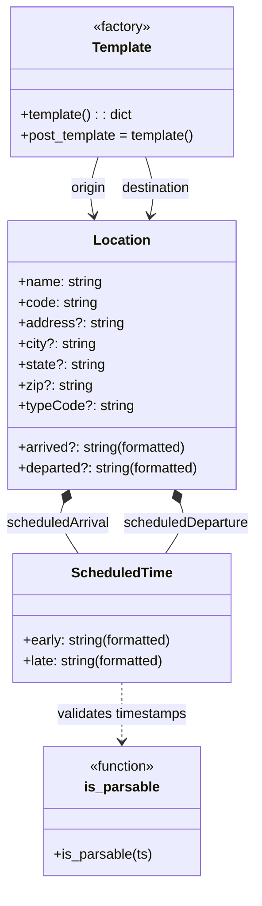

# Diagram: entity_core/entity_service/entity_service/trip_leg/trip_leg/json_templates/post.py

> Auto-generated by Obscura crawlers

## Mermaid

### SVG

<svg id="container" width="302.7186279296875" xmlns="http://www.w3.org/2000/svg" class="classDiagram" height="1024" viewBox="1.4531936645507812 0 302.7186279296875 1024" role="graphics-document document" aria-roledescription="class"><g><defs><marker id="container_class-aggregationStart" class="marker aggregation class" refX="18" refY="7" markerWidth="190" markerHeight="240" orient="auto"><path d="M 18,7 L9,13 L1,7 L9,1 Z"></path></marker></defs><defs><marker id="container_class-aggregationEnd" class="marker aggregation class" refX="1" refY="7" markerWidth="20" markerHeight="28" orient="auto"><path d="M 18,7 L9,13 L1,7 L9,1 Z"></path></marker></defs><defs><marker id="container_class-extensionStart" class="marker extension class" refX="18" refY="7" markerWidth="190" markerHeight="240" orient="auto"><path d="M 1,7 L18,13 V 1 Z"></path></marker></defs><defs><marker id="container_class-extensionEnd" class="marker extension class" refX="1" refY="7" markerWidth="20" markerHeight="28" orient="auto"><path d="M 1,1 V 13 L18,7 Z"></path></marker></defs><defs><marker id="container_class-compositionStart" class="marker composition class" refX="18" refY="7" markerWidth="190" markerHeight="240" orient="auto"><path d="M 18,7 L9,13 L1,7 L9,1 Z"></path></marker></defs><defs><marker id="container_class-compositionEnd" class="marker composition class" refX="1" refY="7" markerWidth="20" markerHeight="28" orient="auto"><path d="M 18,7 L9,13 L1,7 L9,1 Z"></path></marker></defs><defs><marker id="container_class-dependencyStart" class="marker dependency class" refX="6" refY="7" markerWidth="190" markerHeight="240" orient="auto"><path d="M 5,7 L9,13 L1,7 L9,1 Z"></path></marker></defs><defs><marker id="container_class-dependencyEnd" class="marker dependency class" refX="13" refY="7" markerWidth="20" markerHeight="28" orient="auto"><path d="M 18,7 L9,13 L14,7 L9,1 Z"></path></marker></defs><defs><marker id="container_class-lollipopStart" class="marker lollipop class" refX="13" refY="7" markerWidth="190" markerHeight="240" orient="auto"><circle stroke="black" fill="transparent" cx="7" cy="7" r="6"></circle></marker></defs><defs><marker id="container_class-lollipopEnd" class="marker lollipop class" refX="1" refY="7" markerWidth="190" markerHeight="240" orient="auto"><circle stroke="black" fill="transparent" cx="7" cy="7" r="6"></circle></marker></defs><g class="root"><g class="clusters"></g><g class="edgePaths"><path d="M117.334,182L115.277,188.167C113.221,194.333,109.109,206.667,108.164,218.022C107.219,229.378,109.443,239.755,110.554,244.944L111.666,250.133" id="id_Template_Location_1" class="edge-thickness-normal edge-pattern-solid relation" style=";;;" data-edge="true" data-et="edge" data-id="id_Template_Location_1" data-points="W3sieCI6MTE3LjMzMzcwMDg1Njg1NDg1LCJ5IjoxODJ9LHsieCI6MTA0Ljk5NjA5Mzc1LCJ5IjoyMTl9LHsieCI6MTEyLjkyMjg0NjUwMjU5MDY3LCJ5IjoyNTZ9XQ==" marker-end="url(#container_class-dependencyEnd)"></path><path d="M175.354,182L177.41,188.167C179.466,194.333,183.579,206.667,184.523,218.022C185.468,229.378,183.245,239.755,182.133,244.944L181.022,250.133" id="id_Template_Location_2" class="edge-thickness-normal edge-pattern-solid relation" style=";;;" data-edge="true" data-et="edge" data-id="id_Template_Location_2" data-points="W3sieCI6MTc1LjM1Mzc5OTE0MzE0NTE1LCJ5IjoxODJ9LHsieCI6MTg3LjY5MTQwNjI1LCJ5IjoyMTl9LHsieCI6MTc5Ljc2NDY1MzQ5NzQwOTMsInkiOjI1Nn1d" marker-end="url(#container_class-dependencyEnd)"></path><path d="M77.356,584.01L75.953,587.509C74.55,591.007,71.744,598.003,74.603,607.668C77.461,617.333,85.985,629.667,90.247,635.833L94.509,642" id="id_Location_ScheduledTime_3" class="edge-thickness-normal edge-pattern-solid relation" style=";;;" data-edge="true" data-et="edge" data-id="id_Location_ScheduledTime_3" data-points="W3sieCI6ODMuNzc3MDQwMTU1NDQwNDIsInkiOjU2OH0seyJ4Ijo2OC45Mzc1LCJ5Ijo2MDV9LHsieCI6OTQuNTA5MjA3NTg5Mjg1NzIsInkiOjY0Mn1d" marker-start="url(#container_class-compositionStart)"></path><path d="M215.332,584.01L216.735,587.509C218.138,591.007,220.944,598.003,218.085,607.668C215.226,617.333,206.702,629.667,202.44,635.833L198.178,642" id="id_Location_ScheduledTime_4" class="edge-thickness-normal edge-pattern-solid relation" style=";;;" data-edge="true" data-et="edge" data-id="id_Location_ScheduledTime_4" data-points="W3sieCI6MjA4LjkxMDQ1OTg0NDU1OTU3LCJ5Ijo1Njh9LHsieCI6MjIzLjc1LCJ5Ijo2MDV9LHsieCI6MTk4LjE3ODI5MjQxMDcxNDI4LCJ5Ijo2NDJ9XQ==" marker-start="url(#container_class-compositionStart)"></path><path d="M146.344,792L146.344,798.167C146.344,804.333,146.344,816.667,146.344,828C146.344,839.333,146.344,849.667,146.344,854.833L146.344,860" id="id_ScheduledTime_is_parsable_5" class="edge-thickness-normal edge-pattern-dashed relation" style=";;;" data-edge="true" data-et="edge" data-id="id_ScheduledTime_is_parsable_5" data-points="W3sieCI6MTQ2LjM0Mzc1LCJ5Ijo3OTJ9LHsieCI6MTQ2LjM0Mzc1LCJ5Ijo4Mjl9LHsieCI6MTQ2LjM0Mzc1LCJ5Ijo4NjZ9XQ==" marker-end="url(#container_class-dependencyEnd)"></path></g><g class="edgeLabels"><g class="edgeLabel" transform="translate(105.18007, 218.44826)"><g class="label" data-id="id_Template_Location_1" transform="translate(-21.125, -12)"><foreignObject width="42.25" height="24">

origin

</foreignObject></g></g><g class="edgeLabel" transform="translate(187.69140625, 219)"><g class="label" data-id="id_Template_Location_2" transform="translate(-41.5703125, -12)"><foreignObject width="83.140625" height="24">

destination

</foreignObject></g></g><g class="edgeLabel" transform="translate(70.39069, 607.10263)"><g class="label" data-id="id_Location_ScheduledTime_3" transform="translate(-60.9375, -12)"><foreignObject width="121.875" height="24">

scheduledArrival

</foreignObject></g></g><g class="edgeLabel" transform="translate(222.29681, 607.10263)"><g class="label" data-id="id_Location_ScheduledTime_4" transform="translate(-73.875, -12)"><foreignObject width="147.75" height="24">

scheduledDeparture

</foreignObject></g></g><g class="edgeLabel" transform="translate(146.34375, 829)"><g class="label" data-id="id_ScheduledTime_is_parsable_5" transform="translate(-77.4296875, -12)"><foreignObject width="154.859375" height="24">

validates timestamps

</foreignObject></g></g></g><g class="nodes"><g class="node default" id="classId-is_parsable-0" transform="translate(146.34375, 941)"><g class="basic label-container"><path d="M-90.21875 -75 L90.21875 -75 L90.21875 75 L-90.21875 75" stroke="none" stroke-width="0" fill="#ECECFF" style=""></path><path d="M-90.21875 -75 C-18.542957949283945 -75, 53.13283410143211 -75, 90.21875 -75 M-90.21875 -75 C-54.037093875362 -75, -17.855437750723993 -75, 90.21875 -75 M90.21875 -75 C90.21875 -40.98850341556905, 90.21875 -6.977006831138098, 90.21875 75 M90.21875 -75 C90.21875 -30.073831809156516, 90.21875 14.852336381686968, 90.21875 75 M90.21875 75 C33.688243313894645 75, -22.84226337221071 75, -90.21875 75 M90.21875 75 C32.8257050349345 75, -24.567339930131 75, -90.21875 75 M-90.21875 75 C-90.21875 29.383769695354836, -90.21875 -16.232460609290328, -90.21875 -75 M-90.21875 75 C-90.21875 17.74197654697152, -90.21875 -39.51604690605696, -90.21875 -75" stroke="#9370DB" stroke-width="1.3" fill="none" stroke-dasharray="0 0" style=""></path></g><g class="annotation-group text" transform="translate(-39.484375, -51)"><g class="label" style="" transform="translate(0,-12)"><foreignObject width="78.96875" height="24">

«function»

</foreignObject></g></g><g class="label-group text" transform="translate(-42.015625, -27)"><g class="label" style="font-weight: bolder" transform="translate(0,-12)"><foreignObject width="84.03125" height="24">

is_parsable

</foreignObject></g></g><g class="members-group text" transform="translate(-78.21875, 21)"></g><g class="methods-group text" transform="translate(-78.21875, 51)"><g class="label" style="" transform="translate(0,-12)"><foreignObject width="114.421875" height="24">

+is_parsable(ts)

</foreignObject></g></g><g class="divider" style=""><path d="M-90.21875 -3 C-20.822536365086776 -3, 48.57367726982645 -3, 90.21875 -3 M-90.21875 -3 C-23.200298888494558 -3, 43.818152223010884 -3, 90.21875 -3" stroke="#9370DB" stroke-width="1.3" fill="none" stroke-dasharray="0 0" style=""></path></g><g class="divider" style=""><path d="M-90.21875 21 C-51.93315647635561 21, -13.647562952711226 21, 90.21875 21 M-90.21875 21 C-43.270049773998146 21, 3.6786504520037084 21, 90.21875 21" stroke="#9370DB" stroke-width="1.3" fill="none" stroke-dasharray="0 0" style=""></path></g></g><g class="node default" id="classId-Template-1" transform="translate(146.34375, 95)"><g class="basic label-container"><path d="M-131.64453125 -87 L131.64453125 -87 L131.64453125 87 L-131.64453125 87" stroke="none" stroke-width="0" fill="#ECECFF" style=""></path><path d="M-131.64453125 -87 C-66.15539490088473 -87, -0.6662585517694595 -87, 131.64453125 -87 M-131.64453125 -87 C-57.25250375951214 -87, 17.139523730975725 -87, 131.64453125 -87 M131.64453125 -87 C131.64453125 -45.815436388738625, 131.64453125 -4.630872777477251, 131.64453125 87 M131.64453125 -87 C131.64453125 -20.13030788723769, 131.64453125 46.73938422552462, 131.64453125 87 M131.64453125 87 C43.864341344725446 87, -43.91584856054911 87, -131.64453125 87 M131.64453125 87 C46.40521103366905 87, -38.834109182661905 87, -131.64453125 87 M-131.64453125 87 C-131.64453125 26.14828726064016, -131.64453125 -34.70342547871968, -131.64453125 -87 M-131.64453125 87 C-131.64453125 40.0879879178005, -131.64453125 -6.824024164399006, -131.64453125 -87" stroke="#9370DB" stroke-width="1.3" fill="none" stroke-dasharray="0 0" style=""></path></g><g class="annotation-group text" transform="translate(-34.2734375, -63)"><g class="label" style="" transform="translate(0,-12)"><foreignObject width="68.546875" height="24">

«factory»

</foreignObject></g></g><g class="label-group text" transform="translate(-33.9140625, -39)"><g class="label" style="font-weight: bolder" transform="translate(0,-12)"><foreignObject width="67.828125" height="24">

Template

</foreignObject></g></g><g class="members-group text" transform="translate(-119.64453125, 9)"></g><g class="methods-group text" transform="translate(-119.64453125, 39)"><g class="label" style="" transform="translate(0,-12)"><foreignObject width="131.21875" height="24">

+template() : : dict

</foreignObject></g><g class="label" style="" transform="translate(0,12)"><foreignObject width="205.015625" height="24">

+post_template = template()

</foreignObject></g></g><g class="divider" style=""><path d="M-131.64453125 -15 C-42.62603395429181 -15, 46.392463341416374 -15, 131.64453125 -15 M-131.64453125 -15 C-31.004581128568645 -15, 69.63536899286271 -15, 131.64453125 -15" stroke="#9370DB" stroke-width="1.3" fill="none" stroke-dasharray="0 0" style=""></path></g><g class="divider" style=""><path d="M-131.64453125 9 C-74.42139340475495 9, -17.19825555950989 9, 131.64453125 9 M-131.64453125 9 C-53.006133315531685 9, 25.63226461893663 9, 131.64453125 9" stroke="#9370DB" stroke-width="1.3" fill="none" stroke-dasharray="0 0" style=""></path></g></g><g class="node default" id="classId-Location-2" transform="translate(146.34375, 412)"><g class="basic label-container"><path d="M-134.91796875 -156 L134.91796875 -156 L134.91796875 156 L-134.91796875 156" stroke="none" stroke-width="0" fill="#ECECFF" style=""></path><path d="M-134.91796875 -156 C-68.61066652136088 -156, -2.303364292721767 -156, 134.91796875 -156 M-134.91796875 -156 C-64.23269736075031 -156, 6.452574028499384 -156, 134.91796875 -156 M134.91796875 -156 C134.91796875 -65.62381357082714, 134.91796875 24.752372858345723, 134.91796875 156 M134.91796875 -156 C134.91796875 -48.28441334527432, 134.91796875 59.43117330945137, 134.91796875 156 M134.91796875 156 C37.03705542262156 156, -60.843857904756874 156, -134.91796875 156 M134.91796875 156 C46.892866873539035 156, -41.13223500292193 156, -134.91796875 156 M-134.91796875 156 C-134.91796875 47.40295750283998, -134.91796875 -61.194084994320036, -134.91796875 -156 M-134.91796875 156 C-134.91796875 46.31506841479637, -134.91796875 -63.36986317040726, -134.91796875 -156" stroke="#9370DB" stroke-width="1.3" fill="none" stroke-dasharray="0 0" style=""></path></g><g class="annotation-group text" transform="translate(0, -132)"></g><g class="label-group text" transform="translate(-31.3515625, -132)"><g class="label" style="font-weight: bolder" transform="translate(0,-12)"><foreignObject width="62.703125" height="24">

Location

</foreignObject></g></g><g class="members-group text" transform="translate(-122.91796875, -84)"><g class="label" style="" transform="translate(0,-12)"><foreignObject width="98.21875" height="24">

+name: string

</foreignObject></g><g class="label" style="" transform="translate(0,12)"><foreignObject width="92.65625" height="24">

+code: string

</foreignObject></g><g class="label" style="" transform="translate(0,36)"><foreignObject width="121.375" height="24">

+address?: string

</foreignObject></g><g class="label" style="" transform="translate(0,60)"><foreignObject width="90.296875" height="24">

+city?: string

</foreignObject></g><g class="label" style="" transform="translate(0,84)"><foreignObject width="100.5" height="24">

+state?: string

</foreignObject></g><g class="label" style="" transform="translate(0,108)"><foreignObject width="84.9375" height="24">

+zip?: string

</foreignObject></g><g class="label" style="" transform="translate(0,132)"><foreignObject width="132.390625" height="24">

+typeCode?: string

</foreignObject></g></g><g class="methods-group text" transform="translate(-122.91796875, 108)"><g class="label" style="" transform="translate(0,-12)"><foreignObject width="199.578125" height="24">

+arrived?: string(formatted)

</foreignObject></g><g class="label" style="" transform="translate(0,12)"><foreignObject width="214.484375" height="24">

+departed?: string(formatted)

</foreignObject></g></g><g class="divider" style=""><path d="M-134.91796875 -108 C-48.90207969505539 -108, 37.11380935988922 -108, 134.91796875 -108 M-134.91796875 -108 C-70.92556782169724 -108, -6.933166893394485 -108, 134.91796875 -108" stroke="#9370DB" stroke-width="1.3" fill="none" stroke-dasharray="0 0" style=""></path></g><g class="divider" style=""><path d="M-134.91796875 84 C-29.35656813087904 84, 76.20483248824192 84, 134.91796875 84 M-134.91796875 84 C-29.246101292324866 84, 76.42576616535027 84, 134.91796875 84" stroke="#9370DB" stroke-width="1.3" fill="none" stroke-dasharray="0 0" style=""></path></g></g><g class="node default" id="classId-ScheduledTime-3" transform="translate(146.34375, 717)"><g class="basic label-container"><path d="M-128.421875 -75 L128.421875 -75 L128.421875 75 L-128.421875 75" stroke="none" stroke-width="0" fill="#ECECFF" style=""></path><path d="M-128.421875 -75 C-26.469233437107235 -75, 75.48340812578553 -75, 128.421875 -75 M-128.421875 -75 C-35.29226984461063 -75, 57.83733531077874 -75, 128.421875 -75 M128.421875 -75 C128.421875 -30.204268951718277, 128.421875 14.591462096563447, 128.421875 75 M128.421875 -75 C128.421875 -32.35218953286282, 128.421875 10.295620934274353, 128.421875 75 M128.421875 75 C29.15232787184314 75, -70.11721925631372 75, -128.421875 75 M128.421875 75 C39.01019942930675 75, -50.401476141386496 75, -128.421875 75 M-128.421875 75 C-128.421875 36.356200458291234, -128.421875 -2.2875990834175326, -128.421875 -75 M-128.421875 75 C-128.421875 24.105366842680084, -128.421875 -26.789266314639832, -128.421875 -75" stroke="#9370DB" stroke-width="1.3" fill="none" stroke-dasharray="0 0" style=""></path></g><g class="annotation-group text" transform="translate(0, -51)"></g><g class="label-group text" transform="translate(-56.125, -51)"><g class="label" style="font-weight: bolder" transform="translate(0,-12)"><foreignObject width="112.25" height="24">

ScheduledTime

</foreignObject></g></g><g class="members-group text" transform="translate(-116.421875, -3)"></g><g class="methods-group text" transform="translate(-116.421875, 27)"><g class="label" style="" transform="translate(0,-12)"><foreignObject width="176.71875" height="24">

+early: string(formatted)

</foreignObject></g><g class="label" style="" transform="translate(0,12)"><foreignObject width="168.375" height="24">

+late: string(formatted)

</foreignObject></g></g><g class="divider" style=""><path d="M-128.421875 -27 C-47.12111245851567 -27, 34.179650082968664 -27, 128.421875 -27 M-128.421875 -27 C-69.31124815323179 -27, -10.200621306463574 -27, 128.421875 -27" stroke="#9370DB" stroke-width="1.3" fill="none" stroke-dasharray="0 0" style=""></path></g><g class="divider" style=""><path d="M-128.421875 -3 C-75.37722654327358 -3, -22.33257808654716 -3, 128.421875 -3 M-128.421875 -3 C-46.59197966549239 -3, 35.23791566901522 -3, 128.421875 -3" stroke="#9370DB" stroke-width="1.3" fill="none" stroke-dasharray="0 0" style=""></path></g></g></g></g></g></svg>
