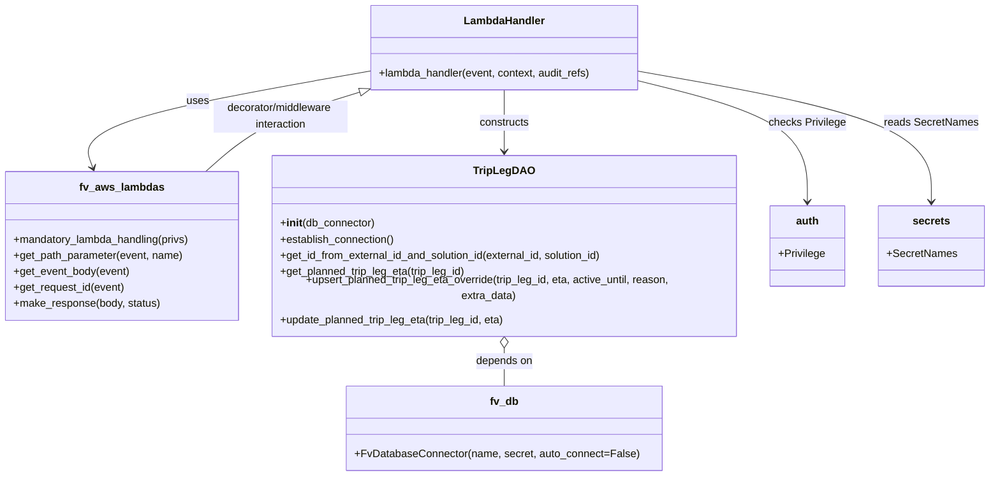

# Diagram: entity_core/entity_service/entity_service/trip_leg/trip_leg/override_planned_trip_leg_eta.py


> Auto-generated by Obscura crawlers

## Diagram 1

```mermaid
flowchart TD
    Event[Lambda Event] --> PathSol[get_path_parameter("solution_id")]
    Event --> PathLeg[get_path_parameter("planned_trip_leg_id")]
    Event --> Body[get_event_body(event)]
    Body --> Extract[extract eta, activeUntil, reason]
    Extract --> ParseEta{eta valid ISO format?}
    ParseEta -- No --> RespEta[make_response({"message":"Invalid eta provided"}, 400)]
    ParseEta -- Yes --> CheckActive{activeUntil provided?}
    CheckActive -- Yes --> ParseActive{activeUntil valid ISO format?}
    ParseActive -- No --> RespActive[make_response({"message":"Invalid activeUntil provided"}, 400)]
    ParseActive -- Yes --> Continue[proceed]
    CheckActive -- No --> Continue
    Continue --> InitDAO[TripLegDAO(DB_CONN)]
    InitDAO --> Establish[establish_connection()]
    Establish --> GetID[get_id_from_external_id_and_solution_id(external_planned_trip_leg_id, solution_id)]
    GetID --> IDCheck{trip_leg_id is None?}
    IDCheck -- Yes --> RespInvalidID[make_response({"message":"Invalid planned_trip_leg_id provided"}, 400)]
    IDCheck -- No --> GetOriginalETA[get_planned_trip_leg_eta(trip_leg_id)]
    GetOriginalETA --> ReqID[get_request_id(event)]
    ReqID --> ExtraData[build extra_data(original_eta, request_id)]
    ExtraData --> Upsert[upsert_planned_trip_leg_eta_override(trip_leg_id, eta, active_until, reason, extra_data)]
    Upsert --> Update[update_planned_trip_leg_eta(trip_leg_id, eta)]
    Update --> Resp204[make_response(None, 204)]
```

> SVG rendering failed for this diagram.

## Diagram 2



### SVG

<svg id="container" width="1488.390625" xmlns="http://www.w3.org/2000/svg" class="classDiagram" height="686" viewBox="0 0 1488.390625 686" role="graphics-document document" aria-roledescription="class"><style>#container{font-family:"trebuchet ms",verdana,arial,sans-serif;font-size:16px;fill:#333;}@keyframes edge-animation-frame{from{stroke-dashoffset:0;}}@keyframes dash{to{stroke-dashoffset:0;}}#container .edge-animation-slow{stroke-dasharray:9,5!important;stroke-dashoffset:900;animation:dash 50s linear infinite;stroke-linecap:round;}#container .edge-animation-fast{stroke-dasharray:9,5!important;stroke-dashoffset:900;animation:dash 20s linear infinite;stroke-linecap:round;}#container .error-icon{fill:#552222;}#container .error-text{fill:#552222;stroke:#552222;}#container .edge-thickness-normal{stroke-width:1px;}#container .edge-thickness-thick{stroke-width:3.5px;}#container .edge-pattern-solid{stroke-dasharray:0;}#container .edge-thickness-invisible{stroke-width:0;fill:none;}#container .edge-pattern-dashed{stroke-dasharray:3;}#container .edge-pattern-dotted{stroke-dasharray:2;}#container .marker{fill:#333333;stroke:#333333;}#container .marker.cross{stroke:#333333;}#container svg{font-family:"trebuchet ms",verdana,arial,sans-serif;font-size:16px;}#container p{margin:0;}#container g.classGroup text{fill:#9370DB;stroke:none;font-family:"trebuchet ms",verdana,arial,sans-serif;font-size:10px;}#container g.classGroup text .title{font-weight:bolder;}#container .nodeLabel,#container .edgeLabel{color:#131300;}#container .edgeLabel .label rect{fill:#ECECFF;}#container .label text{fill:#131300;}#container .labelBkg{background:#ECECFF;}#container .edgeLabel .label span{background:#ECECFF;}#container .classTitle{font-weight:bolder;}#container .node rect,#container .node circle,#container .node ellipse,#container .node polygon,#container .node path{fill:#ECECFF;stroke:#9370DB;stroke-width:1px;}#container .divider{stroke:#9370DB;stroke-width:1;}#container g.clickable{cursor:pointer;}#container g.classGroup rect{fill:#ECECFF;stroke:#9370DB;}#container g.classGroup line{stroke:#9370DB;stroke-width:1;}#container .classLabel .box{stroke:none;stroke-width:0;fill:#ECECFF;opacity:0.5;}#container .classLabel .label{fill:#9370DB;font-size:10px;}#container .relation{stroke:#333333;stroke-width:1;fill:none;}#container .dashed-line{stroke-dasharray:3;}#container .dotted-line{stroke-dasharray:1 2;}#container #compositionStart,#container .composition{fill:#333333!important;stroke:#333333!important;stroke-width:1;}#container #compositionEnd,#container .composition{fill:#333333!important;stroke:#333333!important;stroke-width:1;}#container #dependencyStart,#container .dependency{fill:#333333!important;stroke:#333333!important;stroke-width:1;}#container #dependencyStart,#container .dependency{fill:#333333!important;stroke:#333333!important;stroke-width:1;}#container #extensionStart,#container .extension{fill:transparent!important;stroke:#333333!important;stroke-width:1;}#container #extensionEnd,#container .extension{fill:transparent!important;stroke:#333333!important;stroke-width:1;}#container #aggregationStart,#container .aggregation{fill:transparent!important;stroke:#333333!important;stroke-width:1;}#container #aggregationEnd,#container .aggregation{fill:transparent!important;stroke:#333333!important;stroke-width:1;}#container #lollipopStart,#container .lollipop{fill:#ECECFF!important;stroke:#333333!important;stroke-width:1;}#container #lollipopEnd,#container .lollipop{fill:#ECECFF!important;stroke:#333333!important;stroke-width:1;}#container .edgeTerminals{font-size:11px;line-height:initial;}#container .classTitleText{text-anchor:middle;font-size:18px;fill:#333;}#container .label-icon{display:inline-block;height:1em;overflow:visible;vertical-align:-0.125em;}#container .node .label-icon path{fill:currentColor;stroke:revert;stroke-width:revert;}#container :root{--mermaid-font-family:"trebuchet ms",verdana,arial,sans-serif;}</style><g><defs><marker id="container_class-aggregationStart" class="marker aggregation class" refX="18" refY="7" markerWidth="190" markerHeight="240" orient="auto"><path d="M 18,7 L9,13 L1,7 L9,1 Z"></path></marker></defs><defs><marker id="container_class-aggregationEnd" class="marker aggregation class" refX="1" refY="7" markerWidth="20" markerHeight="28" orient="auto"><path d="M 18,7 L9,13 L1,7 L9,1 Z"></path></marker></defs><defs><marker id="container_class-extensionStart" class="marker extension class" refX="18" refY="7" markerWidth="190" markerHeight="240" orient="auto"><path d="M 1,7 L18,13 V 1 Z"></path></marker></defs><defs><marker id="container_class-extensionEnd" class="marker extension class" refX="1" refY="7" markerWidth="20" markerHeight="28" orient="auto"><path d="M 1,1 V 13 L18,7 Z"></path></marker></defs><defs><marker id="container_class-compositionStart" class="marker composition class" refX="18" refY="7" markerWidth="190" markerHeight="240" orient="auto"><path d="M 18,7 L9,13 L1,7 L9,1 Z"></path></marker></defs><defs><marker id="container_class-compositionEnd" class="marker composition class" refX="1" refY="7" markerWidth="20" markerHeight="28" orient="auto"><path d="M 18,7 L9,13 L1,7 L9,1 Z"></path></marker></defs><defs><marker id="container_class-dependencyStart" class="marker dependency class" refX="6" refY="7" markerWidth="190" markerHeight="240" orient="auto"><path d="M 5,7 L9,13 L1,7 L9,1 Z"></path></marker></defs><defs><marker id="container_class-dependencyEnd" class="marker dependency class" refX="13" refY="7" markerWidth="20" markerHeight="28" orient="auto"><path d="M 18,7 L9,13 L14,7 L9,1 Z"></path></marker></defs><defs><marker id="container_class-lollipopStart" class="marker lollipop class" refX="13" refY="7" markerWidth="190" markerHeight="240" orient="auto"><circle stroke="black" fill="transparent" cx="7" cy="7" r="6"></circle></marker></defs><defs><marker id="container_class-lollipopEnd" class="marker lollipop class" refX="1" refY="7" markerWidth="190" markerHeight="240" orient="auto"><circle stroke="black" fill="transparent" cx="7" cy="7" r="6"></circle></marker></defs><g class="root"><g class="clusters"></g><g class="edgePaths"><path d="M561.301,105.921L487.007,118.767C412.712,131.614,264.124,157.307,193.495,179.391C122.865,201.474,130.196,219.949,133.861,229.186L137.526,238.423" id="id_LambdaHandler_fv_aws_lambdas_1" class="edge-thickness-normal edge-pattern-solid relation" style=";;;" data-edge="true" data-et="edge" data-id="id_LambdaHandler_fv_aws_lambdas_1" data-points="W3sieCI6NTYxLjMwMDc4MTI1LCJ5IjoxMDUuOTIwNjM0OTIwNjM0OTF9LHsieCI6MTE1LjUzNTE1NjI1LCJ5IjoxODN9LHsieCI6MTM5LjczODcxMjc1NDM2MDQ1LCJ5IjoyNDR9XQ==" marker-end="url(#container_class-dependencyEnd)"></path><path d="M763.254,134L763.254,142.167C763.254,150.333,763.254,166.667,763.254,182C763.254,197.333,763.254,211.667,763.254,218.833L763.254,226" id="id_LambdaHandler_TripLegDAO_2" class="edge-thickness-normal edge-pattern-solid relation" style=";;;" data-edge="true" data-et="edge" data-id="id_LambdaHandler_TripLegDAO_2" data-points="W3sieCI6NzYzLjI1MzkwNjI1LCJ5IjoxMzR9LHsieCI6NzYzLjI1MzkwNjI1LCJ5IjoxODN9LHsieCI6NzYzLjI1MzkwNjI1LCJ5IjoyMzJ9XQ==" marker-end="url(#container_class-dependencyEnd)"></path><path d="M965.207,120.267L1008.065,130.723C1050.923,141.178,1136.639,162.089,1179.497,190.211C1222.355,218.333,1222.355,253.667,1222.355,271.333L1222.355,289" id="id_LambdaHandler_auth_3" class="edge-thickness-normal edge-pattern-solid relation" style=";;;" data-edge="true" data-et="edge" data-id="id_LambdaHandler_auth_3" data-points="W3sieCI6OTY1LjIwNzAzMTI1LCJ5IjoxMjAuMjY3NDIxMDgzOTc4NTZ9LHsieCI6MTIyMi4zNTU0Njg3NSwieSI6MTgzfSx7IngiOjEyMjIuMzU1NDY4NzUsInkiOjI5NX1d" marker-end="url(#container_class-dependencyEnd)"></path><path d="M965.207,106.296L1038.352,119.08C1111.497,131.864,1257.788,157.432,1330.933,187.883C1404.078,218.333,1404.078,253.667,1404.078,271.333L1404.078,289" id="id_LambdaHandler_secrets_4" class="edge-thickness-normal edge-pattern-solid relation" style=";;;" data-edge="true" data-et="edge" data-id="id_LambdaHandler_secrets_4" data-points="W3sieCI6OTY1LjIwNzAzMTI1LCJ5IjoxMDYuMjk2MzQwNzcyMDc2OTd9LHsieCI6MTQwNC4wNzgxMjUsInkiOjE4M30seyJ4IjoxNDA0LjA3ODEyNSwieSI6Mjk1fV0=" marker-end="url(#container_class-dependencyEnd)"></path><path d="M763.254,495.25L763.254,498.542C763.254,501.833,763.254,508.417,763.254,517.875C763.254,527.333,763.254,539.667,763.254,545.833L763.254,552" id="id_TripLegDAO_fv_db_5" class="edge-thickness-normal edge-pattern-solid relation" style=";;;" data-edge="true" data-et="edge" data-id="id_TripLegDAO_fv_db_5" data-points="W3sieCI6NzYzLjI1MzkwNjI1LCJ5Ijo0Nzh9LHsieCI6NzYzLjI1MzkwNjI1LCJ5Ijo1MTV9LHsieCI6NzYzLjI1MzkwNjI1LCJ5Ijo1NTJ9XQ==" marker-start="url(#container_class-aggregationStart)"></path><path d="M319.83,244L332.291,233.833C344.752,223.667,369.674,203.333,407.168,185.561C444.662,167.79,494.729,152.579,519.762,144.974L544.796,137.369" id="id_fv_aws_lambdas_LambdaHandler_6" class="edge-thickness-normal edge-pattern-solid relation" style=";;;" data-edge="true" data-et="edge" data-id="id_fv_aws_lambdas_LambdaHandler_6" data-points="W3sieCI6MzE5LjgzMDExMjE5MTEzMzcsInkiOjI0NH0seyJ4IjozOTQuNTk1NzAzMTI1LCJ5IjoxODN9LHsieCI6NTYxLjMwMDc4MTI1LCJ5IjoxMzIuMzU0MjU2NjIxMDg2ODJ9XQ==" marker-end="url(#container_class-extensionEnd)"></path></g><g class="edgeLabels"><g class="edgeLabel" transform="translate(306.08463, 150.05122)"><g class="label" data-id="id_LambdaHandler_fv_aws_lambdas_1" transform="translate(-16.4921875, -12)"><foreignObject width="32.984375" height="24"><div xmlns="http://www.w3.org/1999/xhtml" class="labelBkg" style="display: table-cell; white-space: nowrap; line-height: 1.5; max-width: 200px; text-align: center;"><span class="edgeLabel"><p>uses</p></span></div></foreignObject></g></g><g class="edgeLabel" transform="translate(763.25390625, 183)"><g class="label" data-id="id_LambdaHandler_TripLegDAO_2" transform="translate(-37.84375, -12)"><foreignObject width="75.6875" height="24"><div xmlns="http://www.w3.org/1999/xhtml" class="labelBkg" style="display: table-cell; white-space: nowrap; line-height: 1.5; max-width: 200px; text-align: center;"><span class="edgeLabel"><p>constructs</p></span></div></foreignObject></g></g><g class="edgeLabel" transform="translate(1222.35546875, 183)"><g class="label" data-id="id_LambdaHandler_auth_3" transform="translate(-57.6953125, -12)"><foreignObject width="115.390625" height="24"><div xmlns="http://www.w3.org/1999/xhtml" class="labelBkg" style="display: table-cell; white-space: nowrap; line-height: 1.5; max-width: 200px; text-align: center;"><span class="edgeLabel"><p>checks Privilege</p></span></div></foreignObject></g></g><g class="edgeLabel" transform="translate(1404.078125, 183)"><g class="label" data-id="id_LambdaHandler_secrets_4" transform="translate(-69.53125, -12)"><foreignObject width="139.0625" height="24"><div xmlns="http://www.w3.org/1999/xhtml" class="labelBkg" style="display: table-cell; white-space: nowrap; line-height: 1.5; max-width: 200px; text-align: center;"><span class="edgeLabel"><p>reads SecretNames</p></span></div></foreignObject></g></g><g class="edgeLabel" transform="translate(763.25390625, 515)"><g class="label" data-id="id_TripLegDAO_fv_db_5" transform="translate(-42.9453125, -12)"><foreignObject width="85.890625" height="24"><div xmlns="http://www.w3.org/1999/xhtml" class="labelBkg" style="display: table-cell; white-space: nowrap; line-height: 1.5; max-width: 200px; text-align: center;"><span class="edgeLabel"><p>depends on</p></span></div></foreignObject></g></g><g class="edgeLabel" transform="translate(431.78511, 171.70169)"><g class="label" data-id="id_fv_aws_lambdas_LambdaHandler_6" transform="translate(-100, -24)"><foreignObject width="200" height="48"><div xmlns="http://www.w3.org/1999/xhtml" class="labelBkg" style="display: table; white-space: break-spaces; line-height: 1.5; max-width: 200px; text-align: center; width: 200px;"><span class="edgeLabel"><p>decorator/middleware interaction</p></span></div></foreignObject></g></g></g><g class="nodes"><g class="node default" id="classId-LambdaHandler-0" transform="translate(763.25390625, 71)"><g class="basic label-container"><path d="M-201.953125 -63 L201.953125 -63 L201.953125 63 L-201.953125 63" stroke="none" stroke-width="0" fill="#ECECFF" style=""></path><path d="M-201.953125 -63 C-114.20125962959894 -63, -26.449394259197874 -63, 201.953125 -63 M-201.953125 -63 C-70.81001457723661 -63, 60.33309584552677 -63, 201.953125 -63 M201.953125 -63 C201.953125 -19.3276326352323, 201.953125 24.344734729535404, 201.953125 63 M201.953125 -63 C201.953125 -15.372125520589286, 201.953125 32.25574895882143, 201.953125 63 M201.953125 63 C58.54624883019875 63, -84.8606273396025 63, -201.953125 63 M201.953125 63 C56.17121812835924 63, -89.61068874328151 63, -201.953125 63 M-201.953125 63 C-201.953125 37.68621767392702, -201.953125 12.37243534785403, -201.953125 -63 M-201.953125 63 C-201.953125 12.764287883877742, -201.953125 -37.471424232244516, -201.953125 -63" stroke="#9370DB" stroke-width="1.3" fill="none" stroke-dasharray="0 0" style=""></path></g><g class="annotation-group text" transform="translate(0, -39)"></g><g class="label-group text" transform="translate(-58.21875, -39)"><g class="label" style="font-weight: bolder" transform="translate(0,-12)"><foreignObject width="116.4375" height="24"><div xmlns="http://www.w3.org/1999/xhtml" style="display: table-cell; white-space: nowrap; line-height: 1.5; max-width: 167px; text-align: center;"><span class="nodeLabel markdown-node-label" style=""><p>LambdaHandler</p></span></div></foreignObject></g></g><g class="members-group text" transform="translate(-189.953125, 9)"></g><g class="methods-group text" transform="translate(-189.953125, 39)"><g class="label" style="" transform="translate(0,-12)"><foreignObject width="321.6875" height="24"><div xmlns="http://www.w3.org/1999/xhtml" style="display: table-cell; white-space: nowrap; line-height: 1.5; max-width: 379px; text-align: center;"><span class="nodeLabel markdown-node-label" style=""><p>+lambda_handler(event, context, audit_refs)</p></span></div></foreignObject></g></g><g class="divider" style=""><path d="M-201.953125 -15 C-52.22333574531618 -15, 97.50645350936765 -15, 201.953125 -15 M-201.953125 -15 C-107.8422996095296 -15, -13.731474219059209 -15, 201.953125 -15" stroke="#9370DB" stroke-width="1.3" fill="none" stroke-dasharray="0 0" style=""></path></g><g class="divider" style=""><path d="M-201.953125 9 C-101.97052894773807 9, -1.987932895476149 9, 201.953125 9 M-201.953125 9 C-66.66818434279173 9, 68.61675631441653 9, 201.953125 9" stroke="#9370DB" stroke-width="1.3" fill="none" stroke-dasharray="0 0" style=""></path></g></g><g class="node default" id="classId-fv_aws_lambdas-1" transform="translate(183.78125, 355)"><g class="basic label-container"><path d="M-175.78125 -111 L175.78125 -111 L175.78125 111 L-175.78125 111" stroke="none" stroke-width="0" fill="#ECECFF" style=""></path><path d="M-175.78125 -111 C-95.14670161731078 -111, -14.512153234621564 -111, 175.78125 -111 M-175.78125 -111 C-54.384692975711076 -111, 67.01186404857785 -111, 175.78125 -111 M175.78125 -111 C175.78125 -34.4587214964596, 175.78125 42.082557007080794, 175.78125 111 M175.78125 -111 C175.78125 -28.447336549540694, 175.78125 54.10532690091861, 175.78125 111 M175.78125 111 C101.52442678325374 111, 27.26760356650749 111, -175.78125 111 M175.78125 111 C73.8455269248591 111, -28.0901961502818 111, -175.78125 111 M-175.78125 111 C-175.78125 29.690668044341578, -175.78125 -51.618663911316844, -175.78125 -111 M-175.78125 111 C-175.78125 48.17155929443213, -175.78125 -14.656881411135743, -175.78125 -111" stroke="#9370DB" stroke-width="1.3" fill="none" stroke-dasharray="0 0" style=""></path></g><g class="annotation-group text" transform="translate(0, -87)"></g><g class="label-group text" transform="translate(-60.0625, -87)"><g class="label" style="font-weight: bolder" transform="translate(0,-12)"><foreignObject width="120.125" height="24"><div xmlns="http://www.w3.org/1999/xhtml" style="display: table-cell; white-space: nowrap; line-height: 1.5; max-width: 168px; text-align: center;"><span class="nodeLabel markdown-node-label" style=""><p>fv_aws_lambdas</p></span></div></foreignObject></g></g><g class="members-group text" transform="translate(-163.78125, -39)"></g><g class="methods-group text" transform="translate(-163.78125, -9)"><g class="label" style="" transform="translate(0,-12)"><foreignObject width="267.5" height="24"><div xmlns="http://www.w3.org/1999/xhtml" style="display: table-cell; white-space: nowrap; line-height: 1.5; max-width: 325px; text-align: center;"><span class="nodeLabel markdown-node-label" style=""><p>+mandatory_lambda_handling(privs)</p></span></div></foreignObject></g><g class="label" style="" transform="translate(0,12)"><foreignObject width="254.984375" height="24"><div xmlns="http://www.w3.org/1999/xhtml" style="display: table-cell; white-space: nowrap; line-height: 1.5; max-width: 312px; text-align: center;"><span class="nodeLabel markdown-node-label" style=""><p>+get_path_parameter(event, name)</p></span></div></foreignObject></g><g class="label" style="" transform="translate(0,36)"><foreignObject width="174.203125" height="24"><div xmlns="http://www.w3.org/1999/xhtml" style="display: table-cell; white-space: nowrap; line-height: 1.5; max-width: 232px; text-align: center;"><span class="nodeLabel markdown-node-label" style=""><p>+get_event_body(event)</p></span></div></foreignObject></g><g class="label" style="" transform="translate(0,60)"><foreignObject width="167.234375" height="24"><div xmlns="http://www.w3.org/1999/xhtml" style="display: table-cell; white-space: nowrap; line-height: 1.5; max-width: 225px; text-align: center;"><span class="nodeLabel markdown-node-label" style=""><p>+get_request_id(event)</p></span></div></foreignObject></g><g class="label" style="" transform="translate(0,84)"><foreignObject width="219.96875" height="24"><div xmlns="http://www.w3.org/1999/xhtml" style="display: table-cell; white-space: nowrap; line-height: 1.5; max-width: 277px; text-align: center;"><span class="nodeLabel markdown-node-label" style=""><p>+make_response(body, status)</p></span></div></foreignObject></g></g><g class="divider" style=""><path d="M-175.78125 -63 C-75.36339077504947 -63, 25.054468449901066 -63, 175.78125 -63 M-175.78125 -63 C-83.41298537440586 -63, 8.955279251188273 -63, 175.78125 -63" stroke="#9370DB" stroke-width="1.3" fill="none" stroke-dasharray="0 0" style=""></path></g><g class="divider" style=""><path d="M-175.78125 -39 C-89.71578461626538 -39, -3.6503192325307623 -39, 175.78125 -39 M-175.78125 -39 C-79.37564286726747 -39, 17.029964265465054 -39, 175.78125 -39" stroke="#9370DB" stroke-width="1.3" fill="none" stroke-dasharray="0 0" style=""></path></g></g><g class="node default" id="classId-fv_db-2" transform="translate(763.25390625, 615)"><g class="basic label-container"><path d="M-231.17578125 -63 L231.17578125 -63 L231.17578125 63 L-231.17578125 63" stroke="none" stroke-width="0" fill="#ECECFF" style=""></path><path d="M-231.17578125 -63 C-123.5733215862207 -63, -15.9708619224414 -63, 231.17578125 -63 M-231.17578125 -63 C-102.81295634129776 -63, 25.549868567404474 -63, 231.17578125 -63 M231.17578125 -63 C231.17578125 -19.670098277228973, 231.17578125 23.659803445542053, 231.17578125 63 M231.17578125 -63 C231.17578125 -37.64916086172097, 231.17578125 -12.298321723441944, 231.17578125 63 M231.17578125 63 C98.47843320745213 63, -34.218914835095745 63, -231.17578125 63 M231.17578125 63 C133.20497976957608 63, 35.2341782891522 63, -231.17578125 63 M-231.17578125 63 C-231.17578125 22.73621554210066, -231.17578125 -17.527568915798682, -231.17578125 -63 M-231.17578125 63 C-231.17578125 36.78821537029245, -231.17578125 10.576430740584904, -231.17578125 -63" stroke="#9370DB" stroke-width="1.3" fill="none" stroke-dasharray="0 0" style=""></path></g><g class="annotation-group text" transform="translate(0, -39)"></g><g class="label-group text" transform="translate(-20.2890625, -39)"><g class="label" style="font-weight: bolder" transform="translate(0,-12)"><foreignObject width="40.578125" height="24"><div xmlns="http://www.w3.org/1999/xhtml" style="display: table-cell; white-space: nowrap; line-height: 1.5; max-width: 90px; text-align: center;"><span class="nodeLabel markdown-node-label" style=""><p>fv_db</p></span></div></foreignObject></g></g><g class="members-group text" transform="translate(-219.17578125, 9)"></g><g class="methods-group text" transform="translate(-219.17578125, 39)"><g class="label" style="" transform="translate(0,-12)"><foreignObject width="418.0625" height="24"><div xmlns="http://www.w3.org/1999/xhtml" style="display: table-cell; white-space: nowrap; line-height: 1.5; max-width: 475px; text-align: center;"><span class="nodeLabel markdown-node-label" style=""><p>+FvDatabaseConnector(name, secret, auto_connect=False)</p></span></div></foreignObject></g></g><g class="divider" style=""><path d="M-231.17578125 -15 C-88.43288737822948 -15, 54.31000649354104 -15, 231.17578125 -15 M-231.17578125 -15 C-77.4857110503819 -15, 76.20435914923621 -15, 231.17578125 -15" stroke="#9370DB" stroke-width="1.3" fill="none" stroke-dasharray="0 0" style=""></path></g><g class="divider" style=""><path d="M-231.17578125 9 C-69.64286848764274 9, 91.89004427471451 9, 231.17578125 9 M-231.17578125 9 C-113.43585096725387 9, 4.30407931549226 9, 231.17578125 9" stroke="#9370DB" stroke-width="1.3" fill="none" stroke-dasharray="0 0" style=""></path></g></g><g class="node default" id="classId-TripLegDAO-3" transform="translate(763.25390625, 355)"><g class="basic label-container"><path d="M-353.69140625 -123 L353.69140625 -123 L353.69140625 123 L-353.69140625 123" stroke="none" stroke-width="0" fill="#ECECFF" style=""></path><path d="M-353.69140625 -123 C-86.21895390201627 -123, 181.25349844596747 -123, 353.69140625 -123 M-353.69140625 -123 C-100.14299508777836 -123, 153.40541607444328 -123, 353.69140625 -123 M353.69140625 -123 C353.69140625 -42.01530078558865, 353.69140625 38.9693984288227, 353.69140625 123 M353.69140625 -123 C353.69140625 -49.06659400436787, 353.69140625 24.866811991264257, 353.69140625 123 M353.69140625 123 C158.93919257415433 123, -35.813021101691334 123, -353.69140625 123 M353.69140625 123 C133.81290538702424 123, -86.06559547595151 123, -353.69140625 123 M-353.69140625 123 C-353.69140625 61.00727103464147, -353.69140625 -0.985457930717061, -353.69140625 -123 M-353.69140625 123 C-353.69140625 38.2506505052731, -353.69140625 -46.4986989894538, -353.69140625 -123" stroke="#9370DB" stroke-width="1.3" fill="none" stroke-dasharray="0 0" style=""></path></g><g class="annotation-group text" transform="translate(0, -99)"></g><g class="label-group text" transform="translate(-42.3515625, -99)"><g class="label" style="font-weight: bolder" transform="translate(0,-12)"><foreignObject width="84.703125" height="24"><div xmlns="http://www.w3.org/1999/xhtml" style="display: table-cell; white-space: nowrap; line-height: 1.5; max-width: 133px; text-align: center;"><span class="nodeLabel markdown-node-label" style=""><p>TripLegDAO</p></span></div></foreignObject></g></g><g class="members-group text" transform="translate(-341.69140625, -51)"></g><g class="methods-group text" transform="translate(-341.69140625, -21)"><g class="label" style="" transform="translate(0,-12)"><foreignObject width="142.390625" height="24"><div xmlns="http://www.w3.org/1999/xhtml" style="display: table-cell; white-space: nowrap; line-height: 1.5; max-width: 231px; text-align: center;"><span class="nodeLabel markdown-node-label" style=""><p>+<strong>init</strong>(db_connector)</p></span></div></foreignObject></g><g class="label" style="" transform="translate(0,12)"><foreignObject width="173.265625" height="24"><div xmlns="http://www.w3.org/1999/xhtml" style="display: table-cell; white-space: nowrap; line-height: 1.5; max-width: 231px; text-align: center;"><span class="nodeLabel markdown-node-label" style=""><p>+establish_connection()</p></span></div></foreignObject></g><g class="label" style="" transform="translate(0,36)"><foreignObject width="493.484375" height="24"><div xmlns="http://www.w3.org/1999/xhtml" style="display: table-cell; white-space: nowrap; line-height: 1.5; max-width: 551px; text-align: center;"><span class="nodeLabel markdown-node-label" style=""><p>+get_id_from_external_id_and_solution_id(external_id, solution_id)</p></span></div></foreignObject></g><g class="label" style="" transform="translate(0,60)"><foreignObject width="281.625" height="24"><div xmlns="http://www.w3.org/1999/xhtml" style="display: table-cell; white-space: nowrap; line-height: 1.5; max-width: 339px; text-align: center;"><span class="nodeLabel markdown-node-label" style=""><p>+get_planned_trip_leg_eta(trip_leg_id)</p></span></div></foreignObject></g><g class="label" style="" transform="translate(0,84)"><foreignObject width="641.03125" height="24"><div xmlns="http://www.w3.org/1999/xhtml" style="display: table-cell; white-space: nowrap; line-height: 1.5; max-width: 698px; text-align: center;"><span class="nodeLabel markdown-node-label" style=""><p>+upsert_planned_trip_leg_eta_override(trip_leg_id, eta, active_until, reason, extra_data)</p></span></div></foreignObject></g><g class="label" style="" transform="translate(0,108)"><foreignObject width="341.25" height="24"><div xmlns="http://www.w3.org/1999/xhtml" style="display: table-cell; white-space: nowrap; line-height: 1.5; max-width: 399px; text-align: center;"><span class="nodeLabel markdown-node-label" style=""><p>+update_planned_trip_leg_eta(trip_leg_id, eta)</p></span></div></foreignObject></g></g><g class="divider" style=""><path d="M-353.69140625 -75 C-167.41640489927195 -75, 18.858596451456094 -75, 353.69140625 -75 M-353.69140625 -75 C-161.1583337710053 -75, 31.374738707989422 -75, 353.69140625 -75" stroke="#9370DB" stroke-width="1.3" fill="none" stroke-dasharray="0 0" style=""></path></g><g class="divider" style=""><path d="M-353.69140625 -51 C-111.35208204723759 -51, 130.98724215552483 -51, 353.69140625 -51 M-353.69140625 -51 C-128.83683471635248 -51, 96.01773681729503 -51, 353.69140625 -51" stroke="#9370DB" stroke-width="1.3" fill="none" stroke-dasharray="0 0" style=""></path></g></g><g class="node default" id="classId-auth-4" transform="translate(1222.35546875, 355)"><g class="basic label-container"><path d="M-55.41015625 -60 L55.41015625 -60 L55.41015625 60 L-55.41015625 60" stroke="none" stroke-width="0" fill="#ECECFF" style=""></path><path d="M-55.41015625 -60 C-13.23155809662859 -60, 28.94704005674282 -60, 55.41015625 -60 M-55.41015625 -60 C-31.110550333100125 -60, -6.81094441620025 -60, 55.41015625 -60 M55.41015625 -60 C55.41015625 -22.100671155985232, 55.41015625 15.798657688029536, 55.41015625 60 M55.41015625 -60 C55.41015625 -25.930729954143835, 55.41015625 8.13854009171233, 55.41015625 60 M55.41015625 60 C21.317057502273812 60, -12.776041245452376 60, -55.41015625 60 M55.41015625 60 C27.827965084047825 60, 0.24577391809565086 60, -55.41015625 60 M-55.41015625 60 C-55.41015625 12.011089647648198, -55.41015625 -35.9778207047036, -55.41015625 -60 M-55.41015625 60 C-55.41015625 29.78549902627783, -55.41015625 -0.42900194744434117, -55.41015625 -60" stroke="#9370DB" stroke-width="1.3" fill="none" stroke-dasharray="0 0" style=""></path></g><g class="annotation-group text" transform="translate(0, -36)"></g><g class="label-group text" transform="translate(-16.6640625, -36)"><g class="label" style="font-weight: bolder" transform="translate(0,-12)"><foreignObject width="33.328125" height="24"><div xmlns="http://www.w3.org/1999/xhtml" style="display: table-cell; white-space: nowrap; line-height: 1.5; max-width: 83px; text-align: center;"><span class="nodeLabel markdown-node-label" style=""><p>auth</p></span></div></foreignObject></g></g><g class="members-group text" transform="translate(-43.41015625, 12)"><g class="label" style="" transform="translate(0,-12)"><foreignObject width="70.15625" height="24"><div xmlns="http://www.w3.org/1999/xhtml" style="display: table-cell; white-space: nowrap; line-height: 1.5; max-width: 128px; text-align: center;"><span class="nodeLabel markdown-node-label" style=""><p>+Privilege</p></span></div></foreignObject></g></g><g class="methods-group text" transform="translate(-43.41015625, 60)"></g><g class="divider" style=""><path d="M-55.41015625 -12 C-29.61650423560478 -12, -3.8228522212095584 -12, 55.41015625 -12 M-55.41015625 -12 C-30.66144704989976 -12, -5.9127378497995196 -12, 55.41015625 -12" stroke="#9370DB" stroke-width="1.3" fill="none" stroke-dasharray="0 0" style=""></path></g><g class="divider" style=""><path d="M-55.41015625 36 C-16.32572232847962 36, 22.758711593040758 36, 55.41015625 36 M-55.41015625 36 C-25.604638835850423 36, 4.200878578299154 36, 55.41015625 36" stroke="#9370DB" stroke-width="1.3" fill="none" stroke-dasharray="0 0" style=""></path></g></g><g class="node default" id="classId-secrets-5" transform="translate(1404.078125, 355)"><g class="basic label-container"><path d="M-76.3125 -60 L76.3125 -60 L76.3125 60 L-76.3125 60" stroke="none" stroke-width="0" fill="#ECECFF" style=""></path><path d="M-76.3125 -60 C-32.99875559427981 -60, 10.314988811440386 -60, 76.3125 -60 M-76.3125 -60 C-37.17474266765515 -60, 1.9630146646896947 -60, 76.3125 -60 M76.3125 -60 C76.3125 -22.68011425103051, 76.3125 14.63977149793898, 76.3125 60 M76.3125 -60 C76.3125 -14.183950973892166, 76.3125 31.632098052215667, 76.3125 60 M76.3125 60 C41.64305273959817 60, 6.973605479196337 60, -76.3125 60 M76.3125 60 C16.388176237652566 60, -43.53614752469487 60, -76.3125 60 M-76.3125 60 C-76.3125 16.417279211728953, -76.3125 -27.165441576542094, -76.3125 -60 M-76.3125 60 C-76.3125 18.8722591130839, -76.3125 -22.2554817738322, -76.3125 -60" stroke="#9370DB" stroke-width="1.3" fill="none" stroke-dasharray="0 0" style=""></path></g><g class="annotation-group text" transform="translate(0, -36)"></g><g class="label-group text" transform="translate(-26.453125, -36)"><g class="label" style="font-weight: bolder" transform="translate(0,-12)"><foreignObject width="52.90625" height="24"><div xmlns="http://www.w3.org/1999/xhtml" style="display: table-cell; white-space: nowrap; line-height: 1.5; max-width: 102px; text-align: center;"><span class="nodeLabel markdown-node-label" style=""><p>secrets</p></span></div></foreignObject></g></g><g class="members-group text" transform="translate(-64.3125, 12)"><g class="label" style="" transform="translate(0,-12)"><foreignObject width="102.171875" height="24"><div xmlns="http://www.w3.org/1999/xhtml" style="display: table-cell; white-space: nowrap; line-height: 1.5; max-width: 160px; text-align: center;"><span class="nodeLabel markdown-node-label" style=""><p>+SecretNames</p></span></div></foreignObject></g></g><g class="methods-group text" transform="translate(-64.3125, 60)"></g><g class="divider" style=""><path d="M-76.3125 -12 C-18.263274558130668 -12, 39.785950883738664 -12, 76.3125 -12 M-76.3125 -12 C-40.808778291440056 -12, -5.305056582880113 -12, 76.3125 -12" stroke="#9370DB" stroke-width="1.3" fill="none" stroke-dasharray="0 0" style=""></path></g><g class="divider" style=""><path d="M-76.3125 36 C-28.99155543288751 36, 18.329389134224982 36, 76.3125 36 M-76.3125 36 C-40.664488923560526 36, -5.0164778471210525 36, 76.3125 36" stroke="#9370DB" stroke-width="1.3" fill="none" stroke-dasharray="0 0" style=""></path></g></g></g></g></g></svg>
