# Diagram: entity_core/entity_service/entity_service/trip_leg/trip_leg/patch_actual_trip_leg.py


> Auto-generated by Obscura crawlers

## Diagram 1

```mermaid
flowchart TD
    Start([Incoming event]) --> ParseBody[Parse body, params]
    ParseBody --> EstablishDB[DB_CONN.establish_connection()]
    EstablishDB --> Cursor[Get DB cursor]
    Cursor --> LoadLeg[entity_service.db.trip_leg.get_trip_leg(solution_id, ext_trip_leg_id)]
    LoadLeg -->|not found| ThrowNotFound[Raise NotFoundError]
    LoadLeg --> DetermineEntities{"entities in body?"}
    DetermineEntities -->|present & non-empty| UseEntities[entity_external_ids = body.entities]
    DetermineEntities -->|present empty| EntitiesNone[entity_external_ids = None]
    DetermineEntities -->|absent| FetchEntities[entity_service.db.trip_leg.get_entities_on_trip_leg()]
    FetchEntities --> UseEntities
    UseEntities --> GetInternalIds[entity_service.db.entity.get_entities_by_external_ids()]
    GetInternalIds --> CheckEntityTripLeg[entity_service.common.trip_leg.check_entity_trip_leg()]
    LoadSolution[invokinator.get_solution(solution_id)] --> ParseSolution[extract feature_name, customer_id]
    ParseSolution --> GetCarrierOrg[invokinator.get_organization(carrier_org_fv_id)]
    GetCarrierOrg --> CarrierOrgId[carrier_org.organization_id]
    Cursor --> OriginDestPrepare[Prepare origin/dest, carrier, status, refs, eta]
    OriginDestPrepare --> LocNeedsUpdate{o_need_update / d_need_update?}
    LocNeedsUpdate -->|origin needs| GetOrInsertOrigin[entity_service.common.trip_leg.get_or_insert_location()]
    LocNeedsUpdate -->|dest needs| GetOrInsertDest[entity_service.common.trip_leg.get_or_insert_location()]
    GetOrInsertOrigin --> SyncOrigin[synchronize_location_events]
    GetOrInsertDest --> SyncDest[synchronize_location_events]
    SyncOrigin --> InsertOrUpdateStops[insert_or_update_stops]
    SyncDest --> InsertOrUpdateStops
    InsertOrUpdateStops --> UpdateTripLeg[entity_service.db.trip_leg.update_trip_leg(...)]
    UpdateTripLeg -->|not found| ThrowNotFound2[Raise NotFoundError]
    UpdateTripLeg --> InsertRefs[insert_or_update_ptl_ref / insert_org_update_part_references]
    InsertRefs --> MaybeSetEntityStatus{entity_internal_ids?}
    MaybeSetEntityStatus -->|yes| SetStatus[set_entity_current_status(...)]
    MaybeSetEntityStatus -->|no| SkipSetStatus
    SetStatus --> AddReplaceEntities[add_and_replace_entities_actual_trip_leg or remove_all_entities_actual_trip_leg]
    AddReplaceEntities --> CalculateMilestones[entity_service.common.trip_leg.calculate_milestone_eta]
    CalculateMilestones --> PublishEvent[publish_actual_trip_leg_created_updated_deleted]
    PublishEvent --> StatusChanges[trip_leg_status_change -> for each status_change handle_status_change]
    StatusChanges --> DistanceCalc1[calculate_straight_line_distance -> recalculate_entity_total_distance?]
    StatusChanges --> DistanceCalc2[calculate_lo_rollup_distance if completed -> recalculate_entity_total_distance?]
    OriginDestPrepare --> DepartedCheck{origin.departed or arrived or dest.departed or arrived?}
    DepartedCheck -->|yes| GetEntitiesOnLeg[get_entities_on_trip_leg(...)]
    GetEntitiesOnLeg --> GetUltStops[get_ultimate_trip_stop_by_entity]
    GetUltStops --> ForEachResult[for each result: compare locations, maybe update ultimate origins/dests]
    ForEachResult --> UpdateUlt[entity_service.db.entity.update_entity_ult_locs_stop]
    UpdateUlt --> MaybeFinalDest{final_dest?}
    MaybeFinalDest -->|yes| UpdateEntityRefs[update_entity with carrier refs]
    MaybeFinalDest -->|no| SkipRefs
    ForEachResult --> TelemetryUpdate[entity_shipment_telematics_position_update(...)]
    PublishEvent --> BuildUpdateEvent[build_fv_event_json(ACTUAL_TRIP_LEG_UPDATE)]
    BuildUpdateEvent --> EnsureTripLegEvents[append if empty]
    EnsureTripLegEvents --> InvokeAddEvent[entity_service.common.invoke_add_event(...)]
    InvokeAddEvent --> PersistedTripLeg[get_trip_leg(as_json=True)]
    PersistedTripLeg --> Response[fv.aws.lambdas.make_response(persisted_trip_leg)]
    Response --> End([Return response])
```

> SVG rendering failed for this diagram.

## Diagram 2

```mermaid
classDiagram
    class lambda_handler {
        +lambda_handler(event, context, audit_refs, http_put=False)
    }
    class clear_onsite_vin_collection {
        +clear_onsite_vin_collection(cursor, entity_external_ids, solution_id, event, received_ts)
    }
    class recalculate_entity_total_distance {
        +recalculate_entity_total_distance(event, cursor, solution_id, entity_external_ids)
    }
    class set_entity_current_status {
        +set_entity_current_status(cursor, solution_id, external_ids, trip_leg)
    }
    class FvDatabaseConnector {
        +establish_connection()
        +cursor
    }
    class fv_aws_lambdas {
        +get_path_parameter()
        +make_response()
        +mandatory_lambda_handling()
    }
    class invokinator {
        +get_solution()
        +get_organization()
    }
    class entity_service_db_trip_leg {
        +get_trip_leg()
        +update_trip_leg()
        +get_entities_on_trip_leg()
        +insert_or_update_stops()
        +insert_or_update_ptl_ref()
        +add_and_replace_entities_actual_trip_leg()
        +remove_all_entities_actual_trip_leg()
    }
    class entity_service_common_trip_leg {
        +loc_needs_update()
        +get_or_insert_location()
        +synchronize_location_events()
        +calculate_milestone_eta()
        +publish_actual_trip_leg_created_updated_deleted()
        +trip_leg_status_change()
        +calculate_straight_line_distance()
        +calculate_lo_rollup_distance()
    }
    class entity_service_db_entity {
        +get_entities_by_external_ids()
        +handle_status_change()
        +update_entity()
        +set_current_status()
        +get_entity_id()
        +update_entity_ult_locs_stop()
    }
    class auth {
        +Privilege
        +get_user_id()
    }

    lambda_handler --> FvDatabaseConnector : uses DB_CONN
    lambda_handler --> fv_aws_lambdas : uses
    lambda_handler --> invokinator : uses
    lambda_handler --> entity_service_db_trip_leg : uses
    lambda_handler --> entity_service_common_trip_leg : uses
    lambda_handler --> entity_service_db_entity : uses
    lambda_handler --> auth : checks privileges / get_user_id
    clear_onsite_vin_collection --> entity_service_db_entity : uses get_entity_id
    clear_onsite_vin_collection --> entity_service_common_trip_leg : uses clear_onsite_vin
    recalculate_entity_total_distance --> entity_service_common_trip_leg : uses calculate_entity_distance
    set_entity_current_status --> entity_service_db_entity : uses get_entities_by_external_ids, set_current_status
```



### SVG

<svg id="container" width="3729.037109375" xmlns="http://www.w3.org/2000/svg" class="classDiagram" height="558" viewBox="0 0 3729.037109375 558" role="graphics-document document" aria-roledescription="class"><style>#container{font-family:"trebuchet ms",verdana,arial,sans-serif;font-size:16px;fill:#333;}@keyframes edge-animation-frame{from{stroke-dashoffset:0;}}@keyframes dash{to{stroke-dashoffset:0;}}#container .edge-animation-slow{stroke-dasharray:9,5!important;stroke-dashoffset:900;animation:dash 50s linear infinite;stroke-linecap:round;}#container .edge-animation-fast{stroke-dasharray:9,5!important;stroke-dashoffset:900;animation:dash 20s linear infinite;stroke-linecap:round;}#container .error-icon{fill:#552222;}#container .error-text{fill:#552222;stroke:#552222;}#container .edge-thickness-normal{stroke-width:1px;}#container .edge-thickness-thick{stroke-width:3.5px;}#container .edge-pattern-solid{stroke-dasharray:0;}#container .edge-thickness-invisible{stroke-width:0;fill:none;}#container .edge-pattern-dashed{stroke-dasharray:3;}#container .edge-pattern-dotted{stroke-dasharray:2;}#container .marker{fill:#333333;stroke:#333333;}#container .marker.cross{stroke:#333333;}#container svg{font-family:"trebuchet ms",verdana,arial,sans-serif;font-size:16px;}#container p{margin:0;}#container g.classGroup text{fill:#9370DB;stroke:none;font-family:"trebuchet ms",verdana,arial,sans-serif;font-size:10px;}#container g.classGroup text .title{font-weight:bolder;}#container .nodeLabel,#container .edgeLabel{color:#131300;}#container .edgeLabel .label rect{fill:#ECECFF;}#container .label text{fill:#131300;}#container .labelBkg{background:#ECECFF;}#container .edgeLabel .label span{background:#ECECFF;}#container .classTitle{font-weight:bolder;}#container .node rect,#container .node circle,#container .node ellipse,#container .node polygon,#container .node path{fill:#ECECFF;stroke:#9370DB;stroke-width:1px;}#container .divider{stroke:#9370DB;stroke-width:1;}#container g.clickable{cursor:pointer;}#container g.classGroup rect{fill:#ECECFF;stroke:#9370DB;}#container g.classGroup line{stroke:#9370DB;stroke-width:1;}#container .classLabel .box{stroke:none;stroke-width:0;fill:#ECECFF;opacity:0.5;}#container .classLabel .label{fill:#9370DB;font-size:10px;}#container .relation{stroke:#333333;stroke-width:1;fill:none;}#container .dashed-line{stroke-dasharray:3;}#container .dotted-line{stroke-dasharray:1 2;}#container #compositionStart,#container .composition{fill:#333333!important;stroke:#333333!important;stroke-width:1;}#container #compositionEnd,#container .composition{fill:#333333!important;stroke:#333333!important;stroke-width:1;}#container #dependencyStart,#container .dependency{fill:#333333!important;stroke:#333333!important;stroke-width:1;}#container #dependencyStart,#container .dependency{fill:#333333!important;stroke:#333333!important;stroke-width:1;}#container #extensionStart,#container .extension{fill:transparent!important;stroke:#333333!important;stroke-width:1;}#container #extensionEnd,#container .extension{fill:transparent!important;stroke:#333333!important;stroke-width:1;}#container #aggregationStart,#container .aggregation{fill:transparent!important;stroke:#333333!important;stroke-width:1;}#container #aggregationEnd,#container .aggregation{fill:transparent!important;stroke:#333333!important;stroke-width:1;}#container #lollipopStart,#container .lollipop{fill:#ECECFF!important;stroke:#333333!important;stroke-width:1;}#container #lollipopEnd,#container .lollipop{fill:#ECECFF!important;stroke:#333333!important;stroke-width:1;}#container .edgeTerminals{font-size:11px;line-height:initial;}#container .classTitleText{text-anchor:middle;font-size:18px;fill:#333;}#container .label-icon{display:inline-block;height:1em;overflow:visible;vertical-align:-0.125em;}#container .node .label-icon path{fill:currentColor;stroke:revert;stroke-width:revert;}#container :root{--mermaid-font-family:"trebuchet ms",verdana,arial,sans-serif;}</style><g><defs><marker id="container_class-aggregationStart" class="marker aggregation class" refX="18" refY="7" markerWidth="190" markerHeight="240" orient="auto"><path d="M 18,7 L9,13 L1,7 L9,1 Z"></path></marker></defs><defs><marker id="container_class-aggregationEnd" class="marker aggregation class" refX="1" refY="7" markerWidth="20" markerHeight="28" orient="auto"><path d="M 18,7 L9,13 L1,7 L9,1 Z"></path></marker></defs><defs><marker id="container_class-extensionStart" class="marker extension class" refX="18" refY="7" markerWidth="190" markerHeight="240" orient="auto"><path d="M 1,7 L18,13 V 1 Z"></path></marker></defs><defs><marker id="container_class-extensionEnd" class="marker extension class" refX="1" refY="7" markerWidth="20" markerHeight="28" orient="auto"><path d="M 1,1 V 13 L18,7 Z"></path></marker></defs><defs><marker id="container_class-compositionStart" class="marker composition class" refX="18" refY="7" markerWidth="190" markerHeight="240" orient="auto"><path d="M 18,7 L9,13 L1,7 L9,1 Z"></path></marker></defs><defs><marker id="container_class-compositionEnd" class="marker composition class" refX="1" refY="7" markerWidth="20" markerHeight="28" orient="auto"><path d="M 18,7 L9,13 L1,7 L9,1 Z"></path></marker></defs><defs><marker id="container_class-dependencyStart" class="marker dependency class" refX="6" refY="7" markerWidth="190" markerHeight="240" orient="auto"><path d="M 5,7 L9,13 L1,7 L9,1 Z"></path></marker></defs><defs><marker id="container_class-dependencyEnd" class="marker dependency class" refX="13" refY="7" markerWidth="20" markerHeight="28" orient="auto"><path d="M 18,7 L9,13 L14,7 L9,1 Z"></path></marker></defs><defs><marker id="container_class-lollipopStart" class="marker lollipop class" refX="13" refY="7" markerWidth="190" markerHeight="240" orient="auto"><circle stroke="black" fill="transparent" cx="7" cy="7" r="6"></circle></marker></defs><defs><marker id="container_class-lollipopEnd" class="marker lollipop class" refX="1" refY="7" markerWidth="190" markerHeight="240" orient="auto"><circle stroke="black" fill="transparent" cx="7" cy="7" r="6"></circle></marker></defs><g class="root"><g class="clusters"></g><g class="edgePaths"><path d="M916.801,102.334L788.382,117.778C659.962,133.223,403.124,164.111,274.704,201.222C146.285,238.333,146.285,281.667,146.285,303.333L146.285,325" id="id_lambda_handler_FvDatabaseConnector_1" class="edge-thickness-normal edge-pattern-solid relation" style=";;;" data-edge="true" data-et="edge" data-id="id_lambda_handler_FvDatabaseConnector_1" data-points="W3sieCI6OTE2LjgwMDc4MTI1LCJ5IjoxMDIuMzM0MTMzOTg2OTkwMDF9LHsieCI6MTQ2LjI4NTE1NjI1LCJ5IjoxOTV9LHsieCI6MTQ2LjI4NTE1NjI1LCJ5IjozMzF9XQ==" marker-end="url(#container_class-dependencyEnd)"></path><path d="M916.801,118.184L846.107,130.987C775.414,143.79,634.027,169.395,563.334,201.364C492.641,233.333,492.641,271.667,492.641,290.833L492.641,310" id="id_lambda_handler_fv_aws_lambdas_2" class="edge-thickness-normal edge-pattern-solid relation" style=";;;" data-edge="true" data-et="edge" data-id="id_lambda_handler_fv_aws_lambdas_2" data-points="W3sieCI6OTE2LjgwMDc4MTI1LCJ5IjoxMTguMTg0NDMyMTIxNTg1NTR9LHsieCI6NDkyLjY0MDYyNSwieSI6MTk1fSx7IngiOjQ5Mi42NDA2MjUsInkiOjMxNn1d" marker-end="url(#container_class-dependencyEnd)"></path><path d="M987.338,134L956.675,144.167C926.013,154.333,864.688,174.667,834.026,206C803.363,237.333,803.363,279.667,803.363,300.833L803.363,322" id="id_lambda_handler_invokinator_3" class="edge-thickness-normal edge-pattern-solid relation" style=";;;" data-edge="true" data-et="edge" data-id="id_lambda_handler_invokinator_3" data-points="W3sieCI6OTg3LjMzNzU0NDEwMjgyMjYsInkiOjEzNH0seyJ4Ijo4MDMuMzYzMjgxMjUsInkiOjE5NX0seyJ4Ijo4MDMuMzYzMjgxMjUsInkiOjMyOH1d" marker-end="url(#container_class-dependencyEnd)"></path><path d="M1177.344,134L1177.344,144.167C1177.344,154.333,1177.344,174.667,1177.344,196C1177.344,217.333,1177.344,239.667,1177.344,250.833L1177.344,262" id="id_lambda_handler_entity_service_db_trip_leg_4" class="edge-thickness-normal edge-pattern-solid relation" style=";;;" data-edge="true" data-et="edge" data-id="id_lambda_handler_entity_service_db_trip_leg_4" data-points="W3sieCI6MTE3Ny4zNDM3NSwieSI6MTM0fSx7IngiOjExNzcuMzQzNzUsInkiOjE5NX0seyJ4IjoxMTc3LjM0Mzc1LCJ5IjoyNjh9XQ==" marker-end="url(#container_class-dependencyEnd)"></path><path d="M1229.681,134L1238.127,144.167C1246.573,154.333,1263.465,174.667,1331.079,204.557C1398.692,234.447,1517.028,273.895,1576.195,293.618L1635.363,313.342" id="id_lambda_handler_entity_service_common_trip_leg_5" class="edge-thickness-normal edge-pattern-solid relation" style=";;;" data-edge="true" data-et="edge" data-id="id_lambda_handler_entity_service_common_trip_leg_5" data-points="W3sieCI6MTIyOS42ODEzNDEzNTU4NDY4LCJ5IjoxMzR9LHsieCI6MTI4MC4zNTc0MjE4NzUsInkiOjE5NX0seyJ4IjoxNjQxLjA1NDY4NzUsInkiOjMxNS4yMzk1NzI1NDA2ODQ3fV0=" marker-end="url(#container_class-dependencyEnd)"></path><path d="M1256.601,134L1269.391,144.167C1282.181,154.333,1307.761,174.667,1492.973,214.461C1678.184,254.254,2023.027,313.509,2195.449,343.136L2367.87,372.763" id="id_lambda_handler_entity_service_db_entity_6" class="edge-thickness-normal edge-pattern-solid relation" style=";;;" data-edge="true" data-et="edge" data-id="id_lambda_handler_entity_service_db_entity_6" data-points="W3sieCI6MTI1Ni42MDA4MjIyMDI2MjEsInkiOjEzNH0seyJ4IjoxMzMzLjM0MTc5Njg3NSwieSI6MTk1fSx7IngiOjIzNzMuNzgzMjAzMTI1LCJ5IjozNzMuNzc5NDM4OTU2NzgxfV0=" marker-end="url(#container_class-dependencyEnd)"></path><path d="M1351.366,134L1379.449,144.167C1407.532,154.333,1463.697,174.667,1491.78,206.5C1519.863,238.333,1519.863,281.667,1519.863,303.333L1519.863,325" id="id_lambda_handler_auth_7" class="edge-thickness-normal edge-pattern-solid relation" style=";;;" data-edge="true" data-et="edge" data-id="id_lambda_handler_auth_7" data-points="W3sieCI6MTM1MS4zNjU3Njk5MDkyNzQxLCJ5IjoxMzR9LHsieCI6MTUxOS44NjMyODEyNSwieSI6MTk1fSx7IngiOjE1MTkuODYzMjgxMjUsInkiOjMzMX1d" marker-end="url(#container_class-dependencyEnd)"></path><path d="M2595.894,134L2583.087,144.167C2570.281,154.333,2544.668,174.667,2533.431,198.007C2522.194,221.347,2525.333,247.695,2526.903,260.868L2528.473,274.042" id="id_clear_onsite_vin_collection_entity_service_db_entity_8" class="edge-thickness-normal edge-pattern-solid relation" style=";;;" data-edge="true" data-et="edge" data-id="id_clear_onsite_vin_collection_entity_service_db_entity_8" data-points="W3sieCI6MjU5NS44OTM2NjQ5NDQ1NTYzLCJ5IjoxMzR9LHsieCI6MjUxOS4wNTQ2ODc1LCJ5IjoxOTV9LHsieCI6MjUyOS4xODI0Mzg3NzcwNDM0LCJ5IjoyODB9XQ==" marker-end="url(#container_class-dependencyEnd)"></path><path d="M2810.545,134L2832.378,144.167C2854.211,154.333,2897.877,174.667,2791.698,210.504C2685.518,246.342,2429.494,297.684,2301.481,323.355L2173.469,349.026" id="id_clear_onsite_vin_collection_entity_service_common_trip_leg_9" class="edge-thickness-normal edge-pattern-solid relation" style=";;;" data-edge="true" data-et="edge" data-id="id_clear_onsite_vin_collection_entity_service_common_trip_leg_9" data-points="W3sieCI6MjgxMC41NDQ5NjkxMjgwMjQsInkiOjEzNH0seyJ4IjoyOTQxLjU0Mjk2ODc1LCJ5IjoxOTV9LHsieCI6MjE2Ny41ODU5Mzc1LCJ5IjozNTAuMjA1ODg3MTE1OTA4MjR9XQ==" marker-end="url(#container_class-dependencyEnd)"></path><path d="M1879.537,134L1879.537,144.167C1879.537,154.333,1879.537,174.667,1880.63,194.007C1881.723,213.347,1883.909,231.695,1885.002,240.868L1886.095,250.042" id="id_recalculate_entity_total_distance_entity_service_common_trip_leg_10" class="edge-thickness-normal edge-pattern-solid relation" style=";;;" data-edge="true" data-et="edge" data-id="id_recalculate_entity_total_distance_entity_service_common_trip_leg_10" data-points="W3sieCI6MTg3OS41MzcxMDkzNzUsInkiOjEzNH0seyJ4IjoxODc5LjUzNzEwOTM3NSwieSI6MTk1fSx7IngiOjE4ODYuODA1MjYwMjkxNDY2MywieSI6MjU2fV0=" marker-end="url(#container_class-dependencyEnd)"></path><path d="M3412.568,134L3412.568,144.167C3412.568,154.333,3412.568,174.667,3297.095,212.481C3181.621,250.296,2950.675,305.591,2835.201,333.239L2719.728,360.887" id="id_set_entity_current_status_entity_service_db_entity_11" class="edge-thickness-normal edge-pattern-solid relation" style=";;;" data-edge="true" data-et="edge" data-id="id_set_entity_current_status_entity_service_db_entity_11" data-points="W3sieCI6MzQxMi41NjgzNTkzNzUsInkiOjEzNH0seyJ4IjozNDEyLjU2ODM1OTM3NSwieSI6MTk1fSx7IngiOjI3MTMuODkyNTc4MTI1LCJ5IjozNjIuMjgzODMyODE5OTgyNX1d" marker-end="url(#container_class-dependencyEnd)"></path></g><g class="edgeLabels"><g class="edgeLabel" transform="translate(146.28515625, 195)"><g class="label" data-id="id_lambda_handler_FvDatabaseConnector_1" transform="translate(-53.09375, -12)"><foreignObject width="106.1875" height="24"><div xmlns="http://www.w3.org/1999/xhtml" class="labelBkg" style="display: table-cell; white-space: nowrap; line-height: 1.5; max-width: 200px; text-align: center;"><span class="edgeLabel"><p>uses DB_CONN</p></span></div></foreignObject></g></g><g class="edgeLabel" transform="translate(492.640625, 195)"><g class="label" data-id="id_lambda_handler_fv_aws_lambdas_2" transform="translate(-16.4921875, -12)"><foreignObject width="32.984375" height="24"><div xmlns="http://www.w3.org/1999/xhtml" class="labelBkg" style="display: table-cell; white-space: nowrap; line-height: 1.5; max-width: 200px; text-align: center;"><span class="edgeLabel"><p>uses</p></span></div></foreignObject></g></g><g class="edgeLabel" transform="translate(803.36328125, 195)"><g class="label" data-id="id_lambda_handler_invokinator_3" transform="translate(-16.4921875, -12)"><foreignObject width="32.984375" height="24"><div xmlns="http://www.w3.org/1999/xhtml" class="labelBkg" style="display: table-cell; white-space: nowrap; line-height: 1.5; max-width: 200px; text-align: center;"><span class="edgeLabel"><p>uses</p></span></div></foreignObject></g></g><g class="edgeLabel" transform="translate(1177.34375, 195)"><g class="label" data-id="id_lambda_handler_entity_service_db_trip_leg_4" transform="translate(-16.4921875, -12)"><foreignObject width="32.984375" height="24"><div xmlns="http://www.w3.org/1999/xhtml" class="labelBkg" style="display: table-cell; white-space: nowrap; line-height: 1.5; max-width: 200px; text-align: center;"><span class="edgeLabel"><p>uses</p></span></div></foreignObject></g></g><g class="edgeLabel" transform="translate(1423.08927, 242.58011)"><g class="label" data-id="id_lambda_handler_entity_service_common_trip_leg_5" transform="translate(-16.4921875, -12)"><foreignObject width="32.984375" height="24"><div xmlns="http://www.w3.org/1999/xhtml" class="labelBkg" style="display: table-cell; white-space: nowrap; line-height: 1.5; max-width: 200px; text-align: center;"><span class="edgeLabel"><p>uses</p></span></div></foreignObject></g></g><g class="edgeLabel" transform="translate(1333.341796875, 195)"><g class="label" data-id="id_lambda_handler_entity_service_db_entity_6" transform="translate(-16.4921875, -12)"><foreignObject width="32.984375" height="24"><div xmlns="http://www.w3.org/1999/xhtml" class="labelBkg" style="display: table-cell; white-space: nowrap; line-height: 1.5; max-width: 200px; text-align: center;"><span class="edgeLabel"><p>uses</p></span></div></foreignObject></g></g><g class="edgeLabel" transform="translate(1519.86328125, 195)"><g class="label" data-id="id_lambda_handler_auth_7" transform="translate(-100, -24)"><foreignObject width="200" height="48"><div xmlns="http://www.w3.org/1999/xhtml" class="labelBkg" style="display: table; white-space: break-spaces; line-height: 1.5; max-width: 200px; text-align: center; width: 200px;"><span class="edgeLabel"><p>checks privileges / get_user_id</p></span></div></foreignObject></g></g><g class="edgeLabel" transform="translate(2523.95247, 191.11181)"><g class="label" data-id="id_clear_onsite_vin_collection_entity_service_db_entity_8" transform="translate(-65.828125, -12)"><foreignObject width="131.65625" height="24"><div xmlns="http://www.w3.org/1999/xhtml" class="labelBkg" style="display: table-cell; white-space: nowrap; line-height: 1.5; max-width: 200px; text-align: center;"><span class="edgeLabel"><p>uses get_entity_id</p></span></div></foreignObject></g></g><g class="edgeLabel" transform="translate(2625.40618, 258.39666)"><g class="label" data-id="id_clear_onsite_vin_collection_entity_service_common_trip_leg_9" transform="translate(-76.9375, -12)"><foreignObject width="153.875" height="24"><div xmlns="http://www.w3.org/1999/xhtml" class="labelBkg" style="display: table-cell; white-space: nowrap; line-height: 1.5; max-width: 200px; text-align: center;"><span class="edgeLabel"><p>uses clear_onsite_vin</p></span></div></foreignObject></g></g><g class="edgeLabel" transform="translate(1879.537109375, 195)"><g class="label" data-id="id_recalculate_entity_total_distance_entity_service_common_trip_leg_10" transform="translate(-100, -24)"><foreignObject width="200" height="48"><div xmlns="http://www.w3.org/1999/xhtml" class="labelBkg" style="display: table; white-space: break-spaces; line-height: 1.5; max-width: 200px; text-align: center; width: 200px;"><span class="edgeLabel"><p>uses calculate_entity_distance</p></span></div></foreignObject></g></g><g class="edgeLabel" transform="translate(3412.568359375, 195)"><g class="label" data-id="id_set_entity_current_status_entity_service_db_entity_11" transform="translate(-107.796875, -36)"><foreignObject width="215.59375" height="72"><div xmlns="http://www.w3.org/1999/xhtml" class="labelBkg" style="display: table; white-space: break-spaces; line-height: 1.5; max-width: 200px; text-align: center; width: 200px;"><span class="edgeLabel"><p>uses get_entities_by_external_ids, set_current_status</p></span></div></foreignObject></g></g></g><g class="nodes"><g class="node default" id="classId-lambda_handler-0" transform="translate(1177.34375, 71)"><g class="basic label-container"><path d="M-260.54296875 -63 L260.54296875 -63 L260.54296875 63 L-260.54296875 63" stroke="none" stroke-width="0" fill="#ECECFF" style=""></path><path d="M-260.54296875 -63 C-78.3928960047204 -63, 103.7571767405592 -63, 260.54296875 -63 M-260.54296875 -63 C-93.89262551194713 -63, 72.75771772610574 -63, 260.54296875 -63 M260.54296875 -63 C260.54296875 -34.54148991356941, 260.54296875 -6.082979827138821, 260.54296875 63 M260.54296875 -63 C260.54296875 -35.538517777806724, 260.54296875 -8.077035555613449, 260.54296875 63 M260.54296875 63 C78.31384947530586 63, -103.91526979938828 63, -260.54296875 63 M260.54296875 63 C61.13838917730982 63, -138.26619039538036 63, -260.54296875 63 M-260.54296875 63 C-260.54296875 34.01630034891635, -260.54296875 5.032600697832706, -260.54296875 -63 M-260.54296875 63 C-260.54296875 29.329174873248363, -260.54296875 -4.341650253503275, -260.54296875 -63" stroke="#9370DB" stroke-width="1.3" fill="none" stroke-dasharray="0 0" style=""></path></g><g class="annotation-group text" transform="translate(0, -39)"></g><g class="label-group text" transform="translate(-59.9765625, -39)"><g class="label" style="font-weight: bolder" transform="translate(0,-12)"><foreignObject width="119.953125" height="24"><div xmlns="http://www.w3.org/1999/xhtml" style="display: table-cell; white-space: nowrap; line-height: 1.5; max-width: 170px; text-align: center;"><span class="nodeLabel markdown-node-label" style=""><p>lambda_handler</p></span></div></foreignObject></g></g><g class="members-group text" transform="translate(-248.54296875, 9)"></g><g class="methods-group text" transform="translate(-248.54296875, 39)"><g class="label" style="" transform="translate(0,-12)"><foreignObject width="437.109375" height="24"><div xmlns="http://www.w3.org/1999/xhtml" style="display: table-cell; white-space: nowrap; line-height: 1.5; max-width: 494px; text-align: center;"><span class="nodeLabel markdown-node-label" style=""><p>+lambda_handler(event, context, audit_refs, http_put=False)</p></span></div></foreignObject></g></g><g class="divider" style=""><path d="M-260.54296875 -15 C-114.1853131543921 -15, 32.17234244121579 -15, 260.54296875 -15 M-260.54296875 -15 C-63.53269812355552 -15, 133.47757250288896 -15, 260.54296875 -15" stroke="#9370DB" stroke-width="1.3" fill="none" stroke-dasharray="0 0" style=""></path></g><g class="divider" style=""><path d="M-260.54296875 9 C-90.15585340164412 9, 80.23126194671175 9, 260.54296875 9 M-260.54296875 9 C-109.56082047524097 9, 41.42132779951805 9, 260.54296875 9" stroke="#9370DB" stroke-width="1.3" fill="none" stroke-dasharray="0 0" style=""></path></g></g><g class="node default" id="classId-clear_onsite_vin_collection-1" transform="translate(2675.251953125, 71)"><g class="basic label-container"><path d="M-378.84765625 -63 L378.84765625 -63 L378.84765625 63 L-378.84765625 63" stroke="none" stroke-width="0" fill="#ECECFF" style=""></path><path d="M-378.84765625 -63 C-226.9717267219781 -63, -75.09579719395617 -63, 378.84765625 -63 M-378.84765625 -63 C-213.04017054054543 -63, -47.232684831090864 -63, 378.84765625 -63 M378.84765625 -63 C378.84765625 -30.92744484862846, 378.84765625 1.1451103027430776, 378.84765625 63 M378.84765625 -63 C378.84765625 -18.672435413672275, 378.84765625 25.65512917265545, 378.84765625 63 M378.84765625 63 C190.58138262349786 63, 2.3151089969957184 63, -378.84765625 63 M378.84765625 63 C188.81937279683353 63, -1.2089106563329324 63, -378.84765625 63 M-378.84765625 63 C-378.84765625 30.131663945698776, -378.84765625 -2.7366721086024484, -378.84765625 -63 M-378.84765625 63 C-378.84765625 16.89311314027502, -378.84765625 -29.21377371944996, -378.84765625 -63" stroke="#9370DB" stroke-width="1.3" fill="none" stroke-dasharray="0 0" style=""></path></g><g class="annotation-group text" transform="translate(0, -39)"></g><g class="label-group text" transform="translate(-98.8984375, -39)"><g class="label" style="font-weight: bolder" transform="translate(0,-12)"><foreignObject width="197.796875" height="24"><div xmlns="http://www.w3.org/1999/xhtml" style="display: table-cell; white-space: nowrap; line-height: 1.5; max-width: 246px; text-align: center;"><span class="nodeLabel markdown-node-label" style=""><p>clear_onsite_vin_collection</p></span></div></foreignObject></g></g><g class="members-group text" transform="translate(-366.84765625, 9)"></g><g class="methods-group text" transform="translate(-366.84765625, 39)"><g class="label" style="" transform="translate(0,-12)"><foreignObject width="634.796875" height="24"><div xmlns="http://www.w3.org/1999/xhtml" style="display: table-cell; white-space: nowrap; line-height: 1.5; max-width: 692px; text-align: center;"><span class="nodeLabel markdown-node-label" style=""><p>+clear_onsite_vin_collection(cursor, entity_external_ids, solution_id, event, received_ts)</p></span></div></foreignObject></g></g><g class="divider" style=""><path d="M-378.84765625 -15 C-112.81923877273675 -15, 153.2091787045265 -15, 378.84765625 -15 M-378.84765625 -15 C-161.0764230361651 -15, 56.69481017766981 -15, 378.84765625 -15" stroke="#9370DB" stroke-width="1.3" fill="none" stroke-dasharray="0 0" style=""></path></g><g class="divider" style=""><path d="M-378.84765625 9 C-130.5570966848524 9, 117.73346288029518 9, 378.84765625 9 M-378.84765625 9 C-198.82318194937508 9, -18.798707648750167 9, 378.84765625 9" stroke="#9370DB" stroke-width="1.3" fill="none" stroke-dasharray="0 0" style=""></path></g></g><g class="node default" id="classId-recalculate_entity_total_distance-2" transform="translate(1879.537109375, 71)"><g class="basic label-container"><path d="M-366.8671875 -63 L366.8671875 -63 L366.8671875 63 L-366.8671875 63" stroke="none" stroke-width="0" fill="#ECECFF" style=""></path><path d="M-366.8671875 -63 C-193.4822658645799 -63, -20.097344229159773 -63, 366.8671875 -63 M-366.8671875 -63 C-133.34195325786138 -63, 100.18328098427725 -63, 366.8671875 -63 M366.8671875 -63 C366.8671875 -31.526633887136622, 366.8671875 -0.053267774273244584, 366.8671875 63 M366.8671875 -63 C366.8671875 -20.6141094420451, 366.8671875 21.771781115909803, 366.8671875 63 M366.8671875 63 C98.83988795809597 63, -169.18741158380806 63, -366.8671875 63 M366.8671875 63 C142.64191392126477 63, -81.58335965747045 63, -366.8671875 63 M-366.8671875 63 C-366.8671875 34.09488747937113, -366.8671875 5.189774958742262, -366.8671875 -63 M-366.8671875 63 C-366.8671875 37.527417102205746, -366.8671875 12.054834204411492, -366.8671875 -63" stroke="#9370DB" stroke-width="1.3" fill="none" stroke-dasharray="0 0" style=""></path></g><g class="annotation-group text" transform="translate(0, -39)"></g><g class="label-group text" transform="translate(-121.640625, -39)"><g class="label" style="font-weight: bolder" transform="translate(0,-12)"><foreignObject width="243.28125" height="24"><div xmlns="http://www.w3.org/1999/xhtml" style="display: table-cell; white-space: nowrap; line-height: 1.5; max-width: 290px; text-align: center;"><span class="nodeLabel markdown-node-label" style=""><p>recalculate_entity_total_distance</p></span></div></foreignObject></g></g><g class="members-group text" transform="translate(-354.8671875, 9)"></g><g class="methods-group text" transform="translate(-354.8671875, 39)"><g class="label" style="" transform="translate(0,-12)"><foreignObject width="588.09375" height="24"><div xmlns="http://www.w3.org/1999/xhtml" style="display: table-cell; white-space: nowrap; line-height: 1.5; max-width: 645px; text-align: center;"><span class="nodeLabel markdown-node-label" style=""><p>+recalculate_entity_total_distance(event, cursor, solution_id, entity_external_ids)</p></span></div></foreignObject></g></g><g class="divider" style=""><path d="M-366.8671875 -15 C-201.02341388769293 -15, -35.17964027538585 -15, 366.8671875 -15 M-366.8671875 -15 C-90.47096431171133 -15, 185.92525887657735 -15, 366.8671875 -15" stroke="#9370DB" stroke-width="1.3" fill="none" stroke-dasharray="0 0" style=""></path></g><g class="divider" style=""><path d="M-366.8671875 9 C-215.66722666938617 9, -64.46726583877233 9, 366.8671875 9 M-366.8671875 9 C-100.90341845977986 9, 165.06035058044029 9, 366.8671875 9" stroke="#9370DB" stroke-width="1.3" fill="none" stroke-dasharray="0 0" style=""></path></g></g><g class="node default" id="classId-set_entity_current_status-3" transform="translate(3412.568359375, 71)"><g class="basic label-container"><path d="M-308.46875 -63 L308.46875 -63 L308.46875 63 L-308.46875 63" stroke="none" stroke-width="0" fill="#ECECFF" style=""></path><path d="M-308.46875 -63 C-178.92649127348983 -63, -49.38423254697966 -63, 308.46875 -63 M-308.46875 -63 C-130.38423455367868 -63, 47.70028089264264 -63, 308.46875 -63 M308.46875 -63 C308.46875 -30.56836061726635, 308.46875 1.8632787654672995, 308.46875 63 M308.46875 -63 C308.46875 -36.24273717701926, 308.46875 -9.485474354038516, 308.46875 63 M308.46875 63 C167.41008634958214 63, 26.35142269916429 63, -308.46875 63 M308.46875 63 C126.37101728587501 63, -55.726715428249975 63, -308.46875 63 M-308.46875 63 C-308.46875 17.452687817673578, -308.46875 -28.094624364652844, -308.46875 -63 M-308.46875 63 C-308.46875 13.661120929292288, -308.46875 -35.677758141415424, -308.46875 -63" stroke="#9370DB" stroke-width="1.3" fill="none" stroke-dasharray="0 0" style=""></path></g><g class="annotation-group text" transform="translate(0, -39)"></g><g class="label-group text" transform="translate(-94.25, -39)"><g class="label" style="font-weight: bolder" transform="translate(0,-12)"><foreignObject width="188.5" height="24"><div xmlns="http://www.w3.org/1999/xhtml" style="display: table-cell; white-space: nowrap; line-height: 1.5; max-width: 235px; text-align: center;"><span class="nodeLabel markdown-node-label" style=""><p>set_entity_current_status</p></span></div></foreignObject></g></g><g class="members-group text" transform="translate(-296.46875, 9)"></g><g class="methods-group text" transform="translate(-296.46875, 39)"><g class="label" style="" transform="translate(0,-12)"><foreignObject width="498.6875" height="24"><div xmlns="http://www.w3.org/1999/xhtml" style="display: table-cell; white-space: nowrap; line-height: 1.5; max-width: 556px; text-align: center;"><span class="nodeLabel markdown-node-label" style=""><p>+set_entity_current_status(cursor, solution_id, external_ids, trip_leg)</p></span></div></foreignObject></g></g><g class="divider" style=""><path d="M-308.46875 -15 C-145.8886302183218 -15, 16.691489563356413 -15, 308.46875 -15 M-308.46875 -15 C-180.14671403857548 -15, -51.82467807715096 -15, 308.46875 -15" stroke="#9370DB" stroke-width="1.3" fill="none" stroke-dasharray="0 0" style=""></path></g><g class="divider" style=""><path d="M-308.46875 9 C-68.39873289792436 9, 171.67128420415128 9, 308.46875 9 M-308.46875 9 C-170.49532196557894 9, -32.52189393115788 9, 308.46875 9" stroke="#9370DB" stroke-width="1.3" fill="none" stroke-dasharray="0 0" style=""></path></g></g><g class="node default" id="classId-FvDatabaseConnector-4" transform="translate(146.28515625, 403)"><g class="basic label-container"><path d="M-138.28515625 -72 L138.28515625 -72 L138.28515625 72 L-138.28515625 72" stroke="none" stroke-width="0" fill="#ECECFF" style=""></path><path d="M-138.28515625 -72 C-46.866444437736945 -72, 44.55226737452611 -72, 138.28515625 -72 M-138.28515625 -72 C-41.96266258145313 -72, 54.35983108709374 -72, 138.28515625 -72 M138.28515625 -72 C138.28515625 -21.238698698125418, 138.28515625 29.522602603749164, 138.28515625 72 M138.28515625 -72 C138.28515625 -37.243854486379554, 138.28515625 -2.4877089727591084, 138.28515625 72 M138.28515625 72 C48.63337203751564 72, -41.01841217496872 72, -138.28515625 72 M138.28515625 72 C54.406088318705656 72, -29.472979612588688 72, -138.28515625 72 M-138.28515625 72 C-138.28515625 27.73379977124265, -138.28515625 -16.532400457514697, -138.28515625 -72 M-138.28515625 72 C-138.28515625 28.422175543880115, -138.28515625 -15.15564891223977, -138.28515625 -72" stroke="#9370DB" stroke-width="1.3" fill="none" stroke-dasharray="0 0" style=""></path></g><g class="annotation-group text" transform="translate(0, -48)"></g><g class="label-group text" transform="translate(-79.3046875, -48)"><g class="label" style="font-weight: bolder" transform="translate(0,-12)"><foreignObject width="158.609375" height="24"><div xmlns="http://www.w3.org/1999/xhtml" style="display: table-cell; white-space: nowrap; line-height: 1.5; max-width: 207px; text-align: center;"><span class="nodeLabel markdown-node-label" style=""><p>FvDatabaseConnector</p></span></div></foreignObject></g></g><g class="members-group text" transform="translate(-126.28515625, 0)"><g class="label" style="" transform="translate(0,-12)"><foreignObject width="53.71875" height="24"><div xmlns="http://www.w3.org/1999/xhtml" style="display: table-cell; white-space: nowrap; line-height: 1.5; max-width: 112px; text-align: center;"><span class="nodeLabel markdown-node-label" style=""><p>+cursor</p></span></div></foreignObject></g></g><g class="methods-group text" transform="translate(-126.28515625, 48)"><g class="label" style="" transform="translate(0,-12)"><foreignObject width="173.265625" height="24"><div xmlns="http://www.w3.org/1999/xhtml" style="display: table-cell; white-space: nowrap; line-height: 1.5; max-width: 231px; text-align: center;"><span class="nodeLabel markdown-node-label" style=""><p>+establish_connection()</p></span></div></foreignObject></g></g><g class="divider" style=""><path d="M-138.28515625 -24 C-56.14836395913045 -24, 25.9884283317391 -24, 138.28515625 -24 M-138.28515625 -24 C-43.53204458566256 -24, 51.22106707867488 -24, 138.28515625 -24" stroke="#9370DB" stroke-width="1.3" fill="none" stroke-dasharray="0 0" style=""></path></g><g class="divider" style=""><path d="M-138.28515625 24 C-60.54676395671092 24, 17.191628336578162 24, 138.28515625 24 M-138.28515625 24 C-69.37970708960827 24, -0.47425792921654875 24, 138.28515625 24" stroke="#9370DB" stroke-width="1.3" fill="none" stroke-dasharray="0 0" style=""></path></g></g><g class="node default" id="classId-fv_aws_lambdas-5" transform="translate(492.640625, 403)"><g class="basic label-container"><path d="M-158.0703125 -87 L158.0703125 -87 L158.0703125 87 L-158.0703125 87" stroke="none" stroke-width="0" fill="#ECECFF" style=""></path><path d="M-158.0703125 -87 C-91.70638085941209 -87, -25.342449218824186 -87, 158.0703125 -87 M-158.0703125 -87 C-65.41647317194257 -87, 27.23736615611486 -87, 158.0703125 -87 M158.0703125 -87 C158.0703125 -41.27735627464442, 158.0703125 4.445287450711163, 158.0703125 87 M158.0703125 -87 C158.0703125 -51.48568659825913, 158.0703125 -15.971373196518257, 158.0703125 87 M158.0703125 87 C61.16682176568271 87, -35.736668968634575 87, -158.0703125 87 M158.0703125 87 C82.69720082651764 87, 7.324089153035288 87, -158.0703125 87 M-158.0703125 87 C-158.0703125 34.678363048906306, -158.0703125 -17.64327390218739, -158.0703125 -87 M-158.0703125 87 C-158.0703125 32.72018684660494, -158.0703125 -21.559626306790122, -158.0703125 -87" stroke="#9370DB" stroke-width="1.3" fill="none" stroke-dasharray="0 0" style=""></path></g><g class="annotation-group text" transform="translate(0, -63)"></g><g class="label-group text" transform="translate(-60.0625, -63)"><g class="label" style="font-weight: bolder" transform="translate(0,-12)"><foreignObject width="120.125" height="24"><div xmlns="http://www.w3.org/1999/xhtml" style="display: table-cell; white-space: nowrap; line-height: 1.5; max-width: 168px; text-align: center;"><span class="nodeLabel markdown-node-label" style=""><p>fv_aws_lambdas</p></span></div></foreignObject></g></g><g class="members-group text" transform="translate(-146.0703125, -15)"></g><g class="methods-group text" transform="translate(-146.0703125, 15)"><g class="label" style="" transform="translate(0,-12)"><foreignObject width="165.984375" height="24"><div xmlns="http://www.w3.org/1999/xhtml" style="display: table-cell; white-space: nowrap; line-height: 1.5; max-width: 223px; text-align: center;"><span class="nodeLabel markdown-node-label" style=""><p>+get_path_parameter()</p></span></div></foreignObject></g><g class="label" style="" transform="translate(0,12)"><foreignObject width="131.84375" height="24"><div xmlns="http://www.w3.org/1999/xhtml" style="display: table-cell; white-space: nowrap; line-height: 1.5; max-width: 189px; text-align: center;"><span class="nodeLabel markdown-node-label" style=""><p>+make_response()</p></span></div></foreignObject></g><g class="label" style="" transform="translate(0,36)"><foreignObject width="232.078125" height="24"><div xmlns="http://www.w3.org/1999/xhtml" style="display: table-cell; white-space: nowrap; line-height: 1.5; max-width: 289px; text-align: center;"><span class="nodeLabel markdown-node-label" style=""><p>+mandatory_lambda_handling()</p></span></div></foreignObject></g></g><g class="divider" style=""><path d="M-158.0703125 -39 C-54.1254285677627 -39, 49.81945536447461 -39, 158.0703125 -39 M-158.0703125 -39 C-69.93803666521376 -39, 18.194239169572484 -39, 158.0703125 -39" stroke="#9370DB" stroke-width="1.3" fill="none" stroke-dasharray="0 0" style=""></path></g><g class="divider" style=""><path d="M-158.0703125 -15 C-78.05647135910144 -15, 1.9573697817971265 -15, 158.0703125 -15 M-158.0703125 -15 C-83.53519829455632 -15, -9.000084089112647 -15, 158.0703125 -15" stroke="#9370DB" stroke-width="1.3" fill="none" stroke-dasharray="0 0" style=""></path></g></g><g class="node default" id="classId-invokinator-6" transform="translate(803.36328125, 403)"><g class="basic label-container"><path d="M-102.65234375 -75 L102.65234375 -75 L102.65234375 75 L-102.65234375 75" stroke="none" stroke-width="0" fill="#ECECFF" style=""></path><path d="M-102.65234375 -75 C-55.69782227808961 -75, -8.74330080617922 -75, 102.65234375 -75 M-102.65234375 -75 C-38.70985386790343 -75, 25.232636014193133 -75, 102.65234375 -75 M102.65234375 -75 C102.65234375 -34.52466114251798, 102.65234375 5.950677714964044, 102.65234375 75 M102.65234375 -75 C102.65234375 -19.363945164397244, 102.65234375 36.27210967120551, 102.65234375 75 M102.65234375 75 C39.63634175573371 75, -23.37966023853258 75, -102.65234375 75 M102.65234375 75 C56.65176086139877 75, 10.65117797279754 75, -102.65234375 75 M-102.65234375 75 C-102.65234375 40.06885380502173, -102.65234375 5.1377076100434635, -102.65234375 -75 M-102.65234375 75 C-102.65234375 22.92504644849199, -102.65234375 -29.14990710301602, -102.65234375 -75" stroke="#9370DB" stroke-width="1.3" fill="none" stroke-dasharray="0 0" style=""></path></g><g class="annotation-group text" transform="translate(0, -51)"></g><g class="label-group text" transform="translate(-42.0390625, -51)"><g class="label" style="font-weight: bolder" transform="translate(0,-12)"><foreignObject width="84.078125" height="24"><div xmlns="http://www.w3.org/1999/xhtml" style="display: table-cell; white-space: nowrap; line-height: 1.5; max-width: 134px; text-align: center;"><span class="nodeLabel markdown-node-label" style=""><p>invokinator</p></span></div></foreignObject></g></g><g class="members-group text" transform="translate(-90.65234375, -3)"></g><g class="methods-group text" transform="translate(-90.65234375, 27)"><g class="label" style="" transform="translate(0,-12)"><foreignObject width="109.0625" height="24"><div xmlns="http://www.w3.org/1999/xhtml" style="display: table-cell; white-space: nowrap; line-height: 1.5; max-width: 166px; text-align: center;"><span class="nodeLabel markdown-node-label" style=""><p>+get_solution()</p></span></div></foreignObject></g><g class="label" style="" transform="translate(0,12)"><foreignObject width="139.265625" height="24"><div xmlns="http://www.w3.org/1999/xhtml" style="display: table-cell; white-space: nowrap; line-height: 1.5; max-width: 197px; text-align: center;"><span class="nodeLabel markdown-node-label" style=""><p>+get_organization()</p></span></div></foreignObject></g></g><g class="divider" style=""><path d="M-102.65234375 -27 C-55.6912754660747 -27, -8.7302071821494 -27, 102.65234375 -27 M-102.65234375 -27 C-43.162981466185606 -27, 16.326380817628788 -27, 102.65234375 -27" stroke="#9370DB" stroke-width="1.3" fill="none" stroke-dasharray="0 0" style=""></path></g><g class="divider" style=""><path d="M-102.65234375 -3 C-61.38612706318813 -3, -20.119910376376254 -3, 102.65234375 -3 M-102.65234375 -3 C-21.884629988433844 -3, 58.88308377313231 -3, 102.65234375 -3" stroke="#9370DB" stroke-width="1.3" fill="none" stroke-dasharray="0 0" style=""></path></g></g><g class="node default" id="classId-entity_service_db_trip_leg-7" transform="translate(1177.34375, 403)"><g class="basic label-container"><path d="M-221.328125 -135 L221.328125 -135 L221.328125 135 L-221.328125 135" stroke="none" stroke-width="0" fill="#ECECFF" style=""></path><path d="M-221.328125 -135 C-83.11772963842733 -135, 55.09266572314533 -135, 221.328125 -135 M-221.328125 -135 C-109.494081489132 -135, 2.3399620217359995 -135, 221.328125 -135 M221.328125 -135 C221.328125 -68.2920354057687, 221.328125 -1.5840708115374014, 221.328125 135 M221.328125 -135 C221.328125 -60.297725796067624, 221.328125 14.404548407864752, 221.328125 135 M221.328125 135 C67.8738071761546 135, -85.5805106476908 135, -221.328125 135 M221.328125 135 C81.93515269699117 135, -57.457819606017665 135, -221.328125 135 M-221.328125 135 C-221.328125 70.01103360565534, -221.328125 5.022067211310684, -221.328125 -135 M-221.328125 135 C-221.328125 79.77461441343083, -221.328125 24.54922882686165, -221.328125 -135" stroke="#9370DB" stroke-width="1.3" fill="none" stroke-dasharray="0 0" style=""></path></g><g class="annotation-group text" transform="translate(0, -111)"></g><g class="label-group text" transform="translate(-97.09375, -111)"><g class="label" style="font-weight: bolder" transform="translate(0,-12)"><foreignObject width="194.1875" height="24"><div xmlns="http://www.w3.org/1999/xhtml" style="display: table-cell; white-space: nowrap; line-height: 1.5; max-width: 241px; text-align: center;"><span class="nodeLabel markdown-node-label" style=""><p>entity_service_db_trip_leg</p></span></div></foreignObject></g></g><g class="members-group text" transform="translate(-209.328125, -63)"></g><g class="methods-group text" transform="translate(-209.328125, -33)"><g class="label" style="" transform="translate(0,-12)"><foreignObject width="104.375" height="24"><div xmlns="http://www.w3.org/1999/xhtml" style="display: table-cell; white-space: nowrap; line-height: 1.5; max-width: 162px; text-align: center;"><span class="nodeLabel markdown-node-label" style=""><p>+get_trip_leg()</p></span></div></foreignObject></g><g class="label" style="" transform="translate(0,12)"><foreignObject width="132.84375" height="24"><div xmlns="http://www.w3.org/1999/xhtml" style="display: table-cell; white-space: nowrap; line-height: 1.5; max-width: 190px; text-align: center;"><span class="nodeLabel markdown-node-label" style=""><p>+update_trip_leg()</p></span></div></foreignObject></g><g class="label" style="" transform="translate(0,36)"><foreignObject width="193.640625" height="24"><div xmlns="http://www.w3.org/1999/xhtml" style="display: table-cell; white-space: nowrap; line-height: 1.5; max-width: 251px; text-align: center;"><span class="nodeLabel markdown-node-label" style=""><p>+get_entities_on_trip_leg()</p></span></div></foreignObject></g><g class="label" style="" transform="translate(0,60)"><foreignObject width="189.296875" height="24"><div xmlns="http://www.w3.org/1999/xhtml" style="display: table-cell; white-space: nowrap; line-height: 1.5; max-width: 247px; text-align: center;"><span class="nodeLabel markdown-node-label" style=""><p>+insert_or_update_stops()</p></span></div></foreignObject></g><g class="label" style="" transform="translate(0,84)"><foreignObject width="197.875" height="24"><div xmlns="http://www.w3.org/1999/xhtml" style="display: table-cell; white-space: nowrap; line-height: 1.5; max-width: 255px; text-align: center;"><span class="nodeLabel markdown-node-label" style=""><p>+insert_or_update_ptl_ref()</p></span></div></foreignObject></g><g class="label" style="" transform="translate(0,108)"><foreignObject width="321.5625" height="24"><div xmlns="http://www.w3.org/1999/xhtml" style="display: table-cell; white-space: nowrap; line-height: 1.5; max-width: 379px; text-align: center;"><span class="nodeLabel markdown-node-label" style=""><p>+add_and_replace_entities_actual_trip_leg()</p></span></div></foreignObject></g><g class="label" style="" transform="translate(0,132)"><foreignObject width="276.5625" height="24"><div xmlns="http://www.w3.org/1999/xhtml" style="display: table-cell; white-space: nowrap; line-height: 1.5; max-width: 334px; text-align: center;"><span class="nodeLabel markdown-node-label" style=""><p>+remove_all_entities_actual_trip_leg()</p></span></div></foreignObject></g></g><g class="divider" style=""><path d="M-221.328125 -87 C-48.261161063924675 -87, 124.80580287215065 -87, 221.328125 -87 M-221.328125 -87 C-95.03012870523197 -87, 31.267867589536053 -87, 221.328125 -87" stroke="#9370DB" stroke-width="1.3" fill="none" stroke-dasharray="0 0" style=""></path></g><g class="divider" style=""><path d="M-221.328125 -63 C-105.91310942581185 -63, 9.501906148376293 -63, 221.328125 -63 M-221.328125 -63 C-83.54319183932719 -63, 54.241741321345614 -63, 221.328125 -63" stroke="#9370DB" stroke-width="1.3" fill="none" stroke-dasharray="0 0" style=""></path></g></g><g class="node default" id="classId-entity_service_common_trip_leg-8" transform="translate(1904.3203125, 403)"><g class="basic label-container"><path d="M-263.265625 -147 L263.265625 -147 L263.265625 147 L-263.265625 147" stroke="none" stroke-width="0" fill="#ECECFF" style=""></path><path d="M-263.265625 -147 C-58.990372385729586 -147, 145.28488022854083 -147, 263.265625 -147 M-263.265625 -147 C-97.17107591451679 -147, 68.92347317096642 -147, 263.265625 -147 M263.265625 -147 C263.265625 -46.20624762622742, 263.265625 54.587504747545154, 263.265625 147 M263.265625 -147 C263.265625 -67.77028947355979, 263.265625 11.45942105288043, 263.265625 147 M263.265625 147 C59.35606473814207 147, -144.55349552371587 147, -263.265625 147 M263.265625 147 C70.86208669618102 147, -121.54145160763795 147, -263.265625 147 M-263.265625 147 C-263.265625 34.01053871338293, -263.265625 -78.97892257323414, -263.265625 -147 M-263.265625 147 C-263.265625 46.96337169240786, -263.265625 -53.07325661518428, -263.265625 -147" stroke="#9370DB" stroke-width="1.3" fill="none" stroke-dasharray="0 0" style=""></path></g><g class="annotation-group text" transform="translate(0, -123)"></g><g class="label-group text" transform="translate(-118.828125, -123)"><g class="label" style="font-weight: bolder" transform="translate(0,-12)"><foreignObject width="237.65625" height="24"><div xmlns="http://www.w3.org/1999/xhtml" style="display: table-cell; white-space: nowrap; line-height: 1.5; max-width: 285px; text-align: center;"><span class="nodeLabel markdown-node-label" style=""><p>entity_service_common_trip_leg</p></span></div></foreignObject></g></g><g class="members-group text" transform="translate(-251.265625, -75)"></g><g class="methods-group text" transform="translate(-251.265625, -45)"><g class="label" style="" transform="translate(0,-12)"><foreignObject width="151.15625" height="24"><div xmlns="http://www.w3.org/1999/xhtml" style="display: table-cell; white-space: nowrap; line-height: 1.5; max-width: 209px; text-align: center;"><span class="nodeLabel markdown-node-label" style=""><p>+loc_needs_update()</p></span></div></foreignObject></g><g class="label" style="" transform="translate(0,12)"><foreignObject width="180.828125" height="24"><div xmlns="http://www.w3.org/1999/xhtml" style="display: table-cell; white-space: nowrap; line-height: 1.5; max-width: 238px; text-align: center;"><span class="nodeLabel markdown-node-label" style=""><p>+get_or_insert_location()</p></span></div></foreignObject></g><g class="label" style="" transform="translate(0,36)"><foreignObject width="227.15625" height="24"><div xmlns="http://www.w3.org/1999/xhtml" style="display: table-cell; white-space: nowrap; line-height: 1.5; max-width: 285px; text-align: center;"><span class="nodeLabel markdown-node-label" style=""><p>+synchronize_location_events()</p></span></div></foreignObject></g><g class="label" style="" transform="translate(0,60)"><foreignObject width="194.140625" height="24"><div xmlns="http://www.w3.org/1999/xhtml" style="display: table-cell; white-space: nowrap; line-height: 1.5; max-width: 252px; text-align: center;"><span class="nodeLabel markdown-node-label" style=""><p>+calculate_milestone_eta()</p></span></div></foreignObject></g><g class="label" style="" transform="translate(0,84)"><foreignObject width="383.703125" height="24"><div xmlns="http://www.w3.org/1999/xhtml" style="display: table-cell; white-space: nowrap; line-height: 1.5; max-width: 441px; text-align: center;"><span class="nodeLabel markdown-node-label" style=""><p>+publish_actual_trip_leg_created_updated_deleted()</p></span></div></foreignObject></g><g class="label" style="" transform="translate(0,108)"><foreignObject width="186.09375" height="24"><div xmlns="http://www.w3.org/1999/xhtml" style="display: table-cell; white-space: nowrap; line-height: 1.5; max-width: 243px; text-align: center;"><span class="nodeLabel markdown-node-label" style=""><p>+trip_leg_status_change()</p></span></div></foreignObject></g><g class="label" style="" transform="translate(0,132)"><foreignObject width="251.40625" height="24"><div xmlns="http://www.w3.org/1999/xhtml" style="display: table-cell; white-space: nowrap; line-height: 1.5; max-width: 309px; text-align: center;"><span class="nodeLabel markdown-node-label" style=""><p>+calculate_straight_line_distance()</p></span></div></foreignObject></g><g class="label" style="" transform="translate(0,156)"><foreignObject width="225.421875" height="24"><div xmlns="http://www.w3.org/1999/xhtml" style="display: table-cell; white-space: nowrap; line-height: 1.5; max-width: 283px; text-align: center;"><span class="nodeLabel markdown-node-label" style=""><p>+calculate_lo_rollup_distance()</p></span></div></foreignObject></g></g><g class="divider" style=""><path d="M-263.265625 -99 C-152.2699468875295 -99, -41.274268775059 -99, 263.265625 -99 M-263.265625 -99 C-154.12753407401235 -99, -44.98944314802469 -99, 263.265625 -99" stroke="#9370DB" stroke-width="1.3" fill="none" stroke-dasharray="0 0" style=""></path></g><g class="divider" style=""><path d="M-263.265625 -75 C-101.59645142096898 -75, 60.07272215806205 -75, 263.265625 -75 M-263.265625 -75 C-76.1972803779185 -75, 110.871064244163 -75, 263.265625 -75" stroke="#9370DB" stroke-width="1.3" fill="none" stroke-dasharray="0 0" style=""></path></g></g><g class="node default" id="classId-entity_service_db_entity-9" transform="translate(2543.837890625, 403)"><g class="basic label-container"><path d="M-170.0546875 -123 L170.0546875 -123 L170.0546875 123 L-170.0546875 123" stroke="none" stroke-width="0" fill="#ECECFF" style=""></path><path d="M-170.0546875 -123 C-95.42095260604259 -123, -20.78721771208518 -123, 170.0546875 -123 M-170.0546875 -123 C-66.44389687160904 -123, 37.16689375678192 -123, 170.0546875 -123 M170.0546875 -123 C170.0546875 -54.5918097090412, 170.0546875 13.816380581917599, 170.0546875 123 M170.0546875 -123 C170.0546875 -42.52510726856033, 170.0546875 37.94978546287933, 170.0546875 123 M170.0546875 123 C79.62668014044647 123, -10.801327219107066 123, -170.0546875 123 M170.0546875 123 C49.00187382468626 123, -72.05093985062749 123, -170.0546875 123 M-170.0546875 123 C-170.0546875 69.00838036385848, -170.0546875 15.016760727716957, -170.0546875 -123 M-170.0546875 123 C-170.0546875 73.0802684724955, -170.0546875 23.160536944990994, -170.0546875 -123" stroke="#9370DB" stroke-width="1.3" fill="none" stroke-dasharray="0 0" style=""></path></g><g class="annotation-group text" transform="translate(0, -99)"></g><g class="label-group text" transform="translate(-90.25, -99)"><g class="label" style="font-weight: bolder" transform="translate(0,-12)"><foreignObject width="180.5" height="24"><div xmlns="http://www.w3.org/1999/xhtml" style="display: table-cell; white-space: nowrap; line-height: 1.5; max-width: 227px; text-align: center;"><span class="nodeLabel markdown-node-label" style=""><p>entity_service_db_entity</p></span></div></foreignObject></g></g><g class="members-group text" transform="translate(-158.0546875, -51)"></g><g class="methods-group text" transform="translate(-158.0546875, -21)"><g class="label" style="" transform="translate(0,-12)"><foreignObject width="225.859375" height="24"><div xmlns="http://www.w3.org/1999/xhtml" style="display: table-cell; white-space: nowrap; line-height: 1.5; max-width: 283px; text-align: center;"><span class="nodeLabel markdown-node-label" style=""><p>+get_entities_by_external_ids()</p></span></div></foreignObject></g><g class="label" style="" transform="translate(0,12)"><foreignObject width="180.6875" height="24"><div xmlns="http://www.w3.org/1999/xhtml" style="display: table-cell; white-space: nowrap; line-height: 1.5; max-width: 238px; text-align: center;"><span class="nodeLabel markdown-node-label" style=""><p>+handle_status_change()</p></span></div></foreignObject></g><g class="label" style="" transform="translate(0,36)"><foreignObject width="119.34375" height="24"><div xmlns="http://www.w3.org/1999/xhtml" style="display: table-cell; white-space: nowrap; line-height: 1.5; max-width: 177px; text-align: center;"><span class="nodeLabel markdown-node-label" style=""><p>+update_entity()</p></span></div></foreignObject></g><g class="label" style="" transform="translate(0,60)"><foreignObject width="153.59375" height="24"><div xmlns="http://www.w3.org/1999/xhtml" style="display: table-cell; white-space: nowrap; line-height: 1.5; max-width: 211px; text-align: center;"><span class="nodeLabel markdown-node-label" style=""><p>+set_current_status()</p></span></div></foreignObject></g><g class="label" style="" transform="translate(0,84)"><foreignObject width="112.796875" height="24"><div xmlns="http://www.w3.org/1999/xhtml" style="display: table-cell; white-space: nowrap; line-height: 1.5; max-width: 170px; text-align: center;"><span class="nodeLabel markdown-node-label" style=""><p>+get_entity_id()</p></span></div></foreignObject></g><g class="label" style="" transform="translate(0,108)"><foreignObject width="223.71875" height="24"><div xmlns="http://www.w3.org/1999/xhtml" style="display: table-cell; white-space: nowrap; line-height: 1.5; max-width: 281px; text-align: center;"><span class="nodeLabel markdown-node-label" style=""><p>+update_entity_ult_locs_stop()</p></span></div></foreignObject></g></g><g class="divider" style=""><path d="M-170.0546875 -75 C-85.5762874980678 -75, -1.0978874961355984 -75, 170.0546875 -75 M-170.0546875 -75 C-48.42789161717691 -75, 73.19890426564618 -75, 170.0546875 -75" stroke="#9370DB" stroke-width="1.3" fill="none" stroke-dasharray="0 0" style=""></path></g><g class="divider" style=""><path d="M-170.0546875 -51 C-77.77953471024867 -51, 14.495618079502663 -51, 170.0546875 -51 M-170.0546875 -51 C-85.17363181915587 -51, -0.29257613831174467 -51, 170.0546875 -51" stroke="#9370DB" stroke-width="1.3" fill="none" stroke-dasharray="0 0" style=""></path></g></g><g class="node default" id="classId-auth-10" transform="translate(1519.86328125, 403)"><g class="basic label-container"><path d="M-71.19140625 -72 L71.19140625 -72 L71.19140625 72 L-71.19140625 72" stroke="none" stroke-width="0" fill="#ECECFF" style=""></path><path d="M-71.19140625 -72 C-38.34625528484221 -72, -5.501104319684416 -72, 71.19140625 -72 M-71.19140625 -72 C-27.57599453104278 -72, 16.039417187914438 -72, 71.19140625 -72 M71.19140625 -72 C71.19140625 -16.050882978691895, 71.19140625 39.89823404261621, 71.19140625 72 M71.19140625 -72 C71.19140625 -38.36830704517678, 71.19140625 -4.736614090353555, 71.19140625 72 M71.19140625 72 C24.707668624987214 72, -21.776069000025572 72, -71.19140625 72 M71.19140625 72 C35.49246726038408 72, -0.20647172923183632 72, -71.19140625 72 M-71.19140625 72 C-71.19140625 26.841449868742345, -71.19140625 -18.31710026251531, -71.19140625 -72 M-71.19140625 72 C-71.19140625 20.6381942014114, -71.19140625 -30.723611597177197, -71.19140625 -72" stroke="#9370DB" stroke-width="1.3" fill="none" stroke-dasharray="0 0" style=""></path></g><g class="annotation-group text" transform="translate(0, -48)"></g><g class="label-group text" transform="translate(-16.6640625, -48)"><g class="label" style="font-weight: bolder" transform="translate(0,-12)"><foreignObject width="33.328125" height="24"><div xmlns="http://www.w3.org/1999/xhtml" style="display: table-cell; white-space: nowrap; line-height: 1.5; max-width: 83px; text-align: center;"><span class="nodeLabel markdown-node-label" style=""><p>auth</p></span></div></foreignObject></g></g><g class="members-group text" transform="translate(-59.19140625, 0)"><g class="label" style="" transform="translate(0,-12)"><foreignObject width="70.15625" height="24"><div xmlns="http://www.w3.org/1999/xhtml" style="display: table-cell; white-space: nowrap; line-height: 1.5; max-width: 128px; text-align: center;"><span class="nodeLabel markdown-node-label" style=""><p>+Privilege</p></span></div></foreignObject></g></g><g class="methods-group text" transform="translate(-59.19140625, 48)"><g class="label" style="" transform="translate(0,-12)"><foreignObject width="101.71875" height="24"><div xmlns="http://www.w3.org/1999/xhtml" style="display: table-cell; white-space: nowrap; line-height: 1.5; max-width: 159px; text-align: center;"><span class="nodeLabel markdown-node-label" style=""><p>+get_user_id()</p></span></div></foreignObject></g></g><g class="divider" style=""><path d="M-71.19140625 -24 C-24.844971246118355 -24, 21.50146375776329 -24, 71.19140625 -24 M-71.19140625 -24 C-26.35577770171288 -24, 18.479850846574237 -24, 71.19140625 -24" stroke="#9370DB" stroke-width="1.3" fill="none" stroke-dasharray="0 0" style=""></path></g><g class="divider" style=""><path d="M-71.19140625 24 C-29.682480125454987 24, 11.826445999090026 24, 71.19140625 24 M-71.19140625 24 C-19.860389208328527 24, 31.470627833342945 24, 71.19140625 24" stroke="#9370DB" stroke-width="1.3" fill="none" stroke-dasharray="0 0" style=""></path></g></g></g></g></g></svg>
