# Diagram: entity_core/entity_service/entity_service/trip_leg/trip_leg/patch_planned_trip_leg.py


> Auto-generated by Obscura crawlers

## Diagram 1

```mermaid
flowchart LR
    Start([Start]) --> ParseHttpPut{fv_http_put in body?}
    ParseHttpPut --> GetParams[Get solution_id & trip_leg_id]
    GetParams --> UpdateAudit[Update audit_refs with IDs]
    UpdateAudit --> ParseBody[Extract origin, destination, entities, references, carrierInfo, transportMode]
    ParseBody --> EstablishConn[DB_CONN.establish_connection()]
    EstablishConn --> GetLeg[get_trip_leg(cursor, solution_id, trip_leg_id, trip_type="planned")]
    GetLeg -->|not found| NotFound[NotFoundError: "Trip leg not found"]
    GetLeg -->|found| ResolveEntities
    ResolveEntities[Resolve entity_external_ids -> entity_internal_ids] --> CheckEntities{entity_external_ids present?}
    CheckEntities -->|yes| ValidateEntities[check_entity_trip_leg(...) & get_entities_by_external_ids_with_force(...)]
    CheckEntities -->|no| EmptyEntities[entity_external_ids = []]
    ValidateEntities --> BeforeSnapshot[previous_ext_entity_ids = get_entities_on_trip_leg(...)]
    EmptyEntities --> BeforeSnapshot
    BeforeSnapshot -->|if any| GetBeforeUlt[get_ultimate_trip_stop_by_entity(...)]
    GetBeforeUlt --> GetSolution[solution_data = invokinator.get_solution(event, solution_id)]
    GetSolution -->|not found| BadRequest[BadRequestError: "Solution not found"]
    GetSolution -->|found| MaybeReplay{all_entity_external_ids?}
    MaybeReplay -->|yes| ReplayMilestones[calculate_milestone_eta(...)]
    MaybeReplay --> ContinueAfterReplay
    ReplayMilestones --> ContinueAfterReplay
    ContinueAfterReplay --> ParseReferences[Extract sequenceNumber from references]
    ParseReferences --> CarrierOrg[carrier_org = invokinator.get_organization(event, carrier_org_fv_id)]
    CarrierOrg --> LocNeedsUpdate{o_need_update / d_need_update?}
    LocNeedsUpdate -->|origin needs update| UpdateOriginLoc[get_or_insert_location(..., location_type="shipper")]
    LocNeedsUpdate -->|dest needs update| UpdateDestLoc[get_or_insert_location(..., location_type="shipper")]
    UpdateOriginLoc --> InsertOrUpdateStops
    UpdateDestLoc --> InsertOrUpdateStops
    LocNeedsUpdate -->|no updates| InsertOrUpdateStops[insert_or_update_stops(..., trip_type="planned")]
    InsertOrUpdateStops --> UpdateTripLeg[update_trip_leg(...)]
    UpdateTripLeg --> InsertRefs[insert_or_update_ptl_ref(...)]
    InsertRefs --> RemoveOldStops{previous_ext_entity_ids?}
    RemoveOldStops -->|yes| RemoveStops[remove_stops_from_entity(...)]
    RemoveOldStops -->|no| SkipRemove
    RemoveStops --> AddNewStops
    SkipRemove --> AddNewStops
    AddNewStops{entity_external_ids?} -->|yes| InsertNewStops[insert_stops_into_entity(...)]
    AddNewStops -->|no| AfterInsertStops
    InsertNewStops --> AfterInsertStops
    AfterInsertStops --> AddReplaceEntities{entity_internal_ids present?}
    AddReplaceEntities -->|yes| BuildEntitySeqNums[map entity_internal_ids -> sequence_number]
    BuildEntitySeqNums --> AddReplace[add_and_replace_entities_planned_trip_leg(...)]
    AddReplace --> UpdateDealerOrigins[update_dealer_origins(...)]
    AddReplaceEntities -->|no| SkipAddReplace
    UpdateDealerOrigins --> AfterEntityUpdates
    SkipAddReplace --> AfterEntityUpdates
    AfterEntityUpdates -->|if any_entity_ids| GetAfterUlt[get_ultimate_trip_stop_by_entity(...)]
    GetAfterUlt --> CompareUlt[get_modified_ult_loc(...)]
    CompareUlt --> UpdateUltLocs[update_entity_ult_locs(...)]
    UpdateUltLocs --> FilterDestChanged[filter_changed_locations_by_lad(...)]
    FilterDestChanged --> BuildFVEvent[fv_event = build_fv_event_json(...PLANNED_TRIP_LEG_UPDATED...)]
    BuildFVEvent --> InvokeEvent[invoke_add_event(event, solution_id, fv_event, planned_trip_leg_id=external_id)]
    InvokeEvent --> DetermineCarrier[determine new_carrier_org_id and new_carrier_org_fv_id]
    DetermineCarrier --> VisibilityQueue[add_to_visibility_granting_queue(..., get_visibility_grant_queue_message_body(...))]
    VisibilityQueue --> GetPersisted[get_trip_leg(..., as_json=True)]
    GetPersisted --> BuildExtraData[Build extra_data dict]
    BuildExtraData --> PublishPlanned[publish_planned_trip_leg_created_updated(..., message_source="update", extra_data)]
    PublishPlanned --> FVGenerated{is_fv_generated_trip_leg_event(event)?}
    FVGenerated -->|no| PublishAugmentation[publish_to_fv_trip_leg_augmentation_queue(SystemConfigurationDAO(DB_CONN), solution_id, entity_external_ids)]
    FVGenerated -->|yes| SkipAugmentation
    PublishAugmentation --> PublishRecalc[CurrentPlannedTripLegPublisher().publish_recalculation_batch(solution_id, entity_external_ids)]
    SkipAugmentation --> PublishRecalc
    PublishRecalc --> ReturnResponse[return make_response(persisted_trip_leg)]
    ReturnResponse --> End([End])
```

> SVG rendering failed for this diagram.

## Diagram 2

```mermaid
classDiagram
    class LambdaHandler {
        +lambda_handler(event, context, audit_refs)
        +check_plannedtriplegrefs_del(accept_header)
    }
    class FvDatabaseConnector {
        +establish_connection()
        +cursor
    }
    class TripLegDB {
        +get_trip_leg(cursor, solution_id, trip_leg_id, trip_type, as_json=False)
        +update_trip_leg(cursor, ...)
        +insert_or_update_ptl_ref(cursor, trip_leg_id, references, trip_leg_update_references)
        +insert_or_update_stops(cursor, origin, dest, existing_origin, existing_dest, trip_type, http_put)
        +add_and_replace_entities_planned_trip_leg(cursor, trip_leg.id, entity_ids_seq_nums)
    }
    class EntityDB {
        +get_entities_by_external_ids_with_force(...)
        +remove_stops_from_entity(cursor, trip_leg_id, solution_id, previous_ext_entity_ids)
        +insert_stops_into_entity(cursor, trip_leg_id, solution_id, Origin, Destination, entity_external_ids)
        +update_dealer_origins(cursor, solution_id, entity_internal_ids, trip_type)
        +get_ultimate_trip_stop_by_entity(cursor, solution_id, all_entity_external_ids)
        +update_entity_ult_locs(cursor, solution_id, modified_origin_dict, modified_dest_dict)
    }
    class Invokinator {
        +get_solution(event, solution_id)
        +get_organization(event, org_id)
    }
    class CommonTripLeg {
        +check_entity_trip_leg(solution_id, entity_internal_ids, entity_external_ids)
        +calculate_milestone_eta(event, solution_id, all_entity_external_ids)
        +get_or_insert_location(event, origin, customer_id, carrier_org_id, location_id, location_type)
        +get_modified_ult_loc(event, before, after)
        +get_ult_dest_loc_changed(before, modified_dest_dict)
        +filter_changed_locations_by_lad(ult_dest_loc_changed)
        +publish_planned_trip_leg_created_updated(event, external_id, origin_id, dest_id, message_source, extra_data)
        +is_fv_generated_trip_leg_event(event)
    }
    class EventBuilder {
        +build_fv_event_json(...)
    }
    class VisibilityGrant {
        +add_to_visibility_granting_queue(message_group_id, entityType, action, body)
        +get_visibility_grant_queue_message_body(...)
    }
    class SystemConfigurationDAO {
        +SystemConfigurationDAO(db_conn)
    }
    class CurrentPlannedTripLegPublisher {
        +publish_recalculation_batch(solution_id, entity_external_ids)
    }

    LambdaHandler --> FvDatabaseConnector : uses
    LambdaHandler --> TripLegDB : uses
    LambdaHandler --> EntityDB : uses
    LambdaHandler --> Invokinator : uses
    LambdaHandler --> CommonTripLeg : uses
    LambdaHandler --> EventBuilder : uses
    LambdaHandler --> VisibilityGrant : enqueues
    LambdaHandler --> SystemConfigurationDAO : constructs
    LambdaHandler --> CurrentPlannedTripLegPublisher : publishes
    TripLegDB --> EntityDB : updates/entities
    CommonTripLeg --> EntityDB : queries/updates
    EventBuilder --> VisibilityGrant : provides message body
```



### SVG

<svg id="container" width="4008.521484375" xmlns="http://www.w3.org/2000/svg" class="classDiagram" height="854" viewBox="0 0 4008.521484375 854" role="graphics-document document" aria-roledescription="class"><style>#container{font-family:"trebuchet ms",verdana,arial,sans-serif;font-size:16px;fill:#333;}@keyframes edge-animation-frame{from{stroke-dashoffset:0;}}@keyframes dash{to{stroke-dashoffset:0;}}#container .edge-animation-slow{stroke-dasharray:9,5!important;stroke-dashoffset:900;animation:dash 50s linear infinite;stroke-linecap:round;}#container .edge-animation-fast{stroke-dasharray:9,5!important;stroke-dashoffset:900;animation:dash 20s linear infinite;stroke-linecap:round;}#container .error-icon{fill:#552222;}#container .error-text{fill:#552222;stroke:#552222;}#container .edge-thickness-normal{stroke-width:1px;}#container .edge-thickness-thick{stroke-width:3.5px;}#container .edge-pattern-solid{stroke-dasharray:0;}#container .edge-thickness-invisible{stroke-width:0;fill:none;}#container .edge-pattern-dashed{stroke-dasharray:3;}#container .edge-pattern-dotted{stroke-dasharray:2;}#container .marker{fill:#333333;stroke:#333333;}#container .marker.cross{stroke:#333333;}#container svg{font-family:"trebuchet ms",verdana,arial,sans-serif;font-size:16px;}#container p{margin:0;}#container g.classGroup text{fill:#9370DB;stroke:none;font-family:"trebuchet ms",verdana,arial,sans-serif;font-size:10px;}#container g.classGroup text .title{font-weight:bolder;}#container .nodeLabel,#container .edgeLabel{color:#131300;}#container .edgeLabel .label rect{fill:#ECECFF;}#container .label text{fill:#131300;}#container .labelBkg{background:#ECECFF;}#container .edgeLabel .label span{background:#ECECFF;}#container .classTitle{font-weight:bolder;}#container .node rect,#container .node circle,#container .node ellipse,#container .node polygon,#container .node path{fill:#ECECFF;stroke:#9370DB;stroke-width:1px;}#container .divider{stroke:#9370DB;stroke-width:1;}#container g.clickable{cursor:pointer;}#container g.classGroup rect{fill:#ECECFF;stroke:#9370DB;}#container g.classGroup line{stroke:#9370DB;stroke-width:1;}#container .classLabel .box{stroke:none;stroke-width:0;fill:#ECECFF;opacity:0.5;}#container .classLabel .label{fill:#9370DB;font-size:10px;}#container .relation{stroke:#333333;stroke-width:1;fill:none;}#container .dashed-line{stroke-dasharray:3;}#container .dotted-line{stroke-dasharray:1 2;}#container #compositionStart,#container .composition{fill:#333333!important;stroke:#333333!important;stroke-width:1;}#container #compositionEnd,#container .composition{fill:#333333!important;stroke:#333333!important;stroke-width:1;}#container #dependencyStart,#container .dependency{fill:#333333!important;stroke:#333333!important;stroke-width:1;}#container #dependencyStart,#container .dependency{fill:#333333!important;stroke:#333333!important;stroke-width:1;}#container #extensionStart,#container .extension{fill:transparent!important;stroke:#333333!important;stroke-width:1;}#container #extensionEnd,#container .extension{fill:transparent!important;stroke:#333333!important;stroke-width:1;}#container #aggregationStart,#container .aggregation{fill:transparent!important;stroke:#333333!important;stroke-width:1;}#container #aggregationEnd,#container .aggregation{fill:transparent!important;stroke:#333333!important;stroke-width:1;}#container #lollipopStart,#container .lollipop{fill:#ECECFF!important;stroke:#333333!important;stroke-width:1;}#container #lollipopEnd,#container .lollipop{fill:#ECECFF!important;stroke:#333333!important;stroke-width:1;}#container .edgeTerminals{font-size:11px;line-height:initial;}#container .classTitleText{text-anchor:middle;font-size:18px;fill:#333;}#container .label-icon{display:inline-block;height:1em;overflow:visible;vertical-align:-0.125em;}#container .node .label-icon path{fill:currentColor;stroke:revert;stroke-width:revert;}#container :root{--mermaid-font-family:"trebuchet ms",verdana,arial,sans-serif;}</style><g><defs><marker id="container_class-aggregationStart" class="marker aggregation class" refX="18" refY="7" markerWidth="190" markerHeight="240" orient="auto"><path d="M 18,7 L9,13 L1,7 L9,1 Z"></path></marker></defs><defs><marker id="container_class-aggregationEnd" class="marker aggregation class" refX="1" refY="7" markerWidth="20" markerHeight="28" orient="auto"><path d="M 18,7 L9,13 L1,7 L9,1 Z"></path></marker></defs><defs><marker id="container_class-extensionStart" class="marker extension class" refX="18" refY="7" markerWidth="190" markerHeight="240" orient="auto"><path d="M 1,7 L18,13 V 1 Z"></path></marker></defs><defs><marker id="container_class-extensionEnd" class="marker extension class" refX="1" refY="7" markerWidth="20" markerHeight="28" orient="auto"><path d="M 1,1 V 13 L18,7 Z"></path></marker></defs><defs><marker id="container_class-compositionStart" class="marker composition class" refX="18" refY="7" markerWidth="190" markerHeight="240" orient="auto"><path d="M 18,7 L9,13 L1,7 L9,1 Z"></path></marker></defs><defs><marker id="container_class-compositionEnd" class="marker composition class" refX="1" refY="7" markerWidth="20" markerHeight="28" orient="auto"><path d="M 18,7 L9,13 L1,7 L9,1 Z"></path></marker></defs><defs><marker id="container_class-dependencyStart" class="marker dependency class" refX="6" refY="7" markerWidth="190" markerHeight="240" orient="auto"><path d="M 5,7 L9,13 L1,7 L9,1 Z"></path></marker></defs><defs><marker id="container_class-dependencyEnd" class="marker dependency class" refX="13" refY="7" markerWidth="20" markerHeight="28" orient="auto"><path d="M 18,7 L9,13 L14,7 L9,1 Z"></path></marker></defs><defs><marker id="container_class-lollipopStart" class="marker lollipop class" refX="13" refY="7" markerWidth="190" markerHeight="240" orient="auto"><circle stroke="black" fill="transparent" cx="7" cy="7" r="6"></circle></marker></defs><defs><marker id="container_class-lollipopEnd" class="marker lollipop class" refX="1" refY="7" markerWidth="190" markerHeight="240" orient="auto"><circle stroke="black" fill="transparent" cx="7" cy="7" r="6"></circle></marker></defs><g class="root"><g class="clusters"></g><g class="edgePaths"><path d="M1777.844,95.841L1505.917,112.367C1233.991,128.894,690.138,161.947,418.212,196.14C146.285,230.333,146.285,265.667,146.285,283.333L146.285,301" id="id_LambdaHandler_FvDatabaseConnector_1" class="edge-thickness-normal edge-pattern-solid relation" style=";;;" data-edge="true" data-et="edge" data-id="id_LambdaHandler_FvDatabaseConnector_1" data-points="W3sieCI6MTc3Ny44NDM3NSwieSI6OTUuODQwNzc5NDUyNTY4NzR9LHsieCI6MTQ2LjI4NTE1NjI1LCJ5IjoxOTV9LHsieCI6MTQ2LjI4NTE1NjI1LCJ5IjozMDd9XQ==" marker-end="url(#container_class-dependencyEnd)"></path><path d="M1777.844,110.149L1667.79,124.291C1557.736,138.433,1337.628,166.716,1227.574,192.025C1117.52,217.333,1117.52,239.667,1117.52,250.833L1117.52,262" id="id_LambdaHandler_TripLegDB_2" class="edge-thickness-normal edge-pattern-solid relation" style=";;;" data-edge="true" data-et="edge" data-id="id_LambdaHandler_TripLegDB_2" data-points="W3sieCI6MTc3Ny44NDM3NSwieSI6MTEwLjE0OTMyNDgzNjA4Mjg0fSx7IngiOjExMTcuNTE5NTMxMjUsInkiOjE5NX0seyJ4IjoxMTE3LjUxOTUzMTI1LCJ5IjoyNjh9XQ==" marker-end="url(#container_class-dependencyEnd)"></path><path d="M1777.844,97.315L1537.547,113.596C1297.25,129.877,816.656,162.438,576.359,209.386C336.063,256.333,336.063,317.667,336.063,379C336.063,440.333,336.063,501.667,401.873,545.808C467.684,589.949,599.305,616.898,665.116,630.372L730.927,643.847" id="id_LambdaHandler_EntityDB_3" class="edge-thickness-normal edge-pattern-solid relation" style=";;;" data-edge="true" data-et="edge" data-id="id_LambdaHandler_EntityDB_3" data-points="W3sieCI6MTc3Ny44NDM3NSwieSI6OTcuMzE0OTQ1NzQ0NjQwNjJ9LHsieCI6MzM2LjA2MjUsInkiOjE5NX0seyJ4IjozMzYuMDYyNSwieSI6Mzc5fSx7IngiOjMzNi4wNjI1LCJ5Ijo1NjN9LHsieCI6NzM2LjgwNDY4NzUsInkiOjY0NS4wNTAyNTY2ODE5NzkyfV0=" marker-end="url(#container_class-dependencyEnd)"></path><path d="M1777.844,99.335L1571.62,115.279C1365.396,131.223,952.948,163.112,746.724,196.223C540.5,229.333,540.5,263.667,540.5,280.833L540.5,298" id="id_LambdaHandler_Invokinator_4" class="edge-thickness-normal edge-pattern-solid relation" style=";;;" data-edge="true" data-et="edge" data-id="id_LambdaHandler_Invokinator_4" data-points="W3sieCI6MTc3Ny44NDM3NSwieSI6OTkuMzM1MTQ1Mzk2NDk2Njd9LHsieCI6NTQwLjUsInkiOjE5NX0seyJ4Ijo1NDAuNSwieSI6MzA0fV0=" marker-end="url(#container_class-dependencyEnd)"></path><path d="M1989.125,158L1989.125,164.167C1989.125,170.333,1989.125,182.667,1989.125,194C1989.125,205.333,1989.125,215.667,1989.125,220.833L1989.125,226" id="id_LambdaHandler_CommonTripLeg_5" class="edge-thickness-normal edge-pattern-solid relation" style=";;;" data-edge="true" data-et="edge" data-id="id_LambdaHandler_CommonTripLeg_5" data-points="W3sieCI6MTk4OS4xMjUsInkiOjE1OH0seyJ4IjoxOTg5LjEyNSwieSI6MTk1fSx7IngiOjE5ODkuMTI1LCJ5IjoyMzJ9XQ==" marker-end="url(#container_class-dependencyEnd)"></path><path d="M2200.406,96.274L2462.312,112.728C2724.217,129.183,3248.029,162.091,3509.934,197.712C3771.84,233.333,3771.84,271.667,3771.84,290.833L3771.84,310" id="id_LambdaHandler_EventBuilder_6" class="edge-thickness-normal edge-pattern-solid relation" style=";;;" data-edge="true" data-et="edge" data-id="id_LambdaHandler_EventBuilder_6" data-points="W3sieCI6MjIwMC40MDYyNSwieSI6OTYuMjczODU1OTI5ODgyMjJ9LHsieCI6Mzc3MS44Mzk4NDM3NSwieSI6MTk1fSx7IngiOjM3NzEuODM5ODQzNzUsInkiOjMxNn1d" marker-end="url(#container_class-dependencyEnd)"></path><path d="M2200.406,97.895L2429.979,114.079C2659.552,130.263,3118.698,162.632,3348.271,209.482C3577.844,256.333,3577.844,317.667,3577.844,379C3577.844,440.333,3577.844,501.667,3585.914,545.645C3593.984,589.623,3610.124,616.246,3618.194,629.558L3626.263,642.869" id="id_LambdaHandler_VisibilityGrant_7" class="edge-thickness-normal edge-pattern-solid relation" style=";;;" data-edge="true" data-et="edge" data-id="id_LambdaHandler_VisibilityGrant_7" data-points="W3sieCI6MjIwMC40MDYyNSwieSI6OTcuODk0NzA2ODE5NTY3NjZ9LHsieCI6MzU3Ny44NDM3NSwieSI6MTk1fSx7IngiOjM1NzcuODQzNzUsInkiOjM3OX0seyJ4IjozNTc3Ljg0Mzc1LCJ5Ijo1NjN9LHsieCI6MzYyOS4zNzM5NjI0MDIzNDM4LCJ5Ijo2NDh9XQ==" marker-end="url(#container_class-dependencyEnd)"></path><path d="M2200.406,117.557L2279.319,130.465C2358.232,143.372,2516.057,169.186,2594.97,201.26C2673.883,233.333,2673.883,271.667,2673.883,290.833L2673.883,310" id="id_LambdaHandler_SystemConfigurationDAO_8" class="edge-thickness-normal edge-pattern-solid relation" style=";;;" data-edge="true" data-et="edge" data-id="id_LambdaHandler_SystemConfigurationDAO_8" data-points="W3sieCI6MjIwMC40MDYyNSwieSI6MTE3LjU1NzQ3MzU1OTMxMDQ0fSx7IngiOjI2NzMuODgyODEyNSwieSI6MTk1fSx7IngiOjI2NzMuODgyODEyNSwieSI6MzE2fV0=" marker-end="url(#container_class-dependencyEnd)"></path><path d="M2200.406,102.396L2368.535,117.83C2536.663,133.264,2872.919,164.132,3041.048,198.733C3209.176,233.333,3209.176,271.667,3209.176,290.833L3209.176,310" id="id_LambdaHandler_CurrentPlannedTripLegPublisher_9" class="edge-thickness-normal edge-pattern-solid relation" style=";;;" data-edge="true" data-et="edge" data-id="id_LambdaHandler_CurrentPlannedTripLegPublisher_9" data-points="W3sieCI6MjIwMC40MDYyNSwieSI6MTAyLjM5NTUwNDE1NzQyMTczfSx7IngiOjMyMDkuMTc1NzgxMjUsInkiOjE5NX0seyJ4IjozMjA5LjE3NTc4MTI1LCJ5IjozMTZ9XQ==" marker-end="url(#container_class-dependencyEnd)"></path><path d="M1117.52,490L1117.52,502.167C1117.52,514.333,1117.52,538.667,1117.52,556C1117.52,573.333,1117.52,583.667,1117.52,588.833L1117.52,594" id="id_TripLegDB_EntityDB_10" class="edge-thickness-normal edge-pattern-solid relation" style=";;;" data-edge="true" data-et="edge" data-id="id_TripLegDB_EntityDB_10" data-points="W3sieCI6MTExNy41MTk1MzEyNSwieSI6NDkwfSx7IngiOjExMTcuNTE5NTMxMjUsInkiOjU2M30seyJ4IjoxMTE3LjUxOTUzMTI1LCJ5Ijo2MDB9XQ==" marker-end="url(#container_class-dependencyEnd)"></path><path d="M1989.125,526L1989.125,532.167C1989.125,538.333,1989.125,550.667,1908.293,571.672C1827.462,592.676,1665.799,622.353,1584.967,637.191L1504.136,652.029" id="id_CommonTripLeg_EntityDB_11" class="edge-thickness-normal edge-pattern-solid relation" style=";;;" data-edge="true" data-et="edge" data-id="id_CommonTripLeg_EntityDB_11" data-points="W3sieCI6MTk4OS4xMjUsInkiOjUyNn0seyJ4IjoxOTg5LjEyNSwieSI6NTYzfSx7IngiOjE0OTguMjM0Mzc1LCJ5Ijo2NTMuMTEyNDQ1MTU1NTM2NH1d" marker-end="url(#container_class-dependencyEnd)"></path><path d="M3771.84,442L3771.84,462.167C3771.84,482.333,3771.84,522.667,3763.77,556.145C3755.7,589.623,3739.56,616.246,3731.49,629.558L3723.42,642.869" id="id_EventBuilder_VisibilityGrant_12" class="edge-thickness-normal edge-pattern-solid relation" style=";;;" data-edge="true" data-et="edge" data-id="id_EventBuilder_VisibilityGrant_12" data-points="W3sieCI6Mzc3MS44Mzk4NDM3NSwieSI6NDQyfSx7IngiOjM3NzEuODM5ODQzNzUsInkiOjU2M30seyJ4IjozNzIwLjMwOTYzMTM0NzY1NjIsInkiOjY0OH1d" marker-end="url(#container_class-dependencyEnd)"></path></g><g class="edgeLabels"><g class="edgeLabel" transform="translate(146.28515625, 195)"><g class="label" data-id="id_LambdaHandler_FvDatabaseConnector_1" transform="translate(-16.4921875, -12)"><foreignObject width="32.984375" height="24"><div xmlns="http://www.w3.org/1999/xhtml" class="labelBkg" style="display: table-cell; white-space: nowrap; line-height: 1.5; max-width: 200px; text-align: center;"><span class="edgeLabel"><p>uses</p></span></div></foreignObject></g></g><g class="edgeLabel" transform="translate(1117.51953125, 195)"><g class="label" data-id="id_LambdaHandler_TripLegDB_2" transform="translate(-16.4921875, -12)"><foreignObject width="32.984375" height="24"><div xmlns="http://www.w3.org/1999/xhtml" class="labelBkg" style="display: table-cell; white-space: nowrap; line-height: 1.5; max-width: 200px; text-align: center;"><span class="edgeLabel"><p>uses</p></span></div></foreignObject></g></g><g class="edgeLabel" transform="translate(336.0625, 379)"><g class="label" data-id="id_LambdaHandler_EntityDB_3" transform="translate(-16.4921875, -12)"><foreignObject width="32.984375" height="24"><div xmlns="http://www.w3.org/1999/xhtml" class="labelBkg" style="display: table-cell; white-space: nowrap; line-height: 1.5; max-width: 200px; text-align: center;"><span class="edgeLabel"><p>uses</p></span></div></foreignObject></g></g><g class="edgeLabel" transform="translate(540.5, 195)"><g class="label" data-id="id_LambdaHandler_Invokinator_4" transform="translate(-16.4921875, -12)"><foreignObject width="32.984375" height="24"><div xmlns="http://www.w3.org/1999/xhtml" class="labelBkg" style="display: table-cell; white-space: nowrap; line-height: 1.5; max-width: 200px; text-align: center;"><span class="edgeLabel"><p>uses</p></span></div></foreignObject></g></g><g class="edgeLabel" transform="translate(1989.125, 195)"><g class="label" data-id="id_LambdaHandler_CommonTripLeg_5" transform="translate(-16.4921875, -12)"><foreignObject width="32.984375" height="24"><div xmlns="http://www.w3.org/1999/xhtml" class="labelBkg" style="display: table-cell; white-space: nowrap; line-height: 1.5; max-width: 200px; text-align: center;"><span class="edgeLabel"><p>uses</p></span></div></foreignObject></g></g><g class="edgeLabel" transform="translate(3771.83984375, 195)"><g class="label" data-id="id_LambdaHandler_EventBuilder_6" transform="translate(-16.4921875, -12)"><foreignObject width="32.984375" height="24"><div xmlns="http://www.w3.org/1999/xhtml" class="labelBkg" style="display: table-cell; white-space: nowrap; line-height: 1.5; max-width: 200px; text-align: center;"><span class="edgeLabel"><p>uses</p></span></div></foreignObject></g></g><g class="edgeLabel" transform="translate(3577.84375, 379)"><g class="label" data-id="id_LambdaHandler_VisibilityGrant_7" transform="translate(-35.6015625, -12)"><foreignObject width="71.203125" height="24"><div xmlns="http://www.w3.org/1999/xhtml" class="labelBkg" style="display: table-cell; white-space: nowrap; line-height: 1.5; max-width: 200px; text-align: center;"><span class="edgeLabel"><p>enqueues</p></span></div></foreignObject></g></g><g class="edgeLabel" transform="translate(2673.8828125, 195)"><g class="label" data-id="id_LambdaHandler_SystemConfigurationDAO_8" transform="translate(-37.84375, -12)"><foreignObject width="75.6875" height="24"><div xmlns="http://www.w3.org/1999/xhtml" class="labelBkg" style="display: table-cell; white-space: nowrap; line-height: 1.5; max-width: 200px; text-align: center;"><span class="edgeLabel"><p>constructs</p></span></div></foreignObject></g></g><g class="edgeLabel" transform="translate(3209.17578125, 195)"><g class="label" data-id="id_LambdaHandler_CurrentPlannedTripLegPublisher_9" transform="translate(-35.28125, -12)"><foreignObject width="70.5625" height="24"><div xmlns="http://www.w3.org/1999/xhtml" class="labelBkg" style="display: table-cell; white-space: nowrap; line-height: 1.5; max-width: 200px; text-align: center;"><span class="edgeLabel"><p>publishes</p></span></div></foreignObject></g></g><g class="edgeLabel" transform="translate(1117.51953125, 563)"><g class="label" data-id="id_TripLegDB_EntityDB_10" transform="translate(-60.6015625, -12)"><foreignObject width="121.203125" height="24"><div xmlns="http://www.w3.org/1999/xhtml" class="labelBkg" style="display: table-cell; white-space: nowrap; line-height: 1.5; max-width: 200px; text-align: center;"><span class="edgeLabel"><p>updates/entities</p></span></div></foreignObject></g></g><g class="edgeLabel" transform="translate(1989.125, 563)"><g class="label" data-id="id_CommonTripLeg_EntityDB_11" transform="translate(-60.5703125, -12)"><foreignObject width="121.140625" height="24"><div xmlns="http://www.w3.org/1999/xhtml" class="labelBkg" style="display: table-cell; white-space: nowrap; line-height: 1.5; max-width: 200px; text-align: center;"><span class="edgeLabel"><p>queries/updates</p></span></div></foreignObject></g></g><g class="edgeLabel" transform="translate(3771.83984375, 563)"><g class="label" data-id="id_EventBuilder_VisibilityGrant_12" transform="translate(-84.890625, -12)"><foreignObject width="169.78125" height="24"><div xmlns="http://www.w3.org/1999/xhtml" class="labelBkg" style="display: table-cell; white-space: nowrap; line-height: 1.5; max-width: 200px; text-align: center;"><span class="edgeLabel"><p>provides message body</p></span></div></foreignObject></g></g></g><g class="nodes"><g class="node default" id="classId-LambdaHandler-0" transform="translate(1989.125, 83)"><g class="basic label-container"><path d="M-211.28125 -75 L211.28125 -75 L211.28125 75 L-211.28125 75" stroke="none" stroke-width="0" fill="#ECECFF" style=""></path><path d="M-211.28125 -75 C-82.85148431166445 -75, 45.5782813766711 -75, 211.28125 -75 M-211.28125 -75 C-54.6615894807297 -75, 101.9580710385406 -75, 211.28125 -75 M211.28125 -75 C211.28125 -40.15833258254936, 211.28125 -5.316665165098726, 211.28125 75 M211.28125 -75 C211.28125 -34.494733975364014, 211.28125 6.010532049271973, 211.28125 75 M211.28125 75 C106.93635246020388 75, 2.591454920407756 75, -211.28125 75 M211.28125 75 C93.09554148015681 75, -25.090167039686378 75, -211.28125 75 M-211.28125 75 C-211.28125 26.28447615215635, -211.28125 -22.431047695687298, -211.28125 -75 M-211.28125 75 C-211.28125 23.032181489704605, -211.28125 -28.93563702059079, -211.28125 -75" stroke="#9370DB" stroke-width="1.3" fill="none" stroke-dasharray="0 0" style=""></path></g><g class="annotation-group text" transform="translate(0, -51)"></g><g class="label-group text" transform="translate(-58.21875, -51)"><g class="label" style="font-weight: bolder" transform="translate(0,-12)"><foreignObject width="116.4375" height="24"><div xmlns="http://www.w3.org/1999/xhtml" style="display: table-cell; white-space: nowrap; line-height: 1.5; max-width: 167px; text-align: center;"><span class="nodeLabel markdown-node-label" style=""><p>LambdaHandler</p></span></div></foreignObject></g></g><g class="members-group text" transform="translate(-199.28125, -3)"></g><g class="methods-group text" transform="translate(-199.28125, 27)"><g class="label" style="" transform="translate(0,-12)"><foreignObject width="321.6875" height="24"><div xmlns="http://www.w3.org/1999/xhtml" style="display: table-cell; white-space: nowrap; line-height: 1.5; max-width: 379px; text-align: center;"><span class="nodeLabel markdown-node-label" style=""><p>+lambda_handler(event, context, audit_refs)</p></span></div></foreignObject></g><g class="label" style="" transform="translate(0,12)"><foreignObject width="340.34375" height="24"><div xmlns="http://www.w3.org/1999/xhtml" style="display: table-cell; white-space: nowrap; line-height: 1.5; max-width: 398px; text-align: center;"><span class="nodeLabel markdown-node-label" style=""><p>+check_plannedtriplegrefs_del(accept_header)</p></span></div></foreignObject></g></g><g class="divider" style=""><path d="M-211.28125 -27 C-99.20382044292451 -27, 12.87360911415098 -27, 211.28125 -27 M-211.28125 -27 C-42.54674015096043 -27, 126.18776969807914 -27, 211.28125 -27" stroke="#9370DB" stroke-width="1.3" fill="none" stroke-dasharray="0 0" style=""></path></g><g class="divider" style=""><path d="M-211.28125 -3 C-66.40954268912117 -3, 78.46216462175767 -3, 211.28125 -3 M-211.28125 -3 C-49.37318273339167 -3, 112.53488453321665 -3, 211.28125 -3" stroke="#9370DB" stroke-width="1.3" fill="none" stroke-dasharray="0 0" style=""></path></g></g><g class="node default" id="classId-FvDatabaseConnector-1" transform="translate(146.28515625, 379)"><g class="basic label-container"><path d="M-138.28515625 -72 L138.28515625 -72 L138.28515625 72 L-138.28515625 72" stroke="none" stroke-width="0" fill="#ECECFF" style=""></path><path d="M-138.28515625 -72 C-68.52097333465429 -72, 1.2432095806914276 -72, 138.28515625 -72 M-138.28515625 -72 C-39.938552925386546 -72, 58.40805039922691 -72, 138.28515625 -72 M138.28515625 -72 C138.28515625 -27.7472734531418, 138.28515625 16.505453093716397, 138.28515625 72 M138.28515625 -72 C138.28515625 -24.22779100753123, 138.28515625 23.54441798493754, 138.28515625 72 M138.28515625 72 C53.94168985940965 72, -30.4017765311807 72, -138.28515625 72 M138.28515625 72 C61.25180715326985 72, -15.781541943460297 72, -138.28515625 72 M-138.28515625 72 C-138.28515625 23.159895672517308, -138.28515625 -25.680208654965384, -138.28515625 -72 M-138.28515625 72 C-138.28515625 36.45940138209714, -138.28515625 0.9188027641942824, -138.28515625 -72" stroke="#9370DB" stroke-width="1.3" fill="none" stroke-dasharray="0 0" style=""></path></g><g class="annotation-group text" transform="translate(0, -48)"></g><g class="label-group text" transform="translate(-79.3046875, -48)"><g class="label" style="font-weight: bolder" transform="translate(0,-12)"><foreignObject width="158.609375" height="24"><div xmlns="http://www.w3.org/1999/xhtml" style="display: table-cell; white-space: nowrap; line-height: 1.5; max-width: 207px; text-align: center;"><span class="nodeLabel markdown-node-label" style=""><p>FvDatabaseConnector</p></span></div></foreignObject></g></g><g class="members-group text" transform="translate(-126.28515625, 0)"><g class="label" style="" transform="translate(0,-12)"><foreignObject width="53.71875" height="24"><div xmlns="http://www.w3.org/1999/xhtml" style="display: table-cell; white-space: nowrap; line-height: 1.5; max-width: 112px; text-align: center;"><span class="nodeLabel markdown-node-label" style=""><p>+cursor</p></span></div></foreignObject></g></g><g class="methods-group text" transform="translate(-126.28515625, 48)"><g class="label" style="" transform="translate(0,-12)"><foreignObject width="173.265625" height="24"><div xmlns="http://www.w3.org/1999/xhtml" style="display: table-cell; white-space: nowrap; line-height: 1.5; max-width: 231px; text-align: center;"><span class="nodeLabel markdown-node-label" style=""><p>+establish_connection()</p></span></div></foreignObject></g></g><g class="divider" style=""><path d="M-138.28515625 -24 C-34.055349188770876 -24, 70.17445787245825 -24, 138.28515625 -24 M-138.28515625 -24 C-67.29212531509269 -24, 3.7009056198146197 -24, 138.28515625 -24" stroke="#9370DB" stroke-width="1.3" fill="none" stroke-dasharray="0 0" style=""></path></g><g class="divider" style=""><path d="M-138.28515625 24 C-56.349596211011786 24, 25.58596382797643 24, 138.28515625 24 M-138.28515625 24 C-81.56528774582335 24, -24.845419241646695 24, 138.28515625 24" stroke="#9370DB" stroke-width="1.3" fill="none" stroke-dasharray="0 0" style=""></path></g></g><g class="node default" id="classId-TripLegDB-2" transform="translate(1117.51953125, 379)"><g class="basic label-container"><path d="M-374.07421875 -111 L374.07421875 -111 L374.07421875 111 L-374.07421875 111" stroke="none" stroke-width="0" fill="#ECECFF" style=""></path><path d="M-374.07421875 -111 C-164.11149215674263 -111, 45.851234436514744 -111, 374.07421875 -111 M-374.07421875 -111 C-133.40077678372762 -111, 107.27266518254476 -111, 374.07421875 -111 M374.07421875 -111 C374.07421875 -23.61404378700287, 374.07421875 63.77191242599426, 374.07421875 111 M374.07421875 -111 C374.07421875 -55.90135844053545, 374.07421875 -0.8027168810708929, 374.07421875 111 M374.07421875 111 C89.99528392391068 111, -194.08365090217865 111, -374.07421875 111 M374.07421875 111 C189.40417404677376 111, 4.734129343547522 111, -374.07421875 111 M-374.07421875 111 C-374.07421875 27.786811640091415, -374.07421875 -55.42637671981717, -374.07421875 -111 M-374.07421875 111 C-374.07421875 62.8890904104243, -374.07421875 14.778180820848604, -374.07421875 -111" stroke="#9370DB" stroke-width="1.3" fill="none" stroke-dasharray="0 0" style=""></path></g><g class="annotation-group text" transform="translate(0, -87)"></g><g class="label-group text" transform="translate(-37.1953125, -87)"><g class="label" style="font-weight: bolder" transform="translate(0,-12)"><foreignObject width="74.390625" height="24"><div xmlns="http://www.w3.org/1999/xhtml" style="display: table-cell; white-space: nowrap; line-height: 1.5; max-width: 123px; text-align: center;"><span class="nodeLabel markdown-node-label" style=""><p>TripLegDB</p></span></div></foreignObject></g></g><g class="members-group text" transform="translate(-362.07421875, -39)"></g><g class="methods-group text" transform="translate(-362.07421875, -9)"><g class="label" style="" transform="translate(0,-12)"><foreignObject width="506.15625" height="24"><div xmlns="http://www.w3.org/1999/xhtml" style="display: table-cell; white-space: nowrap; line-height: 1.5; max-width: 564px; text-align: center;"><span class="nodeLabel markdown-node-label" style=""><p>+get_trip_leg(cursor, solution_id, trip_leg_id, trip_type, as_json=False)</p></span></div></foreignObject></g><g class="label" style="" transform="translate(0,12)"><foreignObject width="196.890625" height="24"><div xmlns="http://www.w3.org/1999/xhtml" style="display: table-cell; white-space: nowrap; line-height: 1.5; max-width: 254px; text-align: center;"><span class="nodeLabel markdown-node-label" style=""><p>+update_trip_leg(cursor, ...)</p></span></div></foreignObject></g><g class="label" style="" transform="translate(0,36)"><foreignObject width="618.65625" height="24"><div xmlns="http://www.w3.org/1999/xhtml" style="display: table-cell; white-space: nowrap; line-height: 1.5; max-width: 676px; text-align: center;"><span class="nodeLabel markdown-node-label" style=""><p>+insert_or_update_ptl_ref(cursor, trip_leg_id, references, trip_leg_update_references)</p></span></div></foreignObject></g><g class="label" style="" transform="translate(0,60)"><foreignObject width="686.953125" height="24"><div xmlns="http://www.w3.org/1999/xhtml" style="display: table-cell; white-space: nowrap; line-height: 1.5; max-width: 744px; text-align: center;"><span class="nodeLabel markdown-node-label" style=""><p>+insert_or_update_stops(cursor, origin, dest, existing_origin, existing_dest, trip_type, http_put)</p></span></div></foreignObject></g><g class="label" style="" transform="translate(0,84)"><foreignObject width="624.34375" height="24"><div xmlns="http://www.w3.org/1999/xhtml" style="display: table-cell; white-space: nowrap; line-height: 1.5; max-width: 682px; text-align: center;"><span class="nodeLabel markdown-node-label" style=""><p>+add_and_replace_entities_planned_trip_leg(cursor, trip_leg.id, entity_ids_seq_nums)</p></span></div></foreignObject></g></g><g class="divider" style=""><path d="M-374.07421875 -63 C-128.82268466672878 -63, 116.42884941654245 -63, 374.07421875 -63 M-374.07421875 -63 C-84.01861070843881 -63, 206.03699733312237 -63, 374.07421875 -63" stroke="#9370DB" stroke-width="1.3" fill="none" stroke-dasharray="0 0" style=""></path></g><g class="divider" style=""><path d="M-374.07421875 -39 C-132.60022032821072 -39, 108.87377809357855 -39, 374.07421875 -39 M-374.07421875 -39 C-182.89867440407215 -39, 8.276869941855693 -39, 374.07421875 -39" stroke="#9370DB" stroke-width="1.3" fill="none" stroke-dasharray="0 0" style=""></path></g></g><g class="node default" id="classId-EntityDB-3" transform="translate(1117.51953125, 723)"><g class="basic label-container"><path d="M-380.71484375 -123 L380.71484375 -123 L380.71484375 123 L-380.71484375 123" stroke="none" stroke-width="0" fill="#ECECFF" style=""></path><path d="M-380.71484375 -123 C-78.81944345763134 -123, 223.07595683473733 -123, 380.71484375 -123 M-380.71484375 -123 C-173.88262217308696 -123, 32.949599403826085 -123, 380.71484375 -123 M380.71484375 -123 C380.71484375 -42.02832904720984, 380.71484375 38.943341905580326, 380.71484375 123 M380.71484375 -123 C380.71484375 -27.21455065182846, 380.71484375 68.57089869634308, 380.71484375 123 M380.71484375 123 C82.29621361621639 123, -216.12241651756722 123, -380.71484375 123 M380.71484375 123 C143.10280299528253 123, -94.50923775943494 123, -380.71484375 123 M-380.71484375 123 C-380.71484375 28.1491091424695, -380.71484375 -66.701781715061, -380.71484375 -123 M-380.71484375 123 C-380.71484375 47.36716973622502, -380.71484375 -28.265660527549954, -380.71484375 -123" stroke="#9370DB" stroke-width="1.3" fill="none" stroke-dasharray="0 0" style=""></path></g><g class="annotation-group text" transform="translate(0, -99)"></g><g class="label-group text" transform="translate(-31.4296875, -99)"><g class="label" style="font-weight: bolder" transform="translate(0,-12)"><foreignObject width="62.859375" height="24"><div xmlns="http://www.w3.org/1999/xhtml" style="display: table-cell; white-space: nowrap; line-height: 1.5; max-width: 112px; text-align: center;"><span class="nodeLabel markdown-node-label" style=""><p>EntityDB</p></span></div></foreignObject></g></g><g class="members-group text" transform="translate(-368.71484375, -51)"></g><g class="methods-group text" transform="translate(-368.71484375, -21)"><g class="label" style="" transform="translate(0,-12)"><foreignObject width="320.484375" height="24"><div xmlns="http://www.w3.org/1999/xhtml" style="display: table-cell; white-space: nowrap; line-height: 1.5; max-width: 378px; text-align: center;"><span class="nodeLabel markdown-node-label" style=""><p>+get_entities_by_external_ids_with_force(...)</p></span></div></foreignObject></g><g class="label" style="" transform="translate(0,12)"><foreignObject width="611.703125" height="24"><div xmlns="http://www.w3.org/1999/xhtml" style="display: table-cell; white-space: nowrap; line-height: 1.5; max-width: 669px; text-align: center;"><span class="nodeLabel markdown-node-label" style=""><p>+remove_stops_from_entity(cursor, trip_leg_id, solution_id, previous_ext_entity_ids)</p></span></div></foreignObject></g><g class="label" style="" transform="translate(0,36)"><foreignObject width="706" height="24"><div xmlns="http://www.w3.org/1999/xhtml" style="display: table-cell; white-space: nowrap; line-height: 1.5; max-width: 763px; text-align: center;"><span class="nodeLabel markdown-node-label" style=""><p>+insert_stops_into_entity(cursor, trip_leg_id, solution_id, Origin, Destination, entity_external_ids)</p></span></div></foreignObject></g><g class="label" style="" transform="translate(0,60)"><foreignObject width="532.9375" height="24"><div xmlns="http://www.w3.org/1999/xhtml" style="display: table-cell; white-space: nowrap; line-height: 1.5; max-width: 590px; text-align: center;"><span class="nodeLabel markdown-node-label" style=""><p>+update_dealer_origins(cursor, solution_id, entity_internal_ids, trip_type)</p></span></div></foreignObject></g><g class="label" style="" transform="translate(0,84)"><foreignObject width="565.640625" height="24"><div xmlns="http://www.w3.org/1999/xhtml" style="display: table-cell; white-space: nowrap; line-height: 1.5; max-width: 623px; text-align: center;"><span class="nodeLabel markdown-node-label" style=""><p>+get_ultimate_trip_stop_by_entity(cursor, solution_id, all_entity_external_ids)</p></span></div></foreignObject></g><g class="label" style="" transform="translate(0,108)"><foreignObject width="624.875" height="24"><div xmlns="http://www.w3.org/1999/xhtml" style="display: table-cell; white-space: nowrap; line-height: 1.5; max-width: 682px; text-align: center;"><span class="nodeLabel markdown-node-label" style=""><p>+update_entity_ult_locs(cursor, solution_id, modified_origin_dict, modified_dest_dict)</p></span></div></foreignObject></g></g><g class="divider" style=""><path d="M-380.71484375 -75 C-189.66850929288415 -75, 1.3778251642316945 -75, 380.71484375 -75 M-380.71484375 -75 C-143.7340647474427 -75, 93.24671425511463 -75, 380.71484375 -75" stroke="#9370DB" stroke-width="1.3" fill="none" stroke-dasharray="0 0" style=""></path></g><g class="divider" style=""><path d="M-380.71484375 -51 C-84.15642626236558 -51, 212.40199122526883 -51, 380.71484375 -51 M-380.71484375 -51 C-180.2669711044081 -51, 20.1809015411838 -51, 380.71484375 -51" stroke="#9370DB" stroke-width="1.3" fill="none" stroke-dasharray="0 0" style=""></path></g></g><g class="node default" id="classId-Invokinator-4" transform="translate(540.5, 379)"><g class="basic label-container"><path d="M-152.9453125 -75 L152.9453125 -75 L152.9453125 75 L-152.9453125 75" stroke="none" stroke-width="0" fill="#ECECFF" style=""></path><path d="M-152.9453125 -75 C-84.07605406162418 -75, -15.206795623248354 -75, 152.9453125 -75 M-152.9453125 -75 C-78.33040874843387 -75, -3.715504996867736 -75, 152.9453125 -75 M152.9453125 -75 C152.9453125 -17.95814822973084, 152.9453125 39.08370354053832, 152.9453125 75 M152.9453125 -75 C152.9453125 -35.608643879115434, 152.9453125 3.782712241769133, 152.9453125 75 M152.9453125 75 C50.35109258461901 75, -52.24312733076198 75, -152.9453125 75 M152.9453125 75 C90.11092434780218 75, 27.27653619560435 75, -152.9453125 75 M-152.9453125 75 C-152.9453125 37.906400272922504, -152.9453125 0.8128005458450076, -152.9453125 -75 M-152.9453125 75 C-152.9453125 39.04525142435726, -152.9453125 3.0905028487145216, -152.9453125 -75" stroke="#9370DB" stroke-width="1.3" fill="none" stroke-dasharray="0 0" style=""></path></g><g class="annotation-group text" transform="translate(0, -51)"></g><g class="label-group text" transform="translate(-42.125, -51)"><g class="label" style="font-weight: bolder" transform="translate(0,-12)"><foreignObject width="84.25" height="24"><div xmlns="http://www.w3.org/1999/xhtml" style="display: table-cell; white-space: nowrap; line-height: 1.5; max-width: 134px; text-align: center;"><span class="nodeLabel markdown-node-label" style=""><p>Invokinator</p></span></div></foreignObject></g></g><g class="members-group text" transform="translate(-140.9453125, -3)"></g><g class="methods-group text" transform="translate(-140.9453125, 27)"><g class="label" style="" transform="translate(0,-12)"><foreignObject width="239.765625" height="24"><div xmlns="http://www.w3.org/1999/xhtml" style="display: table-cell; white-space: nowrap; line-height: 1.5; max-width: 297px; text-align: center;"><span class="nodeLabel markdown-node-label" style=""><p>+get_solution(event, solution_id)</p></span></div></foreignObject></g><g class="label" style="" transform="translate(0,12)"><foreignObject width="233.8125" height="24"><div xmlns="http://www.w3.org/1999/xhtml" style="display: table-cell; white-space: nowrap; line-height: 1.5; max-width: 291px; text-align: center;"><span class="nodeLabel markdown-node-label" style=""><p>+get_organization(event, org_id)</p></span></div></foreignObject></g></g><g class="divider" style=""><path d="M-152.9453125 -27 C-91.13294211583448 -27, -29.320571731668977 -27, 152.9453125 -27 M-152.9453125 -27 C-38.83346182907263 -27, 75.27838884185473 -27, 152.9453125 -27" stroke="#9370DB" stroke-width="1.3" fill="none" stroke-dasharray="0 0" style=""></path></g><g class="divider" style=""><path d="M-152.9453125 -3 C-64.01051410341569 -3, 24.924284293168625 -3, 152.9453125 -3 M-152.9453125 -3 C-67.97333171889268 -3, 16.99864906221464 -3, 152.9453125 -3" stroke="#9370DB" stroke-width="1.3" fill="none" stroke-dasharray="0 0" style=""></path></g></g><g class="node default" id="classId-CommonTripLeg-5" transform="translate(1989.125, 379)"><g class="basic label-container"><path d="M-447.53125 -147 L447.53125 -147 L447.53125 147 L-447.53125 147" stroke="none" stroke-width="0" fill="#ECECFF" style=""></path><path d="M-447.53125 -147 C-116.89104658691235 -147, 213.7491568261753 -147, 447.53125 -147 M-447.53125 -147 C-127.01493872893462 -147, 193.50137254213075 -147, 447.53125 -147 M447.53125 -147 C447.53125 -35.10932239646978, 447.53125 76.78135520706044, 447.53125 147 M447.53125 -147 C447.53125 -59.442901365883586, 447.53125 28.11419726823283, 447.53125 147 M447.53125 147 C221.57164689957105 147, -4.3879562008579 147, -447.53125 147 M447.53125 147 C124.44520495882347 147, -198.64084008235307 147, -447.53125 147 M-447.53125 147 C-447.53125 42.07610697164229, -447.53125 -62.84778605671542, -447.53125 -147 M-447.53125 147 C-447.53125 64.35354923904366, -447.53125 -18.292901521912682, -447.53125 -147" stroke="#9370DB" stroke-width="1.3" fill="none" stroke-dasharray="0 0" style=""></path></g><g class="annotation-group text" transform="translate(0, -123)"></g><g class="label-group text" transform="translate(-58.96875, -123)"><g class="label" style="font-weight: bolder" transform="translate(0,-12)"><foreignObject width="117.9375" height="24"><div xmlns="http://www.w3.org/1999/xhtml" style="display: table-cell; white-space: nowrap; line-height: 1.5; max-width: 167px; text-align: center;"><span class="nodeLabel markdown-node-label" style=""><p>CommonTripLeg</p></span></div></foreignObject></g></g><g class="members-group text" transform="translate(-435.53125, -75)"></g><g class="methods-group text" transform="translate(-435.53125, -45)"><g class="label" style="" transform="translate(0,-12)"><foreignObject width="546.5625" height="24"><div xmlns="http://www.w3.org/1999/xhtml" style="display: table-cell; white-space: nowrap; line-height: 1.5; max-width: 604px; text-align: center;"><span class="nodeLabel markdown-node-label" style=""><p>+check_entity_trip_leg(solution_id, entity_internal_ids, entity_external_ids)</p></span></div></foreignObject></g><g class="label" style="" transform="translate(0,12)"><foreignObject width="497.5625" height="24"><div xmlns="http://www.w3.org/1999/xhtml" style="display: table-cell; white-space: nowrap; line-height: 1.5; max-width: 555px; text-align: center;"><span class="nodeLabel markdown-node-label" style=""><p>+calculate_milestone_eta(event, solution_id, all_entity_external_ids)</p></span></div></foreignObject></g><g class="label" style="" transform="translate(0,36)"><foreignObject width="673.984375" height="24"><div xmlns="http://www.w3.org/1999/xhtml" style="display: table-cell; white-space: nowrap; line-height: 1.5; max-width: 731px; text-align: center;"><span class="nodeLabel markdown-node-label" style=""><p>+get_or_insert_location(event, origin, customer_id, carrier_org_id, location_id, location_type)</p></span></div></foreignObject></g><g class="label" style="" transform="translate(0,60)"><foreignObject width="309.484375" height="24"><div xmlns="http://www.w3.org/1999/xhtml" style="display: table-cell; white-space: nowrap; line-height: 1.5; max-width: 367px; text-align: center;"><span class="nodeLabel markdown-node-label" style=""><p>+get_modified_ult_loc(event, before, after)</p></span></div></foreignObject></g><g class="label" style="" transform="translate(0,84)"><foreignObject width="402.21875" height="24"><div xmlns="http://www.w3.org/1999/xhtml" style="display: table-cell; white-space: nowrap; line-height: 1.5; max-width: 460px; text-align: center;"><span class="nodeLabel markdown-node-label" style=""><p>+get_ult_dest_loc_changed(before, modified_dest_dict)</p></span></div></foreignObject></g><g class="label" style="" transform="translate(0,108)"><foreignObject width="409.796875" height="24"><div xmlns="http://www.w3.org/1999/xhtml" style="display: table-cell; white-space: nowrap; line-height: 1.5; max-width: 467px; text-align: center;"><span class="nodeLabel markdown-node-label" style=""><p>+filter_changed_locations_by_lad(ult_dest_loc_changed)</p></span></div></foreignObject></g><g class="label" style="" transform="translate(0,132)"><foreignObject width="812.09375" height="24"><div xmlns="http://www.w3.org/1999/xhtml" style="display: table-cell; white-space: nowrap; line-height: 1.5; max-width: 869px; text-align: center;"><span class="nodeLabel markdown-node-label" style=""><p>+publish_planned_trip_leg_created_updated(event, external_id, origin_id, dest_id, message_source, extra_data)</p></span></div></foreignObject></g><g class="label" style="" transform="translate(0,156)"><foreignObject width="284.453125" height="24"><div xmlns="http://www.w3.org/1999/xhtml" style="display: table-cell; white-space: nowrap; line-height: 1.5; max-width: 342px; text-align: center;"><span class="nodeLabel markdown-node-label" style=""><p>+is_fv_generated_trip_leg_event(event)</p></span></div></foreignObject></g></g><g class="divider" style=""><path d="M-447.53125 -99 C-262.3158410895044 -99, -77.10043217900869 -99, 447.53125 -99 M-447.53125 -99 C-203.67294603424526 -99, 40.185357931509486 -99, 447.53125 -99" stroke="#9370DB" stroke-width="1.3" fill="none" stroke-dasharray="0 0" style=""></path></g><g class="divider" style=""><path d="M-447.53125 -75 C-226.6059053812762 -75, -5.680560762552375 -75, 447.53125 -75 M-447.53125 -75 C-108.56327959025435 -75, 230.4046908194913 -75, 447.53125 -75" stroke="#9370DB" stroke-width="1.3" fill="none" stroke-dasharray="0 0" style=""></path></g></g><g class="node default" id="classId-EventBuilder-6" transform="translate(3771.83984375, 379)"><g class="basic label-container"><path d="M-123.39453125 -63 L123.39453125 -63 L123.39453125 63 L-123.39453125 63" stroke="none" stroke-width="0" fill="#ECECFF" style=""></path><path d="M-123.39453125 -63 C-50.30319432684276 -63, 22.788142596314486 -63, 123.39453125 -63 M-123.39453125 -63 C-44.42777915799732 -63, 34.53897293400536 -63, 123.39453125 -63 M123.39453125 -63 C123.39453125 -32.96705857035083, 123.39453125 -2.9341171407016517, 123.39453125 63 M123.39453125 -63 C123.39453125 -25.75440316771877, 123.39453125 11.49119366456246, 123.39453125 63 M123.39453125 63 C47.73711867383227 63, -27.92029390233546 63, -123.39453125 63 M123.39453125 63 C33.341945301445605 63, -56.71064064710879 63, -123.39453125 63 M-123.39453125 63 C-123.39453125 37.41287552817807, -123.39453125 11.82575105635614, -123.39453125 -63 M-123.39453125 63 C-123.39453125 23.452787296299604, -123.39453125 -16.09442540740079, -123.39453125 -63" stroke="#9370DB" stroke-width="1.3" fill="none" stroke-dasharray="0 0" style=""></path></g><g class="annotation-group text" transform="translate(0, -39)"></g><g class="label-group text" transform="translate(-46.7421875, -39)"><g class="label" style="font-weight: bolder" transform="translate(0,-12)"><foreignObject width="93.484375" height="24"><div xmlns="http://www.w3.org/1999/xhtml" style="display: table-cell; white-space: nowrap; line-height: 1.5; max-width: 143px; text-align: center;"><span class="nodeLabel markdown-node-label" style=""><p>EventBuilder</p></span></div></foreignObject></g></g><g class="members-group text" transform="translate(-111.39453125, 9)"></g><g class="methods-group text" transform="translate(-111.39453125, 39)"><g class="label" style="" transform="translate(0,-12)"><foreignObject width="176.046875" height="24"><div xmlns="http://www.w3.org/1999/xhtml" style="display: table-cell; white-space: nowrap; line-height: 1.5; max-width: 233px; text-align: center;"><span class="nodeLabel markdown-node-label" style=""><p>+build_fv_event_json(...)</p></span></div></foreignObject></g></g><g class="divider" style=""><path d="M-123.39453125 -15 C-67.25264345355458 -15, -11.110755657109166 -15, 123.39453125 -15 M-123.39453125 -15 C-63.20081668796955 -15, -3.007102125939099 -15, 123.39453125 -15" stroke="#9370DB" stroke-width="1.3" fill="none" stroke-dasharray="0 0" style=""></path></g><g class="divider" style=""><path d="M-123.39453125 9 C-42.86009937871687 9, 37.674332492566265 9, 123.39453125 9 M-123.39453125 9 C-71.43980886925507 9, -19.485086488510134 9, 123.39453125 9" stroke="#9370DB" stroke-width="1.3" fill="none" stroke-dasharray="0 0" style=""></path></g></g><g class="node default" id="classId-VisibilityGrant-7" transform="translate(3674.841796875, 723)"><g class="basic label-container"><path d="M-325.6796875 -75 L325.6796875 -75 L325.6796875 75 L-325.6796875 75" stroke="none" stroke-width="0" fill="#ECECFF" style=""></path><path d="M-325.6796875 -75 C-97.29552157901011 -75, 131.08864434197977 -75, 325.6796875 -75 M-325.6796875 -75 C-73.29377881427399 -75, 179.09212987145202 -75, 325.6796875 -75 M325.6796875 -75 C325.6796875 -35.08248249975025, 325.6796875 4.835035000499502, 325.6796875 75 M325.6796875 -75 C325.6796875 -43.913407415911536, 325.6796875 -12.826814831823071, 325.6796875 75 M325.6796875 75 C133.96954275639925 75, -57.7406019872015 75, -325.6796875 75 M325.6796875 75 C113.61957671354645 75, -98.4405340729071 75, -325.6796875 75 M-325.6796875 75 C-325.6796875 36.66334218623504, -325.6796875 -1.6733156275299166, -325.6796875 -75 M-325.6796875 75 C-325.6796875 32.19940901867961, -325.6796875 -10.60118196264078, -325.6796875 -75" stroke="#9370DB" stroke-width="1.3" fill="none" stroke-dasharray="0 0" style=""></path></g><g class="annotation-group text" transform="translate(0, -51)"></g><g class="label-group text" transform="translate(-51.96875, -51)"><g class="label" style="font-weight: bolder" transform="translate(0,-12)"><foreignObject width="103.9375" height="24"><div xmlns="http://www.w3.org/1999/xhtml" style="display: table-cell; white-space: nowrap; line-height: 1.5; max-width: 152px; text-align: center;"><span class="nodeLabel markdown-node-label" style=""><p>VisibilityGrant</p></span></div></foreignObject></g></g><g class="members-group text" transform="translate(-313.6796875, -3)"></g><g class="methods-group text" transform="translate(-313.6796875, 27)"><g class="label" style="" transform="translate(0,-12)"><foreignObject width="575.390625" height="24"><div xmlns="http://www.w3.org/1999/xhtml" style="display: table-cell; white-space: nowrap; line-height: 1.5; max-width: 633px; text-align: center;"><span class="nodeLabel markdown-node-label" style=""><p>+add_to_visibility_granting_queue(message_group_id, entityType, action, body)</p></span></div></foreignObject></g><g class="label" style="" transform="translate(0,12)"><foreignObject width="335.515625" height="24"><div xmlns="http://www.w3.org/1999/xhtml" style="display: table-cell; white-space: nowrap; line-height: 1.5; max-width: 393px; text-align: center;"><span class="nodeLabel markdown-node-label" style=""><p>+get_visibility_grant_queue_message_body(...)</p></span></div></foreignObject></g></g><g class="divider" style=""><path d="M-325.6796875 -27 C-172.59054889865524 -27, -19.501410297310485 -27, 325.6796875 -27 M-325.6796875 -27 C-98.86372217563624 -27, 127.95224314872752 -27, 325.6796875 -27" stroke="#9370DB" stroke-width="1.3" fill="none" stroke-dasharray="0 0" style=""></path></g><g class="divider" style=""><path d="M-325.6796875 -3 C-128.28487282527902 -3, 69.10994184944195 -3, 325.6796875 -3 M-325.6796875 -3 C-159.21029598450818 -3, 7.259095530983643 -3, 325.6796875 -3" stroke="#9370DB" stroke-width="1.3" fill="none" stroke-dasharray="0 0" style=""></path></g></g><g class="node default" id="classId-SystemConfigurationDAO-8" transform="translate(2673.8828125, 379)"><g class="basic label-container"><path d="M-187.2265625 -63 L187.2265625 -63 L187.2265625 63 L-187.2265625 63" stroke="none" stroke-width="0" fill="#ECECFF" style=""></path><path d="M-187.2265625 -63 C-100.42986756411771 -63, -13.633172628235428 -63, 187.2265625 -63 M-187.2265625 -63 C-52.413307888329 -63, 82.399946723342 -63, 187.2265625 -63 M187.2265625 -63 C187.2265625 -27.228098651449557, 187.2265625 8.543802697100887, 187.2265625 63 M187.2265625 -63 C187.2265625 -26.049604308865902, 187.2265625 10.900791382268196, 187.2265625 63 M187.2265625 63 C65.79507769018251 63, -55.63640711963498 63, -187.2265625 63 M187.2265625 63 C41.259486014931525 63, -104.70759047013695 63, -187.2265625 63 M-187.2265625 63 C-187.2265625 28.945156175409615, -187.2265625 -5.109687649180771, -187.2265625 -63 M-187.2265625 63 C-187.2265625 13.858227330476048, -187.2265625 -35.283545339047905, -187.2265625 -63" stroke="#9370DB" stroke-width="1.3" fill="none" stroke-dasharray="0 0" style=""></path></g><g class="annotation-group text" transform="translate(0, -39)"></g><g class="label-group text" transform="translate(-91.21875, -39)"><g class="label" style="font-weight: bolder" transform="translate(0,-12)"><foreignObject width="182.4375" height="24"><div xmlns="http://www.w3.org/1999/xhtml" style="display: table-cell; white-space: nowrap; line-height: 1.5; max-width: 229px; text-align: center;"><span class="nodeLabel markdown-node-label" style=""><p>SystemConfigurationDAO</p></span></div></foreignObject></g></g><g class="members-group text" transform="translate(-175.2265625, 9)"></g><g class="methods-group text" transform="translate(-175.2265625, 39)"><g class="label" style="" transform="translate(0,-12)"><foreignObject width="259.234375" height="24"><div xmlns="http://www.w3.org/1999/xhtml" style="display: table-cell; white-space: nowrap; line-height: 1.5; max-width: 317px; text-align: center;"><span class="nodeLabel markdown-node-label" style=""><p>+SystemConfigurationDAO(db_conn)</p></span></div></foreignObject></g></g><g class="divider" style=""><path d="M-187.2265625 -15 C-99.76064448176119 -15, -12.29472646352238 -15, 187.2265625 -15 M-187.2265625 -15 C-56.433351327110046 -15, 74.35985984577991 -15, 187.2265625 -15" stroke="#9370DB" stroke-width="1.3" fill="none" stroke-dasharray="0 0" style=""></path></g><g class="divider" style=""><path d="M-187.2265625 9 C-82.33969512096002 9, 22.547172258079968 9, 187.2265625 9 M-187.2265625 9 C-76.84964098788772 9, 33.52728052422455 9, 187.2265625 9" stroke="#9370DB" stroke-width="1.3" fill="none" stroke-dasharray="0 0" style=""></path></g></g><g class="node default" id="classId-CurrentPlannedTripLegPublisher-9" transform="translate(3209.17578125, 379)"><g class="basic label-container"><path d="M-298.06640625 -63 L298.06640625 -63 L298.06640625 63 L-298.06640625 63" stroke="none" stroke-width="0" fill="#ECECFF" style=""></path><path d="M-298.06640625 -63 C-69.80123882350566 -63, 158.4639286029887 -63, 298.06640625 -63 M-298.06640625 -63 C-161.4055146878673 -63, -24.74462312573462 -63, 298.06640625 -63 M298.06640625 -63 C298.06640625 -30.120905898325212, 298.06640625 2.758188203349576, 298.06640625 63 M298.06640625 -63 C298.06640625 -30.72044134229968, 298.06640625 1.5591173154006412, 298.06640625 63 M298.06640625 63 C81.46043651718355 63, -135.1455332156329 63, -298.06640625 63 M298.06640625 63 C167.09594724617213 63, 36.12548824234426 63, -298.06640625 63 M-298.06640625 63 C-298.06640625 16.879190350719114, -298.06640625 -29.241619298561773, -298.06640625 -63 M-298.06640625 63 C-298.06640625 18.014296209986036, -298.06640625 -26.97140758002793, -298.06640625 -63" stroke="#9370DB" stroke-width="1.3" fill="none" stroke-dasharray="0 0" style=""></path></g><g class="annotation-group text" transform="translate(0, -39)"></g><g class="label-group text" transform="translate(-118.9609375, -39)"><g class="label" style="font-weight: bolder" transform="translate(0,-12)"><foreignObject width="237.921875" height="24"><div xmlns="http://www.w3.org/1999/xhtml" style="display: table-cell; white-space: nowrap; line-height: 1.5; max-width: 285px; text-align: center;"><span class="nodeLabel markdown-node-label" style=""><p>CurrentPlannedTripLegPublisher</p></span></div></foreignObject></g></g><g class="members-group text" transform="translate(-286.06640625, 9)"></g><g class="methods-group text" transform="translate(-286.06640625, 39)"><g class="label" style="" transform="translate(0,-12)"><foreignObject width="453.171875" height="24"><div xmlns="http://www.w3.org/1999/xhtml" style="display: table-cell; white-space: nowrap; line-height: 1.5; max-width: 511px; text-align: center;"><span class="nodeLabel markdown-node-label" style=""><p>+publish_recalculation_batch(solution_id, entity_external_ids)</p></span></div></foreignObject></g></g><g class="divider" style=""><path d="M-298.06640625 -15 C-73.4393875212337 -15, 151.1876312075326 -15, 298.06640625 -15 M-298.06640625 -15 C-149.9631313583041 -15, -1.8598564666082211 -15, 298.06640625 -15" stroke="#9370DB" stroke-width="1.3" fill="none" stroke-dasharray="0 0" style=""></path></g><g class="divider" style=""><path d="M-298.06640625 9 C-62.97415150399627 9, 172.11810324200746 9, 298.06640625 9 M-298.06640625 9 C-77.23384419417576 9, 143.59871786164848 9, 298.06640625 9" stroke="#9370DB" stroke-width="1.3" fill="none" stroke-dasharray="0 0" style=""></path></g></g></g></g></g></svg>
