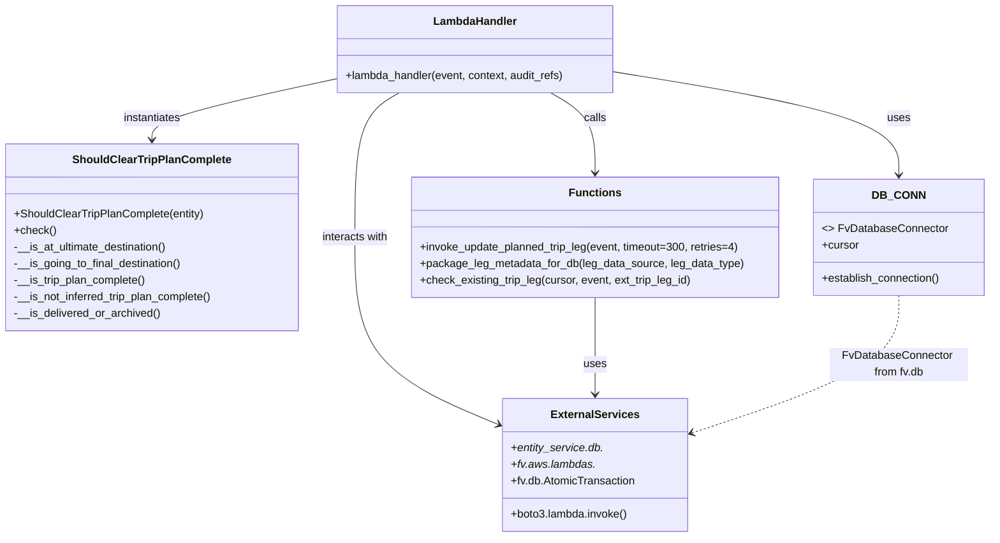

# Diagram: entity_core/entity_service/entity_service/trip_leg/trip_leg/post_put_planned_trip_leg.py


> Auto-generated by Obscura crawlers

## Diagram 1



### SVG

<svg id="container" width="1422.8515625" xmlns="http://www.w3.org/2000/svg" class="classDiagram" height="776" viewBox="0 0 1422.8515625 776" role="graphics-document document" aria-roledescription="class"><style>#container{font-family:"trebuchet ms",verdana,arial,sans-serif;font-size:16px;fill:#333;}@keyframes edge-animation-frame{from{stroke-dashoffset:0;}}@keyframes dash{to{stroke-dashoffset:0;}}#container .edge-animation-slow{stroke-dasharray:9,5!important;stroke-dashoffset:900;animation:dash 50s linear infinite;stroke-linecap:round;}#container .edge-animation-fast{stroke-dasharray:9,5!important;stroke-dashoffset:900;animation:dash 20s linear infinite;stroke-linecap:round;}#container .error-icon{fill:#552222;}#container .error-text{fill:#552222;stroke:#552222;}#container .edge-thickness-normal{stroke-width:1px;}#container .edge-thickness-thick{stroke-width:3.5px;}#container .edge-pattern-solid{stroke-dasharray:0;}#container .edge-thickness-invisible{stroke-width:0;fill:none;}#container .edge-pattern-dashed{stroke-dasharray:3;}#container .edge-pattern-dotted{stroke-dasharray:2;}#container .marker{fill:#333333;stroke:#333333;}#container .marker.cross{stroke:#333333;}#container svg{font-family:"trebuchet ms",verdana,arial,sans-serif;font-size:16px;}#container p{margin:0;}#container g.classGroup text{fill:#9370DB;stroke:none;font-family:"trebuchet ms",verdana,arial,sans-serif;font-size:10px;}#container g.classGroup text .title{font-weight:bolder;}#container .nodeLabel,#container .edgeLabel{color:#131300;}#container .edgeLabel .label rect{fill:#ECECFF;}#container .label text{fill:#131300;}#container .labelBkg{background:#ECECFF;}#container .edgeLabel .label span{background:#ECECFF;}#container .classTitle{font-weight:bolder;}#container .node rect,#container .node circle,#container .node ellipse,#container .node polygon,#container .node path{fill:#ECECFF;stroke:#9370DB;stroke-width:1px;}#container .divider{stroke:#9370DB;stroke-width:1;}#container g.clickable{cursor:pointer;}#container g.classGroup rect{fill:#ECECFF;stroke:#9370DB;}#container g.classGroup line{stroke:#9370DB;stroke-width:1;}#container .classLabel .box{stroke:none;stroke-width:0;fill:#ECECFF;opacity:0.5;}#container .classLabel .label{fill:#9370DB;font-size:10px;}#container .relation{stroke:#333333;stroke-width:1;fill:none;}#container .dashed-line{stroke-dasharray:3;}#container .dotted-line{stroke-dasharray:1 2;}#container #compositionStart,#container .composition{fill:#333333!important;stroke:#333333!important;stroke-width:1;}#container #compositionEnd,#container .composition{fill:#333333!important;stroke:#333333!important;stroke-width:1;}#container #dependencyStart,#container .dependency{fill:#333333!important;stroke:#333333!important;stroke-width:1;}#container #dependencyStart,#container .dependency{fill:#333333!important;stroke:#333333!important;stroke-width:1;}#container #extensionStart,#container .extension{fill:transparent!important;stroke:#333333!important;stroke-width:1;}#container #extensionEnd,#container .extension{fill:transparent!important;stroke:#333333!important;stroke-width:1;}#container #aggregationStart,#container .aggregation{fill:transparent!important;stroke:#333333!important;stroke-width:1;}#container #aggregationEnd,#container .aggregation{fill:transparent!important;stroke:#333333!important;stroke-width:1;}#container #lollipopStart,#container .lollipop{fill:#ECECFF!important;stroke:#333333!important;stroke-width:1;}#container #lollipopEnd,#container .lollipop{fill:#ECECFF!important;stroke:#333333!important;stroke-width:1;}#container .edgeTerminals{font-size:11px;line-height:initial;}#container .classTitleText{text-anchor:middle;font-size:18px;fill:#333;}#container .label-icon{display:inline-block;height:1em;overflow:visible;vertical-align:-0.125em;}#container .node .label-icon path{fill:currentColor;stroke:revert;stroke-width:revert;}#container :root{--mermaid-font-family:"trebuchet ms",verdana,arial,sans-serif;}</style><g><defs><marker id="container_class-aggregationStart" class="marker aggregation class" refX="18" refY="7" markerWidth="190" markerHeight="240" orient="auto"><path d="M 18,7 L9,13 L1,7 L9,1 Z"></path></marker></defs><defs><marker id="container_class-aggregationEnd" class="marker aggregation class" refX="1" refY="7" markerWidth="20" markerHeight="28" orient="auto"><path d="M 18,7 L9,13 L1,7 L9,1 Z"></path></marker></defs><defs><marker id="container_class-extensionStart" class="marker extension class" refX="18" refY="7" markerWidth="190" markerHeight="240" orient="auto"><path d="M 1,7 L18,13 V 1 Z"></path></marker></defs><defs><marker id="container_class-extensionEnd" class="marker extension class" refX="1" refY="7" markerWidth="20" markerHeight="28" orient="auto"><path d="M 1,1 V 13 L18,7 Z"></path></marker></defs><defs><marker id="container_class-compositionStart" class="marker composition class" refX="18" refY="7" markerWidth="190" markerHeight="240" orient="auto"><path d="M 18,7 L9,13 L1,7 L9,1 Z"></path></marker></defs><defs><marker id="container_class-compositionEnd" class="marker composition class" refX="1" refY="7" markerWidth="20" markerHeight="28" orient="auto"><path d="M 18,7 L9,13 L1,7 L9,1 Z"></path></marker></defs><defs><marker id="container_class-dependencyStart" class="marker dependency class" refX="6" refY="7" markerWidth="190" markerHeight="240" orient="auto"><path d="M 5,7 L9,13 L1,7 L9,1 Z"></path></marker></defs><defs><marker id="container_class-dependencyEnd" class="marker dependency class" refX="13" refY="7" markerWidth="20" markerHeight="28" orient="auto"><path d="M 18,7 L9,13 L14,7 L9,1 Z"></path></marker></defs><defs><marker id="container_class-lollipopStart" class="marker lollipop class" refX="13" refY="7" markerWidth="190" markerHeight="240" orient="auto"><circle stroke="black" fill="transparent" cx="7" cy="7" r="6"></circle></marker></defs><defs><marker id="container_class-lollipopEnd" class="marker lollipop class" refX="1" refY="7" markerWidth="190" markerHeight="240" orient="auto"><circle stroke="black" fill="transparent" cx="7" cy="7" r="6"></circle></marker></defs><g class="root"><g class="clusters"></g><g class="edgePaths"><path d="M894.162,104.381L961.337,115.484C1028.512,126.587,1162.861,148.794,1230.036,173.563C1297.211,198.333,1297.211,225.667,1297.211,239.333L1297.211,253" id="id_LambdaHandler_DB_CONN_1" class="edge-thickness-normal edge-pattern-solid relation" style=";;;" data-edge="true" data-et="edge" data-id="id_LambdaHandler_DB_CONN_1" data-points="W3sieCI6ODk0LjE2MjEwOTM3NSwieSI6MTA0LjM4MDU3NDA1NTQ4MTQ3fSx7IngiOjEyOTcuMjEwOTM3NSwieSI6MTcxfSx7IngiOjEyOTcuMjEwOTM3NSwieSI6MjU5fV0=" marker-end="url(#container_class-dependencyEnd)"></path><path d="M801.774,134L812.498,140.167C823.223,146.333,844.672,158.667,855.397,178C866.121,197.333,866.121,223.667,866.121,236.833L866.121,250" id="id_LambdaHandler_Functions_2" class="edge-thickness-normal edge-pattern-solid relation" style=";;;" data-edge="true" data-et="edge" data-id="id_LambdaHandler_Functions_2" data-points="W3sieCI6ODAxLjc3MzYxMzI4MTI0OTksInkiOjEzNH0seyJ4Ijo4NjYuMTIxMDkzNzUsInkiOjE3MX0seyJ4Ijo4NjYuMTIxMDkzNzUsInkiOjI1Nn1d" marker-end="url(#container_class-dependencyEnd)"></path><path d="M490.256,113.855L445.373,123.379C400.491,132.903,310.726,151.952,265.843,166.642C220.961,181.333,220.961,191.667,220.961,196.833L220.961,202" id="id_LambdaHandler_ShouldClearTripPlanComplete_3" class="edge-thickness-normal edge-pattern-solid relation" style=";;;" data-edge="true" data-et="edge" data-id="id_LambdaHandler_ShouldClearTripPlanComplete_3" data-points="W3sieCI6NDkwLjI1NTg1OTM3NSwieSI6MTEzLjg1NDk1MjE1MDgyOTU1fSx7IngiOjIyMC45NjA5Mzc1LCJ5IjoxNzF9LHsieCI6MjIwLjk2MDkzNzUsInkiOjIwOH1d" marker-end="url(#container_class-dependencyEnd)"></path><path d="M582.644,134L571.92,140.167C561.195,146.333,539.746,158.667,529.021,193.5C518.297,228.333,518.297,285.667,518.297,345C518.297,404.333,518.297,465.667,553.21,510.888C588.124,556.109,657.951,585.219,692.865,599.773L727.778,614.328" id="id_LambdaHandler_ExternalServices_4" class="edge-thickness-normal edge-pattern-solid relation" style=";;;" data-edge="true" data-et="edge" data-id="id_LambdaHandler_ExternalServices_4" data-points="W3sieCI6NTgyLjY0NDM1NTQ2ODc1MDEsInkiOjEzNH0seyJ4Ijo1MTguMjk2ODc1LCJ5IjoxNzF9LHsieCI6NTE4LjI5Njg3NSwieSI6MzQzfSx7IngiOjUxOC4yOTY4NzUsInkiOjUyN30seyJ4Ijo3MzMuMzE2NDA2MjUsInkiOjYxNi42MzY3NDg1MzcyMjM2fV0=" marker-end="url(#container_class-dependencyEnd)"></path><path d="M866.121,430L866.121,446.167C866.121,462.333,866.121,494.667,866.121,518C866.121,541.333,866.121,555.667,866.121,562.833L866.121,570" id="id_Functions_ExternalServices_5" class="edge-thickness-normal edge-pattern-solid relation" style=";;;" data-edge="true" data-et="edge" data-id="id_Functions_ExternalServices_5" data-points="W3sieCI6ODY2LjEyMTA5Mzc1LCJ5Ijo0MzB9LHsieCI6ODY2LjEyMTA5Mzc1LCJ5Ijo1Mjd9LHsieCI6ODY2LjEyMTA5Mzc1LCJ5Ijo1NzZ9XQ==" marker-end="url(#container_class-dependencyEnd)"></path><path d="M1297.211,427L1297.211,443.667C1297.211,460.333,1297.211,493.667,1248.445,526.736C1199.678,559.806,1102.145,592.612,1053.379,609.015L1004.613,625.417" id="id_DB_CONN_ExternalServices_6" class="edge-thickness-normal edge-pattern-dashed relation" style=";;;" data-edge="true" data-et="edge" data-id="id_DB_CONN_ExternalServices_6" data-points="W3sieCI6MTI5Ny4yMTA5Mzc1LCJ5Ijo0Mjd9LHsieCI6MTI5Ny4yMTA5Mzc1LCJ5Ijo1Mjd9LHsieCI6OTk4LjkyNTc4MTI1LCJ5Ijo2MjcuMzMwMjQwMzk3MjQ5fV0=" marker-end="url(#container_class-dependencyEnd)"></path></g><g class="edgeLabels"><g class="edgeLabel" transform="translate(1297.2109375, 171)"><g class="label" data-id="id_LambdaHandler_DB_CONN_1" transform="translate(-16.4921875, -12)"><foreignObject width="32.984375" height="24"><div xmlns="http://www.w3.org/1999/xhtml" class="labelBkg" style="display: table-cell; white-space: nowrap; line-height: 1.5; max-width: 200px; text-align: center;"><span class="edgeLabel"><p>uses</p></span></div></foreignObject></g></g><g class="edgeLabel" transform="translate(866.12109375, 171)"><g class="label" data-id="id_LambdaHandler_Functions_2" transform="translate(-16.4453125, -12)"><foreignObject width="32.890625" height="24"><div xmlns="http://www.w3.org/1999/xhtml" class="labelBkg" style="display: table-cell; white-space: nowrap; line-height: 1.5; max-width: 200px; text-align: center;"><span class="edgeLabel"><p>calls</p></span></div></foreignObject></g></g><g class="edgeLabel" transform="translate(220.9609375, 171)"><g class="label" data-id="id_LambdaHandler_ShouldClearTripPlanComplete_3" transform="translate(-42.9140625, -12)"><foreignObject width="85.828125" height="24"><div xmlns="http://www.w3.org/1999/xhtml" class="labelBkg" style="display: table-cell; white-space: nowrap; line-height: 1.5; max-width: 200px; text-align: center;"><span class="edgeLabel"><p>instantiates</p></span></div></foreignObject></g></g><g class="edgeLabel" transform="translate(518.296875, 343)"><g class="label" data-id="id_LambdaHandler_ExternalServices_4" transform="translate(-49.375, -12)"><foreignObject width="98.75" height="24"><div xmlns="http://www.w3.org/1999/xhtml" class="labelBkg" style="display: table-cell; white-space: nowrap; line-height: 1.5; max-width: 200px; text-align: center;"><span class="edgeLabel"><p>interacts with</p></span></div></foreignObject></g></g><g class="edgeLabel" transform="translate(866.12109375, 527)"><g class="label" data-id="id_Functions_ExternalServices_5" transform="translate(-16.4921875, -12)"><foreignObject width="32.984375" height="24"><div xmlns="http://www.w3.org/1999/xhtml" class="labelBkg" style="display: table-cell; white-space: nowrap; line-height: 1.5; max-width: 200px; text-align: center;"><span class="edgeLabel"><p>uses</p></span></div></foreignObject></g></g><g class="edgeLabel" transform="translate(1297.2109375, 527)"><g class="label" data-id="id_DB_CONN_ExternalServices_6" transform="translate(-100, -24)"><foreignObject width="200" height="48"><div xmlns="http://www.w3.org/1999/xhtml" class="labelBkg" style="display: table; white-space: break-spaces; line-height: 1.5; max-width: 200px; text-align: center; width: 200px;"><span class="edgeLabel"><p>FvDatabaseConnector from fv.db</p></span></div></foreignObject></g></g></g><g class="nodes"><g class="node default" id="classId-ShouldClearTripPlanComplete-0" transform="translate(220.9609375, 343)"><g class="basic label-container"><path d="M-212.9609375 -135 L212.9609375 -135 L212.9609375 135 L-212.9609375 135" stroke="none" stroke-width="0" fill="#ECECFF" style=""></path><path d="M-212.9609375 -135 C-79.16165483797275 -135, 54.637627824054505 -135, 212.9609375 -135 M-212.9609375 -135 C-66.24023859424966 -135, 80.48046031150068 -135, 212.9609375 -135 M212.9609375 -135 C212.9609375 -33.93704469977625, 212.9609375 67.1259106004475, 212.9609375 135 M212.9609375 -135 C212.9609375 -53.698330529139156, 212.9609375 27.603338941721688, 212.9609375 135 M212.9609375 135 C105.60875665073374 135, -1.743424198532523 135, -212.9609375 135 M212.9609375 135 C87.98598674594038 135, -36.98896400811924 135, -212.9609375 135 M-212.9609375 135 C-212.9609375 30.449081565799105, -212.9609375 -74.10183686840179, -212.9609375 -135 M-212.9609375 135 C-212.9609375 56.979891117508316, -212.9609375 -21.040217764983367, -212.9609375 -135" stroke="#9370DB" stroke-width="1.3" fill="none" stroke-dasharray="0 0" style=""></path></g><g class="annotation-group text" transform="translate(0, -111)"></g><g class="label-group text" transform="translate(-109.5, -111)"><g class="label" style="font-weight: bolder" transform="translate(0,-12)"><foreignObject width="219" height="24"><div xmlns="http://www.w3.org/1999/xhtml" style="display: table-cell; white-space: nowrap; line-height: 1.5; max-width: 266px; text-align: center;"><span class="nodeLabel markdown-node-label" style=""><p>ShouldClearTripPlanComplete</p></span></div></foreignObject></g></g><g class="members-group text" transform="translate(-200.9609375, -63)"></g><g class="methods-group text" transform="translate(-200.9609375, -33)"><g class="label" style="" transform="translate(0,-12)"><foreignObject width="276.046875" height="24"><div xmlns="http://www.w3.org/1999/xhtml" style="display: table-cell; white-space: nowrap; line-height: 1.5; max-width: 333px; text-align: center;"><span class="nodeLabel markdown-node-label" style=""><p>+ShouldClearTripPlanComplete(entity)</p></span></div></foreignObject></g><g class="label" style="" transform="translate(0,12)"><foreignObject width="59.9375" height="24"><div xmlns="http://www.w3.org/1999/xhtml" style="display: table-cell; white-space: nowrap; line-height: 1.5; max-width: 117px; text-align: center;"><span class="nodeLabel markdown-node-label" style=""><p>+check()</p></span></div></foreignObject></g><g class="label" style="" transform="translate(0,36)"><foreignObject width="225.9375" height="24"><div xmlns="http://www.w3.org/1999/xhtml" style="display: table-cell; white-space: nowrap; line-height: 1.5; max-width: 283px; text-align: center;"><span class="nodeLabel markdown-node-label" style=""><p>-__is_at_ultimate_destination()</p></span></div></foreignObject></g><g class="label" style="" transform="translate(0,60)"><foreignObject width="245.34375" height="24"><div xmlns="http://www.w3.org/1999/xhtml" style="display: table-cell; white-space: nowrap; line-height: 1.5; max-width: 303px; text-align: center;"><span class="nodeLabel markdown-node-label" style=""><p>-__is_going_to_final_destination()</p></span></div></foreignObject></g><g class="label" style="" transform="translate(0,84)"><foreignObject width="193.3125" height="24"><div xmlns="http://www.w3.org/1999/xhtml" style="display: table-cell; white-space: nowrap; line-height: 1.5; max-width: 251px; text-align: center;"><span class="nodeLabel markdown-node-label" style=""><p>-__is_trip_plan_complete()</p></span></div></foreignObject></g><g class="label" style="" transform="translate(0,108)"><foreignObject width="292.421875" height="24"><div xmlns="http://www.w3.org/1999/xhtml" style="display: table-cell; white-space: nowrap; line-height: 1.5; max-width: 350px; text-align: center;"><span class="nodeLabel markdown-node-label" style=""><p>-__is_not_inferred_trip_plan_complete()</p></span></div></foreignObject></g><g class="label" style="" transform="translate(0,132)"><foreignObject width="211.953125" height="24"><div xmlns="http://www.w3.org/1999/xhtml" style="display: table-cell; white-space: nowrap; line-height: 1.5; max-width: 269px; text-align: center;"><span class="nodeLabel markdown-node-label" style=""><p>-__is_delivered_or_archived()</p></span></div></foreignObject></g></g><g class="divider" style=""><path d="M-212.9609375 -87 C-92.5140484472644 -87, 27.9328406054712 -87, 212.9609375 -87 M-212.9609375 -87 C-50.49507904179691 -87, 111.97077941640617 -87, 212.9609375 -87" stroke="#9370DB" stroke-width="1.3" fill="none" stroke-dasharray="0 0" style=""></path></g><g class="divider" style=""><path d="M-212.9609375 -63 C-97.49101090773661 -63, 17.978915684526783 -63, 212.9609375 -63 M-212.9609375 -63 C-118.6777410262872 -63, -24.394544552574388 -63, 212.9609375 -63" stroke="#9370DB" stroke-width="1.3" fill="none" stroke-dasharray="0 0" style=""></path></g></g><g class="node default" id="classId-LambdaHandler-1" transform="translate(692.208984375, 71)"><g class="basic label-container"><path d="M-201.953125 -63 L201.953125 -63 L201.953125 63 L-201.953125 63" stroke="none" stroke-width="0" fill="#ECECFF" style=""></path><path d="M-201.953125 -63 C-75.76924420865814 -63, 50.41463658268373 -63, 201.953125 -63 M-201.953125 -63 C-82.37369828087371 -63, 37.20572843825258 -63, 201.953125 -63 M201.953125 -63 C201.953125 -16.74200286164364, 201.953125 29.515994276712718, 201.953125 63 M201.953125 -63 C201.953125 -24.583875398294623, 201.953125 13.832249203410754, 201.953125 63 M201.953125 63 C91.3376695424381 63, -19.277785915123786 63, -201.953125 63 M201.953125 63 C113.89118872098265 63, 25.82925244196531 63, -201.953125 63 M-201.953125 63 C-201.953125 26.15864547901417, -201.953125 -10.682709041971663, -201.953125 -63 M-201.953125 63 C-201.953125 32.23057950625845, -201.953125 1.4611590125169087, -201.953125 -63" stroke="#9370DB" stroke-width="1.3" fill="none" stroke-dasharray="0 0" style=""></path></g><g class="annotation-group text" transform="translate(0, -39)"></g><g class="label-group text" transform="translate(-58.21875, -39)"><g class="label" style="font-weight: bolder" transform="translate(0,-12)"><foreignObject width="116.4375" height="24"><div xmlns="http://www.w3.org/1999/xhtml" style="display: table-cell; white-space: nowrap; line-height: 1.5; max-width: 167px; text-align: center;"><span class="nodeLabel markdown-node-label" style=""><p>LambdaHandler</p></span></div></foreignObject></g></g><g class="members-group text" transform="translate(-189.953125, 9)"></g><g class="methods-group text" transform="translate(-189.953125, 39)"><g class="label" style="" transform="translate(0,-12)"><foreignObject width="321.6875" height="24"><div xmlns="http://www.w3.org/1999/xhtml" style="display: table-cell; white-space: nowrap; line-height: 1.5; max-width: 379px; text-align: center;"><span class="nodeLabel markdown-node-label" style=""><p>+lambda_handler(event, context, audit_refs)</p></span></div></foreignObject></g></g><g class="divider" style=""><path d="M-201.953125 -15 C-68.30142873212131 -15, 65.35026753575738 -15, 201.953125 -15 M-201.953125 -15 C-60.5945276008994 -15, 80.7640697982012 -15, 201.953125 -15" stroke="#9370DB" stroke-width="1.3" fill="none" stroke-dasharray="0 0" style=""></path></g><g class="divider" style=""><path d="M-201.953125 9 C-95.226395757846 9, 11.500333484307987 9, 201.953125 9 M-201.953125 9 C-88.9785502996952 9, 23.9960244006096 9, 201.953125 9" stroke="#9370DB" stroke-width="1.3" fill="none" stroke-dasharray="0 0" style=""></path></g></g><g class="node default" id="classId-DB_CONN-2" transform="translate(1297.2109375, 343)"><g class="basic label-container"><path d="M-117.640625 -84 L117.640625 -84 L117.640625 84 L-117.640625 84" stroke="none" stroke-width="0" fill="#ECECFF" style=""></path><path d="M-117.640625 -84 C-61.577886774961364 -84, -5.515148549922728 -84, 117.640625 -84 M-117.640625 -84 C-35.834934132736805 -84, 45.97075673452639 -84, 117.640625 -84 M117.640625 -84 C117.640625 -31.30316214594498, 117.640625 21.393675708110038, 117.640625 84 M117.640625 -84 C117.640625 -48.43996232378242, 117.640625 -12.879924647564835, 117.640625 84 M117.640625 84 C60.00147112145831 84, 2.3623172429166175 84, -117.640625 84 M117.640625 84 C29.97352926093062 84, -57.69356647813876 84, -117.640625 84 M-117.640625 84 C-117.640625 34.71210827860193, -117.640625 -14.575783442796137, -117.640625 -84 M-117.640625 84 C-117.640625 36.10176241806013, -117.640625 -11.796475163879734, -117.640625 -84" stroke="#9370DB" stroke-width="1.3" fill="none" stroke-dasharray="0 0" style=""></path></g><g class="annotation-group text" transform="translate(0, -60)"></g><g class="label-group text" transform="translate(-34.40625, -60)"><g class="label" style="font-weight: bolder" transform="translate(0,-12)"><foreignObject width="68.8125" height="24"><div xmlns="http://www.w3.org/1999/xhtml" style="display: table-cell; white-space: nowrap; line-height: 1.5; max-width: 119px; text-align: center;"><span class="nodeLabel markdown-node-label" style=""><p>DB_CONN</p></span></div></foreignObject></g></g><g class="members-group text" transform="translate(-105.640625, -12)"><g class="label" style="" transform="translate(0,-12)"><foreignObject width="176.875" height="24"><div xmlns="http://www.w3.org/1999/xhtml" style="display: table-cell; white-space: nowrap; line-height: 1.5; max-width: 267px; text-align: center;"><span class="nodeLabel markdown-node-label" style=""><p>&lt;&gt; FvDatabaseConnector</p></span></div></foreignObject></g><g class="label" style="" transform="translate(0,12)"><foreignObject width="53.71875" height="24"><div xmlns="http://www.w3.org/1999/xhtml" style="display: table-cell; white-space: nowrap; line-height: 1.5; max-width: 112px; text-align: center;"><span class="nodeLabel markdown-node-label" style=""><p>+cursor</p></span></div></foreignObject></g></g><g class="methods-group text" transform="translate(-105.640625, 60)"><g class="label" style="" transform="translate(0,-12)"><foreignObject width="173.265625" height="24"><div xmlns="http://www.w3.org/1999/xhtml" style="display: table-cell; white-space: nowrap; line-height: 1.5; max-width: 231px; text-align: center;"><span class="nodeLabel markdown-node-label" style=""><p>+establish_connection()</p></span></div></foreignObject></g></g><g class="divider" style=""><path d="M-117.640625 -36 C-56.98735750862062 -36, 3.6659099827587625 -36, 117.640625 -36 M-117.640625 -36 C-28.91249530786692 -36, 59.81563438426616 -36, 117.640625 -36" stroke="#9370DB" stroke-width="1.3" fill="none" stroke-dasharray="0 0" style=""></path></g><g class="divider" style=""><path d="M-117.640625 36 C-56.02188913947999 36, 5.5968467210400235 36, 117.640625 36 M-117.640625 36 C-24.34962360045475 36, 68.9413777990905 36, 117.640625 36" stroke="#9370DB" stroke-width="1.3" fill="none" stroke-dasharray="0 0" style=""></path></g></g><g class="node default" id="classId-Functions-3" transform="translate(866.12109375, 343)"><g class="basic label-container"><path d="M-263.44921875 -87 L263.44921875 -87 L263.44921875 87 L-263.44921875 87" stroke="none" stroke-width="0" fill="#ECECFF" style=""></path><path d="M-263.44921875 -87 C-108.00136239294014 -87, 47.446493964119725 -87, 263.44921875 -87 M-263.44921875 -87 C-145.93152651667333 -87, -28.41383428334663 -87, 263.44921875 -87 M263.44921875 -87 C263.44921875 -21.4804392723116, 263.44921875 44.0391214553768, 263.44921875 87 M263.44921875 -87 C263.44921875 -50.66609201397266, 263.44921875 -14.332184027945317, 263.44921875 87 M263.44921875 87 C117.58498572381049 87, -28.27924730237902 87, -263.44921875 87 M263.44921875 87 C63.471773614589296 87, -136.5056715208214 87, -263.44921875 87 M-263.44921875 87 C-263.44921875 32.25754841860811, -263.44921875 -22.48490316278378, -263.44921875 -87 M-263.44921875 87 C-263.44921875 29.13099971622256, -263.44921875 -28.738000567554877, -263.44921875 -87" stroke="#9370DB" stroke-width="1.3" fill="none" stroke-dasharray="0 0" style=""></path></g><g class="annotation-group text" transform="translate(0, -63)"></g><g class="label-group text" transform="translate(-35.1328125, -63)"><g class="label" style="font-weight: bolder" transform="translate(0,-12)"><foreignObject width="70.265625" height="24"><div xmlns="http://www.w3.org/1999/xhtml" style="display: table-cell; white-space: nowrap; line-height: 1.5; max-width: 120px; text-align: center;"><span class="nodeLabel markdown-node-label" style=""><p>Functions</p></span></div></foreignObject></g></g><g class="members-group text" transform="translate(-251.44921875, -15)"></g><g class="methods-group text" transform="translate(-251.44921875, 15)"><g class="label" style="" transform="translate(0,-12)"><foreignObject width="466.78125" height="24"><div xmlns="http://www.w3.org/1999/xhtml" style="display: table-cell; white-space: nowrap; line-height: 1.5; max-width: 524px; text-align: center;"><span class="nodeLabel markdown-node-label" style=""><p>+invoke_update_planned_trip_leg(event, timeout=300, retries=4)</p></span></div></foreignObject></g><g class="label" style="" transform="translate(0,12)"><foreignObject width="467.765625" height="24"><div xmlns="http://www.w3.org/1999/xhtml" style="display: table-cell; white-space: nowrap; line-height: 1.5; max-width: 525px; text-align: center;"><span class="nodeLabel markdown-node-label" style=""><p>+package_leg_metadata_for_db(leg_data_source, leg_data_type)</p></span></div></foreignObject></g><g class="label" style="" transform="translate(0,36)"><foreignObject width="396.8125" height="24"><div xmlns="http://www.w3.org/1999/xhtml" style="display: table-cell; white-space: nowrap; line-height: 1.5; max-width: 454px; text-align: center;"><span class="nodeLabel markdown-node-label" style=""><p>+check_existing_trip_leg(cursor, event, ext_trip_leg_id)</p></span></div></foreignObject></g></g><g class="divider" style=""><path d="M-263.44921875 -39 C-125.41600161151021 -39, 12.617215526979578 -39, 263.44921875 -39 M-263.44921875 -39 C-75.17822084315955 -39, 113.0927770636809 -39, 263.44921875 -39" stroke="#9370DB" stroke-width="1.3" fill="none" stroke-dasharray="0 0" style=""></path></g><g class="divider" style=""><path d="M-263.44921875 -15 C-116.57485409671466 -15, 30.29951055657068 -15, 263.44921875 -15 M-263.44921875 -15 C-86.93233959645366 -15, 89.58453955709268 -15, 263.44921875 -15" stroke="#9370DB" stroke-width="1.3" fill="none" stroke-dasharray="0 0" style=""></path></g></g><g class="node default" id="classId-ExternalServices-4" transform="translate(866.12109375, 672)"><g class="basic label-container"><path d="M-132.8046875 -96 L132.8046875 -96 L132.8046875 96 L-132.8046875 96" stroke="none" stroke-width="0" fill="#ECECFF" style=""></path><path d="M-132.8046875 -96 C-50.0917848788624 -96, 32.6211177422752 -96, 132.8046875 -96 M-132.8046875 -96 C-28.553044697828398 -96, 75.6985981043432 -96, 132.8046875 -96 M132.8046875 -96 C132.8046875 -31.638415906134668, 132.8046875 32.723168187730664, 132.8046875 96 M132.8046875 -96 C132.8046875 -21.015872902114353, 132.8046875 53.968254195771294, 132.8046875 96 M132.8046875 96 C71.1547046996296 96, 9.504721899259195 96, -132.8046875 96 M132.8046875 96 C74.58308159915958 96, 16.36147569831917 96, -132.8046875 96 M-132.8046875 96 C-132.8046875 55.69376477861495, -132.8046875 15.387529557229897, -132.8046875 -96 M-132.8046875 96 C-132.8046875 36.7239515175101, -132.8046875 -22.552096964979796, -132.8046875 -96" stroke="#9370DB" stroke-width="1.3" fill="none" stroke-dasharray="0 0" style=""></path></g><g class="annotation-group text" transform="translate(0, -72)"></g><g class="label-group text" transform="translate(-60.6875, -72)"><g class="label" style="font-weight: bolder" transform="translate(0,-12)"><foreignObject width="121.375" height="24"><div xmlns="http://www.w3.org/1999/xhtml" style="display: table-cell; white-space: nowrap; line-height: 1.5; max-width: 169px; text-align: center;"><span class="nodeLabel markdown-node-label" style=""><p>ExternalServices</p></span></div></foreignObject></g></g><g class="members-group text" transform="translate(-120.8046875, -24)"><g class="label" style="font-style:italic;" transform="translate(0,-12)"><foreignObject width="132.21875" height="24"><div xmlns="http://www.w3.org/1999/xhtml" style="display: table-cell; white-space: nowrap; line-height: 1.5; max-width: 192px; text-align: center;"><span class="nodeLabel markdown-node-label" style=""><p>+entity_service.db.</p></span></div></foreignObject></g><g class="label" style="font-style:italic;" transform="translate(0,12)"><foreignObject width="121.609375" height="24"><div xmlns="http://www.w3.org/1999/xhtml" style="display: table-cell; white-space: nowrap; line-height: 1.5; max-width: 179px; text-align: center;"><span class="nodeLabel markdown-node-label" style=""><p>+fv.aws.lambdas.</p></span></div></foreignObject></g><g class="label" style="" transform="translate(0,36)"><foreignObject width="180.921875" height="24"><div xmlns="http://www.w3.org/1999/xhtml" style="display: table-cell; white-space: nowrap; line-height: 1.5; max-width: 238px; text-align: center;"><span class="nodeLabel markdown-node-label" style=""><p>+fv.db.AtomicTransaction</p></span></div></foreignObject></g></g><g class="methods-group text" transform="translate(-120.8046875, 72)"><g class="label" style="" transform="translate(0,-12)"><foreignObject width="169.921875" height="24"><div xmlns="http://www.w3.org/1999/xhtml" style="display: table-cell; white-space: nowrap; line-height: 1.5; max-width: 227px; text-align: center;"><span class="nodeLabel markdown-node-label" style=""><p>+boto3.lambda.invoke()</p></span></div></foreignObject></g></g><g class="divider" style=""><path d="M-132.8046875 -48 C-33.9226480840089 -48, 64.9593913319822 -48, 132.8046875 -48 M-132.8046875 -48 C-41.09473232087032 -48, 50.61522285825936 -48, 132.8046875 -48" stroke="#9370DB" stroke-width="1.3" fill="none" stroke-dasharray="0 0" style=""></path></g><g class="divider" style=""><path d="M-132.8046875 48 C-31.15956677835233 48, 70.48555394329534 48, 132.8046875 48 M-132.8046875 48 C-45.386458795076464 48, 42.03176990984707 48, 132.8046875 48" stroke="#9370DB" stroke-width="1.3" fill="none" stroke-dasharray="0 0" style=""></path></g></g></g></g></g></svg>

## Diagram 2

```mermaid
flowchart TD
Start([Start]) --> Establish[DB_CONN.establish_connection()]
Establish --> Cursor[cursor = DB_CONN.cursor]
Cursor --> CheckMethod{event["httpMethod"] == "POST"}
CheckMethod -- "True (POST)" --> SetHttpPutFalse[http_put = False]
CheckMethod -- "False (PUT/OTHER)" --> SetHttpPutTrue[http_put = True]
SetHttpPutFalse --> GetParams[Get solution_id and leg from event]
SetHttpPutTrue --> GetParams
GetParams --> DetermineExternalId{http_put ? path param : body.id}
DetermineExternalId -- "body contains id" --> UseBody[external_id = leg["id"]]
DetermineExternalId -- "path param" --> UsePath[external_id = path param]
UseBody --> AuditUpdate[audit_refs updated with solutionId & plannedTripLegId]
UsePath --> AuditUpdate
AuditUpdate --> CheckExisting[check_existing_trip_leg(cursor, event, external_id)]
CheckExisting -- "not exists OR not http_put" --> CreateBranch[Create planned trip leg]
CheckExisting -- "exists AND http_put" --> UpdateBranch[Call invoke_update_planned_trip_leg]
CreateBranch --> ResolveEntities[resolve & validate entity ids, references, metadata]
ResolveEntities --> Carrier[resolve carrier org and carrier_org_id]
Carrier --> GetLocations[origin.location_id = get_or_insert_location; dest.location_id = get_or_insert_location]
GetLocations --> InsertStops[Origin, Destination = insert_or_update_stops(...)]
InsertStops --> BeginTx[with AtomicTransaction(DB_CONN)]
BeginTx --> InsertTripLeg[insert_trip_leg -> trip_leg_id]
InsertTripLeg --> AddEntities[add_entities_to_planned_trip_leg]
AddEntities --> InsertEntityStops[insert_stops_into_entity]
InsertEntityStops --> InsertRefs[insert_or_update_ptl_ref]
InsertRefs --> CommitTx[commit transaction]
CommitTx --> PostProcessing[post-create: update ult locs, dealer origins, calculate ETA]
PostProcessing --> Events[build_fv_event_json -> invoke_add_event]
Events --> Visibility[add_to_visibility_granting_queue]
Visibility --> Publish[post messages & publish_recalculation_batch]
Publish --> ResponseCreated[response=leg; status_code=201]
UpdateBranch --> InvokeUpdate[invoke_update_planned_trip_leg(event)]
InvokeUpdate --> ResponseOK[response from invoked lambda; status_code=200]
ResponseCreated --> Return[return make_response(response, status_code)]
ResponseOK --> Return
```

> SVG rendering failed for this diagram.
