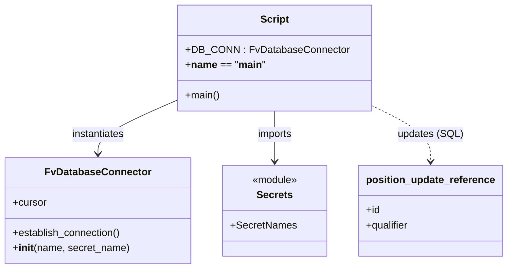

# Diagram: entity_core/entity_service/entity_service_scripts/H2-2164_position_update_ref_update.py


> Auto-generated by Obscura crawlers

## Diagram 1

```mermaid
flowchart TD
    Start([Start])
    Start --> Establish[/"DB_CONN.establish_connection()"/]
    Establish --> SetCursor[/cursor = DB_CONN.cursor/]
    SetCursor --> Loop{Continue loop?}
    Loop --> Execute[/cursor.execute(UPDATE ...)/]
    Execute --> Fetch[/row = cursor.fetchone()/]
    Fetch --> PrintDot["print('.')"]
    PrintDot --> Check{row is not None?}
    Check -- Yes --> Loop
    Check -- No --> Complete[/"print('H2-2164 script completed') and exit"/]
```

> SVG rendering failed for this diagram.

## Diagram 2



### SVG

<svg id="container" width="787.6875" xmlns="http://www.w3.org/2000/svg" class="classDiagram" height="426" viewBox="0 0 787.6875 426" role="graphics-document document" aria-roledescription="class"><style>#container{font-family:"trebuchet ms",verdana,arial,sans-serif;font-size:16px;fill:#333;}@keyframes edge-animation-frame{from{stroke-dashoffset:0;}}@keyframes dash{to{stroke-dashoffset:0;}}#container .edge-animation-slow{stroke-dasharray:9,5!important;stroke-dashoffset:900;animation:dash 50s linear infinite;stroke-linecap:round;}#container .edge-animation-fast{stroke-dasharray:9,5!important;stroke-dashoffset:900;animation:dash 20s linear infinite;stroke-linecap:round;}#container .error-icon{fill:#552222;}#container .error-text{fill:#552222;stroke:#552222;}#container .edge-thickness-normal{stroke-width:1px;}#container .edge-thickness-thick{stroke-width:3.5px;}#container .edge-pattern-solid{stroke-dasharray:0;}#container .edge-thickness-invisible{stroke-width:0;fill:none;}#container .edge-pattern-dashed{stroke-dasharray:3;}#container .edge-pattern-dotted{stroke-dasharray:2;}#container .marker{fill:#333333;stroke:#333333;}#container .marker.cross{stroke:#333333;}#container svg{font-family:"trebuchet ms",verdana,arial,sans-serif;font-size:16px;}#container p{margin:0;}#container g.classGroup text{fill:#9370DB;stroke:none;font-family:"trebuchet ms",verdana,arial,sans-serif;font-size:10px;}#container g.classGroup text .title{font-weight:bolder;}#container .nodeLabel,#container .edgeLabel{color:#131300;}#container .edgeLabel .label rect{fill:#ECECFF;}#container .label text{fill:#131300;}#container .labelBkg{background:#ECECFF;}#container .edgeLabel .label span{background:#ECECFF;}#container .classTitle{font-weight:bolder;}#container .node rect,#container .node circle,#container .node ellipse,#container .node polygon,#container .node path{fill:#ECECFF;stroke:#9370DB;stroke-width:1px;}#container .divider{stroke:#9370DB;stroke-width:1;}#container g.clickable{cursor:pointer;}#container g.classGroup rect{fill:#ECECFF;stroke:#9370DB;}#container g.classGroup line{stroke:#9370DB;stroke-width:1;}#container .classLabel .box{stroke:none;stroke-width:0;fill:#ECECFF;opacity:0.5;}#container .classLabel .label{fill:#9370DB;font-size:10px;}#container .relation{stroke:#333333;stroke-width:1;fill:none;}#container .dashed-line{stroke-dasharray:3;}#container .dotted-line{stroke-dasharray:1 2;}#container #compositionStart,#container .composition{fill:#333333!important;stroke:#333333!important;stroke-width:1;}#container #compositionEnd,#container .composition{fill:#333333!important;stroke:#333333!important;stroke-width:1;}#container #dependencyStart,#container .dependency{fill:#333333!important;stroke:#333333!important;stroke-width:1;}#container #dependencyStart,#container .dependency{fill:#333333!important;stroke:#333333!important;stroke-width:1;}#container #extensionStart,#container .extension{fill:transparent!important;stroke:#333333!important;stroke-width:1;}#container #extensionEnd,#container .extension{fill:transparent!important;stroke:#333333!important;stroke-width:1;}#container #aggregationStart,#container .aggregation{fill:transparent!important;stroke:#333333!important;stroke-width:1;}#container #aggregationEnd,#container .aggregation{fill:transparent!important;stroke:#333333!important;stroke-width:1;}#container #lollipopStart,#container .lollipop{fill:#ECECFF!important;stroke:#333333!important;stroke-width:1;}#container #lollipopEnd,#container .lollipop{fill:#ECECFF!important;stroke:#333333!important;stroke-width:1;}#container .edgeTerminals{font-size:11px;line-height:initial;}#container .classTitleText{text-anchor:middle;font-size:18px;fill:#333;}#container .label-icon{display:inline-block;height:1em;overflow:visible;vertical-align:-0.125em;}#container .node .label-icon path{fill:currentColor;stroke:revert;stroke-width:revert;}#container :root{--mermaid-font-family:"trebuchet ms",verdana,arial,sans-serif;}</style><g><defs><marker id="container_class-aggregationStart" class="marker aggregation class" refX="18" refY="7" markerWidth="190" markerHeight="240" orient="auto"><path d="M 18,7 L9,13 L1,7 L9,1 Z"></path></marker></defs><defs><marker id="container_class-aggregationEnd" class="marker aggregation class" refX="1" refY="7" markerWidth="20" markerHeight="28" orient="auto"><path d="M 18,7 L9,13 L1,7 L9,1 Z"></path></marker></defs><defs><marker id="container_class-extensionStart" class="marker extension class" refX="18" refY="7" markerWidth="190" markerHeight="240" orient="auto"><path d="M 1,7 L18,13 V 1 Z"></path></marker></defs><defs><marker id="container_class-extensionEnd" class="marker extension class" refX="1" refY="7" markerWidth="20" markerHeight="28" orient="auto"><path d="M 1,1 V 13 L18,7 Z"></path></marker></defs><defs><marker id="container_class-compositionStart" class="marker composition class" refX="18" refY="7" markerWidth="190" markerHeight="240" orient="auto"><path d="M 18,7 L9,13 L1,7 L9,1 Z"></path></marker></defs><defs><marker id="container_class-compositionEnd" class="marker composition class" refX="1" refY="7" markerWidth="20" markerHeight="28" orient="auto"><path d="M 18,7 L9,13 L1,7 L9,1 Z"></path></marker></defs><defs><marker id="container_class-dependencyStart" class="marker dependency class" refX="6" refY="7" markerWidth="190" markerHeight="240" orient="auto"><path d="M 5,7 L9,13 L1,7 L9,1 Z"></path></marker></defs><defs><marker id="container_class-dependencyEnd" class="marker dependency class" refX="13" refY="7" markerWidth="20" markerHeight="28" orient="auto"><path d="M 18,7 L9,13 L14,7 L9,1 Z"></path></marker></defs><defs><marker id="container_class-lollipopStart" class="marker lollipop class" refX="13" refY="7" markerWidth="190" markerHeight="240" orient="auto"><circle stroke="black" fill="transparent" cx="7" cy="7" r="6"></circle></marker></defs><defs><marker id="container_class-lollipopEnd" class="marker lollipop class" refX="1" refY="7" markerWidth="190" markerHeight="240" orient="auto"><circle stroke="black" fill="transparent" cx="7" cy="7" r="6"></circle></marker></defs><g class="root"><g class="clusters"></g><g class="edgePaths"><path d="M280.969,156.139L259.424,165.616C237.879,175.093,194.789,194.046,173.244,208.69C151.699,223.333,151.699,233.667,151.699,238.833L151.699,244" id="id_Script_FvDatabaseConnector_1" class="edge-thickness-normal edge-pattern-solid relation" style=";;;" data-edge="true" data-et="edge" data-id="id_Script_FvDatabaseConnector_1" data-points="W3sieCI6MjgwLjk2ODc1LCJ5IjoxNTYuMTM5MTc1MjU3NzMxOTV9LHsieCI6MTUxLjY5OTIxODc1LCJ5IjoyMTN9LHsieCI6MTUxLjY5OTIxODc1LCJ5IjoyNTB9XQ==" marker-end="url(#container_class-dependencyEnd)"></path><path d="M426.785,176L426.785,182.167C426.785,188.333,426.785,200.667,426.785,214C426.785,227.333,426.785,241.667,426.785,248.833L426.785,256" id="id_Script_Secrets_2" class="edge-thickness-normal edge-pattern-solid relation" style=";;;" data-edge="true" data-et="edge" data-id="id_Script_Secrets_2" data-points="W3sieCI6NDI2Ljc4NTE1NjI1LCJ5IjoxNzZ9LHsieCI6NDI2Ljc4NTE1NjI1LCJ5IjoyMTN9LHsieCI6NDI2Ljc4NTE1NjI1LCJ5IjoyNjJ9XQ==" marker-end="url(#container_class-dependencyEnd)"></path><path d="M572.602,164.865L588.656,172.887C604.711,180.91,636.82,196.955,652.875,212.144C668.93,227.333,668.93,241.667,668.93,248.833L668.93,256" id="id_Script_position_update_reference_3" class="edge-thickness-normal edge-pattern-dashed relation" style=";;;" data-edge="true" data-et="edge" data-id="id_Script_position_update_reference_3" data-points="W3sieCI6NTcyLjYwMTU2MjUsInkiOjE2NC44NjQ2ODU2NzAwMzgyM30seyJ4Ijo2NjguOTI5Njg3NSwieSI6MjEzfSx7IngiOjY2OC45Mjk2ODc1LCJ5IjoyNjJ9XQ==" marker-end="url(#container_class-dependencyEnd)"></path></g><g class="edgeLabels"><g class="edgeLabel" transform="translate(151.69921875, 213)"><g class="label" data-id="id_Script_FvDatabaseConnector_1" transform="translate(-42.9140625, -12)"><foreignObject width="85.828125" height="24"><div xmlns="http://www.w3.org/1999/xhtml" class="labelBkg" style="display: table-cell; white-space: nowrap; line-height: 1.5; max-width: 200px; text-align: center;"><span class="edgeLabel"><p>instantiates</p></span></div></foreignObject></g></g><g class="edgeLabel" transform="translate(426.78515625, 213)"><g class="label" data-id="id_Script_Secrets_2" transform="translate(-28.25, -12)"><foreignObject width="56.5" height="24"><div xmlns="http://www.w3.org/1999/xhtml" class="labelBkg" style="display: table-cell; white-space: nowrap; line-height: 1.5; max-width: 200px; text-align: center;"><span class="edgeLabel"><p>imports</p></span></div></foreignObject></g></g><g class="edgeLabel" transform="translate(668.9296875, 213)"><g class="label" data-id="id_Script_position_update_reference_3" transform="translate(-50.5859375, -12)"><foreignObject width="101.171875" height="24"><div xmlns="http://www.w3.org/1999/xhtml" class="labelBkg" style="display: table-cell; white-space: nowrap; line-height: 1.5; max-width: 200px; text-align: center;"><span class="edgeLabel"><p>updates (SQL)</p></span></div></foreignObject></g></g></g><g class="nodes"><g class="node default" id="classId-FvDatabaseConnector-0" transform="translate(151.69921875, 334)"><g class="basic label-container"><path d="M-143.69921875 -84 L143.69921875 -84 L143.69921875 84 L-143.69921875 84" stroke="none" stroke-width="0" fill="#ECECFF" style=""></path><path d="M-143.69921875 -84 C-77.96163954469316 -84, -12.224060339386313 -84, 143.69921875 -84 M-143.69921875 -84 C-71.12038846251161 -84, 1.4584418249767737 -84, 143.69921875 -84 M143.69921875 -84 C143.69921875 -46.64949826826879, 143.69921875 -9.298996536537587, 143.69921875 84 M143.69921875 -84 C143.69921875 -30.6716203528145, 143.69921875 22.656759294371, 143.69921875 84 M143.69921875 84 C42.6221707308473 84, -58.4548772883054 84, -143.69921875 84 M143.69921875 84 C48.97400360729297 84, -45.75121153541406 84, -143.69921875 84 M-143.69921875 84 C-143.69921875 27.76030173818402, -143.69921875 -28.479396523631962, -143.69921875 -84 M-143.69921875 84 C-143.69921875 45.30732716600304, -143.69921875 6.614654332006083, -143.69921875 -84" stroke="#9370DB" stroke-width="1.3" fill="none" stroke-dasharray="0 0" style=""></path></g><g class="annotation-group text" transform="translate(0, -60)"></g><g class="label-group text" transform="translate(-79.3046875, -60)"><g class="label" style="font-weight: bolder" transform="translate(0,-12)"><foreignObject width="158.609375" height="24"><div xmlns="http://www.w3.org/1999/xhtml" style="display: table-cell; white-space: nowrap; line-height: 1.5; max-width: 207px; text-align: center;"><span class="nodeLabel markdown-node-label" style=""><p>FvDatabaseConnector</p></span></div></foreignObject></g></g><g class="members-group text" transform="translate(-131.69921875, -12)"><g class="label" style="" transform="translate(0,-12)"><foreignObject width="53.71875" height="24"><div xmlns="http://www.w3.org/1999/xhtml" style="display: table-cell; white-space: nowrap; line-height: 1.5; max-width: 112px; text-align: center;"><span class="nodeLabel markdown-node-label" style=""><p>+cursor</p></span></div></foreignObject></g></g><g class="methods-group text" transform="translate(-131.69921875, 36)"><g class="label" style="" transform="translate(0,-12)"><foreignObject width="173.265625" height="24"><div xmlns="http://www.w3.org/1999/xhtml" style="display: table-cell; white-space: nowrap; line-height: 1.5; max-width: 231px; text-align: center;"><span class="nodeLabel markdown-node-label" style=""><p>+establish_connection()</p></span></div></foreignObject></g><g class="label" style="" transform="translate(0,12)"><foreignObject width="184.09375" height="24"><div xmlns="http://www.w3.org/1999/xhtml" style="display: table-cell; white-space: nowrap; line-height: 1.5; max-width: 273px; text-align: center;"><span class="nodeLabel markdown-node-label" style=""><p>+<strong>init</strong>(name, secret_name)</p></span></div></foreignObject></g></g><g class="divider" style=""><path d="M-143.69921875 -36 C-68.88064166128515 -36, 5.937935427429693 -36, 143.69921875 -36 M-143.69921875 -36 C-47.49264124854818 -36, 48.713936252903636 -36, 143.69921875 -36" stroke="#9370DB" stroke-width="1.3" fill="none" stroke-dasharray="0 0" style=""></path></g><g class="divider" style=""><path d="M-143.69921875 12 C-50.79456906985031 12, 42.11008061029938 12, 143.69921875 12 M-143.69921875 12 C-29.40479530705997 12, 84.88962813588006 12, 143.69921875 12" stroke="#9370DB" stroke-width="1.3" fill="none" stroke-dasharray="0 0" style=""></path></g></g><g class="node default" id="classId-Secrets-1" transform="translate(426.78515625, 334)"><g class="basic label-container"><path d="M-81.38671875 -72 L81.38671875 -72 L81.38671875 72 L-81.38671875 72" stroke="none" stroke-width="0" fill="#ECECFF" style=""></path><path d="M-81.38671875 -72 C-21.510179875746665 -72, 38.36635899850667 -72, 81.38671875 -72 M-81.38671875 -72 C-29.152480931568178 -72, 23.081756886863644 -72, 81.38671875 -72 M81.38671875 -72 C81.38671875 -18.77799043988265, 81.38671875 34.4440191202347, 81.38671875 72 M81.38671875 -72 C81.38671875 -29.622213611953974, 81.38671875 12.755572776092052, 81.38671875 72 M81.38671875 72 C25.488811286127735 72, -30.40909617774453 72, -81.38671875 72 M81.38671875 72 C47.491984939989244 72, 13.597251129978488 72, -81.38671875 72 M-81.38671875 72 C-81.38671875 33.75295883934691, -81.38671875 -4.4940823213061805, -81.38671875 -72 M-81.38671875 72 C-81.38671875 30.705710862072905, -81.38671875 -10.58857827585419, -81.38671875 -72" stroke="#9370DB" stroke-width="1.3" fill="none" stroke-dasharray="0 0" style=""></path></g><g class="annotation-group text" transform="translate(-36.6015625, -48)"><g class="label" style="" transform="translate(0,-12)"><foreignObject width="73.203125" height="24"><div xmlns="http://www.w3.org/1999/xhtml" style="display: table-cell; white-space: nowrap; line-height: 1.5; max-width: 123px; text-align: center;"><span class="nodeLabel markdown-node-label" style=""><p>«module»</p></span></div></foreignObject></g></g><g class="label-group text" transform="translate(-27.1640625, -24)"><g class="label" style="font-weight: bolder" transform="translate(0,-12)"><foreignObject width="54.328125" height="24"><div xmlns="http://www.w3.org/1999/xhtml" style="display: table-cell; white-space: nowrap; line-height: 1.5; max-width: 103px; text-align: center;"><span class="nodeLabel markdown-node-label" style=""><p>Secrets</p></span></div></foreignObject></g></g><g class="members-group text" transform="translate(-69.38671875, 24)"><g class="label" style="" transform="translate(0,-12)"><foreignObject width="102.171875" height="24"><div xmlns="http://www.w3.org/1999/xhtml" style="display: table-cell; white-space: nowrap; line-height: 1.5; max-width: 160px; text-align: center;"><span class="nodeLabel markdown-node-label" style=""><p>+SecretNames</p></span></div></foreignObject></g></g><g class="methods-group text" transform="translate(-69.38671875, 72)"></g><g class="divider" style=""><path d="M-81.38671875 0 C-25.9290929393297 0, 29.5285328713406 0, 81.38671875 0 M-81.38671875 0 C-30.443954140726525 0, 20.49881046854695 0, 81.38671875 0" stroke="#9370DB" stroke-width="1.3" fill="none" stroke-dasharray="0 0" style=""></path></g><g class="divider" style=""><path d="M-81.38671875 48 C-18.172461885903147 48, 45.04179497819371 48, 81.38671875 48 M-81.38671875 48 C-33.48324191240205 48, 14.4202349251959 48, 81.38671875 48" stroke="#9370DB" stroke-width="1.3" fill="none" stroke-dasharray="0 0" style=""></path></g></g><g class="node default" id="classId-Script-2" transform="translate(426.78515625, 92)"><g class="basic label-container"><path d="M-145.81640625 -84 L145.81640625 -84 L145.81640625 84 L-145.81640625 84" stroke="none" stroke-width="0" fill="#ECECFF" style=""></path><path d="M-145.81640625 -84 C-51.5375619840226 -84, 42.741282281954796 -84, 145.81640625 -84 M-145.81640625 -84 C-41.09416937458542 -84, 63.62806750082916 -84, 145.81640625 -84 M145.81640625 -84 C145.81640625 -19.81409328679146, 145.81640625 44.37181342641708, 145.81640625 84 M145.81640625 -84 C145.81640625 -37.60592086250386, 145.81640625 8.788158274992284, 145.81640625 84 M145.81640625 84 C38.52921655359869 84, -68.75797314280263 84, -145.81640625 84 M145.81640625 84 C67.45258904677894 84, -10.911228156442121 84, -145.81640625 84 M-145.81640625 84 C-145.81640625 17.760978520518407, -145.81640625 -48.47804295896319, -145.81640625 -84 M-145.81640625 84 C-145.81640625 39.517002585164775, -145.81640625 -4.96599482967045, -145.81640625 -84" stroke="#9370DB" stroke-width="1.3" fill="none" stroke-dasharray="0 0" style=""></path></g><g class="annotation-group text" transform="translate(0, -60)"></g><g class="label-group text" transform="translate(-21.7421875, -60)"><g class="label" style="font-weight: bolder" transform="translate(0,-12)"><foreignObject width="43.484375" height="24"><div xmlns="http://www.w3.org/1999/xhtml" style="display: table-cell; white-space: nowrap; line-height: 1.5; max-width: 93px; text-align: center;"><span class="nodeLabel markdown-node-label" style=""><p>Script</p></span></div></foreignObject></g></g><g class="members-group text" transform="translate(-133.81640625, -12)"><g class="label" style="" transform="translate(0,-12)"><foreignObject width="245.890625" height="24"><div xmlns="http://www.w3.org/1999/xhtml" style="display: table-cell; white-space: nowrap; line-height: 1.5; max-width: 304px; text-align: center;"><span class="nodeLabel markdown-node-label" style=""><p>+DB_CONN : FvDatabaseConnector</p></span></div></foreignObject></g><g class="label" style="" transform="translate(0,12)"><foreignObject width="121.65625" height="24"><div xmlns="http://www.w3.org/1999/xhtml" style="display: table-cell; white-space: nowrap; line-height: 1.5; max-width: 241px; text-align: center;"><span class="nodeLabel markdown-node-label" style=""><p>+<strong>name</strong> == "<strong>main</strong>"</p></span></div></foreignObject></g></g><g class="methods-group text" transform="translate(-133.81640625, 60)"><g class="label" style="" transform="translate(0,-12)"><foreignObject width="54.65625" height="24"><div xmlns="http://www.w3.org/1999/xhtml" style="display: table-cell; white-space: nowrap; line-height: 1.5; max-width: 112px; text-align: center;"><span class="nodeLabel markdown-node-label" style=""><p>+main()</p></span></div></foreignObject></g></g><g class="divider" style=""><path d="M-145.81640625 -36 C-36.219866030414806 -36, 73.37667418917039 -36, 145.81640625 -36 M-145.81640625 -36 C-86.16437769584462 -36, -26.512349141689228 -36, 145.81640625 -36" stroke="#9370DB" stroke-width="1.3" fill="none" stroke-dasharray="0 0" style=""></path></g><g class="divider" style=""><path d="M-145.81640625 36 C-42.51086343514969 36, 60.794679379700625 36, 145.81640625 36 M-145.81640625 36 C-38.922185629943485 36, 67.97203499011303 36, 145.81640625 36" stroke="#9370DB" stroke-width="1.3" fill="none" stroke-dasharray="0 0" style=""></path></g></g><g class="node default" id="classId-position_update_reference-3" transform="translate(668.9296875, 334)"><g class="basic label-container"><path d="M-110.7578125 -72 L110.7578125 -72 L110.7578125 72 L-110.7578125 72" stroke="none" stroke-width="0" fill="#ECECFF" style=""></path><path d="M-110.7578125 -72 C-36.62494890452989 -72, 37.507914690940225 -72, 110.7578125 -72 M-110.7578125 -72 C-45.192115476245704 -72, 20.373581547508593 -72, 110.7578125 -72 M110.7578125 -72 C110.7578125 -30.63891296896481, 110.7578125 10.72217406207038, 110.7578125 72 M110.7578125 -72 C110.7578125 -18.871616605919797, 110.7578125 34.256766788160405, 110.7578125 72 M110.7578125 72 C27.29854389767567 72, -56.16072470464866 72, -110.7578125 72 M110.7578125 72 C41.941503487239444 72, -26.87480552552111 72, -110.7578125 72 M-110.7578125 72 C-110.7578125 22.883636423480255, -110.7578125 -26.23272715303949, -110.7578125 -72 M-110.7578125 72 C-110.7578125 14.42920089487658, -110.7578125 -43.14159821024684, -110.7578125 -72" stroke="#9370DB" stroke-width="1.3" fill="none" stroke-dasharray="0 0" style=""></path></g><g class="annotation-group text" transform="translate(0, -48)"></g><g class="label-group text" transform="translate(-98.7578125, -48)"><g class="label" style="font-weight: bolder" transform="translate(0,-12)"><foreignObject width="197.515625" height="24"><div xmlns="http://www.w3.org/1999/xhtml" style="display: table-cell; white-space: nowrap; line-height: 1.5; max-width: 245px; text-align: center;"><span class="nodeLabel markdown-node-label" style=""><p>position_update_reference</p></span></div></foreignObject></g></g><g class="members-group text" transform="translate(-98.7578125, 0)"><g class="label" style="" transform="translate(0,-12)"><foreignObject width="22.078125" height="24"><div xmlns="http://www.w3.org/1999/xhtml" style="display: table-cell; white-space: nowrap; line-height: 1.5; max-width: 79px; text-align: center;"><span class="nodeLabel markdown-node-label" style=""><p>+id</p></span></div></foreignObject></g><g class="label" style="" transform="translate(0,12)"><foreignObject width="68.71875" height="24"><div xmlns="http://www.w3.org/1999/xhtml" style="display: table-cell; white-space: nowrap; line-height: 1.5; max-width: 127px; text-align: center;"><span class="nodeLabel markdown-node-label" style=""><p>+qualifier</p></span></div></foreignObject></g></g><g class="methods-group text" transform="translate(-98.7578125, 72)"></g><g class="divider" style=""><path d="M-110.7578125 -24 C-41.293213373823434 -24, 28.17138575235313 -24, 110.7578125 -24 M-110.7578125 -24 C-23.846073079997083 -24, 63.06566634000583 -24, 110.7578125 -24" stroke="#9370DB" stroke-width="1.3" fill="none" stroke-dasharray="0 0" style=""></path></g><g class="divider" style=""><path d="M-110.7578125 48 C-55.65293333305368 48, -0.548054166107363 48, 110.7578125 48 M-110.7578125 48 C-66.20447542783297 48, -21.65113835566595 48, 110.7578125 48" stroke="#9370DB" stroke-width="1.3" fill="none" stroke-dasharray="0 0" style=""></path></g></g></g></g></g></svg>
