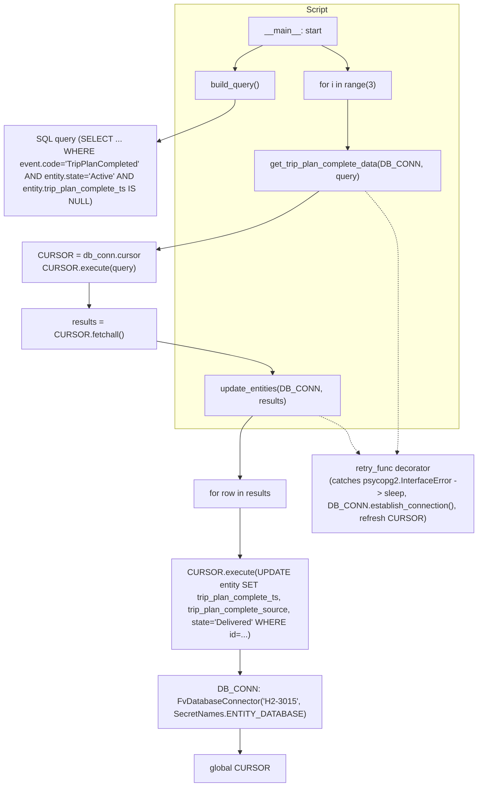

# Diagram: entity_core/entity_service/entity_service_scripts/H2-3015.py

> Auto-generated by Obscura crawlers

## Mermaid

### SVG

<svg id="container" width="979.94921875" xmlns="http://www.w3.org/2000/svg" class="flowchart" height="1440" viewBox="0 0 979.94921875 1440" role="graphics-document document" aria-roledescription="flowchart-v2"><g><marker id="container_flowchart-v2-pointEnd" class="marker flowchart-v2" viewBox="0 0 10 10" refX="5" refY="5" markerUnits="userSpaceOnUse" markerWidth="8" markerHeight="8" orient="auto"><path d="M 0 0 L 10 5 L 0 10 z" class="arrowMarkerPath" style="stroke-width: 1; stroke-dasharray: 1, 0;"></path></marker><marker id="container_flowchart-v2-pointStart" class="marker flowchart-v2" viewBox="0 0 10 10" refX="4.5" refY="5" markerUnits="userSpaceOnUse" markerWidth="8" markerHeight="8" orient="auto"><path d="M 0 5 L 10 10 L 10 0 z" class="arrowMarkerPath" style="stroke-width: 1; stroke-dasharray: 1, 0;"></path></marker><marker id="container_flowchart-v2-circleEnd" class="marker flowchart-v2" viewBox="0 0 10 10" refX="11" refY="5" markerUnits="userSpaceOnUse" markerWidth="11" markerHeight="11" orient="auto"><circle cx="5" cy="5" r="5" class="arrowMarkerPath" style="stroke-width: 1; stroke-dasharray: 1, 0;"></circle></marker><marker id="container_flowchart-v2-circleStart" class="marker flowchart-v2" viewBox="0 0 10 10" refX="-1" refY="5" markerUnits="userSpaceOnUse" markerWidth="11" markerHeight="11" orient="auto"><circle cx="5" cy="5" r="5" class="arrowMarkerPath" style="stroke-width: 1; stroke-dasharray: 1, 0;"></circle></marker><marker id="container_flowchart-v2-crossEnd" class="marker cross flowchart-v2" viewBox="0 0 11 11" refX="12" refY="5.2" markerUnits="userSpaceOnUse" markerWidth="11" markerHeight="11" orient="auto"><path d="M 1,1 l 9,9 M 10,1 l -9,9" class="arrowMarkerPath" style="stroke-width: 2; stroke-dasharray: 1, 0;"></path></marker><marker id="container_flowchart-v2-crossStart" class="marker cross flowchart-v2" viewBox="0 0 11 11" refX="-1" refY="5.2" markerUnits="userSpaceOnUse" markerWidth="11" markerHeight="11" orient="auto"><path d="M 1,1 l 9,9 M 10,1 l -9,9" class="arrowMarkerPath" style="stroke-width: 2; stroke-dasharray: 1, 0;"></path></marker><g class="root"><g class="clusters"><g class="cluster" id="Script" data-look="classic"><rect style="" x="401.578125" y="8" width="543.55859375" height="768"></rect><g class="cluster-label" transform="translate(652.185546875, 8)"><foreignObject width="42.34375" height="24">

Script

</foreignObject></g></g></g><g class="edgePaths"><path d="M568.403,87L559.56,91.167C550.717,95.333,533.03,103.667,524.187,111.333C515.344,119,515.344,126,515.344,129.5L515.344,133" id="L_Start_BuildQuery_0" class="edge-thickness-normal edge-pattern-solid edge-thickness-normal edge-pattern-solid flowchart-link" style=";" data-edge="true" data-et="edge" data-id="L_Start_BuildQuery_0" data-points="W3sieCI6NTY4LjQwMzAxOTgzMTczMDcsInkiOjg3fSx7IngiOjUxNS4zNDM3NSwieSI6MTEyfSx7IngiOjUxNS4zNDM3NSwieSI6MTM3fV0=" marker-end="url(#container_flowchart-v2-pointEnd)"></path><path d="M515.344,191L515.344,195.167C515.344,199.333,515.344,207.667,491.181,219.967C467.019,232.267,418.694,248.534,394.532,256.668L370.369,264.801" id="L_BuildQuery_Query_0" class="edge-thickness-normal edge-pattern-solid edge-thickness-normal edge-pattern-solid flowchart-link" style=";" data-edge="true" data-et="edge" data-id="L_BuildQuery_Query_0" data-points="W3sieCI6NTE1LjM0Mzc1LCJ5IjoxOTF9LHsieCI6NTE1LjM0Mzc1LCJ5IjoyMTZ9LHsieCI6MzY2LjU3ODEyNSwieSI6MjY2LjA3NzU4MDUzOTExOX1d" marker-end="url(#container_flowchart-v2-pointEnd)"></path><path d="M681.293,87L689.871,91.167C698.449,95.333,715.606,103.667,724.184,111.333C732.762,119,732.762,126,732.762,129.5L732.762,133" id="L_Start_Loop_0" class="edge-thickness-normal edge-pattern-solid edge-thickness-normal edge-pattern-solid flowchart-link" style=";" data-edge="true" data-et="edge" data-id="L_Start_Loop_0" data-points="W3sieCI6NjgxLjI5MzExODk5MDM4NDYsInkiOjg3fSx7IngiOjczMi43NjE3MTg3NSwieSI6MTEyfSx7IngiOjczMi43NjE3MTg3NSwieSI6MTM3fV0=" marker-end="url(#container_flowchart-v2-pointEnd)"></path><path d="M732.762,191L732.762,195.167C732.762,199.333,732.762,207.667,732.762,221.333C732.762,235,732.762,254,732.762,263.5L732.762,273" id="L_Loop_GetData_0" class="edge-thickness-normal edge-pattern-solid edge-thickness-normal edge-pattern-solid flowchart-link" style=";" data-edge="true" data-et="edge" data-id="L_Loop_GetData_0" data-points="W3sieCI6NzMyLjc2MTcxODc1LCJ5IjoxOTF9LHsieCI6NzMyLjc2MTcxODc1LCJ5IjoyMTZ9LHsieCI6NzMyLjc2MTcxODc1LCJ5IjoyNzd9XQ==" marker-end="url(#container_flowchart-v2-pointEnd)"></path><path d="M671.436,355L655.449,365.167C639.462,375.333,607.489,395.667,557.337,411.466C507.185,427.264,438.855,438.529,404.69,444.161L370.525,449.793" id="L_GetData_CURSORExec_0" class="edge-thickness-normal edge-pattern-solid edge-thickness-normal edge-pattern-solid flowchart-link" style=";" data-edge="true" data-et="edge" data-id="L_GetData_CURSORExec_0" data-points="W3sieCI6NjcxLjQzNTc0MjE4NzUsInkiOjM1NX0seyJ4Ijo1NzUuNTE1NjI1LCJ5Ijo0MTZ9LHsieCI6MzY2LjU3ODEyNSwieSI6NDUwLjQ0MzgwNDk2MjQ2OTZ9XQ==" marker-end="url(#container_flowchart-v2-pointEnd)"></path><path d="M187.289,519L187.289,523.167C187.289,527.333,187.289,535.667,187.289,543.333C187.289,551,187.289,558,187.289,561.5L187.289,565" id="L_CURSORExec_Fetch_0" class="edge-thickness-normal edge-pattern-solid edge-thickness-normal edge-pattern-solid flowchart-link" style=";" data-edge="true" data-et="edge" data-id="L_CURSORExec_Fetch_0" data-points="W3sieCI6MTg3LjI4OTA2MjUsInkiOjUxOX0seyJ4IjoxODcuMjg5MDYyNSwieSI6NTQ0fSx7IngiOjE4Ny4yODkwNjI1LCJ5Ijo1Njl9XQ==" marker-end="url(#container_flowchart-v2-pointEnd)"></path><path d="M313.508,612.422L359.083,618.352C404.658,624.281,495.807,636.141,541.382,645.57C586.957,655,586.957,662,586.957,665.5L586.957,669" id="L_Fetch_UpdateEntities_0" class="edge-thickness-normal edge-pattern-solid edge-thickness-normal edge-pattern-solid flowchart-link" style=";" data-edge="true" data-et="edge" data-id="L_Fetch_UpdateEntities_0" data-points="W3sieCI6MzEzLjUwNzgxMjUsInkiOjYxMi40MjIwNjkxMDAzMjc1fSx7IngiOjU4Ni45NTcwMzEyNSwieSI6NjQ4fSx7IngiOjU4Ni45NTcwMzEyNSwieSI6NjczfV0=" marker-end="url(#container_flowchart-v2-pointEnd)"></path><path d="M548.871,751L544.802,755.167C540.733,759.333,532.595,767.667,528.526,776C524.457,784.333,524.457,792.667,524.457,806.333C524.457,820,524.457,839,524.457,848.5L524.457,858" id="L_UpdateEntities_ForRow_0" class="edge-thickness-normal edge-pattern-solid edge-thickness-normal edge-pattern-solid flowchart-link" style=";" data-edge="true" data-et="edge" data-id="L_UpdateEntities_ForRow_0" data-points="W3sieCI6NTQ4Ljg3MTA5Mzc1LCJ5Ijo3NTF9LHsieCI6NTI0LjQ1NzAzMTI1LCJ5Ijo3NzZ9LHsieCI6NTI0LjQ1NzAzMTI1LCJ5Ijo4MDF9LHsieCI6NTI0LjQ1NzAzMTI1LCJ5Ijo4NjJ9XQ==" marker-end="url(#container_flowchart-v2-pointEnd)"></path><path d="M524.457,916L524.457,926.167C524.457,936.333,524.457,956.667,524.457,970.333C524.457,984,524.457,991,524.457,994.5L524.457,998" id="L_ForRow_UpdateExec_0" class="edge-thickness-normal edge-pattern-solid edge-thickness-normal edge-pattern-solid flowchart-link" style=";" data-edge="true" data-et="edge" data-id="L_ForRow_UpdateExec_0" data-points="W3sieCI6NTI0LjQ1NzAzMTI1LCJ5Ijo5MTZ9LHsieCI6NTI0LjQ1NzAzMTI1LCJ5Ijo5Nzd9LHsieCI6NTI0LjQ1NzAzMTI1LCJ5IjoxMDAyfV0=" marker-end="url(#container_flowchart-v2-pointEnd)"></path><path d="M524.457,1176L524.457,1180.167C524.457,1184.333,524.457,1192.667,524.457,1200.333C524.457,1208,524.457,1215,524.457,1218.5L524.457,1222" id="L_UpdateExec_DB_0" class="edge-thickness-normal edge-pattern-solid edge-thickness-normal edge-pattern-solid flowchart-link" style=";" data-edge="true" data-et="edge" data-id="L_UpdateExec_DB_0" data-points="W3sieCI6NTI0LjQ1NzAzMTI1LCJ5IjoxMTc2fSx7IngiOjUyNC40NTcwMzEyNSwieSI6MTIwMX0seyJ4Ijo1MjQuNDU3MDMxMjUsInkiOjEyMjZ9XQ==" marker-end="url(#container_flowchart-v2-pointEnd)"></path><path d="M524.457,1328L524.457,1332.167C524.457,1336.333,524.457,1344.667,524.457,1352.333C524.457,1360,524.457,1367,524.457,1370.5L524.457,1374" id="L_DB_CURSORVar_0" class="edge-thickness-normal edge-pattern-solid edge-thickness-normal edge-pattern-solid flowchart-link" style=";" data-edge="true" data-et="edge" data-id="L_DB_CURSORVar_0" data-points="W3sieCI6NTI0LjQ1NzAzMTI1LCJ5IjoxMzI4fSx7IngiOjUyNC40NTcwMzEyNSwieSI6MTM1M30seyJ4Ijo1MjQuNDU3MDMxMjUsInkiOjEzNzh9XQ==" marker-end="url(#container_flowchart-v2-pointEnd)"></path><path d="M770.275,355L780.054,365.167C789.833,375.333,809.391,395.667,819.17,416.5C828.949,437.333,828.949,458.667,828.949,480C828.949,501.333,828.949,522.667,828.949,542C828.949,561.333,828.949,578.667,828.949,596C828.949,613.333,828.949,630.667,828.949,650C828.949,669.333,828.949,690.667,828.949,712C828.949,733.333,828.949,754.667,828.949,769.5C828.949,784.333,828.949,792.667,828.551,800.338C828.153,808.009,827.356,815.017,826.958,818.521L826.56,822.026" id="L_GetData_Retry_0" class="edge-thickness-normal edge-pattern-dotted edge-thickness-normal edge-pattern-solid flowchart-link" style=";" data-edge="true" data-et="edge" data-id="L_GetData_Retry_0" data-points="W3sieCI6NzcwLjI3NDg0Mzc1LCJ5IjozNTV9LHsieCI6ODI4Ljk0OTIxODc1LCJ5Ijo0MTZ9LHsieCI6ODI4Ljk0OTIxODc1LCJ5Ijo0ODB9LHsieCI6ODI4Ljk0OTIxODc1LCJ5Ijo1NDR9LHsieCI6ODI4Ljk0OTIxODc1LCJ5Ijo1OTZ9LHsieCI6ODI4Ljk0OTIxODc1LCJ5Ijo2NDh9LHsieCI6ODI4Ljk0OTIxODc1LCJ5Ijo3MTJ9LHsieCI6ODI4Ljk0OTIxODc1LCJ5Ijo3NzZ9LHsieCI6ODI4Ljk0OTIxODc1LCJ5Ijo4MDF9LHsieCI6ODI2LjEwODMwOTY1OTA5MDksInkiOjgyNn1d" marker-end="url(#container_flowchart-v2-pointEnd)"></path><path d="M676.685,751L686.271,755.167C695.858,759.333,715.03,767.667,724.617,776C734.203,784.333,734.203,792.667,737.753,800.52C741.303,808.373,748.404,815.746,751.954,819.432L755.504,823.119" id="L_UpdateEntities_Retry_0" class="edge-thickness-normal edge-pattern-dotted edge-thickness-normal edge-pattern-solid flowchart-link" style=";" data-edge="true" data-et="edge" data-id="L_UpdateEntities_Retry_0" data-points="W3sieCI6Njc2LjY4NTExOTYyODkwNjIsInkiOjc1MX0seyJ4Ijo3MzQuMjAzMTI1LCJ5Ijo3NzZ9LHsieCI6NzM0LjIwMzEyNSwieSI6ODAxfSx7IngiOjc1OC4yNzg3MTk4MTUzNDA5LCJ5Ijo4MjZ9XQ==" marker-end="url(#container_flowchart-v2-pointEnd)"></path></g><g class="edgeLabels"><g class="edgeLabel"><g class="label" data-id="L_Start_BuildQuery_0" transform="translate(0, 0)"><foreignObject width="0" height="0">

</foreignObject></g></g><g class="edgeLabel"><g class="label" data-id="L_BuildQuery_Query_0" transform="translate(0, 0)"><foreignObject width="0" height="0">

</foreignObject></g></g><g class="edgeLabel"><g class="label" data-id="L_Start_Loop_0" transform="translate(0, 0)"><foreignObject width="0" height="0">

</foreignObject></g></g><g class="edgeLabel"><g class="label" data-id="L_Loop_GetData_0" transform="translate(0, 0)"><foreignObject width="0" height="0">

</foreignObject></g></g><g class="edgeLabel"><g class="label" data-id="L_GetData_CURSORExec_0" transform="translate(0, 0)"><foreignObject width="0" height="0">

</foreignObject></g></g><g class="edgeLabel"><g class="label" data-id="L_CURSORExec_Fetch_0" transform="translate(0, 0)"><foreignObject width="0" height="0">

</foreignObject></g></g><g class="edgeLabel"><g class="label" data-id="L_Fetch_UpdateEntities_0" transform="translate(0, 0)"><foreignObject width="0" height="0">

</foreignObject></g></g><g class="edgeLabel"><g class="label" data-id="L_UpdateEntities_ForRow_0" transform="translate(0, 0)"><foreignObject width="0" height="0">

</foreignObject></g></g><g class="edgeLabel"><g class="label" data-id="L_ForRow_UpdateExec_0" transform="translate(0, 0)"><foreignObject width="0" height="0">

</foreignObject></g></g><g class="edgeLabel"><g class="label" data-id="L_UpdateExec_DB_0" transform="translate(0, 0)"><foreignObject width="0" height="0">

</foreignObject></g></g><g class="edgeLabel"><g class="label" data-id="L_DB_CURSORVar_0" transform="translate(0, 0)"><foreignObject width="0" height="0">

</foreignObject></g></g><g class="edgeLabel"><g class="label" data-id="L_GetData_Retry_0" transform="translate(0, 0)"><foreignObject width="0" height="0">

</foreignObject></g></g><g class="edgeLabel"><g class="label" data-id="L_UpdateEntities_Retry_0" transform="translate(0, 0)"><foreignObject width="0" height="0">

</foreignObject></g></g></g><g class="nodes"><g class="node default" id="flowchart-Start-0" transform="translate(625.70703125, 60)"><rect class="basic label-container" style="" x="-68.9609375" y="-27" width="137.921875" height="54"></rect><g class="label" style="" transform="translate(-38.9609375, -12)"><rect></rect><foreignObject width="77.921875" height="24">

<strong>main</strong>: start

</foreignObject></g></g><g class="node default" id="flowchart-BuildQuery-1" transform="translate(515.34375, 164)"><rect class="basic label-container" style="" x="-78.765625" y="-27" width="157.53125" height="54"></rect><g class="label" style="" transform="translate(-48.765625, -12)"><rect></rect><foreignObject width="97.53125" height="24">

build_query()

</foreignObject></g></g><g class="node default" id="flowchart-Loop-2" transform="translate(732.76171875, 164)"><rect class="basic label-container" style="" x="-85.34375" y="-27" width="170.6875" height="54"></rect><g class="label" style="" transform="translate(-55.34375, -12)"><rect></rect><foreignObject width="110.6875" height="24">

for i in range(3)

</foreignObject></g></g><g class="node default" id="flowchart-GetData-3" transform="translate(732.76171875, 316)"><rect class="basic label-container" style="" x="-177.375" y="-39" width="354.75" height="78"></rect><g class="label" style="" transform="translate(-147.375, -24)"><rect></rect><foreignObject width="294.75" height="48">

get_trip_plan_complete_data(DB_CONN, query)

</foreignObject></g></g><g class="node default" id="flowchart-UpdateEntities-4" transform="translate(586.95703125, 712)"><rect class="basic label-container" style="" x="-130" y="-39" width="260" height="78"></rect><g class="label" style="" transform="translate(-100, -24)"><rect></rect><foreignObject width="200" height="48">

update_entities(DB_CONN, results)

</foreignObject></g></g><g class="node default" id="flowchart-Query-8" transform="translate(218.2734375, 316)"><rect class="basic label-container" style="" x="-148.3046875" y="-75" width="296.609375" height="150"></rect><g class="label" style="" transform="translate(-118.3046875, -60)"><rect></rect><foreignObject width="236.609375" height="120">

SQL query (SELECT ... WHERE event.code='TripPlanCompleted' AND entity.state='Active' AND entity.trip_plan_complete_ts IS NULL)

</foreignObject></g></g><g class="node default" id="flowchart-CURSORExec-14" transform="translate(187.2890625, 480)"><rect class="basic label-container" style="" x="-179.2890625" y="-39" width="358.578125" height="78"></rect><g class="label" style="" transform="translate(-149.2890625, -24)"><rect></rect><foreignObject width="298.578125" height="48">

CURSOR = db_conn.cursor\nCURSOR.execute(query)

</foreignObject></g></g><g class="node default" id="flowchart-Fetch-16" transform="translate(187.2890625, 596)"><rect class="basic label-container" style="" x="-126.21875" y="-27" width="252.4375" height="54"></rect><g class="label" style="" transform="translate(-96.21875, -12)"><rect></rect><foreignObject width="192.4375" height="24">

results = CURSOR.fetchall()

</foreignObject></g></g><g class="node default" id="flowchart-ForRow-20" transform="translate(524.45703125, 889)"><rect class="basic label-container" style="" x="-91.4921875" y="-27" width="182.984375" height="54"></rect><g class="label" style="" transform="translate(-61.4921875, -12)"><rect></rect><foreignObject width="122.984375" height="24">

for row in results

</foreignObject></g></g><g class="node default" id="flowchart-UpdateExec-22" transform="translate(524.45703125, 1089)"><rect class="basic label-container" style="" x="-132.7109375" y="-87" width="265.421875" height="174"></rect><g class="label" style="" transform="translate(-102.7109375, -72)"><rect></rect><foreignObject width="205.421875" height="144">

CURSOR.execute(UPDATE entity SET trip_plan_complete_ts, trip_plan_complete_source, state='Delivered' WHERE id=...)

</foreignObject></g></g><g class="node default" id="flowchart-DB-24" transform="translate(524.45703125, 1277)"><rect class="basic label-container" style="" x="-145.84375" y="-51" width="291.6875" height="102"></rect><g class="label" style="" transform="translate(-115.84375, -36)"><rect></rect><foreignObject width="231.6875" height="72">

DB_CONN: FvDatabaseConnector('H2-3015', SecretNames.ENTITY_DATABASE)

</foreignObject></g></g><g class="node default" id="flowchart-CURSORVar-26" transform="translate(524.45703125, 1405)"><rect class="basic label-container" style="" x="-83.765625" y="-27" width="167.53125" height="54"></rect><g class="label" style="" transform="translate(-53.765625, -12)"><rect></rect><foreignObject width="107.53125" height="24">

global CURSOR

</foreignObject></g></g><g class="node default" id="flowchart-Retry-27" transform="translate(818.94921875, 889)"><rect class="basic label-container" style="" x="-153" y="-63" width="306" height="126"></rect><g class="label" style="" transform="translate(-123, -48)"><rect></rect><foreignObject width="246" height="96">

retry_func decorator\n(catches psycopg2.InterfaceError -&gt; sleep, DB_CONN.establish_connection(), refresh CURSOR)

</foreignObject></g></g></g></g></g></svg>
