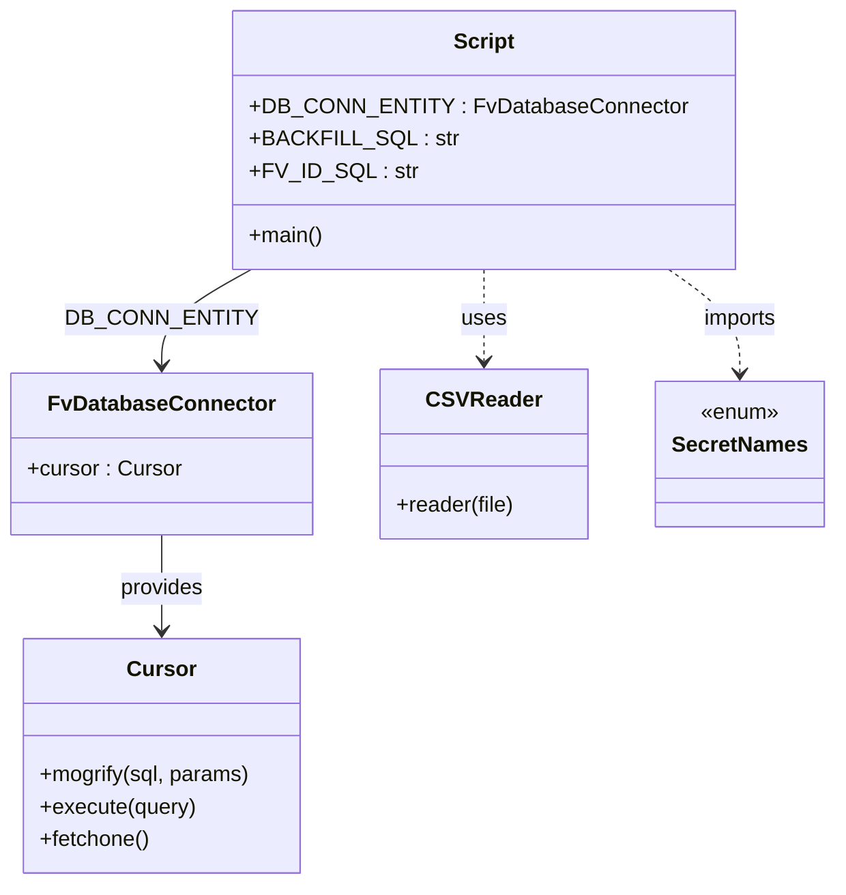

# Diagram: entity_core/entity_service/entity_service_scripts/backfill_DPU-1143.py


> Auto-generated by Obscura crawlers

## Diagram 1

```mermaid
flowchart TD
    Start([Start])
    GetArgs[/Read argv[1] as filepath/]
    RelPath[/Get relative path of script/]
    JoinPath[/Join relative path and argv filepath/]
    PrintPaths(("print(filepath) & print(full path)"))
    OpenFile[[Open CSV file (utf-8-sig)]]
    CSVReader[/csv.reader(file)/]
    Loop{{For each line in CSV}}
    ParseLine[/origin_cdl = line[0]\nscac = line[1]/]
    Cursor[[cursor = DB_CONN_ENTITY.cursor]]
    FVQuery[/cursor.mogrify(FV_ID_SQL, data)\ncursor.execute(query)/]
    Fetch[/result = cursor.fetchone()/]
    HasResult{{result exists?}}
    Insert[/cursor.mogrify(BACKFILL_SQL, {fv_id, origin_cdl})\ncursor.execute(query)/]
    PrintInvalid[/print("invalid scac or origin_cdl")/]
    End([End])

    Start --> GetArgs --> RelPath --> JoinPath --> PrintPaths --> OpenFile --> CSVReader --> Loop
    Loop --> ParseLine --> Cursor --> FVQuery --> Fetch --> HasResult
    HasResult -- Yes --> Insert --> Loop
    HasResult -- No --> PrintInvalid --> Loop
    Loop --> End
```

> SVG rendering failed for this diagram.

## Diagram 2



### SVG

<svg id="container" width="604.109375" xmlns="http://www.w3.org/2000/svg" class="classDiagram" height="656" viewBox="0 0 604.109375 656" role="graphics-document document" aria-roledescription="class"><style>#container{font-family:"trebuchet ms",verdana,arial,sans-serif;font-size:16px;fill:#333;}@keyframes edge-animation-frame{from{stroke-dashoffset:0;}}@keyframes dash{to{stroke-dashoffset:0;}}#container .edge-animation-slow{stroke-dasharray:9,5!important;stroke-dashoffset:900;animation:dash 50s linear infinite;stroke-linecap:round;}#container .edge-animation-fast{stroke-dasharray:9,5!important;stroke-dashoffset:900;animation:dash 20s linear infinite;stroke-linecap:round;}#container .error-icon{fill:#552222;}#container .error-text{fill:#552222;stroke:#552222;}#container .edge-thickness-normal{stroke-width:1px;}#container .edge-thickness-thick{stroke-width:3.5px;}#container .edge-pattern-solid{stroke-dasharray:0;}#container .edge-thickness-invisible{stroke-width:0;fill:none;}#container .edge-pattern-dashed{stroke-dasharray:3;}#container .edge-pattern-dotted{stroke-dasharray:2;}#container .marker{fill:#333333;stroke:#333333;}#container .marker.cross{stroke:#333333;}#container svg{font-family:"trebuchet ms",verdana,arial,sans-serif;font-size:16px;}#container p{margin:0;}#container g.classGroup text{fill:#9370DB;stroke:none;font-family:"trebuchet ms",verdana,arial,sans-serif;font-size:10px;}#container g.classGroup text .title{font-weight:bolder;}#container .nodeLabel,#container .edgeLabel{color:#131300;}#container .edgeLabel .label rect{fill:#ECECFF;}#container .label text{fill:#131300;}#container .labelBkg{background:#ECECFF;}#container .edgeLabel .label span{background:#ECECFF;}#container .classTitle{font-weight:bolder;}#container .node rect,#container .node circle,#container .node ellipse,#container .node polygon,#container .node path{fill:#ECECFF;stroke:#9370DB;stroke-width:1px;}#container .divider{stroke:#9370DB;stroke-width:1;}#container g.clickable{cursor:pointer;}#container g.classGroup rect{fill:#ECECFF;stroke:#9370DB;}#container g.classGroup line{stroke:#9370DB;stroke-width:1;}#container .classLabel .box{stroke:none;stroke-width:0;fill:#ECECFF;opacity:0.5;}#container .classLabel .label{fill:#9370DB;font-size:10px;}#container .relation{stroke:#333333;stroke-width:1;fill:none;}#container .dashed-line{stroke-dasharray:3;}#container .dotted-line{stroke-dasharray:1 2;}#container #compositionStart,#container .composition{fill:#333333!important;stroke:#333333!important;stroke-width:1;}#container #compositionEnd,#container .composition{fill:#333333!important;stroke:#333333!important;stroke-width:1;}#container #dependencyStart,#container .dependency{fill:#333333!important;stroke:#333333!important;stroke-width:1;}#container #dependencyStart,#container .dependency{fill:#333333!important;stroke:#333333!important;stroke-width:1;}#container #extensionStart,#container .extension{fill:transparent!important;stroke:#333333!important;stroke-width:1;}#container #extensionEnd,#container .extension{fill:transparent!important;stroke:#333333!important;stroke-width:1;}#container #aggregationStart,#container .aggregation{fill:transparent!important;stroke:#333333!important;stroke-width:1;}#container #aggregationEnd,#container .aggregation{fill:transparent!important;stroke:#333333!important;stroke-width:1;}#container #lollipopStart,#container .lollipop{fill:#ECECFF!important;stroke:#333333!important;stroke-width:1;}#container #lollipopEnd,#container .lollipop{fill:#ECECFF!important;stroke:#333333!important;stroke-width:1;}#container .edgeTerminals{font-size:11px;line-height:initial;}#container .classTitleText{text-anchor:middle;font-size:18px;fill:#333;}#container .label-icon{display:inline-block;height:1em;overflow:visible;vertical-align:-0.125em;}#container .node .label-icon path{fill:currentColor;stroke:revert;stroke-width:revert;}#container :root{--mermaid-font-family:"trebuchet ms",verdana,arial,sans-serif;}</style><g><defs><marker id="container_class-aggregationStart" class="marker aggregation class" refX="18" refY="7" markerWidth="190" markerHeight="240" orient="auto"><path d="M 18,7 L9,13 L1,7 L9,1 Z"></path></marker></defs><defs><marker id="container_class-aggregationEnd" class="marker aggregation class" refX="1" refY="7" markerWidth="20" markerHeight="28" orient="auto"><path d="M 18,7 L9,13 L1,7 L9,1 Z"></path></marker></defs><defs><marker id="container_class-extensionStart" class="marker extension class" refX="18" refY="7" markerWidth="190" markerHeight="240" orient="auto"><path d="M 1,7 L18,13 V 1 Z"></path></marker></defs><defs><marker id="container_class-extensionEnd" class="marker extension class" refX="1" refY="7" markerWidth="20" markerHeight="28" orient="auto"><path d="M 1,1 V 13 L18,7 Z"></path></marker></defs><defs><marker id="container_class-compositionStart" class="marker composition class" refX="18" refY="7" markerWidth="190" markerHeight="240" orient="auto"><path d="M 18,7 L9,13 L1,7 L9,1 Z"></path></marker></defs><defs><marker id="container_class-compositionEnd" class="marker composition class" refX="1" refY="7" markerWidth="20" markerHeight="28" orient="auto"><path d="M 18,7 L9,13 L1,7 L9,1 Z"></path></marker></defs><defs><marker id="container_class-dependencyStart" class="marker dependency class" refX="6" refY="7" markerWidth="190" markerHeight="240" orient="auto"><path d="M 5,7 L9,13 L1,7 L9,1 Z"></path></marker></defs><defs><marker id="container_class-dependencyEnd" class="marker dependency class" refX="13" refY="7" markerWidth="20" markerHeight="28" orient="auto"><path d="M 18,7 L9,13 L14,7 L9,1 Z"></path></marker></defs><defs><marker id="container_class-lollipopStart" class="marker lollipop class" refX="13" refY="7" markerWidth="190" markerHeight="240" orient="auto"><circle stroke="black" fill="transparent" cx="7" cy="7" r="6"></circle></marker></defs><defs><marker id="container_class-lollipopEnd" class="marker lollipop class" refX="1" refY="7" markerWidth="190" markerHeight="240" orient="auto"><circle stroke="black" fill="transparent" cx="7" cy="7" r="6"></circle></marker></defs><g class="root"><g class="clusters"></g><g class="edgePaths"><path d="M181.241,200L170.39,206.167C159.54,212.333,137.838,224.667,126.987,236.5C116.137,248.333,116.137,259.667,116.137,265.333L116.137,271" id="id_Script_FvDatabaseConnector_1" class="edge-thickness-normal edge-pattern-solid relation" style=";;;" data-edge="true" data-et="edge" data-id="id_Script_FvDatabaseConnector_1" data-points="W3sieCI6MTgxLjI0MDk4MzMxNzY2OTE2LCJ5IjoyMDB9LHsieCI6MTE2LjEzNjcxODc1LCJ5IjoyMzd9LHsieCI6MTE2LjEzNjcxODc1LCJ5IjoyNzd9XQ==" marker-end="url(#container_class-dependencyEnd)"></path><path d="M116.137,397L116.137,403.667C116.137,410.333,116.137,423.667,116.137,435.5C116.137,447.333,116.137,457.667,116.137,462.833L116.137,468" id="id_FvDatabaseConnector_Cursor_2" class="edge-thickness-normal edge-pattern-solid relation" style=";;;" data-edge="true" data-et="edge" data-id="id_FvDatabaseConnector_Cursor_2" data-points="W3sieCI6MTE2LjEzNjcxODc1LCJ5IjozOTd9LHsieCI6MTE2LjEzNjcxODc1LCJ5Ijo0Mzd9LHsieCI6MTE2LjEzNjcxODc1LCJ5Ijo0NzR9XQ==" marker-end="url(#container_class-dependencyEnd)"></path><path d="M350.16,200L350.16,206.167C350.16,212.333,350.16,224.667,350.16,236C350.16,247.333,350.16,257.667,350.16,262.833L350.16,268" id="id_Script_CSVReader_3" class="edge-thickness-normal edge-pattern-dashed relation" style=";;;" data-edge="true" data-et="edge" data-id="id_Script_CSVReader_3" data-points="W3sieCI6MzUwLjE2MDE1NjI1LCJ5IjoyMDB9LHsieCI6MzUwLjE2MDE1NjI1LCJ5IjoyMzd9LHsieCI6MzUwLjE2MDE1NjI1LCJ5IjoyNzR9XQ==" marker-end="url(#container_class-dependencyEnd)"></path><path d="M484.357,200L492.977,206.167C501.597,212.333,518.838,224.667,527.458,237.5C536.078,250.333,536.078,263.667,536.078,270.333L536.078,277" id="id_Script_SecretNames_4" class="edge-thickness-normal edge-pattern-dashed relation" style=";;;" data-edge="true" data-et="edge" data-id="id_Script_SecretNames_4" data-points="W3sieCI6NDg0LjM1NjU4NDgyMTQyODU2LCJ5IjoyMDB9LHsieCI6NTM2LjA3ODEyNSwieSI6MjM3fSx7IngiOjUzNi4wNzgxMjUsInkiOjI4M31d" marker-end="url(#container_class-dependencyEnd)"></path></g><g class="edgeLabels"><g class="edgeLabel" transform="translate(116.13671875, 237)"><g class="label" data-id="id_Script_FvDatabaseConnector_1" transform="translate(-63.421875, -12)"><foreignObject width="126.84375" height="24"><div xmlns="http://www.w3.org/1999/xhtml" class="labelBkg" style="display: table-cell; white-space: nowrap; line-height: 1.5; max-width: 200px; text-align: center;"><span class="edgeLabel"><p>DB_CONN_ENTITY</p></span></div></foreignObject></g></g><g class="edgeLabel" transform="translate(116.13671875, 437)"><g class="label" data-id="id_FvDatabaseConnector_Cursor_2" transform="translate(-31.3125, -12)"><foreignObject width="62.625" height="24"><div xmlns="http://www.w3.org/1999/xhtml" class="labelBkg" style="display: table-cell; white-space: nowrap; line-height: 1.5; max-width: 200px; text-align: center;"><span class="edgeLabel"><p>provides</p></span></div></foreignObject></g></g><g class="edgeLabel" transform="translate(350.16015625, 237)"><g class="label" data-id="id_Script_CSVReader_3" transform="translate(-16.4921875, -12)"><foreignObject width="32.984375" height="24"><div xmlns="http://www.w3.org/1999/xhtml" class="labelBkg" style="display: table-cell; white-space: nowrap; line-height: 1.5; max-width: 200px; text-align: center;"><span class="edgeLabel"><p>uses</p></span></div></foreignObject></g></g><g class="edgeLabel" transform="translate(536.078125, 237)"><g class="label" data-id="id_Script_SecretNames_4" transform="translate(-28.25, -12)"><foreignObject width="56.5" height="24"><div xmlns="http://www.w3.org/1999/xhtml" class="labelBkg" style="display: table-cell; white-space: nowrap; line-height: 1.5; max-width: 200px; text-align: center;"><span class="edgeLabel"><p>imports</p></span></div></foreignObject></g></g></g><g class="nodes"><g class="node default" id="classId-Script-0" transform="translate(350.16015625, 104)"><g class="basic label-container"><path d="M-174.75390625 -96 L174.75390625 -96 L174.75390625 96 L-174.75390625 96" stroke="none" stroke-width="0" fill="#ECECFF" style=""></path><path d="M-174.75390625 -96 C-66.81954580453257 -96, 41.11481464093487 -96, 174.75390625 -96 M-174.75390625 -96 C-97.04066620346212 -96, -19.327426156924247 -96, 174.75390625 -96 M174.75390625 -96 C174.75390625 -56.53888697245771, 174.75390625 -17.07777394491542, 174.75390625 96 M174.75390625 -96 C174.75390625 -36.25798860876874, 174.75390625 23.484022782462517, 174.75390625 96 M174.75390625 96 C72.01919643491514 96, -30.71551338016971 96, -174.75390625 96 M174.75390625 96 C68.90833919972897 96, -36.93722785054206 96, -174.75390625 96 M-174.75390625 96 C-174.75390625 23.625019641737453, -174.75390625 -48.749960716525095, -174.75390625 -96 M-174.75390625 96 C-174.75390625 38.736125159461196, -174.75390625 -18.52774968107761, -174.75390625 -96" stroke="#9370DB" stroke-width="1.3" fill="none" stroke-dasharray="0 0" style=""></path></g><g class="annotation-group text" transform="translate(0, -72)"></g><g class="label-group text" transform="translate(-21.7421875, -72)"><g class="label" style="font-weight: bolder" transform="translate(0,-12)"><foreignObject width="43.484375" height="24"><div xmlns="http://www.w3.org/1999/xhtml" style="display: table-cell; white-space: nowrap; line-height: 1.5; max-width: 93px; text-align: center;"><span class="nodeLabel markdown-node-label" style=""><p>Script</p></span></div></foreignObject></g></g><g class="members-group text" transform="translate(-162.75390625, -24)"><g class="label" style="" transform="translate(0,-12)"><foreignObject width="303.765625" height="24"><div xmlns="http://www.w3.org/1999/xhtml" style="display: table-cell; white-space: nowrap; line-height: 1.5; max-width: 362px; text-align: center;"><span class="nodeLabel markdown-node-label" style=""><p>+DB_CONN_ENTITY : FvDatabaseConnector</p></span></div></foreignObject></g><g class="label" style="" transform="translate(0,12)"><foreignObject width="141.03125" height="24"><div xmlns="http://www.w3.org/1999/xhtml" style="display: table-cell; white-space: nowrap; line-height: 1.5; max-width: 199px; text-align: center;"><span class="nodeLabel markdown-node-label" style=""><p>+BACKFILL_SQL : str</p></span></div></foreignObject></g><g class="label" style="" transform="translate(0,36)"><foreignObject width="114.140625" height="24"><div xmlns="http://www.w3.org/1999/xhtml" style="display: table-cell; white-space: nowrap; line-height: 1.5; max-width: 172px; text-align: center;"><span class="nodeLabel markdown-node-label" style=""><p>+FV_ID_SQL : str</p></span></div></foreignObject></g></g><g class="methods-group text" transform="translate(-162.75390625, 72)"><g class="label" style="" transform="translate(0,-12)"><foreignObject width="54.65625" height="24"><div xmlns="http://www.w3.org/1999/xhtml" style="display: table-cell; white-space: nowrap; line-height: 1.5; max-width: 112px; text-align: center;"><span class="nodeLabel markdown-node-label" style=""><p>+main()</p></span></div></foreignObject></g></g><g class="divider" style=""><path d="M-174.75390625 -48 C-69.8424503539002 -48, 35.06900554219959 -48, 174.75390625 -48 M-174.75390625 -48 C-59.349678604198374 -48, 56.05454904160325 -48, 174.75390625 -48" stroke="#9370DB" stroke-width="1.3" fill="none" stroke-dasharray="0 0" style=""></path></g><g class="divider" style=""><path d="M-174.75390625 48 C-80.09541979820676 48, 14.563066653586475 48, 174.75390625 48 M-174.75390625 48 C-45.35793620994269 48, 84.03803383011461 48, 174.75390625 48" stroke="#9370DB" stroke-width="1.3" fill="none" stroke-dasharray="0 0" style=""></path></g></g><g class="node default" id="classId-FvDatabaseConnector-1" transform="translate(116.13671875, 337)"><g class="basic label-container"><path d="M-108.13671875 -60 L108.13671875 -60 L108.13671875 60 L-108.13671875 60" stroke="none" stroke-width="0" fill="#ECECFF" style=""></path><path d="M-108.13671875 -60 C-53.9825878971351 -60, 0.17154295572980516 -60, 108.13671875 -60 M-108.13671875 -60 C-55.91013118711983 -60, -3.683543624239661 -60, 108.13671875 -60 M108.13671875 -60 C108.13671875 -30.596146391940426, 108.13671875 -1.192292783880852, 108.13671875 60 M108.13671875 -60 C108.13671875 -24.934867640996643, 108.13671875 10.130264718006714, 108.13671875 60 M108.13671875 60 C53.33812781090631 60, -1.460463128187385 60, -108.13671875 60 M108.13671875 60 C58.14676522693078 60, 8.156811703861564 60, -108.13671875 60 M-108.13671875 60 C-108.13671875 15.9820848789982, -108.13671875 -28.0358302420036, -108.13671875 -60 M-108.13671875 60 C-108.13671875 32.425741826982566, -108.13671875 4.851483653965133, -108.13671875 -60" stroke="#9370DB" stroke-width="1.3" fill="none" stroke-dasharray="0 0" style=""></path></g><g class="annotation-group text" transform="translate(0, -36)"></g><g class="label-group text" transform="translate(-79.3046875, -36)"><g class="label" style="font-weight: bolder" transform="translate(0,-12)"><foreignObject width="158.609375" height="24"><div xmlns="http://www.w3.org/1999/xhtml" style="display: table-cell; white-space: nowrap; line-height: 1.5; max-width: 207px; text-align: center;"><span class="nodeLabel markdown-node-label" style=""><p>FvDatabaseConnector</p></span></div></foreignObject></g></g><g class="members-group text" transform="translate(-96.13671875, 12)"><g class="label" style="" transform="translate(0,-12)"><foreignObject width="112.96875" height="24"><div xmlns="http://www.w3.org/1999/xhtml" style="display: table-cell; white-space: nowrap; line-height: 1.5; max-width: 171px; text-align: center;"><span class="nodeLabel markdown-node-label" style=""><p>+cursor : Cursor</p></span></div></foreignObject></g></g><g class="methods-group text" transform="translate(-96.13671875, 60)"></g><g class="divider" style=""><path d="M-108.13671875 -12 C-60.30571869246592 -12, -12.474718634931847 -12, 108.13671875 -12 M-108.13671875 -12 C-55.696936795296104 -12, -3.2571548405922073 -12, 108.13671875 -12" stroke="#9370DB" stroke-width="1.3" fill="none" stroke-dasharray="0 0" style=""></path></g><g class="divider" style=""><path d="M-108.13671875 36 C-34.35157552428694 36, 39.433567701426114 36, 108.13671875 36 M-108.13671875 36 C-40.65492731849493 36, 26.826864113010146 36, 108.13671875 36" stroke="#9370DB" stroke-width="1.3" fill="none" stroke-dasharray="0 0" style=""></path></g></g><g class="node default" id="classId-Cursor-2" transform="translate(116.13671875, 561)"><g class="basic label-container"><path d="M-102.4921875 -87 L102.4921875 -87 L102.4921875 87 L-102.4921875 87" stroke="none" stroke-width="0" fill="#ECECFF" style=""></path><path d="M-102.4921875 -87 C-37.58558916418443 -87, 27.321009171631147 -87, 102.4921875 -87 M-102.4921875 -87 C-27.839027840694825 -87, 46.81413181861035 -87, 102.4921875 -87 M102.4921875 -87 C102.4921875 -37.55671708839631, 102.4921875 11.886565823207377, 102.4921875 87 M102.4921875 -87 C102.4921875 -30.49511426828201, 102.4921875 26.009771463435982, 102.4921875 87 M102.4921875 87 C22.380531030647575 87, -57.73112543870485 87, -102.4921875 87 M102.4921875 87 C53.73825532554375 87, 4.984323151087494 87, -102.4921875 87 M-102.4921875 87 C-102.4921875 40.157575292437336, -102.4921875 -6.684849415125328, -102.4921875 -87 M-102.4921875 87 C-102.4921875 36.382929446287704, -102.4921875 -14.234141107424591, -102.4921875 -87" stroke="#9370DB" stroke-width="1.3" fill="none" stroke-dasharray="0 0" style=""></path></g><g class="annotation-group text" transform="translate(0, -63)"></g><g class="label-group text" transform="translate(-23.90625, -63)"><g class="label" style="font-weight: bolder" transform="translate(0,-12)"><foreignObject width="47.8125" height="24"><div xmlns="http://www.w3.org/1999/xhtml" style="display: table-cell; white-space: nowrap; line-height: 1.5; max-width: 98px; text-align: center;"><span class="nodeLabel markdown-node-label" style=""><p>Cursor</p></span></div></foreignObject></g></g><g class="members-group text" transform="translate(-90.4921875, -15)"></g><g class="methods-group text" transform="translate(-90.4921875, 15)"><g class="label" style="" transform="translate(0,-12)"><foreignObject width="157.078125" height="24"><div xmlns="http://www.w3.org/1999/xhtml" style="display: table-cell; white-space: nowrap; line-height: 1.5; max-width: 214px; text-align: center;"><span class="nodeLabel markdown-node-label" style=""><p>+mogrify(sql, params)</p></span></div></foreignObject></g><g class="label" style="" transform="translate(0,12)"><foreignObject width="115.96875" height="24"><div xmlns="http://www.w3.org/1999/xhtml" style="display: table-cell; white-space: nowrap; line-height: 1.5; max-width: 173px; text-align: center;"><span class="nodeLabel markdown-node-label" style=""><p>+execute(query)</p></span></div></foreignObject></g><g class="label" style="" transform="translate(0,36)"><foreignObject width="82.046875" height="24"><div xmlns="http://www.w3.org/1999/xhtml" style="display: table-cell; white-space: nowrap; line-height: 1.5; max-width: 139px; text-align: center;"><span class="nodeLabel markdown-node-label" style=""><p>+fetchone()</p></span></div></foreignObject></g></g><g class="divider" style=""><path d="M-102.4921875 -39 C-28.799943699353904 -39, 44.89230010129219 -39, 102.4921875 -39 M-102.4921875 -39 C-41.80139188710785 -39, 18.889403725784305 -39, 102.4921875 -39" stroke="#9370DB" stroke-width="1.3" fill="none" stroke-dasharray="0 0" style=""></path></g><g class="divider" style=""><path d="M-102.4921875 -15 C-22.871822560066406 -15, 56.74854237986719 -15, 102.4921875 -15 M-102.4921875 -15 C-24.257189317523242 -15, 53.977808864953516 -15, 102.4921875 -15" stroke="#9370DB" stroke-width="1.3" fill="none" stroke-dasharray="0 0" style=""></path></g></g><g class="node default" id="classId-CSVReader-3" transform="translate(350.16015625, 337)"><g class="basic label-container"><path d="M-75.88671875 -63 L75.88671875 -63 L75.88671875 63 L-75.88671875 63" stroke="none" stroke-width="0" fill="#ECECFF" style=""></path><path d="M-75.88671875 -63 C-18.201970371803945 -63, 39.48277800639211 -63, 75.88671875 -63 M-75.88671875 -63 C-42.77591096664818 -63, -9.665103183296367 -63, 75.88671875 -63 M75.88671875 -63 C75.88671875 -14.47233890854686, 75.88671875 34.05532218290628, 75.88671875 63 M75.88671875 -63 C75.88671875 -28.229095193194247, 75.88671875 6.541809613611505, 75.88671875 63 M75.88671875 63 C31.95253987096119 63, -11.981639008077622 63, -75.88671875 63 M75.88671875 63 C37.91041820787829 63, -0.06588233424342604 63, -75.88671875 63 M-75.88671875 63 C-75.88671875 17.565469883863123, -75.88671875 -27.869060232273753, -75.88671875 -63 M-75.88671875 63 C-75.88671875 14.307981347220682, -75.88671875 -34.384037305558635, -75.88671875 -63" stroke="#9370DB" stroke-width="1.3" fill="none" stroke-dasharray="0 0" style=""></path></g><g class="annotation-group text" transform="translate(0, -39)"></g><g class="label-group text" transform="translate(-39.4609375, -39)"><g class="label" style="font-weight: bolder" transform="translate(0,-12)"><foreignObject width="78.921875" height="24"><div xmlns="http://www.w3.org/1999/xhtml" style="display: table-cell; white-space: nowrap; line-height: 1.5; max-width: 128px; text-align: center;"><span class="nodeLabel markdown-node-label" style=""><p>CSVReader</p></span></div></foreignObject></g></g><g class="members-group text" transform="translate(-63.88671875, 9)"></g><g class="methods-group text" transform="translate(-63.88671875, 39)"><g class="label" style="" transform="translate(0,-12)"><foreignObject width="88.3125" height="24"><div xmlns="http://www.w3.org/1999/xhtml" style="display: table-cell; white-space: nowrap; line-height: 1.5; max-width: 146px; text-align: center;"><span class="nodeLabel markdown-node-label" style=""><p>+reader(file)</p></span></div></foreignObject></g></g><g class="divider" style=""><path d="M-75.88671875 -15 C-27.26973780286221 -15, 21.34724314427558 -15, 75.88671875 -15 M-75.88671875 -15 C-26.363312297935913 -15, 23.160094154128174 -15, 75.88671875 -15" stroke="#9370DB" stroke-width="1.3" fill="none" stroke-dasharray="0 0" style=""></path></g><g class="divider" style=""><path d="M-75.88671875 9 C-37.20007419597457 9, 1.4865703580508551 9, 75.88671875 9 M-75.88671875 9 C-21.837095221618462 9, 32.212528306763076 9, 75.88671875 9" stroke="#9370DB" stroke-width="1.3" fill="none" stroke-dasharray="0 0" style=""></path></g></g><g class="node default" id="classId-SecretNames-4" transform="translate(536.078125, 337)"><g class="basic label-container"><path d="M-60.03125 -54 L60.03125 -54 L60.03125 54 L-60.03125 54" stroke="none" stroke-width="0" fill="#ECECFF" style=""></path><path d="M-60.03125 -54 C-29.75566561500599 -54, 0.519918769988017 -54, 60.03125 -54 M-60.03125 -54 C-26.2505815288576 -54, 7.530086942284797 -54, 60.03125 -54 M60.03125 -54 C60.03125 -28.110511935229365, 60.03125 -2.2210238704587297, 60.03125 54 M60.03125 -54 C60.03125 -16.330065634504237, 60.03125 21.339868730991526, 60.03125 54 M60.03125 54 C32.24401665588877 54, 4.456783311777549 54, -60.03125 54 M60.03125 54 C18.81838536585395 54, -22.394479268292102 54, -60.03125 54 M-60.03125 54 C-60.03125 11.110451486519388, -60.03125 -31.779097026961225, -60.03125 -54 M-60.03125 54 C-60.03125 12.567361766339907, -60.03125 -28.865276467320186, -60.03125 -54" stroke="#9370DB" stroke-width="1.3" fill="none" stroke-dasharray="0 0" style=""></path></g><g class="annotation-group text" transform="translate(-29.53125, -30)"><g class="label" style="" transform="translate(0,-12)"><foreignObject width="59.0625" height="24"><div xmlns="http://www.w3.org/1999/xhtml" style="display: table-cell; white-space: nowrap; line-height: 1.5; max-width: 109px; text-align: center;"><span class="nodeLabel markdown-node-label" style=""><p>«enum»</p></span></div></foreignObject></g></g><g class="label-group text" transform="translate(-48.03125, -6)"><g class="label" style="font-weight: bolder" transform="translate(0,-12)"><foreignObject width="96.0625" height="24"><div xmlns="http://www.w3.org/1999/xhtml" style="display: table-cell; white-space: nowrap; line-height: 1.5; max-width: 145px; text-align: center;"><span class="nodeLabel markdown-node-label" style=""><p>SecretNames</p></span></div></foreignObject></g></g><g class="members-group text" transform="translate(-48.03125, 42)"></g><g class="methods-group text" transform="translate(-48.03125, 72)"></g><g class="divider" style=""><path d="M-60.03125 18 C-22.55245845959427 18, 14.92633308081146 18, 60.03125 18 M-60.03125 18 C-24.406521277861685 18, 11.21820744427663 18, 60.03125 18" stroke="#9370DB" stroke-width="1.3" fill="none" stroke-dasharray="0 0" style=""></path></g><g class="divider" style=""><path d="M-60.03125 36 C-26.80634921643245 36, 6.418551567135097 36, 60.03125 36 M-60.03125 36 C-13.760476047654734 36, 32.51029790469053 36, 60.03125 36" stroke="#9370DB" stroke-width="1.3" fill="none" stroke-dasharray="0 0" style=""></path></g></g></g></g></g></svg>
