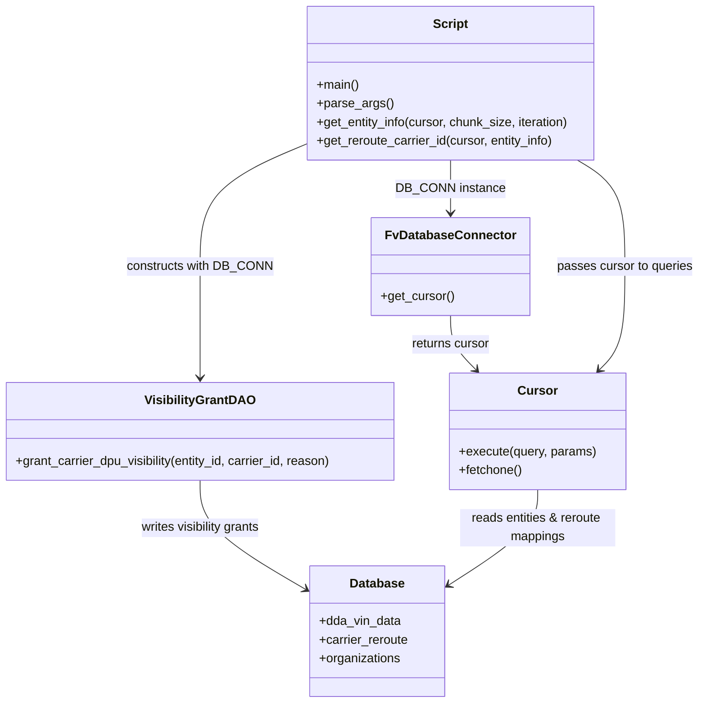
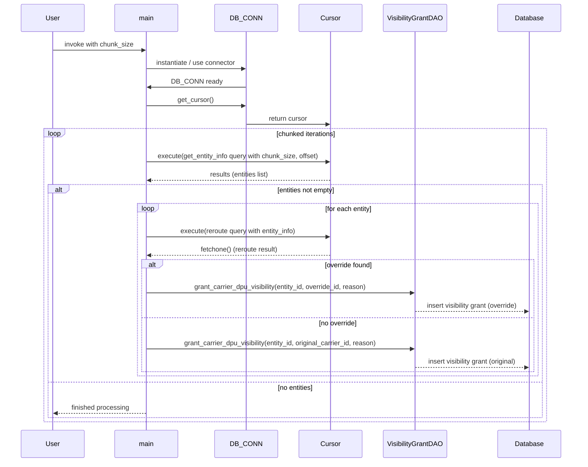

# Diagram: entity_core/entity_service/entity_service_scripts/backfill_FIN-10014_carrier_visibility_grants.py

> Auto-generated by Obscura crawlers

## Diagram 1

### SVG

<svg id="container" width="900.103515625" xmlns="http://www.w3.org/2000/svg" class="classDiagram" height="904" viewBox="0 0 900.103515625 904" role="graphics-document document" aria-roledescription="class"><g><defs><marker id="container_class-aggregationStart" class="marker aggregation class" refX="18" refY="7" markerWidth="190" markerHeight="240" orient="auto"><path d="M 18,7 L9,13 L1,7 L9,1 Z"></path></marker></defs><defs><marker id="container_class-aggregationEnd" class="marker aggregation class" refX="1" refY="7" markerWidth="20" markerHeight="28" orient="auto"><path d="M 18,7 L9,13 L1,7 L9,1 Z"></path></marker></defs><defs><marker id="container_class-extensionStart" class="marker extension class" refX="18" refY="7" markerWidth="190" markerHeight="240" orient="auto"><path d="M 1,7 L18,13 V 1 Z"></path></marker></defs><defs><marker id="container_class-extensionEnd" class="marker extension class" refX="1" refY="7" markerWidth="20" markerHeight="28" orient="auto"><path d="M 1,1 V 13 L18,7 Z"></path></marker></defs><defs><marker id="container_class-compositionStart" class="marker composition class" refX="18" refY="7" markerWidth="190" markerHeight="240" orient="auto"><path d="M 18,7 L9,13 L1,7 L9,1 Z"></path></marker></defs><defs><marker id="container_class-compositionEnd" class="marker composition class" refX="1" refY="7" markerWidth="20" markerHeight="28" orient="auto"><path d="M 18,7 L9,13 L1,7 L9,1 Z"></path></marker></defs><defs><marker id="container_class-dependencyStart" class="marker dependency class" refX="6" refY="7" markerWidth="190" markerHeight="240" orient="auto"><path d="M 5,7 L9,13 L1,7 L9,1 Z"></path></marker></defs><defs><marker id="container_class-dependencyEnd" class="marker dependency class" refX="13" refY="7" markerWidth="20" markerHeight="28" orient="auto"><path d="M 18,7 L9,13 L14,7 L9,1 Z"></path></marker></defs><defs><marker id="container_class-lollipopStart" class="marker lollipop class" refX="13" refY="7" markerWidth="190" markerHeight="240" orient="auto"><circle stroke="black" fill="transparent" cx="7" cy="7" r="6"></circle></marker></defs><defs><marker id="container_class-lollipopEnd" class="marker lollipop class" refX="1" refY="7" markerWidth="190" markerHeight="240" orient="auto"><circle stroke="black" fill="transparent" cx="7" cy="7" r="6"></circle></marker></defs><g class="root"><g class="clusters"></g><g class="edgePaths"><path d="M581.443,206L581.443,212.167C581.443,218.333,581.443,230.667,581.443,242C581.443,253.333,581.443,263.667,581.443,268.833L581.443,274" id="id_Script_FvDatabaseConnector_1" class="edge-thickness-normal edge-pattern-solid relation" style=";;;" data-edge="true" data-et="edge" data-id="id_Script_FvDatabaseConnector_1" data-points="W3sieCI6NTgxLjQ0MzM1OTM3NSwieSI6MjA2fSx7IngiOjU4MS40NDMzNTkzNzUsInkiOjI0M30seyJ4Ijo1ODEuNDQzMzU5Mzc1LCJ5IjoyODB9XQ==" marker-end="url(#container_class-dependencyEnd)"></path><path d="M393.822,186.574L371.649,195.979C349.475,205.383,305.128,224.191,282.955,250.262C260.781,276.333,260.781,309.667,260.781,343C260.781,376.333,260.781,409.667,260.781,433.5C260.781,457.333,260.781,471.667,260.781,478.833L260.781,486" id="id_Script_VisibilityGrantDAO_2" class="edge-thickness-normal edge-pattern-solid relation" style=";;;" data-edge="true" data-et="edge" data-id="id_Script_VisibilityGrantDAO_2" data-points="W3sieCI6MzkzLjgyMjI2NTYyNSwieSI6MTg2LjU3NDMxODI3NDU2NjE3fSx7IngiOjI2MC43ODEyNSwieSI6MjQzfSx7IngiOjI2MC43ODEyNSwieSI6MzQzfSx7IngiOjI2MC43ODEyNSwieSI6NDQzfSx7IngiOjI2MC43ODEyNSwieSI6NDkyfV0=" marker-end="url(#container_class-dependencyEnd)"></path><path d="M581.443,406L581.443,412.167C581.443,418.333,581.443,430.667,586.859,442.29C592.275,453.914,603.107,464.828,608.523,470.284L613.939,475.741" id="id_FvDatabaseConnector_Cursor_3" class="edge-thickness-normal edge-pattern-solid relation" style=";;;" data-edge="true" data-et="edge" data-id="id_FvDatabaseConnector_Cursor_3" data-points="W3sieCI6NTgxLjQ0MzM1OTM3NSwieSI6NDA2fSx7IngiOjU4MS40NDMzNTkzNzUsInkiOjQ0M30seyJ4Ijo2MTguMTY1MjY1NzY0NTA5LCJ5Ijo0ODB9XQ==" marker-end="url(#container_class-dependencyEnd)"></path><path d="M743.277,206L753.357,212.167C763.438,218.333,783.599,230.667,793.679,253.5C803.76,276.333,803.76,309.667,803.76,343C803.76,376.333,803.76,409.667,798.344,431.79C792.928,453.914,782.096,464.828,776.68,470.284L771.264,475.741" id="id_Script_Cursor_4" class="edge-thickness-normal edge-pattern-solid relation" style=";;;" data-edge="true" data-et="edge" data-id="id_Script_Cursor_4" data-points="W3sieCI6NzQzLjI3NjYyNTY4OTMzODMsInkiOjIwNn0seyJ4Ijo4MDMuNzU5NzY1NjI1LCJ5IjoyNDN9LHsieCI6ODAzLjc1OTc2NTYyNSwieSI6MzQzfSx7IngiOjgwMy43NTk3NjU2MjUsInkiOjQ0M30seyJ4Ijo3NjcuMDM3ODU5MjM1NDkxLCJ5Ijo0ODB9XQ==" marker-end="url(#container_class-dependencyEnd)"></path><path d="M260.781,618L260.781,628.167C260.781,638.333,260.781,658.667,282.774,681.879C304.767,705.092,348.752,731.184,370.745,744.23L392.738,757.276" id="id_VisibilityGrantDAO_Database_5" class="edge-thickness-normal edge-pattern-solid relation" style=";;;" data-edge="true" data-et="edge" data-id="id_VisibilityGrantDAO_Database_5" data-points="W3sieCI6MjYwLjc4MTI1LCJ5Ijo2MTh9LHsieCI6MjYwLjc4MTI1LCJ5Ijo2Nzl9LHsieCI6Mzk3Ljg5ODQzNzUsInkiOjc2MC4zMzY3MzY0NzE2NTR9XQ==" marker-end="url(#container_class-dependencyEnd)"></path><path d="M692.602,630L692.602,638.167C692.602,646.333,692.602,662.667,673.358,683.161C654.114,703.656,615.626,728.313,596.382,740.641L577.138,752.969" id="id_Cursor_Database_6" class="edge-thickness-normal edge-pattern-solid relation" style=";;;" data-edge="true" data-et="edge" data-id="id_Cursor_Database_6" data-points="W3sieCI6NjkyLjYwMTU2MjUsInkiOjYzMH0seyJ4Ijo2OTIuNjAxNTYyNSwieSI6Njc5fSx7IngiOjU3Mi4wODU5Mzc1LCJ5Ijo3NTYuMjA1NDYzOTg3MzU2MX1d" marker-end="url(#container_class-dependencyEnd)"></path></g><g class="edgeLabels"><g class="edgeLabel" transform="translate(581.443359375, 243)"><g class="label" data-id="id_Script_FvDatabaseConnector_1" transform="translate(-67.1796875, -12)"><foreignObject width="134.359375" height="24">

DB_CONN instance

</foreignObject></g></g><g class="edgeLabel" transform="translate(260.78125, 343)"><g class="label" data-id="id_Script_VisibilityGrantDAO_2" transform="translate(-92.1328125, -12)"><foreignObject width="184.265625" height="24">

constructs with DB_CONN

</foreignObject></g></g><g class="edgeLabel" transform="translate(581.443359375, 443)"><g class="label" data-id="id_FvDatabaseConnector_Cursor_3" transform="translate(-51.25, -12)"><foreignObject width="102.5" height="24">

returns cursor

</foreignObject></g></g><g class="edgeLabel" transform="translate(803.759765625, 343)"><g class="label" data-id="id_Script_Cursor_4" transform="translate(-88.34375, -12)"><foreignObject width="176.6875" height="24">

passes cursor to queries

</foreignObject></g></g><g class="edgeLabel" transform="translate(260.78125, 679)"><g class="label" data-id="id_VisibilityGrantDAO_Database_5" transform="translate(-79.3984375, -12)"><foreignObject width="158.796875" height="24">

writes visibility grants

</foreignObject></g></g><g class="edgeLabel" transform="translate(692.6015625, 679)"><g class="label" data-id="id_Cursor_Database_6" transform="translate(-100, -24)"><foreignObject width="200" height="48">

reads entities &amp; reroute mappings

</foreignObject></g></g></g><g class="nodes"><g class="node default" id="classId-Script-0" transform="translate(581.443359375, 107)"><g class="basic label-container"><path d="M-187.62109375 -99 L187.62109375 -99 L187.62109375 99 L-187.62109375 99" stroke="none" stroke-width="0" fill="#ECECFF" style=""></path><path d="M-187.62109375 -99 C-99.46513429800069 -99, -11.309174846001383 -99, 187.62109375 -99 M-187.62109375 -99 C-50.61271562911722 -99, 86.39566249176556 -99, 187.62109375 -99 M187.62109375 -99 C187.62109375 -48.000227202252425, 187.62109375 2.9995455954951495, 187.62109375 99 M187.62109375 -99 C187.62109375 -31.5936680686532, 187.62109375 35.8126638626936, 187.62109375 99 M187.62109375 99 C55.04812590982999 99, -77.52484193034002 99, -187.62109375 99 M187.62109375 99 C46.45465304596726 99, -94.71178765806548 99, -187.62109375 99 M-187.62109375 99 C-187.62109375 51.75518611273854, -187.62109375 4.510372225477084, -187.62109375 -99 M-187.62109375 99 C-187.62109375 34.598597963938545, -187.62109375 -29.80280407212291, -187.62109375 -99" stroke="#9370DB" stroke-width="1.3" fill="none" stroke-dasharray="0 0" style=""></path></g><g class="annotation-group text" transform="translate(0, -75)"></g><g class="label-group text" transform="translate(-21.7421875, -75)"><g class="label" style="font-weight: bolder" transform="translate(0,-12)"><foreignObject width="43.484375" height="24">

Script

</foreignObject></g></g><g class="members-group text" transform="translate(-175.62109375, -27)"></g><g class="methods-group text" transform="translate(-175.62109375, 3)"><g class="label" style="" transform="translate(0,-12)"><foreignObject width="54.65625" height="24">

+main()

</foreignObject></g><g class="label" style="" transform="translate(0,12)"><foreignObject width="96.53125" height="24">

+parse_args()

</foreignObject></g><g class="label" style="" transform="translate(0,36)"><foreignObject width="329.5" height="24">

+get_entity_info(cursor, chunk_size, iteration)

</foreignObject></g><g class="label" style="" transform="translate(0,60)"><foreignObject width="309.765625" height="24">

+get_reroute_carrier_id(cursor, entity_info)

</foreignObject></g></g><g class="divider" style=""><path d="M-187.62109375 -51 C-101.19558968551831 -51, -14.770085621036628 -51, 187.62109375 -51 M-187.62109375 -51 C-63.49459665055146 -51, 60.631900448897085 -51, 187.62109375 -51" stroke="#9370DB" stroke-width="1.3" fill="none" stroke-dasharray="0 0" style=""></path></g><g class="divider" style=""><path d="M-187.62109375 -27 C-39.814997357089254 -27, 107.99109903582149 -27, 187.62109375 -27 M-187.62109375 -27 C-92.47325704618933 -27, 2.6745796576213365 -27, 187.62109375 -27" stroke="#9370DB" stroke-width="1.3" fill="none" stroke-dasharray="0 0" style=""></path></g></g><g class="node default" id="classId-FvDatabaseConnector-1" transform="translate(581.443359375, 343)"><g class="basic label-container"><path d="M-98.97265625 -63 L98.97265625 -63 L98.97265625 63 L-98.97265625 63" stroke="none" stroke-width="0" fill="#ECECFF" style=""></path><path d="M-98.97265625 -63 C-22.947275401324333 -63, 53.078105447351334 -63, 98.97265625 -63 M-98.97265625 -63 C-27.59410356058183 -63, 43.78444912883634 -63, 98.97265625 -63 M98.97265625 -63 C98.97265625 -25.5856775163289, 98.97265625 11.8286449673422, 98.97265625 63 M98.97265625 -63 C98.97265625 -21.090073695396505, 98.97265625 20.81985260920699, 98.97265625 63 M98.97265625 63 C57.87913723567773 63, 16.785618221355463 63, -98.97265625 63 M98.97265625 63 C35.105530446678976 63, -28.761595356642047 63, -98.97265625 63 M-98.97265625 63 C-98.97265625 37.473662270590566, -98.97265625 11.947324541181125, -98.97265625 -63 M-98.97265625 63 C-98.97265625 21.20446349257415, -98.97265625 -20.591073014851702, -98.97265625 -63" stroke="#9370DB" stroke-width="1.3" fill="none" stroke-dasharray="0 0" style=""></path></g><g class="annotation-group text" transform="translate(0, -39)"></g><g class="label-group text" transform="translate(-79.3046875, -39)"><g class="label" style="font-weight: bolder" transform="translate(0,-12)"><foreignObject width="158.609375" height="24">

FvDatabaseConnector

</foreignObject></g></g><g class="members-group text" transform="translate(-86.97265625, 9)"></g><g class="methods-group text" transform="translate(-86.97265625, 39)"><g class="label" style="" transform="translate(0,-12)"><foreignObject width="94.640625" height="24">

+get_cursor()

</foreignObject></g></g><g class="divider" style=""><path d="M-98.97265625 -15 C-46.03926736701474 -15, 6.894121515970525 -15, 98.97265625 -15 M-98.97265625 -15 C-33.96566746246964 -15, 31.04132132506072 -15, 98.97265625 -15" stroke="#9370DB" stroke-width="1.3" fill="none" stroke-dasharray="0 0" style=""></path></g><g class="divider" style=""><path d="M-98.97265625 9 C-33.513475666522154 9, 31.94570491695569 9, 98.97265625 9 M-98.97265625 9 C-44.23440631312639 9, 10.503843623747215 9, 98.97265625 9" stroke="#9370DB" stroke-width="1.3" fill="none" stroke-dasharray="0 0" style=""></path></g></g><g class="node default" id="classId-Cursor-2" transform="translate(692.6015625, 555)"><g class="basic label-container"><path d="M-112.4375 -75 L112.4375 -75 L112.4375 75 L-112.4375 75" stroke="none" stroke-width="0" fill="#ECECFF" style=""></path><path d="M-112.4375 -75 C-44.50604850714693 -75, 23.425402985706143 -75, 112.4375 -75 M-112.4375 -75 C-66.01916708668729 -75, -19.60083417337458 -75, 112.4375 -75 M112.4375 -75 C112.4375 -30.387160424152512, 112.4375 14.225679151694976, 112.4375 75 M112.4375 -75 C112.4375 -32.288402934108575, 112.4375 10.42319413178285, 112.4375 75 M112.4375 75 C29.20307655158352 75, -54.03134689683296 75, -112.4375 75 M112.4375 75 C64.74580512018916 75, 17.05411024037832 75, -112.4375 75 M-112.4375 75 C-112.4375 17.58142124273079, -112.4375 -39.83715751453842, -112.4375 -75 M-112.4375 75 C-112.4375 38.435745246514585, -112.4375 1.871490493029171, -112.4375 -75" stroke="#9370DB" stroke-width="1.3" fill="none" stroke-dasharray="0 0" style=""></path></g><g class="annotation-group text" transform="translate(0, -51)"></g><g class="label-group text" transform="translate(-23.90625, -51)"><g class="label" style="font-weight: bolder" transform="translate(0,-12)"><foreignObject width="47.8125" height="24">

Cursor

</foreignObject></g></g><g class="members-group text" transform="translate(-100.4375, -3)"></g><g class="methods-group text" transform="translate(-100.4375, 27)"><g class="label" style="" transform="translate(0,-12)"><foreignObject width="176.96875" height="24">

+execute(query, params)

</foreignObject></g><g class="label" style="" transform="translate(0,12)"><foreignObject width="82.046875" height="24">

+fetchone()

</foreignObject></g></g><g class="divider" style=""><path d="M-112.4375 -27 C-32.82889746514638 -27, 46.779705069707234 -27, 112.4375 -27 M-112.4375 -27 C-29.244409439289058 -27, 53.948681121421885 -27, 112.4375 -27" stroke="#9370DB" stroke-width="1.3" fill="none" stroke-dasharray="0 0" style=""></path></g><g class="divider" style=""><path d="M-112.4375 -3 C-56.248600911205706 -3, -0.05970182241141231 -3, 112.4375 -3 M-112.4375 -3 C-48.35374967246811 -3, 15.730000655063776 -3, 112.4375 -3" stroke="#9370DB" stroke-width="1.3" fill="none" stroke-dasharray="0 0" style=""></path></g></g><g class="node default" id="classId-VisibilityGrantDAO-3" transform="translate(260.78125, 555)"><g class="basic label-container"><path d="M-252.78125 -63 L252.78125 -63 L252.78125 63 L-252.78125 63" stroke="none" stroke-width="0" fill="#ECECFF" style=""></path><path d="M-252.78125 -63 C-111.85285783677728 -63, 29.07553432644545 -63, 252.78125 -63 M-252.78125 -63 C-92.93810992278353 -63, 66.90503015443295 -63, 252.78125 -63 M252.78125 -63 C252.78125 -20.66161287734983, 252.78125 21.676774245300336, 252.78125 63 M252.78125 -63 C252.78125 -26.073604693855067, 252.78125 10.852790612289866, 252.78125 63 M252.78125 63 C105.49589776127641 63, -41.78945447744718 63, -252.78125 63 M252.78125 63 C142.11587000213896 63, 31.450490004277924 63, -252.78125 63 M-252.78125 63 C-252.78125 30.144046840676907, -252.78125 -2.711906318646186, -252.78125 -63 M-252.78125 63 C-252.78125 20.51258577180969, -252.78125 -21.97482845638062, -252.78125 -63" stroke="#9370DB" stroke-width="1.3" fill="none" stroke-dasharray="0 0" style=""></path></g><g class="annotation-group text" transform="translate(0, -39)"></g><g class="label-group text" transform="translate(-67.265625, -39)"><g class="label" style="font-weight: bolder" transform="translate(0,-12)"><foreignObject width="134.53125" height="24">

VisibilityGrantDAO

</foreignObject></g></g><g class="members-group text" transform="translate(-240.78125, 9)"></g><g class="methods-group text" transform="translate(-240.78125, 39)"><g class="label" style="" transform="translate(0,-12)"><foreignObject width="414.296875" height="24">

+grant_carrier_dpu_visibility(entity_id, carrier_id, reason)

</foreignObject></g></g><g class="divider" style=""><path d="M-252.78125 -15 C-130.85141602509663 -15, -8.921582050193223 -15, 252.78125 -15 M-252.78125 -15 C-54.60961575587797 -15, 143.56201848824406 -15, 252.78125 -15" stroke="#9370DB" stroke-width="1.3" fill="none" stroke-dasharray="0 0" style=""></path></g><g class="divider" style=""><path d="M-252.78125 9 C-148.79695280625884 9, -44.81265561251766 9, 252.78125 9 M-252.78125 9 C-56.33898201090233 9, 140.10328597819534 9, 252.78125 9" stroke="#9370DB" stroke-width="1.3" fill="none" stroke-dasharray="0 0" style=""></path></g></g><g class="node default" id="classId-Database-4" transform="translate(484.9921875, 812)"><g class="basic label-container"><path d="M-87.09375 -84 L87.09375 -84 L87.09375 84 L-87.09375 84" stroke="none" stroke-width="0" fill="#ECECFF" style=""></path><path d="M-87.09375 -84 C-32.05364308511345 -84, 22.9864638297731 -84, 87.09375 -84 M-87.09375 -84 C-29.59914680064758 -84, 27.895456398704837 -84, 87.09375 -84 M87.09375 -84 C87.09375 -21.85589351391765, 87.09375 40.2882129721647, 87.09375 84 M87.09375 -84 C87.09375 -22.463282791870597, 87.09375 39.073434416258806, 87.09375 84 M87.09375 84 C20.178468068147495 84, -46.73681386370501 84, -87.09375 84 M87.09375 84 C42.08816835283037 84, -2.917413294339255 84, -87.09375 84 M-87.09375 84 C-87.09375 48.4265125583864, -87.09375 12.853025116772798, -87.09375 -84 M-87.09375 84 C-87.09375 30.99887347726615, -87.09375 -22.002253045467697, -87.09375 -84" stroke="#9370DB" stroke-width="1.3" fill="none" stroke-dasharray="0 0" style=""></path></g><g class="annotation-group text" transform="translate(0, -60)"></g><g class="label-group text" transform="translate(-34.171875, -60)"><g class="label" style="font-weight: bolder" transform="translate(0,-12)"><foreignObject width="68.34375" height="24">

Database

</foreignObject></g></g><g class="members-group text" transform="translate(-75.09375, -12)"><g class="label" style="" transform="translate(0,-12)"><foreignObject width="106.078125" height="24">

+dda_vin_data

</foreignObject></g><g class="label" style="" transform="translate(0,12)"><foreignObject width="116.015625" height="24">

+carrier_reroute

</foreignObject></g><g class="label" style="" transform="translate(0,36)"><foreignObject width="105.8125" height="24">

+organizations

</foreignObject></g></g><g class="methods-group text" transform="translate(-75.09375, 84)"></g><g class="divider" style=""><path d="M-87.09375 -36 C-34.1324137377936 -36, 18.828922524412803 -36, 87.09375 -36 M-87.09375 -36 C-47.4554415354891 -36, -7.817133070978201 -36, 87.09375 -36" stroke="#9370DB" stroke-width="1.3" fill="none" stroke-dasharray="0 0" style=""></path></g><g class="divider" style=""><path d="M-87.09375 60 C-26.74431717358157 60, 33.60511565283686 60, 87.09375 60 M-87.09375 60 C-39.741867179324274 60, 7.610015641351453 60, 87.09375 60" stroke="#9370DB" stroke-width="1.3" fill="none" stroke-dasharray="0 0" style=""></path></g></g></g></g></g></svg>

## Diagram 2

### SVG

<svg id="container" width="1452" xmlns="http://www.w3.org/2000/svg" height="1153" viewBox="-50 -10 1452 1153" role="graphics-document document" aria-roledescription="sequence"><g><rect x="1202" y="1067" fill="#eaeaea" stroke="#666" width="150" height="65" name="DBTable" rx="3" ry="3" class="actor actor-bottom"></rect><text x="1277" y="1099.5" dominant-baseline="central" alignment-baseline="central" class="actor actor-box" style="text-anchor: middle; font-size: 16px; font-weight: 400;"><tspan x="1277" dy="0">Database</tspan></text></g><g><rect x="906" y="1067" fill="#eaeaea" stroke="#666" width="152" height="65" name="DAO" rx="3" ry="3" class="actor actor-bottom"></rect><text x="982" y="1099.5" dominant-baseline="central" alignment-baseline="central" class="actor actor-box" style="text-anchor: middle; font-size: 16px; font-weight: 400;"><tspan x="982" dy="0">VisibilityGrantDAO</tspan></text></g><g><rect x="706" y="1067" fill="#eaeaea" stroke="#666" width="150" height="65" name="Cursor" rx="3" ry="3" class="actor actor-bottom"></rect><text x="781" y="1099.5" dominant-baseline="central" alignment-baseline="central" class="actor actor-box" style="text-anchor: middle; font-size: 16px; font-weight: 400;"><tspan x="781" dy="0">Cursor</tspan></text></g><g><rect x="506" y="1067" fill="#eaeaea" stroke="#666" width="150" height="65" name="DB" rx="3" ry="3" class="actor actor-bottom"></rect><text x="581" y="1099.5" dominant-baseline="central" alignment-baseline="central" class="actor actor-box" style="text-anchor: middle; font-size: 16px; font-weight: 400;"><tspan x="581" dy="0">DB_CONN</tspan></text></g><g><rect x="237" y="1067" fill="#eaeaea" stroke="#666" width="150" height="65" name="Script" rx="3" ry="3" class="actor actor-bottom"></rect><text x="312" y="1099.5" dominant-baseline="central" alignment-baseline="central" class="actor actor-box" style="text-anchor: middle; font-size: 16px; font-weight: 400;"><tspan x="312" dy="0">main</tspan></text></g><g><rect x="0" y="1067" fill="#eaeaea" stroke="#666" width="150" height="65" name="CLI" rx="3" ry="3" class="actor actor-bottom"></rect><text x="75" y="1099.5" dominant-baseline="central" alignment-baseline="central" class="actor actor-box" style="text-anchor: middle; font-size: 16px; font-weight: 400;"><tspan x="75" dy="0">User</tspan></text></g><g><line id="actor5" x1="1277" y1="65" x2="1277" y2="1067" class="actor-line 200" stroke-width="0.5px" stroke="#999" name="DBTable"></line><g id="root-5"><rect x="1202" y="0" fill="#eaeaea" stroke="#666" width="150" height="65" name="DBTable" rx="3" ry="3" class="actor actor-top"></rect><text x="1277" y="32.5" dominant-baseline="central" alignment-baseline="central" class="actor actor-box" style="text-anchor: middle; font-size: 16px; font-weight: 400;"><tspan x="1277" dy="0">Database</tspan></text></g></g><g><line id="actor4" x1="982" y1="65" x2="982" y2="1067" class="actor-line 200" stroke-width="0.5px" stroke="#999" name="DAO"></line><g id="root-4"><rect x="906" y="0" fill="#eaeaea" stroke="#666" width="152" height="65" name="DAO" rx="3" ry="3" class="actor actor-top"></rect><text x="982" y="32.5" dominant-baseline="central" alignment-baseline="central" class="actor actor-box" style="text-anchor: middle; font-size: 16px; font-weight: 400;"><tspan x="982" dy="0">VisibilityGrantDAO</tspan></text></g></g><g><line id="actor3" x1="781" y1="65" x2="781" y2="1067" class="actor-line 200" stroke-width="0.5px" stroke="#999" name="Cursor"></line><g id="root-3"><rect x="706" y="0" fill="#eaeaea" stroke="#666" width="150" height="65" name="Cursor" rx="3" ry="3" class="actor actor-top"></rect><text x="781" y="32.5" dominant-baseline="central" alignment-baseline="central" class="actor actor-box" style="text-anchor: middle; font-size: 16px; font-weight: 400;"><tspan x="781" dy="0">Cursor</tspan></text></g></g><g><line id="actor2" x1="581" y1="65" x2="581" y2="1067" class="actor-line 200" stroke-width="0.5px" stroke="#999" name="DB"></line><g id="root-2"><rect x="506" y="0" fill="#eaeaea" stroke="#666" width="150" height="65" name="DB" rx="3" ry="3" class="actor actor-top"></rect><text x="581" y="32.5" dominant-baseline="central" alignment-baseline="central" class="actor actor-box" style="text-anchor: middle; font-size: 16px; font-weight: 400;"><tspan x="581" dy="0">DB_CONN</tspan></text></g></g><g><line id="actor1" x1="312" y1="65" x2="312" y2="1067" class="actor-line 200" stroke-width="0.5px" stroke="#999" name="Script"></line><g id="root-1"><rect x="237" y="0" fill="#eaeaea" stroke="#666" width="150" height="65" name="Script" rx="3" ry="3" class="actor actor-top"></rect><text x="312" y="32.5" dominant-baseline="central" alignment-baseline="central" class="actor actor-box" style="text-anchor: middle; font-size: 16px; font-weight: 400;"><tspan x="312" dy="0">main</tspan></text></g></g><g><line id="actor0" x1="75" y1="65" x2="75" y2="1067" class="actor-line 200" stroke-width="0.5px" stroke="#999" name="CLI"></line><g id="root-0"><rect x="0" y="0" fill="#eaeaea" stroke="#666" width="150" height="65" name="CLI" rx="3" ry="3" class="actor actor-top"></rect><text x="75" y="32.5" dominant-baseline="central" alignment-baseline="central" class="actor actor-box" style="text-anchor: middle; font-size: 16px; font-weight: 400;"><tspan x="75" dy="0">User</tspan></text></g></g><g></g><defs><symbol id="computer" width="24" height="24"><path transform="scale(.5)" d="M2 2v13h20v-13h-20zm18 11h-16v-9h16v9zm-10.228 6l.466-1h3.524l.467 1h-4.457zm14.228 3h-24l2-6h2.104l-1.33 4h18.45l-1.297-4h2.073l2 6zm-5-10h-14v-7h14v7z"></path></symbol></defs><defs><symbol id="database" fill-rule="evenodd" clip-rule="evenodd"><path transform="scale(.5)" d="M12.258.001l.256.004.255.005.253.008.251.01.249.012.247.015.246.016.242.019.241.02.239.023.236.024.233.027.231.028.229.031.225.032.223.034.22.036.217.038.214.04.211.041.208.043.205.045.201.046.198.048.194.05.191.051.187.053.183.054.18.056.175.057.172.059.168.06.163.061.16.063.155.064.15.066.074.033.073.033.071.034.07.034.069.035.068.035.067.035.066.035.064.036.064.036.062.036.06.036.06.037.058.037.058.037.055.038.055.038.053.038.052.038.051.039.05.039.048.039.047.039.045.04.044.04.043.04.041.04.04.041.039.041.037.041.036.041.034.041.033.042.032.042.03.042.029.042.027.042.026.043.024.043.023.043.021.043.02.043.018.044.017.043.015.044.013.044.012.044.011.045.009.044.007.045.006.045.004.045.002.045.001.045v17l-.001.045-.002.045-.004.045-.006.045-.007.045-.009.044-.011.045-.012.044-.013.044-.015.044-.017.043-.018.044-.02.043-.021.043-.023.043-.024.043-.026.043-.027.042-.029.042-.03.042-.032.042-.033.042-.034.041-.036.041-.037.041-.039.041-.04.041-.041.04-.043.04-.044.04-.045.04-.047.039-.048.039-.05.039-.051.039-.052.038-.053.038-.055.038-.055.038-.058.037-.058.037-.06.037-.06.036-.062.036-.064.036-.064.036-.066.035-.067.035-.068.035-.069.035-.07.034-.071.034-.073.033-.074.033-.15.066-.155.064-.16.063-.163.061-.168.06-.172.059-.175.057-.18.056-.183.054-.187.053-.191.051-.194.05-.198.048-.201.046-.205.045-.208.043-.211.041-.214.04-.217.038-.22.036-.223.034-.225.032-.229.031-.231.028-.233.027-.236.024-.239.023-.241.02-.242.019-.246.016-.247.015-.249.012-.251.01-.253.008-.255.005-.256.004-.258.001-.258-.001-.256-.004-.255-.005-.253-.008-.251-.01-.249-.012-.247-.015-.245-.016-.243-.019-.241-.02-.238-.023-.236-.024-.234-.027-.231-.028-.228-.031-.226-.032-.223-.034-.22-.036-.217-.038-.214-.04-.211-.041-.208-.043-.204-.045-.201-.046-.198-.048-.195-.05-.19-.051-.187-.053-.184-.054-.179-.056-.176-.057-.172-.059-.167-.06-.164-.061-.159-.063-.155-.064-.151-.066-.074-.033-.072-.033-.072-.034-.07-.034-.069-.035-.068-.035-.067-.035-.066-.035-.064-.036-.063-.036-.062-.036-.061-.036-.06-.037-.058-.037-.057-.037-.056-.038-.055-.038-.053-.038-.052-.038-.051-.039-.049-.039-.049-.039-.046-.039-.046-.04-.044-.04-.043-.04-.041-.04-.04-.041-.039-.041-.037-.041-.036-.041-.034-.041-.033-.042-.032-.042-.03-.042-.029-.042-.027-.042-.026-.043-.024-.043-.023-.043-.021-.043-.02-.043-.018-.044-.017-.043-.015-.044-.013-.044-.012-.044-.011-.045-.009-.044-.007-.045-.006-.045-.004-.045-.002-.045-.001-.045v-17l.001-.045.002-.045.004-.045.006-.045.007-.045.009-.044.011-.045.012-.044.013-.044.015-.044.017-.043.018-.044.02-.043.021-.043.023-.043.024-.043.026-.043.027-.042.029-.042.03-.042.032-.042.033-.042.034-.041.036-.041.037-.041.039-.041.04-.041.041-.04.043-.04.044-.04.046-.04.046-.039.049-.039.049-.039.051-.039.052-.038.053-.038.055-.038.056-.038.057-.037.058-.037.06-.037.061-.036.062-.036.063-.036.064-.036.066-.035.067-.035.068-.035.069-.035.07-.034.072-.034.072-.033.074-.033.151-.066.155-.064.159-.063.164-.061.167-.06.172-.059.176-.057.179-.056.184-.054.187-.053.19-.051.195-.05.198-.048.201-.046.204-.045.208-.043.211-.041.214-.04.217-.038.22-.036.223-.034.226-.032.228-.031.231-.028.234-.027.236-.024.238-.023.241-.02.243-.019.245-.016.247-.015.249-.012.251-.01.253-.008.255-.005.256-.004.258-.001.258.001zm-9.258 20.499v.01l.001.021.003.021.004.022.005.021.006.022.007.022.009.023.01.022.011.023.012.023.013.023.015.023.016.024.017.023.018.024.019.024.021.024.022.025.023.024.024.025.052.049.056.05.061.051.066.051.07.051.075.051.079.052.084.052.088.052.092.052.097.052.102.051.105.052.11.052.114.051.119.051.123.051.127.05.131.05.135.05.139.048.144.049.147.047.152.047.155.047.16.045.163.045.167.043.171.043.176.041.178.041.183.039.187.039.19.037.194.035.197.035.202.033.204.031.209.03.212.029.216.027.219.025.222.024.226.021.23.02.233.018.236.016.24.015.243.012.246.01.249.008.253.005.256.004.259.001.26-.001.257-.004.254-.005.25-.008.247-.011.244-.012.241-.014.237-.016.233-.018.231-.021.226-.021.224-.024.22-.026.216-.027.212-.028.21-.031.205-.031.202-.034.198-.034.194-.036.191-.037.187-.039.183-.04.179-.04.175-.042.172-.043.168-.044.163-.045.16-.046.155-.046.152-.047.148-.048.143-.049.139-.049.136-.05.131-.05.126-.05.123-.051.118-.052.114-.051.11-.052.106-.052.101-.052.096-.052.092-.052.088-.053.083-.051.079-.052.074-.052.07-.051.065-.051.06-.051.056-.05.051-.05.023-.024.023-.025.021-.024.02-.024.019-.024.018-.024.017-.024.015-.023.014-.024.013-.023.012-.023.01-.023.01-.022.008-.022.006-.022.006-.022.004-.022.004-.021.001-.021.001-.021v-4.127l-.077.055-.08.053-.083.054-.085.053-.087.052-.09.052-.093.051-.095.05-.097.05-.1.049-.102.049-.105.048-.106.047-.109.047-.111.046-.114.045-.115.045-.118.044-.12.043-.122.042-.124.042-.126.041-.128.04-.13.04-.132.038-.134.038-.135.037-.138.037-.139.035-.142.035-.143.034-.144.033-.147.032-.148.031-.15.03-.151.03-.153.029-.154.027-.156.027-.158.026-.159.025-.161.024-.162.023-.163.022-.165.021-.166.02-.167.019-.169.018-.169.017-.171.016-.173.015-.173.014-.175.013-.175.012-.177.011-.178.01-.179.008-.179.008-.181.006-.182.005-.182.004-.184.003-.184.002h-.37l-.184-.002-.184-.003-.182-.004-.182-.005-.181-.006-.179-.008-.179-.008-.178-.01-.176-.011-.176-.012-.175-.013-.173-.014-.172-.015-.171-.016-.17-.017-.169-.018-.167-.019-.166-.02-.165-.021-.163-.022-.162-.023-.161-.024-.159-.025-.157-.026-.156-.027-.155-.027-.153-.029-.151-.03-.15-.03-.148-.031-.146-.032-.145-.033-.143-.034-.141-.035-.14-.035-.137-.037-.136-.037-.134-.038-.132-.038-.13-.04-.128-.04-.126-.041-.124-.042-.122-.042-.12-.044-.117-.043-.116-.045-.113-.045-.112-.046-.109-.047-.106-.047-.105-.048-.102-.049-.1-.049-.097-.05-.095-.05-.093-.052-.09-.051-.087-.052-.085-.053-.083-.054-.08-.054-.077-.054v4.127zm0-5.654v.011l.001.021.003.021.004.021.005.022.006.022.007.022.009.022.01.022.011.023.012.023.013.023.015.024.016.023.017.024.018.024.019.024.021.024.022.024.023.025.024.024.052.05.056.05.061.05.066.051.07.051.075.052.079.051.084.052.088.052.092.052.097.052.102.052.105.052.11.051.114.051.119.052.123.05.127.051.131.05.135.049.139.049.144.048.147.048.152.047.155.046.16.045.163.045.167.044.171.042.176.042.178.04.183.04.187.038.19.037.194.036.197.034.202.033.204.032.209.03.212.028.216.027.219.025.222.024.226.022.23.02.233.018.236.016.24.014.243.012.246.01.249.008.253.006.256.003.259.001.26-.001.257-.003.254-.006.25-.008.247-.01.244-.012.241-.015.237-.016.233-.018.231-.02.226-.022.224-.024.22-.025.216-.027.212-.029.21-.03.205-.032.202-.033.198-.035.194-.036.191-.037.187-.039.183-.039.179-.041.175-.042.172-.043.168-.044.163-.045.16-.045.155-.047.152-.047.148-.048.143-.048.139-.05.136-.049.131-.05.126-.051.123-.051.118-.051.114-.052.11-.052.106-.052.101-.052.096-.052.092-.052.088-.052.083-.052.079-.052.074-.051.07-.052.065-.051.06-.05.056-.051.051-.049.023-.025.023-.024.021-.025.02-.024.019-.024.018-.024.017-.024.015-.023.014-.023.013-.024.012-.022.01-.023.01-.023.008-.022.006-.022.006-.022.004-.021.004-.022.001-.021.001-.021v-4.139l-.077.054-.08.054-.083.054-.085.052-.087.053-.09.051-.093.051-.095.051-.097.05-.1.049-.102.049-.105.048-.106.047-.109.047-.111.046-.114.045-.115.044-.118.044-.12.044-.122.042-.124.042-.126.041-.128.04-.13.039-.132.039-.134.038-.135.037-.138.036-.139.036-.142.035-.143.033-.144.033-.147.033-.148.031-.15.03-.151.03-.153.028-.154.028-.156.027-.158.026-.159.025-.161.024-.162.023-.163.022-.165.021-.166.02-.167.019-.169.018-.169.017-.171.016-.173.015-.173.014-.175.013-.175.012-.177.011-.178.009-.179.009-.179.007-.181.007-.182.005-.182.004-.184.003-.184.002h-.37l-.184-.002-.184-.003-.182-.004-.182-.005-.181-.007-.179-.007-.179-.009-.178-.009-.176-.011-.176-.012-.175-.013-.173-.014-.172-.015-.171-.016-.17-.017-.169-.018-.167-.019-.166-.02-.165-.021-.163-.022-.162-.023-.161-.024-.159-.025-.157-.026-.156-.027-.155-.028-.153-.028-.151-.03-.15-.03-.148-.031-.146-.033-.145-.033-.143-.033-.141-.035-.14-.036-.137-.036-.136-.037-.134-.038-.132-.039-.13-.039-.128-.04-.126-.041-.124-.042-.122-.043-.12-.043-.117-.044-.116-.044-.113-.046-.112-.046-.109-.046-.106-.047-.105-.048-.102-.049-.1-.049-.097-.05-.095-.051-.093-.051-.09-.051-.087-.053-.085-.052-.083-.054-.08-.054-.077-.054v4.139zm0-5.666v.011l.001.02.003.022.004.021.005.022.006.021.007.022.009.023.01.022.011.023.012.023.013.023.015.023.016.024.017.024.018.023.019.024.021.025.022.024.023.024.024.025.052.05.056.05.061.05.066.051.07.051.075.052.079.051.084.052.088.052.092.052.097.052.102.052.105.051.11.052.114.051.119.051.123.051.127.05.131.05.135.05.139.049.144.048.147.048.152.047.155.046.16.045.163.045.167.043.171.043.176.042.178.04.183.04.187.038.19.037.194.036.197.034.202.033.204.032.209.03.212.028.216.027.219.025.222.024.226.021.23.02.233.018.236.017.24.014.243.012.246.01.249.008.253.006.256.003.259.001.26-.001.257-.003.254-.006.25-.008.247-.01.244-.013.241-.014.237-.016.233-.018.231-.02.226-.022.224-.024.22-.025.216-.027.212-.029.21-.03.205-.032.202-.033.198-.035.194-.036.191-.037.187-.039.183-.039.179-.041.175-.042.172-.043.168-.044.163-.045.16-.045.155-.047.152-.047.148-.048.143-.049.139-.049.136-.049.131-.051.126-.05.123-.051.118-.052.114-.051.11-.052.106-.052.101-.052.096-.052.092-.052.088-.052.083-.052.079-.052.074-.052.07-.051.065-.051.06-.051.056-.05.051-.049.023-.025.023-.025.021-.024.02-.024.019-.024.018-.024.017-.024.015-.023.014-.024.013-.023.012-.023.01-.022.01-.023.008-.022.006-.022.006-.022.004-.022.004-.021.001-.021.001-.021v-4.153l-.077.054-.08.054-.083.053-.085.053-.087.053-.09.051-.093.051-.095.051-.097.05-.1.049-.102.048-.105.048-.106.048-.109.046-.111.046-.114.046-.115.044-.118.044-.12.043-.122.043-.124.042-.126.041-.128.04-.13.039-.132.039-.134.038-.135.037-.138.036-.139.036-.142.034-.143.034-.144.033-.147.032-.148.032-.15.03-.151.03-.153.028-.154.028-.156.027-.158.026-.159.024-.161.024-.162.023-.163.023-.165.021-.166.02-.167.019-.169.018-.169.017-.171.016-.173.015-.173.014-.175.013-.175.012-.177.01-.178.01-.179.009-.179.007-.181.006-.182.006-.182.004-.184.003-.184.001-.185.001-.185-.001-.184-.001-.184-.003-.182-.004-.182-.006-.181-.006-.179-.007-.179-.009-.178-.01-.176-.01-.176-.012-.175-.013-.173-.014-.172-.015-.171-.016-.17-.017-.169-.018-.167-.019-.166-.02-.165-.021-.163-.023-.162-.023-.161-.024-.159-.024-.157-.026-.156-.027-.155-.028-.153-.028-.151-.03-.15-.03-.148-.032-.146-.032-.145-.033-.143-.034-.141-.034-.14-.036-.137-.036-.136-.037-.134-.038-.132-.039-.13-.039-.128-.041-.126-.041-.124-.041-.122-.043-.12-.043-.117-.044-.116-.044-.113-.046-.112-.046-.109-.046-.106-.048-.105-.048-.102-.048-.1-.05-.097-.049-.095-.051-.093-.051-.09-.052-.087-.052-.085-.053-.083-.053-.08-.054-.077-.054v4.153zm8.74-8.179l-.257.004-.254.005-.25.008-.247.011-.244.012-.241.014-.237.016-.233.018-.231.021-.226.022-.224.023-.22.026-.216.027-.212.028-.21.031-.205.032-.202.033-.198.034-.194.036-.191.038-.187.038-.183.04-.179.041-.175.042-.172.043-.168.043-.163.045-.16.046-.155.046-.152.048-.148.048-.143.048-.139.049-.136.05-.131.05-.126.051-.123.051-.118.051-.114.052-.11.052-.106.052-.101.052-.096.052-.092.052-.088.052-.083.052-.079.052-.074.051-.07.052-.065.051-.06.05-.056.05-.051.05-.023.025-.023.024-.021.024-.02.025-.019.024-.018.024-.017.023-.015.024-.014.023-.013.023-.012.023-.01.023-.01.022-.008.022-.006.023-.006.021-.004.022-.004.021-.001.021-.001.021.001.021.001.021.004.021.004.022.006.021.006.023.008.022.01.022.01.023.012.023.013.023.014.023.015.024.017.023.018.024.019.024.02.025.021.024.023.024.023.025.051.05.056.05.06.05.065.051.07.052.074.051.079.052.083.052.088.052.092.052.096.052.101.052.106.052.11.052.114.052.118.051.123.051.126.051.131.05.136.05.139.049.143.048.148.048.152.048.155.046.16.046.163.045.168.043.172.043.175.042.179.041.183.04.187.038.191.038.194.036.198.034.202.033.205.032.21.031.212.028.216.027.22.026.224.023.226.022.231.021.233.018.237.016.241.014.244.012.247.011.25.008.254.005.257.004.26.001.26-.001.257-.004.254-.005.25-.008.247-.011.244-.012.241-.014.237-.016.233-.018.231-.021.226-.022.224-.023.22-.026.216-.027.212-.028.21-.031.205-.032.202-.033.198-.034.194-.036.191-.038.187-.038.183-.04.179-.041.175-.042.172-.043.168-.043.163-.045.16-.046.155-.046.152-.048.148-.048.143-.048.139-.049.136-.05.131-.05.126-.051.123-.051.118-.051.114-.052.11-.052.106-.052.101-.052.096-.052.092-.052.088-.052.083-.052.079-.052.074-.051.07-.052.065-.051.06-.05.056-.05.051-.05.023-.025.023-.024.021-.024.02-.025.019-.024.018-.024.017-.023.015-.024.014-.023.013-.023.012-.023.01-.023.01-.022.008-.022.006-.023.006-.021.004-.022.004-.021.001-.021.001-.021-.001-.021-.001-.021-.004-.021-.004-.022-.006-.021-.006-.023-.008-.022-.01-.022-.01-.023-.012-.023-.013-.023-.014-.023-.015-.024-.017-.023-.018-.024-.019-.024-.02-.025-.021-.024-.023-.024-.023-.025-.051-.05-.056-.05-.06-.05-.065-.051-.07-.052-.074-.051-.079-.052-.083-.052-.088-.052-.092-.052-.096-.052-.101-.052-.106-.052-.11-.052-.114-.052-.118-.051-.123-.051-.126-.051-.131-.05-.136-.05-.139-.049-.143-.048-.148-.048-.152-.048-.155-.046-.16-.046-.163-.045-.168-.043-.172-.043-.175-.042-.179-.041-.183-.04-.187-.038-.191-.038-.194-.036-.198-.034-.202-.033-.205-.032-.21-.031-.212-.028-.216-.027-.22-.026-.224-.023-.226-.022-.231-.021-.233-.018-.237-.016-.241-.014-.244-.012-.247-.011-.25-.008-.254-.005-.257-.004-.26-.001-.26.001z"></path></symbol></defs><defs><symbol id="clock" width="24" height="24"><path transform="scale(.5)" d="M12 2c5.514 0 10 4.486 10 10s-4.486 10-10 10-10-4.486-10-10 4.486-10 10-10zm0-2c-6.627 0-12 5.373-12 12s5.373 12 12 12 12-5.373 12-12-5.373-12-12-12zm5.848 12.459c.202.038.202.333.001.372-1.907.361-6.045 1.111-6.547 1.111-.719 0-1.301-.582-1.301-1.301 0-.512.77-5.447 1.125-7.445.034-.192.312-.181.343.014l.985 6.238 5.394 1.011z"></path></symbol></defs><defs><marker id="arrowhead" refX="7.9" refY="5" markerUnits="userSpaceOnUse" markerWidth="12" markerHeight="12" orient="auto-start-reverse"><path d="M -1 0 L 10 5 L 0 10 z"></path></marker></defs><defs><marker id="crosshead" markerWidth="15" markerHeight="8" orient="auto" refX="4" refY="4.5"><path fill="none" stroke="#000000" stroke-width="1pt" d="M 1,2 L 6,7 M 6,2 L 1,7" style="stroke-dasharray: 0, 0;"></path></marker></defs><defs><marker id="filled-head" refX="15.5" refY="7" markerWidth="20" markerHeight="28" orient="auto"><path d="M 18,7 L9,13 L14,7 L9,1 Z"></path></marker></defs><defs><marker id="sequencenumber" refX="15" refY="15" markerWidth="60" markerHeight="40" orient="auto"><circle cx="15" cy="15" r="6"></circle></marker></defs><g><line x1="301" y1="642" x2="1288" y2="642" class="loopLine"></line><line x1="1288" y1="642" x2="1288" y2="924" class="loopLine"></line><line x1="301" y1="924" x2="1288" y2="924" class="loopLine"></line><line x1="301" y1="642" x2="301" y2="924" class="loopLine"></line><line x1="301" y1="788" x2="1288" y2="788" class="loopLine" style="stroke-dasharray: 3, 3;"></line><polygon points="301,642 351,642 351,655 342.6,662 301,662" class="labelBox"></polygon><text x="326" y="655" text-anchor="middle" dominant-baseline="middle" alignment-baseline="middle" class="labelText" style="font-size: 16px; font-weight: 400;">alt</text><text x="819.5" y="660" text-anchor="middle" class="loopText" style="font-size: 16px; font-weight: 400;"><tspan x="819.5">[override found]</tspan></text><text x="794.5" y="806" text-anchor="middle" class="loopText" style="font-size: 16px; font-weight: 400;">[no override]</text></g><g><line x1="291" y1="501" x2="1298" y2="501" class="loopLine"></line><line x1="1298" y1="501" x2="1298" y2="934" class="loopLine"></line><line x1="291" y1="934" x2="1298" y2="934" class="loopLine"></line><line x1="291" y1="501" x2="291" y2="934" class="loopLine"></line><polygon points="291,501 341,501 341,514 332.6,521 291,521" class="labelBox"></polygon><text x="316" y="514" text-anchor="middle" dominant-baseline="middle" alignment-baseline="middle" class="labelText" style="font-size: 16px; font-weight: 400;">loop</text><text x="819.5" y="519" text-anchor="middle" class="loopText" style="font-size: 16px; font-weight: 400;"><tspan x="819.5">[for each entity]</tspan></text></g><g><line x1="64" y1="456" x2="1308" y2="456" class="loopLine"></line><line x1="1308" y1="456" x2="1308" y2="1037" class="loopLine"></line><line x1="64" y1="1037" x2="1308" y2="1037" class="loopLine"></line><line x1="64" y1="456" x2="64" y2="1037" class="loopLine"></line><line x1="64" y1="949" x2="1308" y2="949" class="loopLine" style="stroke-dasharray: 3, 3;"></line><polygon points="64,456 114,456 114,469 105.6,476 64,476" class="labelBox"></polygon><text x="89" y="469" text-anchor="middle" dominant-baseline="middle" alignment-baseline="middle" class="labelText" style="font-size: 16px; font-weight: 400;">alt</text><text x="711" y="474" text-anchor="middle" class="loopText" style="font-size: 16px; font-weight: 400;"><tspan x="711">[entities not empty]</tspan></text><text x="686" y="967" text-anchor="middle" class="loopText" style="font-size: 16px; font-weight: 400;">[no entities]</text></g><g><line x1="54" y1="315" x2="1318" y2="315" class="loopLine"></line><line x1="1318" y1="315" x2="1318" y2="1047" class="loopLine"></line><line x1="54" y1="1047" x2="1318" y2="1047" class="loopLine"></line><line x1="54" y1="315" x2="54" y2="1047" class="loopLine"></line><polygon points="54,315 104,315 104,328 95.6,335 54,335" class="labelBox"></polygon><text x="79" y="328" text-anchor="middle" dominant-baseline="middle" alignment-baseline="middle" class="labelText" style="font-size: 16px; font-weight: 400;">loop</text><text x="711" y="333" text-anchor="middle" class="loopText" style="font-size: 16px; font-weight: 400;"><tspan x="711">[chunked iterations]</tspan></text></g><text x="192" y="80" text-anchor="middle" dominant-baseline="middle" alignment-baseline="middle" class="messageText" dy="1em" style="font-size: 16px; font-weight: 400;">invoke with chunk_size</text><line x1="76" y1="113" x2="308" y2="113" class="messageLine0" stroke-width="2" stroke="none" marker-end="url(#arrowhead)" style="fill: none;"></line><text x="445" y="128" text-anchor="middle" dominant-baseline="middle" alignment-baseline="middle" class="messageText" dy="1em" style="font-size: 16px; font-weight: 400;">instantiate / use connector</text><line x1="313" y1="161" x2="577" y2="161" class="messageLine0" stroke-width="2" stroke="none" marker-end="url(#arrowhead)" style="fill: none;"></line><text x="448" y="176" text-anchor="middle" dominant-baseline="middle" alignment-baseline="middle" class="messageText" dy="1em" style="font-size: 16px; font-weight: 400;">DB_CONN ready</text><line x1="580" y1="209" x2="316" y2="209" class="messageLine0" stroke-width="2" stroke="none" marker-end="url(#arrowhead)" style="fill: none;"></line><text x="445" y="224" text-anchor="middle" dominant-baseline="middle" alignment-baseline="middle" class="messageText" dy="1em" style="font-size: 16px; font-weight: 400;">get_cursor()</text><line x1="313" y1="257" x2="577" y2="257" class="messageLine0" stroke-width="2" stroke="none" marker-end="url(#arrowhead)" style="fill: none;"></line><text x="680" y="272" text-anchor="middle" dominant-baseline="middle" alignment-baseline="middle" class="messageText" dy="1em" style="font-size: 16px; font-weight: 400;">return cursor</text><line x1="582" y1="305" x2="777" y2="305" class="messageLine0" stroke-width="2" stroke="none" marker-end="url(#arrowhead)" style="fill: none;"></line><text x="545" y="365" text-anchor="middle" dominant-baseline="middle" alignment-baseline="middle" class="messageText" dy="1em" style="font-size: 16px; font-weight: 400;">execute(get_entity_info query with chunk_size, offset)</text><line x1="313" y1="398" x2="777" y2="398" class="messageLine0" stroke-width="2" stroke="none" marker-end="url(#arrowhead)" style="fill: none;"></line><text x="548" y="413" text-anchor="middle" dominant-baseline="middle" alignment-baseline="middle" class="messageText" dy="1em" style="font-size: 16px; font-weight: 400;">results (entities list)</text><line x1="780" y1="446" x2="316" y2="446" class="messageLine1" stroke-width="2" stroke="none" marker-end="url(#arrowhead)" style="stroke-dasharray: 3, 3; fill: none;"></line><text x="545" y="551" text-anchor="middle" dominant-baseline="middle" alignment-baseline="middle" class="messageText" dy="1em" style="font-size: 16px; font-weight: 400;">execute(reroute query with entity_info)</text><line x1="313" y1="584" x2="777" y2="584" class="messageLine0" stroke-width="2" stroke="none" marker-end="url(#arrowhead)" style="fill: none;"></line><text x="548" y="599" text-anchor="middle" dominant-baseline="middle" alignment-baseline="middle" class="messageText" dy="1em" style="font-size: 16px; font-weight: 400;">fetchone() (reroute result)</text><line x1="780" y1="632" x2="316" y2="632" class="messageLine1" stroke-width="2" stroke="none" marker-end="url(#arrowhead)" style="stroke-dasharray: 3, 3; fill: none;"></line><text x="646" y="692" text-anchor="middle" dominant-baseline="middle" alignment-baseline="middle" class="messageText" dy="1em" style="font-size: 16px; font-weight: 400;">grant_carrier_dpu_visibility(entity_id, override_id, reason)</text><line x1="313" y1="725" x2="978" y2="725" class="messageLine0" stroke-width="2" stroke="none" marker-end="url(#arrowhead)" style="fill: none;"></line><text x="1128" y="740" text-anchor="middle" dominant-baseline="middle" alignment-baseline="middle" class="messageText" dy="1em" style="font-size: 16px; font-weight: 400;">insert visibility grant (override)</text><line x1="983" y1="773" x2="1273" y2="773" class="messageLine1" stroke-width="2" stroke="none" marker-end="url(#arrowhead)" style="stroke-dasharray: 3, 3; fill: none;"></line><text x="646" y="833" text-anchor="middle" dominant-baseline="middle" alignment-baseline="middle" class="messageText" dy="1em" style="font-size: 16px; font-weight: 400;">grant_carrier_dpu_visibility(entity_id, original_carrier_id, reason)</text><line x1="313" y1="866" x2="978" y2="866" class="messageLine0" stroke-width="2" stroke="none" marker-end="url(#arrowhead)" style="fill: none;"></line><text x="1128" y="881" text-anchor="middle" dominant-baseline="middle" alignment-baseline="middle" class="messageText" dy="1em" style="font-size: 16px; font-weight: 400;">insert visibility grant (original)</text><line x1="983" y1="914" x2="1273" y2="914" class="messageLine1" stroke-width="2" stroke="none" marker-end="url(#arrowhead)" style="stroke-dasharray: 3, 3; fill: none;"></line><text x="195" y="994" text-anchor="middle" dominant-baseline="middle" alignment-baseline="middle" class="messageText" dy="1em" style="font-size: 16px; font-weight: 400;">finished processing</text><line x1="311" y1="1027" x2="79" y2="1027" class="messageLine1" stroke-width="2" stroke="none" marker-end="url(#arrowhead)" style="stroke-dasharray: 3, 3; fill: none;"></line></svg>
