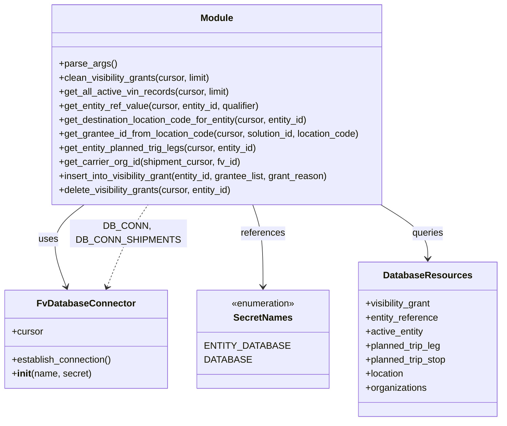

# Diagram: entity_core/entity_service/entity_service_scripts/backfill_FIN-8114.py


> Auto-generated by Obscura crawlers

## Diagram 1

```mermaid
flowchart TD
    Start([Start]) --> ParseArgs[parse_args()]
    ParseArgs --> SetLimit{limit from args}
    SetLimit --> EstablishMainDB[DB_CONN.establish_connection()]
    EstablishMainDB --> SetCursor[cursor = DB_CONN.cursor]
    SetCursor --> Clean[clean_visibility_grants(cursor, limit)]
    Clean --> ConnectShipments[DB_CONN_SHIPMENTS.establish_connection()]
    ConnectShipments --> ShipmentCursor[shipment_cursor = DB_CONN_SHIPMENTS.cursor]
    Clean --> Loop{while count == limit}
    Loop --> GetActive[get_all_active_vin_records(cursor, limit)]
    GetActive --> ForEachVIN((for each vin in active_vins))
    ForEachVIN --> SoldCheck{soldToDealer?}
    SoldCheck -- Yes --> GetSoldVal[get_entity_ref_value(cursor, vin.id, "soldToDealer")]
    GetSoldVal --> GranteeLookup1[get_grantee_id_from_location_code(shipment_cursor, vin.solution_id, soldToDealer)]
    GranteeLookup1 -- found --> InsertSold[insert_into_visibility_grant(vin.id, grantee_list, "soldToDealer")]
    SoldCheck -- No --> ShipCheck{shipToDealer?}
    ShipCheck -- Yes --> GetShipVal[get_entity_ref_value(cursor, vin.id, "shipToDealer")]
    GetShipVal --> GranteeLookup2[get_grantee_id_from_location_code(shipment_cursor, vin.solution_id, shipToDealer)]
    GranteeLookup2 -- found --> InsertShip[insert_into_visibility_grant(vin.id, grantee_list, "shipToDealer")]
    ShipCheck -- No --> PlannedCheck{planned_trip_legs?}
    PlannedCheck -- Yes --> GetPlanned[get_entity_planned_trig_legs(cursor, vin.id)]
    GetPlanned --> DestCodes[get_destination_location_code_for_entity(cursor, vin.id)]
    DestCodes --> ForEachCode((for each destination code))
    ForEachCode --> GranteeLookup3[get_grantee_id_from_location_code(shipment_cursor, vin.solution_id, code)]
    GranteeLookup3 -- found --> InsertPlanned[insert_into_visibility_grant(vin.id, grantee_list, "plannedTripLegStop")]
    GetPlanned --> ForEachLeg((for each planned leg))
    ForEachLeg --> CarrierOrg[get_carrier_org_id(shipment_cursor, leg.fv_id)]
    CarrierOrg --> AppendCarrier[append carrier_org.id to carrier_grantee_id_list]
    AppendCarrier --> CarrierListCheck{carrier_grantee_id_list not empty?}
    CarrierListCheck -- Yes --> InsertCarrier[insert_into_visibility_grant(vin.id, carrier_grantee_id_list, "shipmentCarrier")]
    ForEachVIN --> DeleteGrants[delete_visibility_grants(cursor, vin.id)]
    DeleteGrants --> ContinueLoop[continue]
    ContinueLoop --> Loop
    Loop --> PrintCount[print "Total processed:\t{count}"]
    PrintCount --> End([End])
```

> SVG rendering failed for this diagram.

## Diagram 2



### SVG

<svg id="container" width="838.24609375" xmlns="http://www.w3.org/2000/svg" class="classDiagram" height="720" viewBox="0 0 838.24609375 720" role="graphics-document document" aria-roledescription="class"><style>#container{font-family:"trebuchet ms",verdana,arial,sans-serif;font-size:16px;fill:#333;}@keyframes edge-animation-frame{from{stroke-dashoffset:0;}}@keyframes dash{to{stroke-dashoffset:0;}}#container .edge-animation-slow{stroke-dasharray:9,5!important;stroke-dashoffset:900;animation:dash 50s linear infinite;stroke-linecap:round;}#container .edge-animation-fast{stroke-dasharray:9,5!important;stroke-dashoffset:900;animation:dash 20s linear infinite;stroke-linecap:round;}#container .error-icon{fill:#552222;}#container .error-text{fill:#552222;stroke:#552222;}#container .edge-thickness-normal{stroke-width:1px;}#container .edge-thickness-thick{stroke-width:3.5px;}#container .edge-pattern-solid{stroke-dasharray:0;}#container .edge-thickness-invisible{stroke-width:0;fill:none;}#container .edge-pattern-dashed{stroke-dasharray:3;}#container .edge-pattern-dotted{stroke-dasharray:2;}#container .marker{fill:#333333;stroke:#333333;}#container .marker.cross{stroke:#333333;}#container svg{font-family:"trebuchet ms",verdana,arial,sans-serif;font-size:16px;}#container p{margin:0;}#container g.classGroup text{fill:#9370DB;stroke:none;font-family:"trebuchet ms",verdana,arial,sans-serif;font-size:10px;}#container g.classGroup text .title{font-weight:bolder;}#container .nodeLabel,#container .edgeLabel{color:#131300;}#container .edgeLabel .label rect{fill:#ECECFF;}#container .label text{fill:#131300;}#container .labelBkg{background:#ECECFF;}#container .edgeLabel .label span{background:#ECECFF;}#container .classTitle{font-weight:bolder;}#container .node rect,#container .node circle,#container .node ellipse,#container .node polygon,#container .node path{fill:#ECECFF;stroke:#9370DB;stroke-width:1px;}#container .divider{stroke:#9370DB;stroke-width:1;}#container g.clickable{cursor:pointer;}#container g.classGroup rect{fill:#ECECFF;stroke:#9370DB;}#container g.classGroup line{stroke:#9370DB;stroke-width:1;}#container .classLabel .box{stroke:none;stroke-width:0;fill:#ECECFF;opacity:0.5;}#container .classLabel .label{fill:#9370DB;font-size:10px;}#container .relation{stroke:#333333;stroke-width:1;fill:none;}#container .dashed-line{stroke-dasharray:3;}#container .dotted-line{stroke-dasharray:1 2;}#container #compositionStart,#container .composition{fill:#333333!important;stroke:#333333!important;stroke-width:1;}#container #compositionEnd,#container .composition{fill:#333333!important;stroke:#333333!important;stroke-width:1;}#container #dependencyStart,#container .dependency{fill:#333333!important;stroke:#333333!important;stroke-width:1;}#container #dependencyStart,#container .dependency{fill:#333333!important;stroke:#333333!important;stroke-width:1;}#container #extensionStart,#container .extension{fill:transparent!important;stroke:#333333!important;stroke-width:1;}#container #extensionEnd,#container .extension{fill:transparent!important;stroke:#333333!important;stroke-width:1;}#container #aggregationStart,#container .aggregation{fill:transparent!important;stroke:#333333!important;stroke-width:1;}#container #aggregationEnd,#container .aggregation{fill:transparent!important;stroke:#333333!important;stroke-width:1;}#container #lollipopStart,#container .lollipop{fill:#ECECFF!important;stroke:#333333!important;stroke-width:1;}#container #lollipopEnd,#container .lollipop{fill:#ECECFF!important;stroke:#333333!important;stroke-width:1;}#container .edgeTerminals{font-size:11px;line-height:initial;}#container .classTitleText{text-anchor:middle;font-size:18px;fill:#333;}#container .label-icon{display:inline-block;height:1em;overflow:visible;vertical-align:-0.125em;}#container .node .label-icon path{fill:currentColor;stroke:revert;stroke-width:revert;}#container :root{--mermaid-font-family:"trebuchet ms",verdana,arial,sans-serif;}</style><g><defs><marker id="container_class-aggregationStart" class="marker aggregation class" refX="18" refY="7" markerWidth="190" markerHeight="240" orient="auto"><path d="M 18,7 L9,13 L1,7 L9,1 Z"></path></marker></defs><defs><marker id="container_class-aggregationEnd" class="marker aggregation class" refX="1" refY="7" markerWidth="20" markerHeight="28" orient="auto"><path d="M 18,7 L9,13 L1,7 L9,1 Z"></path></marker></defs><defs><marker id="container_class-extensionStart" class="marker extension class" refX="18" refY="7" markerWidth="190" markerHeight="240" orient="auto"><path d="M 1,7 L18,13 V 1 Z"></path></marker></defs><defs><marker id="container_class-extensionEnd" class="marker extension class" refX="1" refY="7" markerWidth="20" markerHeight="28" orient="auto"><path d="M 1,1 V 13 L18,7 Z"></path></marker></defs><defs><marker id="container_class-compositionStart" class="marker composition class" refX="18" refY="7" markerWidth="190" markerHeight="240" orient="auto"><path d="M 18,7 L9,13 L1,7 L9,1 Z"></path></marker></defs><defs><marker id="container_class-compositionEnd" class="marker composition class" refX="1" refY="7" markerWidth="20" markerHeight="28" orient="auto"><path d="M 18,7 L9,13 L1,7 L9,1 Z"></path></marker></defs><defs><marker id="container_class-dependencyStart" class="marker dependency class" refX="6" refY="7" markerWidth="190" markerHeight="240" orient="auto"><path d="M 5,7 L9,13 L1,7 L9,1 Z"></path></marker></defs><defs><marker id="container_class-dependencyEnd" class="marker dependency class" refX="13" refY="7" markerWidth="20" markerHeight="28" orient="auto"><path d="M 18,7 L9,13 L14,7 L9,1 Z"></path></marker></defs><defs><marker id="container_class-lollipopStart" class="marker lollipop class" refX="13" refY="7" markerWidth="190" markerHeight="240" orient="auto"><circle stroke="black" fill="transparent" cx="7" cy="7" r="6"></circle></marker></defs><defs><marker id="container_class-lollipopEnd" class="marker lollipop class" refX="1" refY="7" markerWidth="190" markerHeight="240" orient="auto"><circle stroke="black" fill="transparent" cx="7" cy="7" r="6"></circle></marker></defs><g class="root"><g class="clusters"></g><g class="edgePaths"><path d="M140.956,350L130.47,358.167C119.984,366.333,99.011,382.667,94.268,406.064C89.525,429.462,101.01,459.924,106.753,475.155L112.496,490.386" id="id_Module_FvDatabaseConnector_1" class="edge-thickness-normal edge-pattern-solid relation" style=";;;" data-edge="true" data-et="edge" data-id="id_Module_FvDatabaseConnector_1" data-points="W3sieCI6MTQwLjk1NjAzNjkzMTgxODE4LCJ5IjozNTB9LHsieCI6NzguMDM5MDYyNSwieSI6Mzk5fSx7IngiOjExNC42MTI5MzU5NDYxMzI2LCJ5Ijo0OTZ9XQ==" marker-end="url(#container_class-dependencyEnd)"></path><path d="M421.861,350L424.791,358.167C427.72,366.333,433.579,382.667,436.508,406C439.438,429.333,439.438,459.667,439.438,474.833L439.438,490" id="id_Module_SecretNames_2" class="edge-thickness-normal edge-pattern-solid relation" style=";;;" data-edge="true" data-et="edge" data-id="id_Module_SecretNames_2" data-points="W3sieCI6NDIxLjg2MTE4NjA3OTU0NTQ2LCJ5IjozNTB9LHsieCI6NDM5LjQzNzUsInkiOjM5OX0seyJ4Ijo0MzkuNDM3NSwieSI6NDk2fV0=" marker-end="url(#container_class-dependencyEnd)"></path><path d="M633.477,350L646.513,358.167C659.548,366.333,685.62,382.667,698.656,398C711.691,413.333,711.691,427.667,711.691,434.833L711.691,442" id="id_Module_DatabaseResources_3" class="edge-thickness-normal edge-pattern-solid relation" style=";;;" data-edge="true" data-et="edge" data-id="id_Module_DatabaseResources_3" data-points="W3sieCI6NjMzLjQ3NjcyMjMwMTEzNjMsInkiOjM1MH0seyJ4Ijo3MTEuNjkxNDA2MjUsInkiOjM5OX0seyJ4Ijo3MTEuNjkxNDA2MjUsInkiOjQ0OH1d" marker-end="url(#container_class-dependencyEnd)"></path><path d="M180.074,490.386L185.817,475.155C191.56,459.924,203.046,429.462,214.208,406.064C225.37,382.667,236.209,366.333,241.628,358.167L247.048,350" id="id_FvDatabaseConnector_Module_4" class="edge-thickness-normal edge-pattern-dashed relation" style=";;;" data-edge="true" data-et="edge" data-id="id_FvDatabaseConnector_Module_4" data-points="W3sieCI6MTc3Ljk1NzM3NjU1Mzg2NzQsInkiOjQ5Nn0seyJ4IjoyMTQuNTMxMjUsInkiOjM5OX0seyJ4IjoyNDcuMDQ3NjkxNzYxMzYzNjQsInkiOjM1MH1d" marker-start="url(#container_class-dependencyStart)"></path></g><g class="edgeLabels"><g class="edgeLabel" transform="translate(82.25848, 410.1906)"><g class="label" data-id="id_Module_FvDatabaseConnector_1" transform="translate(-16.4921875, -12)"><foreignObject width="32.984375" height="24"><div xmlns="http://www.w3.org/1999/xhtml" class="labelBkg" style="display: table-cell; white-space: nowrap; line-height: 1.5; max-width: 200px; text-align: center;"><span class="edgeLabel"><p>uses</p></span></div></foreignObject></g></g><g class="edgeLabel" transform="translate(439.4375, 399)"><g class="label" data-id="id_Module_SecretNames_2" transform="translate(-37.828125, -12)"><foreignObject width="75.65625" height="24"><div xmlns="http://www.w3.org/1999/xhtml" class="labelBkg" style="display: table-cell; white-space: nowrap; line-height: 1.5; max-width: 200px; text-align: center;"><span class="edgeLabel"><p>references</p></span></div></foreignObject></g></g><g class="edgeLabel" transform="translate(711.69140625, 399)"><g class="label" data-id="id_Module_DatabaseResources_3" transform="translate(-27.2421875, -12)"><foreignObject width="54.484375" height="24"><div xmlns="http://www.w3.org/1999/xhtml" class="labelBkg" style="display: table-cell; white-space: nowrap; line-height: 1.5; max-width: 200px; text-align: center;"><span class="edgeLabel"><p>queries</p></span></div></foreignObject></g></g><g class="edgeLabel" transform="translate(206.61809, 419.98701)"><g class="label" data-id="id_FvDatabaseConnector_Module_4" transform="translate(-100, -24)"><foreignObject width="200" height="48"><div xmlns="http://www.w3.org/1999/xhtml" class="labelBkg" style="display: table; white-space: break-spaces; line-height: 1.5; max-width: 200px; text-align: center; width: 200px;"><span class="edgeLabel"><p>DB_CONN, DB_CONN_SHIPMENTS</p></span></div></foreignObject></g></g></g><g class="nodes"><g class="node default" id="classId-Module-0" transform="translate(360.5234375, 179)"><g class="basic label-container"><path d="M-287.4375 -171 L287.4375 -171 L287.4375 171 L-287.4375 171" stroke="none" stroke-width="0" fill="#ECECFF" style=""></path><path d="M-287.4375 -171 C-62.356302240188626 -171, 162.72489551962275 -171, 287.4375 -171 M-287.4375 -171 C-79.1668821719866 -171, 129.1037356560268 -171, 287.4375 -171 M287.4375 -171 C287.4375 -51.14713647086768, 287.4375 68.70572705826464, 287.4375 171 M287.4375 -171 C287.4375 -66.86929783831775, 287.4375 37.2614043233645, 287.4375 171 M287.4375 171 C135.1273407329642 171, -17.1828185340716 171, -287.4375 171 M287.4375 171 C62.714798170728386 171, -162.00790365854323 171, -287.4375 171 M-287.4375 171 C-287.4375 77.49529701834423, -287.4375 -16.009405963311536, -287.4375 -171 M-287.4375 171 C-287.4375 43.175560793717224, -287.4375 -84.64887841256555, -287.4375 -171" stroke="#9370DB" stroke-width="1.3" fill="none" stroke-dasharray="0 0" style=""></path></g><g class="annotation-group text" transform="translate(0, -147)"></g><g class="label-group text" transform="translate(-27.09375, -147)"><g class="label" style="font-weight: bolder" transform="translate(0,-12)"><foreignObject width="54.1875" height="24"><div xmlns="http://www.w3.org/1999/xhtml" style="display: table-cell; white-space: nowrap; line-height: 1.5; max-width: 104px; text-align: center;"><span class="nodeLabel markdown-node-label" style=""><p>Module</p></span></div></foreignObject></g></g><g class="members-group text" transform="translate(-275.4375, -99)"></g><g class="methods-group text" transform="translate(-275.4375, -69)"><g class="label" style="" transform="translate(0,-12)"><foreignObject width="96.53125" height="24"><div xmlns="http://www.w3.org/1999/xhtml" style="display: table-cell; white-space: nowrap; line-height: 1.5; max-width: 154px; text-align: center;"><span class="nodeLabel markdown-node-label" style=""><p>+parse_args()</p></span></div></foreignObject></g><g class="label" style="" transform="translate(0,12)"><foreignObject width="265.21875" height="24"><div xmlns="http://www.w3.org/1999/xhtml" style="display: table-cell; white-space: nowrap; line-height: 1.5; max-width: 323px; text-align: center;"><span class="nodeLabel markdown-node-label" style=""><p>+clean_visibility_grants(cursor, limit)</p></span></div></foreignObject></g><g class="label" style="" transform="translate(0,36)"><foreignObject width="295.15625" height="24"><div xmlns="http://www.w3.org/1999/xhtml" style="display: table-cell; white-space: nowrap; line-height: 1.5; max-width: 353px; text-align: center;"><span class="nodeLabel markdown-node-label" style=""><p>+get_all_active_vin_records(cursor, limit)</p></span></div></foreignObject></g><g class="label" style="" transform="translate(0,60)"><foreignObject width="349.921875" height="24"><div xmlns="http://www.w3.org/1999/xhtml" style="display: table-cell; white-space: nowrap; line-height: 1.5; max-width: 407px; text-align: center;"><span class="nodeLabel markdown-node-label" style=""><p>+get_entity_ref_value(cursor, entity_id, qualifier)</p></span></div></foreignObject></g><g class="label" style="" transform="translate(0,84)"><foreignObject width="435.796875" height="24"><div xmlns="http://www.w3.org/1999/xhtml" style="display: table-cell; white-space: nowrap; line-height: 1.5; max-width: 493px; text-align: center;"><span class="nodeLabel markdown-node-label" style=""><p>+get_destination_location_code_for_entity(cursor, entity_id)</p></span></div></foreignObject></g><g class="label" style="" transform="translate(0,108)"><foreignObject width="523.78125" height="24"><div xmlns="http://www.w3.org/1999/xhtml" style="display: table-cell; white-space: nowrap; line-height: 1.5; max-width: 581px; text-align: center;"><span class="nodeLabel markdown-node-label" style=""><p>+get_grantee_id_from_location_code(cursor, solution_id, location_code)</p></span></div></foreignObject></g><g class="label" style="" transform="translate(0,132)"><foreignObject width="344.984375" height="24"><div xmlns="http://www.w3.org/1999/xhtml" style="display: table-cell; white-space: nowrap; line-height: 1.5; max-width: 402px; text-align: center;"><span class="nodeLabel markdown-node-label" style=""><p>+get_entity_planned_trig_legs(cursor, entity_id)</p></span></div></foreignObject></g><g class="label" style="" transform="translate(0,156)"><foreignObject width="313.78125" height="24"><div xmlns="http://www.w3.org/1999/xhtml" style="display: table-cell; white-space: nowrap; line-height: 1.5; max-width: 371px; text-align: center;"><span class="nodeLabel markdown-node-label" style=""><p>+get_carrier_org_id(shipment_cursor, fv_id)</p></span></div></foreignObject></g><g class="label" style="" transform="translate(0,180)"><foreignObject width="472.40625" height="24"><div xmlns="http://www.w3.org/1999/xhtml" style="display: table-cell; white-space: nowrap; line-height: 1.5; max-width: 530px; text-align: center;"><span class="nodeLabel markdown-node-label" style=""><p>+insert_into_visibility_grant(entity_id, grantee_list, grant_reason)</p></span></div></foreignObject></g><g class="label" style="" transform="translate(0,204)"><foreignObject width="302.546875" height="24"><div xmlns="http://www.w3.org/1999/xhtml" style="display: table-cell; white-space: nowrap; line-height: 1.5; max-width: 360px; text-align: center;"><span class="nodeLabel markdown-node-label" style=""><p>+delete_visibility_grants(cursor, entity_id)</p></span></div></foreignObject></g></g><g class="divider" style=""><path d="M-287.4375 -123 C-163.97027635486938 -123, -40.50305270973877 -123, 287.4375 -123 M-287.4375 -123 C-112.38669474833037 -123, 62.66411050333926 -123, 287.4375 -123" stroke="#9370DB" stroke-width="1.3" fill="none" stroke-dasharray="0 0" style=""></path></g><g class="divider" style=""><path d="M-287.4375 -99 C-83.67005007294534 -99, 120.09739985410931 -99, 287.4375 -99 M-287.4375 -99 C-115.02237016201852 -99, 57.392759675962964 -99, 287.4375 -99" stroke="#9370DB" stroke-width="1.3" fill="none" stroke-dasharray="0 0" style=""></path></g></g><g class="node default" id="classId-FvDatabaseConnector-1" transform="translate(146.28515625, 580)"><g class="basic label-container"><path d="M-138.28515625 -84 L138.28515625 -84 L138.28515625 84 L-138.28515625 84" stroke="none" stroke-width="0" fill="#ECECFF" style=""></path><path d="M-138.28515625 -84 C-79.85944248002761 -84, -21.433728710055235 -84, 138.28515625 -84 M-138.28515625 -84 C-37.31803999235743 -84, 63.649076265285146 -84, 138.28515625 -84 M138.28515625 -84 C138.28515625 -23.216981690402875, 138.28515625 37.56603661919425, 138.28515625 84 M138.28515625 -84 C138.28515625 -32.994227028758495, 138.28515625 18.01154594248301, 138.28515625 84 M138.28515625 84 C31.49874823909539 84, -75.28765977180922 84, -138.28515625 84 M138.28515625 84 C27.73363894432923 84, -82.81787836134154 84, -138.28515625 84 M-138.28515625 84 C-138.28515625 22.61596866769515, -138.28515625 -38.7680626646097, -138.28515625 -84 M-138.28515625 84 C-138.28515625 27.057076748739824, -138.28515625 -29.88584650252035, -138.28515625 -84" stroke="#9370DB" stroke-width="1.3" fill="none" stroke-dasharray="0 0" style=""></path></g><g class="annotation-group text" transform="translate(0, -60)"></g><g class="label-group text" transform="translate(-79.3046875, -60)"><g class="label" style="font-weight: bolder" transform="translate(0,-12)"><foreignObject width="158.609375" height="24"><div xmlns="http://www.w3.org/1999/xhtml" style="display: table-cell; white-space: nowrap; line-height: 1.5; max-width: 207px; text-align: center;"><span class="nodeLabel markdown-node-label" style=""><p>FvDatabaseConnector</p></span></div></foreignObject></g></g><g class="members-group text" transform="translate(-126.28515625, -12)"><g class="label" style="" transform="translate(0,-12)"><foreignObject width="53.71875" height="24"><div xmlns="http://www.w3.org/1999/xhtml" style="display: table-cell; white-space: nowrap; line-height: 1.5; max-width: 112px; text-align: center;"><span class="nodeLabel markdown-node-label" style=""><p>+cursor</p></span></div></foreignObject></g></g><g class="methods-group text" transform="translate(-126.28515625, 36)"><g class="label" style="" transform="translate(0,-12)"><foreignObject width="173.265625" height="24"><div xmlns="http://www.w3.org/1999/xhtml" style="display: table-cell; white-space: nowrap; line-height: 1.5; max-width: 231px; text-align: center;"><span class="nodeLabel markdown-node-label" style=""><p>+establish_connection()</p></span></div></foreignObject></g><g class="label" style="" transform="translate(0,12)"><foreignObject width="135.265625" height="24"><div xmlns="http://www.w3.org/1999/xhtml" style="display: table-cell; white-space: nowrap; line-height: 1.5; max-width: 224px; text-align: center;"><span class="nodeLabel markdown-node-label" style=""><p>+<strong>init</strong>(name, secret)</p></span></div></foreignObject></g></g><g class="divider" style=""><path d="M-138.28515625 -36 C-55.226135403972464 -36, 27.832885442055073 -36, 138.28515625 -36 M-138.28515625 -36 C-36.62404477368733 -36, 65.03706670262534 -36, 138.28515625 -36" stroke="#9370DB" stroke-width="1.3" fill="none" stroke-dasharray="0 0" style=""></path></g><g class="divider" style=""><path d="M-138.28515625 12 C-28.394261281351064 12, 81.49663368729787 12, 138.28515625 12 M-138.28515625 12 C-32.89308230703021 12, 72.49899163593957 12, 138.28515625 12" stroke="#9370DB" stroke-width="1.3" fill="none" stroke-dasharray="0 0" style=""></path></g></g><g class="node default" id="classId-SecretNames-2" transform="translate(439.4375, 580)"><g class="basic label-container"><path d="M-103.69921875 -84 L103.69921875 -84 L103.69921875 84 L-103.69921875 84" stroke="none" stroke-width="0" fill="#ECECFF" style=""></path><path d="M-103.69921875 -84 C-32.59586995263278 -84, 38.507478844734436 -84, 103.69921875 -84 M-103.69921875 -84 C-38.134734307932604 -84, 27.429750134134792 -84, 103.69921875 -84 M103.69921875 -84 C103.69921875 -17.349345679658995, 103.69921875 49.30130864068201, 103.69921875 84 M103.69921875 -84 C103.69921875 -18.970828810808314, 103.69921875 46.05834237838337, 103.69921875 84 M103.69921875 84 C25.65279765471513 84, -52.39362344056974 84, -103.69921875 84 M103.69921875 84 C34.4603111349343 84, -34.7785964801314 84, -103.69921875 84 M-103.69921875 84 C-103.69921875 26.235605866315296, -103.69921875 -31.528788267369407, -103.69921875 -84 M-103.69921875 84 C-103.69921875 40.63447829911999, -103.69921875 -2.7310434017600187, -103.69921875 -84" stroke="#9370DB" stroke-width="1.3" fill="none" stroke-dasharray="0 0" style=""></path></g><g class="annotation-group text" transform="translate(-55.5546875, -60)"><g class="label" style="" transform="translate(0,-12)"><foreignObject width="111.109375" height="24"><div xmlns="http://www.w3.org/1999/xhtml" style="display: table-cell; white-space: nowrap; line-height: 1.5; max-width: 161px; text-align: center;"><span class="nodeLabel markdown-node-label" style=""><p>«enumeration»</p></span></div></foreignObject></g></g><g class="label-group text" transform="translate(-48.03125, -36)"><g class="label" style="font-weight: bolder" transform="translate(0,-12)"><foreignObject width="96.0625" height="24"><div xmlns="http://www.w3.org/1999/xhtml" style="display: table-cell; white-space: nowrap; line-height: 1.5; max-width: 145px; text-align: center;"><span class="nodeLabel markdown-node-label" style=""><p>SecretNames</p></span></div></foreignObject></g></g><g class="members-group text" transform="translate(-91.69921875, 12)"><g class="label" style="" transform="translate(0,-12)"><foreignObject width="127.84375" height="24"><div xmlns="http://www.w3.org/1999/xhtml" style="display: table-cell; white-space: nowrap; line-height: 1.5; max-width: 178px; text-align: center;"><span class="nodeLabel markdown-node-label" style=""><p>ENTITY_DATABASE</p></span></div></foreignObject></g><g class="label" style="" transform="translate(0,12)"><foreignObject width="71.25" height="24"><div xmlns="http://www.w3.org/1999/xhtml" style="display: table-cell; white-space: nowrap; line-height: 1.5; max-width: 121px; text-align: center;"><span class="nodeLabel markdown-node-label" style=""><p>DATABASE</p></span></div></foreignObject></g></g><g class="methods-group text" transform="translate(-91.69921875, 84)"></g><g class="divider" style=""><path d="M-103.69921875 -12 C-36.666306559171744 -12, 30.366605631656512 -12, 103.69921875 -12 M-103.69921875 -12 C-62.10454050310804 -12, -20.50986225621608 -12, 103.69921875 -12" stroke="#9370DB" stroke-width="1.3" fill="none" stroke-dasharray="0 0" style=""></path></g><g class="divider" style=""><path d="M-103.69921875 60 C-52.10074887991992 60, -0.5022790098398389 60, 103.69921875 60 M-103.69921875 60 C-37.51734379651833 60, 28.664531156963335 60, 103.69921875 60" stroke="#9370DB" stroke-width="1.3" fill="none" stroke-dasharray="0 0" style=""></path></g></g><g class="node default" id="classId-DatabaseResources-3" transform="translate(711.69140625, 580)"><g class="basic label-container"><path d="M-118.5546875 -132 L118.5546875 -132 L118.5546875 132 L-118.5546875 132" stroke="none" stroke-width="0" fill="#ECECFF" style=""></path><path d="M-118.5546875 -132 C-63.58384197970817 -132, -8.612996459416337 -132, 118.5546875 -132 M-118.5546875 -132 C-66.19105092800643 -132, -13.827414356012852 -132, 118.5546875 -132 M118.5546875 -132 C118.5546875 -66.95674436378881, 118.5546875 -1.9134887275776293, 118.5546875 132 M118.5546875 -132 C118.5546875 -37.45205334806812, 118.5546875 57.09589330386376, 118.5546875 132 M118.5546875 132 C42.99053213696584 132, -32.57362322606832 132, -118.5546875 132 M118.5546875 132 C31.406111584314658 132, -55.742464331370684 132, -118.5546875 132 M-118.5546875 132 C-118.5546875 37.84678180240479, -118.5546875 -56.30643639519042, -118.5546875 -132 M-118.5546875 132 C-118.5546875 46.89616957315725, -118.5546875 -38.207660853685496, -118.5546875 -132" stroke="#9370DB" stroke-width="1.3" fill="none" stroke-dasharray="0 0" style=""></path></g><g class="annotation-group text" transform="translate(0, -108)"></g><g class="label-group text" transform="translate(-71.4375, -108)"><g class="label" style="font-weight: bolder" transform="translate(0,-12)"><foreignObject width="142.875" height="24"><div xmlns="http://www.w3.org/1999/xhtml" style="display: table-cell; white-space: nowrap; line-height: 1.5; max-width: 191px; text-align: center;"><span class="nodeLabel markdown-node-label" style=""><p>DatabaseResources</p></span></div></foreignObject></g></g><g class="members-group text" transform="translate(-106.5546875, -60)"><g class="label" style="" transform="translate(0,-12)"><foreignObject width="114.765625" height="24"><div xmlns="http://www.w3.org/1999/xhtml" style="display: table-cell; white-space: nowrap; line-height: 1.5; max-width: 172px; text-align: center;"><span class="nodeLabel markdown-node-label" style=""><p>+visibility_grant</p></span></div></foreignObject></g><g class="label" style="" transform="translate(0,12)"><foreignObject width="125.953125" height="24"><div xmlns="http://www.w3.org/1999/xhtml" style="display: table-cell; white-space: nowrap; line-height: 1.5; max-width: 183px; text-align: center;"><span class="nodeLabel markdown-node-label" style=""><p>+entity_reference</p></span></div></foreignObject></g><g class="label" style="" transform="translate(0,36)"><foreignObject width="100.546875" height="24"><div xmlns="http://www.w3.org/1999/xhtml" style="display: table-cell; white-space: nowrap; line-height: 1.5; max-width: 158px; text-align: center;"><span class="nodeLabel markdown-node-label" style=""><p>+active_entity</p></span></div></foreignObject></g><g class="label" style="" transform="translate(0,60)"><foreignObject width="131.296875" height="24"><div xmlns="http://www.w3.org/1999/xhtml" style="display: table-cell; white-space: nowrap; line-height: 1.5; max-width: 189px; text-align: center;"><span class="nodeLabel markdown-node-label" style=""><p>+planned_trip_leg</p></span></div></foreignObject></g><g class="label" style="" transform="translate(0,84)"><foreignObject width="141.671875" height="24"><div xmlns="http://www.w3.org/1999/xhtml" style="display: table-cell; white-space: nowrap; line-height: 1.5; max-width: 199px; text-align: center;"><span class="nodeLabel markdown-node-label" style=""><p>+planned_trip_stop</p></span></div></foreignObject></g><g class="label" style="" transform="translate(0,108)"><foreignObject width="67.140625" height="24"><div xmlns="http://www.w3.org/1999/xhtml" style="display: table-cell; white-space: nowrap; line-height: 1.5; max-width: 125px; text-align: center;"><span class="nodeLabel markdown-node-label" style=""><p>+location</p></span></div></foreignObject></g><g class="label" style="" transform="translate(0,132)"><foreignObject width="105.8125" height="24"><div xmlns="http://www.w3.org/1999/xhtml" style="display: table-cell; white-space: nowrap; line-height: 1.5; max-width: 163px; text-align: center;"><span class="nodeLabel markdown-node-label" style=""><p>+organizations</p></span></div></foreignObject></g></g><g class="methods-group text" transform="translate(-106.5546875, 132)"></g><g class="divider" style=""><path d="M-118.5546875 -84 C-59.42954522023669 -84, -0.30440294047338057 -84, 118.5546875 -84 M-118.5546875 -84 C-70.6093107005309 -84, -22.66393390106181 -84, 118.5546875 -84" stroke="#9370DB" stroke-width="1.3" fill="none" stroke-dasharray="0 0" style=""></path></g><g class="divider" style=""><path d="M-118.5546875 108 C-45.204825535485966 108, 28.145036429028067 108, 118.5546875 108 M-118.5546875 108 C-65.22595335607146 108, -11.897219212142915 108, 118.5546875 108" stroke="#9370DB" stroke-width="1.3" fill="none" stroke-dasharray="0 0" style=""></path></g></g></g></g></g></svg>
