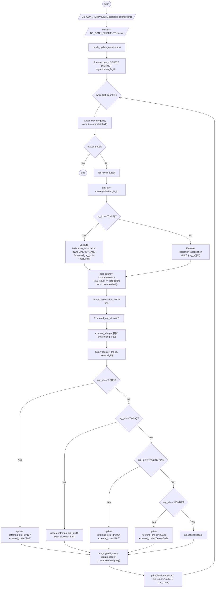
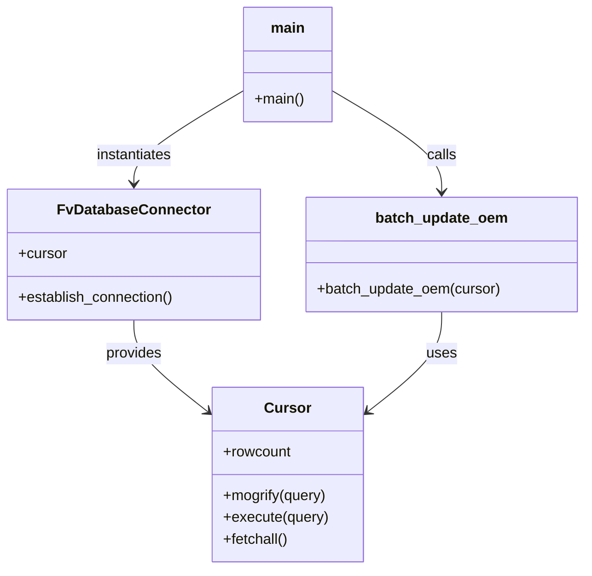

# Diagram: entity_core/entity_service/entity_service_scripts/backfill_FIN-9176.py

> Auto-generated by Obscura crawlers

## Diagram 1

### SVG

<svg id="container" width="2023.6090087890625" xmlns="http://www.w3.org/2000/svg" class="flowchart" height="3952.546875" viewBox="0 0 2023.6090087890625 3952.546875" role="graphics-document document" aria-roledescription="flowchart-v2"><g><marker id="container_flowchart-v2-pointEnd" class="marker flowchart-v2" viewBox="0 0 10 10" refX="5" refY="5" markerUnits="userSpaceOnUse" markerWidth="8" markerHeight="8" orient="auto"><path d="M 0 0 L 10 5 L 0 10 z" class="arrowMarkerPath" style="stroke-width: 1; stroke-dasharray: 1, 0;"></path></marker><marker id="container_flowchart-v2-pointStart" class="marker flowchart-v2" viewBox="0 0 10 10" refX="4.5" refY="5" markerUnits="userSpaceOnUse" markerWidth="8" markerHeight="8" orient="auto"><path d="M 0 5 L 10 10 L 10 0 z" class="arrowMarkerPath" style="stroke-width: 1; stroke-dasharray: 1, 0;"></path></marker><marker id="container_flowchart-v2-circleEnd" class="marker flowchart-v2" viewBox="0 0 10 10" refX="11" refY="5" markerUnits="userSpaceOnUse" markerWidth="11" markerHeight="11" orient="auto"><circle cx="5" cy="5" r="5" class="arrowMarkerPath" style="stroke-width: 1; stroke-dasharray: 1, 0;"></circle></marker><marker id="container_flowchart-v2-circleStart" class="marker flowchart-v2" viewBox="0 0 10 10" refX="-1" refY="5" markerUnits="userSpaceOnUse" markerWidth="11" markerHeight="11" orient="auto"><circle cx="5" cy="5" r="5" class="arrowMarkerPath" style="stroke-width: 1; stroke-dasharray: 1, 0;"></circle></marker><marker id="container_flowchart-v2-crossEnd" class="marker cross flowchart-v2" viewBox="0 0 11 11" refX="12" refY="5.2" markerUnits="userSpaceOnUse" markerWidth="11" markerHeight="11" orient="auto"><path d="M 1,1 l 9,9 M 10,1 l -9,9" class="arrowMarkerPath" style="stroke-width: 2; stroke-dasharray: 1, 0;"></path></marker><marker id="container_flowchart-v2-crossStart" class="marker cross flowchart-v2" viewBox="0 0 11 11" refX="-1" refY="5.2" markerUnits="userSpaceOnUse" markerWidth="11" markerHeight="11" orient="auto"><path d="M 1,1 l 9,9 M 10,1 l -9,9" class="arrowMarkerPath" style="stroke-width: 2; stroke-dasharray: 1, 0;"></path></marker><g class="root"><g class="clusters"></g><g class="edgePaths"><path d="M1033.419,47.5L1033.336,51.583C1033.252,55.667,1033.086,63.833,1033.073,71.5C1033.06,79.167,1033.2,86.334,1033.27,89.917L1033.341,93.501" id="L_Start_EstablishDB_0" class="edge-thickness-normal edge-pattern-solid edge-thickness-normal edge-pattern-solid flowchart-link" style=";" data-edge="true" data-et="edge" data-id="L_Start_EstablishDB_0" data-points="W3sieCI6MTAzMy40MTkwNzIxNTExODQsInkiOjQ3LjV9LHsieCI6MTAzMi45MTkwNzIxNTExODQsInkiOjcyfSx7IngiOjEwMzMuNDE5MDcyMTUxMTg0LCJ5Ijo5Ny41fV0=" marker-end="url(#container_flowchart-v2-pointEnd)"></path><path d="M1033.419,136.5L1033.336,140.583C1033.252,144.667,1033.086,152.833,1033.073,160.5C1033.06,168.167,1033.2,175.334,1033.27,178.917L1033.341,182.501" id="L_EstablishDB_GetCursor_0" class="edge-thickness-normal edge-pattern-solid edge-thickness-normal edge-pattern-solid flowchart-link" style=";" data-edge="true" data-et="edge" data-id="L_EstablishDB_GetCursor_0" data-points="W3sieCI6MTAzMy40MTkwNzIxNTExODQsInkiOjEzNi41fSx7IngiOjEwMzIuOTE5MDcyMTUxMTg0LCJ5IjoxNjF9LHsieCI6MTAzMy40MTkwNzIxNTExODQsInkiOjE4Ni41fV0=" marker-end="url(#container_flowchart-v2-pointEnd)"></path><path d="M1033.419,249.5L1033.336,253.583C1033.252,257.667,1033.086,265.833,1033.002,273.417C1032.919,281,1032.919,288,1032.919,291.5L1032.919,295" id="L_GetCursor_BatchCall_0" class="edge-thickness-normal edge-pattern-solid edge-thickness-normal edge-pattern-solid flowchart-link" style=";" data-edge="true" data-et="edge" data-id="L_GetCursor_BatchCall_0" data-points="W3sieCI6MTAzMy40MTkwNzIxNTExODQsInkiOjI0OS41fSx7IngiOjEwMzIuOTE5MDcyMTUxMTg0LCJ5IjoyNzR9LHsieCI6MTAzMi45MTkwNzIxNTExODQsInkiOjI5OX1d" marker-end="url(#container_flowchart-v2-pointEnd)"></path><path d="M1032.919,353L1032.919,357.167C1032.919,361.333,1032.919,369.667,1032.919,377.333C1032.919,385,1032.919,392,1032.919,395.5L1032.919,399" id="L_BatchCall_PrepareOrgQuery_0" class="edge-thickness-normal edge-pattern-solid edge-thickness-normal edge-pattern-solid flowchart-link" style=";" data-edge="true" data-et="edge" data-id="L_BatchCall_PrepareOrgQuery_0" data-points="W3sieCI6MTAzMi45MTkwNzIxNTExODQsInkiOjM1M30seyJ4IjoxMDMyLjkxOTA3MjE1MTE4NCwieSI6Mzc4fSx7IngiOjEwMzIuOTE5MDcyMTUxMTg0LCJ5Ijo0MDN9XQ==" marker-end="url(#container_flowchart-v2-pointEnd)"></path><path d="M1032.919,505L1032.919,509.167C1032.919,513.333,1032.919,521.667,1032.919,529.333C1032.919,537,1032.919,544,1032.919,547.5L1032.919,551" id="L_PrepareOrgQuery_Loop_0" class="edge-thickness-normal edge-pattern-solid edge-thickness-normal edge-pattern-solid flowchart-link" style=";" data-edge="true" data-et="edge" data-id="L_PrepareOrgQuery_Loop_0" data-points="W3sieCI6MTAzMi45MTkwNzIxNTExODQsInkiOjUwNX0seyJ4IjoxMDMyLjkxOTA3MjE1MTE4NCwieSI6NTMwfSx7IngiOjEwMzIuOTE5MDcyMTUxMTg0LCJ5Ijo1NTV9XQ==" marker-end="url(#container_flowchart-v2-pointEnd)"></path><path d="M987.712,711.527L978.208,723.228C968.704,734.929,949.696,758.332,940.192,773.533C930.689,788.734,930.689,795.734,930.689,799.234L930.689,802.734" id="L_Loop_ExecuteOrg_0" class="edge-thickness-normal edge-pattern-solid edge-thickness-normal edge-pattern-solid flowchart-link" style=";" data-edge="true" data-et="edge" data-id="L_Loop_ExecuteOrg_0" data-points="W3sieCI6OTg3LjcxMTY4MTQ2OTcyNDEsInkiOjcxMS41MjY5ODQzMTg1NH0seyJ4Ijo5MzAuNjg4NjAzNDAxMTg0MSwieSI6NzgxLjczNDM3NX0seyJ4Ijo5MzAuNjg4NjAzNDAxMTg0MSwieSI6ODA2LjczNDM3NX1d" marker-end="url(#container_flowchart-v2-pointEnd)"></path><path d="M930.689,884.734L930.689,888.901C930.689,893.068,930.689,901.401,930.689,909.068C930.689,916.734,930.689,923.734,930.689,927.234L930.689,930.734" id="L_ExecuteOrg_OutputEmpty_0" class="edge-thickness-normal edge-pattern-solid edge-thickness-normal edge-pattern-solid flowchart-link" style=";" data-edge="true" data-et="edge" data-id="L_ExecuteOrg_OutputEmpty_0" data-points="W3sieCI6OTMwLjY4ODYwMzQwMTE4NDEsInkiOjg4NC43MzQzNzV9LHsieCI6OTMwLjY4ODYwMzQwMTE4NDEsInkiOjkwOS43MzQzNzV9LHsieCI6OTMwLjY4ODYwMzQwMTE4NDEsInkiOjkzNC43MzQzNzV9XQ==" marker-end="url(#container_flowchart-v2-pointEnd)"></path><path d="M897.361,1061.047L888.959,1072.769C880.556,1084.49,863.752,1107.932,855.426,1126.487C847.099,1145.042,847.251,1158.708,847.327,1165.542L847.403,1172.375" id="L_OutputEmpty_End_0" class="edge-thickness-normal edge-pattern-solid edge-thickness-normal edge-pattern-solid flowchart-link" style=";" data-edge="true" data-et="edge" data-id="L_OutputEmpty_End_0" data-points="W3sieCI6ODk3LjM2MDk1NjAzMTMwMjcsInkiOjEwNjEuMDQ3MzUyNjMwMTE4N30seyJ4Ijo4NDYuOTQ3NTE5MzAyMzY4MiwieSI6MTEzMS4zNzV9LHsieCI6ODQ3LjQ0NzUxOTMwMjM2ODIsInkiOjExNzYuMzc1fV0=" marker-end="url(#container_flowchart-v2-pointEnd)"></path><path d="M964.016,1061.047L972.418,1072.769C980.821,1084.49,997.625,1107.932,1006.027,1125.154C1014.43,1142.375,1014.43,1153.375,1014.43,1158.875L1014.43,1164.375" id="L_OutputEmpty_ForEachOrg_0" class="edge-thickness-normal edge-pattern-solid edge-thickness-normal edge-pattern-solid flowchart-link" style=";" data-edge="true" data-et="edge" data-id="L_OutputEmpty_ForEachOrg_0" data-points="W3sieCI6OTY0LjAxNjI1MDc3MTA2NTUsInkiOjEwNjEuMDQ3MzUyNjMwMTE4NH0seyJ4IjoxMDE0LjQyOTY4NzUsInkiOjExMzEuMzc1fSx7IngiOjEwMTQuNDI5Njg3NSwieSI6MTE2OC4zNzV9XQ==" marker-end="url(#container_flowchart-v2-pointEnd)"></path><path d="M1014.43,1222.375L1014.43,1226.542C1014.43,1230.708,1014.43,1239.042,1014.43,1246.708C1014.43,1254.375,1014.43,1261.375,1014.43,1264.875L1014.43,1268.375" id="L_ForEachOrg_OrgId_0" class="edge-thickness-normal edge-pattern-solid edge-thickness-normal edge-pattern-solid flowchart-link" style=";" data-edge="true" data-et="edge" data-id="L_ForEachOrg_OrgId_0" data-points="W3sieCI6MTAxNC40Mjk2ODc1LCJ5IjoxMjIyLjM3NX0seyJ4IjoxMDE0LjQyOTY4NzUsInkiOjEyNDcuMzc1fSx7IngiOjEwMTQuNDI5Njg3NSwieSI6MTI3Mi4zNzV9XQ==" marker-end="url(#container_flowchart-v2-pointEnd)"></path><path d="M1014.43,1350.375L1014.43,1354.542C1014.43,1358.708,1014.43,1367.042,1014.43,1374.708C1014.43,1382.375,1014.43,1389.375,1014.43,1392.875L1014.43,1396.375" id="L_OrgId_IsGMHQ_0" class="edge-thickness-normal edge-pattern-solid edge-thickness-normal edge-pattern-solid flowchart-link" style=";" data-edge="true" data-et="edge" data-id="L_OrgId_IsGMHQ_0" data-points="W3sieCI6MTAxNC40Mjk2ODc1LCJ5IjoxMzUwLjM3NX0seyJ4IjoxMDE0LjQyOTY4NzUsInkiOjEzNzUuMzc1fSx7IngiOjEwMTQuNDI5Njg3NSwieSI6MTQwMC4zNzV9XQ==" marker-end="url(#container_flowchart-v2-pointEnd)"></path><path d="M964.331,1533.667L946.847,1548.183C929.364,1562.7,894.397,1591.733,876.913,1611.749C859.43,1631.766,859.43,1642.766,859.43,1648.266L859.43,1653.766" id="L_IsGMHQ_QueryGMHQ_0" class="edge-thickness-normal edge-pattern-solid edge-thickness-normal edge-pattern-solid flowchart-link" style=";" data-edge="true" data-et="edge" data-id="L_IsGMHQ_QueryGMHQ_0" data-points="W3sieCI6OTY0LjMzMDk2MjUyNTQ3MywieSI6MTUzMy42NjY5MDAwMjU0NzN9LHsieCI6ODU5LjQyOTY4NzUsInkiOjE2MjAuNzY1NjI1fSx7IngiOjg1OS40Mjk2ODc1LCJ5IjoxNjU3Ljc2NTYyNX1d" marker-end="url(#container_flowchart-v2-pointEnd)"></path><path d="M859.43,1807.766L859.43,1811.932C859.43,1816.099,859.43,1824.432,866.189,1832.436C872.948,1840.441,886.467,1848.116,893.226,1851.953L899.985,1855.791" id="L_QueryGMHQ_AfterAssoc_0" class="edge-thickness-normal edge-pattern-solid edge-thickness-normal edge-pattern-solid flowchart-link" style=";" data-edge="true" data-et="edge" data-id="L_QueryGMHQ_AfterAssoc_0" data-points="W3sieCI6ODU5LjQyOTY4NzUsInkiOjE4MDcuNzY1NjI1fSx7IngiOjg1OS40Mjk2ODc1LCJ5IjoxODMyLjc2NTYyNX0seyJ4Ijo5MDMuNDYzNzc4NDA5MDkwOSwieSI6MTg1Ny43NjU2MjV9XQ==" marker-end="url(#container_flowchart-v2-pointEnd)"></path><path d="M1093.808,1504.387L1218.814,1523.783C1343.819,1543.18,1593.829,1581.973,1718.835,1610.869C1843.84,1639.766,1843.84,1658.766,1843.84,1668.266L1843.84,1677.766" id="L_IsGMHQ_QueryOther_0" class="edge-thickness-normal edge-pattern-solid edge-thickness-normal edge-pattern-solid flowchart-link" style=";" data-edge="true" data-et="edge" data-id="L_IsGMHQ_QueryOther_0" data-points="W3sieCI6MTA5My44MDgyMzgxMzgzMTQyLCJ5IjoxNTA0LjM4NzA3NDM2MTY4NTh9LHsieCI6MTg0My44Mzk4NDM3NSwieSI6MTYyMC43NjU2MjV9LHsieCI6MTg0My44Mzk4NDM3NSwieSI6MTY4MS43NjU2MjV9XQ==" marker-end="url(#container_flowchart-v2-pointEnd)"></path><path d="M1843.84,1783.766L1843.84,1791.932C1843.84,1800.099,1843.84,1816.432,1729.613,1836.718C1615.386,1857.004,1386.932,1881.243,1272.705,1893.363L1158.478,1905.482" id="L_QueryOther_AfterAssoc_0" class="edge-thickness-normal edge-pattern-solid edge-thickness-normal edge-pattern-solid flowchart-link" style=";" data-edge="true" data-et="edge" data-id="L_QueryOther_AfterAssoc_0" data-points="W3sieCI6MTg0My44Mzk4NDM3NSwieSI6MTc4My43NjU2MjV9LHsieCI6MTg0My44Mzk4NDM3NSwieSI6MTgzMi43NjU2MjV9LHsieCI6MTE1NC41LCJ5IjoxOTA1LjkwNDIzNTM2NDEwNDh9XQ==" marker-end="url(#container_flowchart-v2-pointEnd)"></path><path d="M1014.43,1983.766L1014.43,1987.932C1014.43,1992.099,1014.43,2000.432,1014.43,2008.099C1014.43,2015.766,1014.43,2022.766,1014.43,2026.266L1014.43,2029.766" id="L_AfterAssoc_ForEachAssoc_0" class="edge-thickness-normal edge-pattern-solid edge-thickness-normal edge-pattern-solid flowchart-link" style=";" data-edge="true" data-et="edge" data-id="L_AfterAssoc_ForEachAssoc_0" data-points="W3sieCI6MTAxNC40Mjk2ODc1LCJ5IjoxOTgzLjc2NTYyNX0seyJ4IjoxMDE0LjQyOTY4NzUsInkiOjIwMDguNzY1NjI1fSx7IngiOjEwMTQuNDI5Njg3NSwieSI6MjAzMy43NjU2MjV9XQ==" marker-end="url(#container_flowchart-v2-pointEnd)"></path><path d="M1014.43,2111.766L1014.43,2115.932C1014.43,2120.099,1014.43,2128.432,1014.43,2136.099C1014.43,2143.766,1014.43,2150.766,1014.43,2154.266L1014.43,2157.766" id="L_ForEachAssoc_SplitFed_0" class="edge-thickness-normal edge-pattern-solid edge-thickness-normal edge-pattern-solid flowchart-link" style=";" data-edge="true" data-et="edge" data-id="L_ForEachAssoc_SplitFed_0" data-points="W3sieCI6MTAxNC40Mjk2ODc1LCJ5IjoyMTExLjc2NTYyNX0seyJ4IjoxMDE0LjQyOTY4NzUsInkiOjIxMzYuNzY1NjI1fSx7IngiOjEwMTQuNDI5Njg3NSwieSI6MjE2MS43NjU2MjV9XQ==" marker-end="url(#container_flowchart-v2-pointEnd)"></path><path d="M1014.43,2215.766L1014.43,2219.932C1014.43,2224.099,1014.43,2232.432,1014.43,2240.099C1014.43,2247.766,1014.43,2254.766,1014.43,2258.266L1014.43,2261.766" id="L_SplitFed_ExternalId_0" class="edge-thickness-normal edge-pattern-solid edge-thickness-normal edge-pattern-solid flowchart-link" style=";" data-edge="true" data-et="edge" data-id="L_SplitFed_ExternalId_0" data-points="W3sieCI6MTAxNC40Mjk2ODc1LCJ5IjoyMjE1Ljc2NTYyNX0seyJ4IjoxMDE0LjQyOTY4NzUsInkiOjIyNDAuNzY1NjI1fSx7IngiOjEwMTQuNDI5Njg3NSwieSI6MjI2NS43NjU2MjV9XQ==" marker-end="url(#container_flowchart-v2-pointEnd)"></path><path d="M1014.43,2343.766L1014.43,2347.932C1014.43,2352.099,1014.43,2360.432,1014.43,2368.099C1014.43,2375.766,1014.43,2382.766,1014.43,2386.266L1014.43,2389.766" id="L_ExternalId_BuildData_0" class="edge-thickness-normal edge-pattern-solid edge-thickness-normal edge-pattern-solid flowchart-link" style=";" data-edge="true" data-et="edge" data-id="L_ExternalId_BuildData_0" data-points="W3sieCI6MTAxNC40Mjk2ODc1LCJ5IjoyMzQzLjc2NTYyNX0seyJ4IjoxMDE0LjQyOTY4NzUsInkiOjIzNjguNzY1NjI1fSx7IngiOjEwMTQuNDI5Njg3NSwieSI6MjM5My43NjU2MjV9XQ==" marker-end="url(#container_flowchart-v2-pointEnd)"></path><path d="M1014.43,2471.766L1014.43,2475.932C1014.43,2480.099,1014.43,2488.432,1014.43,2496.099C1014.43,2503.766,1014.43,2510.766,1014.43,2514.266L1014.43,2517.766" id="L_BuildData_IsFORD_0" class="edge-thickness-normal edge-pattern-solid edge-thickness-normal edge-pattern-solid flowchart-link" style=";" data-edge="true" data-et="edge" data-id="L_BuildData_IsFORD_0" data-points="W3sieCI6MTAxNC40Mjk2ODc1LCJ5IjoyNDcxLjc2NTYyNX0seyJ4IjoxMDE0LjQyOTY4NzUsInkiOjI0OTYuNzY1NjI1fSx7IngiOjEwMTQuNDI5Njg3NSwieSI6MjUyMS43NjU2MjV9XQ==" marker-end="url(#container_flowchart-v2-pointEnd)"></path><path d="M937.448,2622.331L813.432,2641.328C689.416,2660.325,441.384,2698.319,317.368,2738.765C193.352,2779.211,193.352,2822.109,193.352,2865.008C193.352,2907.906,193.352,2950.805,193.352,2996.523C193.352,3042.242,193.352,3090.781,193.352,3139.32C193.352,3187.859,193.352,3236.398,193.352,3282.719C193.352,3329.039,193.352,3373.141,193.352,3417.242C193.352,3461.344,193.352,3505.445,193.352,3532.996C193.352,3560.547,193.352,3571.547,193.352,3577.047L193.352,3582.547" id="L_IsFORD_SetFORD_0" class="edge-thickness-normal edge-pattern-solid edge-thickness-normal edge-pattern-solid flowchart-link" style=";" data-edge="true" data-et="edge" data-id="L_IsFORD_SetFORD_0" data-points="W3sieCI6OTM3LjQ0ODMyMDUxNTg3NSwieSI6MjYyMi4zMzExMzMwMTU4NzV9LHsieCI6MTkzLjM1MTU2MjUsInkiOjI3MzYuMzEyNX0seyJ4IjoxOTMuMzUxNTYyNSwieSI6Mjg2NS4wMDc4MTI1fSx7IngiOjE5My4zNTE1NjI1LCJ5IjoyOTkzLjcwMzEyNX0seyJ4IjoxOTMuMzUxNTYyNSwieSI6MzEzOS4zMjAzMTI1fSx7IngiOjE5My4zNTE1NjI1LCJ5IjozMjg0LjkzNzV9LHsieCI6MTkzLjM1MTU2MjUsInkiOjM0MTcuMjQyMTg3NX0seyJ4IjoxOTMuMzUxNTYyNSwieSI6MzU0OS41NDY4NzV9LHsieCI6MTkzLjM1MTU2MjUsInkiOjM1ODYuNTQ2ODc1fV0=" marker-end="url(#container_flowchart-v2-pointEnd)"></path><path d="M193.352,3664.547L193.352,3668.714C193.352,3672.88,193.352,3681.214,304.107,3693.839C414.863,3706.465,636.375,3723.382,747.131,3731.841L857.887,3740.3" id="L_SetFORD_Insert_0" class="edge-thickness-normal edge-pattern-solid edge-thickness-normal edge-pattern-solid flowchart-link" style=";" data-edge="true" data-et="edge" data-id="L_SetFORD_Insert_0" data-points="W3sieCI6MTkzLjM1MTU2MjUsInkiOjM2NjQuNTQ2ODc1fSx7IngiOjE5My4zNTE1NjI1LCJ5IjozNjg5LjU0Njg3NX0seyJ4Ijo4NjEuODc1LCJ5IjozNzQwLjYwNDUwOTU3NzAxN31d" marker-end="url(#container_flowchart-v2-pointEnd)"></path><path d="M1069.786,2643.956L1095.286,2659.349C1120.785,2674.741,1171.783,2705.527,1197.282,2726.42C1222.781,2747.313,1222.781,2758.313,1222.781,2763.813L1222.781,2769.313" id="L_IsFORD_IsGMHQ2_0" class="edge-thickness-normal edge-pattern-solid edge-thickness-normal edge-pattern-solid flowchart-link" style=";" data-edge="true" data-et="edge" data-id="L_IsFORD_IsGMHQ2_0" data-points="W3sieCI6MTA2OS43ODY0NjgzODAyNzI3LCJ5IjoyNjQzLjk1NTcxOTExOTcyNzN9LHsieCI6MTIyMi43ODEyNSwieSI6MjczNi4zMTI1fSx7IngiOjEyMjIuNzgxMjUsInkiOjI3NzMuMzEyNX1d" marker-end="url(#container_flowchart-v2-pointEnd)"></path><path d="M1147.002,2880.924L1057.511,2899.721C968.02,2918.517,789.037,2956.11,699.546,2999.176C610.055,3042.242,610.055,3090.781,610.055,3139.32C610.055,3187.859,610.055,3236.398,610.055,3282.719C610.055,3329.039,610.055,3373.141,610.055,3417.242C610.055,3461.344,610.055,3505.445,610.055,3532.996C610.055,3560.547,610.055,3571.547,610.055,3577.047L610.055,3582.547" id="L_IsGMHQ2_SetGMHQ_0" class="edge-thickness-normal edge-pattern-solid edge-thickness-normal edge-pattern-solid flowchart-link" style=";" data-edge="true" data-et="edge" data-id="L_IsGMHQ2_SetGMHQ_0" data-points="W3sieCI6MTE0Ny4wMDIzMjM2OTY0MTg0LCJ5IjoyODgwLjkyNDE5ODY5NjQxODR9LHsieCI6NjEwLjA1NDY4NzUsInkiOjI5OTMuNzAzMTI1fSx7IngiOjYxMC4wNTQ2ODc1LCJ5IjozMTM5LjMyMDMxMjV9LHsieCI6NjEwLjA1NDY4NzUsInkiOjMyODQuOTM3NX0seyJ4Ijo2MTAuMDU0Njg3NSwieSI6MzQxNy4yNDIxODc1fSx7IngiOjYxMC4wNTQ2ODc1LCJ5IjozNTQ5LjU0Njg3NX0seyJ4Ijo2MTAuMDU0Njg3NSwieSI6MzU4Ni41NDY4NzV9XQ==" marker-end="url(#container_flowchart-v2-pointEnd)"></path><path d="M610.055,3664.547L610.055,3668.714C610.055,3672.88,610.055,3681.214,651.366,3691.656C692.677,3702.099,775.298,3714.65,816.609,3720.926L857.92,3727.202" id="L_SetGMHQ_Insert_0" class="edge-thickness-normal edge-pattern-solid edge-thickness-normal edge-pattern-solid flowchart-link" style=";" data-edge="true" data-et="edge" data-id="L_SetGMHQ_Insert_0" data-points="W3sieCI6NjEwLjA1NDY4NzUsInkiOjM2NjQuNTQ2ODc1fSx7IngiOjYxMC4wNTQ2ODc1LCJ5IjozNjg5LjU0Njg3NX0seyJ4Ijo4NjEuODc1LCJ5IjozNzI3LjgwMjc5MDczMzI1NDR9XQ==" marker-end="url(#container_flowchart-v2-pointEnd)"></path><path d="M1279.701,2899.784L1305.321,2915.437C1330.941,2931.09,1382.181,2962.397,1407.802,2983.55C1433.422,3004.703,1433.422,3015.703,1433.422,3021.203L1433.422,3026.703" id="L_IsGMHQ2_IsFV_0" class="edge-thickness-normal edge-pattern-solid edge-thickness-normal edge-pattern-solid flowchart-link" style=";" data-edge="true" data-et="edge" data-id="L_IsGMHQ2_IsFV_0" data-points="W3sieCI6MTI3OS43MDA1MzIwNDUwMDk4LCJ5IjoyODk5Ljc4Mzg0Mjk1NDk5fSx7IngiOjE0MzMuNDIxODc1LCJ5IjoyOTkzLjcwMzEyNX0seyJ4IjoxNDMzLjQyMTg3NSwieSI6MzAzMC43MDMxMjV9XQ==" marker-end="url(#container_flowchart-v2-pointEnd)"></path><path d="M1353.683,3168.198L1299.958,3187.655C1246.234,3207.111,1138.785,3246.024,1085.06,3287.532C1031.336,3329.039,1031.336,3373.141,1031.336,3417.242C1031.336,3461.344,1031.336,3505.445,1031.336,3532.996C1031.336,3560.547,1031.336,3571.547,1031.336,3577.047L1031.336,3582.547" id="L_IsFV_SetFV_0" class="edge-thickness-normal edge-pattern-solid edge-thickness-normal edge-pattern-solid flowchart-link" style=";" data-edge="true" data-et="edge" data-id="L_IsFV_SetFV_0" data-points="W3sieCI6MTM1My42ODI2MTE3NTQ4NzgzLCJ5IjozMTY4LjE5ODIzNjc1NDg3ODV9LHsieCI6MTAzMS4zMzU5Mzc1LCJ5IjozMjg0LjkzNzV9LHsieCI6MTAzMS4zMzU5Mzc1LCJ5IjozNDE3LjI0MjE4NzV9LHsieCI6MTAzMS4zMzU5Mzc1LCJ5IjozNTQ5LjU0Njg3NX0seyJ4IjoxMDMxLjMzNTkzNzUsInkiOjM1ODYuNTQ2ODc1fV0=" marker-end="url(#container_flowchart-v2-pointEnd)"></path><path d="M1031.336,3664.547L1031.336,3668.714C1031.336,3672.88,1031.336,3681.214,1031.336,3688.88C1031.336,3696.547,1031.336,3703.547,1031.336,3707.047L1031.336,3710.547" id="L_SetFV_Insert_0" class="edge-thickness-normal edge-pattern-solid edge-thickness-normal edge-pattern-solid flowchart-link" style=";" data-edge="true" data-et="edge" data-id="L_SetFV_Insert_0" data-points="W3sieCI6MTAzMS4zMzU5Mzc1LCJ5IjozNjY0LjU0Njg3NX0seyJ4IjoxMDMxLjMzNTkzNzUsInkiOjM2ODkuNTQ2ODc1fSx7IngiOjEwMzEuMzM1OTM3NSwieSI6MzcxNC41NDY4NzV9XQ==" marker-end="url(#container_flowchart-v2-pointEnd)"></path><path d="M1500.076,3181.283L1527.517,3198.559C1554.958,3215.835,1609.841,3250.386,1637.282,3273.162C1664.723,3295.938,1664.723,3306.938,1664.723,3312.438L1664.723,3317.938" id="L_IsFV_IsHONDA_0" class="edge-thickness-normal edge-pattern-solid edge-thickness-normal edge-pattern-solid flowchart-link" style=";" data-edge="true" data-et="edge" data-id="L_IsFV_IsHONDA_0" data-points="W3sieCI6MTUwMC4wNzYyNzMwNjIzODQsInkiOjMxODEuMjgzMTAxOTM3NjE2fSx7IngiOjE2NjQuNzIyNjU2MjUsInkiOjMyODQuOTM3NX0seyJ4IjoxNjY0LjcyMjY1NjI1LCJ5IjozMzIxLjkzNzV9XQ==" marker-end="url(#container_flowchart-v2-pointEnd)"></path><path d="M1611.02,3458.845L1591.507,3473.962C1571.993,3489.079,1532.965,3519.313,1513.451,3539.93C1493.938,3560.547,1493.938,3571.547,1493.938,3577.047L1493.938,3582.547" id="L_IsHONDA_SetHONDA_0" class="edge-thickness-normal edge-pattern-solid edge-thickness-normal edge-pattern-solid flowchart-link" style=";" data-edge="true" data-et="edge" data-id="L_IsHONDA_SetHONDA_0" data-points="W3sieCI6MTYxMS4wMjAzNDIyOTM2NDU2LCJ5IjozNDU4Ljg0NDU2MTA0MzY0NTZ9LHsieCI6MTQ5My45Mzc1LCJ5IjozNTQ5LjU0Njg3NX0seyJ4IjoxNDkzLjkzNzUsInkiOjM1ODYuNTQ2ODc1fV0=" marker-end="url(#container_flowchart-v2-pointEnd)"></path><path d="M1493.938,3664.547L1493.938,3668.714C1493.938,3672.88,1493.938,3681.214,1445.741,3692.048C1397.545,3702.883,1301.152,3716.218,1252.956,3722.886L1204.759,3729.554" id="L_SetHONDA_Insert_0" class="edge-thickness-normal edge-pattern-solid edge-thickness-normal edge-pattern-solid flowchart-link" style=";" data-edge="true" data-et="edge" data-id="L_SetHONDA_Insert_0" data-points="W3sieCI6MTQ5My45Mzc1LCJ5IjozNjY0LjU0Njg3NX0seyJ4IjoxNDkzLjkzNzUsInkiOjM2ODkuNTQ2ODc1fSx7IngiOjEyMDAuNzk2ODc1LCJ5IjozNzMwLjEwMjI5MzU3MzYyNH1d" marker-end="url(#container_flowchart-v2-pointEnd)"></path><path d="M1721.703,3455.567L1744.991,3471.23C1768.278,3486.894,1814.854,3518.22,1838.142,3541.384C1861.43,3564.547,1861.43,3579.547,1861.43,3587.047L1861.43,3594.547" id="L_IsHONDA_NoSpecial_0" class="edge-thickness-normal edge-pattern-solid edge-thickness-normal edge-pattern-solid flowchart-link" style=";" data-edge="true" data-et="edge" data-id="L_IsHONDA_NoSpecial_0" data-points="W3sieCI6MTcyMS43MDI3MDAwNDE2Mjg1LCJ5IjozNDU1LjU2NjgzMTIwODM3MTJ9LHsieCI6MTg2MS40Mjk2ODc1LCJ5IjozNTQ5LjU0Njg3NX0seyJ4IjoxODYxLjQyOTY4NzUsInkiOjM1OTguNTQ2ODc1fV0=" marker-end="url(#container_flowchart-v2-pointEnd)"></path><path d="M1861.43,3652.547L1861.43,3658.714C1861.43,3664.88,1861.43,3677.214,1751.989,3691.818C1642.548,3706.423,1423.667,3723.298,1314.226,3731.736L1204.785,3740.174" id="L_NoSpecial_Insert_0" class="edge-thickness-normal edge-pattern-solid edge-thickness-normal edge-pattern-solid flowchart-link" style=";" data-edge="true" data-et="edge" data-id="L_NoSpecial_Insert_0" data-points="W3sieCI6MTg2MS40Mjk2ODc1LCJ5IjozNjUyLjU0Njg3NX0seyJ4IjoxODYxLjQyOTY4NzUsInkiOjM2ODkuNTQ2ODc1fSx7IngiOjEyMDAuNzk2ODc1LCJ5IjozNzQwLjQ4MTQ4MzI4OTcyNjR9XQ==" marker-end="url(#container_flowchart-v2-pointEnd)"></path><path d="M1031.336,3792.547L1031.336,3796.714C1031.336,3800.88,1031.336,3809.214,1093.063,3822.682C1154.79,3836.151,1278.243,3854.756,1339.97,3864.058L1401.697,3873.36" id="L_Insert_PrintTotal_0" class="edge-thickness-normal edge-pattern-solid edge-thickness-normal edge-pattern-solid flowchart-link" style=";" data-edge="true" data-et="edge" data-id="L_Insert_PrintTotal_0" data-points="W3sieCI6MTAzMS4zMzU5Mzc1LCJ5IjozNzkyLjU0Njg3NX0seyJ4IjoxMDMxLjMzNTkzNzUsInkiOjM4MTcuNTQ2ODc1fSx7IngiOjE0MDUuNjUyMzQzNzUsInkiOjM4NzMuOTU1OTk5MzU2MTQ0M31d" marker-end="url(#container_flowchart-v2-pointEnd)"></path><path d="M1665.652,3872.962L1723.979,3863.726C1782.305,3854.49,1898.957,3836.018,1957.283,3816.116C2015.609,3796.214,2015.609,3774.88,2015.609,3753.547C2015.609,3732.214,2015.609,3710.88,2015.609,3689.547C2015.609,3668.214,2015.609,3646.88,2015.609,3623.547C2015.609,3600.214,2015.609,3574.88,2015.609,3540.163C2015.609,3505.445,2015.609,3461.344,2015.609,3417.242C2015.609,3373.141,2015.609,3329.039,2015.609,3282.719C2015.609,3236.398,2015.609,3187.859,2015.609,3139.32C2015.609,3090.781,2015.609,3042.242,2015.609,2996.523C2015.609,2950.805,2015.609,2907.906,2015.609,2865.008C2015.609,2822.109,2015.609,2779.211,2015.609,2736.799C2015.609,2694.388,2015.609,2652.464,2015.609,2612.539C2015.609,2572.615,2015.609,2534.69,2015.609,2505.061C2015.609,2475.432,2015.609,2454.099,2015.609,2432.766C2015.609,2411.432,2015.609,2390.099,2015.609,2368.766C2015.609,2347.432,2015.609,2326.099,2015.609,2304.766C2015.609,2283.432,2015.609,2262.099,2015.609,2242.766C2015.609,2223.432,2015.609,2206.099,2015.609,2188.766C2015.609,2171.432,2015.609,2154.099,2015.609,2134.766C2015.609,2115.432,2015.609,2094.099,2015.609,2072.766C2015.609,2051.432,2015.609,2030.099,2015.609,2004.766C2015.609,1979.432,2015.609,1950.099,2015.609,1920.766C2015.609,1891.432,2015.609,1862.099,2015.609,1830.766C2015.609,1799.432,2015.609,1766.099,2015.609,1730.766C2015.609,1695.432,2015.609,1658.099,2015.609,1617.983C2015.609,1577.867,2015.609,1534.969,2015.609,1494.07C2015.609,1453.172,2015.609,1414.273,2015.609,1384.158C2015.609,1354.042,2015.609,1332.708,2015.609,1311.375C2015.609,1290.042,2015.609,1268.708,2015.609,1249.375C2015.609,1230.042,2015.609,1212.708,2015.609,1193.375C2015.609,1174.042,2015.609,1152.708,2015.609,1122.572C2015.609,1092.435,2015.609,1053.495,2015.609,1016.555C2015.609,979.615,2015.609,944.674,2015.609,916.538C2015.609,888.401,2015.609,867.068,2015.609,845.734C2015.609,824.401,2015.609,803.068,1867.391,773.417C1719.173,743.766,1422.737,705.797,1274.519,686.812L1126.301,667.828" id="L_PrintTotal_Loop_0" class="edge-thickness-normal edge-pattern-solid edge-thickness-normal edge-pattern-solid flowchart-link" style=";" data-edge="true" data-et="edge" data-id="L_PrintTotal_Loop_0" data-points="W3sieCI6MTY2NS42NTIzNDM3NSwieSI6Mzg3Mi45NjE2OTg5MTgxNTd9LHsieCI6MjAxNS42MDkzNzUsInkiOjM4MTcuNTQ2ODc1fSx7IngiOjIwMTUuNjA5Mzc1LCJ5IjozNzUzLjU0Njg3NX0seyJ4IjoyMDE1LjYwOTM3NSwieSI6MzY4OS41NDY4NzV9LHsieCI6MjAxNS42MDkzNzUsInkiOjM2MjUuNTQ2ODc1fSx7IngiOjIwMTUuNjA5Mzc1LCJ5IjozNTQ5LjU0Njg3NX0seyJ4IjoyMDE1LjYwOTM3NSwieSI6MzQxNy4yNDIxODc1fSx7IngiOjIwMTUuNjA5Mzc1LCJ5IjozMjg0LjkzNzV9LHsieCI6MjAxNS42MDkzNzUsInkiOjMxMzkuMzIwMzEyNX0seyJ4IjoyMDE1LjYwOTM3NSwieSI6Mjk5My43MDMxMjV9LHsieCI6MjAxNS42MDkzNzUsInkiOjI4NjUuMDA3ODEyNX0seyJ4IjoyMDE1LjYwOTM3NSwieSI6MjczNi4zMTI1fSx7IngiOjIwMTUuNjA5Mzc1LCJ5IjoyNjEwLjUzOTA2MjV9LHsieCI6MjAxNS42MDkzNzUsInkiOjI0OTYuNzY1NjI1fSx7IngiOjIwMTUuNjA5Mzc1LCJ5IjoyNDMyLjc2NTYyNX0seyJ4IjoyMDE1LjYwOTM3NSwieSI6MjM2OC43NjU2MjV9LHsieCI6MjAxNS42MDkzNzUsInkiOjIzMDQuNzY1NjI1fSx7IngiOjIwMTUuNjA5Mzc1LCJ5IjoyMjQwLjc2NTYyNX0seyJ4IjoyMDE1LjYwOTM3NSwieSI6MjE4OC43NjU2MjV9LHsieCI6MjAxNS42MDkzNzUsInkiOjIxMzYuNzY1NjI1fSx7IngiOjIwMTUuNjA5Mzc1LCJ5IjoyMDcyLjc2NTYyNX0seyJ4IjoyMDE1LjYwOTM3NSwieSI6MjAwOC43NjU2MjV9LHsieCI6MjAxNS42MDkzNzUsInkiOjE5MjAuNzY1NjI1fSx7IngiOjIwMTUuNjA5Mzc1LCJ5IjoxODMyLjc2NTYyNX0seyJ4IjoyMDE1LjYwOTM3NSwieSI6MTczMi43NjU2MjV9LHsieCI6MjAxNS42MDkzNzUsInkiOjE2MjAuNzY1NjI1fSx7IngiOjIwMTUuNjA5Mzc1LCJ5IjoxNDkyLjA3MDMxMjV9LHsieCI6MjAxNS42MDkzNzUsInkiOjEzNzUuMzc1fSx7IngiOjIwMTUuNjA5Mzc1LCJ5IjoxMzExLjM3NX0seyJ4IjoyMDE1LjYwOTM3NSwieSI6MTI0Ny4zNzV9LHsieCI6MjAxNS42MDkzNzUsInkiOjExOTUuMzc1fSx7IngiOjIwMTUuNjA5Mzc1LCJ5IjoxMTMxLjM3NX0seyJ4IjoyMDE1LjYwOTM3NSwieSI6MTAxNC41NTQ2ODc1fSx7IngiOjIwMTUuNjA5Mzc1LCJ5Ijo5MDkuNzM0Mzc1fSx7IngiOjIwMTUuNjA5Mzc1LCJ5Ijo4NDUuNzM0Mzc1fSx7IngiOjIwMTUuNjA5Mzc1LCJ5Ijo3ODEuNzM0Mzc1fSx7IngiOjExMjIuMzMzNjU2MzI0NjE2NCwieSI6NjY3LjMxOTc5MDgyNjU2NzR9XQ==" marker-end="url(#container_flowchart-v2-pointEnd)"></path></g><g class="edgeLabels"><g class="edgeLabel"><g class="label" data-id="L_Start_EstablishDB_0" transform="translate(0, 0)"><foreignObject width="0" height="0">

</foreignObject></g></g><g class="edgeLabel"><g class="label" data-id="L_EstablishDB_GetCursor_0" transform="translate(0, 0)"><foreignObject width="0" height="0">

</foreignObject></g></g><g class="edgeLabel"><g class="label" data-id="L_GetCursor_BatchCall_0" transform="translate(0, 0)"><foreignObject width="0" height="0">

</foreignObject></g></g><g class="edgeLabel"><g class="label" data-id="L_BatchCall_PrepareOrgQuery_0" transform="translate(0, 0)"><foreignObject width="0" height="0">

</foreignObject></g></g><g class="edgeLabel"><g class="label" data-id="L_PrepareOrgQuery_Loop_0" transform="translate(0, 0)"><foreignObject width="0" height="0">

</foreignObject></g></g><g class="edgeLabel"><g class="label" data-id="L_Loop_ExecuteOrg_0" transform="translate(0, 0)"><foreignObject width="0" height="0">

</foreignObject></g></g><g class="edgeLabel"><g class="label" data-id="L_ExecuteOrg_OutputEmpty_0" transform="translate(0, 0)"><foreignObject width="0" height="0">

</foreignObject></g></g><g class="edgeLabel" transform="translate(846.9475193023682, 1131.375)"><g class="label" data-id="L_OutputEmpty_End_0" transform="translate(-12.03125, -12)"><foreignObject width="24.0625" height="24">

Yes

</foreignObject></g></g><g class="edgeLabel" transform="translate(1014.4296875, 1131.375)"><g class="label" data-id="L_OutputEmpty_ForEachOrg_0" transform="translate(-10.140625, -12)"><foreignObject width="20.28125" height="24">

No

</foreignObject></g></g><g class="edgeLabel"><g class="label" data-id="L_ForEachOrg_OrgId_0" transform="translate(0, 0)"><foreignObject width="0" height="0">

</foreignObject></g></g><g class="edgeLabel"><g class="label" data-id="L_OrgId_IsGMHQ_0" transform="translate(0, 0)"><foreignObject width="0" height="0">

</foreignObject></g></g><g class="edgeLabel" transform="translate(859.4296875, 1620.765625)"><g class="label" data-id="L_IsGMHQ_QueryGMHQ_0" transform="translate(-12.03125, -12)"><foreignObject width="24.0625" height="24">

Yes

</foreignObject></g></g><g class="edgeLabel"><g class="label" data-id="L_QueryGMHQ_AfterAssoc_0" transform="translate(0, 0)"><foreignObject width="0" height="0">

</foreignObject></g></g><g class="edgeLabel" transform="translate(1843.83984375, 1620.765625)"><g class="label" data-id="L_IsGMHQ_QueryOther_0" transform="translate(-10.140625, -12)"><foreignObject width="20.28125" height="24">

No

</foreignObject></g></g><g class="edgeLabel"><g class="label" data-id="L_QueryOther_AfterAssoc_0" transform="translate(0, 0)"><foreignObject width="0" height="0">

</foreignObject></g></g><g class="edgeLabel"><g class="label" data-id="L_AfterAssoc_ForEachAssoc_0" transform="translate(0, 0)"><foreignObject width="0" height="0">

</foreignObject></g></g><g class="edgeLabel"><g class="label" data-id="L_ForEachAssoc_SplitFed_0" transform="translate(0, 0)"><foreignObject width="0" height="0">

</foreignObject></g></g><g class="edgeLabel"><g class="label" data-id="L_SplitFed_ExternalId_0" transform="translate(0, 0)"><foreignObject width="0" height="0">

</foreignObject></g></g><g class="edgeLabel"><g class="label" data-id="L_ExternalId_BuildData_0" transform="translate(0, 0)"><foreignObject width="0" height="0">

</foreignObject></g></g><g class="edgeLabel"><g class="label" data-id="L_BuildData_IsFORD_0" transform="translate(0, 0)"><foreignObject width="0" height="0">

</foreignObject></g></g><g class="edgeLabel" transform="translate(193.3515625, 3139.3203125)"><g class="label" data-id="L_IsFORD_SetFORD_0" transform="translate(-12.03125, -12)"><foreignObject width="24.0625" height="24">

Yes

</foreignObject></g></g><g class="edgeLabel"><g class="label" data-id="L_SetFORD_Insert_0" transform="translate(0, 0)"><foreignObject width="0" height="0">

</foreignObject></g></g><g class="edgeLabel" transform="translate(1222.78125, 2736.3125)"><g class="label" data-id="L_IsFORD_IsGMHQ2_0" transform="translate(-10.140625, -12)"><foreignObject width="20.28125" height="24">

No

</foreignObject></g></g><g class="edgeLabel" transform="translate(610.0546875, 3284.9375)"><g class="label" data-id="L_IsGMHQ2_SetGMHQ_0" transform="translate(-12.03125, -12)"><foreignObject width="24.0625" height="24">

Yes

</foreignObject></g></g><g class="edgeLabel"><g class="label" data-id="L_SetGMHQ_Insert_0" transform="translate(0, 0)"><foreignObject width="0" height="0">

</foreignObject></g></g><g class="edgeLabel" transform="translate(1433.421875, 2993.703125)"><g class="label" data-id="L_IsGMHQ2_IsFV_0" transform="translate(-10.140625, -12)"><foreignObject width="20.28125" height="24">

No

</foreignObject></g></g><g class="edgeLabel" transform="translate(1031.3359375, 3417.2421875)"><g class="label" data-id="L_IsFV_SetFV_0" transform="translate(-12.03125, -12)"><foreignObject width="24.0625" height="24">

Yes

</foreignObject></g></g><g class="edgeLabel"><g class="label" data-id="L_SetFV_Insert_0" transform="translate(0, 0)"><foreignObject width="0" height="0">

</foreignObject></g></g><g class="edgeLabel" transform="translate(1664.72265625, 3284.9375)"><g class="label" data-id="L_IsFV_IsHONDA_0" transform="translate(-10.140625, -12)"><foreignObject width="20.28125" height="24">

No

</foreignObject></g></g><g class="edgeLabel" transform="translate(1493.9375, 3549.546875)"><g class="label" data-id="L_IsHONDA_SetHONDA_0" transform="translate(-12.03125, -12)"><foreignObject width="24.0625" height="24">

Yes

</foreignObject></g></g><g class="edgeLabel"><g class="label" data-id="L_SetHONDA_Insert_0" transform="translate(0, 0)"><foreignObject width="0" height="0">

</foreignObject></g></g><g class="edgeLabel" transform="translate(1861.4296875, 3549.546875)"><g class="label" data-id="L_IsHONDA_NoSpecial_0" transform="translate(-10.140625, -12)"><foreignObject width="20.28125" height="24">

No

</foreignObject></g></g><g class="edgeLabel"><g class="label" data-id="L_NoSpecial_Insert_0" transform="translate(0, 0)"><foreignObject width="0" height="0">

</foreignObject></g></g><g class="edgeLabel"><g class="label" data-id="L_Insert_PrintTotal_0" transform="translate(0, 0)"><foreignObject width="0" height="0">

</foreignObject></g></g><g class="edgeLabel"><g class="label" data-id="L_PrintTotal_Loop_0" transform="translate(0, 0)"><foreignObject width="0" height="0">

</foreignObject></g></g></g><g class="nodes"><g class="node default" id="flowchart-Start-0" transform="translate(1032.919072151184, 27.5)"><g class="basic label-container outer-path"><path d="M-10.3984375 -19.5 C-3.446076321954007 -19.5, 3.5062848560919857 -19.5, 10.3984375 -19.5 C10.3984375 -19.5, 10.3984375 -19.5, 10.398437499999998 -19.5 C10.723869448250278 -19.489564030834472, 11.049301396500557 -19.47912806166895, 11.6478067896239 -19.45993515863156 C12.095304907351865 -19.41676555340957, 12.54280302507983 -19.373595948187578, 12.892042152847864 -19.3399052695533 C13.18795617814198 -19.292064184791286, 13.483870203436092 -19.244223100029274, 14.126030759676757 -19.140403561325776 C14.518178990830274 -19.050898286571346, 14.91032722198379 -18.961393011816916, 15.34470188623539 -18.862249829261074 C15.73260204706536 -18.747123097656235, 16.120502207895328 -18.631996366051393, 16.543047751460602 -18.50658706670804 C16.96280094251149 -18.352114012245348, 17.38255413356238 -18.19764095778266, 17.716144095147794 -18.074876768247425 C18.035675964257237 -17.933429488368795, 18.355207833366684 -17.791982208490168, 18.85917041279238 -17.568892924097174 C19.09588475783756 -17.44539920190988, 19.33259910288274 -17.321905479722584, 19.967429764076783 -16.990714730406097 C20.304153601061916 -16.786590761616797, 20.64087743804705 -16.582466792827496, 21.036368073605697 -16.342718045390892 C21.26097051175195 -16.18604510742291, 21.485572949898202 -16.029372169454927, 22.061592844578712 -15.627565626425154 C22.28465322528137 -15.449680908700806, 22.50771360598403 -15.271796190976456, 23.03889120850187 -14.848196188198123 C23.353573086148636 -14.562410432945562, 23.668254963795402 -14.276624677692999, 23.964247236767985 -14.007812326905688 C24.311655520118155 -13.649084751596122, 24.659063803468324 -13.290357176286559, 24.833858442968648 -13.10986736009568 C25.062109074187397 -12.841751180837296, 25.290359705406143 -12.57363500157891, 25.644151408126582 -12.158051136245305 C25.84417404124378 -11.89003903030501, 26.044196674360975 -11.622026924364713, 26.391796464640635 -11.156274872382312 C26.606986776312507 -10.825684766964736, 26.822177087984375 -10.49509466154716, 27.073721378604247 -10.108655082055241 C27.285495667655677 -9.732628387372301, 27.497269956707107 -9.356601692689361, 27.6871239742735 -9.019496659696287 C27.902455232958864 -8.572356693685274, 28.11778649164423 -8.12521672767426, 28.22948364880834 -7.893275190886684 C28.345965098139537 -7.60556375902301, 28.462446547470734 -7.317852327159336, 28.698571729970325 -6.734618561215508 C28.84456878397842 -6.29489869601471, 28.990565837986516 -5.855178830813911, 29.09246063421488 -5.548287939305138 C29.217505413369697 -5.071438001637722, 29.342550192524513 -4.5945880639703045, 29.40953178754556 -4.339158212148133 C29.478688053000155 -3.9840554052206745, 29.547844318454747 -3.628952598293216, 29.648482276581777 -3.1121979531509023 C29.704077036068135 -2.681015977001732, 29.75967179555449 -2.2498340008525615, 29.808330202509367 -1.872449005199798 C29.830858397769244 -1.5215541795952623, 29.853386593029125 -1.1706593539907268, 29.888418715913414 -0.6250057626472757 C29.888418715913414 -0.2517224802959984, 29.888418715913414 0.12156080205527886, 29.888418715913414 0.625005762647271 C29.870189867310756 0.9089347936954085, 29.8519610187081 1.192863824743546, 29.808330202509367 1.8724490051997846 C29.766936833933794 2.1934877978267653, 29.725543465358218 2.514526590453746, 29.648482276581777 3.1121979531508885 C29.585005944651517 3.4381355018852693, 29.52152961272126 3.7640730506196505, 29.40953178754556 4.339158212148129 C29.342676870308644 4.594104986676905, 29.27582195307173 4.849051761205682, 29.092460634214884 5.548287939305125 C28.985208744157987 5.871313543888456, 28.877956854101086 6.194339148471785, 28.69857172997033 6.734618561215495 C28.54365111839078 7.117275467003244, 28.388730506811232 7.499932372790994, 28.229483648808344 7.893275190886679 C28.02310570281251 8.321823411527678, 27.81672775681668 8.750371632168676, 27.687123974273504 9.019496659696284 C27.552991321655167 9.257662766824042, 27.418858669036833 9.4958288739518, 27.07372137860425 10.108655082055236 C26.854352529243105 10.445664543458015, 26.634983679881962 10.782674004860795, 26.39179646464064 11.156274872382301 C26.094988752645637 11.553970166716788, 25.79818104065063 11.951665461051274, 25.644151408126582 12.158051136245302 C25.367624034753582 12.482875923862522, 25.09109666138058 12.807700711479745, 24.83385844296866 13.10986736009567 C24.524627109044232 13.429174100737313, 24.21539577511981 13.748480841378958, 23.96424723676799 14.007812326905684 C23.752408886890706 14.200198311328638, 23.54057053701342 14.392584295751591, 23.038891208501887 14.848196188198111 C22.693630637514005 15.123532305791294, 22.34837006652612 15.398868423384474, 22.061592844578715 15.627565626425152 C21.68412278822944 15.890872397319027, 21.30665273188017 16.154179168212902, 21.036368073605708 16.34271804539089 C20.660502574141326 16.570569919997048, 20.284637074676947 16.798421794603204, 19.967429764076787 16.990714730406093 C19.582987630371175 17.191277945313374, 19.198545496665563 17.39184116022065, 18.859170412792388 17.56889292409717 C18.529420486888572 17.71486343461078, 18.199670560984757 17.860833945124394, 17.716144095147804 18.07487676824742 C17.36546499958844 18.20392991705529, 17.014785904029075 18.33298306586316, 16.543047751460616 18.506587066708033 C16.123532395614912 18.631097022242, 15.704017039769207 18.75560697777597, 15.344701886235413 18.86224982926107 C15.0302760073493 18.934015484296214, 14.71585012846319 19.005781139331354, 14.126030759676766 19.140403561325773 C13.699105890508482 19.209425463321093, 13.272181021340197 19.278447365316413, 12.892042152847878 19.3399052695533 C12.455586287395153 19.38200964197855, 12.019130421942428 19.424114014403795, 11.6478067896239 19.45993515863156 C11.300232925541094 19.471081175941208, 10.952659061458286 19.48222719325086, 10.398437500000004 19.5 C10.398437500000002 19.5, 10.3984375 19.5, 10.3984375 19.5 C4.173588050438506 19.5, -2.0512613991229873 19.5, -10.398437499999996 19.5 C-10.841592668815592 19.48578887628529, -11.284747837631187 19.471577752570585, -11.647806789623893 19.45993515863156 C-12.113945349254546 19.41496733239763, -12.580083908885198 19.369999506163698, -12.892042152847871 19.3399052695533 C-13.305928328412575 19.272991362423227, -13.719814503977279 19.206077455293155, -14.126030759676759 19.140403561325773 C-14.535951909141405 19.046841733945957, -14.94587305860605 18.953279906566145, -15.344701886235388 18.862249829261074 C-15.734395154538937 18.746590912770287, -16.124088422842487 18.630931996279504, -16.54304775146059 18.506587066708043 C-16.92837846625516 18.36478180170556, -17.313709181049727 18.22297653670308, -17.716144095147797 18.074876768247425 C-18.158104515860266 17.879234000288086, -18.600064936572736 17.683591232328745, -18.85917041279238 17.568892924097174 C-19.173081072476013 17.405125934009597, -19.48699173215964 17.24135894392202, -19.96742976407678 16.990714730406097 C-20.285879747524273 16.7976684790204, -20.604329730971767 16.6046222276347, -21.036368073605686 16.3427180453909 C-21.276528230338425 16.17519271641977, -21.516688387071163 16.007667387448635, -22.061592844578712 15.627565626425156 C-22.37985894367573 15.373756881811875, -22.698125042772745 15.119948137198593, -23.03889120850187 14.848196188198125 C-23.25805478196783 14.649157629526734, -23.477218355433788 14.450119070855342, -23.964247236767974 14.007812326905697 C-24.23931328818046 13.723784045479492, -24.514379339592946 13.43975576405329, -24.833858442968655 13.109867360095677 C-25.138756313145997 12.751716972605076, -25.44365418332334 12.393566585114476, -25.64415140812658 12.158051136245307 C-25.88871936603902 11.830352353241956, -26.133287323951464 11.502653570238603, -26.391796464640635 11.156274872382316 C-26.590729178168353 10.850660803490525, -26.78966189169607 10.545046734598735, -27.073721378604244 10.108655082055249 C-27.2620057095607 9.77433718658612, -27.450290040517157 9.440019291116993, -27.6871239742735 9.019496659696289 C-27.808715947911764 8.767008324784976, -27.93030792155003 8.514519989873664, -28.22948364880834 7.893275190886686 C-28.357119904086552 7.578011172670379, -28.484756159364768 7.262747154454072, -28.698571729970325 6.73461856121551 C-28.798974053543077 6.432222759552215, -28.89937637711583 6.12982695788892, -29.09246063421488 5.5482879393051325 C-29.188756628935543 5.181069576487132, -29.285052623656206 4.813851213669132, -29.409531787545557 4.339158212148136 C-29.477722160288668 3.9890150601526564, -29.545912533031775 3.6388719081571774, -29.648482276581777 3.112197953150904 C-29.688898397211414 2.7987385026131686, -29.729314517841054 2.4852790520754326, -29.808330202509364 1.872449005199809 C-29.83770234491662 1.414954178440174, -29.867074487323876 0.9574593516805392, -29.888418715913414 0.6250057626472781 C-29.888418715913414 0.1960779313087207, -29.888418715913414 -0.23284990002983674, -29.888418715913414 -0.6250057626472687 C-29.857185897309268 -1.1114821230842655, -29.825953078705123 -1.5979584835212624, -29.808330202509367 -1.8724490051997822 C-29.769814026951423 -2.1711728569480595, -29.731297851393478 -2.4698967086963366, -29.648482276581777 -3.112197953150895 C-29.592444252628013 -3.3999413625129113, -29.536406228674252 -3.6876847718749275, -29.40953178754556 -4.339158212148126 C-29.28523941320041 -4.81313890418198, -29.160947038855262 -5.287119596215834, -29.092460634214884 -5.548287939305123 C-28.97859134956313 -5.891244082069518, -28.864722064911373 -6.234200224833913, -28.698571729970332 -6.734618561215485 C-28.58950999898012 -7.004003145326435, -28.480448267989907 -7.273387729437386, -28.229483648808344 -7.893275190886676 C-28.09042087671913 -8.182042012596591, -27.951358104629918 -8.470808834306506, -27.687123974273504 -9.019496659696282 C-27.483845608254825 -9.380437982729077, -27.280567242236145 -9.741379305761875, -27.073721378604247 -10.108655082055243 C-26.840151307024623 -10.467481434347722, -26.606581235445 -10.8263077866402, -26.39179646464064 -11.156274872382308 C-26.12197341857265 -11.517813172728234, -25.85215037250466 -11.87935147307416, -25.644151408126586 -12.158051136245302 C-25.362813271901874 -12.488526919648303, -25.081475135677163 -12.819002703051304, -24.833858442968662 -13.10986736009567 C-24.5008827101361 -13.45369214206137, -24.167906977303534 -13.797516924027072, -23.964247236767996 -14.007812326905677 C-23.777930115328868 -14.177020606915798, -23.59161299388974 -14.346228886925918, -23.038891208501887 -14.848196188198107 C-22.78489724134088 -15.050749617945684, -22.530903274179874 -15.253303047693258, -22.06159284457872 -15.627565626425149 C-21.854221965851885 -15.77221857448433, -21.646851087125054 -15.916871522543513, -21.03636807360571 -16.342718045390885 C-20.771909993364268 -16.50303408776143, -20.50745191312283 -16.663350130131978, -19.96742976407679 -16.99071473040609 C-19.589895880604303 -17.187673915591695, -19.21236199713181 -17.3846331007773, -18.859170412792388 -17.56889292409717 C-18.600256137686298 -17.683506593267552, -18.341341862580204 -17.798120262437934, -17.716144095147804 -18.07487676824742 C-17.278665792635515 -18.23587282757704, -16.841187490123225 -18.39686888690666, -16.54304775146062 -18.506587066708033 C-16.294246989274864 -18.580429826942915, -16.045446227089105 -18.654272587177797, -15.344701886235413 -18.862249829261067 C-14.912503587985938 -18.960896270479036, -14.480305289736465 -19.05954271169701, -14.126030759676768 -19.140403561325773 C-13.768222606924637 -19.19825120861907, -13.410414454172505 -19.25609885591237, -12.89204215284788 -19.3399052695533 C-12.500972744508076 -19.377631265046066, -12.109903336168271 -19.41535726053883, -11.647806789623903 -19.45993515863156 C-11.392636356813922 -19.46811797775266, -11.137465924003939 -19.47630079687376, -10.398437500000005 -19.5 C-10.398437500000004 -19.5, -10.398437500000004 -19.5, -10.3984375 -19.5" stroke="none" stroke-width="0" fill="#ECECFF" style=""></path><path d="M-10.3984375 -19.5 C-4.882517234761029 -19.5, 0.6334030304779414 -19.5, 10.3984375 -19.5 M-10.3984375 -19.5 C-5.621319390564632 -19.5, -0.8442012811292638 -19.5, 10.3984375 -19.5 M10.3984375 -19.5 C10.3984375 -19.5, 10.398437499999998 -19.5, 10.398437499999998 -19.5 M10.3984375 -19.5 C10.3984375 -19.5, 10.398437499999998 -19.5, 10.398437499999998 -19.5 M10.398437499999998 -19.5 C10.856326694824949 -19.485316384749215, 11.3142158896499 -19.47063276949843, 11.6478067896239 -19.45993515863156 M10.398437499999998 -19.5 C10.660764723888636 -19.491587676518858, 10.923091947777273 -19.483175353037716, 11.6478067896239 -19.45993515863156 M11.6478067896239 -19.45993515863156 C12.020668068559885 -19.4239656794839, 12.393529347495871 -19.38799620033624, 12.892042152847864 -19.3399052695533 M11.6478067896239 -19.45993515863156 C12.078196612040891 -19.418415970082485, 12.508586434457882 -19.376896781533407, 12.892042152847864 -19.3399052695533 M12.892042152847864 -19.3399052695533 C13.26104049997165 -19.280248478415245, 13.630038847095436 -19.220591687277192, 14.126030759676757 -19.140403561325776 M12.892042152847864 -19.3399052695533 C13.306432657493385 -19.272909826408572, 13.720823162138908 -19.205914383263842, 14.126030759676757 -19.140403561325776 M14.126030759676757 -19.140403561325776 C14.394235592646375 -19.079187558400562, 14.66244042561599 -19.017971555475345, 15.34470188623539 -18.862249829261074 M14.126030759676757 -19.140403561325776 C14.444086854259066 -19.067809333247347, 14.762142948841372 -18.99521510516892, 15.34470188623539 -18.862249829261074 M15.34470188623539 -18.862249829261074 C15.680509838425507 -18.76258379174296, 16.016317790615627 -18.662917754224843, 16.543047751460602 -18.50658706670804 M15.34470188623539 -18.862249829261074 C15.647918587986636 -18.772256703798252, 15.951135289737882 -18.682263578335427, 16.543047751460602 -18.50658706670804 M16.543047751460602 -18.50658706670804 C16.9345968493087 -18.362493379259753, 17.326145947156803 -18.21839969181147, 17.716144095147794 -18.074876768247425 M16.543047751460602 -18.50658706670804 C16.894870169368335 -18.377113164707215, 17.24669258727607 -18.247639262706386, 17.716144095147794 -18.074876768247425 M17.716144095147794 -18.074876768247425 C18.03856160534722 -17.932152100657763, 18.360979115546645 -17.789427433068102, 18.85917041279238 -17.568892924097174 M17.716144095147794 -18.074876768247425 C18.04061415746551 -17.93124349672179, 18.365084219783224 -17.78761022519616, 18.85917041279238 -17.568892924097174 M18.85917041279238 -17.568892924097174 C19.107871903515154 -17.43914551568801, 19.356573394237927 -17.30939810727885, 19.967429764076783 -16.990714730406097 M18.85917041279238 -17.568892924097174 C19.125764389405937 -17.429811017259475, 19.392358366019494 -17.290729110421772, 19.967429764076783 -16.990714730406097 M19.967429764076783 -16.990714730406097 C20.287676650149415 -16.796579186089268, 20.607923536222042 -16.60244364177244, 21.036368073605697 -16.342718045390892 M19.967429764076783 -16.990714730406097 C20.382806302273842 -16.73891103192755, 20.7981828404709 -16.487107333449003, 21.036368073605697 -16.342718045390892 M21.036368073605697 -16.342718045390892 C21.307150994201702 -16.153831601986827, 21.57793391479771 -15.964945158582758, 22.061592844578712 -15.627565626425154 M21.036368073605697 -16.342718045390892 C21.243927988207428 -16.197933234088612, 21.451487902809163 -16.053148422786332, 22.061592844578712 -15.627565626425154 M22.061592844578712 -15.627565626425154 C22.422933849477392 -15.33940579070643, 22.784274854376076 -15.051245954987703, 23.03889120850187 -14.848196188198123 M22.061592844578712 -15.627565626425154 C22.433318726983018 -15.33112412724889, 22.805044609387323 -15.034682628072625, 23.03889120850187 -14.848196188198123 M23.03889120850187 -14.848196188198123 C23.26247882572206 -14.645139830042925, 23.486066442942246 -14.442083471887726, 23.964247236767985 -14.007812326905688 M23.03889120850187 -14.848196188198123 C23.264674386877694 -14.643145879492742, 23.490457565253514 -14.43809557078736, 23.964247236767985 -14.007812326905688 M23.964247236767985 -14.007812326905688 C24.21627861887697 -13.747569232716868, 24.468310000985955 -13.487326138528047, 24.833858442968648 -13.10986736009568 M23.964247236767985 -14.007812326905688 C24.223913702157642 -13.739685382377578, 24.4835801675473 -13.471558437849469, 24.833858442968648 -13.10986736009568 M24.833858442968648 -13.10986736009568 C25.073725401226174 -12.828105982109813, 25.3135923594837 -12.546344604123945, 25.644151408126582 -12.158051136245305 M24.833858442968648 -13.10986736009568 C25.060990138286513 -12.84306554661573, 25.288121833604375 -12.57626373313578, 25.644151408126582 -12.158051136245305 M25.644151408126582 -12.158051136245305 C25.931254034461837 -11.773359772543394, 26.218356660797088 -11.388668408841482, 26.391796464640635 -11.156274872382312 M25.644151408126582 -12.158051136245305 C25.943033286702022 -11.757576647653499, 26.24191516527746 -11.357102159061693, 26.391796464640635 -11.156274872382312 M26.391796464640635 -11.156274872382312 C26.626153306091226 -10.796239830290737, 26.860510147541817 -10.436204788199163, 27.073721378604247 -10.108655082055241 M26.391796464640635 -11.156274872382312 C26.54596692359401 -10.919427646865078, 26.70013738254738 -10.682580421347845, 27.073721378604247 -10.108655082055241 M27.073721378604247 -10.108655082055241 C27.24723639874081 -9.800561593501724, 27.420751418877376 -9.492468104948209, 27.6871239742735 -9.019496659696287 M27.073721378604247 -10.108655082055241 C27.287840850405427 -9.728464277924617, 27.501960322206607 -9.348273473793993, 27.6871239742735 -9.019496659696287 M27.6871239742735 -9.019496659696287 C27.832032922170416 -8.71859012883356, 27.97694187006733 -8.417683597970832, 28.22948364880834 -7.893275190886684 M27.6871239742735 -9.019496659696287 C27.885140780951794 -8.608310523747887, 28.083157587630083 -8.197124387799487, 28.22948364880834 -7.893275190886684 M28.22948364880834 -7.893275190886684 C28.407265321073208 -7.454151023217659, 28.585046993338075 -7.015026855548634, 28.698571729970325 -6.734618561215508 M28.22948364880834 -7.893275190886684 C28.331148274381487 -7.642161600169191, 28.432812899954634 -7.3910480094516995, 28.698571729970325 -6.734618561215508 M28.698571729970325 -6.734618561215508 C28.84565038881044 -6.291641074590996, 28.992729047650556 -5.848663587966484, 29.09246063421488 -5.548287939305138 M28.698571729970325 -6.734618561215508 C28.78195807111167 -6.483472187506988, 28.865344412253016 -6.232325813798468, 29.09246063421488 -5.548287939305138 M29.09246063421488 -5.548287939305138 C29.20598444421659 -5.115372450238141, 29.319508254218295 -4.682456961171144, 29.40953178754556 -4.339158212148133 M29.09246063421488 -5.548287939305138 C29.21476905315294 -5.081872929090246, 29.337077472090993 -4.615457918875354, 29.40953178754556 -4.339158212148133 M29.40953178754556 -4.339158212148133 C29.47556048019945 -4.0001148305395295, 29.541589172853346 -3.661071448930927, 29.648482276581777 -3.1121979531509023 M29.40953178754556 -4.339158212148133 C29.45997178875181 -4.080159466452072, 29.51041178995806 -3.8211607207560103, 29.648482276581777 -3.1121979531509023 M29.648482276581777 -3.1121979531509023 C29.702151964855865 -2.6959464491757874, 29.75582165312995 -2.2796949452006725, 29.808330202509367 -1.872449005199798 M29.648482276581777 -3.1121979531509023 C29.687787327665767 -2.8073557386037233, 29.727092378749756 -2.502513524056545, 29.808330202509367 -1.872449005199798 M29.808330202509367 -1.872449005199798 C29.82612570288307 -1.595269722610008, 29.843921203256773 -1.3180904400202182, 29.888418715913414 -0.6250057626472757 M29.808330202509367 -1.872449005199798 C29.838576692355424 -1.4013355113202866, 29.86882318220148 -0.9302220174407754, 29.888418715913414 -0.6250057626472757 M29.888418715913414 -0.6250057626472757 C29.888418715913414 -0.21258278779772072, 29.888418715913414 0.19984018705183426, 29.888418715913414 0.625005762647271 M29.888418715913414 -0.6250057626472757 C29.888418715913414 -0.31142202111403927, 29.888418715913414 0.002161720419197155, 29.888418715913414 0.625005762647271 M29.888418715913414 0.625005762647271 C29.868651920048222 0.9328895637180971, 29.848885124183028 1.240773364788923, 29.808330202509367 1.8724490051997846 M29.888418715913414 0.625005762647271 C29.868732644138586 0.931632220851374, 29.849046572363754 1.2382586790554768, 29.808330202509367 1.8724490051997846 M29.808330202509367 1.8724490051997846 C29.767506001232665 2.189073448651511, 29.726681799955962 2.505697892103238, 29.648482276581777 3.1121979531508885 M29.808330202509367 1.8724490051997846 C29.755687662413663 2.2807341507367163, 29.70304512231796 2.6890192962736483, 29.648482276581777 3.1121979531508885 M29.648482276581777 3.1121979531508885 C29.58090972060322 3.459168746636016, 29.513337164624666 3.8061395401211437, 29.40953178754556 4.339158212148129 M29.648482276581777 3.1121979531508885 C29.573780509526085 3.4957757387578163, 29.49907874247039 3.879353524364744, 29.40953178754556 4.339158212148129 M29.40953178754556 4.339158212148129 C29.31522153125788 4.698804093696688, 29.2209112749702 5.058449975245248, 29.092460634214884 5.548287939305125 M29.40953178754556 4.339158212148129 C29.31981017835221 4.68130559359378, 29.23008856915886 5.023452975039432, 29.092460634214884 5.548287939305125 M29.092460634214884 5.548287939305125 C28.993139578182983 5.8474271354119605, 28.893818522151083 6.1465663315187955, 28.69857172997033 6.734618561215495 M29.092460634214884 5.548287939305125 C28.969769303817838 5.917814678252229, 28.84707797342079 6.287341417199334, 28.69857172997033 6.734618561215495 M28.69857172997033 6.734618561215495 C28.568258967141592 7.056493604828355, 28.43794620431285 7.378368648441215, 28.229483648808344 7.893275190886679 M28.69857172997033 6.734618561215495 C28.531948892843698 7.146180190351675, 28.36532605571707 7.557741819487855, 28.229483648808344 7.893275190886679 M28.229483648808344 7.893275190886679 C28.10344724952167 8.154992470752397, 27.977410850234993 8.416709750618114, 27.687123974273504 9.019496659696284 M28.229483648808344 7.893275190886679 C28.04696057382356 8.272288261460757, 27.86443749883878 8.651301332034834, 27.687123974273504 9.019496659696284 M27.687123974273504 9.019496659696284 C27.45675219373313 9.42854508371806, 27.22638041319276 9.837593507739836, 27.07372137860425 10.108655082055236 M27.687123974273504 9.019496659696284 C27.563501579058588 9.239000740525302, 27.439879183843672 9.45850482135432, 27.07372137860425 10.108655082055236 M27.07372137860425 10.108655082055236 C26.923205976754033 10.339887158341767, 26.772690574903816 10.571119234628298, 26.39179646464064 11.156274872382301 M27.07372137860425 10.108655082055236 C26.801652651135136 10.52662570813058, 26.529583923666024 10.944596334205922, 26.39179646464064 11.156274872382301 M26.39179646464064 11.156274872382301 C26.18930142883405 11.42759977268587, 25.986806393027457 11.698924672989437, 25.644151408126582 12.158051136245302 M26.39179646464064 11.156274872382301 C26.13836495225898 11.495850010887986, 25.884933439877315 11.835425149393672, 25.644151408126582 12.158051136245302 M25.644151408126582 12.158051136245302 C25.329578930044043 12.52756586868213, 25.015006451961508 12.897080601118958, 24.83385844296866 13.10986736009567 M25.644151408126582 12.158051136245302 C25.45906759445285 12.37546111535381, 25.273983780779123 12.592871094462316, 24.83385844296866 13.10986736009567 M24.83385844296866 13.10986736009567 C24.65245279664648 13.297183583603868, 24.471047150324303 13.484499807112064, 23.96424723676799 14.007812326905684 M24.83385844296866 13.10986736009567 C24.62055495781733 13.330120721056236, 24.407251472666005 13.550374082016802, 23.96424723676799 14.007812326905684 M23.96424723676799 14.007812326905684 C23.625373622299367 14.315568377461576, 23.286500007830746 14.623324428017469, 23.038891208501887 14.848196188198111 M23.96424723676799 14.007812326905684 C23.655664519418828 14.288058986150903, 23.347081802069663 14.568305645396121, 23.038891208501887 14.848196188198111 M23.038891208501887 14.848196188198111 C22.72000694540712 15.102497902149564, 22.40112268231235 15.356799616101016, 22.061592844578715 15.627565626425152 M23.038891208501887 14.848196188198111 C22.661330225900574 15.149291024502952, 22.283769243299258 15.450385860807792, 22.061592844578715 15.627565626425152 M22.061592844578715 15.627565626425152 C21.81760689212333 15.797759664876377, 21.573620939667943 15.967953703327604, 21.036368073605708 16.34271804539089 M22.061592844578715 15.627565626425152 C21.7701123416013 15.83088980731459, 21.478631838623887 16.034213988204026, 21.036368073605708 16.34271804539089 M21.036368073605708 16.34271804539089 C20.767480218807368 16.505719443130072, 20.498592364009028 16.668720840869256, 19.967429764076787 16.990714730406093 M21.036368073605708 16.34271804539089 C20.735310316177138 16.52522102715585, 20.434252558748565 16.707724008920813, 19.967429764076787 16.990714730406093 M19.967429764076787 16.990714730406093 C19.70567960567683 17.12726962038437, 19.443929447276872 17.263824510362653, 18.859170412792388 17.56889292409717 M19.967429764076787 16.990714730406093 C19.699717287213208 17.130380158107798, 19.43200481034963 17.270045585809502, 18.859170412792388 17.56889292409717 M18.859170412792388 17.56889292409717 C18.476787729189535 17.738162395148862, 18.094405045586683 17.90743186620055, 17.716144095147804 18.07487676824742 M18.859170412792388 17.56889292409717 C18.580568830067687 17.69222158034708, 18.301967247342986 17.815550236596987, 17.716144095147804 18.07487676824742 M17.716144095147804 18.07487676824742 C17.271007657947173 18.238691091933372, 16.825871220746546 18.40250541561932, 16.543047751460616 18.506587066708033 M17.716144095147804 18.07487676824742 C17.442930111224612 18.175422039893537, 17.169716127301424 18.275967311539652, 16.543047751460616 18.506587066708033 M16.543047751460616 18.506587066708033 C16.1843154770505 18.613056922728823, 15.825583202640388 18.71952677874961, 15.344701886235413 18.86224982926107 M16.543047751460616 18.506587066708033 C16.143286044113562 18.625234243056617, 15.743524336766509 18.743881419405202, 15.344701886235413 18.86224982926107 M15.344701886235413 18.86224982926107 C14.912027193302254 18.961005004456826, 14.479352500369096 19.05976017965258, 14.126030759676766 19.140403561325773 M15.344701886235413 18.86224982926107 C15.060629342007116 18.927087533734586, 14.776556797778818 18.9919252382081, 14.126030759676766 19.140403561325773 M14.126030759676766 19.140403561325773 C13.640053692943686 19.21897256466674, 13.154076626210607 19.297541568007702, 12.892042152847878 19.3399052695533 M14.126030759676766 19.140403561325773 C13.681718383568771 19.212236540600976, 13.237406007460779 19.284069519876176, 12.892042152847878 19.3399052695533 M12.892042152847878 19.3399052695533 C12.581285835357802 19.369883557762414, 12.270529517867725 19.399861845971532, 11.6478067896239 19.45993515863156 M12.892042152847878 19.3399052695533 C12.54804866635144 19.373089907482914, 12.204055179855 19.40627454541253, 11.6478067896239 19.45993515863156 M11.6478067896239 19.45993515863156 C11.25267428013545 19.47260628913208, 10.857541770647 19.485277419632602, 10.398437500000004 19.5 M11.6478067896239 19.45993515863156 C11.253375313013292 19.472583808372168, 10.858943836402682 19.485232458112772, 10.398437500000004 19.5 M10.398437500000004 19.5 C10.398437500000002 19.5, 10.398437500000002 19.5, 10.3984375 19.5 M10.398437500000004 19.5 C10.398437500000004 19.5, 10.398437500000002 19.5, 10.3984375 19.5 M10.3984375 19.5 C4.864565725848315 19.5, -0.6693060483033708 19.5, -10.398437499999996 19.5 M10.3984375 19.5 C2.206584807246122 19.5, -5.985267885507756 19.5, -10.398437499999996 19.5 M-10.398437499999996 19.5 C-10.66377377918456 19.491491181972286, -10.929110058369124 19.482982363944576, -11.647806789623893 19.45993515863156 M-10.398437499999996 19.5 C-10.683957951903556 19.4908439148393, -10.969478403807116 19.481687829678595, -11.647806789623893 19.45993515863156 M-11.647806789623893 19.45993515863156 C-11.990804376677875 19.426846593923415, -12.333801963731856 19.393758029215267, -12.892042152847871 19.3399052695533 M-11.647806789623893 19.45993515863156 C-12.144621452546863 19.41200804560643, -12.641436115469833 19.364080932581302, -12.892042152847871 19.3399052695533 M-12.892042152847871 19.3399052695533 C-13.193649265974479 19.291143770501083, -13.495256379101086 19.242382271448868, -14.126030759676759 19.140403561325773 M-12.892042152847871 19.3399052695533 C-13.194275538704611 19.291042519582895, -13.49650892456135 19.242179769612488, -14.126030759676759 19.140403561325773 M-14.126030759676759 19.140403561325773 C-14.450675661350227 19.066305481024774, -14.775320563023692 18.99220740072377, -15.344701886235388 18.862249829261074 M-14.126030759676759 19.140403561325773 C-14.585151509406595 19.035612246242824, -15.044272259136429 18.93082093115988, -15.344701886235388 18.862249829261074 M-15.344701886235388 18.862249829261074 C-15.643730789505154 18.773499620405353, -15.942759692774922 18.684749411549628, -16.54304775146059 18.506587066708043 M-15.344701886235388 18.862249829261074 C-15.821954760395702 18.72060368136175, -16.299207634556016 18.57895753346243, -16.54304775146059 18.506587066708043 M-16.54304775146059 18.506587066708043 C-16.892749030558857 18.377893763396695, -17.24245030965712 18.249200460085344, -17.716144095147797 18.074876768247425 M-16.54304775146059 18.506587066708043 C-16.94340055065527 18.359253535783697, -17.343753349849944 18.211920004859348, -17.716144095147797 18.074876768247425 M-17.716144095147797 18.074876768247425 C-17.9673293333549 17.96368451443849, -18.218514571562004 17.852492260629557, -18.85917041279238 17.568892924097174 M-17.716144095147797 18.074876768247425 C-17.96506690986268 17.964686022206088, -18.213989724577562 17.854495276164755, -18.85917041279238 17.568892924097174 M-18.85917041279238 17.568892924097174 C-19.187029190016645 17.397849210022844, -19.51488796724091 17.226805495948515, -19.96742976407678 16.990714730406097 M-18.85917041279238 17.568892924097174 C-19.16935702654573 17.40706876638606, -19.479543640299077 17.24524460867495, -19.96742976407678 16.990714730406097 M-19.96742976407678 16.990714730406097 C-20.344483759347646 16.762142382657668, -20.721537754618517 16.53357003490924, -21.036368073605686 16.3427180453909 M-19.96742976407678 16.990714730406097 C-20.208474054383814 16.84459226508849, -20.44951834469085 16.698469799770884, -21.036368073605686 16.3427180453909 M-21.036368073605686 16.3427180453909 C-21.338537498814087 16.131937735069112, -21.640706924022492 15.921157424747326, -22.061592844578712 15.627565626425156 M-21.036368073605686 16.3427180453909 C-21.290853503265744 16.16520002615674, -21.5453389329258 15.98768200692258, -22.061592844578712 15.627565626425156 M-22.061592844578712 15.627565626425156 C-22.28092627059302 15.452653055886335, -22.500259696607333 15.277740485347515, -23.03889120850187 14.848196188198125 M-22.061592844578712 15.627565626425156 C-22.41575712227047 15.34512903967322, -22.769921399962232 15.062692452921283, -23.03889120850187 14.848196188198125 M-23.03889120850187 14.848196188198125 C-23.34699311373429 14.56838618979574, -23.655095018966712 14.288576191393357, -23.964247236767974 14.007812326905697 M-23.03889120850187 14.848196188198125 C-23.28964892732188 14.620464662651463, -23.54040664614189 14.392733137104798, -23.964247236767974 14.007812326905697 M-23.964247236767974 14.007812326905697 C-24.15631249735997 13.809489176493306, -24.348377757951965 13.611166026080916, -24.833858442968655 13.109867360095677 M-23.964247236767974 14.007812326905697 C-24.28124650643976 13.68048455484552, -24.598245776111543 13.353156782785344, -24.833858442968655 13.109867360095677 M-24.833858442968655 13.109867360095677 C-25.008456537792185 12.904774503002919, -25.183054632615715 12.699681645910161, -25.64415140812658 12.158051136245307 M-24.833858442968655 13.109867360095677 C-25.048840234492296 12.85733751496153, -25.263822026015937 12.604807669827384, -25.64415140812658 12.158051136245307 M-25.64415140812658 12.158051136245307 C-25.864692981903644 11.862545519134734, -26.085234555680714 11.567039902024163, -26.391796464640635 11.156274872382316 M-25.64415140812658 12.158051136245307 C-25.823514827535053 11.917720494581614, -26.002878246943524 11.677389852917921, -26.391796464640635 11.156274872382316 M-26.391796464640635 11.156274872382316 C-26.593839675092347 10.845882244929895, -26.79588288554406 10.535489617477472, -27.073721378604244 10.108655082055249 M-26.391796464640635 11.156274872382316 C-26.569217061524032 10.883709191468354, -26.746637658407426 10.611143510554392, -27.073721378604244 10.108655082055249 M-27.073721378604244 10.108655082055249 C-27.260735994650663 9.776591693981471, -27.447750610697078 9.444528305907694, -27.6871239742735 9.019496659696289 M-27.073721378604244 10.108655082055249 C-27.258960122294393 9.779744935176602, -27.444198865984543 9.450834788297954, -27.6871239742735 9.019496659696289 M-27.6871239742735 9.019496659696289 C-27.88690675306809 8.604643444862647, -28.086689531862678 8.189790230029006, -28.22948364880834 7.893275190886686 M-27.6871239742735 9.019496659696289 C-27.877582802024463 8.624004828705331, -28.068041629775426 8.228512997714374, -28.22948364880834 7.893275190886686 M-28.22948364880834 7.893275190886686 C-28.344540083264263 7.609083573315727, -28.459596517720186 7.324891955744768, -28.698571729970325 6.73461856121551 M-28.22948364880834 7.893275190886686 C-28.344404028041858 7.609419632345522, -28.45932440727537 7.325564073804356, -28.698571729970325 6.73461856121551 M-28.698571729970325 6.73461856121551 C-28.801848698984692 6.423564785494616, -28.905125667999062 6.112511009773723, -29.09246063421488 5.5482879393051325 M-28.698571729970325 6.73461856121551 C-28.805604616088512 6.41225256160204, -28.9126375022067 6.089886561988569, -29.09246063421488 5.5482879393051325 M-29.09246063421488 5.5482879393051325 C-29.164124544124377 5.275002391485196, -29.235788454033873 5.00171684366526, -29.409531787545557 4.339158212148136 M-29.09246063421488 5.5482879393051325 C-29.1862135183478 5.1907675593493074, -29.279966402480714 4.833247179393483, -29.409531787545557 4.339158212148136 M-29.409531787545557 4.339158212148136 C-29.47519688440336 4.001981818106459, -29.540861981261163 3.664805424064782, -29.648482276581777 3.112197953150904 M-29.409531787545557 4.339158212148136 C-29.461842377736023 4.070554387367256, -29.514152967926485 3.8019505625863763, -29.648482276581777 3.112197953150904 M-29.648482276581777 3.112197953150904 C-29.690663141696557 2.785051492874607, -29.73284400681134 2.4579050325983096, -29.808330202509364 1.872449005199809 M-29.648482276581777 3.112197953150904 C-29.703942220762112 2.6820615778929255, -29.75940216494245 2.251925202634947, -29.808330202509364 1.872449005199809 M-29.808330202509364 1.872449005199809 C-29.825911406261337 1.5986075654706031, -29.843492610013307 1.3247661257413972, -29.888418715913414 0.6250057626472781 M-29.808330202509364 1.872449005199809 C-29.83968367879329 1.3840933040071262, -29.871037155077214 0.8957376028144431, -29.888418715913414 0.6250057626472781 M-29.888418715913414 0.6250057626472781 C-29.888418715913414 0.23134983714171942, -29.888418715913414 -0.1623060883638393, -29.888418715913414 -0.6250057626472687 M-29.888418715913414 0.6250057626472781 C-29.888418715913414 0.3504837616629794, -29.888418715913414 0.07596176067868066, -29.888418715913414 -0.6250057626472687 M-29.888418715913414 -0.6250057626472687 C-29.86416987006297 -1.0027011100840213, -29.839921024212526 -1.380396457520774, -29.808330202509367 -1.8724490051997822 M-29.888418715913414 -0.6250057626472687 C-29.86154466320282 -1.0435908259596756, -29.83467061049223 -1.4621758892720824, -29.808330202509367 -1.8724490051997822 M-29.808330202509367 -1.8724490051997822 C-29.752265944377474 -2.307272320130741, -29.696201686245583 -2.7420956350617, -29.648482276581777 -3.112197953150895 M-29.808330202509367 -1.8724490051997822 C-29.768486385227874 -2.18146978398338, -29.728642567946384 -2.4904905627669773, -29.648482276581777 -3.112197953150895 M-29.648482276581777 -3.112197953150895 C-29.562822022925168 -3.552045251376557, -29.477161769268562 -3.991892549602219, -29.40953178754556 -4.339158212148126 M-29.648482276581777 -3.112197953150895 C-29.57444422464515 -3.492367701897669, -29.50040617270852 -3.8725374506444425, -29.40953178754556 -4.339158212148126 M-29.40953178754556 -4.339158212148126 C-29.327467668610964 -4.652104264459868, -29.24540354967637 -4.9650503167716105, -29.092460634214884 -5.548287939305123 M-29.40953178754556 -4.339158212148126 C-29.323471089430797 -4.667344953002223, -29.237410391316033 -4.99553169385632, -29.092460634214884 -5.548287939305123 M-29.092460634214884 -5.548287939305123 C-29.01001952441899 -5.796587426803309, -28.927578414623095 -6.044886914301495, -28.698571729970332 -6.734618561215485 M-29.092460634214884 -5.548287939305123 C-28.987450141219597 -5.864562813057008, -28.88243964822431 -6.180837686808893, -28.698571729970332 -6.734618561215485 M-28.698571729970332 -6.734618561215485 C-28.557466509062078 -7.083151184942736, -28.41636128815382 -7.431683808669987, -28.229483648808344 -7.893275190886676 M-28.698571729970332 -6.734618561215485 C-28.594318121694233 -6.992126989263845, -28.490064513418137 -7.249635417312205, -28.229483648808344 -7.893275190886676 M-28.229483648808344 -7.893275190886676 C-28.02443206386957 -8.319069194413116, -27.819380478930793 -8.744863197939555, -27.687123974273504 -9.019496659696282 M-28.229483648808344 -7.893275190886676 C-28.04386409283275 -8.278718170492255, -27.858244536857157 -8.664161150097835, -27.687123974273504 -9.019496659696282 M-27.687123974273504 -9.019496659696282 C-27.482671006539835 -9.382523607015361, -27.278218038806166 -9.745550554334441, -27.073721378604247 -10.108655082055243 M-27.687123974273504 -9.019496659696282 C-27.461679124098374 -9.41979681994877, -27.236234273923245 -9.820096980201258, -27.073721378604247 -10.108655082055243 M-27.073721378604247 -10.108655082055243 C-26.871302971222672 -10.419624112746419, -26.668884563841093 -10.730593143437593, -26.39179646464064 -11.156274872382308 M-27.073721378604247 -10.108655082055243 C-26.914267188835012 -10.353619536986029, -26.754812999065777 -10.598583991916817, -26.39179646464064 -11.156274872382308 M-26.39179646464064 -11.156274872382308 C-26.183672211028043 -11.435142411713631, -25.975547957415447 -11.714009951044954, -25.644151408126586 -12.158051136245302 M-26.39179646464064 -11.156274872382308 C-26.101091446785514 -11.54579311253623, -25.810386428930386 -11.935311352690153, -25.644151408126586 -12.158051136245302 M-25.644151408126586 -12.158051136245302 C-25.375100892193085 -12.474093181668845, -25.106050376259585 -12.790135227092389, -24.833858442968662 -13.10986736009567 M-25.644151408126586 -12.158051136245302 C-25.47234194939094 -12.359868302711341, -25.300532490655296 -12.56168546917738, -24.833858442968662 -13.10986736009567 M-24.833858442968662 -13.10986736009567 C-24.607341372906742 -13.34376483233192, -24.380824302844818 -13.57766230456817, -23.964247236767996 -14.007812326905677 M-24.833858442968662 -13.10986736009567 C-24.615944721601885 -13.334881168456118, -24.39803100023511 -13.559894976816565, -23.964247236767996 -14.007812326905677 M-23.964247236767996 -14.007812326905677 C-23.765297405084915 -14.18849330011616, -23.56634757340183 -14.369174273326642, -23.038891208501887 -14.848196188198107 M-23.964247236767996 -14.007812326905677 C-23.639040657788858 -14.303156337439964, -23.313834078809716 -14.59850034797425, -23.038891208501887 -14.848196188198107 M-23.038891208501887 -14.848196188198107 C-22.805549653689265 -15.034279868681619, -22.572208098876644 -15.220363549165132, -22.06159284457872 -15.627565626425149 M-23.038891208501887 -14.848196188198107 C-22.829532235697577 -15.0151543977333, -22.620173262893267 -15.182112607268492, -22.06159284457872 -15.627565626425149 M-22.06159284457872 -15.627565626425149 C-21.713511396438843 -15.870372176444492, -21.36542994829897 -16.113178726463836, -21.03636807360571 -16.342718045390885 M-22.06159284457872 -15.627565626425149 C-21.840276527986923 -15.781946308250655, -21.618960211395127 -15.936326990076159, -21.03636807360571 -16.342718045390885 M-21.03636807360571 -16.342718045390885 C-20.68640231345117 -16.554869345823658, -20.33643655329663 -16.767020646256427, -19.96742976407679 -16.99071473040609 M-21.03636807360571 -16.342718045390885 C-20.61540745810298 -16.59790684434781, -20.194446842600247 -16.853095643304734, -19.96742976407679 -16.99071473040609 M-19.96742976407679 -16.99071473040609 C-19.620144626549358 -17.171893164207404, -19.272859489021926 -17.35307159800872, -18.859170412792388 -17.56889292409717 M-19.96742976407679 -16.99071473040609 C-19.701046418578695 -17.12968675112577, -19.4346630730806 -17.268658771845452, -18.859170412792388 -17.56889292409717 M-18.859170412792388 -17.56889292409717 C-18.5889178430622 -17.688525719959078, -18.31866527333202 -17.808158515820985, -17.716144095147804 -18.07487676824742 M-18.859170412792388 -17.56889292409717 C-18.583527311230757 -17.690911948496414, -18.30788420966913 -17.812930972895657, -17.716144095147804 -18.07487676824742 M-17.716144095147804 -18.07487676824742 C-17.372352505756048 -18.201395251118203, -17.02856091636429 -18.327913733988982, -16.54304775146062 -18.506587066708033 M-17.716144095147804 -18.07487676824742 C-17.44377449130284 -18.175111300219385, -17.17140488745787 -18.275345832191352, -16.54304775146062 -18.506587066708033 M-16.54304775146062 -18.506587066708033 C-16.27026054986009 -18.58754887625383, -15.997473348259561 -18.668510685799625, -15.344701886235413 -18.862249829261067 M-16.54304775146062 -18.506587066708033 C-16.15459339078863 -18.62187828191693, -15.766139030116642 -18.73716949712583, -15.344701886235413 -18.862249829261067 M-15.344701886235413 -18.862249829261067 C-14.91868169455406 -18.959486157970776, -14.492661502872707 -19.05672248668049, -14.126030759676768 -19.140403561325773 M-15.344701886235413 -18.862249829261067 C-14.8583113031421 -18.973265305856938, -14.371920720048788 -19.084280782452804, -14.126030759676768 -19.140403561325773 M-14.126030759676768 -19.140403561325773 C-13.79895939223445 -19.193281923537512, -13.471888024792129 -19.246160285749248, -12.89204215284788 -19.3399052695533 M-14.126030759676768 -19.140403561325773 C-13.76580162964965 -19.19864261344993, -13.405572499622533 -19.25688166557409, -12.89204215284788 -19.3399052695533 M-12.89204215284788 -19.3399052695533 C-12.487460180330908 -19.378934805861, -12.082878207813936 -19.417964342168702, -11.647806789623903 -19.45993515863156 M-12.89204215284788 -19.3399052695533 C-12.582697356610737 -19.369747390004747, -12.273352560373592 -19.399589510456195, -11.647806789623903 -19.45993515863156 M-11.647806789623903 -19.45993515863156 C-11.230472252910745 -19.473318264931553, -10.813137716197588 -19.486701371231547, -10.398437500000005 -19.5 M-11.647806789623903 -19.45993515863156 C-11.297923006317138 -19.471155250554737, -10.94803922301037 -19.482375342477916, -10.398437500000005 -19.5 M-10.398437500000005 -19.5 C-10.398437500000004 -19.5, -10.398437500000002 -19.5, -10.3984375 -19.5 M-10.398437500000005 -19.5 C-10.398437500000004 -19.5, -10.398437500000002 -19.5, -10.3984375 -19.5" stroke="#9370DB" stroke-width="1.3" fill="none" stroke-dasharray="0 0" style=""></path></g><g class="label" style="" transform="translate(-17.5234375, -12)"><rect></rect><foreignObject width="35.046875" height="24">

Start

</foreignObject></g></g><g class="node default" id="flowchart-EstablishDB-1" transform="translate(1032.919072151184, 116.5)"><polygon points="-19.5,0 342.671875,0 362.171875,-39 0,-39" class="label-container" transform="translate(-171.3359375,19.5)"></polygon><g class="label" style="" transform="translate(-163.8359375, -12)"><rect></rect><foreignObject width="327.671875" height="24">

DB_CONN_SHIPMENTS.establish_connection()

</foreignObject></g></g><g class="node default" id="flowchart-GetCursor-2" transform="translate(1032.919072151184, 217.5)"><polygon points="-31.5,0 223.109375,0 254.609375,-63 0,-63" class="label-container" transform="translate(-111.5546875,31.5)"></polygon><g class="label" style="" transform="translate(-104.0546875, -24)"><rect></rect><foreignObject width="208.109375" height="48">

cursor = DB_CONN_SHIPMENTS.cursor

</foreignObject></g></g><g class="node default" id="flowchart-BatchCall-3" transform="translate(1032.919072151184, 326)"><rect class="basic label-container" style="" x="-127.7578125" y="-27" width="255.515625" height="54"></rect><g class="label" style="" transform="translate(-97.7578125, -12)"><rect></rect><foreignObject width="195.515625" height="24">

batch_update_oem(cursor)

</foreignObject></g></g><g class="node default" id="flowchart-PrepareOrgQuery-4" transform="translate(1032.919072151184, 454)"><rect class="basic label-container" style="" x="-130" y="-51" width="260" height="102"></rect><g class="label" style="" transform="translate(-100, -36)"><rect></rect><foreignObject width="200" height="72">

Prepare query: SELECT DISTINCT organization_fv_id ...

</foreignObject></g></g><g class="node default" id="flowchart-Loop-5" transform="translate(1032.919072151184, 655.8671875)"><polygon points="100.8671875,0 201.734375,-100.8671875 100.8671875,-201.734375 0,-100.8671875" class="label-container" transform="translate(-100.3671875, 100.8671875)"></polygon><g class="label" style="" transform="translate(-73.8671875, -12)"><rect></rect><foreignObject width="147.734375" height="24">

while last_count != 0

</foreignObject></g></g><g class="node default" id="flowchart-ExecuteOrg-6" transform="translate(930.6886034011841, 845.734375)"><rect class="basic label-container" style="" x="-143.5390625" y="-39" width="287.078125" height="78"></rect><g class="label" style="" transform="translate(-113.5390625, -24)"><rect></rect><foreignObject width="227.078125" height="48">

cursor.execute(query)\noutput = cursor.fetchall()

</foreignObject></g></g><g class="node default" id="flowchart-OutputEmpty-7" transform="translate(930.6886034011841, 1014.5546875)"><polygon points="79.8203125,0 159.640625,-79.8203125 79.8203125,-159.640625 0,-79.8203125" class="label-container" transform="translate(-79.3203125, 79.8203125)"></polygon><g class="label" style="" transform="translate(-52.8203125, -12)"><rect></rect><foreignObject width="105.640625" height="24">

output empty?

</foreignObject></g></g><g class="node default" id="flowchart-End-8" transform="translate(846.9475193023682, 1195.375)"><g class="basic label-container outer-path"><path d="M-6.5546875 -19.5 C-1.8863749786204114 -19.5, 2.7819375427591773 -19.5, 6.5546875 -19.5 C6.5546875 -19.5, 6.554687499999999 -19.5, 6.554687499999999 -19.5 C6.897520667990778 -19.489006007586816, 7.2403538359815585 -19.478012015173633, 7.8040567896239 -19.45993515863156 C8.05731966291707 -19.435503193838134, 8.31058253621024 -19.411071229044712, 9.048292152847864 -19.3399052695533 C9.363396514144437 -19.28896164008969, 9.678500875441008 -19.238018010626078, 10.282280759676757 -19.140403561325776 C10.750833799430875 -19.03345938759623, 11.219386839184994 -18.926515213866683, 11.50095188623539 -18.862249829261074 C11.80253929972987 -18.77274026800055, 12.104126713224353 -18.683230706740027, 12.699297751460602 -18.50658706670804 C13.150986177441249 -18.340361550585122, 13.602674603421896 -18.174136034462204, 13.872394095147794 -18.074876768247425 C14.127239127097978 -17.962064432312353, 14.382084159048164 -17.849252096377285, 15.015420412792382 -17.568892924097174 C15.248570845536477 -17.44725849267456, 15.481721278280574 -17.325624061251943, 16.123679764076783 -16.990714730406097 C16.527217899526914 -16.746087541242915, 16.930756034977048 -16.501460352079732, 17.192618073605697 -16.342718045390892 C17.399432174869435 -16.198453481187457, 17.606246276133174 -16.054188916984025, 18.217842844578712 -15.627565626425154 C18.483473384329578 -15.41573233969937, 18.749103924080444 -15.203899052973583, 19.19514120850187 -14.848196188198123 C19.554241650940764 -14.522070667652175, 19.913342093379654 -14.195945147106226, 20.120497236767985 -14.007812326905688 C20.427648992622824 -13.690652921357426, 20.734800748477664 -13.373493515809162, 20.990108442968648 -13.10986736009568 C21.211304314040156 -12.85003810353347, 21.43250018511166 -12.590208846971258, 21.800401408126582 -12.158051136245305 C22.00428716046763 -11.88486280248245, 22.208172912808674 -11.611674468719597, 22.548046464640635 -11.156274872382312 C22.764965741694077 -10.823028611846429, 22.981885018747523 -10.489782351310545, 23.229971378604247 -10.108655082055241 C23.356569679099998 -9.883866980057016, 23.48316797959575 -9.659078878058793, 23.8433739742735 -9.019496659696287 C23.988359693907185 -8.7184307106795, 24.133345413540873 -8.417364761662714, 24.38573364880834 -7.893275190886684 C24.481338908129647 -7.65712835196111, 24.576944167450957 -7.420981513035536, 24.854821729970325 -6.734618561215508 C24.94484179280668 -6.463492474701631, 25.03486185564304 -6.192366388187754, 25.24871063421488 -5.548287939305138 C25.321622719773288 -5.270242556773157, 25.394534805331695 -4.992197174241177, 25.56578178754556 -4.339158212148133 C25.626406233428195 -4.027864495521975, 25.68703067931083 -3.7165707788958167, 25.804732276581777 -3.1121979531509023 C25.83739995854214 -2.8588338628297887, 25.8700676405025 -2.6054697725086746, 25.964580202509367 -1.872449005199798 C25.98610297532637 -1.53721444570543, 26.007625748143376 -1.201979886211062, 26.044668715913414 -0.6250057626472757 C26.044668715913414 -0.19045900226334816, 26.044668715913414 0.24408775812057937, 26.044668715913414 0.625005762647271 C26.017197690253244 1.052889161517195, 25.98972666459308 1.480772560387119, 25.964580202509367 1.8724490051997846 C25.914377086872157 2.2618144563554896, 25.864173971234944 2.651179907511195, 25.804732276581777 3.1121979531508885 C25.74980815500989 3.394221709205331, 25.694884033438 3.6762454652597736, 25.56578178754556 4.339158212148129 C25.484442528663536 4.649340058923091, 25.403103269781507 4.959521905698054, 25.248710634214884 5.548287939305125 C25.155300241335457 5.829625159732998, 25.06188984845603 6.1109623801608715, 24.85482172997033 6.734618561215495 C24.667881471966993 7.196364612727754, 24.480941213963654 7.658110664240013, 24.385733648808344 7.893275190886679 C24.270042996157418 8.133509306499745, 24.154352343506492 8.373743422112812, 23.843373974273504 9.019496659696284 C23.69035394336016 9.291199219541271, 23.537333912446815 9.56290177938626, 23.22997137860425 10.108655082055236 C23.05137174160296 10.383032085206889, 22.872772104601665 10.657409088358543, 22.54804646464064 11.156274872382301 C22.260988843167596 11.540905933668883, 21.973931221694546 11.925536994955463, 21.800401408126582 12.158051136245302 C21.51217563237432 12.496617532955156, 21.223949856622056 12.83518392966501, 20.99010844296866 13.10986736009567 C20.794703905975677 13.31163858755177, 20.5992993689827 13.513409815007869, 20.12049723676799 14.007812326905684 C19.803270037049803 14.29590967631798, 19.486042837331617 14.584007025730275, 19.195141208501887 14.848196188198111 C18.839073832631442 15.13215044510398, 18.483006456760997 15.41610470200985, 18.217842844578715 15.627565626425152 C17.98869720666126 15.787407703881579, 17.759551568743806 15.947249781338005, 17.192618073605708 16.34271804539089 C16.85931268807364 16.544769728820288, 16.526007302541576 16.746821412249687, 16.123679764076787 16.990714730406093 C15.771055807805652 17.17467842252632, 15.418431851534518 17.358642114646546, 15.015420412792386 17.56889292409717 C14.585211810167062 17.75933351079463, 14.155003207541736 17.949774097492085, 13.872394095147804 18.07487676824742 C13.548704219204868 18.193997634750833, 13.225014343261932 18.313118501254248, 12.699297751460616 18.506587066708033 C12.247963847809805 18.64054060021159, 11.796629944158996 18.774494133715148, 11.500951886235413 18.86224982926107 C11.033620834877297 18.96891509211345, 10.566289783519181 19.075580354965826, 10.282280759676766 19.140403561325773 C9.991107439411012 19.187478205663517, 9.699934119145258 19.23455285000126, 9.048292152847878 19.3399052695533 C8.593723754855095 19.383756936209178, 8.139155356862313 19.42760860286506, 7.804056789623901 19.45993515863156 C7.355320991725611 19.474325242258914, 6.90658519382732 19.488715325886268, 6.5546875000000036 19.5 C6.554687500000003 19.5, 6.554687500000002 19.5, 6.5546875 19.5 C2.757654573440145 19.5, -1.0393783531197096 19.5, -6.5546874999999964 19.5 C-6.880327245160426 19.489557367192017, -7.205966990320855 19.479114734384034, -7.8040567896238935 19.45993515863156 C-8.134131289754471 19.428093268576628, -8.46420578988505 19.396251378521697, -9.048292152847871 19.3399052695533 C-9.392495940147171 19.284257070562983, -9.73669972744647 19.22860887157267, -10.282280759676759 19.140403561325773 C-10.653836108244422 19.055598477640448, -11.025391456812086 18.97079339395512, -11.500951886235388 18.862249829261074 C-11.932763010551788 18.734090554186814, -12.364574134868187 18.60593127911255, -12.699297751460593 18.506587066708043 C-13.098924354511245 18.35952078267758, -13.498550957561898 18.212454498647116, -13.872394095147797 18.074876768247425 C-14.231563612220118 17.91588307742468, -14.590733129292438 17.756889386601937, -15.01542041279238 17.568892924097174 C-15.289076434344928 17.426126752938256, -15.562732455897477 17.28336058177934, -16.12367976407678 16.990714730406097 C-16.54500048962608 16.7353076306227, -16.96632121517538 16.479900530839306, -17.192618073605686 16.3427180453909 C-17.548882641841296 16.094203305034334, -17.905147210076905 15.845688564677767, -18.217842844578712 15.627565626425156 C-18.440999436509884 15.449604182806357, -18.664156028441052 15.271642739187557, -19.19514120850187 14.848196188198125 C-19.56108523208886 14.515855508324709, -19.92702925567585 14.18351482845129, -20.120497236767974 14.007812326905697 C-20.392172589753848 13.727285219986488, -20.66384794273972 13.446758113067279, -20.990108442968655 13.109867360095677 C-21.170214849662838 12.898304126447824, -21.350321256357024 12.686740892799971, -21.80040140812658 12.158051136245307 C-21.9512934786085 11.95586950834995, -22.102185549090418 11.753687880454592, -22.548046464640635 11.156274872382316 C-22.79150856282502 10.782251710843852, -23.034970661009407 10.40822854930539, -23.229971378604244 10.108655082055249 C-23.44075147506406 9.734393676991635, -23.65153157152388 9.360132271928022, -23.8433739742735 9.019496659696289 C-24.029688731616766 8.632610079575814, -24.216003488960034 8.24572349945534, -24.38573364880834 7.893275190886686 C-24.539022077506885 7.51464980837113, -24.692310506205427 7.136024425855575, -24.854821729970325 6.73461856121551 C-24.93686027710568 6.487531528311221, -25.018898824241035 6.240444495406932, -25.24871063421488 5.5482879393051325 C-25.318572088771813 5.281875934933615, -25.388433543328745 5.015463930562097, -25.565781787545557 4.339158212148136 C-25.64137339690678 3.9510112743705688, -25.716965006267998 3.5628643365930013, -25.804732276581777 3.112197953150904 C-25.840638290525764 2.8337179994457875, -25.87654430446975 2.555238045740671, -25.964580202509364 1.872449005199809 C-25.99202605818353 1.444957649178695, -26.0194719138577 1.017466293157581, -26.044668715913414 0.6250057626472781 C-26.044668715913414 0.32553612683962635, -26.044668715913414 0.02606649103197456, -26.044668715913414 -0.6250057626472687 C-26.023800601949784 -0.9500434820691974, -26.002932487986158 -1.2750812014911261, -25.964580202509367 -1.8724490051997822 C-25.914041252914092 -2.264419118216318, -25.863502303318818 -2.656389231232854, -25.804732276581777 -3.112197953150895 C-25.716759911989033 -3.5639174523687895, -25.628787547396293 -4.015636951586684, -25.56578178754556 -4.339158212148126 C-25.486546373472258 -4.64131718685532, -25.407310959398956 -4.943476161562513, -25.248710634214884 -5.548287939305123 C-25.117713672732183 -5.942829915759621, -24.98671671124948 -6.337371892214119, -24.854821729970332 -6.734618561215485 C-24.76033245671066 -6.968008892992693, -24.665843183450992 -7.201399224769903, -24.385733648808344 -7.893275190886676 C-24.17008289551812 -8.341078594280766, -23.954432142227898 -8.788881997674856, -23.843373974273504 -9.019496659696282 C-23.703524817541684 -9.267812998736341, -23.563675660809867 -9.516129337776398, -23.229971378604247 -10.108655082055243 C-23.08631866663714 -10.329344223791056, -22.94266595467003 -10.55003336552687, -22.54804646464064 -11.156274872382308 C-22.386565009026302 -11.372645311642277, -22.225083553411963 -11.589015750902243, -21.800401408126586 -12.158051136245302 C-21.51057283928915 -12.498500264914512, -21.220744270451714 -12.83894939358372, -20.990108442968662 -13.10986736009567 C-20.679201773170732 -13.43090402257434, -20.3682951033728 -13.75194068505301, -20.120497236767996 -14.007812326905677 C-19.873884739643696 -14.23177927178485, -19.6272722425194 -14.455746216664025, -19.195141208501887 -14.848196188198107 C-18.88138415709638 -15.098409087268209, -18.56762710569087 -15.348621986338312, -18.21784284457872 -15.627565626425149 C-17.86762685335746 -15.871861141295184, -17.517410862136202 -16.11615665616522, -17.19261807360571 -16.342718045390885 C-16.912370313337412 -16.512605884584172, -16.63212255306911 -16.682493723777462, -16.12367976407679 -16.99071473040609 C-15.719105259793746 -17.20178099014822, -15.314530755510702 -17.412847249890344, -15.01542041279239 -17.56889292409717 C-14.611245198117821 -17.747809302201844, -14.207069983443253 -17.926725680306518, -13.872394095147806 -18.07487676824742 C-13.521062690050703 -18.20416997299506, -13.1697312849536 -18.333463177742704, -12.699297751460618 -18.506587066708033 C-12.345549839853524 -18.611577590012338, -11.99180192824643 -18.716568113316644, -11.500951886235413 -18.862249829261067 C-11.233460593992763 -18.92330297117164, -10.965969301750112 -18.984356113082214, -10.282280759676768 -19.140403561325773 C-9.805756778047543 -19.217444263176915, -9.329232796418319 -19.29448496502806, -9.04829215284788 -19.3399052695533 C-8.73057391959516 -19.370555165403108, -8.412855686342441 -19.401205061252917, -7.804056789623903 -19.45993515863156 C-7.335069166070621 -19.474974678889883, -6.866081542517339 -19.490014199148202, -6.554687500000006 -19.5 C-6.554687500000004 -19.5, -6.554687500000002 -19.5, -6.5546875 -19.5" stroke="none" stroke-width="0" fill="#ECECFF" style=""></path><path d="M-6.5546875 -19.5 C-2.167287599316235 -19.5, 2.2201123013675303 -19.5, 6.5546875 -19.5 M-6.5546875 -19.5 C-3.1450615494427936 -19.5, 0.2645644011144128 -19.5, 6.5546875 -19.5 M6.5546875 -19.5 C6.5546875 -19.5, 6.554687499999999 -19.5, 6.554687499999999 -19.5 M6.5546875 -19.5 C6.5546875 -19.5, 6.554687499999999 -19.5, 6.554687499999999 -19.5 M6.554687499999999 -19.5 C6.820371254446195 -19.49148003911697, 7.086055008892392 -19.482960078233933, 7.8040567896239 -19.45993515863156 M6.554687499999999 -19.5 C6.824120886640371 -19.491359795710714, 7.093554273280741 -19.482719591421432, 7.8040567896239 -19.45993515863156 M7.8040567896239 -19.45993515863156 C8.280564309314961 -19.4139670512911, 8.757071829006021 -19.36799894395064, 9.048292152847864 -19.3399052695533 M7.8040567896239 -19.45993515863156 C8.147108024520762 -19.42684141858053, 8.490159259417625 -19.393747678529504, 9.048292152847864 -19.3399052695533 M9.048292152847864 -19.3399052695533 C9.413685914288168 -19.280831239874573, 9.779079675728472 -19.221757210195847, 10.282280759676757 -19.140403561325776 M9.048292152847864 -19.3399052695533 C9.419780920875752 -19.279845846476974, 9.79126968890364 -19.21978642340065, 10.282280759676757 -19.140403561325776 M10.282280759676757 -19.140403561325776 C10.61401186613214 -19.064688101025112, 10.945742972587523 -18.988972640724445, 11.50095188623539 -18.862249829261074 M10.282280759676757 -19.140403561325776 C10.69655097715672 -19.045849087551787, 11.110821194636683 -18.951294613777794, 11.50095188623539 -18.862249829261074 M11.50095188623539 -18.862249829261074 C11.8185303822562 -18.767994198645642, 12.136108878277007 -18.67373856803021, 12.699297751460602 -18.50658706670804 M11.50095188623539 -18.862249829261074 C11.85570733432579 -18.75696027441719, 12.210462782416192 -18.651670719573307, 12.699297751460602 -18.50658706670804 M12.699297751460602 -18.50658706670804 C12.98652971968935 -18.400883047256652, 13.2737616879181 -18.295179027805265, 13.872394095147794 -18.074876768247425 M12.699297751460602 -18.50658706670804 C13.166598468884407 -18.3346160830156, 13.633899186308213 -18.16264509932316, 13.872394095147794 -18.074876768247425 M13.872394095147794 -18.074876768247425 C14.13817645721156 -17.957222800715442, 14.403958819275326 -17.83956883318346, 15.015420412792382 -17.568892924097174 M13.872394095147794 -18.074876768247425 C14.266644748533881 -17.900353699023512, 14.660895401919971 -17.7258306297996, 15.015420412792382 -17.568892924097174 M15.015420412792382 -17.568892924097174 C15.346102116812684 -17.396376490921522, 15.676783820832988 -17.22386005774587, 16.123679764076783 -16.990714730406097 M15.015420412792382 -17.568892924097174 C15.399156952109573 -17.368697817330382, 15.782893491426762 -17.168502710563587, 16.123679764076783 -16.990714730406097 M16.123679764076783 -16.990714730406097 C16.478675403543917 -16.775514287575177, 16.83367104301105 -16.56031384474426, 17.192618073605697 -16.342718045390892 M16.123679764076783 -16.990714730406097 C16.51616446713346 -16.752788196917006, 16.908649170190138 -16.514861663427915, 17.192618073605697 -16.342718045390892 M17.192618073605697 -16.342718045390892 C17.398472017505103 -16.199123245400273, 17.604325961404513 -16.055528445409653, 18.217842844578712 -15.627565626425154 M17.192618073605697 -16.342718045390892 C17.47866751084661 -16.143182340852196, 17.764716948087518 -15.943646636313497, 18.217842844578712 -15.627565626425154 M18.217842844578712 -15.627565626425154 C18.479601757739037 -15.418819858877015, 18.74136067089936 -15.210074091328877, 19.19514120850187 -14.848196188198123 M18.217842844578712 -15.627565626425154 C18.449230658217438 -15.44304000253659, 18.68061847185616 -15.258514378648027, 19.19514120850187 -14.848196188198123 M19.19514120850187 -14.848196188198123 C19.496761436023128 -14.574272677997222, 19.79838166354439 -14.30034916779632, 20.120497236767985 -14.007812326905688 M19.19514120850187 -14.848196188198123 C19.402558207372813 -14.65982555777659, 19.60997520624376 -14.471454927355058, 20.120497236767985 -14.007812326905688 M20.120497236767985 -14.007812326905688 C20.42491235799235 -13.693478721295271, 20.729327479216714 -13.379145115684857, 20.990108442968648 -13.10986736009568 M20.120497236767985 -14.007812326905688 C20.419097352240158 -13.699483192155261, 20.71769746771233 -13.391154057404835, 20.990108442968648 -13.10986736009568 M20.990108442968648 -13.10986736009568 C21.221897942412784 -12.837594224852449, 21.453687441856918 -12.565321089609217, 21.800401408126582 -12.158051136245305 M20.990108442968648 -13.10986736009568 C21.188311007776 -12.877047349427537, 21.38651357258335 -12.644227338759393, 21.800401408126582 -12.158051136245305 M21.800401408126582 -12.158051136245305 C21.989510249670722 -11.90466251674604, 22.17861909121486 -11.651273897246774, 22.548046464640635 -11.156274872382312 M21.800401408126582 -12.158051136245305 C22.088871355058924 -11.771527687508767, 22.37734130199126 -11.385004238772229, 22.548046464640635 -11.156274872382312 M22.548046464640635 -11.156274872382312 C22.784206962060523 -10.793468930372454, 23.02036745948041 -10.430662988362597, 23.229971378604247 -10.108655082055241 M22.548046464640635 -11.156274872382312 C22.7002959150373 -10.922378831871201, 22.852545365433972 -10.688482791360089, 23.229971378604247 -10.108655082055241 M23.229971378604247 -10.108655082055241 C23.38873503890554 -9.826754126626406, 23.547498699206834 -9.54485317119757, 23.8433739742735 -9.019496659696287 M23.229971378604247 -10.108655082055241 C23.473954763739727 -9.67543787575043, 23.717938148875202 -9.242220669445615, 23.8433739742735 -9.019496659696287 M23.8433739742735 -9.019496659696287 C23.963498506789577 -8.770055497673408, 24.083623039305653 -8.520614335650528, 24.38573364880834 -7.893275190886684 M23.8433739742735 -9.019496659696287 C24.033074208320585 -8.625580064762735, 24.22277444236767 -8.231663469829185, 24.38573364880834 -7.893275190886684 M24.38573364880834 -7.893275190886684 C24.552317984809147 -7.481808660275659, 24.718902320809953 -7.070342129664634, 24.854821729970325 -6.734618561215508 M24.38573364880834 -7.893275190886684 C24.56622762842151 -7.44745157162845, 24.746721608034687 -7.0016279523702165, 24.854821729970325 -6.734618561215508 M24.854821729970325 -6.734618561215508 C24.95052907953581 -6.44636327321958, 25.046236429101295 -6.158107985223651, 25.24871063421488 -5.548287939305138 M24.854821729970325 -6.734618561215508 C24.947805440056374 -6.454566441378626, 25.04078915014242 -6.174514321541744, 25.24871063421488 -5.548287939305138 M25.24871063421488 -5.548287939305138 C25.33155493057064 -5.232366732355464, 25.4143992269264 -4.916445525405791, 25.56578178754556 -4.339158212148133 M25.24871063421488 -5.548287939305138 C25.34814084772551 -5.169117441861973, 25.447571061236143 -4.789946944418808, 25.56578178754556 -4.339158212148133 M25.56578178754556 -4.339158212148133 C25.629865937337417 -4.010099647156802, 25.693950087129274 -3.681041082165471, 25.804732276581777 -3.1121979531509023 M25.56578178754556 -4.339158212148133 C25.617588767286286 -4.073140320588553, 25.66939574702701 -3.807122429028971, 25.804732276581777 -3.1121979531509023 M25.804732276581777 -3.1121979531509023 C25.8611555946553 -2.674589840217045, 25.91757891272883 -2.2369817272831876, 25.964580202509367 -1.872449005199798 M25.804732276581777 -3.1121979531509023 C25.850394611626943 -2.7580498995885656, 25.896056946672104 -2.403901846026229, 25.964580202509367 -1.872449005199798 M25.964580202509367 -1.872449005199798 C25.989569354713186 -1.48322278874468, 26.01455850691701 -1.0939965722895622, 26.044668715913414 -0.6250057626472757 M25.964580202509367 -1.872449005199798 C25.980876292500405 -1.61862424962229, 25.997172382491442 -1.364799494044782, 26.044668715913414 -0.6250057626472757 M26.044668715913414 -0.6250057626472757 C26.044668715913414 -0.2245481969896455, 26.044668715913414 0.17590936866798468, 26.044668715913414 0.625005762647271 M26.044668715913414 -0.6250057626472757 C26.044668715913414 -0.24882652272849137, 26.044668715913414 0.12735271719029295, 26.044668715913414 0.625005762647271 M26.044668715913414 0.625005762647271 C26.019528885909946 1.0165789074568072, 25.99438905590648 1.4081520522663435, 25.964580202509367 1.8724490051997846 M26.044668715913414 0.625005762647271 C26.026774713710275 0.9037192907397698, 26.008880711507135 1.1824328188322686, 25.964580202509367 1.8724490051997846 M25.964580202509367 1.8724490051997846 C25.91337062816643 2.269620351329349, 25.862161053823495 2.6667916974589136, 25.804732276581777 3.1121979531508885 M25.964580202509367 1.8724490051997846 C25.932568061811185 2.1207288469426797, 25.900555921113007 2.3690086886855752, 25.804732276581777 3.1121979531508885 M25.804732276581777 3.1121979531508885 C25.74907706227124 3.397975715901793, 25.693421847960703 3.6837534786526973, 25.56578178754556 4.339158212148129 M25.804732276581777 3.1121979531508885 C25.720566655875913 3.544370627065264, 25.63640103517005 3.97654330097964, 25.56578178754556 4.339158212148129 M25.56578178754556 4.339158212148129 C25.460430858699965 4.740906963217777, 25.355079929854366 5.142655714287427, 25.248710634214884 5.548287939305125 M25.56578178754556 4.339158212148129 C25.493342183754354 4.615401816926887, 25.420902579963144 4.891645421705646, 25.248710634214884 5.548287939305125 M25.248710634214884 5.548287939305125 C25.14074537217689 5.873462106635124, 25.032780110138898 6.198636273965122, 24.85482172997033 6.734618561215495 M25.248710634214884 5.548287939305125 C25.155003323861433 5.83051942785738, 25.06129601350798 6.112750916409635, 24.85482172997033 6.734618561215495 M24.85482172997033 6.734618561215495 C24.705768667381747 7.102782507554217, 24.556715604793165 7.470946453892939, 24.385733648808344 7.893275190886679 M24.85482172997033 6.734618561215495 C24.71880973222654 7.0705708252557455, 24.582797734482746 7.4065230892959955, 24.385733648808344 7.893275190886679 M24.385733648808344 7.893275190886679 C24.206368971698062 8.26572978069547, 24.02700429458778 8.638184370504261, 23.843373974273504 9.019496659696284 M24.385733648808344 7.893275190886679 C24.251264799959447 8.172502632693869, 24.116795951110547 8.451730074501057, 23.843373974273504 9.019496659696284 M23.843373974273504 9.019496659696284 C23.707324777848378 9.261065784424105, 23.57127558142325 9.502634909151924, 23.22997137860425 10.108655082055236 M23.843373974273504 9.019496659696284 C23.612502240966734 9.429432800480503, 23.381630507659967 9.839368941264723, 23.22997137860425 10.108655082055236 M23.22997137860425 10.108655082055236 C23.030178736950813 10.415590231471164, 22.830386095297374 10.722525380887094, 22.54804646464064 11.156274872382301 M23.22997137860425 10.108655082055236 C23.009831659125695 10.446848806965972, 22.789691939647135 10.785042531876707, 22.54804646464064 11.156274872382301 M22.54804646464064 11.156274872382301 C22.305714026555638 11.480978262476931, 22.063381588470634 11.805681652571563, 21.800401408126582 12.158051136245302 M22.54804646464064 11.156274872382301 C22.367502080055747 11.398187899794259, 22.186957695470852 11.640100927206216, 21.800401408126582 12.158051136245302 M21.800401408126582 12.158051136245302 C21.563707528116836 12.43608523596806, 21.327013648107094 12.714119335690816, 20.99010844296866 13.10986736009567 M21.800401408126582 12.158051136245302 C21.63109433346924 12.356928859983281, 21.461787258811892 12.55580658372126, 20.99010844296866 13.10986736009567 M20.99010844296866 13.10986736009567 C20.754183055342587 13.353479692654144, 20.518257667716515 13.597092025212618, 20.12049723676799 14.007812326905684 M20.99010844296866 13.10986736009567 C20.68149004858491 13.428541190338294, 20.37287165420116 13.747215020580919, 20.12049723676799 14.007812326905684 M20.12049723676799 14.007812326905684 C19.8932312562546 14.21420927727961, 19.66596527574121 14.420606227653535, 19.195141208501887 14.848196188198111 M20.12049723676799 14.007812326905684 C19.778119424896108 14.318750796827233, 19.435741613024227 14.629689266748784, 19.195141208501887 14.848196188198111 M19.195141208501887 14.848196188198111 C18.994687796330666 15.008052450115336, 18.794234384159445 15.167908712032563, 18.217842844578715 15.627565626425152 M19.195141208501887 14.848196188198111 C18.804653113236423 15.159600052847695, 18.414165017970962 15.47100391749728, 18.217842844578715 15.627565626425152 M18.217842844578715 15.627565626425152 C17.86906537106567 15.870857693614369, 17.52028789755262 16.114149760803585, 17.192618073605708 16.34271804539089 M18.217842844578715 15.627565626425152 C17.952769176166772 15.81246954265516, 17.68769550775483 15.99737345888517, 17.192618073605708 16.34271804539089 M17.192618073605708 16.34271804539089 C16.831478072881175 16.561643236124315, 16.47033807215664 16.780568426857744, 16.123679764076787 16.990714730406093 M17.192618073605708 16.34271804539089 C16.897921058823705 16.52136510758363, 16.6032240440417 16.700012169776368, 16.123679764076787 16.990714730406093 M16.123679764076787 16.990714730406093 C15.690152916909017 17.21688540888632, 15.256626069741246 17.443056087366546, 15.015420412792386 17.56889292409717 M16.123679764076787 16.990714730406093 C15.876339741554407 17.119751861727174, 15.628999719032027 17.248788993048255, 15.015420412792386 17.56889292409717 M15.015420412792386 17.56889292409717 C14.624997412503776 17.741721604838126, 14.234574412215165 17.914550285579082, 13.872394095147804 18.07487676824742 M15.015420412792386 17.56889292409717 C14.77373192024476 17.675881250313605, 14.532043427697136 17.782869576530036, 13.872394095147804 18.07487676824742 M13.872394095147804 18.07487676824742 C13.497791158872158 18.212734111588443, 13.123188222596513 18.35059145492946, 12.699297751460616 18.506587066708033 M13.872394095147804 18.07487676824742 C13.523251760678466 18.203364374768498, 13.174109426209128 18.331851981289574, 12.699297751460616 18.506587066708033 M12.699297751460616 18.506587066708033 C12.326772838759112 18.61715050537467, 11.954247926057608 18.72771394404131, 11.500951886235413 18.86224982926107 M12.699297751460616 18.506587066708033 C12.31051910134594 18.621974529321292, 11.921740451231265 18.73736199193455, 11.500951886235413 18.86224982926107 M11.500951886235413 18.86224982926107 C11.025762173130383 18.970708780374622, 10.550572460025354 19.07916773148817, 10.282280759676766 19.140403561325773 M11.500951886235413 18.86224982926107 C11.061136707482632 18.96263477374913, 10.62132152872985 19.06301971823719, 10.282280759676766 19.140403561325773 M10.282280759676766 19.140403561325773 C9.831481158718232 19.21328534480563, 9.380681557759699 19.286167128285488, 9.048292152847878 19.3399052695533 M10.282280759676766 19.140403561325773 C9.907124636013675 19.20105589402043, 9.531968512350584 19.26170822671509, 9.048292152847878 19.3399052695533 M9.048292152847878 19.3399052695533 C8.589350906550429 19.384178779626012, 8.13040966025298 19.428452289698722, 7.804056789623901 19.45993515863156 M9.048292152847878 19.3399052695533 C8.667884505380162 19.376602737797377, 8.287476857912447 19.413300206041455, 7.804056789623901 19.45993515863156 M7.804056789623901 19.45993515863156 C7.496958110884945 19.4697832155274, 7.189859432145989 19.479631272423244, 6.5546875000000036 19.5 M7.804056789623901 19.45993515863156 C7.305651027319257 19.475918061340703, 6.807245265014614 19.49190096404985, 6.5546875000000036 19.5 M6.5546875000000036 19.5 C6.554687500000002 19.5, 6.554687500000001 19.5, 6.5546875 19.5 M6.5546875000000036 19.5 C6.554687500000003 19.5, 6.554687500000002 19.5, 6.5546875 19.5 M6.5546875 19.5 C2.0552037563054775 19.5, -2.444279987389045 19.5, -6.5546874999999964 19.5 M6.5546875 19.5 C3.7589450734701977 19.5, 0.9632026469403954 19.5, -6.5546874999999964 19.5 M-6.5546874999999964 19.5 C-6.919609171933362 19.488297672258042, -7.284530843866728 19.476595344516085, -7.8040567896238935 19.45993515863156 M-6.5546874999999964 19.5 C-6.915586336303004 19.488426676766732, -7.276485172606013 19.476853353533464, -7.8040567896238935 19.45993515863156 M-7.8040567896238935 19.45993515863156 C-8.136394413416406 19.427874947758767, -8.468732037208918 19.39581473688597, -9.048292152847871 19.3399052695533 M-7.8040567896238935 19.45993515863156 C-8.26092690603094 19.415861447968474, -8.717797022437987 19.371787737305393, -9.048292152847871 19.3399052695533 M-9.048292152847871 19.3399052695533 C-9.334733548274103 19.293595646126985, -9.621174943700336 19.247286022700667, -10.282280759676759 19.140403561325773 M-9.048292152847871 19.3399052695533 C-9.312856415169664 19.297132571347607, -9.577420677491457 19.254359873141915, -10.282280759676759 19.140403561325773 M-10.282280759676759 19.140403561325773 C-10.533050427673528 19.083167021030526, -10.783820095670299 19.02593048073528, -11.500951886235388 18.862249829261074 M-10.282280759676759 19.140403561325773 C-10.601914190648175 19.067449316509613, -10.92154762161959 18.994495071693454, -11.500951886235388 18.862249829261074 M-11.500951886235388 18.862249829261074 C-11.94815464632307 18.729522397482242, -12.395357406410753 18.596794965703406, -12.699297751460593 18.506587066708043 M-11.500951886235388 18.862249829261074 C-11.877080307785379 18.75061688808341, -12.253208729335372 18.63898394690575, -12.699297751460593 18.506587066708043 M-12.699297751460593 18.506587066708043 C-13.110381195018807 18.355304559464926, -13.52146463857702 18.204022052221806, -13.872394095147797 18.074876768247425 M-12.699297751460593 18.506587066708043 C-13.101534711197033 18.35856014728734, -13.503771670933475 18.21053322786663, -13.872394095147797 18.074876768247425 M-13.872394095147797 18.074876768247425 C-14.11732561979131 17.96645284792327, -14.362257144434826 17.85802892759912, -15.01542041279238 17.568892924097174 M-13.872394095147797 18.074876768247425 C-14.329482827682963 17.872537145409602, -14.786571560218126 17.670197522571783, -15.01542041279238 17.568892924097174 M-15.01542041279238 17.568892924097174 C-15.31406550249333 17.4130899720915, -15.612710592194277 17.257287020085823, -16.12367976407678 16.990714730406097 M-15.01542041279238 17.568892924097174 C-15.26631685324215 17.43800041182137, -15.517213293691919 17.307107899545564, -16.12367976407678 16.990714730406097 M-16.12367976407678 16.990714730406097 C-16.37997764198564 16.835345450644233, -16.6362755198945 16.67997617088237, -17.192618073605686 16.3427180453909 M-16.12367976407678 16.990714730406097 C-16.3944330180971 16.826582516696245, -16.66518627211742 16.662450302986393, -17.192618073605686 16.3427180453909 M-17.192618073605686 16.3427180453909 C-17.60184291780577 16.057260509134913, -18.01106776200585 15.771802972878925, -18.217842844578712 15.627565626425156 M-17.192618073605686 16.3427180453909 C-17.431969966677574 16.175756526160406, -17.67132185974946 16.008795006929912, -18.217842844578712 15.627565626425156 M-18.217842844578712 15.627565626425156 C-18.423965771341205 15.463188077493513, -18.630088698103695 15.298810528561868, -19.19514120850187 14.848196188198125 M-18.217842844578712 15.627565626425156 C-18.47787245590462 15.420198931071308, -18.737902067230532 15.21283223571746, -19.19514120850187 14.848196188198125 M-19.19514120850187 14.848196188198125 C-19.55826209706754 14.51841940485501, -19.921382985633215 14.188642621511894, -20.120497236767974 14.007812326905697 M-19.19514120850187 14.848196188198125 C-19.47832151189359 14.591019329198014, -19.76150181528531 14.333842470197903, -20.120497236767974 14.007812326905697 M-20.120497236767974 14.007812326905697 C-20.432735490378352 13.68540069481561, -20.74497374398873 13.362989062725525, -20.990108442968655 13.109867360095677 M-20.120497236767974 14.007812326905697 C-20.366627074144137 13.753663062179351, -20.6127569115203 13.499513797453005, -20.990108442968655 13.109867360095677 M-20.990108442968655 13.109867360095677 C-21.204890037331584 12.857572677938041, -21.419671631694516 12.605277995780407, -21.80040140812658 12.158051136245307 M-20.990108442968655 13.109867360095677 C-21.235471212895966 12.821650289001933, -21.48083398282328 12.53343321790819, -21.80040140812658 12.158051136245307 M-21.80040140812658 12.158051136245307 C-22.017544706220814 11.867098898960448, -22.234688004315046 11.576146661675589, -22.548046464640635 11.156274872382316 M-21.80040140812658 12.158051136245307 C-21.995151293124962 11.897104032426986, -22.189901178123346 11.636156928608665, -22.548046464640635 11.156274872382316 M-22.548046464640635 11.156274872382316 C-22.7017443476339 10.92015365044422, -22.855442230627165 10.684032428506123, -23.229971378604244 10.108655082055249 M-22.548046464640635 11.156274872382316 C-22.698779781531275 10.924708020075311, -22.84951309842192 10.693141167768307, -23.229971378604244 10.108655082055249 M-23.229971378604244 10.108655082055249 C-23.394893844553213 9.81581854355227, -23.55981631050218 9.522982005049291, -23.8433739742735 9.019496659696289 M-23.229971378604244 10.108655082055249 C-23.421685501457347 9.768247243769535, -23.61339962431045 9.42783940548382, -23.8433739742735 9.019496659696289 M-23.8433739742735 9.019496659696289 C-24.0344929056564 8.622634109389658, -24.2256118370393 8.225771559083027, -24.38573364880834 7.893275190886686 M-23.8433739742735 9.019496659696289 C-24.003277265483757 8.68745405411586, -24.16318055669401 8.35541144853543, -24.38573364880834 7.893275190886686 M-24.38573364880834 7.893275190886686 C-24.509199379467187 7.588312449111827, -24.63266511012603 7.283349707336968, -24.854821729970325 6.73461856121551 M-24.38573364880834 7.893275190886686 C-24.5280778519038 7.541682257202957, -24.670422054999257 7.190089323519228, -24.854821729970325 6.73461856121551 M-24.854821729970325 6.73461856121551 C-24.991785733516444 6.322104804785047, -25.12874973706256 5.909591048354585, -25.24871063421488 5.5482879393051325 M-24.854821729970325 6.73461856121551 C-24.973723944730956 6.3765040348516955, -25.092626159491587 6.018389508487882, -25.24871063421488 5.5482879393051325 M-25.24871063421488 5.5482879393051325 C-25.315558989064634 5.2933661900027555, -25.38240734391439 5.0384444407003794, -25.565781787545557 4.339158212148136 M-25.24871063421488 5.5482879393051325 C-25.371351534155696 5.080605034928541, -25.493992434096512 4.612922130551951, -25.565781787545557 4.339158212148136 M-25.565781787545557 4.339158212148136 C-25.657302473508768 3.8692188326308825, -25.74882315947198 3.399279453113629, -25.804732276581777 3.112197953150904 M-25.565781787545557 4.339158212148136 C-25.649335327076347 3.9101284457043635, -25.73288886660714 3.4810986792605916, -25.804732276581777 3.112197953150904 M-25.804732276581777 3.112197953150904 C-25.857454167455636 2.7032973786481747, -25.910176058329498 2.2943968041454457, -25.964580202509364 1.872449005199809 M-25.804732276581777 3.112197953150904 C-25.84118519807958 2.8294762924574948, -25.877638119577384 2.5467546317640855, -25.964580202509364 1.872449005199809 M-25.964580202509364 1.872449005199809 C-25.986426992199885 1.532167621358719, -26.008273781890406 1.1918862375176287, -26.044668715913414 0.6250057626472781 M-25.964580202509364 1.872449005199809 C-25.99112253004221 1.4590308292945466, -26.01766485757506 1.0456126533892842, -26.044668715913414 0.6250057626472781 M-26.044668715913414 0.6250057626472781 C-26.044668715913414 0.2518163037261078, -26.044668715913414 -0.12137315519506253, -26.044668715913414 -0.6250057626472687 M-26.044668715913414 0.6250057626472781 C-26.044668715913414 0.3411742065637035, -26.044668715913414 0.057342650480128876, -26.044668715913414 -0.6250057626472687 M-26.044668715913414 -0.6250057626472687 C-26.012903375418766 -1.1197765813727472, -25.981138034924122 -1.6145474000982258, -25.964580202509367 -1.8724490051997822 M-26.044668715913414 -0.6250057626472687 C-26.02491382304153 -0.932704164989401, -26.005158930169642 -1.2404025673315333, -25.964580202509367 -1.8724490051997822 M-25.964580202509367 -1.8724490051997822 C-25.90182299283746 -2.359181530602333, -25.83906578316555 -2.845914056004885, -25.804732276581777 -3.112197953150895 M-25.964580202509367 -1.8724490051997822 C-25.927287735934303 -2.1616820117255147, -25.889995269359236 -2.450915018251247, -25.804732276581777 -3.112197953150895 M-25.804732276581777 -3.112197953150895 C-25.70948375233144 -3.6012789943936423, -25.614235228081107 -4.090360035636389, -25.56578178754556 -4.339158212148126 M-25.804732276581777 -3.112197953150895 C-25.719761870948126 -3.548503027578109, -25.63479146531447 -3.9848081020053225, -25.56578178754556 -4.339158212148126 M-25.56578178754556 -4.339158212148126 C-25.484755850771894 -4.648145225929254, -25.403729913998227 -4.957132239710383, -25.248710634214884 -5.548287939305123 M-25.56578178754556 -4.339158212148126 C-25.44537456485695 -4.798323137080213, -25.324967342168343 -5.257488062012299, -25.248710634214884 -5.548287939305123 M-25.248710634214884 -5.548287939305123 C-25.162634173992473 -5.807536523073551, -25.076557713770057 -6.06678510684198, -24.854821729970332 -6.734618561215485 M-25.248710634214884 -5.548287939305123 C-25.16316597786424 -5.805934814543227, -25.077621321513593 -6.063581689781332, -24.854821729970332 -6.734618561215485 M-24.854821729970332 -6.734618561215485 C-24.689330946980377 -7.143383994747301, -24.52384016399042 -7.552149428279115, -24.385733648808344 -7.893275190886676 M-24.854821729970332 -6.734618561215485 C-24.728032062238192 -7.047791491825334, -24.601242394506052 -7.360964422435184, -24.385733648808344 -7.893275190886676 M-24.385733648808344 -7.893275190886676 C-24.173172822683835 -8.334662294407314, -23.960611996559322 -8.776049397927954, -23.843373974273504 -9.019496659696282 M-24.385733648808344 -7.893275190886676 C-24.17290471134499 -8.335219033339087, -23.960075773881638 -8.777162875791497, -23.843373974273504 -9.019496659696282 M-23.843373974273504 -9.019496659696282 C-23.703929277576854 -9.267094838987878, -23.564484580880205 -9.514693018279475, -23.229971378604247 -10.108655082055243 M-23.843373974273504 -9.019496659696282 C-23.693557997443335 -9.285510097070937, -23.543742020613166 -9.551523534445591, -23.229971378604247 -10.108655082055243 M-23.229971378604247 -10.108655082055243 C-23.059850848035598 -10.370005900767477, -22.88973031746695 -10.63135671947971, -22.54804646464064 -11.156274872382308 M-23.229971378604247 -10.108655082055243 C-23.015730767513567 -10.437786192349801, -22.801490156422883 -10.76691730264436, -22.54804646464064 -11.156274872382308 M-22.54804646464064 -11.156274872382308 C-22.283802954784743 -11.510337102510235, -22.019559444928845 -11.864399332638163, -21.800401408126586 -12.158051136245302 M-22.54804646464064 -11.156274872382308 C-22.28064169828551 -11.514572898222816, -22.01323693193038 -11.872870924063323, -21.800401408126586 -12.158051136245302 M-21.800401408126586 -12.158051136245302 C-21.526867470054093 -12.479359664427252, -21.2533335319816 -12.800668192609201, -20.990108442968662 -13.10986736009567 M-21.800401408126586 -12.158051136245302 C-21.511891586064824 -12.496951189912988, -21.223381764003058 -12.835851243580676, -20.990108442968662 -13.10986736009567 M-20.990108442968662 -13.10986736009567 C-20.71289434143976 -13.39611367962527, -20.43568023991086 -13.682359999154867, -20.120497236767996 -14.007812326905677 M-20.990108442968662 -13.10986736009567 C-20.689228315463655 -13.420550794462466, -20.388348187958645 -13.731234228829262, -20.120497236767996 -14.007812326905677 M-20.120497236767996 -14.007812326905677 C-19.861279656714355 -14.243226874589059, -19.60206207666072 -14.478641422272442, -19.195141208501887 -14.848196188198107 M-20.120497236767996 -14.007812326905677 C-19.79469683355828 -14.303695632894444, -19.468896430348565 -14.59957893888321, -19.195141208501887 -14.848196188198107 M-19.195141208501887 -14.848196188198107 C-18.805326599050343 -15.159062965833302, -18.415511989598798 -15.469929743468498, -18.21784284457872 -15.627565626425149 M-19.195141208501887 -14.848196188198107 C-18.95084208877393 -15.043018235108553, -18.706542969045966 -15.237840282018999, -18.21784284457872 -15.627565626425149 M-18.21784284457872 -15.627565626425149 C-17.902314188691328 -15.847664757756824, -17.586785532803937 -16.0677638890885, -17.19261807360571 -16.342718045390885 M-18.21784284457872 -15.627565626425149 C-17.967904200977475 -15.801912004531879, -17.71796555737623 -15.976258382638608, -17.19261807360571 -16.342718045390885 M-17.19261807360571 -16.342718045390885 C-16.94301852422863 -16.494026759033037, -16.693418974851546 -16.64533547267519, -16.12367976407679 -16.99071473040609 M-17.19261807360571 -16.342718045390885 C-16.80534871307167 -16.577483007594, -16.418079352537625 -16.812247969797113, -16.12367976407679 -16.99071473040609 M-16.12367976407679 -16.99071473040609 C-15.792371335707506 -17.16355812527317, -15.46106290733822 -17.33640152014025, -15.01542041279239 -17.56889292409717 M-16.12367976407679 -16.99071473040609 C-15.898258290095395 -17.10831696899284, -15.672836816114 -17.225919207579587, -15.01542041279239 -17.56889292409717 M-15.01542041279239 -17.56889292409717 C-14.642229342545424 -17.73409354057573, -14.269038272298458 -17.899294157054296, -13.872394095147806 -18.07487676824742 M-15.01542041279239 -17.56889292409717 C-14.70917587616444 -17.704458296040954, -14.40293133953649 -17.840023667984738, -13.872394095147806 -18.07487676824742 M-13.872394095147806 -18.07487676824742 C-13.579623263146209 -18.182619140767912, -13.286852431144611 -18.290361513288403, -12.699297751460618 -18.506587066708033 M-13.872394095147806 -18.07487676824742 C-13.567566655480785 -18.187056083838847, -13.262739215813765 -18.299235399430273, -12.699297751460618 -18.506587066708033 M-12.699297751460618 -18.506587066708033 C-12.396839143605003 -18.596355193881948, -12.094380535749387 -18.686123321055867, -11.500951886235413 -18.862249829261067 M-12.699297751460618 -18.506587066708033 C-12.34665657315435 -18.611249117378016, -11.994015394848084 -18.715911168048, -11.500951886235413 -18.862249829261067 M-11.500951886235413 -18.862249829261067 C-11.09363309173033 -18.955217686103314, -10.686314297225247 -19.048185542945564, -10.282280759676768 -19.140403561325773 M-11.500951886235413 -18.862249829261067 C-11.214636062257883 -18.927599547698577, -10.928320238280353 -18.992949266136087, -10.282280759676768 -19.140403561325773 M-10.282280759676768 -19.140403561325773 C-10.024600891643626 -19.18206324405215, -9.766921023610484 -19.223722926778528, -9.04829215284788 -19.3399052695533 M-10.282280759676768 -19.140403561325773 C-10.032450073702867 -19.180794249168127, -9.782619387728964 -19.22118493701048, -9.04829215284788 -19.3399052695533 M-9.04829215284788 -19.3399052695533 C-8.741247347857396 -19.369525512615326, -8.434202542866911 -19.399145755677353, -7.804056789623903 -19.45993515863156 M-9.04829215284788 -19.3399052695533 C-8.568898757709286 -19.386151773827407, -8.08950536257069 -19.43239827810152, -7.804056789623903 -19.45993515863156 M-7.804056789623903 -19.45993515863156 C-7.504443767675959 -19.469543165084062, -7.204830745728016 -19.47915117153656, -6.554687500000006 -19.5 M-7.804056789623903 -19.45993515863156 C-7.41679062043146 -19.472354030909692, -7.029524451239016 -19.48477290318782, -6.554687500000006 -19.5 M-6.554687500000006 -19.5 C-6.554687500000004 -19.5, -6.554687500000002 -19.5, -6.5546875 -19.5 M-6.554687500000006 -19.5 C-6.5546875000000036 -19.5, -6.554687500000002 -19.5, -6.5546875 -19.5" stroke="#9370DB" stroke-width="1.3" fill="none" stroke-dasharray="0 0" style=""></path></g><g class="label" style="" transform="translate(-13.6796875, -12)"><rect></rect><foreignObject width="27.359375" height="24">

End

</foreignObject></g></g><g class="node default" id="flowchart-ForEachOrg-9" transform="translate(1014.4296875, 1195.375)"><rect class="basic label-container" style="" x="-91.4375" y="-27" width="182.875" height="54"></rect><g class="label" style="" transform="translate(-61.4375, -12)"><rect></rect><foreignObject width="122.875" height="24">

for row in output

</foreignObject></g></g><g class="node default" id="flowchart-OrgId-10" transform="translate(1014.4296875, 1311.375)"><rect class="basic label-container" style="" x="-130" y="-39" width="260" height="78"></rect><g class="label" style="" transform="translate(-100, -24)"><rect></rect><foreignObject width="200" height="48">

org_id = row.organization_fv_id

</foreignObject></g></g><g class="node default" id="flowchart-IsGMHQ-11" transform="translate(1014.4296875, 1492.0703125)"><polygon points="91.6953125,0 183.390625,-91.6953125 91.6953125,-183.390625 0,-91.6953125" class="label-container" transform="translate(-91.1953125, 91.6953125)"></polygon><g class="label" style="" transform="translate(-64.6953125, -12)"><rect></rect><foreignObject width="129.390625" height="24">

org_id == 'GMHQ'?

</foreignObject></g></g><g class="node default" id="flowchart-QueryGMHQ-12" transform="translate(859.4296875, 1732.765625)"><rect class="basic label-container" style="" x="-130" y="-75" width="260" height="150"></rect><g class="label" style="" transform="translate(-100, -60)"><rect></rect><foreignObject width="200" height="120">

Execute federation_association (NOT LIKE '%|%' AND federated_org_id != 'FORDHQ')

</foreignObject></g></g><g class="node default" id="flowchart-QueryOther-13" transform="translate(1843.83984375, 1732.765625)"><rect class="basic label-container" style="" x="-130" y="-51" width="260" height="102"></rect><g class="label" style="" transform="translate(-100, -36)"><rect></rect><foreignObject width="200" height="72">

Execute federation_association (LIKE '{org_id}|%')

</foreignObject></g></g><g class="node default" id="flowchart-AfterAssoc-14" transform="translate(1014.4296875, 1920.765625)"><rect class="basic label-container" style="" x="-140.0703125" y="-63" width="280.140625" height="126"></rect><g class="label" style="" transform="translate(-110.0703125, -48)"><rect></rect><foreignObject width="220.140625" height="96">

last_count = cursor.rowcount\ntotal_count += last_count\nres = cursor.fetchall()

</foreignObject></g></g><g class="node default" id="flowchart-ForEachAssoc-15" transform="translate(1014.4296875, 2072.765625)"><rect class="basic label-container" style="" x="-130" y="-39" width="260" height="78"></rect><g class="label" style="" transform="translate(-100, -24)"><rect></rect><foreignObject width="200" height="48">

for fed_association_row in res

</foreignObject></g></g><g class="node default" id="flowchart-SplitFed-16" transform="translate(1014.4296875, 2188.765625)"><rect class="basic label-container" style="" x="-122.0546875" y="-27" width="244.109375" height="54"></rect><g class="label" style="" transform="translate(-92.0546875, -12)"><rect></rect><foreignObject width="184.109375" height="24">

federated_org_id.split('|')

</foreignObject></g></g><g class="node default" id="flowchart-ExternalId-17" transform="translate(1014.4296875, 2304.765625)"><rect class="basic label-container" style="" x="-130" y="-39" width="260" height="78"></rect><g class="label" style="" transform="translate(-100, -24)"><rect></rect><foreignObject width="200" height="48">

external_id = part[1] if exists else part[0]

</foreignObject></g></g><g class="node default" id="flowchart-BuildData-18" transform="translate(1014.4296875, 2432.765625)"><rect class="basic label-container" style="" x="-130" y="-39" width="260" height="78"></rect><g class="label" style="" transform="translate(-100, -24)"><rect></rect><foreignObject width="200" height="48">

data = {dealer_org_id, external_id}

</foreignObject></g></g><g class="node default" id="flowchart-IsFORD-19" transform="translate(1014.4296875, 2610.5390625)"><polygon points="88.7734375,0 177.546875,-88.7734375 88.7734375,-177.546875 0,-88.7734375" class="label-container" transform="translate(-88.2734375, 88.7734375)"></polygon><g class="label" style="" transform="translate(-61.7734375, -12)"><rect></rect><foreignObject width="123.546875" height="24">

org_id == 'FORD'?

</foreignObject></g></g><g class="node default" id="flowchart-SetFORD-20" transform="translate(193.3515625, 3625.546875)"><rect class="basic label-container" style="" x="-185.3515625" y="-39" width="370.703125" height="78"></rect><g class="label" style="" transform="translate(-155.3515625, -24)"><rect></rect><foreignObject width="310.703125" height="48">

update referring_org_id=137\nexternal_code='P&amp;A'

</foreignObject></g></g><g class="node default" id="flowchart-IsGMHQ2-21" transform="translate(1222.78125, 2865.0078125)"><polygon points="91.6953125,0 183.390625,-91.6953125 91.6953125,-183.390625 0,-91.6953125" class="label-container" transform="translate(-91.1953125, 91.6953125)"></polygon><g class="label" style="" transform="translate(-64.6953125, -12)"><rect></rect><foreignObject width="129.390625" height="24">

org_id == 'GMHQ'?

</foreignObject></g></g><g class="node default" id="flowchart-SetGMHQ-22" transform="translate(610.0546875, 3625.546875)"><rect class="basic label-container" style="" x="-181.3515625" y="-39" width="362.703125" height="78"></rect><g class="label" style="" transform="translate(-151.3515625, -24)"><rect></rect><foreignObject width="302.703125" height="48">

update referring_org_id=18\nexternal_code='BAC'

</foreignObject></g></g><g class="node default" id="flowchart-IsFV-23" transform="translate(1433.421875, 3139.3203125)"><polygon points="108.6171875,0 217.234375,-108.6171875 108.6171875,-217.234375 0,-108.6171875" class="label-container" transform="translate(-108.1171875, 108.6171875)"></polygon><g class="label" style="" transform="translate(-81.6171875, -12)"><rect></rect><foreignObject width="163.234375" height="24">

org_id == 'FV3221778A'?

</foreignObject></g></g><g class="node default" id="flowchart-SetFV-24" transform="translate(1031.3359375, 3625.546875)"><rect class="basic label-container" style="" x="-189.9296875" y="-39" width="379.859375" height="78"></rect><g class="label" style="" transform="translate(-159.9296875, -24)"><rect></rect><foreignObject width="319.859375" height="48">

update referring_org_id=1004\nexternal_code='BAC'

</foreignObject></g></g><g class="node default" id="flowchart-IsHONDA-25" transform="translate(1664.72265625, 3417.2421875)"><polygon points="95.3046875,0 190.609375,-95.3046875 95.3046875,-190.609375 0,-95.3046875" class="label-container" transform="translate(-94.8046875, 95.3046875)"></polygon><g class="label" style="" transform="translate(-68.3046875, -12)"><rect></rect><foreignObject width="136.609375" height="24">

org_id == 'HONDA'?

</foreignObject></g></g><g class="node default" id="flowchart-SetHONDA-26" transform="translate(1493.9375, 3625.546875)"><rect class="basic label-container" style="" x="-222.671875" y="-39" width="445.34375" height="78"></rect><g class="label" style="" transform="translate(-192.671875, -24)"><rect></rect><foreignObject width="385.34375" height="48">

update referring_org_id=28030\nexternal_code='DealerCode'

</foreignObject></g></g><g class="node default" id="flowchart-NoSpecial-27" transform="translate(1861.4296875, 3625.546875)"><rect class="basic label-container" style="" x="-94.8203125" y="-27" width="189.640625" height="54"></rect><g class="label" style="" transform="translate(-64.8203125, -12)"><rect></rect><foreignObject width="129.640625" height="24">

no special update

</foreignObject></g></g><g class="node default" id="flowchart-Insert-28" transform="translate(1031.3359375, 3753.546875)"><rect class="basic label-container" style="" x="-169.4609375" y="-39" width="338.921875" height="78"></rect><g class="label" style="" transform="translate(-139.4609375, -24)"><rect></rect><foreignObject width="278.921875" height="48">

mogrify(add_query, data).decode()\ncursor.execute(query)

</foreignObject></g></g><g class="node default" id="flowchart-PrintTotal-29" transform="translate(1535.65234375, 3893.546875)"><rect class="basic label-container" style="" x="-130" y="-51" width="260" height="102"></rect><g class="label" style="" transform="translate(-100, -36)"><rect></rect><foreignObject width="200" height="72">

print('Total processed', last_count, ' out of ', total_count)

</foreignObject></g></g></g></g></g></svg>

## Diagram 2

### SVG

<svg id="container" width="640.1328125" xmlns="http://www.w3.org/2000/svg" class="classDiagram" height="626" viewBox="0 0 640.1328125 626" role="graphics-document document" aria-roledescription="class"><g><defs><marker id="container_class-aggregationStart" class="marker aggregation class" refX="18" refY="7" markerWidth="190" markerHeight="240" orient="auto"><path d="M 18,7 L9,13 L1,7 L9,1 Z"></path></marker></defs><defs><marker id="container_class-aggregationEnd" class="marker aggregation class" refX="1" refY="7" markerWidth="20" markerHeight="28" orient="auto"><path d="M 18,7 L9,13 L1,7 L9,1 Z"></path></marker></defs><defs><marker id="container_class-extensionStart" class="marker extension class" refX="18" refY="7" markerWidth="190" markerHeight="240" orient="auto"><path d="M 1,7 L18,13 V 1 Z"></path></marker></defs><defs><marker id="container_class-extensionEnd" class="marker extension class" refX="1" refY="7" markerWidth="20" markerHeight="28" orient="auto"><path d="M 1,1 V 13 L18,7 Z"></path></marker></defs><defs><marker id="container_class-compositionStart" class="marker composition class" refX="18" refY="7" markerWidth="190" markerHeight="240" orient="auto"><path d="M 18,7 L9,13 L1,7 L9,1 Z"></path></marker></defs><defs><marker id="container_class-compositionEnd" class="marker composition class" refX="1" refY="7" markerWidth="20" markerHeight="28" orient="auto"><path d="M 18,7 L9,13 L1,7 L9,1 Z"></path></marker></defs><defs><marker id="container_class-dependencyStart" class="marker dependency class" refX="6" refY="7" markerWidth="190" markerHeight="240" orient="auto"><path d="M 5,7 L9,13 L1,7 L9,1 Z"></path></marker></defs><defs><marker id="container_class-dependencyEnd" class="marker dependency class" refX="13" refY="7" markerWidth="20" markerHeight="28" orient="auto"><path d="M 18,7 L9,13 L14,7 L9,1 Z"></path></marker></defs><defs><marker id="container_class-lollipopStart" class="marker lollipop class" refX="13" refY="7" markerWidth="190" markerHeight="240" orient="auto"><circle stroke="black" fill="transparent" cx="7" cy="7" r="6"></circle></marker></defs><defs><marker id="container_class-lollipopEnd" class="marker lollipop class" refX="1" refY="7" markerWidth="190" markerHeight="240" orient="auto"><circle stroke="black" fill="transparent" cx="7" cy="7" r="6"></circle></marker></defs><g class="root"><g class="clusters"></g><g class="edgePaths"><path d="M146.285,352L146.285,358.167C146.285,364.333,146.285,376.667,159.933,393.604C173.58,410.54,200.876,432.081,214.523,442.851L228.171,453.621" id="id_FvDatabaseConnector_Cursor_1" class="edge-thickness-normal edge-pattern-solid relation" style=";;;" data-edge="true" data-et="edge" data-id="id_FvDatabaseConnector_Cursor_1" data-points="W3sieCI6MTQ2LjI4NTE1NjI1LCJ5IjozNTJ9LHsieCI6MTQ2LjI4NTE1NjI1LCJ5IjozODl9LHsieCI6MjMyLjg4MDg1OTM3NSwieSI6NDU3LjMzODAzODQ1MjE3ODF9XQ==" marker-end="url(#container_class-dependencyEnd)"></path><path d="M266.479,99.683L246.446,111.569C226.414,123.455,186.35,147.228,166.317,164.28C146.285,181.333,146.285,191.667,146.285,196.833L146.285,202" id="id_main_FvDatabaseConnector_2" class="edge-thickness-normal edge-pattern-solid relation" style=";;;" data-edge="true" data-et="edge" data-id="id_main_FvDatabaseConnector_2" data-points="W3sieCI6MjY2LjQ3ODUxNTYyNSwieSI6OTkuNjgyNjgyNjEzMDc5MzF9LHsieCI6MTQ2LjI4NTE1NjI1LCJ5IjoxNzF9LHsieCI6MTQ2LjI4NTE1NjI1LCJ5IjoyMDh9XQ==" marker-end="url(#container_class-dependencyEnd)"></path><path d="M363.158,99.683L383.19,111.569C403.223,123.455,443.287,147.228,463.319,165.78C483.352,184.333,483.352,197.667,483.352,204.333L483.352,211" id="id_main_batch_update_oem_3" class="edge-thickness-normal edge-pattern-solid relation" style=";;;" data-edge="true" data-et="edge" data-id="id_main_batch_update_oem_3" data-points="W3sieCI6MzYzLjE1ODIwMzEyNSwieSI6OTkuNjgyNjgyNjEzMDc5MzF9LHsieCI6NDgzLjM1MTU2MjUsInkiOjE3MX0seyJ4Ijo0ODMuMzUxNTYyNSwieSI6MjE3fV0=" marker-end="url(#container_class-dependencyEnd)"></path><path d="M483.352,343L483.352,350.667C483.352,358.333,483.352,373.667,469.704,392.104C456.056,410.54,428.761,432.081,415.113,442.851L401.466,453.621" id="id_batch_update_oem_Cursor_4" class="edge-thickness-normal edge-pattern-solid relation" style=";;;" data-edge="true" data-et="edge" data-id="id_batch_update_oem_Cursor_4" data-points="W3sieCI6NDgzLjM1MTU2MjUsInkiOjM0M30seyJ4Ijo0ODMuMzUxNTYyNSwieSI6Mzg5fSx7IngiOjM5Ni43NTU4NTkzNzUsInkiOjQ1Ny4zMzgwMzg0NTIxNzgxfV0=" marker-end="url(#container_class-dependencyEnd)"></path></g><g class="edgeLabels"><g class="edgeLabel" transform="translate(146.28515625, 389)"><g class="label" data-id="id_FvDatabaseConnector_Cursor_1" transform="translate(-31.3125, -12)"><foreignObject width="62.625" height="24">

provides

</foreignObject></g></g><g class="edgeLabel" transform="translate(146.28515625, 171)"><g class="label" data-id="id_main_FvDatabaseConnector_2" transform="translate(-42.9140625, -12)"><foreignObject width="85.828125" height="24">

instantiates

</foreignObject></g></g><g class="edgeLabel" transform="translate(483.3515625, 171)"><g class="label" data-id="id_main_batch_update_oem_3" transform="translate(-16.4453125, -12)"><foreignObject width="32.890625" height="24">

calls

</foreignObject></g></g><g class="edgeLabel" transform="translate(483.3515625, 389)"><g class="label" data-id="id_batch_update_oem_Cursor_4" transform="translate(-16.4921875, -12)"><foreignObject width="32.984375" height="24">

uses

</foreignObject></g></g></g><g class="nodes"><g class="node default" id="classId-FvDatabaseConnector-0" transform="translate(146.28515625, 280)"><g class="basic label-container"><path d="M-138.28515625 -72 L138.28515625 -72 L138.28515625 72 L-138.28515625 72" stroke="none" stroke-width="0" fill="#ECECFF" style=""></path><path d="M-138.28515625 -72 C-65.59448336462859 -72, 7.096189520742826 -72, 138.28515625 -72 M-138.28515625 -72 C-42.46518686119643 -72, 53.35478252760714 -72, 138.28515625 -72 M138.28515625 -72 C138.28515625 -40.829692865749834, 138.28515625 -9.659385731499675, 138.28515625 72 M138.28515625 -72 C138.28515625 -20.656514129187933, 138.28515625 30.686971741624134, 138.28515625 72 M138.28515625 72 C63.942334506557486 72, -10.400487236885027 72, -138.28515625 72 M138.28515625 72 C32.269320266106874 72, -73.74651571778625 72, -138.28515625 72 M-138.28515625 72 C-138.28515625 38.68166355679308, -138.28515625 5.363327113586166, -138.28515625 -72 M-138.28515625 72 C-138.28515625 29.671937304571472, -138.28515625 -12.656125390857056, -138.28515625 -72" stroke="#9370DB" stroke-width="1.3" fill="none" stroke-dasharray="0 0" style=""></path></g><g class="annotation-group text" transform="translate(0, -48)"></g><g class="label-group text" transform="translate(-79.3046875, -48)"><g class="label" style="font-weight: bolder" transform="translate(0,-12)"><foreignObject width="158.609375" height="24">

FvDatabaseConnector

</foreignObject></g></g><g class="members-group text" transform="translate(-126.28515625, 0)"><g class="label" style="" transform="translate(0,-12)"><foreignObject width="53.71875" height="24">

+cursor

</foreignObject></g></g><g class="methods-group text" transform="translate(-126.28515625, 48)"><g class="label" style="" transform="translate(0,-12)"><foreignObject width="173.265625" height="24">

+establish_connection()

</foreignObject></g></g><g class="divider" style=""><path d="M-138.28515625 -24 C-67.72293874411758 -24, 2.839278761764831 -24, 138.28515625 -24 M-138.28515625 -24 C-44.20280162467142 -24, 49.879553000657154 -24, 138.28515625 -24" stroke="#9370DB" stroke-width="1.3" fill="none" stroke-dasharray="0 0" style=""></path></g><g class="divider" style=""><path d="M-138.28515625 24 C-76.73467518367116 24, -15.184194117342315 24, 138.28515625 24 M-138.28515625 24 C-68.28689094843956 24, 1.711374353120874 24, 138.28515625 24" stroke="#9370DB" stroke-width="1.3" fill="none" stroke-dasharray="0 0" style=""></path></g></g><g class="node default" id="classId-Cursor-1" transform="translate(314.818359375, 522)"><g class="basic label-container"><path d="M-81.9375 -96 L81.9375 -96 L81.9375 96 L-81.9375 96" stroke="none" stroke-width="0" fill="#ECECFF" style=""></path><path d="M-81.9375 -96 C-43.37974526583447 -96, -4.821990531668945 -96, 81.9375 -96 M-81.9375 -96 C-28.503830308604655 -96, 24.92983938279069 -96, 81.9375 -96 M81.9375 -96 C81.9375 -27.434816879502762, 81.9375 41.130366240994476, 81.9375 96 M81.9375 -96 C81.9375 -43.54553873332528, 81.9375 8.90892253334944, 81.9375 96 M81.9375 96 C36.97506577781853 96, -7.987368444362943 96, -81.9375 96 M81.9375 96 C30.96647065675154 96, -20.00455868649692 96, -81.9375 96 M-81.9375 96 C-81.9375 46.30227547729953, -81.9375 -3.3954490454009374, -81.9375 -96 M-81.9375 96 C-81.9375 24.616870108379956, -81.9375 -46.76625978324009, -81.9375 -96" stroke="#9370DB" stroke-width="1.3" fill="none" stroke-dasharray="0 0" style=""></path></g><g class="annotation-group text" transform="translate(0, -72)"></g><g class="label-group text" transform="translate(-23.90625, -72)"><g class="label" style="font-weight: bolder" transform="translate(0,-12)"><foreignObject width="47.8125" height="24">

Cursor

</foreignObject></g></g><g class="members-group text" transform="translate(-69.9375, -24)"><g class="label" style="" transform="translate(0,-12)"><foreignObject width="75.640625" height="24">

+rowcount

</foreignObject></g></g><g class="methods-group text" transform="translate(-69.9375, 24)"><g class="label" style="" transform="translate(0,-12)"><foreignObject width="115.296875" height="24">

+mogrify(query)

</foreignObject></g><g class="label" style="" transform="translate(0,12)"><foreignObject width="115.96875" height="24">

+execute(query)

</foreignObject></g><g class="label" style="" transform="translate(0,36)"><foreignObject width="72.515625" height="24">

+fetchall()

</foreignObject></g></g><g class="divider" style=""><path d="M-81.9375 -48 C-31.229658768824997 -48, 19.478182462350006 -48, 81.9375 -48 M-81.9375 -48 C-47.90978999171324 -48, -13.882079983426479 -48, 81.9375 -48" stroke="#9370DB" stroke-width="1.3" fill="none" stroke-dasharray="0 0" style=""></path></g><g class="divider" style=""><path d="M-81.9375 0 C-33.881882094812255 0, 14.17373581037549 0, 81.9375 0 M-81.9375 0 C-47.20086849267376 0, -12.464236985347526 0, 81.9375 0" stroke="#9370DB" stroke-width="1.3" fill="none" stroke-dasharray="0 0" style=""></path></g></g><g class="node default" id="classId-batch_update_oem-2" transform="translate(483.3515625, 280)"><g class="basic label-container"><path d="M-148.78125 -63 L148.78125 -63 L148.78125 63 L-148.78125 63" stroke="none" stroke-width="0" fill="#ECECFF" style=""></path><path d="M-148.78125 -63 C-30.60601706436249 -63, 87.56921587127502 -63, 148.78125 -63 M-148.78125 -63 C-37.05385170825569 -63, 74.67354658348862 -63, 148.78125 -63 M148.78125 -63 C148.78125 -24.74510830611741, 148.78125 13.509783387765182, 148.78125 63 M148.78125 -63 C148.78125 -13.134755120195884, 148.78125 36.73048975960823, 148.78125 63 M148.78125 63 C71.73572776941182 63, -5.309794461176352 63, -148.78125 63 M148.78125 63 C47.77817637039607 63, -53.224897259207864 63, -148.78125 63 M-148.78125 63 C-148.78125 23.347229239919173, -148.78125 -16.305541520161654, -148.78125 -63 M-148.78125 63 C-148.78125 29.13075722501855, -148.78125 -4.738485549962903, -148.78125 -63" stroke="#9370DB" stroke-width="1.3" fill="none" stroke-dasharray="0 0" style=""></path></g><g class="annotation-group text" transform="translate(0, -39)"></g><g class="label-group text" transform="translate(-70.0625, -39)"><g class="label" style="font-weight: bolder" transform="translate(0,-12)"><foreignObject width="140.125" height="24">

batch_update_oem

</foreignObject></g></g><g class="members-group text" transform="translate(-136.78125, 9)"></g><g class="methods-group text" transform="translate(-136.78125, 39)"><g class="label" style="" transform="translate(0,-12)"><foreignObject width="203.5" height="24">

+batch_update_oem(cursor)

</foreignObject></g></g><g class="divider" style=""><path d="M-148.78125 -15 C-79.23158122996725 -15, -9.681912459934495 -15, 148.78125 -15 M-148.78125 -15 C-40.91088635832169 -15, 66.95947728335662 -15, 148.78125 -15" stroke="#9370DB" stroke-width="1.3" fill="none" stroke-dasharray="0 0" style=""></path></g><g class="divider" style=""><path d="M-148.78125 9 C-48.607350725686985 9, 51.56654854862603 9, 148.78125 9 M-148.78125 9 C-80.97639550304751 9, -13.171541006095026 9, 148.78125 9" stroke="#9370DB" stroke-width="1.3" fill="none" stroke-dasharray="0 0" style=""></path></g></g><g class="node default" id="classId-main-3" transform="translate(314.818359375, 71)"><g class="basic label-container"><path d="M-48.33984375 -63 L48.33984375 -63 L48.33984375 63 L-48.33984375 63" stroke="none" stroke-width="0" fill="#ECECFF" style=""></path><path d="M-48.33984375 -63 C-22.952413133347076 -63, 2.435017483305849 -63, 48.33984375 -63 M-48.33984375 -63 C-19.934745984402937 -63, 8.470351781194125 -63, 48.33984375 -63 M48.33984375 -63 C48.33984375 -17.343384763625487, 48.33984375 28.313230472749026, 48.33984375 63 M48.33984375 -63 C48.33984375 -24.507215463990043, 48.33984375 13.985569072019914, 48.33984375 63 M48.33984375 63 C23.59386844532702 63, -1.1521068593459631 63, -48.33984375 63 M48.33984375 63 C12.320008650830815 63, -23.69982644833837 63, -48.33984375 63 M-48.33984375 63 C-48.33984375 30.568632276959534, -48.33984375 -1.8627354460809329, -48.33984375 -63 M-48.33984375 63 C-48.33984375 27.091873588159068, -48.33984375 -8.816252823681864, -48.33984375 -63" stroke="#9370DB" stroke-width="1.3" fill="none" stroke-dasharray="0 0" style=""></path></g><g class="annotation-group text" transform="translate(0, -39)"></g><g class="label-group text" transform="translate(-18.0234375, -39)"><g class="label" style="font-weight: bolder" transform="translate(0,-12)"><foreignObject width="36.046875" height="24">

main

</foreignObject></g></g><g class="members-group text" transform="translate(-36.33984375, 9)"></g><g class="methods-group text" transform="translate(-36.33984375, 39)"><g class="label" style="" transform="translate(0,-12)"><foreignObject width="54.65625" height="24">

+main()

</foreignObject></g></g><g class="divider" style=""><path d="M-48.33984375 -15 C-15.263358261835073 -15, 17.813127226329854 -15, 48.33984375 -15 M-48.33984375 -15 C-19.101472126296496 -15, 10.136899497407008 -15, 48.33984375 -15" stroke="#9370DB" stroke-width="1.3" fill="none" stroke-dasharray="0 0" style=""></path></g><g class="divider" style=""><path d="M-48.33984375 9 C-23.590622410639504 9, 1.1585989287209912 9, 48.33984375 9 M-48.33984375 9 C-21.52045217492285 9, 5.298939400154303 9, 48.33984375 9" stroke="#9370DB" stroke-width="1.3" fill="none" stroke-dasharray="0 0" style=""></path></g></g></g></g></g></svg>
