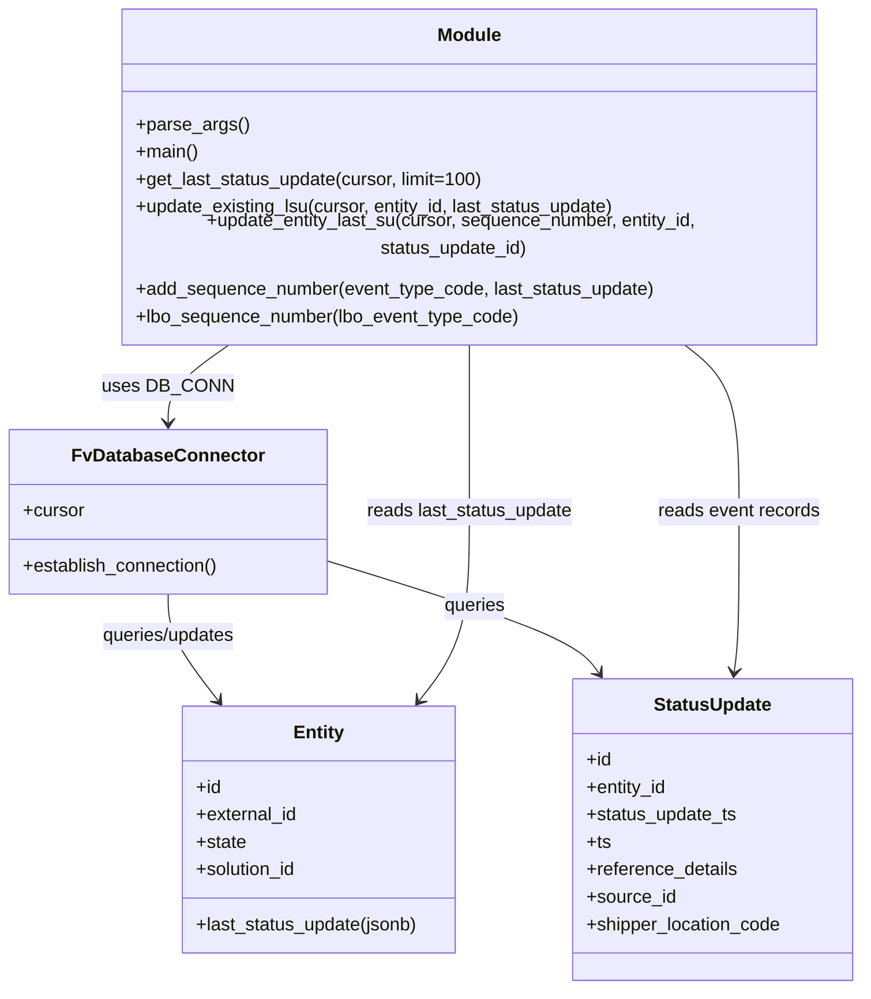

# Diagram: entity_core/entity_service/entity_service_scripts/backfill_FIN_5615_last_status_update.py


> Auto-generated by Obscura crawlers

## Diagram 1

```mermaid
flowchart TD
    PARSE[parse_args()] --> MAIN[main()]
    MAIN --> DBCONN[DB_CONN.establish_connection()]
    DBCONN --> CURSOR[DB_CONN.cursor]
    MAIN --> GET[get_last_status_update(cursor, limit)]
    GET --> LOOP{fetch batch from active_entity}
    LOOP -->|no rows| RET[return updated_count]
    LOOP -->|rows| FOR[for each active_entity record]
    FOR --> EXTRACT[determine status_update_ts, last_id, last_status_update]
    EXTRACT --> SQL[query status_update WHERE entity_id & status_update_ts]
    SQL --> BUILD[build status_update_list with event_type_code -> sequence]
    BUILD --> SORT[sort events by status_update_ts, event_type_code, ts desc]
    SORT --> COMP{events[0].id == last_id?}
    COMP -->|yes| EXIST[set sequence_number and call update_existing_lsu(cursor, entity_id, last_status_update)]
    COMP -->|no| NEW[sequence_number = events[0].event_type_code; status_update_id = events[0].id; call update_entity_last_su(cursor, sequence_number, entity_id, status_update_id)]
    EXIST --> CONT[continue to next record]
    NEW --> CONT
    CONT --> LOOP
```

> SVG rendering failed for this diagram.

## Diagram 2



### SVG

<svg id="container" width="756.734375" xmlns="http://www.w3.org/2000/svg" class="classDiagram" height="842" viewBox="0 0 756.734375 842" role="graphics-document document" aria-roledescription="class"><style>#container{font-family:"trebuchet ms",verdana,arial,sans-serif;font-size:16px;fill:#333;}@keyframes edge-animation-frame{from{stroke-dashoffset:0;}}@keyframes dash{to{stroke-dashoffset:0;}}#container .edge-animation-slow{stroke-dasharray:9,5!important;stroke-dashoffset:900;animation:dash 50s linear infinite;stroke-linecap:round;}#container .edge-animation-fast{stroke-dasharray:9,5!important;stroke-dashoffset:900;animation:dash 20s linear infinite;stroke-linecap:round;}#container .error-icon{fill:#552222;}#container .error-text{fill:#552222;stroke:#552222;}#container .edge-thickness-normal{stroke-width:1px;}#container .edge-thickness-thick{stroke-width:3.5px;}#container .edge-pattern-solid{stroke-dasharray:0;}#container .edge-thickness-invisible{stroke-width:0;fill:none;}#container .edge-pattern-dashed{stroke-dasharray:3;}#container .edge-pattern-dotted{stroke-dasharray:2;}#container .marker{fill:#333333;stroke:#333333;}#container .marker.cross{stroke:#333333;}#container svg{font-family:"trebuchet ms",verdana,arial,sans-serif;font-size:16px;}#container p{margin:0;}#container g.classGroup text{fill:#9370DB;stroke:none;font-family:"trebuchet ms",verdana,arial,sans-serif;font-size:10px;}#container g.classGroup text .title{font-weight:bolder;}#container .nodeLabel,#container .edgeLabel{color:#131300;}#container .edgeLabel .label rect{fill:#ECECFF;}#container .label text{fill:#131300;}#container .labelBkg{background:#ECECFF;}#container .edgeLabel .label span{background:#ECECFF;}#container .classTitle{font-weight:bolder;}#container .node rect,#container .node circle,#container .node ellipse,#container .node polygon,#container .node path{fill:#ECECFF;stroke:#9370DB;stroke-width:1px;}#container .divider{stroke:#9370DB;stroke-width:1;}#container g.clickable{cursor:pointer;}#container g.classGroup rect{fill:#ECECFF;stroke:#9370DB;}#container g.classGroup line{stroke:#9370DB;stroke-width:1;}#container .classLabel .box{stroke:none;stroke-width:0;fill:#ECECFF;opacity:0.5;}#container .classLabel .label{fill:#9370DB;font-size:10px;}#container .relation{stroke:#333333;stroke-width:1;fill:none;}#container .dashed-line{stroke-dasharray:3;}#container .dotted-line{stroke-dasharray:1 2;}#container #compositionStart,#container .composition{fill:#333333!important;stroke:#333333!important;stroke-width:1;}#container #compositionEnd,#container .composition{fill:#333333!important;stroke:#333333!important;stroke-width:1;}#container #dependencyStart,#container .dependency{fill:#333333!important;stroke:#333333!important;stroke-width:1;}#container #dependencyStart,#container .dependency{fill:#333333!important;stroke:#333333!important;stroke-width:1;}#container #extensionStart,#container .extension{fill:transparent!important;stroke:#333333!important;stroke-width:1;}#container #extensionEnd,#container .extension{fill:transparent!important;stroke:#333333!important;stroke-width:1;}#container #aggregationStart,#container .aggregation{fill:transparent!important;stroke:#333333!important;stroke-width:1;}#container #aggregationEnd,#container .aggregation{fill:transparent!important;stroke:#333333!important;stroke-width:1;}#container #lollipopStart,#container .lollipop{fill:#ECECFF!important;stroke:#333333!important;stroke-width:1;}#container #lollipopEnd,#container .lollipop{fill:#ECECFF!important;stroke:#333333!important;stroke-width:1;}#container .edgeTerminals{font-size:11px;line-height:initial;}#container .classTitleText{text-anchor:middle;font-size:18px;fill:#333;}#container .label-icon{display:inline-block;height:1em;overflow:visible;vertical-align:-0.125em;}#container .node .label-icon path{fill:currentColor;stroke:revert;stroke-width:revert;}#container :root{--mermaid-font-family:"trebuchet ms",verdana,arial,sans-serif;}</style><g><defs><marker id="container_class-aggregationStart" class="marker aggregation class" refX="18" refY="7" markerWidth="190" markerHeight="240" orient="auto"><path d="M 18,7 L9,13 L1,7 L9,1 Z"></path></marker></defs><defs><marker id="container_class-aggregationEnd" class="marker aggregation class" refX="1" refY="7" markerWidth="20" markerHeight="28" orient="auto"><path d="M 18,7 L9,13 L1,7 L9,1 Z"></path></marker></defs><defs><marker id="container_class-extensionStart" class="marker extension class" refX="18" refY="7" markerWidth="190" markerHeight="240" orient="auto"><path d="M 1,7 L18,13 V 1 Z"></path></marker></defs><defs><marker id="container_class-extensionEnd" class="marker extension class" refX="1" refY="7" markerWidth="20" markerHeight="28" orient="auto"><path d="M 1,1 V 13 L18,7 Z"></path></marker></defs><defs><marker id="container_class-compositionStart" class="marker composition class" refX="18" refY="7" markerWidth="190" markerHeight="240" orient="auto"><path d="M 18,7 L9,13 L1,7 L9,1 Z"></path></marker></defs><defs><marker id="container_class-compositionEnd" class="marker composition class" refX="1" refY="7" markerWidth="20" markerHeight="28" orient="auto"><path d="M 18,7 L9,13 L1,7 L9,1 Z"></path></marker></defs><defs><marker id="container_class-dependencyStart" class="marker dependency class" refX="6" refY="7" markerWidth="190" markerHeight="240" orient="auto"><path d="M 5,7 L9,13 L1,7 L9,1 Z"></path></marker></defs><defs><marker id="container_class-dependencyEnd" class="marker dependency class" refX="13" refY="7" markerWidth="20" markerHeight="28" orient="auto"><path d="M 18,7 L9,13 L14,7 L9,1 Z"></path></marker></defs><defs><marker id="container_class-lollipopStart" class="marker lollipop class" refX="13" refY="7" markerWidth="190" markerHeight="240" orient="auto"><circle stroke="black" fill="transparent" cx="7" cy="7" r="6"></circle></marker></defs><defs><marker id="container_class-lollipopEnd" class="marker lollipop class" refX="1" refY="7" markerWidth="190" markerHeight="240" orient="auto"><circle stroke="black" fill="transparent" cx="7" cy="7" r="6"></circle></marker></defs><g class="root"><g class="clusters"></g><g class="edgePaths"><path d="M203.179,278L193.697,284.167C184.215,290.333,165.25,302.667,155.767,314C146.285,325.333,146.285,335.667,146.285,340.833L146.285,346" id="id_Module_FvDatabaseConnector_1" class="edge-thickness-normal edge-pattern-solid relation" style=";;;" data-edge="true" data-et="edge" data-id="id_Module_FvDatabaseConnector_1" data-points="W3sieCI6MjAzLjE3OTIxMDU3NDEyNzksInkiOjI3OH0seyJ4IjoxNDYuMjg1MTU2MjUsInkiOjMxNX0seyJ4IjoxNDYuMjg1MTU2MjUsInkiOjM1Mn1d" marker-end="url(#container_class-dependencyEnd)"></path><path d="M146.285,496L146.285,502.167C146.285,508.333,146.285,520.667,153.624,536.212C160.963,551.758,175.641,570.516,182.98,579.896L190.319,589.275" id="id_FvDatabaseConnector_Entity_2" class="edge-thickness-normal edge-pattern-solid relation" style=";;;" data-edge="true" data-et="edge" data-id="id_FvDatabaseConnector_Entity_2" data-points="W3sieCI6MTQ2LjI4NTE1NjI1LCJ5Ijo0OTZ9LHsieCI6MTQ2LjI4NTE1NjI1LCJ5Ijo1MzN9LHsieCI6MTk0LjAxNjgzODQ4MDAyOTYsInkiOjU5NH1d" marker-end="url(#container_class-dependencyEnd)"></path><path d="M284.57,466.371L320.813,477.476C357.055,488.581,429.539,510.79,469.7,527.255C509.861,543.719,517.699,554.438,521.618,559.797L525.537,565.157" id="id_FvDatabaseConnector_StatusUpdate_3" class="edge-thickness-normal edge-pattern-solid relation" style=";;;" data-edge="true" data-et="edge" data-id="id_FvDatabaseConnector_StatusUpdate_3" data-points="W3sieCI6Mjg0LjU3MDMxMjUsInkiOjQ2Ni4zNzEyNjc5Mzk2OTQwNn0seyJ4Ijo1MDIuMDIzNDM3NSwieSI6NTMzfSx7IngiOjUyOS4wNzkwMDMzMjg0MDIzLCJ5Ijo1NzB9XQ==" marker-end="url(#container_class-dependencyEnd)"></path><path d="M410.766,278L410.766,284.167C410.766,290.333,410.766,302.667,410.766,327C410.766,351.333,410.766,387.667,410.766,424C410.766,460.333,410.766,496.667,403.427,524.212C396.088,551.758,381.409,570.516,374.07,579.896L366.731,589.275" id="id_Module_Entity_4" class="edge-thickness-normal edge-pattern-solid relation" style=";;;" data-edge="true" data-et="edge" data-id="id_Module_Entity_4" data-points="W3sieCI6NDEwLjc2NTYyNSwieSI6Mjc4fSx7IngiOjQxMC43NjU2MjUsInkiOjMxNX0seyJ4Ijo0MTAuNzY1NjI1LCJ5Ijo0MjR9LHsieCI6NDEwLjc2NTYyNSwieSI6NTMzfSx7IngiOjM2My4wMzM5NDI3Njk5NzA0LCJ5Ijo1OTR9XQ==" marker-end="url(#container_class-dependencyEnd)"></path><path d="M597.927,278L606.476,284.167C615.025,290.333,632.124,302.667,640.673,327C649.223,351.333,649.223,387.667,649.223,424C649.223,460.333,649.223,496.667,648.499,520.01C647.776,543.353,646.329,553.705,645.605,558.881L644.882,564.058" id="id_Module_StatusUpdate_5" class="edge-thickness-normal edge-pattern-solid relation" style=";;;" data-edge="true" data-et="edge" data-id="id_Module_StatusUpdate_5" data-points="W3sieCI6NTk3LjkyNjY2Njk2OTQ3NjcsInkiOjI3OH0seyJ4Ijo2NDkuMjIyNjU2MjUsInkiOjMxNX0seyJ4Ijo2NDkuMjIyNjU2MjUsInkiOjQyNH0seyJ4Ijo2NDkuMjIyNjU2MjUsInkiOjUzM30seyJ4Ijo2NDQuMDUxMTc0MTg2MzkwNSwieSI6NTcwfV0=" marker-end="url(#container_class-dependencyEnd)"></path></g><g class="edgeLabels"><g class="edgeLabel" transform="translate(146.28515625, 315)"><g class="label" data-id="id_Module_FvDatabaseConnector_1" transform="translate(-53.09375, -12)"><foreignObject width="106.1875" height="24"><div xmlns="http://www.w3.org/1999/xhtml" class="labelBkg" style="display: table-cell; white-space: nowrap; line-height: 1.5; max-width: 200px; text-align: center;"><span class="edgeLabel"><p>uses DB_CONN</p></span></div></foreignObject></g></g><g class="edgeLabel" transform="translate(146.28515625, 533)"><g class="label" data-id="id_FvDatabaseConnector_Entity_2" transform="translate(-60.5703125, -12)"><foreignObject width="121.140625" height="24"><div xmlns="http://www.w3.org/1999/xhtml" class="labelBkg" style="display: table-cell; white-space: nowrap; line-height: 1.5; max-width: 200px; text-align: center;"><span class="edgeLabel"><p>queries/updates</p></span></div></foreignObject></g></g><g class="edgeLabel" transform="translate(415.20967, 506.39982)"><g class="label" data-id="id_FvDatabaseConnector_StatusUpdate_3" transform="translate(-27.2421875, -12)"><foreignObject width="54.484375" height="24"><div xmlns="http://www.w3.org/1999/xhtml" class="labelBkg" style="display: table-cell; white-space: nowrap; line-height: 1.5; max-width: 200px; text-align: center;"><span class="edgeLabel"><p>queries</p></span></div></foreignObject></g></g><g class="edgeLabel" transform="translate(410.765625, 424)"><g class="label" data-id="id_Module_Entity_4" transform="translate(-91.1953125, -12)"><foreignObject width="182.390625" height="24"><div xmlns="http://www.w3.org/1999/xhtml" class="labelBkg" style="display: table-cell; white-space: nowrap; line-height: 1.5; max-width: 200px; text-align: center;"><span class="edgeLabel"><p>reads last_status_update</p></span></div></foreignObject></g></g><g class="edgeLabel" transform="translate(649.22265625, 424)"><g class="label" data-id="id_Module_StatusUpdate_5" transform="translate(-71.3203125, -12)"><foreignObject width="142.640625" height="24"><div xmlns="http://www.w3.org/1999/xhtml" class="labelBkg" style="display: table-cell; white-space: nowrap; line-height: 1.5; max-width: 200px; text-align: center;"><span class="edgeLabel"><p>reads event records</p></span></div></foreignObject></g></g></g><g class="nodes"><g class="node default" id="classId-Module-0" transform="translate(410.765625, 143)"><g class="basic label-container"><path d="M-310.2109375 -135 L310.2109375 -135 L310.2109375 135 L-310.2109375 135" stroke="none" stroke-width="0" fill="#ECECFF" style=""></path><path d="M-310.2109375 -135 C-150.56831921424842 -135, 9.074299071503162 -135, 310.2109375 -135 M-310.2109375 -135 C-119.17361903624882 -135, 71.86369942750235 -135, 310.2109375 -135 M310.2109375 -135 C310.2109375 -30.17540617682326, 310.2109375 74.64918764635348, 310.2109375 135 M310.2109375 -135 C310.2109375 -52.42400549925682, 310.2109375 30.151989001486356, 310.2109375 135 M310.2109375 135 C76.96386291229476 135, -156.28321167541048 135, -310.2109375 135 M310.2109375 135 C63.93240353416857 135, -182.34613043166286 135, -310.2109375 135 M-310.2109375 135 C-310.2109375 42.82986705904001, -310.2109375 -49.340265881919976, -310.2109375 -135 M-310.2109375 135 C-310.2109375 39.20938352679836, -310.2109375 -56.581232946403276, -310.2109375 -135" stroke="#9370DB" stroke-width="1.3" fill="none" stroke-dasharray="0 0" style=""></path></g><g class="annotation-group text" transform="translate(0, -111)"></g><g class="label-group text" transform="translate(-27.09375, -111)"><g class="label" style="font-weight: bolder" transform="translate(0,-12)"><foreignObject width="54.1875" height="24"><div xmlns="http://www.w3.org/1999/xhtml" style="display: table-cell; white-space: nowrap; line-height: 1.5; max-width: 104px; text-align: center;"><span class="nodeLabel markdown-node-label" style=""><p>Module</p></span></div></foreignObject></g></g><g class="members-group text" transform="translate(-298.2109375, -63)"></g><g class="methods-group text" transform="translate(-298.2109375, -33)"><g class="label" style="" transform="translate(0,-12)"><foreignObject width="96.53125" height="24"><div xmlns="http://www.w3.org/1999/xhtml" style="display: table-cell; white-space: nowrap; line-height: 1.5; max-width: 154px; text-align: center;"><span class="nodeLabel markdown-node-label" style=""><p>+parse_args()</p></span></div></foreignObject></g><g class="label" style="" transform="translate(0,12)"><foreignObject width="54.65625" height="24"><div xmlns="http://www.w3.org/1999/xhtml" style="display: table-cell; white-space: nowrap; line-height: 1.5; max-width: 112px; text-align: center;"><span class="nodeLabel markdown-node-label" style=""><p>+main()</p></span></div></foreignObject></g><g class="label" style="" transform="translate(0,36)"><foreignObject width="305.421875" height="24"><div xmlns="http://www.w3.org/1999/xhtml" style="display: table-cell; white-space: nowrap; line-height: 1.5; max-width: 363px; text-align: center;"><span class="nodeLabel markdown-node-label" style=""><p>+get_last_status_update(cursor, limit=100)</p></span></div></foreignObject></g><g class="label" style="" transform="translate(0,60)"><foreignObject width="426.015625" height="24"><div xmlns="http://www.w3.org/1999/xhtml" style="display: table-cell; white-space: nowrap; line-height: 1.5; max-width: 483px; text-align: center;"><span class="nodeLabel markdown-node-label" style=""><p>+update_existing_lsu(cursor, entity_id, last_status_update)</p></span></div></foreignObject></g><g class="label" style="" transform="translate(0,84)"><foreignObject width="569.328125" height="24"><div xmlns="http://www.w3.org/1999/xhtml" style="display: table-cell; white-space: nowrap; line-height: 1.5; max-width: 627px; text-align: center;"><span class="nodeLabel markdown-node-label" style=""><p>+update_entity_last_su(cursor, sequence_number, entity_id, status_update_id)</p></span></div></foreignObject></g><g class="label" style="" transform="translate(0,108)"><foreignObject width="457.125" height="24"><div xmlns="http://www.w3.org/1999/xhtml" style="display: table-cell; white-space: nowrap; line-height: 1.5; max-width: 514px; text-align: center;"><span class="nodeLabel markdown-node-label" style=""><p>+add_sequence_number(event_type_code, last_status_update)</p></span></div></foreignObject></g><g class="label" style="" transform="translate(0,132)"><foreignObject width="337.890625" height="24"><div xmlns="http://www.w3.org/1999/xhtml" style="display: table-cell; white-space: nowrap; line-height: 1.5; max-width: 395px; text-align: center;"><span class="nodeLabel markdown-node-label" style=""><p>+lbo_sequence_number(lbo_event_type_code)</p></span></div></foreignObject></g></g><g class="divider" style=""><path d="M-310.2109375 -87 C-140.4699987881759 -87, 29.2709399236482 -87, 310.2109375 -87 M-310.2109375 -87 C-66.25492643450335 -87, 177.7010846309933 -87, 310.2109375 -87" stroke="#9370DB" stroke-width="1.3" fill="none" stroke-dasharray="0 0" style=""></path></g><g class="divider" style=""><path d="M-310.2109375 -63 C-135.15386261463493 -63, 39.90321227073014 -63, 310.2109375 -63 M-310.2109375 -63 C-100.75188096418424 -63, 108.70717557163152 -63, 310.2109375 -63" stroke="#9370DB" stroke-width="1.3" fill="none" stroke-dasharray="0 0" style=""></path></g></g><g class="node default" id="classId-FvDatabaseConnector-1" transform="translate(146.28515625, 424)"><g class="basic label-container"><path d="M-138.28515625 -72 L138.28515625 -72 L138.28515625 72 L-138.28515625 72" stroke="none" stroke-width="0" fill="#ECECFF" style=""></path><path d="M-138.28515625 -72 C-76.86900191906966 -72, -15.452847588139335 -72, 138.28515625 -72 M-138.28515625 -72 C-58.820251040806795 -72, 20.64465416838641 -72, 138.28515625 -72 M138.28515625 -72 C138.28515625 -17.581404273333128, 138.28515625 36.837191453333745, 138.28515625 72 M138.28515625 -72 C138.28515625 -24.99252411387438, 138.28515625 22.014951772251237, 138.28515625 72 M138.28515625 72 C66.05738161083168 72, -6.170393028336633 72, -138.28515625 72 M138.28515625 72 C80.28943409731346 72, 22.293711944626935 72, -138.28515625 72 M-138.28515625 72 C-138.28515625 20.202203877768426, -138.28515625 -31.59559224446315, -138.28515625 -72 M-138.28515625 72 C-138.28515625 18.610995965164115, -138.28515625 -34.77800806967177, -138.28515625 -72" stroke="#9370DB" stroke-width="1.3" fill="none" stroke-dasharray="0 0" style=""></path></g><g class="annotation-group text" transform="translate(0, -48)"></g><g class="label-group text" transform="translate(-79.3046875, -48)"><g class="label" style="font-weight: bolder" transform="translate(0,-12)"><foreignObject width="158.609375" height="24"><div xmlns="http://www.w3.org/1999/xhtml" style="display: table-cell; white-space: nowrap; line-height: 1.5; max-width: 207px; text-align: center;"><span class="nodeLabel markdown-node-label" style=""><p>FvDatabaseConnector</p></span></div></foreignObject></g></g><g class="members-group text" transform="translate(-126.28515625, 0)"><g class="label" style="" transform="translate(0,-12)"><foreignObject width="53.71875" height="24"><div xmlns="http://www.w3.org/1999/xhtml" style="display: table-cell; white-space: nowrap; line-height: 1.5; max-width: 112px; text-align: center;"><span class="nodeLabel markdown-node-label" style=""><p>+cursor</p></span></div></foreignObject></g></g><g class="methods-group text" transform="translate(-126.28515625, 48)"><g class="label" style="" transform="translate(0,-12)"><foreignObject width="173.265625" height="24"><div xmlns="http://www.w3.org/1999/xhtml" style="display: table-cell; white-space: nowrap; line-height: 1.5; max-width: 231px; text-align: center;"><span class="nodeLabel markdown-node-label" style=""><p>+establish_connection()</p></span></div></foreignObject></g></g><g class="divider" style=""><path d="M-138.28515625 -24 C-35.73986534573862 -24, 66.80542555852276 -24, 138.28515625 -24 M-138.28515625 -24 C-79.70977036404237 -24, -21.13438447808474 -24, 138.28515625 -24" stroke="#9370DB" stroke-width="1.3" fill="none" stroke-dasharray="0 0" style=""></path></g><g class="divider" style=""><path d="M-138.28515625 24 C-66.98720812089597 24, 4.310740008208057 24, 138.28515625 24 M-138.28515625 24 C-55.23967348185768 24, 27.805809286284642 24, 138.28515625 24" stroke="#9370DB" stroke-width="1.3" fill="none" stroke-dasharray="0 0" style=""></path></g></g><g class="node default" id="classId-Entity-2" transform="translate(278.525390625, 702)"><g class="basic label-container"><path d="M-121.265625 -108 L121.265625 -108 L121.265625 108 L-121.265625 108" stroke="none" stroke-width="0" fill="#ECECFF" style=""></path><path d="M-121.265625 -108 C-48.37083854971104 -108, 24.523947900577923 -108, 121.265625 -108 M-121.265625 -108 C-63.11435685334665 -108, -4.9630887066932985 -108, 121.265625 -108 M121.265625 -108 C121.265625 -53.52402518071002, 121.265625 0.9519496385799613, 121.265625 108 M121.265625 -108 C121.265625 -24.146446542789832, 121.265625 59.707106914420336, 121.265625 108 M121.265625 108 C45.36976892988319 108, -30.526087140233614 108, -121.265625 108 M121.265625 108 C71.52770682219122 108, 21.78978864438244 108, -121.265625 108 M-121.265625 108 C-121.265625 48.18519212204756, -121.265625 -11.62961575590488, -121.265625 -108 M-121.265625 108 C-121.265625 39.6725531656832, -121.265625 -28.654893668633605, -121.265625 -108" stroke="#9370DB" stroke-width="1.3" fill="none" stroke-dasharray="0 0" style=""></path></g><g class="annotation-group text" transform="translate(0, -84)"></g><g class="label-group text" transform="translate(-21.28125, -84)"><g class="label" style="font-weight: bolder" transform="translate(0,-12)"><foreignObject width="42.5625" height="24"><div xmlns="http://www.w3.org/1999/xhtml" style="display: table-cell; white-space: nowrap; line-height: 1.5; max-width: 92px; text-align: center;"><span class="nodeLabel markdown-node-label" style=""><p>Entity</p></span></div></foreignObject></g></g><g class="members-group text" transform="translate(-109.265625, -36)"><g class="label" style="" transform="translate(0,-12)"><foreignObject width="22.078125" height="24"><div xmlns="http://www.w3.org/1999/xhtml" style="display: table-cell; white-space: nowrap; line-height: 1.5; max-width: 79px; text-align: center;"><span class="nodeLabel markdown-node-label" style=""><p>+id</p></span></div></foreignObject></g><g class="label" style="" transform="translate(0,12)"><foreignObject width="89.765625" height="24"><div xmlns="http://www.w3.org/1999/xhtml" style="display: table-cell; white-space: nowrap; line-height: 1.5; max-width: 147px; text-align: center;"><span class="nodeLabel markdown-node-label" style=""><p>+external_id</p></span></div></foreignObject></g><g class="label" style="" transform="translate(0,36)"><foreignObject width="44.09375" height="24"><div xmlns="http://www.w3.org/1999/xhtml" style="display: table-cell; white-space: nowrap; line-height: 1.5; max-width: 101px; text-align: center;"><span class="nodeLabel markdown-node-label" style=""><p>+state</p></span></div></foreignObject></g><g class="label" style="" transform="translate(0,60)"><foreignObject width="90.21875" height="24"><div xmlns="http://www.w3.org/1999/xhtml" style="display: table-cell; white-space: nowrap; line-height: 1.5; max-width: 148px; text-align: center;"><span class="nodeLabel markdown-node-label" style=""><p>+solution_id</p></span></div></foreignObject></g></g><g class="methods-group text" transform="translate(-109.265625, 84)"><g class="label" style="" transform="translate(0,-12)"><foreignObject width="197.25" height="24"><div xmlns="http://www.w3.org/1999/xhtml" style="display: table-cell; white-space: nowrap; line-height: 1.5; max-width: 255px; text-align: center;"><span class="nodeLabel markdown-node-label" style=""><p>+last_status_update(jsonb)</p></span></div></foreignObject></g></g><g class="divider" style=""><path d="M-121.265625 -60 C-61.58109729337742 -60, -1.8965695867548362 -60, 121.265625 -60 M-121.265625 -60 C-49.081370705301666 -60, 23.10288358939667 -60, 121.265625 -60" stroke="#9370DB" stroke-width="1.3" fill="none" stroke-dasharray="0 0" style=""></path></g><g class="divider" style=""><path d="M-121.265625 60 C-67.74763272783896 60, -14.229640455677924 60, 121.265625 60 M-121.265625 60 C-62.17398398121236 60, -3.0823429624247183 60, 121.265625 60" stroke="#9370DB" stroke-width="1.3" fill="none" stroke-dasharray="0 0" style=""></path></g></g><g class="node default" id="classId-StatusUpdate-3" transform="translate(625.6015625, 702)"><g class="basic label-container"><path d="M-123.1328125 -132 L123.1328125 -132 L123.1328125 132 L-123.1328125 132" stroke="none" stroke-width="0" fill="#ECECFF" style=""></path><path d="M-123.1328125 -132 C-73.08990072063118 -132, -23.046988941262356 -132, 123.1328125 -132 M-123.1328125 -132 C-71.2380605130464 -132, -19.343308526092812 -132, 123.1328125 -132 M123.1328125 -132 C123.1328125 -45.77305159728655, 123.1328125 40.45389680542689, 123.1328125 132 M123.1328125 -132 C123.1328125 -34.25677997436631, 123.1328125 63.48644005126738, 123.1328125 132 M123.1328125 132 C66.73655636450553 132, 10.34030022901105 132, -123.1328125 132 M123.1328125 132 C43.62947902441479 132, -35.873854451170416 132, -123.1328125 132 M-123.1328125 132 C-123.1328125 36.38595598647257, -123.1328125 -59.228088027054866, -123.1328125 -132 M-123.1328125 132 C-123.1328125 72.6372656909918, -123.1328125 13.274531381983579, -123.1328125 -132" stroke="#9370DB" stroke-width="1.3" fill="none" stroke-dasharray="0 0" style=""></path></g><g class="annotation-group text" transform="translate(0, -108)"></g><g class="label-group text" transform="translate(-50.015625, -108)"><g class="label" style="font-weight: bolder" transform="translate(0,-12)"><foreignObject width="100.03125" height="24"><div xmlns="http://www.w3.org/1999/xhtml" style="display: table-cell; white-space: nowrap; line-height: 1.5; max-width: 148px; text-align: center;"><span class="nodeLabel markdown-node-label" style=""><p>StatusUpdate</p></span></div></foreignObject></g></g><g class="members-group text" transform="translate(-111.1328125, -60)"><g class="label" style="" transform="translate(0,-12)"><foreignObject width="22.078125" height="24"><div xmlns="http://www.w3.org/1999/xhtml" style="display: table-cell; white-space: nowrap; line-height: 1.5; max-width: 79px; text-align: center;"><span class="nodeLabel markdown-node-label" style=""><p>+id</p></span></div></foreignObject></g><g class="label" style="" transform="translate(0,12)"><foreignObject width="71.859375" height="24"><div xmlns="http://www.w3.org/1999/xhtml" style="display: table-cell; white-space: nowrap; line-height: 1.5; max-width: 129px; text-align: center;"><span class="nodeLabel markdown-node-label" style=""><p>+entity_id</p></span></div></foreignObject></g><g class="label" style="" transform="translate(0,36)"><foreignObject width="132.34375" height="24"><div xmlns="http://www.w3.org/1999/xhtml" style="display: table-cell; white-space: nowrap; line-height: 1.5; max-width: 190px; text-align: center;"><span class="nodeLabel markdown-node-label" style=""><p>+status_update_ts</p></span></div></foreignObject></g><g class="label" style="" transform="translate(0,60)"><foreignObject width="21.15625" height="24"><div xmlns="http://www.w3.org/1999/xhtml" style="display: table-cell; white-space: nowrap; line-height: 1.5; max-width: 79px; text-align: center;"><span class="nodeLabel markdown-node-label" style=""><p>+ts</p></span></div></foreignObject></g><g class="label" style="" transform="translate(0,84)"><foreignObject width="133.171875" height="24"><div xmlns="http://www.w3.org/1999/xhtml" style="display: table-cell; white-space: nowrap; line-height: 1.5; max-width: 191px; text-align: center;"><span class="nodeLabel markdown-node-label" style=""><p>+reference_details</p></span></div></foreignObject></g><g class="label" style="" transform="translate(0,108)"><foreignObject width="77.9375" height="24"><div xmlns="http://www.w3.org/1999/xhtml" style="display: table-cell; white-space: nowrap; line-height: 1.5; max-width: 135px; text-align: center;"><span class="nodeLabel markdown-node-label" style=""><p>+source_id</p></span></div></foreignObject></g><g class="label" style="" transform="translate(0,132)"><foreignObject width="172.25" height="24"><div xmlns="http://www.w3.org/1999/xhtml" style="display: table-cell; white-space: nowrap; line-height: 1.5; max-width: 230px; text-align: center;"><span class="nodeLabel markdown-node-label" style=""><p>+shipper_location_code</p></span></div></foreignObject></g></g><g class="methods-group text" transform="translate(-111.1328125, 132)"></g><g class="divider" style=""><path d="M-123.1328125 -84 C-46.94084606370198 -84, 29.251120372596034 -84, 123.1328125 -84 M-123.1328125 -84 C-60.64661663668701 -84, 1.839579226625986 -84, 123.1328125 -84" stroke="#9370DB" stroke-width="1.3" fill="none" stroke-dasharray="0 0" style=""></path></g><g class="divider" style=""><path d="M-123.1328125 108 C-44.51902085144154 108, 34.09477079711692 108, 123.1328125 108 M-123.1328125 108 C-54.24298415763573 108, 14.646844184728536 108, 123.1328125 108" stroke="#9370DB" stroke-width="1.3" fill="none" stroke-dasharray="0 0" style=""></path></g></g></g></g></g></svg>

## Diagram 3

```mermaid
flowchart LR
    SEQ_HELPERS[sequence mapping helpers] --> ASIDE1[add_sequence_number(event_type_code) --> C:3, A:2, I:1, else:0]
    SEQ_HELPERS --> ASIDE2[lbo_sequence_number(lbo_event_type_code) --> C:3, A:2, I:1, else:0]
    UPDATE_ENTITY[update_entity_last_su(...)] --> DB_UPDATE[builds json_build_object and UPDATE entity.last_status_update]
    UPDATE_EXIST[update_existing_lsu(...)] --> DB_UPDATE_EXIST[UPDATE entity SET last_status_update = ...]
    SORT --> DECIDE{choose by status_update_ts > event_type_code > ts}
    DECIDE --> UPDATE_EXIST
    DECIDE --> UPDATE_ENTITY
```

> SVG rendering failed for this diagram.
