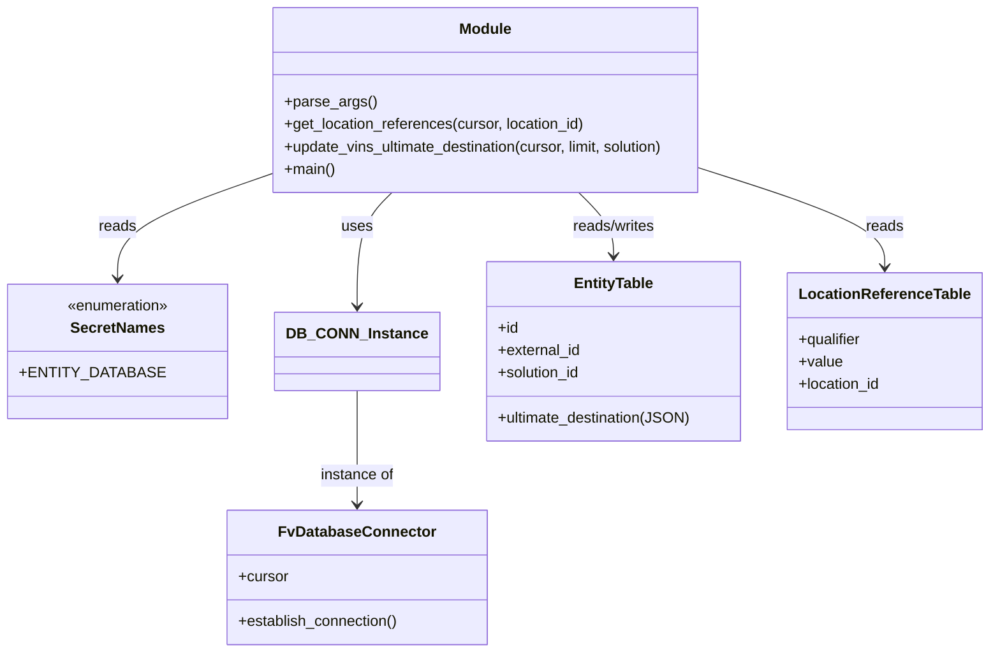

# Diagram: entity_core/entity_service/entity_service_scripts/backfill_FIN_5941_ultimate_destination.py


> Auto-generated by Obscura crawlers

## Diagram 1

```mermaid
flowchart LR
    main["main()"] --> parse_args["parse_args()"]
    parse_args --> args["limit, solution"]
    main --> DB_CONN_est["DB_CONN.establish_connection()"]
    DB_CONN_est --> cursor["DB_CONN.cursor"]
    cursor --> update["update_vins_ultimate_destination(cursor, limit, solution)"]
    update --> query["SELECT id, external_id, ultimate_destination FROM public.entity WHERE ... LIMIT"]
    query --> loop{Rows returned?}
    loop -->|No| end[End]
    loop -->|Yes| row_iter[Iterate rows]
    row_iter --> extract["extract external_id, ultimate_destination, location_id"]
    extract --> getloc[get_location_references(cursor, location_id)]
    getloc --> loc_query["SELECT qualifier, value FROM location.location_reference WHERE location_id = resolved_referent_id"]
    loc_query --> loc_refs[location_references]
    loc_refs --> assess_refs{Has references?}
    assess_refs -->|Yes| map_refs["Map DEALER_REGION/DISTRICT/ZONE into destination JSON"]
    assess_refs -->|No| skip_map[Skip mapping]
    map_refs --> prepare_sql["Prepare UPDATE public.entity SET ultimate_destination = %(destination)s WHERE external_id = %(external_id)s"]
    skip_map --> prepare_sql
    prepare_sql --> cursor
    cursor --> loop
```

> SVG rendering failed for this diagram.

## Diagram 2



### SVG

<svg id="container" width="1016.734375" xmlns="http://www.w3.org/2000/svg" class="classDiagram" height="698" viewBox="0 0 1016.734375 698" role="graphics-document document" aria-roledescription="class"><style>#container{font-family:"trebuchet ms",verdana,arial,sans-serif;font-size:16px;fill:#333;}@keyframes edge-animation-frame{from{stroke-dashoffset:0;}}@keyframes dash{to{stroke-dashoffset:0;}}#container .edge-animation-slow{stroke-dasharray:9,5!important;stroke-dashoffset:900;animation:dash 50s linear infinite;stroke-linecap:round;}#container .edge-animation-fast{stroke-dasharray:9,5!important;stroke-dashoffset:900;animation:dash 20s linear infinite;stroke-linecap:round;}#container .error-icon{fill:#552222;}#container .error-text{fill:#552222;stroke:#552222;}#container .edge-thickness-normal{stroke-width:1px;}#container .edge-thickness-thick{stroke-width:3.5px;}#container .edge-pattern-solid{stroke-dasharray:0;}#container .edge-thickness-invisible{stroke-width:0;fill:none;}#container .edge-pattern-dashed{stroke-dasharray:3;}#container .edge-pattern-dotted{stroke-dasharray:2;}#container .marker{fill:#333333;stroke:#333333;}#container .marker.cross{stroke:#333333;}#container svg{font-family:"trebuchet ms",verdana,arial,sans-serif;font-size:16px;}#container p{margin:0;}#container g.classGroup text{fill:#9370DB;stroke:none;font-family:"trebuchet ms",verdana,arial,sans-serif;font-size:10px;}#container g.classGroup text .title{font-weight:bolder;}#container .nodeLabel,#container .edgeLabel{color:#131300;}#container .edgeLabel .label rect{fill:#ECECFF;}#container .label text{fill:#131300;}#container .labelBkg{background:#ECECFF;}#container .edgeLabel .label span{background:#ECECFF;}#container .classTitle{font-weight:bolder;}#container .node rect,#container .node circle,#container .node ellipse,#container .node polygon,#container .node path{fill:#ECECFF;stroke:#9370DB;stroke-width:1px;}#container .divider{stroke:#9370DB;stroke-width:1;}#container g.clickable{cursor:pointer;}#container g.classGroup rect{fill:#ECECFF;stroke:#9370DB;}#container g.classGroup line{stroke:#9370DB;stroke-width:1;}#container .classLabel .box{stroke:none;stroke-width:0;fill:#ECECFF;opacity:0.5;}#container .classLabel .label{fill:#9370DB;font-size:10px;}#container .relation{stroke:#333333;stroke-width:1;fill:none;}#container .dashed-line{stroke-dasharray:3;}#container .dotted-line{stroke-dasharray:1 2;}#container #compositionStart,#container .composition{fill:#333333!important;stroke:#333333!important;stroke-width:1;}#container #compositionEnd,#container .composition{fill:#333333!important;stroke:#333333!important;stroke-width:1;}#container #dependencyStart,#container .dependency{fill:#333333!important;stroke:#333333!important;stroke-width:1;}#container #dependencyStart,#container .dependency{fill:#333333!important;stroke:#333333!important;stroke-width:1;}#container #extensionStart,#container .extension{fill:transparent!important;stroke:#333333!important;stroke-width:1;}#container #extensionEnd,#container .extension{fill:transparent!important;stroke:#333333!important;stroke-width:1;}#container #aggregationStart,#container .aggregation{fill:transparent!important;stroke:#333333!important;stroke-width:1;}#container #aggregationEnd,#container .aggregation{fill:transparent!important;stroke:#333333!important;stroke-width:1;}#container #lollipopStart,#container .lollipop{fill:#ECECFF!important;stroke:#333333!important;stroke-width:1;}#container #lollipopEnd,#container .lollipop{fill:#ECECFF!important;stroke:#333333!important;stroke-width:1;}#container .edgeTerminals{font-size:11px;line-height:initial;}#container .classTitleText{text-anchor:middle;font-size:18px;fill:#333;}#container .label-icon{display:inline-block;height:1em;overflow:visible;vertical-align:-0.125em;}#container .node .label-icon path{fill:currentColor;stroke:revert;stroke-width:revert;}#container :root{--mermaid-font-family:"trebuchet ms",verdana,arial,sans-serif;}</style><g><defs><marker id="container_class-aggregationStart" class="marker aggregation class" refX="18" refY="7" markerWidth="190" markerHeight="240" orient="auto"><path d="M 18,7 L9,13 L1,7 L9,1 Z"></path></marker></defs><defs><marker id="container_class-aggregationEnd" class="marker aggregation class" refX="1" refY="7" markerWidth="20" markerHeight="28" orient="auto"><path d="M 18,7 L9,13 L1,7 L9,1 Z"></path></marker></defs><defs><marker id="container_class-extensionStart" class="marker extension class" refX="18" refY="7" markerWidth="190" markerHeight="240" orient="auto"><path d="M 1,7 L18,13 V 1 Z"></path></marker></defs><defs><marker id="container_class-extensionEnd" class="marker extension class" refX="1" refY="7" markerWidth="20" markerHeight="28" orient="auto"><path d="M 1,1 V 13 L18,7 Z"></path></marker></defs><defs><marker id="container_class-compositionStart" class="marker composition class" refX="18" refY="7" markerWidth="190" markerHeight="240" orient="auto"><path d="M 18,7 L9,13 L1,7 L9,1 Z"></path></marker></defs><defs><marker id="container_class-compositionEnd" class="marker composition class" refX="1" refY="7" markerWidth="20" markerHeight="28" orient="auto"><path d="M 18,7 L9,13 L1,7 L9,1 Z"></path></marker></defs><defs><marker id="container_class-dependencyStart" class="marker dependency class" refX="6" refY="7" markerWidth="190" markerHeight="240" orient="auto"><path d="M 5,7 L9,13 L1,7 L9,1 Z"></path></marker></defs><defs><marker id="container_class-dependencyEnd" class="marker dependency class" refX="13" refY="7" markerWidth="20" markerHeight="28" orient="auto"><path d="M 18,7 L9,13 L14,7 L9,1 Z"></path></marker></defs><defs><marker id="container_class-lollipopStart" class="marker lollipop class" refX="13" refY="7" markerWidth="190" markerHeight="240" orient="auto"><circle stroke="black" fill="transparent" cx="7" cy="7" r="6"></circle></marker></defs><defs><marker id="container_class-lollipopEnd" class="marker lollipop class" refX="1" refY="7" markerWidth="190" markerHeight="240" orient="auto"><circle stroke="black" fill="transparent" cx="7" cy="7" r="6"></circle></marker></defs><g class="root"><g class="clusters"></g><g class="edgePaths"><path d="M354.852,418L354.852,433.167C354.852,448.333,354.852,478.667,354.852,499C354.852,519.333,354.852,529.667,354.852,534.833L354.852,540" id="id_DB_CONN_Instance_FvDatabaseConnector_1" class="edge-thickness-normal edge-pattern-solid relation" style=";;;" data-edge="true" data-et="edge" data-id="id_DB_CONN_Instance_FvDatabaseConnector_1" data-points="W3sieCI6MzU0Ljg1MTU2MjUsInkiOjQxOH0seyJ4IjozNTQuODUxNTYyNSwieSI6NTA5fSx7IngiOjM1NC44NTE1NjI1LCJ5Ijo1NDZ9XQ==" marker-end="url(#container_class-dependencyEnd)"></path><path d="M391.179,206L385.125,212.167C379.07,218.333,366.961,230.667,360.906,251C354.852,271.333,354.852,299.667,354.852,313.833L354.852,328" id="id_Module_DB_CONN_Instance_2" class="edge-thickness-normal edge-pattern-solid relation" style=";;;" data-edge="true" data-et="edge" data-id="id_Module_DB_CONN_Instance_2" data-points="W3sieCI6MzkxLjE3OTM4NTkxNDUyMjEsInkiOjIwNn0seyJ4IjozNTQuODUxNTYyNSwieSI6MjQzfSx7IngiOjM1NC44NTE1NjI1LCJ5IjozMzR9XQ==" marker-end="url(#container_class-dependencyEnd)"></path><path d="M253.029,192.883L230.14,201.236C207.25,209.589,161.471,226.294,138.581,243.814C115.691,261.333,115.691,279.667,115.691,288.833L115.691,298" id="id_Module_SecretNames_3" class="edge-thickness-normal edge-pattern-solid relation" style=";;;" data-edge="true" data-et="edge" data-id="id_Module_SecretNames_3" data-points="W3sieCI6MjUzLjAyOTI5Njg3NSwieSI6MTkyLjg4MzMzMzI0NTk4OTZ9LHsieCI6MTE1LjY5MTQwNjI1LCJ5IjoyNDN9LHsieCI6MTE1LjY5MTQwNjI1LCJ5IjozMDR9XQ==" marker-end="url(#container_class-dependencyEnd)"></path><path d="M585.582,206L591.637,212.167C597.692,218.333,609.801,230.667,615.856,242C621.91,253.333,621.91,263.667,621.91,268.833L621.91,274" id="id_Module_EntityTable_4" class="edge-thickness-normal edge-pattern-solid relation" style=";;;" data-edge="true" data-et="edge" data-id="id_Module_EntityTable_4" data-points="W3sieCI6NTg1LjU4MjMzMjgzNTQ3NzksInkiOjIwNn0seyJ4Ijo2MjEuOTEwMTU2MjUsInkiOjI0M30seyJ4Ijo2MjEuOTEwMTU2MjUsInkiOjI4MH1d" marker-end="url(#container_class-dependencyEnd)"></path><path d="M723.732,183.257L754.463,193.214C785.194,203.171,846.656,223.086,877.386,240.209C908.117,257.333,908.117,271.667,908.117,278.833L908.117,286" id="id_Module_LocationReferenceTable_5" class="edge-thickness-normal edge-pattern-solid relation" style=";;;" data-edge="true" data-et="edge" data-id="id_Module_LocationReferenceTable_5" data-points="W3sieCI6NzIzLjczMjQyMTg3NSwieSI6MTgzLjI1Njk1MDc0NTY3ODMyfSx7IngiOjkwOC4xMTcxODc1LCJ5IjoyNDN9LHsieCI6OTA4LjExNzE4NzUsInkiOjI5Mn1d" marker-end="url(#container_class-dependencyEnd)"></path></g><g class="edgeLabels"><g class="edgeLabel" transform="translate(354.8515625, 509)"><g class="label" data-id="id_DB_CONN_Instance_FvDatabaseConnector_1" transform="translate(-40.0546875, -12)"><foreignObject width="80.109375" height="24"><div xmlns="http://www.w3.org/1999/xhtml" class="labelBkg" style="display: table-cell; white-space: nowrap; line-height: 1.5; max-width: 200px; text-align: center;"><span class="edgeLabel"><p>instance of</p></span></div></foreignObject></g></g><g class="edgeLabel" transform="translate(354.8515625, 243)"><g class="label" data-id="id_Module_DB_CONN_Instance_2" transform="translate(-16.4921875, -12)"><foreignObject width="32.984375" height="24"><div xmlns="http://www.w3.org/1999/xhtml" class="labelBkg" style="display: table-cell; white-space: nowrap; line-height: 1.5; max-width: 200px; text-align: center;"><span class="edgeLabel"><p>uses</p></span></div></foreignObject></g></g><g class="edgeLabel" transform="translate(115.69140625, 243)"><g class="label" data-id="id_Module_SecretNames_3" transform="translate(-20.0078125, -12)"><foreignObject width="40.015625" height="24"><div xmlns="http://www.w3.org/1999/xhtml" class="labelBkg" style="display: table-cell; white-space: nowrap; line-height: 1.5; max-width: 200px; text-align: center;"><span class="edgeLabel"><p>reads</p></span></div></foreignObject></g></g><g class="edgeLabel" transform="translate(621.91015625, 243)"><g class="label" data-id="id_Module_EntityTable_4" transform="translate(-45.9453125, -12)"><foreignObject width="91.890625" height="24"><div xmlns="http://www.w3.org/1999/xhtml" class="labelBkg" style="display: table-cell; white-space: nowrap; line-height: 1.5; max-width: 200px; text-align: center;"><span class="edgeLabel"><p>reads/writes</p></span></div></foreignObject></g></g><g class="edgeLabel" transform="translate(908.1171875, 243)"><g class="label" data-id="id_Module_LocationReferenceTable_5" transform="translate(-20.0078125, -12)"><foreignObject width="40.015625" height="24"><div xmlns="http://www.w3.org/1999/xhtml" class="labelBkg" style="display: table-cell; white-space: nowrap; line-height: 1.5; max-width: 200px; text-align: center;"><span class="edgeLabel"><p>reads</p></span></div></foreignObject></g></g></g><g class="nodes"><g class="node default" id="classId-FvDatabaseConnector-0" transform="translate(354.8515625, 618)"><g class="basic label-container"><path d="M-138.28515625 -72 L138.28515625 -72 L138.28515625 72 L-138.28515625 72" stroke="none" stroke-width="0" fill="#ECECFF" style=""></path><path d="M-138.28515625 -72 C-66.29481872967487 -72, 5.6955187906502545 -72, 138.28515625 -72 M-138.28515625 -72 C-42.27746636471751 -72, 53.73022352056498 -72, 138.28515625 -72 M138.28515625 -72 C138.28515625 -20.207790568684686, 138.28515625 31.584418862630628, 138.28515625 72 M138.28515625 -72 C138.28515625 -24.644000603274897, 138.28515625 22.711998793450206, 138.28515625 72 M138.28515625 72 C66.77317508284484 72, -4.738806084310312 72, -138.28515625 72 M138.28515625 72 C51.325582960964724 72, -35.63399032807055 72, -138.28515625 72 M-138.28515625 72 C-138.28515625 24.88250504386403, -138.28515625 -22.234989912271942, -138.28515625 -72 M-138.28515625 72 C-138.28515625 21.78437154803361, -138.28515625 -28.431256903932777, -138.28515625 -72" stroke="#9370DB" stroke-width="1.3" fill="none" stroke-dasharray="0 0" style=""></path></g><g class="annotation-group text" transform="translate(0, -48)"></g><g class="label-group text" transform="translate(-79.3046875, -48)"><g class="label" style="font-weight: bolder" transform="translate(0,-12)"><foreignObject width="158.609375" height="24"><div xmlns="http://www.w3.org/1999/xhtml" style="display: table-cell; white-space: nowrap; line-height: 1.5; max-width: 207px; text-align: center;"><span class="nodeLabel markdown-node-label" style=""><p>FvDatabaseConnector</p></span></div></foreignObject></g></g><g class="members-group text" transform="translate(-126.28515625, 0)"><g class="label" style="" transform="translate(0,-12)"><foreignObject width="53.71875" height="24"><div xmlns="http://www.w3.org/1999/xhtml" style="display: table-cell; white-space: nowrap; line-height: 1.5; max-width: 112px; text-align: center;"><span class="nodeLabel markdown-node-label" style=""><p>+cursor</p></span></div></foreignObject></g></g><g class="methods-group text" transform="translate(-126.28515625, 48)"><g class="label" style="" transform="translate(0,-12)"><foreignObject width="173.265625" height="24"><div xmlns="http://www.w3.org/1999/xhtml" style="display: table-cell; white-space: nowrap; line-height: 1.5; max-width: 231px; text-align: center;"><span class="nodeLabel markdown-node-label" style=""><p>+establish_connection()</p></span></div></foreignObject></g></g><g class="divider" style=""><path d="M-138.28515625 -24 C-41.71383027006755 -24, 54.85749570986491 -24, 138.28515625 -24 M-138.28515625 -24 C-59.107354940245315 -24, 20.07044636950937 -24, 138.28515625 -24" stroke="#9370DB" stroke-width="1.3" fill="none" stroke-dasharray="0 0" style=""></path></g><g class="divider" style=""><path d="M-138.28515625 24 C-81.3304847883515 24, -24.375813326702996 24, 138.28515625 24 M-138.28515625 24 C-58.36316909807478 24, 21.558818053850445 24, 138.28515625 24" stroke="#9370DB" stroke-width="1.3" fill="none" stroke-dasharray="0 0" style=""></path></g></g><g class="node default" id="classId-SecretNames-1" transform="translate(115.69140625, 376)"><g class="basic label-container"><path d="M-107.69140625 -72 L107.69140625 -72 L107.69140625 72 L-107.69140625 72" stroke="none" stroke-width="0" fill="#ECECFF" style=""></path><path d="M-107.69140625 -72 C-49.98710681407482 -72, 7.717192621850359 -72, 107.69140625 -72 M-107.69140625 -72 C-62.21547237915035 -72, -16.739538508300697 -72, 107.69140625 -72 M107.69140625 -72 C107.69140625 -26.57882705407509, 107.69140625 18.842345891849817, 107.69140625 72 M107.69140625 -72 C107.69140625 -26.542918823267406, 107.69140625 18.914162353465187, 107.69140625 72 M107.69140625 72 C30.722544530603756 72, -46.24631718879249 72, -107.69140625 72 M107.69140625 72 C30.134831585286406 72, -47.42174307942719 72, -107.69140625 72 M-107.69140625 72 C-107.69140625 20.631801443228284, -107.69140625 -30.736397113543433, -107.69140625 -72 M-107.69140625 72 C-107.69140625 25.61422195394679, -107.69140625 -20.771556092106422, -107.69140625 -72" stroke="#9370DB" stroke-width="1.3" fill="none" stroke-dasharray="0 0" style=""></path></g><g class="annotation-group text" transform="translate(-55.5546875, -48)"><g class="label" style="" transform="translate(0,-12)"><foreignObject width="111.109375" height="24"><div xmlns="http://www.w3.org/1999/xhtml" style="display: table-cell; white-space: nowrap; line-height: 1.5; max-width: 161px; text-align: center;"><span class="nodeLabel markdown-node-label" style=""><p>«enumeration»</p></span></div></foreignObject></g></g><g class="label-group text" transform="translate(-48.03125, -24)"><g class="label" style="font-weight: bolder" transform="translate(0,-12)"><foreignObject width="96.0625" height="24"><div xmlns="http://www.w3.org/1999/xhtml" style="display: table-cell; white-space: nowrap; line-height: 1.5; max-width: 145px; text-align: center;"><span class="nodeLabel markdown-node-label" style=""><p>SecretNames</p></span></div></foreignObject></g></g><g class="members-group text" transform="translate(-95.69140625, 24)"><g class="label" style="" transform="translate(0,-12)"><foreignObject width="135.828125" height="24"><div xmlns="http://www.w3.org/1999/xhtml" style="display: table-cell; white-space: nowrap; line-height: 1.5; max-width: 193px; text-align: center;"><span class="nodeLabel markdown-node-label" style=""><p>+ENTITY_DATABASE</p></span></div></foreignObject></g></g><g class="methods-group text" transform="translate(-95.69140625, 72)"></g><g class="divider" style=""><path d="M-107.69140625 0 C-64.33740912345515 0, -20.98341199691029 0, 107.69140625 0 M-107.69140625 0 C-49.54715645134275 0, 8.597093347314498 0, 107.69140625 0" stroke="#9370DB" stroke-width="1.3" fill="none" stroke-dasharray="0 0" style=""></path></g><g class="divider" style=""><path d="M-107.69140625 48 C-57.40809639324429 48, -7.124786536488585 48, 107.69140625 48 M-107.69140625 48 C-25.546788388493326 48, 56.59782947301335 48, 107.69140625 48" stroke="#9370DB" stroke-width="1.3" fill="none" stroke-dasharray="0 0" style=""></path></g></g><g class="node default" id="classId-Module-2" transform="translate(488.380859375, 107)"><g class="basic label-container"><path d="M-235.3515625 -99 L235.3515625 -99 L235.3515625 99 L-235.3515625 99" stroke="none" stroke-width="0" fill="#ECECFF" style=""></path><path d="M-235.3515625 -99 C-88.16948909249672 -99, 59.01258431500656 -99, 235.3515625 -99 M-235.3515625 -99 C-130.14032844256369 -99, -24.92909438512737 -99, 235.3515625 -99 M235.3515625 -99 C235.3515625 -33.99498937020479, 235.3515625 31.010021259590417, 235.3515625 99 M235.3515625 -99 C235.3515625 -29.820351717793642, 235.3515625 39.359296564412716, 235.3515625 99 M235.3515625 99 C116.48350119627965 99, -2.3845601074407057 99, -235.3515625 99 M235.3515625 99 C63.65582887964277 99, -108.03990474071446 99, -235.3515625 99 M-235.3515625 99 C-235.3515625 40.75717805231049, -235.3515625 -17.485643895379013, -235.3515625 -99 M-235.3515625 99 C-235.3515625 43.4985974060163, -235.3515625 -12.002805187967397, -235.3515625 -99" stroke="#9370DB" stroke-width="1.3" fill="none" stroke-dasharray="0 0" style=""></path></g><g class="annotation-group text" transform="translate(0, -75)"></g><g class="label-group text" transform="translate(-27.09375, -75)"><g class="label" style="font-weight: bolder" transform="translate(0,-12)"><foreignObject width="54.1875" height="24"><div xmlns="http://www.w3.org/1999/xhtml" style="display: table-cell; white-space: nowrap; line-height: 1.5; max-width: 104px; text-align: center;"><span class="nodeLabel markdown-node-label" style=""><p>Module</p></span></div></foreignObject></g></g><g class="members-group text" transform="translate(-223.3515625, -27)"></g><g class="methods-group text" transform="translate(-223.3515625, 3)"><g class="label" style="" transform="translate(0,-12)"><foreignObject width="96.53125" height="24"><div xmlns="http://www.w3.org/1999/xhtml" style="display: table-cell; white-space: nowrap; line-height: 1.5; max-width: 154px; text-align: center;"><span class="nodeLabel markdown-node-label" style=""><p>+parse_args()</p></span></div></foreignObject></g><g class="label" style="" transform="translate(0,12)"><foreignObject width="326.28125" height="24"><div xmlns="http://www.w3.org/1999/xhtml" style="display: table-cell; white-space: nowrap; line-height: 1.5; max-width: 384px; text-align: center;"><span class="nodeLabel markdown-node-label" style=""><p>+get_location_references(cursor, location_id)</p></span></div></foreignObject></g><g class="label" style="" transform="translate(0,36)"><foreignObject width="419.609375" height="24"><div xmlns="http://www.w3.org/1999/xhtml" style="display: table-cell; white-space: nowrap; line-height: 1.5; max-width: 477px; text-align: center;"><span class="nodeLabel markdown-node-label" style=""><p>+update_vins_ultimate_destination(cursor, limit, solution)</p></span></div></foreignObject></g><g class="label" style="" transform="translate(0,60)"><foreignObject width="54.65625" height="24"><div xmlns="http://www.w3.org/1999/xhtml" style="display: table-cell; white-space: nowrap; line-height: 1.5; max-width: 112px; text-align: center;"><span class="nodeLabel markdown-node-label" style=""><p>+main()</p></span></div></foreignObject></g></g><g class="divider" style=""><path d="M-235.3515625 -51 C-124.0683719841953 -51, -12.78518146839059 -51, 235.3515625 -51 M-235.3515625 -51 C-71.34102532859131 -51, 92.66951184281737 -51, 235.3515625 -51" stroke="#9370DB" stroke-width="1.3" fill="none" stroke-dasharray="0 0" style=""></path></g><g class="divider" style=""><path d="M-235.3515625 -27 C-86.19710490285377 -27, 62.95735269429247 -27, 235.3515625 -27 M-235.3515625 -27 C-67.30854837759347 -27, 100.73446574481306 -27, 235.3515625 -27" stroke="#9370DB" stroke-width="1.3" fill="none" stroke-dasharray="0 0" style=""></path></g></g><g class="node default" id="classId-DB_CONN_Instance-3" transform="translate(354.8515625, 376)"><g class="basic label-container"><path d="M-81.46875 -42 L81.46875 -42 L81.46875 42 L-81.46875 42" stroke="none" stroke-width="0" fill="#ECECFF" style=""></path><path d="M-81.46875 -42 C-34.64100538775876 -42, 12.18673922448248 -42, 81.46875 -42 M-81.46875 -42 C-26.798795612244398 -42, 27.871158775511205 -42, 81.46875 -42 M81.46875 -42 C81.46875 -24.292580078300762, 81.46875 -6.585160156601525, 81.46875 42 M81.46875 -42 C81.46875 -18.719982093632222, 81.46875 4.560035812735556, 81.46875 42 M81.46875 42 C46.91557607394959 42, 12.362402147899175 42, -81.46875 42 M81.46875 42 C27.81612535949038 42, -25.836499281019243 42, -81.46875 42 M-81.46875 42 C-81.46875 17.432894267917188, -81.46875 -7.134211464165624, -81.46875 -42 M-81.46875 42 C-81.46875 14.589670749564085, -81.46875 -12.82065850087183, -81.46875 -42" stroke="#9370DB" stroke-width="1.3" fill="none" stroke-dasharray="0 0" style=""></path></g><g class="annotation-group text" transform="translate(0, -18)"></g><g class="label-group text" transform="translate(-69.46875, -18)"><g class="label" style="font-weight: bolder" transform="translate(0,-12)"><foreignObject width="138.9375" height="24"><div xmlns="http://www.w3.org/1999/xhtml" style="display: table-cell; white-space: nowrap; line-height: 1.5; max-width: 189px; text-align: center;"><span class="nodeLabel markdown-node-label" style=""><p>DB_CONN_Instance</p></span></div></foreignObject></g></g><g class="members-group text" transform="translate(-69.46875, 30)"></g><g class="methods-group text" transform="translate(-69.46875, 60)"></g><g class="divider" style=""><path d="M-81.46875 6 C-27.461300229910897 6, 26.546149540178206 6, 81.46875 6 M-81.46875 6 C-44.49594068964289 6, -7.523131379285786 6, 81.46875 6" stroke="#9370DB" stroke-width="1.3" fill="none" stroke-dasharray="0 0" style=""></path></g><g class="divider" style=""><path d="M-81.46875 24 C-44.59841799827053 24, -7.728085996541054 24, 81.46875 24 M-81.46875 24 C-48.11863191042634 24, -14.768513820852675 24, 81.46875 24" stroke="#9370DB" stroke-width="1.3" fill="none" stroke-dasharray="0 0" style=""></path></g></g><g class="node default" id="classId-EntityTable-4" transform="translate(621.91015625, 376)"><g class="basic label-container"><path d="M-135.58984375 -96 L135.58984375 -96 L135.58984375 96 L-135.58984375 96" stroke="none" stroke-width="0" fill="#ECECFF" style=""></path><path d="M-135.58984375 -96 C-71.02009958079805 -96, -6.450355411596092 -96, 135.58984375 -96 M-135.58984375 -96 C-56.812610424398386 -96, 21.964622901203228 -96, 135.58984375 -96 M135.58984375 -96 C135.58984375 -39.12461185557687, 135.58984375 17.750776288846254, 135.58984375 96 M135.58984375 -96 C135.58984375 -44.74777332238153, 135.58984375 6.504453355236933, 135.58984375 96 M135.58984375 96 C51.154514045980605 96, -33.28081565803879 96, -135.58984375 96 M135.58984375 96 C50.906464054737384 96, -33.77691564052523 96, -135.58984375 96 M-135.58984375 96 C-135.58984375 24.803979624546997, -135.58984375 -46.392040750906006, -135.58984375 -96 M-135.58984375 96 C-135.58984375 55.023629860307715, -135.58984375 14.047259720615429, -135.58984375 -96" stroke="#9370DB" stroke-width="1.3" fill="none" stroke-dasharray="0 0" style=""></path></g><g class="annotation-group text" transform="translate(0, -72)"></g><g class="label-group text" transform="translate(-41.1171875, -72)"><g class="label" style="font-weight: bolder" transform="translate(0,-12)"><foreignObject width="82.234375" height="24"><div xmlns="http://www.w3.org/1999/xhtml" style="display: table-cell; white-space: nowrap; line-height: 1.5; max-width: 131px; text-align: center;"><span class="nodeLabel markdown-node-label" style=""><p>EntityTable</p></span></div></foreignObject></g></g><g class="members-group text" transform="translate(-123.58984375, -24)"><g class="label" style="" transform="translate(0,-12)"><foreignObject width="22.078125" height="24"><div xmlns="http://www.w3.org/1999/xhtml" style="display: table-cell; white-space: nowrap; line-height: 1.5; max-width: 79px; text-align: center;"><span class="nodeLabel markdown-node-label" style=""><p>+id</p></span></div></foreignObject></g><g class="label" style="" transform="translate(0,12)"><foreignObject width="89.765625" height="24"><div xmlns="http://www.w3.org/1999/xhtml" style="display: table-cell; white-space: nowrap; line-height: 1.5; max-width: 147px; text-align: center;"><span class="nodeLabel markdown-node-label" style=""><p>+external_id</p></span></div></foreignObject></g><g class="label" style="" transform="translate(0,36)"><foreignObject width="90.21875" height="24"><div xmlns="http://www.w3.org/1999/xhtml" style="display: table-cell; white-space: nowrap; line-height: 1.5; max-width: 148px; text-align: center;"><span class="nodeLabel markdown-node-label" style=""><p>+solution_id</p></span></div></foreignObject></g></g><g class="methods-group text" transform="translate(-123.58984375, 72)"><g class="label" style="" transform="translate(0,-12)"><foreignObject width="206.0625" height="24"><div xmlns="http://www.w3.org/1999/xhtml" style="display: table-cell; white-space: nowrap; line-height: 1.5; max-width: 263px; text-align: center;"><span class="nodeLabel markdown-node-label" style=""><p>+ultimate_destination(JSON)</p></span></div></foreignObject></g></g><g class="divider" style=""><path d="M-135.58984375 -48 C-69.41329600930156 -48, -3.2367482686031224 -48, 135.58984375 -48 M-135.58984375 -48 C-63.53046934335849 -48, 8.52890506328302 -48, 135.58984375 -48" stroke="#9370DB" stroke-width="1.3" fill="none" stroke-dasharray="0 0" style=""></path></g><g class="divider" style=""><path d="M-135.58984375 48 C-69.4206908993291 48, -3.2515380486582046 48, 135.58984375 48 M-135.58984375 48 C-51.895925378230544 48, 31.797992993538912 48, 135.58984375 48" stroke="#9370DB" stroke-width="1.3" fill="none" stroke-dasharray="0 0" style=""></path></g></g><g class="node default" id="classId-LocationReferenceTable-5" transform="translate(908.1171875, 376)"><g class="basic label-container"><path d="M-100.6171875 -84 L100.6171875 -84 L100.6171875 84 L-100.6171875 84" stroke="none" stroke-width="0" fill="#ECECFF" style=""></path><path d="M-100.6171875 -84 C-54.514865302673954 -84, -8.412543105347908 -84, 100.6171875 -84 M-100.6171875 -84 C-42.9224254301109 -84, 14.772336639778203 -84, 100.6171875 -84 M100.6171875 -84 C100.6171875 -42.3690482159639, 100.6171875 -0.7380964319278007, 100.6171875 84 M100.6171875 -84 C100.6171875 -36.26707656032194, 100.6171875 11.465846879356121, 100.6171875 84 M100.6171875 84 C33.85342872042405 84, -32.9103300591519 84, -100.6171875 84 M100.6171875 84 C25.47133447301229 84, -49.67451855397542 84, -100.6171875 84 M-100.6171875 84 C-100.6171875 23.67990683440471, -100.6171875 -36.64018633119058, -100.6171875 -84 M-100.6171875 84 C-100.6171875 16.98053959890747, -100.6171875 -50.03892080218506, -100.6171875 -84" stroke="#9370DB" stroke-width="1.3" fill="none" stroke-dasharray="0 0" style=""></path></g><g class="annotation-group text" transform="translate(0, -60)"></g><g class="label-group text" transform="translate(-87.6875, -60)"><g class="label" style="font-weight: bolder" transform="translate(0,-12)"><foreignObject width="175.375" height="24"><div xmlns="http://www.w3.org/1999/xhtml" style="display: table-cell; white-space: nowrap; line-height: 1.5; max-width: 223px; text-align: center;"><span class="nodeLabel markdown-node-label" style=""><p>LocationReferenceTable</p></span></div></foreignObject></g></g><g class="members-group text" transform="translate(-88.6171875, -12)"><g class="label" style="" transform="translate(0,-12)"><foreignObject width="68.71875" height="24"><div xmlns="http://www.w3.org/1999/xhtml" style="display: table-cell; white-space: nowrap; line-height: 1.5; max-width: 127px; text-align: center;"><span class="nodeLabel markdown-node-label" style=""><p>+qualifier</p></span></div></foreignObject></g><g class="label" style="" transform="translate(0,12)"><foreignObject width="46.71875" height="24"><div xmlns="http://www.w3.org/1999/xhtml" style="display: table-cell; white-space: nowrap; line-height: 1.5; max-width: 104px; text-align: center;"><span class="nodeLabel markdown-node-label" style=""><p>+value</p></span></div></foreignObject></g><g class="label" style="" transform="translate(0,36)"><foreignObject width="89.546875" height="24"><div xmlns="http://www.w3.org/1999/xhtml" style="display: table-cell; white-space: nowrap; line-height: 1.5; max-width: 147px; text-align: center;"><span class="nodeLabel markdown-node-label" style=""><p>+location_id</p></span></div></foreignObject></g></g><g class="methods-group text" transform="translate(-88.6171875, 84)"></g><g class="divider" style=""><path d="M-100.6171875 -36 C-25.904589159733106 -36, 48.80800918053379 -36, 100.6171875 -36 M-100.6171875 -36 C-50.038893048534774 -36, 0.5394014029304515 -36, 100.6171875 -36" stroke="#9370DB" stroke-width="1.3" fill="none" stroke-dasharray="0 0" style=""></path></g><g class="divider" style=""><path d="M-100.6171875 60 C-36.78374229699231 60, 27.049702906015384 60, 100.6171875 60 M-100.6171875 60 C-35.1611275503316 60, 30.2949323993368 60, 100.6171875 60" stroke="#9370DB" stroke-width="1.3" fill="none" stroke-dasharray="0 0" style=""></path></g></g></g></g></g></svg>
