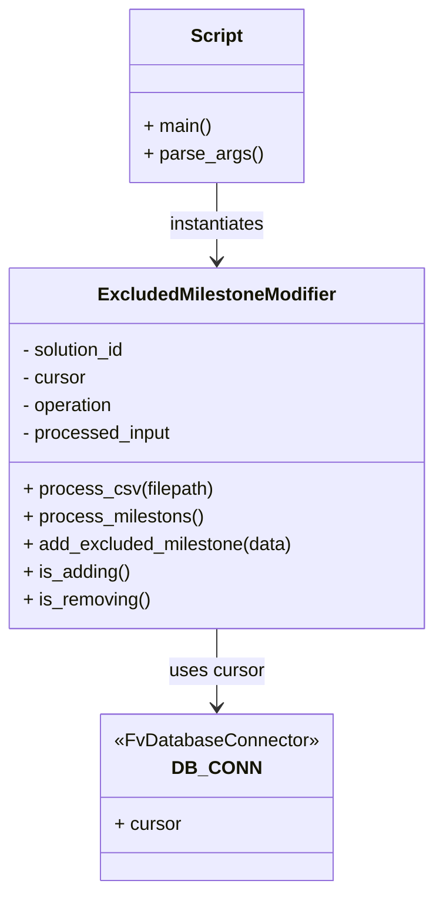

# Diagram: entity_core/entity_service/entity_service_scripts/backfill_ISS-12516_excluded_milestone_modifier.py


> Auto-generated by Obscura crawlers

## Diagram 1



> SVG rendering failed for this diagram.

## Diagram 2

```mermaid
flowchart TD
    MAIN[main()] --> PARSE[parse_args()]
    PARSE --> MODIFIER[ExcludedMilestoneModifier<br/>(solution_id, operation)]
    MODIFIER --> PROCESS_CSV[process_csv(filepath)]
    PROCESS_CSV --> CSV_READ[open(filepath) & csv.DictReader]
    CSV_READ --> EXTRACT[processed_row: reason_code = row.get("reason_code").strip()]
    EXTRACT --> ADD_DESC{is_adding()?}
    ADD_DESC -->|yes| ADD_DESC_NODE[processed_row["code_description"] = row.get("description").strip()]
    ADD_DESC -->|no| SKIP[no description added]
    ADD_DESC_NODE --> APPEND[processed_input.append(processed_row)]
    SKIP --> APPEND
    APPEND --> PROCESS_MILESTONES[process_milestons()]
    PROCESS_MILESTONES --> LOOP[for milestone in processed_input]
    LOOP --> CHECK{is_adding()?}
    CHECK -->|yes| ADD_MILESTONE[add_excluded_milestone(milestone)]
    ADD_MILESTONE --> DB_UPDATE[cursor.mogrify(query, data) -> cursor.execute(query)]
    CHECK -->|no| END[done]
```

> SVG rendering failed for this diagram.
