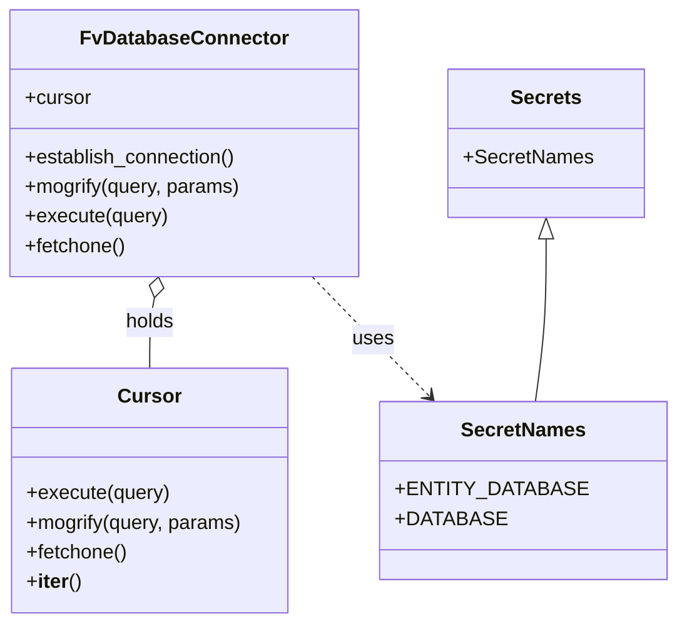

# Diagram: entity_core/entity_service/entity_service_scripts/backfill_active_without_state_change_ts.py


> Auto-generated by Obscura crawlers

## Diagram 1

```mermaid
flowchart TD
    Start([Start]) --> EstablishConnections[Establish DB connections: DB_CONN, DB_CONN2]
    EstablishConnections --> QuerySolutions[Execute: select * from solution s where feature_id in (2)]
    QuerySolutions --> SolutionsIterator{More solutions?}
    SolutionsIterator -->|yes| InitSolution[Set updated=0; solution_id = solution.external_id]
    InitSolution --> CountRecent[Query: count FROM entity WHERE state='Active' AND state_change_ts IS NULL AND solution_id = %s]
    CountRecent --> RecentLoop{cursor.fetchone() true?}
    RecentLoop -->|yes| BuildRecentUpdate[Mogrify update_cte for entity.ts > now() - 180 days LIMIT 50]
    BuildRecentUpdate --> ExecRecent[Execute update_cte -> RETURNING *]
    ExecRecent --> RecentResult{add_state_change_query?}
    RecentResult -->|yes| IncUpdatedRecent[updated += 500; print remaining if count]
    IncUpdatedRecent --> RecentLoop
    RecentResult -->|no| CountOld[Query: count FROM entity WHERE state='Active' AND state_change_ts IS NULL AND entity.ts < now() - 180 days]
    CountOld --> OldLoop{cursor.fetchone() true?}
    OldLoop -->|yes| BuildArchive[Mogrify update_cte for entity.ts < now() - 180 days LIMIT 50]
    BuildArchive --> ExecArchive[Execute archive -> set state_change_ts = now(), state='Archived' RETURNING *]
    ExecArchive --> ArchiveResult{archive_query?}
    ArchiveResult -->|yes| IncUpdatedOld[updated += 500; print remaining if count2]
    IncUpdatedOld --> OldLoop
    ArchiveResult -->|no| SolutionsIterator
    SolutionsIterator -->|no| End([End])
```

> SVG rendering failed for this diagram.

## Diagram 2



### SVG

<svg id="container" width="526.62109375" xmlns="http://www.w3.org/2000/svg" class="classDiagram" height="504" viewBox="0 0 526.62109375 504" role="graphics-document document" aria-roledescription="class"><style>#container{font-family:"trebuchet ms",verdana,arial,sans-serif;font-size:16px;fill:#333;}@keyframes edge-animation-frame{from{stroke-dashoffset:0;}}@keyframes dash{to{stroke-dashoffset:0;}}#container .edge-animation-slow{stroke-dasharray:9,5!important;stroke-dashoffset:900;animation:dash 50s linear infinite;stroke-linecap:round;}#container .edge-animation-fast{stroke-dasharray:9,5!important;stroke-dashoffset:900;animation:dash 20s linear infinite;stroke-linecap:round;}#container .error-icon{fill:#552222;}#container .error-text{fill:#552222;stroke:#552222;}#container .edge-thickness-normal{stroke-width:1px;}#container .edge-thickness-thick{stroke-width:3.5px;}#container .edge-pattern-solid{stroke-dasharray:0;}#container .edge-thickness-invisible{stroke-width:0;fill:none;}#container .edge-pattern-dashed{stroke-dasharray:3;}#container .edge-pattern-dotted{stroke-dasharray:2;}#container .marker{fill:#333333;stroke:#333333;}#container .marker.cross{stroke:#333333;}#container svg{font-family:"trebuchet ms",verdana,arial,sans-serif;font-size:16px;}#container p{margin:0;}#container g.classGroup text{fill:#9370DB;stroke:none;font-family:"trebuchet ms",verdana,arial,sans-serif;font-size:10px;}#container g.classGroup text .title{font-weight:bolder;}#container .nodeLabel,#container .edgeLabel{color:#131300;}#container .edgeLabel .label rect{fill:#ECECFF;}#container .label text{fill:#131300;}#container .labelBkg{background:#ECECFF;}#container .edgeLabel .label span{background:#ECECFF;}#container .classTitle{font-weight:bolder;}#container .node rect,#container .node circle,#container .node ellipse,#container .node polygon,#container .node path{fill:#ECECFF;stroke:#9370DB;stroke-width:1px;}#container .divider{stroke:#9370DB;stroke-width:1;}#container g.clickable{cursor:pointer;}#container g.classGroup rect{fill:#ECECFF;stroke:#9370DB;}#container g.classGroup line{stroke:#9370DB;stroke-width:1;}#container .classLabel .box{stroke:none;stroke-width:0;fill:#ECECFF;opacity:0.5;}#container .classLabel .label{fill:#9370DB;font-size:10px;}#container .relation{stroke:#333333;stroke-width:1;fill:none;}#container .dashed-line{stroke-dasharray:3;}#container .dotted-line{stroke-dasharray:1 2;}#container #compositionStart,#container .composition{fill:#333333!important;stroke:#333333!important;stroke-width:1;}#container #compositionEnd,#container .composition{fill:#333333!important;stroke:#333333!important;stroke-width:1;}#container #dependencyStart,#container .dependency{fill:#333333!important;stroke:#333333!important;stroke-width:1;}#container #dependencyStart,#container .dependency{fill:#333333!important;stroke:#333333!important;stroke-width:1;}#container #extensionStart,#container .extension{fill:transparent!important;stroke:#333333!important;stroke-width:1;}#container #extensionEnd,#container .extension{fill:transparent!important;stroke:#333333!important;stroke-width:1;}#container #aggregationStart,#container .aggregation{fill:transparent!important;stroke:#333333!important;stroke-width:1;}#container #aggregationEnd,#container .aggregation{fill:transparent!important;stroke:#333333!important;stroke-width:1;}#container #lollipopStart,#container .lollipop{fill:#ECECFF!important;stroke:#333333!important;stroke-width:1;}#container #lollipopEnd,#container .lollipop{fill:#ECECFF!important;stroke:#333333!important;stroke-width:1;}#container .edgeTerminals{font-size:11px;line-height:initial;}#container .classTitleText{text-anchor:middle;font-size:18px;fill:#333;}#container .label-icon{display:inline-block;height:1em;overflow:visible;vertical-align:-0.125em;}#container .node .label-icon path{fill:currentColor;stroke:revert;stroke-width:revert;}#container :root{--mermaid-font-family:"trebuchet ms",verdana,arial,sans-serif;}</style><g><defs><marker id="container_class-aggregationStart" class="marker aggregation class" refX="18" refY="7" markerWidth="190" markerHeight="240" orient="auto"><path d="M 18,7 L9,13 L1,7 L9,1 Z"></path></marker></defs><defs><marker id="container_class-aggregationEnd" class="marker aggregation class" refX="1" refY="7" markerWidth="20" markerHeight="28" orient="auto"><path d="M 18,7 L9,13 L1,7 L9,1 Z"></path></marker></defs><defs><marker id="container_class-extensionStart" class="marker extension class" refX="18" refY="7" markerWidth="190" markerHeight="240" orient="auto"><path d="M 1,7 L18,13 V 1 Z"></path></marker></defs><defs><marker id="container_class-extensionEnd" class="marker extension class" refX="1" refY="7" markerWidth="20" markerHeight="28" orient="auto"><path d="M 1,1 V 13 L18,7 Z"></path></marker></defs><defs><marker id="container_class-compositionStart" class="marker composition class" refX="18" refY="7" markerWidth="190" markerHeight="240" orient="auto"><path d="M 18,7 L9,13 L1,7 L9,1 Z"></path></marker></defs><defs><marker id="container_class-compositionEnd" class="marker composition class" refX="1" refY="7" markerWidth="20" markerHeight="28" orient="auto"><path d="M 18,7 L9,13 L1,7 L9,1 Z"></path></marker></defs><defs><marker id="container_class-dependencyStart" class="marker dependency class" refX="6" refY="7" markerWidth="190" markerHeight="240" orient="auto"><path d="M 5,7 L9,13 L1,7 L9,1 Z"></path></marker></defs><defs><marker id="container_class-dependencyEnd" class="marker dependency class" refX="13" refY="7" markerWidth="20" markerHeight="28" orient="auto"><path d="M 18,7 L9,13 L14,7 L9,1 Z"></path></marker></defs><defs><marker id="container_class-lollipopStart" class="marker lollipop class" refX="13" refY="7" markerWidth="190" markerHeight="240" orient="auto"><circle stroke="black" fill="transparent" cx="7" cy="7" r="6"></circle></marker></defs><defs><marker id="container_class-lollipopEnd" class="marker lollipop class" refX="1" refY="7" markerWidth="190" markerHeight="240" orient="auto"><circle stroke="black" fill="transparent" cx="7" cy="7" r="6"></circle></marker></defs><g class="root"><g class="clusters"></g><g class="edgePaths"><path d="M124.024,240.93L123.37,244.275C122.717,247.62,121.409,254.31,120.755,263.822C120.102,273.333,120.102,285.667,120.102,291.833L120.102,298" id="id_FvDatabaseConnector_Cursor_1" class="edge-thickness-normal edge-pattern-solid relation" style=";;;" data-edge="true" data-et="edge" data-id="id_FvDatabaseConnector_Cursor_1" data-points="W3sieCI6MTI3LjMzMzEwODgzNjIwNjg5LCJ5IjoyMjR9LHsieCI6MTIwLjEwMTU2MjUsInkiOjI2MX0seyJ4IjoxMjAuMTAxNTYyNSwieSI6Mjk4fV0=" marker-start="url(#container_class-aggregationStart)"></path><path d="M432.938,193.25L432.938,204.542C432.938,215.833,432.938,238.417,431.506,260.375C430.075,282.333,427.213,303.667,425.782,314.333L424.351,325" id="id_Secrets_SecretNames_2" class="edge-thickness-normal edge-pattern-solid relation" style=";;;" data-edge="true" data-et="edge" data-id="id_Secrets_SecretNames_2" data-points="W3sieCI6NDMyLjkzNzUsInkiOjE3Nn0seyJ4Ijo0MzIuOTM3NSwieSI6MjYxfSx7IngiOjQyNC4zNTExMDI5NDExNzY0NiwieSI6MzI1fV0=" marker-start="url(#container_class-extensionStart)"></path><path d="M247.515,224L253.172,230.167C258.829,236.333,270.143,248.667,285.55,264.786C300.957,280.905,320.457,300.809,330.207,310.762L339.957,320.714" id="id_FvDatabaseConnector_SecretNames_3" class="edge-thickness-normal edge-pattern-dashed relation" style=";;;" data-edge="true" data-et="edge" data-id="id_FvDatabaseConnector_SecretNames_3" data-points="W3sieCI6MjQ3LjUxNTExMzE0NjU1MTczLCJ5IjoyMjR9LHsieCI6MjgxLjQ1NzAzMTI1LCJ5IjoyNjF9LHsieCI6MzQ0LjE1NTU2MDY2MTc2NDcsInkiOjMyNX1d" marker-end="url(#container_class-dependencyEnd)"></path></g><g class="edgeLabels"><g class="edgeLabel" transform="translate(120.1015625, 261)"><g class="label" data-id="id_FvDatabaseConnector_Cursor_1" transform="translate(-20.1875, -12)"><foreignObject width="40.375" height="24"><div xmlns="http://www.w3.org/1999/xhtml" class="labelBkg" style="display: table-cell; white-space: nowrap; line-height: 1.5; max-width: 200px; text-align: center;"><span class="edgeLabel"><p>holds</p></span></div></foreignObject></g></g><g class="edgeLabel"><g class="label" data-id="id_Secrets_SecretNames_2" transform="translate(0, 0)"><foreignObject width="0" height="0"><div xmlns="http://www.w3.org/1999/xhtml" class="labelBkg" style="display: table-cell; white-space: nowrap; line-height: 1.5; max-width: 200px; text-align: center;"><span class="edgeLabel"></span></div></foreignObject></g></g><g class="edgeLabel" transform="translate(281.45703125, 261)"><g class="label" data-id="id_FvDatabaseConnector_SecretNames_3" transform="translate(-16.4921875, -12)"><foreignObject width="32.984375" height="24"><div xmlns="http://www.w3.org/1999/xhtml" class="labelBkg" style="display: table-cell; white-space: nowrap; line-height: 1.5; max-width: 200px; text-align: center;"><span class="edgeLabel"><p>uses</p></span></div></foreignObject></g></g></g><g class="nodes"><g class="node default" id="classId-FvDatabaseConnector-0" transform="translate(148.44140625, 116)"><g class="basic label-container"><path d="M-139.80078125 -108 L139.80078125 -108 L139.80078125 108 L-139.80078125 108" stroke="none" stroke-width="0" fill="#ECECFF" style=""></path><path d="M-139.80078125 -108 C-63.43283024015446 -108, 12.935120769691082 -108, 139.80078125 -108 M-139.80078125 -108 C-35.37246237383884 -108, 69.05585650232231 -108, 139.80078125 -108 M139.80078125 -108 C139.80078125 -56.96466800320349, 139.80078125 -5.929336006406984, 139.80078125 108 M139.80078125 -108 C139.80078125 -38.959605233655665, 139.80078125 30.08078953268867, 139.80078125 108 M139.80078125 108 C60.429999705540695 108, -18.94078183891861 108, -139.80078125 108 M139.80078125 108 C66.20232964650211 108, -7.396121956995785 108, -139.80078125 108 M-139.80078125 108 C-139.80078125 32.48732343345499, -139.80078125 -43.02535313309002, -139.80078125 -108 M-139.80078125 108 C-139.80078125 63.82430508026322, -139.80078125 19.648610160526445, -139.80078125 -108" stroke="#9370DB" stroke-width="1.3" fill="none" stroke-dasharray="0 0" style=""></path></g><g class="annotation-group text" transform="translate(0, -84)"></g><g class="label-group text" transform="translate(-79.3046875, -84)"><g class="label" style="font-weight: bolder" transform="translate(0,-12)"><foreignObject width="158.609375" height="24"><div xmlns="http://www.w3.org/1999/xhtml" style="display: table-cell; white-space: nowrap; line-height: 1.5; max-width: 207px; text-align: center;"><span class="nodeLabel markdown-node-label" style=""><p>FvDatabaseConnector</p></span></div></foreignObject></g></g><g class="members-group text" transform="translate(-127.80078125, -36)"><g class="label" style="" transform="translate(0,-12)"><foreignObject width="53.71875" height="24"><div xmlns="http://www.w3.org/1999/xhtml" style="display: table-cell; white-space: nowrap; line-height: 1.5; max-width: 112px; text-align: center;"><span class="nodeLabel markdown-node-label" style=""><p>+cursor</p></span></div></foreignObject></g></g><g class="methods-group text" transform="translate(-127.80078125, 12)"><g class="label" style="" transform="translate(0,-12)"><foreignObject width="173.265625" height="24"><div xmlns="http://www.w3.org/1999/xhtml" style="display: table-cell; white-space: nowrap; line-height: 1.5; max-width: 231px; text-align: center;"><span class="nodeLabel markdown-node-label" style=""><p>+establish_connection()</p></span></div></foreignObject></g><g class="label" style="" transform="translate(0,12)"><foreignObject width="176.296875" height="24"><div xmlns="http://www.w3.org/1999/xhtml" style="display: table-cell; white-space: nowrap; line-height: 1.5; max-width: 234px; text-align: center;"><span class="nodeLabel markdown-node-label" style=""><p>+mogrify(query, params)</p></span></div></foreignObject></g><g class="label" style="" transform="translate(0,36)"><foreignObject width="115.96875" height="24"><div xmlns="http://www.w3.org/1999/xhtml" style="display: table-cell; white-space: nowrap; line-height: 1.5; max-width: 173px; text-align: center;"><span class="nodeLabel markdown-node-label" style=""><p>+execute(query)</p></span></div></foreignObject></g><g class="label" style="" transform="translate(0,60)"><foreignObject width="82.046875" height="24"><div xmlns="http://www.w3.org/1999/xhtml" style="display: table-cell; white-space: nowrap; line-height: 1.5; max-width: 139px; text-align: center;"><span class="nodeLabel markdown-node-label" style=""><p>+fetchone()</p></span></div></foreignObject></g></g><g class="divider" style=""><path d="M-139.80078125 -60 C-31.223088750020295 -60, 77.35460374995941 -60, 139.80078125 -60 M-139.80078125 -60 C-38.883323675581636 -60, 62.03413389883673 -60, 139.80078125 -60" stroke="#9370DB" stroke-width="1.3" fill="none" stroke-dasharray="0 0" style=""></path></g><g class="divider" style=""><path d="M-139.80078125 -12 C-45.45317371179894 -12, 48.89443382640212 -12, 139.80078125 -12 M-139.80078125 -12 C-77.23428353584556 -12, -14.667785821691126 -12, 139.80078125 -12" stroke="#9370DB" stroke-width="1.3" fill="none" stroke-dasharray="0 0" style=""></path></g></g><g class="node default" id="classId-Cursor-1" transform="translate(120.1015625, 397)"><g class="basic label-container"><path d="M-112.1015625 -99 L112.1015625 -99 L112.1015625 99 L-112.1015625 99" stroke="none" stroke-width="0" fill="#ECECFF" style=""></path><path d="M-112.1015625 -99 C-56.336093557546235 -99, -0.5706246150924699 -99, 112.1015625 -99 M-112.1015625 -99 C-58.09635490318171 -99, -4.091147306363425 -99, 112.1015625 -99 M112.1015625 -99 C112.1015625 -39.586560645378654, 112.1015625 19.826878709242692, 112.1015625 99 M112.1015625 -99 C112.1015625 -26.727396037143777, 112.1015625 45.54520792571245, 112.1015625 99 M112.1015625 99 C46.618913927539054 99, -18.86373464492189 99, -112.1015625 99 M112.1015625 99 C35.979217640234964 99, -40.14312721953007 99, -112.1015625 99 M-112.1015625 99 C-112.1015625 28.277744273549573, -112.1015625 -42.444511452900855, -112.1015625 -99 M-112.1015625 99 C-112.1015625 48.53985744886317, -112.1015625 -1.9202851022736667, -112.1015625 -99" stroke="#9370DB" stroke-width="1.3" fill="none" stroke-dasharray="0 0" style=""></path></g><g class="annotation-group text" transform="translate(0, -75)"></g><g class="label-group text" transform="translate(-23.90625, -75)"><g class="label" style="font-weight: bolder" transform="translate(0,-12)"><foreignObject width="47.8125" height="24"><div xmlns="http://www.w3.org/1999/xhtml" style="display: table-cell; white-space: nowrap; line-height: 1.5; max-width: 98px; text-align: center;"><span class="nodeLabel markdown-node-label" style=""><p>Cursor</p></span></div></foreignObject></g></g><g class="members-group text" transform="translate(-100.1015625, -27)"></g><g class="methods-group text" transform="translate(-100.1015625, 3)"><g class="label" style="" transform="translate(0,-12)"><foreignObject width="115.96875" height="24"><div xmlns="http://www.w3.org/1999/xhtml" style="display: table-cell; white-space: nowrap; line-height: 1.5; max-width: 173px; text-align: center;"><span class="nodeLabel markdown-node-label" style=""><p>+execute(query)</p></span></div></foreignObject></g><g class="label" style="" transform="translate(0,12)"><foreignObject width="176.296875" height="24"><div xmlns="http://www.w3.org/1999/xhtml" style="display: table-cell; white-space: nowrap; line-height: 1.5; max-width: 234px; text-align: center;"><span class="nodeLabel markdown-node-label" style=""><p>+mogrify(query, params)</p></span></div></foreignObject></g><g class="label" style="" transform="translate(0,36)"><foreignObject width="82.046875" height="24"><div xmlns="http://www.w3.org/1999/xhtml" style="display: table-cell; white-space: nowrap; line-height: 1.5; max-width: 139px; text-align: center;"><span class="nodeLabel markdown-node-label" style=""><p>+fetchone()</p></span></div></foreignObject></g><g class="label" style="" transform="translate(0,60)"><foreignObject width="44.015625" height="24"><div xmlns="http://www.w3.org/1999/xhtml" style="display: table-cell; white-space: nowrap; line-height: 1.5; max-width: 131px; text-align: center;"><span class="nodeLabel markdown-node-label" style=""><p>+<strong>iter</strong>()</p></span></div></foreignObject></g></g><g class="divider" style=""><path d="M-112.1015625 -51 C-27.089156354870738 -51, 57.923249790258524 -51, 112.1015625 -51 M-112.1015625 -51 C-55.58117566671734 -51, 0.9392111665653147 -51, 112.1015625 -51" stroke="#9370DB" stroke-width="1.3" fill="none" stroke-dasharray="0 0" style=""></path></g><g class="divider" style=""><path d="M-112.1015625 -27 C-29.38937496534028 -27, 53.32281256931944 -27, 112.1015625 -27 M-112.1015625 -27 C-40.74303280817347 -27, 30.615496883653066 -27, 112.1015625 -27" stroke="#9370DB" stroke-width="1.3" fill="none" stroke-dasharray="0 0" style=""></path></g></g><g class="node default" id="classId-Secrets-2" transform="translate(432.9375, 116)"><g class="basic label-container"><path d="M-76.66796875 -60 L76.66796875 -60 L76.66796875 60 L-76.66796875 60" stroke="none" stroke-width="0" fill="#ECECFF" style=""></path><path d="M-76.66796875 -60 C-28.55857636232288 -60, 19.550816025354237 -60, 76.66796875 -60 M-76.66796875 -60 C-19.370777110814984 -60, 37.92641452837003 -60, 76.66796875 -60 M76.66796875 -60 C76.66796875 -18.980268929038466, 76.66796875 22.039462141923067, 76.66796875 60 M76.66796875 -60 C76.66796875 -26.73493111149306, 76.66796875 6.530137777013877, 76.66796875 60 M76.66796875 60 C23.121825762389584 60, -30.424317225220832 60, -76.66796875 60 M76.66796875 60 C45.80666961876537 60, 14.945370487530738 60, -76.66796875 60 M-76.66796875 60 C-76.66796875 15.028868114411644, -76.66796875 -29.942263771176712, -76.66796875 -60 M-76.66796875 60 C-76.66796875 15.583233353616741, -76.66796875 -28.833533292766518, -76.66796875 -60" stroke="#9370DB" stroke-width="1.3" fill="none" stroke-dasharray="0 0" style=""></path></g><g class="annotation-group text" transform="translate(0, -36)"></g><g class="label-group text" transform="translate(-27.1640625, -36)"><g class="label" style="font-weight: bolder" transform="translate(0,-12)"><foreignObject width="54.328125" height="24"><div xmlns="http://www.w3.org/1999/xhtml" style="display: table-cell; white-space: nowrap; line-height: 1.5; max-width: 103px; text-align: center;"><span class="nodeLabel markdown-node-label" style=""><p>Secrets</p></span></div></foreignObject></g></g><g class="members-group text" transform="translate(-64.66796875, 12)"><g class="label" style="" transform="translate(0,-12)"><foreignObject width="102.171875" height="24"><div xmlns="http://www.w3.org/1999/xhtml" style="display: table-cell; white-space: nowrap; line-height: 1.5; max-width: 160px; text-align: center;"><span class="nodeLabel markdown-node-label" style=""><p>+SecretNames</p></span></div></foreignObject></g></g><g class="methods-group text" transform="translate(-64.66796875, 60)"></g><g class="divider" style=""><path d="M-76.66796875 -12 C-39.88410864642655 -12, -3.1002485428530946 -12, 76.66796875 -12 M-76.66796875 -12 C-45.26997698974037 -12, -13.871985229480742 -12, 76.66796875 -12" stroke="#9370DB" stroke-width="1.3" fill="none" stroke-dasharray="0 0" style=""></path></g><g class="divider" style=""><path d="M-76.66796875 36 C-22.177716984118554 36, 32.31253478176289 36, 76.66796875 36 M-76.66796875 36 C-35.576987009734744 36, 5.513994730530513 36, 76.66796875 36" stroke="#9370DB" stroke-width="1.3" fill="none" stroke-dasharray="0 0" style=""></path></g></g><g class="node default" id="classId-SecretNames-3" transform="translate(414.69140625, 397)"><g class="basic label-container"><path d="M-103.9296875 -72 L103.9296875 -72 L103.9296875 72 L-103.9296875 72" stroke="none" stroke-width="0" fill="#ECECFF" style=""></path><path d="M-103.9296875 -72 C-37.350207335685994 -72, 29.229272828628012 -72, 103.9296875 -72 M-103.9296875 -72 C-28.0152152346011 -72, 47.8992570307978 -72, 103.9296875 -72 M103.9296875 -72 C103.9296875 -18.209780763943456, 103.9296875 35.58043847211309, 103.9296875 72 M103.9296875 -72 C103.9296875 -32.40385922826189, 103.9296875 7.192281543476227, 103.9296875 72 M103.9296875 72 C57.22853044307594 72, 10.52737338615188 72, -103.9296875 72 M103.9296875 72 C21.50566528471444 72, -60.91835693057112 72, -103.9296875 72 M-103.9296875 72 C-103.9296875 17.012739224270568, -103.9296875 -37.974521551458864, -103.9296875 -72 M-103.9296875 72 C-103.9296875 32.05559731401506, -103.9296875 -7.88880537196988, -103.9296875 -72" stroke="#9370DB" stroke-width="1.3" fill="none" stroke-dasharray="0 0" style=""></path></g><g class="annotation-group text" transform="translate(0, -48)"></g><g class="label-group text" transform="translate(-48.03125, -48)"><g class="label" style="font-weight: bolder" transform="translate(0,-12)"><foreignObject width="96.0625" height="24"><div xmlns="http://www.w3.org/1999/xhtml" style="display: table-cell; white-space: nowrap; line-height: 1.5; max-width: 145px; text-align: center;"><span class="nodeLabel markdown-node-label" style=""><p>SecretNames</p></span></div></foreignObject></g></g><g class="members-group text" transform="translate(-91.9296875, 0)"><g class="label" style="" transform="translate(0,-12)"><foreignObject width="135.828125" height="24"><div xmlns="http://www.w3.org/1999/xhtml" style="display: table-cell; white-space: nowrap; line-height: 1.5; max-width: 193px; text-align: center;"><span class="nodeLabel markdown-node-label" style=""><p>+ENTITY_DATABASE</p></span></div></foreignObject></g><g class="label" style="" transform="translate(0,12)"><foreignObject width="79.234375" height="24"><div xmlns="http://www.w3.org/1999/xhtml" style="display: table-cell; white-space: nowrap; line-height: 1.5; max-width: 137px; text-align: center;"><span class="nodeLabel markdown-node-label" style=""><p>+DATABASE</p></span></div></foreignObject></g></g><g class="methods-group text" transform="translate(-91.9296875, 72)"></g><g class="divider" style=""><path d="M-103.9296875 -24 C-51.97925013813429 -24, -0.028812776268580365 -24, 103.9296875 -24 M-103.9296875 -24 C-45.31288317234961 -24, 13.303921155300785 -24, 103.9296875 -24" stroke="#9370DB" stroke-width="1.3" fill="none" stroke-dasharray="0 0" style=""></path></g><g class="divider" style=""><path d="M-103.9296875 48 C-39.05348156006117 48, 25.822724379877656 48, 103.9296875 48 M-103.9296875 48 C-37.019695044944356 48, 29.890297410111287 48, 103.9296875 48" stroke="#9370DB" stroke-width="1.3" fill="none" stroke-dasharray="0 0" style=""></path></g></g></g></g></g></svg>
