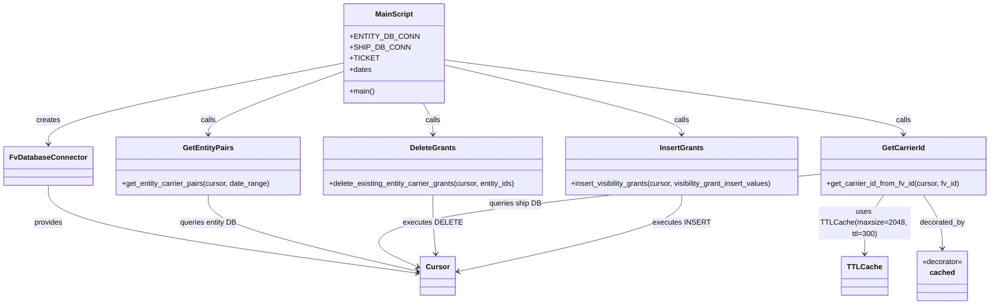

# Diagram: entity_core/entity_service/entity_service_scripts/backfill_carrier_visibility.py


> Auto-generated by Obscura crawlers

## Diagram 1



> SVG rendering failed for this diagram.

## Diagram 2

```mermaid
flowchart LR
    Start([Start]) --> Loop{Iterate date ranges}
    Loop --> GetPairs[get_entity_carrier_pairs\n(entity_cursor)]
    GetPairs --> ForEach{For each (entity_id, carrier_fv_id)}
    ForEach --> GetCarrier[get_carrier_id_from_fv_id\n(ship_cursor, cached)]
    GetCarrier -->|found| Add[Append values to\nvisibility_grant_insert_values\nand entity_ids]
    GetCarrier -->|not found| Skip[Skip]
    Add --> ForEach
    Skip --> ForEach
    ForEach --> DoneLoop{All pairs processed}
    DoneLoop --> Delete[delete_existing_entity_carrier_grants\n(entity_cursor, entity_ids)]
    Delete --> Insert[insert_visibility_grants\n(entity_cursor, visibility_grant_insert_values)]
    Insert --> LogSuccess([Print SUCCESS\ndeleted X; inserted Y])
    GetPairs -->|error| Error([Print FAILED\nand exception])
```

> SVG rendering failed for this diagram.
