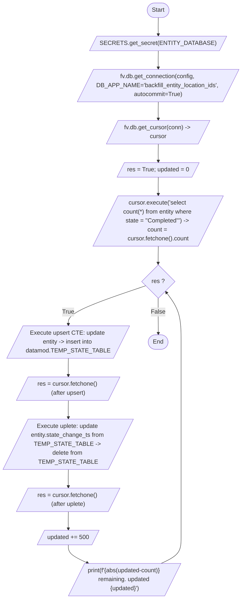
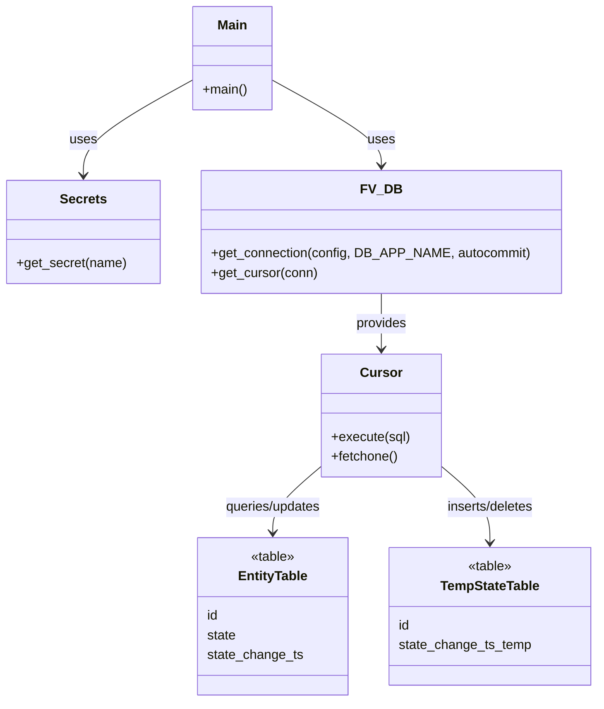

# Diagram: entity_core/entity_service/entity_service_scripts/backfill_completed_to_delivered_lifecycles.py

> Auto-generated by Obscura crawlers

## Diagram 1

### SVG

<svg id="container" width="633.325927734375" xmlns="http://www.w3.org/2000/svg" class="flowchart" height="1603.484375" viewBox="0 0 633.325927734375 1603.484375" role="graphics-document document" aria-roledescription="flowchart-v2"><g><marker id="container_flowchart-v2-pointEnd" class="marker flowchart-v2" viewBox="0 0 10 10" refX="5" refY="5" markerUnits="userSpaceOnUse" markerWidth="8" markerHeight="8" orient="auto"><path d="M 0 0 L 10 5 L 0 10 z" class="arrowMarkerPath" style="stroke-width: 1; stroke-dasharray: 1, 0;"></path></marker><marker id="container_flowchart-v2-pointStart" class="marker flowchart-v2" viewBox="0 0 10 10" refX="4.5" refY="5" markerUnits="userSpaceOnUse" markerWidth="8" markerHeight="8" orient="auto"><path d="M 0 5 L 10 10 L 10 0 z" class="arrowMarkerPath" style="stroke-width: 1; stroke-dasharray: 1, 0;"></path></marker><marker id="container_flowchart-v2-circleEnd" class="marker flowchart-v2" viewBox="0 0 10 10" refX="11" refY="5" markerUnits="userSpaceOnUse" markerWidth="11" markerHeight="11" orient="auto"><circle cx="5" cy="5" r="5" class="arrowMarkerPath" style="stroke-width: 1; stroke-dasharray: 1, 0;"></circle></marker><marker id="container_flowchart-v2-circleStart" class="marker flowchart-v2" viewBox="0 0 10 10" refX="-1" refY="5" markerUnits="userSpaceOnUse" markerWidth="11" markerHeight="11" orient="auto"><circle cx="5" cy="5" r="5" class="arrowMarkerPath" style="stroke-width: 1; stroke-dasharray: 1, 0;"></circle></marker><marker id="container_flowchart-v2-crossEnd" class="marker cross flowchart-v2" viewBox="0 0 11 11" refX="12" refY="5.2" markerUnits="userSpaceOnUse" markerWidth="11" markerHeight="11" orient="auto"><path d="M 1,1 l 9,9 M 10,1 l -9,9" class="arrowMarkerPath" style="stroke-width: 2; stroke-dasharray: 1, 0;"></path></marker><marker id="container_flowchart-v2-crossStart" class="marker cross flowchart-v2" viewBox="0 0 11 11" refX="-1" refY="5.2" markerUnits="userSpaceOnUse" markerWidth="11" markerHeight="11" orient="auto"><path d="M 1,1 l 9,9 M 10,1 l -9,9" class="arrowMarkerPath" style="stroke-width: 2; stroke-dasharray: 1, 0;"></path></marker><g class="root"><g class="clusters"></g><g class="edgePaths"><path d="M412.834,47.5L412.75,51.583C412.667,55.667,412.5,63.833,412.487,71.5C412.474,79.167,412.615,86.334,412.685,89.917L412.755,93.501" id="L_Start_GetSecret_0" class="edge-thickness-normal edge-pattern-solid edge-thickness-normal edge-pattern-solid flowchart-link" style=";" data-edge="true" data-et="edge" data-id="L_Start_GetSecret_0" data-points="W3sieCI6NDEyLjgzMzczMDY5NzYzMTg0LCJ5Ijo0Ny41fSx7IngiOjQxMi4zMzM3MzA2OTc2MzE4NCwieSI6NzJ9LHsieCI6NDEyLjgzMzczMDY5NzYzMTg0LCJ5Ijo5Ny41fV0=" marker-end="url(#container_flowchart-v2-pointEnd)"></path><path d="M412.834,136.5L412.75,140.583C412.667,144.667,412.5,152.833,412.487,160.5C412.474,168.167,412.615,175.334,412.685,178.917L412.755,182.501" id="L_GetSecret_OpenConn_0" class="edge-thickness-normal edge-pattern-solid edge-thickness-normal edge-pattern-solid flowchart-link" style=";" data-edge="true" data-et="edge" data-id="L_GetSecret_OpenConn_0" data-points="W3sieCI6NDEyLjgzMzczMDY5NzYzMTg0LCJ5IjoxMzYuNX0seyJ4Ijo0MTIuMzMzNzMwNjk3NjMxODQsInkiOjE2MX0seyJ4Ijo0MTIuODMzNzMwNjk3NjMxODQsInkiOjE4Ni41fV0=" marker-end="url(#container_flowchart-v2-pointEnd)"></path><path d="M412.834,273.5L412.75,277.583C412.667,281.667,412.5,289.833,412.487,297.5C412.474,305.167,412.615,312.334,412.685,315.917L412.755,319.501" id="L_OpenConn_WithCursor_0" class="edge-thickness-normal edge-pattern-solid edge-thickness-normal edge-pattern-solid flowchart-link" style=";" data-edge="true" data-et="edge" data-id="L_OpenConn_WithCursor_0" data-points="W3sieCI6NDEyLjgzMzczMDY5NzYzMTg0LCJ5IjoyNzMuNX0seyJ4Ijo0MTIuMzMzNzMwNjk3NjMxODQsInkiOjI5OH0seyJ4Ijo0MTIuODMzNzMwNjk3NjMxODQsInkiOjMyMy41fV0=" marker-end="url(#container_flowchart-v2-pointEnd)"></path><path d="M412.834,386.5L412.75,390.583C412.667,394.667,412.5,402.833,412.487,410.5C412.474,418.167,412.615,425.334,412.685,428.917L412.755,432.501" id="L_WithCursor_InitVars_0" class="edge-thickness-normal edge-pattern-solid edge-thickness-normal edge-pattern-solid flowchart-link" style=";" data-edge="true" data-et="edge" data-id="L_WithCursor_InitVars_0" data-points="W3sieCI6NDEyLjgzMzczMDY5NzYzMTg0LCJ5IjozODYuNX0seyJ4Ijo0MTIuMzMzNzMwNjk3NjMxODQsInkiOjQxMX0seyJ4Ijo0MTIuODMzNzMwNjk3NjMxODQsInkiOjQzNi41fV0=" marker-end="url(#container_flowchart-v2-pointEnd)"></path><path d="M412.834,475.5L412.75,479.583C412.667,483.667,412.5,491.833,412.487,499.5C412.474,507.167,412.615,514.334,412.685,517.917L412.755,521.501" id="L_InitVars_CountQuery_0" class="edge-thickness-normal edge-pattern-solid edge-thickness-normal edge-pattern-solid flowchart-link" style=";" data-edge="true" data-et="edge" data-id="L_InitVars_CountQuery_0" data-points="W3sieCI6NDEyLjgzMzczMDY5NzYzMTg0LCJ5Ijo0NzUuNX0seyJ4Ijo0MTIuMzMzNzMwNjk3NjMxODQsInkiOjUwMH0seyJ4Ijo0MTIuODMzNzMwNjk3NjMxODQsInkiOjUyNS41fV0=" marker-end="url(#container_flowchart-v2-pointEnd)"></path><path d="M412.834,660.5L412.75,664.583C412.667,668.667,412.5,676.833,412.417,684.417C412.334,692,412.334,699,412.334,702.5L412.334,706" id="L_CountQuery_Loop_0" class="edge-thickness-normal edge-pattern-solid edge-thickness-normal edge-pattern-solid flowchart-link" style=";" data-edge="true" data-et="edge" data-id="L_CountQuery_Loop_0" data-points="W3sieCI6NDEyLjgzMzczMDY5NzYzMTg0LCJ5Ijo2NjAuNX0seyJ4Ijo0MTIuMzMzNzMwNjk3NjMxODQsInkiOjY4NX0seyJ4Ijo0MTIuMzMzNzMwNjk3NjMxOSwieSI6NzEwfV0=" marker-end="url(#container_flowchart-v2-pointEnd)"></path><path d="M379.982,765.132L347.151,776.691C314.321,788.25,248.661,811.367,215.905,828.509C183.149,845.651,183.298,856.818,183.372,862.401L183.447,867.985" id="L_Loop_Upsert_0" class="edge-thickness-normal edge-pattern-solid edge-thickness-normal edge-pattern-solid flowchart-link" style=";" data-edge="true" data-et="edge" data-id="L_Loop_Upsert_0" data-points="W3sieCI6Mzc5Ljk4MTc4NTcwNzY0MjEzLCJ5Ijo3NjUuMTMyNDMwMDEwMDEwMn0seyJ4IjoxODMsInkiOjgzNC40ODQzNzV9LHsieCI6MTgzLjUsInkiOjg3MS45ODQzNzV9XQ==" marker-end="url(#container_flowchart-v2-pointEnd)"></path><path d="M183.5,958.984L183.417,963.068C183.333,967.151,183.167,975.318,183.154,982.985C183.141,990.651,183.281,997.818,183.351,1001.402L183.422,1004.985" id="L_Upsert_UpsertFetch_0" class="edge-thickness-normal edge-pattern-solid edge-thickness-normal edge-pattern-solid flowchart-link" style=";" data-edge="true" data-et="edge" data-id="L_Upsert_UpsertFetch_0" data-points="W3sieCI6MTgzLjUsInkiOjk1OC45ODQzNzV9LHsieCI6MTgzLCJ5Ijo5ODMuNDg0Mzc1fSx7IngiOjE4My41LCJ5IjoxMDA4Ljk4NDM3NX1d" marker-end="url(#container_flowchart-v2-pointEnd)"></path><path d="M183.5,1071.984L183.417,1076.068C183.333,1080.151,183.167,1088.318,183.154,1095.985C183.141,1103.651,183.281,1110.818,183.351,1114.402L183.422,1117.985" id="L_UpsertFetch_Uplete_0" class="edge-thickness-normal edge-pattern-solid edge-thickness-normal edge-pattern-solid flowchart-link" style=";" data-edge="true" data-et="edge" data-id="L_UpsertFetch_Uplete_0" data-points="W3sieCI6MTgzLjUsInkiOjEwNzEuOTg0Mzc1fSx7IngiOjE4MywieSI6MTA5Ni40ODQzNzV9LHsieCI6MTgzLjUsInkiOjExMjEuOTg0Mzc1fV0=" marker-end="url(#container_flowchart-v2-pointEnd)"></path><path d="M183.5,1256.984L183.417,1261.068C183.333,1265.151,183.167,1273.318,183.154,1280.985C183.141,1288.651,183.281,1295.818,183.351,1299.402L183.422,1302.985" id="L_Uplete_UpleteFetch_0" class="edge-thickness-normal edge-pattern-solid edge-thickness-normal edge-pattern-solid flowchart-link" style=";" data-edge="true" data-et="edge" data-id="L_Uplete_UpleteFetch_0" data-points="W3sieCI6MTgzLjUsInkiOjEyNTYuOTg0Mzc1fSx7IngiOjE4MywieSI6MTI4MS40ODQzNzV9LHsieCI6MTgzLjUsInkiOjEzMDYuOTg0Mzc1fV0=" marker-end="url(#container_flowchart-v2-pointEnd)"></path><path d="M183.5,1369.984L183.417,1374.068C183.333,1378.151,183.167,1386.318,183.154,1393.985C183.141,1401.651,183.281,1408.818,183.351,1412.402L183.422,1415.985" id="L_UpleteFetch_Increment_0" class="edge-thickness-normal edge-pattern-solid edge-thickness-normal edge-pattern-solid flowchart-link" style=";" data-edge="true" data-et="edge" data-id="L_UpleteFetch_Increment_0" data-points="W3sieCI6MTgzLjUsInkiOjEzNjkuOTg0Mzc1fSx7IngiOjE4MywieSI6MTM5NC40ODQzNzV9LHsieCI6MTgzLjUsInkiOjE0MTkuOTg0Mzc1fV0=" marker-end="url(#container_flowchart-v2-pointEnd)"></path><path d="M183.5,1458.984L183.417,1463.068C183.333,1467.151,183.167,1475.318,191.396,1483.364C199.626,1491.411,216.252,1499.337,224.565,1503.3L232.878,1507.263" id="L_Increment_Print_0" class="edge-thickness-normal edge-pattern-solid edge-thickness-normal edge-pattern-solid flowchart-link" style=";" data-edge="true" data-et="edge" data-id="L_Increment_Print_0" data-points="W3sieCI6MTgzLjUsInkiOjE0NTguOTg0Mzc1fSx7IngiOjE4MywieSI6MTQ4My40ODQzNzV9LHsieCI6MjM2LjQ4ODc1ODkyMjQ5MzM2LCJ5IjoxNTA4Ljk4NDM3NX1d" marker-end="url(#container_flowchart-v2-pointEnd)"></path><path d="M420.89,1508.984L429.638,1504.734C438.386,1500.484,455.882,1491.984,464.63,1480.318C473.378,1468.651,473.378,1453.818,473.378,1438.984C473.378,1424.151,473.378,1409.318,473.378,1392.484C473.378,1375.651,473.378,1356.818,473.378,1337.984C473.378,1319.151,473.378,1300.318,473.378,1275.484C473.378,1250.651,473.378,1219.818,473.378,1188.984C473.378,1158.151,473.378,1127.318,473.378,1102.484C473.378,1077.651,473.378,1058.818,473.378,1039.984C473.378,1021.151,473.378,1002.318,473.378,981.484C473.378,960.651,473.378,937.818,473.378,912.984C473.378,888.151,473.378,861.318,466.745,839.127C460.112,816.937,446.845,799.39,440.212,790.616L433.579,781.842" id="L_Print_Loop_0" class="edge-thickness-normal edge-pattern-solid edge-thickness-normal edge-pattern-solid flowchart-link" style=";" data-edge="true" data-et="edge" data-id="L_Print_Loop_0" data-points="W3sieCI6NDIwLjg4OTYzOTk3Mjc3MDMsInkiOjE1MDguOTg0Mzc1fSx7IngiOjQ3My4zNzgzOTg4OTUyNjM3LCJ5IjoxNDgzLjQ4NDM3NX0seyJ4Ijo0NzMuMzc4Mzk4ODk1MjYzNywieSI6MTQzOC45ODQzNzV9LHsieCI6NDczLjM3ODM5ODg5NTI2MzcsInkiOjEzOTQuNDg0Mzc1fSx7IngiOjQ3My4zNzgzOTg4OTUyNjM3LCJ5IjoxMzM3Ljk4NDM3NX0seyJ4Ijo0NzMuMzc4Mzk4ODk1MjYzNywieSI6MTI4MS40ODQzNzV9LHsieCI6NDczLjM3ODM5ODg5NTI2MzcsInkiOjExODguOTg0Mzc1fSx7IngiOjQ3My4zNzgzOTg4OTUyNjM3LCJ5IjoxMDk2LjQ4NDM3NX0seyJ4Ijo0NzMuMzc4Mzk4ODk1MjYzNywieSI6MTAzOS45ODQzNzV9LHsieCI6NDczLjM3ODM5ODg5NTI2MzcsInkiOjk4My40ODQzNzV9LHsieCI6NDczLjM3ODM5ODg5NTI2MzcsInkiOjkxNC45ODQzNzV9LHsieCI6NDczLjM3ODM5ODg5NTI2MzcsInkiOjgzNC40ODQzNzV9LHsieCI6NDMxLjE2NjQxNjYyNjM2NDkzLCJ5Ijo3NzguNjUxNjg5MDcxMjY2OX1d" marker-end="url(#container_flowchart-v2-pointEnd)"></path><path d="M412.334,797.484L412.334,803.651C412.334,809.818,412.334,822.151,412.412,837.901C412.49,853.651,412.645,872.818,412.723,882.401L412.801,891.985" id="L_Loop_End_0" class="edge-thickness-normal edge-pattern-solid edge-thickness-normal edge-pattern-solid flowchart-link" style=";" data-edge="true" data-et="edge" data-id="L_Loop_End_0" data-points="W3sieCI6NDEyLjMzMzczMDY5NzYzMTksInkiOjc5Ny40ODQzNzV9LHsieCI6NDEyLjMzMzczMDY5NzYzMTg0LCJ5Ijo4MzQuNDg0Mzc1fSx7IngiOjQxMi44MzM3MzA2OTc2MzE4NCwieSI6ODk1Ljk4NDM3NX1d" marker-end="url(#container_flowchart-v2-pointEnd)"></path></g><g class="edgeLabels"><g class="edgeLabel"><g class="label" data-id="L_Start_GetSecret_0" transform="translate(0, 0)"><foreignObject width="0" height="0">

</foreignObject></g></g><g class="edgeLabel"><g class="label" data-id="L_GetSecret_OpenConn_0" transform="translate(0, 0)"><foreignObject width="0" height="0">

</foreignObject></g></g><g class="edgeLabel"><g class="label" data-id="L_OpenConn_WithCursor_0" transform="translate(0, 0)"><foreignObject width="0" height="0">

</foreignObject></g></g><g class="edgeLabel"><g class="label" data-id="L_WithCursor_InitVars_0" transform="translate(0, 0)"><foreignObject width="0" height="0">

</foreignObject></g></g><g class="edgeLabel"><g class="label" data-id="L_InitVars_CountQuery_0" transform="translate(0, 0)"><foreignObject width="0" height="0">

</foreignObject></g></g><g class="edgeLabel"><g class="label" data-id="L_CountQuery_Loop_0" transform="translate(0, 0)"><foreignObject width="0" height="0">

</foreignObject></g></g><g class="edgeLabel" transform="translate(183, 834.484375)"><g class="label" data-id="L_Loop_Upsert_0" transform="translate(-16.0078125, -12)"><foreignObject width="32.015625" height="24">

True

</foreignObject></g></g><g class="edgeLabel"><g class="label" data-id="L_Upsert_UpsertFetch_0" transform="translate(0, 0)"><foreignObject width="0" height="0">

</foreignObject></g></g><g class="edgeLabel"><g class="label" data-id="L_UpsertFetch_Uplete_0" transform="translate(0, 0)"><foreignObject width="0" height="0">

</foreignObject></g></g><g class="edgeLabel"><g class="label" data-id="L_Uplete_UpleteFetch_0" transform="translate(0, 0)"><foreignObject width="0" height="0">

</foreignObject></g></g><g class="edgeLabel"><g class="label" data-id="L_UpleteFetch_Increment_0" transform="translate(0, 0)"><foreignObject width="0" height="0">

</foreignObject></g></g><g class="edgeLabel"><g class="label" data-id="L_Increment_Print_0" transform="translate(0, 0)"><foreignObject width="0" height="0">

</foreignObject></g></g><g class="edgeLabel"><g class="label" data-id="L_Print_Loop_0" transform="translate(0, 0)"><foreignObject width="0" height="0">

</foreignObject></g></g><g class="edgeLabel" transform="translate(412.33373069763184, 834.484375)"><g class="label" data-id="L_Loop_End_0" transform="translate(-18.1640625, -12)"><foreignObject width="36.328125" height="24">

False

</foreignObject></g></g></g><g class="nodes"><g class="node default" id="flowchart-Start-0" transform="translate(412.33373069763184, 27.5)"><g class="basic label-container outer-path"><path d="M-10.3984375 -19.5 C-2.4587854306019645 -19.5, 5.480866638796071 -19.5, 10.3984375 -19.5 C10.3984375 -19.5, 10.3984375 -19.5, 10.398437499999998 -19.5 C10.841227114612138 -19.48580059889709, 11.284016729224279 -19.47160119779418, 11.6478067896239 -19.45993515863156 C12.018372213541449 -19.42418715785636, 12.388937637459 -19.38843915708116, 12.892042152847864 -19.3399052695533 C13.342191784702932 -19.267128568037506, 13.792341416558 -19.19435186652171, 14.126030759676757 -19.140403561325776 C14.57398697119074 -19.038160479235174, 15.021943182704723 -18.935917397144575, 15.34470188623539 -18.862249829261074 C15.734394463142804 -18.746591117973033, 16.12408704005022 -18.63093240668499, 16.543047751460602 -18.50658706670804 C16.815822534587934 -18.406203425014727, 17.088597317715262 -18.305819783321414, 17.716144095147794 -18.074876768247425 C18.079141306114906 -17.914188670881963, 18.442138517082018 -17.7535005735165, 18.85917041279238 -17.568892924097174 C19.29743274617348 -17.340251745492676, 19.735695079554585 -17.111610566888178, 19.967429764076783 -16.990714730406097 C20.252608207728628 -16.81783788196979, 20.537786651380475 -16.644961033533484, 21.036368073605697 -16.342718045390892 C21.43132785433045 -16.06721119989065, 21.826287635055202 -15.791704354390406, 22.061592844578712 -15.627565626425154 C22.396026897485502 -15.360863368895897, 22.730460950392295 -15.09416111136664, 23.03889120850187 -14.848196188198123 C23.321846707052046 -14.591223491007094, 23.604802205602223 -14.334250793816063, 23.964247236767985 -14.007812326905688 C24.206214998549378 -13.757960746943704, 24.448182760330766 -13.508109166981718, 24.833858442968648 -13.10986736009568 C25.016868669828504 -12.894893134049182, 25.19987889668836 -12.679918908002684, 25.644151408126582 -12.158051136245305 C25.81466432923436 -11.929579356007562, 25.985177250342137 -11.701107575769816, 26.391796464640635 -11.156274872382312 C26.632062155572772 -10.787162250738833, 26.872327846504906 -10.418049629095353, 27.073721378604247 -10.108655082055241 C27.2675694426164 -9.764458215156662, 27.46141750662855 -9.420261348258082, 27.6871239742735 -9.019496659696287 C27.835578342256785 -8.711227988164376, 27.98403271024007 -8.402959316632465, 28.22948364880834 -7.893275190886684 C28.38325829204572 -7.513448849059886, 28.537032935283097 -7.133622507233087, 28.698571729970325 -6.734618561215508 C28.843119554046485 -6.299263545666271, 28.987667378122644 -5.863908530117035, 29.09246063421488 -5.548287939305138 C29.15675330409258 -5.303112124442088, 29.221045973970277 -5.057936309579039, 29.40953178754556 -4.339158212148133 C29.46377765428844 -4.06061715129145, 29.518023521031317 -3.7820760904347672, 29.648482276581777 -3.1121979531509023 C29.690484324476124 -2.7864383639248387, 29.732486372370474 -2.460678774698775, 29.808330202509367 -1.872449005199798 C29.82778310311671 -1.5694543761416524, 29.847236003724056 -1.2664597470835066, 29.888418715913414 -0.6250057626472757 C29.888418715913414 -0.2568522527537514, 29.888418715913414 0.1113012571397729, 29.888418715913414 0.625005762647271 C29.862594037749904 1.0272459703489862, 29.83676935958639 1.4294861780507016, 29.808330202509367 1.8724490051997846 C29.760370484657628 2.244415106140367, 29.712410766805892 2.6163812070809493, 29.648482276581777 3.1121979531508885 C29.596485927760416 3.3791882149163768, 29.54448957893905 3.6461784766818646, 29.40953178754556 4.339158212148129 C29.327826620715438 4.650735424514696, 29.246121453885312 4.962312636881265, 29.092460634214884 5.548287939305125 C28.96292372932282 5.9384324579370436, 28.833386824430757 6.328576976568962, 28.69857172997033 6.734618561215495 C28.600916776014728 6.975828185515923, 28.503261822059127 7.217037809816352, 28.229483648808344 7.893275190886679 C28.117467627381526 8.125878856138375, 28.005451605954704 8.35848252139007, 27.687123974273504 9.019496659696284 C27.563000116771867 9.239891137593936, 27.43887625927023 9.460285615491589, 27.07372137860425 10.108655082055236 C26.91804954110975 10.347808828188233, 26.762377703615247 10.58696257432123, 26.39179646464064 11.156274872382301 C26.230903827944314 11.371856347934642, 26.070011191247985 11.587437823486983, 25.644151408126582 12.158051136245302 C25.47729940103187 12.354044997926913, 25.310447393937157 12.550038859608522, 24.83385844296866 13.10986736009567 C24.5276878987235 13.426013584097966, 24.221517354478337 13.742159808100263, 23.96424723676799 14.007812326905684 C23.60340729389431 14.335517615721848, 23.24256735102063 14.663222904538012, 23.038891208501887 14.848196188198111 C22.657831471290944 15.15208118819836, 22.27677173408 15.455966188198609, 22.061592844578715 15.627565626425152 C21.69293136593651 15.884727914827762, 21.3242698872943 16.14189020323037, 21.036368073605708 16.34271804539089 C20.674908427341652 16.56183700712882, 20.313448781077597 16.780955968866753, 19.967429764076787 16.990714730406093 C19.560490160699988 17.203014860830514, 19.15355055732319 17.415314991254935, 18.859170412792388 17.56889292409717 C18.57813023476636 17.693301074148618, 18.297090056740334 17.817709224200065, 17.716144095147804 18.07487676824742 C17.4539174602532 18.171378593885077, 17.1916908253586 18.26788041952273, 16.543047751460616 18.506587066708033 C16.145050567498544 18.62471054177813, 15.747053383536473 18.74283401684822, 15.344701886235413 18.86224982926107 C15.04041235429687 18.931701929251275, 14.736122822358329 19.00115402924148, 14.126030759676766 19.140403561325773 C13.795983148368805 19.193763099564592, 13.465935537060844 19.24712263780341, 12.892042152847878 19.3399052695533 C12.562884251485805 19.371658736427403, 12.233726350123733 19.40341220330151, 11.6478067896239 19.45993515863156 C11.312470422513309 19.470688743232152, 10.97713405540272 19.48144232783275, 10.398437500000004 19.5 C10.398437500000004 19.5, 10.398437500000002 19.5, 10.3984375 19.5 C4.6831040734619025 19.5, -1.032229353076195 19.5, -10.398437499999996 19.5 C-10.717229151315044 19.489776972232633, -11.036020802630091 19.479553944465266, -11.647806789623893 19.45993515863156 C-12.042875216576599 19.42182338262273, -12.437943643529305 19.3837116066139, -12.892042152847871 19.3399052695533 C-13.30958460294881 19.27240024431104, -13.727127053049749 19.20489521906878, -14.126030759676759 19.140403561325773 C-14.448538665243298 19.066793236440976, -14.771046570809835 18.99318291155618, -15.344701886235388 18.862249829261074 C-15.703764287329166 18.755681993373447, -16.062826688422945 18.64911415748582, -16.54304775146059 18.506587066708043 C-16.809635170161368 18.408480432319074, -17.076222588862144 18.310373797930104, -17.716144095147797 18.074876768247425 C-18.08232117145408 17.912781038823667, -18.448498247760362 17.750685309399906, -18.85917041279238 17.568892924097174 C-19.190645890856853 17.395962379511115, -19.52212136892133 17.223031834925056, -19.96742976407678 16.990714730406097 C-20.366031975629898 16.749079727315994, -20.764634187183017 16.50744472422589, -21.036368073605686 16.3427180453909 C-21.4206998371966 16.07462484456378, -21.805031600787512 15.806531643736655, -22.061592844578712 15.627565626425156 C-22.391767755050367 15.36425992164738, -22.721942665522025 15.100954216869603, -23.03889120850187 14.848196188198125 C-23.37910287563945 14.53922495361122, -23.719314542777028 14.230253719024315, -23.964247236767974 14.007812326905697 C-24.253337724922673 13.709302663115489, -24.54242821307737 13.410792999325283, -24.833858442968655 13.109867360095677 C-25.02258349560827 12.888180174505473, -25.211308548247885 12.66649298891527, -25.64415140812658 12.158051136245307 C-25.851130307132824 11.880718267742548, -26.058109206139065 11.603385399239789, -26.391796464640635 11.156274872382316 C-26.554983214382524 10.905576203000843, -26.71816996412441 10.65487753361937, -27.073721378604244 10.108655082055249 C-27.308224025885295 9.692271885839784, -27.542726673166342 9.27588868962432, -27.6871239742735 9.019496659696289 C-27.815537501661474 8.752843222465833, -27.94395102904945 8.486189785235375, -28.22948364880834 7.893275190886686 C-28.33481505542755 7.6331045800930255, -28.440146462046762 7.372933969299365, -28.698571729970325 6.73461856121551 C-28.855693551525963 6.261392668652515, -29.012815373081597 5.788166776089522, -29.09246063421488 5.5482879393051325 C-29.20730357042477 5.110342050293425, -29.322146506634656 4.672396161281717, -29.409531787545557 4.339158212148136 C-29.49280781735449 3.9115533994744025, -29.576083847163424 3.4839485868006688, -29.648482276581777 3.112197953150904 C-29.68080213372911 2.8615315233938627, -29.713121990876445 2.6108650936368214, -29.808330202509364 1.872449005199809 C-29.82761418169354 1.5720854636584154, -29.846898160877718 1.2717219221170217, -29.888418715913414 0.6250057626472781 C-29.888418715913414 0.3539448750705948, -29.888418715913414 0.08288398749391146, -29.888418715913414 -0.6250057626472687 C-29.86962722484099 -0.9176984043188471, -29.850835733768566 -1.2103910459904255, -29.808330202509367 -1.8724490051997822 C-29.751506606154017 -2.3131615974435866, -29.694683009798666 -2.7538741896873913, -29.648482276581777 -3.112197953150895 C-29.59846544614127 -3.3690238064020512, -29.54844861570076 -3.6258496596532073, -29.40953178754556 -4.339158212148126 C-29.34447913969352 -4.587232152403884, -29.27942649184148 -4.835306092659642, -29.092460634214884 -5.548287939305123 C-28.99285245433661 -5.848291906690263, -28.893244274458336 -6.148295874075403, -28.698571729970332 -6.734618561215485 C-28.576090004190725 -7.037150791914188, -28.453608278411117 -7.339683022612892, -28.229483648808344 -7.893275190886676 C-28.07714901957348 -8.209601307931784, -27.924814390338618 -8.525927424976894, -27.687123974273504 -9.019496659696282 C-27.49693390077351 -9.357198394028819, -27.306743827273515 -9.694900128361358, -27.073721378604247 -10.108655082055243 C-26.836745017995867 -10.47271440901257, -26.599768657387486 -10.836773735969896, -26.39179646464064 -11.156274872382308 C-26.210238664684347 -11.3995457840679, -26.028680864728056 -11.642816695753492, -25.644151408126586 -12.158051136245302 C-25.43827089824903 -12.399890098080359, -25.232390388371478 -12.641729059915416, -24.833858442968662 -13.10986736009567 C-24.599407709591922 -13.351956991070344, -24.36495697621518 -13.594046622045015, -23.964247236767996 -14.007812326905677 C-23.67080163236267 -14.274311860681362, -23.377356027957347 -14.540811394457046, -23.038891208501887 -14.848196188198107 C-22.836687452871594 -15.009448302445346, -22.634483697241304 -15.170700416692586, -22.06159284457872 -15.627565626425149 C-21.763855435777423 -15.835254353960238, -21.46611802697613 -16.042943081495327, -21.03636807360571 -16.342718045390885 C-20.6672755133474 -16.566464124448117, -20.29818295308909 -16.790210203505346, -19.96742976407679 -16.99071473040609 C-19.565343697249187 -17.200482773921635, -19.163257630421583 -17.410250817437177, -18.859170412792388 -17.56889292409717 C-18.539705832231018 -17.71031041733161, -18.22024125166965 -17.851727910566048, -17.716144095147804 -18.07487676824742 C-17.430821664133124 -18.179878060352465, -17.145499233118443 -18.284879352457505, -16.54304775146062 -18.506587066708033 C-16.269086865177616 -18.58789721970679, -15.99512597889461 -18.66920737270555, -15.344701886235413 -18.862249829261067 C-15.067867789602317 -18.925435405306263, -14.79103369296922 -18.98862098135146, -14.126030759676768 -19.140403561325773 C-13.696931995880416 -19.209776921745753, -13.267833232084062 -19.279150282165737, -12.89204215284788 -19.3399052695533 C-12.568502089621784 -19.371116790338863, -12.244962026395687 -19.402328311124432, -11.647806789623903 -19.45993515863156 C-11.197180906474891 -19.474385853614077, -10.74655502332588 -19.48883654859659, -10.398437500000005 -19.5 C-10.398437500000004 -19.5, -10.398437500000002 -19.5, -10.3984375 -19.5" stroke="none" stroke-width="0" fill="#ECECFF" style=""></path><path d="M-10.3984375 -19.5 C-5.975946734371216 -19.5, -1.5534559687424316 -19.5, 10.3984375 -19.5 M-10.3984375 -19.5 C-4.257234405356295 -19.5, 1.8839686892874106 -19.5, 10.3984375 -19.5 M10.3984375 -19.5 C10.3984375 -19.5, 10.398437499999998 -19.5, 10.398437499999998 -19.5 M10.3984375 -19.5 C10.3984375 -19.5, 10.398437499999998 -19.5, 10.398437499999998 -19.5 M10.398437499999998 -19.5 C10.747176322243215 -19.4888166247496, 11.095915144486431 -19.4776332494992, 11.6478067896239 -19.45993515863156 M10.398437499999998 -19.5 C10.853862606716895 -19.48539540325878, 11.30928771343379 -19.470790806517567, 11.6478067896239 -19.45993515863156 M11.6478067896239 -19.45993515863156 C12.03662924881324 -19.422425923620988, 12.425451708002578 -19.384916688610414, 12.892042152847864 -19.3399052695533 M11.6478067896239 -19.45993515863156 C11.957368561712522 -19.43007210678067, 12.266930333801145 -19.400209054929782, 12.892042152847864 -19.3399052695533 M12.892042152847864 -19.3399052695533 C13.29480056075405 -19.274790413601128, 13.697558968660235 -19.20967555764896, 14.126030759676757 -19.140403561325776 M12.892042152847864 -19.3399052695533 C13.221977288159138 -19.28656391556136, 13.551912423470414 -19.233222561569423, 14.126030759676757 -19.140403561325776 M14.126030759676757 -19.140403561325776 C14.469479453472943 -19.062013638178975, 14.812928147269128 -18.983623715032174, 15.34470188623539 -18.862249829261074 M14.126030759676757 -19.140403561325776 C14.434633766586504 -19.069966938821448, 14.74323677349625 -18.99953031631712, 15.34470188623539 -18.862249829261074 M15.34470188623539 -18.862249829261074 C15.784644721457212 -18.731677105074304, 16.224587556679033 -18.601104380887534, 16.543047751460602 -18.50658706670804 M15.34470188623539 -18.862249829261074 C15.750594616025717 -18.74178299763372, 16.156487345816046 -18.621316166006366, 16.543047751460602 -18.50658706670804 M16.543047751460602 -18.50658706670804 C16.945740748632684 -18.358392321295455, 17.348433745804765 -18.210197575882866, 17.716144095147794 -18.074876768247425 M16.543047751460602 -18.50658706670804 C16.869394989971184 -18.38648826621534, 17.19574222848177 -18.266389465722643, 17.716144095147794 -18.074876768247425 M17.716144095147794 -18.074876768247425 C17.99884662822008 -17.94973274292901, 18.281549161292364 -17.824588717610595, 18.85917041279238 -17.568892924097174 M17.716144095147794 -18.074876768247425 C18.13580809399376 -17.88910396484853, 18.555472092839725 -17.70333116144964, 18.85917041279238 -17.568892924097174 M18.85917041279238 -17.568892924097174 C19.284175925882014 -17.347167820147337, 19.709181438971648 -17.125442716197497, 19.967429764076783 -16.990714730406097 M18.85917041279238 -17.568892924097174 C19.223637187412745 -17.37875084122984, 19.58810396203311 -17.18860875836251, 19.967429764076783 -16.990714730406097 M19.967429764076783 -16.990714730406097 C20.307156182249646 -16.78477057925567, 20.646882600422508 -16.578826428105245, 21.036368073605697 -16.342718045390892 M19.967429764076783 -16.990714730406097 C20.375720368915523 -16.74320656637093, 20.784010973754263 -16.495698402335762, 21.036368073605697 -16.342718045390892 M21.036368073605697 -16.342718045390892 C21.334617633688215 -16.134672063292694, 21.632867193770736 -15.926626081194497, 22.061592844578712 -15.627565626425154 M21.036368073605697 -16.342718045390892 C21.392283409690975 -16.094446914264378, 21.748198745776257 -15.846175783137864, 22.061592844578712 -15.627565626425154 M22.061592844578712 -15.627565626425154 C22.32964610455101 -15.41380028479407, 22.597699364523304 -15.200034943162986, 23.03889120850187 -14.848196188198123 M22.061592844578712 -15.627565626425154 C22.3281922510342 -15.414959694285058, 22.59479165748969 -15.202353762144963, 23.03889120850187 -14.848196188198123 M23.03889120850187 -14.848196188198123 C23.2934049415512 -14.617053549907082, 23.54791867460053 -14.385910911616042, 23.964247236767985 -14.007812326905688 M23.03889120850187 -14.848196188198123 C23.252663204582166 -14.654054117455068, 23.466435200662467 -14.459912046712013, 23.964247236767985 -14.007812326905688 M23.964247236767985 -14.007812326905688 C24.239548032254945 -13.723541652949741, 24.514848827741904 -13.439270978993795, 24.833858442968648 -13.10986736009568 M23.964247236767985 -14.007812326905688 C24.223741472003987 -13.739863224151588, 24.483235707239984 -13.47191412139749, 24.833858442968648 -13.10986736009568 M24.833858442968648 -13.10986736009568 C25.068141302807163 -12.834665381856983, 25.302424162645682 -12.559463403618286, 25.644151408126582 -12.158051136245305 M24.833858442968648 -13.10986736009568 C25.12979691067411 -12.762241196553, 25.425735378379567 -12.414615033010316, 25.644151408126582 -12.158051136245305 M25.644151408126582 -12.158051136245305 C25.859550931047007 -11.869435398832161, 26.074950453967432 -11.580819661419017, 26.391796464640635 -11.156274872382312 M25.644151408126582 -12.158051136245305 C25.902287967055244 -11.812171664005202, 26.160424525983903 -11.466292191765099, 26.391796464640635 -11.156274872382312 M26.391796464640635 -11.156274872382312 C26.616500256263713 -10.81106950703262, 26.84120404788679 -10.465864141682927, 27.073721378604247 -10.108655082055241 M26.391796464640635 -11.156274872382312 C26.653224868868644 -10.75465064013216, 26.91465327309665 -10.353026407882007, 27.073721378604247 -10.108655082055241 M27.073721378604247 -10.108655082055241 C27.21524008120653 -9.857374295262323, 27.356758783808814 -9.606093508469403, 27.6871239742735 -9.019496659696287 M27.073721378604247 -10.108655082055241 C27.291644844721844 -9.721709900819627, 27.509568310839438 -9.334764719584012, 27.6871239742735 -9.019496659696287 M27.6871239742735 -9.019496659696287 C27.889865244634898 -8.598500073822592, 28.09260651499629 -8.177503487948899, 28.22948364880834 -7.893275190886684 M27.6871239742735 -9.019496659696287 C27.834181506484402 -8.714128547533226, 27.981239038695303 -8.408760435370164, 28.22948364880834 -7.893275190886684 M28.22948364880834 -7.893275190886684 C28.40214757133313 -7.466791964020606, 28.574811493857922 -7.040308737154528, 28.698571729970325 -6.734618561215508 M28.22948364880834 -7.893275190886684 C28.34649358854316 -7.604258377508393, 28.46350352827798 -7.315241564130102, 28.698571729970325 -6.734618561215508 M28.698571729970325 -6.734618561215508 C28.848326702767014 -6.2835804433665166, 28.998081675563704 -5.832542325517525, 29.09246063421488 -5.548287939305138 M28.698571729970325 -6.734618561215508 C28.7785326027835 -6.493789152337177, 28.858493475596674 -6.252959743458846, 29.09246063421488 -5.548287939305138 M29.09246063421488 -5.548287939305138 C29.188817087988795 -5.180839019913975, 29.285173541762706 -4.8133901005228115, 29.40953178754556 -4.339158212148133 M29.09246063421488 -5.548287939305138 C29.161371572704265 -5.285500664655453, 29.230282511193646 -5.022713390005769, 29.40953178754556 -4.339158212148133 M29.40953178754556 -4.339158212148133 C29.493936915745603 -3.90575571787108, 29.578342043945646 -3.4723532235940264, 29.648482276581777 -3.1121979531509023 M29.40953178754556 -4.339158212148133 C29.496174608417473 -3.894265638937544, 29.582817429289385 -3.449373065726955, 29.648482276581777 -3.1121979531509023 M29.648482276581777 -3.1121979531509023 C29.684085262896886 -2.8360682218957924, 29.71968824921199 -2.559938490640683, 29.808330202509367 -1.872449005199798 M29.648482276581777 -3.1121979531509023 C29.693793874797198 -2.7607701451792352, 29.739105473012618 -2.4093423372075686, 29.808330202509367 -1.872449005199798 M29.808330202509367 -1.872449005199798 C29.82925466290338 -1.5465336446425901, 29.850179123297394 -1.2206182840853825, 29.888418715913414 -0.6250057626472757 M29.808330202509367 -1.872449005199798 C29.834603671053536 -1.463218525062283, 29.8608771395977 -1.0539880449247678, 29.888418715913414 -0.6250057626472757 M29.888418715913414 -0.6250057626472757 C29.888418715913414 -0.29208772669203004, 29.888418715913414 0.040830309263215625, 29.888418715913414 0.625005762647271 M29.888418715913414 -0.6250057626472757 C29.888418715913414 -0.2357515157968328, 29.888418715913414 0.15350273105361012, 29.888418715913414 0.625005762647271 M29.888418715913414 0.625005762647271 C29.858256788248475 1.0948021322984915, 29.828094860583537 1.564598501949712, 29.808330202509367 1.8724490051997846 M29.888418715913414 0.625005762647271 C29.856473023516283 1.1225857078313495, 29.824527331119157 1.620165653015428, 29.808330202509367 1.8724490051997846 M29.808330202509367 1.8724490051997846 C29.760761195941985 2.2413848265735674, 29.713192189374602 2.61032064794735, 29.648482276581777 3.1121979531508885 M29.808330202509367 1.8724490051997846 C29.753427797375075 2.2982612177151833, 29.698525392240782 2.7240734302305816, 29.648482276581777 3.1121979531508885 M29.648482276581777 3.1121979531508885 C29.553748719138714 3.598634748676565, 29.45901516169565 4.085071544202242, 29.40953178754556 4.339158212148129 M29.648482276581777 3.1121979531508885 C29.581737513010786 3.4549182075771467, 29.5149927494398 3.7976384620034054, 29.40953178754556 4.339158212148129 M29.40953178754556 4.339158212148129 C29.283862588928546 4.818389331850018, 29.15819339031153 5.297620451551908, 29.092460634214884 5.548287939305125 M29.40953178754556 4.339158212148129 C29.298885178370895 4.761101687474883, 29.188238569196233 5.183045162801639, 29.092460634214884 5.548287939305125 M29.092460634214884 5.548287939305125 C28.966528639312774 5.927575043411713, 28.840596644410663 6.306862147518301, 28.69857172997033 6.734618561215495 M29.092460634214884 5.548287939305125 C28.95537595064947 5.961165164725967, 28.81829126708405 6.374042390146808, 28.69857172997033 6.734618561215495 M28.69857172997033 6.734618561215495 C28.556239895923266 7.086180943110554, 28.4139080618762 7.437743325005613, 28.229483648808344 7.893275190886679 M28.69857172997033 6.734618561215495 C28.512340161917532 7.194614134848329, 28.32610859386474 7.654609708481162, 28.229483648808344 7.893275190886679 M28.229483648808344 7.893275190886679 C28.065287997721917 8.234230973591773, 27.901092346635487 8.575186756296867, 27.687123974273504 9.019496659696284 M28.229483648808344 7.893275190886679 C28.104585389419732 8.152629098901771, 27.97968713003112 8.411983006916865, 27.687123974273504 9.019496659696284 M27.687123974273504 9.019496659696284 C27.546806436299704 9.268644657060223, 27.406488898325904 9.517792654424161, 27.07372137860425 10.108655082055236 M27.687123974273504 9.019496659696284 C27.45950992379467 9.42364845474335, 27.231895873315835 9.827800249790416, 27.07372137860425 10.108655082055236 M27.07372137860425 10.108655082055236 C26.891406474309157 10.388739733459124, 26.709091570014067 10.668824384863012, 26.39179646464064 11.156274872382301 M27.07372137860425 10.108655082055236 C26.80914619037567 10.515113619560085, 26.544571002147094 10.921572157064931, 26.39179646464064 11.156274872382301 M26.39179646464064 11.156274872382301 C26.11615396634618 11.525610708548694, 25.840511468051716 11.894946544715088, 25.644151408126582 12.158051136245302 M26.39179646464064 11.156274872382301 C26.12993733347635 11.507142252284842, 25.86807820231206 11.858009632187382, 25.644151408126582 12.158051136245302 M25.644151408126582 12.158051136245302 C25.469553762870415 12.363143465250653, 25.294956117614248 12.568235794256005, 24.83385844296866 13.10986736009567 M25.644151408126582 12.158051136245302 C25.394792847399366 12.45096189057955, 25.14543428667215 12.743872644913797, 24.83385844296866 13.10986736009567 M24.83385844296866 13.10986736009567 C24.502738697904324 13.451775682311247, 24.171618952839985 13.793684004526824, 23.96424723676799 14.007812326905684 M24.83385844296866 13.10986736009567 C24.6016377939395 13.349654245888136, 24.36941714491034 13.589441131680601, 23.96424723676799 14.007812326905684 M23.96424723676799 14.007812326905684 C23.69080973430345 14.256141031884118, 23.417372231838907 14.504469736862552, 23.038891208501887 14.848196188198111 M23.96424723676799 14.007812326905684 C23.687249527679413 14.25937431734216, 23.410251818590837 14.510936307778639, 23.038891208501887 14.848196188198111 M23.038891208501887 14.848196188198111 C22.649840380482896 15.158453870465921, 22.260789552463905 15.468711552733733, 22.061592844578715 15.627565626425152 M23.038891208501887 14.848196188198111 C22.80948811006622 15.031139054527728, 22.58008501163055 15.214081920857344, 22.061592844578715 15.627565626425152 M22.061592844578715 15.627565626425152 C21.728600829764463 15.859846440967582, 21.395608814950215 16.09212725551001, 21.036368073605708 16.34271804539089 M22.061592844578715 15.627565626425152 C21.762480936645225 15.836213145053751, 21.46336902871174 16.04486066368235, 21.036368073605708 16.34271804539089 M21.036368073605708 16.34271804539089 C20.6936091058557 16.55050054591622, 20.350850138105695 16.758283046441548, 19.967429764076787 16.990714730406093 M21.036368073605708 16.34271804539089 C20.64149466755929 16.582092624669936, 20.246621261512868 16.821467203948988, 19.967429764076787 16.990714730406093 M19.967429764076787 16.990714730406093 C19.5645742919848 17.200884172155238, 19.16171881989282 17.41105361390438, 18.859170412792388 17.56889292409717 M19.967429764076787 16.990714730406093 C19.721642444158928 17.11894181777295, 19.47585512424107 17.247168905139805, 18.859170412792388 17.56889292409717 M18.859170412792388 17.56889292409717 C18.50985360102905 17.723525114549744, 18.160536789265713 17.878157305002322, 17.716144095147804 18.07487676824742 M18.859170412792388 17.56889292409717 C18.49366671453592 17.730690569033328, 18.12816301627945 17.892488213969482, 17.716144095147804 18.07487676824742 M17.716144095147804 18.07487676824742 C17.477611208443513 18.162659075528435, 17.23907832173922 18.250441382809445, 16.543047751460616 18.506587066708033 M17.716144095147804 18.07487676824742 C17.31464769306751 18.222631155605026, 16.913151290987216 18.37038554296263, 16.543047751460616 18.506587066708033 M16.543047751460616 18.506587066708033 C16.207480351246048 18.60618170966249, 15.87191295103148 18.705776352616947, 15.344701886235413 18.86224982926107 M16.543047751460616 18.506587066708033 C16.074506813078877 18.64564755779816, 15.605965874697139 18.78470804888829, 15.344701886235413 18.86224982926107 M15.344701886235413 18.86224982926107 C15.009794198346063 18.938690323544908, 14.674886510456714 19.015130817828744, 14.126030759676766 19.140403561325773 M15.344701886235413 18.86224982926107 C15.099859964768457 18.918133400093048, 14.855018043301502 18.974016970925025, 14.126030759676766 19.140403561325773 M14.126030759676766 19.140403561325773 C13.719067637952497 19.206198202800007, 13.312104516228228 19.271992844274244, 12.892042152847878 19.3399052695533 M14.126030759676766 19.140403561325773 C13.837657281163532 19.187025548962065, 13.549283802650297 19.23364753659836, 12.892042152847878 19.3399052695533 M12.892042152847878 19.3399052695533 C12.486854314513389 19.378993253007756, 12.081666476178901 19.41808123646221, 11.6478067896239 19.45993515863156 M12.892042152847878 19.3399052695533 C12.582849395609387 19.3697327229854, 12.273656638370895 19.399560176417502, 11.6478067896239 19.45993515863156 M11.6478067896239 19.45993515863156 C11.29247507921973 19.471329954973005, 10.937143368815564 19.48272475131445, 10.398437500000004 19.5 M11.6478067896239 19.45993515863156 C11.275562928803083 19.47187229471936, 10.903319067982268 19.483809430807163, 10.398437500000004 19.5 M10.398437500000004 19.5 C10.398437500000002 19.5, 10.398437500000002 19.5, 10.3984375 19.5 M10.398437500000004 19.5 C10.398437500000004 19.5, 10.398437500000002 19.5, 10.3984375 19.5 M10.3984375 19.5 C4.543091156161315 19.5, -1.3122551876773692 19.5, -10.398437499999996 19.5 M10.3984375 19.5 C2.77827556323859 19.5, -4.84188637352282 19.5, -10.398437499999996 19.5 M-10.398437499999996 19.5 C-10.71540884388468 19.48983534594891, -11.03238018776936 19.479670691897823, -11.647806789623893 19.45993515863156 M-10.398437499999996 19.5 C-10.811169329268571 19.486764493569126, -11.223901158537148 19.473528987138256, -11.647806789623893 19.45993515863156 M-11.647806789623893 19.45993515863156 C-11.988956166743783 19.427024888512957, -12.330105543863674 19.394114618394354, -12.892042152847871 19.3399052695533 M-11.647806789623893 19.45993515863156 C-11.935804311772797 19.43215238403755, -12.223801833921701 19.404369609443542, -12.892042152847871 19.3399052695533 M-12.892042152847871 19.3399052695533 C-13.25630712845636 19.281013733213992, -13.62057210406485 19.22212219687469, -14.126030759676759 19.140403561325773 M-12.892042152847871 19.3399052695533 C-13.27031257632677 19.278749441016178, -13.648582999805669 19.217593612479053, -14.126030759676759 19.140403561325773 M-14.126030759676759 19.140403561325773 C-14.48269176375106 19.058998014576375, -14.83935276782536 18.977592467826977, -15.344701886235388 18.862249829261074 M-14.126030759676759 19.140403561325773 C-14.527410546477181 19.04879124423647, -14.928790333277602 18.95717892714716, -15.344701886235388 18.862249829261074 M-15.344701886235388 18.862249829261074 C-15.627396726555187 18.778347484549656, -15.910091566874987 18.694445139838237, -16.54304775146059 18.506587066708043 M-15.344701886235388 18.862249829261074 C-15.680341595974653 18.76263372521925, -16.015981305713918 18.663017621177424, -16.54304775146059 18.506587066708043 M-16.54304775146059 18.506587066708043 C-16.982404243958875 18.34489981610178, -17.421760736457156 18.183212565495516, -17.716144095147797 18.074876768247425 M-16.54304775146059 18.506587066708043 C-16.841679912695774 18.39668767084806, -17.140312073930954 18.286788274988076, -17.716144095147797 18.074876768247425 M-17.716144095147797 18.074876768247425 C-18.15722868836013 17.879621703141893, -18.59831328157247 17.684366638036366, -18.85917041279238 17.568892924097174 M-17.716144095147797 18.074876768247425 C-17.958017547933636 17.967806565620183, -18.19989100071948 17.860736362992945, -18.85917041279238 17.568892924097174 M-18.85917041279238 17.568892924097174 C-19.084700037535143 17.451234263327493, -19.310229662277905 17.333575602557815, -19.96742976407678 16.990714730406097 M-18.85917041279238 17.568892924097174 C-19.1995200949305 17.391332712930094, -19.539869777068617 17.213772501763014, -19.96742976407678 16.990714730406097 M-19.96742976407678 16.990714730406097 C-20.242943481936912 16.82369669554096, -20.518457199797044 16.656678660675826, -21.036368073605686 16.3427180453909 M-19.96742976407678 16.990714730406097 C-20.18768968121002 16.857191874248976, -20.407949598343265 16.723669018091858, -21.036368073605686 16.3427180453909 M-21.036368073605686 16.3427180453909 C-21.427660186087635 16.069769606486037, -21.818952298569588 15.796821167581175, -22.061592844578712 15.627565626425156 M-21.036368073605686 16.3427180453909 C-21.39230448910983 16.0944322101743, -21.748240904613972 15.846146374957701, -22.061592844578712 15.627565626425156 M-22.061592844578712 15.627565626425156 C-22.40973077209507 15.34993489357019, -22.757868699611425 15.072304160715223, -23.03889120850187 14.848196188198125 M-22.061592844578712 15.627565626425156 C-22.362471689528974 15.387622754299647, -22.663350534479235 15.147679882174137, -23.03889120850187 14.848196188198125 M-23.03889120850187 14.848196188198125 C-23.23865122231787 14.666779429010772, -23.438411236133867 14.485362669823417, -23.964247236767974 14.007812326905697 M-23.03889120850187 14.848196188198125 C-23.27547791737862 14.633334398937556, -23.512064626255366 14.418472609676986, -23.964247236767974 14.007812326905697 M-23.964247236767974 14.007812326905697 C-24.27123261052486 13.690824724533801, -24.578217984281743 13.373837122161904, -24.833858442968655 13.109867360095677 M-23.964247236767974 14.007812326905697 C-24.287195363808163 13.674341871202369, -24.610143490848355 13.340871415499041, -24.833858442968655 13.109867360095677 M-24.833858442968655 13.109867360095677 C-25.090976703256313 12.80784162111832, -25.348094963543975 12.505815882140961, -25.64415140812658 12.158051136245307 M-24.833858442968655 13.109867360095677 C-25.11684887243029 12.777450699038438, -25.399839301891923 12.445034037981198, -25.64415140812658 12.158051136245307 M-25.64415140812658 12.158051136245307 C-25.797790945346915 11.952188153219842, -25.95143048256725 11.746325170194376, -26.391796464640635 11.156274872382316 M-25.64415140812658 12.158051136245307 C-25.877292004996285 11.845663975985214, -26.11043260186599 11.53327681572512, -26.391796464640635 11.156274872382316 M-26.391796464640635 11.156274872382316 C-26.555592520244204 10.904640145575767, -26.719388575847773 10.653005418769217, -27.073721378604244 10.108655082055249 M-26.391796464640635 11.156274872382316 C-26.660909868642488 10.742844416768152, -26.930023272644338 10.32941396115399, -27.073721378604244 10.108655082055249 M-27.073721378604244 10.108655082055249 C-27.204477077878902 9.876485097542798, -27.335232777153557 9.644315113030347, -27.6871239742735 9.019496659696289 M-27.073721378604244 10.108655082055249 C-27.276471348254603 9.748651980280345, -27.47922131790496 9.388648878505439, -27.6871239742735 9.019496659696289 M-27.6871239742735 9.019496659696289 C-27.896697623004865 8.584312493947875, -28.10627127173623 8.149128328199462, -28.22948364880834 7.893275190886686 M-27.6871239742735 9.019496659696289 C-27.82221811185512 8.738970792456572, -27.957312249436736 8.458444925216854, -28.22948364880834 7.893275190886686 M-28.22948364880834 7.893275190886686 C-28.362673501518202 7.564293679642708, -28.495863354228064 7.235312168398729, -28.698571729970325 6.73461856121551 M-28.22948364880834 7.893275190886686 C-28.404025571209772 7.462153268016653, -28.5785674936112 7.03103134514662, -28.698571729970325 6.73461856121551 M-28.698571729970325 6.73461856121551 C-28.783213473684064 6.47969111498017, -28.867855217397807 6.22476366874483, -29.09246063421488 5.5482879393051325 M-28.698571729970325 6.73461856121551 C-28.778100135709508 6.495091674259775, -28.85762854144869 6.2555647873040385, -29.09246063421488 5.5482879393051325 M-29.09246063421488 5.5482879393051325 C-29.207436120043155 5.1098365811511535, -29.322411605871427 4.671385222997174, -29.409531787545557 4.339158212148136 M-29.09246063421488 5.5482879393051325 C-29.181713999024662 5.207926176632431, -29.270967363834444 4.867564413959729, -29.409531787545557 4.339158212148136 M-29.409531787545557 4.339158212148136 C-29.497230210251967 3.888845346618925, -29.58492863295838 3.438532481089714, -29.648482276581777 3.112197953150904 M-29.409531787545557 4.339158212148136 C-29.481565578468256 3.969279920107181, -29.553599369390955 3.5994016280662255, -29.648482276581777 3.112197953150904 M-29.648482276581777 3.112197953150904 C-29.707991114884482 2.6506591546244143, -29.767499953187187 2.189120356097925, -29.808330202509364 1.872449005199809 M-29.648482276581777 3.112197953150904 C-29.701528494508487 2.7007819620718907, -29.754574712435197 2.2893659709928773, -29.808330202509364 1.872449005199809 M-29.808330202509364 1.872449005199809 C-29.839789003384485 1.3824527884827678, -29.871247804259607 0.8924565717657265, -29.888418715913414 0.6250057626472781 M-29.808330202509364 1.872449005199809 C-29.83267249411304 1.493298164728421, -29.857014785716718 1.1141473242570328, -29.888418715913414 0.6250057626472781 M-29.888418715913414 0.6250057626472781 C-29.888418715913414 0.2886852856189597, -29.888418715913414 -0.04763519140935879, -29.888418715913414 -0.6250057626472687 M-29.888418715913414 0.6250057626472781 C-29.888418715913414 0.1450374667584784, -29.888418715913414 -0.33493082913032135, -29.888418715913414 -0.6250057626472687 M-29.888418715913414 -0.6250057626472687 C-29.861075632002482 -1.0508963655001344, -29.83373254809155 -1.476786968353, -29.808330202509367 -1.8724490051997822 M-29.888418715913414 -0.6250057626472687 C-29.868313647918214 -0.9381584251913213, -29.84820857992301 -1.251311087735374, -29.808330202509367 -1.8724490051997822 M-29.808330202509367 -1.8724490051997822 C-29.751514529893 -2.3131001424887594, -29.69469885727663 -2.7537512797777364, -29.648482276581777 -3.112197953150895 M-29.808330202509367 -1.8724490051997822 C-29.747583707005713 -2.3435868285737707, -29.68683721150206 -2.814724651947759, -29.648482276581777 -3.112197953150895 M-29.648482276581777 -3.112197953150895 C-29.580863338103637 -3.459406910968439, -29.513244399625496 -3.8066158687859826, -29.40953178754556 -4.339158212148126 M-29.648482276581777 -3.112197953150895 C-29.57751766679277 -3.476586226041864, -29.50655305700376 -3.840974498932833, -29.40953178754556 -4.339158212148126 M-29.40953178754556 -4.339158212148126 C-29.3322548652858 -4.6338486087545565, -29.25497794302604 -4.928539005360987, -29.092460634214884 -5.548287939305123 M-29.40953178754556 -4.339158212148126 C-29.287254924570444 -4.80545288579989, -29.164978061595328 -5.271747559451654, -29.092460634214884 -5.548287939305123 M-29.092460634214884 -5.548287939305123 C-28.940328236868726 -6.006486481105957, -28.78819583952257 -6.4646850229067905, -28.698571729970332 -6.734618561215485 M-29.092460634214884 -5.548287939305123 C-28.983615429823967 -5.876112352802352, -28.87477022543305 -6.20393676629958, -28.698571729970332 -6.734618561215485 M-28.698571729970332 -6.734618561215485 C-28.598854427413897 -6.980922226432775, -28.49913712485746 -7.227225891650065, -28.229483648808344 -7.893275190886676 M-28.698571729970332 -6.734618561215485 C-28.53243847307444 -7.144970917716356, -28.366305216178546 -7.555323274217228, -28.229483648808344 -7.893275190886676 M-28.229483648808344 -7.893275190886676 C-28.028616469201225 -8.310380187209995, -27.82774928959411 -8.727485183533316, -27.687123974273504 -9.019496659696282 M-28.229483648808344 -7.893275190886676 C-28.021636913656614 -8.324873383636946, -27.813790178504885 -8.756471576387215, -27.687123974273504 -9.019496659696282 M-27.687123974273504 -9.019496659696282 C-27.494564794563384 -9.361404982002917, -27.30200561485326 -9.703313304309553, -27.073721378604247 -10.108655082055243 M-27.687123974273504 -9.019496659696282 C-27.444402238550204 -9.45047367971392, -27.2016805028269 -9.881450699731555, -27.073721378604247 -10.108655082055243 M-27.073721378604247 -10.108655082055243 C-26.918906697359436 -10.346492006010035, -26.764092016114628 -10.584328929964824, -26.39179646464064 -11.156274872382308 M-27.073721378604247 -10.108655082055243 C-26.813601929321205 -10.508268408006309, -26.553482480038166 -10.907881733957375, -26.39179646464064 -11.156274872382308 M-26.39179646464064 -11.156274872382308 C-26.101323573900686 -11.545482083349114, -25.81085068316073 -11.93468929431592, -25.644151408126586 -12.158051136245302 M-26.39179646464064 -11.156274872382308 C-26.139901755679993 -11.493790834309506, -25.888007046719345 -11.831306796236701, -25.644151408126586 -12.158051136245302 M-25.644151408126586 -12.158051136245302 C-25.43332842896309 -12.405695803738096, -25.22250544979959 -12.65334047123089, -24.833858442968662 -13.10986736009567 M-25.644151408126586 -12.158051136245302 C-25.45218459699941 -12.383546275816277, -25.260217785872232 -12.609041415387253, -24.833858442968662 -13.10986736009567 M-24.833858442968662 -13.10986736009567 C-24.507551950444757 -13.446805603887869, -24.18124545792085 -13.78374384768007, -23.964247236767996 -14.007812326905677 M-24.833858442968662 -13.10986736009567 C-24.495865545035727 -13.45887277694442, -24.157872647102792 -13.80787819379317, -23.964247236767996 -14.007812326905677 M-23.964247236767996 -14.007812326905677 C-23.632440732706133 -14.309150214775645, -23.30063422864427 -14.610488102645613, -23.038891208501887 -14.848196188198107 M-23.964247236767996 -14.007812326905677 C-23.627662820719998 -14.313489388024829, -23.291078404672 -14.619166449143979, -23.038891208501887 -14.848196188198107 M-23.038891208501887 -14.848196188198107 C-22.666985072219553 -15.144781435045342, -22.295078935937223 -15.441366681892575, -22.06159284457872 -15.627565626425149 M-23.038891208501887 -14.848196188198107 C-22.689164094204482 -15.127094255220925, -22.339436979907077 -15.405992322243742, -22.06159284457872 -15.627565626425149 M-22.06159284457872 -15.627565626425149 C-21.68517074825041 -15.890141385773857, -21.308748651922105 -16.152717145122566, -21.03636807360571 -16.342718045390885 M-22.06159284457872 -15.627565626425149 C-21.81273056674282 -15.801161178369094, -21.563868288906928 -15.97475673031304, -21.03636807360571 -16.342718045390885 M-21.03636807360571 -16.342718045390885 C-20.79617654953981 -16.488323558801707, -20.555985025473905 -16.633929072212528, -19.96742976407679 -16.99071473040609 M-21.03636807360571 -16.342718045390885 C-20.7492631077626 -16.516762762901035, -20.462158141919495 -16.690807480411184, -19.96742976407679 -16.99071473040609 M-19.96742976407679 -16.99071473040609 C-19.639581909708426 -17.161752746033493, -19.311734055340057 -17.3327907616609, -18.859170412792388 -17.56889292409717 M-19.96742976407679 -16.99071473040609 C-19.69662812329458 -17.13199177294544, -19.425826482512374 -17.273268815484787, -18.859170412792388 -17.56889292409717 M-18.859170412792388 -17.56889292409717 C-18.57978287964468 -17.692569497284953, -18.30039534649697 -17.816246070472737, -17.716144095147804 -18.07487676824742 M-18.859170412792388 -17.56889292409717 C-18.459160789805754 -17.745965318329482, -18.05915116681912 -17.923037712561793, -17.716144095147804 -18.07487676824742 M-17.716144095147804 -18.07487676824742 C-17.461044454541252 -18.16875579410586, -17.2059448139347 -18.262634819964298, -16.54304775146062 -18.506587066708033 M-17.716144095147804 -18.07487676824742 C-17.252458578229298 -18.245517324735363, -16.788773061310795 -18.416157881223302, -16.54304775146062 -18.506587066708033 M-16.54304775146062 -18.506587066708033 C-16.229350359074218 -18.599690806137104, -15.915652966687814 -18.692794545566173, -15.344701886235413 -18.862249829261067 M-16.54304775146062 -18.506587066708033 C-16.22050432998265 -18.602316261137727, -15.89796090850468 -18.698045455567417, -15.344701886235413 -18.862249829261067 M-15.344701886235413 -18.862249829261067 C-15.007721780782697 -18.939163339329955, -14.67074167532998 -19.016076849398843, -14.126030759676768 -19.140403561325773 M-15.344701886235413 -18.862249829261067 C-14.993619876412431 -18.942382006978942, -14.642537866589448 -19.022514184696817, -14.126030759676768 -19.140403561325773 M-14.126030759676768 -19.140403561325773 C-13.73242809284119 -19.20403818806548, -13.33882542600561 -19.267672814805188, -12.89204215284788 -19.3399052695533 M-14.126030759676768 -19.140403561325773 C-13.757305181477784 -19.20001625329942, -13.388579603278801 -19.259628945273064, -12.89204215284788 -19.3399052695533 M-12.89204215284788 -19.3399052695533 C-12.496459444998434 -19.378066657621723, -12.10087673714899 -19.416228045690147, -11.647806789623903 -19.45993515863156 M-12.89204215284788 -19.3399052695533 C-12.478188630029406 -19.379829221167917, -12.06433510721093 -19.41975317278253, -11.647806789623903 -19.45993515863156 M-11.647806789623903 -19.45993515863156 C-11.378616006443345 -19.468567583100086, -11.109425223262786 -19.477200007568612, -10.398437500000005 -19.5 M-11.647806789623903 -19.45993515863156 C-11.254213278229367 -19.472556936458687, -10.86061976683483 -19.485178714285816, -10.398437500000005 -19.5 M-10.398437500000005 -19.5 C-10.398437500000004 -19.5, -10.398437500000002 -19.5, -10.3984375 -19.5 M-10.398437500000005 -19.5 C-10.398437500000004 -19.5, -10.398437500000004 -19.5, -10.3984375 -19.5" stroke="#9370DB" stroke-width="1.3" fill="none" stroke-dasharray="0 0" style=""></path></g><g class="label" style="" transform="translate(-17.5234375, -12)"><rect></rect><foreignObject width="35.046875" height="24">

Start

</foreignObject></g></g><g class="node default" id="flowchart-GetSecret-1" transform="translate(412.33373069763184, 116.5)"><polygon points="-19.5,0 292.765625,0 312.265625,-39 0,-39" class="label-container" transform="translate(-146.3828125,19.5)"></polygon><g class="label" style="" transform="translate(-138.8828125, -12)"><rect></rect><foreignObject width="277.765625" height="24">

SECRETS.get_secret(ENTITY_DATABASE)

</foreignObject></g></g><g class="node default" id="flowchart-OpenConn-3" transform="translate(412.33373069763184, 229.5)"><polygon points="-43.5,0 338.984375,0 382.484375,-87 0,-87" class="label-container" transform="translate(-169.4921875,43.5)"></polygon><g class="label" style="" transform="translate(-161.9921875, -36)"><rect></rect><foreignObject width="323.984375" height="72">

fv.db.get_connection(config, DB_APP_NAME='backfill_entity_location_ids', autocommit=True)

</foreignObject></g></g><g class="node default" id="flowchart-WithCursor-5" transform="translate(412.33373069763184, 354.5)"><polygon points="-31.5,0 215,0 246.5,-63 0,-63" class="label-container" transform="translate(-107.5,31.5)"></polygon><g class="label" style="" transform="translate(-100, -24)"><rect></rect><foreignObject width="200" height="48">

fv.db.get_cursor(conn) -&gt; cursor

</foreignObject></g></g><g class="node default" id="flowchart-InitVars-7" transform="translate(412.33373069763184, 455.5)"><polygon points="-19.5,0 179.78125,0 199.28125,-39 0,-39" class="label-container" transform="translate(-89.890625,19.5)"></polygon><g class="label" style="" transform="translate(-82.390625, -12)"><rect></rect><foreignObject width="164.78125" height="24">

res = True; updated = 0

</foreignObject></g></g><g class="node default" id="flowchart-CountQuery-9" transform="translate(412.33373069763184, 592.5)"><polygon points="-67.5,0 215,0 282.5,-135 0,-135" class="label-container" transform="translate(-107.5,67.5)"></polygon><g class="label" style="" transform="translate(-100, -60)"><rect></rect><foreignObject width="200" height="120">

cursor.execute('select count(*) from entity where state = ''Completed''') -&gt; count = cursor.fetchone().count

</foreignObject></g></g><g class="node default" id="flowchart-Loop-11" transform="translate(412.33373069763184, 753.7421875)"><polygon points="43.7421875,0 87.484375,-43.7421875 43.7421875,-87.484375 0,-43.7421875" class="label-container" transform="translate(-43.2421875, 43.7421875)"></polygon><g class="label" style="" transform="translate(-16.7421875, -12)"><rect></rect><foreignObject width="33.484375" height="24">

res ?

</foreignObject></g></g><g class="node default" id="flowchart-Upsert-13" transform="translate(183, 914.984375)"><polygon points="-43.5,0 219.578125,0 263.078125,-87 0,-87" class="label-container" transform="translate(-109.7890625,43.5)"></polygon><g class="label" style="" transform="translate(-102.2890625, -36)"><rect></rect><foreignObject width="204.578125" height="72">

Execute upsert CTE: update entity -&gt; insert into datamod.TEMP_STATE_TABLE

</foreignObject></g></g><g class="node default" id="flowchart-UpsertFetch-15" transform="translate(183, 1039.984375)"><polygon points="-31.5,0 215,0 246.5,-63 0,-63" class="label-container" transform="translate(-107.5,31.5)"></polygon><g class="label" style="" transform="translate(-100, -24)"><rect></rect><foreignObject width="200" height="48">

res = cursor.fetchone() (after upsert)

</foreignObject></g></g><g class="node default" id="flowchart-Uplete-17" transform="translate(183, 1188.984375)"><polygon points="-67.5,0 215,0 282.5,-135 0,-135" class="label-container" transform="translate(-107.5,67.5)"></polygon><g class="label" style="" transform="translate(-100, -60)"><rect></rect><foreignObject width="200" height="120">

Execute uplete: update entity.state_change_ts from TEMP_STATE_TABLE -&gt; delete from TEMP_STATE_TABLE

</foreignObject></g></g><g class="node default" id="flowchart-UpleteFetch-19" transform="translate(183, 1337.984375)"><polygon points="-31.5,0 215,0 246.5,-63 0,-63" class="label-container" transform="translate(-107.5,31.5)"></polygon><g class="label" style="" transform="translate(-100, -24)"><rect></rect><foreignObject width="200" height="48">

res = cursor.fetchone() (after uplete)

</foreignObject></g></g><g class="node default" id="flowchart-Increment-21" transform="translate(183, 1438.984375)"><polygon points="-19.5,0 126.25,0 145.75,-39 0,-39" class="label-container" transform="translate(-63.125,19.5)"></polygon><g class="label" style="" transform="translate(-55.625, -12)"><rect></rect><foreignObject width="111.25" height="24">

updated += 500

</foreignObject></g></g><g class="node default" id="flowchart-Print-23" transform="translate(328.18919944763184, 1551.984375)"><polygon points="-43.5,0 215,0 258.5,-87 0,-87" class="label-container" transform="translate(-107.5,43.5)"></polygon><g class="label" style="" transform="translate(-100, -36)"><rect></rect><foreignObject width="200" height="72">

print(f'{abs(updated-count)} remaining. updated {updated}')

</foreignObject></g></g><g class="node default" id="flowchart-End-27" transform="translate(412.33373069763184, 914.984375)"><g class="basic label-container outer-path"><path d="M-6.5546875 -19.5 C-3.5777184533794473 -19.5, -0.6007494067588945 -19.5, 6.5546875 -19.5 C6.5546875 -19.5, 6.554687499999999 -19.5, 6.554687499999999 -19.5 C6.9354129164921465 -19.487790876930163, 7.316138332984295 -19.47558175386033, 7.8040567896239 -19.45993515863156 C8.115737961751597 -19.429867650807854, 8.427419133879296 -19.399800142984144, 9.048292152847864 -19.3399052695533 C9.32569578482975 -19.295056801631763, 9.603099416811634 -19.25020833371023, 10.282280759676757 -19.140403561325776 C10.762984679155016 -19.030686028591095, 11.243688598633273 -18.920968495856414, 11.50095188623539 -18.862249829261074 C11.860747119691679 -18.75546449257497, 12.220542353147966 -18.64867915588886, 12.699297751460602 -18.50658706670804 C13.044241896772165 -18.37964443260466, 13.389186042083729 -18.252701798501278, 13.872394095147794 -18.074876768247425 C14.318968417560006 -17.87719156287214, 14.765542739972219 -17.67950635749686, 15.015420412792382 -17.568892924097174 C15.27649874961377 -17.432688523006114, 15.537577086435157 -17.29648412191505, 16.123679764076783 -16.990714730406097 C16.512756245100803 -16.75485428114214, 16.90183272612482 -16.51899383187818, 17.192618073605697 -16.342718045390892 C17.427484460943887 -16.17888542078581, 17.66235084828208 -16.01505279618073, 18.217842844578712 -15.627565626425154 C18.487814766958962 -15.412270202581478, 18.757786689339216 -15.1969747787378, 19.19514120850187 -14.848196188198123 C19.553577809639265 -14.522673550757915, 19.912014410776663 -14.197150913317708, 20.120497236767985 -14.007812326905688 C20.397341302868874 -13.721948099335984, 20.674185368969763 -13.436083871766282, 20.990108442968648 -13.10986736009568 C21.28266656419943 -12.766211943869315, 21.575224685430214 -12.422556527642952, 21.800401408126582 -12.158051136245305 C21.968702216346564 -11.932543385749577, 22.137003024566546 -11.707035635253849, 22.548046464640635 -11.156274872382312 C22.813774596847804 -10.74804510331754, 23.079502729054973 -10.339815334252771, 23.229971378604247 -10.108655082055241 C23.363975974439573 -9.870716352712874, 23.497980570274898 -9.632777623370508, 23.8433739742735 -9.019496659696287 C23.963446935754593 -8.770162586030992, 24.083519897235686 -8.520828512365698, 24.38573364880834 -7.893275190886684 C24.480865637260127 -7.658297340158898, 24.575997625711913 -7.423319489431112, 24.854821729970325 -6.734618561215508 C25.00020992788768 -6.296732473551971, 25.145598125805037 -5.858846385888435, 25.24871063421488 -5.548287939305138 C25.314611156946995 -5.296980684660368, 25.380511679679106 -5.045673430015599, 25.56578178754556 -4.339158212148133 C25.63922616825358 -3.9620368396878143, 25.7126705489616 -3.584915467227495, 25.804732276581777 -3.1121979531509023 C25.854374942956504 -2.7271792358018025, 25.90401760933123 -2.3421605184527032, 25.964580202509367 -1.872449005199798 C25.9947762810588 -1.4021207079564435, 26.024972359608235 -0.9317924107130889, 26.044668715913414 -0.6250057626472757 C26.044668715913414 -0.18911023904733, 26.044668715913414 0.24678528455261572, 26.044668715913414 0.625005762647271 C26.02074320258351 0.9976649450872801, 25.996817689253607 1.370324127527289, 25.964580202509367 1.8724490051997846 C25.92862788447087 2.151288084318155, 25.892675566432374 2.4301271634365254, 25.804732276581777 3.1121979531508885 C25.752316581928042 3.38134146713684, 25.699900887274303 3.650484981122791, 25.56578178754556 4.339158212148129 C25.441559986738323 4.812869776695161, 25.317338185931085 5.286581341242192, 25.248710634214884 5.548287939305125 C25.169544902725 5.78672250920627, 25.090379171235117 6.025157079107414, 24.85482172997033 6.734618561215495 C24.679866676307775 7.166760926287853, 24.504911622645224 7.598903291360211, 24.385733648808344 7.893275190886679 C24.19665894680543 8.285892855146267, 24.00758424480252 8.678510519405854, 23.843373974273504 9.019496659696284 C23.624858595934136 9.40749284101927, 23.406343217594763 9.795489022342256, 23.22997137860425 10.108655082055236 C22.997345778707356 10.466030472216886, 22.76472017881046 10.823405862378536, 22.54804646464064 11.156274872382301 C22.38430246869041 11.3756769095707, 22.220558472740183 11.595078946759097, 21.800401408126582 12.158051136245302 C21.53636631527167 12.468201780335077, 21.27233122241676 12.778352424424853, 20.99010844296866 13.10986736009567 C20.775783424232532 13.33117553835201, 20.561458405496403 13.552483716608348, 20.12049723676799 14.007812326905684 C19.889575291186624 14.21752952802281, 19.65865334560526 14.427246729139936, 19.195141208501887 14.848196188198111 C18.92424715452752 15.064226987449143, 18.653353100553154 15.280257786700174, 18.217842844578715 15.627565626425152 C17.9197546265031 15.835499063323718, 17.621666408427483 16.043432500222284, 17.192618073605708 16.34271804539089 C16.861813155186947 16.543253930961825, 16.531008236768187 16.74378981653276, 16.123679764076787 16.990714730406093 C15.693808494356867 17.214978296473284, 15.26393722463695 17.439241862540477, 15.015420412792386 17.56889292409717 C14.65705283186235 17.727531621578315, 14.298685250932316 17.88617031905946, 13.872394095147804 18.07487676824742 C13.551748321473854 18.192877376976476, 13.231102547799901 18.310877985705527, 12.699297751460616 18.506587066708033 C12.406176860884084 18.593583808408198, 12.113055970307553 18.68058055010836, 11.500951886235413 18.86224982926107 C11.139766634555695 18.94468800600293, 10.778581382875977 19.027126182744787, 10.282280759676766 19.140403561325773 C9.946100827829635 19.194754525592508, 9.609920895982505 19.249105489859243, 9.048292152847878 19.3399052695533 C8.671807708629673 19.376224271098238, 8.295323264411469 19.41254327264318, 7.804056789623901 19.45993515863156 C7.518547341962085 19.469090890907648, 7.233037894300271 19.478246623183733, 6.5546875000000036 19.5 C6.554687500000003 19.5, 6.554687500000002 19.5, 6.5546875 19.5 C2.471384939874098 19.5, -1.6119176202518037 19.5, -6.5546874999999964 19.5 C-6.989036114347373 19.48607128534617, -7.423384728694749 19.47214257069234, -7.8040567896238935 19.45993515863156 C-8.234056065319125 19.41845364565503, -8.664055341014356 19.376972132678503, -9.048292152847871 19.3399052695533 C-9.419969928448563 19.27981528919838, -9.791647704049254 19.219725308843454, -10.282280759676759 19.140403561325773 C-10.612553851243428 19.06502088340902, -10.942826942810095 18.98963820549227, -11.500951886235388 18.862249829261074 C-11.971052720022374 18.72272636940273, -12.44115355380936 18.583202909544383, -12.699297751460593 18.506587066708043 C-13.166977279315468 18.334476677275287, -13.634656807170341 18.162366287842527, -13.872394095147797 18.074876768247425 C-14.110986210230573 17.969259116483908, -14.349578325313349 17.863641464720388, -15.01542041279238 17.568892924097174 C-15.262024478566088 17.440239740940473, -15.508628544339796 17.311586557783773, -16.12367976407678 16.990714730406097 C-16.36165975171233 16.846449863375785, -16.59963973934788 16.702184996345473, -17.192618073605686 16.3427180453909 C-17.541957561102713 16.099033941575655, -17.891297048599736 15.85534983776041, -18.217842844578712 15.627565626425156 C-18.569036176248492 15.347498290065554, -18.920229507918272 15.067430953705951, -19.19514120850187 14.848196188198125 C-19.556094211372358 14.520388221284264, -19.917047214242846 14.192580254370402, -20.120497236767974 14.007812326905697 C-20.433565354139937 13.684543792348695, -20.746633471511895 13.361275257791693, -20.990108442968655 13.109867360095677 C-21.30386017908384 12.741316717875241, -21.617611915199028 12.372766075654804, -21.80040140812658 12.158051136245307 C-22.042161554596987 11.834114564777398, -22.283921701067392 11.51017799330949, -22.548046464640635 11.156274872382316 C-22.72897466306778 10.878320573574255, -22.909902861494928 10.600366274766195, -23.229971378604244 10.108655082055249 C-23.47281765485897 9.677456927712965, -23.715663931113703 9.246258773370684, -23.8433739742735 9.019496659696289 C-24.036713197986302 8.61802362485997, -24.230052421699103 8.216550590023653, -24.38573364880834 7.893275190886686 C-24.55181745351433 7.48304498225097, -24.717901258220323 7.072814773615255, -24.854821729970325 6.73461856121551 C-24.991844526639543 6.321927729265682, -25.12886732330876 5.909236897315855, -25.24871063421488 5.5482879393051325 C-25.362072673992603 5.115989350213847, -25.475434713770326 4.683690761122562, -25.565781787545557 4.339158212148136 C-25.634930716860204 3.9840930747488144, -25.70407964617485 3.6290279373494925, -25.804732276581777 3.112197953150904 C-25.84620659067474 2.790531363075567, -25.8876809047677 2.46886477300023, -25.964580202509364 1.872449005199809 C-25.996194744135693 1.3800270005710418, -26.02780928576202 0.8876049959422744, -26.044668715913414 0.6250057626472781 C-26.044668715913414 0.24161820117025873, -26.044668715913414 -0.14176936030676068, -26.044668715913414 -0.6250057626472687 C-26.015273154913757 -1.0828653528867005, -25.9858775939141 -1.5407249431261323, -25.964580202509367 -1.8724490051997822 C-25.925433444590283 -2.1760635292184785, -25.8862866866712 -2.4796780532371745, -25.804732276581777 -3.112197953150895 C-25.73007181818421 -3.4955636275289264, -25.655411359786644 -3.8789293019069575, -25.56578178754556 -4.339158212148126 C-25.47180319893045 -4.6975393011155075, -25.377824610315333 -5.055920390082889, -25.248710634214884 -5.548287939305123 C-25.152232019919815 -5.83886615378221, -25.05575340562475 -6.129444368259298, -24.854821729970332 -6.734618561215485 C-24.7037598874136 -7.107744232912654, -24.552698044856868 -7.480869904609822, -24.385733648808344 -7.893275190886676 C-24.211860364713093 -8.254326785602764, -24.037987080617842 -8.615378380318852, -23.843373974273504 -9.019496659696282 C-23.651615961929107 -9.35998242821808, -23.459857949584713 -9.700468196739878, -23.229971378604247 -10.108655082055243 C-23.06105681282188 -10.368153215008858, -22.892142247039516 -10.627651347962473, -22.54804646464064 -11.156274872382308 C-22.27638327950542 -11.520278791438205, -22.0047200943702 -11.8842827104941, -21.800401408126586 -12.158051136245302 C-21.491524213890518 -12.520875864205236, -21.182647019654446 -12.883700592165171, -20.990108442968662 -13.10986736009567 C-20.74636000934592 -13.361557629929726, -20.502611575723176 -13.613247899763783, -20.120497236767996 -14.007812326905677 C-19.84386757688225 -14.259040064794192, -19.567237916996504 -14.510267802682705, -19.195141208501887 -14.848196188198107 C-18.89110854231934 -15.090654148829657, -18.587075876136794 -15.333112109461206, -18.21784284457872 -15.627565626425149 C-17.920028322458116 -15.835308144873604, -17.622213800337516 -16.04305066332206, -17.19261807360571 -16.342718045390885 C-16.949227390036935 -16.4902629080927, -16.705836706468155 -16.637807770794513, -16.12367976407679 -16.99071473040609 C-15.76105593815069 -17.17989534812009, -15.398432112224592 -17.369075965834092, -15.01542041279239 -17.56889292409717 C-14.709545845733576 -17.704294521487455, -14.403671278674764 -17.83969611887774, -13.872394095147806 -18.07487676824742 C-13.527344148308801 -18.20185833829092, -13.182294201469794 -18.328839908334416, -12.699297751460618 -18.506587066708033 C-12.312214955215646 -18.621471208794482, -11.925132158970673 -18.736355350880928, -11.500951886235413 -18.862249829261067 C-11.032050149398424 -18.96927359082432, -10.563148412561436 -19.07629735238757, -10.282280759676768 -19.140403561325773 C-9.847084124570197 -19.210762778289492, -9.411887489463625 -19.281121995253212, -9.04829215284788 -19.3399052695533 C-8.780198941298316 -19.365767899242226, -8.51210572974875 -19.391630528931152, -7.804056789623903 -19.45993515863156 C-7.394824024213499 -19.473058456895014, -6.985591258803095 -19.48618175515847, -6.554687500000006 -19.5 C-6.554687500000004 -19.5, -6.5546875000000036 -19.5, -6.5546875 -19.5" stroke="none" stroke-width="0" fill="#ECECFF" style=""></path><path d="M-6.5546875 -19.5 C-3.4081002238403264 -19.5, -0.2615129476806528 -19.5, 6.5546875 -19.5 M-6.5546875 -19.5 C-2.288473489308914 -19.5, 1.977740521382172 -19.5, 6.5546875 -19.5 M6.5546875 -19.5 C6.5546875 -19.5, 6.554687499999999 -19.5, 6.554687499999999 -19.5 M6.5546875 -19.5 C6.5546875 -19.5, 6.554687499999999 -19.5, 6.554687499999999 -19.5 M6.554687499999999 -19.5 C6.981742051632475 -19.486305191740406, 7.4087966032649515 -19.47261038348081, 7.8040567896239 -19.45993515863156 M6.554687499999999 -19.5 C6.896894004820583 -19.489026103454957, 7.239100509641165 -19.478052206909915, 7.8040567896239 -19.45993515863156 M7.8040567896239 -19.45993515863156 C8.087397425937237 -19.432601628213384, 8.370738062250574 -19.405268097795204, 9.048292152847864 -19.3399052695533 M7.8040567896239 -19.45993515863156 C8.065122969779772 -19.43475041820994, 8.326189149935644 -19.409565677788322, 9.048292152847864 -19.3399052695533 M9.048292152847864 -19.3399052695533 C9.38119960395059 -19.286083374594853, 9.714107055053315 -19.232261479636406, 10.282280759676757 -19.140403561325776 M9.048292152847864 -19.3399052695533 C9.353364677273785 -19.29058350967688, 9.658437201699705 -19.241261749800458, 10.282280759676757 -19.140403561325776 M10.282280759676757 -19.140403561325776 C10.583049049679927 -19.071755161829067, 10.883817339683096 -19.00310676233236, 11.50095188623539 -18.862249829261074 M10.282280759676757 -19.140403561325776 C10.731776122802751 -19.037809177923638, 11.181271485928745 -18.935214794521496, 11.50095188623539 -18.862249829261074 M11.50095188623539 -18.862249829261074 C11.9315871632133 -18.734439539504727, 12.362222440191209 -18.60662924974838, 12.699297751460602 -18.50658706670804 M11.50095188623539 -18.862249829261074 C11.79780913319779 -18.774144156598123, 12.094666380160188 -18.686038483935167, 12.699297751460602 -18.50658706670804 M12.699297751460602 -18.50658706670804 C13.042823233823013 -18.380166513683925, 13.386348716185426 -18.253745960659806, 13.872394095147794 -18.074876768247425 M12.699297751460602 -18.50658706670804 C12.990490439642276 -18.39942546570148, 13.28168312782395 -18.292263864694924, 13.872394095147794 -18.074876768247425 M13.872394095147794 -18.074876768247425 C14.171421107937547 -17.942506380006574, 14.4704481207273 -17.81013599176572, 15.015420412792382 -17.568892924097174 M13.872394095147794 -18.074876768247425 C14.155351532321907 -17.949619904444592, 14.43830896949602 -17.82436304064176, 15.015420412792382 -17.568892924097174 M15.015420412792382 -17.568892924097174 C15.291881616191361 -17.42466329136578, 15.568342819590342 -17.280433658634383, 16.123679764076783 -16.990714730406097 M15.015420412792382 -17.568892924097174 C15.289164178202832 -17.426080977023794, 15.562907943613281 -17.28326902995041, 16.123679764076783 -16.990714730406097 M16.123679764076783 -16.990714730406097 C16.516565050635634 -16.752545360843897, 16.909450337194485 -16.5143759912817, 17.192618073605697 -16.342718045390892 M16.123679764076783 -16.990714730406097 C16.40901583925 -16.81774232481519, 16.694351914423216 -16.644769919224284, 17.192618073605697 -16.342718045390892 M17.192618073605697 -16.342718045390892 C17.47218523086122 -16.147704098756623, 17.751752388116742 -15.952690152122354, 18.217842844578712 -15.627565626425154 M17.192618073605697 -16.342718045390892 C17.44170473815447 -16.16896597098959, 17.69079140270324 -15.995213896588286, 18.217842844578712 -15.627565626425154 M18.217842844578712 -15.627565626425154 C18.59987501736728 -15.322905134929345, 18.98190719015585 -15.018244643433537, 19.19514120850187 -14.848196188198123 M18.217842844578712 -15.627565626425154 C18.589638552476725 -15.331068443275795, 18.961434260374734 -15.034571260126434, 19.19514120850187 -14.848196188198123 M19.19514120850187 -14.848196188198123 C19.447057419119727 -14.61941255105267, 19.69897362973758 -14.390628913907218, 20.120497236767985 -14.007812326905688 M19.19514120850187 -14.848196188198123 C19.530724810125317 -14.54342804025925, 19.866308411748765 -14.238659892320378, 20.120497236767985 -14.007812326905688 M20.120497236767985 -14.007812326905688 C20.294887046217802 -13.827740530979122, 20.46927685566762 -13.647668735052557, 20.990108442968648 -13.10986736009568 M20.120497236767985 -14.007812326905688 C20.320302683235933 -13.801496799095295, 20.520108129703885 -13.595181271284904, 20.990108442968648 -13.10986736009568 M20.990108442968648 -13.10986736009568 C21.197589345243564 -12.866148486285775, 21.405070247518484 -12.62242961247587, 21.800401408126582 -12.158051136245305 M20.990108442968648 -13.10986736009568 C21.208434926497613 -12.853408649413712, 21.426761410026582 -12.596949938731745, 21.800401408126582 -12.158051136245305 M21.800401408126582 -12.158051136245305 C22.029604430230172 -11.850939967451367, 22.25880745233376 -11.54382879865743, 22.548046464640635 -11.156274872382312 M21.800401408126582 -12.158051136245305 C22.071814353223555 -11.794382516043324, 22.343227298320528 -11.430713895841341, 22.548046464640635 -11.156274872382312 M22.548046464640635 -11.156274872382312 C22.689234001876592 -10.939372901025653, 22.830421539112546 -10.722470929668996, 23.229971378604247 -10.108655082055241 M22.548046464640635 -11.156274872382312 C22.738433187065056 -10.863789740745116, 22.928819909489476 -10.57130460910792, 23.229971378604247 -10.108655082055241 M23.229971378604247 -10.108655082055241 C23.362977553674643 -9.872489149882071, 23.495983728745042 -9.636323217708899, 23.8433739742735 -9.019496659696287 M23.229971378604247 -10.108655082055241 C23.358088398797086 -9.88117033944779, 23.486205418989925 -9.65368559684034, 23.8433739742735 -9.019496659696287 M23.8433739742735 -9.019496659696287 C23.95390002583337 -8.789986948753558, 24.064426077393243 -8.560477237810831, 24.38573364880834 -7.893275190886684 M23.8433739742735 -9.019496659696287 C24.054372549688093 -8.581353603201604, 24.265371125102686 -8.14321054670692, 24.38573364880834 -7.893275190886684 M24.38573364880834 -7.893275190886684 C24.55044279132706 -7.486440424430811, 24.71515193384578 -7.079605657974938, 24.854821729970325 -6.734618561215508 M24.38573364880834 -7.893275190886684 C24.56064218893233 -7.461247715153855, 24.73555072905632 -7.029220239421026, 24.854821729970325 -6.734618561215508 M24.854821729970325 -6.734618561215508 C24.9526866458666 -6.4398650271927504, 25.050551561762877 -6.145111493169994, 25.24871063421488 -5.548287939305138 M24.854821729970325 -6.734618561215508 C24.96017622805213 -6.417307598952804, 25.065530726133932 -6.099996636690101, 25.24871063421488 -5.548287939305138 M25.24871063421488 -5.548287939305138 C25.341087860817662 -5.196013537725465, 25.433465087420444 -4.843739136145791, 25.56578178754556 -4.339158212148133 M25.24871063421488 -5.548287939305138 C25.363169887041007 -5.111805201325151, 25.47762913986713 -4.675322463345163, 25.56578178754556 -4.339158212148133 M25.56578178754556 -4.339158212148133 C25.639682748314648 -3.959692397572459, 25.713583709083736 -3.580226582996785, 25.804732276581777 -3.1121979531509023 M25.56578178754556 -4.339158212148133 C25.62726254565959 -4.023467513195423, 25.68874330377362 -3.707776814242713, 25.804732276581777 -3.1121979531509023 M25.804732276581777 -3.1121979531509023 C25.866082865109746 -2.6363749035719986, 25.92743345363771 -2.1605518539930944, 25.964580202509367 -1.872449005199798 M25.804732276581777 -3.1121979531509023 C25.85471538603898 -2.724538826482201, 25.904698495496184 -2.3368796998134993, 25.964580202509367 -1.872449005199798 M25.964580202509367 -1.872449005199798 C25.993624540975155 -1.4200599894271, 26.022668879440943 -0.9676709736544018, 26.044668715913414 -0.6250057626472757 M25.964580202509367 -1.872449005199798 C25.984499248417446 -1.5621937868169697, 26.00441829432553 -1.2519385684341415, 26.044668715913414 -0.6250057626472757 M26.044668715913414 -0.6250057626472757 C26.044668715913414 -0.3132242283269464, 26.044668715913414 -0.0014426940066171179, 26.044668715913414 0.625005762647271 M26.044668715913414 -0.6250057626472757 C26.044668715913414 -0.37035368947294167, 26.044668715913414 -0.11570161629860765, 26.044668715913414 0.625005762647271 M26.044668715913414 0.625005762647271 C26.021103164767283 0.9920582435187983, 25.99753761362115 1.3591107243903258, 25.964580202509367 1.8724490051997846 M26.044668715913414 0.625005762647271 C26.02653967496057 0.907380208986287, 26.008410634007728 1.1897546553253031, 25.964580202509367 1.8724490051997846 M25.964580202509367 1.8724490051997846 C25.90089030913405 2.366415241226766, 25.837200415758726 2.860381477253747, 25.804732276581777 3.1121979531508885 M25.964580202509367 1.8724490051997846 C25.907843631421542 2.3124866466537495, 25.851107060333717 2.752524288107714, 25.804732276581777 3.1121979531508885 M25.804732276581777 3.1121979531508885 C25.726760399742105 3.5125670613606097, 25.64878852290243 3.9129361695703304, 25.56578178754556 4.339158212148129 M25.804732276581777 3.1121979531508885 C25.723429879973423 3.529668576467186, 25.64212748336507 3.947139199783484, 25.56578178754556 4.339158212148129 M25.56578178754556 4.339158212148129 C25.49831163158145 4.596451158589842, 25.430841475617346 4.853744105031556, 25.248710634214884 5.548287939305125 M25.56578178754556 4.339158212148129 C25.485274901729913 4.64616585966823, 25.40476801591426 4.95317350718833, 25.248710634214884 5.548287939305125 M25.248710634214884 5.548287939305125 C25.1593714105422 5.817363446735009, 25.070032186869515 6.086438954164893, 24.85482172997033 6.734618561215495 M25.248710634214884 5.548287939305125 C25.099191870808323 5.998614632105913, 24.949673107401757 6.448941324906702, 24.85482172997033 6.734618561215495 M24.85482172997033 6.734618561215495 C24.709750025833426 7.09294847520424, 24.564678321696523 7.451278389192985, 24.385733648808344 7.893275190886679 M24.85482172997033 6.734618561215495 C24.733700747882764 7.033789728686665, 24.6125797657952 7.332960896157836, 24.385733648808344 7.893275190886679 M24.385733648808344 7.893275190886679 C24.2352965541751 8.205661036730785, 24.084859459541857 8.518046882574893, 23.843373974273504 9.019496659696284 M24.385733648808344 7.893275190886679 C24.264407996148165 8.145210504588645, 24.143082343487986 8.39714581829061, 23.843373974273504 9.019496659696284 M23.843373974273504 9.019496659696284 C23.6205716907858 9.415104675206361, 23.39776940729809 9.810712690716437, 23.22997137860425 10.108655082055236 M23.843373974273504 9.019496659696284 C23.62240899571502 9.411842354257224, 23.40144401715654 9.804188048818165, 23.22997137860425 10.108655082055236 M23.22997137860425 10.108655082055236 C23.068315957981905 10.357001218689646, 22.90666053735956 10.605347355324055, 22.54804646464064 11.156274872382301 M23.22997137860425 10.108655082055236 C22.961137115974875 10.52165670156132, 22.6923028533455 10.934658321067404, 22.54804646464064 11.156274872382301 M22.54804646464064 11.156274872382301 C22.27763699846819 11.518598922244232, 22.00722753229574 11.880922972106163, 21.800401408126582 12.158051136245302 M22.54804646464064 11.156274872382301 C22.27733865178336 11.518998679621962, 22.00663083892608 11.881722486861623, 21.800401408126582 12.158051136245302 M21.800401408126582 12.158051136245302 C21.5641124396881 12.435609603796335, 21.327823471249616 12.713168071347368, 20.99010844296866 13.10986736009567 M21.800401408126582 12.158051136245302 C21.494822218221415 12.517001840656398, 21.189243028316245 12.875952545067493, 20.99010844296866 13.10986736009567 M20.99010844296866 13.10986736009567 C20.766403604436743 13.340860972388686, 20.54269876590483 13.571854584681702, 20.12049723676799 14.007812326905684 M20.99010844296866 13.10986736009567 C20.65751180261391 13.453300697953956, 20.324915162259163 13.796734035812243, 20.12049723676799 14.007812326905684 M20.12049723676799 14.007812326905684 C19.76254935347451 14.332891123730814, 19.40460147018103 14.657969920555942, 19.195141208501887 14.848196188198111 M20.12049723676799 14.007812326905684 C19.826841408317918 14.274502780596587, 19.533185579867844 14.541193234287489, 19.195141208501887 14.848196188198111 M19.195141208501887 14.848196188198111 C18.86287229661119 15.113171803383855, 18.530603384720493 15.378147418569599, 18.217842844578715 15.627565626425152 M19.195141208501887 14.848196188198111 C18.930919011353005 15.058906359176385, 18.666696814204123 15.269616530154659, 18.217842844578715 15.627565626425152 M18.217842844578715 15.627565626425152 C17.908204321893432 15.843556055814794, 17.59856579920815 16.059546485204436, 17.192618073605708 16.34271804539089 M18.217842844578715 15.627565626425152 C17.99473189413118 15.783198167139972, 17.771620943683647 15.938830707854791, 17.192618073605708 16.34271804539089 M17.192618073605708 16.34271804539089 C16.890970281179236 16.525578709839007, 16.589322488752767 16.708439374287128, 16.123679764076787 16.990714730406093 M17.192618073605708 16.34271804539089 C16.807759665342452 16.576021474159123, 16.422901257079197 16.809324902927358, 16.123679764076787 16.990714730406093 M16.123679764076787 16.990714730406093 C15.901100232726309 17.106834329342643, 15.67852070137583 17.222953928279193, 15.015420412792386 17.56889292409717 M16.123679764076787 16.990714730406093 C15.861990759572574 17.127237716436134, 15.600301755068363 17.263760702466172, 15.015420412792386 17.56889292409717 M15.015420412792386 17.56889292409717 C14.76426969413093 17.680069897127233, 14.513118975469474 17.79124687015729, 13.872394095147804 18.07487676824742 M15.015420412792386 17.56889292409717 C14.657840331047817 17.727183019049242, 14.30026024930325 17.885473114001314, 13.872394095147804 18.07487676824742 M13.872394095147804 18.07487676824742 C13.563527265135914 18.188542616825476, 13.254660435124022 18.302208465403528, 12.699297751460616 18.506587066708033 M13.872394095147804 18.07487676824742 C13.418127296370303 18.242051149393795, 12.963860497592803 18.409225530540173, 12.699297751460616 18.506587066708033 M12.699297751460616 18.506587066708033 C12.43979030917369 18.583607513396434, 12.180282866886763 18.66062796008483, 11.500951886235413 18.86224982926107 M12.699297751460616 18.506587066708033 C12.233305646152573 18.644891077520985, 11.76731354084453 18.78319508833394, 11.500951886235413 18.86224982926107 M11.500951886235413 18.86224982926107 C11.18396590046324 18.934599811986697, 10.86697991469107 19.006949794712323, 10.282280759676766 19.140403561325773 M11.500951886235413 18.86224982926107 C11.195626349702703 18.931938390539333, 10.890300813169992 19.001626951817595, 10.282280759676766 19.140403561325773 M10.282280759676766 19.140403561325773 C9.85572594813109 19.20936563527451, 9.429171136585413 19.278327709223248, 9.048292152847878 19.3399052695533 M10.282280759676766 19.140403561325773 C9.836670340333475 19.212446398164783, 9.391059920990184 19.284489235003793, 9.048292152847878 19.3399052695533 M9.048292152847878 19.3399052695533 C8.579866879675379 19.385093692292436, 8.11144160650288 19.430282115031574, 7.804056789623901 19.45993515863156 M9.048292152847878 19.3399052695533 C8.720082855061683 19.371567225781302, 8.391873557275487 19.403229182009305, 7.804056789623901 19.45993515863156 M7.804056789623901 19.45993515863156 C7.34114467794534 19.474779849049327, 6.878232566266778 19.48962453946709, 6.5546875000000036 19.5 M7.804056789623901 19.45993515863156 C7.4225670532162455 19.472168791953425, 7.0410773168085905 19.484402425275295, 6.5546875000000036 19.5 M6.5546875000000036 19.5 C6.554687500000002 19.5, 6.554687500000001 19.5, 6.5546875 19.5 M6.5546875000000036 19.5 C6.554687500000003 19.5, 6.554687500000001 19.5, 6.5546875 19.5 M6.5546875 19.5 C3.0481235653506573 19.5, -0.45844036929868537 19.5, -6.5546874999999964 19.5 M6.5546875 19.5 C1.4687882604300837 19.5, -3.6171109791398326 19.5, -6.5546874999999964 19.5 M-6.5546874999999964 19.5 C-7.000570747666062 19.485701392106442, -7.446453995332128 19.471402784212884, -7.8040567896238935 19.45993515863156 M-6.5546874999999964 19.5 C-6.9398189332989535 19.48764958454696, -7.324950366597911 19.475299169093923, -7.8040567896238935 19.45993515863156 M-7.8040567896238935 19.45993515863156 C-8.15503664508167 19.42607655409058, -8.506016500539447 19.392217949549604, -9.048292152847871 19.3399052695533 M-7.8040567896238935 19.45993515863156 C-8.147420389051948 19.42681128514988, -8.490783988480002 19.393687411668203, -9.048292152847871 19.3399052695533 M-9.048292152847871 19.3399052695533 C-9.413695957882398 19.280829616104146, -9.779099762916927 19.221753962654994, -10.282280759676759 19.140403561325773 M-9.048292152847871 19.3399052695533 C-9.529819541663585 19.262055655630245, -10.011346930479299 19.184206041707192, -10.282280759676759 19.140403561325773 M-10.282280759676759 19.140403561325773 C-10.700072379729441 19.04504535039386, -11.117863999782125 18.949687139461947, -11.500951886235388 18.862249829261074 M-10.282280759676759 19.140403561325773 C-10.581496627811976 19.072109491989927, -10.880712495947193 19.00381542265408, -11.500951886235388 18.862249829261074 M-11.500951886235388 18.862249829261074 C-11.894822988592741 18.745350953553018, -12.288694090950097 18.628452077844962, -12.699297751460593 18.506587066708043 M-11.500951886235388 18.862249829261074 C-11.92461977692464 18.736507423182644, -12.348287667613892 18.610765017104214, -12.699297751460593 18.506587066708043 M-12.699297751460593 18.506587066708043 C-13.059759079726721 18.373933965838116, -13.42022040799285 18.24128086496819, -13.872394095147797 18.074876768247425 M-12.699297751460593 18.506587066708043 C-12.993325373159898 18.398382183961157, -13.287352994859205 18.290177301214275, -13.872394095147797 18.074876768247425 M-13.872394095147797 18.074876768247425 C-14.263882793762784 17.9015763344702, -14.655371492377773 17.728275900692974, -15.01542041279238 17.568892924097174 M-13.872394095147797 18.074876768247425 C-14.239783019795798 17.91224458951099, -14.607171944443799 17.749612410774557, -15.01542041279238 17.568892924097174 M-15.01542041279238 17.568892924097174 C-15.391439034511514 17.372724249997724, -15.767457656230647 17.176555575898274, -16.12367976407678 16.990714730406097 M-15.01542041279238 17.568892924097174 C-15.306443619345782 17.417066303647527, -15.59746682589918 17.265239683197876, -16.12367976407678 16.990714730406097 M-16.12367976407678 16.990714730406097 C-16.357744128387115 16.848823537246286, -16.591808492697453 16.706932344086475, -17.192618073605686 16.3427180453909 M-16.12367976407678 16.990714730406097 C-16.355324300294644 16.85029045125643, -16.586968836512508 16.709866172106768, -17.192618073605686 16.3427180453909 M-17.192618073605686 16.3427180453909 C-17.429174846926028 16.177706280700303, -17.66573162024637 16.012694516009702, -18.217842844578712 15.627565626425156 M-17.192618073605686 16.3427180453909 C-17.401271734247413 16.197170284198624, -17.60992539488914 16.051622523006348, -18.217842844578712 15.627565626425156 M-18.217842844578712 15.627565626425156 C-18.515095923494357 15.390514206226568, -18.812349002410002 15.15346278602798, -19.19514120850187 14.848196188198125 M-18.217842844578712 15.627565626425156 C-18.44220624354665 15.448641786309018, -18.666569642514588 15.269717946192882, -19.19514120850187 14.848196188198125 M-19.19514120850187 14.848196188198125 C-19.433478523447818 14.631744544824008, -19.671815838393766 14.415292901449888, -20.120497236767974 14.007812326905697 M-19.19514120850187 14.848196188198125 C-19.512589346333293 14.559898188637089, -19.83003748416472 14.271600189076052, -20.120497236767974 14.007812326905697 M-20.120497236767974 14.007812326905697 C-20.383775047892 13.735956371409854, -20.647052859016025 13.464100415914013, -20.990108442968655 13.109867360095677 M-20.120497236767974 14.007812326905697 C-20.416950584774423 13.70169990581652, -20.71340393278087 13.395587484727344, -20.990108442968655 13.109867360095677 M-20.990108442968655 13.109867360095677 C-21.154106964963404 12.917225364380384, -21.318105486958157 12.72458336866509, -21.80040140812658 12.158051136245307 M-20.990108442968655 13.109867360095677 C-21.210708667524543 12.850737783823956, -21.431308892080434 12.591608207552234, -21.80040140812658 12.158051136245307 M-21.80040140812658 12.158051136245307 C-21.97575259549863 11.923096519988562, -22.15110378287068 11.688141903731816, -22.548046464640635 11.156274872382316 M-21.80040140812658 12.158051136245307 C-22.001679025787052 11.888357465348466, -22.202956643447525 11.618663794451626, -22.548046464640635 11.156274872382316 M-22.548046464640635 11.156274872382316 C-22.812802878271018 10.749537923994463, -23.077559291901398 10.34280097560661, -23.229971378604244 10.108655082055249 M-22.548046464640635 11.156274872382316 C-22.740393487407008 10.860778193005531, -22.932740510173385 10.565281513628747, -23.229971378604244 10.108655082055249 M-23.229971378604244 10.108655082055249 C-23.36335207897979 9.871824142277983, -23.496732779355337 9.634993202500716, -23.8433739742735 9.019496659696289 M-23.229971378604244 10.108655082055249 C-23.43343961562083 9.747376623839147, -23.636907852637417 9.386098165623045, -23.8433739742735 9.019496659696289 M-23.8433739742735 9.019496659696289 C-24.030896001511874 8.630103157807188, -24.218418028750246 8.240709655918087, -24.38573364880834 7.893275190886686 M-23.8433739742735 9.019496659696289 C-24.01898539669746 8.654835783550434, -24.19459681912142 8.290174907404579, -24.38573364880834 7.893275190886686 M-24.38573364880834 7.893275190886686 C-24.536656391641987 7.52049309819485, -24.687579134475634 7.147711005503014, -24.854821729970325 6.73461856121551 M-24.38573364880834 7.893275190886686 C-24.500096378607335 7.610797037230207, -24.61445910840633 7.328318883573729, -24.854821729970325 6.73461856121551 M-24.854821729970325 6.73461856121551 C-24.991556367533946 6.322795618579818, -25.12829100509757 5.910972675944125, -25.24871063421488 5.5482879393051325 M-24.854821729970325 6.73461856121551 C-25.005399594117385 6.281102025729129, -25.155977458264445 5.827585490242747, -25.24871063421488 5.5482879393051325 M-25.24871063421488 5.5482879393051325 C-25.370458140663317 5.0840119315141745, -25.492205647111753 4.619735923723216, -25.565781787545557 4.339158212148136 M-25.24871063421488 5.5482879393051325 C-25.321497165361063 5.270721350162598, -25.39428369650724 4.993154761020062, -25.565781787545557 4.339158212148136 M-25.565781787545557 4.339158212148136 C-25.639022287439627 3.963083724577222, -25.7122627873337 3.587009237006308, -25.804732276581777 3.112197953150904 M-25.565781787545557 4.339158212148136 C-25.627271039416183 4.023423899550466, -25.68876029128681 3.7076895869527973, -25.804732276581777 3.112197953150904 M-25.804732276581777 3.112197953150904 C-25.837172225218477 2.8606001175170737, -25.86961217385518 2.609002281883243, -25.964580202509364 1.872449005199809 M-25.804732276581777 3.112197953150904 C-25.853347162534433 2.7351504977971888, -25.901962048487086 2.3581030424434735, -25.964580202509364 1.872449005199809 M-25.964580202509364 1.872449005199809 C-25.982628309433775 1.59133517168241, -26.000676416358186 1.310221338165011, -26.044668715913414 0.6250057626472781 M-25.964580202509364 1.872449005199809 C-25.982378423651536 1.5952273444449734, -26.000176644793704 1.3180056836901377, -26.044668715913414 0.6250057626472781 M-26.044668715913414 0.6250057626472781 C-26.044668715913414 0.3437375547920003, -26.044668715913414 0.06246934693672246, -26.044668715913414 -0.6250057626472687 M-26.044668715913414 0.6250057626472781 C-26.044668715913414 0.13687776572968113, -26.044668715913414 -0.3512502311879159, -26.044668715913414 -0.6250057626472687 M-26.044668715913414 -0.6250057626472687 C-26.026302999860533 -0.911066614710059, -26.007937283807653 -1.1971274667728493, -25.964580202509367 -1.8724490051997822 M-26.044668715913414 -0.6250057626472687 C-26.018564868824207 -1.0315942517078196, -25.992461021734997 -1.4381827407683707, -25.964580202509367 -1.8724490051997822 M-25.964580202509367 -1.8724490051997822 C-25.925123780301924 -2.1784652242888742, -25.885667358094476 -2.484481443377966, -25.804732276581777 -3.112197953150895 M-25.964580202509367 -1.8724490051997822 C-25.924245329960197 -2.1852783116696726, -25.883910457411023 -2.4981076181395627, -25.804732276581777 -3.112197953150895 M-25.804732276581777 -3.112197953150895 C-25.720239980646024 -3.5460480353279156, -25.63574768471027 -3.979898117504936, -25.56578178754556 -4.339158212148126 M-25.804732276581777 -3.112197953150895 C-25.735436802780086 -3.4680155655190004, -25.666141328978398 -3.8238331778871055, -25.56578178754556 -4.339158212148126 M-25.56578178754556 -4.339158212148126 C-25.475778905257403 -4.682378209808798, -25.38577602296925 -5.0255982074694705, -25.248710634214884 -5.548287939305123 M-25.56578178754556 -4.339158212148126 C-25.492616242024116 -4.618170147369414, -25.419450696502672 -4.897182082590701, -25.248710634214884 -5.548287939305123 M-25.248710634214884 -5.548287939305123 C-25.114254174100207 -5.95324937444288, -24.979797713985526 -6.358210809580637, -24.854821729970332 -6.734618561215485 M-25.248710634214884 -5.548287939305123 C-25.113166774668525 -5.956524448277529, -24.97762291512217 -6.364760957249935, -24.854821729970332 -6.734618561215485 M-24.854821729970332 -6.734618561215485 C-24.745683675951625 -7.004191664682424, -24.636545621932918 -7.2737647681493645, -24.385733648808344 -7.893275190886676 M-24.854821729970332 -6.734618561215485 C-24.748654905719278 -6.996852669711505, -24.64248808146822 -7.259086778207525, -24.385733648808344 -7.893275190886676 M-24.385733648808344 -7.893275190886676 C-24.21986016359318 -8.237715032059995, -24.05398667837801 -8.582154873233314, -23.843373974273504 -9.019496659696282 M-24.385733648808344 -7.893275190886676 C-24.27325444081367 -8.126840672957126, -24.160775232819 -8.360406155027576, -23.843373974273504 -9.019496659696282 M-23.843373974273504 -9.019496659696282 C-23.64431529623588 -9.37294549942897, -23.445256618198258 -9.726394339161658, -23.229971378604247 -10.108655082055243 M-23.843373974273504 -9.019496659696282 C-23.624390752000508 -9.40832354529776, -23.40540752972751 -9.797150430899237, -23.229971378604247 -10.108655082055243 M-23.229971378604247 -10.108655082055243 C-22.99243530222876 -10.473574282735575, -22.754899225853272 -10.838493483415906, -22.54804646464064 -11.156274872382308 M-23.229971378604247 -10.108655082055243 C-22.960130129632486 -10.523203702996927, -22.690288880660724 -10.937752323938613, -22.54804646464064 -11.156274872382308 M-22.54804646464064 -11.156274872382308 C-22.27681892630488 -11.519695064415169, -22.005591387969115 -11.88311525644803, -21.800401408126586 -12.158051136245302 M-22.54804646464064 -11.156274872382308 C-22.290150302803195 -11.501832234420812, -22.032254140965744 -11.847389596459314, -21.800401408126586 -12.158051136245302 M-21.800401408126586 -12.158051136245302 C-21.60199389386133 -12.391111892208656, -21.403586379596074 -12.62417264817201, -20.990108442968662 -13.10986736009567 M-21.800401408126586 -12.158051136245302 C-21.604419225656027 -12.388262959477318, -21.408437043185465 -12.618474782709333, -20.990108442968662 -13.10986736009567 M-20.990108442968662 -13.10986736009567 C-20.65784822156237 -13.452953317769161, -20.325588000156085 -13.796039275442652, -20.120497236767996 -14.007812326905677 M-20.990108442968662 -13.10986736009567 C-20.78614110385974 -13.320480383755605, -20.58217376475082 -13.531093407415542, -20.120497236767996 -14.007812326905677 M-20.120497236767996 -14.007812326905677 C-19.8814768825284 -14.224884288494057, -19.642456528288804 -14.441956250082436, -19.195141208501887 -14.848196188198107 M-20.120497236767996 -14.007812326905677 C-19.82955458815593 -14.272038742454505, -19.538611939543866 -14.536265158003333, -19.195141208501887 -14.848196188198107 M-19.195141208501887 -14.848196188198107 C-18.973856553069997 -15.024664812273052, -18.752571897638106 -15.201133436347998, -18.21784284457872 -15.627565626425149 M-19.195141208501887 -14.848196188198107 C-18.9236744842005 -15.064683676795543, -18.65220775989911 -15.281171165392976, -18.21784284457872 -15.627565626425149 M-18.21784284457872 -15.627565626425149 C-17.82915137141226 -15.89869997192339, -17.440459898245795 -16.169834317421632, -17.19261807360571 -16.342718045390885 M-18.21784284457872 -15.627565626425149 C-18.012745133686607 -15.770632911006677, -17.8076474227945 -15.913700195588206, -17.19261807360571 -16.342718045390885 M-17.19261807360571 -16.342718045390885 C-16.852317053487003 -16.549010523617618, -16.512016033368294 -16.75530300184435, -16.12367976407679 -16.99071473040609 M-17.19261807360571 -16.342718045390885 C-16.792750136992744 -16.585120338450494, -16.39288220037978 -16.827522631510103, -16.12367976407679 -16.99071473040609 M-16.12367976407679 -16.99071473040609 C-15.878696161798237 -17.118522518795324, -15.633712559519685 -17.24633030718456, -15.01542041279239 -17.56889292409717 M-16.12367976407679 -16.99071473040609 C-15.806502964439213 -17.156185663615577, -15.489326164801634 -17.32165659682507, -15.01542041279239 -17.56889292409717 M-15.01542041279239 -17.56889292409717 C-14.674108982497811 -17.719981369644728, -14.332797552203234 -17.87106981519229, -13.872394095147806 -18.07487676824742 M-15.01542041279239 -17.56889292409717 C-14.699840903420808 -17.708590611562432, -14.384261394049226 -17.848288299027697, -13.872394095147806 -18.07487676824742 M-13.872394095147806 -18.07487676824742 C-13.541581466610365 -18.196618873547614, -13.210768838072926 -18.318360978847807, -12.699297751460618 -18.506587066708033 M-13.872394095147806 -18.07487676824742 C-13.518584872300329 -18.205081832831894, -13.164775649452851 -18.33528689741637, -12.699297751460618 -18.506587066708033 M-12.699297751460618 -18.506587066708033 C-12.321563442038657 -18.618696626976618, -11.943829132616699 -18.730806187245207, -11.500951886235413 -18.862249829261067 M-12.699297751460618 -18.506587066708033 C-12.37277180899524 -18.60349825246211, -12.046245866529864 -18.700409438216184, -11.500951886235413 -18.862249829261067 M-11.500951886235413 -18.862249829261067 C-11.021710099502682 -18.971633639737888, -10.542468312769953 -19.081017450214713, -10.282280759676768 -19.140403561325773 M-11.500951886235413 -18.862249829261067 C-11.022630724266223 -18.97142351314325, -10.544309562297032 -19.080597197025433, -10.282280759676768 -19.140403561325773 M-10.282280759676768 -19.140403561325773 C-9.81906267729936 -19.215293068574674, -9.355844594921953 -19.29018257582357, -9.04829215284788 -19.3399052695533 M-10.282280759676768 -19.140403561325773 C-9.999350903881306 -19.18614546625698, -9.716421048085842 -19.23188737118819, -9.04829215284788 -19.3399052695533 M-9.04829215284788 -19.3399052695533 C-8.609801757776326 -19.382205910603997, -8.171311362704772 -19.424506551654694, -7.804056789623903 -19.45993515863156 M-9.04829215284788 -19.3399052695533 C-8.660036200242079 -19.37735985435508, -8.271780247636277 -19.414814439156864, -7.804056789623903 -19.45993515863156 M-7.804056789623903 -19.45993515863156 C-7.364302524077752 -19.47403722199787, -6.9245482585316 -19.488139285364184, -6.554687500000006 -19.5 M-7.804056789623903 -19.45993515863156 C-7.480043443842347 -19.470325635977055, -7.156030098060791 -19.48071611332255, -6.554687500000006 -19.5 M-6.554687500000006 -19.5 C-6.554687500000004 -19.5, -6.554687500000003 -19.5, -6.5546875 -19.5 M-6.554687500000006 -19.5 C-6.554687500000005 -19.5, -6.5546875000000036 -19.5, -6.5546875 -19.5" stroke="#9370DB" stroke-width="1.3" fill="none" stroke-dasharray="0 0" style=""></path></g><g class="label" style="" transform="translate(-13.6796875, -12)"><rect></rect><foreignObject width="27.359375" height="24">

End

</foreignObject></g></g></g></g></g></svg>

## Diagram 2

### SVG

<svg id="container" width="718.2734375" xmlns="http://www.w3.org/2000/svg" class="classDiagram" height="856" viewBox="0 0 718.2734375 856" role="graphics-document document" aria-roledescription="class"><g><defs><marker id="container_class-aggregationStart" class="marker aggregation class" refX="18" refY="7" markerWidth="190" markerHeight="240" orient="auto"><path d="M 18,7 L9,13 L1,7 L9,1 Z"></path></marker></defs><defs><marker id="container_class-aggregationEnd" class="marker aggregation class" refX="1" refY="7" markerWidth="20" markerHeight="28" orient="auto"><path d="M 18,7 L9,13 L1,7 L9,1 Z"></path></marker></defs><defs><marker id="container_class-extensionStart" class="marker extension class" refX="18" refY="7" markerWidth="190" markerHeight="240" orient="auto"><path d="M 1,7 L18,13 V 1 Z"></path></marker></defs><defs><marker id="container_class-extensionEnd" class="marker extension class" refX="1" refY="7" markerWidth="20" markerHeight="28" orient="auto"><path d="M 1,1 V 13 L18,7 Z"></path></marker></defs><defs><marker id="container_class-compositionStart" class="marker composition class" refX="18" refY="7" markerWidth="190" markerHeight="240" orient="auto"><path d="M 18,7 L9,13 L1,7 L9,1 Z"></path></marker></defs><defs><marker id="container_class-compositionEnd" class="marker composition class" refX="1" refY="7" markerWidth="20" markerHeight="28" orient="auto"><path d="M 18,7 L9,13 L1,7 L9,1 Z"></path></marker></defs><defs><marker id="container_class-dependencyStart" class="marker dependency class" refX="6" refY="7" markerWidth="190" markerHeight="240" orient="auto"><path d="M 5,7 L9,13 L1,7 L9,1 Z"></path></marker></defs><defs><marker id="container_class-dependencyEnd" class="marker dependency class" refX="13" refY="7" markerWidth="20" markerHeight="28" orient="auto"><path d="M 18,7 L9,13 L14,7 L9,1 Z"></path></marker></defs><defs><marker id="container_class-lollipopStart" class="marker lollipop class" refX="13" refY="7" markerWidth="190" markerHeight="240" orient="auto"><circle stroke="black" fill="transparent" cx="7" cy="7" r="6"></circle></marker></defs><defs><marker id="container_class-lollipopEnd" class="marker lollipop class" refX="1" refY="7" markerWidth="190" markerHeight="240" orient="auto"><circle stroke="black" fill="transparent" cx="7" cy="7" r="6"></circle></marker></defs><g class="root"><g class="clusters"></g><g class="edgePaths"><path d="M230.285,98.036L208.65,110.197C187.014,122.358,143.743,146.679,122.108,166.006C100.473,185.333,100.473,199.667,100.473,206.833L100.473,214" id="id_Main_Secrets_1" class="edge-thickness-normal edge-pattern-solid relation" style=";;;" data-edge="true" data-et="edge" data-id="id_Main_Secrets_1" data-points="W3sieCI6MjMwLjI4NTE1NjI1LCJ5Ijo5OC4wMzY0MDI3NTc2NTE2fSx7IngiOjEwMC40NzI2NTYyNSwieSI6MTcxfSx7IngiOjEwMC40NzI2NTYyNSwieSI6MjIwfV0=" marker-end="url(#container_class-dependencyEnd)"></path><path d="M326.488,98.036L348.124,110.197C369.759,122.358,413.03,146.679,434.665,164.006C456.301,181.333,456.301,191.667,456.301,196.833L456.301,202" id="id_Main_FV_DB_2" class="edge-thickness-normal edge-pattern-solid relation" style=";;;" data-edge="true" data-et="edge" data-id="id_Main_FV_DB_2" data-points="W3sieCI6MzI2LjQ4ODI4MTI1LCJ5Ijo5OC4wMzY0MDI3NTc2NTE2fSx7IngiOjQ1Ni4zMDA3ODEyNSwieSI6MTcxfSx7IngiOjQ1Ni4zMDA3ODEyNSwieSI6MjA4fV0=" marker-end="url(#container_class-dependencyEnd)"></path><path d="M456.301,358L456.301,364.167C456.301,370.333,456.301,382.667,456.301,394C456.301,405.333,456.301,415.667,456.301,420.833L456.301,426" id="id_FV_DB_Cursor_3" class="edge-thickness-normal edge-pattern-solid relation" style=";;;" data-edge="true" data-et="edge" data-id="id_FV_DB_Cursor_3" data-points="W3sieCI6NDU2LjMwMDc4MTI1LCJ5IjozNTh9LHsieCI6NDU2LjMwMDc4MTI1LCJ5IjozOTV9LHsieCI6NDU2LjMwMDc4MTI1LCJ5Ijo0MzJ9XQ==" marker-end="url(#container_class-dependencyEnd)"></path><path d="M384.316,568.259L374.379,576.716C364.441,585.173,344.566,602.086,334.629,615.71C324.691,629.333,324.691,639.667,324.691,644.833L324.691,650" id="id_Cursor_EntityTable_4" class="edge-thickness-normal edge-pattern-solid relation" style=";;;" data-edge="true" data-et="edge" data-id="id_Cursor_EntityTable_4" data-points="W3sieCI6Mzg0LjMxNjQwNjI1LCJ5Ijo1NjguMjU4OTMzODcxNTQyMn0seyJ4IjozMjQuNjkxNDA2MjUsInkiOjYxOX0seyJ4IjozMjQuNjkxNDA2MjUsInkiOjY1Nn1d" marker-end="url(#container_class-dependencyEnd)"></path><path d="M528.285,568.259L538.223,576.716C548.16,585.173,568.035,602.086,577.973,617.71C587.91,633.333,587.91,647.667,587.91,654.833L587.91,662" id="id_Cursor_TempStateTable_5" class="edge-thickness-normal edge-pattern-solid relation" style=";;;" data-edge="true" data-et="edge" data-id="id_Cursor_TempStateTable_5" data-points="W3sieCI6NTI4LjI4NTE1NjI1LCJ5Ijo1NjguMjU4OTMzODcxNTQyMn0seyJ4Ijo1ODcuOTEwMTU2MjUsInkiOjYxOX0seyJ4Ijo1ODcuOTEwMTU2MjUsInkiOjY2OH1d" marker-end="url(#container_class-dependencyEnd)"></path></g><g class="edgeLabels"><g class="edgeLabel" transform="translate(100.47265625, 171)"><g class="label" data-id="id_Main_Secrets_1" transform="translate(-16.4921875, -12)"><foreignObject width="32.984375" height="24">

uses

</foreignObject></g></g><g class="edgeLabel" transform="translate(456.30078125, 171)"><g class="label" data-id="id_Main_FV_DB_2" transform="translate(-16.4921875, -12)"><foreignObject width="32.984375" height="24">

uses

</foreignObject></g></g><g class="edgeLabel" transform="translate(456.30078125, 395)"><g class="label" data-id="id_FV_DB_Cursor_3" transform="translate(-31.3125, -12)"><foreignObject width="62.625" height="24">

provides

</foreignObject></g></g><g class="edgeLabel" transform="translate(324.69140625, 619)"><g class="label" data-id="id_Cursor_EntityTable_4" transform="translate(-60.5703125, -12)"><foreignObject width="121.140625" height="24">

queries/updates

</foreignObject></g></g><g class="edgeLabel" transform="translate(587.91015625, 619)"><g class="label" data-id="id_Cursor_TempStateTable_5" transform="translate(-55.1875, -12)"><foreignObject width="110.375" height="24">

inserts/deletes

</foreignObject></g></g></g><g class="nodes"><g class="node default" id="classId-Secrets-0" transform="translate(100.47265625, 283)"><g class="basic label-container"><path d="M-92.47265625 -63 L92.47265625 -63 L92.47265625 63 L-92.47265625 63" stroke="none" stroke-width="0" fill="#ECECFF" style=""></path><path d="M-92.47265625 -63 C-22.690441696972727 -63, 47.09177285605455 -63, 92.47265625 -63 M-92.47265625 -63 C-29.732537614086333 -63, 33.007581021827335 -63, 92.47265625 -63 M92.47265625 -63 C92.47265625 -15.33034756218462, 92.47265625 32.33930487563076, 92.47265625 63 M92.47265625 -63 C92.47265625 -28.889358373342723, 92.47265625 5.221283253314553, 92.47265625 63 M92.47265625 63 C21.55640278768628 63, -49.35985067462744 63, -92.47265625 63 M92.47265625 63 C26.721730710800202 63, -39.029194828399596 63, -92.47265625 63 M-92.47265625 63 C-92.47265625 25.49300983793718, -92.47265625 -12.01398032412564, -92.47265625 -63 M-92.47265625 63 C-92.47265625 36.13202675998325, -92.47265625 9.264053519966488, -92.47265625 -63" stroke="#9370DB" stroke-width="1.3" fill="none" stroke-dasharray="0 0" style=""></path></g><g class="annotation-group text" transform="translate(0, -39)"></g><g class="label-group text" transform="translate(-27.1640625, -39)"><g class="label" style="font-weight: bolder" transform="translate(0,-12)"><foreignObject width="54.328125" height="24">

Secrets

</foreignObject></g></g><g class="members-group text" transform="translate(-80.47265625, 9)"></g><g class="methods-group text" transform="translate(-80.47265625, 39)"><g class="label" style="" transform="translate(0,-12)"><foreignObject width="133.78125" height="24">

+get_secret(name)

</foreignObject></g></g><g class="divider" style=""><path d="M-92.47265625 -15 C-23.890873018238224 -15, 44.69091021352355 -15, 92.47265625 -15 M-92.47265625 -15 C-34.811115583085765 -15, 22.85042508382847 -15, 92.47265625 -15" stroke="#9370DB" stroke-width="1.3" fill="none" stroke-dasharray="0 0" style=""></path></g><g class="divider" style=""><path d="M-92.47265625 9 C-38.5075642337911 9, 15.457527782417799 9, 92.47265625 9 M-92.47265625 9 C-23.458311288136727 9, 45.556033673726546 9, 92.47265625 9" stroke="#9370DB" stroke-width="1.3" fill="none" stroke-dasharray="0 0" style=""></path></g></g><g class="node default" id="classId-FV_DB-1" transform="translate(456.30078125, 283)"><g class="basic label-container"><path d="M-213.35546875 -75 L213.35546875 -75 L213.35546875 75 L-213.35546875 75" stroke="none" stroke-width="0" fill="#ECECFF" style=""></path><path d="M-213.35546875 -75 C-64.21052239054399 -75, 84.93442396891203 -75, 213.35546875 -75 M-213.35546875 -75 C-48.604325037250845 -75, 116.14681867549831 -75, 213.35546875 -75 M213.35546875 -75 C213.35546875 -26.616548404065483, 213.35546875 21.766903191869034, 213.35546875 75 M213.35546875 -75 C213.35546875 -31.669332227162535, 213.35546875 11.66133554567493, 213.35546875 75 M213.35546875 75 C61.16307247893158 75, -91.02932379213684 75, -213.35546875 75 M213.35546875 75 C82.87373853828012 75, -47.607991673439756 75, -213.35546875 75 M-213.35546875 75 C-213.35546875 20.215286062213494, -213.35546875 -34.56942787557301, -213.35546875 -75 M-213.35546875 75 C-213.35546875 16.857678254232226, -213.35546875 -41.28464349153555, -213.35546875 -75" stroke="#9370DB" stroke-width="1.3" fill="none" stroke-dasharray="0 0" style=""></path></g><g class="annotation-group text" transform="translate(0, -51)"></g><g class="label-group text" transform="translate(-22.3671875, -51)"><g class="label" style="font-weight: bolder" transform="translate(0,-12)"><foreignObject width="44.734375" height="24">

FV_DB

</foreignObject></g></g><g class="members-group text" transform="translate(-201.35546875, -3)"></g><g class="methods-group text" transform="translate(-201.35546875, 27)"><g class="label" style="" transform="translate(0,-12)"><foreignObject width="380.34375" height="24">

+get_connection(config, DB_APP_NAME, autocommit)

</foreignObject></g><g class="label" style="" transform="translate(0,12)"><foreignObject width="130.078125" height="24">

+get_cursor(conn)

</foreignObject></g></g><g class="divider" style=""><path d="M-213.35546875 -27 C-102.33771957607692 -27, 8.680029597846158 -27, 213.35546875 -27 M-213.35546875 -27 C-86.30259855739341 -27, 40.75027163521318 -27, 213.35546875 -27" stroke="#9370DB" stroke-width="1.3" fill="none" stroke-dasharray="0 0" style=""></path></g><g class="divider" style=""><path d="M-213.35546875 -3 C-94.38552813579047 -3, 24.58441247841907 -3, 213.35546875 -3 M-213.35546875 -3 C-79.98773615422289 -3, 53.379996441554226 -3, 213.35546875 -3" stroke="#9370DB" stroke-width="1.3" fill="none" stroke-dasharray="0 0" style=""></path></g></g><g class="node default" id="classId-Cursor-2" transform="translate(456.30078125, 507)"><g class="basic label-container"><path d="M-71.984375 -75 L71.984375 -75 L71.984375 75 L-71.984375 75" stroke="none" stroke-width="0" fill="#ECECFF" style=""></path><path d="M-71.984375 -75 C-28.126058032856683 -75, 15.732258934286634 -75, 71.984375 -75 M-71.984375 -75 C-24.11387991205156 -75, 23.756615175896883 -75, 71.984375 -75 M71.984375 -75 C71.984375 -40.25576143512348, 71.984375 -5.511522870246964, 71.984375 75 M71.984375 -75 C71.984375 -31.236182738805283, 71.984375 12.527634522389434, 71.984375 75 M71.984375 75 C24.97984198190904 75, -22.02469103618192 75, -71.984375 75 M71.984375 75 C31.329964941278867 75, -9.324445117442266 75, -71.984375 75 M-71.984375 75 C-71.984375 34.22180253266037, -71.984375 -6.556394934679261, -71.984375 -75 M-71.984375 75 C-71.984375 23.941672941992934, -71.984375 -27.116654116014132, -71.984375 -75" stroke="#9370DB" stroke-width="1.3" fill="none" stroke-dasharray="0 0" style=""></path></g><g class="annotation-group text" transform="translate(0, -51)"></g><g class="label-group text" transform="translate(-23.90625, -51)"><g class="label" style="font-weight: bolder" transform="translate(0,-12)"><foreignObject width="47.8125" height="24">

Cursor

</foreignObject></g></g><g class="members-group text" transform="translate(-59.984375, -3)"></g><g class="methods-group text" transform="translate(-59.984375, 27)"><g class="label" style="" transform="translate(0,-12)"><foreignObject width="96.0625" height="24">

+execute(sql)

</foreignObject></g><g class="label" style="" transform="translate(0,12)"><foreignObject width="82.046875" height="24">

+fetchone()

</foreignObject></g></g><g class="divider" style=""><path d="M-71.984375 -27 C-33.407385550043216 -27, 5.169603899913568 -27, 71.984375 -27 M-71.984375 -27 C-35.319462750373965 -27, 1.3454494992520694 -27, 71.984375 -27" stroke="#9370DB" stroke-width="1.3" fill="none" stroke-dasharray="0 0" style=""></path></g><g class="divider" style=""><path d="M-71.984375 -3 C-42.730744752102524 -3, -13.477114504205048 -3, 71.984375 -3 M-71.984375 -3 C-32.40562436636255 -3, 7.173126267274895 -3, 71.984375 -3" stroke="#9370DB" stroke-width="1.3" fill="none" stroke-dasharray="0 0" style=""></path></g></g><g class="node default" id="classId-Main-3" transform="translate(278.38671875, 71)"><g class="basic label-container"><path d="M-48.1015625 -63 L48.1015625 -63 L48.1015625 63 L-48.1015625 63" stroke="none" stroke-width="0" fill="#ECECFF" style=""></path><path d="M-48.1015625 -63 C-17.57955479382395 -63, 12.942452912352103 -63, 48.1015625 -63 M-48.1015625 -63 C-21.55966721093279 -63, 4.982228078134419 -63, 48.1015625 -63 M48.1015625 -63 C48.1015625 -24.163780213432716, 48.1015625 14.672439573134568, 48.1015625 63 M48.1015625 -63 C48.1015625 -28.112205255416242, 48.1015625 6.7755894891675155, 48.1015625 63 M48.1015625 63 C22.19011777455756 63, -3.7213269508848796 63, -48.1015625 63 M48.1015625 63 C16.426503709061304 63, -15.248555081877392 63, -48.1015625 63 M-48.1015625 63 C-48.1015625 14.496717531362336, -48.1015625 -34.00656493727533, -48.1015625 -63 M-48.1015625 63 C-48.1015625 32.80220368380632, -48.1015625 2.6044073676126374, -48.1015625 -63" stroke="#9370DB" stroke-width="1.3" fill="none" stroke-dasharray="0 0" style=""></path></g><g class="annotation-group text" transform="translate(0, -39)"></g><g class="label-group text" transform="translate(-17.546875, -39)"><g class="label" style="font-weight: bolder" transform="translate(0,-12)"><foreignObject width="35.09375" height="24">

Main

</foreignObject></g></g><g class="members-group text" transform="translate(-36.1015625, 9)"></g><g class="methods-group text" transform="translate(-36.1015625, 39)"><g class="label" style="" transform="translate(0,-12)"><foreignObject width="54.65625" height="24">

+main()

</foreignObject></g></g><g class="divider" style=""><path d="M-48.1015625 -15 C-28.601071217366826 -15, -9.100579934733652 -15, 48.1015625 -15 M-48.1015625 -15 C-16.724213495880562 -15, 14.653135508238876 -15, 48.1015625 -15" stroke="#9370DB" stroke-width="1.3" fill="none" stroke-dasharray="0 0" style=""></path></g><g class="divider" style=""><path d="M-48.1015625 9 C-16.15733355827224 9, 15.786895383455523 9, 48.1015625 9 M-48.1015625 9 C-23.912277658757823 9, 0.2770071824843541 9, 48.1015625 9" stroke="#9370DB" stroke-width="1.3" fill="none" stroke-dasharray="0 0" style=""></path></g></g><g class="node default" id="classId-EntityTable-4" transform="translate(324.69140625, 752)"><g class="basic label-container"><path d="M-90.85546875 -96 L90.85546875 -96 L90.85546875 96 L-90.85546875 96" stroke="none" stroke-width="0" fill="#ECECFF" style=""></path><path d="M-90.85546875 -96 C-22.816618623353307 -96, 45.222231503293386 -96, 90.85546875 -96 M-90.85546875 -96 C-44.826027573277564 -96, 1.2034136034448721 -96, 90.85546875 -96 M90.85546875 -96 C90.85546875 -22.818590017159423, 90.85546875 50.362819965681155, 90.85546875 96 M90.85546875 -96 C90.85546875 -52.037910517193744, 90.85546875 -8.075821034387488, 90.85546875 96 M90.85546875 96 C42.573906684740805 96, -5.707655380518389 96, -90.85546875 96 M90.85546875 96 C18.823835212659233 96, -53.207798324681534 96, -90.85546875 96 M-90.85546875 96 C-90.85546875 27.339230697033457, -90.85546875 -41.321538605933085, -90.85546875 -96 M-90.85546875 96 C-90.85546875 53.52430560642329, -90.85546875 11.04861121284658, -90.85546875 -96" stroke="#9370DB" stroke-width="1.3" fill="none" stroke-dasharray="0 0" style=""></path></g><g class="annotation-group text" transform="translate(-27.5703125, -72)"><g class="label" style="" transform="translate(0,-12)"><foreignObject width="55.140625" height="24">

«table»

</foreignObject></g></g><g class="label-group text" transform="translate(-41.1171875, -48)"><g class="label" style="font-weight: bolder" transform="translate(0,-12)"><foreignObject width="82.234375" height="24">

EntityTable

</foreignObject></g></g><g class="members-group text" transform="translate(-78.85546875, 0)"><g class="label" style="" transform="translate(0,-12)"><foreignObject width="14.09375" height="24">

id

</foreignObject></g><g class="label" style="" transform="translate(0,12)"><foreignObject width="36.109375" height="24">

state

</foreignObject></g><g class="label" style="" transform="translate(0,36)"><foreignObject width="116.59375" height="24">

state_change_ts

</foreignObject></g></g><g class="methods-group text" transform="translate(-78.85546875, 96)"></g><g class="divider" style=""><path d="M-90.85546875 -24 C-36.93512515901242 -24, 16.985218431975156 -24, 90.85546875 -24 M-90.85546875 -24 C-27.83342328992247 -24, 35.18862217015506 -24, 90.85546875 -24" stroke="#9370DB" stroke-width="1.3" fill="none" stroke-dasharray="0 0" style=""></path></g><g class="divider" style=""><path d="M-90.85546875 72 C-48.51913396967265 72, -6.182799189345303 72, 90.85546875 72 M-90.85546875 72 C-24.549431160419843 72, 41.756606429160314 72, 90.85546875 72" stroke="#9370DB" stroke-width="1.3" fill="none" stroke-dasharray="0 0" style=""></path></g></g><g class="node default" id="classId-TempStateTable-5" transform="translate(587.91015625, 752)"><g class="basic label-container"><path d="M-122.36328125 -84 L122.36328125 -84 L122.36328125 84 L-122.36328125 84" stroke="none" stroke-width="0" fill="#ECECFF" style=""></path><path d="M-122.36328125 -84 C-56.42306236117574 -84, 9.517156527648524 -84, 122.36328125 -84 M-122.36328125 -84 C-63.9647859557981 -84, -5.566290661596199 -84, 122.36328125 -84 M122.36328125 -84 C122.36328125 -39.97671634341735, 122.36328125 4.046567313165298, 122.36328125 84 M122.36328125 -84 C122.36328125 -36.228966971311735, 122.36328125 11.54206605737653, 122.36328125 84 M122.36328125 84 C68.84880023596239 84, 15.334319221924758 84, -122.36328125 84 M122.36328125 84 C45.58676067044313 84, -31.189759909113747 84, -122.36328125 84 M-122.36328125 84 C-122.36328125 44.570899154838095, -122.36328125 5.14179830967619, -122.36328125 -84 M-122.36328125 84 C-122.36328125 40.060892859789114, -122.36328125 -3.8782142804217727, -122.36328125 -84" stroke="#9370DB" stroke-width="1.3" fill="none" stroke-dasharray="0 0" style=""></path></g><g class="annotation-group text" transform="translate(-27.5703125, -60)"><g class="label" style="" transform="translate(0,-12)"><foreignObject width="55.140625" height="24">

«table»

</foreignObject></g></g><g class="label-group text" transform="translate(-58.9765625, -36)"><g class="label" style="font-weight: bolder" transform="translate(0,-12)"><foreignObject width="117.953125" height="24">

TempStateTable

</foreignObject></g></g><g class="members-group text" transform="translate(-110.36328125, 12)"><g class="label" style="" transform="translate(0,-12)"><foreignObject width="14.09375" height="24">

id

</foreignObject></g><g class="label" style="" transform="translate(0,12)"><foreignObject width="161.75" height="24">

state_change_ts_temp

</foreignObject></g></g><g class="methods-group text" transform="translate(-110.36328125, 84)"></g><g class="divider" style=""><path d="M-122.36328125 -12 C-65.18190994820453 -12, -8.000538646409069 -12, 122.36328125 -12 M-122.36328125 -12 C-70.14624947501561 -12, -17.929217700031217 -12, 122.36328125 -12" stroke="#9370DB" stroke-width="1.3" fill="none" stroke-dasharray="0 0" style=""></path></g><g class="divider" style=""><path d="M-122.36328125 60 C-35.27234419419436 60, 51.81859286161128 60, 122.36328125 60 M-122.36328125 60 C-33.1347757631019 60, 56.0937297237962 60, 122.36328125 60" stroke="#9370DB" stroke-width="1.3" fill="none" stroke-dasharray="0 0" style=""></path></g></g></g></g></g></svg>
