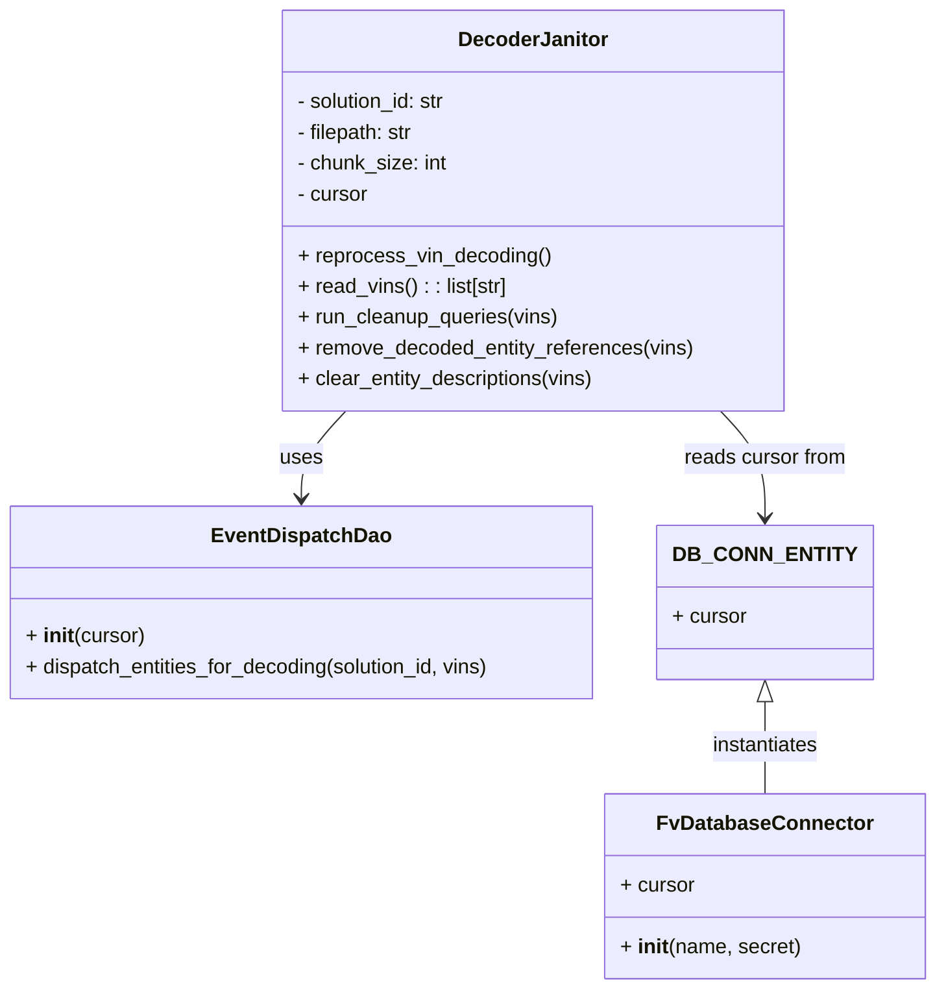

# Diagram: entity_core/entity_service/entity_service_scripts/backfill_decoding_requeue.py


> Auto-generated by Obscura crawlers

## Diagram 1



### SVG

<svg id="container" width="722.43359375" xmlns="http://www.w3.org/2000/svg" class="classDiagram" height="770" viewBox="0 0 722.43359375 770" role="graphics-document document" aria-roledescription="class"><style>#container{font-family:"trebuchet ms",verdana,arial,sans-serif;font-size:16px;fill:#333;}@keyframes edge-animation-frame{from{stroke-dashoffset:0;}}@keyframes dash{to{stroke-dashoffset:0;}}#container .edge-animation-slow{stroke-dasharray:9,5!important;stroke-dashoffset:900;animation:dash 50s linear infinite;stroke-linecap:round;}#container .edge-animation-fast{stroke-dasharray:9,5!important;stroke-dashoffset:900;animation:dash 20s linear infinite;stroke-linecap:round;}#container .error-icon{fill:#552222;}#container .error-text{fill:#552222;stroke:#552222;}#container .edge-thickness-normal{stroke-width:1px;}#container .edge-thickness-thick{stroke-width:3.5px;}#container .edge-pattern-solid{stroke-dasharray:0;}#container .edge-thickness-invisible{stroke-width:0;fill:none;}#container .edge-pattern-dashed{stroke-dasharray:3;}#container .edge-pattern-dotted{stroke-dasharray:2;}#container .marker{fill:#333333;stroke:#333333;}#container .marker.cross{stroke:#333333;}#container svg{font-family:"trebuchet ms",verdana,arial,sans-serif;font-size:16px;}#container p{margin:0;}#container g.classGroup text{fill:#9370DB;stroke:none;font-family:"trebuchet ms",verdana,arial,sans-serif;font-size:10px;}#container g.classGroup text .title{font-weight:bolder;}#container .nodeLabel,#container .edgeLabel{color:#131300;}#container .edgeLabel .label rect{fill:#ECECFF;}#container .label text{fill:#131300;}#container .labelBkg{background:#ECECFF;}#container .edgeLabel .label span{background:#ECECFF;}#container .classTitle{font-weight:bolder;}#container .node rect,#container .node circle,#container .node ellipse,#container .node polygon,#container .node path{fill:#ECECFF;stroke:#9370DB;stroke-width:1px;}#container .divider{stroke:#9370DB;stroke-width:1;}#container g.clickable{cursor:pointer;}#container g.classGroup rect{fill:#ECECFF;stroke:#9370DB;}#container g.classGroup line{stroke:#9370DB;stroke-width:1;}#container .classLabel .box{stroke:none;stroke-width:0;fill:#ECECFF;opacity:0.5;}#container .classLabel .label{fill:#9370DB;font-size:10px;}#container .relation{stroke:#333333;stroke-width:1;fill:none;}#container .dashed-line{stroke-dasharray:3;}#container .dotted-line{stroke-dasharray:1 2;}#container #compositionStart,#container .composition{fill:#333333!important;stroke:#333333!important;stroke-width:1;}#container #compositionEnd,#container .composition{fill:#333333!important;stroke:#333333!important;stroke-width:1;}#container #dependencyStart,#container .dependency{fill:#333333!important;stroke:#333333!important;stroke-width:1;}#container #dependencyStart,#container .dependency{fill:#333333!important;stroke:#333333!important;stroke-width:1;}#container #extensionStart,#container .extension{fill:transparent!important;stroke:#333333!important;stroke-width:1;}#container #extensionEnd,#container .extension{fill:transparent!important;stroke:#333333!important;stroke-width:1;}#container #aggregationStart,#container .aggregation{fill:transparent!important;stroke:#333333!important;stroke-width:1;}#container #aggregationEnd,#container .aggregation{fill:transparent!important;stroke:#333333!important;stroke-width:1;}#container #lollipopStart,#container .lollipop{fill:#ECECFF!important;stroke:#333333!important;stroke-width:1;}#container #lollipopEnd,#container .lollipop{fill:#ECECFF!important;stroke:#333333!important;stroke-width:1;}#container .edgeTerminals{font-size:11px;line-height:initial;}#container .classTitleText{text-anchor:middle;font-size:18px;fill:#333;}#container .label-icon{display:inline-block;height:1em;overflow:visible;vertical-align:-0.125em;}#container .node .label-icon path{fill:currentColor;stroke:revert;stroke-width:revert;}#container :root{--mermaid-font-family:"trebuchet ms",verdana,arial,sans-serif;}</style><g><defs><marker id="container_class-aggregationStart" class="marker aggregation class" refX="18" refY="7" markerWidth="190" markerHeight="240" orient="auto"><path d="M 18,7 L9,13 L1,7 L9,1 Z"></path></marker></defs><defs><marker id="container_class-aggregationEnd" class="marker aggregation class" refX="1" refY="7" markerWidth="20" markerHeight="28" orient="auto"><path d="M 18,7 L9,13 L1,7 L9,1 Z"></path></marker></defs><defs><marker id="container_class-extensionStart" class="marker extension class" refX="18" refY="7" markerWidth="190" markerHeight="240" orient="auto"><path d="M 1,7 L18,13 V 1 Z"></path></marker></defs><defs><marker id="container_class-extensionEnd" class="marker extension class" refX="1" refY="7" markerWidth="20" markerHeight="28" orient="auto"><path d="M 1,1 V 13 L18,7 Z"></path></marker></defs><defs><marker id="container_class-compositionStart" class="marker composition class" refX="18" refY="7" markerWidth="190" markerHeight="240" orient="auto"><path d="M 18,7 L9,13 L1,7 L9,1 Z"></path></marker></defs><defs><marker id="container_class-compositionEnd" class="marker composition class" refX="1" refY="7" markerWidth="20" markerHeight="28" orient="auto"><path d="M 18,7 L9,13 L1,7 L9,1 Z"></path></marker></defs><defs><marker id="container_class-dependencyStart" class="marker dependency class" refX="6" refY="7" markerWidth="190" markerHeight="240" orient="auto"><path d="M 5,7 L9,13 L1,7 L9,1 Z"></path></marker></defs><defs><marker id="container_class-dependencyEnd" class="marker dependency class" refX="13" refY="7" markerWidth="20" markerHeight="28" orient="auto"><path d="M 18,7 L9,13 L14,7 L9,1 Z"></path></marker></defs><defs><marker id="container_class-lollipopStart" class="marker lollipop class" refX="13" refY="7" markerWidth="190" markerHeight="240" orient="auto"><circle stroke="black" fill="transparent" cx="7" cy="7" r="6"></circle></marker></defs><defs><marker id="container_class-lollipopEnd" class="marker lollipop class" refX="1" refY="7" markerWidth="190" markerHeight="240" orient="auto"><circle stroke="black" fill="transparent" cx="7" cy="7" r="6"></circle></marker></defs><g class="root"><g class="clusters"></g><g class="edgePaths"><path d="M271.674,320L265.996,326.167C260.318,332.333,248.962,344.667,243.284,356C237.605,367.333,237.605,377.667,237.605,382.833L237.605,388" id="id_DecoderJanitor_EventDispatchDao_1" class="edge-thickness-normal edge-pattern-solid relation" style=";;;" data-edge="true" data-et="edge" data-id="id_DecoderJanitor_EventDispatchDao_1" data-points="W3sieCI6MjcxLjY3NDAzMDUyMTM3MzEsInkiOjMyMH0seyJ4IjoyMzcuNjA1NDY4NzUsInkiOjM1N30seyJ4IjoyMzcuNjA1NDY4NzUsInkiOjM5NH1d" marker-end="url(#container_class-dependencyEnd)"></path><path d="M558.955,320L564.633,326.167C570.311,332.333,581.667,344.667,587.345,358.5C593.023,372.333,593.023,387.667,593.023,395.333L593.023,403" id="id_DecoderJanitor_DB_CONN_ENTITY_2" class="edge-thickness-normal edge-pattern-solid relation" style=";;;" data-edge="true" data-et="edge" data-id="id_DecoderJanitor_DB_CONN_ENTITY_2" data-points="W3sieCI6NTU4Ljk1NDg3NTcyODYyNjksInkiOjMyMH0seyJ4Ijo1OTMuMDIzNDM3NSwieSI6MzU3fSx7IngiOjU5My4wMjM0Mzc1LCJ5Ijo0MDl9XQ==" marker-end="url(#container_class-dependencyEnd)"></path><path d="M593.023,546.25L593.023,552.042C593.023,557.833,593.023,569.417,593.023,581.375C593.023,593.333,593.023,605.667,593.023,611.833L593.023,618" id="id_DB_CONN_ENTITY_FvDatabaseConnector_3" class="edge-thickness-normal edge-pattern-solid relation" style=";;;" data-edge="true" data-et="edge" data-id="id_DB_CONN_ENTITY_FvDatabaseConnector_3" data-points="W3sieCI6NTkzLjAyMzQzNzUsInkiOjUyOX0seyJ4Ijo1OTMuMDIzNDM3NSwieSI6NTgxfSx7IngiOjU5My4wMjM0Mzc1LCJ5Ijo2MTh9XQ==" marker-start="url(#container_class-extensionStart)"></path></g><g class="edgeLabels"><g class="edgeLabel" transform="translate(237.60546875, 357)"><g class="label" data-id="id_DecoderJanitor_EventDispatchDao_1" transform="translate(-16.4921875, -12)"><foreignObject width="32.984375" height="24"><div xmlns="http://www.w3.org/1999/xhtml" class="labelBkg" style="display: table-cell; white-space: nowrap; line-height: 1.5; max-width: 200px; text-align: center;"><span class="edgeLabel"><p>uses</p></span></div></foreignObject></g></g><g class="edgeLabel" transform="translate(593.0234375, 357)"><g class="label" data-id="id_DecoderJanitor_DB_CONN_ENTITY_2" transform="translate(-64.1640625, -12)"><foreignObject width="128.328125" height="24"><div xmlns="http://www.w3.org/1999/xhtml" class="labelBkg" style="display: table-cell; white-space: nowrap; line-height: 1.5; max-width: 200px; text-align: center;"><span class="edgeLabel"><p>reads cursor from</p></span></div></foreignObject></g></g><g class="edgeLabel" transform="translate(593.0234375, 581)"><g class="label" data-id="id_DB_CONN_ENTITY_FvDatabaseConnector_3" transform="translate(-42.9140625, -12)"><foreignObject width="85.828125" height="24"><div xmlns="http://www.w3.org/1999/xhtml" class="labelBkg" style="display: table-cell; white-space: nowrap; line-height: 1.5; max-width: 200px; text-align: center;"><span class="edgeLabel"><p>instantiates</p></span></div></foreignObject></g></g></g><g class="nodes"><g class="node default" id="classId-DecoderJanitor-0" transform="translate(415.314453125, 164)"><g class="basic label-container"><path d="M-194.359375 -156 L194.359375 -156 L194.359375 156 L-194.359375 156" stroke="none" stroke-width="0" fill="#ECECFF" style=""></path><path d="M-194.359375 -156 C-83.03966294446666 -156, 28.28004911106669 -156, 194.359375 -156 M-194.359375 -156 C-42.580995418095256 -156, 109.19738416380949 -156, 194.359375 -156 M194.359375 -156 C194.359375 -53.88075980253798, 194.359375 48.23848039492404, 194.359375 156 M194.359375 -156 C194.359375 -56.13552704232744, 194.359375 43.72894591534512, 194.359375 156 M194.359375 156 C91.15617851189069 156, -12.047017976218626 156, -194.359375 156 M194.359375 156 C52.136170155216575 156, -90.08703468956685 156, -194.359375 156 M-194.359375 156 C-194.359375 65.33171646325296, -194.359375 -25.33656707349408, -194.359375 -156 M-194.359375 156 C-194.359375 71.71998152097902, -194.359375 -12.560036958041962, -194.359375 -156" stroke="#9370DB" stroke-width="1.3" fill="none" stroke-dasharray="0 0" style=""></path></g><g class="annotation-group text" transform="translate(0, -132)"></g><g class="label-group text" transform="translate(-55.015625, -132)"><g class="label" style="font-weight: bolder" transform="translate(0,-12)"><foreignObject width="110.03125" height="24"><div xmlns="http://www.w3.org/1999/xhtml" style="display: table-cell; white-space: nowrap; line-height: 1.5; max-width: 160px; text-align: center;"><span class="nodeLabel markdown-node-label" style=""><p>DecoderJanitor</p></span></div></foreignObject></g></g><g class="members-group text" transform="translate(-182.359375, -84)"><g class="label" style="" transform="translate(0,-12)"><foreignObject width="120.421875" height="24"><div xmlns="http://www.w3.org/1999/xhtml" style="display: table-cell; white-space: nowrap; line-height: 1.5; max-width: 179px; text-align: center;"><span class="nodeLabel markdown-node-label" style=""><p>- solution_id: str</p></span></div></foreignObject></g><g class="label" style="" transform="translate(0,12)"><foreignObject width="93.921875" height="24"><div xmlns="http://www.w3.org/1999/xhtml" style="display: table-cell; white-space: nowrap; line-height: 1.5; max-width: 152px; text-align: center;"><span class="nodeLabel markdown-node-label" style=""><p>- filepath: str</p></span></div></foreignObject></g><g class="label" style="" transform="translate(0,36)"><foreignObject width="118.25" height="24"><div xmlns="http://www.w3.org/1999/xhtml" style="display: table-cell; white-space: nowrap; line-height: 1.5; max-width: 176px; text-align: center;"><span class="nodeLabel markdown-node-label" style=""><p>- chunk_size: int</p></span></div></foreignObject></g><g class="label" style="" transform="translate(0,60)"><foreignObject width="56.421875" height="24"><div xmlns="http://www.w3.org/1999/xhtml" style="display: table-cell; white-space: nowrap; line-height: 1.5; max-width: 115px; text-align: center;"><span class="nodeLabel markdown-node-label" style=""><p>- cursor</p></span></div></foreignObject></g></g><g class="methods-group text" transform="translate(-182.359375, 36)"><g class="label" style="" transform="translate(0,-12)"><foreignObject width="196.40625" height="24"><div xmlns="http://www.w3.org/1999/xhtml" style="display: table-cell; white-space: nowrap; line-height: 1.5; max-width: 254px; text-align: center;"><span class="nodeLabel markdown-node-label" style=""><p>+ reprocess_vin_decoding()</p></span></div></foreignObject></g><g class="label" style="" transform="translate(0,12)"><foreignObject width="164.78125" height="24"><div xmlns="http://www.w3.org/1999/xhtml" style="display: table-cell; white-space: nowrap; line-height: 1.5; max-width: 222px; text-align: center;"><span class="nodeLabel markdown-node-label" style=""><p>+ read_vins() : : list[str]</p></span></div></foreignObject></g><g class="label" style="" transform="translate(0,36)"><foreignObject width="204.5625" height="24"><div xmlns="http://www.w3.org/1999/xhtml" style="display: table-cell; white-space: nowrap; line-height: 1.5; max-width: 262px; text-align: center;"><span class="nodeLabel markdown-node-label" style=""><p>+ run_cleanup_queries(vins)</p></span></div></foreignObject></g><g class="label" style="" transform="translate(0,60)"><foreignObject width="309.703125" height="24"><div xmlns="http://www.w3.org/1999/xhtml" style="display: table-cell; white-space: nowrap; line-height: 1.5; max-width: 367px; text-align: center;"><span class="nodeLabel markdown-node-label" style=""><p>+ remove_decoded_entity_references(vins)</p></span></div></foreignObject></g><g class="label" style="" transform="translate(0,84)"><foreignObject width="233.796875" height="24"><div xmlns="http://www.w3.org/1999/xhtml" style="display: table-cell; white-space: nowrap; line-height: 1.5; max-width: 291px; text-align: center;"><span class="nodeLabel markdown-node-label" style=""><p>+ clear_entity_descriptions(vins)</p></span></div></foreignObject></g></g><g class="divider" style=""><path d="M-194.359375 -108 C-105.17599090151877 -108, -15.992606803037546 -108, 194.359375 -108 M-194.359375 -108 C-78.80017248503516 -108, 36.759030029929676 -108, 194.359375 -108" stroke="#9370DB" stroke-width="1.3" fill="none" stroke-dasharray="0 0" style=""></path></g><g class="divider" style=""><path d="M-194.359375 12 C-45.55864425787544 12, 103.24208648424911 12, 194.359375 12 M-194.359375 12 C-58.44991651474223 12, 77.45954197051555 12, 194.359375 12" stroke="#9370DB" stroke-width="1.3" fill="none" stroke-dasharray="0 0" style=""></path></g></g><g class="node default" id="classId-EventDispatchDao-1" transform="translate(237.60546875, 469)"><g class="basic label-container"><path d="M-229.60546875 -75 L229.60546875 -75 L229.60546875 75 L-229.60546875 75" stroke="none" stroke-width="0" fill="#ECECFF" style=""></path><path d="M-229.60546875 -75 C-62.58794942314745 -75, 104.4295699037051 -75, 229.60546875 -75 M-229.60546875 -75 C-83.27178882058004 -75, 63.061891108839916 -75, 229.60546875 -75 M229.60546875 -75 C229.60546875 -18.157633249323943, 229.60546875 38.68473350135211, 229.60546875 75 M229.60546875 -75 C229.60546875 -21.440559806491954, 229.60546875 32.11888038701609, 229.60546875 75 M229.60546875 75 C135.00560651399016 75, 40.40574427798032 75, -229.60546875 75 M229.60546875 75 C111.6900118185948 75, -6.225445112810405 75, -229.60546875 75 M-229.60546875 75 C-229.60546875 17.60929506381391, -229.60546875 -39.78140987237218, -229.60546875 -75 M-229.60546875 75 C-229.60546875 44.32310120564736, -229.60546875 13.64620241129473, -229.60546875 -75" stroke="#9370DB" stroke-width="1.3" fill="none" stroke-dasharray="0 0" style=""></path></g><g class="annotation-group text" transform="translate(0, -51)"></g><g class="label-group text" transform="translate(-66.1953125, -51)"><g class="label" style="font-weight: bolder" transform="translate(0,-12)"><foreignObject width="132.390625" height="24"><div xmlns="http://www.w3.org/1999/xhtml" style="display: table-cell; white-space: nowrap; line-height: 1.5; max-width: 181px; text-align: center;"><span class="nodeLabel markdown-node-label" style=""><p>EventDispatchDao</p></span></div></foreignObject></g></g><g class="members-group text" transform="translate(-217.60546875, -3)"></g><g class="methods-group text" transform="translate(-217.60546875, 27)"><g class="label" style="" transform="translate(0,-12)"><foreignObject width="92.78125" height="24"><div xmlns="http://www.w3.org/1999/xhtml" style="display: table-cell; white-space: nowrap; line-height: 1.5; max-width: 183px; text-align: center;"><span class="nodeLabel markdown-node-label" style=""><p>+ <strong>init</strong>(cursor)</p></span></div></foreignObject></g><g class="label" style="" transform="translate(0,12)"><foreignObject width="369.015625" height="24"><div xmlns="http://www.w3.org/1999/xhtml" style="display: table-cell; white-space: nowrap; line-height: 1.5; max-width: 426px; text-align: center;"><span class="nodeLabel markdown-node-label" style=""><p>+ dispatch_entities_for_decoding(solution_id, vins)</p></span></div></foreignObject></g></g><g class="divider" style=""><path d="M-229.60546875 -27 C-77.82713797959553 -27, 73.95119279080893 -27, 229.60546875 -27 M-229.60546875 -27 C-73.66861709703807 -27, 82.26823455592387 -27, 229.60546875 -27" stroke="#9370DB" stroke-width="1.3" fill="none" stroke-dasharray="0 0" style=""></path></g><g class="divider" style=""><path d="M-229.60546875 -3 C-55.853721718976544 -3, 117.89802531204691 -3, 229.60546875 -3 M-229.60546875 -3 C-93.12148492479275 -3, 43.362498900414494 -3, 229.60546875 -3" stroke="#9370DB" stroke-width="1.3" fill="none" stroke-dasharray="0 0" style=""></path></g></g><g class="node default" id="classId-FvDatabaseConnector-2" transform="translate(593.0234375, 690)"><g class="basic label-container"><path d="M-121.41015625 -72 L121.41015625 -72 L121.41015625 72 L-121.41015625 72" stroke="none" stroke-width="0" fill="#ECECFF" style=""></path><path d="M-121.41015625 -72 C-44.107348705336605 -72, 33.19545883932679 -72, 121.41015625 -72 M-121.41015625 -72 C-61.92992358340149 -72, -2.449690916802979 -72, 121.41015625 -72 M121.41015625 -72 C121.41015625 -27.05139061226945, 121.41015625 17.8972187754611, 121.41015625 72 M121.41015625 -72 C121.41015625 -19.112763373659142, 121.41015625 33.774473252681716, 121.41015625 72 M121.41015625 72 C66.51416587698279 72, 11.618175503965588 72, -121.41015625 72 M121.41015625 72 C32.746554917692876 72, -55.91704641461425 72, -121.41015625 72 M-121.41015625 72 C-121.41015625 23.428966706251728, -121.41015625 -25.142066587496544, -121.41015625 -72 M-121.41015625 72 C-121.41015625 20.98870875026079, -121.41015625 -30.022582499478418, -121.41015625 -72" stroke="#9370DB" stroke-width="1.3" fill="none" stroke-dasharray="0 0" style=""></path></g><g class="annotation-group text" transform="translate(0, -48)"></g><g class="label-group text" transform="translate(-79.3046875, -48)"><g class="label" style="font-weight: bolder" transform="translate(0,-12)"><foreignObject width="158.609375" height="24"><div xmlns="http://www.w3.org/1999/xhtml" style="display: table-cell; white-space: nowrap; line-height: 1.5; max-width: 207px; text-align: center;"><span class="nodeLabel markdown-node-label" style=""><p>FvDatabaseConnector</p></span></div></foreignObject></g></g><g class="members-group text" transform="translate(-109.41015625, 0)"><g class="label" style="" transform="translate(0,-12)"><foreignObject width="57.953125" height="24"><div xmlns="http://www.w3.org/1999/xhtml" style="display: table-cell; white-space: nowrap; line-height: 1.5; max-width: 116px; text-align: center;"><span class="nodeLabel markdown-node-label" style=""><p>+ cursor</p></span></div></foreignObject></g></g><g class="methods-group text" transform="translate(-109.41015625, 48)"><g class="label" style="" transform="translate(0,-12)"><foreignObject width="139.515625" height="24"><div xmlns="http://www.w3.org/1999/xhtml" style="display: table-cell; white-space: nowrap; line-height: 1.5; max-width: 230px; text-align: center;"><span class="nodeLabel markdown-node-label" style=""><p>+ <strong>init</strong>(name, secret)</p></span></div></foreignObject></g></g><g class="divider" style=""><path d="M-121.41015625 -24 C-47.19477414344162 -24, 27.02060796311676 -24, 121.41015625 -24 M-121.41015625 -24 C-54.7713515124136 -24, 11.867453225172795 -24, 121.41015625 -24" stroke="#9370DB" stroke-width="1.3" fill="none" stroke-dasharray="0 0" style=""></path></g><g class="divider" style=""><path d="M-121.41015625 24 C-29.577214709302993 24, 62.255726831394014 24, 121.41015625 24 M-121.41015625 24 C-43.815717637328945 24, 33.77872097534211 24, 121.41015625 24" stroke="#9370DB" stroke-width="1.3" fill="none" stroke-dasharray="0 0" style=""></path></g></g><g class="node default" id="classId-DB_CONN_ENTITY-3" transform="translate(593.0234375, 469)"><g class="basic label-container"><path d="M-75.8125 -60 L75.8125 -60 L75.8125 60 L-75.8125 60" stroke="none" stroke-width="0" fill="#ECECFF" style=""></path><path d="M-75.8125 -60 C-15.767404118301485 -60, 44.27769176339703 -60, 75.8125 -60 M-75.8125 -60 C-28.29951709869062 -60, 19.213465802618757 -60, 75.8125 -60 M75.8125 -60 C75.8125 -16.264376297464423, 75.8125 27.471247405071153, 75.8125 60 M75.8125 -60 C75.8125 -28.5925291892382, 75.8125 2.8149416215236016, 75.8125 60 M75.8125 60 C33.08060752252077 60, -9.651284954958456 60, -75.8125 60 M75.8125 60 C40.12686848110379 60, 4.441236962207583 60, -75.8125 60 M-75.8125 60 C-75.8125 33.44726912468366, -75.8125 6.894538249367315, -75.8125 -60 M-75.8125 60 C-75.8125 33.485121724476876, -75.8125 6.970243448953752, -75.8125 -60" stroke="#9370DB" stroke-width="1.3" fill="none" stroke-dasharray="0 0" style=""></path></g><g class="annotation-group text" transform="translate(0, -36)"></g><g class="label-group text" transform="translate(-63.8125, -36)"><g class="label" style="font-weight: bolder" transform="translate(0,-12)"><foreignObject width="127.625" height="24"><div xmlns="http://www.w3.org/1999/xhtml" style="display: table-cell; white-space: nowrap; line-height: 1.5; max-width: 177px; text-align: center;"><span class="nodeLabel markdown-node-label" style=""><p>DB_CONN_ENTITY</p></span></div></foreignObject></g></g><g class="members-group text" transform="translate(-63.8125, 12)"><g class="label" style="" transform="translate(0,-12)"><foreignObject width="57.953125" height="24"><div xmlns="http://www.w3.org/1999/xhtml" style="display: table-cell; white-space: nowrap; line-height: 1.5; max-width: 116px; text-align: center;"><span class="nodeLabel markdown-node-label" style=""><p>+ cursor</p></span></div></foreignObject></g></g><g class="methods-group text" transform="translate(-63.8125, 60)"></g><g class="divider" style=""><path d="M-75.8125 -12 C-34.575457292264 -12, 6.661585415472004 -12, 75.8125 -12 M-75.8125 -12 C-38.89101970674593 -12, -1.9695394134918587 -12, 75.8125 -12" stroke="#9370DB" stroke-width="1.3" fill="none" stroke-dasharray="0 0" style=""></path></g><g class="divider" style=""><path d="M-75.8125 36 C-29.997589727728467 36, 15.817320544543065 36, 75.8125 36 M-75.8125 36 C-40.90394684094213 36, -5.995393681884266 36, 75.8125 36" stroke="#9370DB" stroke-width="1.3" fill="none" stroke-dasharray="0 0" style=""></path></g></g></g></g></g></svg>

## Diagram 2

```mermaid
flowchart TD
Start([Start]) --> ParseArgs[parse_args()]
ParseArgs --> CreateJanitor[Create DecoderJanitor(solution_id, filepath)]
CreateJanitor --> ReadVins[read_vins() returns vins list]
ReadVins --> Chunking[Chunk vins with boltons.chunked(chunk_size)]
Chunking --> ForEachChunk{For each chunk}
ForEachChunk --> RunCleanup[run_cleanup_queries(current_chunk)]
subgraph CleanupQueries
    RunCleanup --> RemoveRefs[remove_decoded_entity_references(vins)]
    RunCleanup --> ClearDesc[clear_entity_descriptions(vins)]
    RunCleanup --> Dispatch[EventDispatchDao(cursor).dispatch_entities_for_decoding(solution_id, vins)]
end
RunCleanup --> ComputePercent[Compute and print percentage_complete]
ComputePercent --> LoopBack{More chunks?}
LoopBack -->|yes| ForEachChunk
LoopBack -->|no| End([End])
```

> SVG rendering failed for this diagram.
