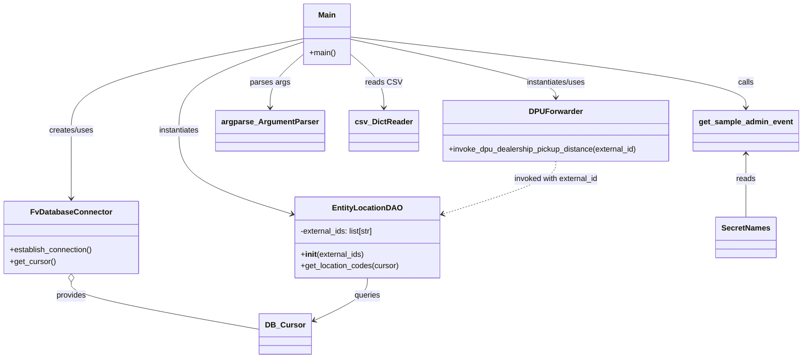

# Diagram: entity_core/entity_service/entity_service_scripts/backfill_dpu_dealership_distance.py


> Auto-generated by Obscura crawlers

## Diagram 1



### SVG

<svg id="container" width="1637.431640625" xmlns="http://www.w3.org/2000/svg" class="classDiagram" height="742" viewBox="0 0 1637.431640625 742" role="graphics-document document" aria-roledescription="class"><style>#container{font-family:"trebuchet ms",verdana,arial,sans-serif;font-size:16px;fill:#333;}@keyframes edge-animation-frame{from{stroke-dashoffset:0;}}@keyframes dash{to{stroke-dashoffset:0;}}#container .edge-animation-slow{stroke-dasharray:9,5!important;stroke-dashoffset:900;animation:dash 50s linear infinite;stroke-linecap:round;}#container .edge-animation-fast{stroke-dasharray:9,5!important;stroke-dashoffset:900;animation:dash 20s linear infinite;stroke-linecap:round;}#container .error-icon{fill:#552222;}#container .error-text{fill:#552222;stroke:#552222;}#container .edge-thickness-normal{stroke-width:1px;}#container .edge-thickness-thick{stroke-width:3.5px;}#container .edge-pattern-solid{stroke-dasharray:0;}#container .edge-thickness-invisible{stroke-width:0;fill:none;}#container .edge-pattern-dashed{stroke-dasharray:3;}#container .edge-pattern-dotted{stroke-dasharray:2;}#container .marker{fill:#333333;stroke:#333333;}#container .marker.cross{stroke:#333333;}#container svg{font-family:"trebuchet ms",verdana,arial,sans-serif;font-size:16px;}#container p{margin:0;}#container g.classGroup text{fill:#9370DB;stroke:none;font-family:"trebuchet ms",verdana,arial,sans-serif;font-size:10px;}#container g.classGroup text .title{font-weight:bolder;}#container .nodeLabel,#container .edgeLabel{color:#131300;}#container .edgeLabel .label rect{fill:#ECECFF;}#container .label text{fill:#131300;}#container .labelBkg{background:#ECECFF;}#container .edgeLabel .label span{background:#ECECFF;}#container .classTitle{font-weight:bolder;}#container .node rect,#container .node circle,#container .node ellipse,#container .node polygon,#container .node path{fill:#ECECFF;stroke:#9370DB;stroke-width:1px;}#container .divider{stroke:#9370DB;stroke-width:1;}#container g.clickable{cursor:pointer;}#container g.classGroup rect{fill:#ECECFF;stroke:#9370DB;}#container g.classGroup line{stroke:#9370DB;stroke-width:1;}#container .classLabel .box{stroke:none;stroke-width:0;fill:#ECECFF;opacity:0.5;}#container .classLabel .label{fill:#9370DB;font-size:10px;}#container .relation{stroke:#333333;stroke-width:1;fill:none;}#container .dashed-line{stroke-dasharray:3;}#container .dotted-line{stroke-dasharray:1 2;}#container #compositionStart,#container .composition{fill:#333333!important;stroke:#333333!important;stroke-width:1;}#container #compositionEnd,#container .composition{fill:#333333!important;stroke:#333333!important;stroke-width:1;}#container #dependencyStart,#container .dependency{fill:#333333!important;stroke:#333333!important;stroke-width:1;}#container #dependencyStart,#container .dependency{fill:#333333!important;stroke:#333333!important;stroke-width:1;}#container #extensionStart,#container .extension{fill:transparent!important;stroke:#333333!important;stroke-width:1;}#container #extensionEnd,#container .extension{fill:transparent!important;stroke:#333333!important;stroke-width:1;}#container #aggregationStart,#container .aggregation{fill:transparent!important;stroke:#333333!important;stroke-width:1;}#container #aggregationEnd,#container .aggregation{fill:transparent!important;stroke:#333333!important;stroke-width:1;}#container #lollipopStart,#container .lollipop{fill:#ECECFF!important;stroke:#333333!important;stroke-width:1;}#container #lollipopEnd,#container .lollipop{fill:#ECECFF!important;stroke:#333333!important;stroke-width:1;}#container .edgeTerminals{font-size:11px;line-height:initial;}#container .classTitleText{text-anchor:middle;font-size:18px;fill:#333;}#container .label-icon{display:inline-block;height:1em;overflow:visible;vertical-align:-0.125em;}#container .node .label-icon path{fill:currentColor;stroke:revert;stroke-width:revert;}#container :root{--mermaid-font-family:"trebuchet ms",verdana,arial,sans-serif;}</style><g><defs><marker id="container_class-aggregationStart" class="marker aggregation class" refX="18" refY="7" markerWidth="190" markerHeight="240" orient="auto"><path d="M 18,7 L9,13 L1,7 L9,1 Z"></path></marker></defs><defs><marker id="container_class-aggregationEnd" class="marker aggregation class" refX="1" refY="7" markerWidth="20" markerHeight="28" orient="auto"><path d="M 18,7 L9,13 L1,7 L9,1 Z"></path></marker></defs><defs><marker id="container_class-extensionStart" class="marker extension class" refX="18" refY="7" markerWidth="190" markerHeight="240" orient="auto"><path d="M 1,7 L18,13 V 1 Z"></path></marker></defs><defs><marker id="container_class-extensionEnd" class="marker extension class" refX="1" refY="7" markerWidth="20" markerHeight="28" orient="auto"><path d="M 1,1 V 13 L18,7 Z"></path></marker></defs><defs><marker id="container_class-compositionStart" class="marker composition class" refX="18" refY="7" markerWidth="190" markerHeight="240" orient="auto"><path d="M 18,7 L9,13 L1,7 L9,1 Z"></path></marker></defs><defs><marker id="container_class-compositionEnd" class="marker composition class" refX="1" refY="7" markerWidth="20" markerHeight="28" orient="auto"><path d="M 18,7 L9,13 L1,7 L9,1 Z"></path></marker></defs><defs><marker id="container_class-dependencyStart" class="marker dependency class" refX="6" refY="7" markerWidth="190" markerHeight="240" orient="auto"><path d="M 5,7 L9,13 L1,7 L9,1 Z"></path></marker></defs><defs><marker id="container_class-dependencyEnd" class="marker dependency class" refX="13" refY="7" markerWidth="20" markerHeight="28" orient="auto"><path d="M 18,7 L9,13 L14,7 L9,1 Z"></path></marker></defs><defs><marker id="container_class-lollipopStart" class="marker lollipop class" refX="13" refY="7" markerWidth="190" markerHeight="240" orient="auto"><circle stroke="black" fill="transparent" cx="7" cy="7" r="6"></circle></marker></defs><defs><marker id="container_class-lollipopEnd" class="marker lollipop class" refX="1" refY="7" markerWidth="190" markerHeight="240" orient="auto"><circle stroke="black" fill="transparent" cx="7" cy="7" r="6"></circle></marker></defs><g class="root"><g class="clusters"></g><g class="edgePaths"><path d="M619.072,80.235L540.274,95.362C461.477,110.49,303.881,140.745,225.083,172.539C146.285,204.333,146.285,237.667,146.285,271C146.285,304.333,146.285,337.667,146.285,361C146.285,384.333,146.285,397.667,146.285,404.333L146.285,411" id="id_Main_FvDatabaseConnector_1" class="edge-thickness-normal edge-pattern-solid relation" style=";;;" data-edge="true" data-et="edge" data-id="id_Main_FvDatabaseConnector_1" data-points="W3sieCI6NjE5LjA3MjI2NTYyNSwieSI6ODAuMjM0NTE4ODMyMzc0MDZ9LHsieCI6MTQ2LjI4NTE1NjI1LCJ5IjoxNzF9LHsieCI6MTQ2LjI4NTE1NjI1LCJ5IjoyNzF9LHsieCI6MTQ2LjI4NTE1NjI1LCJ5IjozNzF9LHsieCI6MTQ2LjI4NTE1NjI1LCJ5Ijo0MTd9XQ==" marker-end="url(#container_class-dependencyEnd)"></path><path d="M619.072,113.704L608.316,123.253C597.559,132.802,576.046,151.901,565.29,170.117C554.533,188.333,554.533,205.667,554.533,214.333L554.533,223" id="id_Main_argparse_ArgumentParser_2" class="edge-thickness-normal edge-pattern-solid relation" style=";;;" data-edge="true" data-et="edge" data-id="id_Main_argparse_ArgumentParser_2" data-points="W3sieCI6NjE5LjA3MjI2NTYyNSwieSI6MTEzLjcwMzU2NDk4ODIwOTE4fSx7IngiOjU1NC41MzMyMDMxMjUsInkiOjE3MX0seyJ4Ijo1NTQuNTMzMjAzMTI1LCJ5IjoyMjl9XQ==" marker-end="url(#container_class-dependencyEnd)"></path><path d="M715.275,113.704L726.032,123.253C736.788,132.802,758.301,151.901,769.058,170.117C779.814,188.333,779.814,205.667,779.814,214.333L779.814,223" id="id_Main_csv_DictReader_3" class="edge-thickness-normal edge-pattern-solid relation" style=";;;" data-edge="true" data-et="edge" data-id="id_Main_csv_DictReader_3" data-points="W3sieCI6NzE1LjI3NTM5MDYyNSwieSI6MTEzLjcwMzU2NDk4ODIwOTE4fSx7IngiOjc3OS44MTQ0NTMxMjUsInkiOjE3MX0seyJ4Ijo3NzkuODE0NDUzMTI1LCJ5IjoyMjl9XQ==" marker-end="url(#container_class-dependencyEnd)"></path><path d="M619.072,87.146L577.436,101.121C535.799,115.097,452.525,143.049,410.889,173.691C369.252,204.333,369.252,237.667,369.252,271C369.252,304.333,369.252,337.667,407.256,366.374C445.261,395.082,521.269,419.164,559.274,431.206L597.278,443.247" id="id_Main_EntityLocationDAO_4" class="edge-thickness-normal edge-pattern-solid relation" style=";;;" data-edge="true" data-et="edge" data-id="id_Main_EntityLocationDAO_4" data-points="W3sieCI6NjE5LjA3MjI2NTYyNSwieSI6ODcuMTQ1Njk2NzUzNTUzMjd9LHsieCI6MzY5LjI1MTk1MzEyNSwieSI6MTcxfSx7IngiOjM2OS4yNTE5NTMxMjUsInkiOjI3MX0seyJ4IjozNjkuMjUxOTUzMTI1LCJ5IjozNzF9LHsieCI6NjAyLjk5ODA0Njg3NSwieSI6NDQ1LjA1ODkyNTgxMzQxMzV9XQ==" marker-end="url(#container_class-dependencyEnd)"></path><path d="M715.275,76.615L850.048,92.345C984.82,108.076,1254.364,139.538,1389.136,163.936C1523.908,188.333,1523.908,205.667,1523.908,214.333L1523.908,223" id="id_Main_get_sample_admin_event_5" class="edge-thickness-normal edge-pattern-solid relation" style=";;;" data-edge="true" data-et="edge" data-id="id_Main_get_sample_admin_event_5" data-points="W3sieCI6NzE1LjI3NTM5MDYyNSwieSI6NzYuNjE0NTI0NjMwMjI3NDJ9LHsieCI6MTUyMy45MDgyMDMxMjUsInkiOjE3MX0seyJ4IjoxNTIzLjkwODIwMzEyNSwieSI6MjI5fV0=" marker-end="url(#container_class-dependencyEnd)"></path><path d="M715.275,81.325L784.906,96.271C854.536,111.217,993.796,141.108,1063.426,161.221C1133.057,181.333,1133.057,191.667,1133.057,196.833L1133.057,202" id="id_Main_DPUForwarder_6" class="edge-thickness-normal edge-pattern-solid relation" style=";;;" data-edge="true" data-et="edge" data-id="id_Main_DPUForwarder_6" data-points="W3sieCI6NzE1LjI3NTM5MDYyNSwieSI6ODEuMzI0ODIwMTQ5OTE2OTl9LHsieCI6MTEzMy4wNTY2NDA2MjUsInkiOjE3MX0seyJ4IjoxMTMzLjA1NjY0MDYyNSwieSI6MjA4fV0=" marker-end="url(#container_class-dependencyEnd)"></path><path d="M146.285,584.25L146.285,589.042C146.285,593.833,146.285,603.417,210.771,619.875C275.257,636.334,404.228,659.668,468.714,671.335L533.199,683.002" id="id_FvDatabaseConnector_DB_Cursor_7" class="edge-thickness-normal edge-pattern-solid relation" style=";;;" data-edge="true" data-et="edge" data-id="id_FvDatabaseConnector_DB_Cursor_7" data-points="W3sieCI6MTQ2LjI4NTE1NjI1LCJ5Ijo1Njd9LHsieCI6MTQ2LjI4NTE1NjI1LCJ5Ijo2MTN9LHsieCI6NTMzLjE5OTIxODc1LCJ5Ijo2ODMuMDAxODc4NjU2NjcxfV0=" marker-start="url(#container_class-aggregationStart)"></path><path d="M751.154,576L751.154,582.167C751.154,588.333,751.154,600.667,732.312,615.682C713.469,630.698,675.784,648.395,656.941,657.244L638.099,666.093" id="id_EntityLocationDAO_DB_Cursor_8" class="edge-thickness-normal edge-pattern-solid relation" style=";;;" data-edge="true" data-et="edge" data-id="id_EntityLocationDAO_DB_Cursor_8" data-points="W3sieCI6NzUxLjE1NDI5Njg3NSwieSI6NTc2fSx7IngiOjc1MS4xNTQyOTY4NzUsInkiOjYxM30seyJ4Ijo2MzIuNjY3OTY4NzUsInkiOjY2OC42NDM2ODU2MzQzMzkxfV0=" marker-end="url(#container_class-dependencyEnd)"></path><path d="M1523.908,319L1523.908,327.667C1523.908,336.333,1523.908,353.667,1523.908,375.5C1523.908,397.333,1523.908,423.667,1523.908,436.833L1523.908,450" id="id_get_sample_admin_event_SecretNames_9" class="edge-thickness-normal edge-pattern-solid relation" style=";;;" data-edge="true" data-et="edge" data-id="id_get_sample_admin_event_SecretNames_9" data-points="W3sieCI6MTUyMy45MDgyMDMxMjUsInkiOjMxM30seyJ4IjoxNTIzLjkwODIwMzEyNSwieSI6MzcxfSx7IngiOjE1MjMuOTA4MjAzMTI1LCJ5Ijo0NTB9XQ==" marker-start="url(#container_class-dependencyStart)"></path><path d="M1133.057,334L1133.057,340.167C1133.057,346.333,1133.057,358.667,1095.052,376.874C1057.048,395.082,981.039,419.164,943.035,431.206L905.03,443.247" id="id_DPUForwarder_EntityLocationDAO_10" class="edge-thickness-normal edge-pattern-dashed relation" style=";;;" data-edge="true" data-et="edge" data-id="id_DPUForwarder_EntityLocationDAO_10" data-points="W3sieCI6MTEzMy4wNTY2NDA2MjUsInkiOjMzNH0seyJ4IjoxMTMzLjA1NjY0MDYyNSwieSI6MzcxfSx7IngiOjg5OS4zMTA1NDY4NzUsInkiOjQ0NS4wNTg5MjU4MTM0MTM1fV0=" marker-end="url(#container_class-dependencyEnd)"></path></g><g class="edgeLabels"><g class="edgeLabel" transform="translate(146.28515625, 271)"><g class="label" data-id="id_Main_FvDatabaseConnector_1" transform="translate(-46.578125, -12)"><foreignObject width="93.15625" height="24"><div xmlns="http://www.w3.org/1999/xhtml" class="labelBkg" style="display: table-cell; white-space: nowrap; line-height: 1.5; max-width: 200px; text-align: center;"><span class="edgeLabel"><p>creates/uses</p></span></div></foreignObject></g></g><g class="edgeLabel" transform="translate(554.533203125, 171)"><g class="label" data-id="id_Main_argparse_ArgumentParser_2" transform="translate(-41.109375, -12)"><foreignObject width="82.21875" height="24"><div xmlns="http://www.w3.org/1999/xhtml" class="labelBkg" style="display: table-cell; white-space: nowrap; line-height: 1.5; max-width: 200px; text-align: center;"><span class="edgeLabel"><p>parses args</p></span></div></foreignObject></g></g><g class="edgeLabel" transform="translate(779.814453125, 171)"><g class="label" data-id="id_Main_csv_DictReader_3" transform="translate(-35.171875, -12)"><foreignObject width="70.34375" height="24"><div xmlns="http://www.w3.org/1999/xhtml" class="labelBkg" style="display: table-cell; white-space: nowrap; line-height: 1.5; max-width: 200px; text-align: center;"><span class="edgeLabel"><p>reads CSV</p></span></div></foreignObject></g></g><g class="edgeLabel" transform="translate(369.251953125, 271)"><g class="label" data-id="id_Main_EntityLocationDAO_4" transform="translate(-42.9140625, -12)"><foreignObject width="85.828125" height="24"><div xmlns="http://www.w3.org/1999/xhtml" class="labelBkg" style="display: table-cell; white-space: nowrap; line-height: 1.5; max-width: 200px; text-align: center;"><span class="edgeLabel"><p>instantiates</p></span></div></foreignObject></g></g><g class="edgeLabel" transform="translate(1523.908203125, 171)"><g class="label" data-id="id_Main_get_sample_admin_event_5" transform="translate(-16.4453125, -12)"><foreignObject width="32.890625" height="24"><div xmlns="http://www.w3.org/1999/xhtml" class="labelBkg" style="display: table-cell; white-space: nowrap; line-height: 1.5; max-width: 200px; text-align: center;"><span class="edgeLabel"><p>calls</p></span></div></foreignObject></g></g><g class="edgeLabel" transform="translate(1133.056640625, 171)"><g class="label" data-id="id_Main_DPUForwarder_6" transform="translate(-63.3203125, -12)"><foreignObject width="126.640625" height="24"><div xmlns="http://www.w3.org/1999/xhtml" class="labelBkg" style="display: table-cell; white-space: nowrap; line-height: 1.5; max-width: 200px; text-align: center;"><span class="edgeLabel"><p>instantiates/uses</p></span></div></foreignObject></g></g><g class="edgeLabel" transform="translate(146.28515625, 613)"><g class="label" data-id="id_FvDatabaseConnector_DB_Cursor_7" transform="translate(-31.3125, -12)"><foreignObject width="62.625" height="24"><div xmlns="http://www.w3.org/1999/xhtml" class="labelBkg" style="display: table-cell; white-space: nowrap; line-height: 1.5; max-width: 200px; text-align: center;"><span class="edgeLabel"><p>provides</p></span></div></foreignObject></g></g><g class="edgeLabel" transform="translate(751.154296875, 613)"><g class="label" data-id="id_EntityLocationDAO_DB_Cursor_8" transform="translate(-27.2421875, -12)"><foreignObject width="54.484375" height="24"><div xmlns="http://www.w3.org/1999/xhtml" class="labelBkg" style="display: table-cell; white-space: nowrap; line-height: 1.5; max-width: 200px; text-align: center;"><span class="edgeLabel"><p>queries</p></span></div></foreignObject></g></g><g class="edgeLabel" transform="translate(1523.908203125, 371)"><g class="label" data-id="id_get_sample_admin_event_SecretNames_9" transform="translate(-20.0078125, -12)"><foreignObject width="40.015625" height="24"><div xmlns="http://www.w3.org/1999/xhtml" class="labelBkg" style="display: table-cell; white-space: nowrap; line-height: 1.5; max-width: 200px; text-align: center;"><span class="edgeLabel"><p>reads</p></span></div></foreignObject></g></g><g class="edgeLabel" transform="translate(1133.056640625, 371)"><g class="label" data-id="id_DPUForwarder_EntityLocationDAO_10" transform="translate(-89.3359375, -12)"><foreignObject width="178.671875" height="24"><div xmlns="http://www.w3.org/1999/xhtml" class="labelBkg" style="display: table-cell; white-space: nowrap; line-height: 1.5; max-width: 200px; text-align: center;"><span class="edgeLabel"><p>invoked with external_id</p></span></div></foreignObject></g></g></g><g class="nodes"><g class="node default" id="classId-Main-0" transform="translate(667.173828125, 71)"><g class="basic label-container"><path d="M-48.1015625 -63 L48.1015625 -63 L48.1015625 63 L-48.1015625 63" stroke="none" stroke-width="0" fill="#ECECFF" style=""></path><path d="M-48.1015625 -63 C-24.307022052873002 -63, -0.5124816057460038 -63, 48.1015625 -63 M-48.1015625 -63 C-14.087591544623194 -63, 19.92637941075361 -63, 48.1015625 -63 M48.1015625 -63 C48.1015625 -22.03038791201942, 48.1015625 18.939224175961158, 48.1015625 63 M48.1015625 -63 C48.1015625 -13.508848275212387, 48.1015625 35.98230344957523, 48.1015625 63 M48.1015625 63 C21.892533819084054 63, -4.316494861831892 63, -48.1015625 63 M48.1015625 63 C16.638898321085744 63, -14.823765857828512 63, -48.1015625 63 M-48.1015625 63 C-48.1015625 17.740884477756254, -48.1015625 -27.518231044487493, -48.1015625 -63 M-48.1015625 63 C-48.1015625 19.926962683448373, -48.1015625 -23.146074633103254, -48.1015625 -63" stroke="#9370DB" stroke-width="1.3" fill="none" stroke-dasharray="0 0" style=""></path></g><g class="annotation-group text" transform="translate(0, -39)"></g><g class="label-group text" transform="translate(-17.546875, -39)"><g class="label" style="font-weight: bolder" transform="translate(0,-12)"><foreignObject width="35.09375" height="24"><div xmlns="http://www.w3.org/1999/xhtml" style="display: table-cell; white-space: nowrap; line-height: 1.5; max-width: 85px; text-align: center;"><span class="nodeLabel markdown-node-label" style=""><p>Main</p></span></div></foreignObject></g></g><g class="members-group text" transform="translate(-36.1015625, 9)"></g><g class="methods-group text" transform="translate(-36.1015625, 39)"><g class="label" style="" transform="translate(0,-12)"><foreignObject width="54.65625" height="24"><div xmlns="http://www.w3.org/1999/xhtml" style="display: table-cell; white-space: nowrap; line-height: 1.5; max-width: 112px; text-align: center;"><span class="nodeLabel markdown-node-label" style=""><p>+main()</p></span></div></foreignObject></g></g><g class="divider" style=""><path d="M-48.1015625 -15 C-21.5884837221792 -15, 4.924595055641603 -15, 48.1015625 -15 M-48.1015625 -15 C-16.51680515317017 -15, 15.067952193659657 -15, 48.1015625 -15" stroke="#9370DB" stroke-width="1.3" fill="none" stroke-dasharray="0 0" style=""></path></g><g class="divider" style=""><path d="M-48.1015625 9 C-17.19209950689057 9, 13.717363486218858 9, 48.1015625 9 M-48.1015625 9 C-20.492527950543675 9, 7.11650659891265 9, 48.1015625 9" stroke="#9370DB" stroke-width="1.3" fill="none" stroke-dasharray="0 0" style=""></path></g></g><g class="node default" id="classId-FvDatabaseConnector-1" transform="translate(146.28515625, 492)"><g class="basic label-container"><path d="M-138.28515625 -75 L138.28515625 -75 L138.28515625 75 L-138.28515625 75" stroke="none" stroke-width="0" fill="#ECECFF" style=""></path><path d="M-138.28515625 -75 C-54.617115550766584 -75, 29.05092514846683 -75, 138.28515625 -75 M-138.28515625 -75 C-63.47909526253926 -75, 11.326965724921479 -75, 138.28515625 -75 M138.28515625 -75 C138.28515625 -23.277508147846845, 138.28515625 28.44498370430631, 138.28515625 75 M138.28515625 -75 C138.28515625 -39.60724540454504, 138.28515625 -4.21449080909008, 138.28515625 75 M138.28515625 75 C67.42611994188644 75, -3.4329163662271185 75, -138.28515625 75 M138.28515625 75 C57.284601663691305 75, -23.71595292261739 75, -138.28515625 75 M-138.28515625 75 C-138.28515625 36.782260000441326, -138.28515625 -1.435479999117348, -138.28515625 -75 M-138.28515625 75 C-138.28515625 19.59926974002488, -138.28515625 -35.80146051995024, -138.28515625 -75" stroke="#9370DB" stroke-width="1.3" fill="none" stroke-dasharray="0 0" style=""></path></g><g class="annotation-group text" transform="translate(0, -51)"></g><g class="label-group text" transform="translate(-79.3046875, -51)"><g class="label" style="font-weight: bolder" transform="translate(0,-12)"><foreignObject width="158.609375" height="24"><div xmlns="http://www.w3.org/1999/xhtml" style="display: table-cell; white-space: nowrap; line-height: 1.5; max-width: 207px; text-align: center;"><span class="nodeLabel markdown-node-label" style=""><p>FvDatabaseConnector</p></span></div></foreignObject></g></g><g class="members-group text" transform="translate(-126.28515625, -3)"></g><g class="methods-group text" transform="translate(-126.28515625, 27)"><g class="label" style="" transform="translate(0,-12)"><foreignObject width="173.265625" height="24"><div xmlns="http://www.w3.org/1999/xhtml" style="display: table-cell; white-space: nowrap; line-height: 1.5; max-width: 231px; text-align: center;"><span class="nodeLabel markdown-node-label" style=""><p>+establish_connection()</p></span></div></foreignObject></g><g class="label" style="" transform="translate(0,12)"><foreignObject width="94.640625" height="24"><div xmlns="http://www.w3.org/1999/xhtml" style="display: table-cell; white-space: nowrap; line-height: 1.5; max-width: 152px; text-align: center;"><span class="nodeLabel markdown-node-label" style=""><p>+get_cursor()</p></span></div></foreignObject></g></g><g class="divider" style=""><path d="M-138.28515625 -27 C-79.59240759455459 -27, -20.899658939109173 -27, 138.28515625 -27 M-138.28515625 -27 C-37.59565223308299 -27, 63.093851783834026 -27, 138.28515625 -27" stroke="#9370DB" stroke-width="1.3" fill="none" stroke-dasharray="0 0" style=""></path></g><g class="divider" style=""><path d="M-138.28515625 -3 C-35.56203474746691 -3, 67.16108675506618 -3, 138.28515625 -3 M-138.28515625 -3 C-77.930733473013 -3, -17.576310696026013 -3, 138.28515625 -3" stroke="#9370DB" stroke-width="1.3" fill="none" stroke-dasharray="0 0" style=""></path></g></g><g class="node default" id="classId-EntityLocationDAO-2" transform="translate(751.154296875, 492)"><g class="basic label-container"><path d="M-148.15625 -84 L148.15625 -84 L148.15625 84 L-148.15625 84" stroke="none" stroke-width="0" fill="#ECECFF" style=""></path><path d="M-148.15625 -84 C-51.10766168991394 -84, 45.94092662017212 -84, 148.15625 -84 M-148.15625 -84 C-39.25313258012953 -84, 69.64998483974094 -84, 148.15625 -84 M148.15625 -84 C148.15625 -45.57543912582474, 148.15625 -7.150878251649473, 148.15625 84 M148.15625 -84 C148.15625 -37.87388931973066, 148.15625 8.252221360538684, 148.15625 84 M148.15625 84 C86.274926084508 84, 24.393602169015978 84, -148.15625 84 M148.15625 84 C75.08064820446921 84, 2.0050464089384263 84, -148.15625 84 M-148.15625 84 C-148.15625 32.29165381646381, -148.15625 -19.416692367072386, -148.15625 -84 M-148.15625 84 C-148.15625 20.210890658144464, -148.15625 -43.57821868371107, -148.15625 -84" stroke="#9370DB" stroke-width="1.3" fill="none" stroke-dasharray="0 0" style=""></path></g><g class="annotation-group text" transform="translate(0, -60)"></g><g class="label-group text" transform="translate(-67.921875, -60)"><g class="label" style="font-weight: bolder" transform="translate(0,-12)"><foreignObject width="135.84375" height="24"><div xmlns="http://www.w3.org/1999/xhtml" style="display: table-cell; white-space: nowrap; line-height: 1.5; max-width: 184px; text-align: center;"><span class="nodeLabel markdown-node-label" style=""><p>EntityLocationDAO</p></span></div></foreignObject></g></g><g class="members-group text" transform="translate(-136.15625, -12)"><g class="label" style="" transform="translate(0,-12)"><foreignObject width="155.953125" height="24"><div xmlns="http://www.w3.org/1999/xhtml" style="display: table-cell; white-space: nowrap; line-height: 1.5; max-width: 213px; text-align: center;"><span class="nodeLabel markdown-node-label" style=""><p>-external_ids: list[str]</p></span></div></foreignObject></g></g><g class="methods-group text" transform="translate(-136.15625, 36)"><g class="label" style="" transform="translate(0,-12)"><foreignObject width="132.046875" height="24"><div xmlns="http://www.w3.org/1999/xhtml" style="display: table-cell; white-space: nowrap; line-height: 1.5; max-width: 221px; text-align: center;"><span class="nodeLabel markdown-node-label" style=""><p>+<strong>init</strong>(external_ids)</p></span></div></foreignObject></g><g class="label" style="" transform="translate(0,12)"><foreignObject width="204.390625" height="24"><div xmlns="http://www.w3.org/1999/xhtml" style="display: table-cell; white-space: nowrap; line-height: 1.5; max-width: 262px; text-align: center;"><span class="nodeLabel markdown-node-label" style=""><p>+get_location_codes(cursor)</p></span></div></foreignObject></g></g><g class="divider" style=""><path d="M-148.15625 -36 C-30.19843521589499 -36, 87.75937956821002 -36, 148.15625 -36 M-148.15625 -36 C-57.7752346904047 -36, 32.6057806191906 -36, 148.15625 -36" stroke="#9370DB" stroke-width="1.3" fill="none" stroke-dasharray="0 0" style=""></path></g><g class="divider" style=""><path d="M-148.15625 12 C-42.31004724724845 12, 63.5361555055031 12, 148.15625 12 M-148.15625 12 C-39.62660908517228 12, 68.90303182965545 12, 148.15625 12" stroke="#9370DB" stroke-width="1.3" fill="none" stroke-dasharray="0 0" style=""></path></g></g><g class="node default" id="classId-DPUForwarder-3" transform="translate(1133.056640625, 271)"><g class="basic label-container"><path d="M-235.328125 -63 L235.328125 -63 L235.328125 63 L-235.328125 63" stroke="none" stroke-width="0" fill="#ECECFF" style=""></path><path d="M-235.328125 -63 C-118.48770832858371 -63, -1.6472916571674148 -63, 235.328125 -63 M-235.328125 -63 C-89.48446821472947 -63, 56.35918857054105 -63, 235.328125 -63 M235.328125 -63 C235.328125 -24.1811727219011, 235.328125 14.637654556197802, 235.328125 63 M235.328125 -63 C235.328125 -22.45239129885693, 235.328125 18.09521740228614, 235.328125 63 M235.328125 63 C95.42712296167807 63, -44.47387907664387 63, -235.328125 63 M235.328125 63 C58.53253799805171 63, -118.26304900389658 63, -235.328125 63 M-235.328125 63 C-235.328125 20.973197600802038, -235.328125 -21.053604798395924, -235.328125 -63 M-235.328125 63 C-235.328125 28.930609487052514, -235.328125 -5.138781025894971, -235.328125 -63" stroke="#9370DB" stroke-width="1.3" fill="none" stroke-dasharray="0 0" style=""></path></g><g class="annotation-group text" transform="translate(0, -39)"></g><g class="label-group text" transform="translate(-52.375, -39)"><g class="label" style="font-weight: bolder" transform="translate(0,-12)"><foreignObject width="104.75" height="24"><div xmlns="http://www.w3.org/1999/xhtml" style="display: table-cell; white-space: nowrap; line-height: 1.5; max-width: 154px; text-align: center;"><span class="nodeLabel markdown-node-label" style=""><p>DPUForwarder</p></span></div></foreignObject></g></g><g class="members-group text" transform="translate(-223.328125, 9)"></g><g class="methods-group text" transform="translate(-223.328125, 39)"><g class="label" style="" transform="translate(0,-12)"><foreignObject width="394.28125" height="24"><div xmlns="http://www.w3.org/1999/xhtml" style="display: table-cell; white-space: nowrap; line-height: 1.5; max-width: 452px; text-align: center;"><span class="nodeLabel markdown-node-label" style=""><p>+invoke_dpu_dealership_pickup_distance(external_id)</p></span></div></foreignObject></g></g><g class="divider" style=""><path d="M-235.328125 -15 C-123.02934556810186 -15, -10.73056613620372 -15, 235.328125 -15 M-235.328125 -15 C-84.65989739941699 -15, 66.00833020116602 -15, 235.328125 -15" stroke="#9370DB" stroke-width="1.3" fill="none" stroke-dasharray="0 0" style=""></path></g><g class="divider" style=""><path d="M-235.328125 9 C-117.38069044873696 9, 0.5667441025260871 9, 235.328125 9 M-235.328125 9 C-129.25241001127742 9, -23.17669502255484 9, 235.328125 9" stroke="#9370DB" stroke-width="1.3" fill="none" stroke-dasharray="0 0" style=""></path></g></g><g class="node default" id="classId-get_sample_admin_event-4" transform="translate(1523.908203125, 271)"><g class="basic label-container"><path d="M-105.5234375 -42 L105.5234375 -42 L105.5234375 42 L-105.5234375 42" stroke="none" stroke-width="0" fill="#ECECFF" style=""></path><path d="M-105.5234375 -42 C-28.643754625270333 -42, 48.235928249459334 -42, 105.5234375 -42 M-105.5234375 -42 C-55.32518543993173 -42, -5.126933379863459 -42, 105.5234375 -42 M105.5234375 -42 C105.5234375 -11.520475096030854, 105.5234375 18.959049807938293, 105.5234375 42 M105.5234375 -42 C105.5234375 -18.291235709661432, 105.5234375 5.417528580677136, 105.5234375 42 M105.5234375 42 C31.317216319669427 42, -42.889004860661146 42, -105.5234375 42 M105.5234375 42 C61.01221847922298 42, 16.50099945844596 42, -105.5234375 42 M-105.5234375 42 C-105.5234375 24.871585884147287, -105.5234375 7.743171768294573, -105.5234375 -42 M-105.5234375 42 C-105.5234375 14.3778500289689, -105.5234375 -13.244299942062199, -105.5234375 -42" stroke="#9370DB" stroke-width="1.3" fill="none" stroke-dasharray="0 0" style=""></path></g><g class="annotation-group text" transform="translate(0, -18)"></g><g class="label-group text" transform="translate(-93.5234375, -18)"><g class="label" style="font-weight: bolder" transform="translate(0,-12)"><foreignObject width="187.046875" height="24"><div xmlns="http://www.w3.org/1999/xhtml" style="display: table-cell; white-space: nowrap; line-height: 1.5; max-width: 236px; text-align: center;"><span class="nodeLabel markdown-node-label" style=""><p>get_sample_admin_event</p></span></div></foreignObject></g></g><g class="members-group text" transform="translate(-93.5234375, 30)"></g><g class="methods-group text" transform="translate(-93.5234375, 60)"></g><g class="divider" style=""><path d="M-105.5234375 6 C-47.425118384356644 6, 10.673200731286713 6, 105.5234375 6 M-105.5234375 6 C-34.047365014932396 6, 37.42870747013521 6, 105.5234375 6" stroke="#9370DB" stroke-width="1.3" fill="none" stroke-dasharray="0 0" style=""></path></g><g class="divider" style=""><path d="M-105.5234375 24 C-23.83865884854974 24, 57.84611980290052 24, 105.5234375 24 M-105.5234375 24 C-58.26100146701745 24, -10.998565434034902 24, 105.5234375 24" stroke="#9370DB" stroke-width="1.3" fill="none" stroke-dasharray="0 0" style=""></path></g></g><g class="node default" id="classId-SecretNames-5" transform="translate(1523.908203125, 492)"><g class="basic label-container"><path d="M-60.03125 -42 L60.03125 -42 L60.03125 42 L-60.03125 42" stroke="none" stroke-width="0" fill="#ECECFF" style=""></path><path d="M-60.03125 -42 C-25.2223496469597 -42, 9.586550706080601 -42, 60.03125 -42 M-60.03125 -42 C-26.100176461603148 -42, 7.830897076793704 -42, 60.03125 -42 M60.03125 -42 C60.03125 -19.290924539314606, 60.03125 3.4181509213707884, 60.03125 42 M60.03125 -42 C60.03125 -9.818359998439234, 60.03125 22.36328000312153, 60.03125 42 M60.03125 42 C17.41518313002009 42, -25.20088373995982 42, -60.03125 42 M60.03125 42 C34.40205444529631 42, 8.772858890592616 42, -60.03125 42 M-60.03125 42 C-60.03125 13.82434774168495, -60.03125 -14.351304516630101, -60.03125 -42 M-60.03125 42 C-60.03125 23.753367430784035, -60.03125 5.50673486156807, -60.03125 -42" stroke="#9370DB" stroke-width="1.3" fill="none" stroke-dasharray="0 0" style=""></path></g><g class="annotation-group text" transform="translate(0, -18)"></g><g class="label-group text" transform="translate(-48.03125, -18)"><g class="label" style="font-weight: bolder" transform="translate(0,-12)"><foreignObject width="96.0625" height="24"><div xmlns="http://www.w3.org/1999/xhtml" style="display: table-cell; white-space: nowrap; line-height: 1.5; max-width: 145px; text-align: center;"><span class="nodeLabel markdown-node-label" style=""><p>SecretNames</p></span></div></foreignObject></g></g><g class="members-group text" transform="translate(-48.03125, 30)"></g><g class="methods-group text" transform="translate(-48.03125, 60)"></g><g class="divider" style=""><path d="M-60.03125 6 C-19.666589146444366 6, 20.698071707111268 6, 60.03125 6 M-60.03125 6 C-33.57771362850075 6, -7.124177257001506 6, 60.03125 6" stroke="#9370DB" stroke-width="1.3" fill="none" stroke-dasharray="0 0" style=""></path></g><g class="divider" style=""><path d="M-60.03125 24 C-32.67424471862925 24, -5.317239437258493 24, 60.03125 24 M-60.03125 24 C-17.7437948885796 24, 24.5436602228408 24, 60.03125 24" stroke="#9370DB" stroke-width="1.3" fill="none" stroke-dasharray="0 0" style=""></path></g></g><g class="node default" id="classId-argparse_ArgumentParser-6" transform="translate(554.533203125, 271)"><g class="basic label-container"><path d="M-107.3671875 -42 L107.3671875 -42 L107.3671875 42 L-107.3671875 42" stroke="none" stroke-width="0" fill="#ECECFF" style=""></path><path d="M-107.3671875 -42 C-25.579204926204284 -42, 56.20877764759143 -42, 107.3671875 -42 M-107.3671875 -42 C-26.051952643208665 -42, 55.26328221358267 -42, 107.3671875 -42 M107.3671875 -42 C107.3671875 -23.05448840712082, 107.3671875 -4.108976814241643, 107.3671875 42 M107.3671875 -42 C107.3671875 -11.510146033626174, 107.3671875 18.97970793274765, 107.3671875 42 M107.3671875 42 C22.497114858345668 42, -62.372957783308664 42, -107.3671875 42 M107.3671875 42 C24.41271751030129 42, -58.54175247939742 42, -107.3671875 42 M-107.3671875 42 C-107.3671875 18.542006754082497, -107.3671875 -4.915986491835007, -107.3671875 -42 M-107.3671875 42 C-107.3671875 17.514371736507517, -107.3671875 -6.971256526984966, -107.3671875 -42" stroke="#9370DB" stroke-width="1.3" fill="none" stroke-dasharray="0 0" style=""></path></g><g class="annotation-group text" transform="translate(0, -18)"></g><g class="label-group text" transform="translate(-95.3671875, -18)"><g class="label" style="font-weight: bolder" transform="translate(0,-12)"><foreignObject width="190.734375" height="24"><div xmlns="http://www.w3.org/1999/xhtml" style="display: table-cell; white-space: nowrap; line-height: 1.5; max-width: 238px; text-align: center;"><span class="nodeLabel markdown-node-label" style=""><p>argparse_ArgumentParser</p></span></div></foreignObject></g></g><g class="members-group text" transform="translate(-95.3671875, 30)"></g><g class="methods-group text" transform="translate(-95.3671875, 60)"></g><g class="divider" style=""><path d="M-107.3671875 6 C-59.3169035776218 6, -11.266619655243602 6, 107.3671875 6 M-107.3671875 6 C-54.84803121277523 6, -2.3288749255504655 6, 107.3671875 6" stroke="#9370DB" stroke-width="1.3" fill="none" stroke-dasharray="0 0" style=""></path></g><g class="divider" style=""><path d="M-107.3671875 24 C-45.33108243394618 24, 16.705022632107642 24, 107.3671875 24 M-107.3671875 24 C-39.64322535142287 24, 28.08073679715426 24, 107.3671875 24" stroke="#9370DB" stroke-width="1.3" fill="none" stroke-dasharray="0 0" style=""></path></g></g><g class="node default" id="classId-csv_DictReader-7" transform="translate(779.814453125, 271)"><g class="basic label-container"><path d="M-67.9140625 -42 L67.9140625 -42 L67.9140625 42 L-67.9140625 42" stroke="none" stroke-width="0" fill="#ECECFF" style=""></path><path d="M-67.9140625 -42 C-36.92522719252936 -42, -5.9363918850587325 -42, 67.9140625 -42 M-67.9140625 -42 C-37.51073645540563 -42, -7.107410410811255 -42, 67.9140625 -42 M67.9140625 -42 C67.9140625 -17.568147261103476, 67.9140625 6.863705477793047, 67.9140625 42 M67.9140625 -42 C67.9140625 -9.30251608910691, 67.9140625 23.39496782178618, 67.9140625 42 M67.9140625 42 C19.542339112455146 42, -28.82938427508971 42, -67.9140625 42 M67.9140625 42 C28.033807553575656 42, -11.846447392848688 42, -67.9140625 42 M-67.9140625 42 C-67.9140625 20.246830039918205, -67.9140625 -1.5063399201635903, -67.9140625 -42 M-67.9140625 42 C-67.9140625 11.09885384419815, -67.9140625 -19.8022923116037, -67.9140625 -42" stroke="#9370DB" stroke-width="1.3" fill="none" stroke-dasharray="0 0" style=""></path></g><g class="annotation-group text" transform="translate(0, -18)"></g><g class="label-group text" transform="translate(-55.9140625, -18)"><g class="label" style="font-weight: bolder" transform="translate(0,-12)"><foreignObject width="111.828125" height="24"><div xmlns="http://www.w3.org/1999/xhtml" style="display: table-cell; white-space: nowrap; line-height: 1.5; max-width: 161px; text-align: center;"><span class="nodeLabel markdown-node-label" style=""><p>csv_DictReader</p></span></div></foreignObject></g></g><g class="members-group text" transform="translate(-55.9140625, 30)"></g><g class="methods-group text" transform="translate(-55.9140625, 60)"></g><g class="divider" style=""><path d="M-67.9140625 6 C-20.005858644812548 6, 27.902345210374904 6, 67.9140625 6 M-67.9140625 6 C-24.278582896379675 6, 19.35689670724065 6, 67.9140625 6" stroke="#9370DB" stroke-width="1.3" fill="none" stroke-dasharray="0 0" style=""></path></g><g class="divider" style=""><path d="M-67.9140625 24 C-37.4217256039256 24, -6.929388707851203 24, 67.9140625 24 M-67.9140625 24 C-13.95272849759106 24, 40.00860550481788 24, 67.9140625 24" stroke="#9370DB" stroke-width="1.3" fill="none" stroke-dasharray="0 0" style=""></path></g></g><g class="node default" id="classId-DB_Cursor-8" transform="translate(582.93359375, 692)"><g class="basic label-container"><path d="M-49.734375 -42 L49.734375 -42 L49.734375 42 L-49.734375 42" stroke="none" stroke-width="0" fill="#ECECFF" style=""></path><path d="M-49.734375 -42 C-21.657348680745894 -42, 6.419677638508212 -42, 49.734375 -42 M-49.734375 -42 C-12.255136624680702 -42, 25.224101750638596 -42, 49.734375 -42 M49.734375 -42 C49.734375 -11.781310217840172, 49.734375 18.437379564319656, 49.734375 42 M49.734375 -42 C49.734375 -11.41252787520218, 49.734375 19.17494424959564, 49.734375 42 M49.734375 42 C24.697872284343987 42, -0.3386304313120263 42, -49.734375 42 M49.734375 42 C24.9516056847964 42, 0.16883636959280324 42, -49.734375 42 M-49.734375 42 C-49.734375 9.38949305954742, -49.734375 -23.22101388090516, -49.734375 -42 M-49.734375 42 C-49.734375 10.279048888290827, -49.734375 -21.441902223418346, -49.734375 -42" stroke="#9370DB" stroke-width="1.3" fill="none" stroke-dasharray="0 0" style=""></path></g><g class="annotation-group text" transform="translate(0, -18)"></g><g class="label-group text" transform="translate(-37.734375, -18)"><g class="label" style="font-weight: bolder" transform="translate(0,-12)"><foreignObject width="75.46875" height="24"><div xmlns="http://www.w3.org/1999/xhtml" style="display: table-cell; white-space: nowrap; line-height: 1.5; max-width: 125px; text-align: center;"><span class="nodeLabel markdown-node-label" style=""><p>DB_Cursor</p></span></div></foreignObject></g></g><g class="members-group text" transform="translate(-37.734375, 30)"></g><g class="methods-group text" transform="translate(-37.734375, 60)"></g><g class="divider" style=""><path d="M-49.734375 6 C-18.2623975727067 6, 13.2095798545866 6, 49.734375 6 M-49.734375 6 C-15.301663058021198 6, 19.131048883957604 6, 49.734375 6" stroke="#9370DB" stroke-width="1.3" fill="none" stroke-dasharray="0 0" style=""></path></g><g class="divider" style=""><path d="M-49.734375 24 C-28.88225435717492 24, -8.030133714349837 24, 49.734375 24 M-49.734375 24 C-24.72394838116351 24, 0.28647823767298064 24, 49.734375 24" stroke="#9370DB" stroke-width="1.3" fill="none" stroke-dasharray="0 0" style=""></path></g></g></g></g></g></svg>

## Diagram 2

```mermaid
flowchart LR
Start((start)) --> ParseArgs[Parse command-line arguments\n(file, solution_id, customer_id)]
ParseArgs --> OpenCSV[Open CSV file (utf-8-sig)]
OpenCSV --> ReadRows[Read rows with csv.DictReader\nextract external_id -> vins list]
ReadRows --> CreateDAO[Instantiate EntityLocationDAO(vins)]
CreateDAO --> DBConn[FvDatabaseConnector("backfill_dpu_dealership_distance", SecretNames.ENTITY_DATABASE_TRACKING)]
DBConn --> Establish[establish_connection()]
Establish --> GetCursor[get_cursor()]
GetCursor --> Query[EntityLocationDAO.get_location_codes(cursor)\nEXEC SQL -> fetch rows]
Query --> ForEach{For each (external_id, location_code)}
ForEach --> BuildEvent[Build admin event using\nget_sample_admin_event("POST", solution_id, customer_id)\nset pathParameters and body{"locationCode": location_code}]
BuildEvent --> InvokeDPU[Create DPUForwarder(event)\ninvoke_dpu_dealership_pickup_distance(external_id)]
InvokeDPU --> LoopBack{More rows?}
LoopBack -->|yes| ForEach
LoopBack -->|no| End((end))
BuildEvent --> SecretNames[SecretNames used for DB config]
```

> SVG rendering failed for this diagram.
