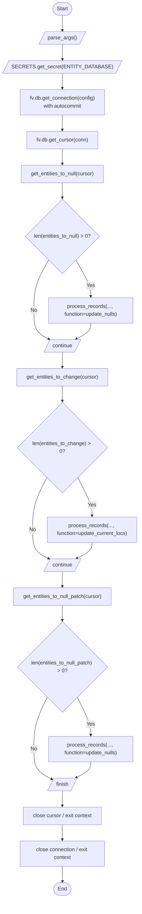

# Diagram: entity_core/entity_service/entity_service_scripts/backfill_dwell_based_current_locations.py


> Auto-generated by Obscura crawlers

## Diagram 1

```mermaid
classDiagram
class Script {
  +SECRETS : Secrets
  +PROGRESS : int
  +send_multithreaded_requests(thread_function, thread_nums=4, args=[])
  +get_entities_to_null(cursor)
  +get_entities_to_null_patch(cursor)
  +get_entities_to_change(cursor)
  +update_nulls(cursor, entity_ids)
  +update_current_locs(cursor, entity_ids)
  +process_records(cursor, entities, thread_count, batch_size, function, desc)
  +parse_args()
  +main()
}
class Secrets {
  +get_secret(name)
}
class DB {
  +get_connection(config, DB_APP_NAME, autocommit)
  +get_cursor(conn)
}
class Cursor {
  +execute(sql)
  +mogrify(sql, params)
  +fetchall()
}
Script ..> Secrets : uses
Script ..> DB : uses
Script --> Cursor : interacts with
Secrets <|-- "fv.secrets.Secrets"
DB <|-- "fv.db"
Cursor <|-- "fv.db.cursor"
```

> SVG rendering failed for this diagram.

## Diagram 2



### SVG

<svg id="container" width="416.48046875" xmlns="http://www.w3.org/2000/svg" class="flowchart" height="2760" viewBox="0 0 416.48046875 2760" role="graphics-document document" aria-roledescription="flowchart-v2"><style>#container{font-family:"trebuchet ms",verdana,arial,sans-serif;font-size:16px;fill:#333;}@keyframes edge-animation-frame{from{stroke-dashoffset:0;}}@keyframes dash{to{stroke-dashoffset:0;}}#container .edge-animation-slow{stroke-dasharray:9,5!important;stroke-dashoffset:900;animation:dash 50s linear infinite;stroke-linecap:round;}#container .edge-animation-fast{stroke-dasharray:9,5!important;stroke-dashoffset:900;animation:dash 20s linear infinite;stroke-linecap:round;}#container .error-icon{fill:#552222;}#container .error-text{fill:#552222;stroke:#552222;}#container .edge-thickness-normal{stroke-width:1px;}#container .edge-thickness-thick{stroke-width:3.5px;}#container .edge-pattern-solid{stroke-dasharray:0;}#container .edge-thickness-invisible{stroke-width:0;fill:none;}#container .edge-pattern-dashed{stroke-dasharray:3;}#container .edge-pattern-dotted{stroke-dasharray:2;}#container .marker{fill:#333333;stroke:#333333;}#container .marker.cross{stroke:#333333;}#container svg{font-family:"trebuchet ms",verdana,arial,sans-serif;font-size:16px;}#container p{margin:0;}#container .label{font-family:"trebuchet ms",verdana,arial,sans-serif;color:#333;}#container .cluster-label text{fill:#333;}#container .cluster-label span{color:#333;}#container .cluster-label span p{background-color:transparent;}#container .label text,#container span{fill:#333;color:#333;}#container .node rect,#container .node circle,#container .node ellipse,#container .node polygon,#container .node path{fill:#ECECFF;stroke:#9370DB;stroke-width:1px;}#container .rough-node .label text,#container .node .label text,#container .image-shape .label,#container .icon-shape .label{text-anchor:middle;}#container .node .katex path{fill:#000;stroke:#000;stroke-width:1px;}#container .rough-node .label,#container .node .label,#container .image-shape .label,#container .icon-shape .label{text-align:center;}#container .node.clickable{cursor:pointer;}#container .root .anchor path{fill:#333333!important;stroke-width:0;stroke:#333333;}#container .arrowheadPath{fill:#333333;}#container .edgePath .path{stroke:#333333;stroke-width:2.0px;}#container .flowchart-link{stroke:#333333;fill:none;}#container .edgeLabel{background-color:rgba(232,232,232, 0.8);text-align:center;}#container .edgeLabel p{background-color:rgba(232,232,232, 0.8);}#container .edgeLabel rect{opacity:0.5;background-color:rgba(232,232,232, 0.8);fill:rgba(232,232,232, 0.8);}#container .labelBkg{background-color:rgba(232, 232, 232, 0.5);}#container .cluster rect{fill:#ffffde;stroke:#aaaa33;stroke-width:1px;}#container .cluster text{fill:#333;}#container .cluster span{color:#333;}#container div.mermaidTooltip{position:absolute;text-align:center;max-width:200px;padding:2px;font-family:"trebuchet ms",verdana,arial,sans-serif;font-size:12px;background:hsl(80, 100%, 96.2745098039%);border:1px solid #aaaa33;border-radius:2px;pointer-events:none;z-index:100;}#container .flowchartTitleText{text-anchor:middle;font-size:18px;fill:#333;}#container rect.text{fill:none;stroke-width:0;}#container .icon-shape,#container .image-shape{background-color:rgba(232,232,232, 0.8);text-align:center;}#container .icon-shape p,#container .image-shape p{background-color:rgba(232,232,232, 0.8);padding:2px;}#container .icon-shape rect,#container .image-shape rect{opacity:0.5;background-color:rgba(232,232,232, 0.8);fill:rgba(232,232,232, 0.8);}#container .label-icon{display:inline-block;height:1em;overflow:visible;vertical-align:-0.125em;}#container .node .label-icon path{fill:currentColor;stroke:revert;stroke-width:revert;}#container :root{--mermaid-font-family:"trebuchet ms",verdana,arial,sans-serif;}</style><g><marker id="container_flowchart-v2-pointEnd" class="marker flowchart-v2" viewBox="0 0 10 10" refX="5" refY="5" markerUnits="userSpaceOnUse" markerWidth="8" markerHeight="8" orient="auto"><path d="M 0 0 L 10 5 L 0 10 z" class="arrowMarkerPath" style="stroke-width: 1; stroke-dasharray: 1, 0;"></path></marker><marker id="container_flowchart-v2-pointStart" class="marker flowchart-v2" viewBox="0 0 10 10" refX="4.5" refY="5" markerUnits="userSpaceOnUse" markerWidth="8" markerHeight="8" orient="auto"><path d="M 0 5 L 10 10 L 10 0 z" class="arrowMarkerPath" style="stroke-width: 1; stroke-dasharray: 1, 0;"></path></marker><marker id="container_flowchart-v2-circleEnd" class="marker flowchart-v2" viewBox="0 0 10 10" refX="11" refY="5" markerUnits="userSpaceOnUse" markerWidth="11" markerHeight="11" orient="auto"><circle cx="5" cy="5" r="5" class="arrowMarkerPath" style="stroke-width: 1; stroke-dasharray: 1, 0;"></circle></marker><marker id="container_flowchart-v2-circleStart" class="marker flowchart-v2" viewBox="0 0 10 10" refX="-1" refY="5" markerUnits="userSpaceOnUse" markerWidth="11" markerHeight="11" orient="auto"><circle cx="5" cy="5" r="5" class="arrowMarkerPath" style="stroke-width: 1; stroke-dasharray: 1, 0;"></circle></marker><marker id="container_flowchart-v2-crossEnd" class="marker cross flowchart-v2" viewBox="0 0 11 11" refX="12" refY="5.2" markerUnits="userSpaceOnUse" markerWidth="11" markerHeight="11" orient="auto"><path d="M 1,1 l 9,9 M 10,1 l -9,9" class="arrowMarkerPath" style="stroke-width: 2; stroke-dasharray: 1, 0;"></path></marker><marker id="container_flowchart-v2-crossStart" class="marker cross flowchart-v2" viewBox="0 0 11 11" refX="-1" refY="5.2" markerUnits="userSpaceOnUse" markerWidth="11" markerHeight="11" orient="auto"><path d="M 1,1 l 9,9 M 10,1 l -9,9" class="arrowMarkerPath" style="stroke-width: 2; stroke-dasharray: 1, 0;"></path></marker><g class="root"><g class="clusters"></g><g class="edgePaths"><path d="M174.383,47.5L174.299,51.583C174.216,55.667,174.049,63.833,174.036,71.5C174.023,79.167,174.164,86.334,174.234,89.917L174.304,93.501" id="L_Start_ParseArgs_0" class="edge-thickness-normal edge-pattern-solid edge-thickness-normal edge-pattern-solid flowchart-link" style=";" data-edge="true" data-et="edge" data-id="L_Start_ParseArgs_0" data-points="W3sieCI6MTc0LjM4MjgxMjUsInkiOjQ3LjUwMDAwMDAwMDAwMDA1fSx7IngiOjE3My44ODI4MTI1LCJ5Ijo3Mn0seyJ4IjoxNzQuMzgyODEyNSwieSI6OTcuNX1d" marker-end="url(#container_flowchart-v2-pointEnd)"></path><path d="M174.383,136.5L174.299,140.583C174.216,144.667,174.049,152.833,174.036,160.5C174.023,168.167,174.164,175.334,174.234,178.917L174.304,182.501" id="L_ParseArgs_GetConfig_0" class="edge-thickness-normal edge-pattern-solid edge-thickness-normal edge-pattern-solid flowchart-link" style=";" data-edge="true" data-et="edge" data-id="L_ParseArgs_GetConfig_0" data-points="W3sieCI6MTc0LjM4MjgxMjUsInkiOjEzNi41fSx7IngiOjE3My44ODI4MTI1LCJ5IjoxNjF9LHsieCI6MTc0LjM4MjgxMjUsInkiOjE4Ni41fV0=" marker-end="url(#container_flowchart-v2-pointEnd)"></path><path d="M174.383,225.5L174.299,229.583C174.216,233.667,174.049,241.833,173.966,249.417C173.883,257,173.883,264,173.883,267.5L173.883,271" id="L_GetConfig_OpenConn_0" class="edge-thickness-normal edge-pattern-solid edge-thickness-normal edge-pattern-solid flowchart-link" style=";" data-edge="true" data-et="edge" data-id="L_GetConfig_OpenConn_0" data-points="W3sieCI6MTc0LjM4MjgxMjUsInkiOjIyNS41fSx7IngiOjE3My44ODI4MTI1LCJ5IjoyNTB9LHsieCI6MTczLjg4MjgxMjUsInkiOjI3NX1d" marker-end="url(#container_flowchart-v2-pointEnd)"></path><path d="M173.883,353L173.883,357.167C173.883,361.333,173.883,369.667,173.883,377.333C173.883,385,173.883,392,173.883,395.5L173.883,399" id="L_OpenConn_OpenCursor_0" class="edge-thickness-normal edge-pattern-solid edge-thickness-normal edge-pattern-solid flowchart-link" style=";" data-edge="true" data-et="edge" data-id="L_OpenConn_OpenCursor_0" data-points="W3sieCI6MTczLjg4MjgxMjUsInkiOjM1M30seyJ4IjoxNzMuODgyODEyNSwieSI6Mzc4fSx7IngiOjE3My44ODI4MTI1LCJ5Ijo0MDN9XQ==" marker-end="url(#container_flowchart-v2-pointEnd)"></path><path d="M173.883,457L173.883,461.167C173.883,465.333,173.883,473.667,173.883,481.333C173.883,489,173.883,496,173.883,499.5L173.883,503" id="L_OpenCursor_GetNull_0" class="edge-thickness-normal edge-pattern-solid edge-thickness-normal edge-pattern-solid flowchart-link" style=";" data-edge="true" data-et="edge" data-id="L_OpenCursor_GetNull_0" data-points="W3sieCI6MTczLjg4MjgxMjUsInkiOjQ1N30seyJ4IjoxNzMuODgyODEyNSwieSI6NDgyfSx7IngiOjE3My44ODI4MTI1LCJ5Ijo1MDd9XQ==" marker-end="url(#container_flowchart-v2-pointEnd)"></path><path d="M173.883,561L173.883,565.167C173.883,569.333,173.883,577.667,173.883,585.333C173.883,593,173.883,600,173.883,603.5L173.883,607" id="L_GetNull_CheckNull_0" class="edge-thickness-normal edge-pattern-solid edge-thickness-normal edge-pattern-solid flowchart-link" style=";" data-edge="true" data-et="edge" data-id="L_GetNull_CheckNull_0" data-points="W3sieCI6MTczLjg4MjgxMjUsInkiOjU2MX0seyJ4IjoxNzMuODgyODEyNSwieSI6NTg2fSx7IngiOjE3My44ODI4MTI1LCJ5Ijo2MTF9XQ==" marker-end="url(#container_flowchart-v2-pointEnd)"></path><path d="M216.202,801.681L223.744,814.901C231.286,828.12,246.369,854.56,253.911,873.28C261.453,892,261.453,903,261.453,908.5L261.453,914" id="L_CheckNull_ProcessNull_0" class="edge-thickness-normal edge-pattern-solid edge-thickness-normal edge-pattern-solid flowchart-link" style=";" data-edge="true" data-et="edge" data-id="L_CheckNull_ProcessNull_0" data-points="W3sieCI6MjE2LjIwMjE3Mjc3NDgxNjEsInkiOjgwMS42ODA2Mzk3MjUxODM5fSx7IngiOjI2MS40NTMxMjUsInkiOjg4MX0seyJ4IjoyNjEuNDUzMTI1LCJ5Ijo5MTh9XQ==" marker-end="url(#container_flowchart-v2-pointEnd)"></path><path d="M131.563,801.681L124.022,814.901C116.48,828.12,101.396,854.56,93.854,880.447C86.313,906.333,86.313,931.667,86.313,955C86.313,978.333,86.313,999.667,94.002,1014.279C101.692,1028.891,117.071,1036.783,124.761,1040.728L132.45,1044.674" id="L_CheckNull_AfterNull_0" class="edge-thickness-normal edge-pattern-solid edge-thickness-normal edge-pattern-solid flowchart-link" style=";" data-edge="true" data-et="edge" data-id="L_CheckNull_AfterNull_0" data-points="W3sieCI6MTMxLjU2MzQ1MjIyNTE4MzksInkiOjgwMS42ODA2Mzk3MjUxODM5fSx7IngiOjg2LjMxMjUsInkiOjg4MX0seyJ4Ijo4Ni4zMTI1LCJ5Ijo5NTd9LHsieCI6ODYuMzEyNSwieSI6MTAyMX0seyJ4IjoxMzYuMDA5MzA0Nzc1MjgwOSwieSI6MTA0Ni41fV0=" marker-end="url(#container_flowchart-v2-pointEnd)"></path><path d="M261.453,996L261.453,1000.167C261.453,1004.333,261.453,1012.667,253.928,1020.774C246.402,1028.881,231.351,1036.763,223.825,1040.704L216.3,1044.644" id="L_ProcessNull_AfterNull_0" class="edge-thickness-normal edge-pattern-solid edge-thickness-normal edge-pattern-solid flowchart-link" style=";" data-edge="true" data-et="edge" data-id="L_ProcessNull_AfterNull_0" data-points="W3sieCI6MjYxLjQ1MzEyNSwieSI6OTk2fSx7IngiOjI2MS40NTMxMjUsInkiOjEwMjF9LHsieCI6MjEyLjc1NjMyMDIyNDcxOTEsInkiOjEwNDYuNX1d" marker-end="url(#container_flowchart-v2-pointEnd)"></path><path d="M174.383,1085.5L174.299,1089.583C174.216,1093.667,174.049,1101.833,173.966,1109.417C173.883,1117,173.883,1124,173.883,1127.5L173.883,1131" id="L_AfterNull_GetChange_0" class="edge-thickness-normal edge-pattern-solid edge-thickness-normal edge-pattern-solid flowchart-link" style=";" data-edge="true" data-et="edge" data-id="L_AfterNull_GetChange_0" data-points="W3sieCI6MTc0LjM4MjgxMjUsInkiOjEwODUuNX0seyJ4IjoxNzMuODgyODEyNSwieSI6MTExMH0seyJ4IjoxNzMuODgyODEyNSwieSI6MTEzNX1d" marker-end="url(#container_flowchart-v2-pointEnd)"></path><path d="M173.883,1189L173.883,1193.167C173.883,1197.333,173.883,1205.667,173.883,1213.333C173.883,1221,173.883,1228,173.883,1231.5L173.883,1235" id="L_GetChange_CheckChange_0" class="edge-thickness-normal edge-pattern-solid edge-thickness-normal edge-pattern-solid flowchart-link" style=";" data-edge="true" data-et="edge" data-id="L_GetChange_CheckChange_0" data-points="W3sieCI6MTczLjg4MjgxMjUsInkiOjExODl9LHsieCI6MTczLjg4MjgxMjUsInkiOjEyMTR9LHsieCI6MTczLjg4MjgxMjUsInkiOjEyMzl9XQ==" marker-end="url(#container_flowchart-v2-pointEnd)"></path><path d="M222.022,1468.861L229.54,1483.051C237.057,1497.241,252.093,1525.62,259.611,1545.31C267.129,1565,267.129,1576,267.129,1581.5L267.129,1587" id="L_CheckChange_ProcessChange_0" class="edge-thickness-normal edge-pattern-solid edge-thickness-normal edge-pattern-solid flowchart-link" style=";" data-edge="true" data-et="edge" data-id="L_CheckChange_ProcessChange_0" data-points="W3sieCI6MjIyLjAyMTY5ODU2Nzg2ODksInkiOjE0NjguODYxMTEzOTMyMTMxfSx7IngiOjI2Ny4xMjg5MDYyNSwieSI6MTU1NH0seyJ4IjoyNjcuMTI4OTA2MjUsInkiOjE1OTF9XQ==" marker-end="url(#container_flowchart-v2-pointEnd)"></path><path d="M125.744,1468.861L118.226,1483.051C110.708,1497.241,95.672,1525.62,88.155,1552.477C80.637,1579.333,80.637,1604.667,80.637,1628C80.637,1651.333,80.637,1672.667,89.05,1687.389C97.464,1702.112,114.291,1710.224,122.705,1714.28L131.118,1718.335" id="L_CheckChange_AfterChange_0" class="edge-thickness-normal edge-pattern-solid edge-thickness-normal edge-pattern-solid flowchart-link" style=";" data-edge="true" data-et="edge" data-id="L_CheckChange_AfterChange_0" data-points="W3sieCI6MTI1Ljc0MzkyNjQzMjEzMTA5LCJ5IjoxNDY4Ljg2MTExMzkzMjEzMX0seyJ4Ijo4MC42MzY3MTg3NSwieSI6MTU1NH0seyJ4Ijo4MC42MzY3MTg3NSwieSI6MTYzMH0seyJ4Ijo4MC42MzY3MTg3NSwieSI6MTY5NH0seyJ4IjoxMzQuNzIxNjA2NTk0NzY3ODIsInkiOjE3MjAuMDcyNDExODEwNDY0NX1d" marker-end="url(#container_flowchart-v2-pointEnd)"></path><path d="M267.129,1669L267.129,1673.167C267.129,1677.333,267.129,1685.667,259.08,1693.789C251.03,1701.912,234.932,1709.824,226.883,1713.78L218.833,1717.736" id="L_ProcessChange_AfterChange_0" class="edge-thickness-normal edge-pattern-solid edge-thickness-normal edge-pattern-solid flowchart-link" style=";" data-edge="true" data-et="edge" data-id="L_ProcessChange_AfterChange_0" data-points="W3sieCI6MjY3LjEyODkwNjI1LCJ5IjoxNjY5fSx7IngiOjI2Ny4xMjg5MDYyNSwieSI6MTY5NH0seyJ4IjoyMTUuMjQzNDYwMzIzMDMzNywieSI6MTcxOS41fV0=" marker-end="url(#container_flowchart-v2-pointEnd)"></path><path d="M174.383,1758.5L174.299,1762.583C174.216,1766.667,174.049,1774.833,173.966,1782.417C173.883,1790,173.883,1797,173.883,1800.5L173.883,1804" id="L_AfterChange_GetPatchNull_0" class="edge-thickness-normal edge-pattern-solid edge-thickness-normal edge-pattern-solid flowchart-link" style=";" data-edge="true" data-et="edge" data-id="L_AfterChange_GetPatchNull_0" data-points="W3sieCI6MTc0LjM4MjgxMjUsInkiOjE3NTguNX0seyJ4IjoxNzMuODgyODEyNSwieSI6MTc4M30seyJ4IjoxNzMuODgyODEyNSwieSI6MTgwOH1d" marker-end="url(#container_flowchart-v2-pointEnd)"></path><path d="M173.883,1862L173.883,1866.167C173.883,1870.333,173.883,1878.667,173.883,1886.333C173.883,1894,173.883,1901,173.883,1904.5L173.883,1908" id="L_GetPatchNull_CheckPatch_0" class="edge-thickness-normal edge-pattern-solid edge-thickness-normal edge-pattern-solid flowchart-link" style=";" data-edge="true" data-et="edge" data-id="L_GetPatchNull_CheckPatch_0" data-points="W3sieCI6MTczLjg4MjgxMjUsInkiOjE4NjJ9LHsieCI6MTczLjg4MjgxMjUsInkiOjE4ODd9LHsieCI6MTczLjg4MjgxMjUsInkiOjE5MTJ9XQ==" marker-end="url(#container_flowchart-v2-pointEnd)"></path><path d="M220.065,2143.818L226.963,2157.681C233.861,2171.545,247.657,2199.273,254.555,2218.636C261.453,2238,261.453,2249,261.453,2254.5L261.453,2260" id="L_CheckPatch_ProcessPatch_0" class="edge-thickness-normal edge-pattern-solid edge-thickness-normal edge-pattern-solid flowchart-link" style=";" data-edge="true" data-et="edge" data-id="L_CheckPatch_ProcessPatch_0" data-points="W3sieCI6MjIwLjA2NTA3NTI5NzUyMjAxLCJ5IjoyMTQzLjgxNzczNzIwMjQ3OH0seyJ4IjoyNjEuNDUzMTI1LCJ5IjoyMjI3fSx7IngiOjI2MS40NTMxMjUsInkiOjIyNjR9XQ==" marker-end="url(#container_flowchart-v2-pointEnd)"></path><path d="M127.701,2143.818L120.803,2157.681C113.905,2171.545,100.109,2199.273,93.211,2225.803C86.313,2252.333,86.313,2277.667,86.313,2301C86.313,2324.333,86.313,2345.667,95.451,2361.016C104.59,2376.365,122.867,2385.73,132.006,2390.412L141.145,2395.095" id="L_CheckPatch_AfterPatch_0" class="edge-thickness-normal edge-pattern-solid edge-thickness-normal edge-pattern-solid flowchart-link" style=";" data-edge="true" data-et="edge" data-id="L_CheckPatch_AfterPatch_0" data-points="W3sieCI6MTI3LjcwMDU0OTcwMjQ3Nzk5LCJ5IjoyMTQzLjgxNzczNzIwMjQ3OH0seyJ4Ijo4Ni4zMTI1LCJ5IjoyMjI3fSx7IngiOjg2LjMxMjUsInkiOjIzMDN9LHsieCI6ODYuMzEyNSwieSI6MjM2N30seyJ4IjoxNDQuNzA0NzE4NDAwOTc0NiwieSI6MjM5Ni45MTg2ODgxOTgwNTF9XQ==" marker-end="url(#container_flowchart-v2-pointEnd)"></path><path d="M261.453,2342L261.453,2346.167C261.453,2350.333,261.453,2358.667,253.928,2366.774C246.402,2374.881,231.351,2382.763,223.825,2386.704L216.3,2390.644" id="L_ProcessPatch_AfterPatch_0" class="edge-thickness-normal edge-pattern-solid edge-thickness-normal edge-pattern-solid flowchart-link" style=";" data-edge="true" data-et="edge" data-id="L_ProcessPatch_AfterPatch_0" data-points="W3sieCI6MjYxLjQ1MzEyNSwieSI6MjM0Mn0seyJ4IjoyNjEuNDUzMTI1LCJ5IjoyMzY3fSx7IngiOjIxMi43NTYzMjAyMjQ3MTkxLCJ5IjoyMzkyLjV9XQ==" marker-end="url(#container_flowchart-v2-pointEnd)"></path><path d="M174.383,2431.5L174.299,2435.583C174.216,2439.667,174.049,2447.833,173.966,2455.417C173.883,2463,173.883,2470,173.883,2473.5L173.883,2477" id="L_AfterPatch_CloseCursor_0" class="edge-thickness-normal edge-pattern-solid edge-thickness-normal edge-pattern-solid flowchart-link" style=";" data-edge="true" data-et="edge" data-id="L_AfterPatch_CloseCursor_0" data-points="W3sieCI6MTc0LjM4MjgxMjUsInkiOjI0MzEuNX0seyJ4IjoxNzMuODgyODEyNSwieSI6MjQ1Nn0seyJ4IjoxNzMuODgyODEyNSwieSI6MjQ4MX1d" marker-end="url(#container_flowchart-v2-pointEnd)"></path><path d="M173.883,2535L173.883,2539.167C173.883,2543.333,173.883,2551.667,173.883,2559.333C173.883,2567,173.883,2574,173.883,2577.5L173.883,2581" id="L_CloseCursor_CloseConn_0" class="edge-thickness-normal edge-pattern-solid edge-thickness-normal edge-pattern-solid flowchart-link" style=";" data-edge="true" data-et="edge" data-id="L_CloseCursor_CloseConn_0" data-points="W3sieCI6MTczLjg4MjgxMjUsInkiOjI1MzV9LHsieCI6MTczLjg4MjgxMjUsInkiOjI1NjB9LHsieCI6MTczLjg4MjgxMjUsInkiOjI1ODV9XQ==" marker-end="url(#container_flowchart-v2-pointEnd)"></path><path d="M173.883,2663L173.883,2667.167C173.883,2671.333,173.883,2679.667,173.953,2687.417C174.023,2695.167,174.164,2702.334,174.234,2705.917L174.304,2709.501" id="L_CloseConn_End_0" class="edge-thickness-normal edge-pattern-solid edge-thickness-normal edge-pattern-solid flowchart-link" style=";" data-edge="true" data-et="edge" data-id="L_CloseConn_End_0" data-points="W3sieCI6MTczLjg4MjgxMjUsInkiOjI2NjN9LHsieCI6MTczLjg4MjgxMjUsInkiOjI2ODh9LHsieCI6MTc0LjM4MjgxMjUsInkiOjI3MTMuNX1d" marker-end="url(#container_flowchart-v2-pointEnd)"></path></g><g class="edgeLabels"><g class="edgeLabel"><g class="label" data-id="L_Start_ParseArgs_0" transform="translate(0, 0)"><foreignObject width="0" height="0"><div xmlns="http://www.w3.org/1999/xhtml" class="labelBkg" style="display: table-cell; white-space: nowrap; line-height: 1.5; max-width: 200px; text-align: center;"><span class="edgeLabel"></span></div></foreignObject></g></g><g class="edgeLabel"><g class="label" data-id="L_ParseArgs_GetConfig_0" transform="translate(0, 0)"><foreignObject width="0" height="0"><div xmlns="http://www.w3.org/1999/xhtml" class="labelBkg" style="display: table-cell; white-space: nowrap; line-height: 1.5; max-width: 200px; text-align: center;"><span class="edgeLabel"></span></div></foreignObject></g></g><g class="edgeLabel"><g class="label" data-id="L_GetConfig_OpenConn_0" transform="translate(0, 0)"><foreignObject width="0" height="0"><div xmlns="http://www.w3.org/1999/xhtml" class="labelBkg" style="display: table-cell; white-space: nowrap; line-height: 1.5; max-width: 200px; text-align: center;"><span class="edgeLabel"></span></div></foreignObject></g></g><g class="edgeLabel"><g class="label" data-id="L_OpenConn_OpenCursor_0" transform="translate(0, 0)"><foreignObject width="0" height="0"><div xmlns="http://www.w3.org/1999/xhtml" class="labelBkg" style="display: table-cell; white-space: nowrap; line-height: 1.5; max-width: 200px; text-align: center;"><span class="edgeLabel"></span></div></foreignObject></g></g><g class="edgeLabel"><g class="label" data-id="L_OpenCursor_GetNull_0" transform="translate(0, 0)"><foreignObject width="0" height="0"><div xmlns="http://www.w3.org/1999/xhtml" class="labelBkg" style="display: table-cell; white-space: nowrap; line-height: 1.5; max-width: 200px; text-align: center;"><span class="edgeLabel"></span></div></foreignObject></g></g><g class="edgeLabel"><g class="label" data-id="L_GetNull_CheckNull_0" transform="translate(0, 0)"><foreignObject width="0" height="0"><div xmlns="http://www.w3.org/1999/xhtml" class="labelBkg" style="display: table-cell; white-space: nowrap; line-height: 1.5; max-width: 200px; text-align: center;"><span class="edgeLabel"></span></div></foreignObject></g></g><g class="edgeLabel" transform="translate(261.453125, 881)"><g class="label" data-id="L_CheckNull_ProcessNull_0" transform="translate(-12.03125, -12)"><foreignObject width="24.0625" height="24"><div xmlns="http://www.w3.org/1999/xhtml" class="labelBkg" style="display: table-cell; white-space: nowrap; line-height: 1.5; max-width: 200px; text-align: center;"><span class="edgeLabel"><p>Yes</p></span></div></foreignObject></g></g><g class="edgeLabel" transform="translate(86.3125, 957)"><g class="label" data-id="L_CheckNull_AfterNull_0" transform="translate(-10.140625, -12)"><foreignObject width="20.28125" height="24"><div xmlns="http://www.w3.org/1999/xhtml" class="labelBkg" style="display: table-cell; white-space: nowrap; line-height: 1.5; max-width: 200px; text-align: center;"><span class="edgeLabel"><p>No</p></span></div></foreignObject></g></g><g class="edgeLabel"><g class="label" data-id="L_ProcessNull_AfterNull_0" transform="translate(0, 0)"><foreignObject width="0" height="0"><div xmlns="http://www.w3.org/1999/xhtml" class="labelBkg" style="display: table-cell; white-space: nowrap; line-height: 1.5; max-width: 200px; text-align: center;"><span class="edgeLabel"></span></div></foreignObject></g></g><g class="edgeLabel"><g class="label" data-id="L_AfterNull_GetChange_0" transform="translate(0, 0)"><foreignObject width="0" height="0"><div xmlns="http://www.w3.org/1999/xhtml" class="labelBkg" style="display: table-cell; white-space: nowrap; line-height: 1.5; max-width: 200px; text-align: center;"><span class="edgeLabel"></span></div></foreignObject></g></g><g class="edgeLabel"><g class="label" data-id="L_GetChange_CheckChange_0" transform="translate(0, 0)"><foreignObject width="0" height="0"><div xmlns="http://www.w3.org/1999/xhtml" class="labelBkg" style="display: table-cell; white-space: nowrap; line-height: 1.5; max-width: 200px; text-align: center;"><span class="edgeLabel"></span></div></foreignObject></g></g><g class="edgeLabel" transform="translate(267.12890625, 1554)"><g class="label" data-id="L_CheckChange_ProcessChange_0" transform="translate(-12.03125, -12)"><foreignObject width="24.0625" height="24"><div xmlns="http://www.w3.org/1999/xhtml" class="labelBkg" style="display: table-cell; white-space: nowrap; line-height: 1.5; max-width: 200px; text-align: center;"><span class="edgeLabel"><p>Yes</p></span></div></foreignObject></g></g><g class="edgeLabel" transform="translate(80.63671875, 1630)"><g class="label" data-id="L_CheckChange_AfterChange_0" transform="translate(-10.140625, -12)"><foreignObject width="20.28125" height="24"><div xmlns="http://www.w3.org/1999/xhtml" class="labelBkg" style="display: table-cell; white-space: nowrap; line-height: 1.5; max-width: 200px; text-align: center;"><span class="edgeLabel"><p>No</p></span></div></foreignObject></g></g><g class="edgeLabel"><g class="label" data-id="L_ProcessChange_AfterChange_0" transform="translate(0, 0)"><foreignObject width="0" height="0"><div xmlns="http://www.w3.org/1999/xhtml" class="labelBkg" style="display: table-cell; white-space: nowrap; line-height: 1.5; max-width: 200px; text-align: center;"><span class="edgeLabel"></span></div></foreignObject></g></g><g class="edgeLabel"><g class="label" data-id="L_AfterChange_GetPatchNull_0" transform="translate(0, 0)"><foreignObject width="0" height="0"><div xmlns="http://www.w3.org/1999/xhtml" class="labelBkg" style="display: table-cell; white-space: nowrap; line-height: 1.5; max-width: 200px; text-align: center;"><span class="edgeLabel"></span></div></foreignObject></g></g><g class="edgeLabel"><g class="label" data-id="L_GetPatchNull_CheckPatch_0" transform="translate(0, 0)"><foreignObject width="0" height="0"><div xmlns="http://www.w3.org/1999/xhtml" class="labelBkg" style="display: table-cell; white-space: nowrap; line-height: 1.5; max-width: 200px; text-align: center;"><span class="edgeLabel"></span></div></foreignObject></g></g><g class="edgeLabel" transform="translate(261.453125, 2227)"><g class="label" data-id="L_CheckPatch_ProcessPatch_0" transform="translate(-12.03125, -12)"><foreignObject width="24.0625" height="24"><div xmlns="http://www.w3.org/1999/xhtml" class="labelBkg" style="display: table-cell; white-space: nowrap; line-height: 1.5; max-width: 200px; text-align: center;"><span class="edgeLabel"><p>Yes</p></span></div></foreignObject></g></g><g class="edgeLabel" transform="translate(86.3125, 2303)"><g class="label" data-id="L_CheckPatch_AfterPatch_0" transform="translate(-10.140625, -12)"><foreignObject width="20.28125" height="24"><div xmlns="http://www.w3.org/1999/xhtml" class="labelBkg" style="display: table-cell; white-space: nowrap; line-height: 1.5; max-width: 200px; text-align: center;"><span class="edgeLabel"><p>No</p></span></div></foreignObject></g></g><g class="edgeLabel"><g class="label" data-id="L_ProcessPatch_AfterPatch_0" transform="translate(0, 0)"><foreignObject width="0" height="0"><div xmlns="http://www.w3.org/1999/xhtml" class="labelBkg" style="display: table-cell; white-space: nowrap; line-height: 1.5; max-width: 200px; text-align: center;"><span class="edgeLabel"></span></div></foreignObject></g></g><g class="edgeLabel"><g class="label" data-id="L_AfterPatch_CloseCursor_0" transform="translate(0, 0)"><foreignObject width="0" height="0"><div xmlns="http://www.w3.org/1999/xhtml" class="labelBkg" style="display: table-cell; white-space: nowrap; line-height: 1.5; max-width: 200px; text-align: center;"><span class="edgeLabel"></span></div></foreignObject></g></g><g class="edgeLabel"><g class="label" data-id="L_CloseCursor_CloseConn_0" transform="translate(0, 0)"><foreignObject width="0" height="0"><div xmlns="http://www.w3.org/1999/xhtml" class="labelBkg" style="display: table-cell; white-space: nowrap; line-height: 1.5; max-width: 200px; text-align: center;"><span class="edgeLabel"></span></div></foreignObject></g></g><g class="edgeLabel"><g class="label" data-id="L_CloseConn_End_0" transform="translate(0, 0)"><foreignObject width="0" height="0"><div xmlns="http://www.w3.org/1999/xhtml" class="labelBkg" style="display: table-cell; white-space: nowrap; line-height: 1.5; max-width: 200px; text-align: center;"><span class="edgeLabel"></span></div></foreignObject></g></g></g><g class="nodes"><g class="node default" id="flowchart-Start-0" transform="translate(173.8828125, 27.5)"><g class="basic label-container outer-path"><path d="M-10.3984375 -19.5 C-2.691771798874674 -19.5, 5.014893902250652 -19.5, 10.3984375 -19.5 C10.3984375 -19.5, 10.398437499999998 -19.5, 10.398437499999998 -19.5 C10.691664561124561 -19.490596778881585, 10.984891622249123 -19.48119355776317, 11.6478067896239 -19.45993515863156 C11.961393888561553 -19.429683788340707, 12.274980987499207 -19.399432418049855, 12.892042152847864 -19.3399052695533 C13.170893835193002 -19.29482269207883, 13.449745517538142 -19.249740114604364, 14.126030759676757 -19.140403561325776 C14.40212455395685 -19.077386954461726, 14.678218348236946 -19.01437034759768, 15.34470188623539 -18.862249829261074 C15.770133938114352 -18.73598382940181, 16.195565989993312 -18.609717829542543, 16.543047751460602 -18.50658706670804 C16.89668852756108 -18.376443992083566, 17.250329303661555 -18.24630091745909, 17.716144095147794 -18.074876768247425 C18.021861322979614 -17.939544820265628, 18.32757855081143 -17.80421287228383, 18.85917041279238 -17.568892924097174 C19.087668957117916 -17.449685379882848, 19.31616750144345 -17.330477835668518, 19.967429764076783 -16.990714730406097 C20.257554057699476 -16.814839678652422, 20.547678351322173 -16.638964626898748, 21.036368073605697 -16.342718045390892 C21.359670973695142 -16.117195937845473, 21.682973873784587 -15.891673830300052, 22.061592844578712 -15.627565626425154 C22.45063931423395 -15.317311419836454, 22.83968578388919 -15.007057213247755, 23.03889120850187 -14.848196188198123 C23.299733244138743 -14.611306352934788, 23.560575279775616 -14.374416517671454, 23.964247236767985 -14.007812326905688 C24.152949109174543 -13.81296215093407, 24.341650981581097 -13.61811197496245, 24.833858442968648 -13.10986736009568 C25.125474838970874 -12.767318147908465, 25.417091234973096 -12.42476893572125, 25.644151408126582 -12.158051136245305 C25.881854822004932 -11.83955021687481, 26.119558235883282 -11.521049297504314, 26.391796464640635 -11.156274872382312 C26.64412193007902 -10.768635198594348, 26.896447395517402 -10.380995524806384, 27.073721378604247 -10.108655082055241 C27.29925918315239 -9.708189871900817, 27.52479698770053 -9.307724661746395, 27.6871239742735 -9.019496659696287 C27.85527770306644 -8.670321843944327, 28.02343143185938 -8.321147028192366, 28.22948364880834 -7.893275190886684 C28.355631381982665 -7.581687851045598, 28.48177911515699 -7.270100511204513, 28.698571729970325 -6.734618561215508 C28.801510434942678 -6.424583582894109, 28.904449139915034 -6.11454860457271, 29.09246063421488 -5.548287939305138 C29.171046526159582 -5.248605873978975, 29.249632418104284 -4.948923808652813, 29.40953178754556 -4.339158212148133 C29.497493140610352 -3.8874952547989863, 29.585454493675144 -3.4358322974498394, 29.648482276581777 -3.1121979531509023 C29.703693821771623 -2.6839881114112574, 29.758905366961464 -2.255778269671612, 29.808330202509367 -1.872449005199798 C29.838661631098233 -1.4000125218397117, 29.8689930596871 -0.9275760384796257, 29.888418715913414 -0.6250057626472757 C29.888418715913414 -0.15444624087049913, 29.888418715913414 0.31611328090627744, 29.888418715913414 0.625005762647271 C29.86842999369836 0.9363462457529302, 29.848441271483303 1.2476867288585893, 29.808330202509367 1.8724490051997846 C29.745374061515506 2.360724402651981, 29.68241792052164 2.848999800104177, 29.648482276581777 3.1121979531508885 C29.563754730287208 3.5472559962002514, 29.47902718399264 3.982314039249615, 29.40953178754556 4.339158212148129 C29.307687132540035 4.727536021436887, 29.205842477534514 5.115913830725645, 29.092460634214884 5.548287939305125 C28.97543521567585 5.900749854476352, 28.85840979713682 6.253211769647579, 28.69857172997033 6.734618561215495 C28.602799422543125 6.971178012192292, 28.507027115115918 7.20773746316909, 28.229483648808344 7.893275190886679 C28.105289730499894 8.151166519578329, 27.981095812191448 8.40905784826998, 27.687123974273504 9.019496659696284 C27.55522376185063 9.253698843197913, 27.42332354942776 9.487901026699543, 27.07372137860425 10.108655082055236 C26.813246508238798 10.508814430232809, 26.552771637873345 10.908973778410381, 26.39179646464064 11.156274872382301 C26.16774561265244 11.456482602593974, 25.943694760664236 11.756690332805647, 25.644151408126582 12.158051136245302 C25.33851097419054 12.517073781379946, 25.032870540254496 12.87609642651459, 24.83385844296866 13.10986736009567 C24.528933389494448 13.424727512620269, 24.224008336020233 13.739587665144867, 23.96424723676799 14.007812326905684 C23.647830172107497 14.29517393309358, 23.33141310744701 14.582535539281475, 23.038891208501887 14.848196188198111 C22.785250149166057 15.05046818334638, 22.531609089830223 15.252740178494648, 22.061592844578715 15.627565626425152 C21.812596271754252 15.801254856739586, 21.56359969892979 15.97494408705402, 21.036368073605708 16.34271804539089 C20.665367292107632 16.567620899377616, 20.294366510609557 16.792523753364346, 19.967429764076787 16.990714730406093 C19.726523864539615 17.116395183887043, 19.485617965002444 17.242075637367993, 18.859170412792388 17.56889292409717 C18.582619964881225 17.691313603809878, 18.306069516970066 17.813734283522585, 17.716144095147804 18.07487676824742 C17.254014205585097 18.244944839488365, 16.79188431602239 18.415012910729313, 16.543047751460616 18.506587066708033 C16.06627124358521 18.648091831594495, 15.5894947357098 18.78959659648096, 15.344701886235413 18.86224982926107 C14.979342446109191 18.94564073727672, 14.613983005982968 19.029031645292367, 14.126030759676766 19.140403561325773 C13.827855316769798 19.188610254549875, 13.52967987386283 19.23681694777398, 12.892042152847878 19.3399052695533 C12.458573648141874 19.38172145488014, 12.02510514343587 19.423537640206977, 11.6478067896239 19.45993515863156 C11.236070353488259 19.473138744742073, 10.824333917352618 19.486342330852587, 10.398437500000004 19.5 C10.398437500000002 19.5, 10.3984375 19.5, 10.3984375 19.5 C6.019050035920663 19.5, 1.6396625718413258 19.5, -10.398437499999996 19.5 C-10.868226098452839 19.484934794035652, -11.338014696905681 19.469869588071305, -11.647806789623893 19.45993515863156 C-12.131085827450875 19.41331381108047, -12.614364865277855 19.36669246352938, -12.892042152847871 19.3399052695533 C-13.18419988124829 19.29267147374254, -13.476357609648709 19.245437677931783, -14.126030759676759 19.140403561325773 C-14.449764309096164 19.06651349122963, -14.773497858515567 18.992623421133494, -15.344701886235388 18.862249829261074 C-15.77056014661106 18.7358573329572, -16.196418406986734 18.609464836653324, -16.54304775146059 18.506587066708043 C-16.938956993859172 18.360888805760446, -17.334866236257753 18.215190544812852, -17.716144095147797 18.074876768247425 C-18.006227477877403 17.94646545973084, -18.296310860607008 17.818054151214255, -18.85917041279238 17.568892924097174 C-19.26676577083475 17.356250686883758, -19.674361128877113 17.143608449670342, -19.96742976407678 16.990714730406097 C-20.328049846561466 16.772104717165043, -20.688669929046156 16.553494703923988, -21.036368073605686 16.3427180453909 C-21.356630993977948 16.119316496097586, -21.67689391435021 15.895914946804274, -22.061592844578712 15.627565626425156 C-22.31418837265705 15.426127414631981, -22.56678390073539 15.224689202838807, -23.03889120850187 14.848196188198125 C-23.40229249356959 14.518164756170734, -23.765693778637313 14.18813332414334, -23.964247236767974 14.007812326905697 C-24.255593364443417 13.706973530118871, -24.54693949211886 13.406134733332046, -24.833858442968655 13.109867360095677 C-25.061851417091184 12.842053839523611, -25.289844391213716 12.574240318951546, -25.64415140812658 12.158051136245307 C-25.91478622150587 11.795425141655764, -26.185421034885163 11.43279914706622, -26.391796464640635 11.156274872382316 C-26.621931632808963 10.802725454130302, -26.85206680097729 10.44917603587829, -27.073721378604244 10.108655082055249 C-27.302657507239687 9.70215580336619, -27.531593635875133 9.295656524677133, -27.6871239742735 9.019496659696289 C-27.8449091825219 8.691852298705864, -28.0026943907703 8.36420793771544, -28.22948364880834 7.893275190886686 C-28.32416628348986 7.659407252659128, -28.418848918171378 7.42553931443157, -28.698571729970325 6.73461856121551 C-28.83441495101052 6.325480423120449, -28.970258172050713 5.916342285025388, -29.09246063421488 5.5482879393051325 C-29.186923795747198 5.188058963789227, -29.281386957279512 4.82782998827332, -29.409531787545557 4.339158212148136 C-29.499630837035344 3.8765186354589387, -29.58972988652513 3.413879058769741, -29.648482276581777 3.112197953150904 C-29.69352148469193 2.762882749046156, -29.73856069280209 2.4135675449414076, -29.808330202509364 1.872449005199809 C-29.828116192500733 1.5642662401205727, -29.847902182492103 1.2560834750413363, -29.888418715913414 0.6250057626472781 C-29.888418715913414 0.32736175360553804, -29.888418715913414 0.029717744563797943, -29.888418715913414 -0.6250057626472687 C-29.86751303860724 -0.9506285614499385, -29.846607361301064 -1.2762513602526082, -29.808330202509367 -1.8724490051997822 C-29.756790913413433 -2.2721775538440623, -29.705251624317498 -2.671906102488342, -29.648482276581777 -3.112197953150895 C-29.590128064837053 -3.4118344972930297, -29.531773853092332 -3.711471041435164, -29.40953178754556 -4.339158212148126 C-29.337263418668943 -4.61474882398387, -29.264995049792326 -4.890339435819615, -29.092460634214884 -5.548287939305123 C-28.951900091039278 -5.971633900068838, -28.81133954786367 -6.394979860832552, -28.698571729970332 -6.734618561215485 C-28.59056618816657 -7.001394337615879, -28.482560646362803 -7.268170114016272, -28.229483648808344 -7.893275190886676 C-28.026542855006426 -8.314686091453737, -27.823602061204504 -8.7360969920208, -27.687123974273504 -9.019496659696282 C-27.46831201414162 -9.408019452024039, -27.24950005400974 -9.796542244351794, -27.073721378604247 -10.108655082055243 C-26.923425450023156 -10.33954998846357, -26.77312952144207 -10.570444894871896, -26.39179646464064 -11.156274872382308 C-26.209277424918227 -11.40083375778376, -26.026758385195812 -11.64539264318521, -25.644151408126586 -12.158051136245302 C-25.423269490623795 -12.417511605081236, -25.20238757312101 -12.676972073917169, -24.833858442968662 -13.10986736009567 C-24.59796623445315 -13.353445432498432, -24.362074025937638 -13.597023504901196, -23.964247236767996 -14.007812326905677 C-23.713741250106736 -14.23531523596623, -23.46323526344548 -14.462818145026782, -23.038891208501887 -14.848196188198107 C-22.760417938095657 -15.070271210862131, -22.481944667689426 -15.292346233526157, -22.06159284457872 -15.627565626425149 C-21.724092790199645 -15.862991054218112, -21.38659273582057 -16.098416482011075, -21.03636807360571 -16.342718045390885 C-20.615671173619322 -16.597746978452037, -20.194974273632933 -16.85277591151319, -19.96742976407679 -16.99071473040609 C-19.68200947357842 -17.13961831313867, -19.396589183080053 -17.288521895871245, -18.859170412792388 -17.56889292409717 C-18.433424459974816 -17.757358028104537, -18.007678507157244 -17.945823132111908, -17.716144095147804 -18.07487676824742 C-17.423832332785647 -18.182450198897005, -17.13152057042349 -18.29002362954659, -16.54304775146062 -18.506587066708033 C-16.09014127835098 -18.641007330572382, -15.63723480524134 -18.775427594436735, -15.344701886235413 -18.862249829261067 C-14.867418925046074 -18.97118655059014, -14.390135963856736 -19.080123271919216, -14.126030759676768 -19.140403561325773 C-13.762871549932731 -19.199116326015456, -13.399712340188694 -19.257829090705137, -12.89204215284788 -19.3399052695533 C-12.641977777636093 -19.364028679083567, -12.391913402424308 -19.388152088613836, -11.647806789623903 -19.45993515863156 C-11.368569044708403 -19.468889769607703, -11.089331299792903 -19.477844380583843, -10.398437500000005 -19.5 C-10.398437500000004 -19.5, -10.398437500000002 -19.5, -10.3984375 -19.5" stroke="none" stroke-width="0" fill="#ECECFF" style=""></path><path d="M-10.3984375 -19.5 C-4.456315046924457 -19.5, 1.4858074061510855 -19.5, 10.3984375 -19.5 M-10.3984375 -19.5 C-3.27630211062871 -19.5, 3.84583327874258 -19.5, 10.3984375 -19.5 M10.3984375 -19.5 C10.3984375 -19.5, 10.3984375 -19.5, 10.398437499999998 -19.5 M10.3984375 -19.5 C10.3984375 -19.5, 10.398437499999998 -19.5, 10.398437499999998 -19.5 M10.398437499999998 -19.5 C10.653364736885184 -19.49182497969886, 10.908291973770371 -19.483649959397713, 11.6478067896239 -19.45993515863156 M10.398437499999998 -19.5 C10.716263213964082 -19.489807947963396, 11.034088927928167 -19.47961589592679, 11.6478067896239 -19.45993515863156 M11.6478067896239 -19.45993515863156 C12.010295358039802 -19.424966322392763, 12.372783926455702 -19.389997486153966, 12.892042152847864 -19.3399052695533 M11.6478067896239 -19.45993515863156 C11.921598106629638 -19.43352283956225, 12.195389423635376 -19.40711052049294, 12.892042152847864 -19.3399052695533 M12.892042152847864 -19.3399052695533 C13.244290543859801 -19.28295648142156, 13.596538934871736 -19.226007693289823, 14.126030759676757 -19.140403561325776 M12.892042152847864 -19.3399052695533 C13.333770088651248 -19.268490122543913, 13.775498024454633 -19.197074975534527, 14.126030759676757 -19.140403561325776 M14.126030759676757 -19.140403561325776 C14.56238537771126 -19.040808467239394, 14.998739995745764 -18.941213373153012, 15.34470188623539 -18.862249829261074 M14.126030759676757 -19.140403561325776 C14.604719704405106 -19.03114593342882, 15.083408649133457 -18.92188830553187, 15.34470188623539 -18.862249829261074 M15.34470188623539 -18.862249829261074 C15.611776891019732 -18.78298336974639, 15.878851895804074 -18.703716910231705, 16.543047751460602 -18.50658706670804 M15.34470188623539 -18.862249829261074 C15.823395412095001 -18.720176103499536, 16.30208893795461 -18.578102377737995, 16.543047751460602 -18.50658706670804 M16.543047751460602 -18.50658706670804 C16.92799334672326 -18.364923529253307, 17.312938941985916 -18.223259991798574, 17.716144095147794 -18.074876768247425 M16.543047751460602 -18.50658706670804 C16.800557596431403 -18.411821063363874, 17.0580674414022 -18.317055060019705, 17.716144095147794 -18.074876768247425 M17.716144095147794 -18.074876768247425 C18.157478757715367 -17.879511004856376, 18.59881342028294 -17.684145241465327, 18.85917041279238 -17.568892924097174 M17.716144095147794 -18.074876768247425 C17.997358692171854 -17.950391408079504, 18.27857328919591 -17.825906047911584, 18.85917041279238 -17.568892924097174 M18.85917041279238 -17.568892924097174 C19.155215520131865 -17.414446381224106, 19.45126062747135 -17.25999983835104, 19.967429764076783 -16.990714730406097 M18.85917041279238 -17.568892924097174 C19.135074411594548 -17.42495398464703, 19.410978410396712 -17.281015045196884, 19.967429764076783 -16.990714730406097 M19.967429764076783 -16.990714730406097 C20.219966151578074 -16.837625688234272, 20.47250253907937 -16.684536646062444, 21.036368073605697 -16.342718045390892 M19.967429764076783 -16.990714730406097 C20.22808145365318 -16.832706144425536, 20.48873314322957 -16.674697558444976, 21.036368073605697 -16.342718045390892 M21.036368073605697 -16.342718045390892 C21.27535418667983 -16.176011678452472, 21.514340299753965 -16.009305311514048, 22.061592844578712 -15.627565626425154 M21.036368073605697 -16.342718045390892 C21.365295535797895 -16.11327248680596, 21.69422299799009 -15.883826928221032, 22.061592844578712 -15.627565626425154 M22.061592844578712 -15.627565626425154 C22.331356621912903 -15.412436192716738, 22.601120399247097 -15.19730675900832, 23.03889120850187 -14.848196188198123 M22.061592844578712 -15.627565626425154 C22.339516149715976 -15.40592918642794, 22.617439454853244 -15.184292746430726, 23.03889120850187 -14.848196188198123 M23.03889120850187 -14.848196188198123 C23.310600640240935 -14.601436871330321, 23.58231007198 -14.35467755446252, 23.964247236767985 -14.007812326905688 M23.03889120850187 -14.848196188198123 C23.235530160698488 -14.669613894594727, 23.432169112895107 -14.49103160099133, 23.964247236767985 -14.007812326905688 M23.964247236767985 -14.007812326905688 C24.151536820237776 -13.814420455212357, 24.338826403707568 -13.621028583519026, 24.833858442968648 -13.10986736009568 M23.964247236767985 -14.007812326905688 C24.275793286960855 -13.686115451675134, 24.587339337153725 -13.36441857644458, 24.833858442968648 -13.10986736009568 M24.833858442968648 -13.10986736009568 C25.139200963164924 -12.751194661391539, 25.4445434833612 -12.392521962687399, 25.644151408126582 -12.158051136245305 M24.833858442968648 -13.10986736009568 C25.007473145680578 -12.905929651333805, 25.181087848392508 -12.70199194257193, 25.644151408126582 -12.158051136245305 M25.644151408126582 -12.158051136245305 C25.92742672136623 -11.778488023416111, 26.210702034605877 -11.398924910586915, 26.391796464640635 -11.156274872382312 M25.644151408126582 -12.158051136245305 C25.870930155967134 -11.854188274107907, 26.09770890380769 -11.550325411970508, 26.391796464640635 -11.156274872382312 M26.391796464640635 -11.156274872382312 C26.629395713019065 -10.791258622541402, 26.8669949613975 -10.426242372700495, 27.073721378604247 -10.108655082055241 M26.391796464640635 -11.156274872382312 C26.54744568961797 -10.917155865147993, 26.703094914595308 -10.678036857913673, 27.073721378604247 -10.108655082055241 M27.073721378604247 -10.108655082055241 C27.273824767974364 -9.753351251563217, 27.47392815734448 -9.398047421071192, 27.6871239742735 -9.019496659696287 M27.073721378604247 -10.108655082055241 C27.294355057005475 -9.716897644471283, 27.514988735406707 -9.325140206887323, 27.6871239742735 -9.019496659696287 M27.6871239742735 -9.019496659696287 C27.804090055656545 -8.776614089031172, 27.921056137039592 -8.533731518366059, 28.22948364880834 -7.893275190886684 M27.6871239742735 -9.019496659696287 C27.82117287644 -8.741141246160518, 27.9552217786065 -8.462785832624752, 28.22948364880834 -7.893275190886684 M28.22948364880834 -7.893275190886684 C28.35651729359195 -7.579499632242732, 28.483550938375558 -7.26572407359878, 28.698571729970325 -6.734618561215508 M28.22948364880834 -7.893275190886684 C28.338678827755295 -7.623560987742541, 28.44787400670225 -7.3538467845983995, 28.698571729970325 -6.734618561215508 M28.698571729970325 -6.734618561215508 C28.782790883028284 -6.4809638907047065, 28.867010036086242 -6.227309220193905, 29.09246063421488 -5.548287939305138 M28.698571729970325 -6.734618561215508 C28.835162717590638 -6.323228269321557, 28.971753705210947 -5.911837977427607, 29.09246063421488 -5.548287939305138 M29.09246063421488 -5.548287939305138 C29.166797011862275 -5.264811113745748, 29.241133389509674 -4.981334288186357, 29.40953178754556 -4.339158212148133 M29.09246063421488 -5.548287939305138 C29.21282746877048 -5.08927703182855, 29.333194303326078 -4.630266124351961, 29.40953178754556 -4.339158212148133 M29.40953178754556 -4.339158212148133 C29.474004436965263 -4.008104783677249, 29.53847708638496 -3.6770513552063644, 29.648482276581777 -3.1121979531509023 M29.40953178754556 -4.339158212148133 C29.468877236261065 -4.034431875659054, 29.528222684976566 -3.7297055391699763, 29.648482276581777 -3.1121979531509023 M29.648482276581777 -3.1121979531509023 C29.706916916837926 -2.6589904225491097, 29.765351557094075 -2.2057828919473166, 29.808330202509367 -1.872449005199798 M29.648482276581777 -3.1121979531509023 C29.707539034731845 -2.654165399014956, 29.766595792881912 -2.19613284487901, 29.808330202509367 -1.872449005199798 M29.808330202509367 -1.872449005199798 C29.83467635542514 -1.462086407304727, 29.861022508340916 -1.0517238094096562, 29.888418715913414 -0.6250057626472757 M29.808330202509367 -1.872449005199798 C29.83797980069841 -1.4106325806805344, 29.867629398887455 -0.9488161561612709, 29.888418715913414 -0.6250057626472757 M29.888418715913414 -0.6250057626472757 C29.888418715913414 -0.36931375338540534, 29.888418715913414 -0.11362174412353498, 29.888418715913414 0.625005762647271 M29.888418715913414 -0.6250057626472757 C29.888418715913414 -0.20651192777004235, 29.888418715913414 0.211981907107191, 29.888418715913414 0.625005762647271 M29.888418715913414 0.625005762647271 C29.86342447552949 1.0143112316145795, 29.83843023514557 1.403616700581888, 29.808330202509367 1.8724490051997846 M29.888418715913414 0.625005762647271 C29.869871192924005 0.9138984044983962, 29.851323669934597 1.2027910463495213, 29.808330202509367 1.8724490051997846 M29.808330202509367 1.8724490051997846 C29.758346324075593 2.2601140958989197, 29.708362445641818 2.647779186598055, 29.648482276581777 3.1121979531508885 M29.808330202509367 1.8724490051997846 C29.76264555658866 2.2267700975070626, 29.71696091066795 2.58109118981434, 29.648482276581777 3.1121979531508885 M29.648482276581777 3.1121979531508885 C29.598306924789874 3.3698377800379657, 29.548131572997967 3.6274776069250434, 29.40953178754556 4.339158212148129 M29.648482276581777 3.1121979531508885 C29.553054947000756 3.602197121976192, 29.457627617419732 4.092196290801495, 29.40953178754556 4.339158212148129 M29.40953178754556 4.339158212148129 C29.327928116314045 4.650348377808735, 29.24632444508253 4.96153854346934, 29.092460634214884 5.548287939305125 M29.40953178754556 4.339158212148129 C29.31809994107885 4.687827469538626, 29.226668094612137 5.036496726929123, 29.092460634214884 5.548287939305125 M29.092460634214884 5.548287939305125 C28.95780572632354 5.953847067527842, 28.823150818432193 6.359406195750557, 28.69857172997033 6.734618561215495 M29.092460634214884 5.548287939305125 C28.935087099249145 6.022271952554261, 28.777713564283406 6.496255965803397, 28.69857172997033 6.734618561215495 M28.69857172997033 6.734618561215495 C28.526859347476442 7.158751465808468, 28.355146964982552 7.582884370401441, 28.229483648808344 7.893275190886679 M28.69857172997033 6.734618561215495 C28.57322192840655 7.044234994551578, 28.447872126842768 7.353851427887661, 28.229483648808344 7.893275190886679 M28.229483648808344 7.893275190886679 C28.033985603973097 8.29923106397513, 27.83848755913785 8.70518693706358, 27.687123974273504 9.019496659696284 M28.229483648808344 7.893275190886679 C28.06487965212509 8.235078911960777, 27.90027565544184 8.576882633034874, 27.687123974273504 9.019496659696284 M27.687123974273504 9.019496659696284 C27.547515967098946 9.267384813278388, 27.407907959924383 9.515272966860493, 27.07372137860425 10.108655082055236 M27.687123974273504 9.019496659696284 C27.44378490860869 9.45156981153651, 27.20044584294388 9.883642963376735, 27.07372137860425 10.108655082055236 M27.07372137860425 10.108655082055236 C26.823389985759587 10.493231324855781, 26.573058592914922 10.877807567656324, 26.39179646464064 11.156274872382301 M27.07372137860425 10.108655082055236 C26.923517100207377 10.339409189169086, 26.773312821810503 10.570163296282937, 26.39179646464064 11.156274872382301 M26.39179646464064 11.156274872382301 C26.092920303585025 11.55674170001842, 25.79404414252941 11.95720852765454, 25.644151408126582 12.158051136245302 M26.39179646464064 11.156274872382301 C26.225167190942337 11.379542918898911, 26.05853791724403 11.602810965415522, 25.644151408126582 12.158051136245302 M25.644151408126582 12.158051136245302 C25.39989828602987 12.444964751856473, 25.155645163933155 12.731878367467644, 24.83385844296866 13.10986736009567 M25.644151408126582 12.158051136245302 C25.44142546370799 12.3961845659924, 25.2386995192894 12.634317995739499, 24.83385844296866 13.10986736009567 M24.83385844296866 13.10986736009567 C24.579548865946617 13.372462877575504, 24.32523928892457 13.635058395055339, 23.96424723676799 14.007812326905684 M24.83385844296866 13.10986736009567 C24.653229886094426 13.296381174948634, 24.472601329220193 13.482894989801597, 23.96424723676799 14.007812326905684 M23.96424723676799 14.007812326905684 C23.75920928054166 14.194022373743394, 23.554171324315337 14.380232420581104, 23.038891208501887 14.848196188198111 M23.96424723676799 14.007812326905684 C23.656667255933932 14.287148327378837, 23.349087275099876 14.56648432785199, 23.038891208501887 14.848196188198111 M23.038891208501887 14.848196188198111 C22.805434908973755 15.034371374538757, 22.57197860944562 15.220546560879404, 22.061592844578715 15.627565626425152 M23.038891208501887 14.848196188198111 C22.798924106801763 15.039563566011198, 22.55895700510164 15.230930943824285, 22.061592844578715 15.627565626425152 M22.061592844578715 15.627565626425152 C21.751265813264887 15.84403632962901, 21.440938781951058 16.060507032832867, 21.036368073605708 16.34271804539089 M22.061592844578715 15.627565626425152 C21.73660758288102 15.854261276600228, 21.411622321183323 16.080956926775304, 21.036368073605708 16.34271804539089 M21.036368073605708 16.34271804539089 C20.748184231000792 16.51741678433423, 20.460000388395873 16.69211552327757, 19.967429764076787 16.990714730406093 M21.036368073605708 16.34271804539089 C20.741368257972344 16.521548667239177, 20.44636844233898 16.70037928908747, 19.967429764076787 16.990714730406093 M19.967429764076787 16.990714730406093 C19.734105530955656 17.112439833374083, 19.50078129783453 17.234164936342072, 18.859170412792388 17.56889292409717 M19.967429764076787 16.990714730406093 C19.719950530335925 17.119824488130686, 19.472471296595064 17.248934245855278, 18.859170412792388 17.56889292409717 M18.859170412792388 17.56889292409717 C18.407914940321728 17.768650335741945, 17.956659467851072 17.96840774738672, 17.716144095147804 18.07487676824742 M18.859170412792388 17.56889292409717 C18.468369350305537 17.74188896175847, 18.077568287818686 17.91488499941977, 17.716144095147804 18.07487676824742 M17.716144095147804 18.07487676824742 C17.248680788231457 18.246907586376075, 16.781217481315114 18.41893840450473, 16.543047751460616 18.506587066708033 M17.716144095147804 18.07487676824742 C17.36045168598293 18.20577486280468, 17.004759276818056 18.33667295736194, 16.543047751460616 18.506587066708033 M16.543047751460616 18.506587066708033 C16.112445030939515 18.634387693878892, 15.681842310418414 18.762188321049752, 15.344701886235413 18.86224982926107 M16.543047751460616 18.506587066708033 C16.08152861763611 18.64356352306378, 15.6200094838116 18.780539979419526, 15.344701886235413 18.86224982926107 M15.344701886235413 18.86224982926107 C14.977809704987514 18.945990575435673, 14.610917523739616 19.02973132161027, 14.126030759676766 19.140403561325773 M15.344701886235413 18.86224982926107 C15.073560152031664 18.924136160727905, 14.802418417827916 18.98602249219474, 14.126030759676766 19.140403561325773 M14.126030759676766 19.140403561325773 C13.736981749759389 19.20330198812908, 13.347932739842012 19.266200414932392, 12.892042152847878 19.3399052695533 M14.126030759676766 19.140403561325773 C13.731768832637472 19.204144772142577, 13.337506905598179 19.26788598295938, 12.892042152847878 19.3399052695533 M12.892042152847878 19.3399052695533 C12.59351493315019 19.368703831406023, 12.294987713452501 19.39750239325875, 11.6478067896239 19.45993515863156 M12.892042152847878 19.3399052695533 C12.56195012875131 19.371748850124153, 12.23185810465474 19.40359243069501, 11.6478067896239 19.45993515863156 M11.6478067896239 19.45993515863156 C11.358546832518165 19.46921116244559, 11.069286875412429 19.47848716625962, 10.398437500000004 19.5 M11.6478067896239 19.45993515863156 C11.33298601091786 19.47003084824319, 11.018165232211821 19.480126537854822, 10.398437500000004 19.5 M10.398437500000004 19.5 C10.398437500000002 19.5, 10.398437500000002 19.5, 10.3984375 19.5 M10.398437500000004 19.5 C10.398437500000002 19.5, 10.398437500000002 19.5, 10.3984375 19.5 M10.3984375 19.5 C3.8150027941861238 19.5, -2.7684319116277525 19.5, -10.398437499999996 19.5 M10.3984375 19.5 C2.301301376107153 19.5, -5.795834747785694 19.5, -10.398437499999996 19.5 M-10.398437499999996 19.5 C-10.742505658403319 19.48896640384805, -11.086573816806643 19.477932807696096, -11.647806789623893 19.45993515863156 M-10.398437499999996 19.5 C-10.670513968206183 19.491275037229347, -10.94259043641237 19.482550074458693, -11.647806789623893 19.45993515863156 M-11.647806789623893 19.45993515863156 C-12.106551645690196 19.41568059408825, -12.565296501756501 19.371426029544946, -12.892042152847871 19.3399052695533 M-11.647806789623893 19.45993515863156 C-12.109485350143336 19.415397583147953, -12.57116391066278 19.370860007664348, -12.892042152847871 19.3399052695533 M-12.892042152847871 19.3399052695533 C-13.31275582077603 19.271887546405896, -13.733469488704188 19.203869823258493, -14.126030759676759 19.140403561325773 M-12.892042152847871 19.3399052695533 C-13.24739065674355 19.28245527921225, -13.602739160639228 19.225005288871202, -14.126030759676759 19.140403561325773 M-14.126030759676759 19.140403561325773 C-14.436817632973108 19.069468485569764, -14.74760450626946 18.998533409813753, -15.344701886235388 18.862249829261074 M-14.126030759676759 19.140403561325773 C-14.559707171935141 19.041419750230865, -14.993383584193523 18.942435939135958, -15.344701886235388 18.862249829261074 M-15.344701886235388 18.862249829261074 C-15.775323872260792 18.734443484189665, -16.205945858286196 18.60663713911826, -16.54304775146059 18.506587066708043 M-15.344701886235388 18.862249829261074 C-15.667848804601855 18.766341520122698, -15.990995722968322 18.670433210984317, -16.54304775146059 18.506587066708043 M-16.54304775146059 18.506587066708043 C-16.935435077303016 18.362184903609354, -17.32782240314544 18.217782740510664, -17.716144095147797 18.074876768247425 M-16.54304775146059 18.506587066708043 C-16.926389296330367 18.36551383462557, -17.309730841200142 18.224440602543098, -17.716144095147797 18.074876768247425 M-17.716144095147797 18.074876768247425 C-18.167333558125087 17.875148577047263, -18.618523021102376 17.675420385847097, -18.85917041279238 17.568892924097174 M-17.716144095147797 18.074876768247425 C-18.060365332537454 17.922500237415235, -18.404586569927115 17.770123706583043, -18.85917041279238 17.568892924097174 M-18.85917041279238 17.568892924097174 C-19.18639832305392 17.39817833291321, -19.513626233315456 17.227463741729245, -19.96742976407678 16.990714730406097 M-18.85917041279238 17.568892924097174 C-19.244858483723863 17.36767970453722, -19.630546554655343 17.166466484977267, -19.96742976407678 16.990714730406097 M-19.96742976407678 16.990714730406097 C-20.37437810249243 16.744020256164642, -20.781326440908078 16.497325781923188, -21.036368073605686 16.3427180453909 M-19.96742976407678 16.990714730406097 C-20.287623916199657 16.796611153719507, -20.607818068322537 16.60250757703292, -21.036368073605686 16.3427180453909 M-21.036368073605686 16.3427180453909 C-21.399822825135004 16.08918774442666, -21.763277576664326 15.835657443462418, -22.061592844578712 15.627565626425156 M-21.036368073605686 16.3427180453909 C-21.315816823917622 16.147786694314725, -21.595265574229558 15.952855343238546, -22.061592844578712 15.627565626425156 M-22.061592844578712 15.627565626425156 C-22.288857700070487 15.446327951942258, -22.516122555562266 15.265090277459361, -23.03889120850187 14.848196188198125 M-22.061592844578712 15.627565626425156 C-22.32855134402608 15.4146733271799, -22.595509843473454 15.201781027934642, -23.03889120850187 14.848196188198125 M-23.03889120850187 14.848196188198125 C-23.258423053043533 14.648823175479697, -23.477954897585196 14.44945016276127, -23.964247236767974 14.007812326905697 M-23.03889120850187 14.848196188198125 C-23.389252093120554 14.530007702828462, -23.739612977739235 14.211819217458796, -23.964247236767974 14.007812326905697 M-23.964247236767974 14.007812326905697 C-24.263151433082466 13.699169203720077, -24.56205562939696 13.390526080534455, -24.833858442968655 13.109867360095677 M-23.964247236767974 14.007812326905697 C-24.233492665201798 13.729794316586995, -24.50273809363562 13.451776306268293, -24.833858442968655 13.109867360095677 M-24.833858442968655 13.109867360095677 C-25.090095774036968 12.808876410705656, -25.34633310510528 12.507885461315636, -25.64415140812658 12.158051136245307 M-24.833858442968655 13.109867360095677 C-25.086867949871618 12.812667996638675, -25.33987745677458 12.515468633181673, -25.64415140812658 12.158051136245307 M-25.64415140812658 12.158051136245307 C-25.927485200959204 11.778409666089127, -26.210818993791825 11.398768195932947, -26.391796464640635 11.156274872382316 M-25.64415140812658 12.158051136245307 C-25.855888681366913 11.874342479765676, -26.067625954607248 11.590633823286048, -26.391796464640635 11.156274872382316 M-26.391796464640635 11.156274872382316 C-26.572115987041197 10.87925566340349, -26.752435509441757 10.602236454424663, -27.073721378604244 10.108655082055249 M-26.391796464640635 11.156274872382316 C-26.64710471495091 10.764052840041236, -26.90241296526119 10.371830807700158, -27.073721378604244 10.108655082055249 M-27.073721378604244 10.108655082055249 C-27.289419925379377 9.725660470409688, -27.505118472154514 9.342665858764127, -27.6871239742735 9.019496659696289 M-27.073721378604244 10.108655082055249 C-27.227038873094184 9.836424345508563, -27.38035636758412 9.564193608961878, -27.6871239742735 9.019496659696289 M-27.6871239742735 9.019496659696289 C-27.902471410609042 8.57232310044854, -28.117818846944584 8.12514954120079, -28.22948364880834 7.893275190886686 M-27.6871239742735 9.019496659696289 C-27.83063771364979 8.721487309179324, -27.974151453026074 8.423477958662358, -28.22948364880834 7.893275190886686 M-28.22948364880834 7.893275190886686 C-28.372389512510534 7.540294944645356, -28.515295376212723 7.187314698404027, -28.698571729970325 6.73461856121551 M-28.22948364880834 7.893275190886686 C-28.369902280397035 7.546438456053059, -28.51032091198573 7.19960172121943, -28.698571729970325 6.73461856121551 M-28.698571729970325 6.73461856121551 C-28.82590734809084 6.351103967612078, -28.953242966211352 5.9675893740086465, -29.09246063421488 5.5482879393051325 M-28.698571729970325 6.73461856121551 C-28.84573350007838 6.291390756693936, -28.992895270186438 5.848162952172362, -29.09246063421488 5.5482879393051325 M-29.09246063421488 5.5482879393051325 C-29.20113082529044 5.133881402775277, -29.309801016366002 4.719474866245422, -29.409531787545557 4.339158212148136 M-29.09246063421488 5.5482879393051325 C-29.185270350605965 5.194364266720399, -29.27808006699705 4.840440594135665, -29.409531787545557 4.339158212148136 M-29.409531787545557 4.339158212148136 C-29.483699757127813 3.9583213637491808, -29.557867726710068 3.5774845153502257, -29.648482276581777 3.112197953150904 M-29.409531787545557 4.339158212148136 C-29.463408320592247 4.062513601762676, -29.517284853638937 3.785868991377217, -29.648482276581777 3.112197953150904 M-29.648482276581777 3.112197953150904 C-29.70185503173657 2.6982494038129303, -29.755227786891368 2.2843008544749566, -29.808330202509364 1.872449005199809 M-29.648482276581777 3.112197953150904 C-29.70618018113364 2.664704399186638, -29.763878085685498 2.217210845222372, -29.808330202509364 1.872449005199809 M-29.808330202509364 1.872449005199809 C-29.828268035934535 1.561901156073289, -29.848205869359706 1.2513533069467688, -29.888418715913414 0.6250057626472781 M-29.808330202509364 1.872449005199809 C-29.82746039815145 1.5744807664583242, -29.846590593793536 1.2765125277168394, -29.888418715913414 0.6250057626472781 M-29.888418715913414 0.6250057626472781 C-29.888418715913414 0.1562997092764264, -29.888418715913414 -0.31240634409442536, -29.888418715913414 -0.6250057626472687 M-29.888418715913414 0.6250057626472781 C-29.888418715913414 0.3108310240819747, -29.888418715913414 -0.003343714483328708, -29.888418715913414 -0.6250057626472687 M-29.888418715913414 -0.6250057626472687 C-29.864615684747044 -0.9957571865244532, -29.84081265358067 -1.3665086104016377, -29.808330202509367 -1.8724490051997822 M-29.888418715913414 -0.6250057626472687 C-29.86410326233149 -1.003738579266585, -29.83978780874957 -1.3824713958859012, -29.808330202509367 -1.8724490051997822 M-29.808330202509367 -1.8724490051997822 C-29.766206504990198 -2.199152084893534, -29.724082807471028 -2.5258551645872864, -29.648482276581777 -3.112197953150895 M-29.808330202509367 -1.8724490051997822 C-29.775582424551107 -2.126434304263854, -29.742834646592847 -2.3804196033279257, -29.648482276581777 -3.112197953150895 M-29.648482276581777 -3.112197953150895 C-29.55479696763579 -3.5932522141914838, -29.461111658689802 -4.074306475232072, -29.40953178754556 -4.339158212148126 M-29.648482276581777 -3.112197953150895 C-29.572042086052726 -3.504702175877584, -29.495601895523674 -3.8972063986042724, -29.40953178754556 -4.339158212148126 M-29.40953178754556 -4.339158212148126 C-29.32948330640586 -4.644417763964997, -29.249434825266157 -4.949677315781868, -29.092460634214884 -5.548287939305123 M-29.40953178754556 -4.339158212148126 C-29.296167210206875 -4.7714664780591525, -29.18280263286819 -5.203774743970178, -29.092460634214884 -5.548287939305123 M-29.092460634214884 -5.548287939305123 C-28.968418235395863 -5.921883881075695, -28.84437583657684 -6.295479822846269, -28.698571729970332 -6.734618561215485 M-29.092460634214884 -5.548287939305123 C-28.991455093921168 -5.852500533622431, -28.89044955362745 -6.15671312793974, -28.698571729970332 -6.734618561215485 M-28.698571729970332 -6.734618561215485 C-28.564660971612167 -7.065380723348538, -28.430750213254004 -7.39614288548159, -28.229483648808344 -7.893275190886676 M-28.698571729970332 -6.734618561215485 C-28.571691538179312 -7.048015088000933, -28.444811346388292 -7.36141161478638, -28.229483648808344 -7.893275190886676 M-28.229483648808344 -7.893275190886676 C-28.028899154274686 -8.309793185606466, -27.82831465974103 -8.726311180326254, -27.687123974273504 -9.019496659696282 M-28.229483648808344 -7.893275190886676 C-28.043950641481516 -8.278538450371245, -27.85841763415469 -8.663801709855813, -27.687123974273504 -9.019496659696282 M-27.687123974273504 -9.019496659696282 C-27.496011535192107 -9.358836147518243, -27.30489909611071 -9.698175635340204, -27.073721378604247 -10.108655082055243 M-27.687123974273504 -9.019496659696282 C-27.492565652034003 -9.364954661998961, -27.298007329794505 -9.710412664301643, -27.073721378604247 -10.108655082055243 M-27.073721378604247 -10.108655082055243 C-26.910727642082417 -10.359057231299401, -26.74773390556059 -10.609459380543557, -26.39179646464064 -11.156274872382308 M-27.073721378604247 -10.108655082055243 C-26.926908732194967 -10.334198731655443, -26.780096085785683 -10.55974238125564, -26.39179646464064 -11.156274872382308 M-26.39179646464064 -11.156274872382308 C-26.122139854376247 -11.517590163914027, -25.852483244111852 -11.878905455445746, -25.644151408126586 -12.158051136245302 M-26.39179646464064 -11.156274872382308 C-26.204457585882523 -11.407291902995235, -26.0171187071244 -11.658308933608161, -25.644151408126586 -12.158051136245302 M-25.644151408126586 -12.158051136245302 C-25.46618894744331 -12.367095968914755, -25.288226486760035 -12.576140801584211, -24.833858442968662 -13.10986736009567 M-25.644151408126586 -12.158051136245302 C-25.400525555094415 -12.44422792592064, -25.156899702062244 -12.730404715595977, -24.833858442968662 -13.10986736009567 M-24.833858442968662 -13.10986736009567 C-24.508511819622587 -13.445814460155034, -24.183165196276512 -13.781761560214397, -23.964247236767996 -14.007812326905677 M-24.833858442968662 -13.10986736009567 C-24.56853684611465 -13.383833692155653, -24.30321524926064 -13.657800024215634, -23.964247236767996 -14.007812326905677 M-23.964247236767996 -14.007812326905677 C-23.638127325937006 -14.303985801262376, -23.312007415106017 -14.600159275619076, -23.038891208501887 -14.848196188198107 M-23.964247236767996 -14.007812326905677 C-23.73299676362741 -14.217827888059723, -23.501746290486825 -14.427843449213771, -23.038891208501887 -14.848196188198107 M-23.038891208501887 -14.848196188198107 C-22.84284824576465 -15.00453523405872, -22.646805283027412 -15.160874279919334, -22.06159284457872 -15.627565626425149 M-23.038891208501887 -14.848196188198107 C-22.683761133989663 -15.131402972213433, -22.328631059477438 -15.41460975622876, -22.06159284457872 -15.627565626425149 M-22.06159284457872 -15.627565626425149 C-21.712353933745437 -15.871179572313663, -21.36311502291215 -16.114793518202177, -21.03636807360571 -16.342718045390885 M-22.06159284457872 -15.627565626425149 C-21.689370052332155 -15.887212133031376, -21.31714726008559 -16.146858639637603, -21.03636807360571 -16.342718045390885 M-21.03636807360571 -16.342718045390885 C-20.621205157031174 -16.594392245186476, -20.206042240456636 -16.84606644498207, -19.96742976407679 -16.99071473040609 M-21.03636807360571 -16.342718045390885 C-20.703796606165376 -16.544324823360096, -20.37122513872504 -16.745931601329303, -19.96742976407679 -16.99071473040609 M-19.96742976407679 -16.99071473040609 C-19.721508652885937 -17.11901161659437, -19.47558754169508 -17.247308502782648, -18.859170412792388 -17.56889292409717 M-19.96742976407679 -16.99071473040609 C-19.65837041919732 -17.15195079266775, -19.349311074317846 -17.313186854929416, -18.859170412792388 -17.56889292409717 M-18.859170412792388 -17.56889292409717 C-18.5969420594563 -17.684973637391334, -18.33471370612021 -17.801054350685497, -17.716144095147804 -18.07487676824742 M-18.859170412792388 -17.56889292409717 C-18.61465579404473 -17.677132292548304, -18.37014117529707 -17.785371660999434, -17.716144095147804 -18.07487676824742 M-17.716144095147804 -18.07487676824742 C-17.288245804655833 -18.232347294596902, -16.86034751416386 -18.389817820946387, -16.54304775146062 -18.506587066708033 M-17.716144095147804 -18.07487676824742 C-17.255197128961708 -18.244509512750952, -16.794250162775608 -18.414142257254483, -16.54304775146062 -18.506587066708033 M-16.54304775146062 -18.506587066708033 C-16.303335181794058 -18.577732499108112, -16.063622612127496 -18.648877931508196, -15.344701886235413 -18.862249829261067 M-16.54304775146062 -18.506587066708033 C-16.10506223564287 -18.636578868769853, -15.667076719825122 -18.766570670831673, -15.344701886235413 -18.862249829261067 M-15.344701886235413 -18.862249829261067 C-14.98502276140018 -18.94434424237907, -14.625343636564946 -19.026438655497074, -14.126030759676768 -19.140403561325773 M-15.344701886235413 -18.862249829261067 C-14.9164585151249 -18.959993584167883, -14.488215144014385 -19.0577373390747, -14.126030759676768 -19.140403561325773 M-14.126030759676768 -19.140403561325773 C-13.868894524706784 -19.181975353674435, -13.6117582897368 -19.223547146023098, -12.89204215284788 -19.3399052695533 M-14.126030759676768 -19.140403561325773 C-13.812712345927071 -19.191058452640235, -13.499393932177375 -19.2417133439547, -12.89204215284788 -19.3399052695533 M-12.89204215284788 -19.3399052695533 C-12.4019108298462 -19.387187648814113, -11.91177950684452 -19.434470028074927, -11.647806789623903 -19.45993515863156 M-12.89204215284788 -19.3399052695533 C-12.5383234717276 -19.37402808531202, -12.184604790607317 -19.40815090107074, -11.647806789623903 -19.45993515863156 M-11.647806789623903 -19.45993515863156 C-11.312941658504915 -19.47067363161111, -10.978076527385925 -19.481412104590657, -10.398437500000005 -19.5 M-11.647806789623903 -19.45993515863156 C-11.205351444584824 -19.474123840359876, -10.762896099545744 -19.488312522088197, -10.398437500000005 -19.5 M-10.398437500000005 -19.5 C-10.398437500000004 -19.5, -10.398437500000002 -19.5, -10.3984375 -19.5 M-10.398437500000005 -19.5 C-10.398437500000004 -19.5, -10.398437500000002 -19.5, -10.3984375 -19.5" stroke="#9370DB" stroke-width="1.3" fill="none" stroke-dasharray="0 0" style=""></path></g><g class="label" style="" transform="translate(-17.5234375, -12)"><rect></rect><foreignObject width="35.046875" height="24"><div xmlns="http://www.w3.org/1999/xhtml" style="display: table-cell; white-space: nowrap; line-height: 1.5; max-width: 200px; text-align: center;"><span class="nodeLabel"><p>Start</p></span></div></foreignObject></g></g><g class="node default" id="flowchart-ParseArgs-1" transform="translate(173.8828125, 116.5)"><polygon points="-19.5,0 103.546875,0 123.046875,-39 0,-39" class="label-container" transform="translate(-51.7734375,19.5)"></polygon><g class="label" style="" transform="translate(-44.2734375, -12)"><rect></rect><foreignObject width="88.546875" height="24"><div xmlns="http://www.w3.org/1999/xhtml" style="display: table-cell; white-space: nowrap; line-height: 1.5; max-width: 200px; text-align: center;"><span class="nodeLabel"><p>parse_args()</p></span></div></foreignObject></g></g><g class="node default" id="flowchart-GetConfig-3" transform="translate(173.8828125, 205.5)"><polygon points="-19.5,0 292.765625,0 312.265625,-39 0,-39" class="label-container" transform="translate(-146.3828125,19.5)"></polygon><g class="label" style="" transform="translate(-138.8828125, -12)"><rect></rect><foreignObject width="277.765625" height="24"><div xmlns="http://www.w3.org/1999/xhtml" style="display: table; white-space: break-spaces; line-height: 1.5; max-width: 200px; text-align: center; width: 200px;"><span class="nodeLabel"><p>SECRETS.get_secret(ENTITY_DATABASE)</p></span></div></foreignObject></g></g><g class="node default" id="flowchart-OpenConn-5" transform="translate(173.8828125, 314)"><rect class="basic label-container" style="" x="-158.6171875" y="-39" width="317.234375" height="78"></rect><g class="label" style="" transform="translate(-128.6171875, -24)"><rect></rect><foreignObject width="257.234375" height="48"><div xmlns="http://www.w3.org/1999/xhtml" style="display: table; white-space: break-spaces; line-height: 1.5; max-width: 200px; text-align: center; width: 200px;"><span class="nodeLabel"><p>fv.db.get_connection(config)\nwith autocommit</p></span></div></foreignObject></g></g><g class="node default" id="flowchart-OpenCursor-7" transform="translate(173.8828125, 430)"><rect class="basic label-container" style="" x="-110.4765625" y="-27" width="220.953125" height="54"></rect><g class="label" style="" transform="translate(-80.4765625, -12)"><rect></rect><foreignObject width="160.953125" height="24"><div xmlns="http://www.w3.org/1999/xhtml" style="display: table-cell; white-space: nowrap; line-height: 1.5; max-width: 200px; text-align: center;"><span class="nodeLabel"><p>fv.db.get_cursor(conn)</p></span></div></foreignObject></g></g><g class="node default" id="flowchart-GetNull-9" transform="translate(173.8828125, 534)"><rect class="basic label-container" style="" x="-130.078125" y="-27" width="260.15625" height="54"></rect><g class="label" style="" transform="translate(-100.078125, -12)"><rect></rect><foreignObject width="200.15625" height="24"><div xmlns="http://www.w3.org/1999/xhtml" style="display: table; white-space: break-spaces; line-height: 1.5; max-width: 200px; text-align: center; width: 200px;"><span class="nodeLabel"><p>get_entities_to_null(cursor)</p></span></div></foreignObject></g></g><g class="node default" id="flowchart-CheckNull-11" transform="translate(173.8828125, 727.5)"><polygon points="116.5,0 233,-116.5 116.5,-233 0,-116.5" class="label-container" transform="translate(-116, 116.5)"></polygon><g class="label" style="" transform="translate(-89.5, -12)"><rect></rect><foreignObject width="179" height="24"><div xmlns="http://www.w3.org/1999/xhtml" style="display: table-cell; white-space: nowrap; line-height: 1.5; max-width: 200px; text-align: center;"><span class="nodeLabel"><p>len(entities_to_null) &gt; 0?</p></span></div></foreignObject></g></g><g class="node default" id="flowchart-ProcessNull-13" transform="translate(261.453125, 957)"><rect class="basic label-container" style="" x="-130" y="-39" width="260" height="78"></rect><g class="label" style="" transform="translate(-100, -24)"><rect></rect><foreignObject width="200" height="48"><div xmlns="http://www.w3.org/1999/xhtml" style="display: table; white-space: break-spaces; line-height: 1.5; max-width: 200px; text-align: center; width: 200px;"><span class="nodeLabel"><p>process_records(..., function=update_nulls)</p></span></div></foreignObject></g></g><g class="node default" id="flowchart-AfterNull-15" transform="translate(173.8828125, 1065.5)"><polygon points="-19.5,0 78.75,0 98.25,-39 0,-39" class="label-container" transform="translate(-39.375,19.5)"></polygon><g class="label" style="" transform="translate(-31.875, -12)"><rect></rect><foreignObject width="63.75" height="24"><div xmlns="http://www.w3.org/1999/xhtml" style="display: table-cell; white-space: nowrap; line-height: 1.5; max-width: 200px; text-align: center;"><span class="nodeLabel"><p>continue</p></span></div></foreignObject></g></g><g class="node default" id="flowchart-GetChange-19" transform="translate(173.8828125, 1162)"><rect class="basic label-container" style="" x="-141.828125" y="-27" width="283.65625" height="54"></rect><g class="label" style="" transform="translate(-111.828125, -12)"><rect></rect><foreignObject width="223.65625" height="24"><div xmlns="http://www.w3.org/1999/xhtml" style="display: table; white-space: break-spaces; line-height: 1.5; max-width: 200px; text-align: center; width: 200px;"><span class="nodeLabel"><p>get_entities_to_change(cursor)</p></span></div></foreignObject></g></g><g class="node default" id="flowchart-CheckChange-21" transform="translate(173.8828125, 1378)"><polygon points="139,0 278,-139 139,-278 0,-139" class="label-container" transform="translate(-138.5, 139)"></polygon><g class="label" style="" transform="translate(-100, -24)"><rect></rect><foreignObject width="200" height="48"><div xmlns="http://www.w3.org/1999/xhtml" style="display: table; white-space: break-spaces; line-height: 1.5; max-width: 200px; text-align: center; width: 200px;"><span class="nodeLabel"><p>len(entities_to_change) &gt; 0?</p></span></div></foreignObject></g></g><g class="node default" id="flowchart-ProcessChange-23" transform="translate(267.12890625, 1630)"><rect class="basic label-container" style="" x="-141.3515625" y="-39" width="282.703125" height="78"></rect><g class="label" style="" transform="translate(-111.3515625, -24)"><rect></rect><foreignObject width="222.703125" height="48"><div xmlns="http://www.w3.org/1999/xhtml" style="display: table; white-space: break-spaces; line-height: 1.5; max-width: 200px; text-align: center; width: 200px;"><span class="nodeLabel"><p>process_records(..., function=update_current_locs)</p></span></div></foreignObject></g></g><g class="node default" id="flowchart-AfterChange-25" transform="translate(173.8828125, 1738.5)"><polygon points="-19.5,0 78.75,0 98.25,-39 0,-39" class="label-container" transform="translate(-39.375,19.5)"></polygon><g class="label" style="" transform="translate(-31.875, -12)"><rect></rect><foreignObject width="63.75" height="24"><div xmlns="http://www.w3.org/1999/xhtml" style="display: table-cell; white-space: nowrap; line-height: 1.5; max-width: 200px; text-align: center;"><span class="nodeLabel"><p>continue</p></span></div></foreignObject></g></g><g class="node default" id="flowchart-GetPatchNull-29" transform="translate(173.8828125, 1835)"><rect class="basic label-container" style="" x="-154.5390625" y="-27" width="309.078125" height="54"></rect><g class="label" style="" transform="translate(-124.5390625, -12)"><rect></rect><foreignObject width="249.078125" height="24"><div xmlns="http://www.w3.org/1999/xhtml" style="display: table; white-space: break-spaces; line-height: 1.5; max-width: 200px; text-align: center; width: 200px;"><span class="nodeLabel"><p>get_entities_to_null_patch(cursor)</p></span></div></foreignObject></g></g><g class="node default" id="flowchart-CheckPatch-31" transform="translate(173.8828125, 2051)"><polygon points="139,0 278,-139 139,-278 0,-139" class="label-container" transform="translate(-138.5, 139)"></polygon><g class="label" style="" transform="translate(-100, -24)"><rect></rect><foreignObject width="200" height="48"><div xmlns="http://www.w3.org/1999/xhtml" style="display: table; white-space: break-spaces; line-height: 1.5; max-width: 200px; text-align: center; width: 200px;"><span class="nodeLabel"><p>len(entities_to_null_patch) &gt; 0?</p></span></div></foreignObject></g></g><g class="node default" id="flowchart-ProcessPatch-33" transform="translate(261.453125, 2303)"><rect class="basic label-container" style="" x="-130" y="-39" width="260" height="78"></rect><g class="label" style="" transform="translate(-100, -24)"><rect></rect><foreignObject width="200" height="48"><div xmlns="http://www.w3.org/1999/xhtml" style="display: table; white-space: break-spaces; line-height: 1.5; max-width: 200px; text-align: center; width: 200px;"><span class="nodeLabel"><p>process_records(..., function=update_nulls)</p></span></div></foreignObject></g></g><g class="node default" id="flowchart-AfterPatch-35" transform="translate(173.8828125, 2411.5)"><polygon points="-19.5,0 54.9375,0 74.4375,-39 0,-39" class="label-container" transform="translate(-27.46875,19.5)"></polygon><g class="label" style="" transform="translate(-19.96875, -12)"><rect></rect><foreignObject width="39.9375" height="24"><div xmlns="http://www.w3.org/1999/xhtml" style="display: table-cell; white-space: nowrap; line-height: 1.5; max-width: 200px; text-align: center;"><span class="nodeLabel"><p>finish</p></span></div></foreignObject></g></g><g class="node default" id="flowchart-CloseCursor-39" transform="translate(173.8828125, 2508)"><rect class="basic label-container" style="" x="-124.5625" y="-27" width="249.125" height="54"></rect><g class="label" style="" transform="translate(-94.5625, -12)"><rect></rect><foreignObject width="189.125" height="24"><div xmlns="http://www.w3.org/1999/xhtml" style="display: table-cell; white-space: nowrap; line-height: 1.5; max-width: 200px; text-align: center;"><span class="nodeLabel"><p>close cursor / exit context</p></span></div></foreignObject></g></g><g class="node default" id="flowchart-CloseConn-41" transform="translate(173.8828125, 2624)"><rect class="basic label-container" style="" x="-130" y="-39" width="260" height="78"></rect><g class="label" style="" transform="translate(-100, -24)"><rect></rect><foreignObject width="200" height="48"><div xmlns="http://www.w3.org/1999/xhtml" style="display: table; white-space: break-spaces; line-height: 1.5; max-width: 200px; text-align: center; width: 200px;"><span class="nodeLabel"><p>close connection / exit context</p></span></div></foreignObject></g></g><g class="node default" id="flowchart-End-43" transform="translate(173.8828125, 2732.5)"><g class="basic label-container outer-path"><path d="M-6.5546875 -19.5 C-2.8675668951517723 -19.5, 0.8195537096964554 -19.5, 6.5546875 -19.5 C6.5546875 -19.5, 6.554687499999999 -19.5, 6.554687499999999 -19.5 C6.806535585129562 -19.491923722102456, 7.058383670259126 -19.48384744420491, 7.8040567896239 -19.45993515863156 C8.087301017068723 -19.432610928660978, 8.370545244513547 -19.4052866986904, 9.048292152847864 -19.3399052695533 C9.403746578862801 -19.28243815454545, 9.759201004877738 -19.224971039537596, 10.282280759676757 -19.140403561325776 C10.734426320512547 -19.037204287590534, 11.186571881348337 -18.934005013855288, 11.50095188623539 -18.862249829261074 C11.806902751130977 -18.771445218528925, 12.112853616026564 -18.68064060779678, 12.699297751460602 -18.50658706670804 C13.126840095299915 -18.34924753201707, 13.554382439139228 -18.1919079973261, 13.872394095147794 -18.074876768247425 C14.189126986041051 -17.934668512996364, 14.50585987693431 -17.794460257745303, 15.015420412792382 -17.568892924097174 C15.317872320837338 -17.411103957399813, 15.620324228882293 -17.253314990702453, 16.123679764076783 -16.990714730406097 C16.518591071051322 -16.75131717536169, 16.913502378025857 -16.511919620317286, 17.192618073605697 -16.342718045390892 C17.58718931890496 -16.067482225384044, 17.981760564204226 -15.792246405377194, 18.217842844578712 -15.627565626425154 C18.552330494369475 -15.360820626807204, 18.886818144160237 -15.094075627189252, 19.19514120850187 -14.848196188198123 C19.561210396780304 -14.515741837063613, 19.92727958505874 -14.183287485929103, 20.120497236767985 -14.007812326905688 C20.384511123189895 -13.735196313231874, 20.648525009611802 -13.46258029955806, 20.990108442968648 -13.10986736009568 C21.15893481157434 -12.91155430103892, 21.327761180180033 -12.713241241982162, 21.800401408126582 -12.158051136245305 C21.98259307873449 -11.913930895633355, 22.164784749342395 -11.669810655021402, 22.548046464640635 -11.156274872382312 C22.726102729115198 -10.882732635347669, 22.90415899358976 -10.609190398313025, 23.229971378604247 -10.108655082055241 C23.4322795393304 -9.749436456763268, 23.63458770005655 -9.390217831471297, 23.8433739742735 -9.019496659696287 C23.962154961058413 -8.772845399131443, 24.080935947843326 -8.526194138566597, 24.38573364880834 -7.893275190886684 C24.483210625200517 -7.652505174608878, 24.580687601592693 -7.411735158331072, 24.854821729970325 -6.734618561215508 C24.965721400140858 -6.400606424124745, 25.07662107031139 -6.066594287033983, 25.24871063421488 -5.548287939305138 C25.321554218578285 -5.270503781518306, 25.39439780294169 -4.992719623731474, 25.56578178754556 -4.339158212148133 C25.63960936229064 -3.9600692192956006, 25.71343693703572 -3.580980226443068, 25.804732276581777 -3.1121979531509023 C25.863976367213226 -2.652712485282335, 25.923220457844675 -2.1932270174137676, 25.964580202509367 -1.872449005199798 C25.9848039675518 -1.5574475403345227, 26.00502773259424 -1.2424460754692475, 26.044668715913414 -0.6250057626472757 C26.044668715913414 -0.14531096999684434, 26.044668715913414 0.334383822653587, 26.044668715913414 0.625005762647271 C26.013986116679725 1.1029120122603486, 25.983303517446032 1.5808182618734263, 25.964580202509367 1.8724490051997846 C25.91040184326622 2.292645660762484, 25.856223484023076 2.712842316325183, 25.804732276581777 3.1121979531508885 C25.745451797114654 3.416590686280796, 25.68617131764753 3.720983419410704, 25.56578178754556 4.339158212148129 C25.462793452727176 4.731897368237294, 25.359805117908788 5.12463652432646, 25.248710634214884 5.548287939305125 C25.099779155046217 5.99684582555241, 24.950847675877547 6.445403711799694, 24.85482172997033 6.734618561215495 C24.723272817358684 7.059546918691466, 24.591723904747038 7.3844752761674375, 24.385733648808344 7.893275190886679 C24.266504910349703 8.140856217382373, 24.147276171891065 8.388437243878066, 23.843373974273504 9.019496659696284 C23.710611647684043 9.255229614199218, 23.577849321094583 9.490962568702152, 23.22997137860425 10.108655082055236 C23.05179332747065 10.382384416102457, 22.873615276337052 10.656113750149679, 22.54804646464064 11.156274872382301 C22.322518874616193 11.45846129702894, 22.09699128459175 11.760647721675578, 21.800401408126582 12.158051136245302 C21.586036561848896 12.409856282388372, 21.37167171557121 12.66166142853144, 20.99010844296866 13.10986736009567 C20.661376399110775 13.44931018478167, 20.332644355252892 13.78875300946767, 20.12049723676799 14.007812326905684 C19.813579670273658 14.286546740202024, 19.506662103779323 14.565281153498361, 19.195141208501887 14.848196188198111 C18.95433246656077 15.040234751706402, 18.713523724619655 15.232273315214691, 18.217842844578715 15.627565626425152 C17.84498268192566 15.887656735035629, 17.472122519272602 16.147747843646105, 17.192618073605708 16.34271804539089 C16.955244173822496 16.486615498403346, 16.71787027403928 16.630512951415803, 16.123679764076787 16.990714730406093 C15.819348197791232 17.149484313603597, 15.515016631505675 17.308253896801098, 15.015420412792386 17.56889292409717 C14.55989050914901 17.770542499625613, 14.104360605505633 17.972192075154055, 13.872394095147804 18.07487676824742 C13.623782486707649 18.166368138293915, 13.375170878267491 18.257859508340406, 12.699297751460616 18.506587066708033 C12.246177795921522 18.641070691036855, 11.793057840382428 18.775554315365678, 11.500951886235413 18.86224982926107 C11.088035651889795 18.956495265220212, 10.675119417544177 19.05074070117935, 10.282280759676766 19.140403561325773 C9.808747064958354 19.216960816779196, 9.335213370239943 19.293518072232622, 9.048292152847878 19.3399052695533 C8.762931646175147 19.367433654435796, 8.477571139502414 19.394962039318294, 7.804056789623901 19.45993515863156 C7.445292442615391 19.471440032947683, 7.086528095606881 19.482944907263807, 6.5546875000000036 19.5 C6.554687500000003 19.5, 6.554687500000002 19.5, 6.5546875 19.5 C1.4250908029748377 19.5, -3.7045058940503246 19.5, -6.5546874999999964 19.5 C-7.05006062784739 19.484114347975233, -7.545433755694784 19.46822869595047, -7.8040567896238935 19.45993515863156 C-8.074308961066876 19.433864256678245, -8.34456113250986 19.407793354724927, -9.048292152847871 19.3399052695533 C-9.47974585485022 19.27015118098699, -9.91119955685257 19.20039709242068, -10.282280759676759 19.140403561325773 C-10.631073830805915 19.060793818928044, -10.979866901935072 18.981184076530315, -11.500951886235388 18.862249829261074 C-11.852824290750945 18.7578159466168, -12.2046966952665 18.653382063972526, -12.699297751460593 18.506587066708043 C-13.143601071614908 18.343079337796386, -13.587904391769223 18.17957160888473, -13.872394095147797 18.074876768247425 C-14.162935346619646 17.94626277482084, -14.453476598091497 17.81764878139426, -15.01542041279238 17.568892924097174 C-15.346072066712129 17.396392168039732, -15.676723720631877 17.223891411982294, -16.12367976407678 16.990714730406097 C-16.432374173512343 16.803582365316547, -16.741068582947907 16.616450000226997, -17.192618073605686 16.3427180453909 C-17.560092723608076 16.086383637270444, -17.92756737361047 15.830049229149989, -18.217842844578712 15.627565626425156 C-18.524791434020734 15.382782294590152, -18.831740023462757 15.137998962755148, -19.19514120850187 14.848196188198125 C-19.533771051374977 14.540661524555436, -19.872400894248088 14.233126860912746, -20.120497236767974 14.007812326905697 C-20.343739347028695 13.777296519543388, -20.566981457289415 13.546780712181077, -20.990108442968655 13.109867360095677 C-21.17457251631918 12.893185363235029, -21.359036589669707 12.676503366374378, -21.80040140812658 12.158051136245307 C-22.074374018235403 11.79095279811773, -22.348346628344224 11.423854459990151, -22.548046464640635 11.156274872382316 C-22.732989432437595 10.872152809705694, -22.91793240023456 10.588030747029073, -23.229971378604244 10.108655082055249 C-23.4241607292584 9.763852226164774, -23.618350079912553 9.4190493702743, -23.8433739742735 9.019496659696289 C-24.016937227235978 8.659088851261009, -24.190500480198455 8.298681042825727, -24.38573364880834 7.893275190886686 C-24.534849990591646 7.524954943713582, -24.68396633237495 7.156634696540478, -24.854821729970325 6.73461856121551 C-24.987706451453562 6.334390952413113, -25.1205911729368 5.934163343610716, -25.24871063421488 5.5482879393051325 C-25.35638409897044 5.13768235221736, -25.464057563726 4.727076765129588, -25.565781787545557 4.339158212148136 C-25.61526681146288 4.085063072996187, -25.664751835380205 3.8309679338442386, -25.804732276581777 3.112197953150904 C-25.837130910548257 2.860920545940812, -25.869529544514734 2.60964313873072, -25.964580202509364 1.872449005199809 C-25.982909949949907 1.5869483933075055, -26.001239697390453 1.301447781415202, -26.044668715913414 0.6250057626472781 C-26.044668715913414 0.3594509086922752, -26.044668715913414 0.09389605473727225, -26.044668715913414 -0.6250057626472687 C-26.02390946468092 -0.9483478571593631, -26.003150213448425 -1.2716899516714575, -25.964580202509367 -1.8724490051997822 C-25.91917617627786 -2.2245936666122605, -25.87377215004635 -2.5767383280247387, -25.804732276581777 -3.112197953150895 C-25.742225986602044 -3.4331545414877658, -25.679719696622307 -3.7541111298246364, -25.56578178754556 -4.339158212148126 C-25.453561938959027 -4.767101131198615, -25.341342090372493 -5.195044050249103, -25.248710634214884 -5.548287939305123 C-25.16731205973538 -5.793447476535781, -25.08591348525588 -6.038607013766439, -24.854821729970332 -6.734618561215485 C-24.700064857186128 -7.116871029013064, -24.545307984401923 -7.499123496810642, -24.385733648808344 -7.893275190886676 C-24.1862980301393 -8.307407520291584, -23.986862411470263 -8.721539849696489, -23.843373974273504 -9.019496659696282 C-23.62839503300755 -9.401213538892332, -23.4134160917416 -9.78293041808838, -23.229971378604247 -10.108655082055243 C-23.077140339301206 -10.343444599305036, -22.92430929999816 -10.578234116554828, -22.54804646464064 -11.156274872382308 C-22.35785987870307 -11.411107571184239, -22.1676732927655 -11.665940269986168, -21.800401408126586 -12.158051136245302 C-21.592276872698616 -12.402526058180548, -21.384152337270645 -12.647000980115795, -20.990108442968662 -13.10986736009567 C-20.763416483099828 -13.343945420416278, -20.53672452323099 -13.578023480736887, -20.120497236767996 -14.007812326905677 C-19.820592197283087 -14.280178148713356, -19.520687157798175 -14.552543970521032, -19.195141208501887 -14.848196188198107 C-18.89720169798022 -15.085795019335787, -18.599262187458553 -15.323393850473467, -18.21784284457872 -15.627565626425149 C-17.892806557790205 -15.854296869494739, -17.56777027100169 -16.08102811256433, -17.19261807360571 -16.342718045390885 C-16.83875156117774 -16.557234004775175, -16.48488504874977 -16.77174996415946, -16.12367976407679 -16.99071473040609 C-15.73254594338241 -17.19476899412918, -15.34141212268803 -17.39882325785227, -15.01542041279239 -17.56889292409717 C-14.717139492978301 -17.700933039109756, -14.418858573164215 -17.832973154122346, -13.872394095147806 -18.07487676824742 C-13.41763165246675 -18.24223355093199, -12.962869209785694 -18.409590333616553, -12.699297751460618 -18.506587066708033 C-12.240589474260805 -18.642729275572055, -11.781881197060994 -18.778871484436078, -11.500951886235413 -18.862249829261067 C-11.071537256716969 -18.960260916256317, -10.642122627198523 -19.058272003251567, -10.282280759676768 -19.140403561325773 C-9.96911417938783 -19.191033905383787, -9.655947599098893 -19.2416642494418, -9.04829215284788 -19.3399052695533 C-8.64607357020146 -19.37870681248258, -8.243854987555043 -19.41750835541186, -7.804056789623903 -19.45993515863156 C-7.470037513474718 -19.470646506688585, -7.1360182373255325 -19.481357854745607, -6.554687500000006 -19.5 C-6.554687500000004 -19.5, -6.5546875000000036 -19.5, -6.5546875 -19.5" stroke="none" stroke-width="0" fill="#ECECFF" style=""></path><path d="M-6.5546875 -19.5 C-2.2026546946323 -19.5, 2.1493781107354 -19.5, 6.5546875 -19.5 M-6.5546875 -19.5 C-1.6499301444184633 -19.5, 3.2548272111630734 -19.5, 6.5546875 -19.5 M6.5546875 -19.5 C6.5546875 -19.5, 6.554687499999999 -19.5, 6.554687499999999 -19.5 M6.5546875 -19.5 C6.5546875 -19.5, 6.554687499999999 -19.5, 6.554687499999999 -19.5 M6.554687499999999 -19.5 C6.94187973862006 -19.48758349853143, 7.329071977240122 -19.475166997062857, 7.8040567896239 -19.45993515863156 M6.554687499999999 -19.5 C6.987395614998009 -19.486123892967267, 7.420103729996018 -19.47224778593453, 7.8040567896239 -19.45993515863156 M7.8040567896239 -19.45993515863156 C8.294009581876479 -19.412670002017396, 8.783962374129057 -19.365404845403233, 9.048292152847864 -19.3399052695533 M7.8040567896239 -19.45993515863156 C8.138458447942513 -19.427675832830396, 8.472860106261125 -19.395416507029235, 9.048292152847864 -19.3399052695533 M9.048292152847864 -19.3399052695533 C9.459329030575251 -19.27345201480093, 9.870365908302636 -19.206998760048563, 10.282280759676757 -19.140403561325776 M9.048292152847864 -19.3399052695533 C9.397179012950852 -19.283499947669856, 9.74606587305384 -19.227094625786417, 10.282280759676757 -19.140403561325776 M10.282280759676757 -19.140403561325776 C10.680213728405175 -19.049577957968815, 11.078146697133592 -18.958752354611853, 11.50095188623539 -18.862249829261074 M10.282280759676757 -19.140403561325776 C10.665627851452035 -19.052907089201625, 11.048974943227313 -18.965410617077477, 11.50095188623539 -18.862249829261074 M11.50095188623539 -18.862249829261074 C11.76255948555547 -18.784606066989184, 12.024167084875549 -18.706962304717297, 12.699297751460602 -18.50658706670804 M11.50095188623539 -18.862249829261074 C11.778624978988027 -18.779837912867897, 12.056298071740663 -18.697425996474724, 12.699297751460602 -18.50658706670804 M12.699297751460602 -18.50658706670804 C13.101067392260966 -18.35873212497566, 13.50283703306133 -18.210877183243277, 13.872394095147794 -18.074876768247425 M12.699297751460602 -18.50658706670804 C13.122566845194473 -18.350820127557363, 13.545835938928347 -18.195053188406686, 13.872394095147794 -18.074876768247425 M13.872394095147794 -18.074876768247425 C14.104559029282756 -17.972104238833957, 14.336723963417716 -17.869331709420486, 15.015420412792382 -17.568892924097174 M13.872394095147794 -18.074876768247425 C14.221317638964143 -17.920418665849102, 14.570241182780492 -17.76596056345078, 15.015420412792382 -17.568892924097174 M15.015420412792382 -17.568892924097174 C15.334535209760451 -17.402410938921715, 15.65365000672852 -17.235928953746257, 16.123679764076783 -16.990714730406097 M15.015420412792382 -17.568892924097174 C15.300859472070398 -17.419979549704276, 15.586298531348413 -17.27106617531138, 16.123679764076783 -16.990714730406097 M16.123679764076783 -16.990714730406097 C16.357198712245484 -16.849154171716567, 16.59071766041418 -16.707593613027036, 17.192618073605697 -16.342718045390892 M16.123679764076783 -16.990714730406097 C16.40694897555279 -16.81899526973468, 16.6902181870288 -16.647275809063256, 17.192618073605697 -16.342718045390892 M17.192618073605697 -16.342718045390892 C17.512990950988243 -16.119239794847164, 17.833363828370793 -15.895761544303438, 18.217842844578712 -15.627565626425154 M17.192618073605697 -16.342718045390892 C17.455914478672412 -16.159053871134024, 17.71921088373913 -15.975389696877158, 18.217842844578712 -15.627565626425154 M18.217842844578712 -15.627565626425154 C18.541072532966744 -15.369798551438945, 18.86430222135478 -15.112031476452735, 19.19514120850187 -14.848196188198123 M18.217842844578712 -15.627565626425154 C18.60213809775454 -15.321100388543606, 18.986433350930366 -15.014635150662057, 19.19514120850187 -14.848196188198123 M19.19514120850187 -14.848196188198123 C19.51664885164409 -14.55621145332245, 19.838156494786308 -14.264226718446775, 20.120497236767985 -14.007812326905688 M19.19514120850187 -14.848196188198123 C19.410860451419065 -14.652285679399125, 19.626579694336264 -14.456375170600127, 20.120497236767985 -14.007812326905688 M20.120497236767985 -14.007812326905688 C20.328953296701755 -13.79256433046326, 20.537409356635525 -13.577316334020834, 20.990108442968648 -13.10986736009568 M20.120497236767985 -14.007812326905688 C20.370497970154585 -13.749666044242092, 20.62049870354118 -13.491519761578497, 20.990108442968648 -13.10986736009568 M20.990108442968648 -13.10986736009568 C21.254049556792957 -12.79982710912281, 21.51799067061727 -12.48978685814994, 21.800401408126582 -12.158051136245305 M20.990108442968648 -13.10986736009568 C21.172497315032324 -12.895623012748866, 21.354886187096 -12.681378665402052, 21.800401408126582 -12.158051136245305 M21.800401408126582 -12.158051136245305 C22.02715499760797 -11.854221984017215, 22.253908587089356 -11.550392831789125, 22.548046464640635 -11.156274872382312 M21.800401408126582 -12.158051136245305 C22.06287420744202 -11.806361496926545, 22.325347006757458 -11.454671857607785, 22.548046464640635 -11.156274872382312 M22.548046464640635 -11.156274872382312 C22.77260333209932 -10.811295222003789, 22.997160199558007 -10.466315571625264, 23.229971378604247 -10.108655082055241 M22.548046464640635 -11.156274872382312 C22.81263211919773 -10.749800255786264, 23.07721777375482 -10.343325639190216, 23.229971378604247 -10.108655082055241 M23.229971378604247 -10.108655082055241 C23.355463626885545 -9.885830887763708, 23.480955875166842 -9.663006693472175, 23.8433739742735 -9.019496659696287 M23.229971378604247 -10.108655082055241 C23.435864640241675 -9.743070747064467, 23.6417579018791 -9.377486412073692, 23.8433739742735 -9.019496659696287 M23.8433739742735 -9.019496659696287 C23.996602601786 -8.70131413609917, 24.1498312292985 -8.383131612502051, 24.38573364880834 -7.893275190886684 M23.8433739742735 -9.019496659696287 C24.019037440712925 -8.654727713038756, 24.19470090715235 -8.289958766381226, 24.38573364880834 -7.893275190886684 M24.38573364880834 -7.893275190886684 C24.50430918080382 -7.6003913343559, 24.622884712799298 -7.307507477825116, 24.854821729970325 -6.734618561215508 M24.38573364880834 -7.893275190886684 C24.517970502695675 -7.566647605159328, 24.650207356583007 -7.240020019431971, 24.854821729970325 -6.734618561215508 M24.854821729970325 -6.734618561215508 C24.93596052361213 -6.490241442477533, 25.01709931725394 -6.245864323739557, 25.24871063421488 -5.548287939305138 M24.854821729970325 -6.734618561215508 C24.99846824998889 -6.30197812988445, 25.142114770007453 -5.869337698553391, 25.24871063421488 -5.548287939305138 M25.24871063421488 -5.548287939305138 C25.354373633928358 -5.1453491267638976, 25.46003663364183 -4.742410314222657, 25.56578178754556 -4.339158212148133 M25.24871063421488 -5.548287939305138 C25.37257315177879 -5.075946477479258, 25.496435669342702 -4.603605015653377, 25.56578178754556 -4.339158212148133 M25.56578178754556 -4.339158212148133 C25.627961259849243 -4.019879763504855, 25.690140732152923 -3.7006013148615766, 25.804732276581777 -3.1121979531509023 M25.56578178754556 -4.339158212148133 C25.64900337458742 -3.9118329515768457, 25.732224961629274 -3.4845076910055583, 25.804732276581777 -3.1121979531509023 M25.804732276581777 -3.1121979531509023 C25.83959830509273 -2.8417839210960425, 25.874464333603683 -2.571369889041183, 25.964580202509367 -1.872449005199798 M25.804732276581777 -3.1121979531509023 C25.84044785323534 -2.8351949934642287, 25.876163429888898 -2.558192033777555, 25.964580202509367 -1.872449005199798 M25.964580202509367 -1.872449005199798 C25.98220472434386 -1.5979328513696334, 25.999829246178347 -1.3234166975394688, 26.044668715913414 -0.6250057626472757 M25.964580202509367 -1.872449005199798 C25.98944928369116 -1.4850929918323024, 26.014318364872956 -1.0977369784648068, 26.044668715913414 -0.6250057626472757 M26.044668715913414 -0.6250057626472757 C26.044668715913414 -0.36819697467828344, 26.044668715913414 -0.11138818670929118, 26.044668715913414 0.625005762647271 M26.044668715913414 -0.6250057626472757 C26.044668715913414 -0.3618361913836154, 26.044668715913414 -0.09866662011995508, 26.044668715913414 0.625005762647271 M26.044668715913414 0.625005762647271 C26.016028138879584 1.0711058682068506, 25.987387561845754 1.51720597376643, 25.964580202509367 1.8724490051997846 M26.044668715913414 0.625005762647271 C26.02767952472843 0.8896261287817033, 26.010690333543444 1.1542464949161357, 25.964580202509367 1.8724490051997846 M25.964580202509367 1.8724490051997846 C25.90428220137663 2.340108394798163, 25.843984200243895 2.807767784396541, 25.804732276581777 3.1121979531508885 M25.964580202509367 1.8724490051997846 C25.904959874436184 2.334852496369956, 25.845339546363 2.7972559875401273, 25.804732276581777 3.1121979531508885 M25.804732276581777 3.1121979531508885 C25.73709604899565 3.4594956868838898, 25.669459821409525 3.8067934206168914, 25.56578178754556 4.339158212148129 M25.804732276581777 3.1121979531508885 C25.735477102499267 3.4678086349783626, 25.666221928416753 3.8234193168058366, 25.56578178754556 4.339158212148129 M25.56578178754556 4.339158212148129 C25.45144637088731 4.775168709149072, 25.33711095422906 5.211179206150014, 25.248710634214884 5.548287939305125 M25.56578178754556 4.339158212148129 C25.469083377679798 4.707911158322223, 25.372384967814035 5.076664104496317, 25.248710634214884 5.548287939305125 M25.248710634214884 5.548287939305125 C25.141530216702854 5.87109827997091, 25.034349799190828 6.193908620636695, 24.85482172997033 6.734618561215495 M25.248710634214884 5.548287939305125 C25.113942655627046 5.954187618450311, 24.979174677039207 6.360087297595497, 24.85482172997033 6.734618561215495 M24.85482172997033 6.734618561215495 C24.709410355311178 7.093787467961275, 24.563998980652027 7.452956374707056, 24.385733648808344 7.893275190886679 M24.85482172997033 6.734618561215495 C24.7438988514471 7.00860021571584, 24.632975972923866 7.282581870216185, 24.385733648808344 7.893275190886679 M24.385733648808344 7.893275190886679 C24.203074613507845 8.272570585965429, 24.020415578207345 8.65186598104418, 23.843373974273504 9.019496659696284 M24.385733648808344 7.893275190886679 C24.172389529467175 8.3362888195315, 23.959045410126006 8.77930244817632, 23.843373974273504 9.019496659696284 M23.843373974273504 9.019496659696284 C23.629609136051133 9.39905777599719, 23.415844297828762 9.778618892298097, 23.22997137860425 10.108655082055236 M23.843373974273504 9.019496659696284 C23.62488375549959 9.407448167663123, 23.406393536725673 9.79539967562996, 23.22997137860425 10.108655082055236 M23.22997137860425 10.108655082055236 C23.04829152106025 10.387764131115519, 22.866611663516245 10.666873180175802, 22.54804646464064 11.156274872382301 M23.22997137860425 10.108655082055236 C23.060425010992407 10.369123832281472, 22.890878643380564 10.62959258250771, 22.54804646464064 11.156274872382301 M22.54804646464064 11.156274872382301 C22.31078500411922 11.474183614517289, 22.0735235435978 11.792092356652276, 21.800401408126582 12.158051136245302 M22.54804646464064 11.156274872382301 C22.276506657211996 11.520113476551327, 22.00496684978335 11.883952080720354, 21.800401408126582 12.158051136245302 M21.800401408126582 12.158051136245302 C21.501391573510514 12.509285102126915, 21.202381738894445 12.86051906800853, 20.99010844296866 13.10986736009567 M21.800401408126582 12.158051136245302 C21.621896295199498 12.367733399118121, 21.443391182272418 12.577415661990939, 20.99010844296866 13.10986736009567 M20.99010844296866 13.10986736009567 C20.735896255823576 13.372362314531685, 20.48168406867849 13.634857268967702, 20.12049723676799 14.007812326905684 M20.99010844296866 13.10986736009567 C20.765542389959883 13.341750247043068, 20.54097633695111 13.573633133990464, 20.12049723676799 14.007812326905684 M20.12049723676799 14.007812326905684 C19.85241594107376 14.251276666612783, 19.584334645379535 14.494741006319884, 19.195141208501887 14.848196188198111 M20.12049723676799 14.007812326905684 C19.86681338458773 14.238201289348881, 19.613129532407466 14.468590251792078, 19.195141208501887 14.848196188198111 M19.195141208501887 14.848196188198111 C18.864585780521896 15.111805345562788, 18.534030352541908 15.375414502927464, 18.217842844578715 15.627565626425152 M19.195141208501887 14.848196188198111 C18.985074485558325 15.015718809635334, 18.775007762614763 15.18324143107256, 18.217842844578715 15.627565626425152 M18.217842844578715 15.627565626425152 C17.892319513403653 15.854636610574989, 17.56679618222859 16.081707594724826, 17.192618073605708 16.34271804539089 M18.217842844578715 15.627565626425152 C18.00041867668516 15.779231313807166, 17.782994508791603 15.93089700118918, 17.192618073605708 16.34271804539089 M17.192618073605708 16.34271804539089 C16.839080458169864 16.557034625485738, 16.48554284273402 16.771351205580586, 16.123679764076787 16.990714730406093 M17.192618073605708 16.34271804539089 C16.863165695906737 16.542434012829077, 16.533713318207766 16.742149980267264, 16.123679764076787 16.990714730406093 M16.123679764076787 16.990714730406093 C15.79232589866119 17.16358182975113, 15.460972033245595 17.336448929096164, 15.015420412792386 17.56889292409717 M16.123679764076787 16.990714730406093 C15.720945933640813 17.200820711781212, 15.318212103204838 17.410926693156327, 15.015420412792386 17.56889292409717 M15.015420412792386 17.56889292409717 C14.583000555977128 17.760312367429986, 14.150580699161868 17.951731810762805, 13.872394095147804 18.07487676824742 M15.015420412792386 17.56889292409717 C14.664972548113646 17.7240257981239, 14.314524683434906 17.879158672150634, 13.872394095147804 18.07487676824742 M13.872394095147804 18.07487676824742 C13.553013477736961 18.192411787776674, 13.23363286032612 18.309946807305927, 12.699297751460616 18.506587066708033 M13.872394095147804 18.07487676824742 C13.553589061143352 18.192199967762487, 13.2347840271389 18.309523167277554, 12.699297751460616 18.506587066708033 M12.699297751460616 18.506587066708033 C12.31566625815407 18.620446880198617, 11.932034764847526 18.7343066936892, 11.500951886235413 18.86224982926107 M12.699297751460616 18.506587066708033 C12.340134810410264 18.61318474232703, 11.980971869359914 18.719782417946025, 11.500951886235413 18.86224982926107 M11.500951886235413 18.86224982926107 C11.231640694734368 18.92371835130142, 10.962329503233322 18.985186873341767, 10.282280759676766 19.140403561325773 M11.500951886235413 18.86224982926107 C11.102603891949471 18.95317015949324, 10.704255897663527 19.044090489725413, 10.282280759676766 19.140403561325773 M10.282280759676766 19.140403561325773 C10.02242113525856 19.182415650160223, 9.762561510840355 19.224427738994674, 9.048292152847878 19.3399052695533 M10.282280759676766 19.140403561325773 C9.8561472329473 19.209297525212538, 9.430013706217835 19.278191489099303, 9.048292152847878 19.3399052695533 M9.048292152847878 19.3399052695533 C8.652034825858976 19.378131737318757, 8.255777498870074 19.41635820508422, 7.804056789623901 19.45993515863156 M9.048292152847878 19.3399052695533 C8.558220398956308 19.3871819022537, 8.06814864506474 19.434458534954107, 7.804056789623901 19.45993515863156 M7.804056789623901 19.45993515863156 C7.523125692481629 19.468944072117704, 7.242194595339358 19.47795298560385, 6.5546875000000036 19.5 M7.804056789623901 19.45993515863156 C7.322988807751743 19.475362072468176, 6.841920825879585 19.490788986304793, 6.5546875000000036 19.5 M6.5546875000000036 19.5 C6.554687500000003 19.5, 6.554687500000001 19.5, 6.5546875 19.5 M6.5546875000000036 19.5 C6.554687500000003 19.5, 6.554687500000002 19.5, 6.5546875 19.5 M6.5546875 19.5 C1.545898250861777 19.5, -3.462890998276446 19.5, -6.5546874999999964 19.5 M6.5546875 19.5 C2.4636869674032686 19.5, -1.6273135651934627 19.5, -6.5546874999999964 19.5 M-6.5546874999999964 19.5 C-7.0333490670823435 19.48465025520189, -7.512010634164691 19.46930051040378, -7.8040567896238935 19.45993515863156 M-6.5546874999999964 19.5 C-6.963727644867301 19.48688287870245, -7.372767789734606 19.473765757404898, -7.8040567896238935 19.45993515863156 M-7.8040567896238935 19.45993515863156 C-8.195392840930072 19.422183440412514, -8.58672889223625 19.384431722193465, -9.048292152847871 19.3399052695533 M-7.8040567896238935 19.45993515863156 C-8.227526537925641 19.419083541309774, -8.65099628622739 19.37823192398799, -9.048292152847871 19.3399052695533 M-9.048292152847871 19.3399052695533 C-9.407337387343926 19.281857620477354, -9.76638262183998 19.223809971401412, -10.282280759676759 19.140403561325773 M-9.048292152847871 19.3399052695533 C-9.322372463114132 19.295594090514, -9.596452773380394 19.2512829114747, -10.282280759676759 19.140403561325773 M-10.282280759676759 19.140403561325773 C-10.57255169082277 19.074151115486544, -10.862822621968782 19.007898669647314, -11.500951886235388 18.862249829261074 M-10.282280759676759 19.140403561325773 C-10.733884019968444 19.03732806415088, -11.185487280260128 18.934252566975985, -11.500951886235388 18.862249829261074 M-11.500951886235388 18.862249829261074 C-11.840963955403199 18.76133603189184, -12.18097602457101 18.660422234522606, -12.699297751460593 18.506587066708043 M-11.500951886235388 18.862249829261074 C-11.921572909891188 18.737411717324843, -12.342193933546985 18.612573605388608, -12.699297751460593 18.506587066708043 M-12.699297751460593 18.506587066708043 C-13.025616621723405 18.386498705992757, -13.351935491986216 18.266410345277475, -13.872394095147797 18.074876768247425 M-12.699297751460593 18.506587066708043 C-12.98264929032249 18.402311081133952, -13.266000829184385 18.298035095559865, -13.872394095147797 18.074876768247425 M-13.872394095147797 18.074876768247425 C-14.315802576069224 17.87859298698876, -14.759211056990651 17.682309205730096, -15.01542041279238 17.568892924097174 M-13.872394095147797 18.074876768247425 C-14.141681474103127 17.955671233710177, -14.410968853058456 17.836465699172933, -15.01542041279238 17.568892924097174 M-15.01542041279238 17.568892924097174 C-15.307864014841996 17.416325284226957, -15.600307616891614 17.263757644356737, -16.12367976407678 16.990714730406097 M-15.01542041279238 17.568892924097174 C-15.395342827410609 17.370687643742766, -15.775265242028839 17.172482363388355, -16.12367976407678 16.990714730406097 M-16.12367976407678 16.990714730406097 C-16.485133847652794 16.771599140802344, -16.84658793122881 16.552483551198595, -17.192618073605686 16.3427180453909 M-16.12367976407678 16.990714730406097 C-16.45812976230143 16.787969176035965, -16.79257976052608 16.58522362166583, -17.192618073605686 16.3427180453909 M-17.192618073605686 16.3427180453909 C-17.4805766576993 16.141850602653392, -17.76853524179291 15.940983159915888, -18.217842844578712 15.627565626425156 M-17.192618073605686 16.3427180453909 C-17.581169094552184 16.071681673281226, -17.969720115498685 15.800645301171556, -18.217842844578712 15.627565626425156 M-18.217842844578712 15.627565626425156 C-18.434304398484755 15.454943297468951, -18.650765952390802 15.282320968512746, -19.19514120850187 14.848196188198125 M-18.217842844578712 15.627565626425156 C-18.434313264882046 15.454936226753055, -18.650783685185385 15.282306827080957, -19.19514120850187 14.848196188198125 M-19.19514120850187 14.848196188198125 C-19.472217231423357 14.59656307521067, -19.749293254344842 14.344929962223212, -20.120497236767974 14.007812326905697 M-19.19514120850187 14.848196188198125 C-19.47069292178455 14.597947412893609, -19.746244635067235 14.347698637589092, -20.120497236767974 14.007812326905697 M-20.120497236767974 14.007812326905697 C-20.403724045922594 13.71535739310007, -20.68695085507721 13.422902459294443, -20.990108442968655 13.109867360095677 M-20.120497236767974 14.007812326905697 C-20.296509691895817 13.826065016094883, -20.47252214702366 13.644317705284072, -20.990108442968655 13.109867360095677 M-20.990108442968655 13.109867360095677 C-21.262454531975532 12.789954147016724, -21.53480062098241 12.470040933937772, -21.80040140812658 12.158051136245307 M-20.990108442968655 13.109867360095677 C-21.233738210641953 12.823685972060119, -21.477367978315254 12.53750458402456, -21.80040140812658 12.158051136245307 M-21.80040140812658 12.158051136245307 C-21.983286998919553 11.913001105802799, -22.166172589712524 11.667951075360289, -22.548046464640635 11.156274872382316 M-21.80040140812658 12.158051136245307 C-21.963370546460148 11.939687337672256, -22.126339684793717 11.721323539099203, -22.548046464640635 11.156274872382316 M-22.548046464640635 11.156274872382316 C-22.768537297673394 10.817541742765133, -22.989028130706156 10.478808613147953, -23.229971378604244 10.108655082055249 M-22.548046464640635 11.156274872382316 C-22.79096670670125 10.7830841473587, -23.03388694876187 10.409893422335086, -23.229971378604244 10.108655082055249 M-23.229971378604244 10.108655082055249 C-23.376166708914873 9.849070469206252, -23.522362039225506 9.589485856357257, -23.8433739742735 9.019496659696289 M-23.229971378604244 10.108655082055249 C-23.356811203155374 9.883438129639735, -23.483651027706504 9.658221177224222, -23.8433739742735 9.019496659696289 M-23.8433739742735 9.019496659696289 C-23.960459587868723 8.776365877835008, -24.077545201463945 8.533235095973728, -24.38573364880834 7.893275190886686 M-23.8433739742735 9.019496659696289 C-24.05331847179962 8.58354241849067, -24.263262969325744 8.14758817728505, -24.38573364880834 7.893275190886686 M-24.38573364880834 7.893275190886686 C-24.55221672099408 7.482058783856681, -24.718699793179816 7.070842376826677, -24.854821729970325 6.73461856121551 M-24.38573364880834 7.893275190886686 C-24.555551679887326 7.473821370913315, -24.725369710966312 7.054367550939944, -24.854821729970325 6.73461856121551 M-24.854821729970325 6.73461856121551 C-25.011397098631612 6.263038497704857, -25.167972467292895 5.791458434194203, -25.24871063421488 5.5482879393051325 M-24.854821729970325 6.73461856121551 C-24.93456948581588 6.494431026688065, -25.01431724166144 6.25424349216062, -25.24871063421488 5.5482879393051325 M-25.24871063421488 5.5482879393051325 C-25.360607792714333 5.121575577411453, -25.472504951213786 4.694863215517773, -25.565781787545557 4.339158212148136 M-25.24871063421488 5.5482879393051325 C-25.334020211872623 5.222965546291326, -25.419329789530362 4.897643153277521, -25.565781787545557 4.339158212148136 M-25.565781787545557 4.339158212148136 C-25.616355684031944 4.079471942487356, -25.666929580518328 3.819785672826575, -25.804732276581777 3.112197953150904 M-25.565781787545557 4.339158212148136 C-25.657269532172553 3.8693879794302024, -25.748757276799545 3.3996177467122695, -25.804732276581777 3.112197953150904 M-25.804732276581777 3.112197953150904 C-25.85824743668965 2.697144939117912, -25.91176259679752 2.28209192508492, -25.964580202509364 1.872449005199809 M-25.804732276581777 3.112197953150904 C-25.850805308289615 2.7548646173740856, -25.896878339997453 2.3975312815972676, -25.964580202509364 1.872449005199809 M-25.964580202509364 1.872449005199809 C-25.987748683448633 1.5115812133095017, -26.010917164387898 1.150713421419194, -26.044668715913414 0.6250057626472781 M-25.964580202509364 1.872449005199809 C-25.984520943279477 1.5618558718290463, -26.00446168404959 1.2512627384582835, -26.044668715913414 0.6250057626472781 M-26.044668715913414 0.6250057626472781 C-26.044668715913414 0.22489699798634644, -26.044668715913414 -0.17521176667458527, -26.044668715913414 -0.6250057626472687 M-26.044668715913414 0.6250057626472781 C-26.044668715913414 0.12615308539539277, -26.044668715913414 -0.3726995918564926, -26.044668715913414 -0.6250057626472687 M-26.044668715913414 -0.6250057626472687 C-26.012991562883435 -1.1184029904269148, -25.981314409853454 -1.611800218206561, -25.964580202509367 -1.8724490051997822 M-26.044668715913414 -0.6250057626472687 C-26.019617991133487 -1.0151910216757472, -25.99456726635356 -1.4053762807042254, -25.964580202509367 -1.8724490051997822 M-25.964580202509367 -1.8724490051997822 C-25.90226603740178 -2.355745364450515, -25.83995187229419 -2.8390417237012477, -25.804732276581777 -3.112197953150895 M-25.964580202509367 -1.8724490051997822 C-25.92844545845416 -2.1527029444796586, -25.892310714398953 -2.4329568837595352, -25.804732276581777 -3.112197953150895 M-25.804732276581777 -3.112197953150895 C-25.747215988428533 -3.407531936746008, -25.689699700275284 -3.7028659203411207, -25.56578178754556 -4.339158212148126 M-25.804732276581777 -3.112197953150895 C-25.729244954664544 -3.499809396944747, -25.65375763274731 -3.887420840738599, -25.56578178754556 -4.339158212148126 M-25.56578178754556 -4.339158212148126 C-25.49864060648467 -4.595196634705246, -25.43149942542378 -4.8512350572623655, -25.248710634214884 -5.548287939305123 M-25.56578178754556 -4.339158212148126 C-25.4913449112456 -4.62301828262613, -25.416908034945642 -4.906878353104133, -25.248710634214884 -5.548287939305123 M-25.248710634214884 -5.548287939305123 C-25.117452731300908 -5.943615829775247, -24.98619482838693 -6.3389437202453705, -24.854821729970332 -6.734618561215485 M-25.248710634214884 -5.548287939305123 C-25.16453948628531 -5.801798026017806, -25.080368338355736 -6.05530811273049, -24.854821729970332 -6.734618561215485 M-24.854821729970332 -6.734618561215485 C-24.691867661868475 -7.137118259929654, -24.528913593766617 -7.539617958643823, -24.385733648808344 -7.893275190886676 M-24.854821729970332 -6.734618561215485 C-24.696385599319377 -7.125958867077543, -24.537949468668426 -7.5172991729396, -24.385733648808344 -7.893275190886676 M-24.385733648808344 -7.893275190886676 C-24.20682622993993 -8.264780274172463, -24.02791881107152 -8.63628535745825, -23.843373974273504 -9.019496659696282 M-24.385733648808344 -7.893275190886676 C-24.21288595547603 -8.252197124439402, -24.040038262143714 -8.611119057992127, -23.843373974273504 -9.019496659696282 M-23.843373974273504 -9.019496659696282 C-23.603252032103587 -9.445857483002241, -23.36313008993367 -9.8722183063082, -23.229971378604247 -10.108655082055243 M-23.843373974273504 -9.019496659696282 C-23.623617945928643 -9.409695740733456, -23.40386191758378 -9.799894821770632, -23.229971378604247 -10.108655082055243 M-23.229971378604247 -10.108655082055243 C-23.024513816432755 -10.424293070631059, -22.819056254261262 -10.739931059206874, -22.54804646464064 -11.156274872382308 M-23.229971378604247 -10.108655082055243 C-22.979477279629858 -10.49348128516376, -22.72898318065547 -10.878307488272279, -22.54804646464064 -11.156274872382308 M-22.54804646464064 -11.156274872382308 C-22.351144243390706 -11.420105910695845, -22.154242022140767 -11.68393694900938, -21.800401408126586 -12.158051136245302 M-22.54804646464064 -11.156274872382308 C-22.294961199493656 -11.495386071137299, -22.041875934346667 -11.834497269892287, -21.800401408126586 -12.158051136245302 M-21.800401408126586 -12.158051136245302 C-21.480610076957678 -12.533696230478533, -21.16081874578877 -12.909341324711763, -20.990108442968662 -13.10986736009567 M-21.800401408126586 -12.158051136245302 C-21.601511965417295 -12.391677992781526, -21.402622522708004 -12.62530484931775, -20.990108442968662 -13.10986736009567 M-20.990108442968662 -13.10986736009567 C-20.695417772281946 -13.414159672133724, -20.40072710159523 -13.71845198417178, -20.120497236767996 -14.007812326905677 M-20.990108442968662 -13.10986736009567 C-20.770479650978675 -13.3366521196845, -20.55085085898869 -13.563436879273329, -20.120497236767996 -14.007812326905677 M-20.120497236767996 -14.007812326905677 C-19.755685196687303 -14.339124969309315, -19.390873156606613 -14.670437611712956, -19.195141208501887 -14.848196188198107 M-20.120497236767996 -14.007812326905677 C-19.904119506313123 -14.204320856663768, -19.68774177585825 -14.40082938642186, -19.195141208501887 -14.848196188198107 M-19.195141208501887 -14.848196188198107 C-18.938542315354283 -15.052826977100002, -18.68194342220668 -15.257457766001897, -18.21784284457872 -15.627565626425149 M-19.195141208501887 -14.848196188198107 C-18.9566391731784 -15.03839521456288, -18.718137137854914 -15.228594240927654, -18.21784284457872 -15.627565626425149 M-18.21784284457872 -15.627565626425149 C-17.824427891528455 -15.901994867014183, -17.43101293847819 -16.176424107603218, -17.19261807360571 -16.342718045390885 M-18.21784284457872 -15.627565626425149 C-18.006022537003954 -15.775322303435978, -17.794202229429192 -15.923078980446805, -17.19261807360571 -16.342718045390885 M-17.19261807360571 -16.342718045390885 C-16.809045596921152 -16.57524193487914, -16.42547312023659 -16.8077658243674, -16.12367976407679 -16.99071473040609 M-17.19261807360571 -16.342718045390885 C-16.804120134178483 -16.57822777933898, -16.415622194751254 -16.813737513287073, -16.12367976407679 -16.99071473040609 M-16.12367976407679 -16.99071473040609 C-15.756930011517829 -17.182047841401673, -15.390180258958868 -17.373380952397255, -15.01542041279239 -17.56889292409717 M-16.12367976407679 -16.99071473040609 C-15.699382223067202 -17.212070485775246, -15.275084682057614 -17.433426241144403, -15.01542041279239 -17.56889292409717 M-15.01542041279239 -17.56889292409717 C-14.723979583043066 -17.69790513414215, -14.432538753293743 -17.826917344187127, -13.872394095147806 -18.07487676824742 M-15.01542041279239 -17.56889292409717 C-14.63865913184308 -17.73567396694712, -14.26189785089377 -17.902455009797073, -13.872394095147806 -18.07487676824742 M-13.872394095147806 -18.07487676824742 C-13.418694385008266 -18.241842455532918, -12.964994674868727 -18.408808142818412, -12.699297751460618 -18.506587066708033 M-13.872394095147806 -18.07487676824742 C-13.613769860136417 -18.170052877427832, -13.35514562512503 -18.265228986608246, -12.699297751460618 -18.506587066708033 M-12.699297751460618 -18.506587066708033 C-12.286246917157744 -18.629178386181053, -11.873196082854868 -18.751769705654073, -11.500951886235413 -18.862249829261067 M-12.699297751460618 -18.506587066708033 C-12.291564754095095 -18.62760008009194, -11.88383175672957 -18.748613093475853, -11.500951886235413 -18.862249829261067 M-11.500951886235413 -18.862249829261067 C-11.06550453112158 -18.96163784650625, -10.630057176007746 -19.061025863751436, -10.282280759676768 -19.140403561325773 M-11.500951886235413 -18.862249829261067 C-11.037545929351287 -18.968019214913394, -10.574139972467162 -19.073788600565717, -10.282280759676768 -19.140403561325773 M-10.282280759676768 -19.140403561325773 C-10.012654542251497 -19.183994637176546, -9.743028324826225 -19.22758571302732, -9.04829215284788 -19.3399052695533 M-10.282280759676768 -19.140403561325773 C-9.830314642741747 -19.213473938062243, -9.378348525806729 -19.28654431479871, -9.04829215284788 -19.3399052695533 M-9.04829215284788 -19.3399052695533 C-8.681940667065907 -19.375246756784563, -8.315589181283936 -19.410588244015823, -7.804056789623903 -19.45993515863156 M-9.04829215284788 -19.3399052695533 C-8.652180944961033 -19.378117641384716, -8.256069737074185 -19.416330013216136, -7.804056789623903 -19.45993515863156 M-7.804056789623903 -19.45993515863156 C-7.492349388573173 -19.469931008281606, -7.180641987522442 -19.479926857931652, -6.554687500000006 -19.5 M-7.804056789623903 -19.45993515863156 C-7.356887066871917 -19.47427502127715, -6.909717344119932 -19.488614883922743, -6.554687500000006 -19.5 M-6.554687500000006 -19.5 C-6.554687500000004 -19.5, -6.554687500000003 -19.5, -6.5546875 -19.5 M-6.554687500000006 -19.5 C-6.554687500000004 -19.5, -6.5546875000000036 -19.5, -6.5546875 -19.5" stroke="#9370DB" stroke-width="1.3" fill="none" stroke-dasharray="0 0" style=""></path></g><g class="label" style="" transform="translate(-13.6796875, -12)"><rect></rect><foreignObject width="27.359375" height="24"><div xmlns="http://www.w3.org/1999/xhtml" style="display: table-cell; white-space: nowrap; line-height: 1.5; max-width: 200px; text-align: center;"><span class="nodeLabel"><p>End</p></span></div></foreignObject></g></g></g></g></g></svg>
