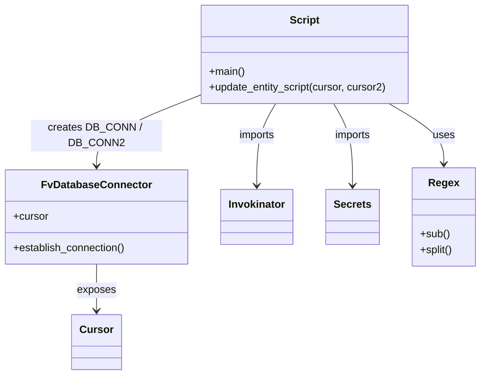

# Diagram: entity_core/entity_service/entity_service_scripts/backfill_entity_last_position_types.py


> Auto-generated by Obscura crawlers

## Diagram 1



### SVG

<svg id="container" width="725.3359375" xmlns="http://www.w3.org/2000/svg" class="classDiagram" height="572" viewBox="0 0 725.3359375 572" role="graphics-document document" aria-roledescription="class"><style>#container{font-family:"trebuchet ms",verdana,arial,sans-serif;font-size:16px;fill:#333;}@keyframes edge-animation-frame{from{stroke-dashoffset:0;}}@keyframes dash{to{stroke-dashoffset:0;}}#container .edge-animation-slow{stroke-dasharray:9,5!important;stroke-dashoffset:900;animation:dash 50s linear infinite;stroke-linecap:round;}#container .edge-animation-fast{stroke-dasharray:9,5!important;stroke-dashoffset:900;animation:dash 20s linear infinite;stroke-linecap:round;}#container .error-icon{fill:#552222;}#container .error-text{fill:#552222;stroke:#552222;}#container .edge-thickness-normal{stroke-width:1px;}#container .edge-thickness-thick{stroke-width:3.5px;}#container .edge-pattern-solid{stroke-dasharray:0;}#container .edge-thickness-invisible{stroke-width:0;fill:none;}#container .edge-pattern-dashed{stroke-dasharray:3;}#container .edge-pattern-dotted{stroke-dasharray:2;}#container .marker{fill:#333333;stroke:#333333;}#container .marker.cross{stroke:#333333;}#container svg{font-family:"trebuchet ms",verdana,arial,sans-serif;font-size:16px;}#container p{margin:0;}#container g.classGroup text{fill:#9370DB;stroke:none;font-family:"trebuchet ms",verdana,arial,sans-serif;font-size:10px;}#container g.classGroup text .title{font-weight:bolder;}#container .nodeLabel,#container .edgeLabel{color:#131300;}#container .edgeLabel .label rect{fill:#ECECFF;}#container .label text{fill:#131300;}#container .labelBkg{background:#ECECFF;}#container .edgeLabel .label span{background:#ECECFF;}#container .classTitle{font-weight:bolder;}#container .node rect,#container .node circle,#container .node ellipse,#container .node polygon,#container .node path{fill:#ECECFF;stroke:#9370DB;stroke-width:1px;}#container .divider{stroke:#9370DB;stroke-width:1;}#container g.clickable{cursor:pointer;}#container g.classGroup rect{fill:#ECECFF;stroke:#9370DB;}#container g.classGroup line{stroke:#9370DB;stroke-width:1;}#container .classLabel .box{stroke:none;stroke-width:0;fill:#ECECFF;opacity:0.5;}#container .classLabel .label{fill:#9370DB;font-size:10px;}#container .relation{stroke:#333333;stroke-width:1;fill:none;}#container .dashed-line{stroke-dasharray:3;}#container .dotted-line{stroke-dasharray:1 2;}#container #compositionStart,#container .composition{fill:#333333!important;stroke:#333333!important;stroke-width:1;}#container #compositionEnd,#container .composition{fill:#333333!important;stroke:#333333!important;stroke-width:1;}#container #dependencyStart,#container .dependency{fill:#333333!important;stroke:#333333!important;stroke-width:1;}#container #dependencyStart,#container .dependency{fill:#333333!important;stroke:#333333!important;stroke-width:1;}#container #extensionStart,#container .extension{fill:transparent!important;stroke:#333333!important;stroke-width:1;}#container #extensionEnd,#container .extension{fill:transparent!important;stroke:#333333!important;stroke-width:1;}#container #aggregationStart,#container .aggregation{fill:transparent!important;stroke:#333333!important;stroke-width:1;}#container #aggregationEnd,#container .aggregation{fill:transparent!important;stroke:#333333!important;stroke-width:1;}#container #lollipopStart,#container .lollipop{fill:#ECECFF!important;stroke:#333333!important;stroke-width:1;}#container #lollipopEnd,#container .lollipop{fill:#ECECFF!important;stroke:#333333!important;stroke-width:1;}#container .edgeTerminals{font-size:11px;line-height:initial;}#container .classTitleText{text-anchor:middle;font-size:18px;fill:#333;}#container .label-icon{display:inline-block;height:1em;overflow:visible;vertical-align:-0.125em;}#container .node .label-icon path{fill:currentColor;stroke:revert;stroke-width:revert;}#container :root{--mermaid-font-family:"trebuchet ms",verdana,arial,sans-serif;}</style><g><defs><marker id="container_class-aggregationStart" class="marker aggregation class" refX="18" refY="7" markerWidth="190" markerHeight="240" orient="auto"><path d="M 18,7 L9,13 L1,7 L9,1 Z"></path></marker></defs><defs><marker id="container_class-aggregationEnd" class="marker aggregation class" refX="1" refY="7" markerWidth="20" markerHeight="28" orient="auto"><path d="M 18,7 L9,13 L1,7 L9,1 Z"></path></marker></defs><defs><marker id="container_class-extensionStart" class="marker extension class" refX="18" refY="7" markerWidth="190" markerHeight="240" orient="auto"><path d="M 1,7 L18,13 V 1 Z"></path></marker></defs><defs><marker id="container_class-extensionEnd" class="marker extension class" refX="1" refY="7" markerWidth="20" markerHeight="28" orient="auto"><path d="M 1,1 V 13 L18,7 Z"></path></marker></defs><defs><marker id="container_class-compositionStart" class="marker composition class" refX="18" refY="7" markerWidth="190" markerHeight="240" orient="auto"><path d="M 18,7 L9,13 L1,7 L9,1 Z"></path></marker></defs><defs><marker id="container_class-compositionEnd" class="marker composition class" refX="1" refY="7" markerWidth="20" markerHeight="28" orient="auto"><path d="M 18,7 L9,13 L1,7 L9,1 Z"></path></marker></defs><defs><marker id="container_class-dependencyStart" class="marker dependency class" refX="6" refY="7" markerWidth="190" markerHeight="240" orient="auto"><path d="M 5,7 L9,13 L1,7 L9,1 Z"></path></marker></defs><defs><marker id="container_class-dependencyEnd" class="marker dependency class" refX="13" refY="7" markerWidth="20" markerHeight="28" orient="auto"><path d="M 18,7 L9,13 L14,7 L9,1 Z"></path></marker></defs><defs><marker id="container_class-lollipopStart" class="marker lollipop class" refX="13" refY="7" markerWidth="190" markerHeight="240" orient="auto"><circle stroke="black" fill="transparent" cx="7" cy="7" r="6"></circle></marker></defs><defs><marker id="container_class-lollipopEnd" class="marker lollipop class" refX="1" refY="7" markerWidth="190" markerHeight="240" orient="auto"><circle stroke="black" fill="transparent" cx="7" cy="7" r="6"></circle></marker></defs><g class="root"><g class="clusters"></g><g class="edgePaths"><path d="M300.289,146.194L274.622,156.328C248.954,166.463,197.62,186.731,171.952,204.532C146.285,222.333,146.285,237.667,146.285,245.333L146.285,253" id="id_Script_FvDatabaseConnector_1" class="edge-thickness-normal edge-pattern-solid relation" style=";;;" data-edge="true" data-et="edge" data-id="id_Script_FvDatabaseConnector_1" data-points="W3sieCI6MzAwLjI4OTA2MjUsInkiOjE0Ni4xOTM3NjEwMzg4MzE4fSx7IngiOjE0Ni4yODUxNTYyNSwieSI6MjA3fSx7IngiOjE0Ni4yODUxNTYyNSwieSI6MjU5fV0=" marker-end="url(#container_class-dependencyEnd)"></path><path d="M417.006,158L412.288,166.167C407.569,174.333,398.132,190.667,393.414,211.5C388.695,232.333,388.695,257.667,388.695,270.333L388.695,283" id="id_Script_Invokinator_2" class="edge-thickness-normal edge-pattern-solid relation" style=";;;" data-edge="true" data-et="edge" data-id="id_Script_Invokinator_2" data-points="W3sieCI6NDE3LjAwNjQ1NzkxMzMwNjQ2LCJ5IjoxNTh9LHsieCI6Mzg4LjY5NTMxMjUsInkiOjIwN30seyJ4IjozODguNjk1MzEyNSwieSI6Mjg5fV0=" marker-end="url(#container_class-dependencyEnd)"></path><path d="M503.673,158L508.392,166.167C513.11,174.333,522.547,190.667,527.266,211.5C531.984,232.333,531.984,257.667,531.984,270.333L531.984,283" id="id_Script_Secrets_3" class="edge-thickness-normal edge-pattern-solid relation" style=";;;" data-edge="true" data-et="edge" data-id="id_Script_Secrets_3" data-points="W3sieCI6NTAzLjY3MzIyOTU4NjY5MzU0LCJ5IjoxNTh9LHsieCI6NTMxLjk4NDM3NSwieSI6MjA3fSx7IngiOjUzMS45ODQzNzUsInkiOjI4OX1d" marker-end="url(#container_class-dependencyEnd)"></path><path d="M586.692,158L600.45,166.167C614.209,174.333,641.725,190.667,655.484,206C669.242,221.333,669.242,235.667,669.242,242.833L669.242,250" id="id_Script_Regex_4" class="edge-thickness-normal edge-pattern-solid relation" style=";;;" data-edge="true" data-et="edge" data-id="id_Script_Regex_4" data-points="W3sieCI6NTg2LjY5MjA2Nzc5MjMzODcsInkiOjE1OH0seyJ4Ijo2NjkuMjQyMTg3NSwieSI6MjA3fSx7IngiOjY2OS4yNDIxODc1LCJ5IjoyNTZ9XQ==" marker-end="url(#container_class-dependencyEnd)"></path><path d="M146.285,403L146.285,409.667C146.285,416.333,146.285,429.667,146.285,441.5C146.285,453.333,146.285,463.667,146.285,468.833L146.285,474" id="id_FvDatabaseConnector_Cursor_5" class="edge-thickness-normal edge-pattern-solid relation" style=";;;" data-edge="true" data-et="edge" data-id="id_FvDatabaseConnector_Cursor_5" data-points="W3sieCI6MTQ2LjI4NTE1NjI1LCJ5Ijo0MDN9LHsieCI6MTQ2LjI4NTE1NjI1LCJ5Ijo0NDN9LHsieCI6MTQ2LjI4NTE1NjI1LCJ5Ijo0ODB9XQ==" marker-end="url(#container_class-dependencyEnd)"></path></g><g class="edgeLabels"><g class="edgeLabel" transform="translate(146.28515625, 207)"><g class="label" data-id="id_Script_FvDatabaseConnector_1" transform="translate(-100, -24)"><foreignObject width="200" height="48"><div xmlns="http://www.w3.org/1999/xhtml" class="labelBkg" style="display: table; white-space: break-spaces; line-height: 1.5; max-width: 200px; text-align: center; width: 200px;"><span class="edgeLabel"><p>creates DB_CONN / DB_CONN2</p></span></div></foreignObject></g></g><g class="edgeLabel" transform="translate(388.6953125, 207)"><g class="label" data-id="id_Script_Invokinator_2" transform="translate(-28.25, -12)"><foreignObject width="56.5" height="24"><div xmlns="http://www.w3.org/1999/xhtml" class="labelBkg" style="display: table-cell; white-space: nowrap; line-height: 1.5; max-width: 200px; text-align: center;"><span class="edgeLabel"><p>imports</p></span></div></foreignObject></g></g><g class="edgeLabel" transform="translate(531.984375, 207)"><g class="label" data-id="id_Script_Secrets_3" transform="translate(-28.25, -12)"><foreignObject width="56.5" height="24"><div xmlns="http://www.w3.org/1999/xhtml" class="labelBkg" style="display: table-cell; white-space: nowrap; line-height: 1.5; max-width: 200px; text-align: center;"><span class="edgeLabel"><p>imports</p></span></div></foreignObject></g></g><g class="edgeLabel" transform="translate(669.2421875, 207)"><g class="label" data-id="id_Script_Regex_4" transform="translate(-16.4921875, -12)"><foreignObject width="32.984375" height="24"><div xmlns="http://www.w3.org/1999/xhtml" class="labelBkg" style="display: table-cell; white-space: nowrap; line-height: 1.5; max-width: 200px; text-align: center;"><span class="edgeLabel"><p>uses</p></span></div></foreignObject></g></g><g class="edgeLabel" transform="translate(146.28515625, 443)"><g class="label" data-id="id_FvDatabaseConnector_Cursor_5" transform="translate(-29.4296875, -12)"><foreignObject width="58.859375" height="24"><div xmlns="http://www.w3.org/1999/xhtml" class="labelBkg" style="display: table-cell; white-space: nowrap; line-height: 1.5; max-width: 200px; text-align: center;"><span class="edgeLabel"><p>exposes</p></span></div></foreignObject></g></g></g><g class="nodes"><g class="node default" id="classId-Script-0" transform="translate(460.33984375, 83)"><g class="basic label-container"><path d="M-160.05078125 -75 L160.05078125 -75 L160.05078125 75 L-160.05078125 75" stroke="none" stroke-width="0" fill="#ECECFF" style=""></path><path d="M-160.05078125 -75 C-60.19227308795254 -75, 39.666235074094914 -75, 160.05078125 -75 M-160.05078125 -75 C-88.5944525675093 -75, -17.138123885018587 -75, 160.05078125 -75 M160.05078125 -75 C160.05078125 -44.472049148948955, 160.05078125 -13.944098297897902, 160.05078125 75 M160.05078125 -75 C160.05078125 -16.240111615016183, 160.05078125 42.519776769967635, 160.05078125 75 M160.05078125 75 C72.23540136318587 75, -15.579978523628256 75, -160.05078125 75 M160.05078125 75 C95.35629234150188 75, 30.66180343300377 75, -160.05078125 75 M-160.05078125 75 C-160.05078125 43.43370549194806, -160.05078125 11.867410983896129, -160.05078125 -75 M-160.05078125 75 C-160.05078125 25.956655830904204, -160.05078125 -23.086688338191593, -160.05078125 -75" stroke="#9370DB" stroke-width="1.3" fill="none" stroke-dasharray="0 0" style=""></path></g><g class="annotation-group text" transform="translate(0, -51)"></g><g class="label-group text" transform="translate(-21.7421875, -51)"><g class="label" style="font-weight: bolder" transform="translate(0,-12)"><foreignObject width="43.484375" height="24"><div xmlns="http://www.w3.org/1999/xhtml" style="display: table-cell; white-space: nowrap; line-height: 1.5; max-width: 93px; text-align: center;"><span class="nodeLabel markdown-node-label" style=""><p>Script</p></span></div></foreignObject></g></g><g class="members-group text" transform="translate(-148.05078125, -3)"></g><g class="methods-group text" transform="translate(-148.05078125, 27)"><g class="label" style="" transform="translate(0,-12)"><foreignObject width="54.65625" height="24"><div xmlns="http://www.w3.org/1999/xhtml" style="display: table-cell; white-space: nowrap; line-height: 1.5; max-width: 112px; text-align: center;"><span class="nodeLabel markdown-node-label" style=""><p>+main()</p></span></div></foreignObject></g><g class="label" style="" transform="translate(0,12)"><foreignObject width="274.359375" height="24"><div xmlns="http://www.w3.org/1999/xhtml" style="display: table-cell; white-space: nowrap; line-height: 1.5; max-width: 332px; text-align: center;"><span class="nodeLabel markdown-node-label" style=""><p>+update_entity_script(cursor, cursor2)</p></span></div></foreignObject></g></g><g class="divider" style=""><path d="M-160.05078125 -27 C-58.96517437015575 -27, 42.1204325096885 -27, 160.05078125 -27 M-160.05078125 -27 C-40.85815601365617 -27, 78.33446922268766 -27, 160.05078125 -27" stroke="#9370DB" stroke-width="1.3" fill="none" stroke-dasharray="0 0" style=""></path></g><g class="divider" style=""><path d="M-160.05078125 -3 C-55.59948154223639 -3, 48.85181816552722 -3, 160.05078125 -3 M-160.05078125 -3 C-54.19928649776092 -3, 51.652208254478154 -3, 160.05078125 -3" stroke="#9370DB" stroke-width="1.3" fill="none" stroke-dasharray="0 0" style=""></path></g></g><g class="node default" id="classId-FvDatabaseConnector-1" transform="translate(146.28515625, 331)"><g class="basic label-container"><path d="M-138.28515625 -72 L138.28515625 -72 L138.28515625 72 L-138.28515625 72" stroke="none" stroke-width="0" fill="#ECECFF" style=""></path><path d="M-138.28515625 -72 C-44.873303557740144 -72, 48.53854913451971 -72, 138.28515625 -72 M-138.28515625 -72 C-75.82970777086518 -72, -13.374259291730368 -72, 138.28515625 -72 M138.28515625 -72 C138.28515625 -42.5815092057661, 138.28515625 -13.163018411532207, 138.28515625 72 M138.28515625 -72 C138.28515625 -24.93131924847455, 138.28515625 22.137361503050897, 138.28515625 72 M138.28515625 72 C52.892750353977746 72, -32.49965554204451 72, -138.28515625 72 M138.28515625 72 C64.32194595163885 72, -9.641264346722295 72, -138.28515625 72 M-138.28515625 72 C-138.28515625 25.962731596308792, -138.28515625 -20.074536807382415, -138.28515625 -72 M-138.28515625 72 C-138.28515625 36.21544298924369, -138.28515625 0.43088597848738175, -138.28515625 -72" stroke="#9370DB" stroke-width="1.3" fill="none" stroke-dasharray="0 0" style=""></path></g><g class="annotation-group text" transform="translate(0, -48)"></g><g class="label-group text" transform="translate(-79.3046875, -48)"><g class="label" style="font-weight: bolder" transform="translate(0,-12)"><foreignObject width="158.609375" height="24"><div xmlns="http://www.w3.org/1999/xhtml" style="display: table-cell; white-space: nowrap; line-height: 1.5; max-width: 207px; text-align: center;"><span class="nodeLabel markdown-node-label" style=""><p>FvDatabaseConnector</p></span></div></foreignObject></g></g><g class="members-group text" transform="translate(-126.28515625, 0)"><g class="label" style="" transform="translate(0,-12)"><foreignObject width="53.71875" height="24"><div xmlns="http://www.w3.org/1999/xhtml" style="display: table-cell; white-space: nowrap; line-height: 1.5; max-width: 112px; text-align: center;"><span class="nodeLabel markdown-node-label" style=""><p>+cursor</p></span></div></foreignObject></g></g><g class="methods-group text" transform="translate(-126.28515625, 48)"><g class="label" style="" transform="translate(0,-12)"><foreignObject width="173.265625" height="24"><div xmlns="http://www.w3.org/1999/xhtml" style="display: table-cell; white-space: nowrap; line-height: 1.5; max-width: 231px; text-align: center;"><span class="nodeLabel markdown-node-label" style=""><p>+establish_connection()</p></span></div></foreignObject></g></g><g class="divider" style=""><path d="M-138.28515625 -24 C-39.90590789154436 -24, 58.47334046691128 -24, 138.28515625 -24 M-138.28515625 -24 C-48.775691621123485 -24, 40.73377300775303 -24, 138.28515625 -24" stroke="#9370DB" stroke-width="1.3" fill="none" stroke-dasharray="0 0" style=""></path></g><g class="divider" style=""><path d="M-138.28515625 24 C-37.307291524920316 24, 63.67057320015937 24, 138.28515625 24 M-138.28515625 24 C-35.018922195007775 24, 68.24731185998445 24, 138.28515625 24" stroke="#9370DB" stroke-width="1.3" fill="none" stroke-dasharray="0 0" style=""></path></g></g><g class="node default" id="classId-Cursor-2" transform="translate(146.28515625, 522)"><g class="basic label-container"><path d="M-35.90625 -42 L35.90625 -42 L35.90625 42 L-35.90625 42" stroke="none" stroke-width="0" fill="#ECECFF" style=""></path><path d="M-35.90625 -42 C-17.108424971828413 -42, 1.6894000563431746 -42, 35.90625 -42 M-35.90625 -42 C-17.647987300366182 -42, 0.6102753992676355 -42, 35.90625 -42 M35.90625 -42 C35.90625 -24.298546435490852, 35.90625 -6.5970928709817045, 35.90625 42 M35.90625 -42 C35.90625 -12.243401490654868, 35.90625 17.513197018690263, 35.90625 42 M35.90625 42 C10.283863765504595 42, -15.33852246899081 42, -35.90625 42 M35.90625 42 C18.762676015770097 42, 1.6191020315401943 42, -35.90625 42 M-35.90625 42 C-35.90625 15.450519854312102, -35.90625 -11.098960291375796, -35.90625 -42 M-35.90625 42 C-35.90625 15.277082490421503, -35.90625 -11.445835019156995, -35.90625 -42" stroke="#9370DB" stroke-width="1.3" fill="none" stroke-dasharray="0 0" style=""></path></g><g class="annotation-group text" transform="translate(0, -18)"></g><g class="label-group text" transform="translate(-23.90625, -18)"><g class="label" style="font-weight: bolder" transform="translate(0,-12)"><foreignObject width="47.8125" height="24"><div xmlns="http://www.w3.org/1999/xhtml" style="display: table-cell; white-space: nowrap; line-height: 1.5; max-width: 98px; text-align: center;"><span class="nodeLabel markdown-node-label" style=""><p>Cursor</p></span></div></foreignObject></g></g><g class="members-group text" transform="translate(-23.90625, 30)"></g><g class="methods-group text" transform="translate(-23.90625, 60)"></g><g class="divider" style=""><path d="M-35.90625 6 C-14.512203799762645 6, 6.88184240047471 6, 35.90625 6 M-35.90625 6 C-16.40898276883727 6, 3.0882844623254613 6, 35.90625 6" stroke="#9370DB" stroke-width="1.3" fill="none" stroke-dasharray="0 0" style=""></path></g><g class="divider" style=""><path d="M-35.90625 24 C-12.587615156235014 24, 10.731019687529972 24, 35.90625 24 M-35.90625 24 C-12.013907519559172 24, 11.878434960881656 24, 35.90625 24" stroke="#9370DB" stroke-width="1.3" fill="none" stroke-dasharray="0 0" style=""></path></g></g><g class="node default" id="classId-Invokinator-3" transform="translate(388.6953125, 331)"><g class="basic label-container"><path d="M-54.125 -42 L54.125 -42 L54.125 42 L-54.125 42" stroke="none" stroke-width="0" fill="#ECECFF" style=""></path><path d="M-54.125 -42 C-17.51082847049736 -42, 19.103343059005283 -42, 54.125 -42 M-54.125 -42 C-25.74939999937094 -42, 2.6262000012581197 -42, 54.125 -42 M54.125 -42 C54.125 -16.19533985028427, 54.125 9.60932029943146, 54.125 42 M54.125 -42 C54.125 -10.678176591922504, 54.125 20.64364681615499, 54.125 42 M54.125 42 C29.732073922403274 42, 5.339147844806547 42, -54.125 42 M54.125 42 C17.88322156883725 42, -18.3585568623255 42, -54.125 42 M-54.125 42 C-54.125 23.43040409285846, -54.125 4.86080818571692, -54.125 -42 M-54.125 42 C-54.125 12.886593512886073, -54.125 -16.226812974227855, -54.125 -42" stroke="#9370DB" stroke-width="1.3" fill="none" stroke-dasharray="0 0" style=""></path></g><g class="annotation-group text" transform="translate(0, -18)"></g><g class="label-group text" transform="translate(-42.125, -18)"><g class="label" style="font-weight: bolder" transform="translate(0,-12)"><foreignObject width="84.25" height="24"><div xmlns="http://www.w3.org/1999/xhtml" style="display: table-cell; white-space: nowrap; line-height: 1.5; max-width: 134px; text-align: center;"><span class="nodeLabel markdown-node-label" style=""><p>Invokinator</p></span></div></foreignObject></g></g><g class="members-group text" transform="translate(-42.125, 30)"></g><g class="methods-group text" transform="translate(-42.125, 60)"></g><g class="divider" style=""><path d="M-54.125 6 C-28.429675655027758 6, -2.7343513100555157 6, 54.125 6 M-54.125 6 C-31.723121650120355 6, -9.32124330024071 6, 54.125 6" stroke="#9370DB" stroke-width="1.3" fill="none" stroke-dasharray="0 0" style=""></path></g><g class="divider" style=""><path d="M-54.125 24 C-30.029773440505675 24, -5.93454688101135 24, 54.125 24 M-54.125 24 C-17.72306587101845 24, 18.678868257963103 24, 54.125 24" stroke="#9370DB" stroke-width="1.3" fill="none" stroke-dasharray="0 0" style=""></path></g></g><g class="node default" id="classId-Secrets-4" transform="translate(531.984375, 331)"><g class="basic label-container"><path d="M-39.1640625 -42 L39.1640625 -42 L39.1640625 42 L-39.1640625 42" stroke="none" stroke-width="0" fill="#ECECFF" style=""></path><path d="M-39.1640625 -42 C-18.44125255195387 -42, 2.2815573960922606 -42, 39.1640625 -42 M-39.1640625 -42 C-22.5883161243464 -42, -6.012569748692798 -42, 39.1640625 -42 M39.1640625 -42 C39.1640625 -21.945388968206025, 39.1640625 -1.89077793641205, 39.1640625 42 M39.1640625 -42 C39.1640625 -20.896388195224915, 39.1640625 0.20722360955016939, 39.1640625 42 M39.1640625 42 C13.308225061521505 42, -12.547612376956991 42, -39.1640625 42 M39.1640625 42 C17.609204513006635 42, -3.945653473986731 42, -39.1640625 42 M-39.1640625 42 C-39.1640625 15.112769404097438, -39.1640625 -11.774461191805123, -39.1640625 -42 M-39.1640625 42 C-39.1640625 21.949740921297575, -39.1640625 1.8994818425951507, -39.1640625 -42" stroke="#9370DB" stroke-width="1.3" fill="none" stroke-dasharray="0 0" style=""></path></g><g class="annotation-group text" transform="translate(0, -18)"></g><g class="label-group text" transform="translate(-27.1640625, -18)"><g class="label" style="font-weight: bolder" transform="translate(0,-12)"><foreignObject width="54.328125" height="24"><div xmlns="http://www.w3.org/1999/xhtml" style="display: table-cell; white-space: nowrap; line-height: 1.5; max-width: 103px; text-align: center;"><span class="nodeLabel markdown-node-label" style=""><p>Secrets</p></span></div></foreignObject></g></g><g class="members-group text" transform="translate(-27.1640625, 30)"></g><g class="methods-group text" transform="translate(-27.1640625, 60)"></g><g class="divider" style=""><path d="M-39.1640625 6 C-9.068902701592396 6, 21.026257096815208 6, 39.1640625 6 M-39.1640625 6 C-9.720143793177694 6, 19.72377491364461 6, 39.1640625 6" stroke="#9370DB" stroke-width="1.3" fill="none" stroke-dasharray="0 0" style=""></path></g><g class="divider" style=""><path d="M-39.1640625 24 C-14.786340394934392 24, 9.591381710131216 24, 39.1640625 24 M-39.1640625 24 C-16.243220944563436 24, 6.677620610873127 24, 39.1640625 24" stroke="#9370DB" stroke-width="1.3" fill="none" stroke-dasharray="0 0" style=""></path></g></g><g class="node default" id="classId-Regex-5" transform="translate(669.2421875, 331)"><g class="basic label-container"><path d="M-48.09375 -75 L48.09375 -75 L48.09375 75 L-48.09375 75" stroke="none" stroke-width="0" fill="#ECECFF" style=""></path><path d="M-48.09375 -75 C-24.037286831288824 -75, 0.019176337422351253 -75, 48.09375 -75 M-48.09375 -75 C-14.639658078840718 -75, 18.814433842318564 -75, 48.09375 -75 M48.09375 -75 C48.09375 -20.112371326648145, 48.09375 34.77525734670371, 48.09375 75 M48.09375 -75 C48.09375 -21.015497309897498, 48.09375 32.969005380205004, 48.09375 75 M48.09375 75 C16.47882761109843 75, -15.136094777803137 75, -48.09375 75 M48.09375 75 C27.514349493568115 75, 6.934948987136231 75, -48.09375 75 M-48.09375 75 C-48.09375 32.87621363929369, -48.09375 -9.247572721412624, -48.09375 -75 M-48.09375 75 C-48.09375 39.27559316374653, -48.09375 3.551186327493056, -48.09375 -75" stroke="#9370DB" stroke-width="1.3" fill="none" stroke-dasharray="0 0" style=""></path></g><g class="annotation-group text" transform="translate(0, -51)"></g><g class="label-group text" transform="translate(-21.875, -51)"><g class="label" style="font-weight: bolder" transform="translate(0,-12)"><foreignObject width="43.75" height="24"><div xmlns="http://www.w3.org/1999/xhtml" style="display: table-cell; white-space: nowrap; line-height: 1.5; max-width: 93px; text-align: center;"><span class="nodeLabel markdown-node-label" style=""><p>Regex</p></span></div></foreignObject></g></g><g class="members-group text" transform="translate(-36.09375, -3)"></g><g class="methods-group text" transform="translate(-36.09375, 27)"><g class="label" style="" transform="translate(0,-12)"><foreignObject width="44.640625" height="24"><div xmlns="http://www.w3.org/1999/xhtml" style="display: table-cell; white-space: nowrap; line-height: 1.5; max-width: 102px; text-align: center;"><span class="nodeLabel markdown-node-label" style=""><p>+sub()</p></span></div></foreignObject></g><g class="label" style="" transform="translate(0,12)"><foreignObject width="50.3125" height="24"><div xmlns="http://www.w3.org/1999/xhtml" style="display: table-cell; white-space: nowrap; line-height: 1.5; max-width: 108px; text-align: center;"><span class="nodeLabel markdown-node-label" style=""><p>+split()</p></span></div></foreignObject></g></g><g class="divider" style=""><path d="M-48.09375 -27 C-11.608018691819538 -27, 24.877712616360924 -27, 48.09375 -27 M-48.09375 -27 C-19.886251553883188 -27, 8.321246892233624 -27, 48.09375 -27" stroke="#9370DB" stroke-width="1.3" fill="none" stroke-dasharray="0 0" style=""></path></g><g class="divider" style=""><path d="M-48.09375 -3 C-20.875263367716435 -3, 6.343223264567129 -3, 48.09375 -3 M-48.09375 -3 C-19.321362771002043 -3, 9.451024457995914 -3, 48.09375 -3" stroke="#9370DB" stroke-width="1.3" fill="none" stroke-dasharray="0 0" style=""></path></g></g></g></g></g></svg>

## Diagram 2

```mermaid
flowchart TD
    main[main()] --> establish1[DB_CONN.establish_connection()]
    establish1 --> cursor1[DB_CONN.cursor]
    main --> establish2[DB_CONN2.establish_connection()]
    establish2 --> cursor2[DB_CONN2.cursor]
    cursor1 --> update[update_entity_script(cursor, cursor2)]
    cursor2 --> update
    update --> selectSolutions[Execute: select * from solution where feature_id in (2)]
    selectSolutions --> solutionLoop{for each solution}
    solutionLoop --> setSolutionId[set solution_id = solution.external_id]
    setSolutionId --> positionLoop{for each PositionType i}
    positionLoop --> prepareStrings[compute j (split CamelCase) and p="{positionType}"]
    prepareStrings --> whileLoop{while res or res2}
    whileLoop --> query1[Run WITH cte ... last_entity_position_update ->> 'positionType' = j LIMIT 100]
    query1 --> update1[UPDATE entity SET last_entity_position_update = jsonb_set(... i) RETURNING cte.id]
    update1 --> fetchRes1[fetch res]
    fetchRes1 --> printRes1[print(res)]
    printRes1 --> query2[Run WITH cte ... last_position_update ->> 'positionType' = j LIMIT 100]
    query2 --> update2[UPDATE entity SET last_position_update = jsonb_set(... i) RETURNING cte.id]
    update2 --> fetchRes2[fetch res2]
    fetchRes2 --> printRes2[print(res2)]
    printRes2 --> whileLoop
    whileLoop --> endPosition[exit while when no rows]
    endPosition --> positionLoop
    positionLoop --> endSolution[done with solution]
    endSolution --> solutionLoop
    solutionLoop --> endAll[all solutions processed]
```

> SVG rendering failed for this diagram.
