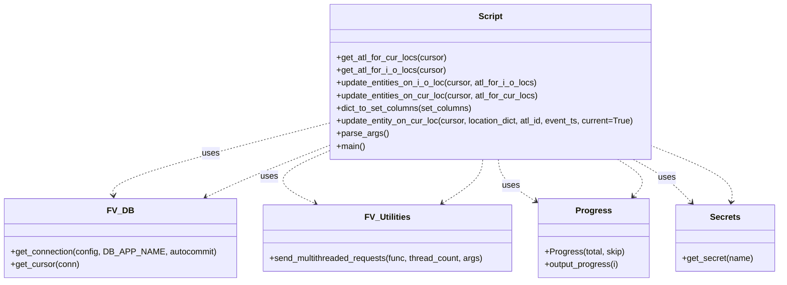

# Diagram: entity_core/entity_service/entity_service_scripts/backfill_entity_location_ids.py


> Auto-generated by Obscura crawlers

## Diagram 1



### SVG

<svg id="container" width="1461.7578125" xmlns="http://www.w3.org/2000/svg" class="classDiagram" height="534" viewBox="0 0 1461.7578125 534" role="graphics-document document" aria-roledescription="class"><style>#container{font-family:"trebuchet ms",verdana,arial,sans-serif;font-size:16px;fill:#333;}@keyframes edge-animation-frame{from{stroke-dashoffset:0;}}@keyframes dash{to{stroke-dashoffset:0;}}#container .edge-animation-slow{stroke-dasharray:9,5!important;stroke-dashoffset:900;animation:dash 50s linear infinite;stroke-linecap:round;}#container .edge-animation-fast{stroke-dasharray:9,5!important;stroke-dashoffset:900;animation:dash 20s linear infinite;stroke-linecap:round;}#container .error-icon{fill:#552222;}#container .error-text{fill:#552222;stroke:#552222;}#container .edge-thickness-normal{stroke-width:1px;}#container .edge-thickness-thick{stroke-width:3.5px;}#container .edge-pattern-solid{stroke-dasharray:0;}#container .edge-thickness-invisible{stroke-width:0;fill:none;}#container .edge-pattern-dashed{stroke-dasharray:3;}#container .edge-pattern-dotted{stroke-dasharray:2;}#container .marker{fill:#333333;stroke:#333333;}#container .marker.cross{stroke:#333333;}#container svg{font-family:"trebuchet ms",verdana,arial,sans-serif;font-size:16px;}#container p{margin:0;}#container g.classGroup text{fill:#9370DB;stroke:none;font-family:"trebuchet ms",verdana,arial,sans-serif;font-size:10px;}#container g.classGroup text .title{font-weight:bolder;}#container .nodeLabel,#container .edgeLabel{color:#131300;}#container .edgeLabel .label rect{fill:#ECECFF;}#container .label text{fill:#131300;}#container .labelBkg{background:#ECECFF;}#container .edgeLabel .label span{background:#ECECFF;}#container .classTitle{font-weight:bolder;}#container .node rect,#container .node circle,#container .node ellipse,#container .node polygon,#container .node path{fill:#ECECFF;stroke:#9370DB;stroke-width:1px;}#container .divider{stroke:#9370DB;stroke-width:1;}#container g.clickable{cursor:pointer;}#container g.classGroup rect{fill:#ECECFF;stroke:#9370DB;}#container g.classGroup line{stroke:#9370DB;stroke-width:1;}#container .classLabel .box{stroke:none;stroke-width:0;fill:#ECECFF;opacity:0.5;}#container .classLabel .label{fill:#9370DB;font-size:10px;}#container .relation{stroke:#333333;stroke-width:1;fill:none;}#container .dashed-line{stroke-dasharray:3;}#container .dotted-line{stroke-dasharray:1 2;}#container #compositionStart,#container .composition{fill:#333333!important;stroke:#333333!important;stroke-width:1;}#container #compositionEnd,#container .composition{fill:#333333!important;stroke:#333333!important;stroke-width:1;}#container #dependencyStart,#container .dependency{fill:#333333!important;stroke:#333333!important;stroke-width:1;}#container #dependencyStart,#container .dependency{fill:#333333!important;stroke:#333333!important;stroke-width:1;}#container #extensionStart,#container .extension{fill:transparent!important;stroke:#333333!important;stroke-width:1;}#container #extensionEnd,#container .extension{fill:transparent!important;stroke:#333333!important;stroke-width:1;}#container #aggregationStart,#container .aggregation{fill:transparent!important;stroke:#333333!important;stroke-width:1;}#container #aggregationEnd,#container .aggregation{fill:transparent!important;stroke:#333333!important;stroke-width:1;}#container #lollipopStart,#container .lollipop{fill:#ECECFF!important;stroke:#333333!important;stroke-width:1;}#container #lollipopEnd,#container .lollipop{fill:#ECECFF!important;stroke:#333333!important;stroke-width:1;}#container .edgeTerminals{font-size:11px;line-height:initial;}#container .classTitleText{text-anchor:middle;font-size:18px;fill:#333;}#container .label-icon{display:inline-block;height:1em;overflow:visible;vertical-align:-0.125em;}#container .node .label-icon path{fill:currentColor;stroke:revert;stroke-width:revert;}#container :root{--mermaid-font-family:"trebuchet ms",verdana,arial,sans-serif;}</style><g><defs><marker id="container_class-aggregationStart" class="marker aggregation class" refX="18" refY="7" markerWidth="190" markerHeight="240" orient="auto"><path d="M 18,7 L9,13 L1,7 L9,1 Z"></path></marker></defs><defs><marker id="container_class-aggregationEnd" class="marker aggregation class" refX="1" refY="7" markerWidth="20" markerHeight="28" orient="auto"><path d="M 18,7 L9,13 L1,7 L9,1 Z"></path></marker></defs><defs><marker id="container_class-extensionStart" class="marker extension class" refX="18" refY="7" markerWidth="190" markerHeight="240" orient="auto"><path d="M 1,7 L18,13 V 1 Z"></path></marker></defs><defs><marker id="container_class-extensionEnd" class="marker extension class" refX="1" refY="7" markerWidth="20" markerHeight="28" orient="auto"><path d="M 1,1 V 13 L18,7 Z"></path></marker></defs><defs><marker id="container_class-compositionStart" class="marker composition class" refX="18" refY="7" markerWidth="190" markerHeight="240" orient="auto"><path d="M 18,7 L9,13 L1,7 L9,1 Z"></path></marker></defs><defs><marker id="container_class-compositionEnd" class="marker composition class" refX="1" refY="7" markerWidth="20" markerHeight="28" orient="auto"><path d="M 18,7 L9,13 L1,7 L9,1 Z"></path></marker></defs><defs><marker id="container_class-dependencyStart" class="marker dependency class" refX="6" refY="7" markerWidth="190" markerHeight="240" orient="auto"><path d="M 5,7 L9,13 L1,7 L9,1 Z"></path></marker></defs><defs><marker id="container_class-dependencyEnd" class="marker dependency class" refX="13" refY="7" markerWidth="20" markerHeight="28" orient="auto"><path d="M 18,7 L9,13 L14,7 L9,1 Z"></path></marker></defs><defs><marker id="container_class-lollipopStart" class="marker lollipop class" refX="13" refY="7" markerWidth="190" markerHeight="240" orient="auto"><circle stroke="black" fill="transparent" cx="7" cy="7" r="6"></circle></marker></defs><defs><marker id="container_class-lollipopEnd" class="marker lollipop class" refX="1" refY="7" markerWidth="190" markerHeight="240" orient="auto"><circle stroke="black" fill="transparent" cx="7" cy="7" r="6"></circle></marker></defs><g class="root"><g class="clusters"></g><g class="edgePaths"><path d="M610.26,234.377L542.401,251.814C474.543,269.251,338.826,304.126,271.812,326.742C204.797,349.359,206.485,359.719,207.329,364.898L208.172,370.078" id="id_Script_FV_DB_1" class="edge-thickness-normal edge-pattern-dashed relation" style=";;;" data-edge="true" data-et="edge" data-id="id_Script_FV_DB_1" data-points="W3sieCI6NjEwLjI1OTc2NTYyNSwieSI6MjM0LjM3Njg3ODk5NDI2OTI1fSx7IngiOjIwMy4xMDkzNzUsInkiOjMzOX0seyJ4IjoyMDkuMTM3MTAyMzk5NTUzNTgsInkiOjM3Nn1d" marker-end="url(#container_class-dependencyEnd)"></path><path d="M610.26,287.592L590.299,296.16C570.337,304.728,530.415,321.864,526.516,338.165C522.617,354.466,554.743,369.932,570.805,377.664L586.868,385.397" id="id_Script_FV_Utilities_2" class="edge-thickness-normal edge-pattern-dashed relation" style=";;;" data-edge="true" data-et="edge" data-id="id_Script_FV_Utilities_2" data-points="W3sieCI6NjEwLjI1OTc2NTYyNSwieSI6Mjg3LjU5MTYwMTAxODc3NjI2fSx7IngiOjQ5MC40OTIxODc1LCJ5IjozMzl9LHsieCI6NTkyLjI3NDE2OTkyMTg3NSwieSI6Mzg4fV0=" marker-end="url(#container_class-dependencyEnd)"></path><path d="M933.739,302L934.351,308.167C934.962,314.333,936.185,326.667,948.31,340.086C960.434,353.506,983.46,368.012,994.973,375.266L1006.486,382.519" id="id_Script_Progress_3" class="edge-thickness-normal edge-pattern-dashed relation" style=";;;" data-edge="true" data-et="edge" data-id="id_Script_Progress_3" data-points="W3sieCI6OTMzLjczOTE1MTY2NDQwMjEsInkiOjMwMn0seyJ4Ijo5MzcuNDA4MjAzMTI1LCJ5IjozMzl9LHsieCI6MTAxMS41NjI1LCJ5IjozODUuNzE2ODA3ODM5Nzc2OH1d" marker-end="url(#container_class-dependencyEnd)"></path><path d="M1188.652,302L1199.957,308.167C1211.262,314.333,1233.872,326.667,1252.136,340.27C1270.4,353.873,1284.317,368.746,1291.275,376.182L1298.234,383.619" id="id_Script_Secrets_4" class="edge-thickness-normal edge-pattern-dashed relation" style=";;;" data-edge="true" data-et="edge" data-id="id_Script_Secrets_4" data-points="W3sieCI6MTE4OC42NTE3MDY4NjE0MTMsInkiOjMwMn0seyJ4IjoxMjU2LjQ4MjQyMTg3NSwieSI6MzM5fSx7IngiOjEzMDIuMzMzNjE4MTY0MDYyNSwieSI6Mzg4fV0=" marker-end="url(#container_class-dependencyEnd)"></path><path d="M382.55,373.397L394.459,367.664C406.367,361.932,430.183,350.466,468.135,334.431C506.087,318.397,558.173,297.793,584.216,287.491L610.26,277.19" id="id_FV_DB_Script_5" class="edge-thickness-normal edge-pattern-dashed relation" style=";;;" data-edge="true" data-et="edge" data-id="id_FV_DB_Script_5" data-points="W3sieCI6Mzc3LjE0NDIxNzM1NDkxMDcsInkiOjM3Nn0seyJ4Ijo0NTQsInkiOjMzOX0seyJ4Ijo2MTAuMjU5NzY1NjI1LCJ5IjoyNzcuMTg5NzI3MjAzNjM3ODZ9XQ==" marker-start="url(#container_class-dependencyStart)"></path><path d="M828.214,384.802L840.331,377.168C852.448,369.535,876.682,354.267,889.411,340.467C902.139,326.667,903.362,314.333,903.974,308.167L904.585,302" id="id_FV_Utilities_Script_6" class="edge-thickness-normal edge-pattern-dashed relation" style=";;;" data-edge="true" data-et="edge" data-id="id_FV_Utilities_Script_6" data-points="W3sieCI6ODIzLjEzNzU3MzI0MjE4NzUsInkiOjM4OH0seyJ4Ijo5MDAuOTE2MDE1NjI1LCJ5IjozMzl9LHsieCI6OTA0LjU4NTA2NzA4NTU5NzksInkiOjMwMn1d" marker-start="url(#container_class-dependencyStart)"></path><path d="M1189.467,371.619L1194.555,366.182C1199.642,360.746,1209.816,349.873,1204.821,338.27C1199.826,326.667,1179.662,314.333,1169.58,308.167L1159.498,302" id="id_Progress_Script_7" class="edge-thickness-normal edge-pattern-dashed relation" style=";;;" data-edge="true" data-et="edge" data-id="id_Progress_Script_7" data-points="W3sieCI6MTE4NS4zNjc5MDI0ODMyNTg4LCJ5IjozNzZ9LHsieCI6MTIxOS45OTAyMzQzNzUsInkiOjMzOX0seyJ4IjoxMTU5LjQ5NzYyMjI4MjYwODcsInkiOjMwMn1d" marker-start="url(#container_class-dependencyStart)"></path><path d="M1372.513,382.078L1373.683,374.898C1374.853,367.719,1377.192,353.359,1353.117,336.09C1329.042,318.821,1278.553,298.641,1253.309,288.552L1228.064,278.462" id="id_Secrets_Script_8" class="edge-thickness-normal edge-pattern-dashed relation" style=";;;" data-edge="true" data-et="edge" data-id="id_Secrets_Script_8" data-points="W3sieCI6MTM3MS41NDg1ODM5ODQzNzUsInkiOjM4OH0seyJ4IjoxMzc5LjUzMTI1LCJ5IjozMzl9LHsieCI6MTIyOC4wNjQ0NTMxMjUsInkiOjI3OC40NjE4NjE4NzIwNTQxfV0=" marker-start="url(#container_class-dependencyStart)"></path></g><g class="edgeLabels"><g class="edgeLabel" transform="translate(203.109375, 339)"><g class="label" data-id="id_Script_FV_DB_1" transform="translate(-16.4921875, -12)"><foreignObject width="32.984375" height="24"><div xmlns="http://www.w3.org/1999/xhtml" class="labelBkg" style="display: table-cell; white-space: nowrap; line-height: 1.5; max-width: 200px; text-align: center;"><span class="edgeLabel"><p>uses</p></span></div></foreignObject></g></g><g class="edgeLabel" transform="translate(498.4739, 335.57397)"><g class="label" data-id="id_Script_FV_Utilities_2" transform="translate(-16.4921875, -12)"><foreignObject width="32.984375" height="24"><div xmlns="http://www.w3.org/1999/xhtml" class="labelBkg" style="display: table-cell; white-space: nowrap; line-height: 1.5; max-width: 200px; text-align: center;"><span class="edgeLabel"><p>uses</p></span></div></foreignObject></g></g><g class="edgeLabel" transform="translate(958.75585, 352.4489)"><g class="label" data-id="id_Script_Progress_3" transform="translate(-16.4921875, -12)"><foreignObject width="32.984375" height="24"><div xmlns="http://www.w3.org/1999/xhtml" class="labelBkg" style="display: table-cell; white-space: nowrap; line-height: 1.5; max-width: 200px; text-align: center;"><span class="edgeLabel"><p>uses</p></span></div></foreignObject></g></g><g class="edgeLabel" transform="translate(1252.02322, 336.56761)"><g class="label" data-id="id_Script_Secrets_4" transform="translate(-16.4921875, -12)"><foreignObject width="32.984375" height="24"><div xmlns="http://www.w3.org/1999/xhtml" class="labelBkg" style="display: table-cell; white-space: nowrap; line-height: 1.5; max-width: 200px; text-align: center;"><span class="edgeLabel"><p>uses</p></span></div></foreignObject></g></g><g class="edgeLabel"><g class="label" data-id="id_FV_DB_Script_5" transform="translate(0, 0)"><foreignObject width="0" height="0"><div xmlns="http://www.w3.org/1999/xhtml" class="labelBkg" style="display: table-cell; white-space: nowrap; line-height: 1.5; max-width: 200px; text-align: center;"><span class="edgeLabel"></span></div></foreignObject></g></g><g class="edgeLabel"><g class="label" data-id="id_FV_Utilities_Script_6" transform="translate(0, 0)"><foreignObject width="0" height="0"><div xmlns="http://www.w3.org/1999/xhtml" class="labelBkg" style="display: table-cell; white-space: nowrap; line-height: 1.5; max-width: 200px; text-align: center;"><span class="edgeLabel"></span></div></foreignObject></g></g><g class="edgeLabel"><g class="label" data-id="id_Progress_Script_7" transform="translate(0, 0)"><foreignObject width="0" height="0"><div xmlns="http://www.w3.org/1999/xhtml" class="labelBkg" style="display: table-cell; white-space: nowrap; line-height: 1.5; max-width: 200px; text-align: center;"><span class="edgeLabel"></span></div></foreignObject></g></g><g class="edgeLabel"><g class="label" data-id="id_Secrets_Script_8" transform="translate(0, 0)"><foreignObject width="0" height="0"><div xmlns="http://www.w3.org/1999/xhtml" class="labelBkg" style="display: table-cell; white-space: nowrap; line-height: 1.5; max-width: 200px; text-align: center;"><span class="edgeLabel"></span></div></foreignObject></g></g></g><g class="nodes"><g class="node default" id="classId-Script-0" transform="translate(919.162109375, 155)"><g class="basic label-container"><path d="M-308.90234375 -147 L308.90234375 -147 L308.90234375 147 L-308.90234375 147" stroke="none" stroke-width="0" fill="#ECECFF" style=""></path><path d="M-308.90234375 -147 C-134.25125540636745 -147, 40.3998329372651 -147, 308.90234375 -147 M-308.90234375 -147 C-104.30052275912274 -147, 100.30129823175452 -147, 308.90234375 -147 M308.90234375 -147 C308.90234375 -74.96711254812077, 308.90234375 -2.9342250962415335, 308.90234375 147 M308.90234375 -147 C308.90234375 -42.231963020153216, 308.90234375 62.53607395969357, 308.90234375 147 M308.90234375 147 C62.47959845216104 147, -183.94314684567792 147, -308.90234375 147 M308.90234375 147 C184.8929442188434 147, 60.88354468768685 147, -308.90234375 147 M-308.90234375 147 C-308.90234375 34.76121726278309, -308.90234375 -77.47756547443382, -308.90234375 -147 M-308.90234375 147 C-308.90234375 31.414536728561615, -308.90234375 -84.17092654287677, -308.90234375 -147" stroke="#9370DB" stroke-width="1.3" fill="none" stroke-dasharray="0 0" style=""></path></g><g class="annotation-group text" transform="translate(0, -123)"></g><g class="label-group text" transform="translate(-21.7421875, -123)"><g class="label" style="font-weight: bolder" transform="translate(0,-12)"><foreignObject width="43.484375" height="24"><div xmlns="http://www.w3.org/1999/xhtml" style="display: table-cell; white-space: nowrap; line-height: 1.5; max-width: 93px; text-align: center;"><span class="nodeLabel markdown-node-label" style=""><p>Script</p></span></div></foreignObject></g></g><g class="members-group text" transform="translate(-296.90234375, -75)"></g><g class="methods-group text" transform="translate(-296.90234375, -45)"><g class="label" style="" transform="translate(0,-12)"><foreignObject width="208.03125" height="24"><div xmlns="http://www.w3.org/1999/xhtml" style="display: table-cell; white-space: nowrap; line-height: 1.5; max-width: 265px; text-align: center;"><span class="nodeLabel markdown-node-label" style=""><p>+get_atl_for_cur_locs(cursor)</p></span></div></foreignObject></g><g class="label" style="" transform="translate(0,12)"><foreignObject width="208.1875" height="24"><div xmlns="http://www.w3.org/1999/xhtml" style="display: table-cell; white-space: nowrap; line-height: 1.5; max-width: 266px; text-align: center;"><span class="nodeLabel markdown-node-label" style=""><p>+get_atl_for_i_o_locs(cursor)</p></span></div></foreignObject></g><g class="label" style="" transform="translate(0,36)"><foreignObject width="384.328125" height="24"><div xmlns="http://www.w3.org/1999/xhtml" style="display: table-cell; white-space: nowrap; line-height: 1.5; max-width: 442px; text-align: center;"><span class="nodeLabel markdown-node-label" style=""><p>+update_entities_on_i_o_loc(cursor, atl_for_i_o_locs)</p></span></div></foreignObject></g><g class="label" style="" transform="translate(0,60)"><foreignObject width="384.015625" height="24"><div xmlns="http://www.w3.org/1999/xhtml" style="display: table-cell; white-space: nowrap; line-height: 1.5; max-width: 441px; text-align: center;"><span class="nodeLabel markdown-node-label" style=""><p>+update_entities_on_cur_loc(cursor, atl_for_cur_locs)</p></span></div></foreignObject></g><g class="label" style="" transform="translate(0,84)"><foreignObject width="259.140625" height="24"><div xmlns="http://www.w3.org/1999/xhtml" style="display: table-cell; white-space: nowrap; line-height: 1.5; max-width: 317px; text-align: center;"><span class="nodeLabel markdown-node-label" style=""><p>+dict_to_set_columns(set_columns)</p></span></div></foreignObject></g><g class="label" style="" transform="translate(0,108)"><foreignObject width="572.0625" height="24"><div xmlns="http://www.w3.org/1999/xhtml" style="display: table-cell; white-space: nowrap; line-height: 1.5; max-width: 629px; text-align: center;"><span class="nodeLabel markdown-node-label" style=""><p>+update_entity_on_cur_loc(cursor, location_dict, atl_id, event_ts, current=True)</p></span></div></foreignObject></g><g class="label" style="" transform="translate(0,132)"><foreignObject width="96.53125" height="24"><div xmlns="http://www.w3.org/1999/xhtml" style="display: table-cell; white-space: nowrap; line-height: 1.5; max-width: 154px; text-align: center;"><span class="nodeLabel markdown-node-label" style=""><p>+parse_args()</p></span></div></foreignObject></g><g class="label" style="" transform="translate(0,156)"><foreignObject width="54.65625" height="24"><div xmlns="http://www.w3.org/1999/xhtml" style="display: table-cell; white-space: nowrap; line-height: 1.5; max-width: 112px; text-align: center;"><span class="nodeLabel markdown-node-label" style=""><p>+main()</p></span></div></foreignObject></g></g><g class="divider" style=""><path d="M-308.90234375 -99 C-140.9013851351847 -99, 27.09957347963058 -99, 308.90234375 -99 M-308.90234375 -99 C-96.97124618743385 -99, 114.9598513751323 -99, 308.90234375 -99" stroke="#9370DB" stroke-width="1.3" fill="none" stroke-dasharray="0 0" style=""></path></g><g class="divider" style=""><path d="M-308.90234375 -75 C-139.47242513714363 -75, 29.957493475712738 -75, 308.90234375 -75 M-308.90234375 -75 C-129.78110141410218 -75, 49.34014092179564 -75, 308.90234375 -75" stroke="#9370DB" stroke-width="1.3" fill="none" stroke-dasharray="0 0" style=""></path></g></g><g class="node default" id="classId-FV_DB-1" transform="translate(221.35546875, 451)"><g class="basic label-container"><path d="M-213.35546875 -75 L213.35546875 -75 L213.35546875 75 L-213.35546875 75" stroke="none" stroke-width="0" fill="#ECECFF" style=""></path><path d="M-213.35546875 -75 C-107.9727609748192 -75, -2.5900531996383904 -75, 213.35546875 -75 M-213.35546875 -75 C-80.09277632057749 -75, 53.16991610884503 -75, 213.35546875 -75 M213.35546875 -75 C213.35546875 -24.123927125387837, 213.35546875 26.752145749224326, 213.35546875 75 M213.35546875 -75 C213.35546875 -29.028049250277526, 213.35546875 16.943901499444948, 213.35546875 75 M213.35546875 75 C66.93464737046287 75, -79.48617400907426 75, -213.35546875 75 M213.35546875 75 C62.39571805740434 75, -88.56403263519132 75, -213.35546875 75 M-213.35546875 75 C-213.35546875 25.649666244119892, -213.35546875 -23.700667511760216, -213.35546875 -75 M-213.35546875 75 C-213.35546875 41.58645271618499, -213.35546875 8.172905432369987, -213.35546875 -75" stroke="#9370DB" stroke-width="1.3" fill="none" stroke-dasharray="0 0" style=""></path></g><g class="annotation-group text" transform="translate(0, -51)"></g><g class="label-group text" transform="translate(-22.3671875, -51)"><g class="label" style="font-weight: bolder" transform="translate(0,-12)"><foreignObject width="44.734375" height="24"><div xmlns="http://www.w3.org/1999/xhtml" style="display: table-cell; white-space: nowrap; line-height: 1.5; max-width: 95px; text-align: center;"><span class="nodeLabel markdown-node-label" style=""><p>FV_DB</p></span></div></foreignObject></g></g><g class="members-group text" transform="translate(-201.35546875, -3)"></g><g class="methods-group text" transform="translate(-201.35546875, 27)"><g class="label" style="" transform="translate(0,-12)"><foreignObject width="380.34375" height="24"><div xmlns="http://www.w3.org/1999/xhtml" style="display: table-cell; white-space: nowrap; line-height: 1.5; max-width: 438px; text-align: center;"><span class="nodeLabel markdown-node-label" style=""><p>+get_connection(config, DB_APP_NAME, autocommit)</p></span></div></foreignObject></g><g class="label" style="" transform="translate(0,12)"><foreignObject width="130.078125" height="24"><div xmlns="http://www.w3.org/1999/xhtml" style="display: table-cell; white-space: nowrap; line-height: 1.5; max-width: 187px; text-align: center;"><span class="nodeLabel markdown-node-label" style=""><p>+get_cursor(conn)</p></span></div></foreignObject></g></g><g class="divider" style=""><path d="M-213.35546875 -27 C-90.6939232796613 -27, 31.96762219067739 -27, 213.35546875 -27 M-213.35546875 -27 C-56.851391995402906 -27, 99.65268475919419 -27, 213.35546875 -27" stroke="#9370DB" stroke-width="1.3" fill="none" stroke-dasharray="0 0" style=""></path></g><g class="divider" style=""><path d="M-213.35546875 -3 C-107.16394248277474 -3, -0.9724162155494867 -3, 213.35546875 -3 M-213.35546875 -3 C-54.30389380303751 -3, 104.74768114392498 -3, 213.35546875 -3" stroke="#9370DB" stroke-width="1.3" fill="none" stroke-dasharray="0 0" style=""></path></g></g><g class="node default" id="classId-FV_Utilities-2" transform="translate(723.13671875, 451)"><g class="basic label-container"><path d="M-238.42578125 -63 L238.42578125 -63 L238.42578125 63 L-238.42578125 63" stroke="none" stroke-width="0" fill="#ECECFF" style=""></path><path d="M-238.42578125 -63 C-55.11303694042306 -63, 128.19970736915388 -63, 238.42578125 -63 M-238.42578125 -63 C-142.0655502611727 -63, -45.70531927234535 -63, 238.42578125 -63 M238.42578125 -63 C238.42578125 -33.84814665655469, 238.42578125 -4.696293313109379, 238.42578125 63 M238.42578125 -63 C238.42578125 -21.055001813344504, 238.42578125 20.889996373310993, 238.42578125 63 M238.42578125 63 C75.33872574812625 63, -87.7483297537475 63, -238.42578125 63 M238.42578125 63 C82.97873781190845 63, -72.46830562618311 63, -238.42578125 63 M-238.42578125 63 C-238.42578125 27.59025785525207, -238.42578125 -7.819484289495861, -238.42578125 -63 M-238.42578125 63 C-238.42578125 35.831737033392685, -238.42578125 8.66347406678537, -238.42578125 -63" stroke="#9370DB" stroke-width="1.3" fill="none" stroke-dasharray="0 0" style=""></path></g><g class="annotation-group text" transform="translate(0, -39)"></g><g class="label-group text" transform="translate(-40.7890625, -39)"><g class="label" style="font-weight: bolder" transform="translate(0,-12)"><foreignObject width="81.578125" height="24"><div xmlns="http://www.w3.org/1999/xhtml" style="display: table-cell; white-space: nowrap; line-height: 1.5; max-width: 130px; text-align: center;"><span class="nodeLabel markdown-node-label" style=""><p>FV_Utilities</p></span></div></foreignObject></g></g><g class="members-group text" transform="translate(-226.42578125, 9)"></g><g class="methods-group text" transform="translate(-226.42578125, 39)"><g class="label" style="" transform="translate(0,-12)"><foreignObject width="412.0625" height="24"><div xmlns="http://www.w3.org/1999/xhtml" style="display: table-cell; white-space: nowrap; line-height: 1.5; max-width: 469px; text-align: center;"><span class="nodeLabel markdown-node-label" style=""><p>+send_multithreaded_requests(func, thread_count, args)</p></span></div></foreignObject></g></g><g class="divider" style=""><path d="M-238.42578125 -15 C-89.53934928738718 -15, 59.347082675225636 -15, 238.42578125 -15 M-238.42578125 -15 C-134.80189283015864 -15, -31.17800441031727 -15, 238.42578125 -15" stroke="#9370DB" stroke-width="1.3" fill="none" stroke-dasharray="0 0" style=""></path></g><g class="divider" style=""><path d="M-238.42578125 9 C-126.33748475906964 9, -14.249188268139278 9, 238.42578125 9 M-238.42578125 9 C-79.85528537926211 9, 78.71521049147577 9, 238.42578125 9" stroke="#9370DB" stroke-width="1.3" fill="none" stroke-dasharray="0 0" style=""></path></g></g><g class="node default" id="classId-Progress-3" transform="translate(1115.1875, 451)"><g class="basic label-container"><path d="M-103.625 -75 L103.625 -75 L103.625 75 L-103.625 75" stroke="none" stroke-width="0" fill="#ECECFF" style=""></path><path d="M-103.625 -75 C-38.63707973564739 -75, 26.35084052870522 -75, 103.625 -75 M-103.625 -75 C-44.0185850925195 -75, 15.587829814960998 -75, 103.625 -75 M103.625 -75 C103.625 -37.59568339696763, 103.625 -0.19136679393525924, 103.625 75 M103.625 -75 C103.625 -15.242135546813834, 103.625 44.51572890637233, 103.625 75 M103.625 75 C39.3795356016268 75, -24.865928796746402 75, -103.625 75 M103.625 75 C21.157676101728796 75, -61.30964779654241 75, -103.625 75 M-103.625 75 C-103.625 25.474583254639086, -103.625 -24.05083349072183, -103.625 -75 M-103.625 75 C-103.625 20.405780371528742, -103.625 -34.188439256942516, -103.625 -75" stroke="#9370DB" stroke-width="1.3" fill="none" stroke-dasharray="0 0" style=""></path></g><g class="annotation-group text" transform="translate(0, -51)"></g><g class="label-group text" transform="translate(-31.75, -51)"><g class="label" style="font-weight: bolder" transform="translate(0,-12)"><foreignObject width="63.5" height="24"><div xmlns="http://www.w3.org/1999/xhtml" style="display: table-cell; white-space: nowrap; line-height: 1.5; max-width: 112px; text-align: center;"><span class="nodeLabel markdown-node-label" style=""><p>Progress</p></span></div></foreignObject></g></g><g class="members-group text" transform="translate(-91.625, -3)"></g><g class="methods-group text" transform="translate(-91.625, 27)"><g class="label" style="" transform="translate(0,-12)"><foreignObject width="151.5" height="24"><div xmlns="http://www.w3.org/1999/xhtml" style="display: table-cell; white-space: nowrap; line-height: 1.5; max-width: 209px; text-align: center;"><span class="nodeLabel markdown-node-label" style=""><p>+Progress(total, skip)</p></span></div></foreignObject></g><g class="label" style="" transform="translate(0,12)"><foreignObject width="142.28125" height="24"><div xmlns="http://www.w3.org/1999/xhtml" style="display: table-cell; white-space: nowrap; line-height: 1.5; max-width: 200px; text-align: center;"><span class="nodeLabel markdown-node-label" style=""><p>+output_progress(i)</p></span></div></foreignObject></g></g><g class="divider" style=""><path d="M-103.625 -27 C-38.00644611864054 -27, 27.61210776271892 -27, 103.625 -27 M-103.625 -27 C-45.308263553014605 -27, 13.00847289397079 -27, 103.625 -27" stroke="#9370DB" stroke-width="1.3" fill="none" stroke-dasharray="0 0" style=""></path></g><g class="divider" style=""><path d="M-103.625 -3 C-59.91696611431609 -3, -16.20893222863218 -3, 103.625 -3 M-103.625 -3 C-41.23871677212348 -3, 21.147566455753037 -3, 103.625 -3" stroke="#9370DB" stroke-width="1.3" fill="none" stroke-dasharray="0 0" style=""></path></g></g><g class="node default" id="classId-Secrets-4" transform="translate(1361.28515625, 451)"><g class="basic label-container"><path d="M-92.47265625 -63 L92.47265625 -63 L92.47265625 63 L-92.47265625 63" stroke="none" stroke-width="0" fill="#ECECFF" style=""></path><path d="M-92.47265625 -63 C-29.12162972922959 -63, 34.22939679154082 -63, 92.47265625 -63 M-92.47265625 -63 C-49.74235991937734 -63, -7.012063588754685 -63, 92.47265625 -63 M92.47265625 -63 C92.47265625 -31.526675153908343, 92.47265625 -0.05335030781668593, 92.47265625 63 M92.47265625 -63 C92.47265625 -35.80642842341389, 92.47265625 -8.612856846827789, 92.47265625 63 M92.47265625 63 C42.6314719546878 63, -7.209712340624407 63, -92.47265625 63 M92.47265625 63 C34.00905727076358 63, -24.454541708472846 63, -92.47265625 63 M-92.47265625 63 C-92.47265625 23.272871876435815, -92.47265625 -16.45425624712837, -92.47265625 -63 M-92.47265625 63 C-92.47265625 15.597620574868998, -92.47265625 -31.804758850262004, -92.47265625 -63" stroke="#9370DB" stroke-width="1.3" fill="none" stroke-dasharray="0 0" style=""></path></g><g class="annotation-group text" transform="translate(0, -39)"></g><g class="label-group text" transform="translate(-27.1640625, -39)"><g class="label" style="font-weight: bolder" transform="translate(0,-12)"><foreignObject width="54.328125" height="24"><div xmlns="http://www.w3.org/1999/xhtml" style="display: table-cell; white-space: nowrap; line-height: 1.5; max-width: 103px; text-align: center;"><span class="nodeLabel markdown-node-label" style=""><p>Secrets</p></span></div></foreignObject></g></g><g class="members-group text" transform="translate(-80.47265625, 9)"></g><g class="methods-group text" transform="translate(-80.47265625, 39)"><g class="label" style="" transform="translate(0,-12)"><foreignObject width="133.78125" height="24"><div xmlns="http://www.w3.org/1999/xhtml" style="display: table-cell; white-space: nowrap; line-height: 1.5; max-width: 191px; text-align: center;"><span class="nodeLabel markdown-node-label" style=""><p>+get_secret(name)</p></span></div></foreignObject></g></g><g class="divider" style=""><path d="M-92.47265625 -15 C-20.930646783658958 -15, 50.611362682682085 -15, 92.47265625 -15 M-92.47265625 -15 C-40.065915279169054 -15, 12.340825691661891 -15, 92.47265625 -15" stroke="#9370DB" stroke-width="1.3" fill="none" stroke-dasharray="0 0" style=""></path></g><g class="divider" style=""><path d="M-92.47265625 9 C-30.497762161991503 9, 31.477131926016995 9, 92.47265625 9 M-92.47265625 9 C-35.00169138859172 9, 22.469273472816553 9, 92.47265625 9" stroke="#9370DB" stroke-width="1.3" fill="none" stroke-dasharray="0 0" style=""></path></g></g></g></g></g></svg>

## Diagram 2

```mermaid
flowchart TB
Start([Start]) --> LoadSecrets[SECRETS = Secrets()\\nconfig = SECRETS.get_secret(SecretNames.ENTITY_DATABASE)]
LoadSecrets --> ParseArgs[args = parse_args()\\nthread_count = int(args.threads)]
ParseArgs --> GetConn[with fv.db.get_connection(config) as conn]
GetConn --> GetCursor[with fv.db.get_cursor(conn) as cursor]
GetCursor --> QueryIO[print("Getting actual trip legs for current locations")\\natl_for_i_o_locs = get_atl_for_i_o_locs(cursor)]
QueryIO --> DispatchIO[utilities.send_multithreaded_requests(update_entities_on_i_o_loc, thread_count, args_i_o)]
DispatchIO --> QueryCur[print("Getting actual trip legs for current locations")\\natl_for_cur_locs = get_atl_for_cur_locs(cursor)]
QueryCur --> DispatchCur[utilities.send_multithreaded_requests(update_entities_on_cur_loc, thread_count, args_cur)]
DispatchCur --> End([End])
```

> SVG rendering failed for this diagram.
