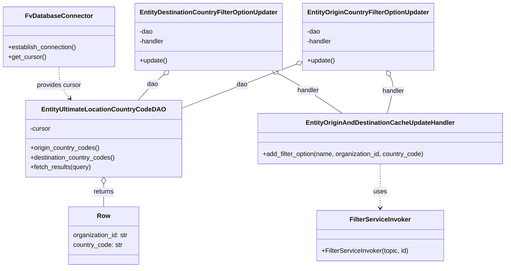
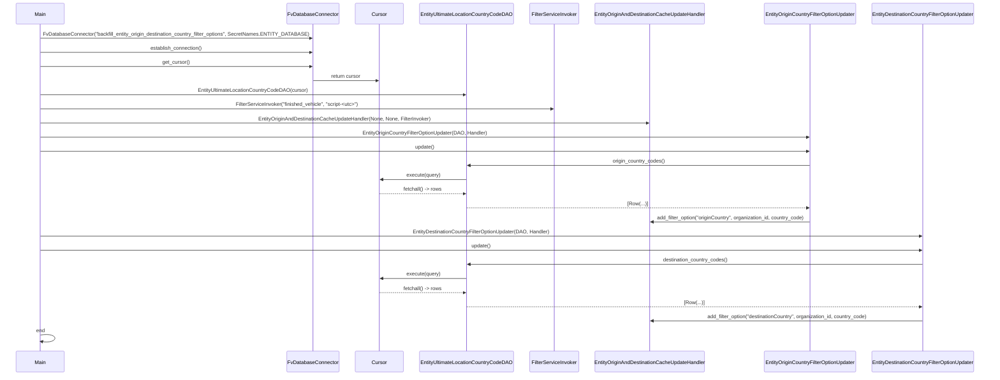

# Diagram: entity_core/entity_service/entity_service_scripts/backfill_entity_origin_destination_country_filter_options.py

> Auto-generated by Obscura crawlers

## Diagram 1

### SVG

<svg id="container" width="1243.16796875" xmlns="http://www.w3.org/2000/svg" class="classDiagram" height="668" viewBox="0 0 1243.16796875 668" role="graphics-document document" aria-roledescription="class"><g><defs><marker id="container_class-aggregationStart" class="marker aggregation class" refX="18" refY="7" markerWidth="190" markerHeight="240" orient="auto"><path d="M 18,7 L9,13 L1,7 L9,1 Z"></path></marker></defs><defs><marker id="container_class-aggregationEnd" class="marker aggregation class" refX="1" refY="7" markerWidth="20" markerHeight="28" orient="auto"><path d="M 18,7 L9,13 L1,7 L9,1 Z"></path></marker></defs><defs><marker id="container_class-extensionStart" class="marker extension class" refX="18" refY="7" markerWidth="190" markerHeight="240" orient="auto"><path d="M 1,7 L18,13 V 1 Z"></path></marker></defs><defs><marker id="container_class-extensionEnd" class="marker extension class" refX="1" refY="7" markerWidth="20" markerHeight="28" orient="auto"><path d="M 1,1 V 13 L18,7 Z"></path></marker></defs><defs><marker id="container_class-compositionStart" class="marker composition class" refX="18" refY="7" markerWidth="190" markerHeight="240" orient="auto"><path d="M 18,7 L9,13 L1,7 L9,1 Z"></path></marker></defs><defs><marker id="container_class-compositionEnd" class="marker composition class" refX="1" refY="7" markerWidth="20" markerHeight="28" orient="auto"><path d="M 18,7 L9,13 L1,7 L9,1 Z"></path></marker></defs><defs><marker id="container_class-dependencyStart" class="marker dependency class" refX="6" refY="7" markerWidth="190" markerHeight="240" orient="auto"><path d="M 5,7 L9,13 L1,7 L9,1 Z"></path></marker></defs><defs><marker id="container_class-dependencyEnd" class="marker dependency class" refX="13" refY="7" markerWidth="20" markerHeight="28" orient="auto"><path d="M 18,7 L9,13 L14,7 L9,1 Z"></path></marker></defs><defs><marker id="container_class-lollipopStart" class="marker lollipop class" refX="13" refY="7" markerWidth="190" markerHeight="240" orient="auto"><circle stroke="black" fill="transparent" cx="7" cy="7" r="6"></circle></marker></defs><defs><marker id="container_class-lollipopEnd" class="marker lollipop class" refX="1" refY="7" markerWidth="190" markerHeight="240" orient="auto"><circle stroke="black" fill="transparent" cx="7" cy="7" r="6"></circle></marker></defs><g class="root"><g class="clusters"></g><g class="edgePaths"><path d="M260.207,459.25L260.207,462.542C260.207,465.833,260.207,472.417,260.207,481.875C260.207,491.333,260.207,503.667,260.207,509.833L260.207,516" id="id_EntityUltimateLocationCountryCodeDAO_Row_1" class="edge-thickness-normal edge-pattern-solid relation" style=";;;" data-edge="true" data-et="edge" data-id="id_EntityUltimateLocationCountryCodeDAO_Row_1" data-points="W3sieCI6MjYwLjIwNzAzMTI1LCJ5Ijo0NDJ9LHsieCI6MjYwLjIwNzAzMTI1LCJ5Ijo0Nzl9LHsieCI6MjYwLjIwNzAzMTI1LCJ5Ijo1MTZ9XQ==" marker-start="url(#container_class-aggregationStart)"></path><path d="M724.583,160.485L702.36,169.237C680.137,177.99,635.69,195.495,590.382,213.522C545.074,231.55,498.904,250.099,475.819,259.374L452.734,268.649" id="id_EntityOriginCountryFilterOptionUpdater_EntityUltimateLocationCountryCodeDAO_2" class="edge-thickness-normal edge-pattern-solid relation" style=";;;" data-edge="true" data-et="edge" data-id="id_EntityOriginCountryFilterOptionUpdater_EntityUltimateLocationCountryCodeDAO_2" data-points="W3sieCI6NzQwLjYzMjgxMjUsInkiOjE1NC4xNjM0NzIxMTM2MTh9LHsieCI6NTkxLjI0NDE0MDYyNSwieSI6MjEzfSx7IngiOjQ1Mi43MzQzNzUsInkiOjI2OC42NDg3NDI0MTExMDE0N31d" marker-start="url(#container_class-aggregationStart)"></path><path d="M403.754,187.368L398.878,191.64C394.002,195.912,384.25,204.456,374.075,214.895C363.9,225.333,353.301,237.667,348.002,243.833L342.703,250" id="id_EntityDestinationCountryFilterOptionUpdater_EntityUltimateLocationCountryCodeDAO_3" class="edge-thickness-normal edge-pattern-solid relation" style=";;;" data-edge="true" data-et="edge" data-id="id_EntityDestinationCountryFilterOptionUpdater_EntityUltimateLocationCountryCodeDAO_3" data-points="W3sieCI6NDE2LjcyODA0NzUyMDY2MTE2LCJ5IjoxNzZ9LHsieCI6Mzc0LjQ5ODA0Njg3NSwieSI6MjEzfSx7IngiOjM0Mi43MDI4MDE5MjY2OTE3MywieSI6MjUwfV0=" marker-start="url(#container_class-aggregationStart)"></path><path d="M955.155,190.969L957.258,194.64C959.361,198.312,963.567,205.656,962.314,220.995C961.06,236.333,954.347,259.667,950.99,271.333L947.634,283" id="id_EntityOriginCountryFilterOptionUpdater_EntityOriginAndDestinationCacheUpdateHandler_4" class="edge-thickness-normal edge-pattern-solid relation" style=";;;" data-edge="true" data-et="edge" data-id="id_EntityOriginCountryFilterOptionUpdater_EntityOriginAndDestinationCacheUpdateHandler_4" data-points="W3sieCI6OTQ2LjU4MTA5NTA0MTMyMjMsInkiOjE3Nn0seyJ4Ijo5NjcuNzczNDM3NSwieSI6MjEzfSx7IngiOjk0Ny42MzM2MzQ4Njg0MjEsInkiOjI4M31d" marker-start="url(#container_class-aggregationStart)"></path><path d="M683.264,184.199L692.149,188.999C701.034,193.799,718.804,203.4,744.613,219.867C770.422,236.333,804.27,259.667,821.194,271.333L838.118,283" id="id_EntityDestinationCountryFilterOptionUpdater_EntityOriginAndDestinationCacheUpdateHandler_5" class="edge-thickness-normal edge-pattern-solid relation" style=";;;" data-edge="true" data-et="edge" data-id="id_EntityDestinationCountryFilterOptionUpdater_EntityOriginAndDestinationCacheUpdateHandler_5" data-points="W3sieCI6NjY4LjA4NjcxMjI5MzM4ODUsInkiOjE3Nn0seyJ4Ijo3MzYuNTc0MjE4NzUsInkiOjIxM30seyJ4Ijo4MzguMTE4MjE1NDYwNTI2NCwieSI6MjgzfV0=" marker-start="url(#container_class-aggregationStart)"></path><path d="M929.508,409L929.508,420.667C929.508,432.333,929.508,455.667,929.508,474C929.508,492.333,929.508,505.667,929.508,512.333L929.508,519" id="id_EntityOriginAndDestinationCacheUpdateHandler_FilterServiceInvoker_6" class="edge-thickness-normal edge-pattern-dashed relation" style=";;;" data-edge="true" data-et="edge" data-id="id_EntityOriginAndDestinationCacheUpdateHandler_FilterServiceInvoker_6" data-points="W3sieCI6OTI5LjUwNzgxMjUsInkiOjQwOX0seyJ4Ijo5MjkuNTA3ODEyNSwieSI6NDc5fSx7IngiOjkyOS41MDc4MTI1LCJ5Ijo1MjV9XQ==" marker-end="url(#container_class-dependencyEnd)"></path><path d="M146.285,167L146.285,174.667C146.285,182.333,146.285,197.667,150.917,210.741C155.548,223.814,164.811,234.629,169.443,240.036L174.075,245.443" id="id_FvDatabaseConnector_EntityUltimateLocationCountryCodeDAO_7" class="edge-thickness-normal edge-pattern-dashed relation" style=";;;" data-edge="true" data-et="edge" data-id="id_FvDatabaseConnector_EntityUltimateLocationCountryCodeDAO_7" data-points="W3sieCI6MTQ2LjI4NTE1NjI1LCJ5IjoxNjd9LHsieCI6MTQ2LjI4NTE1NjI1LCJ5IjoyMTN9LHsieCI6MTc3Ljk3NzcwNzk0MTcyOTMsInkiOjI1MH1d" marker-end="url(#container_class-dependencyEnd)"></path></g><g class="edgeLabels"><g class="edgeLabel" transform="translate(260.20703125, 479)"><g class="label" data-id="id_EntityUltimateLocationCountryCodeDAO_Row_1" transform="translate(-26.265625, -12)"><foreignObject width="52.53125" height="24">

returns

</foreignObject></g></g><g class="edgeLabel" transform="translate(596.49498, 210.93196)"><g class="label" data-id="id_EntityOriginCountryFilterOptionUpdater_EntityUltimateLocationCountryCodeDAO_2" transform="translate(-13.8125, -12)"><foreignObject width="27.625" height="24">

dao

</foreignObject></g></g><g class="edgeLabel" transform="translate(374.498046875, 213)"><g class="label" data-id="id_EntityDestinationCountryFilterOptionUpdater_EntityUltimateLocationCountryCodeDAO_3" transform="translate(-13.8125, -12)"><foreignObject width="27.625" height="24">

dao

</foreignObject></g></g><g class="edgeLabel" transform="translate(963.59832, 227.51146)"><g class="label" data-id="id_EntityOriginCountryFilterOptionUpdater_EntityOriginAndDestinationCacheUpdateHandler_4" transform="translate(-28.265625, -12)"><foreignObject width="56.53125" height="24">

handler

</foreignObject></g></g><g class="edgeLabel" transform="translate(755.30105, 225.90946)"><g class="label" data-id="id_EntityDestinationCountryFilterOptionUpdater_EntityOriginAndDestinationCacheUpdateHandler_5" transform="translate(-28.265625, -12)"><foreignObject width="56.53125" height="24">

handler

</foreignObject></g></g><g class="edgeLabel" transform="translate(929.5078125, 479)"><g class="label" data-id="id_EntityOriginAndDestinationCacheUpdateHandler_FilterServiceInvoker_6" transform="translate(-16.4921875, -12)"><foreignObject width="32.984375" height="24">

uses

</foreignObject></g></g><g class="edgeLabel" transform="translate(146.28515625, 213)"><g class="label" data-id="id_FvDatabaseConnector_EntityUltimateLocationCountryCodeDAO_7" transform="translate(-56.296875, -12)"><foreignObject width="112.59375" height="24">

provides cursor

</foreignObject></g></g></g><g class="nodes"><g class="node default" id="classId-Row-0" transform="translate(260.20703125, 588)"><g class="basic label-container"><path d="M-89.875 -72 L89.875 -72 L89.875 72 L-89.875 72" stroke="none" stroke-width="0" fill="#ECECFF" style=""></path><path d="M-89.875 -72 C-51.85374782959073 -72, -13.832495659181461 -72, 89.875 -72 M-89.875 -72 C-26.239593159424906 -72, 37.39581368115019 -72, 89.875 -72 M89.875 -72 C89.875 -32.096116634376095, 89.875 7.80776673124781, 89.875 72 M89.875 -72 C89.875 -33.88104169916716, 89.875 4.237916601665674, 89.875 72 M89.875 72 C27.040600435065514 72, -35.79379912986897 72, -89.875 72 M89.875 72 C51.23798906195671 72, 12.600978123913421 72, -89.875 72 M-89.875 72 C-89.875 37.28480477477001, -89.875 2.5696095495400186, -89.875 -72 M-89.875 72 C-89.875 28.86267932699323, -89.875 -14.274641346013539, -89.875 -72" stroke="#9370DB" stroke-width="1.3" fill="none" stroke-dasharray="0 0" style=""></path></g><g class="annotation-group text" transform="translate(0, -48)"></g><g class="label-group text" transform="translate(-15.484375, -48)"><g class="label" style="font-weight: bolder" transform="translate(0,-12)"><foreignObject width="30.96875" height="24">

Row

</foreignObject></g></g><g class="members-group text" transform="translate(-77.875, 0)"><g class="label" style="" transform="translate(0,-12)"><foreignObject width="140.265625" height="24">

organization_id: str

</foreignObject></g><g class="label" style="" transform="translate(0,12)"><foreignObject width="125.171875" height="24">

country_code: str

</foreignObject></g></g><g class="methods-group text" transform="translate(-77.875, 72)"></g><g class="divider" style=""><path d="M-89.875 -24 C-29.258920068657503 -24, 31.357159862684995 -24, 89.875 -24 M-89.875 -24 C-42.43550840144642 -24, 5.003983197107161 -24, 89.875 -24" stroke="#9370DB" stroke-width="1.3" fill="none" stroke-dasharray="0 0" style=""></path></g><g class="divider" style=""><path d="M-89.875 48 C-20.604988932592434 48, 48.66502213481513 48, 89.875 48 M-89.875 48 C-22.652933077530164 48, 44.56913384493967 48, 89.875 48" stroke="#9370DB" stroke-width="1.3" fill="none" stroke-dasharray="0 0" style=""></path></g></g><g class="node default" id="classId-EntityUltimateLocationCountryCodeDAO-1" transform="translate(260.20703125, 346)"><g class="basic label-container"><path d="M-192.52734375 -96 L192.52734375 -96 L192.52734375 96 L-192.52734375 96" stroke="none" stroke-width="0" fill="#ECECFF" style=""></path><path d="M-192.52734375 -96 C-91.45388976198733 -96, 9.619564226025346 -96, 192.52734375 -96 M-192.52734375 -96 C-78.43437617371352 -96, 35.658591402572966 -96, 192.52734375 -96 M192.52734375 -96 C192.52734375 -49.33318930123463, 192.52734375 -2.6663786024692655, 192.52734375 96 M192.52734375 -96 C192.52734375 -34.34653889399826, 192.52734375 27.306922212003485, 192.52734375 96 M192.52734375 96 C101.16717281366961 96, 9.807001877339218 96, -192.52734375 96 M192.52734375 96 C114.48215147592146 96, 36.43695920184291 96, -192.52734375 96 M-192.52734375 96 C-192.52734375 23.774926790114236, -192.52734375 -48.45014641977153, -192.52734375 -96 M-192.52734375 96 C-192.52734375 28.62243515195533, -192.52734375 -38.75512969608934, -192.52734375 -96" stroke="#9370DB" stroke-width="1.3" fill="none" stroke-dasharray="0 0" style=""></path></g><g class="annotation-group text" transform="translate(0, -72)"></g><g class="label-group text" transform="translate(-146.4296875, -72)"><g class="label" style="font-weight: bolder" transform="translate(0,-12)"><foreignObject width="292.859375" height="24">

EntityUltimateLocationCountryCodeDAO

</foreignObject></g></g><g class="members-group text" transform="translate(-180.52734375, -24)"><g class="label" style="" transform="translate(0,-12)"><foreignObject width="52.1875" height="24">

-cursor

</foreignObject></g></g><g class="methods-group text" transform="translate(-180.52734375, 24)"><g class="label" style="" transform="translate(0,-12)"><foreignObject width="173.734375" height="24">

+origin_country_codes()

</foreignObject></g><g class="label" style="" transform="translate(0,12)"><foreignObject width="214.625" height="24">

+destination_country_codes()

</foreignObject></g><g class="label" style="" transform="translate(0,36)"><foreignObject width="153.703125" height="24">

+fetch_results(query)

</foreignObject></g></g><g class="divider" style=""><path d="M-192.52734375 -48 C-42.1496108958396 -48, 108.2281219583208 -48, 192.52734375 -48 M-192.52734375 -48 C-52.1783955215563 -48, 88.1705527068874 -48, 192.52734375 -48" stroke="#9370DB" stroke-width="1.3" fill="none" stroke-dasharray="0 0" style=""></path></g><g class="divider" style=""><path d="M-192.52734375 0 C-57.44548087510455 0, 77.6363819997909 0, 192.52734375 0 M-192.52734375 0 C-84.54133488399536 0, 23.444673982009277 0, 192.52734375 0" stroke="#9370DB" stroke-width="1.3" fill="none" stroke-dasharray="0 0" style=""></path></g></g><g class="node default" id="classId-EntityOriginCountryFilterOptionUpdater-2" transform="translate(898.46875, 92)"><g class="basic label-container"><path d="M-157.8359375 -84 L157.8359375 -84 L157.8359375 84 L-157.8359375 84" stroke="none" stroke-width="0" fill="#ECECFF" style=""></path><path d="M-157.8359375 -84 C-34.523050705742335 -84, 88.78983608851533 -84, 157.8359375 -84 M-157.8359375 -84 C-65.003041437114 -84, 27.829854625771986 -84, 157.8359375 -84 M157.8359375 -84 C157.8359375 -49.31376119142469, 157.8359375 -14.627522382849378, 157.8359375 84 M157.8359375 -84 C157.8359375 -49.97188461255956, 157.8359375 -15.943769225119127, 157.8359375 84 M157.8359375 84 C71.07143044098711 84, -15.69307661802577 84, -157.8359375 84 M157.8359375 84 C51.25020853374511 84, -55.33552043250978 84, -157.8359375 84 M-157.8359375 84 C-157.8359375 32.93916552472072, -157.8359375 -18.121668950558558, -157.8359375 -84 M-157.8359375 84 C-157.8359375 40.64079507581766, -157.8359375 -2.7184098483646864, -157.8359375 -84" stroke="#9370DB" stroke-width="1.3" fill="none" stroke-dasharray="0 0" style=""></path></g><g class="annotation-group text" transform="translate(0, -60)"></g><g class="label-group text" transform="translate(-145.8359375, -60)"><g class="label" style="font-weight: bolder" transform="translate(0,-12)"><foreignObject width="291.671875" height="24">

EntityOriginCountryFilterOptionUpdater

</foreignObject></g></g><g class="members-group text" transform="translate(-145.8359375, -12)"><g class="label" style="" transform="translate(0,-12)"><foreignObject width="34.078125" height="24">

-dao

</foreignObject></g><g class="label" style="" transform="translate(0,12)"><foreignObject width="62.984375" height="24">

-handler

</foreignObject></g></g><g class="methods-group text" transform="translate(-145.8359375, 60)"><g class="label" style="" transform="translate(0,-12)"><foreignObject width="69.703125" height="24">

+update()

</foreignObject></g></g><g class="divider" style=""><path d="M-157.8359375 -36 C-39.21077581819151 -36, 79.41438586361699 -36, 157.8359375 -36 M-157.8359375 -36 C-49.73952469302833 -36, 58.35688811394334 -36, 157.8359375 -36" stroke="#9370DB" stroke-width="1.3" fill="none" stroke-dasharray="0 0" style=""></path></g><g class="divider" style=""><path d="M-157.8359375 36 C-33.86520942240111 36, 90.10551865519778 36, 157.8359375 36 M-157.8359375 36 C-89.31760943945147 36, -20.799281378902947 36, 157.8359375 36" stroke="#9370DB" stroke-width="1.3" fill="none" stroke-dasharray="0 0" style=""></path></g></g><g class="node default" id="classId-EntityDestinationCountryFilterOptionUpdater-3" transform="translate(512.6015625, 92)"><g class="basic label-container"><path d="M-178.03125 -84 L178.03125 -84 L178.03125 84 L-178.03125 84" stroke="none" stroke-width="0" fill="#ECECFF" style=""></path><path d="M-178.03125 -84 C-48.785381205051294 -84, 80.46048758989741 -84, 178.03125 -84 M-178.03125 -84 C-90.23135782485151 -84, -2.4314656497030285 -84, 178.03125 -84 M178.03125 -84 C178.03125 -27.06946938885553, 178.03125 29.86106122228894, 178.03125 84 M178.03125 -84 C178.03125 -18.102826336724164, 178.03125 47.79434732655167, 178.03125 84 M178.03125 84 C47.554216185176216 84, -82.92281762964757 84, -178.03125 84 M178.03125 84 C46.11792944940427 84, -85.79539110119146 84, -178.03125 84 M-178.03125 84 C-178.03125 19.998434650238423, -178.03125 -44.003130699523155, -178.03125 -84 M-178.03125 84 C-178.03125 44.309427059916324, -178.03125 4.618854119832648, -178.03125 -84" stroke="#9370DB" stroke-width="1.3" fill="none" stroke-dasharray="0 0" style=""></path></g><g class="annotation-group text" transform="translate(0, -60)"></g><g class="label-group text" transform="translate(-166.03125, -60)"><g class="label" style="font-weight: bolder" transform="translate(0,-12)"><foreignObject width="332.0625" height="24">

EntityDestinationCountryFilterOptionUpdater

</foreignObject></g></g><g class="members-group text" transform="translate(-166.03125, -12)"><g class="label" style="" transform="translate(0,-12)"><foreignObject width="34.078125" height="24">

-dao

</foreignObject></g><g class="label" style="" transform="translate(0,12)"><foreignObject width="62.984375" height="24">

-handler

</foreignObject></g></g><g class="methods-group text" transform="translate(-166.03125, 60)"><g class="label" style="" transform="translate(0,-12)"><foreignObject width="69.703125" height="24">

+update()

</foreignObject></g></g><g class="divider" style=""><path d="M-178.03125 -36 C-79.29913968113658 -36, 19.43297063772684 -36, 178.03125 -36 M-178.03125 -36 C-43.14336347871955 -36, 91.7445230425609 -36, 178.03125 -36" stroke="#9370DB" stroke-width="1.3" fill="none" stroke-dasharray="0 0" style=""></path></g><g class="divider" style=""><path d="M-178.03125 36 C-46.87196377640376 36, 84.28732244719248 36, 178.03125 36 M-178.03125 36 C-66.67444880385115 36, 44.6823523922977 36, 178.03125 36" stroke="#9370DB" stroke-width="1.3" fill="none" stroke-dasharray="0 0" style=""></path></g></g><g class="node default" id="classId-EntityOriginAndDestinationCacheUpdateHandler-4" transform="translate(929.5078125, 346)"><g class="basic label-container"><path d="M-305.66015625 -63 L305.66015625 -63 L305.66015625 63 L-305.66015625 63" stroke="none" stroke-width="0" fill="#ECECFF" style=""></path><path d="M-305.66015625 -63 C-109.542614260166 -63, 86.57492772966799 -63, 305.66015625 -63 M-305.66015625 -63 C-176.74652286552066 -63, -47.83288948104132 -63, 305.66015625 -63 M305.66015625 -63 C305.66015625 -26.60121085961908, 305.66015625 9.79757828076184, 305.66015625 63 M305.66015625 -63 C305.66015625 -20.677202063955676, 305.66015625 21.64559587208865, 305.66015625 63 M305.66015625 63 C79.33294839353516 63, -146.99425946292968 63, -305.66015625 63 M305.66015625 63 C82.0854081307595 63, -141.489339988481 63, -305.66015625 63 M-305.66015625 63 C-305.66015625 31.299633762679576, -305.66015625 -0.40073247464084716, -305.66015625 -63 M-305.66015625 63 C-305.66015625 19.09214775756942, -305.66015625 -24.815704484861158, -305.66015625 -63" stroke="#9370DB" stroke-width="1.3" fill="none" stroke-dasharray="0 0" style=""></path></g><g class="annotation-group text" transform="translate(0, -39)"></g><g class="label-group text" transform="translate(-177.5390625, -39)"><g class="label" style="font-weight: bolder" transform="translate(0,-12)"><foreignObject width="355.078125" height="24">

EntityOriginAndDestinationCacheUpdateHandler

</foreignObject></g></g><g class="members-group text" transform="translate(-293.66015625, 9)"></g><g class="methods-group text" transform="translate(-293.66015625, 39)"><g class="label" style="" transform="translate(0,-12)"><foreignObject width="409.78125" height="24">

+add_filter_option(name, organization_id, country_code)

</foreignObject></g></g><g class="divider" style=""><path d="M-305.66015625 -15 C-68.09608221583088 -15, 169.46799181833825 -15, 305.66015625 -15 M-305.66015625 -15 C-105.81255609405923 -15, 94.03504406188154 -15, 305.66015625 -15" stroke="#9370DB" stroke-width="1.3" fill="none" stroke-dasharray="0 0" style=""></path></g><g class="divider" style=""><path d="M-305.66015625 9 C-133.6312027823556 9, 38.39775068528883 9, 305.66015625 9 M-305.66015625 9 C-96.81416321005884 9, 112.03182982988233 9, 305.66015625 9" stroke="#9370DB" stroke-width="1.3" fill="none" stroke-dasharray="0 0" style=""></path></g></g><g class="node default" id="classId-FilterServiceInvoker-5" transform="translate(929.5078125, 588)"><g class="basic label-container"><path d="M-158.6796875 -63 L158.6796875 -63 L158.6796875 63 L-158.6796875 63" stroke="none" stroke-width="0" fill="#ECECFF" style=""></path><path d="M-158.6796875 -63 C-72.65933455325722 -63, 13.361018393485551 -63, 158.6796875 -63 M-158.6796875 -63 C-67.6188870427383 -63, 23.441913414523412 -63, 158.6796875 -63 M158.6796875 -63 C158.6796875 -22.866509114975152, 158.6796875 17.266981770049696, 158.6796875 63 M158.6796875 -63 C158.6796875 -17.7364862572216, 158.6796875 27.5270274855568, 158.6796875 63 M158.6796875 63 C77.09495196365229 63, -4.489783572695416 63, -158.6796875 63 M158.6796875 63 C78.69734879303796 63, -1.284989913924079 63, -158.6796875 63 M-158.6796875 63 C-158.6796875 21.551721498281907, -158.6796875 -19.896557003436186, -158.6796875 -63 M-158.6796875 63 C-158.6796875 30.33104501840075, -158.6796875 -2.3379099631984985, -158.6796875 -63" stroke="#9370DB" stroke-width="1.3" fill="none" stroke-dasharray="0 0" style=""></path></g><g class="annotation-group text" transform="translate(0, -39)"></g><g class="label-group text" transform="translate(-73.078125, -39)"><g class="label" style="font-weight: bolder" transform="translate(0,-12)"><foreignObject width="146.15625" height="24">

FilterServiceInvoker

</foreignObject></g></g><g class="members-group text" transform="translate(-146.6796875, 9)"></g><g class="methods-group text" transform="translate(-146.6796875, 39)"><g class="label" style="" transform="translate(0,-12)"><foreignObject width="220.28125" height="24">

+FilterServiceInvoker(topic, id)

</foreignObject></g></g><g class="divider" style=""><path d="M-158.6796875 -15 C-57.737167065395894 -15, 43.20535336920821 -15, 158.6796875 -15 M-158.6796875 -15 C-59.66744813108559 -15, 39.344791237828815 -15, 158.6796875 -15" stroke="#9370DB" stroke-width="1.3" fill="none" stroke-dasharray="0 0" style=""></path></g><g class="divider" style=""><path d="M-158.6796875 9 C-93.84815098687817 9, -29.016614473756334 9, 158.6796875 9 M-158.6796875 9 C-86.74865287938765 9, -14.817618258775298 9, 158.6796875 9" stroke="#9370DB" stroke-width="1.3" fill="none" stroke-dasharray="0 0" style=""></path></g></g><g class="node default" id="classId-FvDatabaseConnector-6" transform="translate(146.28515625, 92)"><g class="basic label-container"><path d="M-138.28515625 -75 L138.28515625 -75 L138.28515625 75 L-138.28515625 75" stroke="none" stroke-width="0" fill="#ECECFF" style=""></path><path d="M-138.28515625 -75 C-81.82082537851188 -75, -25.35649450702377 -75, 138.28515625 -75 M-138.28515625 -75 C-54.129775659675374 -75, 30.02560493064925 -75, 138.28515625 -75 M138.28515625 -75 C138.28515625 -34.811159979128114, 138.28515625 5.377680041743773, 138.28515625 75 M138.28515625 -75 C138.28515625 -44.18036524721116, 138.28515625 -13.36073049442232, 138.28515625 75 M138.28515625 75 C28.814156888274198 75, -80.6568424734516 75, -138.28515625 75 M138.28515625 75 C69.4761910756173 75, 0.6672259012345876 75, -138.28515625 75 M-138.28515625 75 C-138.28515625 38.39072147069501, -138.28515625 1.7814429413900257, -138.28515625 -75 M-138.28515625 75 C-138.28515625 29.361468749944954, -138.28515625 -16.27706250011009, -138.28515625 -75" stroke="#9370DB" stroke-width="1.3" fill="none" stroke-dasharray="0 0" style=""></path></g><g class="annotation-group text" transform="translate(0, -51)"></g><g class="label-group text" transform="translate(-79.3046875, -51)"><g class="label" style="font-weight: bolder" transform="translate(0,-12)"><foreignObject width="158.609375" height="24">

FvDatabaseConnector

</foreignObject></g></g><g class="members-group text" transform="translate(-126.28515625, -3)"></g><g class="methods-group text" transform="translate(-126.28515625, 27)"><g class="label" style="" transform="translate(0,-12)"><foreignObject width="173.265625" height="24">

+establish_connection()

</foreignObject></g><g class="label" style="" transform="translate(0,12)"><foreignObject width="94.640625" height="24">

+get_cursor()

</foreignObject></g></g><g class="divider" style=""><path d="M-138.28515625 -27 C-64.95591970247055 -27, 8.373316845058895 -27, 138.28515625 -27 M-138.28515625 -27 C-65.88472522707968 -27, 6.515705795840631 -27, 138.28515625 -27" stroke="#9370DB" stroke-width="1.3" fill="none" stroke-dasharray="0 0" style=""></path></g><g class="divider" style=""><path d="M-138.28515625 -3 C-63.2475237163503 -3, 11.790108817299398 -3, 138.28515625 -3 M-138.28515625 -3 C-42.40258247247094 -3, 53.47999130505812 -3, 138.28515625 -3" stroke="#9370DB" stroke-width="1.3" fill="none" stroke-dasharray="0 0" style=""></path></g></g></g></g></g></svg>

## Diagram 2

### SVG

<svg id="container" width="3258.5" xmlns="http://www.w3.org/2000/svg" height="1257" viewBox="-50 -10 3258.5 1257" role="graphics-document document" aria-roledescription="sequence"><g><rect x="2810.5" y="1171" fill="#eaeaea" stroke="#666" width="348" height="65" name="DestUpdater" rx="3" ry="3" class="actor actor-bottom"></rect><text x="2984.5" y="1203.5" dominant-baseline="central" alignment-baseline="central" class="actor actor-box" style="text-anchor: middle; font-size: 16px; font-weight: 400;"><tspan x="2984.5" dy="0">EntityDestinationCountryFilterOptionUpdater</tspan></text></g><g><rect x="2452.5" y="1171" fill="#eaeaea" stroke="#666" width="308" height="65" name="OriginUpdater" rx="3" ry="3" class="actor actor-bottom"></rect><text x="2606.5" y="1203.5" dominant-baseline="central" alignment-baseline="central" class="actor actor-box" style="text-anchor: middle; font-size: 16px; font-weight: 400;"><tspan x="2606.5" dy="0">EntityOriginCountryFilterOptionUpdater</tspan></text></g><g><rect x="1879.5" y="1171" fill="#eaeaea" stroke="#666" width="372" height="65" name="Handler" rx="3" ry="3" class="actor actor-bottom"></rect><text x="2065.5" y="1203.5" dominant-baseline="central" alignment-baseline="central" class="actor actor-box" style="text-anchor: middle; font-size: 16px; font-weight: 400;"><tspan x="2065.5" dy="0">EntityOriginAndDestinationCacheUpdateHandler</tspan></text></g><g><rect x="1665.5" y="1171" fill="#eaeaea" stroke="#666" width="164" height="65" name="FilterInvoker" rx="3" ry="3" class="actor actor-bottom"></rect><text x="1747.5" y="1203.5" dominant-baseline="central" alignment-baseline="central" class="actor actor-box" style="text-anchor: middle; font-size: 16px; font-weight: 400;"><tspan x="1747.5" dy="0">FilterServiceInvoker</tspan></text></g><g><rect x="1306.5" y="1171" fill="#eaeaea" stroke="#666" width="309" height="65" name="DAO" rx="3" ry="3" class="actor actor-bottom"></rect><text x="1461" y="1203.5" dominant-baseline="central" alignment-baseline="central" class="actor actor-box" style="text-anchor: middle; font-size: 16px; font-weight: 400;"><tspan x="1461" dy="0">EntityUltimateLocationCountryCodeDAO</tspan></text></g><g><rect x="1106.5" y="1171" fill="#eaeaea" stroke="#666" width="150" height="65" name="Cursor" rx="3" ry="3" class="actor actor-bottom"></rect><text x="1181.5" y="1203.5" dominant-baseline="central" alignment-baseline="central" class="actor actor-box" style="text-anchor: middle; font-size: 16px; font-weight: 400;"><tspan x="1181.5" dy="0">Cursor</tspan></text></g><g><rect x="879.5" y="1171" fill="#eaeaea" stroke="#666" width="177" height="65" name="DBConn" rx="3" ry="3" class="actor actor-bottom"></rect><text x="968" y="1203.5" dominant-baseline="central" alignment-baseline="central" class="actor actor-box" style="text-anchor: middle; font-size: 16px; font-weight: 400;"><tspan x="968" dy="0">FvDatabaseConnector</tspan></text></g><g><rect x="0" y="1171" fill="#eaeaea" stroke="#666" width="150" height="65" name="Main" rx="3" ry="3" class="actor actor-bottom"></rect><text x="75" y="1203.5" dominant-baseline="central" alignment-baseline="central" class="actor actor-box" style="text-anchor: middle; font-size: 16px; font-weight: 400;"><tspan x="75" dy="0">Main</tspan></text></g><g><line id="actor7" x1="2984.5" y1="65" x2="2984.5" y2="1171" class="actor-line 200" stroke-width="0.5px" stroke="#999" name="DestUpdater"></line><g id="root-7"><rect x="2810.5" y="0" fill="#eaeaea" stroke="#666" width="348" height="65" name="DestUpdater" rx="3" ry="3" class="actor actor-top"></rect><text x="2984.5" y="32.5" dominant-baseline="central" alignment-baseline="central" class="actor actor-box" style="text-anchor: middle; font-size: 16px; font-weight: 400;"><tspan x="2984.5" dy="0">EntityDestinationCountryFilterOptionUpdater</tspan></text></g></g><g><line id="actor6" x1="2606.5" y1="65" x2="2606.5" y2="1171" class="actor-line 200" stroke-width="0.5px" stroke="#999" name="OriginUpdater"></line><g id="root-6"><rect x="2452.5" y="0" fill="#eaeaea" stroke="#666" width="308" height="65" name="OriginUpdater" rx="3" ry="3" class="actor actor-top"></rect><text x="2606.5" y="32.5" dominant-baseline="central" alignment-baseline="central" class="actor actor-box" style="text-anchor: middle; font-size: 16px; font-weight: 400;"><tspan x="2606.5" dy="0">EntityOriginCountryFilterOptionUpdater</tspan></text></g></g><g><line id="actor5" x1="2065.5" y1="65" x2="2065.5" y2="1171" class="actor-line 200" stroke-width="0.5px" stroke="#999" name="Handler"></line><g id="root-5"><rect x="1879.5" y="0" fill="#eaeaea" stroke="#666" width="372" height="65" name="Handler" rx="3" ry="3" class="actor actor-top"></rect><text x="2065.5" y="32.5" dominant-baseline="central" alignment-baseline="central" class="actor actor-box" style="text-anchor: middle; font-size: 16px; font-weight: 400;"><tspan x="2065.5" dy="0">EntityOriginAndDestinationCacheUpdateHandler</tspan></text></g></g><g><line id="actor4" x1="1747.5" y1="65" x2="1747.5" y2="1171" class="actor-line 200" stroke-width="0.5px" stroke="#999" name="FilterInvoker"></line><g id="root-4"><rect x="1665.5" y="0" fill="#eaeaea" stroke="#666" width="164" height="65" name="FilterInvoker" rx="3" ry="3" class="actor actor-top"></rect><text x="1747.5" y="32.5" dominant-baseline="central" alignment-baseline="central" class="actor actor-box" style="text-anchor: middle; font-size: 16px; font-weight: 400;"><tspan x="1747.5" dy="0">FilterServiceInvoker</tspan></text></g></g><g><line id="actor3" x1="1461" y1="65" x2="1461" y2="1171" class="actor-line 200" stroke-width="0.5px" stroke="#999" name="DAO"></line><g id="root-3"><rect x="1306.5" y="0" fill="#eaeaea" stroke="#666" width="309" height="65" name="DAO" rx="3" ry="3" class="actor actor-top"></rect><text x="1461" y="32.5" dominant-baseline="central" alignment-baseline="central" class="actor actor-box" style="text-anchor: middle; font-size: 16px; font-weight: 400;"><tspan x="1461" dy="0">EntityUltimateLocationCountryCodeDAO</tspan></text></g></g><g><line id="actor2" x1="1181.5" y1="65" x2="1181.5" y2="1171" class="actor-line 200" stroke-width="0.5px" stroke="#999" name="Cursor"></line><g id="root-2"><rect x="1106.5" y="0" fill="#eaeaea" stroke="#666" width="150" height="65" name="Cursor" rx="3" ry="3" class="actor actor-top"></rect><text x="1181.5" y="32.5" dominant-baseline="central" alignment-baseline="central" class="actor actor-box" style="text-anchor: middle; font-size: 16px; font-weight: 400;"><tspan x="1181.5" dy="0">Cursor</tspan></text></g></g><g><line id="actor1" x1="968" y1="65" x2="968" y2="1171" class="actor-line 200" stroke-width="0.5px" stroke="#999" name="DBConn"></line><g id="root-1"><rect x="879.5" y="0" fill="#eaeaea" stroke="#666" width="177" height="65" name="DBConn" rx="3" ry="3" class="actor actor-top"></rect><text x="968" y="32.5" dominant-baseline="central" alignment-baseline="central" class="actor actor-box" style="text-anchor: middle; font-size: 16px; font-weight: 400;"><tspan x="968" dy="0">FvDatabaseConnector</tspan></text></g></g><g><line id="actor0" x1="75" y1="65" x2="75" y2="1171" class="actor-line 200" stroke-width="0.5px" stroke="#999" name="Main"></line><g id="root-0"><rect x="0" y="0" fill="#eaeaea" stroke="#666" width="150" height="65" name="Main" rx="3" ry="3" class="actor actor-top"></rect><text x="75" y="32.5" dominant-baseline="central" alignment-baseline="central" class="actor actor-box" style="text-anchor: middle; font-size: 16px; font-weight: 400;"><tspan x="75" dy="0">Main</tspan></text></g></g><g></g><defs><symbol id="computer" width="24" height="24"><path transform="scale(.5)" d="M2 2v13h20v-13h-20zm18 11h-16v-9h16v9zm-10.228 6l.466-1h3.524l.467 1h-4.457zm14.228 3h-24l2-6h2.104l-1.33 4h18.45l-1.297-4h2.073l2 6zm-5-10h-14v-7h14v7z"></path></symbol></defs><defs><symbol id="database" fill-rule="evenodd" clip-rule="evenodd"><path transform="scale(.5)" d="M12.258.001l.256.004.255.005.253.008.251.01.249.012.247.015.246.016.242.019.241.02.239.023.236.024.233.027.231.028.229.031.225.032.223.034.22.036.217.038.214.04.211.041.208.043.205.045.201.046.198.048.194.05.191.051.187.053.183.054.18.056.175.057.172.059.168.06.163.061.16.063.155.064.15.066.074.033.073.033.071.034.07.034.069.035.068.035.067.035.066.035.064.036.064.036.062.036.06.036.06.037.058.037.058.037.055.038.055.038.053.038.052.038.051.039.05.039.048.039.047.039.045.04.044.04.043.04.041.04.04.041.039.041.037.041.036.041.034.041.033.042.032.042.03.042.029.042.027.042.026.043.024.043.023.043.021.043.02.043.018.044.017.043.015.044.013.044.012.044.011.045.009.044.007.045.006.045.004.045.002.045.001.045v17l-.001.045-.002.045-.004.045-.006.045-.007.045-.009.044-.011.045-.012.044-.013.044-.015.044-.017.043-.018.044-.02.043-.021.043-.023.043-.024.043-.026.043-.027.042-.029.042-.03.042-.032.042-.033.042-.034.041-.036.041-.037.041-.039.041-.04.041-.041.04-.043.04-.044.04-.045.04-.047.039-.048.039-.05.039-.051.039-.052.038-.053.038-.055.038-.055.038-.058.037-.058.037-.06.037-.06.036-.062.036-.064.036-.064.036-.066.035-.067.035-.068.035-.069.035-.07.034-.071.034-.073.033-.074.033-.15.066-.155.064-.16.063-.163.061-.168.06-.172.059-.175.057-.18.056-.183.054-.187.053-.191.051-.194.05-.198.048-.201.046-.205.045-.208.043-.211.041-.214.04-.217.038-.22.036-.223.034-.225.032-.229.031-.231.028-.233.027-.236.024-.239.023-.241.02-.242.019-.246.016-.247.015-.249.012-.251.01-.253.008-.255.005-.256.004-.258.001-.258-.001-.256-.004-.255-.005-.253-.008-.251-.01-.249-.012-.247-.015-.245-.016-.243-.019-.241-.02-.238-.023-.236-.024-.234-.027-.231-.028-.228-.031-.226-.032-.223-.034-.22-.036-.217-.038-.214-.04-.211-.041-.208-.043-.204-.045-.201-.046-.198-.048-.195-.05-.19-.051-.187-.053-.184-.054-.179-.056-.176-.057-.172-.059-.167-.06-.164-.061-.159-.063-.155-.064-.151-.066-.074-.033-.072-.033-.072-.034-.07-.034-.069-.035-.068-.035-.067-.035-.066-.035-.064-.036-.063-.036-.062-.036-.061-.036-.06-.037-.058-.037-.057-.037-.056-.038-.055-.038-.053-.038-.052-.038-.051-.039-.049-.039-.049-.039-.046-.039-.046-.04-.044-.04-.043-.04-.041-.04-.04-.041-.039-.041-.037-.041-.036-.041-.034-.041-.033-.042-.032-.042-.03-.042-.029-.042-.027-.042-.026-.043-.024-.043-.023-.043-.021-.043-.02-.043-.018-.044-.017-.043-.015-.044-.013-.044-.012-.044-.011-.045-.009-.044-.007-.045-.006-.045-.004-.045-.002-.045-.001-.045v-17l.001-.045.002-.045.004-.045.006-.045.007-.045.009-.044.011-.045.012-.044.013-.044.015-.044.017-.043.018-.044.02-.043.021-.043.023-.043.024-.043.026-.043.027-.042.029-.042.03-.042.032-.042.033-.042.034-.041.036-.041.037-.041.039-.041.04-.041.041-.04.043-.04.044-.04.046-.04.046-.039.049-.039.049-.039.051-.039.052-.038.053-.038.055-.038.056-.038.057-.037.058-.037.06-.037.061-.036.062-.036.063-.036.064-.036.066-.035.067-.035.068-.035.069-.035.07-.034.072-.034.072-.033.074-.033.151-.066.155-.064.159-.063.164-.061.167-.06.172-.059.176-.057.179-.056.184-.054.187-.053.19-.051.195-.05.198-.048.201-.046.204-.045.208-.043.211-.041.214-.04.217-.038.22-.036.223-.034.226-.032.228-.031.231-.028.234-.027.236-.024.238-.023.241-.02.243-.019.245-.016.247-.015.249-.012.251-.01.253-.008.255-.005.256-.004.258-.001.258.001zm-9.258 20.499v.01l.001.021.003.021.004.022.005.021.006.022.007.022.009.023.01.022.011.023.012.023.013.023.015.023.016.024.017.023.018.024.019.024.021.024.022.025.023.024.024.025.052.049.056.05.061.051.066.051.07.051.075.051.079.052.084.052.088.052.092.052.097.052.102.051.105.052.11.052.114.051.119.051.123.051.127.05.131.05.135.05.139.048.144.049.147.047.152.047.155.047.16.045.163.045.167.043.171.043.176.041.178.041.183.039.187.039.19.037.194.035.197.035.202.033.204.031.209.03.212.029.216.027.219.025.222.024.226.021.23.02.233.018.236.016.24.015.243.012.246.01.249.008.253.005.256.004.259.001.26-.001.257-.004.254-.005.25-.008.247-.011.244-.012.241-.014.237-.016.233-.018.231-.021.226-.021.224-.024.22-.026.216-.027.212-.028.21-.031.205-.031.202-.034.198-.034.194-.036.191-.037.187-.039.183-.04.179-.04.175-.042.172-.043.168-.044.163-.045.16-.046.155-.046.152-.047.148-.048.143-.049.139-.049.136-.05.131-.05.126-.05.123-.051.118-.052.114-.051.11-.052.106-.052.101-.052.096-.052.092-.052.088-.053.083-.051.079-.052.074-.052.07-.051.065-.051.06-.051.056-.05.051-.05.023-.024.023-.025.021-.024.02-.024.019-.024.018-.024.017-.024.015-.023.014-.024.013-.023.012-.023.01-.023.01-.022.008-.022.006-.022.006-.022.004-.022.004-.021.001-.021.001-.021v-4.127l-.077.055-.08.053-.083.054-.085.053-.087.052-.09.052-.093.051-.095.05-.097.05-.1.049-.102.049-.105.048-.106.047-.109.047-.111.046-.114.045-.115.045-.118.044-.12.043-.122.042-.124.042-.126.041-.128.04-.13.04-.132.038-.134.038-.135.037-.138.037-.139.035-.142.035-.143.034-.144.033-.147.032-.148.031-.15.03-.151.03-.153.029-.154.027-.156.027-.158.026-.159.025-.161.024-.162.023-.163.022-.165.021-.166.02-.167.019-.169.018-.169.017-.171.016-.173.015-.173.014-.175.013-.175.012-.177.011-.178.01-.179.008-.179.008-.181.006-.182.005-.182.004-.184.003-.184.002h-.37l-.184-.002-.184-.003-.182-.004-.182-.005-.181-.006-.179-.008-.179-.008-.178-.01-.176-.011-.176-.012-.175-.013-.173-.014-.172-.015-.171-.016-.17-.017-.169-.018-.167-.019-.166-.02-.165-.021-.163-.022-.162-.023-.161-.024-.159-.025-.157-.026-.156-.027-.155-.027-.153-.029-.151-.03-.15-.03-.148-.031-.146-.032-.145-.033-.143-.034-.141-.035-.14-.035-.137-.037-.136-.037-.134-.038-.132-.038-.13-.04-.128-.04-.126-.041-.124-.042-.122-.042-.12-.044-.117-.043-.116-.045-.113-.045-.112-.046-.109-.047-.106-.047-.105-.048-.102-.049-.1-.049-.097-.05-.095-.05-.093-.052-.09-.051-.087-.052-.085-.053-.083-.054-.08-.054-.077-.054v4.127zm0-5.654v.011l.001.021.003.021.004.021.005.022.006.022.007.022.009.022.01.022.011.023.012.023.013.023.015.024.016.023.017.024.018.024.019.024.021.024.022.024.023.025.024.024.052.05.056.05.061.05.066.051.07.051.075.052.079.051.084.052.088.052.092.052.097.052.102.052.105.052.11.051.114.051.119.052.123.05.127.051.131.05.135.049.139.049.144.048.147.048.152.047.155.046.16.045.163.045.167.044.171.042.176.042.178.04.183.04.187.038.19.037.194.036.197.034.202.033.204.032.209.03.212.028.216.027.219.025.222.024.226.022.23.02.233.018.236.016.24.014.243.012.246.01.249.008.253.006.256.003.259.001.26-.001.257-.003.254-.006.25-.008.247-.01.244-.012.241-.015.237-.016.233-.018.231-.02.226-.022.224-.024.22-.025.216-.027.212-.029.21-.03.205-.032.202-.033.198-.035.194-.036.191-.037.187-.039.183-.039.179-.041.175-.042.172-.043.168-.044.163-.045.16-.045.155-.047.152-.047.148-.048.143-.048.139-.05.136-.049.131-.05.126-.051.123-.051.118-.051.114-.052.11-.052.106-.052.101-.052.096-.052.092-.052.088-.052.083-.052.079-.052.074-.051.07-.052.065-.051.06-.05.056-.051.051-.049.023-.025.023-.024.021-.025.02-.024.019-.024.018-.024.017-.024.015-.023.014-.023.013-.024.012-.022.01-.023.01-.023.008-.022.006-.022.006-.022.004-.021.004-.022.001-.021.001-.021v-4.139l-.077.054-.08.054-.083.054-.085.052-.087.053-.09.051-.093.051-.095.051-.097.05-.1.049-.102.049-.105.048-.106.047-.109.047-.111.046-.114.045-.115.044-.118.044-.12.044-.122.042-.124.042-.126.041-.128.04-.13.039-.132.039-.134.038-.135.037-.138.036-.139.036-.142.035-.143.033-.144.033-.147.033-.148.031-.15.03-.151.03-.153.028-.154.028-.156.027-.158.026-.159.025-.161.024-.162.023-.163.022-.165.021-.166.02-.167.019-.169.018-.169.017-.171.016-.173.015-.173.014-.175.013-.175.012-.177.011-.178.009-.179.009-.179.007-.181.007-.182.005-.182.004-.184.003-.184.002h-.37l-.184-.002-.184-.003-.182-.004-.182-.005-.181-.007-.179-.007-.179-.009-.178-.009-.176-.011-.176-.012-.175-.013-.173-.014-.172-.015-.171-.016-.17-.017-.169-.018-.167-.019-.166-.02-.165-.021-.163-.022-.162-.023-.161-.024-.159-.025-.157-.026-.156-.027-.155-.028-.153-.028-.151-.03-.15-.03-.148-.031-.146-.033-.145-.033-.143-.033-.141-.035-.14-.036-.137-.036-.136-.037-.134-.038-.132-.039-.13-.039-.128-.04-.126-.041-.124-.042-.122-.043-.12-.043-.117-.044-.116-.044-.113-.046-.112-.046-.109-.046-.106-.047-.105-.048-.102-.049-.1-.049-.097-.05-.095-.051-.093-.051-.09-.051-.087-.053-.085-.052-.083-.054-.08-.054-.077-.054v4.139zm0-5.666v.011l.001.02.003.022.004.021.005.022.006.021.007.022.009.023.01.022.011.023.012.023.013.023.015.023.016.024.017.024.018.023.019.024.021.025.022.024.023.024.024.025.052.05.056.05.061.05.066.051.07.051.075.052.079.051.084.052.088.052.092.052.097.052.102.052.105.051.11.052.114.051.119.051.123.051.127.05.131.05.135.05.139.049.144.048.147.048.152.047.155.046.16.045.163.045.167.043.171.043.176.042.178.04.183.04.187.038.19.037.194.036.197.034.202.033.204.032.209.03.212.028.216.027.219.025.222.024.226.021.23.02.233.018.236.017.24.014.243.012.246.01.249.008.253.006.256.003.259.001.26-.001.257-.003.254-.006.25-.008.247-.01.244-.013.241-.014.237-.016.233-.018.231-.02.226-.022.224-.024.22-.025.216-.027.212-.029.21-.03.205-.032.202-.033.198-.035.194-.036.191-.037.187-.039.183-.039.179-.041.175-.042.172-.043.168-.044.163-.045.16-.045.155-.047.152-.047.148-.048.143-.049.139-.049.136-.049.131-.051.126-.05.123-.051.118-.052.114-.051.11-.052.106-.052.101-.052.096-.052.092-.052.088-.052.083-.052.079-.052.074-.052.07-.051.065-.051.06-.051.056-.05.051-.049.023-.025.023-.025.021-.024.02-.024.019-.024.018-.024.017-.024.015-.023.014-.024.013-.023.012-.023.01-.022.01-.023.008-.022.006-.022.006-.022.004-.022.004-.021.001-.021.001-.021v-4.153l-.077.054-.08.054-.083.053-.085.053-.087.053-.09.051-.093.051-.095.051-.097.05-.1.049-.102.048-.105.048-.106.048-.109.046-.111.046-.114.046-.115.044-.118.044-.12.043-.122.043-.124.042-.126.041-.128.04-.13.039-.132.039-.134.038-.135.037-.138.036-.139.036-.142.034-.143.034-.144.033-.147.032-.148.032-.15.03-.151.03-.153.028-.154.028-.156.027-.158.026-.159.024-.161.024-.162.023-.163.023-.165.021-.166.02-.167.019-.169.018-.169.017-.171.016-.173.015-.173.014-.175.013-.175.012-.177.01-.178.01-.179.009-.179.007-.181.006-.182.006-.182.004-.184.003-.184.001-.185.001-.185-.001-.184-.001-.184-.003-.182-.004-.182-.006-.181-.006-.179-.007-.179-.009-.178-.01-.176-.01-.176-.012-.175-.013-.173-.014-.172-.015-.171-.016-.17-.017-.169-.018-.167-.019-.166-.02-.165-.021-.163-.023-.162-.023-.161-.024-.159-.024-.157-.026-.156-.027-.155-.028-.153-.028-.151-.03-.15-.03-.148-.032-.146-.032-.145-.033-.143-.034-.141-.034-.14-.036-.137-.036-.136-.037-.134-.038-.132-.039-.13-.039-.128-.041-.126-.041-.124-.041-.122-.043-.12-.043-.117-.044-.116-.044-.113-.046-.112-.046-.109-.046-.106-.048-.105-.048-.102-.048-.1-.05-.097-.049-.095-.051-.093-.051-.09-.052-.087-.052-.085-.053-.083-.053-.08-.054-.077-.054v4.153zm8.74-8.179l-.257.004-.254.005-.25.008-.247.011-.244.012-.241.014-.237.016-.233.018-.231.021-.226.022-.224.023-.22.026-.216.027-.212.028-.21.031-.205.032-.202.033-.198.034-.194.036-.191.038-.187.038-.183.04-.179.041-.175.042-.172.043-.168.043-.163.045-.16.046-.155.046-.152.048-.148.048-.143.048-.139.049-.136.05-.131.05-.126.051-.123.051-.118.051-.114.052-.11.052-.106.052-.101.052-.096.052-.092.052-.088.052-.083.052-.079.052-.074.051-.07.052-.065.051-.06.05-.056.05-.051.05-.023.025-.023.024-.021.024-.02.025-.019.024-.018.024-.017.023-.015.024-.014.023-.013.023-.012.023-.01.023-.01.022-.008.022-.006.023-.006.021-.004.022-.004.021-.001.021-.001.021.001.021.001.021.004.021.004.022.006.021.006.023.008.022.01.022.01.023.012.023.013.023.014.023.015.024.017.023.018.024.019.024.02.025.021.024.023.024.023.025.051.05.056.05.06.05.065.051.07.052.074.051.079.052.083.052.088.052.092.052.096.052.101.052.106.052.11.052.114.052.118.051.123.051.126.051.131.05.136.05.139.049.143.048.148.048.152.048.155.046.16.046.163.045.168.043.172.043.175.042.179.041.183.04.187.038.191.038.194.036.198.034.202.033.205.032.21.031.212.028.216.027.22.026.224.023.226.022.231.021.233.018.237.016.241.014.244.012.247.011.25.008.254.005.257.004.26.001.26-.001.257-.004.254-.005.25-.008.247-.011.244-.012.241-.014.237-.016.233-.018.231-.021.226-.022.224-.023.22-.026.216-.027.212-.028.21-.031.205-.032.202-.033.198-.034.194-.036.191-.038.187-.038.183-.04.179-.041.175-.042.172-.043.168-.043.163-.045.16-.046.155-.046.152-.048.148-.048.143-.048.139-.049.136-.05.131-.05.126-.051.123-.051.118-.051.114-.052.11-.052.106-.052.101-.052.096-.052.092-.052.088-.052.083-.052.079-.052.074-.051.07-.052.065-.051.06-.05.056-.05.051-.05.023-.025.023-.024.021-.024.02-.025.019-.024.018-.024.017-.023.015-.024.014-.023.013-.023.012-.023.01-.023.01-.022.008-.022.006-.023.006-.021.004-.022.004-.021.001-.021.001-.021-.001-.021-.001-.021-.004-.021-.004-.022-.006-.021-.006-.023-.008-.022-.01-.022-.01-.023-.012-.023-.013-.023-.014-.023-.015-.024-.017-.023-.018-.024-.019-.024-.02-.025-.021-.024-.023-.024-.023-.025-.051-.05-.056-.05-.06-.05-.065-.051-.07-.052-.074-.051-.079-.052-.083-.052-.088-.052-.092-.052-.096-.052-.101-.052-.106-.052-.11-.052-.114-.052-.118-.051-.123-.051-.126-.051-.131-.05-.136-.05-.139-.049-.143-.048-.148-.048-.152-.048-.155-.046-.16-.046-.163-.045-.168-.043-.172-.043-.175-.042-.179-.041-.183-.04-.187-.038-.191-.038-.194-.036-.198-.034-.202-.033-.205-.032-.21-.031-.212-.028-.216-.027-.22-.026-.224-.023-.226-.022-.231-.021-.233-.018-.237-.016-.241-.014-.244-.012-.247-.011-.25-.008-.254-.005-.257-.004-.26-.001-.26.001z"></path></symbol></defs><defs><symbol id="clock" width="24" height="24"><path transform="scale(.5)" d="M12 2c5.514 0 10 4.486 10 10s-4.486 10-10 10-10-4.486-10-10 4.486-10 10-10zm0-2c-6.627 0-12 5.373-12 12s5.373 12 12 12 12-5.373 12-12-5.373-12-12-12zm5.848 12.459c.202.038.202.333.001.372-1.907.361-6.045 1.111-6.547 1.111-.719 0-1.301-.582-1.301-1.301 0-.512.77-5.447 1.125-7.445.034-.192.312-.181.343.014l.985 6.238 5.394 1.011z"></path></symbol></defs><defs><marker id="arrowhead" refX="7.9" refY="5" markerUnits="userSpaceOnUse" markerWidth="12" markerHeight="12" orient="auto-start-reverse"><path d="M -1 0 L 10 5 L 0 10 z"></path></marker></defs><defs><marker id="crosshead" markerWidth="15" markerHeight="8" orient="auto" refX="4" refY="4.5"><path fill="none" stroke="#000000" stroke-width="1pt" d="M 1,2 L 6,7 M 6,2 L 1,7" style="stroke-dasharray: 0, 0;"></path></marker></defs><defs><marker id="filled-head" refX="15.5" refY="7" markerWidth="20" markerHeight="28" orient="auto"><path d="M 18,7 L9,13 L14,7 L9,1 Z"></path></marker></defs><defs><marker id="sequencenumber" refX="15" refY="15" markerWidth="60" markerHeight="40" orient="auto"><circle cx="15" cy="15" r="6"></circle></marker></defs><text x="520" y="80" text-anchor="middle" dominant-baseline="middle" alignment-baseline="middle" class="messageText" dy="1em" style="font-size: 16px; font-weight: 400;">FvDatabaseConnector("backfill_entity_origin_destination_country_filter_options", SecretNames.ENTITY_DATABASE)</text><line x1="76" y1="113" x2="964" y2="113" class="messageLine0" stroke-width="2" stroke="none" marker-end="url(#arrowhead)" style="fill: none;"></line><text x="520" y="128" text-anchor="middle" dominant-baseline="middle" alignment-baseline="middle" class="messageText" dy="1em" style="font-size: 16px; font-weight: 400;">establish_connection()</text><line x1="76" y1="161" x2="964" y2="161" class="messageLine0" stroke-width="2" stroke="none" marker-end="url(#arrowhead)" style="fill: none;"></line><text x="520" y="176" text-anchor="middle" dominant-baseline="middle" alignment-baseline="middle" class="messageText" dy="1em" style="font-size: 16px; font-weight: 400;">get_cursor()</text><line x1="76" y1="209" x2="964" y2="209" class="messageLine0" stroke-width="2" stroke="none" marker-end="url(#arrowhead)" style="fill: none;"></line><text x="1073" y="224" text-anchor="middle" dominant-baseline="middle" alignment-baseline="middle" class="messageText" dy="1em" style="font-size: 16px; font-weight: 400;">return cursor</text><line x1="969" y1="257" x2="1177.5" y2="257" class="messageLine0" stroke-width="2" stroke="none" marker-end="url(#arrowhead)" style="fill: none;"></line><text x="767" y="272" text-anchor="middle" dominant-baseline="middle" alignment-baseline="middle" class="messageText" dy="1em" style="font-size: 16px; font-weight: 400;">EntityUltimateLocationCountryCodeDAO(cursor)</text><line x1="76" y1="305" x2="1457" y2="305" class="messageLine0" stroke-width="2" stroke="none" marker-end="url(#arrowhead)" style="fill: none;"></line><text x="910" y="320" text-anchor="middle" dominant-baseline="middle" alignment-baseline="middle" class="messageText" dy="1em" style="font-size: 16px; font-weight: 400;">FilterServiceInvoker("finished_vehicle", "script-&lt;utc&gt;")</text><line x1="76" y1="353" x2="1743.5" y2="353" class="messageLine0" stroke-width="2" stroke="none" marker-end="url(#arrowhead)" style="fill: none;"></line><text x="1069" y="368" text-anchor="middle" dominant-baseline="middle" alignment-baseline="middle" class="messageText" dy="1em" style="font-size: 16px; font-weight: 400;">EntityOriginAndDestinationCacheUpdateHandler(None, None, FilterInvoker)</text><line x1="76" y1="401" x2="2061.5" y2="401" class="messageLine0" stroke-width="2" stroke="none" marker-end="url(#arrowhead)" style="fill: none;"></line><text x="1339" y="416" text-anchor="middle" dominant-baseline="middle" alignment-baseline="middle" class="messageText" dy="1em" style="font-size: 16px; font-weight: 400;">EntityOriginCountryFilterOptionUpdater(DAO, Handler)</text><line x1="76" y1="449" x2="2602.5" y2="449" class="messageLine0" stroke-width="2" stroke="none" marker-end="url(#arrowhead)" style="fill: none;"></line><text x="1339" y="464" text-anchor="middle" dominant-baseline="middle" alignment-baseline="middle" class="messageText" dy="1em" style="font-size: 16px; font-weight: 400;">update()</text><line x1="76" y1="497" x2="2602.5" y2="497" class="messageLine0" stroke-width="2" stroke="none" marker-end="url(#arrowhead)" style="fill: none;"></line><text x="2035" y="512" text-anchor="middle" dominant-baseline="middle" alignment-baseline="middle" class="messageText" dy="1em" style="font-size: 16px; font-weight: 400;">origin_country_codes()</text><line x1="2605.5" y1="545" x2="1465" y2="545" class="messageLine0" stroke-width="2" stroke="none" marker-end="url(#arrowhead)" style="fill: none;"></line><text x="1323" y="560" text-anchor="middle" dominant-baseline="middle" alignment-baseline="middle" class="messageText" dy="1em" style="font-size: 16px; font-weight: 400;">execute(query)</text><line x1="1460" y1="593" x2="1185.5" y2="593" class="messageLine0" stroke-width="2" stroke="none" marker-end="url(#arrowhead)" style="fill: none;"></line><text x="1320" y="608" text-anchor="middle" dominant-baseline="middle" alignment-baseline="middle" class="messageText" dy="1em" style="font-size: 16px; font-weight: 400;">fetchall() -&gt; rows</text><line x1="1182.5" y1="641" x2="1457" y2="641" class="messageLine1" stroke-width="2" stroke="none" marker-end="url(#arrowhead)" style="stroke-dasharray: 3, 3; fill: none;"></line><text x="2032" y="656" text-anchor="middle" dominant-baseline="middle" alignment-baseline="middle" class="messageText" dy="1em" style="font-size: 16px; font-weight: 400;">[Row(...)]</text><line x1="1462" y1="689" x2="2602.5" y2="689" class="messageLine1" stroke-width="2" stroke="none" marker-end="url(#arrowhead)" style="stroke-dasharray: 3, 3; fill: none;"></line><text x="2338" y="704" text-anchor="middle" dominant-baseline="middle" alignment-baseline="middle" class="messageText" dy="1em" style="font-size: 16px; font-weight: 400;">add_filter_option("originCountry", organization_id, country_code)</text><line x1="2605.5" y1="737" x2="2069.5" y2="737" class="messageLine0" stroke-width="2" stroke="none" marker-end="url(#arrowhead)" style="fill: none;"></line><text x="1528" y="752" text-anchor="middle" dominant-baseline="middle" alignment-baseline="middle" class="messageText" dy="1em" style="font-size: 16px; font-weight: 400;">EntityDestinationCountryFilterOptionUpdater(DAO, Handler)</text><line x1="76" y1="785" x2="2980.5" y2="785" class="messageLine0" stroke-width="2" stroke="none" marker-end="url(#arrowhead)" style="fill: none;"></line><text x="1528" y="800" text-anchor="middle" dominant-baseline="middle" alignment-baseline="middle" class="messageText" dy="1em" style="font-size: 16px; font-weight: 400;">update()</text><line x1="76" y1="833" x2="2980.5" y2="833" class="messageLine0" stroke-width="2" stroke="none" marker-end="url(#arrowhead)" style="fill: none;"></line><text x="2224" y="848" text-anchor="middle" dominant-baseline="middle" alignment-baseline="middle" class="messageText" dy="1em" style="font-size: 16px; font-weight: 400;">destination_country_codes()</text><line x1="2983.5" y1="881" x2="1465" y2="881" class="messageLine0" stroke-width="2" stroke="none" marker-end="url(#arrowhead)" style="fill: none;"></line><text x="1323" y="896" text-anchor="middle" dominant-baseline="middle" alignment-baseline="middle" class="messageText" dy="1em" style="font-size: 16px; font-weight: 400;">execute(query)</text><line x1="1460" y1="929" x2="1185.5" y2="929" class="messageLine0" stroke-width="2" stroke="none" marker-end="url(#arrowhead)" style="fill: none;"></line><text x="1320" y="944" text-anchor="middle" dominant-baseline="middle" alignment-baseline="middle" class="messageText" dy="1em" style="font-size: 16px; font-weight: 400;">fetchall() -&gt; rows</text><line x1="1182.5" y1="977" x2="1457" y2="977" class="messageLine1" stroke-width="2" stroke="none" marker-end="url(#arrowhead)" style="stroke-dasharray: 3, 3; fill: none;"></line><text x="2221" y="992" text-anchor="middle" dominant-baseline="middle" alignment-baseline="middle" class="messageText" dy="1em" style="font-size: 16px; font-weight: 400;">[Row(...)]</text><line x1="1462" y1="1025" x2="2980.5" y2="1025" class="messageLine1" stroke-width="2" stroke="none" marker-end="url(#arrowhead)" style="stroke-dasharray: 3, 3; fill: none;"></line><text x="2527" y="1040" text-anchor="middle" dominant-baseline="middle" alignment-baseline="middle" class="messageText" dy="1em" style="font-size: 16px; font-weight: 400;">add_filter_option("destinationCountry", organization_id, country_code)</text><line x1="2983.5" y1="1073" x2="2069.5" y2="1073" class="messageLine0" stroke-width="2" stroke="none" marker-end="url(#arrowhead)" style="fill: none;"></line><text x="76" y="1088" text-anchor="middle" dominant-baseline="middle" alignment-baseline="middle" class="messageText" dy="1em" style="font-size: 16px; font-weight: 400;">end</text><path d="M 76,1121 C 136,1111 136,1151 76,1141" class="messageLine0" stroke-width="2" stroke="none" marker-end="url(#arrowhead)" style="fill: none;"></path></svg>
