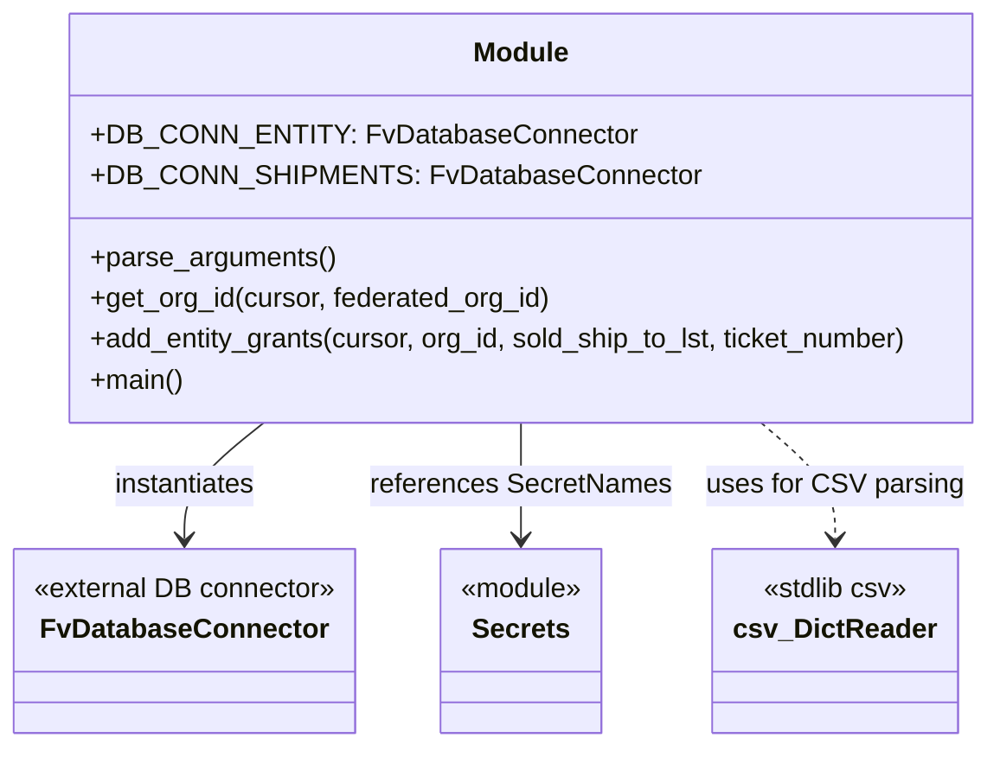

# Diagram: entity_core/entity_service/entity_service_scripts/backfill_federated_dealer_visiblity_grants.py


> Auto-generated by Obscura crawlers

## Diagram 1

```mermaid
flowchart TD
    A[parse_arguments()] --> B[main()]
    B --> C[Open CSV file (args.file_to_backfill)]
    C --> D[rows = csv.DictReader(csvfile)]
    D --> E[for each row in rows]
    E --> F{row["BAC"] present?}
    F -- No --> G[continue to next row]
    F -- Yes --> H[get_org_id(DB_CONN_SHIPMENTS.cursor, row["BAC"])]
    H --> I{org_id found?}
    I -- No --> J[logging.warning("No org id found for BAC")]
    J --> K[Compute sold_ship_to = [row["Sold To"]] + row["Ship To"].split(" ")]
    I -- Yes --> K
    K --> L[add_entity_grants(DB_CONN_ENTITY.cursor, org_id, sold_ship_to, ticket_number)]
    L --> M[Build and execute INSERT ... RETURNING * with cursor.mogrify]
    M --> N[grants_added = len(cursor.fetchall())]
    N --> O[print("Added {grants_added} to BAC {row['BAC']}")]
    O --> E
```

> SVG rendering failed for this diagram.

## Diagram 2



### SVG

<svg id="container" width="586.7109375" xmlns="http://www.w3.org/2000/svg" class="classDiagram" height="438" viewBox="0 0 586.7109375 438" role="graphics-document document" aria-roledescription="class"><style>#container{font-family:"trebuchet ms",verdana,arial,sans-serif;font-size:16px;fill:#333;}@keyframes edge-animation-frame{from{stroke-dashoffset:0;}}@keyframes dash{to{stroke-dashoffset:0;}}#container .edge-animation-slow{stroke-dasharray:9,5!important;stroke-dashoffset:900;animation:dash 50s linear infinite;stroke-linecap:round;}#container .edge-animation-fast{stroke-dasharray:9,5!important;stroke-dashoffset:900;animation:dash 20s linear infinite;stroke-linecap:round;}#container .error-icon{fill:#552222;}#container .error-text{fill:#552222;stroke:#552222;}#container .edge-thickness-normal{stroke-width:1px;}#container .edge-thickness-thick{stroke-width:3.5px;}#container .edge-pattern-solid{stroke-dasharray:0;}#container .edge-thickness-invisible{stroke-width:0;fill:none;}#container .edge-pattern-dashed{stroke-dasharray:3;}#container .edge-pattern-dotted{stroke-dasharray:2;}#container .marker{fill:#333333;stroke:#333333;}#container .marker.cross{stroke:#333333;}#container svg{font-family:"trebuchet ms",verdana,arial,sans-serif;font-size:16px;}#container p{margin:0;}#container g.classGroup text{fill:#9370DB;stroke:none;font-family:"trebuchet ms",verdana,arial,sans-serif;font-size:10px;}#container g.classGroup text .title{font-weight:bolder;}#container .nodeLabel,#container .edgeLabel{color:#131300;}#container .edgeLabel .label rect{fill:#ECECFF;}#container .label text{fill:#131300;}#container .labelBkg{background:#ECECFF;}#container .edgeLabel .label span{background:#ECECFF;}#container .classTitle{font-weight:bolder;}#container .node rect,#container .node circle,#container .node ellipse,#container .node polygon,#container .node path{fill:#ECECFF;stroke:#9370DB;stroke-width:1px;}#container .divider{stroke:#9370DB;stroke-width:1;}#container g.clickable{cursor:pointer;}#container g.classGroup rect{fill:#ECECFF;stroke:#9370DB;}#container g.classGroup line{stroke:#9370DB;stroke-width:1;}#container .classLabel .box{stroke:none;stroke-width:0;fill:#ECECFF;opacity:0.5;}#container .classLabel .label{fill:#9370DB;font-size:10px;}#container .relation{stroke:#333333;stroke-width:1;fill:none;}#container .dashed-line{stroke-dasharray:3;}#container .dotted-line{stroke-dasharray:1 2;}#container #compositionStart,#container .composition{fill:#333333!important;stroke:#333333!important;stroke-width:1;}#container #compositionEnd,#container .composition{fill:#333333!important;stroke:#333333!important;stroke-width:1;}#container #dependencyStart,#container .dependency{fill:#333333!important;stroke:#333333!important;stroke-width:1;}#container #dependencyStart,#container .dependency{fill:#333333!important;stroke:#333333!important;stroke-width:1;}#container #extensionStart,#container .extension{fill:transparent!important;stroke:#333333!important;stroke-width:1;}#container #extensionEnd,#container .extension{fill:transparent!important;stroke:#333333!important;stroke-width:1;}#container #aggregationStart,#container .aggregation{fill:transparent!important;stroke:#333333!important;stroke-width:1;}#container #aggregationEnd,#container .aggregation{fill:transparent!important;stroke:#333333!important;stroke-width:1;}#container #lollipopStart,#container .lollipop{fill:#ECECFF!important;stroke:#333333!important;stroke-width:1;}#container #lollipopEnd,#container .lollipop{fill:#ECECFF!important;stroke:#333333!important;stroke-width:1;}#container .edgeTerminals{font-size:11px;line-height:initial;}#container .classTitleText{text-anchor:middle;font-size:18px;fill:#333;}#container .label-icon{display:inline-block;height:1em;overflow:visible;vertical-align:-0.125em;}#container .node .label-icon path{fill:currentColor;stroke:revert;stroke-width:revert;}#container :root{--mermaid-font-family:"trebuchet ms",verdana,arial,sans-serif;}</style><g><defs><marker id="container_class-aggregationStart" class="marker aggregation class" refX="18" refY="7" markerWidth="190" markerHeight="240" orient="auto"><path d="M 18,7 L9,13 L1,7 L9,1 Z"></path></marker></defs><defs><marker id="container_class-aggregationEnd" class="marker aggregation class" refX="1" refY="7" markerWidth="20" markerHeight="28" orient="auto"><path d="M 18,7 L9,13 L1,7 L9,1 Z"></path></marker></defs><defs><marker id="container_class-extensionStart" class="marker extension class" refX="18" refY="7" markerWidth="190" markerHeight="240" orient="auto"><path d="M 1,7 L18,13 V 1 Z"></path></marker></defs><defs><marker id="container_class-extensionEnd" class="marker extension class" refX="1" refY="7" markerWidth="20" markerHeight="28" orient="auto"><path d="M 1,1 V 13 L18,7 Z"></path></marker></defs><defs><marker id="container_class-compositionStart" class="marker composition class" refX="18" refY="7" markerWidth="190" markerHeight="240" orient="auto"><path d="M 18,7 L9,13 L1,7 L9,1 Z"></path></marker></defs><defs><marker id="container_class-compositionEnd" class="marker composition class" refX="1" refY="7" markerWidth="20" markerHeight="28" orient="auto"><path d="M 18,7 L9,13 L1,7 L9,1 Z"></path></marker></defs><defs><marker id="container_class-dependencyStart" class="marker dependency class" refX="6" refY="7" markerWidth="190" markerHeight="240" orient="auto"><path d="M 5,7 L9,13 L1,7 L9,1 Z"></path></marker></defs><defs><marker id="container_class-dependencyEnd" class="marker dependency class" refX="13" refY="7" markerWidth="20" markerHeight="28" orient="auto"><path d="M 18,7 L9,13 L14,7 L9,1 Z"></path></marker></defs><defs><marker id="container_class-lollipopStart" class="marker lollipop class" refX="13" refY="7" markerWidth="190" markerHeight="240" orient="auto"><circle stroke="black" fill="transparent" cx="7" cy="7" r="6"></circle></marker></defs><defs><marker id="container_class-lollipopEnd" class="marker lollipop class" refX="1" refY="7" markerWidth="190" markerHeight="240" orient="auto"><circle stroke="black" fill="transparent" cx="7" cy="7" r="6"></circle></marker></defs><g class="root"><g class="clusters"></g><g class="edgePaths"><path d="M156.358,248L148.508,254.167C140.658,260.333,124.958,272.667,117.108,284C109.258,295.333,109.258,305.667,109.258,310.833L109.258,316" id="id_Module_FvDatabaseConnector_1" class="edge-thickness-normal edge-pattern-solid relation" style=";;;" data-edge="true" data-et="edge" data-id="id_Module_FvDatabaseConnector_1" data-points="W3sieCI6MTU2LjM1ODQyOTUzODIxNjU3LCJ5IjoyNDh9LHsieCI6MTA5LjI1NzgxMjUsInkiOjI4NX0seyJ4IjoxMDkuMjU3ODEyNSwieSI6MzIyfV0=" marker-end="url(#container_class-dependencyEnd)"></path><path d="M309.117,248L309.117,254.167C309.117,260.333,309.117,272.667,309.117,284C309.117,295.333,309.117,305.667,309.117,310.833L309.117,316" id="id_Module_Secrets_2" class="edge-thickness-normal edge-pattern-solid relation" style=";;;" data-edge="true" data-et="edge" data-id="id_Module_Secrets_2" data-points="W3sieCI6MzA5LjExNzE4NzUsInkiOjI0OH0seyJ4IjozMDkuMTE3MTg3NSwieSI6Mjg1fSx7IngiOjMwOS4xMTcxODc1LCJ5IjozMjJ9XQ==" marker-end="url(#container_class-dependencyEnd)"></path><path d="M447.043,248L454.131,254.167C461.219,260.333,475.395,272.667,482.482,284C489.57,295.333,489.57,305.667,489.57,310.833L489.57,316" id="id_Module_csv_DictReader_3" class="edge-thickness-normal edge-pattern-dashed relation" style=";;;" data-edge="true" data-et="edge" data-id="id_Module_csv_DictReader_3" data-points="W3sieCI6NDQ3LjA0MzE0MjkxNDAxMjcsInkiOjI0OH0seyJ4Ijo0ODkuNTcwMzEyNSwieSI6Mjg1fSx7IngiOjQ4OS41NzAzMTI1LCJ5IjozMjJ9XQ==" marker-end="url(#container_class-dependencyEnd)"></path></g><g class="edgeLabels"><g class="edgeLabel" transform="translate(109.2578125, 285)"><g class="label" data-id="id_Module_FvDatabaseConnector_1" transform="translate(-42.9140625, -12)"><foreignObject width="85.828125" height="24"><div xmlns="http://www.w3.org/1999/xhtml" class="labelBkg" style="display: table-cell; white-space: nowrap; line-height: 1.5; max-width: 200px; text-align: center;"><span class="edgeLabel"><p>instantiates</p></span></div></foreignObject></g></g><g class="edgeLabel" transform="translate(309.1171875, 285)"><g class="label" data-id="id_Module_Secrets_2" transform="translate(-87.359375, -12)"><foreignObject width="174.71875" height="24"><div xmlns="http://www.w3.org/1999/xhtml" class="labelBkg" style="display: table-cell; white-space: nowrap; line-height: 1.5; max-width: 200px; text-align: center;"><span class="edgeLabel"><p>references SecretNames</p></span></div></foreignObject></g></g><g class="edgeLabel" transform="translate(489.5703125, 285)"><g class="label" data-id="id_Module_csv_DictReader_3" transform="translate(-73.09375, -12)"><foreignObject width="146.1875" height="24"><div xmlns="http://www.w3.org/1999/xhtml" class="labelBkg" style="display: table-cell; white-space: nowrap; line-height: 1.5; max-width: 200px; text-align: center;"><span class="edgeLabel"><p>uses for CSV parsing</p></span></div></foreignObject></g></g></g><g class="nodes"><g class="node default" id="classId-FvDatabaseConnector-0" transform="translate(109.2578125, 376)"><g class="basic label-container"><path d="M-101.2578125 -54 L101.2578125 -54 L101.2578125 54 L-101.2578125 54" stroke="none" stroke-width="0" fill="#ECECFF" style=""></path><path d="M-101.2578125 -54 C-49.546431039759625 -54, 2.16495042048075 -54, 101.2578125 -54 M-101.2578125 -54 C-25.54550943028218 -54, 50.16679363943564 -54, 101.2578125 -54 M101.2578125 -54 C101.2578125 -27.80948684381452, 101.2578125 -1.6189736876290368, 101.2578125 54 M101.2578125 -54 C101.2578125 -19.21304391427568, 101.2578125 15.57391217144864, 101.2578125 54 M101.2578125 54 C26.18403154880008 54, -48.88974940239984 54, -101.2578125 54 M101.2578125 54 C37.93389196756597 54, -25.39002856486806 54, -101.2578125 54 M-101.2578125 54 C-101.2578125 29.165748990402868, -101.2578125 4.331497980805736, -101.2578125 -54 M-101.2578125 54 C-101.2578125 18.829434361876196, -101.2578125 -16.34113127624761, -101.2578125 -54" stroke="#9370DB" stroke-width="1.3" fill="none" stroke-dasharray="0 0" style=""></path></g><g class="annotation-group text" transform="translate(-89.2578125, -30)"><g class="label" style="" transform="translate(0,-12)"><foreignObject width="178.515625" height="24"><div xmlns="http://www.w3.org/1999/xhtml" style="display: table-cell; white-space: nowrap; line-height: 1.5; max-width: 229px; text-align: center;"><span class="nodeLabel markdown-node-label" style=""><p>«external DB connector»</p></span></div></foreignObject></g></g><g class="label-group text" transform="translate(-79.3046875, -6)"><g class="label" style="font-weight: bolder" transform="translate(0,-12)"><foreignObject width="158.609375" height="24"><div xmlns="http://www.w3.org/1999/xhtml" style="display: table-cell; white-space: nowrap; line-height: 1.5; max-width: 207px; text-align: center;"><span class="nodeLabel markdown-node-label" style=""><p>FvDatabaseConnector</p></span></div></foreignObject></g></g><g class="members-group text" transform="translate(-89.2578125, 42)"></g><g class="methods-group text" transform="translate(-89.2578125, 72)"></g><g class="divider" style=""><path d="M-101.2578125 18 C-26.6022195798012 18, 48.0533733403976 18, 101.2578125 18 M-101.2578125 18 C-33.72088293860523 18, 33.81604662278954 18, 101.2578125 18" stroke="#9370DB" stroke-width="1.3" fill="none" stroke-dasharray="0 0" style=""></path></g><g class="divider" style=""><path d="M-101.2578125 36 C-45.30573339091852 36, 10.646345718162962 36, 101.2578125 36 M-101.2578125 36 C-30.67853813026379 36, 39.90073623947242 36, 101.2578125 36" stroke="#9370DB" stroke-width="1.3" fill="none" stroke-dasharray="0 0" style=""></path></g></g><g class="node default" id="classId-Secrets-1" transform="translate(309.1171875, 376)"><g class="basic label-container"><path d="M-48.6015625 -54 L48.6015625 -54 L48.6015625 54 L-48.6015625 54" stroke="none" stroke-width="0" fill="#ECECFF" style=""></path><path d="M-48.6015625 -54 C-19.60028873503066 -54, 9.400985029938681 -54, 48.6015625 -54 M-48.6015625 -54 C-12.14641074297596 -54, 24.30874101404808 -54, 48.6015625 -54 M48.6015625 -54 C48.6015625 -27.622896622742388, 48.6015625 -1.2457932454847764, 48.6015625 54 M48.6015625 -54 C48.6015625 -30.99659179611669, 48.6015625 -7.993183592233379, 48.6015625 54 M48.6015625 54 C27.631125249780286 54, 6.660687999560572 54, -48.6015625 54 M48.6015625 54 C27.517663457655956 54, 6.433764415311913 54, -48.6015625 54 M-48.6015625 54 C-48.6015625 21.638149332166776, -48.6015625 -10.723701335666448, -48.6015625 -54 M-48.6015625 54 C-48.6015625 22.946641162674027, -48.6015625 -8.106717674651946, -48.6015625 -54" stroke="#9370DB" stroke-width="1.3" fill="none" stroke-dasharray="0 0" style=""></path></g><g class="annotation-group text" transform="translate(-36.6015625, -30)"><g class="label" style="" transform="translate(0,-12)"><foreignObject width="73.203125" height="24"><div xmlns="http://www.w3.org/1999/xhtml" style="display: table-cell; white-space: nowrap; line-height: 1.5; max-width: 123px; text-align: center;"><span class="nodeLabel markdown-node-label" style=""><p>«module»</p></span></div></foreignObject></g></g><g class="label-group text" transform="translate(-27.1640625, -6)"><g class="label" style="font-weight: bolder" transform="translate(0,-12)"><foreignObject width="54.328125" height="24"><div xmlns="http://www.w3.org/1999/xhtml" style="display: table-cell; white-space: nowrap; line-height: 1.5; max-width: 103px; text-align: center;"><span class="nodeLabel markdown-node-label" style=""><p>Secrets</p></span></div></foreignObject></g></g><g class="members-group text" transform="translate(-36.6015625, 42)"></g><g class="methods-group text" transform="translate(-36.6015625, 72)"></g><g class="divider" style=""><path d="M-48.6015625 18 C-11.767138050263462 18, 25.067286399473076 18, 48.6015625 18 M-48.6015625 18 C-11.39737639602744 18, 25.80680970794512 18, 48.6015625 18" stroke="#9370DB" stroke-width="1.3" fill="none" stroke-dasharray="0 0" style=""></path></g><g class="divider" style=""><path d="M-48.6015625 36 C-13.096587809341123 36, 22.408386881317753 36, 48.6015625 36 M-48.6015625 36 C-24.03579125102631 36, 0.5299799979473789 36, 48.6015625 36" stroke="#9370DB" stroke-width="1.3" fill="none" stroke-dasharray="0 0" style=""></path></g></g><g class="node default" id="classId-Module-2" transform="translate(309.1171875, 128)"><g class="basic label-container"><path d="M-269.59375 -120 L269.59375 -120 L269.59375 120 L-269.59375 120" stroke="none" stroke-width="0" fill="#ECECFF" style=""></path><path d="M-269.59375 -120 C-160.90159911620816 -120, -52.20944823241635 -120, 269.59375 -120 M-269.59375 -120 C-91.05501885162411 -120, 87.48371229675178 -120, 269.59375 -120 M269.59375 -120 C269.59375 -63.16634924970979, 269.59375 -6.332698499419578, 269.59375 120 M269.59375 -120 C269.59375 -52.90905346482984, 269.59375 14.181893070340323, 269.59375 120 M269.59375 120 C145.2046457020777 120, 20.81554140415537 120, -269.59375 120 M269.59375 120 C99.06592044625313 120, -71.46190910749374 120, -269.59375 120 M-269.59375 120 C-269.59375 38.45130052160506, -269.59375 -43.097398956789874, -269.59375 -120 M-269.59375 120 C-269.59375 37.48852001593666, -269.59375 -45.022959968126685, -269.59375 -120" stroke="#9370DB" stroke-width="1.3" fill="none" stroke-dasharray="0 0" style=""></path></g><g class="annotation-group text" transform="translate(0, -96)"></g><g class="label-group text" transform="translate(-27.09375, -96)"><g class="label" style="font-weight: bolder" transform="translate(0,-12)"><foreignObject width="54.1875" height="24"><div xmlns="http://www.w3.org/1999/xhtml" style="display: table-cell; white-space: nowrap; line-height: 1.5; max-width: 104px; text-align: center;"><span class="nodeLabel markdown-node-label" style=""><p>Module</p></span></div></foreignObject></g></g><g class="members-group text" transform="translate(-257.59375, -48)"><g class="label" style="" transform="translate(0,-12)"><foreignObject width="298.671875" height="24"><div xmlns="http://www.w3.org/1999/xhtml" style="display: table-cell; white-space: nowrap; line-height: 1.5; max-width: 357px; text-align: center;"><span class="nodeLabel markdown-node-label" style=""><p>+DB_CONN_ENTITY: FvDatabaseConnector</p></span></div></foreignObject></g><g class="label" style="" transform="translate(0,12)"><foreignObject width="331.40625" height="24"><div xmlns="http://www.w3.org/1999/xhtml" style="display: table-cell; white-space: nowrap; line-height: 1.5; max-width: 390px; text-align: center;"><span class="nodeLabel markdown-node-label" style=""><p>+DB_CONN_SHIPMENTS: FvDatabaseConnector</p></span></div></foreignObject></g></g><g class="methods-group text" transform="translate(-257.59375, 24)"><g class="label" style="" transform="translate(0,-12)"><foreignObject width="143.390625" height="24"><div xmlns="http://www.w3.org/1999/xhtml" style="display: table-cell; white-space: nowrap; line-height: 1.5; max-width: 201px; text-align: center;"><span class="nodeLabel markdown-node-label" style=""><p>+parse_arguments()</p></span></div></foreignObject></g><g class="label" style="" transform="translate(0,12)"><foreignObject width="271.921875" height="24"><div xmlns="http://www.w3.org/1999/xhtml" style="display: table-cell; white-space: nowrap; line-height: 1.5; max-width: 329px; text-align: center;"><span class="nodeLabel markdown-node-label" style=""><p>+get_org_id(cursor, federated_org_id)</p></span></div></foreignObject></g><g class="label" style="" transform="translate(0,36)"><foreignObject width="488.09375" height="24"><div xmlns="http://www.w3.org/1999/xhtml" style="display: table-cell; white-space: nowrap; line-height: 1.5; max-width: 545px; text-align: center;"><span class="nodeLabel markdown-node-label" style=""><p>+add_entity_grants(cursor, org_id, sold_ship_to_lst, ticket_number)</p></span></div></foreignObject></g><g class="label" style="" transform="translate(0,60)"><foreignObject width="54.65625" height="24"><div xmlns="http://www.w3.org/1999/xhtml" style="display: table-cell; white-space: nowrap; line-height: 1.5; max-width: 112px; text-align: center;"><span class="nodeLabel markdown-node-label" style=""><p>+main()</p></span></div></foreignObject></g></g><g class="divider" style=""><path d="M-269.59375 -72 C-132.69955274760576 -72, 4.194644504788471 -72, 269.59375 -72 M-269.59375 -72 C-60.75048267023524 -72, 148.0927846595295 -72, 269.59375 -72" stroke="#9370DB" stroke-width="1.3" fill="none" stroke-dasharray="0 0" style=""></path></g><g class="divider" style=""><path d="M-269.59375 0 C-159.3063645386176 0, -49.0189790772352 0, 269.59375 0 M-269.59375 0 C-93.42802825130872 0, 82.73769349738257 0, 269.59375 0" stroke="#9370DB" stroke-width="1.3" fill="none" stroke-dasharray="0 0" style=""></path></g></g><g class="node default" id="classId-csv_DictReader-3" transform="translate(489.5703125, 376)"><g class="basic label-container"><path d="M-67.9140625 -54 L67.9140625 -54 L67.9140625 54 L-67.9140625 54" stroke="none" stroke-width="0" fill="#ECECFF" style=""></path><path d="M-67.9140625 -54 C-36.54211678768621 -54, -5.170171075372423 -54, 67.9140625 -54 M-67.9140625 -54 C-36.549459077117355 -54, -5.18485565423471 -54, 67.9140625 -54 M67.9140625 -54 C67.9140625 -31.112548119851237, 67.9140625 -8.225096239702474, 67.9140625 54 M67.9140625 -54 C67.9140625 -15.461639157897217, 67.9140625 23.076721684205566, 67.9140625 54 M67.9140625 54 C27.318926306763537 54, -13.276209886472927 54, -67.9140625 54 M67.9140625 54 C36.556224755655535 54, 5.198387011311077 54, -67.9140625 54 M-67.9140625 54 C-67.9140625 29.5278844690856, -67.9140625 5.055768938171198, -67.9140625 -54 M-67.9140625 54 C-67.9140625 19.11474230182815, -67.9140625 -15.770515396343697, -67.9140625 -54" stroke="#9370DB" stroke-width="1.3" fill="none" stroke-dasharray="0 0" style=""></path></g><g class="annotation-group text" transform="translate(-43.25, -30)"><g class="label" style="" transform="translate(0,-12)"><foreignObject width="86.5" height="24"><div xmlns="http://www.w3.org/1999/xhtml" style="display: table-cell; white-space: nowrap; line-height: 1.5; max-width: 137px; text-align: center;"><span class="nodeLabel markdown-node-label" style=""><p>«stdlib csv»</p></span></div></foreignObject></g></g><g class="label-group text" transform="translate(-55.9140625, -6)"><g class="label" style="font-weight: bolder" transform="translate(0,-12)"><foreignObject width="111.828125" height="24"><div xmlns="http://www.w3.org/1999/xhtml" style="display: table-cell; white-space: nowrap; line-height: 1.5; max-width: 161px; text-align: center;"><span class="nodeLabel markdown-node-label" style=""><p>csv_DictReader</p></span></div></foreignObject></g></g><g class="members-group text" transform="translate(-55.9140625, 42)"></g><g class="methods-group text" transform="translate(-55.9140625, 72)"></g><g class="divider" style=""><path d="M-67.9140625 18 C-31.632262182542924 18, 4.6495381349141525 18, 67.9140625 18 M-67.9140625 18 C-30.60768686522959 18, 6.698688769540823 18, 67.9140625 18" stroke="#9370DB" stroke-width="1.3" fill="none" stroke-dasharray="0 0" style=""></path></g><g class="divider" style=""><path d="M-67.9140625 36 C-40.48992132387929 36, -13.06578014775858 36, 67.9140625 36 M-67.9140625 36 C-37.22912646095723 36, -6.544190421914472 36, 67.9140625 36" stroke="#9370DB" stroke-width="1.3" fill="none" stroke-dasharray="0 0" style=""></path></g></g></g></g></g></svg>
