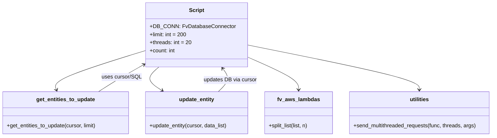

# Diagram: entity_core/entity_service/entity_service_scripts/backfill_last_position_update_location_id_DPU-524.py


> Auto-generated by Obscura crawlers

## Diagram 1

```mermaid
flowchart TD
    Start([Start]) --> InitDB[DB_CONN = FvDatabaseConnector("backfill_last_position_update_location_id_DPU-524.py", SecretNames.ENTITY_DATABASE)]
    InitDB --> Cursor[(DB_CONN.cursor)]
    Cursor --> MainLoop{while res}
    MainLoop --> CheckLog{count % 500 == 0}
    CheckLog -->|yes| Print[print(f"{limit} took {time.perf_counter() - b}. Total: {count}")]
    MainLoop --> GetEntities[get_entities_to_update(cursor, limit)]
    GetEntities --> SQL["cursor.execute(SELECT e.id, e.last_position_update, l.id AS location_id, l.name AS location_name, s.organizations_id AS customer_org_id ... LIMIT {limit})"]
    SQL --> Entities[entities_to_update (list of dicts)]
    Entities --> Split[fv_aws_lambdas.split_list(entities_to_update, int(limit/threads))]
    Split --> PrepareArgs[prepare args: [[cursor, ent_list], ...]]
    PrepareArgs --> Send[utilities.send_multithreaded_requests(update_entity, threads, args)]
    Send --> UpdateEntity[update_entity(cursor, data_list)]
    UpdateEntity --> BuildVals[build values list and data dict]
    BuildVals --> ValuesStr["VALUES {values_str}"]
    ValuesStr --> Mogrify[cursor.mogrify(UPDATE entity SET last_position_update = last_position_update || jsonb_build_object(... ) FROM (VALUES ...) as c (...), data)]
    Mogrify --> Execute[cursor.execute(query)]
    Execute --> LoopInc[count += limit]
    LoopInc --> MainLoop
```

> SVG rendering failed for this diagram.

## Diagram 2



### SVG

<svg id="container" width="1483.8984375" xmlns="http://www.w3.org/2000/svg" class="classDiagram" height="408" viewBox="0 0 1483.8984375 408" role="graphics-document document" aria-roledescription="class"><style>#container{font-family:"trebuchet ms",verdana,arial,sans-serif;font-size:16px;fill:#333;}@keyframes edge-animation-frame{from{stroke-dashoffset:0;}}@keyframes dash{to{stroke-dashoffset:0;}}#container .edge-animation-slow{stroke-dasharray:9,5!important;stroke-dashoffset:900;animation:dash 50s linear infinite;stroke-linecap:round;}#container .edge-animation-fast{stroke-dasharray:9,5!important;stroke-dashoffset:900;animation:dash 20s linear infinite;stroke-linecap:round;}#container .error-icon{fill:#552222;}#container .error-text{fill:#552222;stroke:#552222;}#container .edge-thickness-normal{stroke-width:1px;}#container .edge-thickness-thick{stroke-width:3.5px;}#container .edge-pattern-solid{stroke-dasharray:0;}#container .edge-thickness-invisible{stroke-width:0;fill:none;}#container .edge-pattern-dashed{stroke-dasharray:3;}#container .edge-pattern-dotted{stroke-dasharray:2;}#container .marker{fill:#333333;stroke:#333333;}#container .marker.cross{stroke:#333333;}#container svg{font-family:"trebuchet ms",verdana,arial,sans-serif;font-size:16px;}#container p{margin:0;}#container g.classGroup text{fill:#9370DB;stroke:none;font-family:"trebuchet ms",verdana,arial,sans-serif;font-size:10px;}#container g.classGroup text .title{font-weight:bolder;}#container .nodeLabel,#container .edgeLabel{color:#131300;}#container .edgeLabel .label rect{fill:#ECECFF;}#container .label text{fill:#131300;}#container .labelBkg{background:#ECECFF;}#container .edgeLabel .label span{background:#ECECFF;}#container .classTitle{font-weight:bolder;}#container .node rect,#container .node circle,#container .node ellipse,#container .node polygon,#container .node path{fill:#ECECFF;stroke:#9370DB;stroke-width:1px;}#container .divider{stroke:#9370DB;stroke-width:1;}#container g.clickable{cursor:pointer;}#container g.classGroup rect{fill:#ECECFF;stroke:#9370DB;}#container g.classGroup line{stroke:#9370DB;stroke-width:1;}#container .classLabel .box{stroke:none;stroke-width:0;fill:#ECECFF;opacity:0.5;}#container .classLabel .label{fill:#9370DB;font-size:10px;}#container .relation{stroke:#333333;stroke-width:1;fill:none;}#container .dashed-line{stroke-dasharray:3;}#container .dotted-line{stroke-dasharray:1 2;}#container #compositionStart,#container .composition{fill:#333333!important;stroke:#333333!important;stroke-width:1;}#container #compositionEnd,#container .composition{fill:#333333!important;stroke:#333333!important;stroke-width:1;}#container #dependencyStart,#container .dependency{fill:#333333!important;stroke:#333333!important;stroke-width:1;}#container #dependencyStart,#container .dependency{fill:#333333!important;stroke:#333333!important;stroke-width:1;}#container #extensionStart,#container .extension{fill:transparent!important;stroke:#333333!important;stroke-width:1;}#container #extensionEnd,#container .extension{fill:transparent!important;stroke:#333333!important;stroke-width:1;}#container #aggregationStart,#container .aggregation{fill:transparent!important;stroke:#333333!important;stroke-width:1;}#container #aggregationEnd,#container .aggregation{fill:transparent!important;stroke:#333333!important;stroke-width:1;}#container #lollipopStart,#container .lollipop{fill:#ECECFF!important;stroke:#333333!important;stroke-width:1;}#container #lollipopEnd,#container .lollipop{fill:#ECECFF!important;stroke:#333333!important;stroke-width:1;}#container .edgeTerminals{font-size:11px;line-height:initial;}#container .classTitleText{text-anchor:middle;font-size:18px;fill:#333;}#container .label-icon{display:inline-block;height:1em;overflow:visible;vertical-align:-0.125em;}#container .node .label-icon path{fill:currentColor;stroke:revert;stroke-width:revert;}#container :root{--mermaid-font-family:"trebuchet ms",verdana,arial,sans-serif;}</style><g><defs><marker id="container_class-aggregationStart" class="marker aggregation class" refX="18" refY="7" markerWidth="190" markerHeight="240" orient="auto"><path d="M 18,7 L9,13 L1,7 L9,1 Z"></path></marker></defs><defs><marker id="container_class-aggregationEnd" class="marker aggregation class" refX="1" refY="7" markerWidth="20" markerHeight="28" orient="auto"><path d="M 18,7 L9,13 L1,7 L9,1 Z"></path></marker></defs><defs><marker id="container_class-extensionStart" class="marker extension class" refX="18" refY="7" markerWidth="190" markerHeight="240" orient="auto"><path d="M 1,7 L18,13 V 1 Z"></path></marker></defs><defs><marker id="container_class-extensionEnd" class="marker extension class" refX="1" refY="7" markerWidth="20" markerHeight="28" orient="auto"><path d="M 1,1 V 13 L18,7 Z"></path></marker></defs><defs><marker id="container_class-compositionStart" class="marker composition class" refX="18" refY="7" markerWidth="190" markerHeight="240" orient="auto"><path d="M 18,7 L9,13 L1,7 L9,1 Z"></path></marker></defs><defs><marker id="container_class-compositionEnd" class="marker composition class" refX="1" refY="7" markerWidth="20" markerHeight="28" orient="auto"><path d="M 18,7 L9,13 L1,7 L9,1 Z"></path></marker></defs><defs><marker id="container_class-dependencyStart" class="marker dependency class" refX="6" refY="7" markerWidth="190" markerHeight="240" orient="auto"><path d="M 5,7 L9,13 L1,7 L9,1 Z"></path></marker></defs><defs><marker id="container_class-dependencyEnd" class="marker dependency class" refX="13" refY="7" markerWidth="20" markerHeight="28" orient="auto"><path d="M 18,7 L9,13 L14,7 L9,1 Z"></path></marker></defs><defs><marker id="container_class-lollipopStart" class="marker lollipop class" refX="13" refY="7" markerWidth="190" markerHeight="240" orient="auto"><circle stroke="black" fill="transparent" cx="7" cy="7" r="6"></circle></marker></defs><defs><marker id="container_class-lollipopEnd" class="marker lollipop class" refX="1" refY="7" markerWidth="190" markerHeight="240" orient="auto"><circle stroke="black" fill="transparent" cx="7" cy="7" r="6"></circle></marker></defs><g class="root"><g class="clusters"></g><g class="edgePaths"><path d="M449.531,147.962L401.025,162.802C352.52,177.642,255.508,207.321,209.071,227.397C162.635,247.473,166.773,257.947,168.843,263.183L170.912,268.42" id="id_Script_get_entities_to_update_1" class="edge-thickness-normal edge-pattern-solid relation" style=";;;" data-edge="true" data-et="edge" data-id="id_Script_get_entities_to_update_1" data-points="W3sieCI6NDQ5LjUzMTI1LCJ5IjoxNDcuOTYyNDY4MTAxOTMwMDZ9LHsieCI6MTU4LjQ5NjA5Mzc1LCJ5IjoyMzd9LHsieCI6MTczLjExNjg3NSwieSI6Mjc0fV0=" marker-end="url(#container_class-dependencyEnd)"></path><path d="M479.118,200L471.788,206.167C464.457,212.333,449.797,224.667,451.371,236.465C452.945,248.264,470.753,259.528,479.657,265.16L488.561,270.793" id="id_Script_update_entity_2" class="edge-thickness-normal edge-pattern-solid relation" style=";;;" data-edge="true" data-et="edge" data-id="id_Script_update_entity_2" data-points="W3sieCI6NDc5LjExNzY4Njc5NTExMjgsInkiOjIwMH0seyJ4Ijo0MzUuMTM2NzE4NzUsInkiOjIzN30seyJ4Ijo0OTMuNjMxNDA2MjUsInkiOjI3NH1d" marker-end="url(#container_class-dependencyEnd)"></path><path d="M736.93,166.116L764.26,177.93C791.591,189.744,846.253,213.372,873.583,230.353C900.914,247.333,900.914,257.667,900.914,262.833L900.914,268" id="id_Script_fv_aws_lambdas_3" class="edge-thickness-normal edge-pattern-solid relation" style=";;;" data-edge="true" data-et="edge" data-id="id_Script_fv_aws_lambdas_3" data-points="W3sieCI6NzM2LjkyOTY4NzUsInkiOjE2Ni4xMTU3NDY0NDIwMzc5fSx7IngiOjkwMC45MTQwNjI1LCJ5IjoyMzd9LHsieCI6OTAwLjkxNDA2MjUsInkiOjI3NH1d" marker-end="url(#container_class-dependencyEnd)"></path><path d="M736.93,132.465L824.882,149.888C912.835,167.31,1088.74,202.155,1176.692,224.744C1264.645,247.333,1264.645,257.667,1264.645,262.833L1264.645,268" id="id_Script_utilities_4" class="edge-thickness-normal edge-pattern-solid relation" style=";;;" data-edge="true" data-et="edge" data-id="id_Script_utilities_4" data-points="W3sieCI6NzM2LjkyOTY4NzUsInkiOjEzMi40NjUyOTAxNDA5MTA2fSx7IngiOjEyNjQuNjQ0NTMxMjUsInkiOjIzN30seyJ4IjoxMjY0LjY0NDUzMTI1LCJ5IjoyNzR9XQ==" marker-end="url(#container_class-dependencyEnd)"></path><path d="M297.611,274L307.36,267.833C317.109,261.667,336.607,249.333,361.055,234.922C385.503,220.511,414.901,204.023,429.599,195.778L444.298,187.534" id="id_get_entities_to_update_Script_5" class="edge-thickness-normal edge-pattern-solid relation" style=";;;" data-edge="true" data-et="edge" data-id="id_get_entities_to_update_Script_5" data-points="W3sieCI6Mjk3LjYxMDc4MTI1LCJ5IjoyNzR9LHsieCI6MzU2LjEwNTQ2ODc1LCJ5IjoyMzd9LHsieCI6NDQ5LjUzMTI1LCJ5IjoxODQuNTk4ODIzODAwNzM4fV0=" marker-end="url(#container_class-dependencyEnd)"></path><path d="M658.904,274L665.333,267.833C671.761,261.667,684.618,249.333,686.83,237.787C689.042,226.241,680.609,215.482,676.392,210.102L672.176,204.722" id="id_update_entity_Script_6" class="edge-thickness-normal edge-pattern-solid relation" style=";;;" data-edge="true" data-et="edge" data-id="id_update_entity_Script_6" data-points="W3sieCI6NjU4LjkwNDI3NzM0Mzc1LCJ5IjoyNzR9LHsieCI6Njk3LjQ3NDYwOTM3NSwieSI6MjM3fSx7IngiOjY2OC40NzQzNTk3Mjc0NDM2LCJ5IjoyMDB9XQ==" marker-end="url(#container_class-dependencyEnd)"></path></g><g class="edgeLabels"><g class="edgeLabel"><g class="label" data-id="id_Script_get_entities_to_update_1" transform="translate(0, 0)"><foreignObject width="0" height="0"><div xmlns="http://www.w3.org/1999/xhtml" class="labelBkg" style="display: table-cell; white-space: nowrap; line-height: 1.5; max-width: 200px; text-align: center;"><span class="edgeLabel"></span></div></foreignObject></g></g><g class="edgeLabel"><g class="label" data-id="id_Script_update_entity_2" transform="translate(0, 0)"><foreignObject width="0" height="0"><div xmlns="http://www.w3.org/1999/xhtml" class="labelBkg" style="display: table-cell; white-space: nowrap; line-height: 1.5; max-width: 200px; text-align: center;"><span class="edgeLabel"></span></div></foreignObject></g></g><g class="edgeLabel"><g class="label" data-id="id_Script_fv_aws_lambdas_3" transform="translate(0, 0)"><foreignObject width="0" height="0"><div xmlns="http://www.w3.org/1999/xhtml" class="labelBkg" style="display: table-cell; white-space: nowrap; line-height: 1.5; max-width: 200px; text-align: center;"><span class="edgeLabel"></span></div></foreignObject></g></g><g class="edgeLabel"><g class="label" data-id="id_Script_utilities_4" transform="translate(0, 0)"><foreignObject width="0" height="0"><div xmlns="http://www.w3.org/1999/xhtml" class="labelBkg" style="display: table-cell; white-space: nowrap; line-height: 1.5; max-width: 200px; text-align: center;"><span class="edgeLabel"></span></div></foreignObject></g></g><g class="edgeLabel" transform="translate(372.63479, 227.72894)"><g class="label" data-id="id_get_entities_to_update_Script_5" transform="translate(-59.03125, -12)"><foreignObject width="118.0625" height="24"><div xmlns="http://www.w3.org/1999/xhtml" class="labelBkg" style="display: table-cell; white-space: nowrap; line-height: 1.5; max-width: 200px; text-align: center;"><span class="edgeLabel"><p>uses cursor/SQL</p></span></div></foreignObject></g></g><g class="edgeLabel" transform="translate(695.15198, 239.22806)"><g class="label" data-id="id_update_entity_Script_6" transform="translate(-79.1953125, -12)"><foreignObject width="158.390625" height="24"><div xmlns="http://www.w3.org/1999/xhtml" class="labelBkg" style="display: table-cell; white-space: nowrap; line-height: 1.5; max-width: 200px; text-align: center;"><span class="edgeLabel"><p>updates DB via cursor</p></span></div></foreignObject></g></g></g><g class="nodes"><g class="node default" id="classId-Script-0" transform="translate(593.23046875, 104)"><g class="basic label-container"><path d="M-143.69921875 -96 L143.69921875 -96 L143.69921875 96 L-143.69921875 96" stroke="none" stroke-width="0" fill="#ECECFF" style=""></path><path d="M-143.69921875 -96 C-85.03496573735511 -96, -26.370712724710216 -96, 143.69921875 -96 M-143.69921875 -96 C-78.08249393149019 -96, -12.465769112980382 -96, 143.69921875 -96 M143.69921875 -96 C143.69921875 -42.005424220743734, 143.69921875 11.989151558512532, 143.69921875 96 M143.69921875 -96 C143.69921875 -52.563830617009145, 143.69921875 -9.12766123401829, 143.69921875 96 M143.69921875 96 C80.16202916996315 96, 16.62483958992628 96, -143.69921875 96 M143.69921875 96 C35.022306404059606 96, -73.65460594188079 96, -143.69921875 96 M-143.69921875 96 C-143.69921875 29.942338017475777, -143.69921875 -36.11532396504845, -143.69921875 -96 M-143.69921875 96 C-143.69921875 38.45510170538334, -143.69921875 -19.089796589233316, -143.69921875 -96" stroke="#9370DB" stroke-width="1.3" fill="none" stroke-dasharray="0 0" style=""></path></g><g class="annotation-group text" transform="translate(0, -72)"></g><g class="label-group text" transform="translate(-21.7421875, -72)"><g class="label" style="font-weight: bolder" transform="translate(0,-12)"><foreignObject width="43.484375" height="24"><div xmlns="http://www.w3.org/1999/xhtml" style="display: table-cell; white-space: nowrap; line-height: 1.5; max-width: 93px; text-align: center;"><span class="nodeLabel markdown-node-label" style=""><p>Script</p></span></div></foreignObject></g></g><g class="members-group text" transform="translate(-131.69921875, -24)"><g class="label" style="" transform="translate(0,-12)"><foreignObject width="241.65625" height="24"><div xmlns="http://www.w3.org/1999/xhtml" style="display: table-cell; white-space: nowrap; line-height: 1.5; max-width: 300px; text-align: center;"><span class="nodeLabel markdown-node-label" style=""><p>+DB_CONN: FvDatabaseConnector</p></span></div></foreignObject></g><g class="label" style="" transform="translate(0,12)"><foreignObject width="111.25" height="24"><div xmlns="http://www.w3.org/1999/xhtml" style="display: table-cell; white-space: nowrap; line-height: 1.5; max-width: 169px; text-align: center;"><span class="nodeLabel markdown-node-label" style=""><p>+limit: int = 200</p></span></div></foreignObject></g><g class="label" style="" transform="translate(0,36)"><foreignObject width="124.140625" height="24"><div xmlns="http://www.w3.org/1999/xhtml" style="display: table-cell; white-space: nowrap; line-height: 1.5; max-width: 182px; text-align: center;"><span class="nodeLabel markdown-node-label" style=""><p>+threads: int = 20</p></span></div></foreignObject></g><g class="label" style="" transform="translate(0,60)"><foreignObject width="76.9375" height="24"><div xmlns="http://www.w3.org/1999/xhtml" style="display: table-cell; white-space: nowrap; line-height: 1.5; max-width: 135px; text-align: center;"><span class="nodeLabel markdown-node-label" style=""><p>+count: int</p></span></div></foreignObject></g></g><g class="methods-group text" transform="translate(-131.69921875, 96)"></g><g class="divider" style=""><path d="M-143.69921875 -48 C-35.56469214429113 -48, 72.56983446141774 -48, 143.69921875 -48 M-143.69921875 -48 C-70.00961794056938 -48, 3.679982868861231 -48, 143.69921875 -48" stroke="#9370DB" stroke-width="1.3" fill="none" stroke-dasharray="0 0" style=""></path></g><g class="divider" style=""><path d="M-143.69921875 72 C-51.20557433123204 72, 41.288070087535914 72, 143.69921875 72 M-143.69921875 72 C-34.61202887343019 72, 74.47516100313962 72, 143.69921875 72" stroke="#9370DB" stroke-width="1.3" fill="none" stroke-dasharray="0 0" style=""></path></g></g><g class="node default" id="classId-get_entities_to_update-1" transform="translate(198.01171875, 337)"><g class="basic label-container"><path d="M-190.01171875 -63 L190.01171875 -63 L190.01171875 63 L-190.01171875 63" stroke="none" stroke-width="0" fill="#ECECFF" style=""></path><path d="M-190.01171875 -63 C-64.79144097851037 -63, 60.42883679297927 -63, 190.01171875 -63 M-190.01171875 -63 C-102.59011634964446 -63, -15.168513949288922 -63, 190.01171875 -63 M190.01171875 -63 C190.01171875 -20.17624887371342, 190.01171875 22.64750225257316, 190.01171875 63 M190.01171875 -63 C190.01171875 -12.749589043268031, 190.01171875 37.50082191346394, 190.01171875 63 M190.01171875 63 C59.79072328439358 63, -70.43027218121284 63, -190.01171875 63 M190.01171875 63 C82.72067740408843 63, -24.570363941823132 63, -190.01171875 63 M-190.01171875 63 C-190.01171875 36.147160736413284, -190.01171875 9.294321472826567, -190.01171875 -63 M-190.01171875 63 C-190.01171875 36.893149798420765, -190.01171875 10.786299596841523, -190.01171875 -63" stroke="#9370DB" stroke-width="1.3" fill="none" stroke-dasharray="0 0" style=""></path></g><g class="annotation-group text" transform="translate(0, -39)"></g><g class="label-group text" transform="translate(-84.9296875, -39)"><g class="label" style="font-weight: bolder" transform="translate(0,-12)"><foreignObject width="169.859375" height="24"><div xmlns="http://www.w3.org/1999/xhtml" style="display: table-cell; white-space: nowrap; line-height: 1.5; max-width: 217px; text-align: center;"><span class="nodeLabel markdown-node-label" style=""><p>get_entities_to_update</p></span></div></foreignObject></g></g><g class="members-group text" transform="translate(-178.01171875, 9)"></g><g class="methods-group text" transform="translate(-178.01171875, 39)"><g class="label" style="" transform="translate(0,-12)"><foreignObject width="271.09375" height="24"><div xmlns="http://www.w3.org/1999/xhtml" style="display: table-cell; white-space: nowrap; line-height: 1.5; max-width: 328px; text-align: center;"><span class="nodeLabel markdown-node-label" style=""><p>+get_entities_to_update(cursor, limit)</p></span></div></foreignObject></g></g><g class="divider" style=""><path d="M-190.01171875 -15 C-65.93643767068833 -15, 58.13884340862333 -15, 190.01171875 -15 M-190.01171875 -15 C-58.360833160265315 -15, 73.29005242946937 -15, 190.01171875 -15" stroke="#9370DB" stroke-width="1.3" fill="none" stroke-dasharray="0 0" style=""></path></g><g class="divider" style=""><path d="M-190.01171875 9 C-101.9458133731566 9, -13.879907996313193 9, 190.01171875 9 M-190.01171875 9 C-84.40718710539421 9, 21.19734453921157 9, 190.01171875 9" stroke="#9370DB" stroke-width="1.3" fill="none" stroke-dasharray="0 0" style=""></path></g></g><g class="node default" id="classId-update_entity-2" transform="translate(593.23046875, 337)"><g class="basic label-container"><path d="M-155.20703125 -63 L155.20703125 -63 L155.20703125 63 L-155.20703125 63" stroke="none" stroke-width="0" fill="#ECECFF" style=""></path><path d="M-155.20703125 -63 C-82.54440514838842 -63, -9.881779046776842 -63, 155.20703125 -63 M-155.20703125 -63 C-40.53546056514094 -63, 74.13611011971813 -63, 155.20703125 -63 M155.20703125 -63 C155.20703125 -28.571869870474607, 155.20703125 5.856260259050785, 155.20703125 63 M155.20703125 -63 C155.20703125 -31.157920145017478, 155.20703125 0.6841597099650443, 155.20703125 63 M155.20703125 63 C92.51098115955409 63, 29.814931069108198 63, -155.20703125 63 M155.20703125 63 C71.14268572787395 63, -12.921659794252093 63, -155.20703125 63 M-155.20703125 63 C-155.20703125 35.96001808688831, -155.20703125 8.920036173776623, -155.20703125 -63 M-155.20703125 63 C-155.20703125 27.531261622752048, -155.20703125 -7.937476754495904, -155.20703125 -63" stroke="#9370DB" stroke-width="1.3" fill="none" stroke-dasharray="0 0" style=""></path></g><g class="annotation-group text" transform="translate(0, -39)"></g><g class="label-group text" transform="translate(-51.3046875, -39)"><g class="label" style="font-weight: bolder" transform="translate(0,-12)"><foreignObject width="102.609375" height="24"><div xmlns="http://www.w3.org/1999/xhtml" style="display: table-cell; white-space: nowrap; line-height: 1.5; max-width: 151px; text-align: center;"><span class="nodeLabel markdown-node-label" style=""><p>update_entity</p></span></div></foreignObject></g></g><g class="members-group text" transform="translate(-143.20703125, 9)"></g><g class="methods-group text" transform="translate(-143.20703125, 39)"><g class="label" style="" transform="translate(0,-12)"><foreignObject width="235.109375" height="24"><div xmlns="http://www.w3.org/1999/xhtml" style="display: table-cell; white-space: nowrap; line-height: 1.5; max-width: 292px; text-align: center;"><span class="nodeLabel markdown-node-label" style=""><p>+update_entity(cursor, data_list)</p></span></div></foreignObject></g></g><g class="divider" style=""><path d="M-155.20703125 -15 C-35.2536100614613 -15, 84.6998111270774 -15, 155.20703125 -15 M-155.20703125 -15 C-62.29438611194145 -15, 30.6182590261171 -15, 155.20703125 -15" stroke="#9370DB" stroke-width="1.3" fill="none" stroke-dasharray="0 0" style=""></path></g><g class="divider" style=""><path d="M-155.20703125 9 C-53.01616958119931 9, 49.174692087601386 9, 155.20703125 9 M-155.20703125 9 C-58.17197328294827 9, 38.863084684103455 9, 155.20703125 9" stroke="#9370DB" stroke-width="1.3" fill="none" stroke-dasharray="0 0" style=""></path></g></g><g class="node default" id="classId-fv_aws_lambdas-3" transform="translate(900.9140625, 337)"><g class="basic label-container"><path d="M-102.4765625 -63 L102.4765625 -63 L102.4765625 63 L-102.4765625 63" stroke="none" stroke-width="0" fill="#ECECFF" style=""></path><path d="M-102.4765625 -63 C-54.12594176616221 -63, -5.775321032324413 -63, 102.4765625 -63 M-102.4765625 -63 C-36.774225396424455 -63, 28.92811170715109 -63, 102.4765625 -63 M102.4765625 -63 C102.4765625 -21.575933080617574, 102.4765625 19.848133838764852, 102.4765625 63 M102.4765625 -63 C102.4765625 -19.039866653802022, 102.4765625 24.920266692395955, 102.4765625 63 M102.4765625 63 C24.193482052800917 63, -54.089598394398166 63, -102.4765625 63 M102.4765625 63 C45.37203036627161 63, -11.732501767456782 63, -102.4765625 63 M-102.4765625 63 C-102.4765625 21.095716758841426, -102.4765625 -20.808566482317147, -102.4765625 -63 M-102.4765625 63 C-102.4765625 14.004272725337664, -102.4765625 -34.99145454932467, -102.4765625 -63" stroke="#9370DB" stroke-width="1.3" fill="none" stroke-dasharray="0 0" style=""></path></g><g class="annotation-group text" transform="translate(0, -39)"></g><g class="label-group text" transform="translate(-60.0625, -39)"><g class="label" style="font-weight: bolder" transform="translate(0,-12)"><foreignObject width="120.125" height="24"><div xmlns="http://www.w3.org/1999/xhtml" style="display: table-cell; white-space: nowrap; line-height: 1.5; max-width: 168px; text-align: center;"><span class="nodeLabel markdown-node-label" style=""><p>fv_aws_lambdas</p></span></div></foreignObject></g></g><g class="members-group text" transform="translate(-90.4765625, 9)"></g><g class="methods-group text" transform="translate(-90.4765625, 39)"><g class="label" style="" transform="translate(0,-12)"><foreignObject width="120.890625" height="24"><div xmlns="http://www.w3.org/1999/xhtml" style="display: table-cell; white-space: nowrap; line-height: 1.5; max-width: 178px; text-align: center;"><span class="nodeLabel markdown-node-label" style=""><p>+split_list(list, n)</p></span></div></foreignObject></g></g><g class="divider" style=""><path d="M-102.4765625 -15 C-41.012687782589374 -15, 20.45118693482125 -15, 102.4765625 -15 M-102.4765625 -15 C-45.27317820523339 -15, 11.930206089533215 -15, 102.4765625 -15" stroke="#9370DB" stroke-width="1.3" fill="none" stroke-dasharray="0 0" style=""></path></g><g class="divider" style=""><path d="M-102.4765625 9 C-57.27391856236428 9, -12.07127462472856 9, 102.4765625 9 M-102.4765625 9 C-44.54478003965843 9, 13.387002420683146 9, 102.4765625 9" stroke="#9370DB" stroke-width="1.3" fill="none" stroke-dasharray="0 0" style=""></path></g></g><g class="node default" id="classId-utilities-4" transform="translate(1264.64453125, 337)"><g class="basic label-container"><path d="M-211.25390625 -63 L211.25390625 -63 L211.25390625 63 L-211.25390625 63" stroke="none" stroke-width="0" fill="#ECECFF" style=""></path><path d="M-211.25390625 -63 C-83.79402102623978 -63, 43.66586419752045 -63, 211.25390625 -63 M-211.25390625 -63 C-113.9673747512708 -63, -16.680843252541592 -63, 211.25390625 -63 M211.25390625 -63 C211.25390625 -31.117848825458395, 211.25390625 0.7643023490832093, 211.25390625 63 M211.25390625 -63 C211.25390625 -28.369422355927796, 211.25390625 6.261155288144408, 211.25390625 63 M211.25390625 63 C117.10888735875716 63, 22.963868467514317 63, -211.25390625 63 M211.25390625 63 C123.7860467357686 63, 36.31818722153719 63, -211.25390625 63 M-211.25390625 63 C-211.25390625 27.107626225118366, -211.25390625 -8.784747549763267, -211.25390625 -63 M-211.25390625 63 C-211.25390625 36.233146131712246, -211.25390625 9.466292263424485, -211.25390625 -63" stroke="#9370DB" stroke-width="1.3" fill="none" stroke-dasharray="0 0" style=""></path></g><g class="annotation-group text" transform="translate(0, -39)"></g><g class="label-group text" transform="translate(-28.1796875, -39)"><g class="label" style="font-weight: bolder" transform="translate(0,-12)"><foreignObject width="56.359375" height="24"><div xmlns="http://www.w3.org/1999/xhtml" style="display: table-cell; white-space: nowrap; line-height: 1.5; max-width: 105px; text-align: center;"><span class="nodeLabel markdown-node-label" style=""><p>utilities</p></span></div></foreignObject></g></g><g class="members-group text" transform="translate(-199.25390625, 9)"></g><g class="methods-group text" transform="translate(-199.25390625, 39)"><g class="label" style="" transform="translate(0,-12)"><foreignObject width="370.328125" height="24"><div xmlns="http://www.w3.org/1999/xhtml" style="display: table-cell; white-space: nowrap; line-height: 1.5; max-width: 428px; text-align: center;"><span class="nodeLabel markdown-node-label" style=""><p>+send_multithreaded_requests(func, threads, args)</p></span></div></foreignObject></g></g><g class="divider" style=""><path d="M-211.25390625 -15 C-67.03743693444696 -15, 77.17903238110608 -15, 211.25390625 -15 M-211.25390625 -15 C-65.48832781147058 -15, 80.27725062705883 -15, 211.25390625 -15" stroke="#9370DB" stroke-width="1.3" fill="none" stroke-dasharray="0 0" style=""></path></g><g class="divider" style=""><path d="M-211.25390625 9 C-61.44167922270631 9, 88.37054780458737 9, 211.25390625 9 M-211.25390625 9 C-112.3774819849948 9, -13.501057719989603 9, 211.25390625 9" stroke="#9370DB" stroke-width="1.3" fill="none" stroke-dasharray="0 0" style=""></path></g></g></g></g></g></svg>
