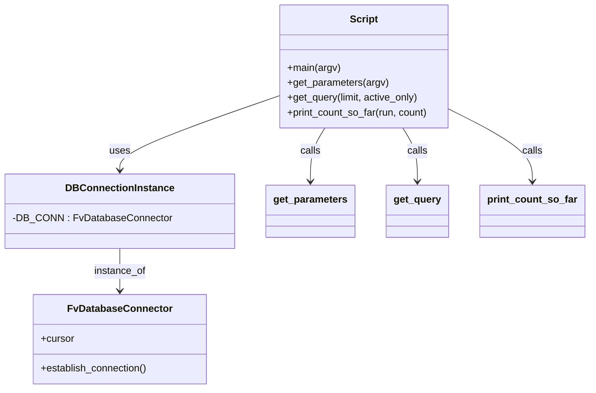

# Diagram: entity_core/entity_service/entity_service_scripts/backfill_last_status_update.py


> Auto-generated by Obscura crawlers

## Diagram 1

```mermaid
flowchart TD
    Start((Start)) --> Parse[get_parameters(argv)]
    Parse --> PrintStage[Print "Running in stage"]
    PrintStage --> DBConnect[DB_CONN.establish_connection()]
    DBConnect --> GetCursor[Acquire cursor]
    GetCursor --> SetTimeout[SET statement_timeout]
    SetTimeout --> Query[get_query(limit, active_only)]
    Query --> Loop{last_count != 0}
    Loop -->|yes| Execute[Execute UPDATE ... RETURNING query]
    Execute --> Fetch[fetchall() / rowcount]
    Fetch --> ProcessResults{test mode?}
    ProcessResults -->|true| PrintResults[print each result]
    ProcessResults -->|false| UpdateCounters[update last_count and count_so_far]
    UpdateCounters --> TimeCheck{query duration > warning_time?}
    TimeCheck -->|yes| Warn[print warning]
    TimeCheck --> Continue[maybe print counts every 2 runs]
    Continue --> Loop
    PrintResults --> PrintCount[print_count_so_far and return]
    PrintCount --> End((End))
    Loop -->|no| Finalize[print final counts]
    Finalize --> End
```

> SVG rendering failed for this diagram.

## Diagram 2



### SVG

<svg id="container" width="916.7265625" xmlns="http://www.w3.org/2000/svg" class="classDiagram" height="626" viewBox="0 0 916.7265625 626" role="graphics-document document" aria-roledescription="class"><style>#container{font-family:"trebuchet ms",verdana,arial,sans-serif;font-size:16px;fill:#333;}@keyframes edge-animation-frame{from{stroke-dashoffset:0;}}@keyframes dash{to{stroke-dashoffset:0;}}#container .edge-animation-slow{stroke-dasharray:9,5!important;stroke-dashoffset:900;animation:dash 50s linear infinite;stroke-linecap:round;}#container .edge-animation-fast{stroke-dasharray:9,5!important;stroke-dashoffset:900;animation:dash 20s linear infinite;stroke-linecap:round;}#container .error-icon{fill:#552222;}#container .error-text{fill:#552222;stroke:#552222;}#container .edge-thickness-normal{stroke-width:1px;}#container .edge-thickness-thick{stroke-width:3.5px;}#container .edge-pattern-solid{stroke-dasharray:0;}#container .edge-thickness-invisible{stroke-width:0;fill:none;}#container .edge-pattern-dashed{stroke-dasharray:3;}#container .edge-pattern-dotted{stroke-dasharray:2;}#container .marker{fill:#333333;stroke:#333333;}#container .marker.cross{stroke:#333333;}#container svg{font-family:"trebuchet ms",verdana,arial,sans-serif;font-size:16px;}#container p{margin:0;}#container g.classGroup text{fill:#9370DB;stroke:none;font-family:"trebuchet ms",verdana,arial,sans-serif;font-size:10px;}#container g.classGroup text .title{font-weight:bolder;}#container .nodeLabel,#container .edgeLabel{color:#131300;}#container .edgeLabel .label rect{fill:#ECECFF;}#container .label text{fill:#131300;}#container .labelBkg{background:#ECECFF;}#container .edgeLabel .label span{background:#ECECFF;}#container .classTitle{font-weight:bolder;}#container .node rect,#container .node circle,#container .node ellipse,#container .node polygon,#container .node path{fill:#ECECFF;stroke:#9370DB;stroke-width:1px;}#container .divider{stroke:#9370DB;stroke-width:1;}#container g.clickable{cursor:pointer;}#container g.classGroup rect{fill:#ECECFF;stroke:#9370DB;}#container g.classGroup line{stroke:#9370DB;stroke-width:1;}#container .classLabel .box{stroke:none;stroke-width:0;fill:#ECECFF;opacity:0.5;}#container .classLabel .label{fill:#9370DB;font-size:10px;}#container .relation{stroke:#333333;stroke-width:1;fill:none;}#container .dashed-line{stroke-dasharray:3;}#container .dotted-line{stroke-dasharray:1 2;}#container #compositionStart,#container .composition{fill:#333333!important;stroke:#333333!important;stroke-width:1;}#container #compositionEnd,#container .composition{fill:#333333!important;stroke:#333333!important;stroke-width:1;}#container #dependencyStart,#container .dependency{fill:#333333!important;stroke:#333333!important;stroke-width:1;}#container #dependencyStart,#container .dependency{fill:#333333!important;stroke:#333333!important;stroke-width:1;}#container #extensionStart,#container .extension{fill:transparent!important;stroke:#333333!important;stroke-width:1;}#container #extensionEnd,#container .extension{fill:transparent!important;stroke:#333333!important;stroke-width:1;}#container #aggregationStart,#container .aggregation{fill:transparent!important;stroke:#333333!important;stroke-width:1;}#container #aggregationEnd,#container .aggregation{fill:transparent!important;stroke:#333333!important;stroke-width:1;}#container #lollipopStart,#container .lollipop{fill:#ECECFF!important;stroke:#333333!important;stroke-width:1;}#container #lollipopEnd,#container .lollipop{fill:#ECECFF!important;stroke:#333333!important;stroke-width:1;}#container .edgeTerminals{font-size:11px;line-height:initial;}#container .classTitleText{text-anchor:middle;font-size:18px;fill:#333;}#container .label-icon{display:inline-block;height:1em;overflow:visible;vertical-align:-0.125em;}#container .node .label-icon path{fill:currentColor;stroke:revert;stroke-width:revert;}#container :root{--mermaid-font-family:"trebuchet ms",verdana,arial,sans-serif;}</style><g><defs><marker id="container_class-aggregationStart" class="marker aggregation class" refX="18" refY="7" markerWidth="190" markerHeight="240" orient="auto"><path d="M 18,7 L9,13 L1,7 L9,1 Z"></path></marker></defs><defs><marker id="container_class-aggregationEnd" class="marker aggregation class" refX="1" refY="7" markerWidth="20" markerHeight="28" orient="auto"><path d="M 18,7 L9,13 L1,7 L9,1 Z"></path></marker></defs><defs><marker id="container_class-extensionStart" class="marker extension class" refX="18" refY="7" markerWidth="190" markerHeight="240" orient="auto"><path d="M 1,7 L18,13 V 1 Z"></path></marker></defs><defs><marker id="container_class-extensionEnd" class="marker extension class" refX="1" refY="7" markerWidth="20" markerHeight="28" orient="auto"><path d="M 1,1 V 13 L18,7 Z"></path></marker></defs><defs><marker id="container_class-compositionStart" class="marker composition class" refX="18" refY="7" markerWidth="190" markerHeight="240" orient="auto"><path d="M 18,7 L9,13 L1,7 L9,1 Z"></path></marker></defs><defs><marker id="container_class-compositionEnd" class="marker composition class" refX="1" refY="7" markerWidth="20" markerHeight="28" orient="auto"><path d="M 18,7 L9,13 L1,7 L9,1 Z"></path></marker></defs><defs><marker id="container_class-dependencyStart" class="marker dependency class" refX="6" refY="7" markerWidth="190" markerHeight="240" orient="auto"><path d="M 5,7 L9,13 L1,7 L9,1 Z"></path></marker></defs><defs><marker id="container_class-dependencyEnd" class="marker dependency class" refX="13" refY="7" markerWidth="20" markerHeight="28" orient="auto"><path d="M 18,7 L9,13 L14,7 L9,1 Z"></path></marker></defs><defs><marker id="container_class-lollipopStart" class="marker lollipop class" refX="13" refY="7" markerWidth="190" markerHeight="240" orient="auto"><circle stroke="black" fill="transparent" cx="7" cy="7" r="6"></circle></marker></defs><defs><marker id="container_class-lollipopEnd" class="marker lollipop class" refX="1" refY="7" markerWidth="190" markerHeight="240" orient="auto"><circle stroke="black" fill="transparent" cx="7" cy="7" r="6"></circle></marker></defs><g class="root"><g class="clusters"></g><g class="edgePaths"><path d="M425.098,156.346L384.801,170.788C344.504,185.23,263.91,214.115,223.613,233.724C183.316,253.333,183.316,263.667,183.316,268.833L183.316,274" id="id_Script_DBConnectionInstance_1" class="edge-thickness-normal edge-pattern-solid relation" style=";;;" data-edge="true" data-et="edge" data-id="id_Script_DBConnectionInstance_1" data-points="W3sieCI6NDI1LjA5NzY1NjI1LCJ5IjoxNTYuMzQ1NzI3NDMyNzUzOH0seyJ4IjoxODMuMzE2NDA2MjUsInkiOjI0M30seyJ4IjoxODMuMzE2NDA2MjUsInkiOjI4MH1d" marker-end="url(#container_class-dependencyEnd)"></path><path d="M183.316,400L183.316,406.167C183.316,412.333,183.316,424.667,183.316,436C183.316,447.333,183.316,457.667,183.316,462.833L183.316,468" id="id_DBConnectionInstance_FvDatabaseConnector_2" class="edge-thickness-normal edge-pattern-solid relation" style=";;;" data-edge="true" data-et="edge" data-id="id_DBConnectionInstance_FvDatabaseConnector_2" data-points="W3sieCI6MTgzLjMxNjQwNjI1LCJ5Ijo0MDB9LHsieCI6MTgzLjMxNjQwNjI1LCJ5Ijo0Mzd9LHsieCI6MTgzLjMxNjQwNjI1LCJ5Ijo0NzR9XQ==" marker-end="url(#container_class-dependencyEnd)"></path><path d="M501.384,206L497.56,212.167C493.735,218.333,486.086,230.667,482.262,245C478.438,259.333,478.438,275.667,478.438,283.833L478.438,292" id="id_Script_get_parameters_3" class="edge-thickness-normal edge-pattern-solid relation" style=";;;" data-edge="true" data-et="edge" data-id="id_Script_get_parameters_3" data-points="W3sieCI6NTAxLjM4Mzk2MTM5NzA1ODg0LCJ5IjoyMDZ9LHsieCI6NDc4LjQzNzUsInkiOjI0M30seyJ4Ijo0NzguNDM3NSwieSI6Mjk4fV0=" marker-end="url(#container_class-dependencyEnd)"></path><path d="M624.179,206L628.003,212.167C631.827,218.333,639.476,230.667,643.301,245C647.125,259.333,647.125,275.667,647.125,283.833L647.125,292" id="id_Script_get_query_4" class="edge-thickness-normal edge-pattern-solid relation" style=";;;" data-edge="true" data-et="edge" data-id="id_Script_get_query_4" data-points="W3sieCI6NjI0LjE3ODUzODYwMjk0MTIsInkiOjIwNn0seyJ4Ijo2NDcuMTI1LCJ5IjoyNDN9LHsieCI6NjQ3LjEyNSwieSI6Mjk4fV0=" marker-end="url(#container_class-dependencyEnd)"></path><path d="M700.465,177.771L721.615,188.642C742.766,199.514,785.066,221.257,806.217,240.295C827.367,259.333,827.367,275.667,827.367,283.833L827.367,292" id="id_Script_print_count_so_far_5" class="edge-thickness-normal edge-pattern-solid relation" style=";;;" data-edge="true" data-et="edge" data-id="id_Script_print_count_so_far_5" data-points="W3sieCI6NzAwLjQ2NDg0Mzc1LCJ5IjoxNzcuNzcwODM4ODY5Njk2MTV9LHsieCI6ODI3LjM2NzE4NzUsInkiOjI0M30seyJ4Ijo4MjcuMzY3MTg3NSwieSI6Mjk4fV0=" marker-end="url(#container_class-dependencyEnd)"></path></g><g class="edgeLabels"><g class="edgeLabel" transform="translate(183.31640625, 243)"><g class="label" data-id="id_Script_DBConnectionInstance_1" transform="translate(-16.4921875, -12)"><foreignObject width="32.984375" height="24"><div xmlns="http://www.w3.org/1999/xhtml" class="labelBkg" style="display: table-cell; white-space: nowrap; line-height: 1.5; max-width: 200px; text-align: center;"><span class="edgeLabel"><p>uses</p></span></div></foreignObject></g></g><g class="edgeLabel" transform="translate(183.31640625, 437)"><g class="label" data-id="id_DBConnectionInstance_FvDatabaseConnector_2" transform="translate(-41.7734375, -12)"><foreignObject width="83.546875" height="24"><div xmlns="http://www.w3.org/1999/xhtml" class="labelBkg" style="display: table-cell; white-space: nowrap; line-height: 1.5; max-width: 200px; text-align: center;"><span class="edgeLabel"><p>instance_of</p></span></div></foreignObject></g></g><g class="edgeLabel" transform="translate(478.4375, 243)"><g class="label" data-id="id_Script_get_parameters_3" transform="translate(-16.4453125, -12)"><foreignObject width="32.890625" height="24"><div xmlns="http://www.w3.org/1999/xhtml" class="labelBkg" style="display: table-cell; white-space: nowrap; line-height: 1.5; max-width: 200px; text-align: center;"><span class="edgeLabel"><p>calls</p></span></div></foreignObject></g></g><g class="edgeLabel" transform="translate(647.125, 243)"><g class="label" data-id="id_Script_get_query_4" transform="translate(-16.4453125, -12)"><foreignObject width="32.890625" height="24"><div xmlns="http://www.w3.org/1999/xhtml" class="labelBkg" style="display: table-cell; white-space: nowrap; line-height: 1.5; max-width: 200px; text-align: center;"><span class="edgeLabel"><p>calls</p></span></div></foreignObject></g></g><g class="edgeLabel" transform="translate(827.3671875, 243)"><g class="label" data-id="id_Script_print_count_so_far_5" transform="translate(-16.4453125, -12)"><foreignObject width="32.890625" height="24"><div xmlns="http://www.w3.org/1999/xhtml" class="labelBkg" style="display: table-cell; white-space: nowrap; line-height: 1.5; max-width: 200px; text-align: center;"><span class="edgeLabel"><p>calls</p></span></div></foreignObject></g></g></g><g class="nodes"><g class="node default" id="classId-Script-0" transform="translate(562.78125, 107)"><g class="basic label-container"><path d="M-137.68359375 -99 L137.68359375 -99 L137.68359375 99 L-137.68359375 99" stroke="none" stroke-width="0" fill="#ECECFF" style=""></path><path d="M-137.68359375 -99 C-77.82718841773887 -99, -17.970783085477734 -99, 137.68359375 -99 M-137.68359375 -99 C-58.166646296208384 -99, 21.35030115758323 -99, 137.68359375 -99 M137.68359375 -99 C137.68359375 -54.99690294010478, 137.68359375 -10.993805880209564, 137.68359375 99 M137.68359375 -99 C137.68359375 -56.829345212097095, 137.68359375 -14.65869042419419, 137.68359375 99 M137.68359375 99 C57.72899610442337 99, -22.225601541153253 99, -137.68359375 99 M137.68359375 99 C71.66119501127528 99, 5.6387962725505645 99, -137.68359375 99 M-137.68359375 99 C-137.68359375 51.23749732633496, -137.68359375 3.4749946526699205, -137.68359375 -99 M-137.68359375 99 C-137.68359375 25.499909001571936, -137.68359375 -48.00018199685613, -137.68359375 -99" stroke="#9370DB" stroke-width="1.3" fill="none" stroke-dasharray="0 0" style=""></path></g><g class="annotation-group text" transform="translate(0, -75)"></g><g class="label-group text" transform="translate(-21.7421875, -75)"><g class="label" style="font-weight: bolder" transform="translate(0,-12)"><foreignObject width="43.484375" height="24"><div xmlns="http://www.w3.org/1999/xhtml" style="display: table-cell; white-space: nowrap; line-height: 1.5; max-width: 93px; text-align: center;"><span class="nodeLabel markdown-node-label" style=""><p>Script</p></span></div></foreignObject></g></g><g class="members-group text" transform="translate(-125.68359375, -27)"></g><g class="methods-group text" transform="translate(-125.68359375, 3)"><g class="label" style="" transform="translate(0,-12)"><foreignObject width="85.5" height="24"><div xmlns="http://www.w3.org/1999/xhtml" style="display: table-cell; white-space: nowrap; line-height: 1.5; max-width: 143px; text-align: center;"><span class="nodeLabel markdown-node-label" style=""><p>+main(argv)</p></span></div></foreignObject></g><g class="label" style="" transform="translate(0,12)"><foreignObject width="162.53125" height="24"><div xmlns="http://www.w3.org/1999/xhtml" style="display: table-cell; white-space: nowrap; line-height: 1.5; max-width: 220px; text-align: center;"><span class="nodeLabel markdown-node-label" style=""><p>+get_parameters(argv)</p></span></div></foreignObject></g><g class="label" style="" transform="translate(0,36)"><foreignObject width="213.875" height="24"><div xmlns="http://www.w3.org/1999/xhtml" style="display: table-cell; white-space: nowrap; line-height: 1.5; max-width: 271px; text-align: center;"><span class="nodeLabel markdown-node-label" style=""><p>+get_query(limit, active_only)</p></span></div></foreignObject></g><g class="label" style="" transform="translate(0,60)"><foreignObject width="229.625" height="24"><div xmlns="http://www.w3.org/1999/xhtml" style="display: table-cell; white-space: nowrap; line-height: 1.5; max-width: 287px; text-align: center;"><span class="nodeLabel markdown-node-label" style=""><p>+print_count_so_far(run, count)</p></span></div></foreignObject></g></g><g class="divider" style=""><path d="M-137.68359375 -51 C-42.886829695653375 -51, 51.90993435869325 -51, 137.68359375 -51 M-137.68359375 -51 C-59.51930329329086 -51, 18.64498716341828 -51, 137.68359375 -51" stroke="#9370DB" stroke-width="1.3" fill="none" stroke-dasharray="0 0" style=""></path></g><g class="divider" style=""><path d="M-137.68359375 -27 C-59.71639100724386 -27, 18.250811735512286 -27, 137.68359375 -27 M-137.68359375 -27 C-53.06878727918085 -27, 31.546019191638294 -27, 137.68359375 -27" stroke="#9370DB" stroke-width="1.3" fill="none" stroke-dasharray="0 0" style=""></path></g></g><g class="node default" id="classId-FvDatabaseConnector-1" transform="translate(183.31640625, 546)"><g class="basic label-container"><path d="M-138.28515625 -72 L138.28515625 -72 L138.28515625 72 L-138.28515625 72" stroke="none" stroke-width="0" fill="#ECECFF" style=""></path><path d="M-138.28515625 -72 C-59.98680340591059 -72, 18.311549438178815 -72, 138.28515625 -72 M-138.28515625 -72 C-57.89213394582147 -72, 22.50088835835706 -72, 138.28515625 -72 M138.28515625 -72 C138.28515625 -14.943689486875464, 138.28515625 42.11262102624907, 138.28515625 72 M138.28515625 -72 C138.28515625 -26.338537338549372, 138.28515625 19.322925322901256, 138.28515625 72 M138.28515625 72 C32.01760338604416 72, -74.24994947791168 72, -138.28515625 72 M138.28515625 72 C61.821022658629175 72, -14.64311093274165 72, -138.28515625 72 M-138.28515625 72 C-138.28515625 28.86855484310051, -138.28515625 -14.262890313798977, -138.28515625 -72 M-138.28515625 72 C-138.28515625 35.904328796234424, -138.28515625 -0.1913424075311525, -138.28515625 -72" stroke="#9370DB" stroke-width="1.3" fill="none" stroke-dasharray="0 0" style=""></path></g><g class="annotation-group text" transform="translate(0, -48)"></g><g class="label-group text" transform="translate(-79.3046875, -48)"><g class="label" style="font-weight: bolder" transform="translate(0,-12)"><foreignObject width="158.609375" height="24"><div xmlns="http://www.w3.org/1999/xhtml" style="display: table-cell; white-space: nowrap; line-height: 1.5; max-width: 207px; text-align: center;"><span class="nodeLabel markdown-node-label" style=""><p>FvDatabaseConnector</p></span></div></foreignObject></g></g><g class="members-group text" transform="translate(-126.28515625, 0)"><g class="label" style="" transform="translate(0,-12)"><foreignObject width="53.71875" height="24"><div xmlns="http://www.w3.org/1999/xhtml" style="display: table-cell; white-space: nowrap; line-height: 1.5; max-width: 112px; text-align: center;"><span class="nodeLabel markdown-node-label" style=""><p>+cursor</p></span></div></foreignObject></g></g><g class="methods-group text" transform="translate(-126.28515625, 48)"><g class="label" style="" transform="translate(0,-12)"><foreignObject width="173.265625" height="24"><div xmlns="http://www.w3.org/1999/xhtml" style="display: table-cell; white-space: nowrap; line-height: 1.5; max-width: 231px; text-align: center;"><span class="nodeLabel markdown-node-label" style=""><p>+establish_connection()</p></span></div></foreignObject></g></g><g class="divider" style=""><path d="M-138.28515625 -24 C-28.890658901402304 -24, 80.50383844719539 -24, 138.28515625 -24 M-138.28515625 -24 C-69.74425023353845 -24, -1.2033442170769035 -24, 138.28515625 -24" stroke="#9370DB" stroke-width="1.3" fill="none" stroke-dasharray="0 0" style=""></path></g><g class="divider" style=""><path d="M-138.28515625 24 C-81.52638898875598 24, -24.767621727511965 24, 138.28515625 24 M-138.28515625 24 C-42.95437687366477 24, 52.37640250267046 24, 138.28515625 24" stroke="#9370DB" stroke-width="1.3" fill="none" stroke-dasharray="0 0" style=""></path></g></g><g class="node default" id="classId-DBConnectionInstance-2" transform="translate(183.31640625, 340)"><g class="basic label-container"><path d="M-175.31640625 -60 L175.31640625 -60 L175.31640625 60 L-175.31640625 60" stroke="none" stroke-width="0" fill="#ECECFF" style=""></path><path d="M-175.31640625 -60 C-35.12322569615321 -60, 105.06995485769357 -60, 175.31640625 -60 M-175.31640625 -60 C-49.448058814721364 -60, 76.42028862055727 -60, 175.31640625 -60 M175.31640625 -60 C175.31640625 -26.968402007267322, 175.31640625 6.063195985465356, 175.31640625 60 M175.31640625 -60 C175.31640625 -34.55156521840581, 175.31640625 -9.103130436811618, 175.31640625 60 M175.31640625 60 C69.19554067102565 60, -36.92532490794869 60, -175.31640625 60 M175.31640625 60 C80.10846771063011 60, -15.099470828739783 60, -175.31640625 60 M-175.31640625 60 C-175.31640625 12.881380250219507, -175.31640625 -34.237239499560985, -175.31640625 -60 M-175.31640625 60 C-175.31640625 14.774985955652937, -175.31640625 -30.450028088694125, -175.31640625 -60" stroke="#9370DB" stroke-width="1.3" fill="none" stroke-dasharray="0 0" style=""></path></g><g class="annotation-group text" transform="translate(0, -36)"></g><g class="label-group text" transform="translate(-82.2734375, -36)"><g class="label" style="font-weight: bolder" transform="translate(0,-12)"><foreignObject width="164.546875" height="24"><div xmlns="http://www.w3.org/1999/xhtml" style="display: table-cell; white-space: nowrap; line-height: 1.5; max-width: 214px; text-align: center;"><span class="nodeLabel markdown-node-label" style=""><p>DBConnectionInstance</p></span></div></foreignObject></g></g><g class="members-group text" transform="translate(-163.31640625, 12)"><g class="label" style="" transform="translate(0,-12)"><foreignObject width="244.359375" height="24"><div xmlns="http://www.w3.org/1999/xhtml" style="display: table-cell; white-space: nowrap; line-height: 1.5; max-width: 303px; text-align: center;"><span class="nodeLabel markdown-node-label" style=""><p>-DB_CONN : FvDatabaseConnector</p></span></div></foreignObject></g></g><g class="methods-group text" transform="translate(-163.31640625, 60)"></g><g class="divider" style=""><path d="M-175.31640625 -12 C-96.00513418927326 -12, -16.693862128546527 -12, 175.31640625 -12 M-175.31640625 -12 C-72.92285362981114 -12, 29.470698990377713 -12, 175.31640625 -12" stroke="#9370DB" stroke-width="1.3" fill="none" stroke-dasharray="0 0" style=""></path></g><g class="divider" style=""><path d="M-175.31640625 36 C-97.16872991829995 36, -19.02105358659989 36, 175.31640625 36 M-175.31640625 36 C-80.38502191809505 36, 14.546362413809902 36, 175.31640625 36" stroke="#9370DB" stroke-width="1.3" fill="none" stroke-dasharray="0 0" style=""></path></g></g><g class="node default" id="classId-get_parameters-3" transform="translate(478.4375, 340)"><g class="basic label-container"><path d="M-69.8046875 -42 L69.8046875 -42 L69.8046875 42 L-69.8046875 42" stroke="none" stroke-width="0" fill="#ECECFF" style=""></path><path d="M-69.8046875 -42 C-25.911638426584688 -42, 17.981410646830625 -42, 69.8046875 -42 M-69.8046875 -42 C-26.20394720574145 -42, 17.3967930885171 -42, 69.8046875 -42 M69.8046875 -42 C69.8046875 -22.199772904817596, 69.8046875 -2.3995458096351925, 69.8046875 42 M69.8046875 -42 C69.8046875 -15.58882435354969, 69.8046875 10.82235129290062, 69.8046875 42 M69.8046875 42 C34.26721475478731 42, -1.2702579904253781 42, -69.8046875 42 M69.8046875 42 C38.05560641632377 42, 6.306525332647539 42, -69.8046875 42 M-69.8046875 42 C-69.8046875 15.218001219362758, -69.8046875 -11.563997561274483, -69.8046875 -42 M-69.8046875 42 C-69.8046875 20.380394944345774, -69.8046875 -1.2392101113084522, -69.8046875 -42" stroke="#9370DB" stroke-width="1.3" fill="none" stroke-dasharray="0 0" style=""></path></g><g class="annotation-group text" transform="translate(0, -18)"></g><g class="label-group text" transform="translate(-57.8046875, -18)"><g class="label" style="font-weight: bolder" transform="translate(0,-12)"><foreignObject width="115.609375" height="24"><div xmlns="http://www.w3.org/1999/xhtml" style="display: table-cell; white-space: nowrap; line-height: 1.5; max-width: 163px; text-align: center;"><span class="nodeLabel markdown-node-label" style=""><p>get_parameters</p></span></div></foreignObject></g></g><g class="members-group text" transform="translate(-57.8046875, 30)"></g><g class="methods-group text" transform="translate(-57.8046875, 60)"></g><g class="divider" style=""><path d="M-69.8046875 6 C-38.60508984272626 6, -7.405492185452509 6, 69.8046875 6 M-69.8046875 6 C-39.08285618783991 6, -8.361024875679824 6, 69.8046875 6" stroke="#9370DB" stroke-width="1.3" fill="none" stroke-dasharray="0 0" style=""></path></g><g class="divider" style=""><path d="M-69.8046875 24 C-31.851687617728437 24, 6.101312264543125 24, 69.8046875 24 M-69.8046875 24 C-26.288499974636565 24, 17.22768755072687 24, 69.8046875 24" stroke="#9370DB" stroke-width="1.3" fill="none" stroke-dasharray="0 0" style=""></path></g></g><g class="node default" id="classId-get_query-4" transform="translate(647.125, 340)"><g class="basic label-container"><path d="M-48.8828125 -42 L48.8828125 -42 L48.8828125 42 L-48.8828125 42" stroke="none" stroke-width="0" fill="#ECECFF" style=""></path><path d="M-48.8828125 -42 C-14.189583136576502 -42, 20.503646226846996 -42, 48.8828125 -42 M-48.8828125 -42 C-28.063485426657625 -42, -7.24415835331525 -42, 48.8828125 -42 M48.8828125 -42 C48.8828125 -12.849976440316901, 48.8828125 16.300047119366198, 48.8828125 42 M48.8828125 -42 C48.8828125 -24.64738379111997, 48.8828125 -7.294767582239942, 48.8828125 42 M48.8828125 42 C21.407773097196213 42, -6.067266305607575 42, -48.8828125 42 M48.8828125 42 C11.68470238635878 42, -25.51340772728244 42, -48.8828125 42 M-48.8828125 42 C-48.8828125 8.491491509796141, -48.8828125 -25.017016980407718, -48.8828125 -42 M-48.8828125 42 C-48.8828125 22.72792775457563, -48.8828125 3.455855509151263, -48.8828125 -42" stroke="#9370DB" stroke-width="1.3" fill="none" stroke-dasharray="0 0" style=""></path></g><g class="annotation-group text" transform="translate(0, -18)"></g><g class="label-group text" transform="translate(-36.8828125, -18)"><g class="label" style="font-weight: bolder" transform="translate(0,-12)"><foreignObject width="73.765625" height="24"><div xmlns="http://www.w3.org/1999/xhtml" style="display: table-cell; white-space: nowrap; line-height: 1.5; max-width: 122px; text-align: center;"><span class="nodeLabel markdown-node-label" style=""><p>get_query</p></span></div></foreignObject></g></g><g class="members-group text" transform="translate(-36.8828125, 30)"></g><g class="methods-group text" transform="translate(-36.8828125, 60)"></g><g class="divider" style=""><path d="M-48.8828125 6 C-20.091383286782616 6, 8.700045926434768 6, 48.8828125 6 M-48.8828125 6 C-13.224574868342216 6, 22.433662763315567 6, 48.8828125 6" stroke="#9370DB" stroke-width="1.3" fill="none" stroke-dasharray="0 0" style=""></path></g><g class="divider" style=""><path d="M-48.8828125 24 C-21.263961644292266 24, 6.354889211415468 24, 48.8828125 24 M-48.8828125 24 C-20.822195707466776 24, 7.238421085066449 24, 48.8828125 24" stroke="#9370DB" stroke-width="1.3" fill="none" stroke-dasharray="0 0" style=""></path></g></g><g class="node default" id="classId-print_count_so_far-5" transform="translate(827.3671875, 340)"><g class="basic label-container"><path d="M-81.359375 -42 L81.359375 -42 L81.359375 42 L-81.359375 42" stroke="none" stroke-width="0" fill="#ECECFF" style=""></path><path d="M-81.359375 -42 C-21.11192228115496 -42, 39.13553043769008 -42, 81.359375 -42 M-81.359375 -42 C-29.78960148284618 -42, 21.78017203430764 -42, 81.359375 -42 M81.359375 -42 C81.359375 -15.492732223453181, 81.359375 11.014535553093637, 81.359375 42 M81.359375 -42 C81.359375 -9.08875423514997, 81.359375 23.82249152970006, 81.359375 42 M81.359375 42 C41.41747898679084 42, 1.4755829735816803 42, -81.359375 42 M81.359375 42 C38.03427312559244 42, -5.290828748815116 42, -81.359375 42 M-81.359375 42 C-81.359375 10.840777461862732, -81.359375 -20.318445076274536, -81.359375 -42 M-81.359375 42 C-81.359375 13.31513359559409, -81.359375 -15.369732808811818, -81.359375 -42" stroke="#9370DB" stroke-width="1.3" fill="none" stroke-dasharray="0 0" style=""></path></g><g class="annotation-group text" transform="translate(0, -18)"></g><g class="label-group text" transform="translate(-69.359375, -18)"><g class="label" style="font-weight: bolder" transform="translate(0,-12)"><foreignObject width="138.71875" height="24"><div xmlns="http://www.w3.org/1999/xhtml" style="display: table-cell; white-space: nowrap; line-height: 1.5; max-width: 188px; text-align: center;"><span class="nodeLabel markdown-node-label" style=""><p>print_count_so_far</p></span></div></foreignObject></g></g><g class="members-group text" transform="translate(-69.359375, 30)"></g><g class="methods-group text" transform="translate(-69.359375, 60)"></g><g class="divider" style=""><path d="M-81.359375 6 C-40.64006326701323 6, 0.07924846597353508 6, 81.359375 6 M-81.359375 6 C-48.53049265619321 6, -15.701610312386421 6, 81.359375 6" stroke="#9370DB" stroke-width="1.3" fill="none" stroke-dasharray="0 0" style=""></path></g><g class="divider" style=""><path d="M-81.359375 24 C-45.15897539195449 24, -8.958575783908984 24, 81.359375 24 M-81.359375 24 C-23.642850481419146 24, 34.07367403716171 24, 81.359375 24" stroke="#9370DB" stroke-width="1.3" fill="none" stroke-dasharray="0 0" style=""></path></g></g></g></g></g></svg>
