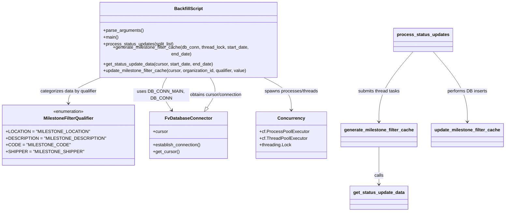
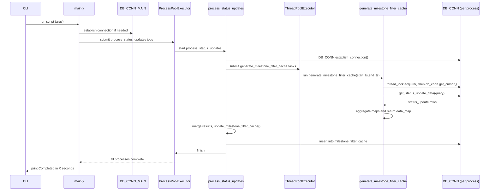

# Diagram: entity_core/entity_service/entity_service_scripts/backfill_milestone_filter_cache.py


> Auto-generated by Obscura crawlers

## Diagram 1

```mermaid
flowchart TD
    Start([Start: backfill_milestone_filter_cache.py]) --> ParseArgs[parse_arguments()]
    ParseArgs -->|has dates| UseArgs{start_date/end_date provided?}
    UseArgs -- yes --> BuildSplits[Build split_list windows (STATUS_UPDATE_QUERY_WINDOW)]
    UseArgs -- no --> DBInit[DB_CONN_MAIN.establish_connection()\nSELECT ts FROM status_update LIMIT 1]
    DBInit --> SetStartDate[set start_date from first status_update.ts]
    SetStartDate --> BuildSplits
    BuildSplits --> ProcessPool[cf.ProcessPoolExecutor (MAX_PROCESSES)\nsubmit process_status_updates(split_list)]
    ProcessPool --> ProcessTask[process_status_updates(split_list)]
    ProcessTask --> ThreadPool[cf.ThreadPoolExecutor (THREAD_MAX_WORKERS)]
    ThreadPool -->|submit| GenTask[generate_milestone_filter_cache(DB_CONN, THREAD_LOCK, start_ts, end_ts)]
    GenTask --> AcquireCursor[thread_lock.acquire()\ncursor = db_conn.get_cursor()]
    AcquireCursor --> GetStatus[get_status_update_data(cursor, start_date, end_date)]
    GetStatus --> ReleaseLock[thread_lock.release()]
    ReleaseLock --> Aggregate[aggregate: shipper_data, code_desc_data,\nstatus_code_data, location_data]
    Aggregate --> DataMap[produce data_map per MilestoneFilterQualifier]
    DataMap --> ReturnResult[return data_map to process_status_updates]
    ProcessTask --> MergeResults[merge thread results into cache_data]
    MergeResults --> DBWriteLoop[for each qualifier/org/value -> update_milestone_filter_cache(cursor, ...)]
    DBWriteLoop --> CloseDB[cursor.close(); cursor.connection.close()]
    CloseDB --> ProcessEnd([process end / logging])
    ProcessEnd --> End([Completed])
```

> SVG rendering failed for this diagram.

## Diagram 2



### SVG

<svg id="container" width="1746.935546875" xmlns="http://www.w3.org/2000/svg" class="classDiagram" height="734" viewBox="0 0 1746.935546875 734" role="graphics-document document" aria-roledescription="class"><style>#container{font-family:"trebuchet ms",verdana,arial,sans-serif;font-size:16px;fill:#333;}@keyframes edge-animation-frame{from{stroke-dashoffset:0;}}@keyframes dash{to{stroke-dashoffset:0;}}#container .edge-animation-slow{stroke-dasharray:9,5!important;stroke-dashoffset:900;animation:dash 50s linear infinite;stroke-linecap:round;}#container .edge-animation-fast{stroke-dasharray:9,5!important;stroke-dashoffset:900;animation:dash 20s linear infinite;stroke-linecap:round;}#container .error-icon{fill:#552222;}#container .error-text{fill:#552222;stroke:#552222;}#container .edge-thickness-normal{stroke-width:1px;}#container .edge-thickness-thick{stroke-width:3.5px;}#container .edge-pattern-solid{stroke-dasharray:0;}#container .edge-thickness-invisible{stroke-width:0;fill:none;}#container .edge-pattern-dashed{stroke-dasharray:3;}#container .edge-pattern-dotted{stroke-dasharray:2;}#container .marker{fill:#333333;stroke:#333333;}#container .marker.cross{stroke:#333333;}#container svg{font-family:"trebuchet ms",verdana,arial,sans-serif;font-size:16px;}#container p{margin:0;}#container g.classGroup text{fill:#9370DB;stroke:none;font-family:"trebuchet ms",verdana,arial,sans-serif;font-size:10px;}#container g.classGroup text .title{font-weight:bolder;}#container .nodeLabel,#container .edgeLabel{color:#131300;}#container .edgeLabel .label rect{fill:#ECECFF;}#container .label text{fill:#131300;}#container .labelBkg{background:#ECECFF;}#container .edgeLabel .label span{background:#ECECFF;}#container .classTitle{font-weight:bolder;}#container .node rect,#container .node circle,#container .node ellipse,#container .node polygon,#container .node path{fill:#ECECFF;stroke:#9370DB;stroke-width:1px;}#container .divider{stroke:#9370DB;stroke-width:1;}#container g.clickable{cursor:pointer;}#container g.classGroup rect{fill:#ECECFF;stroke:#9370DB;}#container g.classGroup line{stroke:#9370DB;stroke-width:1;}#container .classLabel .box{stroke:none;stroke-width:0;fill:#ECECFF;opacity:0.5;}#container .classLabel .label{fill:#9370DB;font-size:10px;}#container .relation{stroke:#333333;stroke-width:1;fill:none;}#container .dashed-line{stroke-dasharray:3;}#container .dotted-line{stroke-dasharray:1 2;}#container #compositionStart,#container .composition{fill:#333333!important;stroke:#333333!important;stroke-width:1;}#container #compositionEnd,#container .composition{fill:#333333!important;stroke:#333333!important;stroke-width:1;}#container #dependencyStart,#container .dependency{fill:#333333!important;stroke:#333333!important;stroke-width:1;}#container #dependencyStart,#container .dependency{fill:#333333!important;stroke:#333333!important;stroke-width:1;}#container #extensionStart,#container .extension{fill:transparent!important;stroke:#333333!important;stroke-width:1;}#container #extensionEnd,#container .extension{fill:transparent!important;stroke:#333333!important;stroke-width:1;}#container #aggregationStart,#container .aggregation{fill:transparent!important;stroke:#333333!important;stroke-width:1;}#container #aggregationEnd,#container .aggregation{fill:transparent!important;stroke:#333333!important;stroke-width:1;}#container #lollipopStart,#container .lollipop{fill:#ECECFF!important;stroke:#333333!important;stroke-width:1;}#container #lollipopEnd,#container .lollipop{fill:#ECECFF!important;stroke:#333333!important;stroke-width:1;}#container .edgeTerminals{font-size:11px;line-height:initial;}#container .classTitleText{text-anchor:middle;font-size:18px;fill:#333;}#container .label-icon{display:inline-block;height:1em;overflow:visible;vertical-align:-0.125em;}#container .node .label-icon path{fill:currentColor;stroke:revert;stroke-width:revert;}#container :root{--mermaid-font-family:"trebuchet ms",verdana,arial,sans-serif;}</style><g><defs><marker id="container_class-aggregationStart" class="marker aggregation class" refX="18" refY="7" markerWidth="190" markerHeight="240" orient="auto"><path d="M 18,7 L9,13 L1,7 L9,1 Z"></path></marker></defs><defs><marker id="container_class-aggregationEnd" class="marker aggregation class" refX="1" refY="7" markerWidth="20" markerHeight="28" orient="auto"><path d="M 18,7 L9,13 L1,7 L9,1 Z"></path></marker></defs><defs><marker id="container_class-extensionStart" class="marker extension class" refX="18" refY="7" markerWidth="190" markerHeight="240" orient="auto"><path d="M 1,7 L18,13 V 1 Z"></path></marker></defs><defs><marker id="container_class-extensionEnd" class="marker extension class" refX="1" refY="7" markerWidth="20" markerHeight="28" orient="auto"><path d="M 1,1 V 13 L18,7 Z"></path></marker></defs><defs><marker id="container_class-compositionStart" class="marker composition class" refX="18" refY="7" markerWidth="190" markerHeight="240" orient="auto"><path d="M 18,7 L9,13 L1,7 L9,1 Z"></path></marker></defs><defs><marker id="container_class-compositionEnd" class="marker composition class" refX="1" refY="7" markerWidth="20" markerHeight="28" orient="auto"><path d="M 18,7 L9,13 L1,7 L9,1 Z"></path></marker></defs><defs><marker id="container_class-dependencyStart" class="marker dependency class" refX="6" refY="7" markerWidth="190" markerHeight="240" orient="auto"><path d="M 5,7 L9,13 L1,7 L9,1 Z"></path></marker></defs><defs><marker id="container_class-dependencyEnd" class="marker dependency class" refX="13" refY="7" markerWidth="20" markerHeight="28" orient="auto"><path d="M 18,7 L9,13 L14,7 L9,1 Z"></path></marker></defs><defs><marker id="container_class-lollipopStart" class="marker lollipop class" refX="13" refY="7" markerWidth="190" markerHeight="240" orient="auto"><circle stroke="black" fill="transparent" cx="7" cy="7" r="6"></circle></marker></defs><defs><marker id="container_class-lollipopEnd" class="marker lollipop class" refX="1" refY="7" markerWidth="190" markerHeight="240" orient="auto"><circle stroke="black" fill="transparent" cx="7" cy="7" r="6"></circle></marker></defs><g class="root"><g class="clusters"></g><g class="edgePaths"><path d="M561.806,254L556.679,262.167C551.552,270.333,541.299,286.667,543.973,306.176C546.647,325.685,562.249,348.371,570.05,359.714L577.851,371.056" id="id_BackfillScript_FvDatabaseConnector_1" class="edge-thickness-normal edge-pattern-solid relation" style=";;;" data-edge="true" data-et="edge" data-id="id_BackfillScript_FvDatabaseConnector_1" data-points="W3sieCI6NTYxLjgwNTY4Njc3MzI1NTgsInkiOjI1NH0seyJ4Ijo1MzEuMDQ0OTIxODc1LCJ5IjozMDN9LHsieCI6NTgxLjI1MDU4NDY5MzQ3MTMsInkiOjM3Nn1d" marker-end="url(#container_class-dependencyEnd)"></path><path d="M339.803,254L319.936,262.167C300.069,270.333,260.335,286.667,240.468,302C220.602,317.333,220.602,331.667,220.602,338.833L220.602,346" id="id_BackfillScript_MilestoneFilterQualifier_2" class="edge-thickness-normal edge-pattern-solid relation" style=";;;" data-edge="true" data-et="edge" data-id="id_BackfillScript_MilestoneFilterQualifier_2" data-points="W3sieCI6MzM5LjgwMjU4Njc1NTA4NzIsInkiOjI1NH0seyJ4IjoyMjAuNjAxNTYyNSwieSI6MzAzfSx7IngiOjIyMC42MDE1NjI1LCJ5IjozNTJ9XQ==" marker-end="url(#container_class-dependencyEnd)"></path><path d="M902.902,254L920.423,262.167C937.943,270.333,972.984,286.667,990.505,306C1008.025,325.333,1008.025,347.667,1008.025,358.833L1008.025,370" id="id_BackfillScript_Concurrency_3" class="edge-thickness-normal edge-pattern-solid relation" style=";;;" data-edge="true" data-et="edge" data-id="id_BackfillScript_Concurrency_3" data-points="W3sieCI6OTAyLjkwMjE4NDc3NDcwOTMsInkiOjI1NH0seyJ4IjoxMDA4LjAyNTM5MDYyNSwieSI6MzAzfSx7IngiOjEwMDguMDI1MzkwNjI1LCJ5IjozNzZ9XQ==" marker-end="url(#container_class-dependencyEnd)"></path><path d="M1310.131,502L1310.131,519.167C1310.131,536.333,1310.131,570.667,1310.131,593C1310.131,615.333,1310.131,625.667,1310.131,630.833L1310.131,636" id="id_generate_milestone_filter_cache_get_status_update_data_4" class="edge-thickness-normal edge-pattern-solid relation" style=";;;" data-edge="true" data-et="edge" data-id="id_generate_milestone_filter_cache_get_status_update_data_4" data-points="W3sieCI6MTMxMC4xMzA4NTkzNzUsInkiOjUwMn0seyJ4IjoxMzEwLjEzMDg1OTM3NSwieSI6NjA1fSx7IngiOjEzMTAuMTMwODU5Mzc1LCJ5Ijo2NDJ9XQ==" marker-end="url(#container_class-dependencyEnd)"></path><path d="M1425.274,173L1406.084,194.667C1386.893,216.333,1348.512,259.667,1329.321,299.5C1310.131,339.333,1310.131,375.667,1310.131,393.833L1310.131,412" id="id_process_status_updates_generate_milestone_filter_cache_5" class="edge-thickness-normal edge-pattern-solid relation" style=";;;" data-edge="true" data-et="edge" data-id="id_process_status_updates_generate_milestone_filter_cache_5" data-points="W3sieCI6MTQyNS4yNzQzOTEzNTE3NDQzLCJ5IjoxNzN9LHsieCI6MTMxMC4xMzA4NTkzNzUsInkiOjMwM30seyJ4IjoxMzEwLjEzMDg1OTM3NSwieSI6NDE4fV0=" marker-end="url(#container_class-dependencyEnd)"></path><path d="M1499.675,173L1518.865,194.667C1538.056,216.333,1576.437,259.667,1595.628,299.5C1614.818,339.333,1614.818,375.667,1614.818,393.833L1614.818,412" id="id_process_status_updates_update_milestone_filter_cache_6" class="edge-thickness-normal edge-pattern-solid relation" style=";;;" data-edge="true" data-et="edge" data-id="id_process_status_updates_update_milestone_filter_cache_6" data-points="W3sieCI6MTQ5OS42NzQ4MjczOTgyNTU3LCJ5IjoxNzN9LHsieCI6MTYxNC44MTgzNTkzNzUsInkiOjMwM30seyJ4IjoxNjE0LjgxODM1OTM3NSwieSI6NDE4fV0=" marker-end="url(#container_class-dependencyEnd)"></path><path d="M706.567,361.787L713.306,351.989C720.044,342.191,733.521,322.596,735.133,304.631C736.744,286.667,726.491,270.333,721.364,262.167L716.237,254" id="id_FvDatabaseConnector_BackfillScript_7" class="edge-thickness-normal edge-pattern-solid relation" style=";;;" data-edge="true" data-et="edge" data-id="id_FvDatabaseConnector_BackfillScript_7" data-points="W3sieCI6Njk2Ljc5MjM4NDA1NjUyODcsInkiOjM3Nn0seyJ4Ijo3NDYuOTk4MDQ2ODc1LCJ5IjozMDN9LHsieCI6NzE2LjIzNzI4MTk3Njc0NDIsInkiOjI1NH1d" marker-start="url(#container_class-extensionStart)"></path></g><g class="edgeLabels"><g class="edgeLabel" transform="translate(539.75541, 315.66521)"><g class="label" data-id="id_BackfillScript_FvDatabaseConnector_1" transform="translate(-100, -24)"><foreignObject width="200" height="48"><div xmlns="http://www.w3.org/1999/xhtml" class="labelBkg" style="display: table; white-space: break-spaces; line-height: 1.5; max-width: 200px; text-align: center; width: 200px;"><span class="edgeLabel"><p>uses DB_CONN_MAIN, DB_CONN</p></span></div></foreignObject></g></g><g class="edgeLabel" transform="translate(220.6015625, 303)"><g class="label" data-id="id_BackfillScript_MilestoneFilterQualifier_2" transform="translate(-100, -24)"><foreignObject width="200" height="48"><div xmlns="http://www.w3.org/1999/xhtml" class="labelBkg" style="display: table; white-space: break-spaces; line-height: 1.5; max-width: 200px; text-align: center; width: 200px;"><span class="edgeLabel"><p>categorizes data by qualifier</p></span></div></foreignObject></g></g><g class="edgeLabel" transform="translate(1008.025390625, 303)"><g class="label" data-id="id_BackfillScript_Concurrency_3" transform="translate(-96.28125, -12)"><foreignObject width="192.5625" height="24"><div xmlns="http://www.w3.org/1999/xhtml" class="labelBkg" style="display: table-cell; white-space: nowrap; line-height: 1.5; max-width: 200px; text-align: center;"><span class="edgeLabel"><p>spawns processes/threads</p></span></div></foreignObject></g></g><g class="edgeLabel" transform="translate(1310.130859375, 605)"><g class="label" data-id="id_generate_milestone_filter_cache_get_status_update_data_4" transform="translate(-16.4453125, -12)"><foreignObject width="32.890625" height="24"><div xmlns="http://www.w3.org/1999/xhtml" class="labelBkg" style="display: table-cell; white-space: nowrap; line-height: 1.5; max-width: 200px; text-align: center;"><span class="edgeLabel"><p>calls</p></span></div></foreignObject></g></g><g class="edgeLabel" transform="translate(1310.130859375, 303)"><g class="label" data-id="id_process_status_updates_generate_milestone_filter_cache_5" transform="translate(-75.59375, -12)"><foreignObject width="151.1875" height="24"><div xmlns="http://www.w3.org/1999/xhtml" class="labelBkg" style="display: table-cell; white-space: nowrap; line-height: 1.5; max-width: 200px; text-align: center;"><span class="edgeLabel"><p>submits thread tasks</p></span></div></foreignObject></g></g><g class="edgeLabel" transform="translate(1614.818359375, 303)"><g class="label" data-id="id_process_status_updates_update_milestone_filter_cache_6" transform="translate(-72.1640625, -12)"><foreignObject width="144.328125" height="24"><div xmlns="http://www.w3.org/1999/xhtml" class="labelBkg" style="display: table-cell; white-space: nowrap; line-height: 1.5; max-width: 200px; text-align: center;"><span class="edgeLabel"><p>performs DB inserts</p></span></div></foreignObject></g></g><g class="edgeLabel" transform="translate(738.28756, 315.66521)"><g class="label" data-id="id_FvDatabaseConnector_BackfillScript_7" transform="translate(-95.953125, -12)"><foreignObject width="191.90625" height="24"><div xmlns="http://www.w3.org/1999/xhtml" class="labelBkg" style="display: table-cell; white-space: nowrap; line-height: 1.5; max-width: 200px; text-align: center;"><span class="edgeLabel"><p>obtains cursor/connection</p></span></div></foreignObject></g></g></g><g class="nodes"><g class="node default" id="classId-BackfillScript-0" transform="translate(639.021484375, 131)"><g class="basic label-container"><path d="M-319.89453125 -123 L319.89453125 -123 L319.89453125 123 L-319.89453125 123" stroke="none" stroke-width="0" fill="#ECECFF" style=""></path><path d="M-319.89453125 -123 C-147.38198699566178 -123, 25.130557258676447 -123, 319.89453125 -123 M-319.89453125 -123 C-146.14331863350372 -123, 27.60789398299255 -123, 319.89453125 -123 M319.89453125 -123 C319.89453125 -41.59653156234741, 319.89453125 39.80693687530518, 319.89453125 123 M319.89453125 -123 C319.89453125 -59.1700562316233, 319.89453125 4.659887536753402, 319.89453125 123 M319.89453125 123 C81.79250892250457 123, -156.30951340499087 123, -319.89453125 123 M319.89453125 123 C153.8742448779246 123, -12.14604149415078 123, -319.89453125 123 M-319.89453125 123 C-319.89453125 33.12427312433654, -319.89453125 -56.75145375132692, -319.89453125 -123 M-319.89453125 123 C-319.89453125 63.435618837986986, -319.89453125 3.8712376759739726, -319.89453125 -123" stroke="#9370DB" stroke-width="1.3" fill="none" stroke-dasharray="0 0" style=""></path></g><g class="annotation-group text" transform="translate(0, -99)"></g><g class="label-group text" transform="translate(-48.8515625, -99)"><g class="label" style="font-weight: bolder" transform="translate(0,-12)"><foreignObject width="97.703125" height="24"><div xmlns="http://www.w3.org/1999/xhtml" style="display: table-cell; white-space: nowrap; line-height: 1.5; max-width: 145px; text-align: center;"><span class="nodeLabel markdown-node-label" style=""><p>BackfillScript</p></span></div></foreignObject></g></g><g class="members-group text" transform="translate(-307.89453125, -51)"></g><g class="methods-group text" transform="translate(-307.89453125, -21)"><g class="label" style="" transform="translate(0,-12)"><foreignObject width="143.390625" height="24"><div xmlns="http://www.w3.org/1999/xhtml" style="display: table-cell; white-space: nowrap; line-height: 1.5; max-width: 201px; text-align: center;"><span class="nodeLabel markdown-node-label" style=""><p>+parse_arguments()</p></span></div></foreignObject></g><g class="label" style="" transform="translate(0,12)"><foreignObject width="54.65625" height="24"><div xmlns="http://www.w3.org/1999/xhtml" style="display: table-cell; white-space: nowrap; line-height: 1.5; max-width: 112px; text-align: center;"><span class="nodeLabel markdown-node-label" style=""><p>+main()</p></span></div></foreignObject></g><g class="label" style="" transform="translate(0,36)"><foreignObject width="255.1875" height="24"><div xmlns="http://www.w3.org/1999/xhtml" style="display: table-cell; white-space: nowrap; line-height: 1.5; max-width: 313px; text-align: center;"><span class="nodeLabel markdown-node-label" style=""><p>+process_status_updates(split_list)</p></span></div></foreignObject></g><g class="label" style="" transform="translate(0,60)"><foreignObject width="566.9375" height="24"><div xmlns="http://www.w3.org/1999/xhtml" style="display: table-cell; white-space: nowrap; line-height: 1.5; max-width: 624px; text-align: center;"><span class="nodeLabel markdown-node-label" style=""><p>+generate_milestone_filter_cache(db_conn, thread_lock, start_date, end_date)</p></span></div></foreignObject></g><g class="label" style="" transform="translate(0,84)"><foreignObject width="395.9375" height="24"><div xmlns="http://www.w3.org/1999/xhtml" style="display: table-cell; white-space: nowrap; line-height: 1.5; max-width: 453px; text-align: center;"><span class="nodeLabel markdown-node-label" style=""><p>+get_status_update_data(cursor, start_date, end_date)</p></span></div></foreignObject></g><g class="label" style="" transform="translate(0,108)"><foreignObject width="520.125" height="24"><div xmlns="http://www.w3.org/1999/xhtml" style="display: table-cell; white-space: nowrap; line-height: 1.5; max-width: 577px; text-align: center;"><span class="nodeLabel markdown-node-label" style=""><p>+update_milestone_filter_cache(cursor, organization_id, qualifier, value)</p></span></div></foreignObject></g></g><g class="divider" style=""><path d="M-319.89453125 -75 C-67.43449276003255 -75, 185.0255457299349 -75, 319.89453125 -75 M-319.89453125 -75 C-108.84038782094237 -75, 102.21375560811526 -75, 319.89453125 -75" stroke="#9370DB" stroke-width="1.3" fill="none" stroke-dasharray="0 0" style=""></path></g><g class="divider" style=""><path d="M-319.89453125 -51 C-160.7816092562461 -51, -1.668687262492199 -51, 319.89453125 -51 M-319.89453125 -51 C-70.6083819354862 -51, 178.6777673790276 -51, 319.89453125 -51" stroke="#9370DB" stroke-width="1.3" fill="none" stroke-dasharray="0 0" style=""></path></g></g><g class="node default" id="classId-MilestoneFilterQualifier-1" transform="translate(220.6015625, 460)"><g class="basic label-container"><path d="M-212.6015625 -108 L212.6015625 -108 L212.6015625 108 L-212.6015625 108" stroke="none" stroke-width="0" fill="#ECECFF" style=""></path><path d="M-212.6015625 -108 C-108.63141851443534 -108, -4.661274528870678 -108, 212.6015625 -108 M-212.6015625 -108 C-116.15369073544744 -108, -19.70581897089488 -108, 212.6015625 -108 M212.6015625 -108 C212.6015625 -23.12711355835353, 212.6015625 61.74577288329294, 212.6015625 108 M212.6015625 -108 C212.6015625 -35.42815002774341, 212.6015625 37.14369994451317, 212.6015625 108 M212.6015625 108 C85.78128522142899 108, -41.038992057142025 108, -212.6015625 108 M212.6015625 108 C60.79732525798667 108, -91.00691198402666 108, -212.6015625 108 M-212.6015625 108 C-212.6015625 28.755750086565882, -212.6015625 -50.488499826868235, -212.6015625 -108 M-212.6015625 108 C-212.6015625 52.40026671517095, -212.6015625 -3.1994665696580995, -212.6015625 -108" stroke="#9370DB" stroke-width="1.3" fill="none" stroke-dasharray="0 0" style=""></path></g><g class="annotation-group text" transform="translate(-55.5546875, -84)"><g class="label" style="" transform="translate(0,-12)"><foreignObject width="111.109375" height="24"><div xmlns="http://www.w3.org/1999/xhtml" style="display: table-cell; white-space: nowrap; line-height: 1.5; max-width: 161px; text-align: center;"><span class="nodeLabel markdown-node-label" style=""><p>«enumeration»</p></span></div></foreignObject></g></g><g class="label-group text" transform="translate(-86.125, -60)"><g class="label" style="font-weight: bolder" transform="translate(0,-12)"><foreignObject width="172.25" height="24"><div xmlns="http://www.w3.org/1999/xhtml" style="display: table-cell; white-space: nowrap; line-height: 1.5; max-width: 221px; text-align: center;"><span class="nodeLabel markdown-node-label" style=""><p>MilestoneFilterQualifier</p></span></div></foreignObject></g></g><g class="members-group text" transform="translate(-200.6015625, -12)"><g class="label" style="" transform="translate(0,-12)"><foreignObject width="267.015625" height="24"><div xmlns="http://www.w3.org/1999/xhtml" style="display: table-cell; white-space: nowrap; line-height: 1.5; max-width: 324px; text-align: center;"><span class="nodeLabel markdown-node-label" style=""><p>+LOCATION = "MILESTONE_LOCATION"</p></span></div></foreignObject></g><g class="label" style="" transform="translate(0,12)"><foreignObject width="315.078125" height="24"><div xmlns="http://www.w3.org/1999/xhtml" style="display: table-cell; white-space: nowrap; line-height: 1.5; max-width: 372px; text-align: center;"><span class="nodeLabel markdown-node-label" style=""><p>+DESCRIPTION = "MILESTONE_DESCRIPTION"</p></span></div></foreignObject></g><g class="label" style="" transform="translate(0,36)"><foreignObject width="202.25" height="24"><div xmlns="http://www.w3.org/1999/xhtml" style="display: table-cell; white-space: nowrap; line-height: 1.5; max-width: 260px; text-align: center;"><span class="nodeLabel markdown-node-label" style=""><p>+CODE = "MILESTONE_CODE"</p></span></div></foreignObject></g><g class="label" style="" transform="translate(0,60)"><foreignObject width="247.078125" height="24"><div xmlns="http://www.w3.org/1999/xhtml" style="display: table-cell; white-space: nowrap; line-height: 1.5; max-width: 304px; text-align: center;"><span class="nodeLabel markdown-node-label" style=""><p>+SHIPPER = "MILESTONE_SHIPPER"</p></span></div></foreignObject></g></g><g class="methods-group text" transform="translate(-200.6015625, 108)"></g><g class="divider" style=""><path d="M-212.6015625 -36 C-70.31616737385247 -36, 71.96922775229507 -36, 212.6015625 -36 M-212.6015625 -36 C-69.05795890530865 -36, 74.4856446893827 -36, 212.6015625 -36" stroke="#9370DB" stroke-width="1.3" fill="none" stroke-dasharray="0 0" style=""></path></g><g class="divider" style=""><path d="M-212.6015625 84 C-107.64827659254007 84, -2.6949906850801426 84, 212.6015625 84 M-212.6015625 84 C-110.7201168553148 84, -8.838671210629599 84, 212.6015625 84" stroke="#9370DB" stroke-width="1.3" fill="none" stroke-dasharray="0 0" style=""></path></g></g><g class="node default" id="classId-FvDatabaseConnector-2" transform="translate(639.021484375, 460)"><g class="basic label-container"><path d="M-138.28515625 -84 L138.28515625 -84 L138.28515625 84 L-138.28515625 84" stroke="none" stroke-width="0" fill="#ECECFF" style=""></path><path d="M-138.28515625 -84 C-80.28298800394519 -84, -22.280819757890384 -84, 138.28515625 -84 M-138.28515625 -84 C-36.27967488145012 -84, 65.72580648709976 -84, 138.28515625 -84 M138.28515625 -84 C138.28515625 -31.780508566001778, 138.28515625 20.438982867996444, 138.28515625 84 M138.28515625 -84 C138.28515625 -33.81626256928074, 138.28515625 16.367474861438524, 138.28515625 84 M138.28515625 84 C71.40324690083337 84, 4.521337551666733 84, -138.28515625 84 M138.28515625 84 C36.7076533056355 84, -64.869849638729 84, -138.28515625 84 M-138.28515625 84 C-138.28515625 49.36994589001813, -138.28515625 14.73989178003626, -138.28515625 -84 M-138.28515625 84 C-138.28515625 37.72763108112341, -138.28515625 -8.544737837753175, -138.28515625 -84" stroke="#9370DB" stroke-width="1.3" fill="none" stroke-dasharray="0 0" style=""></path></g><g class="annotation-group text" transform="translate(0, -60)"></g><g class="label-group text" transform="translate(-79.3046875, -60)"><g class="label" style="font-weight: bolder" transform="translate(0,-12)"><foreignObject width="158.609375" height="24"><div xmlns="http://www.w3.org/1999/xhtml" style="display: table-cell; white-space: nowrap; line-height: 1.5; max-width: 207px; text-align: center;"><span class="nodeLabel markdown-node-label" style=""><p>FvDatabaseConnector</p></span></div></foreignObject></g></g><g class="members-group text" transform="translate(-126.28515625, -12)"><g class="label" style="" transform="translate(0,-12)"><foreignObject width="53.71875" height="24"><div xmlns="http://www.w3.org/1999/xhtml" style="display: table-cell; white-space: nowrap; line-height: 1.5; max-width: 112px; text-align: center;"><span class="nodeLabel markdown-node-label" style=""><p>+cursor</p></span></div></foreignObject></g></g><g class="methods-group text" transform="translate(-126.28515625, 36)"><g class="label" style="" transform="translate(0,-12)"><foreignObject width="173.265625" height="24"><div xmlns="http://www.w3.org/1999/xhtml" style="display: table-cell; white-space: nowrap; line-height: 1.5; max-width: 231px; text-align: center;"><span class="nodeLabel markdown-node-label" style=""><p>+establish_connection()</p></span></div></foreignObject></g><g class="label" style="" transform="translate(0,12)"><foreignObject width="94.640625" height="24"><div xmlns="http://www.w3.org/1999/xhtml" style="display: table-cell; white-space: nowrap; line-height: 1.5; max-width: 152px; text-align: center;"><span class="nodeLabel markdown-node-label" style=""><p>+get_cursor()</p></span></div></foreignObject></g></g><g class="divider" style=""><path d="M-138.28515625 -36 C-35.15176919927163 -36, 67.98161785145675 -36, 138.28515625 -36 M-138.28515625 -36 C-31.390473322070292 -36, 75.50420960585942 -36, 138.28515625 -36" stroke="#9370DB" stroke-width="1.3" fill="none" stroke-dasharray="0 0" style=""></path></g><g class="divider" style=""><path d="M-138.28515625 12 C-38.594699943497815 12, 61.09575636300437 12, 138.28515625 12 M-138.28515625 12 C-72.65318091934364 12, -7.02120558868728 12, 138.28515625 12" stroke="#9370DB" stroke-width="1.3" fill="none" stroke-dasharray="0 0" style=""></path></g></g><g class="node default" id="classId-Concurrency-3" transform="translate(1008.025390625, 460)"><g class="basic label-container"><path d="M-121.53515625 -84 L121.53515625 -84 L121.53515625 84 L-121.53515625 84" stroke="none" stroke-width="0" fill="#ECECFF" style=""></path><path d="M-121.53515625 -84 C-25.594001612097372 -84, 70.34715302580526 -84, 121.53515625 -84 M-121.53515625 -84 C-42.77661134534644 -84, 35.98193355930712 -84, 121.53515625 -84 M121.53515625 -84 C121.53515625 -19.67966100516648, 121.53515625 44.64067798966704, 121.53515625 84 M121.53515625 -84 C121.53515625 -19.946693131523887, 121.53515625 44.10661373695223, 121.53515625 84 M121.53515625 84 C66.51833627925456 84, 11.50151630850911 84, -121.53515625 84 M121.53515625 84 C37.61381898352924 84, -46.307518282941516 84, -121.53515625 84 M-121.53515625 84 C-121.53515625 18.76291991132622, -121.53515625 -46.47416017734756, -121.53515625 -84 M-121.53515625 84 C-121.53515625 40.68054353084172, -121.53515625 -2.6389129383165653, -121.53515625 -84" stroke="#9370DB" stroke-width="1.3" fill="none" stroke-dasharray="0 0" style=""></path></g><g class="annotation-group text" transform="translate(0, -60)"></g><g class="label-group text" transform="translate(-45.2421875, -60)"><g class="label" style="font-weight: bolder" transform="translate(0,-12)"><foreignObject width="90.484375" height="24"><div xmlns="http://www.w3.org/1999/xhtml" style="display: table-cell; white-space: nowrap; line-height: 1.5; max-width: 140px; text-align: center;"><span class="nodeLabel markdown-node-label" style=""><p>Concurrency</p></span></div></foreignObject></g></g><g class="members-group text" transform="translate(-109.53515625, -12)"><g class="label" style="" transform="translate(0,-12)"><foreignObject width="173.828125" height="24"><div xmlns="http://www.w3.org/1999/xhtml" style="display: table-cell; white-space: nowrap; line-height: 1.5; max-width: 232px; text-align: center;"><span class="nodeLabel markdown-node-label" style=""><p>+cf.ProcessPoolExecutor</p></span></div></foreignObject></g><g class="label" style="" transform="translate(0,12)"><foreignObject width="168.203125" height="24"><div xmlns="http://www.w3.org/1999/xhtml" style="display: table-cell; white-space: nowrap; line-height: 1.5; max-width: 226px; text-align: center;"><span class="nodeLabel markdown-node-label" style=""><p>+cf.ThreadPoolExecutor</p></span></div></foreignObject></g><g class="label" style="" transform="translate(0,36)"><foreignObject width="114.390625" height="24"><div xmlns="http://www.w3.org/1999/xhtml" style="display: table-cell; white-space: nowrap; line-height: 1.5; max-width: 173px; text-align: center;"><span class="nodeLabel markdown-node-label" style=""><p>+threading.Lock</p></span></div></foreignObject></g></g><g class="methods-group text" transform="translate(-109.53515625, 84)"></g><g class="divider" style=""><path d="M-121.53515625 -36 C-36.16365921560414 -36, 49.20783781879172 -36, 121.53515625 -36 M-121.53515625 -36 C-64.86010781778482 -36, -8.185059385569645 -36, 121.53515625 -36" stroke="#9370DB" stroke-width="1.3" fill="none" stroke-dasharray="0 0" style=""></path></g><g class="divider" style=""><path d="M-121.53515625 60 C-45.705695017995694 60, 30.12376621400861 60, 121.53515625 60 M-121.53515625 60 C-67.73001685718737 60, -13.924877464374731 60, 121.53515625 60" stroke="#9370DB" stroke-width="1.3" fill="none" stroke-dasharray="0 0" style=""></path></g></g><g class="node default" id="classId-generate_milestone_filter_cache-4" transform="translate(1310.130859375, 460)"><g class="basic label-container"><path d="M-130.5703125 -42 L130.5703125 -42 L130.5703125 42 L-130.5703125 42" stroke="none" stroke-width="0" fill="#ECECFF" style=""></path><path d="M-130.5703125 -42 C-27.67989689631544 -42, 75.21051870736912 -42, 130.5703125 -42 M-130.5703125 -42 C-30.155642796255876 -42, 70.25902690748825 -42, 130.5703125 -42 M130.5703125 -42 C130.5703125 -23.0640061543622, 130.5703125 -4.128012308724401, 130.5703125 42 M130.5703125 -42 C130.5703125 -16.852113834419438, 130.5703125 8.295772331161125, 130.5703125 42 M130.5703125 42 C69.77352478325881 42, 8.9767370665176 42, -130.5703125 42 M130.5703125 42 C34.1322352133068 42, -62.3058420733864 42, -130.5703125 42 M-130.5703125 42 C-130.5703125 22.14329276054347, -130.5703125 2.2865855210869412, -130.5703125 -42 M-130.5703125 42 C-130.5703125 15.943394137864264, -130.5703125 -10.113211724271473, -130.5703125 -42" stroke="#9370DB" stroke-width="1.3" fill="none" stroke-dasharray="0 0" style=""></path></g><g class="annotation-group text" transform="translate(0, -18)"></g><g class="label-group text" transform="translate(-118.5703125, -18)"><g class="label" style="font-weight: bolder" transform="translate(0,-12)"><foreignObject width="237.140625" height="24"><div xmlns="http://www.w3.org/1999/xhtml" style="display: table-cell; white-space: nowrap; line-height: 1.5; max-width: 284px; text-align: center;"><span class="nodeLabel markdown-node-label" style=""><p>generate_milestone_filter_cache</p></span></div></foreignObject></g></g><g class="members-group text" transform="translate(-118.5703125, 30)"></g><g class="methods-group text" transform="translate(-118.5703125, 60)"></g><g class="divider" style=""><path d="M-130.5703125 6 C-40.09261364814479 6, 50.38508520371042 6, 130.5703125 6 M-130.5703125 6 C-66.46543804563025 6, -2.360563591260501 6, 130.5703125 6" stroke="#9370DB" stroke-width="1.3" fill="none" stroke-dasharray="0 0" style=""></path></g><g class="divider" style=""><path d="M-130.5703125 24 C-32.69019578121019 24, 65.18992093757961 24, 130.5703125 24 M-130.5703125 24 C-53.82266300401264 24, 22.92498649197472 24, 130.5703125 24" stroke="#9370DB" stroke-width="1.3" fill="none" stroke-dasharray="0 0" style=""></path></g></g><g class="node default" id="classId-get_status_update_data-5" transform="translate(1310.130859375, 684)"><g class="basic label-container"><path d="M-100.8046875 -42 L100.8046875 -42 L100.8046875 42 L-100.8046875 42" stroke="none" stroke-width="0" fill="#ECECFF" style=""></path><path d="M-100.8046875 -42 C-32.78219264708511 -42, 35.24030220582978 -42, 100.8046875 -42 M-100.8046875 -42 C-59.09454489709669 -42, -17.38440229419338 -42, 100.8046875 -42 M100.8046875 -42 C100.8046875 -16.498244702228064, 100.8046875 9.003510595543872, 100.8046875 42 M100.8046875 -42 C100.8046875 -21.92195431253195, 100.8046875 -1.8439086250638965, 100.8046875 42 M100.8046875 42 C35.618435059899696 42, -29.56781738020061 42, -100.8046875 42 M100.8046875 42 C38.25040855950376 42, -24.30387038099248 42, -100.8046875 42 M-100.8046875 42 C-100.8046875 10.265204072093404, -100.8046875 -21.469591855813192, -100.8046875 -42 M-100.8046875 42 C-100.8046875 16.42139795604552, -100.8046875 -9.157204087908958, -100.8046875 -42" stroke="#9370DB" stroke-width="1.3" fill="none" stroke-dasharray="0 0" style=""></path></g><g class="annotation-group text" transform="translate(0, -18)"></g><g class="label-group text" transform="translate(-88.8046875, -18)"><g class="label" style="font-weight: bolder" transform="translate(0,-12)"><foreignObject width="177.609375" height="24"><div xmlns="http://www.w3.org/1999/xhtml" style="display: table-cell; white-space: nowrap; line-height: 1.5; max-width: 225px; text-align: center;"><span class="nodeLabel markdown-node-label" style=""><p>get_status_update_data</p></span></div></foreignObject></g></g><g class="members-group text" transform="translate(-88.8046875, 30)"></g><g class="methods-group text" transform="translate(-88.8046875, 60)"></g><g class="divider" style=""><path d="M-100.8046875 6 C-44.87024500421638 6, 11.064197491567242 6, 100.8046875 6 M-100.8046875 6 C-56.3417477981461 6, -11.878808096292204 6, 100.8046875 6" stroke="#9370DB" stroke-width="1.3" fill="none" stroke-dasharray="0 0" style=""></path></g><g class="divider" style=""><path d="M-100.8046875 24 C-58.239085078377684 24, -15.673482656755368 24, 100.8046875 24 M-100.8046875 24 C-26.01081962317535 24, 48.7830482536493 24, 100.8046875 24" stroke="#9370DB" stroke-width="1.3" fill="none" stroke-dasharray="0 0" style=""></path></g></g><g class="node default" id="classId-process_status_updates-6" transform="translate(1462.474609375, 131)"><g class="basic label-container"><path d="M-100.546875 -42 L100.546875 -42 L100.546875 42 L-100.546875 42" stroke="none" stroke-width="0" fill="#ECECFF" style=""></path><path d="M-100.546875 -42 C-23.769789476695024 -42, 53.00729604660995 -42, 100.546875 -42 M-100.546875 -42 C-28.67975623663851 -42, 43.18736252672298 -42, 100.546875 -42 M100.546875 -42 C100.546875 -15.667753126311094, 100.546875 10.664493747377811, 100.546875 42 M100.546875 -42 C100.546875 -15.79803312820621, 100.546875 10.40393374358758, 100.546875 42 M100.546875 42 C46.94965807001288 42, -6.6475588599742395 42, -100.546875 42 M100.546875 42 C41.65086768969958 42, -17.24513962060084 42, -100.546875 42 M-100.546875 42 C-100.546875 21.60194783874479, -100.546875 1.2038956774895766, -100.546875 -42 M-100.546875 42 C-100.546875 11.959174473634633, -100.546875 -18.081651052730734, -100.546875 -42" stroke="#9370DB" stroke-width="1.3" fill="none" stroke-dasharray="0 0" style=""></path></g><g class="annotation-group text" transform="translate(0, -18)"></g><g class="label-group text" transform="translate(-88.546875, -18)"><g class="label" style="font-weight: bolder" transform="translate(0,-12)"><foreignObject width="177.09375" height="24"><div xmlns="http://www.w3.org/1999/xhtml" style="display: table-cell; white-space: nowrap; line-height: 1.5; max-width: 224px; text-align: center;"><span class="nodeLabel markdown-node-label" style=""><p>process_status_updates</p></span></div></foreignObject></g></g><g class="members-group text" transform="translate(-88.546875, 30)"></g><g class="methods-group text" transform="translate(-88.546875, 60)"></g><g class="divider" style=""><path d="M-100.546875 6 C-50.02827432354152 6, 0.49032635291696636 6, 100.546875 6 M-100.546875 6 C-21.171673114349474 6, 58.20352877130105 6, 100.546875 6" stroke="#9370DB" stroke-width="1.3" fill="none" stroke-dasharray="0 0" style=""></path></g><g class="divider" style=""><path d="M-100.546875 24 C-59.89807891266901 24, -19.249282825338014 24, 100.546875 24 M-100.546875 24 C-59.91686516157943 24, -19.28685532315886 24, 100.546875 24" stroke="#9370DB" stroke-width="1.3" fill="none" stroke-dasharray="0 0" style=""></path></g></g><g class="node default" id="classId-update_milestone_filter_cache-7" transform="translate(1614.818359375, 460)"><g class="basic label-container"><path d="M-124.1171875 -42 L124.1171875 -42 L124.1171875 42 L-124.1171875 42" stroke="none" stroke-width="0" fill="#ECECFF" style=""></path><path d="M-124.1171875 -42 C-35.057517693218756 -42, 54.00215211356249 -42, 124.1171875 -42 M-124.1171875 -42 C-49.36557624654965 -42, 25.3860350069007 -42, 124.1171875 -42 M124.1171875 -42 C124.1171875 -16.81410600441957, 124.1171875 8.371787991160858, 124.1171875 42 M124.1171875 -42 C124.1171875 -9.399468068768734, 124.1171875 23.201063862462533, 124.1171875 42 M124.1171875 42 C45.35229552696234 42, -33.41259644607533 42, -124.1171875 42 M124.1171875 42 C70.06438959655839 42, 16.011591693116756 42, -124.1171875 42 M-124.1171875 42 C-124.1171875 24.911636152701377, -124.1171875 7.823272305402753, -124.1171875 -42 M-124.1171875 42 C-124.1171875 13.33688230590429, -124.1171875 -15.32623538819142, -124.1171875 -42" stroke="#9370DB" stroke-width="1.3" fill="none" stroke-dasharray="0 0" style=""></path></g><g class="annotation-group text" transform="translate(0, -18)"></g><g class="label-group text" transform="translate(-112.1171875, -18)"><g class="label" style="font-weight: bolder" transform="translate(0,-12)"><foreignObject width="224.234375" height="24"><div xmlns="http://www.w3.org/1999/xhtml" style="display: table-cell; white-space: nowrap; line-height: 1.5; max-width: 272px; text-align: center;"><span class="nodeLabel markdown-node-label" style=""><p>update_milestone_filter_cache</p></span></div></foreignObject></g></g><g class="members-group text" transform="translate(-112.1171875, 30)"></g><g class="methods-group text" transform="translate(-112.1171875, 60)"></g><g class="divider" style=""><path d="M-124.1171875 6 C-64.85330056599088 6, -5.589413631981756 6, 124.1171875 6 M-124.1171875 6 C-66.48976801188974 6, -8.86234852377946 6, 124.1171875 6" stroke="#9370DB" stroke-width="1.3" fill="none" stroke-dasharray="0 0" style=""></path></g><g class="divider" style=""><path d="M-124.1171875 24 C-49.006551432140895 24, 26.10408463571821 24, 124.1171875 24 M-124.1171875 24 C-58.87391082636594 24, 6.369365847268114 24, 124.1171875 24" stroke="#9370DB" stroke-width="1.3" fill="none" stroke-dasharray="0 0" style=""></path></g></g></g></g></g></svg>

## Diagram 3



### SVG

<svg id="container" width="2606.5" xmlns="http://www.w3.org/2000/svg" height="999" viewBox="-50 -10 2606.5 999" role="graphics-document document" aria-roledescription="sequence"><g><rect x="2318.5" y="913" fill="#eaeaea" stroke="#666" width="188" height="65" name="DB" rx="3" ry="3" class="actor actor-bottom"></rect><text x="2412.5" y="945.5" dominant-baseline="central" alignment-baseline="central" class="actor actor-box" style="text-anchor: middle; font-size: 16px; font-weight: 400;"><tspan x="2412.5" dy="0">DB_CONN (per process)</tspan></text></g><g><rect x="1867.5" y="913" fill="#eaeaea" stroke="#666" width="254" height="65" name="Gen" rx="3" ry="3" class="actor actor-bottom"></rect><text x="1994.5" y="945.5" dominant-baseline="central" alignment-baseline="central" class="actor actor-box" style="text-anchor: middle; font-size: 16px; font-weight: 400;"><tspan x="1994.5" dy="0">generate_milestone_filter_cache</tspan></text></g><g><rect x="1460.5" y="913" fill="#eaeaea" stroke="#666" width="166" height="65" name="ThreadPool" rx="3" ry="3" class="actor actor-bottom"></rect><text x="1543.5" y="945.5" dominant-baseline="central" alignment-baseline="central" class="actor actor-box" style="text-anchor: middle; font-size: 16px; font-weight: 400;"><tspan x="1543.5" dy="0">ThreadPoolExecutor</tspan></text></g><g><rect x="1046.5" y="913" fill="#eaeaea" stroke="#666" width="194" height="65" name="Proc" rx="3" ry="3" class="actor actor-bottom"></rect><text x="1143.5" y="945.5" dominant-baseline="central" alignment-baseline="central" class="actor actor-box" style="text-anchor: middle; font-size: 16px; font-weight: 400;"><tspan x="1143.5" dy="0">process_status_updates</tspan></text></g><g><rect x="776" y="913" fill="#eaeaea" stroke="#666" width="171" height="65" name="ProcPool" rx="3" ry="3" class="actor actor-bottom"></rect><text x="861.5" y="945.5" dominant-baseline="central" alignment-baseline="central" class="actor actor-box" style="text-anchor: middle; font-size: 16px; font-weight: 400;"><tspan x="861.5" dy="0">ProcessPoolExecutor</tspan></text></g><g><rect x="576" y="913" fill="#eaeaea" stroke="#666" width="150" height="65" name="DBMain" rx="3" ry="3" class="actor actor-bottom"></rect><text x="651" y="945.5" dominant-baseline="central" alignment-baseline="central" class="actor actor-box" style="text-anchor: middle; font-size: 16px; font-weight: 400;"><tspan x="651" dy="0">DB_CONN_MAIN</tspan></text></g><g><rect x="282" y="913" fill="#eaeaea" stroke="#666" width="150" height="65" name="Main" rx="3" ry="3" class="actor actor-bottom"></rect><text x="357" y="945.5" dominant-baseline="central" alignment-baseline="central" class="actor actor-box" style="text-anchor: middle; font-size: 16px; font-weight: 400;"><tspan x="357" dy="0">main()</tspan></text></g><g><rect x="0" y="913" fill="#eaeaea" stroke="#666" width="150" height="65" name="User" rx="3" ry="3" class="actor actor-bottom"></rect><text x="75" y="945.5" dominant-baseline="central" alignment-baseline="central" class="actor actor-box" style="text-anchor: middle; font-size: 16px; font-weight: 400;"><tspan x="75" dy="0">CLI</tspan></text></g><g><line id="actor7" x1="2412.5" y1="65" x2="2412.5" y2="913" class="actor-line 200" stroke-width="0.5px" stroke="#999" name="DB"></line><g id="root-7"><rect x="2318.5" y="0" fill="#eaeaea" stroke="#666" width="188" height="65" name="DB" rx="3" ry="3" class="actor actor-top"></rect><text x="2412.5" y="32.5" dominant-baseline="central" alignment-baseline="central" class="actor actor-box" style="text-anchor: middle; font-size: 16px; font-weight: 400;"><tspan x="2412.5" dy="0">DB_CONN (per process)</tspan></text></g></g><g><line id="actor6" x1="1994.5" y1="65" x2="1994.5" y2="913" class="actor-line 200" stroke-width="0.5px" stroke="#999" name="Gen"></line><g id="root-6"><rect x="1867.5" y="0" fill="#eaeaea" stroke="#666" width="254" height="65" name="Gen" rx="3" ry="3" class="actor actor-top"></rect><text x="1994.5" y="32.5" dominant-baseline="central" alignment-baseline="central" class="actor actor-box" style="text-anchor: middle; font-size: 16px; font-weight: 400;"><tspan x="1994.5" dy="0">generate_milestone_filter_cache</tspan></text></g></g><g><line id="actor5" x1="1543.5" y1="65" x2="1543.5" y2="913" class="actor-line 200" stroke-width="0.5px" stroke="#999" name="ThreadPool"></line><g id="root-5"><rect x="1460.5" y="0" fill="#eaeaea" stroke="#666" width="166" height="65" name="ThreadPool" rx="3" ry="3" class="actor actor-top"></rect><text x="1543.5" y="32.5" dominant-baseline="central" alignment-baseline="central" class="actor actor-box" style="text-anchor: middle; font-size: 16px; font-weight: 400;"><tspan x="1543.5" dy="0">ThreadPoolExecutor</tspan></text></g></g><g><line id="actor4" x1="1143.5" y1="65" x2="1143.5" y2="913" class="actor-line 200" stroke-width="0.5px" stroke="#999" name="Proc"></line><g id="root-4"><rect x="1046.5" y="0" fill="#eaeaea" stroke="#666" width="194" height="65" name="Proc" rx="3" ry="3" class="actor actor-top"></rect><text x="1143.5" y="32.5" dominant-baseline="central" alignment-baseline="central" class="actor actor-box" style="text-anchor: middle; font-size: 16px; font-weight: 400;"><tspan x="1143.5" dy="0">process_status_updates</tspan></text></g></g><g><line id="actor3" x1="861.5" y1="65" x2="861.5" y2="913" class="actor-line 200" stroke-width="0.5px" stroke="#999" name="ProcPool"></line><g id="root-3"><rect x="776" y="0" fill="#eaeaea" stroke="#666" width="171" height="65" name="ProcPool" rx="3" ry="3" class="actor actor-top"></rect><text x="861.5" y="32.5" dominant-baseline="central" alignment-baseline="central" class="actor actor-box" style="text-anchor: middle; font-size: 16px; font-weight: 400;"><tspan x="861.5" dy="0">ProcessPoolExecutor</tspan></text></g></g><g><line id="actor2" x1="651" y1="65" x2="651" y2="913" class="actor-line 200" stroke-width="0.5px" stroke="#999" name="DBMain"></line><g id="root-2"><rect x="576" y="0" fill="#eaeaea" stroke="#666" width="150" height="65" name="DBMain" rx="3" ry="3" class="actor actor-top"></rect><text x="651" y="32.5" dominant-baseline="central" alignment-baseline="central" class="actor actor-box" style="text-anchor: middle; font-size: 16px; font-weight: 400;"><tspan x="651" dy="0">DB_CONN_MAIN</tspan></text></g></g><g><line id="actor1" x1="357" y1="65" x2="357" y2="913" class="actor-line 200" stroke-width="0.5px" stroke="#999" name="Main"></line><g id="root-1"><rect x="282" y="0" fill="#eaeaea" stroke="#666" width="150" height="65" name="Main" rx="3" ry="3" class="actor actor-top"></rect><text x="357" y="32.5" dominant-baseline="central" alignment-baseline="central" class="actor actor-box" style="text-anchor: middle; font-size: 16px; font-weight: 400;"><tspan x="357" dy="0">main()</tspan></text></g></g><g><line id="actor0" x1="75" y1="65" x2="75" y2="913" class="actor-line 200" stroke-width="0.5px" stroke="#999" name="User"></line><g id="root-0"><rect x="0" y="0" fill="#eaeaea" stroke="#666" width="150" height="65" name="User" rx="3" ry="3" class="actor actor-top"></rect><text x="75" y="32.5" dominant-baseline="central" alignment-baseline="central" class="actor actor-box" style="text-anchor: middle; font-size: 16px; font-weight: 400;"><tspan x="75" dy="0">CLI</tspan></text></g></g><style>#container{font-family:"trebuchet ms",verdana,arial,sans-serif;font-size:16px;fill:#333;}@keyframes edge-animation-frame{from{stroke-dashoffset:0;}}@keyframes dash{to{stroke-dashoffset:0;}}#container .edge-animation-slow{stroke-dasharray:9,5!important;stroke-dashoffset:900;animation:dash 50s linear infinite;stroke-linecap:round;}#container .edge-animation-fast{stroke-dasharray:9,5!important;stroke-dashoffset:900;animation:dash 20s linear infinite;stroke-linecap:round;}#container .error-icon{fill:#552222;}#container .error-text{fill:#552222;stroke:#552222;}#container .edge-thickness-normal{stroke-width:1px;}#container .edge-thickness-thick{stroke-width:3.5px;}#container .edge-pattern-solid{stroke-dasharray:0;}#container .edge-thickness-invisible{stroke-width:0;fill:none;}#container .edge-pattern-dashed{stroke-dasharray:3;}#container .edge-pattern-dotted{stroke-dasharray:2;}#container .marker{fill:#333333;stroke:#333333;}#container .marker.cross{stroke:#333333;}#container svg{font-family:"trebuchet ms",verdana,arial,sans-serif;font-size:16px;}#container p{margin:0;}#container .actor{stroke:hsl(259.6261682243, 59.7765363128%, 87.9019607843%);fill:#ECECFF;}#container text.actor&gt;tspan{fill:black;stroke:none;}#container .actor-line{stroke:hsl(259.6261682243, 59.7765363128%, 87.9019607843%);}#container .innerArc{stroke-width:1.5;stroke-dasharray:none;}#container .messageLine0{stroke-width:1.5;stroke-dasharray:none;stroke:#333;}#container .messageLine1{stroke-width:1.5;stroke-dasharray:2,2;stroke:#333;}#container #arrowhead path{fill:#333;stroke:#333;}#container .sequenceNumber{fill:white;}#container #sequencenumber{fill:#333;}#container #crosshead path{fill:#333;stroke:#333;}#container .messageText{fill:#333;stroke:none;}#container .labelBox{stroke:hsl(259.6261682243, 59.7765363128%, 87.9019607843%);fill:#ECECFF;}#container .labelText,#container .labelText&gt;tspan{fill:black;stroke:none;}#container .loopText,#container .loopText&gt;tspan{fill:black;stroke:none;}#container .loopLine{stroke-width:2px;stroke-dasharray:2,2;stroke:hsl(259.6261682243, 59.7765363128%, 87.9019607843%);fill:hsl(259.6261682243, 59.7765363128%, 87.9019607843%);}#container .note{stroke:#aaaa33;fill:#fff5ad;}#container .noteText,#container .noteText&gt;tspan{fill:black;stroke:none;}#container .activation0{fill:#f4f4f4;stroke:#666;}#container .activation1{fill:#f4f4f4;stroke:#666;}#container .activation2{fill:#f4f4f4;stroke:#666;}#container .actorPopupMenu{position:absolute;}#container .actorPopupMenuPanel{position:absolute;fill:#ECECFF;box-shadow:0px 8px 16px 0px rgba(0,0,0,0.2);filter:drop-shadow(3px 5px 2px rgb(0 0 0 / 0.4));}#container .actor-man line{stroke:hsl(259.6261682243, 59.7765363128%, 87.9019607843%);fill:#ECECFF;}#container .actor-man circle,#container line{stroke:hsl(259.6261682243, 59.7765363128%, 87.9019607843%);fill:#ECECFF;stroke-width:2px;}#container :root{--mermaid-font-family:"trebuchet ms",verdana,arial,sans-serif;}</style><g></g><defs><symbol id="computer" width="24" height="24"><path transform="scale(.5)" d="M2 2v13h20v-13h-20zm18 11h-16v-9h16v9zm-10.228 6l.466-1h3.524l.467 1h-4.457zm14.228 3h-24l2-6h2.104l-1.33 4h18.45l-1.297-4h2.073l2 6zm-5-10h-14v-7h14v7z"></path></symbol></defs><defs><symbol id="database" fill-rule="evenodd" clip-rule="evenodd"><path transform="scale(.5)" d="M12.258.001l.256.004.255.005.253.008.251.01.249.012.247.015.246.016.242.019.241.02.239.023.236.024.233.027.231.028.229.031.225.032.223.034.22.036.217.038.214.04.211.041.208.043.205.045.201.046.198.048.194.05.191.051.187.053.183.054.18.056.175.057.172.059.168.06.163.061.16.063.155.064.15.066.074.033.073.033.071.034.07.034.069.035.068.035.067.035.066.035.064.036.064.036.062.036.06.036.06.037.058.037.058.037.055.038.055.038.053.038.052.038.051.039.05.039.048.039.047.039.045.04.044.04.043.04.041.04.04.041.039.041.037.041.036.041.034.041.033.042.032.042.03.042.029.042.027.042.026.043.024.043.023.043.021.043.02.043.018.044.017.043.015.044.013.044.012.044.011.045.009.044.007.045.006.045.004.045.002.045.001.045v17l-.001.045-.002.045-.004.045-.006.045-.007.045-.009.044-.011.045-.012.044-.013.044-.015.044-.017.043-.018.044-.02.043-.021.043-.023.043-.024.043-.026.043-.027.042-.029.042-.03.042-.032.042-.033.042-.034.041-.036.041-.037.041-.039.041-.04.041-.041.04-.043.04-.044.04-.045.04-.047.039-.048.039-.05.039-.051.039-.052.038-.053.038-.055.038-.055.038-.058.037-.058.037-.06.037-.06.036-.062.036-.064.036-.064.036-.066.035-.067.035-.068.035-.069.035-.07.034-.071.034-.073.033-.074.033-.15.066-.155.064-.16.063-.163.061-.168.06-.172.059-.175.057-.18.056-.183.054-.187.053-.191.051-.194.05-.198.048-.201.046-.205.045-.208.043-.211.041-.214.04-.217.038-.22.036-.223.034-.225.032-.229.031-.231.028-.233.027-.236.024-.239.023-.241.02-.242.019-.246.016-.247.015-.249.012-.251.01-.253.008-.255.005-.256.004-.258.001-.258-.001-.256-.004-.255-.005-.253-.008-.251-.01-.249-.012-.247-.015-.245-.016-.243-.019-.241-.02-.238-.023-.236-.024-.234-.027-.231-.028-.228-.031-.226-.032-.223-.034-.22-.036-.217-.038-.214-.04-.211-.041-.208-.043-.204-.045-.201-.046-.198-.048-.195-.05-.19-.051-.187-.053-.184-.054-.179-.056-.176-.057-.172-.059-.167-.06-.164-.061-.159-.063-.155-.064-.151-.066-.074-.033-.072-.033-.072-.034-.07-.034-.069-.035-.068-.035-.067-.035-.066-.035-.064-.036-.063-.036-.062-.036-.061-.036-.06-.037-.058-.037-.057-.037-.056-.038-.055-.038-.053-.038-.052-.038-.051-.039-.049-.039-.049-.039-.046-.039-.046-.04-.044-.04-.043-.04-.041-.04-.04-.041-.039-.041-.037-.041-.036-.041-.034-.041-.033-.042-.032-.042-.03-.042-.029-.042-.027-.042-.026-.043-.024-.043-.023-.043-.021-.043-.02-.043-.018-.044-.017-.043-.015-.044-.013-.044-.012-.044-.011-.045-.009-.044-.007-.045-.006-.045-.004-.045-.002-.045-.001-.045v-17l.001-.045.002-.045.004-.045.006-.045.007-.045.009-.044.011-.045.012-.044.013-.044.015-.044.017-.043.018-.044.02-.043.021-.043.023-.043.024-.043.026-.043.027-.042.029-.042.03-.042.032-.042.033-.042.034-.041.036-.041.037-.041.039-.041.04-.041.041-.04.043-.04.044-.04.046-.04.046-.039.049-.039.049-.039.051-.039.052-.038.053-.038.055-.038.056-.038.057-.037.058-.037.06-.037.061-.036.062-.036.063-.036.064-.036.066-.035.067-.035.068-.035.069-.035.07-.034.072-.034.072-.033.074-.033.151-.066.155-.064.159-.063.164-.061.167-.06.172-.059.176-.057.179-.056.184-.054.187-.053.19-.051.195-.05.198-.048.201-.046.204-.045.208-.043.211-.041.214-.04.217-.038.22-.036.223-.034.226-.032.228-.031.231-.028.234-.027.236-.024.238-.023.241-.02.243-.019.245-.016.247-.015.249-.012.251-.01.253-.008.255-.005.256-.004.258-.001.258.001zm-9.258 20.499v.01l.001.021.003.021.004.022.005.021.006.022.007.022.009.023.01.022.011.023.012.023.013.023.015.023.016.024.017.023.018.024.019.024.021.024.022.025.023.024.024.025.052.049.056.05.061.051.066.051.07.051.075.051.079.052.084.052.088.052.092.052.097.052.102.051.105.052.11.052.114.051.119.051.123.051.127.05.131.05.135.05.139.048.144.049.147.047.152.047.155.047.16.045.163.045.167.043.171.043.176.041.178.041.183.039.187.039.19.037.194.035.197.035.202.033.204.031.209.03.212.029.216.027.219.025.222.024.226.021.23.02.233.018.236.016.24.015.243.012.246.01.249.008.253.005.256.004.259.001.26-.001.257-.004.254-.005.25-.008.247-.011.244-.012.241-.014.237-.016.233-.018.231-.021.226-.021.224-.024.22-.026.216-.027.212-.028.21-.031.205-.031.202-.034.198-.034.194-.036.191-.037.187-.039.183-.04.179-.04.175-.042.172-.043.168-.044.163-.045.16-.046.155-.046.152-.047.148-.048.143-.049.139-.049.136-.05.131-.05.126-.05.123-.051.118-.052.114-.051.11-.052.106-.052.101-.052.096-.052.092-.052.088-.053.083-.051.079-.052.074-.052.07-.051.065-.051.06-.051.056-.05.051-.05.023-.024.023-.025.021-.024.02-.024.019-.024.018-.024.017-.024.015-.023.014-.024.013-.023.012-.023.01-.023.01-.022.008-.022.006-.022.006-.022.004-.022.004-.021.001-.021.001-.021v-4.127l-.077.055-.08.053-.083.054-.085.053-.087.052-.09.052-.093.051-.095.05-.097.05-.1.049-.102.049-.105.048-.106.047-.109.047-.111.046-.114.045-.115.045-.118.044-.12.043-.122.042-.124.042-.126.041-.128.04-.13.04-.132.038-.134.038-.135.037-.138.037-.139.035-.142.035-.143.034-.144.033-.147.032-.148.031-.15.03-.151.03-.153.029-.154.027-.156.027-.158.026-.159.025-.161.024-.162.023-.163.022-.165.021-.166.02-.167.019-.169.018-.169.017-.171.016-.173.015-.173.014-.175.013-.175.012-.177.011-.178.01-.179.008-.179.008-.181.006-.182.005-.182.004-.184.003-.184.002h-.37l-.184-.002-.184-.003-.182-.004-.182-.005-.181-.006-.179-.008-.179-.008-.178-.01-.176-.011-.176-.012-.175-.013-.173-.014-.172-.015-.171-.016-.17-.017-.169-.018-.167-.019-.166-.02-.165-.021-.163-.022-.162-.023-.161-.024-.159-.025-.157-.026-.156-.027-.155-.027-.153-.029-.151-.03-.15-.03-.148-.031-.146-.032-.145-.033-.143-.034-.141-.035-.14-.035-.137-.037-.136-.037-.134-.038-.132-.038-.13-.04-.128-.04-.126-.041-.124-.042-.122-.042-.12-.044-.117-.043-.116-.045-.113-.045-.112-.046-.109-.047-.106-.047-.105-.048-.102-.049-.1-.049-.097-.05-.095-.05-.093-.052-.09-.051-.087-.052-.085-.053-.083-.054-.08-.054-.077-.054v4.127zm0-5.654v.011l.001.021.003.021.004.021.005.022.006.022.007.022.009.022.01.022.011.023.012.023.013.023.015.024.016.023.017.024.018.024.019.024.021.024.022.024.023.025.024.024.052.05.056.05.061.05.066.051.07.051.075.052.079.051.084.052.088.052.092.052.097.052.102.052.105.052.11.051.114.051.119.052.123.05.127.051.131.05.135.049.139.049.144.048.147.048.152.047.155.046.16.045.163.045.167.044.171.042.176.042.178.04.183.04.187.038.19.037.194.036.197.034.202.033.204.032.209.03.212.028.216.027.219.025.222.024.226.022.23.02.233.018.236.016.24.014.243.012.246.01.249.008.253.006.256.003.259.001.26-.001.257-.003.254-.006.25-.008.247-.01.244-.012.241-.015.237-.016.233-.018.231-.02.226-.022.224-.024.22-.025.216-.027.212-.029.21-.03.205-.032.202-.033.198-.035.194-.036.191-.037.187-.039.183-.039.179-.041.175-.042.172-.043.168-.044.163-.045.16-.045.155-.047.152-.047.148-.048.143-.048.139-.05.136-.049.131-.05.126-.051.123-.051.118-.051.114-.052.11-.052.106-.052.101-.052.096-.052.092-.052.088-.052.083-.052.079-.052.074-.051.07-.052.065-.051.06-.05.056-.051.051-.049.023-.025.023-.024.021-.025.02-.024.019-.024.018-.024.017-.024.015-.023.014-.023.013-.024.012-.022.01-.023.01-.023.008-.022.006-.022.006-.022.004-.021.004-.022.001-.021.001-.021v-4.139l-.077.054-.08.054-.083.054-.085.052-.087.053-.09.051-.093.051-.095.051-.097.05-.1.049-.102.049-.105.048-.106.047-.109.047-.111.046-.114.045-.115.044-.118.044-.12.044-.122.042-.124.042-.126.041-.128.04-.13.039-.132.039-.134.038-.135.037-.138.036-.139.036-.142.035-.143.033-.144.033-.147.033-.148.031-.15.03-.151.03-.153.028-.154.028-.156.027-.158.026-.159.025-.161.024-.162.023-.163.022-.165.021-.166.02-.167.019-.169.018-.169.017-.171.016-.173.015-.173.014-.175.013-.175.012-.177.011-.178.009-.179.009-.179.007-.181.007-.182.005-.182.004-.184.003-.184.002h-.37l-.184-.002-.184-.003-.182-.004-.182-.005-.181-.007-.179-.007-.179-.009-.178-.009-.176-.011-.176-.012-.175-.013-.173-.014-.172-.015-.171-.016-.17-.017-.169-.018-.167-.019-.166-.02-.165-.021-.163-.022-.162-.023-.161-.024-.159-.025-.157-.026-.156-.027-.155-.028-.153-.028-.151-.03-.15-.03-.148-.031-.146-.033-.145-.033-.143-.033-.141-.035-.14-.036-.137-.036-.136-.037-.134-.038-.132-.039-.13-.039-.128-.04-.126-.041-.124-.042-.122-.043-.12-.043-.117-.044-.116-.044-.113-.046-.112-.046-.109-.046-.106-.047-.105-.048-.102-.049-.1-.049-.097-.05-.095-.051-.093-.051-.09-.051-.087-.053-.085-.052-.083-.054-.08-.054-.077-.054v4.139zm0-5.666v.011l.001.02.003.022.004.021.005.022.006.021.007.022.009.023.01.022.011.023.012.023.013.023.015.023.016.024.017.024.018.023.019.024.021.025.022.024.023.024.024.025.052.05.056.05.061.05.066.051.07.051.075.052.079.051.084.052.088.052.092.052.097.052.102.052.105.051.11.052.114.051.119.051.123.051.127.05.131.05.135.05.139.049.144.048.147.048.152.047.155.046.16.045.163.045.167.043.171.043.176.042.178.04.183.04.187.038.19.037.194.036.197.034.202.033.204.032.209.03.212.028.216.027.219.025.222.024.226.021.23.02.233.018.236.017.24.014.243.012.246.01.249.008.253.006.256.003.259.001.26-.001.257-.003.254-.006.25-.008.247-.01.244-.013.241-.014.237-.016.233-.018.231-.02.226-.022.224-.024.22-.025.216-.027.212-.029.21-.03.205-.032.202-.033.198-.035.194-.036.191-.037.187-.039.183-.039.179-.041.175-.042.172-.043.168-.044.163-.045.16-.045.155-.047.152-.047.148-.048.143-.049.139-.049.136-.049.131-.051.126-.05.123-.051.118-.052.114-.051.11-.052.106-.052.101-.052.096-.052.092-.052.088-.052.083-.052.079-.052.074-.052.07-.051.065-.051.06-.051.056-.05.051-.049.023-.025.023-.025.021-.024.02-.024.019-.024.018-.024.017-.024.015-.023.014-.024.013-.023.012-.023.01-.022.01-.023.008-.022.006-.022.006-.022.004-.022.004-.021.001-.021.001-.021v-4.153l-.077.054-.08.054-.083.053-.085.053-.087.053-.09.051-.093.051-.095.051-.097.05-.1.049-.102.048-.105.048-.106.048-.109.046-.111.046-.114.046-.115.044-.118.044-.12.043-.122.043-.124.042-.126.041-.128.04-.13.039-.132.039-.134.038-.135.037-.138.036-.139.036-.142.034-.143.034-.144.033-.147.032-.148.032-.15.03-.151.03-.153.028-.154.028-.156.027-.158.026-.159.024-.161.024-.162.023-.163.023-.165.021-.166.02-.167.019-.169.018-.169.017-.171.016-.173.015-.173.014-.175.013-.175.012-.177.01-.178.01-.179.009-.179.007-.181.006-.182.006-.182.004-.184.003-.184.001-.185.001-.185-.001-.184-.001-.184-.003-.182-.004-.182-.006-.181-.006-.179-.007-.179-.009-.178-.01-.176-.01-.176-.012-.175-.013-.173-.014-.172-.015-.171-.016-.17-.017-.169-.018-.167-.019-.166-.02-.165-.021-.163-.023-.162-.023-.161-.024-.159-.024-.157-.026-.156-.027-.155-.028-.153-.028-.151-.03-.15-.03-.148-.032-.146-.032-.145-.033-.143-.034-.141-.034-.14-.036-.137-.036-.136-.037-.134-.038-.132-.039-.13-.039-.128-.041-.126-.041-.124-.041-.122-.043-.12-.043-.117-.044-.116-.044-.113-.046-.112-.046-.109-.046-.106-.048-.105-.048-.102-.048-.1-.05-.097-.049-.095-.051-.093-.051-.09-.052-.087-.052-.085-.053-.083-.053-.08-.054-.077-.054v4.153zm8.74-8.179l-.257.004-.254.005-.25.008-.247.011-.244.012-.241.014-.237.016-.233.018-.231.021-.226.022-.224.023-.22.026-.216.027-.212.028-.21.031-.205.032-.202.033-.198.034-.194.036-.191.038-.187.038-.183.04-.179.041-.175.042-.172.043-.168.043-.163.045-.16.046-.155.046-.152.048-.148.048-.143.048-.139.049-.136.05-.131.05-.126.051-.123.051-.118.051-.114.052-.11.052-.106.052-.101.052-.096.052-.092.052-.088.052-.083.052-.079.052-.074.051-.07.052-.065.051-.06.05-.056.05-.051.05-.023.025-.023.024-.021.024-.02.025-.019.024-.018.024-.017.023-.015.024-.014.023-.013.023-.012.023-.01.023-.01.022-.008.022-.006.023-.006.021-.004.022-.004.021-.001.021-.001.021.001.021.001.021.004.021.004.022.006.021.006.023.008.022.01.022.01.023.012.023.013.023.014.023.015.024.017.023.018.024.019.024.02.025.021.024.023.024.023.025.051.05.056.05.06.05.065.051.07.052.074.051.079.052.083.052.088.052.092.052.096.052.101.052.106.052.11.052.114.052.118.051.123.051.126.051.131.05.136.05.139.049.143.048.148.048.152.048.155.046.16.046.163.045.168.043.172.043.175.042.179.041.183.04.187.038.191.038.194.036.198.034.202.033.205.032.21.031.212.028.216.027.22.026.224.023.226.022.231.021.233.018.237.016.241.014.244.012.247.011.25.008.254.005.257.004.26.001.26-.001.257-.004.254-.005.25-.008.247-.011.244-.012.241-.014.237-.016.233-.018.231-.021.226-.022.224-.023.22-.026.216-.027.212-.028.21-.031.205-.032.202-.033.198-.034.194-.036.191-.038.187-.038.183-.04.179-.041.175-.042.172-.043.168-.043.163-.045.16-.046.155-.046.152-.048.148-.048.143-.048.139-.049.136-.05.131-.05.126-.051.123-.051.118-.051.114-.052.11-.052.106-.052.101-.052.096-.052.092-.052.088-.052.083-.052.079-.052.074-.051.07-.052.065-.051.06-.05.056-.05.051-.05.023-.025.023-.024.021-.024.02-.025.019-.024.018-.024.017-.023.015-.024.014-.023.013-.023.012-.023.01-.023.01-.022.008-.022.006-.023.006-.021.004-.022.004-.021.001-.021.001-.021-.001-.021-.001-.021-.004-.021-.004-.022-.006-.021-.006-.023-.008-.022-.01-.022-.01-.023-.012-.023-.013-.023-.014-.023-.015-.024-.017-.023-.018-.024-.019-.024-.02-.025-.021-.024-.023-.024-.023-.025-.051-.05-.056-.05-.06-.05-.065-.051-.07-.052-.074-.051-.079-.052-.083-.052-.088-.052-.092-.052-.096-.052-.101-.052-.106-.052-.11-.052-.114-.052-.118-.051-.123-.051-.126-.051-.131-.05-.136-.05-.139-.049-.143-.048-.148-.048-.152-.048-.155-.046-.16-.046-.163-.045-.168-.043-.172-.043-.175-.042-.179-.041-.183-.04-.187-.038-.191-.038-.194-.036-.198-.034-.202-.033-.205-.032-.21-.031-.212-.028-.216-.027-.22-.026-.224-.023-.226-.022-.231-.021-.233-.018-.237-.016-.241-.014-.244-.012-.247-.011-.25-.008-.254-.005-.257-.004-.26-.001-.26.001z"></path></symbol></defs><defs><symbol id="clock" width="24" height="24"><path transform="scale(.5)" d="M12 2c5.514 0 10 4.486 10 10s-4.486 10-10 10-10-4.486-10-10 4.486-10 10-10zm0-2c-6.627 0-12 5.373-12 12s5.373 12 12 12 12-5.373 12-12-5.373-12-12-12zm5.848 12.459c.202.038.202.333.001.372-1.907.361-6.045 1.111-6.547 1.111-.719 0-1.301-.582-1.301-1.301 0-.512.77-5.447 1.125-7.445.034-.192.312-.181.343.014l.985 6.238 5.394 1.011z"></path></symbol></defs><defs><marker id="arrowhead" refX="7.9" refY="5" markerUnits="userSpaceOnUse" markerWidth="12" markerHeight="12" orient="auto-start-reverse"><path d="M -1 0 L 10 5 L 0 10 z"></path></marker></defs><defs><marker id="crosshead" markerWidth="15" markerHeight="8" orient="auto" refX="4" refY="4.5"><path fill="none" stroke="#000000" stroke-width="1pt" d="M 1,2 L 6,7 M 6,2 L 1,7" style="stroke-dasharray: 0, 0;"></path></marker></defs><defs><marker id="filled-head" refX="15.5" refY="7" markerWidth="20" markerHeight="28" orient="auto"><path d="M 18,7 L9,13 L14,7 L9,1 Z"></path></marker></defs><defs><marker id="sequencenumber" refX="15" refY="15" markerWidth="60" markerHeight="40" orient="auto"><circle cx="15" cy="15" r="6"></circle></marker></defs><text x="215" y="80" text-anchor="middle" dominant-baseline="middle" alignment-baseline="middle" class="messageText" dy="1em" style="font-size: 16px; font-weight: 400;">run script (args)</text><line x1="76" y1="113" x2="353" y2="113" class="messageLine0" stroke-width="2" stroke="none" marker-end="url(#arrowhead)" style="fill: none;"></line><text x="503" y="128" text-anchor="middle" dominant-baseline="middle" alignment-baseline="middle" class="messageText" dy="1em" style="font-size: 16px; font-weight: 400;">establish connection if needed</text><line x1="358" y1="161" x2="647" y2="161" class="messageLine0" stroke-width="2" stroke="none" marker-end="url(#arrowhead)" style="fill: none;"></line><text x="608" y="176" text-anchor="middle" dominant-baseline="middle" alignment-baseline="middle" class="messageText" dy="1em" style="font-size: 16px; font-weight: 400;">submit process_status_updates jobs</text><line x1="358" y1="209" x2="857.5" y2="209" class="messageLine0" stroke-width="2" stroke="none" marker-end="url(#arrowhead)" style="fill: none;"></line><text x="1001" y="224" text-anchor="middle" dominant-baseline="middle" alignment-baseline="middle" class="messageText" dy="1em" style="font-size: 16px; font-weight: 400;">start process_status_updates</text><line x1="862.5" y1="257" x2="1139.5" y2="257" class="messageLine0" stroke-width="2" stroke="none" marker-end="url(#arrowhead)" style="fill: none;"></line><text x="1777" y="272" text-anchor="middle" dominant-baseline="middle" alignment-baseline="middle" class="messageText" dy="1em" style="font-size: 16px; font-weight: 400;">DB_CONN.establish_connection()</text><line x1="1144.5" y1="305" x2="2408.5" y2="305" class="messageLine0" stroke-width="2" stroke="none" marker-end="url(#arrowhead)" style="fill: none;"></line><text x="1342" y="320" text-anchor="middle" dominant-baseline="middle" alignment-baseline="middle" class="messageText" dy="1em" style="font-size: 16px; font-weight: 400;">submit generate_milestone_filter_cache tasks</text><line x1="1144.5" y1="353" x2="1539.5" y2="353" class="messageLine0" stroke-width="2" stroke="none" marker-end="url(#arrowhead)" style="fill: none;"></line><text x="1768" y="368" text-anchor="middle" dominant-baseline="middle" alignment-baseline="middle" class="messageText" dy="1em" style="font-size: 16px; font-weight: 400;">run generate_milestone_filter_cache(start_ts,end_ts)</text><line x1="1544.5" y1="401" x2="1990.5" y2="401" class="messageLine0" stroke-width="2" stroke="none" marker-end="url(#arrowhead)" style="fill: none;"></line><text x="2202" y="416" text-anchor="middle" dominant-baseline="middle" alignment-baseline="middle" class="messageText" dy="1em" style="font-size: 16px; font-weight: 400;">thread_lock.acquire() then db_conn.get_cursor()</text><line x1="1995.5" y1="449" x2="2408.5" y2="449" class="messageLine0" stroke-width="2" stroke="none" marker-end="url(#arrowhead)" style="fill: none;"></line><text x="2202" y="464" text-anchor="middle" dominant-baseline="middle" alignment-baseline="middle" class="messageText" dy="1em" style="font-size: 16px; font-weight: 400;">get_status_update_data(query)</text><line x1="1995.5" y1="497" x2="2408.5" y2="497" class="messageLine0" stroke-width="2" stroke="none" marker-end="url(#arrowhead)" style="fill: none;"></line><text x="2205" y="512" text-anchor="middle" dominant-baseline="middle" alignment-baseline="middle" class="messageText" dy="1em" style="font-size: 16px; font-weight: 400;">status_update rows</text><line x1="2411.5" y1="545" x2="1998.5" y2="545" class="messageLine1" stroke-width="2" stroke="none" marker-end="url(#arrowhead)" style="stroke-dasharray: 3, 3; fill: none;"></line><text x="1996" y="560" text-anchor="middle" dominant-baseline="middle" alignment-baseline="middle" class="messageText" dy="1em" style="font-size: 16px; font-weight: 400;">aggregate maps and return data_map</text><path d="M 1995.5,593 C 2055.5,583 2055.5,623 1995.5,613" class="messageLine0" stroke-width="2" stroke="none" marker-end="url(#arrowhead)" style="fill: none;"></path><text x="1145" y="638" text-anchor="middle" dominant-baseline="middle" alignment-baseline="middle" class="messageText" dy="1em" style="font-size: 16px; font-weight: 400;">merge results, update_milestone_filter_cache()</text><path d="M 1144.5,671 C 1204.5,661 1204.5,701 1144.5,691" class="messageLine0" stroke-width="2" stroke="none" marker-end="url(#arrowhead)" style="fill: none;"></path><text x="1777" y="716" text-anchor="middle" dominant-baseline="middle" alignment-baseline="middle" class="messageText" dy="1em" style="font-size: 16px; font-weight: 400;">insert into milestone_filter_cache</text><line x1="1144.5" y1="749" x2="2408.5" y2="749" class="messageLine0" stroke-width="2" stroke="none" marker-end="url(#arrowhead)" style="fill: none;"></line><text x="1004" y="764" text-anchor="middle" dominant-baseline="middle" alignment-baseline="middle" class="messageText" dy="1em" style="font-size: 16px; font-weight: 400;">finish</text><line x1="1142.5" y1="797" x2="865.5" y2="797" class="messageLine0" stroke-width="2" stroke="none" marker-end="url(#arrowhead)" style="fill: none;"></line><text x="611" y="812" text-anchor="middle" dominant-baseline="middle" alignment-baseline="middle" class="messageText" dy="1em" style="font-size: 16px; font-weight: 400;">all processes complete</text><line x1="860.5" y1="845" x2="361" y2="845" class="messageLine1" stroke-width="2" stroke="none" marker-end="url(#arrowhead)" style="stroke-dasharray: 3, 3; fill: none;"></line><text x="218" y="860" text-anchor="middle" dominant-baseline="middle" alignment-baseline="middle" class="messageText" dy="1em" style="font-size: 16px; font-weight: 400;">print Completed in X seconds</text><line x1="356" y1="893" x2="79" y2="893" class="messageLine0" stroke-width="2" stroke="none" marker-end="url(#arrowhead)" style="fill: none;"></line></svg>
