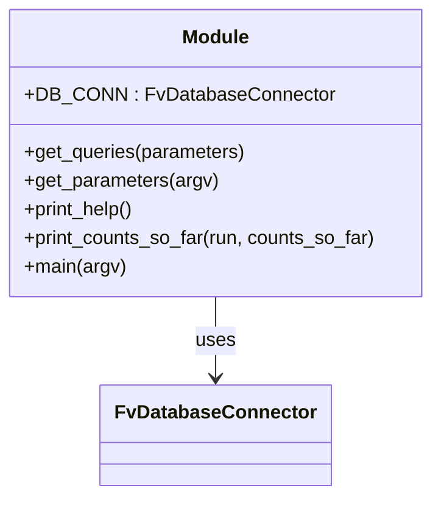

# Diagram: entity_core/entity_service/entity_service_scripts/backfill_position_type.py


> Auto-generated by Obscura crawlers

## Diagram 1



### SVG

<svg id="container" width="363.71875" xmlns="http://www.w3.org/2000/svg" class="classDiagram" height="414" viewBox="0 0 363.71875 414" role="graphics-document document" aria-roledescription="class"><style>#container{font-family:"trebuchet ms",verdana,arial,sans-serif;font-size:16px;fill:#333;}@keyframes edge-animation-frame{from{stroke-dashoffset:0;}}@keyframes dash{to{stroke-dashoffset:0;}}#container .edge-animation-slow{stroke-dasharray:9,5!important;stroke-dashoffset:900;animation:dash 50s linear infinite;stroke-linecap:round;}#container .edge-animation-fast{stroke-dasharray:9,5!important;stroke-dashoffset:900;animation:dash 20s linear infinite;stroke-linecap:round;}#container .error-icon{fill:#552222;}#container .error-text{fill:#552222;stroke:#552222;}#container .edge-thickness-normal{stroke-width:1px;}#container .edge-thickness-thick{stroke-width:3.5px;}#container .edge-pattern-solid{stroke-dasharray:0;}#container .edge-thickness-invisible{stroke-width:0;fill:none;}#container .edge-pattern-dashed{stroke-dasharray:3;}#container .edge-pattern-dotted{stroke-dasharray:2;}#container .marker{fill:#333333;stroke:#333333;}#container .marker.cross{stroke:#333333;}#container svg{font-family:"trebuchet ms",verdana,arial,sans-serif;font-size:16px;}#container p{margin:0;}#container g.classGroup text{fill:#9370DB;stroke:none;font-family:"trebuchet ms",verdana,arial,sans-serif;font-size:10px;}#container g.classGroup text .title{font-weight:bolder;}#container .nodeLabel,#container .edgeLabel{color:#131300;}#container .edgeLabel .label rect{fill:#ECECFF;}#container .label text{fill:#131300;}#container .labelBkg{background:#ECECFF;}#container .edgeLabel .label span{background:#ECECFF;}#container .classTitle{font-weight:bolder;}#container .node rect,#container .node circle,#container .node ellipse,#container .node polygon,#container .node path{fill:#ECECFF;stroke:#9370DB;stroke-width:1px;}#container .divider{stroke:#9370DB;stroke-width:1;}#container g.clickable{cursor:pointer;}#container g.classGroup rect{fill:#ECECFF;stroke:#9370DB;}#container g.classGroup line{stroke:#9370DB;stroke-width:1;}#container .classLabel .box{stroke:none;stroke-width:0;fill:#ECECFF;opacity:0.5;}#container .classLabel .label{fill:#9370DB;font-size:10px;}#container .relation{stroke:#333333;stroke-width:1;fill:none;}#container .dashed-line{stroke-dasharray:3;}#container .dotted-line{stroke-dasharray:1 2;}#container #compositionStart,#container .composition{fill:#333333!important;stroke:#333333!important;stroke-width:1;}#container #compositionEnd,#container .composition{fill:#333333!important;stroke:#333333!important;stroke-width:1;}#container #dependencyStart,#container .dependency{fill:#333333!important;stroke:#333333!important;stroke-width:1;}#container #dependencyStart,#container .dependency{fill:#333333!important;stroke:#333333!important;stroke-width:1;}#container #extensionStart,#container .extension{fill:transparent!important;stroke:#333333!important;stroke-width:1;}#container #extensionEnd,#container .extension{fill:transparent!important;stroke:#333333!important;stroke-width:1;}#container #aggregationStart,#container .aggregation{fill:transparent!important;stroke:#333333!important;stroke-width:1;}#container #aggregationEnd,#container .aggregation{fill:transparent!important;stroke:#333333!important;stroke-width:1;}#container #lollipopStart,#container .lollipop{fill:#ECECFF!important;stroke:#333333!important;stroke-width:1;}#container #lollipopEnd,#container .lollipop{fill:#ECECFF!important;stroke:#333333!important;stroke-width:1;}#container .edgeTerminals{font-size:11px;line-height:initial;}#container .classTitleText{text-anchor:middle;font-size:18px;fill:#333;}#container .label-icon{display:inline-block;height:1em;overflow:visible;vertical-align:-0.125em;}#container .node .label-icon path{fill:currentColor;stroke:revert;stroke-width:revert;}#container :root{--mermaid-font-family:"trebuchet ms",verdana,arial,sans-serif;}</style><g><defs><marker id="container_class-aggregationStart" class="marker aggregation class" refX="18" refY="7" markerWidth="190" markerHeight="240" orient="auto"><path d="M 18,7 L9,13 L1,7 L9,1 Z"></path></marker></defs><defs><marker id="container_class-aggregationEnd" class="marker aggregation class" refX="1" refY="7" markerWidth="20" markerHeight="28" orient="auto"><path d="M 18,7 L9,13 L1,7 L9,1 Z"></path></marker></defs><defs><marker id="container_class-extensionStart" class="marker extension class" refX="18" refY="7" markerWidth="190" markerHeight="240" orient="auto"><path d="M 1,7 L18,13 V 1 Z"></path></marker></defs><defs><marker id="container_class-extensionEnd" class="marker extension class" refX="1" refY="7" markerWidth="20" markerHeight="28" orient="auto"><path d="M 1,1 V 13 L18,7 Z"></path></marker></defs><defs><marker id="container_class-compositionStart" class="marker composition class" refX="18" refY="7" markerWidth="190" markerHeight="240" orient="auto"><path d="M 18,7 L9,13 L1,7 L9,1 Z"></path></marker></defs><defs><marker id="container_class-compositionEnd" class="marker composition class" refX="1" refY="7" markerWidth="20" markerHeight="28" orient="auto"><path d="M 18,7 L9,13 L1,7 L9,1 Z"></path></marker></defs><defs><marker id="container_class-dependencyStart" class="marker dependency class" refX="6" refY="7" markerWidth="190" markerHeight="240" orient="auto"><path d="M 5,7 L9,13 L1,7 L9,1 Z"></path></marker></defs><defs><marker id="container_class-dependencyEnd" class="marker dependency class" refX="13" refY="7" markerWidth="20" markerHeight="28" orient="auto"><path d="M 18,7 L9,13 L14,7 L9,1 Z"></path></marker></defs><defs><marker id="container_class-lollipopStart" class="marker lollipop class" refX="13" refY="7" markerWidth="190" markerHeight="240" orient="auto"><circle stroke="black" fill="transparent" cx="7" cy="7" r="6"></circle></marker></defs><defs><marker id="container_class-lollipopEnd" class="marker lollipop class" refX="1" refY="7" markerWidth="190" markerHeight="240" orient="auto"><circle stroke="black" fill="transparent" cx="7" cy="7" r="6"></circle></marker></defs><g class="root"><g class="clusters"></g><g class="edgePaths"><path d="M181.859,248L181.859,254.167C181.859,260.333,181.859,272.667,181.859,284C181.859,295.333,181.859,305.667,181.859,310.833L181.859,316" id="id_Module_FvDatabaseConnector_1" class="edge-thickness-normal edge-pattern-solid relation" style=";;;" data-edge="true" data-et="edge" data-id="id_Module_FvDatabaseConnector_1" data-points="W3sieCI6MTgxLjg1OTM3NSwieSI6MjQ4fSx7IngiOjE4MS44NTkzNzUsInkiOjI4NX0seyJ4IjoxODEuODU5Mzc1LCJ5IjozMjJ9XQ==" marker-end="url(#container_class-dependencyEnd)"></path></g><g class="edgeLabels"><g class="edgeLabel" transform="translate(181.859375, 285)"><g class="label" data-id="id_Module_FvDatabaseConnector_1" transform="translate(-16.4921875, -12)"><foreignObject width="32.984375" height="24"><div xmlns="http://www.w3.org/1999/xhtml" class="labelBkg" style="display: table-cell; white-space: nowrap; line-height: 1.5; max-width: 200px; text-align: center;"><span class="edgeLabel"><p>uses</p></span></div></foreignObject></g></g></g><g class="nodes"><g class="node default" id="classId-Module-0" transform="translate(181.859375, 128)"><g class="basic label-container"><path d="M-173.859375 -120 L173.859375 -120 L173.859375 120 L-173.859375 120" stroke="none" stroke-width="0" fill="#ECECFF" style=""></path><path d="M-173.859375 -120 C-77.54511169169865 -120, 18.7691516166027 -120, 173.859375 -120 M-173.859375 -120 C-78.07849098268555 -120, 17.702393034628898 -120, 173.859375 -120 M173.859375 -120 C173.859375 -51.31842476174067, 173.859375 17.363150476518655, 173.859375 120 M173.859375 -120 C173.859375 -43.775720293599534, 173.859375 32.44855941280093, 173.859375 120 M173.859375 120 C99.13550940855889 120, 24.411643817117778 120, -173.859375 120 M173.859375 120 C37.502051989848155 120, -98.85527102030369 120, -173.859375 120 M-173.859375 120 C-173.859375 42.95771705188305, -173.859375 -34.0845658962339, -173.859375 -120 M-173.859375 120 C-173.859375 37.629136221501426, -173.859375 -44.74172755699715, -173.859375 -120" stroke="#9370DB" stroke-width="1.3" fill="none" stroke-dasharray="0 0" style=""></path></g><g class="annotation-group text" transform="translate(0, -96)"></g><g class="label-group text" transform="translate(-27.09375, -96)"><g class="label" style="font-weight: bolder" transform="translate(0,-12)"><foreignObject width="54.1875" height="24"><div xmlns="http://www.w3.org/1999/xhtml" style="display: table-cell; white-space: nowrap; line-height: 1.5; max-width: 104px; text-align: center;"><span class="nodeLabel markdown-node-label" style=""><p>Module</p></span></div></foreignObject></g></g><g class="members-group text" transform="translate(-161.859375, -48)"><g class="label" style="" transform="translate(0,-12)"><foreignObject width="245.890625" height="24"><div xmlns="http://www.w3.org/1999/xhtml" style="display: table-cell; white-space: nowrap; line-height: 1.5; max-width: 304px; text-align: center;"><span class="nodeLabel markdown-node-label" style=""><p>+DB_CONN : FvDatabaseConnector</p></span></div></foreignObject></g></g><g class="methods-group text" transform="translate(-161.859375, 0)"><g class="label" style="" transform="translate(0,-12)"><foreignObject width="185.859375" height="24"><div xmlns="http://www.w3.org/1999/xhtml" style="display: table-cell; white-space: nowrap; line-height: 1.5; max-width: 243px; text-align: center;"><span class="nodeLabel markdown-node-label" style=""><p>+get_queries(parameters)</p></span></div></foreignObject></g><g class="label" style="" transform="translate(0,12)"><foreignObject width="162.53125" height="24"><div xmlns="http://www.w3.org/1999/xhtml" style="display: table-cell; white-space: nowrap; line-height: 1.5; max-width: 220px; text-align: center;"><span class="nodeLabel markdown-node-label" style=""><p>+get_parameters(argv)</p></span></div></foreignObject></g><g class="label" style="" transform="translate(0,36)"><foreignObject width="94.3125" height="24"><div xmlns="http://www.w3.org/1999/xhtml" style="display: table-cell; white-space: nowrap; line-height: 1.5; max-width: 152px; text-align: center;"><span class="nodeLabel markdown-node-label" style=""><p>+print_help()</p></span></div></foreignObject></g><g class="label" style="" transform="translate(0,60)"><foreignObject width="296.625" height="24"><div xmlns="http://www.w3.org/1999/xhtml" style="display: table-cell; white-space: nowrap; line-height: 1.5; max-width: 354px; text-align: center;"><span class="nodeLabel markdown-node-label" style=""><p>+print_counts_so_far(run, counts_so_far)</p></span></div></foreignObject></g><g class="label" style="" transform="translate(0,84)"><foreignObject width="85.5" height="24"><div xmlns="http://www.w3.org/1999/xhtml" style="display: table-cell; white-space: nowrap; line-height: 1.5; max-width: 143px; text-align: center;"><span class="nodeLabel markdown-node-label" style=""><p>+main(argv)</p></span></div></foreignObject></g></g><g class="divider" style=""><path d="M-173.859375 -72 C-66.77983943221221 -72, 40.29969613557557 -72, 173.859375 -72 M-173.859375 -72 C-86.47700144778955 -72, 0.9053721044209055 -72, 173.859375 -72" stroke="#9370DB" stroke-width="1.3" fill="none" stroke-dasharray="0 0" style=""></path></g><g class="divider" style=""><path d="M-173.859375 -24 C-66.25755780313622 -24, 41.344259393727555 -24, 173.859375 -24 M-173.859375 -24 C-56.89229032114264 -24, 60.07479435771472 -24, 173.859375 -24" stroke="#9370DB" stroke-width="1.3" fill="none" stroke-dasharray="0 0" style=""></path></g></g><g class="node default" id="classId-FvDatabaseConnector-1" transform="translate(181.859375, 364)"><g class="basic label-container"><path d="M-91.3046875 -42 L91.3046875 -42 L91.3046875 42 L-91.3046875 42" stroke="none" stroke-width="0" fill="#ECECFF" style=""></path><path d="M-91.3046875 -42 C-31.03718102795417 -42, 29.230325444091662 -42, 91.3046875 -42 M-91.3046875 -42 C-31.5005548459919 -42, 28.3035778080162 -42, 91.3046875 -42 M91.3046875 -42 C91.3046875 -9.571869523598224, 91.3046875 22.856260952803552, 91.3046875 42 M91.3046875 -42 C91.3046875 -20.74571646322181, 91.3046875 0.5085670735563781, 91.3046875 42 M91.3046875 42 C21.76707246083106 42, -47.77054257833788 42, -91.3046875 42 M91.3046875 42 C19.138919161340553 42, -53.026849177318894 42, -91.3046875 42 M-91.3046875 42 C-91.3046875 13.064080604520491, -91.3046875 -15.871838790959018, -91.3046875 -42 M-91.3046875 42 C-91.3046875 17.13110608753705, -91.3046875 -7.737787824925903, -91.3046875 -42" stroke="#9370DB" stroke-width="1.3" fill="none" stroke-dasharray="0 0" style=""></path></g><g class="annotation-group text" transform="translate(0, -18)"></g><g class="label-group text" transform="translate(-79.3046875, -18)"><g class="label" style="font-weight: bolder" transform="translate(0,-12)"><foreignObject width="158.609375" height="24"><div xmlns="http://www.w3.org/1999/xhtml" style="display: table-cell; white-space: nowrap; line-height: 1.5; max-width: 207px; text-align: center;"><span class="nodeLabel markdown-node-label" style=""><p>FvDatabaseConnector</p></span></div></foreignObject></g></g><g class="members-group text" transform="translate(-79.3046875, 30)"></g><g class="methods-group text" transform="translate(-79.3046875, 60)"></g><g class="divider" style=""><path d="M-91.3046875 6 C-29.14274079814107 6, 33.01920590371786 6, 91.3046875 6 M-91.3046875 6 C-43.82230524681858 6, 3.6600770063628403 6, 91.3046875 6" stroke="#9370DB" stroke-width="1.3" fill="none" stroke-dasharray="0 0" style=""></path></g><g class="divider" style=""><path d="M-91.3046875 24 C-37.96668595673188 24, 15.371315586536241 24, 91.3046875 24 M-91.3046875 24 C-19.52686599211698 24, 52.25095551576604 24, 91.3046875 24" stroke="#9370DB" stroke-width="1.3" fill="none" stroke-dasharray="0 0" style=""></path></g></g></g></g></g></svg>

## Diagram 2

```mermaid
flowchart TD
    Start((Start)) --> Parse[get_parameters(argv)]
    Parse --> PrintStage[print "Running in stage AWS_STAGE"]
    Parse --> Establish[DB_CONN.establish_connection()]
    Establish --> Cursor[DB_CONN.cursor]
    Cursor --> Setup[initialize: test, limit, warning_time, last_counts, counts_so_far]
    Setup --> SetTimeout[execute: SET statement_timeout = parameters['timeout']]
    SetTimeout --> Loop{any(last_counts) ?}
    Loop -->|yes| ForEach[for j, query in enumerate(get_queries(parameters))]
    ForEach --> CheckLastCounts{last_counts[j] != 0?}
    CheckLastCounts -->|yes| Execute[execute query(cursor.execute(query, {"limit": limit}))]
    Execute --> UpdateCounts[update last_counts[j] = cursor.rowcount; counts_so_far[j] += rowcount]
    Execute --> TimeCalc[measure total = end - start]
    TimeCalc -->|total > warning_time| Warn[print WARNING: Query j took total seconds]
    Warn --> ForEachEnd
    TimeCalc -->|total <= warning_time| ForEachEnd
    CheckLastCounts -->|no| ForEachEnd
    ForEachEnd --> ExceptionHandle[except: pass (retry on next loop)]
    ExceptionHandle --> LoopIncrement[i += 1]
    LoopIncrement --> TestCheck{parameters.test?}
    TestCheck -->|true| PrintAndReturn[print_counts_so_far(i, counts_so_far) and return]
    TestCheck -->|false| FiftyCheck{i % 50 == 0?}
    FiftyCheck -->|true| PrintPeriodic[print_counts_so_far(i, counts_so_far)]
    PrintPeriodic --> Loop
    FiftyCheck -->|false| Loop
    Loop -->|no| End((End/Return))
```

> SVG rendering failed for this diagram.
