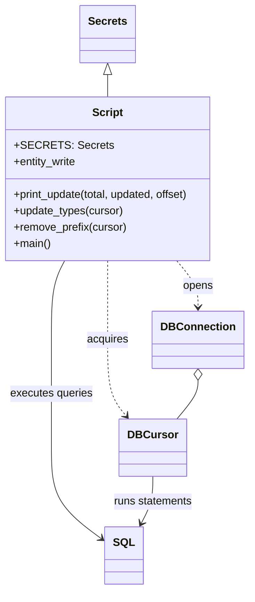

# Diagram: entity_core/entity_service/entity_service_scripts/correct_order_refs.py


> Auto-generated by Obscura crawlers

## Diagram 1



### SVG

<svg id="container" width="364.23046875" xmlns="http://www.w3.org/2000/svg" class="classDiagram" height="864" viewBox="0 0 364.23046875 864" role="graphics-document document" aria-roledescription="class"><style>#container{font-family:"trebuchet ms",verdana,arial,sans-serif;font-size:16px;fill:#333;}@keyframes edge-animation-frame{from{stroke-dashoffset:0;}}@keyframes dash{to{stroke-dashoffset:0;}}#container .edge-animation-slow{stroke-dasharray:9,5!important;stroke-dashoffset:900;animation:dash 50s linear infinite;stroke-linecap:round;}#container .edge-animation-fast{stroke-dasharray:9,5!important;stroke-dashoffset:900;animation:dash 20s linear infinite;stroke-linecap:round;}#container .error-icon{fill:#552222;}#container .error-text{fill:#552222;stroke:#552222;}#container .edge-thickness-normal{stroke-width:1px;}#container .edge-thickness-thick{stroke-width:3.5px;}#container .edge-pattern-solid{stroke-dasharray:0;}#container .edge-thickness-invisible{stroke-width:0;fill:none;}#container .edge-pattern-dashed{stroke-dasharray:3;}#container .edge-pattern-dotted{stroke-dasharray:2;}#container .marker{fill:#333333;stroke:#333333;}#container .marker.cross{stroke:#333333;}#container svg{font-family:"trebuchet ms",verdana,arial,sans-serif;font-size:16px;}#container p{margin:0;}#container g.classGroup text{fill:#9370DB;stroke:none;font-family:"trebuchet ms",verdana,arial,sans-serif;font-size:10px;}#container g.classGroup text .title{font-weight:bolder;}#container .nodeLabel,#container .edgeLabel{color:#131300;}#container .edgeLabel .label rect{fill:#ECECFF;}#container .label text{fill:#131300;}#container .labelBkg{background:#ECECFF;}#container .edgeLabel .label span{background:#ECECFF;}#container .classTitle{font-weight:bolder;}#container .node rect,#container .node circle,#container .node ellipse,#container .node polygon,#container .node path{fill:#ECECFF;stroke:#9370DB;stroke-width:1px;}#container .divider{stroke:#9370DB;stroke-width:1;}#container g.clickable{cursor:pointer;}#container g.classGroup rect{fill:#ECECFF;stroke:#9370DB;}#container g.classGroup line{stroke:#9370DB;stroke-width:1;}#container .classLabel .box{stroke:none;stroke-width:0;fill:#ECECFF;opacity:0.5;}#container .classLabel .label{fill:#9370DB;font-size:10px;}#container .relation{stroke:#333333;stroke-width:1;fill:none;}#container .dashed-line{stroke-dasharray:3;}#container .dotted-line{stroke-dasharray:1 2;}#container #compositionStart,#container .composition{fill:#333333!important;stroke:#333333!important;stroke-width:1;}#container #compositionEnd,#container .composition{fill:#333333!important;stroke:#333333!important;stroke-width:1;}#container #dependencyStart,#container .dependency{fill:#333333!important;stroke:#333333!important;stroke-width:1;}#container #dependencyStart,#container .dependency{fill:#333333!important;stroke:#333333!important;stroke-width:1;}#container #extensionStart,#container .extension{fill:transparent!important;stroke:#333333!important;stroke-width:1;}#container #extensionEnd,#container .extension{fill:transparent!important;stroke:#333333!important;stroke-width:1;}#container #aggregationStart,#container .aggregation{fill:transparent!important;stroke:#333333!important;stroke-width:1;}#container #aggregationEnd,#container .aggregation{fill:transparent!important;stroke:#333333!important;stroke-width:1;}#container #lollipopStart,#container .lollipop{fill:#ECECFF!important;stroke:#333333!important;stroke-width:1;}#container #lollipopEnd,#container .lollipop{fill:#ECECFF!important;stroke:#333333!important;stroke-width:1;}#container .edgeTerminals{font-size:11px;line-height:initial;}#container .classTitleText{text-anchor:middle;font-size:18px;fill:#333;}#container .label-icon{display:inline-block;height:1em;overflow:visible;vertical-align:-0.125em;}#container .node .label-icon path{fill:currentColor;stroke:revert;stroke-width:revert;}#container :root{--mermaid-font-family:"trebuchet ms",verdana,arial,sans-serif;}</style><g><defs><marker id="container_class-aggregationStart" class="marker aggregation class" refX="18" refY="7" markerWidth="190" markerHeight="240" orient="auto"><path d="M 18,7 L9,13 L1,7 L9,1 Z"></path></marker></defs><defs><marker id="container_class-aggregationEnd" class="marker aggregation class" refX="1" refY="7" markerWidth="20" markerHeight="28" orient="auto"><path d="M 18,7 L9,13 L1,7 L9,1 Z"></path></marker></defs><defs><marker id="container_class-extensionStart" class="marker extension class" refX="18" refY="7" markerWidth="190" markerHeight="240" orient="auto"><path d="M 1,7 L18,13 V 1 Z"></path></marker></defs><defs><marker id="container_class-extensionEnd" class="marker extension class" refX="1" refY="7" markerWidth="20" markerHeight="28" orient="auto"><path d="M 1,1 V 13 L18,7 Z"></path></marker></defs><defs><marker id="container_class-compositionStart" class="marker composition class" refX="18" refY="7" markerWidth="190" markerHeight="240" orient="auto"><path d="M 18,7 L9,13 L1,7 L9,1 Z"></path></marker></defs><defs><marker id="container_class-compositionEnd" class="marker composition class" refX="1" refY="7" markerWidth="20" markerHeight="28" orient="auto"><path d="M 18,7 L9,13 L1,7 L9,1 Z"></path></marker></defs><defs><marker id="container_class-dependencyStart" class="marker dependency class" refX="6" refY="7" markerWidth="190" markerHeight="240" orient="auto"><path d="M 5,7 L9,13 L1,7 L9,1 Z"></path></marker></defs><defs><marker id="container_class-dependencyEnd" class="marker dependency class" refX="13" refY="7" markerWidth="20" markerHeight="28" orient="auto"><path d="M 18,7 L9,13 L14,7 L9,1 Z"></path></marker></defs><defs><marker id="container_class-lollipopStart" class="marker lollipop class" refX="13" refY="7" markerWidth="190" markerHeight="240" orient="auto"><circle stroke="black" fill="transparent" cx="7" cy="7" r="6"></circle></marker></defs><defs><marker id="container_class-lollipopEnd" class="marker lollipop class" refX="1" refY="7" markerWidth="190" markerHeight="240" orient="auto"><circle stroke="black" fill="transparent" cx="7" cy="7" r="6"></circle></marker></defs><g class="root"><g class="clusters"></g><g class="edgePaths"><path d="M163.824,109.25L163.824,110.542C163.824,111.833,163.824,114.417,163.824,119.875C163.824,125.333,163.824,133.667,163.824,137.833L163.824,142" id="id_Secrets_Script_1" class="edge-thickness-normal edge-pattern-solid relation" style=";;;" data-edge="true" data-et="edge" data-id="id_Secrets_Script_1" data-points="W3sieCI6MTYzLjgyNDIxODc1LCJ5Ijo5Mn0seyJ4IjoxNjMuODI0MjE4NzUsInkiOjExN30seyJ4IjoxNjMuODI0MjE4NzUsInkiOjE0Mn1d" marker-start="url(#container_class-extensionStart)"></path><path d="M262.447,382L267.515,388.167C272.583,394.333,282.719,406.667,287.787,418C292.855,429.333,292.855,439.667,292.855,444.833L292.855,450" id="id_Script_DBConnection_2" class="edge-thickness-normal edge-pattern-dashed relation" style=";;;" data-edge="true" data-et="edge" data-id="id_Script_DBConnection_2" data-points="W3sieCI6MjYyLjQ0NjgzMDIxNDk2ODE0LCJ5IjozODJ9LHsieCI6MjkyLjg1NTQ2ODc1LCJ5Ijo0MTl9LHsieCI6MjkyLjg1NTQ2ODc1LCJ5Ijo0NTZ9XQ==" marker-end="url(#container_class-dependencyEnd)"></path><path d="M163.824,382L163.824,388.167C163.824,394.333,163.824,406.667,163.824,426C163.824,445.333,163.824,471.667,163.824,498C163.824,524.333,163.824,550.667,168.228,569.225C172.631,587.784,181.438,598.569,185.842,603.961L190.245,609.353" id="id_Script_DBCursor_3" class="edge-thickness-normal edge-pattern-dashed relation" style=";;;" data-edge="true" data-et="edge" data-id="id_Script_DBCursor_3" data-points="W3sieCI6MTYzLjgyNDIxODc1LCJ5IjozODJ9LHsieCI6MTYzLjgyNDIxODc1LCJ5Ijo0MTl9LHsieCI6MTYzLjgyNDIxODc1LCJ5Ijo0OTh9LHsieCI6MTYzLjgyNDIxODc1LCJ5Ijo1Nzd9LHsieCI6MTk0LjA0MDM5NzU0NzQ2ODM2LCJ5Ijo2MTR9XQ==" marker-end="url(#container_class-dependencyEnd)"></path><path d="M292.855,557.25L292.855,560.542C292.855,563.833,292.855,570.417,287.819,579.875C282.783,589.333,272.711,601.667,267.675,607.833L262.639,614" id="id_DBConnection_DBCursor_4" class="edge-thickness-normal edge-pattern-solid relation" style=";;;" data-edge="true" data-et="edge" data-id="id_DBConnection_DBCursor_4" data-points="W3sieCI6MjkyLjg1NTQ2ODc1LCJ5Ijo1NDB9LHsieCI6MjkyLjg1NTQ2ODc1LCJ5Ijo1Nzd9LHsieCI6MjYyLjYzOTI4OTk1MjUzMTY3LCJ5Ijo2MTR9XQ==" marker-start="url(#container_class-aggregationStart)"></path><path d="M101.848,382L98.663,388.167C95.478,394.333,89.108,406.667,85.923,426C82.738,445.333,82.738,471.667,82.738,498C82.738,524.333,82.738,550.667,82.738,577C82.738,603.333,82.738,629.667,82.738,656C82.738,682.333,82.738,708.667,95.082,731.115C107.425,753.563,132.112,772.127,144.455,781.409L156.798,790.69" id="id_Script_SQL_5" class="edge-thickness-normal edge-pattern-solid relation" style=";;;" data-edge="true" data-et="edge" data-id="id_Script_SQL_5" data-points="W3sieCI6MTAxLjg0NzcwNjAxMTE0NjUsInkiOjM4Mn0seyJ4Ijo4Mi43MzgyODEyNSwieSI6NDE5fSx7IngiOjgyLjczODI4MTI1LCJ5Ijo0OTh9LHsieCI6ODIuNzM4MjgxMjUsInkiOjU3N30seyJ4Ijo4Mi43MzgyODEyNSwieSI6NjU2fSx7IngiOjgyLjczODI4MTI1LCJ5Ijo3MzV9LHsieCI6MTYxLjU5Mzc1LCJ5Ijo3OTQuMjk2MjYzMjQ1OTU2NX1d" marker-end="url(#container_class-dependencyEnd)"></path><path d="M228.34,698L228.34,704.167C228.34,710.333,228.34,722.667,225.632,734.11C222.924,745.554,217.507,756.108,214.799,761.385L212.091,766.662" id="id_DBCursor_SQL_6" class="edge-thickness-normal edge-pattern-solid relation" style=";;;" data-edge="true" data-et="edge" data-id="id_DBCursor_SQL_6" data-points="W3sieCI6MjI4LjMzOTg0Mzc1LCJ5Ijo2OTh9LHsieCI6MjI4LjMzOTg0Mzc1LCJ5Ijo3MzV9LHsieCI6MjA5LjM1MTM2NDcxNTE4OTg3LCJ5Ijo3NzJ9XQ==" marker-end="url(#container_class-dependencyEnd)"></path></g><g class="edgeLabels"><g class="edgeLabel"><g class="label" data-id="id_Secrets_Script_1" transform="translate(0, 0)"><foreignObject width="0" height="0"><div xmlns="http://www.w3.org/1999/xhtml" class="labelBkg" style="display: table-cell; white-space: nowrap; line-height: 1.5; max-width: 200px; text-align: center;"><span class="edgeLabel"></span></div></foreignObject></g></g><g class="edgeLabel" transform="translate(292.85546875, 419)"><g class="label" data-id="id_Script_DBConnection_2" transform="translate(-22.2109375, -12)"><foreignObject width="44.421875" height="24"><div xmlns="http://www.w3.org/1999/xhtml" class="labelBkg" style="display: table-cell; white-space: nowrap; line-height: 1.5; max-width: 200px; text-align: center;"><span class="edgeLabel"><p>opens</p></span></div></foreignObject></g></g><g class="edgeLabel" transform="translate(163.82421875, 498)"><g class="label" data-id="id_Script_DBCursor_3" transform="translate(-30.65625, -12)"><foreignObject width="61.3125" height="24"><div xmlns="http://www.w3.org/1999/xhtml" class="labelBkg" style="display: table-cell; white-space: nowrap; line-height: 1.5; max-width: 200px; text-align: center;"><span class="edgeLabel"><p>acquires</p></span></div></foreignObject></g></g><g class="edgeLabel"><g class="label" data-id="id_DBConnection_DBCursor_4" transform="translate(0, 0)"><foreignObject width="0" height="0"><div xmlns="http://www.w3.org/1999/xhtml" class="labelBkg" style="display: table-cell; white-space: nowrap; line-height: 1.5; max-width: 200px; text-align: center;"><span class="edgeLabel"></span></div></foreignObject></g></g><g class="edgeLabel" transform="translate(82.73828125, 577)"><g class="label" data-id="id_Script_SQL_5" transform="translate(-61.0859375, -12)"><foreignObject width="122.171875" height="24"><div xmlns="http://www.w3.org/1999/xhtml" class="labelBkg" style="display: table-cell; white-space: nowrap; line-height: 1.5; max-width: 200px; text-align: center;"><span class="edgeLabel"><p>executes queries</p></span></div></foreignObject></g></g><g class="edgeLabel" transform="translate(228.33984375, 735)"><g class="label" data-id="id_DBCursor_SQL_6" transform="translate(-58.8671875, -12)"><foreignObject width="117.734375" height="24"><div xmlns="http://www.w3.org/1999/xhtml" class="labelBkg" style="display: table-cell; white-space: nowrap; line-height: 1.5; max-width: 200px; text-align: center;"><span class="edgeLabel"><p>runs statements</p></span></div></foreignObject></g></g></g><g class="nodes"><g class="node default" id="classId-Script-0" transform="translate(163.82421875, 262)"><g class="basic label-container"><path d="M-155.82421875 -120 L155.82421875 -120 L155.82421875 120 L-155.82421875 120" stroke="none" stroke-width="0" fill="#ECECFF" style=""></path><path d="M-155.82421875 -120 C-76.3769213944426 -120, 3.0703759611147916 -120, 155.82421875 -120 M-155.82421875 -120 C-86.8534637866104 -120, -17.88270882322081 -120, 155.82421875 -120 M155.82421875 -120 C155.82421875 -37.70085540832247, 155.82421875 44.598289183355064, 155.82421875 120 M155.82421875 -120 C155.82421875 -39.65392825291627, 155.82421875 40.69214349416745, 155.82421875 120 M155.82421875 120 C62.788106046976324 120, -30.24800665604735 120, -155.82421875 120 M155.82421875 120 C77.71180481170835 120, -0.40060912658330494 120, -155.82421875 120 M-155.82421875 120 C-155.82421875 67.68671523138838, -155.82421875 15.373430462776767, -155.82421875 -120 M-155.82421875 120 C-155.82421875 55.116629323213886, -155.82421875 -9.766741353572229, -155.82421875 -120" stroke="#9370DB" stroke-width="1.3" fill="none" stroke-dasharray="0 0" style=""></path></g><g class="annotation-group text" transform="translate(0, -96)"></g><g class="label-group text" transform="translate(-21.7421875, -96)"><g class="label" style="font-weight: bolder" transform="translate(0,-12)"><foreignObject width="43.484375" height="24"><div xmlns="http://www.w3.org/1999/xhtml" style="display: table-cell; white-space: nowrap; line-height: 1.5; max-width: 93px; text-align: center;"><span class="nodeLabel markdown-node-label" style=""><p>Script</p></span></div></foreignObject></g></g><g class="members-group text" transform="translate(-143.82421875, -48)"><g class="label" style="" transform="translate(0,-12)"><foreignObject width="129.140625" height="24"><div xmlns="http://www.w3.org/1999/xhtml" style="display: table-cell; white-space: nowrap; line-height: 1.5; max-width: 187px; text-align: center;"><span class="nodeLabel markdown-node-label" style=""><p>+SECRETS: Secrets</p></span></div></foreignObject></g><g class="label" style="" transform="translate(0,12)"><foreignObject width="93.875" height="24"><div xmlns="http://www.w3.org/1999/xhtml" style="display: table-cell; white-space: nowrap; line-height: 1.5; max-width: 151px; text-align: center;"><span class="nodeLabel markdown-node-label" style=""><p>+entity_write</p></span></div></foreignObject></g></g><g class="methods-group text" transform="translate(-143.82421875, 24)"><g class="label" style="" transform="translate(0,-12)"><foreignObject width="265.90625" height="24"><div xmlns="http://www.w3.org/1999/xhtml" style="display: table-cell; white-space: nowrap; line-height: 1.5; max-width: 323px; text-align: center;"><span class="nodeLabel markdown-node-label" style=""><p>+print_update(total, updated, offset)</p></span></div></foreignObject></g><g class="label" style="" transform="translate(0,12)"><foreignObject width="162.375" height="24"><div xmlns="http://www.w3.org/1999/xhtml" style="display: table-cell; white-space: nowrap; line-height: 1.5; max-width: 220px; text-align: center;"><span class="nodeLabel markdown-node-label" style=""><p>+update_types(cursor)</p></span></div></foreignObject></g><g class="label" style="" transform="translate(0,36)"><foreignObject width="166.90625" height="24"><div xmlns="http://www.w3.org/1999/xhtml" style="display: table-cell; white-space: nowrap; line-height: 1.5; max-width: 224px; text-align: center;"><span class="nodeLabel markdown-node-label" style=""><p>+remove_prefix(cursor)</p></span></div></foreignObject></g><g class="label" style="" transform="translate(0,60)"><foreignObject width="54.65625" height="24"><div xmlns="http://www.w3.org/1999/xhtml" style="display: table-cell; white-space: nowrap; line-height: 1.5; max-width: 112px; text-align: center;"><span class="nodeLabel markdown-node-label" style=""><p>+main()</p></span></div></foreignObject></g></g><g class="divider" style=""><path d="M-155.82421875 -72 C-66.54076009679876 -72, 22.742698556402473 -72, 155.82421875 -72 M-155.82421875 -72 C-85.2560457888372 -72, -14.687872827674397 -72, 155.82421875 -72" stroke="#9370DB" stroke-width="1.3" fill="none" stroke-dasharray="0 0" style=""></path></g><g class="divider" style=""><path d="M-155.82421875 0 C-47.03375533932993 0, 61.75670807134014 0, 155.82421875 0 M-155.82421875 0 C-81.62374555840789 0, -7.42327236681578 0, 155.82421875 0" stroke="#9370DB" stroke-width="1.3" fill="none" stroke-dasharray="0 0" style=""></path></g></g><g class="node default" id="classId-Secrets-1" transform="translate(163.82421875, 50)"><g class="basic label-container"><path d="M-39.1640625 -42 L39.1640625 -42 L39.1640625 42 L-39.1640625 42" stroke="none" stroke-width="0" fill="#ECECFF" style=""></path><path d="M-39.1640625 -42 C-9.118353547987464 -42, 20.92735540402507 -42, 39.1640625 -42 M-39.1640625 -42 C-21.392395870228146 -42, -3.620729240456292 -42, 39.1640625 -42 M39.1640625 -42 C39.1640625 -23.671020218568934, 39.1640625 -5.342040437137868, 39.1640625 42 M39.1640625 -42 C39.1640625 -11.608381975164313, 39.1640625 18.783236049671373, 39.1640625 42 M39.1640625 42 C9.147480097031256 42, -20.86910230593749 42, -39.1640625 42 M39.1640625 42 C23.328624168736113 42, 7.493185837472229 42, -39.1640625 42 M-39.1640625 42 C-39.1640625 18.26036674625087, -39.1640625 -5.479266507498259, -39.1640625 -42 M-39.1640625 42 C-39.1640625 13.49520778571361, -39.1640625 -15.00958442857278, -39.1640625 -42" stroke="#9370DB" stroke-width="1.3" fill="none" stroke-dasharray="0 0" style=""></path></g><g class="annotation-group text" transform="translate(0, -18)"></g><g class="label-group text" transform="translate(-27.1640625, -18)"><g class="label" style="font-weight: bolder" transform="translate(0,-12)"><foreignObject width="54.328125" height="24"><div xmlns="http://www.w3.org/1999/xhtml" style="display: table-cell; white-space: nowrap; line-height: 1.5; max-width: 103px; text-align: center;"><span class="nodeLabel markdown-node-label" style=""><p>Secrets</p></span></div></foreignObject></g></g><g class="members-group text" transform="translate(-27.1640625, 30)"></g><g class="methods-group text" transform="translate(-27.1640625, 60)"></g><g class="divider" style=""><path d="M-39.1640625 6 C-14.451812626523072 6, 10.260437246953856 6, 39.1640625 6 M-39.1640625 6 C-10.528386379015561 6, 18.107289741968877 6, 39.1640625 6" stroke="#9370DB" stroke-width="1.3" fill="none" stroke-dasharray="0 0" style=""></path></g><g class="divider" style=""><path d="M-39.1640625 24 C-8.984192009452617 24, 21.195678481094767 24, 39.1640625 24 M-39.1640625 24 C-10.397857961327798 24, 18.368346577344404 24, 39.1640625 24" stroke="#9370DB" stroke-width="1.3" fill="none" stroke-dasharray="0 0" style=""></path></g></g><g class="node default" id="classId-DBConnection-2" transform="translate(292.85546875, 498)"><g class="basic label-container"><path d="M-63.375 -42 L63.375 -42 L63.375 42 L-63.375 42" stroke="none" stroke-width="0" fill="#ECECFF" style=""></path><path d="M-63.375 -42 C-22.54701731401822 -42, 18.28096537196356 -42, 63.375 -42 M-63.375 -42 C-32.93724554737405 -42, -2.4994910947480946 -42, 63.375 -42 M63.375 -42 C63.375 -12.227995109882336, 63.375 17.544009780235328, 63.375 42 M63.375 -42 C63.375 -13.271294248604967, 63.375 15.457411502790066, 63.375 42 M63.375 42 C13.74362744715345 42, -35.8877451056931 42, -63.375 42 M63.375 42 C17.959248594863375 42, -27.45650281027325 42, -63.375 42 M-63.375 42 C-63.375 21.235849394276233, -63.375 0.47169878855246594, -63.375 -42 M-63.375 42 C-63.375 19.262211083125436, -63.375 -3.475577833749128, -63.375 -42" stroke="#9370DB" stroke-width="1.3" fill="none" stroke-dasharray="0 0" style=""></path></g><g class="annotation-group text" transform="translate(0, -18)"></g><g class="label-group text" transform="translate(-51.375, -18)"><g class="label" style="font-weight: bolder" transform="translate(0,-12)"><foreignObject width="102.75" height="24"><div xmlns="http://www.w3.org/1999/xhtml" style="display: table-cell; white-space: nowrap; line-height: 1.5; max-width: 152px; text-align: center;"><span class="nodeLabel markdown-node-label" style=""><p>DBConnection</p></span></div></foreignObject></g></g><g class="members-group text" transform="translate(-51.375, 30)"></g><g class="methods-group text" transform="translate(-51.375, 60)"></g><g class="divider" style=""><path d="M-63.375 6 C-15.70807621864438 6, 31.95884756271124 6, 63.375 6 M-63.375 6 C-30.93123069332657 6, 1.5125386133468623 6, 63.375 6" stroke="#9370DB" stroke-width="1.3" fill="none" stroke-dasharray="0 0" style=""></path></g><g class="divider" style=""><path d="M-63.375 24 C-15.790270434037048 24, 31.794459131925905 24, 63.375 24 M-63.375 24 C-18.552651696120066 24, 26.26969660775987 24, 63.375 24" stroke="#9370DB" stroke-width="1.3" fill="none" stroke-dasharray="0 0" style=""></path></g></g><g class="node default" id="classId-DBCursor-3" transform="translate(228.33984375, 656)"><g class="basic label-container"><path d="M-46.0546875 -42 L46.0546875 -42 L46.0546875 42 L-46.0546875 42" stroke="none" stroke-width="0" fill="#ECECFF" style=""></path><path d="M-46.0546875 -42 C-20.14378885029878 -42, 5.767109799402441 -42, 46.0546875 -42 M-46.0546875 -42 C-13.733521966653598 -42, 18.587643566692805 -42, 46.0546875 -42 M46.0546875 -42 C46.0546875 -17.529727600645113, 46.0546875 6.940544798709773, 46.0546875 42 M46.0546875 -42 C46.0546875 -14.511655432642545, 46.0546875 12.97668913471491, 46.0546875 42 M46.0546875 42 C24.63187572239761 42, 3.2090639447952185 42, -46.0546875 42 M46.0546875 42 C25.027571856017722 42, 4.000456212035445 42, -46.0546875 42 M-46.0546875 42 C-46.0546875 12.684476532286052, -46.0546875 -16.631046935427896, -46.0546875 -42 M-46.0546875 42 C-46.0546875 8.426993677233867, -46.0546875 -25.146012645532267, -46.0546875 -42" stroke="#9370DB" stroke-width="1.3" fill="none" stroke-dasharray="0 0" style=""></path></g><g class="annotation-group text" transform="translate(0, -18)"></g><g class="label-group text" transform="translate(-34.0546875, -18)"><g class="label" style="font-weight: bolder" transform="translate(0,-12)"><foreignObject width="68.109375" height="24"><div xmlns="http://www.w3.org/1999/xhtml" style="display: table-cell; white-space: nowrap; line-height: 1.5; max-width: 118px; text-align: center;"><span class="nodeLabel markdown-node-label" style=""><p>DBCursor</p></span></div></foreignObject></g></g><g class="members-group text" transform="translate(-34.0546875, 30)"></g><g class="methods-group text" transform="translate(-34.0546875, 60)"></g><g class="divider" style=""><path d="M-46.0546875 6 C-11.799213245648048 6, 22.456261008703905 6, 46.0546875 6 M-46.0546875 6 C-19.96493613843591 6, 6.124815223128181 6, 46.0546875 6" stroke="#9370DB" stroke-width="1.3" fill="none" stroke-dasharray="0 0" style=""></path></g><g class="divider" style=""><path d="M-46.0546875 24 C-21.176771038166656 24, 3.701145423666688 24, 46.0546875 24 M-46.0546875 24 C-19.22375070262755 24, 7.607186094744897 24, 46.0546875 24" stroke="#9370DB" stroke-width="1.3" fill="none" stroke-dasharray="0 0" style=""></path></g></g><g class="node default" id="classId-SQL-4" transform="translate(187.796875, 814)"><g class="basic label-container"><path d="M-26.203125 -42 L26.203125 -42 L26.203125 42 L-26.203125 42" stroke="none" stroke-width="0" fill="#ECECFF" style=""></path><path d="M-26.203125 -42 C-5.594681834017599 -42, 15.013761331964801 -42, 26.203125 -42 M-26.203125 -42 C-13.937766327668271 -42, -1.6724076553365421 -42, 26.203125 -42 M26.203125 -42 C26.203125 -22.520908969813583, 26.203125 -3.0418179396271654, 26.203125 42 M26.203125 -42 C26.203125 -10.76637108085692, 26.203125 20.46725783828616, 26.203125 42 M26.203125 42 C11.932810121277814 42, -2.3375047574443713 42, -26.203125 42 M26.203125 42 C11.852482971595546 42, -2.498159056808909 42, -26.203125 42 M-26.203125 42 C-26.203125 8.881021530366368, -26.203125 -24.237956939267264, -26.203125 -42 M-26.203125 42 C-26.203125 17.251556296202644, -26.203125 -7.496887407594713, -26.203125 -42" stroke="#9370DB" stroke-width="1.3" fill="none" stroke-dasharray="0 0" style=""></path></g><g class="annotation-group text" transform="translate(0, -18)"></g><g class="label-group text" transform="translate(-14.203125, -18)"><g class="label" style="font-weight: bolder" transform="translate(0,-12)"><foreignObject width="28.40625" height="24"><div xmlns="http://www.w3.org/1999/xhtml" style="display: table-cell; white-space: nowrap; line-height: 1.5; max-width: 78px; text-align: center;"><span class="nodeLabel markdown-node-label" style=""><p>SQL</p></span></div></foreignObject></g></g><g class="members-group text" transform="translate(-14.203125, 30)"></g><g class="methods-group text" transform="translate(-14.203125, 60)"></g><g class="divider" style=""><path d="M-26.203125 6 C-6.10876751676588 6, 13.98558996646824 6, 26.203125 6 M-26.203125 6 C-13.738128812900023 6, -1.273132625800045 6, 26.203125 6" stroke="#9370DB" stroke-width="1.3" fill="none" stroke-dasharray="0 0" style=""></path></g><g class="divider" style=""><path d="M-26.203125 24 C-8.366780038235056 24, 9.469564923529887 24, 26.203125 24 M-26.203125 24 C-8.586331413695863 24, 9.030462172608274 24, 26.203125 24" stroke="#9370DB" stroke-width="1.3" fill="none" stroke-dasharray="0 0" style=""></path></g></g></g></g></g></svg>

## Diagram 2

```mermaid
flowchart TD
    Start([Start]) --> InitSecrets[Initialize Secrets (SECRETS, entity_write)]
    InitSecrets --> OpenConn{Open DB connection}
    OpenConn -->|success| GetCursor[Acquire cursor]
    GetCursor --> CheckTotal[SELECT COUNT(*) for where_to_update]
    CheckTotal --> IsZero{total == 0?}
    IsZero -->|yes| PrintNoRecords[Print "No records to update"]
    PrintNoRecords --> CloseConn[Close cursor & connection]
    IsZero -->|no| PrintInitial[print_update(total,0,0)]
    PrintInitial --> UpdateTypes[Call update_types(cursor)]
    UpdateTypes --> LoopStart[Loop: process batches]
    LoopStart --> ExecuteUpdate[Execute UPDATE ...; SELECT COUNT(*) remaining]
    ExecuteUpdate --> FetchCount[Fetch remaining count]
    FetchCount --> ComputeUpdated[updated = total - remaining]
    ComputeUpdated --> PrintProgress[print_update(total, updated, offset)]
    PrintProgress --> CheckComplete{offset > total ?}
    CheckComplete -->|no| IncrementOffset[offset += batch_size]
    IncrementOffset --> LoopStart
    CheckComplete -->|yes| Done[Complete update_types]
    Done --> CloseConn
    CloseConn --> End([End])
```

> SVG rendering failed for this diagram.
