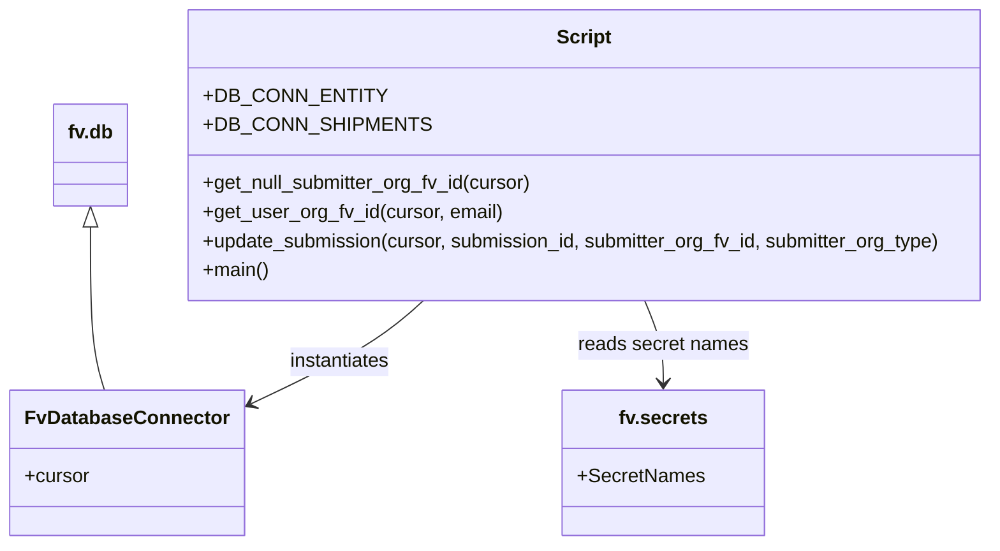

# Diagram: entity_core/entity_service/entity_service_scripts/damageview/DV-457-backfill_submitter_org_fv_id.py


> Auto-generated by Obscura crawlers

## Diagram 1

```mermaid
flowchart TD
    Start([Start]) --> DBSetup[Setup DB connections]
    DBSetup --> DBEntity[DB_CONN_ENTITY (FvDatabaseConnector)]
    DBSetup --> DBShipments[DB_CONN_SHIPMENTS (FvDatabaseConnector)]
    DBEntity --> GetNull[get_null_submitter_org_fv_id(entity_cursor)]
    GetNull --> HasSubs{Submissions to fill?}
    HasSubs -- Yes --> ForEach[For each submission]
    ForEach --> TryBlock[Try]
    TryBlock --> GetUser[get_user_org_fv_id(shipments_cursor, submitter_email)]
    GetUser --> CheckFV{submitter_org_fv_id == "FV001"?}
    CheckFV -- Yes --> SetTest[Set submitter_org_fv_id = "FV3221778A"\nsubmitter_org_type = "SH"]
    CheckFV -- No --> UseReturned[Use returned fv_id and org_type]
    SetTest --> Update[update_submission(entity_cursor, id, submitter_org_fv_id, submitter_org_type)]
    UseReturned --> Update
    Update --> ContinueLoop[Continue loop]
    TryBlock -->|exception| Except[Exception -> continue]
    Except --> ContinueLoop
    ContinueLoop --> HasSubs
    HasSubs -- No --> End([End])
```

> SVG rendering failed for this diagram.

## Diagram 2



### SVG

<svg id="container" width="820.64453125" xmlns="http://www.w3.org/2000/svg" class="classDiagram" height="450" viewBox="0 0 820.64453125 450" role="graphics-document document" aria-roledescription="class"><style>#container{font-family:"trebuchet ms",verdana,arial,sans-serif;font-size:16px;fill:#333;}@keyframes edge-animation-frame{from{stroke-dashoffset:0;}}@keyframes dash{to{stroke-dashoffset:0;}}#container .edge-animation-slow{stroke-dasharray:9,5!important;stroke-dashoffset:900;animation:dash 50s linear infinite;stroke-linecap:round;}#container .edge-animation-fast{stroke-dasharray:9,5!important;stroke-dashoffset:900;animation:dash 20s linear infinite;stroke-linecap:round;}#container .error-icon{fill:#552222;}#container .error-text{fill:#552222;stroke:#552222;}#container .edge-thickness-normal{stroke-width:1px;}#container .edge-thickness-thick{stroke-width:3.5px;}#container .edge-pattern-solid{stroke-dasharray:0;}#container .edge-thickness-invisible{stroke-width:0;fill:none;}#container .edge-pattern-dashed{stroke-dasharray:3;}#container .edge-pattern-dotted{stroke-dasharray:2;}#container .marker{fill:#333333;stroke:#333333;}#container .marker.cross{stroke:#333333;}#container svg{font-family:"trebuchet ms",verdana,arial,sans-serif;font-size:16px;}#container p{margin:0;}#container g.classGroup text{fill:#9370DB;stroke:none;font-family:"trebuchet ms",verdana,arial,sans-serif;font-size:10px;}#container g.classGroup text .title{font-weight:bolder;}#container .nodeLabel,#container .edgeLabel{color:#131300;}#container .edgeLabel .label rect{fill:#ECECFF;}#container .label text{fill:#131300;}#container .labelBkg{background:#ECECFF;}#container .edgeLabel .label span{background:#ECECFF;}#container .classTitle{font-weight:bolder;}#container .node rect,#container .node circle,#container .node ellipse,#container .node polygon,#container .node path{fill:#ECECFF;stroke:#9370DB;stroke-width:1px;}#container .divider{stroke:#9370DB;stroke-width:1;}#container g.clickable{cursor:pointer;}#container g.classGroup rect{fill:#ECECFF;stroke:#9370DB;}#container g.classGroup line{stroke:#9370DB;stroke-width:1;}#container .classLabel .box{stroke:none;stroke-width:0;fill:#ECECFF;opacity:0.5;}#container .classLabel .label{fill:#9370DB;font-size:10px;}#container .relation{stroke:#333333;stroke-width:1;fill:none;}#container .dashed-line{stroke-dasharray:3;}#container .dotted-line{stroke-dasharray:1 2;}#container #compositionStart,#container .composition{fill:#333333!important;stroke:#333333!important;stroke-width:1;}#container #compositionEnd,#container .composition{fill:#333333!important;stroke:#333333!important;stroke-width:1;}#container #dependencyStart,#container .dependency{fill:#333333!important;stroke:#333333!important;stroke-width:1;}#container #dependencyStart,#container .dependency{fill:#333333!important;stroke:#333333!important;stroke-width:1;}#container #extensionStart,#container .extension{fill:transparent!important;stroke:#333333!important;stroke-width:1;}#container #extensionEnd,#container .extension{fill:transparent!important;stroke:#333333!important;stroke-width:1;}#container #aggregationStart,#container .aggregation{fill:transparent!important;stroke:#333333!important;stroke-width:1;}#container #aggregationEnd,#container .aggregation{fill:transparent!important;stroke:#333333!important;stroke-width:1;}#container #lollipopStart,#container .lollipop{fill:#ECECFF!important;stroke:#333333!important;stroke-width:1;}#container #lollipopEnd,#container .lollipop{fill:#ECECFF!important;stroke:#333333!important;stroke-width:1;}#container .edgeTerminals{font-size:11px;line-height:initial;}#container .classTitleText{text-anchor:middle;font-size:18px;fill:#333;}#container .label-icon{display:inline-block;height:1em;overflow:visible;vertical-align:-0.125em;}#container .node .label-icon path{fill:currentColor;stroke:revert;stroke-width:revert;}#container :root{--mermaid-font-family:"trebuchet ms",verdana,arial,sans-serif;}</style><g><defs><marker id="container_class-aggregationStart" class="marker aggregation class" refX="18" refY="7" markerWidth="190" markerHeight="240" orient="auto"><path d="M 18,7 L9,13 L1,7 L9,1 Z"></path></marker></defs><defs><marker id="container_class-aggregationEnd" class="marker aggregation class" refX="1" refY="7" markerWidth="20" markerHeight="28" orient="auto"><path d="M 18,7 L9,13 L1,7 L9,1 Z"></path></marker></defs><defs><marker id="container_class-extensionStart" class="marker extension class" refX="18" refY="7" markerWidth="190" markerHeight="240" orient="auto"><path d="M 1,7 L18,13 V 1 Z"></path></marker></defs><defs><marker id="container_class-extensionEnd" class="marker extension class" refX="1" refY="7" markerWidth="20" markerHeight="28" orient="auto"><path d="M 1,1 V 13 L18,7 Z"></path></marker></defs><defs><marker id="container_class-compositionStart" class="marker composition class" refX="18" refY="7" markerWidth="190" markerHeight="240" orient="auto"><path d="M 18,7 L9,13 L1,7 L9,1 Z"></path></marker></defs><defs><marker id="container_class-compositionEnd" class="marker composition class" refX="1" refY="7" markerWidth="20" markerHeight="28" orient="auto"><path d="M 18,7 L9,13 L1,7 L9,1 Z"></path></marker></defs><defs><marker id="container_class-dependencyStart" class="marker dependency class" refX="6" refY="7" markerWidth="190" markerHeight="240" orient="auto"><path d="M 5,7 L9,13 L1,7 L9,1 Z"></path></marker></defs><defs><marker id="container_class-dependencyEnd" class="marker dependency class" refX="13" refY="7" markerWidth="20" markerHeight="28" orient="auto"><path d="M 18,7 L9,13 L14,7 L9,1 Z"></path></marker></defs><defs><marker id="container_class-lollipopStart" class="marker lollipop class" refX="13" refY="7" markerWidth="190" markerHeight="240" orient="auto"><circle stroke="black" fill="transparent" cx="7" cy="7" r="6"></circle></marker></defs><defs><marker id="container_class-lollipopEnd" class="marker lollipop class" refX="1" refY="7" markerWidth="190" markerHeight="240" orient="auto"><circle stroke="black" fill="transparent" cx="7" cy="7" r="6"></circle></marker></defs><g class="root"><g class="clusters"></g><g class="edgePaths"><path d="M67.848,187.25L67.848,203.542C67.848,219.833,67.848,252.417,69.848,274.875C71.847,297.333,75.847,309.667,77.847,315.833L79.847,322" id="id_fv.db_FvDatabaseConnector_1" class="edge-thickness-normal edge-pattern-solid relation" style=";;;" data-edge="true" data-et="edge" data-id="id_fv.db_FvDatabaseConnector_1" data-points="W3sieCI6NjcuODQ3NjU2MjUsInkiOjE3MH0seyJ4Ijo2Ny44NDc2NTYyNSwieSI6Mjg1fSx7IngiOjc5Ljg0NjczMDAyNTc3MzIsInkiOjMyMn1d" marker-start="url(#container_class-extensionStart)"></path><path d="M346.702,248L339.838,254.167C332.974,260.333,319.246,272.667,294.135,287.416C269.025,302.166,232.532,319.332,214.285,327.915L196.039,336.498" id="id_Script_FvDatabaseConnector_2" class="edge-thickness-normal edge-pattern-solid relation" style=";;;" data-edge="true" data-et="edge" data-id="id_Script_FvDatabaseConnector_2" data-points="W3sieCI6MzQ2LjcwMjA4MDAxNTkyMzU3LCJ5IjoyNDh9LHsieCI6MzA1LjUxNzU3ODEyNSwieSI6Mjg1fSx7IngiOjE5MC42MDkzNzUsInkiOjMzOS4wNTE0MDEyOTM3OTM0fV0=" marker-end="url(#container_class-dependencyEnd)"></path><path d="M531.164,248L533.779,254.167C536.395,260.333,541.625,272.667,544.24,284C546.855,295.333,546.855,305.667,546.855,310.833L546.855,316" id="id_Script_fv.secrets_3" class="edge-thickness-normal edge-pattern-solid relation" style=";;;" data-edge="true" data-et="edge" data-id="id_Script_fv.secrets_3" data-points="W3sieCI6NTMxLjE2NDE2MjAyMjI5MywieSI6MjQ4fSx7IngiOjU0Ni44NTU0Njg3NSwieSI6Mjg1fSx7IngiOjU0Ni44NTU0Njg3NSwieSI6MzIyfV0=" marker-end="url(#container_class-dependencyEnd)"></path></g><g class="edgeLabels"><g class="edgeLabel"><g class="label" data-id="id_fv.db_FvDatabaseConnector_1" transform="translate(0, 0)"><foreignObject width="0" height="0"><div xmlns="http://www.w3.org/1999/xhtml" class="labelBkg" style="display: table-cell; white-space: nowrap; line-height: 1.5; max-width: 200px; text-align: center;"><span class="edgeLabel"></span></div></foreignObject></g></g><g class="edgeLabel" transform="translate(273.11257, 300.24292)"><g class="label" data-id="id_Script_FvDatabaseConnector_2" transform="translate(-42.9140625, -12)"><foreignObject width="85.828125" height="24"><div xmlns="http://www.w3.org/1999/xhtml" class="labelBkg" style="display: table-cell; white-space: nowrap; line-height: 1.5; max-width: 200px; text-align: center;"><span class="edgeLabel"><p>instantiates</p></span></div></foreignObject></g></g><g class="edgeLabel" transform="translate(546.85546875, 285)"><g class="label" data-id="id_Script_fv.secrets_3" transform="translate(-70.25, -12)"><foreignObject width="140.5" height="24"><div xmlns="http://www.w3.org/1999/xhtml" class="labelBkg" style="display: table-cell; white-space: nowrap; line-height: 1.5; max-width: 200px; text-align: center;"><span class="edgeLabel"><p>reads secret names</p></span></div></foreignObject></g></g></g><g class="nodes"><g class="node default" id="classId-FvDatabaseConnector-0" transform="translate(99.3046875, 382)"><g class="basic label-container"><path d="M-91.3046875 -60 L91.3046875 -60 L91.3046875 60 L-91.3046875 60" stroke="none" stroke-width="0" fill="#ECECFF" style=""></path><path d="M-91.3046875 -60 C-49.90303803662877 -60, -8.501388573257543 -60, 91.3046875 -60 M-91.3046875 -60 C-53.78074513752894 -60, -16.256802775057878 -60, 91.3046875 -60 M91.3046875 -60 C91.3046875 -30.962201955694287, 91.3046875 -1.9244039113885734, 91.3046875 60 M91.3046875 -60 C91.3046875 -25.387932392230695, 91.3046875 9.22413521553861, 91.3046875 60 M91.3046875 60 C41.61062989636143 60, -8.083427707277139 60, -91.3046875 60 M91.3046875 60 C40.21536787389744 60, -10.873951752205116 60, -91.3046875 60 M-91.3046875 60 C-91.3046875 15.705313694580049, -91.3046875 -28.589372610839902, -91.3046875 -60 M-91.3046875 60 C-91.3046875 21.820109234675293, -91.3046875 -16.359781530649414, -91.3046875 -60" stroke="#9370DB" stroke-width="1.3" fill="none" stroke-dasharray="0 0" style=""></path></g><g class="annotation-group text" transform="translate(0, -36)"></g><g class="label-group text" transform="translate(-79.3046875, -36)"><g class="label" style="font-weight: bolder" transform="translate(0,-12)"><foreignObject width="158.609375" height="24"><div xmlns="http://www.w3.org/1999/xhtml" style="display: table-cell; white-space: nowrap; line-height: 1.5; max-width: 207px; text-align: center;"><span class="nodeLabel markdown-node-label" style=""><p>FvDatabaseConnector</p></span></div></foreignObject></g></g><g class="members-group text" transform="translate(-79.3046875, 12)"><g class="label" style="" transform="translate(0,-12)"><foreignObject width="53.71875" height="24"><div xmlns="http://www.w3.org/1999/xhtml" style="display: table-cell; white-space: nowrap; line-height: 1.5; max-width: 112px; text-align: center;"><span class="nodeLabel markdown-node-label" style=""><p>+cursor</p></span></div></foreignObject></g></g><g class="methods-group text" transform="translate(-79.3046875, 60)"></g><g class="divider" style=""><path d="M-91.3046875 -12 C-47.37107285156946 -12, -3.4374582031389167 -12, 91.3046875 -12 M-91.3046875 -12 C-18.625986886418886 -12, 54.05271372716223 -12, 91.3046875 -12" stroke="#9370DB" stroke-width="1.3" fill="none" stroke-dasharray="0 0" style=""></path></g><g class="divider" style=""><path d="M-91.3046875 36 C-52.063943640997856 36, -12.823199781995712 36, 91.3046875 36 M-91.3046875 36 C-23.58804324042707 36, 44.12860101914586 36, 91.3046875 36" stroke="#9370DB" stroke-width="1.3" fill="none" stroke-dasharray="0 0" style=""></path></g></g><g class="node default" id="classId-fv.db-1" transform="translate(67.84765625, 128)"><g class="basic label-container"><path d="M-30.0546875 -42 L30.0546875 -42 L30.0546875 42 L-30.0546875 42" stroke="none" stroke-width="0" fill="#ECECFF" style=""></path><path d="M-30.0546875 -42 C-17.654212101278304 -42, -5.253736702556605 -42, 30.0546875 -42 M-30.0546875 -42 C-9.08782441382656 -42, 11.87903867234688 -42, 30.0546875 -42 M30.0546875 -42 C30.0546875 -14.258967635545655, 30.0546875 13.48206472890869, 30.0546875 42 M30.0546875 -42 C30.0546875 -13.617114196958454, 30.0546875 14.765771606083092, 30.0546875 42 M30.0546875 42 C7.59708194391391 42, -14.86052361217218 42, -30.0546875 42 M30.0546875 42 C17.674153247122117 42, 5.293618994244234 42, -30.0546875 42 M-30.0546875 42 C-30.0546875 22.495594293639783, -30.0546875 2.9911885872795665, -30.0546875 -42 M-30.0546875 42 C-30.0546875 13.086127013463255, -30.0546875 -15.82774597307349, -30.0546875 -42" stroke="#9370DB" stroke-width="1.3" fill="none" stroke-dasharray="0 0" style=""></path></g><g class="annotation-group text" transform="translate(0, -18)"></g><g class="label-group text" transform="translate(-18.0546875, -18)"><g class="label" style="font-weight: bolder" transform="translate(0,-12)"><foreignObject width="36.109375" height="24"><div xmlns="http://www.w3.org/1999/xhtml" style="display: table-cell; white-space: nowrap; line-height: 1.5; max-width: 85px; text-align: center;"><span class="nodeLabel markdown-node-label" style=""><p>fv.db</p></span></div></foreignObject></g></g><g class="members-group text" transform="translate(-18.0546875, 30)"></g><g class="methods-group text" transform="translate(-18.0546875, 60)"></g><g class="divider" style=""><path d="M-30.0546875 6 C-17.64957177175232 6, -5.244456043504638 6, 30.0546875 6 M-30.0546875 6 C-7.323669766646091 6, 15.407347966707817 6, 30.0546875 6" stroke="#9370DB" stroke-width="1.3" fill="none" stroke-dasharray="0 0" style=""></path></g><g class="divider" style=""><path d="M-30.0546875 24 C-14.214147757848503 24, 1.6263919843029946 24, 30.0546875 24 M-30.0546875 24 C-14.621048272095527 24, 0.8125909558089468 24, 30.0546875 24" stroke="#9370DB" stroke-width="1.3" fill="none" stroke-dasharray="0 0" style=""></path></g></g><g class="node default" id="classId-fv.secrets-2" transform="translate(546.85546875, 382)"><g class="basic label-container"><path d="M-80.62109375 -60 L80.62109375 -60 L80.62109375 60 L-80.62109375 60" stroke="none" stroke-width="0" fill="#ECECFF" style=""></path><path d="M-80.62109375 -60 C-42.463740867687505 -60, -4.306387985375011 -60, 80.62109375 -60 M-80.62109375 -60 C-36.25051342131152 -60, 8.120066907376966 -60, 80.62109375 -60 M80.62109375 -60 C80.62109375 -20.50175270164503, 80.62109375 18.996494596709937, 80.62109375 60 M80.62109375 -60 C80.62109375 -29.66665806397032, 80.62109375 0.6666838720593589, 80.62109375 60 M80.62109375 60 C19.422714486734897 60, -41.775664776530206 60, -80.62109375 60 M80.62109375 60 C46.642560781680366 60, 12.664027813360732 60, -80.62109375 60 M-80.62109375 60 C-80.62109375 17.427592148769868, -80.62109375 -25.144815702460264, -80.62109375 -60 M-80.62109375 60 C-80.62109375 13.70989808069288, -80.62109375 -32.58020383861424, -80.62109375 -60" stroke="#9370DB" stroke-width="1.3" fill="none" stroke-dasharray="0 0" style=""></path></g><g class="annotation-group text" transform="translate(0, -36)"></g><g class="label-group text" transform="translate(-35.0703125, -36)"><g class="label" style="font-weight: bolder" transform="translate(0,-12)"><foreignObject width="70.140625" height="24"><div xmlns="http://www.w3.org/1999/xhtml" style="display: table-cell; white-space: nowrap; line-height: 1.5; max-width: 118px; text-align: center;"><span class="nodeLabel markdown-node-label" style=""><p>fv.secrets</p></span></div></foreignObject></g></g><g class="members-group text" transform="translate(-68.62109375, 12)"><g class="label" style="" transform="translate(0,-12)"><foreignObject width="102.171875" height="24"><div xmlns="http://www.w3.org/1999/xhtml" style="display: table-cell; white-space: nowrap; line-height: 1.5; max-width: 160px; text-align: center;"><span class="nodeLabel markdown-node-label" style=""><p>+SecretNames</p></span></div></foreignObject></g></g><g class="methods-group text" transform="translate(-68.62109375, 60)"></g><g class="divider" style=""><path d="M-80.62109375 -12 C-39.008113725921916 -12, 2.6048662981561677 -12, 80.62109375 -12 M-80.62109375 -12 C-41.88661487280759 -12, -3.1521359956151827 -12, 80.62109375 -12" stroke="#9370DB" stroke-width="1.3" fill="none" stroke-dasharray="0 0" style=""></path></g><g class="divider" style=""><path d="M-80.62109375 36 C-37.901492778635934 36, 4.818108192728133 36, 80.62109375 36 M-80.62109375 36 C-24.204432870181698 36, 32.212228009636604 36, 80.62109375 36" stroke="#9370DB" stroke-width="1.3" fill="none" stroke-dasharray="0 0" style=""></path></g></g><g class="node default" id="classId-Script-3" transform="translate(480.2734375, 128)"><g class="basic label-container"><path d="M-332.37109375 -120 L332.37109375 -120 L332.37109375 120 L-332.37109375 120" stroke="none" stroke-width="0" fill="#ECECFF" style=""></path><path d="M-332.37109375 -120 C-157.09062077813473 -120, 18.18985219373053 -120, 332.37109375 -120 M-332.37109375 -120 C-117.9903785553891 -120, 96.3903366392218 -120, 332.37109375 -120 M332.37109375 -120 C332.37109375 -38.46945110975665, 332.37109375 43.061097780486705, 332.37109375 120 M332.37109375 -120 C332.37109375 -54.61055671584661, 332.37109375 10.778886568306774, 332.37109375 120 M332.37109375 120 C152.9851044372955 120, -26.40088487540902 120, -332.37109375 120 M332.37109375 120 C161.12569373786386 120, -10.11970627427229 120, -332.37109375 120 M-332.37109375 120 C-332.37109375 59.48956554480498, -332.37109375 -1.0208689103900355, -332.37109375 -120 M-332.37109375 120 C-332.37109375 34.19424543420142, -332.37109375 -51.61150913159716, -332.37109375 -120" stroke="#9370DB" stroke-width="1.3" fill="none" stroke-dasharray="0 0" style=""></path></g><g class="annotation-group text" transform="translate(0, -96)"></g><g class="label-group text" transform="translate(-21.7421875, -96)"><g class="label" style="font-weight: bolder" transform="translate(0,-12)"><foreignObject width="43.484375" height="24"><div xmlns="http://www.w3.org/1999/xhtml" style="display: table-cell; white-space: nowrap; line-height: 1.5; max-width: 93px; text-align: center;"><span class="nodeLabel markdown-node-label" style=""><p>Script</p></span></div></foreignObject></g></g><g class="members-group text" transform="translate(-320.37109375, -48)"><g class="label" style="" transform="translate(0,-12)"><foreignObject width="134.828125" height="24"><div xmlns="http://www.w3.org/1999/xhtml" style="display: table-cell; white-space: nowrap; line-height: 1.5; max-width: 192px; text-align: center;"><span class="nodeLabel markdown-node-label" style=""><p>+DB_CONN_ENTITY</p></span></div></foreignObject></g><g class="label" style="" transform="translate(0,12)"><foreignObject width="166.703125" height="24"><div xmlns="http://www.w3.org/1999/xhtml" style="display: table-cell; white-space: nowrap; line-height: 1.5; max-width: 224px; text-align: center;"><span class="nodeLabel markdown-node-label" style=""><p>+DB_CONN_SHIPMENTS</p></span></div></foreignObject></g></g><g class="methods-group text" transform="translate(-320.37109375, 24)"><g class="label" style="" transform="translate(0,-12)"><foreignObject width="275.609375" height="24"><div xmlns="http://www.w3.org/1999/xhtml" style="display: table-cell; white-space: nowrap; line-height: 1.5; max-width: 333px; text-align: center;"><span class="nodeLabel markdown-node-label" style=""><p>+get_null_submitter_org_fv_id(cursor)</p></span></div></foreignObject></g><g class="label" style="" transform="translate(0,12)"><foreignObject width="247" height="24"><div xmlns="http://www.w3.org/1999/xhtml" style="display: table-cell; white-space: nowrap; line-height: 1.5; max-width: 304px; text-align: center;"><span class="nodeLabel markdown-node-label" style=""><p>+get_user_org_fv_id(cursor, email)</p></span></div></foreignObject></g><g class="label" style="" transform="translate(0,36)"><foreignObject width="619" height="24"><div xmlns="http://www.w3.org/1999/xhtml" style="display: table-cell; white-space: nowrap; line-height: 1.5; max-width: 676px; text-align: center;"><span class="nodeLabel markdown-node-label" style=""><p>+update_submission(cursor, submission_id, submitter_org_fv_id, submitter_org_type)</p></span></div></foreignObject></g><g class="label" style="" transform="translate(0,60)"><foreignObject width="54.65625" height="24"><div xmlns="http://www.w3.org/1999/xhtml" style="display: table-cell; white-space: nowrap; line-height: 1.5; max-width: 112px; text-align: center;"><span class="nodeLabel markdown-node-label" style=""><p>+main()</p></span></div></foreignObject></g></g><g class="divider" style=""><path d="M-332.37109375 -72 C-112.31216044574208 -72, 107.74677285851584 -72, 332.37109375 -72 M-332.37109375 -72 C-103.15919747651068 -72, 126.05269879697863 -72, 332.37109375 -72" stroke="#9370DB" stroke-width="1.3" fill="none" stroke-dasharray="0 0" style=""></path></g><g class="divider" style=""><path d="M-332.37109375 0 C-100.35800018574375 0, 131.6550933785125 0, 332.37109375 0 M-332.37109375 0 C-120.16134483789969 0, 92.04840407420062 0, 332.37109375 0" stroke="#9370DB" stroke-width="1.3" fill="none" stroke-dasharray="0 0" style=""></path></g></g></g></g></g></svg>
