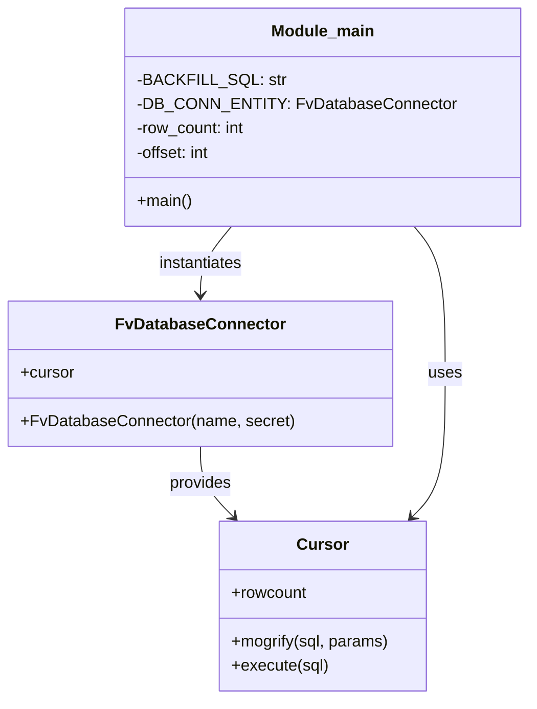

# Diagram: entity_core/entity_service/entity_service_scripts/dpu-1027_backfill.py


> Auto-generated by Obscura crawlers

## Diagram 1

```mermaid
flowchart TD
    Start([Start]) --> InitDB[DB_CONN_ENTITY = FvDatabaseConnector("DPU-1027", SecretNames.ENTITY_DATABASE)]
    InitDB --> GetCursor[cursor = DB_CONN_ENTITY.cursor]
    GetCursor --> InitVars[row_count = 100\noffset = 0]
    InitVars --> Loop{row_count > 0 and offset < 100000?}
    Loop -->|yes| Mogrify[sql = cursor.mogrify(BACKFILL_SQL, {"offset": offset})]
    Mogrify --> Execute[cursor.execute(sql)]
    Execute --> UpdateRow[row_count = cursor.rowcount]
    UpdateRow --> IncOffset[offset = offset + 100]
    IncOffset --> Print[print("Rowcount", row_count)\nprint("Offset", offset)]
    Print --> Loop
    Loop -->|no| End([End])
```

> SVG rendering failed for this diagram.

## Diagram 2



### SVG

<svg id="container" width="504.931640625" xmlns="http://www.w3.org/2000/svg" class="classDiagram" height="692" viewBox="0 0 504.931640625 692" role="graphics-document document" aria-roledescription="class"><style>#container{font-family:"trebuchet ms",verdana,arial,sans-serif;font-size:16px;fill:#333;}@keyframes edge-animation-frame{from{stroke-dashoffset:0;}}@keyframes dash{to{stroke-dashoffset:0;}}#container .edge-animation-slow{stroke-dasharray:9,5!important;stroke-dashoffset:900;animation:dash 50s linear infinite;stroke-linecap:round;}#container .edge-animation-fast{stroke-dasharray:9,5!important;stroke-dashoffset:900;animation:dash 20s linear infinite;stroke-linecap:round;}#container .error-icon{fill:#552222;}#container .error-text{fill:#552222;stroke:#552222;}#container .edge-thickness-normal{stroke-width:1px;}#container .edge-thickness-thick{stroke-width:3.5px;}#container .edge-pattern-solid{stroke-dasharray:0;}#container .edge-thickness-invisible{stroke-width:0;fill:none;}#container .edge-pattern-dashed{stroke-dasharray:3;}#container .edge-pattern-dotted{stroke-dasharray:2;}#container .marker{fill:#333333;stroke:#333333;}#container .marker.cross{stroke:#333333;}#container svg{font-family:"trebuchet ms",verdana,arial,sans-serif;font-size:16px;}#container p{margin:0;}#container g.classGroup text{fill:#9370DB;stroke:none;font-family:"trebuchet ms",verdana,arial,sans-serif;font-size:10px;}#container g.classGroup text .title{font-weight:bolder;}#container .nodeLabel,#container .edgeLabel{color:#131300;}#container .edgeLabel .label rect{fill:#ECECFF;}#container .label text{fill:#131300;}#container .labelBkg{background:#ECECFF;}#container .edgeLabel .label span{background:#ECECFF;}#container .classTitle{font-weight:bolder;}#container .node rect,#container .node circle,#container .node ellipse,#container .node polygon,#container .node path{fill:#ECECFF;stroke:#9370DB;stroke-width:1px;}#container .divider{stroke:#9370DB;stroke-width:1;}#container g.clickable{cursor:pointer;}#container g.classGroup rect{fill:#ECECFF;stroke:#9370DB;}#container g.classGroup line{stroke:#9370DB;stroke-width:1;}#container .classLabel .box{stroke:none;stroke-width:0;fill:#ECECFF;opacity:0.5;}#container .classLabel .label{fill:#9370DB;font-size:10px;}#container .relation{stroke:#333333;stroke-width:1;fill:none;}#container .dashed-line{stroke-dasharray:3;}#container .dotted-line{stroke-dasharray:1 2;}#container #compositionStart,#container .composition{fill:#333333!important;stroke:#333333!important;stroke-width:1;}#container #compositionEnd,#container .composition{fill:#333333!important;stroke:#333333!important;stroke-width:1;}#container #dependencyStart,#container .dependency{fill:#333333!important;stroke:#333333!important;stroke-width:1;}#container #dependencyStart,#container .dependency{fill:#333333!important;stroke:#333333!important;stroke-width:1;}#container #extensionStart,#container .extension{fill:transparent!important;stroke:#333333!important;stroke-width:1;}#container #extensionEnd,#container .extension{fill:transparent!important;stroke:#333333!important;stroke-width:1;}#container #aggregationStart,#container .aggregation{fill:transparent!important;stroke:#333333!important;stroke-width:1;}#container #aggregationEnd,#container .aggregation{fill:transparent!important;stroke:#333333!important;stroke-width:1;}#container #lollipopStart,#container .lollipop{fill:#ECECFF!important;stroke:#333333!important;stroke-width:1;}#container #lollipopEnd,#container .lollipop{fill:#ECECFF!important;stroke:#333333!important;stroke-width:1;}#container .edgeTerminals{font-size:11px;line-height:initial;}#container .classTitleText{text-anchor:middle;font-size:18px;fill:#333;}#container .label-icon{display:inline-block;height:1em;overflow:visible;vertical-align:-0.125em;}#container .node .label-icon path{fill:currentColor;stroke:revert;stroke-width:revert;}#container :root{--mermaid-font-family:"trebuchet ms",verdana,arial,sans-serif;}</style><g><defs><marker id="container_class-aggregationStart" class="marker aggregation class" refX="18" refY="7" markerWidth="190" markerHeight="240" orient="auto"><path d="M 18,7 L9,13 L1,7 L9,1 Z"></path></marker></defs><defs><marker id="container_class-aggregationEnd" class="marker aggregation class" refX="1" refY="7" markerWidth="20" markerHeight="28" orient="auto"><path d="M 18,7 L9,13 L1,7 L9,1 Z"></path></marker></defs><defs><marker id="container_class-extensionStart" class="marker extension class" refX="18" refY="7" markerWidth="190" markerHeight="240" orient="auto"><path d="M 1,7 L18,13 V 1 Z"></path></marker></defs><defs><marker id="container_class-extensionEnd" class="marker extension class" refX="1" refY="7" markerWidth="20" markerHeight="28" orient="auto"><path d="M 1,1 V 13 L18,7 Z"></path></marker></defs><defs><marker id="container_class-compositionStart" class="marker composition class" refX="18" refY="7" markerWidth="190" markerHeight="240" orient="auto"><path d="M 18,7 L9,13 L1,7 L9,1 Z"></path></marker></defs><defs><marker id="container_class-compositionEnd" class="marker composition class" refX="1" refY="7" markerWidth="20" markerHeight="28" orient="auto"><path d="M 18,7 L9,13 L1,7 L9,1 Z"></path></marker></defs><defs><marker id="container_class-dependencyStart" class="marker dependency class" refX="6" refY="7" markerWidth="190" markerHeight="240" orient="auto"><path d="M 5,7 L9,13 L1,7 L9,1 Z"></path></marker></defs><defs><marker id="container_class-dependencyEnd" class="marker dependency class" refX="13" refY="7" markerWidth="20" markerHeight="28" orient="auto"><path d="M 18,7 L9,13 L14,7 L9,1 Z"></path></marker></defs><defs><marker id="container_class-lollipopStart" class="marker lollipop class" refX="13" refY="7" markerWidth="190" markerHeight="240" orient="auto"><circle stroke="black" fill="transparent" cx="7" cy="7" r="6"></circle></marker></defs><defs><marker id="container_class-lollipopEnd" class="marker lollipop class" refX="1" refY="7" markerWidth="190" markerHeight="240" orient="auto"><circle stroke="black" fill="transparent" cx="7" cy="7" r="6"></circle></marker></defs><g class="root"><g class="clusters"></g><g class="edgePaths"><path d="M223.6,224L218.563,230.167C213.527,236.333,203.453,248.667,198.416,260C193.379,271.333,193.379,281.667,193.379,286.833L193.379,292" id="id_Module_main_FvDatabaseConnector_1" class="edge-thickness-normal edge-pattern-solid relation" style=";;;" data-edge="true" data-et="edge" data-id="id_Module_main_FvDatabaseConnector_1" data-points="W3sieCI6MjIzLjYwMDM5MDYyNSwieSI6MjI0fSx7IngiOjE5My4zNzg5MDYyNSwieSI6MjYxfSx7IngiOjE5My4zNzg5MDYyNSwieSI6Mjk4fV0=" marker-end="url(#container_class-dependencyEnd)"></path><path d="M193.379,442L193.379,448.167C193.379,454.333,193.379,466.667,198.715,478.285C204.052,489.904,214.725,500.808,220.061,506.26L225.398,511.712" id="id_FvDatabaseConnector_Cursor_2" class="edge-thickness-normal edge-pattern-solid relation" style=";;;" data-edge="true" data-et="edge" data-id="id_FvDatabaseConnector_Cursor_2" data-points="W3sieCI6MTkzLjM3ODkwNjI1LCJ5Ijo0NDJ9LHsieCI6MTkzLjM3ODkwNjI1LCJ5Ijo0Nzl9LHsieCI6MjI5LjU5NDczNDYzMzI2NDQ3LCJ5Ijo1MTZ9XQ==" marker-end="url(#container_class-dependencyEnd)"></path><path d="M400.029,224L405.065,230.167C410.102,236.333,420.176,248.667,425.213,273C430.25,297.333,430.25,333.667,430.25,370C430.25,406.333,430.25,442.667,424.914,466.285C419.577,489.904,408.904,500.808,403.568,506.26L398.231,511.712" id="id_Module_main_Cursor_3" class="edge-thickness-normal edge-pattern-solid relation" style=";;;" data-edge="true" data-et="edge" data-id="id_Module_main_Cursor_3" data-points="W3sieCI6NDAwLjAyODUxNTYyNSwieSI6MjI0fSx7IngiOjQzMC4yNSwieSI6MjYxfSx7IngiOjQzMC4yNSwieSI6MzcwfSx7IngiOjQzMC4yNSwieSI6NDc5fSx7IngiOjM5NC4wMzQxNzE2MTY3MzU1MywieSI6NTE2fV0=" marker-end="url(#container_class-dependencyEnd)"></path></g><g class="edgeLabels"><g class="edgeLabel" transform="translate(193.37890625, 261)"><g class="label" data-id="id_Module_main_FvDatabaseConnector_1" transform="translate(-42.9140625, -12)"><foreignObject width="85.828125" height="24"><div xmlns="http://www.w3.org/1999/xhtml" class="labelBkg" style="display: table-cell; white-space: nowrap; line-height: 1.5; max-width: 200px; text-align: center;"><span class="edgeLabel"><p>instantiates</p></span></div></foreignObject></g></g><g class="edgeLabel" transform="translate(193.37890625, 479)"><g class="label" data-id="id_FvDatabaseConnector_Cursor_2" transform="translate(-31.3125, -12)"><foreignObject width="62.625" height="24"><div xmlns="http://www.w3.org/1999/xhtml" class="labelBkg" style="display: table-cell; white-space: nowrap; line-height: 1.5; max-width: 200px; text-align: center;"><span class="edgeLabel"><p>provides</p></span></div></foreignObject></g></g><g class="edgeLabel" transform="translate(430.25, 370)"><g class="label" data-id="id_Module_main_Cursor_3" transform="translate(-16.4921875, -12)"><foreignObject width="32.984375" height="24"><div xmlns="http://www.w3.org/1999/xhtml" class="labelBkg" style="display: table-cell; white-space: nowrap; line-height: 1.5; max-width: 200px; text-align: center;"><span class="edgeLabel"><p>uses</p></span></div></foreignObject></g></g></g><g class="nodes"><g class="node default" id="classId-FvDatabaseConnector-0" transform="translate(193.37890625, 370)"><g class="basic label-container"><path d="M-185.37890625 -72 L185.37890625 -72 L185.37890625 72 L-185.37890625 72" stroke="none" stroke-width="0" fill="#ECECFF" style=""></path><path d="M-185.37890625 -72 C-57.75244769352621 -72, 69.87401086294759 -72, 185.37890625 -72 M-185.37890625 -72 C-80.36902651666972 -72, 24.64085321666056 -72, 185.37890625 -72 M185.37890625 -72 C185.37890625 -36.84721590740833, 185.37890625 -1.694431814816653, 185.37890625 72 M185.37890625 -72 C185.37890625 -33.64206817715101, 185.37890625 4.715863645697979, 185.37890625 72 M185.37890625 72 C73.07426199775371 72, -39.23038225449258 72, -185.37890625 72 M185.37890625 72 C86.16864176335213 72, -13.041622723295745 72, -185.37890625 72 M-185.37890625 72 C-185.37890625 17.117179329964017, -185.37890625 -37.765641340071966, -185.37890625 -72 M-185.37890625 72 C-185.37890625 21.819114960321286, -185.37890625 -28.361770079357427, -185.37890625 -72" stroke="#9370DB" stroke-width="1.3" fill="none" stroke-dasharray="0 0" style=""></path></g><g class="annotation-group text" transform="translate(0, -48)"></g><g class="label-group text" transform="translate(-79.3046875, -48)"><g class="label" style="font-weight: bolder" transform="translate(0,-12)"><foreignObject width="158.609375" height="24"><div xmlns="http://www.w3.org/1999/xhtml" style="display: table-cell; white-space: nowrap; line-height: 1.5; max-width: 207px; text-align: center;"><span class="nodeLabel markdown-node-label" style=""><p>FvDatabaseConnector</p></span></div></foreignObject></g></g><g class="members-group text" transform="translate(-173.37890625, 0)"><g class="label" style="" transform="translate(0,-12)"><foreignObject width="53.71875" height="24"><div xmlns="http://www.w3.org/1999/xhtml" style="display: table-cell; white-space: nowrap; line-height: 1.5; max-width: 112px; text-align: center;"><span class="nodeLabel markdown-node-label" style=""><p>+cursor</p></span></div></foreignObject></g></g><g class="methods-group text" transform="translate(-173.37890625, 48)"><g class="label" style="" transform="translate(0,-12)"><foreignObject width="267.453125" height="24"><div xmlns="http://www.w3.org/1999/xhtml" style="display: table-cell; white-space: nowrap; line-height: 1.5; max-width: 325px; text-align: center;"><span class="nodeLabel markdown-node-label" style=""><p>+FvDatabaseConnector(name, secret)</p></span></div></foreignObject></g></g><g class="divider" style=""><path d="M-185.37890625 -24 C-75.46266188402748 -24, 34.453582481945034 -24, 185.37890625 -24 M-185.37890625 -24 C-89.21036206308855 -24, 6.958182123822894 -24, 185.37890625 -24" stroke="#9370DB" stroke-width="1.3" fill="none" stroke-dasharray="0 0" style=""></path></g><g class="divider" style=""><path d="M-185.37890625 24 C-91.97258744411559 24, 1.433731361768821 24, 185.37890625 24 M-185.37890625 24 C-81.26618487597395 24, 22.846536498052103 24, 185.37890625 24" stroke="#9370DB" stroke-width="1.3" fill="none" stroke-dasharray="0 0" style=""></path></g></g><g class="node default" id="classId-Cursor-1" transform="translate(311.814453125, 600)"><g class="basic label-container"><path d="M-102.4921875 -84 L102.4921875 -84 L102.4921875 84 L-102.4921875 84" stroke="none" stroke-width="0" fill="#ECECFF" style=""></path><path d="M-102.4921875 -84 C-51.238190900791594 -84, 0.015805698416812675 -84, 102.4921875 -84 M-102.4921875 -84 C-30.28537387499898 -84, 41.92143975000204 -84, 102.4921875 -84 M102.4921875 -84 C102.4921875 -21.030757486956666, 102.4921875 41.93848502608667, 102.4921875 84 M102.4921875 -84 C102.4921875 -27.15949692562822, 102.4921875 29.681006148743563, 102.4921875 84 M102.4921875 84 C37.794969490179255 84, -26.90224851964149 84, -102.4921875 84 M102.4921875 84 C46.27553745991076 84, -9.941112580178483 84, -102.4921875 84 M-102.4921875 84 C-102.4921875 44.151045258235044, -102.4921875 4.302090516470088, -102.4921875 -84 M-102.4921875 84 C-102.4921875 17.861897135317662, -102.4921875 -48.276205729364676, -102.4921875 -84" stroke="#9370DB" stroke-width="1.3" fill="none" stroke-dasharray="0 0" style=""></path></g><g class="annotation-group text" transform="translate(0, -60)"></g><g class="label-group text" transform="translate(-23.90625, -60)"><g class="label" style="font-weight: bolder" transform="translate(0,-12)"><foreignObject width="47.8125" height="24"><div xmlns="http://www.w3.org/1999/xhtml" style="display: table-cell; white-space: nowrap; line-height: 1.5; max-width: 98px; text-align: center;"><span class="nodeLabel markdown-node-label" style=""><p>Cursor</p></span></div></foreignObject></g></g><g class="members-group text" transform="translate(-90.4921875, -12)"><g class="label" style="" transform="translate(0,-12)"><foreignObject width="75.640625" height="24"><div xmlns="http://www.w3.org/1999/xhtml" style="display: table-cell; white-space: nowrap; line-height: 1.5; max-width: 133px; text-align: center;"><span class="nodeLabel markdown-node-label" style=""><p>+rowcount</p></span></div></foreignObject></g></g><g class="methods-group text" transform="translate(-90.4921875, 36)"><g class="label" style="" transform="translate(0,-12)"><foreignObject width="157.078125" height="24"><div xmlns="http://www.w3.org/1999/xhtml" style="display: table-cell; white-space: nowrap; line-height: 1.5; max-width: 214px; text-align: center;"><span class="nodeLabel markdown-node-label" style=""><p>+mogrify(sql, params)</p></span></div></foreignObject></g><g class="label" style="" transform="translate(0,12)"><foreignObject width="96.0625" height="24"><div xmlns="http://www.w3.org/1999/xhtml" style="display: table-cell; white-space: nowrap; line-height: 1.5; max-width: 153px; text-align: center;"><span class="nodeLabel markdown-node-label" style=""><p>+execute(sql)</p></span></div></foreignObject></g></g><g class="divider" style=""><path d="M-102.4921875 -36 C-31.430399744316645 -36, 39.63138801136671 -36, 102.4921875 -36 M-102.4921875 -36 C-28.119228399384497 -36, 46.25373070123101 -36, 102.4921875 -36" stroke="#9370DB" stroke-width="1.3" fill="none" stroke-dasharray="0 0" style=""></path></g><g class="divider" style=""><path d="M-102.4921875 12 C-37.002315945243794 12, 28.487555609512413 12, 102.4921875 12 M-102.4921875 12 C-25.057520782814606 12, 52.37714593437079 12, 102.4921875 12" stroke="#9370DB" stroke-width="1.3" fill="none" stroke-dasharray="0 0" style=""></path></g></g><g class="node default" id="classId-Module_main-2" transform="translate(311.814453125, 116)"><g class="basic label-container"><path d="M-185.1171875 -108 L185.1171875 -108 L185.1171875 108 L-185.1171875 108" stroke="none" stroke-width="0" fill="#ECECFF" style=""></path><path d="M-185.1171875 -108 C-58.42372172391727 -108, 68.26974405216546 -108, 185.1171875 -108 M-185.1171875 -108 C-66.92461813269637 -108, 51.26795123460727 -108, 185.1171875 -108 M185.1171875 -108 C185.1171875 -51.637378953427124, 185.1171875 4.725242093145752, 185.1171875 108 M185.1171875 -108 C185.1171875 -50.89061218935747, 185.1171875 6.218775621285062, 185.1171875 108 M185.1171875 108 C89.52922742245275 108, -6.058732655094502 108, -185.1171875 108 M185.1171875 108 C91.96703243343727 108, -1.183122633125464 108, -185.1171875 108 M-185.1171875 108 C-185.1171875 63.091679759513156, -185.1171875 18.18335951902631, -185.1171875 -108 M-185.1171875 108 C-185.1171875 46.19365745465938, -185.1171875 -15.61268509068124, -185.1171875 -108" stroke="#9370DB" stroke-width="1.3" fill="none" stroke-dasharray="0 0" style=""></path></g><g class="annotation-group text" transform="translate(0, -84)"></g><g class="label-group text" transform="translate(-49.109375, -84)"><g class="label" style="font-weight: bolder" transform="translate(0,-12)"><foreignObject width="98.21875" height="24"><div xmlns="http://www.w3.org/1999/xhtml" style="display: table-cell; white-space: nowrap; line-height: 1.5; max-width: 148px; text-align: center;"><span class="nodeLabel markdown-node-label" style=""><p>Module_main</p></span></div></foreignObject></g></g><g class="members-group text" transform="translate(-173.1171875, -36)"><g class="label" style="" transform="translate(0,-12)"><foreignObject width="135.25" height="24"><div xmlns="http://www.w3.org/1999/xhtml" style="display: table-cell; white-space: nowrap; line-height: 1.5; max-width: 193px; text-align: center;"><span class="nodeLabel markdown-node-label" style=""><p>-BACKFILL_SQL: str</p></span></div></foreignObject></g><g class="label" style="" transform="translate(0,12)"><foreignObject width="297.125" height="24"><div xmlns="http://www.w3.org/1999/xhtml" style="display: table-cell; white-space: nowrap; line-height: 1.5; max-width: 355px; text-align: center;"><span class="nodeLabel markdown-node-label" style=""><p>-DB_CONN_ENTITY: FvDatabaseConnector</p></span></div></foreignObject></g><g class="label" style="" transform="translate(0,36)"><foreignObject width="109.59375" height="24"><div xmlns="http://www.w3.org/1999/xhtml" style="display: table-cell; white-space: nowrap; line-height: 1.5; max-width: 167px; text-align: center;"><span class="nodeLabel markdown-node-label" style=""><p>-row_count: int</p></span></div></foreignObject></g><g class="label" style="" transform="translate(0,60)"><foreignObject width="76.21875" height="24"><div xmlns="http://www.w3.org/1999/xhtml" style="display: table-cell; white-space: nowrap; line-height: 1.5; max-width: 134px; text-align: center;"><span class="nodeLabel markdown-node-label" style=""><p>-offset: int</p></span></div></foreignObject></g></g><g class="methods-group text" transform="translate(-173.1171875, 84)"><g class="label" style="" transform="translate(0,-12)"><foreignObject width="54.65625" height="24"><div xmlns="http://www.w3.org/1999/xhtml" style="display: table-cell; white-space: nowrap; line-height: 1.5; max-width: 112px; text-align: center;"><span class="nodeLabel markdown-node-label" style=""><p>+main()</p></span></div></foreignObject></g></g><g class="divider" style=""><path d="M-185.1171875 -60 C-81.98783042666219 -60, 21.14152664667563 -60, 185.1171875 -60 M-185.1171875 -60 C-56.12481690644691 -60, 72.86755368710618 -60, 185.1171875 -60" stroke="#9370DB" stroke-width="1.3" fill="none" stroke-dasharray="0 0" style=""></path></g><g class="divider" style=""><path d="M-185.1171875 60 C-73.19715806926249 60, 38.72287136147503 60, 185.1171875 60 M-185.1171875 60 C-111.03429517350621 60, -36.95140284701242 60, 185.1171875 60" stroke="#9370DB" stroke-width="1.3" fill="none" stroke-dasharray="0 0" style=""></path></g></g></g></g></g></svg>
