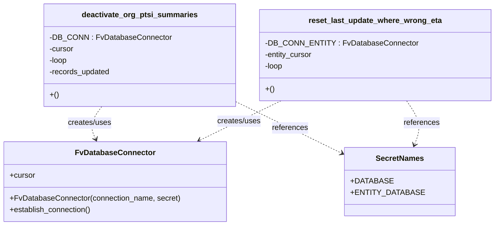

# Diagram: entity_core/entity_service/entity_service_scripts/eta_bugfix_20210630.py


> Auto-generated by Obscura crawlers

## Diagram 1

```mermaid
flowchart TD
    Main["__main__"] --> Deactivate["deactivate_org_ptsi_summaries()"]
    Main --> ResetComment["# reset_last_update_where_wrong_eta() (commented out)"]
    Deactivate --> DBConn["FvDatabaseConnector('eta_bug_fix', SecretNames.DATABASE)"]
    DBConn --> Establish["establish_connection()"]
    DBConn --> Cursor["cursor"]
    Deactivate --> Loop1["while loop"]
    Loop1 --> PrepareSQL1["prepare SQL (UPDATE eta_summary ... LIMIT 1000 RETURNING id)"]
    PrepareSQL1 --> Exec1["cursor.execute(sql)"]
    Exec1 --> Fetch1["res = cursor.fetchall()"]
    Fetch1 --> UpdateCount["records_updated += len(res)"]
    UpdateCount --> Print1["print(f\"records updated: {records_updated}\")"]
    Fetch1 --> Check1{"len(res) < 1000?"}
    Check1 -- yes --> EndLoop1["loop = False"]
    Check1 -- no --> Loop1
    ResetComment -.-> ResetFunc["reset_last_update_where_wrong_eta() (not invoked)"]
    ResetFunc --> DBConnE["FvDatabaseConnector('eta_bug_fix', SecretNames.ENTITY_DATABASE)"]
    DBConnE --> EstablishE["establish_connection()"]
    DBConnE --> EntityCursor["entity_cursor"]
    ResetFunc --> Loop2["while loop"]
    Loop2 --> PrepareSQL2["prepare SQL (UPDATE entity ... LIMIT 100 RETURNING id)"]
    PrepareSQL2 --> Exec2["entity_cursor.execute(sql)"]
    Exec2 --> Fetch2["res = entity_cursor.fetchall()"]
    Fetch2 --> Print2["print(len(res))"]
    Fetch2 --> Check2{"len(res) < 100?"}
    Check2 -- yes --> EndLoop2["loop = False"]
    Check2 -- no --> Loop2
```

> SVG rendering failed for this diagram.

## Diagram 2



### SVG

<svg id="container" width="1001.90234375" xmlns="http://www.w3.org/2000/svg" class="classDiagram" height="474" viewBox="0 0 1001.90234375 474" role="graphics-document document" aria-roledescription="class"><style>#container{font-family:"trebuchet ms",verdana,arial,sans-serif;font-size:16px;fill:#333;}@keyframes edge-animation-frame{from{stroke-dashoffset:0;}}@keyframes dash{to{stroke-dashoffset:0;}}#container .edge-animation-slow{stroke-dasharray:9,5!important;stroke-dashoffset:900;animation:dash 50s linear infinite;stroke-linecap:round;}#container .edge-animation-fast{stroke-dasharray:9,5!important;stroke-dashoffset:900;animation:dash 20s linear infinite;stroke-linecap:round;}#container .error-icon{fill:#552222;}#container .error-text{fill:#552222;stroke:#552222;}#container .edge-thickness-normal{stroke-width:1px;}#container .edge-thickness-thick{stroke-width:3.5px;}#container .edge-pattern-solid{stroke-dasharray:0;}#container .edge-thickness-invisible{stroke-width:0;fill:none;}#container .edge-pattern-dashed{stroke-dasharray:3;}#container .edge-pattern-dotted{stroke-dasharray:2;}#container .marker{fill:#333333;stroke:#333333;}#container .marker.cross{stroke:#333333;}#container svg{font-family:"trebuchet ms",verdana,arial,sans-serif;font-size:16px;}#container p{margin:0;}#container g.classGroup text{fill:#9370DB;stroke:none;font-family:"trebuchet ms",verdana,arial,sans-serif;font-size:10px;}#container g.classGroup text .title{font-weight:bolder;}#container .nodeLabel,#container .edgeLabel{color:#131300;}#container .edgeLabel .label rect{fill:#ECECFF;}#container .label text{fill:#131300;}#container .labelBkg{background:#ECECFF;}#container .edgeLabel .label span{background:#ECECFF;}#container .classTitle{font-weight:bolder;}#container .node rect,#container .node circle,#container .node ellipse,#container .node polygon,#container .node path{fill:#ECECFF;stroke:#9370DB;stroke-width:1px;}#container .divider{stroke:#9370DB;stroke-width:1;}#container g.clickable{cursor:pointer;}#container g.classGroup rect{fill:#ECECFF;stroke:#9370DB;}#container g.classGroup line{stroke:#9370DB;stroke-width:1;}#container .classLabel .box{stroke:none;stroke-width:0;fill:#ECECFF;opacity:0.5;}#container .classLabel .label{fill:#9370DB;font-size:10px;}#container .relation{stroke:#333333;stroke-width:1;fill:none;}#container .dashed-line{stroke-dasharray:3;}#container .dotted-line{stroke-dasharray:1 2;}#container #compositionStart,#container .composition{fill:#333333!important;stroke:#333333!important;stroke-width:1;}#container #compositionEnd,#container .composition{fill:#333333!important;stroke:#333333!important;stroke-width:1;}#container #dependencyStart,#container .dependency{fill:#333333!important;stroke:#333333!important;stroke-width:1;}#container #dependencyStart,#container .dependency{fill:#333333!important;stroke:#333333!important;stroke-width:1;}#container #extensionStart,#container .extension{fill:transparent!important;stroke:#333333!important;stroke-width:1;}#container #extensionEnd,#container .extension{fill:transparent!important;stroke:#333333!important;stroke-width:1;}#container #aggregationStart,#container .aggregation{fill:transparent!important;stroke:#333333!important;stroke-width:1;}#container #aggregationEnd,#container .aggregation{fill:transparent!important;stroke:#333333!important;stroke-width:1;}#container #lollipopStart,#container .lollipop{fill:#ECECFF!important;stroke:#333333!important;stroke-width:1;}#container #lollipopEnd,#container .lollipop{fill:#ECECFF!important;stroke:#333333!important;stroke-width:1;}#container .edgeTerminals{font-size:11px;line-height:initial;}#container .classTitleText{text-anchor:middle;font-size:18px;fill:#333;}#container .label-icon{display:inline-block;height:1em;overflow:visible;vertical-align:-0.125em;}#container .node .label-icon path{fill:currentColor;stroke:revert;stroke-width:revert;}#container :root{--mermaid-font-family:"trebuchet ms",verdana,arial,sans-serif;}</style><g><defs><marker id="container_class-aggregationStart" class="marker aggregation class" refX="18" refY="7" markerWidth="190" markerHeight="240" orient="auto"><path d="M 18,7 L9,13 L1,7 L9,1 Z"></path></marker></defs><defs><marker id="container_class-aggregationEnd" class="marker aggregation class" refX="1" refY="7" markerWidth="20" markerHeight="28" orient="auto"><path d="M 18,7 L9,13 L1,7 L9,1 Z"></path></marker></defs><defs><marker id="container_class-extensionStart" class="marker extension class" refX="18" refY="7" markerWidth="190" markerHeight="240" orient="auto"><path d="M 1,7 L18,13 V 1 Z"></path></marker></defs><defs><marker id="container_class-extensionEnd" class="marker extension class" refX="1" refY="7" markerWidth="20" markerHeight="28" orient="auto"><path d="M 1,1 V 13 L18,7 Z"></path></marker></defs><defs><marker id="container_class-compositionStart" class="marker composition class" refX="18" refY="7" markerWidth="190" markerHeight="240" orient="auto"><path d="M 18,7 L9,13 L1,7 L9,1 Z"></path></marker></defs><defs><marker id="container_class-compositionEnd" class="marker composition class" refX="1" refY="7" markerWidth="20" markerHeight="28" orient="auto"><path d="M 18,7 L9,13 L1,7 L9,1 Z"></path></marker></defs><defs><marker id="container_class-dependencyStart" class="marker dependency class" refX="6" refY="7" markerWidth="190" markerHeight="240" orient="auto"><path d="M 5,7 L9,13 L1,7 L9,1 Z"></path></marker></defs><defs><marker id="container_class-dependencyEnd" class="marker dependency class" refX="13" refY="7" markerWidth="20" markerHeight="28" orient="auto"><path d="M 18,7 L9,13 L14,7 L9,1 Z"></path></marker></defs><defs><marker id="container_class-lollipopStart" class="marker lollipop class" refX="13" refY="7" markerWidth="190" markerHeight="240" orient="auto"><circle stroke="black" fill="transparent" cx="7" cy="7" r="6"></circle></marker></defs><defs><marker id="container_class-lollipopEnd" class="marker lollipop class" refX="1" refY="7" markerWidth="190" markerHeight="240" orient="auto"><circle stroke="black" fill="transparent" cx="7" cy="7" r="6"></circle></marker></defs><g class="root"><g class="clusters"></g><g class="edgePaths"><path d="M209.113,224L204.487,230.167C199.861,236.333,190.608,248.667,188.442,260.094C186.275,271.522,191.195,282.043,193.655,287.304L196.115,292.565" id="id_deactivate_org_ptsi_summaries_FvDatabaseConnector_1" class="edge-thickness-normal edge-pattern-dashed relation" style=";;;" data-edge="true" data-et="edge" data-id="id_deactivate_org_ptsi_summaries_FvDatabaseConnector_1" data-points="W3sieCI6MjA5LjExMzQ0Mjg4NzkzMTAzLCJ5IjoyMjR9LHsieCI6MTgxLjM1NTQ2ODc1LCJ5IjoyNjF9LHsieCI6MTk4LjY1NjIxNzcxNjk0MjE0LCJ5IjoyOTh9XQ==" marker-end="url(#container_class-dependencyEnd)"></path><path d="M572.121,212L555.855,220.167C539.59,228.333,507.058,244.667,479.625,258.545C452.192,272.423,429.857,283.845,418.69,289.557L407.522,295.268" id="id_reset_last_update_where_wrong_eta_FvDatabaseConnector_2" class="edge-thickness-normal edge-pattern-dashed relation" style=";;;" data-edge="true" data-et="edge" data-id="id_reset_last_update_where_wrong_eta_FvDatabaseConnector_2" data-points="W3sieCI6NTcyLjEyMDc3MDQ3NDEzOCwieSI6MjEyfSx7IngiOjQ3NC41MjczNDM3NSwieSI6MjYxfSx7IngiOjQwMi4xODA0OTQ1NzY0NDYzLCJ5IjoyOTh9XQ==" marker-end="url(#container_class-dependencyEnd)"></path><path d="M482.746,212.706L498.777,220.755C514.809,228.804,546.871,244.902,584.123,263.804C621.374,282.705,663.815,304.41,685.035,315.263L706.256,326.116" id="id_deactivate_org_ptsi_summaries_SecretNames_3" class="edge-thickness-normal edge-pattern-dashed relation" style=";;;" data-edge="true" data-et="edge" data-id="id_deactivate_org_ptsi_summaries_SecretNames_3" data-points="W3sieCI6NDgyLjc0NjA5Mzc1LCJ5IjoyMTIuNzA1ODkxOTAwNjY1NDh9LHsieCI6NTc4LjkzMzU5Mzc1LCJ5IjoyNjF9LHsieCI6NzExLjU5NzY1NjI1LCJ5IjozMjguODQ3NzQxMzgxNTg3NjR9XQ==" marker-end="url(#container_class-dependencyEnd)"></path><path d="M829.552,212L835.186,220.167C840.82,228.333,852.088,244.667,854.861,260.07C857.635,275.473,851.914,289.947,849.053,297.183L846.193,304.42" id="id_reset_last_update_where_wrong_eta_SecretNames_4" class="edge-thickness-normal edge-pattern-dashed relation" style=";;;" data-edge="true" data-et="edge" data-id="id_reset_last_update_where_wrong_eta_SecretNames_4" data-points="W3sieCI6ODI5LjU1MTgwNDk1Njg5NjYsInkiOjIxMn0seyJ4Ijo4NjMuMzU1NDY4NzUsInkiOjI2MX0seyJ4Ijo4NDMuOTg3MDU0NDkzODAxNywieSI6MzEwfV0=" marker-end="url(#container_class-dependencyEnd)"></path></g><g class="edgeLabels"><g class="edgeLabel" transform="translate(182.9787, 258.83632)"><g class="label" data-id="id_deactivate_org_ptsi_summaries_FvDatabaseConnector_1" transform="translate(-46.578125, -12)"><foreignObject width="93.15625" height="24"><div xmlns="http://www.w3.org/1999/xhtml" class="labelBkg" style="display: table-cell; white-space: nowrap; line-height: 1.5; max-width: 200px; text-align: center;"><span class="edgeLabel"><p>creates/uses</p></span></div></foreignObject></g></g><g class="edgeLabel" transform="translate(487.01412, 254.7306)"><g class="label" data-id="id_reset_last_update_where_wrong_eta_FvDatabaseConnector_2" transform="translate(-46.578125, -12)"><foreignObject width="93.15625" height="24"><div xmlns="http://www.w3.org/1999/xhtml" class="labelBkg" style="display: table-cell; white-space: nowrap; line-height: 1.5; max-width: 200px; text-align: center;"><span class="edgeLabel"><p>creates/uses</p></span></div></foreignObject></g></g><g class="edgeLabel" transform="translate(597.35269, 270.41999)"><g class="label" data-id="id_deactivate_org_ptsi_summaries_SecretNames_3" transform="translate(-37.828125, -12)"><foreignObject width="75.65625" height="24"><div xmlns="http://www.w3.org/1999/xhtml" class="labelBkg" style="display: table-cell; white-space: nowrap; line-height: 1.5; max-width: 200px; text-align: center;"><span class="edgeLabel"><p>references</p></span></div></foreignObject></g></g><g class="edgeLabel" transform="translate(861.41346, 258.18496)"><g class="label" data-id="id_reset_last_update_where_wrong_eta_SecretNames_4" transform="translate(-37.828125, -12)"><foreignObject width="75.65625" height="24"><div xmlns="http://www.w3.org/1999/xhtml" class="labelBkg" style="display: table-cell; white-space: nowrap; line-height: 1.5; max-width: 200px; text-align: center;"><span class="edgeLabel"><p>references</p></span></div></foreignObject></g></g></g><g class="nodes"><g class="node default" id="classId-FvDatabaseConnector-0" transform="translate(237.93359375, 382)"><g class="basic label-container"><path d="M-229.93359375 -84 L229.93359375 -84 L229.93359375 84 L-229.93359375 84" stroke="none" stroke-width="0" fill="#ECECFF" style=""></path><path d="M-229.93359375 -84 C-104.09094826262134 -84, 21.751697224757322 -84, 229.93359375 -84 M-229.93359375 -84 C-55.553996263507 -84, 118.825601222986 -84, 229.93359375 -84 M229.93359375 -84 C229.93359375 -42.912817202701625, 229.93359375 -1.8256344054032496, 229.93359375 84 M229.93359375 -84 C229.93359375 -40.06917711847225, 229.93359375 3.861645763055506, 229.93359375 84 M229.93359375 84 C75.18041219665167 84, -79.57276935669665 84, -229.93359375 84 M229.93359375 84 C126.84055460182572 84, 23.74751545365143 84, -229.93359375 84 M-229.93359375 84 C-229.93359375 48.38609722942625, -229.93359375 12.772194458852496, -229.93359375 -84 M-229.93359375 84 C-229.93359375 24.53144524824689, -229.93359375 -34.93710950350622, -229.93359375 -84" stroke="#9370DB" stroke-width="1.3" fill="none" stroke-dasharray="0 0" style=""></path></g><g class="annotation-group text" transform="translate(0, -60)"></g><g class="label-group text" transform="translate(-79.3046875, -60)"><g class="label" style="font-weight: bolder" transform="translate(0,-12)"><foreignObject width="158.609375" height="24"><div xmlns="http://www.w3.org/1999/xhtml" style="display: table-cell; white-space: nowrap; line-height: 1.5; max-width: 207px; text-align: center;"><span class="nodeLabel markdown-node-label" style=""><p>FvDatabaseConnector</p></span></div></foreignObject></g></g><g class="members-group text" transform="translate(-217.93359375, -12)"><g class="label" style="" transform="translate(0,-12)"><foreignObject width="53.71875" height="24"><div xmlns="http://www.w3.org/1999/xhtml" style="display: table-cell; white-space: nowrap; line-height: 1.5; max-width: 112px; text-align: center;"><span class="nodeLabel markdown-node-label" style=""><p>+cursor</p></span></div></foreignObject></g></g><g class="methods-group text" transform="translate(-217.93359375, 36)"><g class="label" style="" transform="translate(0,-12)"><foreignObject width="356.5625" height="24"><div xmlns="http://www.w3.org/1999/xhtml" style="display: table-cell; white-space: nowrap; line-height: 1.5; max-width: 414px; text-align: center;"><span class="nodeLabel markdown-node-label" style=""><p>+FvDatabaseConnector(connection_name, secret)</p></span></div></foreignObject></g><g class="label" style="" transform="translate(0,12)"><foreignObject width="173.265625" height="24"><div xmlns="http://www.w3.org/1999/xhtml" style="display: table-cell; white-space: nowrap; line-height: 1.5; max-width: 231px; text-align: center;"><span class="nodeLabel markdown-node-label" style=""><p>+establish_connection()</p></span></div></foreignObject></g></g><g class="divider" style=""><path d="M-229.93359375 -36 C-71.89456039041465 -36, 86.14447296917069 -36, 229.93359375 -36 M-229.93359375 -36 C-112.2080867888347 -36, 5.5174201723305885 -36, 229.93359375 -36" stroke="#9370DB" stroke-width="1.3" fill="none" stroke-dasharray="0 0" style=""></path></g><g class="divider" style=""><path d="M-229.93359375 12 C-78.47599106913262 12, 72.98161161173476 12, 229.93359375 12 M-229.93359375 12 C-55.643073084261715 12, 118.64744758147657 12, 229.93359375 12" stroke="#9370DB" stroke-width="1.3" fill="none" stroke-dasharray="0 0" style=""></path></g></g><g class="node default" id="classId-SecretNames-1" transform="translate(815.52734375, 382)"><g class="basic label-container"><path d="M-103.9296875 -72 L103.9296875 -72 L103.9296875 72 L-103.9296875 72" stroke="none" stroke-width="0" fill="#ECECFF" style=""></path><path d="M-103.9296875 -72 C-48.258846897034125 -72, 7.411993705931749 -72, 103.9296875 -72 M-103.9296875 -72 C-31.38023807878976 -72, 41.16921134242048 -72, 103.9296875 -72 M103.9296875 -72 C103.9296875 -25.507631094970932, 103.9296875 20.984737810058135, 103.9296875 72 M103.9296875 -72 C103.9296875 -17.07317785611309, 103.9296875 37.85364428777382, 103.9296875 72 M103.9296875 72 C55.18291647853516 72, 6.4361454570703245 72, -103.9296875 72 M103.9296875 72 C26.495992536659088 72, -50.937702426681824 72, -103.9296875 72 M-103.9296875 72 C-103.9296875 39.435437967367, -103.9296875 6.870875934734002, -103.9296875 -72 M-103.9296875 72 C-103.9296875 38.50045538385507, -103.9296875 5.000910767710138, -103.9296875 -72" stroke="#9370DB" stroke-width="1.3" fill="none" stroke-dasharray="0 0" style=""></path></g><g class="annotation-group text" transform="translate(0, -48)"></g><g class="label-group text" transform="translate(-48.03125, -48)"><g class="label" style="font-weight: bolder" transform="translate(0,-12)"><foreignObject width="96.0625" height="24"><div xmlns="http://www.w3.org/1999/xhtml" style="display: table-cell; white-space: nowrap; line-height: 1.5; max-width: 145px; text-align: center;"><span class="nodeLabel markdown-node-label" style=""><p>SecretNames</p></span></div></foreignObject></g></g><g class="members-group text" transform="translate(-91.9296875, 0)"><g class="label" style="" transform="translate(0,-12)"><foreignObject width="79.234375" height="24"><div xmlns="http://www.w3.org/1999/xhtml" style="display: table-cell; white-space: nowrap; line-height: 1.5; max-width: 137px; text-align: center;"><span class="nodeLabel markdown-node-label" style=""><p>+DATABASE</p></span></div></foreignObject></g><g class="label" style="" transform="translate(0,12)"><foreignObject width="135.828125" height="24"><div xmlns="http://www.w3.org/1999/xhtml" style="display: table-cell; white-space: nowrap; line-height: 1.5; max-width: 193px; text-align: center;"><span class="nodeLabel markdown-node-label" style=""><p>+ENTITY_DATABASE</p></span></div></foreignObject></g></g><g class="methods-group text" transform="translate(-91.9296875, 72)"></g><g class="divider" style=""><path d="M-103.9296875 -24 C-53.05318351037934 -24, -2.1766795207586824 -24, 103.9296875 -24 M-103.9296875 -24 C-50.03890793652825 -24, 3.851871626943506 -24, 103.9296875 -24" stroke="#9370DB" stroke-width="1.3" fill="none" stroke-dasharray="0 0" style=""></path></g><g class="divider" style=""><path d="M-103.9296875 48 C-44.1858194964708 48, 15.558048507058402 48, 103.9296875 48 M-103.9296875 48 C-38.858414428889716 48, 26.212858642220567 48, 103.9296875 48" stroke="#9370DB" stroke-width="1.3" fill="none" stroke-dasharray="0 0" style=""></path></g></g><g class="node default" id="classId-deactivate_org_ptsi_summaries-2" transform="translate(290.13671875, 116)"><g class="basic label-container"><path d="M-192.609375 -108 L192.609375 -108 L192.609375 108 L-192.609375 108" stroke="none" stroke-width="0" fill="#ECECFF" style=""></path><path d="M-192.609375 -108 C-56.73382207678287 -108, 79.14173084643426 -108, 192.609375 -108 M-192.609375 -108 C-112.73488539531043 -108, -32.860395790620856 -108, 192.609375 -108 M192.609375 -108 C192.609375 -33.89875293758777, 192.609375 40.202494124824455, 192.609375 108 M192.609375 -108 C192.609375 -22.065852413370038, 192.609375 63.868295173259924, 192.609375 108 M192.609375 108 C49.115612009890526 108, -94.37815098021895 108, -192.609375 108 M192.609375 108 C82.4213324576564 108, -27.76671008468719 108, -192.609375 108 M-192.609375 108 C-192.609375 60.592309265123916, -192.609375 13.184618530247832, -192.609375 -108 M-192.609375 108 C-192.609375 33.900240820536354, -192.609375 -40.19951835892729, -192.609375 -108" stroke="#9370DB" stroke-width="1.3" fill="none" stroke-dasharray="0 0" style=""></path></g><g class="annotation-group text" transform="translate(0, -84)"></g><g class="label-group text" transform="translate(-116.859375, -84)"><g class="label" style="font-weight: bolder" transform="translate(0,-12)"><foreignObject width="233.71875" height="24"><div xmlns="http://www.w3.org/1999/xhtml" style="display: table-cell; white-space: nowrap; line-height: 1.5; max-width: 280px; text-align: center;"><span class="nodeLabel markdown-node-label" style=""><p>deactivate_org_ptsi_summaries</p></span></div></foreignObject></g></g><g class="members-group text" transform="translate(-180.609375, -36)"><g class="label" style="" transform="translate(0,-12)"><foreignObject width="244.359375" height="24"><div xmlns="http://www.w3.org/1999/xhtml" style="display: table-cell; white-space: nowrap; line-height: 1.5; max-width: 303px; text-align: center;"><span class="nodeLabel markdown-node-label" style=""><p>-DB_CONN : FvDatabaseConnector</p></span></div></foreignObject></g><g class="label" style="" transform="translate(0,12)"><foreignObject width="52.1875" height="24"><div xmlns="http://www.w3.org/1999/xhtml" style="display: table-cell; white-space: nowrap; line-height: 1.5; max-width: 110px; text-align: center;"><span class="nodeLabel markdown-node-label" style=""><p>-cursor</p></span></div></foreignObject></g><g class="label" style="" transform="translate(0,36)"><foreignObject width="39.25" height="24"><div xmlns="http://www.w3.org/1999/xhtml" style="display: table-cell; white-space: nowrap; line-height: 1.5; max-width: 97px; text-align: center;"><span class="nodeLabel markdown-node-label" style=""><p>-loop</p></span></div></foreignObject></g><g class="label" style="" transform="translate(0,60)"><foreignObject width="128.875" height="24"><div xmlns="http://www.w3.org/1999/xhtml" style="display: table-cell; white-space: nowrap; line-height: 1.5; max-width: 186px; text-align: center;"><span class="nodeLabel markdown-node-label" style=""><p>-records_updated</p></span></div></foreignObject></g></g><g class="methods-group text" transform="translate(-180.609375, 84)"><g class="label" style="" transform="translate(0,-12)"><foreignObject width="18.359375" height="24"><div xmlns="http://www.w3.org/1999/xhtml" style="display: table-cell; white-space: nowrap; line-height: 1.5; max-width: 68px; text-align: center;"><span class="nodeLabel markdown-node-label" style=""><p>+()</p></span></div></foreignObject></g></g><g class="divider" style=""><path d="M-192.609375 -60 C-61.393753999420284 -60, 69.82186700115943 -60, 192.609375 -60 M-192.609375 -60 C-103.05489957531785 -60, -13.500424150635695 -60, 192.609375 -60" stroke="#9370DB" stroke-width="1.3" fill="none" stroke-dasharray="0 0" style=""></path></g><g class="divider" style=""><path d="M-192.609375 60 C-49.784489537621965 60, 93.04039592475607 60, 192.609375 60 M-192.609375 60 C-100.51202928791405 60, -8.414683575828093 60, 192.609375 60" stroke="#9370DB" stroke-width="1.3" fill="none" stroke-dasharray="0 0" style=""></path></g></g><g class="node default" id="classId-reset_last_update_where_wrong_eta-3" transform="translate(763.32421875, 116)"><g class="basic label-container"><path d="M-230.578125 -96 L230.578125 -96 L230.578125 96 L-230.578125 96" stroke="none" stroke-width="0" fill="#ECECFF" style=""></path><path d="M-230.578125 -96 C-69.47131070833026 -96, 91.63550358333947 -96, 230.578125 -96 M-230.578125 -96 C-55.96542431960032 -96, 118.64727636079937 -96, 230.578125 -96 M230.578125 -96 C230.578125 -51.32151112674117, 230.578125 -6.643022253482343, 230.578125 96 M230.578125 -96 C230.578125 -44.42240088582537, 230.578125 7.1551982283492634, 230.578125 96 M230.578125 96 C131.0190636249963 96, 31.46000224999264 96, -230.578125 96 M230.578125 96 C58.19700976263374 96, -114.18410547473252 96, -230.578125 96 M-230.578125 96 C-230.578125 34.12816051044855, -230.578125 -27.743678979102896, -230.578125 -96 M-230.578125 96 C-230.578125 33.42782664371275, -230.578125 -29.144346712574503, -230.578125 -96" stroke="#9370DB" stroke-width="1.3" fill="none" stroke-dasharray="0 0" style=""></path></g><g class="annotation-group text" transform="translate(0, -72)"></g><g class="label-group text" transform="translate(-134.921875, -72)"><g class="label" style="font-weight: bolder" transform="translate(0,-12)"><foreignObject width="269.84375" height="24"><div xmlns="http://www.w3.org/1999/xhtml" style="display: table-cell; white-space: nowrap; line-height: 1.5; max-width: 315px; text-align: center;"><span class="nodeLabel markdown-node-label" style=""><p>reset_last_update_where_wrong_eta</p></span></div></foreignObject></g></g><g class="members-group text" transform="translate(-218.578125, -24)"><g class="label" style="" transform="translate(0,-12)"><foreignObject width="302.234375" height="24"><div xmlns="http://www.w3.org/1999/xhtml" style="display: table-cell; white-space: nowrap; line-height: 1.5; max-width: 360px; text-align: center;"><span class="nodeLabel markdown-node-label" style=""><p>-DB_CONN_ENTITY : FvDatabaseConnector</p></span></div></foreignObject></g><g class="label" style="" transform="translate(0,12)"><foreignObject width="101.65625" height="24"><div xmlns="http://www.w3.org/1999/xhtml" style="display: table-cell; white-space: nowrap; line-height: 1.5; max-width: 160px; text-align: center;"><span class="nodeLabel markdown-node-label" style=""><p>-entity_cursor</p></span></div></foreignObject></g><g class="label" style="" transform="translate(0,36)"><foreignObject width="39.25" height="24"><div xmlns="http://www.w3.org/1999/xhtml" style="display: table-cell; white-space: nowrap; line-height: 1.5; max-width: 97px; text-align: center;"><span class="nodeLabel markdown-node-label" style=""><p>-loop</p></span></div></foreignObject></g></g><g class="methods-group text" transform="translate(-218.578125, 72)"><g class="label" style="" transform="translate(0,-12)"><foreignObject width="18.359375" height="24"><div xmlns="http://www.w3.org/1999/xhtml" style="display: table-cell; white-space: nowrap; line-height: 1.5; max-width: 68px; text-align: center;"><span class="nodeLabel markdown-node-label" style=""><p>+()</p></span></div></foreignObject></g></g><g class="divider" style=""><path d="M-230.578125 -48 C-89.59130165595857 -48, 51.39552168808285 -48, 230.578125 -48 M-230.578125 -48 C-82.7233540826868 -48, 65.1314168346264 -48, 230.578125 -48" stroke="#9370DB" stroke-width="1.3" fill="none" stroke-dasharray="0 0" style=""></path></g><g class="divider" style=""><path d="M-230.578125 48 C-56.29929818592589 48, 117.97952862814822 48, 230.578125 48 M-230.578125 48 C-59.9795275926011 48, 110.6190698147978 48, 230.578125 48" stroke="#9370DB" stroke-width="1.3" fill="none" stroke-dasharray="0 0" style=""></path></g></g></g></g></g></svg>
