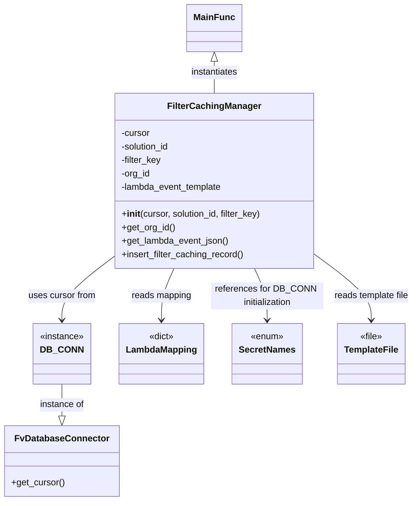

# Diagram: entity_core/entity_service/entity_service_scripts/filter_caching/add_filter_caching.py


> Auto-generated by Obscura crawlers

## Diagram 1

```mermaid
flowchart TD
    Main[main()] --> ParseArgs[parse_args()]
    ParseArgs --> Validate{solution_id matches /^[A-Za-z0-9_]+$/}
    Validate -- valid --> Instantiate[create FilterCachingManager]
    Instantiate --> GetOrg[get_org_id()]
    GetOrg --> DBExecute[DB cursor.execute(SELECT organizations_id ...)]
    DBExecute --> Fetch[fetchone() -> organizations_id]
    Instantiate --> GetTemplate[get_lambda_event_json()]
    GetTemplate --> OpenFile[open template file templates/{filter_key}_template.json]
    OpenFile --> LoadAndReplace[json.load -> json.dumps -> replace %(solution_id)s and %(org_id)s]
    Instantiate --> InsertRecord[insert_filter_caching_record()]
    InsertRecord --> BuildQuery[build INSERT with lambda_event_template]
    BuildQuery --> MapLookup[lookup lambda_mapping[filter_key] (lambda_function, query_time, data_source)]
    BuildQuery --> CursorExec[cursor.execute(query, data)]
    CursorExec --> End[complete]
```

> SVG rendering failed for this diagram.

## Diagram 2



### SVG

<svg id="container" width="727.87890625" xmlns="http://www.w3.org/2000/svg" class="classDiagram" height="892" viewBox="0 0 727.87890625 892" role="graphics-document document" aria-roledescription="class"><style>#container{font-family:"trebuchet ms",verdana,arial,sans-serif;font-size:16px;fill:#333;}@keyframes edge-animation-frame{from{stroke-dashoffset:0;}}@keyframes dash{to{stroke-dashoffset:0;}}#container .edge-animation-slow{stroke-dasharray:9,5!important;stroke-dashoffset:900;animation:dash 50s linear infinite;stroke-linecap:round;}#container .edge-animation-fast{stroke-dasharray:9,5!important;stroke-dashoffset:900;animation:dash 20s linear infinite;stroke-linecap:round;}#container .error-icon{fill:#552222;}#container .error-text{fill:#552222;stroke:#552222;}#container .edge-thickness-normal{stroke-width:1px;}#container .edge-thickness-thick{stroke-width:3.5px;}#container .edge-pattern-solid{stroke-dasharray:0;}#container .edge-thickness-invisible{stroke-width:0;fill:none;}#container .edge-pattern-dashed{stroke-dasharray:3;}#container .edge-pattern-dotted{stroke-dasharray:2;}#container .marker{fill:#333333;stroke:#333333;}#container .marker.cross{stroke:#333333;}#container svg{font-family:"trebuchet ms",verdana,arial,sans-serif;font-size:16px;}#container p{margin:0;}#container g.classGroup text{fill:#9370DB;stroke:none;font-family:"trebuchet ms",verdana,arial,sans-serif;font-size:10px;}#container g.classGroup text .title{font-weight:bolder;}#container .nodeLabel,#container .edgeLabel{color:#131300;}#container .edgeLabel .label rect{fill:#ECECFF;}#container .label text{fill:#131300;}#container .labelBkg{background:#ECECFF;}#container .edgeLabel .label span{background:#ECECFF;}#container .classTitle{font-weight:bolder;}#container .node rect,#container .node circle,#container .node ellipse,#container .node polygon,#container .node path{fill:#ECECFF;stroke:#9370DB;stroke-width:1px;}#container .divider{stroke:#9370DB;stroke-width:1;}#container g.clickable{cursor:pointer;}#container g.classGroup rect{fill:#ECECFF;stroke:#9370DB;}#container g.classGroup line{stroke:#9370DB;stroke-width:1;}#container .classLabel .box{stroke:none;stroke-width:0;fill:#ECECFF;opacity:0.5;}#container .classLabel .label{fill:#9370DB;font-size:10px;}#container .relation{stroke:#333333;stroke-width:1;fill:none;}#container .dashed-line{stroke-dasharray:3;}#container .dotted-line{stroke-dasharray:1 2;}#container #compositionStart,#container .composition{fill:#333333!important;stroke:#333333!important;stroke-width:1;}#container #compositionEnd,#container .composition{fill:#333333!important;stroke:#333333!important;stroke-width:1;}#container #dependencyStart,#container .dependency{fill:#333333!important;stroke:#333333!important;stroke-width:1;}#container #dependencyStart,#container .dependency{fill:#333333!important;stroke:#333333!important;stroke-width:1;}#container #extensionStart,#container .extension{fill:transparent!important;stroke:#333333!important;stroke-width:1;}#container #extensionEnd,#container .extension{fill:transparent!important;stroke:#333333!important;stroke-width:1;}#container #aggregationStart,#container .aggregation{fill:transparent!important;stroke:#333333!important;stroke-width:1;}#container #aggregationEnd,#container .aggregation{fill:transparent!important;stroke:#333333!important;stroke-width:1;}#container #lollipopStart,#container .lollipop{fill:#ECECFF!important;stroke:#333333!important;stroke-width:1;}#container #lollipopEnd,#container .lollipop{fill:#ECECFF!important;stroke:#333333!important;stroke-width:1;}#container .edgeTerminals{font-size:11px;line-height:initial;}#container .classTitleText{text-anchor:middle;font-size:18px;fill:#333;}#container .label-icon{display:inline-block;height:1em;overflow:visible;vertical-align:-0.125em;}#container .node .label-icon path{fill:currentColor;stroke:revert;stroke-width:revert;}#container :root{--mermaid-font-family:"trebuchet ms",verdana,arial,sans-serif;}</style><g><defs><marker id="container_class-aggregationStart" class="marker aggregation class" refX="18" refY="7" markerWidth="190" markerHeight="240" orient="auto"><path d="M 18,7 L9,13 L1,7 L9,1 Z"></path></marker></defs><defs><marker id="container_class-aggregationEnd" class="marker aggregation class" refX="1" refY="7" markerWidth="20" markerHeight="28" orient="auto"><path d="M 18,7 L9,13 L1,7 L9,1 Z"></path></marker></defs><defs><marker id="container_class-extensionStart" class="marker extension class" refX="18" refY="7" markerWidth="190" markerHeight="240" orient="auto"><path d="M 1,7 L18,13 V 1 Z"></path></marker></defs><defs><marker id="container_class-extensionEnd" class="marker extension class" refX="1" refY="7" markerWidth="20" markerHeight="28" orient="auto"><path d="M 1,1 V 13 L18,7 Z"></path></marker></defs><defs><marker id="container_class-compositionStart" class="marker composition class" refX="18" refY="7" markerWidth="190" markerHeight="240" orient="auto"><path d="M 18,7 L9,13 L1,7 L9,1 Z"></path></marker></defs><defs><marker id="container_class-compositionEnd" class="marker composition class" refX="1" refY="7" markerWidth="20" markerHeight="28" orient="auto"><path d="M 18,7 L9,13 L1,7 L9,1 Z"></path></marker></defs><defs><marker id="container_class-dependencyStart" class="marker dependency class" refX="6" refY="7" markerWidth="190" markerHeight="240" orient="auto"><path d="M 5,7 L9,13 L1,7 L9,1 Z"></path></marker></defs><defs><marker id="container_class-dependencyEnd" class="marker dependency class" refX="13" refY="7" markerWidth="20" markerHeight="28" orient="auto"><path d="M 18,7 L9,13 L14,7 L9,1 Z"></path></marker></defs><defs><marker id="container_class-lollipopStart" class="marker lollipop class" refX="13" refY="7" markerWidth="190" markerHeight="240" orient="auto"><circle stroke="black" fill="transparent" cx="7" cy="7" r="6"></circle></marker></defs><defs><marker id="container_class-lollipopEnd" class="marker lollipop class" refX="1" refY="7" markerWidth="190" markerHeight="240" orient="auto"><circle stroke="black" fill="transparent" cx="7" cy="7" r="6"></circle></marker></defs><g class="root"><g class="clusters"></g><g class="edgePaths"><path d="M372.484,109.25L372.484,112.542C372.484,115.833,372.484,122.417,372.484,131.875C372.484,141.333,372.484,153.667,372.484,159.833L372.484,166" id="id_MainFunc_FilterCachingManager_1" class="edge-thickness-normal edge-pattern-solid relation" style=";;;" data-edge="true" data-et="edge" data-id="id_MainFunc_FilterCachingManager_1" data-points="W3sieCI6MzcyLjQ4NDM3NSwieSI6OTJ9LHsieCI6MzcyLjQ4NDM3NSwieSI6MTI5fSx7IngiOjM3Mi40ODQzNzUsInkiOjE2Nn1d" marker-start="url(#container_class-extensionStart)"></path><path d="M195.23,458.857L180.521,470.214C165.811,481.571,136.392,504.286,121.682,522.809C106.973,541.333,106.973,555.667,106.973,562.833L106.973,570" id="id_FilterCachingManager_DB_CONN_2" class="edge-thickness-normal edge-pattern-solid relation" style=";;;" data-edge="true" data-et="edge" data-id="id_FilterCachingManager_DB_CONN_2" data-points="W3sieCI6MTk1LjIzMDQ2ODc1LCJ5Ijo0NTguODU2Njc0MTY5ODY2NTV9LHsieCI6MTA2Ljk3MjY1NjI1LCJ5Ijo1Mjd9LHsieCI6MTA2Ljk3MjY1NjI1LCJ5Ijo1NzZ9XQ==" marker-end="url(#container_class-dependencyEnd)"></path><path d="M106.973,684L106.973,690.167C106.973,696.333,106.973,708.667,106.973,718.125C106.973,727.583,106.973,734.167,106.973,737.458L106.973,740.75" id="id_DB_CONN_FvDatabaseConnector_3" class="edge-thickness-normal edge-pattern-solid relation" style=";;;" data-edge="true" data-et="edge" data-id="id_DB_CONN_FvDatabaseConnector_3" data-points="W3sieCI6MTA2Ljk3MjY1NjI1LCJ5Ijo2ODR9LHsieCI6MTA2Ljk3MjY1NjI1LCJ5Ijo3MjF9LHsieCI6MTA2Ljk3MjY1NjI1LCJ5Ijo3NTh9XQ==" marker-end="url(#container_class-extensionEnd)"></path><path d="M302.983,478L299.344,486.167C295.706,494.333,288.429,510.667,284.791,526C281.152,541.333,281.152,555.667,281.152,562.833L281.152,570" id="id_FilterCachingManager_LambdaMapping_4" class="edge-thickness-normal edge-pattern-solid relation" style=";;;" data-edge="true" data-et="edge" data-id="id_FilterCachingManager_LambdaMapping_4" data-points="W3sieCI6MzAyLjk4MjkyNjgyOTI2ODMsInkiOjQ3OH0seyJ4IjoyODEuMTUyMzQzNzUsInkiOjUyN30seyJ4IjoyODEuMTUyMzQzNzUsInkiOjU3Nn1d" marker-end="url(#container_class-dependencyEnd)"></path><path d="M549.738,452.071L566.757,464.559C583.775,477.047,617.811,502.024,634.829,521.678C651.848,541.333,651.848,555.667,651.848,562.833L651.848,570" id="id_FilterCachingManager_TemplateFile_5" class="edge-thickness-normal edge-pattern-solid relation" style=";;;" data-edge="true" data-et="edge" data-id="id_FilterCachingManager_TemplateFile_5" data-points="W3sieCI6NTQ5LjczODI4MTI1LCJ5Ijo0NTIuMDcwOTYyMTQ4ODU5NzN9LHsieCI6NjUxLjg0NzY1NjI1LCJ5Ijo1Mjd9LHsieCI6NjUxLjg0NzY1NjI1LCJ5Ijo1NzZ9XQ==" marker-end="url(#container_class-dependencyEnd)"></path><path d="M441.986,478L445.624,486.167C449.263,494.333,456.54,510.667,460.178,526C463.816,541.333,463.816,555.667,463.816,562.833L463.816,570" id="id_FilterCachingManager_SecretNames_6" class="edge-thickness-normal edge-pattern-solid relation" style=";;;" data-edge="true" data-et="edge" data-id="id_FilterCachingManager_SecretNames_6" data-points="W3sieCI6NDQxLjk4NTgyMzE3MDczMTcsInkiOjQ3OH0seyJ4Ijo0NjMuODE2NDA2MjUsInkiOjUyN30seyJ4Ijo0NjMuODE2NDA2MjUsInkiOjU3Nn1d" marker-end="url(#container_class-dependencyEnd)"></path></g><g class="edgeLabels"><g class="edgeLabel" transform="translate(372.484375, 129)"><g class="label" data-id="id_MainFunc_FilterCachingManager_1" transform="translate(-42.9140625, -12)"><foreignObject width="85.828125" height="24"><div xmlns="http://www.w3.org/1999/xhtml" class="labelBkg" style="display: table-cell; white-space: nowrap; line-height: 1.5; max-width: 200px; text-align: center;"><span class="edgeLabel"><p>instantiates</p></span></div></foreignObject></g></g><g class="edgeLabel" transform="translate(106.97265625, 527)"><g class="label" data-id="id_FilterCachingManager_DB_CONN_2" transform="translate(-60.6484375, -12)"><foreignObject width="121.296875" height="24"><div xmlns="http://www.w3.org/1999/xhtml" class="labelBkg" style="display: table-cell; white-space: nowrap; line-height: 1.5; max-width: 200px; text-align: center;"><span class="edgeLabel"><p>uses cursor from</p></span></div></foreignObject></g></g><g class="edgeLabel" transform="translate(106.97265625, 721)"><g class="label" data-id="id_DB_CONN_FvDatabaseConnector_3" transform="translate(-40.0546875, -12)"><foreignObject width="80.109375" height="24"><div xmlns="http://www.w3.org/1999/xhtml" class="labelBkg" style="display: table-cell; white-space: nowrap; line-height: 1.5; max-width: 200px; text-align: center;"><span class="edgeLabel"><p>instance of</p></span></div></foreignObject></g></g><g class="edgeLabel" transform="translate(281.15234375, 527)"><g class="label" data-id="id_FilterCachingManager_LambdaMapping_4" transform="translate(-53.9375, -12)"><foreignObject width="107.875" height="24"><div xmlns="http://www.w3.org/1999/xhtml" class="labelBkg" style="display: table-cell; white-space: nowrap; line-height: 1.5; max-width: 200px; text-align: center;"><span class="edgeLabel"><p>reads mapping</p></span></div></foreignObject></g></g><g class="edgeLabel" transform="translate(651.84765625, 527)"><g class="label" data-id="id_FilterCachingManager_TemplateFile_5" transform="translate(-68.03125, -12)"><foreignObject width="136.0625" height="24"><div xmlns="http://www.w3.org/1999/xhtml" class="labelBkg" style="display: table-cell; white-space: nowrap; line-height: 1.5; max-width: 200px; text-align: center;"><span class="edgeLabel"><p>reads template file</p></span></div></foreignObject></g></g><g class="edgeLabel" transform="translate(463.81640625, 527)"><g class="label" data-id="id_FilterCachingManager_SecretNames_6" transform="translate(-100, -24)"><foreignObject width="200" height="48"><div xmlns="http://www.w3.org/1999/xhtml" class="labelBkg" style="display: table; white-space: break-spaces; line-height: 1.5; max-width: 200px; text-align: center; width: 200px;"><span class="edgeLabel"><p>references for DB_CONN initialization</p></span></div></foreignObject></g></g></g><g class="nodes"><g class="node default" id="classId-FilterCachingManager-0" transform="translate(372.484375, 322)"><g class="basic label-container"><path d="M-177.25390625 -156 L177.25390625 -156 L177.25390625 156 L-177.25390625 156" stroke="none" stroke-width="0" fill="#ECECFF" style=""></path><path d="M-177.25390625 -156 C-38.595924524508746 -156, 100.06205720098251 -156, 177.25390625 -156 M-177.25390625 -156 C-67.25915991536822 -156, 42.73558641926357 -156, 177.25390625 -156 M177.25390625 -156 C177.25390625 -51.386964542848304, 177.25390625 53.22607091430339, 177.25390625 156 M177.25390625 -156 C177.25390625 -80.68159075058409, 177.25390625 -5.363181501168185, 177.25390625 156 M177.25390625 156 C98.11102828319083 156, 18.968150316381667 156, -177.25390625 156 M177.25390625 156 C90.94986672064466 156, 4.645827191289328 156, -177.25390625 156 M-177.25390625 156 C-177.25390625 73.73925225396425, -177.25390625 -8.521495492071494, -177.25390625 -156 M-177.25390625 156 C-177.25390625 85.38433542141823, -177.25390625 14.768670842836457, -177.25390625 -156" stroke="#9370DB" stroke-width="1.3" fill="none" stroke-dasharray="0 0" style=""></path></g><g class="annotation-group text" transform="translate(0, -132)"></g><g class="label-group text" transform="translate(-78.9453125, -132)"><g class="label" style="font-weight: bolder" transform="translate(0,-12)"><foreignObject width="157.890625" height="24"><div xmlns="http://www.w3.org/1999/xhtml" style="display: table-cell; white-space: nowrap; line-height: 1.5; max-width: 207px; text-align: center;"><span class="nodeLabel markdown-node-label" style=""><p>FilterCachingManager</p></span></div></foreignObject></g></g><g class="members-group text" transform="translate(-165.25390625, -84)"><g class="label" style="" transform="translate(0,-12)"><foreignObject width="52.1875" height="24"><div xmlns="http://www.w3.org/1999/xhtml" style="display: table-cell; white-space: nowrap; line-height: 1.5; max-width: 110px; text-align: center;"><span class="nodeLabel markdown-node-label" style=""><p>-cursor</p></span></div></foreignObject></g><g class="label" style="" transform="translate(0,12)"><foreignObject width="88.6875" height="24"><div xmlns="http://www.w3.org/1999/xhtml" style="display: table-cell; white-space: nowrap; line-height: 1.5; max-width: 146px; text-align: center;"><span class="nodeLabel markdown-node-label" style=""><p>-solution_id</p></span></div></foreignObject></g><g class="label" style="" transform="translate(0,36)"><foreignObject width="72.15625" height="24"><div xmlns="http://www.w3.org/1999/xhtml" style="display: table-cell; white-space: nowrap; line-height: 1.5; max-width: 130px; text-align: center;"><span class="nodeLabel markdown-node-label" style=""><p>-filter_key</p></span></div></foreignObject></g><g class="label" style="" transform="translate(0,60)"><foreignObject width="52.515625" height="24"><div xmlns="http://www.w3.org/1999/xhtml" style="display: table-cell; white-space: nowrap; line-height: 1.5; max-width: 110px; text-align: center;"><span class="nodeLabel markdown-node-label" style=""><p>-org_id</p></span></div></foreignObject></g><g class="label" style="" transform="translate(0,84)"><foreignObject width="182.625" height="24"><div xmlns="http://www.w3.org/1999/xhtml" style="display: table-cell; white-space: nowrap; line-height: 1.5; max-width: 240px; text-align: center;"><span class="nodeLabel markdown-node-label" style=""><p>-lambda_event_template</p></span></div></foreignObject></g></g><g class="methods-group text" transform="translate(-165.25390625, 60)"><g class="label" style="" transform="translate(0,-12)"><foreignObject width="251.5625" height="24"><div xmlns="http://www.w3.org/1999/xhtml" style="display: table-cell; white-space: nowrap; line-height: 1.5; max-width: 340px; text-align: center;"><span class="nodeLabel markdown-node-label" style=""><p>+<strong>init</strong>(cursor, solution_id, filter_key)</p></span></div></foreignObject></g><g class="label" style="" transform="translate(0,12)"><foreignObject width="94.984375" height="24"><div xmlns="http://www.w3.org/1999/xhtml" style="display: table-cell; white-space: nowrap; line-height: 1.5; max-width: 152px; text-align: center;"><span class="nodeLabel markdown-node-label" style=""><p>+get_org_id()</p></span></div></foreignObject></g><g class="label" style="" transform="translate(0,36)"><foreignObject width="191.78125" height="24"><div xmlns="http://www.w3.org/1999/xhtml" style="display: table-cell; white-space: nowrap; line-height: 1.5; max-width: 249px; text-align: center;"><span class="nodeLabel markdown-node-label" style=""><p>+get_lambda_event_json()</p></span></div></foreignObject></g><g class="label" style="" transform="translate(0,60)"><foreignObject width="219.59375" height="24"><div xmlns="http://www.w3.org/1999/xhtml" style="display: table-cell; white-space: nowrap; line-height: 1.5; max-width: 277px; text-align: center;"><span class="nodeLabel markdown-node-label" style=""><p>+insert_filter_caching_record()</p></span></div></foreignObject></g></g><g class="divider" style=""><path d="M-177.25390625 -108 C-41.105462760142075 -108, 95.04298072971585 -108, 177.25390625 -108 M-177.25390625 -108 C-35.77036857140354 -108, 105.71316910719293 -108, 177.25390625 -108" stroke="#9370DB" stroke-width="1.3" fill="none" stroke-dasharray="0 0" style=""></path></g><g class="divider" style=""><path d="M-177.25390625 36 C-48.46433579649022 36, 80.32523465701956 36, 177.25390625 36 M-177.25390625 36 C-100.83745831985325 36, -24.42101038970651 36, 177.25390625 36" stroke="#9370DB" stroke-width="1.3" fill="none" stroke-dasharray="0 0" style=""></path></g></g><g class="node default" id="classId-FvDatabaseConnector-1" transform="translate(106.97265625, 821)"><g class="basic label-container"><path d="M-98.97265625 -63 L98.97265625 -63 L98.97265625 63 L-98.97265625 63" stroke="none" stroke-width="0" fill="#ECECFF" style=""></path><path d="M-98.97265625 -63 C-34.092609820168775 -63, 30.78743660966245 -63, 98.97265625 -63 M-98.97265625 -63 C-36.672286151126116 -63, 25.62808394774777 -63, 98.97265625 -63 M98.97265625 -63 C98.97265625 -28.121023065987096, 98.97265625 6.757953868025808, 98.97265625 63 M98.97265625 -63 C98.97265625 -25.656716070848134, 98.97265625 11.686567858303732, 98.97265625 63 M98.97265625 63 C28.872319049511347 63, -41.228018150977306 63, -98.97265625 63 M98.97265625 63 C52.64551785242072 63, 6.318379454841434 63, -98.97265625 63 M-98.97265625 63 C-98.97265625 33.477791260221764, -98.97265625 3.955582520443528, -98.97265625 -63 M-98.97265625 63 C-98.97265625 14.27154689528708, -98.97265625 -34.45690620942584, -98.97265625 -63" stroke="#9370DB" stroke-width="1.3" fill="none" stroke-dasharray="0 0" style=""></path></g><g class="annotation-group text" transform="translate(0, -39)"></g><g class="label-group text" transform="translate(-79.3046875, -39)"><g class="label" style="font-weight: bolder" transform="translate(0,-12)"><foreignObject width="158.609375" height="24"><div xmlns="http://www.w3.org/1999/xhtml" style="display: table-cell; white-space: nowrap; line-height: 1.5; max-width: 207px; text-align: center;"><span class="nodeLabel markdown-node-label" style=""><p>FvDatabaseConnector</p></span></div></foreignObject></g></g><g class="members-group text" transform="translate(-86.97265625, 9)"></g><g class="methods-group text" transform="translate(-86.97265625, 39)"><g class="label" style="" transform="translate(0,-12)"><foreignObject width="94.640625" height="24"><div xmlns="http://www.w3.org/1999/xhtml" style="display: table-cell; white-space: nowrap; line-height: 1.5; max-width: 152px; text-align: center;"><span class="nodeLabel markdown-node-label" style=""><p>+get_cursor()</p></span></div></foreignObject></g></g><g class="divider" style=""><path d="M-98.97265625 -15 C-26.80135814584405 -15, 45.3699399583119 -15, 98.97265625 -15 M-98.97265625 -15 C-19.846232776746433 -15, 59.280190696507134 -15, 98.97265625 -15" stroke="#9370DB" stroke-width="1.3" fill="none" stroke-dasharray="0 0" style=""></path></g><g class="divider" style=""><path d="M-98.97265625 9 C-45.60643169623015 9, 7.7597928575396935 9, 98.97265625 9 M-98.97265625 9 C-48.708819017684526 9, 1.5550182146309481 9, 98.97265625 9" stroke="#9370DB" stroke-width="1.3" fill="none" stroke-dasharray="0 0" style=""></path></g></g><g class="node default" id="classId-DB_CONN-2" transform="translate(106.97265625, 630)"><g class="basic label-container"><path d="M-51.546875 -54 L51.546875 -54 L51.546875 54 L-51.546875 54" stroke="none" stroke-width="0" fill="#ECECFF" style=""></path><path d="M-51.546875 -54 C-21.028526151995408 -54, 9.489822696009185 -54, 51.546875 -54 M-51.546875 -54 C-24.757354298682166 -54, 2.032166402635667 -54, 51.546875 -54 M51.546875 -54 C51.546875 -16.156653518462143, 51.546875 21.686692963075714, 51.546875 54 M51.546875 -54 C51.546875 -11.312894422606206, 51.546875 31.374211154787588, 51.546875 54 M51.546875 54 C27.16231319962814 54, 2.7777513992562817 54, -51.546875 54 M51.546875 54 C15.17548410129065 54, -21.1959067974187 54, -51.546875 54 M-51.546875 54 C-51.546875 11.045968969465939, -51.546875 -31.908062061068122, -51.546875 -54 M-51.546875 54 C-51.546875 29.36693966283743, -51.546875 4.733879325674863, -51.546875 -54" stroke="#9370DB" stroke-width="1.3" fill="none" stroke-dasharray="0 0" style=""></path></g><g class="annotation-group text" transform="translate(-39.546875, -30)"><g class="label" style="" transform="translate(0,-12)"><foreignObject width="79.09375" height="24"><div xmlns="http://www.w3.org/1999/xhtml" style="display: table-cell; white-space: nowrap; line-height: 1.5; max-width: 129px; text-align: center;"><span class="nodeLabel markdown-node-label" style=""><p>«instance»</p></span></div></foreignObject></g></g><g class="label-group text" transform="translate(-34.40625, -6)"><g class="label" style="font-weight: bolder" transform="translate(0,-12)"><foreignObject width="68.8125" height="24"><div xmlns="http://www.w3.org/1999/xhtml" style="display: table-cell; white-space: nowrap; line-height: 1.5; max-width: 119px; text-align: center;"><span class="nodeLabel markdown-node-label" style=""><p>DB_CONN</p></span></div></foreignObject></g></g><g class="members-group text" transform="translate(-39.546875, 42)"></g><g class="methods-group text" transform="translate(-39.546875, 72)"></g><g class="divider" style=""><path d="M-51.546875 18 C-20.37262855857503 18, 10.80161788284994 18, 51.546875 18 M-51.546875 18 C-11.499721091979055 18, 28.54743281604189 18, 51.546875 18" stroke="#9370DB" stroke-width="1.3" fill="none" stroke-dasharray="0 0" style=""></path></g><g class="divider" style=""><path d="M-51.546875 36 C-27.48050982962656 36, -3.414144659253118 36, 51.546875 36 M-51.546875 36 C-29.386290322657633 36, -7.225705645315266 36, 51.546875 36" stroke="#9370DB" stroke-width="1.3" fill="none" stroke-dasharray="0 0" style=""></path></g></g><g class="node default" id="classId-LambdaMapping-3" transform="translate(281.15234375, 630)"><g class="basic label-container"><path d="M-72.6328125 -54 L72.6328125 -54 L72.6328125 54 L-72.6328125 54" stroke="none" stroke-width="0" fill="#ECECFF" style=""></path><path d="M-72.6328125 -54 C-40.98853844861016 -54, -9.344264397220321 -54, 72.6328125 -54 M-72.6328125 -54 C-16.008236910370144 -54, 40.61633867925971 -54, 72.6328125 -54 M72.6328125 -54 C72.6328125 -31.72661248874559, 72.6328125 -9.453224977491182, 72.6328125 54 M72.6328125 -54 C72.6328125 -27.215231860958387, 72.6328125 -0.43046372191677307, 72.6328125 54 M72.6328125 54 C39.16760480657643 54, 5.7023971131528555 54, -72.6328125 54 M72.6328125 54 C24.96918472169442 54, -22.694443056611163 54, -72.6328125 54 M-72.6328125 54 C-72.6328125 21.64341148020516, -72.6328125 -10.71317703958968, -72.6328125 -54 M-72.6328125 54 C-72.6328125 23.1604003254975, -72.6328125 -7.679199349005003, -72.6328125 -54" stroke="#9370DB" stroke-width="1.3" fill="none" stroke-dasharray="0 0" style=""></path></g><g class="annotation-group text" transform="translate(-22.7265625, -30)"><g class="label" style="" transform="translate(0,-12)"><foreignObject width="45.453125" height="24"><div xmlns="http://www.w3.org/1999/xhtml" style="display: table-cell; white-space: nowrap; line-height: 1.5; max-width: 95px; text-align: center;"><span class="nodeLabel markdown-node-label" style=""><p>«dict»</p></span></div></foreignObject></g></g><g class="label-group text" transform="translate(-60.6328125, -6)"><g class="label" style="font-weight: bolder" transform="translate(0,-12)"><foreignObject width="121.265625" height="24"><div xmlns="http://www.w3.org/1999/xhtml" style="display: table-cell; white-space: nowrap; line-height: 1.5; max-width: 171px; text-align: center;"><span class="nodeLabel markdown-node-label" style=""><p>LambdaMapping</p></span></div></foreignObject></g></g><g class="members-group text" transform="translate(-60.6328125, 42)"></g><g class="methods-group text" transform="translate(-60.6328125, 72)"></g><g class="divider" style=""><path d="M-72.6328125 18 C-27.214540180087184 18, 18.203732139825632 18, 72.6328125 18 M-72.6328125 18 C-40.35522403596894 18, -8.077635571937876 18, 72.6328125 18" stroke="#9370DB" stroke-width="1.3" fill="none" stroke-dasharray="0 0" style=""></path></g><g class="divider" style=""><path d="M-72.6328125 36 C-35.09924852127037 36, 2.434315457459263 36, 72.6328125 36 M-72.6328125 36 C-40.76246768906432 36, -8.892122878128653 36, 72.6328125 36" stroke="#9370DB" stroke-width="1.3" fill="none" stroke-dasharray="0 0" style=""></path></g></g><g class="node default" id="classId-SecretNames-4" transform="translate(463.81640625, 630)"><g class="basic label-container"><path d="M-60.03125 -54 L60.03125 -54 L60.03125 54 L-60.03125 54" stroke="none" stroke-width="0" fill="#ECECFF" style=""></path><path d="M-60.03125 -54 C-14.701565245407295 -54, 30.62811950918541 -54, 60.03125 -54 M-60.03125 -54 C-16.182405329053317 -54, 27.666439341893366 -54, 60.03125 -54 M60.03125 -54 C60.03125 -20.094297806502638, 60.03125 13.811404386994724, 60.03125 54 M60.03125 -54 C60.03125 -11.512773157501258, 60.03125 30.974453684997485, 60.03125 54 M60.03125 54 C22.37438294051659 54, -15.28248411896682 54, -60.03125 54 M60.03125 54 C22.82504943288177 54, -14.381151134236461 54, -60.03125 54 M-60.03125 54 C-60.03125 24.171636520540368, -60.03125 -5.656726958919265, -60.03125 -54 M-60.03125 54 C-60.03125 12.655996875066378, -60.03125 -28.688006249867243, -60.03125 -54" stroke="#9370DB" stroke-width="1.3" fill="none" stroke-dasharray="0 0" style=""></path></g><g class="annotation-group text" transform="translate(-29.53125, -30)"><g class="label" style="" transform="translate(0,-12)"><foreignObject width="59.0625" height="24"><div xmlns="http://www.w3.org/1999/xhtml" style="display: table-cell; white-space: nowrap; line-height: 1.5; max-width: 109px; text-align: center;"><span class="nodeLabel markdown-node-label" style=""><p>«enum»</p></span></div></foreignObject></g></g><g class="label-group text" transform="translate(-48.03125, -6)"><g class="label" style="font-weight: bolder" transform="translate(0,-12)"><foreignObject width="96.0625" height="24"><div xmlns="http://www.w3.org/1999/xhtml" style="display: table-cell; white-space: nowrap; line-height: 1.5; max-width: 145px; text-align: center;"><span class="nodeLabel markdown-node-label" style=""><p>SecretNames</p></span></div></foreignObject></g></g><g class="members-group text" transform="translate(-48.03125, 42)"></g><g class="methods-group text" transform="translate(-48.03125, 72)"></g><g class="divider" style=""><path d="M-60.03125 18 C-25.922591776325255 18, 8.18606644734949 18, 60.03125 18 M-60.03125 18 C-12.70248389097307 18, 34.62628221805386 18, 60.03125 18" stroke="#9370DB" stroke-width="1.3" fill="none" stroke-dasharray="0 0" style=""></path></g><g class="divider" style=""><path d="M-60.03125 36 C-27.860747576259136 36, 4.309754847481727 36, 60.03125 36 M-60.03125 36 C-35.34277146963154 36, -10.654292939263094 36, 60.03125 36" stroke="#9370DB" stroke-width="1.3" fill="none" stroke-dasharray="0 0" style=""></path></g></g><g class="node default" id="classId-TemplateFile-5" transform="translate(651.84765625, 630)"><g class="basic label-container"><path d="M-58.5859375 -54 L58.5859375 -54 L58.5859375 54 L-58.5859375 54" stroke="none" stroke-width="0" fill="#ECECFF" style=""></path><path d="M-58.5859375 -54 C-14.578186857851847 -54, 29.429563784296306 -54, 58.5859375 -54 M-58.5859375 -54 C-32.1105022389881 -54, -5.635066977976194 -54, 58.5859375 -54 M58.5859375 -54 C58.5859375 -20.188619023750512, 58.5859375 13.622761952498976, 58.5859375 54 M58.5859375 -54 C58.5859375 -21.43915971836706, 58.5859375 11.121680563265883, 58.5859375 54 M58.5859375 54 C32.919833507636085 54, 7.25372951527217 54, -58.5859375 54 M58.5859375 54 C24.53068734522651 54, -9.524562809546978 54, -58.5859375 54 M-58.5859375 54 C-58.5859375 27.89047794759775, -58.5859375 1.780955895195497, -58.5859375 -54 M-58.5859375 54 C-58.5859375 30.00833339180632, -58.5859375 6.016666783612642, -58.5859375 -54" stroke="#9370DB" stroke-width="1.3" fill="none" stroke-dasharray="0 0" style=""></path></g><g class="annotation-group text" transform="translate(-20.234375, -30)"><g class="label" style="" transform="translate(0,-12)"><foreignObject width="40.46875" height="24"><div xmlns="http://www.w3.org/1999/xhtml" style="display: table-cell; white-space: nowrap; line-height: 1.5; max-width: 90px; text-align: center;"><span class="nodeLabel markdown-node-label" style=""><p>«file»</p></span></div></foreignObject></g></g><g class="label-group text" transform="translate(-46.5859375, -6)"><g class="label" style="font-weight: bolder" transform="translate(0,-12)"><foreignObject width="93.171875" height="24"><div xmlns="http://www.w3.org/1999/xhtml" style="display: table-cell; white-space: nowrap; line-height: 1.5; max-width: 142px; text-align: center;"><span class="nodeLabel markdown-node-label" style=""><p>TemplateFile</p></span></div></foreignObject></g></g><g class="members-group text" transform="translate(-46.5859375, 42)"></g><g class="methods-group text" transform="translate(-46.5859375, 72)"></g><g class="divider" style=""><path d="M-58.5859375 18 C-13.898405774780151 18, 30.789125950439697 18, 58.5859375 18 M-58.5859375 18 C-20.90299533463594 18, 16.77994683072812 18, 58.5859375 18" stroke="#9370DB" stroke-width="1.3" fill="none" stroke-dasharray="0 0" style=""></path></g><g class="divider" style=""><path d="M-58.5859375 36 C-27.34205338173799 36, 3.901830736524019 36, 58.5859375 36 M-58.5859375 36 C-24.70235515851312 36, 9.181227182973757 36, 58.5859375 36" stroke="#9370DB" stroke-width="1.3" fill="none" stroke-dasharray="0 0" style=""></path></g></g><g class="node default" id="classId-MainFunc-6" transform="translate(372.484375, 50)"><g class="basic label-container"><path d="M-46.1796875 -42 L46.1796875 -42 L46.1796875 42 L-46.1796875 42" stroke="none" stroke-width="0" fill="#ECECFF" style=""></path><path d="M-46.1796875 -42 C-20.140342190144327 -42, 5.899003119711345 -42, 46.1796875 -42 M-46.1796875 -42 C-21.179271220950454 -42, 3.8211450580990913 -42, 46.1796875 -42 M46.1796875 -42 C46.1796875 -13.937377291167941, 46.1796875 14.125245417664118, 46.1796875 42 M46.1796875 -42 C46.1796875 -10.905240122961793, 46.1796875 20.189519754076414, 46.1796875 42 M46.1796875 42 C22.767816030523687 42, -0.644055438952627 42, -46.1796875 42 M46.1796875 42 C9.879607971875814 42, -26.420471556248373 42, -46.1796875 42 M-46.1796875 42 C-46.1796875 15.634194203861135, -46.1796875 -10.73161159227773, -46.1796875 -42 M-46.1796875 42 C-46.1796875 22.125875644919233, -46.1796875 2.2517512898384666, -46.1796875 -42" stroke="#9370DB" stroke-width="1.3" fill="none" stroke-dasharray="0 0" style=""></path></g><g class="annotation-group text" transform="translate(0, -18)"></g><g class="label-group text" transform="translate(-34.1796875, -18)"><g class="label" style="font-weight: bolder" transform="translate(0,-12)"><foreignObject width="68.359375" height="24"><div xmlns="http://www.w3.org/1999/xhtml" style="display: table-cell; white-space: nowrap; line-height: 1.5; max-width: 119px; text-align: center;"><span class="nodeLabel markdown-node-label" style=""><p>MainFunc</p></span></div></foreignObject></g></g><g class="members-group text" transform="translate(-34.1796875, 30)"></g><g class="methods-group text" transform="translate(-34.1796875, 60)"></g><g class="divider" style=""><path d="M-46.1796875 6 C-14.558105981505904 6, 17.063475536988193 6, 46.1796875 6 M-46.1796875 6 C-10.282708010718665 6, 25.61427147856267 6, 46.1796875 6" stroke="#9370DB" stroke-width="1.3" fill="none" stroke-dasharray="0 0" style=""></path></g><g class="divider" style=""><path d="M-46.1796875 24 C-20.5924535329422 24, 4.994780434115597 24, 46.1796875 24 M-46.1796875 24 C-10.059050333486212 24, 26.061586833027576 24, 46.1796875 24" stroke="#9370DB" stroke-width="1.3" fill="none" stroke-dasharray="0 0" style=""></path></g></g></g></g></g></svg>
