# Diagram: entity_core/entity_service/entity_service_scripts/filter_caching/lambda_mapping.py

> Auto-generated by Obscura crawlers

## Mermaid

```mermaid
classDiagram
class AT_LOCATION {
  +lambda_function: get_list
  +query_time: 360
  +data_source: ENTITY
}
class SHIPPING_TOTAL_COUNT {
  +lambda_function: ng_shipment_totals
  +query_time: 5
  +data_source: SHIPMENT
}
class FIN_VEHICLE_DELIVERED_COUNT {
  +lambda_function: search_entity
  +query_time: 60
  +data_source: ENTITY
}
class FIN_VEHICLE_COMPLETE_COUNT {
  +lambda_function: search_entity
  +query_time: 60
  +data_source: ENTITY
}
class FIN_VEHICLE_EXCEPTION_COUNT {
  +lambda_function: get_exception
  +query_time: 60
  +data_source: ENTITY
}
class FIN_VEHICLE_HOLD_COUNT {
  +lambda_function: get_hold
  +query_time: 60
  +data_source: ENTITY
}
class FIN_VEHICLE_TOTAL_COUNT {
  +lambda_function: search_entity
  +query_time: 60
  +data_source: ENTITY
}
class FIN_VEHICLE_CONNECTED_CAR_REFS {
  +lambda_function: get_list
  +query_time: 1440
  +data_source: ENTITY
}
class FIN_VEHICLE_SB_COUNT {
  +lambda_function: get_group_category
  +query_time: 5
  +data_source: ENTITY
}
class FIN_VEHICLE_ITSS_COUNT {
  +lambda_function: get_group_category
  +query_time: 5
  +data_source: ENTITY
}
class FIN_VEHICLE_LAST_STATUS_CODES {
  +lambda_function: get_list
  +query_time: 5
  +data_source: ENTITY
}
class FIN_VEHICLE_MILESTONE_CODE {
  +lambda_function: get_milestone_list
  +query_time: 7200
  +data_source: ENTITY
}
class FIN_VEHICLE_MILESTONE_EVENT {
  +lambda_function: get_milestone_list
  +query_time: 7200
  +data_source: ENTITY
}
class FIN_VEHICLE_MILESTONE_LOCATION {
  +lambda_function: get_milestone_list
  +query_time: 7200
  +data_source: ENTITY
}
class get_list
class ng_shipment_totals
class search_entity
class get_exception
class get_hold
class get_group_category
class get_milestone_list
class ENTITY
class SHIPMENT

AT_LOCATION --> get_list : lambda_function
AT_LOCATION --> ENTITY : data_source

SHIPPING_TOTAL_COUNT --> ng_shipment_totals : lambda_function
SHIPPING_TOTAL_COUNT --> SHIPMENT : data_source

FIN_VEHICLE_DELIVERED_COUNT --> search_entity : lambda_function
FIN_VEHICLE_DELIVERED_COUNT --> ENTITY : data_source

FIN_VEHICLE_COMPLETE_COUNT --> search_entity : lambda_function
FIN_VEHICLE_COMPLETE_COUNT --> ENTITY : data_source

FIN_VEHICLE_EXCEPTION_COUNT --> get_exception : lambda_function
FIN_VEHICLE_EXCEPTION_COUNT --> ENTITY : data_source

FIN_VEHICLE_HOLD_COUNT --> get_hold : lambda_function
FIN_VEHICLE_HOLD_COUNT --> ENTITY : data_source

FIN_VEHICLE_TOTAL_COUNT --> search_entity : lambda_function
FIN_VEHICLE_TOTAL_COUNT --> ENTITY : data_source

FIN_VEHICLE_CONNECTED_CAR_REFS --> get_list : lambda_function
FIN_VEHICLE_CONNECTED_CAR_REFS --> ENTITY : data_source

FIN_VEHICLE_SB_COUNT --> get_group_category : lambda_function
FIN_VEHICLE_SB_COUNT --> ENTITY : data_source

FIN_VEHICLE_ITSS_COUNT --> get_group_category : lambda_function
FIN_VEHICLE_ITSS_COUNT --> ENTITY : data_source

FIN_VEHICLE_LAST_STATUS_CODES --> get_list : lambda_function
FIN_VEHICLE_LAST_STATUS_CODES --> ENTITY : data_source

FIN_VEHICLE_MILESTONE_CODE --> get_milestone_list : lambda_function
FIN_VEHICLE_MILESTONE_CODE --> ENTITY : data_source

FIN_VEHICLE_MILESTONE_EVENT --> get_milestone_list : lambda_function
FIN_VEHICLE_MILESTONE_EVENT --> ENTITY : data_source

FIN_VEHICLE_MILESTONE_LOCATION --> get_milestone_list : lambda_function
FIN_VEHICLE_MILESTONE_LOCATION --> ENTITY : data_source
```

### SVG

<svg id="container" width="5938.43359375" xmlns="http://www.w3.org/2000/svg" class="classDiagram" height="342" viewBox="0 0 5938.43359375 342" role="graphics-document document" aria-roledescription="class"><g><defs><marker id="container_class-aggregationStart" class="marker aggregation class" refX="18" refY="7" markerWidth="190" markerHeight="240" orient="auto"><path d="M 18,7 L9,13 L1,7 L9,1 Z"></path></marker></defs><defs><marker id="container_class-aggregationEnd" class="marker aggregation class" refX="1" refY="7" markerWidth="20" markerHeight="28" orient="auto"><path d="M 18,7 L9,13 L1,7 L9,1 Z"></path></marker></defs><defs><marker id="container_class-extensionStart" class="marker extension class" refX="18" refY="7" markerWidth="190" markerHeight="240" orient="auto"><path d="M 1,7 L18,13 V 1 Z"></path></marker></defs><defs><marker id="container_class-extensionEnd" class="marker extension class" refX="1" refY="7" markerWidth="20" markerHeight="28" orient="auto"><path d="M 1,1 V 13 L18,7 Z"></path></marker></defs><defs><marker id="container_class-compositionStart" class="marker composition class" refX="18" refY="7" markerWidth="190" markerHeight="240" orient="auto"><path d="M 18,7 L9,13 L1,7 L9,1 Z"></path></marker></defs><defs><marker id="container_class-compositionEnd" class="marker composition class" refX="1" refY="7" markerWidth="20" markerHeight="28" orient="auto"><path d="M 18,7 L9,13 L1,7 L9,1 Z"></path></marker></defs><defs><marker id="container_class-dependencyStart" class="marker dependency class" refX="6" refY="7" markerWidth="190" markerHeight="240" orient="auto"><path d="M 5,7 L9,13 L1,7 L9,1 Z"></path></marker></defs><defs><marker id="container_class-dependencyEnd" class="marker dependency class" refX="13" refY="7" markerWidth="20" markerHeight="28" orient="auto"><path d="M 18,7 L9,13 L14,7 L9,1 Z"></path></marker></defs><defs><marker id="container_class-lollipopStart" class="marker lollipop class" refX="13" refY="7" markerWidth="190" markerHeight="240" orient="auto"><circle stroke="black" fill="transparent" cx="7" cy="7" r="6"></circle></marker></defs><defs><marker id="container_class-lollipopEnd" class="marker lollipop class" refX="1" refY="7" markerWidth="190" markerHeight="240" orient="auto"><circle stroke="black" fill="transparent" cx="7" cy="7" r="6"></circle></marker></defs><g class="root"><g class="clusters"></g><g class="edgePaths"><path d="M1850.752,176L1857.052,182.167C1863.352,188.333,1875.952,200.667,1693.645,219.492C1511.337,238.318,1134.122,263.636,945.514,276.294L756.906,288.953" id="id_AT_LOCATION_get_list_1" class="edge-thickness-normal edge-pattern-solid relation" style=";;;" data-edge="true" data-et="edge" data-id="id_AT_LOCATION_get_list_1" data-points="W3sieCI6MTg1MC43NTE4NDAxMzQyOTc1LCJ5IjoxNzZ9LHsieCI6MTg4OC41NTI3MzQzNzUsInkiOjIxM30seyJ4Ijo3NTAuOTE5OTIxODc1LCJ5IjoyODkuMzU1MTQ4MzEzMTAwMjR9XQ==" marker-end="url(#container_class-dependencyEnd)"></path><path d="M1680.161,176L1673.937,182.167C1667.714,188.333,1655.267,200.667,1772.79,219.276C1890.312,237.885,2137.804,262.77,2261.55,275.212L2385.296,287.654" id="id_AT_LOCATION_ENTITY_2" class="edge-thickness-normal edge-pattern-solid relation" style=";;;" data-edge="true" data-et="edge" data-id="id_AT_LOCATION_ENTITY_2" data-points="W3sieCI6MTY4MC4xNjA3MzczNDUwNDEzLCJ5IjoxNzZ9LHsieCI6MTY0Mi44MjAzMTI1LCJ5IjoyMTN9LHsieCI6MjM5MS4yNjU2MjUsInkiOjI4OC4yNTQ1OTEzNzUwNzU4fV0=" marker-end="url(#container_class-dependencyEnd)"></path><path d="M5752.182,176L5753.648,182.167C5755.115,188.333,5758.048,200.667,5759.514,212C5760.98,223.333,5760.98,233.667,5760.98,238.833L5760.98,244" id="id_SHIPPING_TOTAL_COUNT_ng_shipment_totals_3" class="edge-thickness-normal edge-pattern-solid relation" style=";;;" data-edge="true" data-et="edge" data-id="id_SHIPPING_TOTAL_COUNT_ng_shipment_totals_3" data-points="W3sieCI6NTc1Mi4xODE5Nzk1OTcxMDgsInkiOjE3Nn0seyJ4Ijo1NzYwLjk4MDQ2ODc1LCJ5IjoyMTN9LHsieCI6NTc2MC45ODA0Njg3NSwieSI6MjUwfV0=" marker-end="url(#container_class-dependencyEnd)"></path><path d="M5597.891,176L5588.031,182.167C5578.17,188.333,5558.449,200.667,5548.589,212C5538.729,223.333,5538.729,233.667,5538.729,238.833L5538.729,244" id="id_SHIPPING_TOTAL_COUNT_SHIPMENT_4" class="edge-thickness-normal edge-pattern-solid relation" style=";;;" data-edge="true" data-et="edge" data-id="id_SHIPPING_TOTAL_COUNT_SHIPMENT_4" data-points="W3sieCI6NTU5Ny44OTEzNjc1MTAzMywieSI6MTc2fSx7IngiOjU1MzguNzI4NTE1NjI1LCJ5IjoyMTN9LHsieCI6NTUzOC43Mjg1MTU2MjUsInkiOjI1MH1d" marker-end="url(#container_class-dependencyEnd)"></path><path d="M2680.795,176L2689.084,182.167C2697.373,188.333,2713.95,200.667,2531.184,219.267C2348.418,237.868,1966.308,262.736,1775.253,275.169L1584.198,287.603" id="id_FIN_VEHICLE_DELIVERED_COUNT_search_entity_5" class="edge-thickness-normal edge-pattern-solid relation" style=";;;" data-edge="true" data-et="edge" data-id="id_FIN_VEHICLE_DELIVERED_COUNT_search_entity_5" data-points="W3sieCI6MjY4MC43OTU0NTQ1NDU0NTQ1LCJ5IjoxNzZ9LHsieCI6MjczMC41MjczNDM3NSwieSI6MjEzfSx7IngiOjE1NzguMjEwOTM3NSwieSI6Mjg3Ljk5Mjk5MTI2MzIxMzh9XQ==" marker-end="url(#container_class-dependencyEnd)"></path><path d="M2471.134,176L2464.031,182.167C2456.928,188.333,2442.722,200.667,2435.619,212C2428.516,223.333,2428.516,233.667,2428.516,238.833L2428.516,244" id="id_FIN_VEHICLE_DELIVERED_COUNT_ENTITY_6" class="edge-thickness-normal edge-pattern-solid relation" style=";;;" data-edge="true" data-et="edge" data-id="id_FIN_VEHICLE_DELIVERED_COUNT_ENTITY_6" data-points="W3sieCI6MjQ3MS4xMzQ0MjY2NTI4OTI3LCJ5IjoxNzZ9LHsieCI6MjQyOC41MTU2MjUsInkiOjIxM30seyJ4IjoyNDI4LjUxNTYyNSwieSI6MjUwfV0=" marker-end="url(#container_class-dependencyEnd)"></path><path d="M1479.3,176L1485.524,182.167C1491.747,188.333,1504.194,200.667,1510.417,212C1516.641,223.333,1516.641,233.667,1516.641,238.833L1516.641,244" id="id_FIN_VEHICLE_COMPLETE_COUNT_search_entity_7" class="edge-thickness-normal edge-pattern-solid relation" style=";;;" data-edge="true" data-et="edge" data-id="id_FIN_VEHICLE_COMPLETE_COUNT_search_entity_7" data-points="W3sieCI6MTQ3OS4zMDAyMDAxNTQ5NTg3LCJ5IjoxNzZ9LHsieCI6MTUxNi42NDA2MjUsInkiOjIxM30seyJ4IjoxNTE2LjY0MDYyNSwieSI6MjUwfV0=" marker-end="url(#container_class-dependencyEnd)"></path><path d="M1293.23,176L1285.794,182.167C1278.357,188.333,1263.484,200.667,1445.492,219.518C1627.501,238.368,2006.39,263.737,2195.834,276.421L2385.279,289.105" id="id_FIN_VEHICLE_COMPLETE_COUNT_ENTITY_8" class="edge-thickness-normal edge-pattern-solid relation" style=";;;" data-edge="true" data-et="edge" data-id="id_FIN_VEHICLE_COMPLETE_COUNT_ENTITY_8" data-points="W3sieCI6MTI5My4yMzAyNzUwNTE2NTI4LCJ5IjoxNzZ9LHsieCI6MTI0OC42MTEzMjgxMjUsInkiOjIxM30seyJ4IjoyMzkxLjI2NTYyNSwieSI6Mjg5LjUwNTk0MTc4ODg0MzR9XQ==" marker-end="url(#container_class-dependencyEnd)"></path><path d="M2235.108,176L2242.211,182.167C2249.314,188.333,2263.52,200.667,2270.623,212C2277.727,223.333,2277.727,233.667,2277.727,238.833L2277.727,244" id="id_FIN_VEHICLE_EXCEPTION_COUNT_get_exception_9" class="edge-thickness-normal edge-pattern-solid relation" style=";;;" data-edge="true" data-et="edge" data-id="id_FIN_VEHICLE_EXCEPTION_COUNT_get_exception_9" data-points="W3sieCI6MjIzNS4xMDc3NjA4NDcxMDczLCJ5IjoxNzZ9LHsieCI6MjI3Ny43MjY1NjI1LCJ5IjoyMTN9LHsieCI6MjI3Ny43MjY1NjI1LCJ5IjoyNTB9XQ==" marker-end="url(#container_class-dependencyEnd)"></path><path d="M2052.533,176L2046.233,182.167C2039.933,188.333,2027.333,200.667,2082.806,218.627C2138.279,236.588,2261.826,260.175,2323.599,271.969L2385.372,283.763" id="id_FIN_VEHICLE_EXCEPTION_COUNT_ENTITY_10" class="edge-thickness-normal edge-pattern-solid relation" style=";;;" data-edge="true" data-et="edge" data-id="id_FIN_VEHICLE_EXCEPTION_COUNT_ENTITY_10" data-points="W3sieCI6MjA1Mi41MzMzMTYxMTU3MDIzLCJ5IjoxNzZ9LHsieCI6MjAxNC43MzI0MjE4NzUsInkiOjIxM30seyJ4IjoyMzkxLjI2NTYyNSwieSI6Mjg0Ljg4ODE4NDAxMDkxM31d" marker-end="url(#container_class-dependencyEnd)"></path><path d="M4457.316,176L4464.724,182.167C4472.132,188.333,4486.949,200.667,4495.845,212.039C4504.742,223.41,4507.718,233.821,4509.206,239.026L4510.695,244.231" id="id_FIN_VEHICLE_HOLD_COUNT_get_hold_11" class="edge-thickness-normal edge-pattern-solid relation" style=";;;" data-edge="true" data-et="edge" data-id="id_FIN_VEHICLE_HOLD_COUNT_get_hold_11" data-points="W3sieCI6NDQ1Ny4zMTU2OTYwMjI3MjcsInkiOjE3Nn0seyJ4Ijo0NTAxLjc2NTYyNSwieSI6MjEzfSx7IngiOjQ1MTIuMzQzODQ4ODkyNDA1LCJ5IjoyNTB9XQ==" marker-end="url(#container_class-dependencyEnd)"></path><path d="M4257.225,176L4249.944,182.167C4242.663,188.333,4228.101,200.667,3930.523,219.681C3632.946,238.695,3052.353,264.391,2762.056,277.238L2471.76,290.086" id="id_FIN_VEHICLE_HOLD_COUNT_ENTITY_12" class="edge-thickness-normal edge-pattern-solid relation" style=";;;" data-edge="true" data-et="edge" data-id="id_FIN_VEHICLE_HOLD_COUNT_ENTITY_12" data-points="W3sieCI6NDI1Ny4yMjQ1Mjg2NjczNTUsInkiOjE3Nn0seyJ4Ijo0MjEzLjUzOTA2MjUsInkiOjIxM30seyJ4IjoyNDY1Ljc2NTYyNSwieSI6MjkwLjM1MTQyMjIwNjQ2NjF9XQ==" marker-end="url(#container_class-dependencyEnd)"></path><path d="M1077.813,176L1085.249,182.167C1092.686,188.333,1107.559,200.667,1169.454,217.747C1231.35,234.827,1340.269,256.655,1394.728,267.569L1449.187,278.482" id="id_FIN_VEHICLE_TOTAL_COUNT_search_entity_13" class="edge-thickness-normal edge-pattern-solid relation" style=";;;" data-edge="true" data-et="edge" data-id="id_FIN_VEHICLE_TOTAL_COUNT_search_entity_13" data-points="W3sieCI6MTA3Ny44MTI2OTM2OTgzNDcyLCJ5IjoxNzZ9LHsieCI6MTEyMi40MzE2NDA2MjUsInkiOjIxM30seyJ4IjoxNDU1LjA3MDMxMjUsInkiOjI3OS42NjEyMjgyMzA5ODA3fV0=" marker-end="url(#container_class-dependencyEnd)"></path><path d="M880.143,176L873.068,182.167C865.993,188.333,851.843,200.667,1102.698,219.642C1353.553,238.618,1869.413,264.235,2127.343,277.044L2385.273,289.853" id="id_FIN_VEHICLE_TOTAL_COUNT_ENTITY_14" class="edge-thickness-normal edge-pattern-solid relation" style=";;;" data-edge="true" data-et="edge" data-id="id_FIN_VEHICLE_TOTAL_COUNT_ENTITY_14" data-points="W3sieCI6ODgwLjE0MzE0MzA3ODUxMjQsInkiOjE3Nn0seyJ4Ijo4MzcuNjkzMzU5Mzc1LCJ5IjoyMTN9LHsieCI6MjM5MS4yNjU2MjUsInkiOjI5MC4xNTAxNzA0NzI0NzMzNX1d" marker-end="url(#container_class-dependencyEnd)"></path><path d="M669.064,176L676.139,182.167C683.214,188.333,697.364,200.667,704.439,212C711.514,223.333,711.514,233.667,711.514,238.833L711.514,244" id="id_FIN_VEHICLE_CONNECTED_CAR_REFS_get_list_15" class="edge-thickness-normal edge-pattern-solid relation" style=";;;" data-edge="true" data-et="edge" data-id="id_FIN_VEHICLE_CONNECTED_CAR_REFS_get_list_15" data-points="W3sieCI6NjY5LjA2Mzg4ODE3MTQ4NzYsInkiOjE3Nn0seyJ4Ijo3MTEuNTEzNjcxODc1LCJ5IjoyMTN9LHsieCI6NzExLjUxMzY3MTg3NSwieSI6MjUwfV0=" marker-end="url(#container_class-dependencyEnd)"></path><path d="M479.646,176L472.816,182.167C465.985,188.333,452.323,200.667,769.928,219.714C1087.532,238.761,1736.401,264.522,2060.836,277.403L2385.27,290.283" id="id_FIN_VEHICLE_CONNECTED_CAR_REFS_ENTITY_16" class="edge-thickness-normal edge-pattern-solid relation" style=";;;" data-edge="true" data-et="edge" data-id="id_FIN_VEHICLE_CONNECTED_CAR_REFS_ENTITY_16" data-points="W3sieCI6NDc5LjY0NjI3NDUzNTEyMzk1LCJ5IjoxNzZ9LHsieCI6NDM4LjY2MjEwOTM3NSwieSI6MjEzfSx7IngiOjIzOTEuMjY1NjI1LCJ5IjoyOTAuNTIxMTIyMjk1MjM4MDZ9XQ==" marker-end="url(#container_class-dependencyEnd)"></path><path d="M5334.196,176L5337.626,182.167C5341.056,188.333,5347.916,200.667,5346.741,212.239C5345.566,223.811,5336.356,234.622,5331.751,240.027L5327.147,245.433" id="id_FIN_VEHICLE_SB_COUNT_get_group_category_17" class="edge-thickness-normal edge-pattern-solid relation" style=";;;" data-edge="true" data-et="edge" data-id="id_FIN_VEHICLE_SB_COUNT_get_group_category_17" data-points="W3sieCI6NTMzNC4xOTY0MTAxMjM5NjcsInkiOjE3Nn0seyJ4Ijo1MzU0Ljc3NTM5MDYyNSwieSI6MjEzfSx7IngiOjUzMjMuMjU1Njg2MzEzMjkxLCJ5IjoyNTB9XQ==" marker-end="url(#container_class-dependencyEnd)"></path><path d="M5130.904,176L5119.41,182.167C5107.915,188.333,5084.926,200.667,4641.736,219.784C4198.546,238.901,3335.154,264.802,2903.459,277.752L2471.763,290.703" id="id_FIN_VEHICLE_SB_COUNT_ENTITY_18" class="edge-thickness-normal edge-pattern-solid relation" style=";;;" data-edge="true" data-et="edge" data-id="id_FIN_VEHICLE_SB_COUNT_ENTITY_18" data-points="W3sieCI6NTEzMC45MDM5OTAxODU5NTA1LCJ5IjoxNzZ9LHsieCI6NTA2MS45Mzc1LCJ5IjoyMTN9LHsieCI6MjQ2NS43NjU2MjUsInkiOjI5MC44ODI1Mzc1NzI5MDU5Nn1d" marker-end="url(#container_class-dependencyEnd)"></path><path d="M4043.674,176L4050.955,182.167C4058.236,188.333,4072.798,200.667,4264.93,219.002C4457.062,237.336,4826.764,261.673,5011.615,273.841L5196.466,286.009" id="id_FIN_VEHICLE_ITSS_COUNT_get_group_category_19" class="edge-thickness-normal edge-pattern-solid relation" style=";;;" data-edge="true" data-et="edge" data-id="id_FIN_VEHICLE_ITSS_COUNT_get_group_category_19" data-points="W3sieCI6NDA0My42NzM5MDg4MzI2NDQ0LCJ5IjoxNzZ9LHsieCI6NDA4Ny4zNTkzNzUsInkiOjIxM30seyJ4Ijo1MjAyLjQ1MzEyNSwieSI6Mjg2LjQwMzE3MDI2MzMyMDY1fV0=" marker-end="url(#container_class-dependencyEnd)"></path><path d="M3830.043,176L3821.641,182.167C3813.238,188.333,3796.434,200.667,3570.052,219.579C3343.671,238.491,2907.713,263.981,2689.734,276.726L2471.755,289.472" id="id_FIN_VEHICLE_ITSS_COUNT_ENTITY_20" class="edge-thickness-normal edge-pattern-solid relation" style=";;;" data-edge="true" data-et="edge" data-id="id_FIN_VEHICLE_ITSS_COUNT_ENTITY_20" data-points="W3sieCI6MzgzMC4wNDI4Mzk2MTc3Njg1LCJ5IjoxNzZ9LHsieCI6Mzc3OS42Mjg5MDYyNSwieSI6MjEzfSx7IngiOjI0NjUuNzY1NjI1LCJ5IjoyODkuODIxOTgxMjk0MzYwODV9XQ==" marker-end="url(#container_class-dependencyEnd)"></path><path d="M271.498,176L278.329,182.167C285.16,188.333,298.821,200.667,364.608,218.506C430.396,236.344,548.309,259.689,607.265,271.361L666.222,283.033" id="id_FIN_VEHICLE_LAST_STATUS_CODES_get_list_21" class="edge-thickness-normal edge-pattern-solid relation" style=";;;" data-edge="true" data-et="edge" data-id="id_FIN_VEHICLE_LAST_STATUS_CODES_get_list_21" data-points="W3sieCI6MjcxLjQ5ODI1NjcxNDg3NjA1LCJ5IjoxNzZ9LHsieCI6MzEyLjQ4MjQyMTg3NSwieSI6MjEzfSx7IngiOjY3Mi4xMDc0MjE4NzUsInkiOjI4NC4xOTgzNzEwNTQ4OTg2fV0=" marker-end="url(#container_class-dependencyEnd)"></path><path d="M134.655,176L131.44,182.167C128.225,188.333,121.794,200.667,496.896,219.754C871.999,238.841,1628.634,264.682,2006.951,277.603L2385.269,290.523" id="id_FIN_VEHICLE_LAST_STATUS_CODES_ENTITY_22" class="edge-thickness-normal edge-pattern-solid relation" style=";;;" data-edge="true" data-et="edge" data-id="id_FIN_VEHICLE_LAST_STATUS_CODES_ENTITY_22" data-points="W3sieCI6MTM0LjY1NTIxNjk0MjE0ODc3LCJ5IjoxNzZ9LHsieCI6MTE1LjM2MzI4MTI1LCJ5IjoyMTN9LHsieCI6MjM5MS4yNjU2MjUsInkiOjI5MC43Mjc4MTgzMzUwMzA0Nn1d" marker-end="url(#container_class-dependencyEnd)"></path><path d="M4886.083,176L4894.362,182.167C4902.641,188.333,4919.2,200.667,4746.749,219.036C4574.299,237.405,4212.84,261.81,4032.11,274.013L3851.381,286.215" id="id_FIN_VEHICLE_MILESTONE_CODE_get_milestone_list_23" class="edge-thickness-normal edge-pattern-solid relation" style=";;;" data-edge="true" data-et="edge" data-id="id_FIN_VEHICLE_MILESTONE_CODE_get_milestone_list_23" data-points="W3sieCI6NDg4Ni4wODMyNTgwMDYxOTksInkiOjE3Nn0seyJ4Ijo0OTM1Ljc1NzgxMjUsInkiOjIxM30seyJ4IjozODQ1LjM5NDUzMTI1LCJ5IjoyODYuNjE5NjI0NTQ4ODgxMX1d" marker-end="url(#container_class-dependencyEnd)"></path><path d="M4672.395,176L4664.987,182.167C4657.579,188.333,4642.762,200.667,4275.99,219.741C3909.217,238.816,3190.49,264.631,2831.126,277.539L2471.762,290.447" id="id_FIN_VEHICLE_MILESTONE_CODE_ENTITY_24" class="edge-thickness-normal edge-pattern-solid relation" style=";;;" data-edge="true" data-et="edge" data-id="id_FIN_VEHICLE_MILESTONE_CODE_ENTITY_24" data-points="W3sieCI6NDY3Mi4zOTUyNDE0NzcyNzMsInkiOjE3Nn0seyJ4Ijo0NjI3Ljk0NTMxMjUsInkiOjIxM30seyJ4IjoyNDY1Ljc2NTYyNSwieSI6MjkwLjY2MjAzOTUyMDE4ODF9XQ==" marker-end="url(#container_class-dependencyEnd)"></path><path d="M3603.035,176L3611.438,182.167C3619.84,188.333,3636.645,200.667,3652.992,212.424C3669.339,224.182,3685.229,235.365,3693.174,240.956L3701.119,246.547" id="id_FIN_VEHICLE_MILESTONE_EVENT_get_milestone_list_25" class="edge-thickness-normal edge-pattern-solid relation" style=";;;" data-edge="true" data-et="edge" data-id="id_FIN_VEHICLE_MILESTONE_EVENT_get_milestone_list_25" data-points="W3sieCI6MzYwMy4wMzUyODUzODIyMzE1LCJ5IjoxNzZ9LHsieCI6MzY1My40NDkyMTg3NSwieSI6MjEzfSx7IngiOjM3MDYuMDI1NjYyNTc5MTE0LCJ5IjoyNTB9XQ==" marker-end="url(#container_class-dependencyEnd)"></path><path d="M3369.504,176L3360.762,182.167C3352.02,188.333,3334.536,200.667,3184.909,219.359C3035.283,238.052,2753.512,263.104,2612.627,275.631L2471.742,288.157" id="id_FIN_VEHICLE_MILESTONE_EVENT_ENTITY_26" class="edge-thickness-normal edge-pattern-solid relation" style=";;;" data-edge="true" data-et="edge" data-id="id_FIN_VEHICLE_MILESTONE_EVENT_ENTITY_26" data-points="W3sieCI6MzM2OS41MDM4NDE2ODM4ODQzLCJ5IjoxNzZ9LHsieCI6MzMxNy4wNTI3MzQzNzUsInkiOjIxM30seyJ4IjoyNDY1Ljc2NTYyNSwieSI6Mjg4LjY4ODA5NTU1NzM0ODN9XQ==" marker-end="url(#container_class-dependencyEnd)"></path><path d="M3138.422,176L3147.164,182.167C3155.906,188.333,3173.389,200.667,3263.665,218.039C3353.94,235.411,3517.008,257.821,3598.542,269.026L3680.075,280.232" id="id_FIN_VEHICLE_MILESTONE_LOCATION_get_milestone_list_27" class="edge-thickness-normal edge-pattern-solid relation" style=";;;" data-edge="true" data-et="edge" data-id="id_FIN_VEHICLE_MILESTONE_LOCATION_get_milestone_list_27" data-points="W3sieCI6MzEzOC40MjE5Mzk1NjYxMTU3LCJ5IjoxNzZ9LHsieCI6MzE5MC44NzMwNDY4NzUsInkiOjIxM30seyJ4IjozNjg2LjAxOTUzMTI1LCJ5IjoyODEuMDQ4NDY4NDc3NjUxNX1d" marker-end="url(#container_class-dependencyEnd)"></path><path d="M2906.439,176L2898.15,182.167C2889.862,188.333,2873.284,200.667,2800.822,218.673C2728.36,236.68,2600.013,260.359,2535.84,272.199L2471.666,284.039" id="id_FIN_VEHICLE_MILESTONE_LOCATION_ENTITY_28" class="edge-thickness-normal edge-pattern-solid relation" style=";;;" data-edge="true" data-et="edge" data-id="id_FIN_VEHICLE_MILESTONE_LOCATION_ENTITY_28" data-points="W3sieCI6MjkwNi40Mzg5MjA0NTQ1NDU1LCJ5IjoxNzZ9LHsieCI6Mjg1Ni43MDcwMzEyNSwieSI6MjEzfSx7IngiOjI0NjUuNzY1NjI1LCJ5IjoyODUuMTI3NDg5MzQ5Mjc5NzZ9XQ==" marker-end="url(#container_class-dependencyEnd)"></path></g><g class="edgeLabels"><g class="edgeLabel" transform="translate(1346.12458, 249.40646)"><g class="label" data-id="id_AT_LOCATION_get_list_1" transform="translate(-61.7578125, -12)"><foreignObject width="123.515625" height="24">

lambda_function

</foreignObject></g></g><g class="edgeLabel" transform="translate(1642.8203125, 213)"><g class="label" data-id="id_AT_LOCATION_ENTITY_2" transform="translate(-44.421875, -12)"><foreignObject width="88.84375" height="24">

data_source

</foreignObject></g></g><g class="edgeLabel" transform="translate(5760.98046875, 213)"><g class="label" data-id="id_SHIPPING_TOTAL_COUNT_ng_shipment_totals_3" transform="translate(-61.7578125, -12)"><foreignObject width="123.515625" height="24">

lambda_function

</foreignObject></g></g><g class="edgeLabel" transform="translate(5538.728515625, 213)"><g class="label" data-id="id_SHIPPING_TOTAL_COUNT_SHIPMENT_4" transform="translate(-44.421875, -12)"><foreignObject width="88.84375" height="24">

data_source

</foreignObject></g></g><g class="edgeLabel" transform="translate(2185.2967, 248.48372)"><g class="label" data-id="id_FIN_VEHICLE_DELIVERED_COUNT_search_entity_5" transform="translate(-61.7578125, -12)"><foreignObject width="123.515625" height="24">

lambda_function

</foreignObject></g></g><g class="edgeLabel" transform="translate(2428.515625, 213)"><g class="label" data-id="id_FIN_VEHICLE_DELIVERED_COUNT_ENTITY_6" transform="translate(-44.421875, -12)"><foreignObject width="88.84375" height="24">

data_source

</foreignObject></g></g><g class="edgeLabel" transform="translate(1516.640625, 213)"><g class="label" data-id="id_FIN_VEHICLE_COMPLETE_COUNT_search_entity_7" transform="translate(-61.7578125, -12)"><foreignObject width="123.515625" height="24">

lambda_function

</foreignObject></g></g><g class="edgeLabel" transform="translate(1791.02111, 249.31682)"><g class="label" data-id="id_FIN_VEHICLE_COMPLETE_COUNT_ENTITY_8" transform="translate(-44.421875, -12)"><foreignObject width="88.84375" height="24">

data_source

</foreignObject></g></g><g class="edgeLabel" transform="translate(2277.7265625, 213)"><g class="label" data-id="id_FIN_VEHICLE_EXCEPTION_COUNT_get_exception_9" transform="translate(-61.7578125, -12)"><foreignObject width="123.515625" height="24">

lambda_function

</foreignObject></g></g><g class="edgeLabel" transform="translate(2014.732421875, 213)"><g class="label" data-id="id_FIN_VEHICLE_EXCEPTION_COUNT_ENTITY_10" transform="translate(-44.421875, -12)"><foreignObject width="88.84375" height="24">

data_source

</foreignObject></g></g><g class="edgeLabel" transform="translate(4494.32898, 206.80976)"><g class="label" data-id="id_FIN_VEHICLE_HOLD_COUNT_get_hold_11" transform="translate(-61.7578125, -12)"><foreignObject width="123.515625" height="24">

lambda_function

</foreignObject></g></g><g class="edgeLabel" transform="translate(3368.24873, 250.41012)"><g class="label" data-id="id_FIN_VEHICLE_HOLD_COUNT_ENTITY_12" transform="translate(-44.421875, -12)"><foreignObject width="88.84375" height="24">

data_source

</foreignObject></g></g><g class="edgeLabel" transform="translate(1260.33388, 240.63579)"><g class="label" data-id="id_FIN_VEHICLE_TOTAL_COUNT_search_entity_13" transform="translate(-61.7578125, -12)"><foreignObject width="123.515625" height="24">

lambda_function

</foreignObject></g></g><g class="edgeLabel" transform="translate(1586.3584, 250.1786)"><g class="label" data-id="id_FIN_VEHICLE_TOTAL_COUNT_ENTITY_14" transform="translate(-44.421875, -12)"><foreignObject width="88.84375" height="24">

data_source

</foreignObject></g></g><g class="edgeLabel" transform="translate(711.513671875, 213)"><g class="label" data-id="id_FIN_VEHICLE_CONNECTED_CAR_REFS_get_list_15" transform="translate(-61.7578125, -12)"><foreignObject width="123.515625" height="24">

lambda_function

</foreignObject></g></g><g class="edgeLabel" transform="translate(1387.37807, 250.66537)"><g class="label" data-id="id_FIN_VEHICLE_CONNECTED_CAR_REFS_ENTITY_16" transform="translate(-44.421875, -12)"><foreignObject width="88.84375" height="24">

data_source

</foreignObject></g></g><g class="edgeLabel" transform="translate(5352.74318, 215.38555)"><g class="label" data-id="id_FIN_VEHICLE_SB_COUNT_get_group_category_17" transform="translate(-61.7578125, -12)"><foreignObject width="123.515625" height="24">

lambda_function

</foreignObject></g></g><g class="edgeLabel" transform="translate(3802.96636, 250.76786)"><g class="label" data-id="id_FIN_VEHICLE_SB_COUNT_ENTITY_18" transform="translate(-44.421875, -12)"><foreignObject width="88.84375" height="24">

data_source

</foreignObject></g></g><g class="edgeLabel" transform="translate(4616.34369, 247.8214)"><g class="label" data-id="id_FIN_VEHICLE_ITSS_COUNT_get_group_category_19" transform="translate(-61.7578125, -12)"><foreignObject width="123.515625" height="24">

lambda_function

</foreignObject></g></g><g class="edgeLabel" transform="translate(3153.91121, 249.5859)"><g class="label" data-id="id_FIN_VEHICLE_ITSS_COUNT_ENTITY_20" transform="translate(-44.421875, -12)"><foreignObject width="88.84375" height="24">

data_source

</foreignObject></g></g><g class="edgeLabel" transform="translate(465.21304, 243.23753)"><g class="label" data-id="id_FIN_VEHICLE_LAST_STATUS_CODES_get_list_21" transform="translate(-61.7578125, -12)"><foreignObject width="123.515625" height="24">

lambda_function

</foreignObject></g></g><g class="edgeLabel" transform="translate(1232.46289, 251.15178)"><g class="label" data-id="id_FIN_VEHICLE_LAST_STATUS_CODES_ENTITY_22" transform="translate(-44.421875, -12)"><foreignObject width="88.84375" height="24">

data_source

</foreignObject></g></g><g class="edgeLabel" transform="translate(4935.7578125, 213)"><g class="label" data-id="id_FIN_VEHICLE_MILESTONE_CODE_get_milestone_list_23" transform="translate(-61.7578125, -12)"><foreignObject width="123.515625" height="24">

lambda_function

</foreignObject></g></g><g class="edgeLabel" transform="translate(3575.75394, 250.79303)"><g class="label" data-id="id_FIN_VEHICLE_MILESTONE_CODE_ENTITY_24" transform="translate(-44.421875, -12)"><foreignObject width="88.84375" height="24">

data_source

</foreignObject></g></g><g class="edgeLabel" transform="translate(3653.44921875, 213)"><g class="label" data-id="id_FIN_VEHICLE_MILESTONE_EVENT_get_milestone_list_25" transform="translate(-61.7578125, -12)"><foreignObject width="123.515625" height="24">

lambda_function

</foreignObject></g></g><g class="edgeLabel" transform="translate(2923.37715, 248.00177)"><g class="label" data-id="id_FIN_VEHICLE_MILESTONE_EVENT_ENTITY_26" transform="translate(-44.421875, -12)"><foreignObject width="88.84375" height="24">

data_source

</foreignObject></g></g><g class="edgeLabel" transform="translate(3406.65107, 242.65459)"><g class="label" data-id="id_FIN_VEHICLE_MILESTONE_LOCATION_get_milestone_list_27" transform="translate(-61.7578125, -12)"><foreignObject width="123.515625" height="24">

lambda_function

</foreignObject></g></g><g class="edgeLabel" transform="translate(2691.71492, 243.44054)"><g class="label" data-id="id_FIN_VEHICLE_MILESTONE_LOCATION_ENTITY_28" transform="translate(-44.421875, -12)"><foreignObject width="88.84375" height="24">

data_source

</foreignObject></g></g></g><g class="nodes"><g class="node default" id="classId-AT_LOCATION-0" transform="translate(1764.93359375, 92)"><g class="basic label-container"><path d="M-132.43359375 -84 L132.43359375 -84 L132.43359375 84 L-132.43359375 84" stroke="none" stroke-width="0" fill="#ECECFF" style=""></path><path d="M-132.43359375 -84 C-45.4856287969252 -84, 41.462336156149604 -84, 132.43359375 -84 M-132.43359375 -84 C-35.878202950112495 -84, 60.67718784977501 -84, 132.43359375 -84 M132.43359375 -84 C132.43359375 -41.295697383208136, 132.43359375 1.408605233583728, 132.43359375 84 M132.43359375 -84 C132.43359375 -29.439885782070682, 132.43359375 25.120228435858635, 132.43359375 84 M132.43359375 84 C70.07303935760879 84, 7.71248496521757 84, -132.43359375 84 M132.43359375 84 C51.02027161948334 84, -30.393050511033323 84, -132.43359375 84 M-132.43359375 84 C-132.43359375 20.308244641973218, -132.43359375 -43.383510716053564, -132.43359375 -84 M-132.43359375 84 C-132.43359375 46.4708703560215, -132.43359375 8.941740712043, -132.43359375 -84" stroke="#9370DB" stroke-width="1.3" fill="none" stroke-dasharray="0 0" style=""></path></g><g class="annotation-group text" transform="translate(0, -60)"></g><g class="label-group text" transform="translate(-48.1171875, -60)"><g class="label" style="font-weight: bolder" transform="translate(0,-12)"><foreignObject width="96.234375" height="24">

AT_LOCATION

</foreignObject></g></g><g class="members-group text" transform="translate(-120.43359375, -12)"><g class="label" style="" transform="translate(0,-12)"><foreignObject width="192.75" height="24">

+lambda_function: get_list

</foreignObject></g><g class="label" style="" transform="translate(0,12)"><foreignObject width="123.40625" height="24">

+query_time: 360

</foreignObject></g><g class="label" style="" transform="translate(0,36)"><foreignObject width="154.453125" height="24">

+data_source: ENTITY

</foreignObject></g></g><g class="methods-group text" transform="translate(-120.43359375, 84)"></g><g class="divider" style=""><path d="M-132.43359375 -36 C-76.6378536378927 -36, -20.842113525785408 -36, 132.43359375 -36 M-132.43359375 -36 C-79.25465038847217 -36, -26.075707026944343 -36, 132.43359375 -36" stroke="#9370DB" stroke-width="1.3" fill="none" stroke-dasharray="0 0" style=""></path></g><g class="divider" style=""><path d="M-132.43359375 60 C-64.2686629169141 60, 3.8962679161718086 60, 132.43359375 60 M-132.43359375 60 C-51.835540062094196 60, 28.762513625811607 60, 132.43359375 60" stroke="#9370DB" stroke-width="1.3" fill="none" stroke-dasharray="0 0" style=""></path></g></g><g class="node default" id="classId-SHIPPING_TOTAL_COUNT-1" transform="translate(5732.20703125, 92)"><g class="basic label-container"><path d="M-198.2265625 -84 L198.2265625 -84 L198.2265625 84 L-198.2265625 84" stroke="none" stroke-width="0" fill="#ECECFF" style=""></path><path d="M-198.2265625 -84 C-87.15455264763393 -84, 23.91745720473213 -84, 198.2265625 -84 M-198.2265625 -84 C-57.9489820055218 -84, 82.3285984889564 -84, 198.2265625 -84 M198.2265625 -84 C198.2265625 -45.77071875945106, 198.2265625 -7.541437518902114, 198.2265625 84 M198.2265625 -84 C198.2265625 -41.05293338431486, 198.2265625 1.894133231370276, 198.2265625 84 M198.2265625 84 C95.0700511779619 84, -8.086460144076199 84, -198.2265625 84 M198.2265625 84 C107.19811864043487 84, 16.16967478086974 84, -198.2265625 84 M-198.2265625 84 C-198.2265625 48.52373284459595, -198.2265625 13.047465689191895, -198.2265625 -84 M-198.2265625 84 C-198.2265625 43.663062132464404, -198.2265625 3.326124264928808, -198.2265625 -84" stroke="#9370DB" stroke-width="1.3" fill="none" stroke-dasharray="0 0" style=""></path></g><g class="annotation-group text" transform="translate(0, -60)"></g><g class="label-group text" transform="translate(-89.09375, -60)"><g class="label" style="font-weight: bolder" transform="translate(0,-12)"><foreignObject width="178.1875" height="24">

SHIPPING_TOTAL_COUNT

</foreignObject></g></g><g class="members-group text" transform="translate(-186.2265625, -12)"><g class="label" style="" transform="translate(0,-12)"><foreignObject width="283.359375" height="24">

+lambda_function: ng_shipment_totals

</foreignObject></g><g class="label" style="" transform="translate(0,12)"><foreignObject width="105.96875" height="24">

+query_time: 5

</foreignObject></g><g class="label" style="" transform="translate(0,36)"><foreignObject width="178.25" height="24">

+data_source: SHIPMENT

</foreignObject></g></g><g class="methods-group text" transform="translate(-186.2265625, 84)"></g><g class="divider" style=""><path d="M-198.2265625 -36 C-91.92697544164817 -36, 14.372611616703665 -36, 198.2265625 -36 M-198.2265625 -36 C-57.54093569636626 -36, 83.14469110726748 -36, 198.2265625 -36" stroke="#9370DB" stroke-width="1.3" fill="none" stroke-dasharray="0 0" style=""></path></g><g class="divider" style=""><path d="M-198.2265625 60 C-94.78002289612455 60, 8.666516707750901 60, 198.2265625 60 M-198.2265625 60 C-98.64143297625053 60, 0.9436965474989449 60, 198.2265625 60" stroke="#9370DB" stroke-width="1.3" fill="none" stroke-dasharray="0 0" style=""></path></g></g><g class="node default" id="classId-FIN_VEHICLE_DELIVERED_COUNT-2" transform="translate(2567.890625, 92)"><g class="basic label-container"><path d="M-188.5546875 -84 L188.5546875 -84 L188.5546875 84 L-188.5546875 84" stroke="none" stroke-width="0" fill="#ECECFF" style=""></path><path d="M-188.5546875 -84 C-72.54725665773874 -84, 43.460174184522515 -84, 188.5546875 -84 M-188.5546875 -84 C-103.99639399321349 -84, -19.438100486426976 -84, 188.5546875 -84 M188.5546875 -84 C188.5546875 -22.983075050588873, 188.5546875 38.033849898822254, 188.5546875 84 M188.5546875 -84 C188.5546875 -29.51481639684893, 188.5546875 24.970367206302143, 188.5546875 84 M188.5546875 84 C50.51009855632023 84, -87.53449038735954 84, -188.5546875 84 M188.5546875 84 C73.67092027065797 84, -41.212846958684054 84, -188.5546875 84 M-188.5546875 84 C-188.5546875 31.929975260339994, -188.5546875 -20.140049479320012, -188.5546875 -84 M-188.5546875 84 C-188.5546875 23.265860209225487, -188.5546875 -37.46827958154903, -188.5546875 -84" stroke="#9370DB" stroke-width="1.3" fill="none" stroke-dasharray="0 0" style=""></path></g><g class="annotation-group text" transform="translate(0, -60)"></g><g class="label-group text" transform="translate(-116.125, -60)"><g class="label" style="font-weight: bolder" transform="translate(0,-12)"><foreignObject width="232.25" height="24">

FIN_VEHICLE_DELIVERED_COUNT

</foreignObject></g></g><g class="members-group text" transform="translate(-176.5546875, -12)"><g class="label" style="" transform="translate(0,-12)"><foreignObject width="236.984375" height="24">

+lambda_function: search_entity

</foreignObject></g><g class="label" style="" transform="translate(0,12)"><foreignObject width="115.421875" height="24">

+query_time: 60

</foreignObject></g><g class="label" style="" transform="translate(0,36)"><foreignObject width="154.453125" height="24">

+data_source: ENTITY

</foreignObject></g></g><g class="methods-group text" transform="translate(-176.5546875, 84)"></g><g class="divider" style=""><path d="M-188.5546875 -36 C-70.8324150685059 -36, 46.88985736298821 -36, 188.5546875 -36 M-188.5546875 -36 C-47.18303476266465 -36, 94.1886179746707 -36, 188.5546875 -36" stroke="#9370DB" stroke-width="1.3" fill="none" stroke-dasharray="0 0" style=""></path></g><g class="divider" style=""><path d="M-188.5546875 60 C-72.3967672032443 60, 43.76115309351141 60, 188.5546875 60 M-188.5546875 60 C-98.01365320452517 60, -7.47261890905034 60, 188.5546875 60" stroke="#9370DB" stroke-width="1.3" fill="none" stroke-dasharray="0 0" style=""></path></g></g><g class="node default" id="classId-FIN_VEHICLE_COMPLETE_COUNT-3" transform="translate(1394.52734375, 92)"><g class="basic label-container"><path d="M-187.97265625 -84 L187.97265625 -84 L187.97265625 84 L-187.97265625 84" stroke="none" stroke-width="0" fill="#ECECFF" style=""></path><path d="M-187.97265625 -84 C-61.646413292066 -84, 64.679829665868 -84, 187.97265625 -84 M-187.97265625 -84 C-47.034601374012595 -84, 93.90345350197481 -84, 187.97265625 -84 M187.97265625 -84 C187.97265625 -25.774635660330603, 187.97265625 32.450728679338795, 187.97265625 84 M187.97265625 -84 C187.97265625 -30.38464817200554, 187.97265625 23.23070365598892, 187.97265625 84 M187.97265625 84 C69.22432406219588 84, -49.52400812560825 84, -187.97265625 84 M187.97265625 84 C83.36267055404555 84, -21.2473151419089 84, -187.97265625 84 M-187.97265625 84 C-187.97265625 49.437109492099566, -187.97265625 14.874218984199132, -187.97265625 -84 M-187.97265625 84 C-187.97265625 36.77713565646005, -187.97265625 -10.445728687079907, -187.97265625 -84" stroke="#9370DB" stroke-width="1.3" fill="none" stroke-dasharray="0 0" style=""></path></g><g class="annotation-group text" transform="translate(0, -60)"></g><g class="label-group text" transform="translate(-114.9609375, -60)"><g class="label" style="font-weight: bolder" transform="translate(0,-12)"><foreignObject width="229.921875" height="24">

FIN_VEHICLE_COMPLETE_COUNT

</foreignObject></g></g><g class="members-group text" transform="translate(-175.97265625, -12)"><g class="label" style="" transform="translate(0,-12)"><foreignObject width="236.984375" height="24">

+lambda_function: search_entity

</foreignObject></g><g class="label" style="" transform="translate(0,12)"><foreignObject width="115.421875" height="24">

+query_time: 60

</foreignObject></g><g class="label" style="" transform="translate(0,36)"><foreignObject width="154.453125" height="24">

+data_source: ENTITY

</foreignObject></g></g><g class="methods-group text" transform="translate(-175.97265625, 84)"></g><g class="divider" style=""><path d="M-187.97265625 -36 C-43.95070430260691 -36, 100.07124764478618 -36, 187.97265625 -36 M-187.97265625 -36 C-60.38637311250473 -36, 67.19991002499054 -36, 187.97265625 -36" stroke="#9370DB" stroke-width="1.3" fill="none" stroke-dasharray="0 0" style=""></path></g><g class="divider" style=""><path d="M-187.97265625 60 C-63.58460967373776 60, 60.80343690252448 60, 187.97265625 60 M-187.97265625 60 C-67.05540027577652 60, 53.86185569844696 60, 187.97265625 60" stroke="#9370DB" stroke-width="1.3" fill="none" stroke-dasharray="0 0" style=""></path></g></g><g class="node default" id="classId-FIN_VEHICLE_EXCEPTION_COUNT-4" transform="translate(2138.3515625, 92)"><g class="basic label-container"><path d="M-190.984375 -84 L190.984375 -84 L190.984375 84 L-190.984375 84" stroke="none" stroke-width="0" fill="#ECECFF" style=""></path><path d="M-190.984375 -84 C-97.37194910652586 -84, -3.7595232130517218 -84, 190.984375 -84 M-190.984375 -84 C-40.08277610456065 -84, 110.8188227908787 -84, 190.984375 -84 M190.984375 -84 C190.984375 -34.723724232210294, 190.984375 14.552551535579411, 190.984375 84 M190.984375 -84 C190.984375 -36.4496974433998, 190.984375 11.100605113200402, 190.984375 84 M190.984375 84 C104.47939486950524 84, 17.974414739010484 84, -190.984375 84 M190.984375 84 C97.57288019703736 84, 4.161385394074728 84, -190.984375 84 M-190.984375 84 C-190.984375 38.261192717363066, -190.984375 -7.477614565273868, -190.984375 -84 M-190.984375 84 C-190.984375 35.42801447543496, -190.984375 -13.143971049130073, -190.984375 -84" stroke="#9370DB" stroke-width="1.3" fill="none" stroke-dasharray="0 0" style=""></path></g><g class="annotation-group text" transform="translate(0, -60)"></g><g class="label-group text" transform="translate(-117.078125, -60)"><g class="label" style="font-weight: bolder" transform="translate(0,-12)"><foreignObject width="234.15625" height="24">

FIN_VEHICLE_EXCEPTION_COUNT

</foreignObject></g></g><g class="members-group text" transform="translate(-178.984375, -12)"><g class="label" style="" transform="translate(0,-12)"><foreignObject width="240.890625" height="24">

+lambda_function: get_exception

</foreignObject></g><g class="label" style="" transform="translate(0,12)"><foreignObject width="115.421875" height="24">

+query_time: 60

</foreignObject></g><g class="label" style="" transform="translate(0,36)"><foreignObject width="154.453125" height="24">

+data_source: ENTITY

</foreignObject></g></g><g class="methods-group text" transform="translate(-178.984375, 84)"></g><g class="divider" style=""><path d="M-190.984375 -36 C-94.47875752724339 -36, 2.0268599455132232 -36, 190.984375 -36 M-190.984375 -36 C-104.5328001495302 -36, -18.081225299060407 -36, 190.984375 -36" stroke="#9370DB" stroke-width="1.3" fill="none" stroke-dasharray="0 0" style=""></path></g><g class="divider" style=""><path d="M-190.984375 60 C-72.89633564452836 60, 45.19170371094327 60, 190.984375 60 M-190.984375 60 C-107.30005924607924 60, -23.615743492158487 60, 190.984375 60" stroke="#9370DB" stroke-width="1.3" fill="none" stroke-dasharray="0 0" style=""></path></g></g><g class="node default" id="classId-FIN_VEHICLE_HOLD_COUNT-5" transform="translate(4356.40234375, 92)"><g class="basic label-container"><path d="M-162.33203125 -84 L162.33203125 -84 L162.33203125 84 L-162.33203125 84" stroke="none" stroke-width="0" fill="#ECECFF" style=""></path><path d="M-162.33203125 -84 C-74.16739401268956 -84, 13.997243224620888 -84, 162.33203125 -84 M-162.33203125 -84 C-32.46865333680552 -84, 97.39472457638897 -84, 162.33203125 -84 M162.33203125 -84 C162.33203125 -31.127076730620068, 162.33203125 21.745846538759864, 162.33203125 84 M162.33203125 -84 C162.33203125 -22.054894639481482, 162.33203125 39.890210721037036, 162.33203125 84 M162.33203125 84 C86.10433013376915 84, 9.876629017538306 84, -162.33203125 84 M162.33203125 84 C44.24211062554592 84, -73.84780999890816 84, -162.33203125 84 M-162.33203125 84 C-162.33203125 28.540762090940028, -162.33203125 -26.918475818119944, -162.33203125 -84 M-162.33203125 84 C-162.33203125 34.884623657527875, -162.33203125 -14.23075268494425, -162.33203125 -84" stroke="#9370DB" stroke-width="1.3" fill="none" stroke-dasharray="0 0" style=""></path></g><g class="annotation-group text" transform="translate(0, -60)"></g><g class="label-group text" transform="translate(-97.3046875, -60)"><g class="label" style="font-weight: bolder" transform="translate(0,-12)"><foreignObject width="194.609375" height="24">

FIN_VEHICLE_HOLD_COUNT

</foreignObject></g></g><g class="members-group text" transform="translate(-150.33203125, -12)"><g class="label" style="" transform="translate(0,-12)"><foreignObject width="203.359375" height="24">

+lambda_function: get_hold

</foreignObject></g><g class="label" style="" transform="translate(0,12)"><foreignObject width="115.421875" height="24">

+query_time: 60

</foreignObject></g><g class="label" style="" transform="translate(0,36)"><foreignObject width="154.453125" height="24">

+data_source: ENTITY

</foreignObject></g></g><g class="methods-group text" transform="translate(-150.33203125, 84)"></g><g class="divider" style=""><path d="M-162.33203125 -36 C-65.3127857583685 -36, 31.70645973326299 -36, 162.33203125 -36 M-162.33203125 -36 C-57.35310891308052 -36, 47.62581342383896 -36, 162.33203125 -36" stroke="#9370DB" stroke-width="1.3" fill="none" stroke-dasharray="0 0" style=""></path></g><g class="divider" style=""><path d="M-162.33203125 60 C-63.6380650136998 60, 35.0559012226004 60, 162.33203125 60 M-162.33203125 60 C-78.64753748823398 60, 5.0369562735320415 60, 162.33203125 60" stroke="#9370DB" stroke-width="1.3" fill="none" stroke-dasharray="0 0" style=""></path></g></g><g class="node default" id="classId-FIN_VEHICLE_TOTAL_COUNT-6" transform="translate(976.515625, 92)"><g class="basic label-container"><path d="M-180.0390625 -84 L180.0390625 -84 L180.0390625 84 L-180.0390625 84" stroke="none" stroke-width="0" fill="#ECECFF" style=""></path><path d="M-180.0390625 -84 C-36.878173072806305 -84, 106.28271635438739 -84, 180.0390625 -84 M-180.0390625 -84 C-54.100672879554224 -84, 71.83771674089155 -84, 180.0390625 -84 M180.0390625 -84 C180.0390625 -17.628759962704706, 180.0390625 48.74248007459059, 180.0390625 84 M180.0390625 -84 C180.0390625 -16.893332706686863, 180.0390625 50.213334586626274, 180.0390625 84 M180.0390625 84 C56.73995681411765 84, -66.5591488717647 84, -180.0390625 84 M180.0390625 84 C38.9636849573501 84, -102.1116925852998 84, -180.0390625 84 M-180.0390625 84 C-180.0390625 47.34596703604187, -180.0390625 10.69193407208374, -180.0390625 -84 M-180.0390625 84 C-180.0390625 40.98527054658, -180.0390625 -2.0294589068400057, -180.0390625 -84" stroke="#9370DB" stroke-width="1.3" fill="none" stroke-dasharray="0 0" style=""></path></g><g class="annotation-group text" transform="translate(0, -60)"></g><g class="label-group text" transform="translate(-99.09375, -60)"><g class="label" style="font-weight: bolder" transform="translate(0,-12)"><foreignObject width="198.1875" height="24">

FIN_VEHICLE_TOTAL_COUNT

</foreignObject></g></g><g class="members-group text" transform="translate(-168.0390625, -12)"><g class="label" style="" transform="translate(0,-12)"><foreignObject width="236.984375" height="24">

+lambda_function: search_entity

</foreignObject></g><g class="label" style="" transform="translate(0,12)"><foreignObject width="115.421875" height="24">

+query_time: 60

</foreignObject></g><g class="label" style="" transform="translate(0,36)"><foreignObject width="154.453125" height="24">

+data_source: ENTITY

</foreignObject></g></g><g class="methods-group text" transform="translate(-168.0390625, 84)"></g><g class="divider" style=""><path d="M-180.0390625 -36 C-60.92225762233437 -36, 58.19454725533126 -36, 180.0390625 -36 M-180.0390625 -36 C-107.59130199256202 -36, -35.14354148512405 -36, 180.0390625 -36" stroke="#9370DB" stroke-width="1.3" fill="none" stroke-dasharray="0 0" style=""></path></g><g class="divider" style=""><path d="M-180.0390625 60 C-87.01232250321507 60, 6.014417493569852 60, 180.0390625 60 M-180.0390625 60 C-59.146550562527125 60, 61.74596137494575 60, 180.0390625 60" stroke="#9370DB" stroke-width="1.3" fill="none" stroke-dasharray="0 0" style=""></path></g></g><g class="node default" id="classId-FIN_VEHICLE_CONNECTED_CAR_REFS-7" transform="translate(572.69140625, 92)"><g class="basic label-container"><path d="M-173.78515625 -84 L173.78515625 -84 L173.78515625 84 L-173.78515625 84" stroke="none" stroke-width="0" fill="#ECECFF" style=""></path><path d="M-173.78515625 -84 C-76.59880889221748 -84, 20.587538465565046 -84, 173.78515625 -84 M-173.78515625 -84 C-40.938836878950156 -84, 91.90748249209969 -84, 173.78515625 -84 M173.78515625 -84 C173.78515625 -21.591507447336433, 173.78515625 40.816985105327134, 173.78515625 84 M173.78515625 -84 C173.78515625 -31.790027807584934, 173.78515625 20.41994438483013, 173.78515625 84 M173.78515625 84 C43.83230143740073 84, -86.12055337519854 84, -173.78515625 84 M173.78515625 84 C63.670971058815326 84, -46.44321413236935 84, -173.78515625 84 M-173.78515625 84 C-173.78515625 43.842223201713395, -173.78515625 3.68444640342679, -173.78515625 -84 M-173.78515625 84 C-173.78515625 42.542656999476534, -173.78515625 1.085313998953069, -173.78515625 -84" stroke="#9370DB" stroke-width="1.3" fill="none" stroke-dasharray="0 0" style=""></path></g><g class="annotation-group text" transform="translate(0, -60)"></g><g class="label-group text" transform="translate(-130.8203125, -60)"><g class="label" style="font-weight: bolder" transform="translate(0,-12)"><foreignObject width="261.640625" height="24">

FIN_VEHICLE_CONNECTED_CAR_REFS

</foreignObject></g></g><g class="members-group text" transform="translate(-161.78515625, -12)"><g class="label" style="" transform="translate(0,-12)"><foreignObject width="192.75" height="24">

+lambda_function: get_list

</foreignObject></g><g class="label" style="" transform="translate(0,12)"><foreignObject width="130.84375" height="24">

+query_time: 1440

</foreignObject></g><g class="label" style="" transform="translate(0,36)"><foreignObject width="154.453125" height="24">

+data_source: ENTITY

</foreignObject></g></g><g class="methods-group text" transform="translate(-161.78515625, 84)"></g><g class="divider" style=""><path d="M-173.78515625 -36 C-64.65531385874633 -36, 44.47452853250735 -36, 173.78515625 -36 M-173.78515625 -36 C-52.52832959045884 -36, 68.72849706908232 -36, 173.78515625 -36" stroke="#9370DB" stroke-width="1.3" fill="none" stroke-dasharray="0 0" style=""></path></g><g class="divider" style=""><path d="M-173.78515625 60 C-67.88873272219284 60, 38.00769080561432 60, 173.78515625 60 M-173.78515625 60 C-68.99010390162151 60, 35.80494844675698 60, 173.78515625 60" stroke="#9370DB" stroke-width="1.3" fill="none" stroke-dasharray="0 0" style=""></path></g></g><g class="node default" id="classId-FIN_VEHICLE_SB_COUNT-8" transform="translate(5287.4765625, 92)"><g class="basic label-container"><path d="M-196.50390625 -84 L196.50390625 -84 L196.50390625 84 L-196.50390625 84" stroke="none" stroke-width="0" fill="#ECECFF" style=""></path><path d="M-196.50390625 -84 C-72.65881921188738 -84, 51.18626782622525 -84, 196.50390625 -84 M-196.50390625 -84 C-108.27585669569125 -84, -20.047807141382492 -84, 196.50390625 -84 M196.50390625 -84 C196.50390625 -47.76918375137907, 196.50390625 -11.538367502758135, 196.50390625 84 M196.50390625 -84 C196.50390625 -27.05070011283655, 196.50390625 29.898599774326897, 196.50390625 84 M196.50390625 84 C72.63774311865974 84, -51.228420012680516 84, -196.50390625 84 M196.50390625 84 C46.54854722158862 84, -103.40681180682276 84, -196.50390625 84 M-196.50390625 84 C-196.50390625 41.98627604284872, -196.50390625 -0.027447914302555887, -196.50390625 -84 M-196.50390625 84 C-196.50390625 27.755012208912653, -196.50390625 -28.489975582174694, -196.50390625 -84" stroke="#9370DB" stroke-width="1.3" fill="none" stroke-dasharray="0 0" style=""></path></g><g class="annotation-group text" transform="translate(0, -60)"></g><g class="label-group text" transform="translate(-86.6484375, -60)"><g class="label" style="font-weight: bolder" transform="translate(0,-12)"><foreignObject width="173.296875" height="24">

FIN_VEHICLE_SB_COUNT

</foreignObject></g></g><g class="members-group text" transform="translate(-184.50390625, -12)"><g class="label" style="" transform="translate(0,-12)"><foreignObject width="282.359375" height="24">

+lambda_function: get_group_category

</foreignObject></g><g class="label" style="" transform="translate(0,12)"><foreignObject width="105.96875" height="24">

+query_time: 5

</foreignObject></g><g class="label" style="" transform="translate(0,36)"><foreignObject width="154.453125" height="24">

+data_source: ENTITY

</foreignObject></g></g><g class="methods-group text" transform="translate(-184.50390625, 84)"></g><g class="divider" style=""><path d="M-196.50390625 -36 C-113.14069341111349 -36, -29.777480572226978 -36, 196.50390625 -36 M-196.50390625 -36 C-72.20034402061322 -36, 52.10321820877357 -36, 196.50390625 -36" stroke="#9370DB" stroke-width="1.3" fill="none" stroke-dasharray="0 0" style=""></path></g><g class="divider" style=""><path d="M-196.50390625 60 C-40.18168112191438 60, 116.14054400617124 60, 196.50390625 60 M-196.50390625 60 C-68.57406370850155 60, 59.35577883299689 60, 196.50390625 60" stroke="#9370DB" stroke-width="1.3" fill="none" stroke-dasharray="0 0" style=""></path></g></g><g class="node default" id="classId-FIN_VEHICLE_ITSS_COUNT-9" transform="translate(3944.49609375, 92)"><g class="basic label-container"><path d="M-199.57421875 -84 L199.57421875 -84 L199.57421875 84 L-199.57421875 84" stroke="none" stroke-width="0" fill="#ECECFF" style=""></path><path d="M-199.57421875 -84 C-56.9234023975186 -84, 85.7274139549628 -84, 199.57421875 -84 M-199.57421875 -84 C-115.54216138128747 -84, -31.510104012574942 -84, 199.57421875 -84 M199.57421875 -84 C199.57421875 -48.21813405433913, 199.57421875 -12.436268108678263, 199.57421875 84 M199.57421875 -84 C199.57421875 -46.987509448999944, 199.57421875 -9.975018897999888, 199.57421875 84 M199.57421875 84 C71.74039134844746 84, -56.09343605310508 84, -199.57421875 84 M199.57421875 84 C112.152332162398 84, 24.730445574795993 84, -199.57421875 84 M-199.57421875 84 C-199.57421875 16.871763445899717, -199.57421875 -50.25647310820057, -199.57421875 -84 M-199.57421875 84 C-199.57421875 31.04341425675664, -199.57421875 -21.913171486486718, -199.57421875 -84" stroke="#9370DB" stroke-width="1.3" fill="none" stroke-dasharray="0 0" style=""></path></g><g class="annotation-group text" transform="translate(0, -60)"></g><g class="label-group text" transform="translate(-92.7890625, -60)"><g class="label" style="font-weight: bolder" transform="translate(0,-12)"><foreignObject width="185.578125" height="24">

FIN_VEHICLE_ITSS_COUNT

</foreignObject></g></g><g class="members-group text" transform="translate(-187.57421875, -12)"><g class="label" style="" transform="translate(0,-12)"><foreignObject width="282.359375" height="24">

+lambda_function: get_group_category

</foreignObject></g><g class="label" style="" transform="translate(0,12)"><foreignObject width="105.96875" height="24">

+query_time: 5

</foreignObject></g><g class="label" style="" transform="translate(0,36)"><foreignObject width="154.453125" height="24">

+data_source: ENTITY

</foreignObject></g></g><g class="methods-group text" transform="translate(-187.57421875, 84)"></g><g class="divider" style=""><path d="M-199.57421875 -36 C-82.4223419888426 -36, 34.72953477231479 -36, 199.57421875 -36 M-199.57421875 -36 C-81.85454986041825 -36, 35.86511902916351 -36, 199.57421875 -36" stroke="#9370DB" stroke-width="1.3" fill="none" stroke-dasharray="0 0" style=""></path></g><g class="divider" style=""><path d="M-199.57421875 60 C-110.76742412007701 60, -21.96062949015402 60, 199.57421875 60 M-199.57421875 60 C-88.44729618813423 60, 22.679626373731537 60, 199.57421875 60" stroke="#9370DB" stroke-width="1.3" fill="none" stroke-dasharray="0 0" style=""></path></g></g><g class="node default" id="classId-FIN_VEHICLE_LAST_STATUS_CODES-10" transform="translate(178.453125, 92)"><g class="basic label-container"><path d="M-170.453125 -84 L170.453125 -84 L170.453125 84 L-170.453125 84" stroke="none" stroke-width="0" fill="#ECECFF" style=""></path><path d="M-170.453125 -84 C-68.18559766642073 -84, 34.08192966715853 -84, 170.453125 -84 M-170.453125 -84 C-94.13945019548905 -84, -17.825775390978094 -84, 170.453125 -84 M170.453125 -84 C170.453125 -38.0344267205913, 170.453125 7.931146558817403, 170.453125 84 M170.453125 -84 C170.453125 -17.729166001844007, 170.453125 48.541667996311986, 170.453125 84 M170.453125 84 C69.81816999261156 84, -30.816785014776883 84, -170.453125 84 M170.453125 84 C60.75256985421804 84, -48.947985291563924 84, -170.453125 84 M-170.453125 84 C-170.453125 23.72099220914047, -170.453125 -36.55801558171906, -170.453125 -84 M-170.453125 84 C-170.453125 39.255385342066134, -170.453125 -5.489229315867732, -170.453125 -84" stroke="#9370DB" stroke-width="1.3" fill="none" stroke-dasharray="0 0" style=""></path></g><g class="annotation-group text" transform="translate(0, -60)"></g><g class="label-group text" transform="translate(-124.15625, -60)"><g class="label" style="font-weight: bolder" transform="translate(0,-12)"><foreignObject width="248.3125" height="24">

FIN_VEHICLE_LAST_STATUS_CODES

</foreignObject></g></g><g class="members-group text" transform="translate(-158.453125, -12)"><g class="label" style="" transform="translate(0,-12)"><foreignObject width="192.75" height="24">

+lambda_function: get_list

</foreignObject></g><g class="label" style="" transform="translate(0,12)"><foreignObject width="105.96875" height="24">

+query_time: 5

</foreignObject></g><g class="label" style="" transform="translate(0,36)"><foreignObject width="154.453125" height="24">

+data_source: ENTITY

</foreignObject></g></g><g class="methods-group text" transform="translate(-158.453125, 84)"></g><g class="divider" style=""><path d="M-170.453125 -36 C-85.18967958026943 -36, 0.07376583946114579 -36, 170.453125 -36 M-170.453125 -36 C-45.39592907564975 -36, 79.6612668487005 -36, 170.453125 -36" stroke="#9370DB" stroke-width="1.3" fill="none" stroke-dasharray="0 0" style=""></path></g><g class="divider" style=""><path d="M-170.453125 60 C-49.17600977100989 60, 72.10110545798022 60, 170.453125 60 M-170.453125 60 C-38.550298836075484 60, 93.35252732784903 60, 170.453125 60" stroke="#9370DB" stroke-width="1.3" fill="none" stroke-dasharray="0 0" style=""></path></g></g><g class="node default" id="classId-FIN_VEHICLE_MILESTONE_CODE-11" transform="translate(4773.30859375, 92)"><g class="basic label-container"><path d="M-204.57421875 -84 L204.57421875 -84 L204.57421875 84 L-204.57421875 84" stroke="none" stroke-width="0" fill="#ECECFF" style=""></path><path d="M-204.57421875 -84 C-91.80329994681607 -84, 20.967618856367864 -84, 204.57421875 -84 M-204.57421875 -84 C-77.6391792450101 -84, 49.295860259979804 -84, 204.57421875 -84 M204.57421875 -84 C204.57421875 -16.991171834334438, 204.57421875 50.017656331331125, 204.57421875 84 M204.57421875 -84 C204.57421875 -25.860490229469562, 204.57421875 32.279019541060876, 204.57421875 84 M204.57421875 84 C111.91288577682414 84, 19.25155280364828 84, -204.57421875 84 M204.57421875 84 C86.6342969498618 84, -31.305624850276388 84, -204.57421875 84 M-204.57421875 84 C-204.57421875 39.31222670582231, -204.57421875 -5.375546588355377, -204.57421875 -84 M-204.57421875 84 C-204.57421875 25.765233323321745, -204.57421875 -32.46953335335651, -204.57421875 -84" stroke="#9370DB" stroke-width="1.3" fill="none" stroke-dasharray="0 0" style=""></path></g><g class="annotation-group text" transform="translate(0, -60)"></g><g class="label-group text" transform="translate(-112.3984375, -60)"><g class="label" style="font-weight: bolder" transform="translate(0,-12)"><foreignObject width="224.796875" height="24">

FIN_VEHICLE_MILESTONE_CODE

</foreignObject></g></g><g class="members-group text" transform="translate(-192.57421875, -12)"><g class="label" style="" transform="translate(0,-12)"><foreignObject width="272.75" height="24">

+lambda_function: get_milestone_list

</foreignObject></g><g class="label" style="" transform="translate(0,12)"><foreignObject width="130.59375" height="24">

+query_time: 7200

</foreignObject></g><g class="label" style="" transform="translate(0,36)"><foreignObject width="154.453125" height="24">

+data_source: ENTITY

</foreignObject></g></g><g class="methods-group text" transform="translate(-192.57421875, 84)"></g><g class="divider" style=""><path d="M-204.57421875 -36 C-81.49302766198304 -36, 41.58816342603393 -36, 204.57421875 -36 M-204.57421875 -36 C-104.15193776530796 -36, -3.729656780615926 -36, 204.57421875 -36" stroke="#9370DB" stroke-width="1.3" fill="none" stroke-dasharray="0 0" style=""></path></g><g class="divider" style=""><path d="M-204.57421875 60 C-113.11254856963511 60, -21.65087838927022 60, 204.57421875 60 M-204.57421875 60 C-52.707199725765776 60, 99.15981929846845 60, 204.57421875 60" stroke="#9370DB" stroke-width="1.3" fill="none" stroke-dasharray="0 0" style=""></path></g></g><g class="node default" id="classId-FIN_VEHICLE_MILESTONE_EVENT-12" transform="translate(3488.58203125, 92)"><g class="basic label-container"><path d="M-206.33984375 -84 L206.33984375 -84 L206.33984375 84 L-206.33984375 84" stroke="none" stroke-width="0" fill="#ECECFF" style=""></path><path d="M-206.33984375 -84 C-72.8444842250789 -84, 60.6508752998422 -84, 206.33984375 -84 M-206.33984375 -84 C-122.51732419642912 -84, -38.69480464285823 -84, 206.33984375 -84 M206.33984375 -84 C206.33984375 -44.915934127071196, 206.33984375 -5.8318682541423925, 206.33984375 84 M206.33984375 -84 C206.33984375 -42.52528805687583, 206.33984375 -1.05057611375166, 206.33984375 84 M206.33984375 84 C122.82975671829786 84, 39.31966968659572 84, -206.33984375 84 M206.33984375 84 C54.03760801717786 84, -98.26462771564428 84, -206.33984375 84 M-206.33984375 84 C-206.33984375 38.32159722362404, -206.33984375 -7.356805552751922, -206.33984375 -84 M-206.33984375 84 C-206.33984375 50.242403448480495, -206.33984375 16.48480689696099, -206.33984375 -84" stroke="#9370DB" stroke-width="1.3" fill="none" stroke-dasharray="0 0" style=""></path></g><g class="annotation-group text" transform="translate(0, -60)"></g><g class="label-group text" transform="translate(-115.9296875, -60)"><g class="label" style="font-weight: bolder" transform="translate(0,-12)"><foreignObject width="231.859375" height="24">

FIN_VEHICLE_MILESTONE_EVENT

</foreignObject></g></g><g class="members-group text" transform="translate(-194.33984375, -12)"><g class="label" style="" transform="translate(0,-12)"><foreignObject width="272.75" height="24">

+lambda_function: get_milestone_list

</foreignObject></g><g class="label" style="" transform="translate(0,12)"><foreignObject width="130.59375" height="24">

+query_time: 7200

</foreignObject></g><g class="label" style="" transform="translate(0,36)"><foreignObject width="154.453125" height="24">

+data_source: ENTITY

</foreignObject></g></g><g class="methods-group text" transform="translate(-194.33984375, 84)"></g><g class="divider" style=""><path d="M-206.33984375 -36 C-42.603689401057466 -36, 121.13246494788507 -36, 206.33984375 -36 M-206.33984375 -36 C-52.016793926087644 -36, 102.30625589782471 -36, 206.33984375 -36" stroke="#9370DB" stroke-width="1.3" fill="none" stroke-dasharray="0 0" style=""></path></g><g class="divider" style=""><path d="M-206.33984375 60 C-47.18310111623998 60, 111.97364151752004 60, 206.33984375 60 M-206.33984375 60 C-77.68957982160492 60, 50.960684106790154 60, 206.33984375 60" stroke="#9370DB" stroke-width="1.3" fill="none" stroke-dasharray="0 0" style=""></path></g></g><g class="node default" id="classId-FIN_VEHICLE_MILESTONE_LOCATION-13" transform="translate(3019.34375, 92)"><g class="basic label-container"><path d="M-212.8984375 -84 L212.8984375 -84 L212.8984375 84 L-212.8984375 84" stroke="none" stroke-width="0" fill="#ECECFF" style=""></path><path d="M-212.8984375 -84 C-51.5822191954893 -84, 109.7339991090214 -84, 212.8984375 -84 M-212.8984375 -84 C-88.39019545334223 -84, 36.11804659331554 -84, 212.8984375 -84 M212.8984375 -84 C212.8984375 -31.270195947053892, 212.8984375 21.459608105892215, 212.8984375 84 M212.8984375 -84 C212.8984375 -20.095427473620013, 212.8984375 43.80914505275997, 212.8984375 84 M212.8984375 84 C123.25724776028976 84, 33.616058020579516 84, -212.8984375 84 M212.8984375 84 C59.749147984571835 84, -93.40014153085633 84, -212.8984375 84 M-212.8984375 84 C-212.8984375 19.100858334218074, -212.8984375 -45.79828333156385, -212.8984375 -84 M-212.8984375 84 C-212.8984375 24.479400369350195, -212.8984375 -35.04119926129961, -212.8984375 -84" stroke="#9370DB" stroke-width="1.3" fill="none" stroke-dasharray="0 0" style=""></path></g><g class="annotation-group text" transform="translate(0, -60)"></g><g class="label-group text" transform="translate(-129.046875, -60)"><g class="label" style="font-weight: bolder" transform="translate(0,-12)"><foreignObject width="258.09375" height="24">

FIN_VEHICLE_MILESTONE_LOCATION

</foreignObject></g></g><g class="members-group text" transform="translate(-200.8984375, -12)"><g class="label" style="" transform="translate(0,-12)"><foreignObject width="272.75" height="24">

+lambda_function: get_milestone_list

</foreignObject></g><g class="label" style="" transform="translate(0,12)"><foreignObject width="130.59375" height="24">

+query_time: 7200

</foreignObject></g><g class="label" style="" transform="translate(0,36)"><foreignObject width="154.453125" height="24">

+data_source: ENTITY

</foreignObject></g></g><g class="methods-group text" transform="translate(-200.8984375, 84)"></g><g class="divider" style=""><path d="M-212.8984375 -36 C-116.85983212150293 -36, -20.821226743005866 -36, 212.8984375 -36 M-212.8984375 -36 C-93.89820604960268 -36, 25.102025400794645 -36, 212.8984375 -36" stroke="#9370DB" stroke-width="1.3" fill="none" stroke-dasharray="0 0" style=""></path></g><g class="divider" style=""><path d="M-212.8984375 60 C-112.88205091721964 60, -12.865664334439288 60, 212.8984375 60 M-212.8984375 60 C-115.32041561033142 60, -17.742393720662847 60, 212.8984375 60" stroke="#9370DB" stroke-width="1.3" fill="none" stroke-dasharray="0 0" style=""></path></g></g><g class="node default" id="classId-get_list-14" transform="translate(711.513671875, 292)"><g class="basic label-container"><path d="M-39.40625 -42 L39.40625 -42 L39.40625 42 L-39.40625 42" stroke="none" stroke-width="0" fill="#ECECFF" style=""></path><path d="M-39.40625 -42 C-18.01939574549134 -42, 3.367458509017318 -42, 39.40625 -42 M-39.40625 -42 C-18.517121169877615 -42, 2.372007660244769 -42, 39.40625 -42 M39.40625 -42 C39.40625 -11.276349615505787, 39.40625 19.447300768988427, 39.40625 42 M39.40625 -42 C39.40625 -16.581914233623532, 39.40625 8.836171532752935, 39.40625 42 M39.40625 42 C19.18517198613614 42, -1.0359060277277194 42, -39.40625 42 M39.40625 42 C22.96393337690415 42, 6.521616753808303 42, -39.40625 42 M-39.40625 42 C-39.40625 17.02885743752313, -39.40625 -7.942285124953742, -39.40625 -42 M-39.40625 42 C-39.40625 15.776221140542741, -39.40625 -10.447557718914517, -39.40625 -42" stroke="#9370DB" stroke-width="1.3" fill="none" stroke-dasharray="0 0" style=""></path></g><g class="annotation-group text" transform="translate(0, -18)"></g><g class="label-group text" transform="translate(-27.40625, -18)"><g class="label" style="font-weight: bolder" transform="translate(0,-12)"><foreignObject width="54.8125" height="24">

get_list

</foreignObject></g></g><g class="members-group text" transform="translate(-27.40625, 30)"></g><g class="methods-group text" transform="translate(-27.40625, 60)"></g><g class="divider" style=""><path d="M-39.40625 6 C-9.245409104414325 6, 20.91543179117135 6, 39.40625 6 M-39.40625 6 C-12.405069413733735 6, 14.596111172532531 6, 39.40625 6" stroke="#9370DB" stroke-width="1.3" fill="none" stroke-dasharray="0 0" style=""></path></g><g class="divider" style=""><path d="M-39.40625 24 C-12.971991951712297 24, 13.462266096575405 24, 39.40625 24 M-39.40625 24 C-13.657346094242854 24, 12.091557811514292 24, 39.40625 24" stroke="#9370DB" stroke-width="1.3" fill="none" stroke-dasharray="0 0" style=""></path></g></g><g class="node default" id="classId-ng_shipment_totals-15" transform="translate(5760.98046875, 292)"><g class="basic label-container"><path d="M-84.796875 -42 L84.796875 -42 L84.796875 42 L-84.796875 42" stroke="none" stroke-width="0" fill="#ECECFF" style=""></path><path d="M-84.796875 -42 C-39.24834195763072 -42, 6.300191084738557 -42, 84.796875 -42 M-84.796875 -42 C-42.89019230886454 -42, -0.9835096177290836 -42, 84.796875 -42 M84.796875 -42 C84.796875 -16.49993879339955, 84.796875 9.000122413200899, 84.796875 42 M84.796875 -42 C84.796875 -19.33182873506596, 84.796875 3.3363425298680767, 84.796875 42 M84.796875 42 C30.827166916283332 42, -23.142541167433336 42, -84.796875 42 M84.796875 42 C33.307235970311815 42, -18.18240305937637 42, -84.796875 42 M-84.796875 42 C-84.796875 20.13532208162602, -84.796875 -1.7293558367479633, -84.796875 -42 M-84.796875 42 C-84.796875 13.513143468817482, -84.796875 -14.973713062365036, -84.796875 -42" stroke="#9370DB" stroke-width="1.3" fill="none" stroke-dasharray="0 0" style=""></path></g><g class="annotation-group text" transform="translate(0, -18)"></g><g class="label-group text" transform="translate(-72.796875, -18)"><g class="label" style="font-weight: bolder" transform="translate(0,-12)"><foreignObject width="145.59375" height="24">

ng_shipment_totals

</foreignObject></g></g><g class="members-group text" transform="translate(-72.796875, 30)"></g><g class="methods-group text" transform="translate(-72.796875, 60)"></g><g class="divider" style=""><path d="M-84.796875 6 C-39.8398895752825 6, 5.117095849435003 6, 84.796875 6 M-84.796875 6 C-39.334824998717444 6, 6.127225002565112 6, 84.796875 6" stroke="#9370DB" stroke-width="1.3" fill="none" stroke-dasharray="0 0" style=""></path></g><g class="divider" style=""><path d="M-84.796875 24 C-30.614564025444267 24, 23.567746949111466 24, 84.796875 24 M-84.796875 24 C-27.031936777202276 24, 30.73300144559545 24, 84.796875 24" stroke="#9370DB" stroke-width="1.3" fill="none" stroke-dasharray="0 0" style=""></path></g></g><g class="node default" id="classId-search_entity-16" transform="translate(1516.640625, 292)"><g class="basic label-container"><path d="M-61.5703125 -42 L61.5703125 -42 L61.5703125 42 L-61.5703125 42" stroke="none" stroke-width="0" fill="#ECECFF" style=""></path><path d="M-61.5703125 -42 C-16.321801488541865 -42, 28.92670952291627 -42, 61.5703125 -42 M-61.5703125 -42 C-23.32864516130089 -42, 14.913022177398219 -42, 61.5703125 -42 M61.5703125 -42 C61.5703125 -14.030118658834368, 61.5703125 13.939762682331263, 61.5703125 42 M61.5703125 -42 C61.5703125 -23.40721850514379, 61.5703125 -4.814437010287577, 61.5703125 42 M61.5703125 42 C25.178741771579432 42, -11.212828956841136 42, -61.5703125 42 M61.5703125 42 C21.789223171166405 42, -17.99186615766719 42, -61.5703125 42 M-61.5703125 42 C-61.5703125 11.607607041466327, -61.5703125 -18.784785917067346, -61.5703125 -42 M-61.5703125 42 C-61.5703125 15.871433241226377, -61.5703125 -10.257133517547246, -61.5703125 -42" stroke="#9370DB" stroke-width="1.3" fill="none" stroke-dasharray="0 0" style=""></path></g><g class="annotation-group text" transform="translate(0, -18)"></g><g class="label-group text" transform="translate(-49.5703125, -18)"><g class="label" style="font-weight: bolder" transform="translate(0,-12)"><foreignObject width="99.140625" height="24">

search_entity

</foreignObject></g></g><g class="members-group text" transform="translate(-49.5703125, 30)"></g><g class="methods-group text" transform="translate(-49.5703125, 60)"></g><g class="divider" style=""><path d="M-61.5703125 6 C-17.873890318465563 6, 25.822531863068875 6, 61.5703125 6 M-61.5703125 6 C-26.391597773709847 6, 8.787116952580305 6, 61.5703125 6" stroke="#9370DB" stroke-width="1.3" fill="none" stroke-dasharray="0 0" style=""></path></g><g class="divider" style=""><path d="M-61.5703125 24 C-19.594455339411965 24, 22.38140182117607 24, 61.5703125 24 M-61.5703125 24 C-26.21344929880312 24, 9.14341390239376 24, 61.5703125 24" stroke="#9370DB" stroke-width="1.3" fill="none" stroke-dasharray="0 0" style=""></path></g></g><g class="node default" id="classId-get_exception-17" transform="translate(2277.7265625, 292)"><g class="basic label-container"><path d="M-63.5390625 -42 L63.5390625 -42 L63.5390625 42 L-63.5390625 42" stroke="none" stroke-width="0" fill="#ECECFF" style=""></path><path d="M-63.5390625 -42 C-25.47968632619135 -42, 12.579689847617303 -42, 63.5390625 -42 M-63.5390625 -42 C-21.98501053868042 -42, 19.56904142263916 -42, 63.5390625 -42 M63.5390625 -42 C63.5390625 -8.576003312927455, 63.5390625 24.84799337414509, 63.5390625 42 M63.5390625 -42 C63.5390625 -19.998263187314194, 63.5390625 2.003473625371612, 63.5390625 42 M63.5390625 42 C26.38669392498349 42, -10.76567465003302 42, -63.5390625 42 M63.5390625 42 C29.343195494966615 42, -4.85267151006677 42, -63.5390625 42 M-63.5390625 42 C-63.5390625 17.308410429421112, -63.5390625 -7.383179141157775, -63.5390625 -42 M-63.5390625 42 C-63.5390625 22.182528301167284, -63.5390625 2.365056602334569, -63.5390625 -42" stroke="#9370DB" stroke-width="1.3" fill="none" stroke-dasharray="0 0" style=""></path></g><g class="annotation-group text" transform="translate(0, -18)"></g><g class="label-group text" transform="translate(-51.5390625, -18)"><g class="label" style="font-weight: bolder" transform="translate(0,-12)"><foreignObject width="103.078125" height="24">

get_exception

</foreignObject></g></g><g class="members-group text" transform="translate(-51.5390625, 30)"></g><g class="methods-group text" transform="translate(-51.5390625, 60)"></g><g class="divider" style=""><path d="M-63.5390625 6 C-23.734134897481837 6, 16.070792705036325 6, 63.5390625 6 M-63.5390625 6 C-21.36259253328135 6, 20.8138774334373 6, 63.5390625 6" stroke="#9370DB" stroke-width="1.3" fill="none" stroke-dasharray="0 0" style=""></path></g><g class="divider" style=""><path d="M-63.5390625 24 C-29.580798315409524 24, 4.377465869180952 24, 63.5390625 24 M-63.5390625 24 C-24.934347763595916 24, 13.670366972808168 24, 63.5390625 24" stroke="#9370DB" stroke-width="1.3" fill="none" stroke-dasharray="0 0" style=""></path></g></g><g class="node default" id="classId-get_hold-18" transform="translate(4524.3515625, 292)"><g class="basic label-container"><path d="M-44.3203125 -42 L44.3203125 -42 L44.3203125 42 L-44.3203125 42" stroke="none" stroke-width="0" fill="#ECECFF" style=""></path><path d="M-44.3203125 -42 C-19.25511232660405 -42, 5.810087846791902 -42, 44.3203125 -42 M-44.3203125 -42 C-13.997766591640229 -42, 16.324779316719543 -42, 44.3203125 -42 M44.3203125 -42 C44.3203125 -21.409446301684902, 44.3203125 -0.8188926033698039, 44.3203125 42 M44.3203125 -42 C44.3203125 -10.052717563535431, 44.3203125 21.894564872929138, 44.3203125 42 M44.3203125 42 C19.02983998961481 42, -6.260632520770379 42, -44.3203125 42 M44.3203125 42 C19.444024403851383 42, -5.432263692297234 42, -44.3203125 42 M-44.3203125 42 C-44.3203125 16.61866277298723, -44.3203125 -8.762674454025543, -44.3203125 -42 M-44.3203125 42 C-44.3203125 15.545093774717383, -44.3203125 -10.909812450565234, -44.3203125 -42" stroke="#9370DB" stroke-width="1.3" fill="none" stroke-dasharray="0 0" style=""></path></g><g class="annotation-group text" transform="translate(0, -18)"></g><g class="label-group text" transform="translate(-32.3203125, -18)"><g class="label" style="font-weight: bolder" transform="translate(0,-12)"><foreignObject width="64.640625" height="24">

get_hold

</foreignObject></g></g><g class="members-group text" transform="translate(-32.3203125, 30)"></g><g class="methods-group text" transform="translate(-32.3203125, 60)"></g><g class="divider" style=""><path d="M-44.3203125 6 C-10.061256808276227 6, 24.197798883447547 6, 44.3203125 6 M-44.3203125 6 C-17.382758218499394 6, 9.554796063001213 6, 44.3203125 6" stroke="#9370DB" stroke-width="1.3" fill="none" stroke-dasharray="0 0" style=""></path></g><g class="divider" style=""><path d="M-44.3203125 24 C-10.26371696131961 24, 23.79287857736078 24, 44.3203125 24 M-44.3203125 24 C-22.011717887255454 24, 0.29687672548909205 24, 44.3203125 24" stroke="#9370DB" stroke-width="1.3" fill="none" stroke-dasharray="0 0" style=""></path></g></g><g class="node default" id="classId-get_group_category-19" transform="translate(5287.4765625, 292)"><g class="basic label-container"><path d="M-85.0234375 -42 L85.0234375 -42 L85.0234375 42 L-85.0234375 42" stroke="none" stroke-width="0" fill="#ECECFF" style=""></path><path d="M-85.0234375 -42 C-45.2807227170849 -42, -5.538007934169798 -42, 85.0234375 -42 M-85.0234375 -42 C-33.83441789750727 -42, 17.354601704985456 -42, 85.0234375 -42 M85.0234375 -42 C85.0234375 -21.0959054385449, 85.0234375 -0.19181087708980016, 85.0234375 42 M85.0234375 -42 C85.0234375 -23.75698980405227, 85.0234375 -5.513979608104542, 85.0234375 42 M85.0234375 42 C24.337758250499853 42, -36.347920999000294 42, -85.0234375 42 M85.0234375 42 C40.04414313532656 42, -4.935151229346886 42, -85.0234375 42 M-85.0234375 42 C-85.0234375 18.19753053112386, -85.0234375 -5.60493893775228, -85.0234375 -42 M-85.0234375 42 C-85.0234375 12.103053667620603, -85.0234375 -17.793892664758793, -85.0234375 -42" stroke="#9370DB" stroke-width="1.3" fill="none" stroke-dasharray="0 0" style=""></path></g><g class="annotation-group text" transform="translate(0, -18)"></g><g class="label-group text" transform="translate(-73.0234375, -18)"><g class="label" style="font-weight: bolder" transform="translate(0,-12)"><foreignObject width="146.046875" height="24">

get_group_category

</foreignObject></g></g><g class="members-group text" transform="translate(-73.0234375, 30)"></g><g class="methods-group text" transform="translate(-73.0234375, 60)"></g><g class="divider" style=""><path d="M-85.0234375 6 C-50.41158847322795 6, -15.799739446455902 6, 85.0234375 6 M-85.0234375 6 C-48.04563742396433 6, -11.06783734792866 6, 85.0234375 6" stroke="#9370DB" stroke-width="1.3" fill="none" stroke-dasharray="0 0" style=""></path></g><g class="divider" style=""><path d="M-85.0234375 24 C-31.66167703940969 24, 21.700083421180622 24, 85.0234375 24 M-85.0234375 24 C-49.6825639303925 24, -14.341690360784995 24, 85.0234375 24" stroke="#9370DB" stroke-width="1.3" fill="none" stroke-dasharray="0 0" style=""></path></g></g><g class="node default" id="classId-get_milestone_list-20" transform="translate(3765.70703125, 292)"><g class="basic label-container"><path d="M-79.6875 -42 L79.6875 -42 L79.6875 42 L-79.6875 42" stroke="none" stroke-width="0" fill="#ECECFF" style=""></path><path d="M-79.6875 -42 C-42.685501980997344 -42, -5.683503961994688 -42, 79.6875 -42 M-79.6875 -42 C-24.13081366094042 -42, 31.425872678119163 -42, 79.6875 -42 M79.6875 -42 C79.6875 -15.956856472652419, 79.6875 10.086287054695163, 79.6875 42 M79.6875 -42 C79.6875 -14.078719984789515, 79.6875 13.84256003042097, 79.6875 42 M79.6875 42 C17.29884135316764 42, -45.08981729366472 42, -79.6875 42 M79.6875 42 C26.623126155437795 42, -26.44124768912441 42, -79.6875 42 M-79.6875 42 C-79.6875 12.68056350151683, -79.6875 -16.63887299696634, -79.6875 -42 M-79.6875 42 C-79.6875 22.309730475777414, -79.6875 2.619460951554828, -79.6875 -42" stroke="#9370DB" stroke-width="1.3" fill="none" stroke-dasharray="0 0" style=""></path></g><g class="annotation-group text" transform="translate(0, -18)"></g><g class="label-group text" transform="translate(-67.6875, -18)"><g class="label" style="font-weight: bolder" transform="translate(0,-12)"><foreignObject width="135.375" height="24">

get_milestone_list

</foreignObject></g></g><g class="members-group text" transform="translate(-67.6875, 30)"></g><g class="methods-group text" transform="translate(-67.6875, 60)"></g><g class="divider" style=""><path d="M-79.6875 6 C-22.83962341467261 6, 34.00825317065478 6, 79.6875 6 M-79.6875 6 C-29.540614537685848 6, 20.606270924628305 6, 79.6875 6" stroke="#9370DB" stroke-width="1.3" fill="none" stroke-dasharray="0 0" style=""></path></g><g class="divider" style=""><path d="M-79.6875 24 C-37.31899626837524 24, 5.049507463249526 24, 79.6875 24 M-79.6875 24 C-19.519341911260952 24, 40.648816177478096 24, 79.6875 24" stroke="#9370DB" stroke-width="1.3" fill="none" stroke-dasharray="0 0" style=""></path></g></g><g class="node default" id="classId-ENTITY-21" transform="translate(2428.515625, 292)"><g class="basic label-container"><path d="M-37.25 -42 L37.25 -42 L37.25 42 L-37.25 42" stroke="none" stroke-width="0" fill="#ECECFF" style=""></path><path d="M-37.25 -42 C-9.69443665181834 -42, 17.86112669636332 -42, 37.25 -42 M-37.25 -42 C-18.173770197860595 -42, 0.9024596042788104 -42, 37.25 -42 M37.25 -42 C37.25 -8.736766883266334, 37.25 24.526466233467332, 37.25 42 M37.25 -42 C37.25 -16.97088193380578, 37.25 8.058236132388437, 37.25 42 M37.25 42 C11.529671014940725 42, -14.19065797011855 42, -37.25 42 M37.25 42 C11.315128462591893 42, -14.619743074816213 42, -37.25 42 M-37.25 42 C-37.25 25.109520036997772, -37.25 8.219040073995544, -37.25 -42 M-37.25 42 C-37.25 16.018373959034225, -37.25 -9.96325208193155, -37.25 -42" stroke="#9370DB" stroke-width="1.3" fill="none" stroke-dasharray="0 0" style=""></path></g><g class="annotation-group text" transform="translate(0, -18)"></g><g class="label-group text" transform="translate(-25.25, -18)"><g class="label" style="font-weight: bolder" transform="translate(0,-12)"><foreignObject width="50.5" height="24">

ENTITY

</foreignObject></g></g><g class="members-group text" transform="translate(-25.25, 30)"></g><g class="methods-group text" transform="translate(-25.25, 60)"></g><g class="divider" style=""><path d="M-37.25 6 C-9.926514490519672 6, 17.396971018960656 6, 37.25 6 M-37.25 6 C-21.355811004966583 6, -5.461622009933169 6, 37.25 6" stroke="#9370DB" stroke-width="1.3" fill="none" stroke-dasharray="0 0" style=""></path></g><g class="divider" style=""><path d="M-37.25 24 C-17.93483686802187 24, 1.3803262639562632 24, 37.25 24 M-37.25 24 C-16.178129294010354 24, 4.893741411979292 24, 37.25 24" stroke="#9370DB" stroke-width="1.3" fill="none" stroke-dasharray="0 0" style=""></path></g></g><g class="node default" id="classId-SHIPMENT-22" transform="translate(5538.728515625, 292)"><g class="basic label-container"><path d="M-48.9296875 -42 L48.9296875 -42 L48.9296875 42 L-48.9296875 42" stroke="none" stroke-width="0" fill="#ECECFF" style=""></path><path d="M-48.9296875 -42 C-10.871654884558872 -42, 27.186377730882256 -42, 48.9296875 -42 M-48.9296875 -42 C-17.81179908037381 -42, 13.306089339252381 -42, 48.9296875 -42 M48.9296875 -42 C48.9296875 -23.643846271035873, 48.9296875 -5.2876925420717455, 48.9296875 42 M48.9296875 -42 C48.9296875 -10.12791352456551, 48.9296875 21.74417295086898, 48.9296875 42 M48.9296875 42 C14.2653240851241 42, -20.3990393297518 42, -48.9296875 42 M48.9296875 42 C17.502738620569158 42, -13.924210258861685 42, -48.9296875 42 M-48.9296875 42 C-48.9296875 11.830133284852455, -48.9296875 -18.33973343029509, -48.9296875 -42 M-48.9296875 42 C-48.9296875 20.15555504717796, -48.9296875 -1.688889905644082, -48.9296875 -42" stroke="#9370DB" stroke-width="1.3" fill="none" stroke-dasharray="0 0" style=""></path></g><g class="annotation-group text" transform="translate(0, -18)"></g><g class="label-group text" transform="translate(-36.9296875, -18)"><g class="label" style="font-weight: bolder" transform="translate(0,-12)"><foreignObject width="73.859375" height="24">

SHIPMENT

</foreignObject></g></g><g class="members-group text" transform="translate(-36.9296875, 30)"></g><g class="methods-group text" transform="translate(-36.9296875, 60)"></g><g class="divider" style=""><path d="M-48.9296875 6 C-13.937715673653692 6, 21.054256152692616 6, 48.9296875 6 M-48.9296875 6 C-24.884483236113724 6, -0.8392789722274472 6, 48.9296875 6" stroke="#9370DB" stroke-width="1.3" fill="none" stroke-dasharray="0 0" style=""></path></g><g class="divider" style=""><path d="M-48.9296875 24 C-22.795786871629712 24, 3.338113756740576 24, 48.9296875 24 M-48.9296875 24 C-17.90547423670307 24, 13.118739026593857 24, 48.9296875 24" stroke="#9370DB" stroke-width="1.3" fill="none" stroke-dasharray="0 0" style=""></path></g></g></g></g></g></svg>
