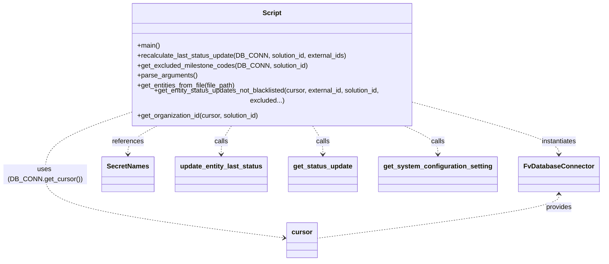

# Diagram: entity_core/entity_service/entity_service_scripts/fix_entity_last_status_update.py


> Auto-generated by Obscura crawlers

## Diagram 1

```mermaid
flowchart TD
    Start((Start)) --> Parse[parse_arguments()]
    Parse --> CheckFile{args.filepath?}
    CheckFile -- Yes --> FromFile[get_entities_from_file(filepath)]
    CheckFile -- No --> FromArgs[args.external_ids]
    FromFile --> Entities[entities_to_update]
    FromArgs --> Entities
    Entities --> Recalc[recalculate_last_status_update(DB_CONN, solution_id, external_ids)]
    Recalc --> Excluded[get_excluded_milestone_codes(DB_CONN, solution_id)]
    Excluded --> SysCfg[get_system_configuration_setting(...)]
    Recalc --> Org[get_organization_id(DB_CONN.get_cursor(), solution_id)]
    Recalc --> Event[event object built with requestContext]
    Recalc --> LoopStart{for external_id in external_ids}
    LoopStart --> GetLast[get_entity_status_updates_not_blacklisted(cursor, external_id, solution_id, excluded_last_milestone_codes)]
    GetLast --> StatusUpd[get_status_update(cursor, solution_id, external_id, last_status_update.id, event)]
    StatusUpd --> Update[update_entity_last_status(cursor, [external_id], solution_id, response, force=True)]
    Update --> LoopStart
    LoopStart --> End((End))
```

> SVG rendering failed for this diagram.

## Diagram 2



### SVG

<svg id="container" width="1402.15625" xmlns="http://www.w3.org/2000/svg" class="classDiagram" height="602" viewBox="0 0 1402.15625 602" role="graphics-document document" aria-roledescription="class"><style>#container{font-family:"trebuchet ms",verdana,arial,sans-serif;font-size:16px;fill:#333;}@keyframes edge-animation-frame{from{stroke-dashoffset:0;}}@keyframes dash{to{stroke-dashoffset:0;}}#container .edge-animation-slow{stroke-dasharray:9,5!important;stroke-dashoffset:900;animation:dash 50s linear infinite;stroke-linecap:round;}#container .edge-animation-fast{stroke-dasharray:9,5!important;stroke-dashoffset:900;animation:dash 20s linear infinite;stroke-linecap:round;}#container .error-icon{fill:#552222;}#container .error-text{fill:#552222;stroke:#552222;}#container .edge-thickness-normal{stroke-width:1px;}#container .edge-thickness-thick{stroke-width:3.5px;}#container .edge-pattern-solid{stroke-dasharray:0;}#container .edge-thickness-invisible{stroke-width:0;fill:none;}#container .edge-pattern-dashed{stroke-dasharray:3;}#container .edge-pattern-dotted{stroke-dasharray:2;}#container .marker{fill:#333333;stroke:#333333;}#container .marker.cross{stroke:#333333;}#container svg{font-family:"trebuchet ms",verdana,arial,sans-serif;font-size:16px;}#container p{margin:0;}#container g.classGroup text{fill:#9370DB;stroke:none;font-family:"trebuchet ms",verdana,arial,sans-serif;font-size:10px;}#container g.classGroup text .title{font-weight:bolder;}#container .nodeLabel,#container .edgeLabel{color:#131300;}#container .edgeLabel .label rect{fill:#ECECFF;}#container .label text{fill:#131300;}#container .labelBkg{background:#ECECFF;}#container .edgeLabel .label span{background:#ECECFF;}#container .classTitle{font-weight:bolder;}#container .node rect,#container .node circle,#container .node ellipse,#container .node polygon,#container .node path{fill:#ECECFF;stroke:#9370DB;stroke-width:1px;}#container .divider{stroke:#9370DB;stroke-width:1;}#container g.clickable{cursor:pointer;}#container g.classGroup rect{fill:#ECECFF;stroke:#9370DB;}#container g.classGroup line{stroke:#9370DB;stroke-width:1;}#container .classLabel .box{stroke:none;stroke-width:0;fill:#ECECFF;opacity:0.5;}#container .classLabel .label{fill:#9370DB;font-size:10px;}#container .relation{stroke:#333333;stroke-width:1;fill:none;}#container .dashed-line{stroke-dasharray:3;}#container .dotted-line{stroke-dasharray:1 2;}#container #compositionStart,#container .composition{fill:#333333!important;stroke:#333333!important;stroke-width:1;}#container #compositionEnd,#container .composition{fill:#333333!important;stroke:#333333!important;stroke-width:1;}#container #dependencyStart,#container .dependency{fill:#333333!important;stroke:#333333!important;stroke-width:1;}#container #dependencyStart,#container .dependency{fill:#333333!important;stroke:#333333!important;stroke-width:1;}#container #extensionStart,#container .extension{fill:transparent!important;stroke:#333333!important;stroke-width:1;}#container #extensionEnd,#container .extension{fill:transparent!important;stroke:#333333!important;stroke-width:1;}#container #aggregationStart,#container .aggregation{fill:transparent!important;stroke:#333333!important;stroke-width:1;}#container #aggregationEnd,#container .aggregation{fill:transparent!important;stroke:#333333!important;stroke-width:1;}#container #lollipopStart,#container .lollipop{fill:#ECECFF!important;stroke:#333333!important;stroke-width:1;}#container #lollipopEnd,#container .lollipop{fill:#ECECFF!important;stroke:#333333!important;stroke-width:1;}#container .edgeTerminals{font-size:11px;line-height:initial;}#container .classTitleText{text-anchor:middle;font-size:18px;fill:#333;}#container .label-icon{display:inline-block;height:1em;overflow:visible;vertical-align:-0.125em;}#container .node .label-icon path{fill:currentColor;stroke:revert;stroke-width:revert;}#container :root{--mermaid-font-family:"trebuchet ms",verdana,arial,sans-serif;}</style><g><defs><marker id="container_class-aggregationStart" class="marker aggregation class" refX="18" refY="7" markerWidth="190" markerHeight="240" orient="auto"><path d="M 18,7 L9,13 L1,7 L9,1 Z"></path></marker></defs><defs><marker id="container_class-aggregationEnd" class="marker aggregation class" refX="1" refY="7" markerWidth="20" markerHeight="28" orient="auto"><path d="M 18,7 L9,13 L1,7 L9,1 Z"></path></marker></defs><defs><marker id="container_class-extensionStart" class="marker extension class" refX="18" refY="7" markerWidth="190" markerHeight="240" orient="auto"><path d="M 1,7 L18,13 V 1 Z"></path></marker></defs><defs><marker id="container_class-extensionEnd" class="marker extension class" refX="1" refY="7" markerWidth="20" markerHeight="28" orient="auto"><path d="M 1,1 V 13 L18,7 Z"></path></marker></defs><defs><marker id="container_class-compositionStart" class="marker composition class" refX="18" refY="7" markerWidth="190" markerHeight="240" orient="auto"><path d="M 18,7 L9,13 L1,7 L9,1 Z"></path></marker></defs><defs><marker id="container_class-compositionEnd" class="marker composition class" refX="1" refY="7" markerWidth="20" markerHeight="28" orient="auto"><path d="M 18,7 L9,13 L1,7 L9,1 Z"></path></marker></defs><defs><marker id="container_class-dependencyStart" class="marker dependency class" refX="6" refY="7" markerWidth="190" markerHeight="240" orient="auto"><path d="M 5,7 L9,13 L1,7 L9,1 Z"></path></marker></defs><defs><marker id="container_class-dependencyEnd" class="marker dependency class" refX="13" refY="7" markerWidth="20" markerHeight="28" orient="auto"><path d="M 18,7 L9,13 L14,7 L9,1 Z"></path></marker></defs><defs><marker id="container_class-lollipopStart" class="marker lollipop class" refX="13" refY="7" markerWidth="190" markerHeight="240" orient="auto"><circle stroke="black" fill="transparent" cx="7" cy="7" r="6"></circle></marker></defs><defs><marker id="container_class-lollipopEnd" class="marker lollipop class" refX="1" refY="7" markerWidth="190" markerHeight="240" orient="auto"><circle stroke="black" fill="transparent" cx="7" cy="7" r="6"></circle></marker></defs><g class="root"><g class="clusters"></g><g class="edgePaths"><path d="M982.387,231.873L1035.798,245.727C1089.208,259.582,1196.03,287.291,1249.441,306.312C1302.852,325.333,1302.852,335.667,1302.852,340.833L1302.852,346" id="id_Script_FvDatabaseConnector_1" class="edge-thickness-normal edge-pattern-dashed relation" style=";;;" data-edge="true" data-et="edge" data-id="id_Script_FvDatabaseConnector_1" data-points="W3sieCI6OTgyLjM4NjcxODc1LCJ5IjoyMzEuODcyNjExMTY0Nzg1NDR9LHsieCI6MTMwMi44NTE1NjI1LCJ5IjozMTV9LHsieCI6MTMwMi44NTE1NjI1LCJ5IjozNTJ9XQ==" marker-end="url(#container_class-dependencyEnd)"></path><path d="M375.47,278L363.397,284.167C351.324,290.333,327.177,302.667,315.104,314C303.031,325.333,303.031,335.667,303.031,340.833L303.031,346" id="id_Script_SecretNames_2" class="edge-thickness-normal edge-pattern-dashed relation" style=";;;" data-edge="true" data-et="edge" data-id="id_Script_SecretNames_2" data-points="W3sieCI6Mzc1LjQ2OTk3NjM4MDgxMzkzLCJ5IjoyNzh9LHsieCI6MzAzLjAzMTI1LCJ5IjozMTV9LHsieCI6MzAzLjAzMTI1LCJ5IjozNTJ9XQ==" marker-end="url(#container_class-dependencyEnd)"></path><path d="M942.432,278L956.257,284.167C970.082,290.333,997.733,302.667,1011.558,314C1025.383,325.333,1025.383,335.667,1025.383,340.833L1025.383,346" id="id_Script_get_system_configuration_setting_3" class="edge-thickness-normal edge-pattern-dashed relation" style=";;;" data-edge="true" data-et="edge" data-id="id_Script_get_system_configuration_setting_3" data-points="W3sieCI6OTQyLjQzMTk1ODU3NTU4MTMsInkiOjI3OH0seyJ4IjoxMDI1LjM4MjgxMjUsInkiOjMxNX0seyJ4IjoxMDI1LjM4MjgxMjUsInkiOjM1Mn1d" marker-end="url(#container_class-dependencyEnd)"></path><path d="M733.205,278L737.473,284.167C741.741,290.333,750.277,302.667,754.545,314C758.813,325.333,758.813,335.667,758.813,340.833L758.813,346" id="id_Script_get_status_update_4" class="edge-thickness-normal edge-pattern-dashed relation" style=";;;" data-edge="true" data-et="edge" data-id="id_Script_get_status_update_4" data-points="W3sieCI6NzMzLjIwNTI1OTgxMTA0NjUsInkiOjI3OH0seyJ4Ijo3NTguODEyNSwieSI6MzE1fSx7IngiOjc1OC44MTI1LCJ5IjozNTJ9XQ==" marker-end="url(#container_class-dependencyEnd)"></path><path d="M546.342,278L542.074,284.167C537.806,290.333,529.27,302.667,525.002,314C520.734,325.333,520.734,335.667,520.734,340.833L520.734,346" id="id_Script_update_entity_last_status_5" class="edge-thickness-normal edge-pattern-dashed relation" style=";;;" data-edge="true" data-et="edge" data-id="id_Script_update_entity_last_status_5" data-points="W3sieCI6NTQ2LjM0MTYxNTE4ODk1MzUsInkiOjI3OH0seyJ4Ijo1MjAuNzM0Mzc1LCJ5IjozMTV9LHsieCI6NTIwLjczNDM3NSwieSI6MzUyfV0=" marker-end="url(#container_class-dependencyEnd)"></path><path d="M297.16,253.817L265.633,264.014C234.107,274.211,171.053,294.606,139.527,317.969C108,341.333,108,367.667,108,394C108,420.333,108,446.667,200.715,472.093C293.43,497.52,478.86,522.04,571.575,534.3L664.29,546.56" id="id_Script_cursor_6" class="edge-thickness-normal edge-pattern-dashed relation" style=";;;" data-edge="true" data-et="edge" data-id="id_Script_cursor_6" data-points="W3sieCI6Mjk3LjE2MDE1NjI1LCJ5IjoyNTMuODE2OTAwOTk0NjA4MjZ9LHsieCI6MTA4LCJ5IjozMTV9LHsieCI6MTA4LCJ5IjozOTR9LHsieCI6MTA4LCJ5Ijo0NzN9LHsieCI6NjcwLjIzODI4MTI1LCJ5Ijo1NDcuMzQ3MDE2MTY5NjM0fV0=" marker-end="url(#container_class-dependencyEnd)"></path><path d="M1302.852,442L1302.852,447.167C1302.852,452.333,1302.852,462.667,1209.145,480.225C1115.439,497.782,928.026,522.565,834.32,534.956L740.613,547.347" id="id_FvDatabaseConnector_cursor_7" class="edge-thickness-normal edge-pattern-dashed relation" style=";;;" data-edge="true" data-et="edge" data-id="id_FvDatabaseConnector_cursor_7" data-points="W3sieCI6MTMwMi44NTE1NjI1LCJ5Ijo0MzZ9LHsieCI6MTMwMi44NTE1NjI1LCJ5Ijo0NzN9LHsieCI6NzQwLjYxMzI4MTI1LCJ5Ijo1NDcuMzQ3MDE2MTY5NjM0fV0=" marker-start="url(#container_class-dependencyStart)"></path></g><g class="edgeLabels"><g class="edgeLabel" transform="translate(1302.8515625, 315)"><g class="label" data-id="id_Script_FvDatabaseConnector_1" transform="translate(-42.9140625, -12)"><foreignObject width="85.828125" height="24"><div xmlns="http://www.w3.org/1999/xhtml" class="labelBkg" style="display: table-cell; white-space: nowrap; line-height: 1.5; max-width: 200px; text-align: center;"><span class="edgeLabel"><p>instantiates</p></span></div></foreignObject></g></g><g class="edgeLabel" transform="translate(303.03125, 315)"><g class="label" data-id="id_Script_SecretNames_2" transform="translate(-37.828125, -12)"><foreignObject width="75.65625" height="24"><div xmlns="http://www.w3.org/1999/xhtml" class="labelBkg" style="display: table-cell; white-space: nowrap; line-height: 1.5; max-width: 200px; text-align: center;"><span class="edgeLabel"><p>references</p></span></div></foreignObject></g></g><g class="edgeLabel" transform="translate(1025.3828125, 315)"><g class="label" data-id="id_Script_get_system_configuration_setting_3" transform="translate(-16.4453125, -12)"><foreignObject width="32.890625" height="24"><div xmlns="http://www.w3.org/1999/xhtml" class="labelBkg" style="display: table-cell; white-space: nowrap; line-height: 1.5; max-width: 200px; text-align: center;"><span class="edgeLabel"><p>calls</p></span></div></foreignObject></g></g><g class="edgeLabel" transform="translate(758.8125, 315)"><g class="label" data-id="id_Script_get_status_update_4" transform="translate(-16.4453125, -12)"><foreignObject width="32.890625" height="24"><div xmlns="http://www.w3.org/1999/xhtml" class="labelBkg" style="display: table-cell; white-space: nowrap; line-height: 1.5; max-width: 200px; text-align: center;"><span class="edgeLabel"><p>calls</p></span></div></foreignObject></g></g><g class="edgeLabel" transform="translate(520.734375, 315)"><g class="label" data-id="id_Script_update_entity_last_status_5" transform="translate(-16.4453125, -12)"><foreignObject width="32.890625" height="24"><div xmlns="http://www.w3.org/1999/xhtml" class="labelBkg" style="display: table-cell; white-space: nowrap; line-height: 1.5; max-width: 200px; text-align: center;"><span class="edgeLabel"><p>calls</p></span></div></foreignObject></g></g><g class="edgeLabel" transform="translate(108, 394)"><g class="label" data-id="id_Script_cursor_6" transform="translate(-100, -24)"><foreignObject width="200" height="48"><div xmlns="http://www.w3.org/1999/xhtml" class="labelBkg" style="display: table; white-space: break-spaces; line-height: 1.5; max-width: 200px; text-align: center; width: 200px;"><span class="edgeLabel"><p>uses (DB_CONN.get_cursor())</p></span></div></foreignObject></g></g><g class="edgeLabel" transform="translate(1302.8515625, 473)"><g class="label" data-id="id_FvDatabaseConnector_cursor_7" transform="translate(-31.3125, -12)"><foreignObject width="62.625" height="24"><div xmlns="http://www.w3.org/1999/xhtml" class="labelBkg" style="display: table-cell; white-space: nowrap; line-height: 1.5; max-width: 200px; text-align: center;"><span class="edgeLabel"><p>provides</p></span></div></foreignObject></g></g></g><g class="nodes"><g class="node default" id="classId-Script-0" transform="translate(639.7734375, 143)"><g class="basic label-container"><path d="M-342.61328125 -135 L342.61328125 -135 L342.61328125 135 L-342.61328125 135" stroke="none" stroke-width="0" fill="#ECECFF" style=""></path><path d="M-342.61328125 -135 C-116.93350285879887 -135, 108.74627553240225 -135, 342.61328125 -135 M-342.61328125 -135 C-147.10784837180884 -135, 48.397584506382316 -135, 342.61328125 -135 M342.61328125 -135 C342.61328125 -79.95723125559076, 342.61328125 -24.914462511181497, 342.61328125 135 M342.61328125 -135 C342.61328125 -38.98078245982981, 342.61328125 57.03843508034038, 342.61328125 135 M342.61328125 135 C196.30729357831288 135, 50.00130590662576 135, -342.61328125 135 M342.61328125 135 C172.53355668530668 135, 2.453832120613356 135, -342.61328125 135 M-342.61328125 135 C-342.61328125 73.11449659678975, -342.61328125 11.228993193579498, -342.61328125 -135 M-342.61328125 135 C-342.61328125 79.84008077842304, -342.61328125 24.680161556846087, -342.61328125 -135" stroke="#9370DB" stroke-width="1.3" fill="none" stroke-dasharray="0 0" style=""></path></g><g class="annotation-group text" transform="translate(0, -111)"></g><g class="label-group text" transform="translate(-21.7421875, -111)"><g class="label" style="font-weight: bolder" transform="translate(0,-12)"><foreignObject width="43.484375" height="24"><div xmlns="http://www.w3.org/1999/xhtml" style="display: table-cell; white-space: nowrap; line-height: 1.5; max-width: 93px; text-align: center;"><span class="nodeLabel markdown-node-label" style=""><p>Script</p></span></div></foreignObject></g></g><g class="members-group text" transform="translate(-330.61328125, -63)"></g><g class="methods-group text" transform="translate(-330.61328125, -33)"><g class="label" style="" transform="translate(0,-12)"><foreignObject width="54.65625" height="24"><div xmlns="http://www.w3.org/1999/xhtml" style="display: table-cell; white-space: nowrap; line-height: 1.5; max-width: 112px; text-align: center;"><span class="nodeLabel markdown-node-label" style=""><p>+main()</p></span></div></foreignObject></g><g class="label" style="" transform="translate(0,12)"><foreignObject width="500.359375" height="24"><div xmlns="http://www.w3.org/1999/xhtml" style="display: table-cell; white-space: nowrap; line-height: 1.5; max-width: 558px; text-align: center;"><span class="nodeLabel markdown-node-label" style=""><p>+recalculate_last_status_update(DB_CONN, solution_id, external_ids)</p></span></div></foreignObject></g><g class="label" style="" transform="translate(0,36)"><foreignObject width="404.3125" height="24"><div xmlns="http://www.w3.org/1999/xhtml" style="display: table-cell; white-space: nowrap; line-height: 1.5; max-width: 462px; text-align: center;"><span class="nodeLabel markdown-node-label" style=""><p>+get_excluded_milestone_codes(DB_CONN, solution_id)</p></span></div></foreignObject></g><g class="label" style="" transform="translate(0,60)"><foreignObject width="143.390625" height="24"><div xmlns="http://www.w3.org/1999/xhtml" style="display: table-cell; white-space: nowrap; line-height: 1.5; max-width: 201px; text-align: center;"><span class="nodeLabel markdown-node-label" style=""><p>+parse_arguments()</p></span></div></foreignObject></g><g class="label" style="" transform="translate(0,84)"><foreignObject width="239.828125" height="24"><div xmlns="http://www.w3.org/1999/xhtml" style="display: table-cell; white-space: nowrap; line-height: 1.5; max-width: 297px; text-align: center;"><span class="nodeLabel markdown-node-label" style=""><p>+get_entities_from_file(file_path)</p></span></div></foreignObject></g><g class="label" style="" transform="translate(0,108)"><foreignObject width="639.484375" height="24"><div xmlns="http://www.w3.org/1999/xhtml" style="display: table-cell; white-space: nowrap; line-height: 1.5; max-width: 697px; text-align: center;"><span class="nodeLabel markdown-node-label" style=""><p>+get_entity_status_updates_not_blacklisted(cursor, external_id, solution_id, excluded...)</p></span></div></foreignObject></g><g class="label" style="" transform="translate(0,132)"><foreignObject width="296.421875" height="24"><div xmlns="http://www.w3.org/1999/xhtml" style="display: table-cell; white-space: nowrap; line-height: 1.5; max-width: 354px; text-align: center;"><span class="nodeLabel markdown-node-label" style=""><p>+get_organization_id(cursor, solution_id)</p></span></div></foreignObject></g></g><g class="divider" style=""><path d="M-342.61328125 -87 C-150.13098929904982 -87, 42.35130265190037 -87, 342.61328125 -87 M-342.61328125 -87 C-193.93975480356823 -87, -45.26622835713647 -87, 342.61328125 -87" stroke="#9370DB" stroke-width="1.3" fill="none" stroke-dasharray="0 0" style=""></path></g><g class="divider" style=""><path d="M-342.61328125 -63 C-77.12519465021995 -63, 188.3628919495601 -63, 342.61328125 -63 M-342.61328125 -63 C-177.60935880714104 -63, -12.60543636428207 -63, 342.61328125 -63" stroke="#9370DB" stroke-width="1.3" fill="none" stroke-dasharray="0 0" style=""></path></g></g><g class="node default" id="classId-FvDatabaseConnector-1" transform="translate(1302.8515625, 394)"><g class="basic label-container"><path d="M-91.3046875 -42 L91.3046875 -42 L91.3046875 42 L-91.3046875 42" stroke="none" stroke-width="0" fill="#ECECFF" style=""></path><path d="M-91.3046875 -42 C-50.35219596616151 -42, -9.39970443232302 -42, 91.3046875 -42 M-91.3046875 -42 C-51.42623507265922 -42, -11.547782645318435 -42, 91.3046875 -42 M91.3046875 -42 C91.3046875 -12.270992983348378, 91.3046875 17.458014033303243, 91.3046875 42 M91.3046875 -42 C91.3046875 -14.579678620945216, 91.3046875 12.840642758109567, 91.3046875 42 M91.3046875 42 C25.65360047328501 42, -39.99748655342998 42, -91.3046875 42 M91.3046875 42 C30.075382113157374 42, -31.15392327368525 42, -91.3046875 42 M-91.3046875 42 C-91.3046875 23.72000582749258, -91.3046875 5.440011654985163, -91.3046875 -42 M-91.3046875 42 C-91.3046875 20.49752501146487, -91.3046875 -1.004949977070261, -91.3046875 -42" stroke="#9370DB" stroke-width="1.3" fill="none" stroke-dasharray="0 0" style=""></path></g><g class="annotation-group text" transform="translate(0, -18)"></g><g class="label-group text" transform="translate(-79.3046875, -18)"><g class="label" style="font-weight: bolder" transform="translate(0,-12)"><foreignObject width="158.609375" height="24"><div xmlns="http://www.w3.org/1999/xhtml" style="display: table-cell; white-space: nowrap; line-height: 1.5; max-width: 207px; text-align: center;"><span class="nodeLabel markdown-node-label" style=""><p>FvDatabaseConnector</p></span></div></foreignObject></g></g><g class="members-group text" transform="translate(-79.3046875, 30)"></g><g class="methods-group text" transform="translate(-79.3046875, 60)"></g><g class="divider" style=""><path d="M-91.3046875 6 C-33.2838846892676 6, 24.736918121464797 6, 91.3046875 6 M-91.3046875 6 C-26.506214947442857 6, 38.29225760511429 6, 91.3046875 6" stroke="#9370DB" stroke-width="1.3" fill="none" stroke-dasharray="0 0" style=""></path></g><g class="divider" style=""><path d="M-91.3046875 24 C-43.1589263714592 24, 4.986834757081596 24, 91.3046875 24 M-91.3046875 24 C-43.77306807067488 24, 3.7585513586502373 24, 91.3046875 24" stroke="#9370DB" stroke-width="1.3" fill="none" stroke-dasharray="0 0" style=""></path></g></g><g class="node default" id="classId-SecretNames-2" transform="translate(303.03125, 394)"><g class="basic label-container"><path d="M-60.03125 -42 L60.03125 -42 L60.03125 42 L-60.03125 42" stroke="none" stroke-width="0" fill="#ECECFF" style=""></path><path d="M-60.03125 -42 C-31.197862851569358 -42, -2.364475703138716 -42, 60.03125 -42 M-60.03125 -42 C-33.18205053866485 -42, -6.332851077329707 -42, 60.03125 -42 M60.03125 -42 C60.03125 -8.919453703805765, 60.03125 24.16109259238847, 60.03125 42 M60.03125 -42 C60.03125 -13.357817963338341, 60.03125 15.284364073323317, 60.03125 42 M60.03125 42 C26.223388146133388 42, -7.584473707733224 42, -60.03125 42 M60.03125 42 C34.56065345061362 42, 9.090056901227243 42, -60.03125 42 M-60.03125 42 C-60.03125 23.064771157028016, -60.03125 4.129542314056032, -60.03125 -42 M-60.03125 42 C-60.03125 12.5713269028609, -60.03125 -16.8573461942782, -60.03125 -42" stroke="#9370DB" stroke-width="1.3" fill="none" stroke-dasharray="0 0" style=""></path></g><g class="annotation-group text" transform="translate(0, -18)"></g><g class="label-group text" transform="translate(-48.03125, -18)"><g class="label" style="font-weight: bolder" transform="translate(0,-12)"><foreignObject width="96.0625" height="24"><div xmlns="http://www.w3.org/1999/xhtml" style="display: table-cell; white-space: nowrap; line-height: 1.5; max-width: 145px; text-align: center;"><span class="nodeLabel markdown-node-label" style=""><p>SecretNames</p></span></div></foreignObject></g></g><g class="members-group text" transform="translate(-48.03125, 30)"></g><g class="methods-group text" transform="translate(-48.03125, 60)"></g><g class="divider" style=""><path d="M-60.03125 6 C-21.26806643727931 6, 17.495117125441382 6, 60.03125 6 M-60.03125 6 C-28.603272610085384 6, 2.824704779829233 6, 60.03125 6" stroke="#9370DB" stroke-width="1.3" fill="none" stroke-dasharray="0 0" style=""></path></g><g class="divider" style=""><path d="M-60.03125 24 C-31.272121308454704 24, -2.5129926169094077 24, 60.03125 24 M-60.03125 24 C-20.048400482650393 24, 19.934449034699213 24, 60.03125 24" stroke="#9370DB" stroke-width="1.3" fill="none" stroke-dasharray="0 0" style=""></path></g></g><g class="node default" id="classId-update_entity_last_status-3" transform="translate(520.734375, 394)"><g class="basic label-container"><path d="M-107.671875 -42 L107.671875 -42 L107.671875 42 L-107.671875 42" stroke="none" stroke-width="0" fill="#ECECFF" style=""></path><path d="M-107.671875 -42 C-57.43055594141194 -42, -7.189236882823877 -42, 107.671875 -42 M-107.671875 -42 C-51.02651832138319 -42, 5.618838357233614 -42, 107.671875 -42 M107.671875 -42 C107.671875 -14.479074965890351, 107.671875 13.041850068219297, 107.671875 42 M107.671875 -42 C107.671875 -9.75624061981567, 107.671875 22.48751876036866, 107.671875 42 M107.671875 42 C46.35068785030885 42, -14.970499299382297 42, -107.671875 42 M107.671875 42 C44.449863118931354 42, -18.77214876213729 42, -107.671875 42 M-107.671875 42 C-107.671875 11.687550732423674, -107.671875 -18.624898535152653, -107.671875 -42 M-107.671875 42 C-107.671875 8.825468574387607, -107.671875 -24.349062851224787, -107.671875 -42" stroke="#9370DB" stroke-width="1.3" fill="none" stroke-dasharray="0 0" style=""></path></g><g class="annotation-group text" transform="translate(0, -18)"></g><g class="label-group text" transform="translate(-95.671875, -18)"><g class="label" style="font-weight: bolder" transform="translate(0,-12)"><foreignObject width="191.34375" height="24"><div xmlns="http://www.w3.org/1999/xhtml" style="display: table-cell; white-space: nowrap; line-height: 1.5; max-width: 238px; text-align: center;"><span class="nodeLabel markdown-node-label" style=""><p>update_entity_last_status</p></span></div></foreignObject></g></g><g class="members-group text" transform="translate(-95.671875, 30)"></g><g class="methods-group text" transform="translate(-95.671875, 60)"></g><g class="divider" style=""><path d="M-107.671875 6 C-55.238774198498646 6, -2.8056733969972925 6, 107.671875 6 M-107.671875 6 C-43.38362250168511 6, 20.90462999662978 6, 107.671875 6" stroke="#9370DB" stroke-width="1.3" fill="none" stroke-dasharray="0 0" style=""></path></g><g class="divider" style=""><path d="M-107.671875 24 C-53.87542022794752 24, -0.07896545589504456 24, 107.671875 24 M-107.671875 24 C-30.265137957665004 24, 47.14159908466999 24, 107.671875 24" stroke="#9370DB" stroke-width="1.3" fill="none" stroke-dasharray="0 0" style=""></path></g></g><g class="node default" id="classId-get_status_update-4" transform="translate(758.8125, 394)"><g class="basic label-container"><path d="M-80.40625 -42 L80.40625 -42 L80.40625 42 L-80.40625 42" stroke="none" stroke-width="0" fill="#ECECFF" style=""></path><path d="M-80.40625 -42 C-27.107494294016867 -42, 26.191261411966266 -42, 80.40625 -42 M-80.40625 -42 C-22.268634413877237 -42, 35.868981172245526 -42, 80.40625 -42 M80.40625 -42 C80.40625 -14.654119466556505, 80.40625 12.69176106688699, 80.40625 42 M80.40625 -42 C80.40625 -23.8851990185508, 80.40625 -5.7703980371016, 80.40625 42 M80.40625 42 C47.00508552414409 42, 13.603921048288186 42, -80.40625 42 M80.40625 42 C30.438636579015792 42, -19.528976841968415 42, -80.40625 42 M-80.40625 42 C-80.40625 21.435319433548944, -80.40625 0.8706388670978882, -80.40625 -42 M-80.40625 42 C-80.40625 15.672494118258633, -80.40625 -10.655011763482733, -80.40625 -42" stroke="#9370DB" stroke-width="1.3" fill="none" stroke-dasharray="0 0" style=""></path></g><g class="annotation-group text" transform="translate(0, -18)"></g><g class="label-group text" transform="translate(-68.40625, -18)"><g class="label" style="font-weight: bolder" transform="translate(0,-12)"><foreignObject width="136.8125" height="24"><div xmlns="http://www.w3.org/1999/xhtml" style="display: table-cell; white-space: nowrap; line-height: 1.5; max-width: 184px; text-align: center;"><span class="nodeLabel markdown-node-label" style=""><p>get_status_update</p></span></div></foreignObject></g></g><g class="members-group text" transform="translate(-68.40625, 30)"></g><g class="methods-group text" transform="translate(-68.40625, 60)"></g><g class="divider" style=""><path d="M-80.40625 6 C-41.21978092212883 6, -2.0333118442576534 6, 80.40625 6 M-80.40625 6 C-33.407052913055885 6, 13.59214417388823 6, 80.40625 6" stroke="#9370DB" stroke-width="1.3" fill="none" stroke-dasharray="0 0" style=""></path></g><g class="divider" style=""><path d="M-80.40625 24 C-30.689942454223157 24, 19.026365091553686 24, 80.40625 24 M-80.40625 24 C-33.94160046128228 24, 12.523049077435445 24, 80.40625 24" stroke="#9370DB" stroke-width="1.3" fill="none" stroke-dasharray="0 0" style=""></path></g></g><g class="node default" id="classId-get_system_configuration_setting-5" transform="translate(1025.3828125, 394)"><g class="basic label-container"><path d="M-136.1640625 -42 L136.1640625 -42 L136.1640625 42 L-136.1640625 42" stroke="none" stroke-width="0" fill="#ECECFF" style=""></path><path d="M-136.1640625 -42 C-66.97046797947993 -42, 2.2231265410401306 -42, 136.1640625 -42 M-136.1640625 -42 C-52.02702801402083 -42, 32.11000647195834 -42, 136.1640625 -42 M136.1640625 -42 C136.1640625 -19.323537285720526, 136.1640625 3.3529254285589474, 136.1640625 42 M136.1640625 -42 C136.1640625 -19.435907617081465, 136.1640625 3.1281847658370694, 136.1640625 42 M136.1640625 42 C79.45322229488661 42, 22.74238208977323 42, -136.1640625 42 M136.1640625 42 C47.77597776892853 42, -40.612106962142946 42, -136.1640625 42 M-136.1640625 42 C-136.1640625 11.684328565350597, -136.1640625 -18.631342869298805, -136.1640625 -42 M-136.1640625 42 C-136.1640625 19.338679218362888, -136.1640625 -3.3226415632742246, -136.1640625 -42" stroke="#9370DB" stroke-width="1.3" fill="none" stroke-dasharray="0 0" style=""></path></g><g class="annotation-group text" transform="translate(0, -18)"></g><g class="label-group text" transform="translate(-124.1640625, -18)"><g class="label" style="font-weight: bolder" transform="translate(0,-12)"><foreignObject width="248.328125" height="24"><div xmlns="http://www.w3.org/1999/xhtml" style="display: table-cell; white-space: nowrap; line-height: 1.5; max-width: 294px; text-align: center;"><span class="nodeLabel markdown-node-label" style=""><p>get_system_configuration_setting</p></span></div></foreignObject></g></g><g class="members-group text" transform="translate(-124.1640625, 30)"></g><g class="methods-group text" transform="translate(-124.1640625, 60)"></g><g class="divider" style=""><path d="M-136.1640625 6 C-43.71761817425683 6, 48.728826151486345 6, 136.1640625 6 M-136.1640625 6 C-62.90240771635126 6, 10.359247067297474 6, 136.1640625 6" stroke="#9370DB" stroke-width="1.3" fill="none" stroke-dasharray="0 0" style=""></path></g><g class="divider" style=""><path d="M-136.1640625 24 C-42.455596183468316 24, 51.25287013306337 24, 136.1640625 24 M-136.1640625 24 C-40.791686754358224 24, 54.58068899128355 24, 136.1640625 24" stroke="#9370DB" stroke-width="1.3" fill="none" stroke-dasharray="0 0" style=""></path></g></g><g class="node default" id="classId-cursor-6" transform="translate(705.42578125, 552)"><g class="basic label-container"><path d="M-35.1875 -42 L35.1875 -42 L35.1875 42 L-35.1875 42" stroke="none" stroke-width="0" fill="#ECECFF" style=""></path><path d="M-35.1875 -42 C-7.891242751806754 -42, 19.405014496386492 -42, 35.1875 -42 M-35.1875 -42 C-19.21866394975669 -42, -3.249827899513381 -42, 35.1875 -42 M35.1875 -42 C35.1875 -16.680615012857324, 35.1875 8.638769974285353, 35.1875 42 M35.1875 -42 C35.1875 -17.11528452285019, 35.1875 7.769430954299622, 35.1875 42 M35.1875 42 C11.920076636183222 42, -11.347346727633557 42, -35.1875 42 M35.1875 42 C7.478457844911102 42, -20.230584310177797 42, -35.1875 42 M-35.1875 42 C-35.1875 16.665624430372326, -35.1875 -8.668751139255349, -35.1875 -42 M-35.1875 42 C-35.1875 15.342217750361034, -35.1875 -11.315564499277933, -35.1875 -42" stroke="#9370DB" stroke-width="1.3" fill="none" stroke-dasharray="0 0" style=""></path></g><g class="annotation-group text" transform="translate(0, -18)"></g><g class="label-group text" transform="translate(-23.1875, -18)"><g class="label" style="font-weight: bolder" transform="translate(0,-12)"><foreignObject width="46.375" height="24"><div xmlns="http://www.w3.org/1999/xhtml" style="display: table-cell; white-space: nowrap; line-height: 1.5; max-width: 97px; text-align: center;"><span class="nodeLabel markdown-node-label" style=""><p>cursor</p></span></div></foreignObject></g></g><g class="members-group text" transform="translate(-23.1875, 30)"></g><g class="methods-group text" transform="translate(-23.1875, 60)"></g><g class="divider" style=""><path d="M-35.1875 6 C-13.96732914143817 6, 7.252841717123658 6, 35.1875 6 M-35.1875 6 C-12.701370687389712 6, 9.784758625220576 6, 35.1875 6" stroke="#9370DB" stroke-width="1.3" fill="none" stroke-dasharray="0 0" style=""></path></g><g class="divider" style=""><path d="M-35.1875 24 C-11.043060154254235 24, 13.10137969149153 24, 35.1875 24 M-35.1875 24 C-11.554316753447392 24, 12.078866493105217 24, 35.1875 24" stroke="#9370DB" stroke-width="1.3" fill="none" stroke-dasharray="0 0" style=""></path></g></g></g></g></g></svg>
