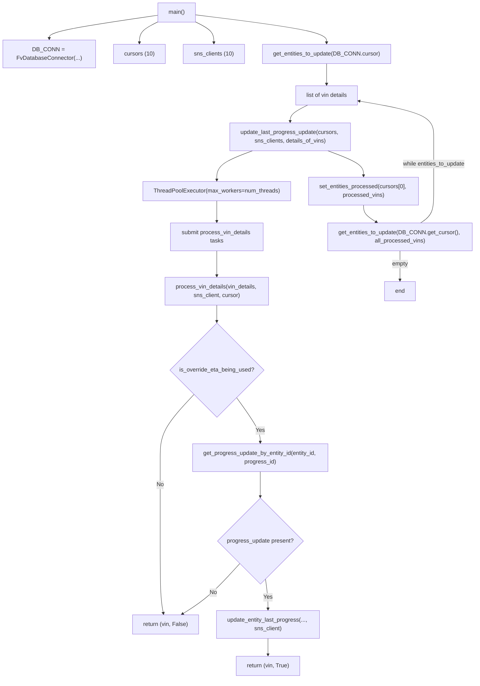
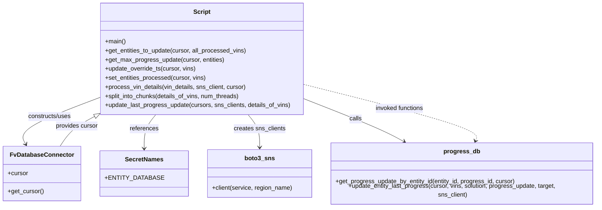

# Diagram: entity_core/entity_service/entity_service_scripts/fix_override_etas.py

> Auto-generated by Obscura crawlers

## Diagram 1

### SVG

<svg id="container" width="1323.703125" xmlns="http://www.w3.org/2000/svg" class="flowchart" height="1900.09375" viewBox="0 0 1323.703125 1900.09375" role="graphics-document document" aria-roledescription="flowchart-v2"><g><marker id="container_flowchart-v2-pointEnd" class="marker flowchart-v2" viewBox="0 0 10 10" refX="5" refY="5" markerUnits="userSpaceOnUse" markerWidth="8" markerHeight="8" orient="auto"><path d="M 0 0 L 10 5 L 0 10 z" class="arrowMarkerPath" style="stroke-width: 1; stroke-dasharray: 1, 0;"></path></marker><marker id="container_flowchart-v2-pointStart" class="marker flowchart-v2" viewBox="0 0 10 10" refX="4.5" refY="5" markerUnits="userSpaceOnUse" markerWidth="8" markerHeight="8" orient="auto"><path d="M 0 5 L 10 10 L 10 0 z" class="arrowMarkerPath" style="stroke-width: 1; stroke-dasharray: 1, 0;"></path></marker><marker id="container_flowchart-v2-circleEnd" class="marker flowchart-v2" viewBox="0 0 10 10" refX="11" refY="5" markerUnits="userSpaceOnUse" markerWidth="11" markerHeight="11" orient="auto"><circle cx="5" cy="5" r="5" class="arrowMarkerPath" style="stroke-width: 1; stroke-dasharray: 1, 0;"></circle></marker><marker id="container_flowchart-v2-circleStart" class="marker flowchart-v2" viewBox="0 0 10 10" refX="-1" refY="5" markerUnits="userSpaceOnUse" markerWidth="11" markerHeight="11" orient="auto"><circle cx="5" cy="5" r="5" class="arrowMarkerPath" style="stroke-width: 1; stroke-dasharray: 1, 0;"></circle></marker><marker id="container_flowchart-v2-crossEnd" class="marker cross flowchart-v2" viewBox="0 0 11 11" refX="12" refY="5.2" markerUnits="userSpaceOnUse" markerWidth="11" markerHeight="11" orient="auto"><path d="M 1,1 l 9,9 M 10,1 l -9,9" class="arrowMarkerPath" style="stroke-width: 2; stroke-dasharray: 1, 0;"></path></marker><marker id="container_flowchart-v2-crossStart" class="marker cross flowchart-v2" viewBox="0 0 11 11" refX="-1" refY="5.2" markerUnits="userSpaceOnUse" markerWidth="11" markerHeight="11" orient="auto"><path d="M 1,1 l 9,9 M 10,1 l -9,9" class="arrowMarkerPath" style="stroke-width: 2; stroke-dasharray: 1, 0;"></path></marker><g class="root"><g class="clusters"></g><g class="edgePaths"><path d="M439.574,42.816L389.312,50.18C339.049,57.544,238.525,72.272,188.262,83.136C138,94,138,101,138,104.5L138,108" id="L_Main_InitDB_0" class="edge-thickness-normal edge-pattern-solid edge-thickness-normal edge-pattern-solid flowchart-link" style=";" data-edge="true" data-et="edge" data-id="L_Main_InitDB_0" data-points="W3sieCI6NDM5LjU3NDIxODc1LCJ5Ijo0Mi44MTU1MzgzNjE2MzcyNjZ9LHsieCI6MTM4LCJ5Ijo4N30seyJ4IjoxMzgsInkiOjExMn1d" marker-end="url(#container_flowchart-v2-pointEnd)"></path><path d="M439.574,61.836L431.238,66.03C422.901,70.224,406.228,78.612,397.891,88.306C389.555,98,389.555,109,389.555,114.5L389.555,120" id="L_Main_Cursors_0" class="edge-thickness-normal edge-pattern-solid edge-thickness-normal edge-pattern-solid flowchart-link" style=";" data-edge="true" data-et="edge" data-id="L_Main_Cursors_0" data-points="W3sieCI6NDM5LjU3NDIxODc1LCJ5Ijo2MS44MzYxNzM5OTE5MTI2M30seyJ4IjozODkuNTU0Njg3NSwieSI6ODd9LHsieCI6Mzg5LjU1NDY4NzUsInkiOjEyNH1d" marker-end="url(#container_flowchart-v2-pointEnd)"></path><path d="M546.262,61.836L554.598,66.03C562.935,70.224,579.608,78.612,587.945,88.306C596.281,98,596.281,109,596.281,114.5L596.281,120" id="L_Main_SNS_0" class="edge-thickness-normal edge-pattern-solid edge-thickness-normal edge-pattern-solid flowchart-link" style=";" data-edge="true" data-et="edge" data-id="L_Main_SNS_0" data-points="W3sieCI6NTQ2LjI2MTcxODc1LCJ5Ijo2MS44MzYxNzM5OTE5MTI2M30seyJ4Ijo1OTYuMjgxMjUsInkiOjg3fSx7IngiOjU5Ni4yODEyNSwieSI6MTI0fV0=" marker-end="url(#container_flowchart-v2-pointEnd)"></path><path d="M546.262,41.661L606.773,49.218C667.284,56.774,788.306,71.887,848.817,84.944C909.328,98,909.328,109,909.328,114.5L909.328,120" id="L_Main_GetEntities_0" class="edge-thickness-normal edge-pattern-solid edge-thickness-normal edge-pattern-solid flowchart-link" style=";" data-edge="true" data-et="edge" data-id="L_Main_GetEntities_0" data-points="W3sieCI6NTQ2LjI2MTcxODc1LCJ5Ijo0MS42NjE0MDA5MjQ5NDQ0Mn0seyJ4Ijo5MDkuMzI4MTI1LCJ5Ijo4N30seyJ4Ijo5MDkuMzI4MTI1LCJ5IjoxMjR9XQ==" marker-end="url(#container_flowchart-v2-pointEnd)"></path><path d="M909.328,178L909.328,184.167C909.328,190.333,909.328,202.667,909.328,212.333C909.328,222,909.328,229,909.328,232.5L909.328,236" id="L_GetEntities_EntitiesList_0" class="edge-thickness-normal edge-pattern-solid edge-thickness-normal edge-pattern-solid flowchart-link" style=";" data-edge="true" data-et="edge" data-id="L_GetEntities_EntitiesList_0" data-points="W3sieCI6OTA5LjMyODEyNSwieSI6MTc4fSx7IngiOjkwOS4zMjgxMjUsInkiOjIxNX0seyJ4Ijo5MDkuMzI4MTI1LCJ5IjoyNDB9XQ==" marker-end="url(#container_flowchart-v2-pointEnd)"></path><path d="M855.949,294L847.711,298.167C839.474,302.333,822.999,310.667,814.761,318.333C806.523,326,806.523,333,806.523,336.5L806.523,340" id="L_EntitiesList_UpdateLast_0" class="edge-thickness-normal edge-pattern-solid edge-thickness-normal edge-pattern-solid flowchart-link" style=";" data-edge="true" data-et="edge" data-id="L_EntitiesList_UpdateLast_0" data-points="W3sieCI6ODU1Ljk0ODc2ODAyODg0NjIsInkiOjI5NH0seyJ4Ijo4MDYuNTIzNDM3NSwieSI6MzE5fSx7IngiOjgwNi41MjM0Mzc1LCJ5IjozNDR9XQ==" marker-end="url(#container_flowchart-v2-pointEnd)"></path><path d="M700.512,422L683.75,428.167C666.987,434.333,633.462,446.667,616.7,460.333C599.938,474,599.938,489,599.938,496.5L599.938,504" id="L_UpdateLast_ThreadPool_0" class="edge-thickness-normal edge-pattern-solid edge-thickness-normal edge-pattern-solid flowchart-link" style=";" data-edge="true" data-et="edge" data-id="L_UpdateLast_ThreadPool_0" data-points="W3sieCI6NzAwLjUxMjIzMjczMDI2MzEsInkiOjQyMn0seyJ4Ijo1OTkuOTM3NSwieSI6NDU5fSx7IngiOjU5OS45Mzc1LCJ5Ijo1MDh9XQ==" marker-end="url(#container_flowchart-v2-pointEnd)"></path><path d="M599.938,562L599.938,568.167C599.938,574.333,599.938,586.667,599.938,596.333C599.938,606,599.938,613,599.938,616.5L599.938,620" id="L_ThreadPool_SubmitTasks_0" class="edge-thickness-normal edge-pattern-solid edge-thickness-normal edge-pattern-solid flowchart-link" style=";" data-edge="true" data-et="edge" data-id="L_ThreadPool_SubmitTasks_0" data-points="W3sieCI6NTk5LjkzNzUsInkiOjU2Mn0seyJ4Ijo1OTkuOTM3NSwieSI6NTk5fSx7IngiOjU5OS45Mzc1LCJ5Ijo2MjR9XQ==" marker-end="url(#container_flowchart-v2-pointEnd)"></path><path d="M599.938,702L599.938,708.167C599.938,714.333,599.938,726.667,599.938,738.333C599.938,750,599.938,761,599.938,766.5L599.938,772" id="L_SubmitTasks_ProcessVin_0" class="edge-thickness-normal edge-pattern-solid edge-thickness-normal edge-pattern-solid flowchart-link" style=";" data-edge="true" data-et="edge" data-id="L_SubmitTasks_ProcessVin_0" data-points="W3sieCI6NTk5LjkzNzUsInkiOjcwMn0seyJ4Ijo1OTkuOTM3NSwieSI6NzM5fSx7IngiOjU5OS45Mzc1LCJ5Ijo3NzZ9XQ==" marker-end="url(#container_flowchart-v2-pointEnd)"></path><path d="M599.938,854L599.938,858.167C599.938,862.333,599.938,870.667,599.938,878.333C599.938,886,599.938,893,599.938,896.5L599.938,900" id="L_ProcessVin_CheckOverride_0" class="edge-thickness-normal edge-pattern-solid edge-thickness-normal edge-pattern-solid flowchart-link" style=";" data-edge="true" data-et="edge" data-id="L_ProcessVin_CheckOverride_0" data-points="W3sieCI6NTk5LjkzNzUsInkiOjg1NH0seyJ4Ijo1OTkuOTM3NSwieSI6ODc5fSx7IngiOjU5OS45Mzc1LCJ5Ijo5MDR9XQ==" marker-end="url(#container_flowchart-v2-pointEnd)"></path><path d="M535.841,1104.529L520.01,1121.378C504.178,1138.228,472.515,1171.926,456.683,1201.442C440.852,1230.958,440.852,1256.292,440.852,1281.625C440.852,1306.958,440.852,1332.292,440.852,1371.247C440.852,1410.203,440.852,1462.781,440.852,1515.359C440.852,1567.938,440.852,1620.516,442.341,1654.317C443.831,1688.119,446.81,1703.145,448.3,1710.657L449.79,1718.17" id="L_CheckOverride_ReturnFalse_0" class="edge-thickness-normal edge-pattern-solid edge-thickness-normal edge-pattern-solid flowchart-link" style=";" data-edge="true" data-et="edge" data-id="L_CheckOverride_ReturnFalse_0" data-points="W3sieCI6NTM1Ljg0MTQwMjk5NzUwMjEsInkiOjExMDQuNTI4OTAyOTk3NTAyfSx7IngiOjQ0MC44NTE1NjI1LCJ5IjoxMjA1LjYyNX0seyJ4Ijo0NDAuODUxNTYyNSwieSI6MTI4MS42MjV9LHsieCI6NDQwLjg1MTU2MjUsInkiOjEzNTcuNjI1fSx7IngiOjQ0MC44NTE1NjI1LCJ5IjoxNTE1LjM1OTM3NX0seyJ4Ijo0NDAuODUxNTYyNSwieSI6MTY3My4wOTM3NX0seyJ4Ijo0NTAuNTY3OTQ4MTkwNzg5NSwieSI6MTcyMi4wOTM3NX1d" marker-end="url(#container_flowchart-v2-pointEnd)"></path><path d="M655.594,1112.969L666.806,1128.411C678.018,1143.854,700.443,1174.74,711.655,1195.682C722.867,1216.625,722.867,1227.625,722.867,1233.125L722.867,1238.625" id="L_CheckOverride_GetProgress_0" class="edge-thickness-normal edge-pattern-solid edge-thickness-normal edge-pattern-solid flowchart-link" style=";" data-edge="true" data-et="edge" data-id="L_CheckOverride_GetProgress_0" data-points="W3sieCI6NjU1LjU5Mzg1Mjc1NDgzMiwieSI6MTExMi45Njg2NDcyNDUxNjh9LHsieCI6NzIyLjg2NzE4NzUsInkiOjEyMDUuNjI1fSx7IngiOjcyMi44NjcxODc1LCJ5IjoxMjQyLjYyNX1d" marker-end="url(#container_flowchart-v2-pointEnd)"></path><path d="M722.867,1320.625L722.867,1326.792C722.867,1332.958,722.867,1345.292,722.867,1356.958C722.867,1368.625,722.867,1379.625,722.867,1385.125L722.867,1390.625" id="L_GetProgress_NoProgress_0" class="edge-thickness-normal edge-pattern-solid edge-thickness-normal edge-pattern-solid flowchart-link" style=";" data-edge="true" data-et="edge" data-id="L_GetProgress_NoProgress_0" data-points="W3sieCI6NzIyLjg2NzE4NzUsInkiOjEzMjAuNjI1fSx7IngiOjcyMi44NjcxODc1LCJ5IjoxMzU3LjYyNX0seyJ4Ijo3MjIuODY3MTg3NSwieSI6MTM5NC42MjV9XQ==" marker-end="url(#container_flowchart-v2-pointEnd)"></path><path d="M665.245,1578.471L650.846,1594.242C636.447,1610.012,607.649,1641.553,580.608,1665.139C553.567,1688.726,528.282,1704.358,515.639,1712.174L502.997,1719.99" id="L_NoProgress_ReturnFalse_0" class="edge-thickness-normal edge-pattern-solid edge-thickness-normal edge-pattern-solid flowchart-link" style=";" data-edge="true" data-et="edge" data-id="L_NoProgress_ReturnFalse_0" data-points="W3sieCI6NjY1LjI0NDUzMTQxMTgxNjUsInkiOjE1NzguNDcxMDkzOTExODE2NX0seyJ4Ijo1NzguODUxNTYyNSwieSI6MTY3My4wOTM3NX0seyJ4Ijo0OTkuNTk0MjYzOTgwMjYzMiwieSI6MTcyMi4wOTM3NX1d" marker-end="url(#container_flowchart-v2-pointEnd)"></path><path d="M737.104,1621.857L738.245,1630.397C739.387,1638.936,741.67,1656.015,742.812,1670.054C743.953,1684.094,743.953,1695.094,743.953,1700.594L743.953,1706.094" id="L_NoProgress_UpdateEntity_0" class="edge-thickness-normal edge-pattern-solid edge-thickness-normal edge-pattern-solid flowchart-link" style=";" data-edge="true" data-et="edge" data-id="L_NoProgress_UpdateEntity_0" data-points="W3sieCI6NzM3LjEwMzgxMTEyMzc5MzEsInkiOjE2MjEuODU3MTI2Mzc2MjA3fSx7IngiOjc0My45NTMxMjUsInkiOjE2NzMuMDkzNzV9LHsieCI6NzQzLjk1MzEyNSwieSI6MTcxMC4wOTM3NX1d" marker-end="url(#container_flowchart-v2-pointEnd)"></path><path d="M743.953,1788.094L743.953,1792.26C743.953,1796.427,743.953,1804.76,743.953,1812.427C743.953,1820.094,743.953,1827.094,743.953,1830.594L743.953,1834.094" id="L_UpdateEntity_ReturnTrue_0" class="edge-thickness-normal edge-pattern-solid edge-thickness-normal edge-pattern-solid flowchart-link" style=";" data-edge="true" data-et="edge" data-id="L_UpdateEntity_ReturnTrue_0" data-points="W3sieCI6NzQzLjk1MzEyNSwieSI6MTc4OC4wOTM3NX0seyJ4Ijo3NDMuOTUzMTI1LCJ5IjoxODEzLjA5Mzc1fSx7IngiOjc0My45NTMxMjUsInkiOjE4MzguMDkzNzV9XQ==" marker-end="url(#container_flowchart-v2-pointEnd)"></path><path d="M912.535,422L929.297,428.167C946.06,434.333,979.584,446.667,996.347,458.333C1013.109,470,1013.109,481,1013.109,486.5L1013.109,492" id="L_UpdateLast_SetProcessed_0" class="edge-thickness-normal edge-pattern-solid edge-thickness-normal edge-pattern-solid flowchart-link" style=";" data-edge="true" data-et="edge" data-id="L_UpdateLast_SetProcessed_0" data-points="W3sieCI6OTEyLjUzNDY0MjI2OTczNjksInkiOjQyMn0seyJ4IjoxMDEzLjEwOTM3NSwieSI6NDU5fSx7IngiOjEwMTMuMTA5Mzc1LCJ5Ijo0OTZ9XQ==" marker-end="url(#container_flowchart-v2-pointEnd)"></path><path d="M1013.109,574L1013.109,578.167C1013.109,582.333,1013.109,590.667,1019.236,598.648C1025.363,606.629,1037.618,614.257,1043.745,618.072L1049.872,621.886" id="L_SetProcessed_FetchMore_0" class="edge-thickness-normal edge-pattern-solid edge-thickness-normal edge-pattern-solid flowchart-link" style=";" data-edge="true" data-et="edge" data-id="L_SetProcessed_FetchMore_0" data-points="W3sieCI6MTAxMy4xMDkzNzUsInkiOjU3NH0seyJ4IjoxMDEzLjEwOTM3NSwieSI6NTk5fSx7IngiOjEwNTMuMjY3NDU2MDU0Njg3NSwieSI6NjI0fV0=" marker-end="url(#container_flowchart-v2-pointEnd)"></path><path d="M1174.102,624L1180.319,619.833C1186.536,615.667,1198.969,607.333,1205.186,592.5C1211.402,577.667,1211.402,556.333,1211.402,533C1211.402,509.667,1211.402,484.333,1211.402,459C1211.402,433.667,1211.402,408.333,1211.402,385C1211.402,361.667,1211.402,340.333,1176.794,323.709C1142.186,307.085,1072.97,295.17,1038.362,289.212L1003.755,283.255" id="L_FetchMore_EntitiesList_0" class="edge-thickness-normal edge-pattern-solid edge-thickness-normal edge-pattern-solid flowchart-link" style=";" data-edge="true" data-et="edge" data-id="L_FetchMore_EntitiesList_0" data-points="W3sieCI6MTE3NC4xMDIyMzM4ODY3MTg4LCJ5Ijo2MjR9LHsieCI6MTIxMS40MDIzNDM3NSwieSI6NTk5fSx7IngiOjEyMTEuNDAyMzQzNzUsInkiOjUzNX0seyJ4IjoxMjExLjQwMjM0Mzc1LCJ5Ijo0NTl9LHsieCI6MTIxMS40MDIzNDM3NSwieSI6MzgzfSx7IngiOjEyMTEuNDAyMzQzNzUsInkiOjMxOX0seyJ4Ijo5OTkuODEyNSwieSI6MjgyLjU3NjI2MzA3NjkwMzE2fV0=" marker-end="url(#container_flowchart-v2-pointEnd)"></path><path d="M1115.914,702L1115.914,708.167C1115.914,714.333,1115.914,726.667,1115.914,740.333C1115.914,754,1115.914,769,1115.914,776.5L1115.914,784" id="L_FetchMore_End_0" class="edge-thickness-normal edge-pattern-solid edge-thickness-normal edge-pattern-solid flowchart-link" style=";" data-edge="true" data-et="edge" data-id="L_FetchMore_End_0" data-points="W3sieCI6MTExNS45MTQwNjI1LCJ5Ijo3MDJ9LHsieCI6MTExNS45MTQwNjI1LCJ5Ijo3Mzl9LHsieCI6MTExNS45MTQwNjI1LCJ5Ijo3ODh9XQ==" marker-end="url(#container_flowchart-v2-pointEnd)"></path></g><g class="edgeLabels"><g class="edgeLabel"><g class="label" data-id="L_Main_InitDB_0" transform="translate(0, 0)"><foreignObject width="0" height="0">

</foreignObject></g></g><g class="edgeLabel"><g class="label" data-id="L_Main_Cursors_0" transform="translate(0, 0)"><foreignObject width="0" height="0">

</foreignObject></g></g><g class="edgeLabel"><g class="label" data-id="L_Main_SNS_0" transform="translate(0, 0)"><foreignObject width="0" height="0">

</foreignObject></g></g><g class="edgeLabel"><g class="label" data-id="L_Main_GetEntities_0" transform="translate(0, 0)"><foreignObject width="0" height="0">

</foreignObject></g></g><g class="edgeLabel"><g class="label" data-id="L_GetEntities_EntitiesList_0" transform="translate(0, 0)"><foreignObject width="0" height="0">

</foreignObject></g></g><g class="edgeLabel"><g class="label" data-id="L_EntitiesList_UpdateLast_0" transform="translate(0, 0)"><foreignObject width="0" height="0">

</foreignObject></g></g><g class="edgeLabel"><g class="label" data-id="L_UpdateLast_ThreadPool_0" transform="translate(0, 0)"><foreignObject width="0" height="0">

</foreignObject></g></g><g class="edgeLabel"><g class="label" data-id="L_ThreadPool_SubmitTasks_0" transform="translate(0, 0)"><foreignObject width="0" height="0">

</foreignObject></g></g><g class="edgeLabel"><g class="label" data-id="L_SubmitTasks_ProcessVin_0" transform="translate(0, 0)"><foreignObject width="0" height="0">

</foreignObject></g></g><g class="edgeLabel"><g class="label" data-id="L_ProcessVin_CheckOverride_0" transform="translate(0, 0)"><foreignObject width="0" height="0">

</foreignObject></g></g><g class="edgeLabel" transform="translate(440.8515625, 1357.625)"><g class="label" data-id="L_CheckOverride_ReturnFalse_0" transform="translate(-10.140625, -12)"><foreignObject width="20.28125" height="24">

No

</foreignObject></g></g><g class="edgeLabel" transform="translate(722.8671875, 1205.625)"><g class="label" data-id="L_CheckOverride_GetProgress_0" transform="translate(-12.03125, -12)"><foreignObject width="24.0625" height="24">

Yes

</foreignObject></g></g><g class="edgeLabel"><g class="label" data-id="L_GetProgress_NoProgress_0" transform="translate(0, 0)"><foreignObject width="0" height="0">

</foreignObject></g></g><g class="edgeLabel" transform="translate(590.63379, 1660.18917)"><g class="label" data-id="L_NoProgress_ReturnFalse_0" transform="translate(-10.140625, -12)"><foreignObject width="20.28125" height="24">

No

</foreignObject></g></g><g class="edgeLabel" transform="translate(743.953125, 1673.09375)"><g class="label" data-id="L_NoProgress_UpdateEntity_0" transform="translate(-12.03125, -12)"><foreignObject width="24.0625" height="24">

Yes

</foreignObject></g></g><g class="edgeLabel"><g class="label" data-id="L_UpdateEntity_ReturnTrue_0" transform="translate(0, 0)"><foreignObject width="0" height="0">

</foreignObject></g></g><g class="edgeLabel"><g class="label" data-id="L_UpdateLast_SetProcessed_0" transform="translate(0, 0)"><foreignObject width="0" height="0">

</foreignObject></g></g><g class="edgeLabel"><g class="label" data-id="L_SetProcessed_FetchMore_0" transform="translate(0, 0)"><foreignObject width="0" height="0">

</foreignObject></g></g><g class="edgeLabel" transform="translate(1211.40234375, 459)"><g class="label" data-id="L_FetchMore_EntitiesList_0" transform="translate(-89.6953125, -12)"><foreignObject width="179.390625" height="24">

while entities_to_update

</foreignObject></g></g><g class="edgeLabel" transform="translate(1115.9140625, 739)"><g class="label" data-id="L_FetchMore_End_0" transform="translate(-22.7578125, -12)"><foreignObject width="45.515625" height="24">

empty

</foreignObject></g></g></g><g class="nodes"><g class="node default" id="flowchart-Main-0" transform="translate(492.91796875, 35)"><rect class="basic label-container" style="" x="-53.34375" y="-27" width="106.6875" height="54"></rect><g class="label" style="" transform="translate(-23.34375, -12)"><rect></rect><foreignObject width="46.6875" height="24">

main()

</foreignObject></g></g><g class="node default" id="flowchart-InitDB-1" transform="translate(138, 151)"><rect class="basic label-container" style="" x="-130" y="-39" width="260" height="78"></rect><g class="label" style="" transform="translate(-100, -24)"><rect></rect><foreignObject width="200" height="48">

DB_CONN = FvDatabaseConnector(...)

</foreignObject></g></g><g class="node default" id="flowchart-Cursors-3" transform="translate(389.5546875, 151)"><rect class="basic label-container" style="" x="-71.5546875" y="-27" width="143.109375" height="54"></rect><g class="label" style="" transform="translate(-41.5546875, -12)"><rect></rect><foreignObject width="83.109375" height="24">

cursors (10)

</foreignObject></g></g><g class="node default" id="flowchart-SNS-5" transform="translate(596.28125, 151)"><rect class="basic label-container" style="" x="-85.171875" y="-27" width="170.34375" height="54"></rect><g class="label" style="" transform="translate(-55.171875, -12)"><rect></rect><foreignObject width="110.34375" height="24">

sns_clients (10)

</foreignObject></g></g><g class="node default" id="flowchart-GetEntities-7" transform="translate(909.328125, 151)"><rect class="basic label-container" style="" x="-177.875" y="-27" width="355.75" height="54"></rect><g class="label" style="" transform="translate(-147.875, -12)"><rect></rect><foreignObject width="295.75" height="24">

get_entities_to_update(DB_CONN.cursor)

</foreignObject></g></g><g class="node default" id="flowchart-EntitiesList-9" transform="translate(909.328125, 267)"><rect class="basic label-container" style="" x="-90.484375" y="-27" width="180.96875" height="54"></rect><g class="label" style="" transform="translate(-60.484375, -12)"><rect></rect><foreignObject width="120.96875" height="24">

list of vin details

</foreignObject></g></g><g class="node default" id="flowchart-UpdateLast-11" transform="translate(806.5234375, 383)"><rect class="basic label-container" style="" x="-170.609375" y="-39" width="341.21875" height="78"></rect><g class="label" style="" transform="translate(-140.609375, -24)"><rect></rect><foreignObject width="281.21875" height="48">

update_last_progress_update(cursors, sns_clients, details_of_vins)

</foreignObject></g></g><g class="node default" id="flowchart-ThreadPool-13" transform="translate(599.9375, 535)"><rect class="basic label-container" style="" x="-207.1953125" y="-27" width="414.390625" height="54"></rect><g class="label" style="" transform="translate(-177.1953125, -12)"><rect></rect><foreignObject width="354.390625" height="24">

ThreadPoolExecutor(max_workers=num_threads)

</foreignObject></g></g><g class="node default" id="flowchart-SubmitTasks-15" transform="translate(599.9375, 663)"><rect class="basic label-container" style="" x="-130" y="-39" width="260" height="78"></rect><g class="label" style="" transform="translate(-100, -24)"><rect></rect><foreignObject width="200" height="48">

submit process_vin_details tasks

</foreignObject></g></g><g class="node default" id="flowchart-ProcessVin-17" transform="translate(599.9375, 815)"><rect class="basic label-container" style="" x="-147.171875" y="-39" width="294.34375" height="78"></rect><g class="label" style="" transform="translate(-117.171875, -24)"><rect></rect><foreignObject width="234.34375" height="48">

process_vin_details(vin_details, sns_client, cursor)

</foreignObject></g></g><g class="node default" id="flowchart-CheckOverride-19" transform="translate(599.9375, 1036.3125)"><polygon points="132.3125,0 264.625,-132.3125 132.3125,-264.625 0,-132.3125" class="label-container" transform="translate(-131.8125, 132.3125)"></polygon><g class="label" style="" transform="translate(-105.3125, -12)"><rect></rect><foreignObject width="210.625" height="24">

is_override_eta_being_used?

</foreignObject></g></g><g class="node default" id="flowchart-ReturnFalse-21" transform="translate(455.921875, 1749.09375)"><rect class="basic label-container" style="" x="-92.9140625" y="-27" width="185.828125" height="54"></rect><g class="label" style="" transform="translate(-62.9140625, -12)"><rect></rect><foreignObject width="125.828125" height="24">

return (vin, False)

</foreignObject></g></g><g class="node default" id="flowchart-GetProgress-23" transform="translate(722.8671875, 1281.625)"><rect class="basic label-container" style="" x="-192.90625" y="-39" width="385.8125" height="78"></rect><g class="label" style="" transform="translate(-162.90625, -24)"><rect></rect><foreignObject width="325.8125" height="48">

get_progress_update_by_entity_id(entity_id, progress_id)

</foreignObject></g></g><g class="node default" id="flowchart-NoProgress-25" transform="translate(722.8671875, 1515.359375)"><polygon points="120.734375,0 241.46875,-120.734375 120.734375,-241.46875 0,-120.734375" class="label-container" transform="translate(-120.234375, 120.734375)"></polygon><g class="label" style="" transform="translate(-93.734375, -12)"><rect></rect><foreignObject width="187.46875" height="24">

progress_update present?

</foreignObject></g></g><g class="node default" id="flowchart-UpdateEntity-29" transform="translate(743.953125, 1749.09375)"><rect class="basic label-container" style="" x="-145.1171875" y="-39" width="290.234375" height="78"></rect><g class="label" style="" transform="translate(-115.1171875, -24)"><rect></rect><foreignObject width="230.234375" height="48">

update_entity_last_progress(..., sns_client)

</foreignObject></g></g><g class="node default" id="flowchart-ReturnTrue-31" transform="translate(743.953125, 1865.09375)"><rect class="basic label-container" style="" x="-90.7578125" y="-27" width="181.515625" height="54"></rect><g class="label" style="" transform="translate(-60.7578125, -12)"><rect></rect><foreignObject width="121.515625" height="24">

return (vin, True)

</foreignObject></g></g><g class="node default" id="flowchart-SetProcessed-33" transform="translate(1013.109375, 535)"><rect class="basic label-container" style="" x="-155.9765625" y="-39" width="311.953125" height="78"></rect><g class="label" style="" transform="translate(-125.9765625, -24)"><rect></rect><foreignObject width="251.953125" height="48">

set_entities_processed(cursors[0], processed_vins)

</foreignObject></g></g><g class="node default" id="flowchart-FetchMore-35" transform="translate(1115.9140625, 663)"><rect class="basic label-container" style="" x="-199.7890625" y="-39" width="399.578125" height="78"></rect><g class="label" style="" transform="translate(-169.7890625, -24)"><rect></rect><foreignObject width="339.578125" height="48">

get_entities_to_update(DB_CONN.get_cursor(), all_processed_vins)

</foreignObject></g></g><g class="node default" id="flowchart-End-39" transform="translate(1115.9140625, 815)"><rect class="basic label-container" style="" x="-43.8359375" y="-27" width="87.671875" height="54"></rect><g class="label" style="" transform="translate(-13.8359375, -12)"><rect></rect><foreignObject width="27.671875" height="24">

end

</foreignObject></g></g></g></g></g></svg>

## Diagram 2

### SVG

<svg id="container" width="1549.390625" xmlns="http://www.w3.org/2000/svg" class="classDiagram" height="534" viewBox="26.55078125 0 1549.390625 534" role="graphics-document document" aria-roledescription="class"><g><defs><marker id="container_class-aggregationStart" class="marker aggregation class" refX="18" refY="7" markerWidth="190" markerHeight="240" orient="auto"><path d="M 18,7 L9,13 L1,7 L9,1 Z"></path></marker></defs><defs><marker id="container_class-aggregationEnd" class="marker aggregation class" refX="1" refY="7" markerWidth="20" markerHeight="28" orient="auto"><path d="M 18,7 L9,13 L1,7 L9,1 Z"></path></marker></defs><defs><marker id="container_class-extensionStart" class="marker extension class" refX="18" refY="7" markerWidth="190" markerHeight="240" orient="auto"><path d="M 1,7 L18,13 V 1 Z"></path></marker></defs><defs><marker id="container_class-extensionEnd" class="marker extension class" refX="1" refY="7" markerWidth="20" markerHeight="28" orient="auto"><path d="M 1,1 V 13 L18,7 Z"></path></marker></defs><defs><marker id="container_class-compositionStart" class="marker composition class" refX="18" refY="7" markerWidth="190" markerHeight="240" orient="auto"><path d="M 18,7 L9,13 L1,7 L9,1 Z"></path></marker></defs><defs><marker id="container_class-compositionEnd" class="marker composition class" refX="1" refY="7" markerWidth="20" markerHeight="28" orient="auto"><path d="M 18,7 L9,13 L1,7 L9,1 Z"></path></marker></defs><defs><marker id="container_class-dependencyStart" class="marker dependency class" refX="6" refY="7" markerWidth="190" markerHeight="240" orient="auto"><path d="M 5,7 L9,13 L1,7 L9,1 Z"></path></marker></defs><defs><marker id="container_class-dependencyEnd" class="marker dependency class" refX="13" refY="7" markerWidth="20" markerHeight="28" orient="auto"><path d="M 18,7 L9,13 L14,7 L9,1 Z"></path></marker></defs><defs><marker id="container_class-lollipopStart" class="marker lollipop class" refX="13" refY="7" markerWidth="190" markerHeight="240" orient="auto"><circle stroke="black" fill="transparent" cx="7" cy="7" r="6"></circle></marker></defs><defs><marker id="container_class-lollipopEnd" class="marker lollipop class" refX="1" refY="7" markerWidth="190" markerHeight="240" orient="auto"><circle stroke="black" fill="transparent" cx="7" cy="7" r="6"></circle></marker></defs><g class="root"><g class="clusters"></g><g class="edgePaths"><path d="M263.537,261.041L230.656,274.035C197.775,287.028,132.012,313.014,102.621,331.816C73.229,350.619,80.208,362.238,83.697,368.047L87.187,373.857" id="id_Script_FvDatabaseConnector_1" class="edge-thickness-normal edge-pattern-solid relation" style=";;;" data-edge="true" data-et="edge" data-id="id_Script_FvDatabaseConnector_1" data-points="W3sieCI6MjYzLjUzNzEwOTM3NSwieSI6MjYxLjA0MTQzMjk5OTU5MzE2fSx7IngiOjY2LjI1LCJ5IjozMzl9LHsieCI6OTAuMjc2MjI3Njc4NTcxNDMsInkiOjM3OX1d" marker-end="url(#container_class-dependencyEnd)"></path><path d="M415.677,302L410.802,308.167C405.927,314.333,396.176,326.667,391.301,340.5C386.426,354.333,386.426,369.667,386.426,377.333L386.426,385" id="id_Script_SecretNames_2" class="edge-thickness-normal edge-pattern-solid relation" style=";;;" data-edge="true" data-et="edge" data-id="id_Script_SecretNames_2" data-points="W3sieCI6NDE1LjY3NzI1NjcwODU1OTc1LCJ5IjozMDJ9LHsieCI6Mzg2LjQyNTc4MTI1LCJ5IjozMzl9LHsieCI6Mzg2LjQyNTc4MTI1LCJ5IjozOTF9XQ==" marker-end="url(#container_class-dependencyEnd)"></path><path d="M648.108,302L652.983,308.167C657.858,314.333,667.609,326.667,672.484,340C677.359,353.333,677.359,367.667,677.359,374.833L677.359,382" id="id_Script_boto3_sns_3" class="edge-thickness-normal edge-pattern-solid relation" style=";;;" data-edge="true" data-et="edge" data-id="id_Script_boto3_sns_3" data-points="W3sieCI6NjQ4LjEwNzg5OTU0MTQ0MDIsInkiOjMwMn0seyJ4Ijo2NzcuMzU5Mzc1LCJ5IjozMzl9LHsieCI6Njc3LjM1OTM3NSwieSI6Mzg4fV0=" marker-end="url(#container_class-dependencyEnd)"></path><path d="M800.248,260.67L833.402,273.725C866.557,286.78,932.865,312.89,977.078,331.653C1021.29,350.416,1043.406,361.832,1054.464,367.54L1065.523,373.248" id="id_Script_progress_db_4" class="edge-thickness-normal edge-pattern-solid relation" style=";;;" data-edge="true" data-et="edge" data-id="id_Script_progress_db_4" data-points="W3sieCI6ODAwLjI0ODA0Njg3NSwieSI6MjYwLjY2OTU2NDYzNTg1OTA1fSx7IngiOjk5OS4xNzM4MjgxMjUsInkiOjMzOX0seyJ4IjoxMDcwLjg1NDIzMDYwODI1ODgsInkiOjM3Nn1d" marker-end="url(#container_class-dependencyEnd)"></path><path d="M178.13,379L182.261,372.333C186.391,365.667,194.652,352.333,207.298,340.903C219.945,329.473,236.978,319.947,245.494,315.184L254.011,310.42" id="id_FvDatabaseConnector_Script_5" class="edge-thickness-normal edge-pattern-solid relation" style=";;;" data-edge="true" data-et="edge" data-id="id_FvDatabaseConnector_Script_5" data-points="W3sieCI6MTc4LjEzMDQ0MDg0ODIxNDI4LCJ5IjozNzl9LHsieCI6MjAyLjkxMjEwOTM3NSwieSI6MzM5fSx7IngiOjI2OS4wNjU3OTA1OTEwMzI2LCJ5IjozMDJ9XQ==" marker-end="url(#container_class-extensionEnd)"></path><path d="M1252.538,370.533L1254.915,365.277C1257.291,360.022,1262.044,349.511,1186.662,324.787C1111.281,300.063,955.764,261.126,878.006,241.657L800.248,222.189" id="id_progress_db_Script_6" class="edge-thickness-normal edge-pattern-dashed relation" style=";;;" data-edge="true" data-et="edge" data-id="id_progress_db_Script_6" data-points="W3sieCI6MTI1MC4wNjYwOTIzNTQ5MTA4LCJ5IjozNzZ9LHsieCI6MTI2Ni43OTY4NzUsInkiOjMzOX0seyJ4Ijo4MDAuMjQ4MDQ2ODc1LCJ5IjoyMjIuMTg4ODkzMTExNjEzN31d" marker-start="url(#container_class-dependencyStart)"></path></g><g class="edgeLabels"><g class="edgeLabel" transform="translate(143.1956, 308.59473)"><g class="label" data-id="id_Script_FvDatabaseConnector_1" transform="translate(-58.25, -12)"><foreignObject width="116.5" height="24">

constructs/uses

</foreignObject></g></g><g class="edgeLabel" transform="translate(386.42578125, 339)"><g class="label" data-id="id_Script_SecretNames_2" transform="translate(-37.828125, -12)"><foreignObject width="75.65625" height="24">

references

</foreignObject></g></g><g class="edgeLabel" transform="translate(677.359375, 339)"><g class="label" data-id="id_Script_boto3_sns_3" transform="translate(-68.390625, -12)"><foreignObject width="136.78125" height="24">

creates sns_clients

</foreignObject></g></g><g class="edgeLabel" transform="translate(937.23952, 314.61231)"><g class="label" data-id="id_Script_progress_db_4" transform="translate(-16.4453125, -12)"><foreignObject width="32.890625" height="24">

calls

</foreignObject></g></g><g class="edgeLabel" transform="translate(215.45517, 331.98462)"><g class="label" data-id="id_FvDatabaseConnector_Script_5" transform="translate(-56.296875, -12)"><foreignObject width="112.59375" height="24">

provides cursor

</foreignObject></g></g><g class="edgeLabel" transform="translate(1053.21796, 285.52566)"><g class="label" data-id="id_progress_db_Script_6" transform="translate(-64.84375, -12)"><foreignObject width="129.6875" height="24">

invoked functions

</foreignObject></g></g></g><g class="nodes"><g class="node default" id="classId-Script-0" transform="translate(531.892578125, 155)"><g class="basic label-container"><path d="M-268.35546875 -147 L268.35546875 -147 L268.35546875 147 L-268.35546875 147" stroke="none" stroke-width="0" fill="#ECECFF" style=""></path><path d="M-268.35546875 -147 C-78.30677199421567 -147, 111.74192476156867 -147, 268.35546875 -147 M-268.35546875 -147 C-133.43049253839658 -147, 1.4944836732068438 -147, 268.35546875 -147 M268.35546875 -147 C268.35546875 -34.28457481893645, 268.35546875 78.4308503621271, 268.35546875 147 M268.35546875 -147 C268.35546875 -80.75023110487584, 268.35546875 -14.500462209751674, 268.35546875 147 M268.35546875 147 C116.92275692974502 147, -34.50995489050996 147, -268.35546875 147 M268.35546875 147 C133.6563059884322 147, -1.042856773135611 147, -268.35546875 147 M-268.35546875 147 C-268.35546875 30.43601017437321, -268.35546875 -86.12797965125358, -268.35546875 -147 M-268.35546875 147 C-268.35546875 38.83992707857951, -268.35546875 -69.32014584284099, -268.35546875 -147" stroke="#9370DB" stroke-width="1.3" fill="none" stroke-dasharray="0 0" style=""></path></g><g class="annotation-group text" transform="translate(0, -123)"></g><g class="label-group text" transform="translate(-21.7421875, -123)"><g class="label" style="font-weight: bolder" transform="translate(0,-12)"><foreignObject width="43.484375" height="24">

Script

</foreignObject></g></g><g class="members-group text" transform="translate(-256.35546875, -75)"></g><g class="methods-group text" transform="translate(-256.35546875, -45)"><g class="label" style="" transform="translate(0,-12)"><foreignObject width="54.65625" height="24">

+main()

</foreignObject></g><g class="label" style="" transform="translate(0,12)"><foreignObject width="374.875" height="24">

+get_entities_to_update(cursor, all_processed_vins)

</foreignObject></g><g class="label" style="" transform="translate(0,36)"><foreignObject width="316.21875" height="24">

+get_max_progress_update(cursor, entities)

</foreignObject></g><g class="label" style="" transform="translate(0,60)"><foreignObject width="241.03125" height="24">

+update_override_ts(cursor, vins)

</foreignObject></g><g class="label" style="" transform="translate(0,84)"><foreignObject width="266.609375" height="24">

+set_entities_processed(cursor, vins)

</foreignObject></g><g class="label" style="" transform="translate(0,108)"><foreignObject width="374.109375" height="24">

+process_vin_details(vin_details, sns_client, cursor)

</foreignObject></g><g class="label" style="" transform="translate(0,132)"><foreignObject width="358.3125" height="24">

+split_into_chunks(details_of_vins, num_threads)

</foreignObject></g><g class="label" style="" transform="translate(0,156)"><foreignObject width="490.96875" height="24">

+update_last_progress_update(cursors, sns_clients, details_of_vins)

</foreignObject></g></g><g class="divider" style=""><path d="M-268.35546875 -99 C-82.95658296841253 -99, 102.44230281317493 -99, 268.35546875 -99 M-268.35546875 -99 C-86.04701583838198 -99, 96.26143707323604 -99, 268.35546875 -99" stroke="#9370DB" stroke-width="1.3" fill="none" stroke-dasharray="0 0" style=""></path></g><g class="divider" style=""><path d="M-268.35546875 -75 C-65.40910355205597 -75, 137.53726164588807 -75, 268.35546875 -75 M-268.35546875 -75 C-154.05644966801103 -75, -39.75743058602205 -75, 268.35546875 -75" stroke="#9370DB" stroke-width="1.3" fill="none" stroke-dasharray="0 0" style=""></path></g></g><g class="node default" id="classId-FvDatabaseConnector-1" transform="translate(133.5234375, 451)"><g class="basic label-container"><path d="M-98.97265625 -72 L98.97265625 -72 L98.97265625 72 L-98.97265625 72" stroke="none" stroke-width="0" fill="#ECECFF" style=""></path><path d="M-98.97265625 -72 C-26.970417467739225 -72, 45.03182131452155 -72, 98.97265625 -72 M-98.97265625 -72 C-34.23082648295407 -72, 30.511003284091856 -72, 98.97265625 -72 M98.97265625 -72 C98.97265625 -31.51495434884839, 98.97265625 8.970091302303217, 98.97265625 72 M98.97265625 -72 C98.97265625 -26.976054490755985, 98.97265625 18.04789101848803, 98.97265625 72 M98.97265625 72 C36.8214462284722 72, -25.329763793055605 72, -98.97265625 72 M98.97265625 72 C51.54874126452018 72, 4.124826279040363 72, -98.97265625 72 M-98.97265625 72 C-98.97265625 26.666373629728326, -98.97265625 -18.667252740543347, -98.97265625 -72 M-98.97265625 72 C-98.97265625 36.57609269174034, -98.97265625 1.1521853834806848, -98.97265625 -72" stroke="#9370DB" stroke-width="1.3" fill="none" stroke-dasharray="0 0" style=""></path></g><g class="annotation-group text" transform="translate(0, -48)"></g><g class="label-group text" transform="translate(-79.3046875, -48)"><g class="label" style="font-weight: bolder" transform="translate(0,-12)"><foreignObject width="158.609375" height="24">

FvDatabaseConnector

</foreignObject></g></g><g class="members-group text" transform="translate(-86.97265625, 0)"><g class="label" style="" transform="translate(0,-12)"><foreignObject width="53.71875" height="24">

+cursor

</foreignObject></g></g><g class="methods-group text" transform="translate(-86.97265625, 48)"><g class="label" style="" transform="translate(0,-12)"><foreignObject width="94.640625" height="24">

+get_cursor()

</foreignObject></g></g><g class="divider" style=""><path d="M-98.97265625 -24 C-43.5622719448379 -24, 11.848112360324194 -24, 98.97265625 -24 M-98.97265625 -24 C-55.87762693521632 -24, -12.78259762043264 -24, 98.97265625 -24" stroke="#9370DB" stroke-width="1.3" fill="none" stroke-dasharray="0 0" style=""></path></g><g class="divider" style=""><path d="M-98.97265625 24 C-42.724199241942436 24, 13.524257766115127 24, 98.97265625 24 M-98.97265625 24 C-24.288259624785866 24, 50.39613700042827 24, 98.97265625 24" stroke="#9370DB" stroke-width="1.3" fill="none" stroke-dasharray="0 0" style=""></path></g></g><g class="node default" id="classId-SecretNames-2" transform="translate(386.42578125, 451)"><g class="basic label-container"><path d="M-103.9296875 -60 L103.9296875 -60 L103.9296875 60 L-103.9296875 60" stroke="none" stroke-width="0" fill="#ECECFF" style=""></path><path d="M-103.9296875 -60 C-57.43410491925878 -60, -10.938522338517558 -60, 103.9296875 -60 M-103.9296875 -60 C-54.13349114161499 -60, -4.337294783229979 -60, 103.9296875 -60 M103.9296875 -60 C103.9296875 -16.313162551108682, 103.9296875 27.373674897782635, 103.9296875 60 M103.9296875 -60 C103.9296875 -31.579875882052647, 103.9296875 -3.1597517641052946, 103.9296875 60 M103.9296875 60 C43.511251283219416 60, -16.90718493356117 60, -103.9296875 60 M103.9296875 60 C51.734889735466574 60, -0.45990802906685246 60, -103.9296875 60 M-103.9296875 60 C-103.9296875 29.179003295973438, -103.9296875 -1.6419934080531249, -103.9296875 -60 M-103.9296875 60 C-103.9296875 32.56859070264617, -103.9296875 5.137181405292338, -103.9296875 -60" stroke="#9370DB" stroke-width="1.3" fill="none" stroke-dasharray="0 0" style=""></path></g><g class="annotation-group text" transform="translate(0, -36)"></g><g class="label-group text" transform="translate(-48.03125, -36)"><g class="label" style="font-weight: bolder" transform="translate(0,-12)"><foreignObject width="96.0625" height="24">

SecretNames

</foreignObject></g></g><g class="members-group text" transform="translate(-91.9296875, 12)"><g class="label" style="" transform="translate(0,-12)"><foreignObject width="135.828125" height="24">

+ENTITY_DATABASE

</foreignObject></g></g><g class="methods-group text" transform="translate(-91.9296875, 60)"></g><g class="divider" style=""><path d="M-103.9296875 -12 C-48.86873561936817 -12, 6.192216261263667 -12, 103.9296875 -12 M-103.9296875 -12 C-32.1652270988607 -12, 39.599233302278606 -12, 103.9296875 -12" stroke="#9370DB" stroke-width="1.3" fill="none" stroke-dasharray="0 0" style=""></path></g><g class="divider" style=""><path d="M-103.9296875 36 C-43.07596657835168 36, 17.777754343296635 36, 103.9296875 36 M-103.9296875 36 C-59.69331146571191 36, -15.456935431423815 36, 103.9296875 36" stroke="#9370DB" stroke-width="1.3" fill="none" stroke-dasharray="0 0" style=""></path></g></g><g class="node default" id="classId-boto3_sns-3" transform="translate(677.359375, 451)"><g class="basic label-container"><path d="M-137.00390625 -63 L137.00390625 -63 L137.00390625 63 L-137.00390625 63" stroke="none" stroke-width="0" fill="#ECECFF" style=""></path><path d="M-137.00390625 -63 C-58.57325552187811 -63, 19.85739520624378 -63, 137.00390625 -63 M-137.00390625 -63 C-27.733721403346863 -63, 81.53646344330627 -63, 137.00390625 -63 M137.00390625 -63 C137.00390625 -33.62733251654548, 137.00390625 -4.254665033090959, 137.00390625 63 M137.00390625 -63 C137.00390625 -18.883280124020914, 137.00390625 25.233439751958173, 137.00390625 63 M137.00390625 63 C38.37504131873963 63, -60.25382361252073 63, -137.00390625 63 M137.00390625 63 C48.783739411477896 63, -39.43642742704421 63, -137.00390625 63 M-137.00390625 63 C-137.00390625 17.95558567921423, -137.00390625 -27.08882864157154, -137.00390625 -63 M-137.00390625 63 C-137.00390625 29.342755944833897, -137.00390625 -4.314488110332206, -137.00390625 -63" stroke="#9370DB" stroke-width="1.3" fill="none" stroke-dasharray="0 0" style=""></path></g><g class="annotation-group text" transform="translate(0, -39)"></g><g class="label-group text" transform="translate(-37.4140625, -39)"><g class="label" style="font-weight: bolder" transform="translate(0,-12)"><foreignObject width="74.828125" height="24">

boto3_sns

</foreignObject></g></g><g class="members-group text" transform="translate(-125.00390625, 9)"></g><g class="methods-group text" transform="translate(-125.00390625, 39)"><g class="label" style="" transform="translate(0,-12)"><foreignObject width="212.59375" height="24">

+client(service, region_name)

</foreignObject></g></g><g class="divider" style=""><path d="M-137.00390625 -15 C-74.73328220001048 -15, -12.462658150020957 -15, 137.00390625 -15 M-137.00390625 -15 C-54.33626663759813 -15, 28.33137297480374 -15, 137.00390625 -15" stroke="#9370DB" stroke-width="1.3" fill="none" stroke-dasharray="0 0" style=""></path></g><g class="divider" style=""><path d="M-137.00390625 9 C-27.543262207279767 9, 81.91738183544047 9, 137.00390625 9 M-137.00390625 9 C-31.88561902785962 9, 73.23266819428076 9, 137.00390625 9" stroke="#9370DB" stroke-width="1.3" fill="none" stroke-dasharray="0 0" style=""></path></g></g><g class="node default" id="classId-progress_db-4" transform="translate(1216.15234375, 451)"><g class="basic label-container"><path d="M-351.7890625 -75 L351.7890625 -75 L351.7890625 75 L-351.7890625 75" stroke="none" stroke-width="0" fill="#ECECFF" style=""></path><path d="M-351.7890625 -75 C-80.80834868367873 -75, 190.17236513264254 -75, 351.7890625 -75 M-351.7890625 -75 C-186.3902637592642 -75, -20.9914650185284 -75, 351.7890625 -75 M351.7890625 -75 C351.7890625 -35.77932478975714, 351.7890625 3.441350420485719, 351.7890625 75 M351.7890625 -75 C351.7890625 -23.89348302529593, 351.7890625 27.213033949408143, 351.7890625 75 M351.7890625 75 C180.80094694102883 75, 9.812831382057652 75, -351.7890625 75 M351.7890625 75 C158.03736622486795 75, -35.714330050264095 75, -351.7890625 75 M-351.7890625 75 C-351.7890625 18.077971542360366, -351.7890625 -38.84405691527927, -351.7890625 -75 M-351.7890625 75 C-351.7890625 19.213403737309527, -351.7890625 -36.57319252538095, -351.7890625 -75" stroke="#9370DB" stroke-width="1.3" fill="none" stroke-dasharray="0 0" style=""></path></g><g class="annotation-group text" transform="translate(0, -51)"></g><g class="label-group text" transform="translate(-45.296875, -51)"><g class="label" style="font-weight: bolder" transform="translate(0,-12)"><foreignObject width="90.59375" height="24">

progress_db

</foreignObject></g></g><g class="members-group text" transform="translate(-339.7890625, -3)"></g><g class="methods-group text" transform="translate(-339.7890625, 27)"><g class="label" style="" transform="translate(0,-12)"><foreignObject width="476.9375" height="24">

+get_progress_update_by_entity_id(entity_id, progress_id, cursor)

</foreignObject></g><g class="label" style="" transform="translate(0,12)"><foreignObject width="634.28125" height="24">

+update_entity_last_progress(cursor, vins, solution, progress_update, target, sns_client)

</foreignObject></g></g><g class="divider" style=""><path d="M-351.7890625 -27 C-159.71724346490512 -27, 32.35457557018975 -27, 351.7890625 -27 M-351.7890625 -27 C-142.16785734519786 -27, 67.45334780960428 -27, 351.7890625 -27" stroke="#9370DB" stroke-width="1.3" fill="none" stroke-dasharray="0 0" style=""></path></g><g class="divider" style=""><path d="M-351.7890625 -3 C-188.46072047447862 -3, -25.13237844895724 -3, 351.7890625 -3 M-351.7890625 -3 C-92.74061791610853 -3, 166.30782666778293 -3, 351.7890625 -3" stroke="#9370DB" stroke-width="1.3" fill="none" stroke-dasharray="0 0" style=""></path></g></g></g></g></g></svg>
