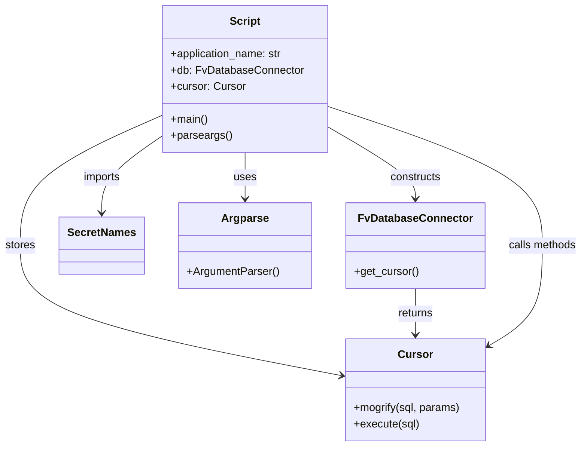

# Diagram: entity_core/entity_service/entity_service_scripts/fix_ultimate_destinations.py


> Auto-generated by Obscura crawlers

## Diagram 1

```mermaid
flowchart TD
    ENTRY["__name__ == \"__main__\"\\n(main())"] --> INIT_DB["db = FvDatabaseConnector(application_name, SecretNames.ENTITY_DATABASE)"]
    INIT_DB --> GET_CURSOR["cursor = db.get_cursor()"]
    ENTRY --> PARSE["parseargs()"]
    PARSE --> ASSIGN["vins = args.vins\\nsolution_id = args.solution_id"]
    ASSIGN --> LOOP["for vin in vins"]
    GET_CURSOR --> LOOP
    LOOP --> MOGRIFY["sql = cursor.mogrify(SQL, {external_id: vin, solution_id: solution_id})"]
    MOGRIFY --> EXECUTE["cursor.execute(sql)"]
    EXECUTE --> LOOP
    LOOP --> END["script end"]
```

> SVG rendering failed for this diagram.

## Diagram 2



### SVG

<svg id="container" width="839.8515625" xmlns="http://www.w3.org/2000/svg" class="classDiagram" height="656" viewBox="0 0 839.8515625 656" role="graphics-document document" aria-roledescription="class"><style>#container{font-family:"trebuchet ms",verdana,arial,sans-serif;font-size:16px;fill:#333;}@keyframes edge-animation-frame{from{stroke-dashoffset:0;}}@keyframes dash{to{stroke-dashoffset:0;}}#container .edge-animation-slow{stroke-dasharray:9,5!important;stroke-dashoffset:900;animation:dash 50s linear infinite;stroke-linecap:round;}#container .edge-animation-fast{stroke-dasharray:9,5!important;stroke-dashoffset:900;animation:dash 20s linear infinite;stroke-linecap:round;}#container .error-icon{fill:#552222;}#container .error-text{fill:#552222;stroke:#552222;}#container .edge-thickness-normal{stroke-width:1px;}#container .edge-thickness-thick{stroke-width:3.5px;}#container .edge-pattern-solid{stroke-dasharray:0;}#container .edge-thickness-invisible{stroke-width:0;fill:none;}#container .edge-pattern-dashed{stroke-dasharray:3;}#container .edge-pattern-dotted{stroke-dasharray:2;}#container .marker{fill:#333333;stroke:#333333;}#container .marker.cross{stroke:#333333;}#container svg{font-family:"trebuchet ms",verdana,arial,sans-serif;font-size:16px;}#container p{margin:0;}#container g.classGroup text{fill:#9370DB;stroke:none;font-family:"trebuchet ms",verdana,arial,sans-serif;font-size:10px;}#container g.classGroup text .title{font-weight:bolder;}#container .nodeLabel,#container .edgeLabel{color:#131300;}#container .edgeLabel .label rect{fill:#ECECFF;}#container .label text{fill:#131300;}#container .labelBkg{background:#ECECFF;}#container .edgeLabel .label span{background:#ECECFF;}#container .classTitle{font-weight:bolder;}#container .node rect,#container .node circle,#container .node ellipse,#container .node polygon,#container .node path{fill:#ECECFF;stroke:#9370DB;stroke-width:1px;}#container .divider{stroke:#9370DB;stroke-width:1;}#container g.clickable{cursor:pointer;}#container g.classGroup rect{fill:#ECECFF;stroke:#9370DB;}#container g.classGroup line{stroke:#9370DB;stroke-width:1;}#container .classLabel .box{stroke:none;stroke-width:0;fill:#ECECFF;opacity:0.5;}#container .classLabel .label{fill:#9370DB;font-size:10px;}#container .relation{stroke:#333333;stroke-width:1;fill:none;}#container .dashed-line{stroke-dasharray:3;}#container .dotted-line{stroke-dasharray:1 2;}#container #compositionStart,#container .composition{fill:#333333!important;stroke:#333333!important;stroke-width:1;}#container #compositionEnd,#container .composition{fill:#333333!important;stroke:#333333!important;stroke-width:1;}#container #dependencyStart,#container .dependency{fill:#333333!important;stroke:#333333!important;stroke-width:1;}#container #dependencyStart,#container .dependency{fill:#333333!important;stroke:#333333!important;stroke-width:1;}#container #extensionStart,#container .extension{fill:transparent!important;stroke:#333333!important;stroke-width:1;}#container #extensionEnd,#container .extension{fill:transparent!important;stroke:#333333!important;stroke-width:1;}#container #aggregationStart,#container .aggregation{fill:transparent!important;stroke:#333333!important;stroke-width:1;}#container #aggregationEnd,#container .aggregation{fill:transparent!important;stroke:#333333!important;stroke-width:1;}#container #lollipopStart,#container .lollipop{fill:#ECECFF!important;stroke:#333333!important;stroke-width:1;}#container #lollipopEnd,#container .lollipop{fill:#ECECFF!important;stroke:#333333!important;stroke-width:1;}#container .edgeTerminals{font-size:11px;line-height:initial;}#container .classTitleText{text-anchor:middle;font-size:18px;fill:#333;}#container .label-icon{display:inline-block;height:1em;overflow:visible;vertical-align:-0.125em;}#container .node .label-icon path{fill:currentColor;stroke:revert;stroke-width:revert;}#container :root{--mermaid-font-family:"trebuchet ms",verdana,arial,sans-serif;}</style><g><defs><marker id="container_class-aggregationStart" class="marker aggregation class" refX="18" refY="7" markerWidth="190" markerHeight="240" orient="auto"><path d="M 18,7 L9,13 L1,7 L9,1 Z"></path></marker></defs><defs><marker id="container_class-aggregationEnd" class="marker aggregation class" refX="1" refY="7" markerWidth="20" markerHeight="28" orient="auto"><path d="M 18,7 L9,13 L1,7 L9,1 Z"></path></marker></defs><defs><marker id="container_class-extensionStart" class="marker extension class" refX="18" refY="7" markerWidth="190" markerHeight="240" orient="auto"><path d="M 1,7 L18,13 V 1 Z"></path></marker></defs><defs><marker id="container_class-extensionEnd" class="marker extension class" refX="1" refY="7" markerWidth="20" markerHeight="28" orient="auto"><path d="M 1,1 V 13 L18,7 Z"></path></marker></defs><defs><marker id="container_class-compositionStart" class="marker composition class" refX="18" refY="7" markerWidth="190" markerHeight="240" orient="auto"><path d="M 18,7 L9,13 L1,7 L9,1 Z"></path></marker></defs><defs><marker id="container_class-compositionEnd" class="marker composition class" refX="1" refY="7" markerWidth="20" markerHeight="28" orient="auto"><path d="M 18,7 L9,13 L1,7 L9,1 Z"></path></marker></defs><defs><marker id="container_class-dependencyStart" class="marker dependency class" refX="6" refY="7" markerWidth="190" markerHeight="240" orient="auto"><path d="M 5,7 L9,13 L1,7 L9,1 Z"></path></marker></defs><defs><marker id="container_class-dependencyEnd" class="marker dependency class" refX="13" refY="7" markerWidth="20" markerHeight="28" orient="auto"><path d="M 18,7 L9,13 L14,7 L9,1 Z"></path></marker></defs><defs><marker id="container_class-lollipopStart" class="marker lollipop class" refX="13" refY="7" markerWidth="190" markerHeight="240" orient="auto"><circle stroke="black" fill="transparent" cx="7" cy="7" r="6"></circle></marker></defs><defs><marker id="container_class-lollipopEnd" class="marker lollipop class" refX="1" refY="7" markerWidth="190" markerHeight="240" orient="auto"><circle stroke="black" fill="transparent" cx="7" cy="7" r="6"></circle></marker></defs><g class="root"><g class="clusters"></g><g class="edgePaths"><path d="M471.316,186.507L492.228,198.922C513.139,211.338,554.962,236.169,575.874,253.751C596.785,271.333,596.785,281.667,596.785,286.833L596.785,292" id="id_Script_FvDatabaseConnector_1" class="edge-thickness-normal edge-pattern-solid relation" style=";;;" data-edge="true" data-et="edge" data-id="id_Script_FvDatabaseConnector_1" data-points="W3sieCI6NDcxLjMxNjQwNjI1LCJ5IjoxODYuNTA2NjI5NzcyMzk2NDh9LHsieCI6NTk2Ljc4NTE1NjI1LCJ5IjoyNjF9LHsieCI6NTk2Ljc4NTE1NjI1LCJ5IjoyOTh9XQ==" marker-end="url(#container_class-dependencyEnd)"></path><path d="M233.809,169.404L199.861,184.67C165.914,199.936,98.02,230.468,64.072,262.401C30.125,294.333,30.125,327.667,30.125,361C30.125,394.333,30.125,427.667,106.505,459.43C182.886,491.193,335.646,521.386,412.027,536.483L488.407,551.579" id="id_Script_Cursor_2" class="edge-thickness-normal edge-pattern-solid relation" style=";;;" data-edge="true" data-et="edge" data-id="id_Script_Cursor_2" data-points="W3sieCI6MjMzLjgwODU5Mzc1LCJ5IjoxNjkuNDAzNTc4Njk3NDIxOTh9LHsieCI6MzAuMTI1LCJ5IjoyNjF9LHsieCI6MzAuMTI1LCJ5IjozNjF9LHsieCI6MzAuMTI1LCJ5Ijo0NjF9LHsieCI6NDk0LjI5Mjk2ODc1LCJ5Ijo1NTIuNzQyNDg3ODUwMjc0fV0=" marker-end="url(#container_class-dependencyEnd)"></path><path d="M233.809,199.882L219.387,210.068C204.966,220.254,176.124,240.627,161.702,259.48C147.281,278.333,147.281,295.667,147.281,304.333L147.281,313" id="id_Script_SecretNames_3" class="edge-thickness-normal edge-pattern-solid relation" style=";;;" data-edge="true" data-et="edge" data-id="id_Script_SecretNames_3" data-points="W3sieCI6MjMzLjgwODU5Mzc1LCJ5IjoxOTkuODgxNTgzOTU0OTM5ODZ9LHsieCI6MTQ3LjI4MTI1LCJ5IjoyNjF9LHsieCI6MTQ3LjI4MTI1LCJ5IjozMTl9XQ==" marker-end="url(#container_class-dependencyEnd)"></path><path d="M352.563,224L352.563,230.167C352.563,236.333,352.563,248.667,352.563,260C352.563,271.333,352.563,281.667,352.563,286.833L352.563,292" id="id_Script_Argparse_4" class="edge-thickness-normal edge-pattern-solid relation" style=";;;" data-edge="true" data-et="edge" data-id="id_Script_Argparse_4" data-points="W3sieCI6MzUyLjU2MjUsInkiOjIyNH0seyJ4IjozNTIuNTYyNSwieSI6MjYxfSx7IngiOjM1Mi41NjI1LCJ5IjoyOTh9XQ==" marker-end="url(#container_class-dependencyEnd)"></path><path d="M596.785,424L596.785,430.167C596.785,436.333,596.785,448.667,596.785,460C596.785,471.333,596.785,481.667,596.785,486.833L596.785,492" id="id_FvDatabaseConnector_Cursor_5" class="edge-thickness-normal edge-pattern-solid relation" style=";;;" data-edge="true" data-et="edge" data-id="id_FvDatabaseConnector_Cursor_5" data-points="W3sieCI6NTk2Ljc4NTE1NjI1LCJ5Ijo0MjR9LHsieCI6NTk2Ljc4NTE1NjI1LCJ5Ijo0NjF9LHsieCI6NTk2Ljc4NTE1NjI1LCJ5Ijo0OTh9XQ==" marker-end="url(#container_class-dependencyEnd)"></path><path d="M471.316,156.162L522.981,173.635C574.646,191.108,677.975,226.054,729.64,260.194C781.305,294.333,781.305,327.667,781.305,361C781.305,394.333,781.305,427.667,768.488,452.113C755.672,476.559,730.039,492.117,717.223,499.897L704.406,507.676" id="id_Script_Cursor_6" class="edge-thickness-normal edge-pattern-solid relation" style=";;;" data-edge="true" data-et="edge" data-id="id_Script_Cursor_6" data-points="W3sieCI6NDcxLjMxNjQwNjI1LCJ5IjoxNTYuMTYyNDAyNzQwNTc0NzJ9LHsieCI6NzgxLjMwNDY4NzUsInkiOjI2MX0seyJ4Ijo3ODEuMzA0Njg3NSwieSI6MzYxfSx7IngiOjc4MS4zMDQ2ODc1LCJ5Ijo0NjF9LHsieCI6Njk5LjI3NzM0Mzc1LCJ5Ijo1MTAuNzg5MTA1OTk3NDE3Mjd9XQ==" marker-end="url(#container_class-dependencyEnd)"></path></g><g class="edgeLabels"><g class="edgeLabel" transform="translate(596.78515625, 261)"><g class="label" data-id="id_Script_FvDatabaseConnector_1" transform="translate(-37.84375, -12)"><foreignObject width="75.6875" height="24"><div xmlns="http://www.w3.org/1999/xhtml" class="labelBkg" style="display: table-cell; white-space: nowrap; line-height: 1.5; max-width: 200px; text-align: center;"><span class="edgeLabel"><p>constructs</p></span></div></foreignObject></g></g><g class="edgeLabel" transform="translate(30.125, 361)"><g class="label" data-id="id_Script_Cursor_2" transform="translate(-22.125, -12)"><foreignObject width="44.25" height="24"><div xmlns="http://www.w3.org/1999/xhtml" class="labelBkg" style="display: table-cell; white-space: nowrap; line-height: 1.5; max-width: 200px; text-align: center;"><span class="edgeLabel"><p>stores</p></span></div></foreignObject></g></g><g class="edgeLabel" transform="translate(147.28125, 261)"><g class="label" data-id="id_Script_SecretNames_3" transform="translate(-28.25, -12)"><foreignObject width="56.5" height="24"><div xmlns="http://www.w3.org/1999/xhtml" class="labelBkg" style="display: table-cell; white-space: nowrap; line-height: 1.5; max-width: 200px; text-align: center;"><span class="edgeLabel"><p>imports</p></span></div></foreignObject></g></g><g class="edgeLabel" transform="translate(352.5625, 261)"><g class="label" data-id="id_Script_Argparse_4" transform="translate(-16.4921875, -12)"><foreignObject width="32.984375" height="24"><div xmlns="http://www.w3.org/1999/xhtml" class="labelBkg" style="display: table-cell; white-space: nowrap; line-height: 1.5; max-width: 200px; text-align: center;"><span class="edgeLabel"><p>uses</p></span></div></foreignObject></g></g><g class="edgeLabel" transform="translate(596.78515625, 461)"><g class="label" data-id="id_FvDatabaseConnector_Cursor_5" transform="translate(-26.265625, -12)"><foreignObject width="52.53125" height="24"><div xmlns="http://www.w3.org/1999/xhtml" class="labelBkg" style="display: table-cell; white-space: nowrap; line-height: 1.5; max-width: 200px; text-align: center;"><span class="edgeLabel"><p>returns</p></span></div></foreignObject></g></g><g class="edgeLabel" transform="translate(781.3046875, 361)"><g class="label" data-id="id_Script_Cursor_6" transform="translate(-50.546875, -12)"><foreignObject width="101.09375" height="24"><div xmlns="http://www.w3.org/1999/xhtml" class="labelBkg" style="display: table-cell; white-space: nowrap; line-height: 1.5; max-width: 200px; text-align: center;"><span class="edgeLabel"><p>calls methods</p></span></div></foreignObject></g></g></g><g class="nodes"><g class="node default" id="classId-Script-0" transform="translate(352.5625, 116)"><g class="basic label-container"><path d="M-118.75390625 -108 L118.75390625 -108 L118.75390625 108 L-118.75390625 108" stroke="none" stroke-width="0" fill="#ECECFF" style=""></path><path d="M-118.75390625 -108 C-59.93502766626249 -108, -1.1161490825249842 -108, 118.75390625 -108 M-118.75390625 -108 C-50.07556731888586 -108, 18.60277161222828 -108, 118.75390625 -108 M118.75390625 -108 C118.75390625 -46.013423896688025, 118.75390625 15.97315220662395, 118.75390625 108 M118.75390625 -108 C118.75390625 -37.52088416004018, 118.75390625 32.958231679919635, 118.75390625 108 M118.75390625 108 C60.94857225213656 108, 3.1432382542731148 108, -118.75390625 108 M118.75390625 108 C24.401968354881618 108, -69.94996954023676 108, -118.75390625 108 M-118.75390625 108 C-118.75390625 23.60191282019845, -118.75390625 -60.7961743596031, -118.75390625 -108 M-118.75390625 108 C-118.75390625 37.06544988350316, -118.75390625 -33.869100232993674, -118.75390625 -108" stroke="#9370DB" stroke-width="1.3" fill="none" stroke-dasharray="0 0" style=""></path></g><g class="annotation-group text" transform="translate(0, -84)"></g><g class="label-group text" transform="translate(-21.7421875, -84)"><g class="label" style="font-weight: bolder" transform="translate(0,-12)"><foreignObject width="43.484375" height="24"><div xmlns="http://www.w3.org/1999/xhtml" style="display: table-cell; white-space: nowrap; line-height: 1.5; max-width: 93px; text-align: center;"><span class="nodeLabel markdown-node-label" style=""><p>Script</p></span></div></foreignObject></g></g><g class="members-group text" transform="translate(-106.75390625, -36)"><g class="label" style="" transform="translate(0,-12)"><foreignObject width="166.203125" height="24"><div xmlns="http://www.w3.org/1999/xhtml" style="display: table-cell; white-space: nowrap; line-height: 1.5; max-width: 224px; text-align: center;"><span class="nodeLabel markdown-node-label" style=""><p>+application_name: str</p></span></div></foreignObject></g><g class="label" style="" transform="translate(0,12)"><foreignObject width="191.765625" height="24"><div xmlns="http://www.w3.org/1999/xhtml" style="display: table-cell; white-space: nowrap; line-height: 1.5; max-width: 250px; text-align: center;"><span class="nodeLabel markdown-node-label" style=""><p>+db: FvDatabaseConnector</p></span></div></foreignObject></g><g class="label" style="" transform="translate(0,36)"><foreignObject width="108.890625" height="24"><div xmlns="http://www.w3.org/1999/xhtml" style="display: table-cell; white-space: nowrap; line-height: 1.5; max-width: 167px; text-align: center;"><span class="nodeLabel markdown-node-label" style=""><p>+cursor: Cursor</p></span></div></foreignObject></g></g><g class="methods-group text" transform="translate(-106.75390625, 60)"><g class="label" style="" transform="translate(0,-12)"><foreignObject width="54.65625" height="24"><div xmlns="http://www.w3.org/1999/xhtml" style="display: table-cell; white-space: nowrap; line-height: 1.5; max-width: 112px; text-align: center;"><span class="nodeLabel markdown-node-label" style=""><p>+main()</p></span></div></foreignObject></g><g class="label" style="" transform="translate(0,12)"><foreignObject width="88.703125" height="24"><div xmlns="http://www.w3.org/1999/xhtml" style="display: table-cell; white-space: nowrap; line-height: 1.5; max-width: 146px; text-align: center;"><span class="nodeLabel markdown-node-label" style=""><p>+parseargs()</p></span></div></foreignObject></g></g><g class="divider" style=""><path d="M-118.75390625 -60 C-28.74877072326605 -60, 61.2563648034679 -60, 118.75390625 -60 M-118.75390625 -60 C-51.62039006160914 -60, 15.513126126781714 -60, 118.75390625 -60" stroke="#9370DB" stroke-width="1.3" fill="none" stroke-dasharray="0 0" style=""></path></g><g class="divider" style=""><path d="M-118.75390625 36 C-65.62912258587474 36, -12.504338921749493 36, 118.75390625 36 M-118.75390625 36 C-44.341495900826246 36, 30.07091444834751 36, 118.75390625 36" stroke="#9370DB" stroke-width="1.3" fill="none" stroke-dasharray="0 0" style=""></path></g></g><g class="node default" id="classId-FvDatabaseConnector-1" transform="translate(596.78515625, 361)"><g class="basic label-container"><path d="M-98.97265625 -63 L98.97265625 -63 L98.97265625 63 L-98.97265625 63" stroke="none" stroke-width="0" fill="#ECECFF" style=""></path><path d="M-98.97265625 -63 C-43.68359862668402 -63, 11.605458996631967 -63, 98.97265625 -63 M-98.97265625 -63 C-24.83338616347035 -63, 49.3058839230593 -63, 98.97265625 -63 M98.97265625 -63 C98.97265625 -15.082511506485325, 98.97265625 32.83497698702935, 98.97265625 63 M98.97265625 -63 C98.97265625 -32.29701069999745, 98.97265625 -1.594021399994901, 98.97265625 63 M98.97265625 63 C23.637072792940742 63, -51.698510664118515 63, -98.97265625 63 M98.97265625 63 C31.144980416341127 63, -36.682695417317746 63, -98.97265625 63 M-98.97265625 63 C-98.97265625 31.40088741209439, -98.97265625 -0.198225175811217, -98.97265625 -63 M-98.97265625 63 C-98.97265625 21.281567911103316, -98.97265625 -20.436864177793368, -98.97265625 -63" stroke="#9370DB" stroke-width="1.3" fill="none" stroke-dasharray="0 0" style=""></path></g><g class="annotation-group text" transform="translate(0, -39)"></g><g class="label-group text" transform="translate(-79.3046875, -39)"><g class="label" style="font-weight: bolder" transform="translate(0,-12)"><foreignObject width="158.609375" height="24"><div xmlns="http://www.w3.org/1999/xhtml" style="display: table-cell; white-space: nowrap; line-height: 1.5; max-width: 207px; text-align: center;"><span class="nodeLabel markdown-node-label" style=""><p>FvDatabaseConnector</p></span></div></foreignObject></g></g><g class="members-group text" transform="translate(-86.97265625, 9)"></g><g class="methods-group text" transform="translate(-86.97265625, 39)"><g class="label" style="" transform="translate(0,-12)"><foreignObject width="94.640625" height="24"><div xmlns="http://www.w3.org/1999/xhtml" style="display: table-cell; white-space: nowrap; line-height: 1.5; max-width: 152px; text-align: center;"><span class="nodeLabel markdown-node-label" style=""><p>+get_cursor()</p></span></div></foreignObject></g></g><g class="divider" style=""><path d="M-98.97265625 -15 C-46.74124864704124 -15, 5.490158955917522 -15, 98.97265625 -15 M-98.97265625 -15 C-26.887558818408124 -15, 45.19753861318375 -15, 98.97265625 -15" stroke="#9370DB" stroke-width="1.3" fill="none" stroke-dasharray="0 0" style=""></path></g><g class="divider" style=""><path d="M-98.97265625 9 C-59.03447344915711 9, -19.096290648314223 9, 98.97265625 9 M-98.97265625 9 C-28.7588007340604 9, 41.4550547818792 9, 98.97265625 9" stroke="#9370DB" stroke-width="1.3" fill="none" stroke-dasharray="0 0" style=""></path></g></g><g class="node default" id="classId-Cursor-2" transform="translate(596.78515625, 573)"><g class="basic label-container"><path d="M-102.4921875 -75 L102.4921875 -75 L102.4921875 75 L-102.4921875 75" stroke="none" stroke-width="0" fill="#ECECFF" style=""></path><path d="M-102.4921875 -75 C-26.991422557223302 -75, 48.509342385553396 -75, 102.4921875 -75 M-102.4921875 -75 C-26.231615226104026 -75, 50.02895704779195 -75, 102.4921875 -75 M102.4921875 -75 C102.4921875 -33.19438234769264, 102.4921875 8.611235304614723, 102.4921875 75 M102.4921875 -75 C102.4921875 -21.507107387406457, 102.4921875 31.985785225187087, 102.4921875 75 M102.4921875 75 C49.83637256042554 75, -2.8194423791489243 75, -102.4921875 75 M102.4921875 75 C60.98345651725921 75, 19.474725534518413 75, -102.4921875 75 M-102.4921875 75 C-102.4921875 31.33021633795486, -102.4921875 -12.339567324090282, -102.4921875 -75 M-102.4921875 75 C-102.4921875 37.66613300700062, -102.4921875 0.33226601400123457, -102.4921875 -75" stroke="#9370DB" stroke-width="1.3" fill="none" stroke-dasharray="0 0" style=""></path></g><g class="annotation-group text" transform="translate(0, -51)"></g><g class="label-group text" transform="translate(-23.90625, -51)"><g class="label" style="font-weight: bolder" transform="translate(0,-12)"><foreignObject width="47.8125" height="24"><div xmlns="http://www.w3.org/1999/xhtml" style="display: table-cell; white-space: nowrap; line-height: 1.5; max-width: 98px; text-align: center;"><span class="nodeLabel markdown-node-label" style=""><p>Cursor</p></span></div></foreignObject></g></g><g class="members-group text" transform="translate(-90.4921875, -3)"></g><g class="methods-group text" transform="translate(-90.4921875, 27)"><g class="label" style="" transform="translate(0,-12)"><foreignObject width="157.078125" height="24"><div xmlns="http://www.w3.org/1999/xhtml" style="display: table-cell; white-space: nowrap; line-height: 1.5; max-width: 214px; text-align: center;"><span class="nodeLabel markdown-node-label" style=""><p>+mogrify(sql, params)</p></span></div></foreignObject></g><g class="label" style="" transform="translate(0,12)"><foreignObject width="96.0625" height="24"><div xmlns="http://www.w3.org/1999/xhtml" style="display: table-cell; white-space: nowrap; line-height: 1.5; max-width: 153px; text-align: center;"><span class="nodeLabel markdown-node-label" style=""><p>+execute(sql)</p></span></div></foreignObject></g></g><g class="divider" style=""><path d="M-102.4921875 -27 C-36.03154684344737 -27, 30.429093813105254 -27, 102.4921875 -27 M-102.4921875 -27 C-25.50694535834576 -27, 51.47829678330848 -27, 102.4921875 -27" stroke="#9370DB" stroke-width="1.3" fill="none" stroke-dasharray="0 0" style=""></path></g><g class="divider" style=""><path d="M-102.4921875 -3 C-55.75989163943756 -3, -9.027595778875124 -3, 102.4921875 -3 M-102.4921875 -3 C-22.674971260338495 -3, 57.14224497932301 -3, 102.4921875 -3" stroke="#9370DB" stroke-width="1.3" fill="none" stroke-dasharray="0 0" style=""></path></g></g><g class="node default" id="classId-SecretNames-3" transform="translate(147.28125, 361)"><g class="basic label-container"><path d="M-60.03125 -42 L60.03125 -42 L60.03125 42 L-60.03125 42" stroke="none" stroke-width="0" fill="#ECECFF" style=""></path><path d="M-60.03125 -42 C-31.441667672189922 -42, -2.8520853443798444 -42, 60.03125 -42 M-60.03125 -42 C-29.806545345800284 -42, 0.4181593083994315 -42, 60.03125 -42 M60.03125 -42 C60.03125 -17.599629885509678, 60.03125 6.800740228980644, 60.03125 42 M60.03125 -42 C60.03125 -21.08511217820136, 60.03125 -0.17022435640271993, 60.03125 42 M60.03125 42 C13.498442475613842 42, -33.034365048772315 42, -60.03125 42 M60.03125 42 C35.792415194807255 42, 11.55358038961451 42, -60.03125 42 M-60.03125 42 C-60.03125 10.656769354450347, -60.03125 -20.686461291099306, -60.03125 -42 M-60.03125 42 C-60.03125 17.830821733765788, -60.03125 -6.338356532468424, -60.03125 -42" stroke="#9370DB" stroke-width="1.3" fill="none" stroke-dasharray="0 0" style=""></path></g><g class="annotation-group text" transform="translate(0, -18)"></g><g class="label-group text" transform="translate(-48.03125, -18)"><g class="label" style="font-weight: bolder" transform="translate(0,-12)"><foreignObject width="96.0625" height="24"><div xmlns="http://www.w3.org/1999/xhtml" style="display: table-cell; white-space: nowrap; line-height: 1.5; max-width: 145px; text-align: center;"><span class="nodeLabel markdown-node-label" style=""><p>SecretNames</p></span></div></foreignObject></g></g><g class="members-group text" transform="translate(-48.03125, 30)"></g><g class="methods-group text" transform="translate(-48.03125, 60)"></g><g class="divider" style=""><path d="M-60.03125 6 C-33.108199300556024 6, -6.185148601112054 6, 60.03125 6 M-60.03125 6 C-24.63903575218923 6, 10.75317849562154 6, 60.03125 6" stroke="#9370DB" stroke-width="1.3" fill="none" stroke-dasharray="0 0" style=""></path></g><g class="divider" style=""><path d="M-60.03125 24 C-19.89951050714693 24, 20.232228985706143 24, 60.03125 24 M-60.03125 24 C-18.634630022479264 24, 22.76198995504147 24, 60.03125 24" stroke="#9370DB" stroke-width="1.3" fill="none" stroke-dasharray="0 0" style=""></path></g></g><g class="node default" id="classId-Argparse-4" transform="translate(352.5625, 361)"><g class="basic label-container"><path d="M-95.25 -63 L95.25 -63 L95.25 63 L-95.25 63" stroke="none" stroke-width="0" fill="#ECECFF" style=""></path><path d="M-95.25 -63 C-47.32445727614566 -63, 0.6010854477086838 -63, 95.25 -63 M-95.25 -63 C-36.46450293787074 -63, 22.32099412425852 -63, 95.25 -63 M95.25 -63 C95.25 -33.371808389994854, 95.25 -3.743616779989715, 95.25 63 M95.25 -63 C95.25 -14.502280204295403, 95.25 33.995439591409195, 95.25 63 M95.25 63 C54.46772811856042 63, 13.685456237120846 63, -95.25 63 M95.25 63 C34.27628816581083 63, -26.697423668378335 63, -95.25 63 M-95.25 63 C-95.25 24.50885736201225, -95.25 -13.9822852759755, -95.25 -63 M-95.25 63 C-95.25 20.45637067787291, -95.25 -22.087258644254177, -95.25 -63" stroke="#9370DB" stroke-width="1.3" fill="none" stroke-dasharray="0 0" style=""></path></g><g class="annotation-group text" transform="translate(0, -39)"></g><g class="label-group text" transform="translate(-32.71875, -39)"><g class="label" style="font-weight: bolder" transform="translate(0,-12)"><foreignObject width="65.4375" height="24"><div xmlns="http://www.w3.org/1999/xhtml" style="display: table-cell; white-space: nowrap; line-height: 1.5; max-width: 114px; text-align: center;"><span class="nodeLabel markdown-node-label" style=""><p>Argparse</p></span></div></foreignObject></g></g><g class="members-group text" transform="translate(-83.25, 9)"></g><g class="methods-group text" transform="translate(-83.25, 39)"><g class="label" style="" transform="translate(0,-12)"><foreignObject width="133.78125" height="24"><div xmlns="http://www.w3.org/1999/xhtml" style="display: table-cell; white-space: nowrap; line-height: 1.5; max-width: 191px; text-align: center;"><span class="nodeLabel markdown-node-label" style=""><p>+ArgumentParser()</p></span></div></foreignObject></g></g><g class="divider" style=""><path d="M-95.25 -15 C-51.36855409074566 -15, -7.4871081814913225 -15, 95.25 -15 M-95.25 -15 C-19.33095754323304 -15, 56.58808491353392 -15, 95.25 -15" stroke="#9370DB" stroke-width="1.3" fill="none" stroke-dasharray="0 0" style=""></path></g><g class="divider" style=""><path d="M-95.25 9 C-29.942624209708214 9, 35.36475158058357 9, 95.25 9 M-95.25 9 C-25.909087324435518 9, 43.431825351128964 9, 95.25 9" stroke="#9370DB" stroke-width="1.3" fill="none" stroke-dasharray="0 0" style=""></path></g></g></g></g></g></svg>
